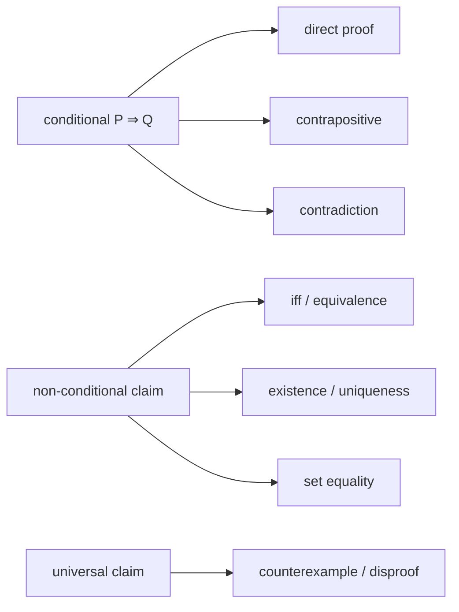

# Book of Proof：证明与反证方法

> [!abstract] 来源定位
> Richard Hammack 的 *Book of Proof* 第4—9章把conditional statement的直接证明、分类、逆否、反证，与iff、存在、唯一性、集合相等和反例组织为一条连续的入门路线。它承担MATH-03的标准proof-writing骨架；AI theorem的随机性、数据依赖、数值边界与经验—理论分层由本库另行补充。

## 纳入判定

- 范围角色：`core`；
- 年代角色：`foundational`；
- 判定理由：覆盖MATH-03需要的全部基本statement shapes与proof methods，并明确区分proof、disproof、constructive/non-constructive existence；作者页面提供稳定目录、免费PDF和修订说明。

## 元数据

- 作者主页：[Book of Proof](https://richardhammack.github.io/BookOfProof/index.html)
- 免费PDF：[Main.pdf](https://richardhammack.github.io/BookOfProof/Main.pdf)
- 版本：Edition 3.4，作者页面标注2025-02-05修订；
- 相关章节：Chapter 4 Direct Proof；5 Contrapositive Proof；6 Proof by Contradiction；7 Non-Conditional Statements；8 Proofs Involving Sets；9 Disproof；
- 许可：作者页面标注Creative Commons BY-NC-ND 4.0；本库仅保存独立摘要、重新组织的教学结构和自行构造的例子。

## 结构摘要

## 核心断言

| ID | 断言 | 类型 | 证据位置 | 当前用途 |
|---|---|---|---|---|
| H1 | Direct proof从assumption $P$出发，经definitions与已知结果到达$Q$ | 教材方法 | Chapter 4 | implication proof anatomy |
| H2 | Contrapositive proof利用$P\Rightarrow Q\equiv\neg Q\Rightarrow\neg P$ | 教材方法 | Chapter 5 | 选择更可操作的起点 |
| H3 | Contradiction从目标的否定出发导出不可能结论 | 教材方法 | Chapter 6 | 非条件命题与混合策略 |
| H4 | Iff需要两个方向；existence and uniqueness需要存在与at-most-one两项 | proof obligation | Chapter 7 | obligation decomposition |
| H5 | Set equality可由双向包含证明 | 教材方法 | Chapter 8 | equality proof template |
| H6 | 一个合法counterexample足以否定universal statement | disproof method | Chapter 9 | 反例与有限测试边界 |

## 本库采用的教学动作

1. 先把statement变成proof obligations，再选择method；
2. 每次引入任意对象时说明它满足哪些assumptions；
3. 每次构造witness时检查type、domain与目标predicate；
4. Iff、equality、unique existence逐项打勾，不用一句“类似可得”吞掉方向；
5. Cases只要求覆盖全部可能，disjointness不是逻辑必需条件；
6. Counterexample必须满足原domain与其余hypotheses；
7. 结尾重述精确claim，避免证明了邻近但不同的statement。

## 限制与课程补严

- 教材主要用整数、集合与初等分析例子；本库增加optimization、randomized theorem、generalization与AI experiment reporting；
- Propositional validity不能替代first-order、analytic或probabilistic theorem的实质性证明；
- “某假设在一份proof中被使用”只说明该proof依赖它，不自动证明它对结论逻辑上必要；
- Non-constructive existence可能不给可执行算法、复杂度或数值稳定性；
- Proof by computation只在被穷举的finite domain上闭合，不能无说明外推到无限对象。

## 需要生成或更新的节点

- [x] 概念：[[必要条件、充分条件与证明方法]]
- [ ] 概念：[[数学归纳、递归与组合计数]]
- [ ] 卷末证明能力累计测验

## 版权与引用边界

本卡不复制教材例题或长段文字。正文的AI例子、图示、题目与实验均由本库独立构造；若未来需要逐字引用，回到作者PDF核对版本、页码与许可。
