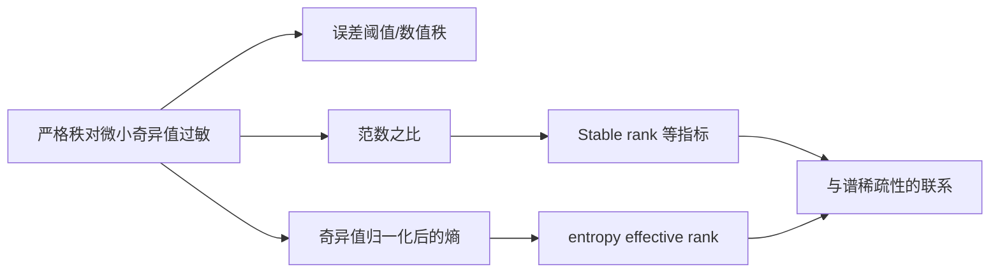

# 矩阵的有效秩（Effective Rank）

> [!abstract] 来源定位
> 文章系统比较误差截断、范数比、Stable rank、谱熵和稀疏性指标等“近似维数”构造。最重要的结论不是选出唯一公式，而是指出“有效秩”是一个需按用途声明定义的家族。

## 纳入判定

- 范围角色：`bridge`
- 年代角色：`active-research`
- 判定理由：有效秩直接用于表示坍缩、Attention 秩、低秩适配和模型压缩诊断。
- 核心调用者：Attention 表达能力、LoRA、训练稳定性和表示分析。

## 元数据

- 正式引用：苏剑林，2025-04-10，《矩阵的有效秩（Effective Rank）》。
- 原始页面：[https://spaces.ac.cn/archives/10847](https://spaces.ac.cn/archives/10847)
- 关键原始来源：Roy & Vetterli, EUSIPCO 2007。

## 结构摘要

## 核心断言

| ID | 断言 | 类型 | 假设/证据边界 | 当前判断 |
|---|---|---|---|---|
| C1 | 严格秩对非零微小奇异值不连续 | 数学事实 | 精确算术与数值容差需区分 | 已核验 |
| C2 | 学术文献中“有效秩”没有唯一公式 | 文献判断 | 必须按具体领域和来源核查 | 已核验 |
| C3 | $\|\boldsymbol{A}\|_F^2/\|\boldsymbol{A}\|_2^2$ 是 Stable rank | 定义 | 零矩阵需单独约定 | 已核验 |
| C4 | 归一化奇异值熵的指数给出 Roy–Vetterli effective rank | 定义 | 使用 $p_i=\sigma_i/\sum_j\sigma_j$ | 已核验 |
| C5 | 多种有效秩可视为奇异值向量的稀疏/集中度量 | 统一视角 | 不同指标对谱尾敏感度不同 | 已核验并拆分比较 |
| C6 | 某些有效秩具有类似严格秩的不等式 | 定理线索 | 文章也明确部分推广尚不清楚 | 暂不纳入稳定结论 |

## 值得保留的方法

文章将“奇异值 → 归一化分布 → 熵/集中度 → 有效数量”的路线讲得很清楚，并把它与此前的稀疏性指标连接起来。这适合转化为指标对比表和数值实验，而不是只保留一个定义。

## 限制与保留意见

- 任何有效秩数值都必须同时写公式、阈值、归一化和计算对象。
- 不同定义可能对同一谱给出明显不同的数值，不能混合比较。
- 零矩阵会使范数比和谱概率出现 $0/0$。
- 有效秩是描述性统计量；它与下游性能的相关性不自动成为因果解释。
- 评论区和文中尚未解决的推广问题只进入开放问题，不写成定理。

## 已生成节点

- [x] [[有效秩]]
- [x] [[矩阵范数]]
- [x] [[奇异值分解]]
- [x] [[实验 - 不同奇异值谱下的有效秩比较]]
- [x] [[Attention 矩阵的秩、瓶颈与有效秩]]

## 交叉验证

- Olivier Roy & Martin Vetterli, [The Effective Rank: A Measure of Effective Dimensionality](https://doi.org/10.5281/zenodo.40328), EUSIPCO 2007。
- 相关范数性质回到 Leon Mirsky, [Symmetric Gauge Functions and Unitarily Invariant Norms](https://doi.org/10.1093/qmath/11.1.50), 1960。
