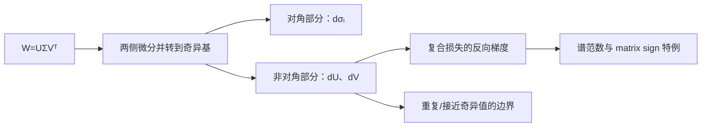

# SVD的导数

> [!abstract] 来源定位
> 文章从 SVD 恒等式的微分出发，推导奇异值、左右奇异向量以及复合损失关于原矩阵的梯度，并连接谱范数梯度与矩阵符号函数。它最有价值的桥接作用，是把“谱间隙控制方向稳定性”落到可微程序的分母上；正式的扰动保证仍由 Davis–Kahan、Wedin 和数值线性代数来源承担。

## 纳入判定

- 范围角色：`bridge`
- 年代角色：`active-research`
- 判定理由：可微 SVD、谱归一化、白化、低秩层和 Muon 都会在反向传播中调用谱分解；其稳定性直接属于 AI 优化基础。
- 核心调用者：[[矩阵扰动]]、后续“SVD 的导数”、谱范数梯度与矩阵符号函数节点。

## 元数据

- 正式引用：苏剑林，2025-04-26，《SVD的导数》。
- 原始页面：[https://www.spaces.ac.cn/archives/10878](https://www.spaces.ac.cn/archives/10878)
- 主要参考线索：James Townsend, [Differentiating the Singular Value Decomposition](https://j-towns.github.io/papers/svd-derivative.pdf), 2016。
- 前置文章：[[S-2024-Su-10407-低秩近似之路（二）SVD]]。

## 结构摘要

文章先处理实方阵、满秩、奇异值两两不同的简化情形。对

$$
\boldsymbol W=\boldsymbol U\boldsymbol\Sigma\boldsymbol V^{\top}
$$

求微分，左乘 $\boldsymbol U^{\top}$、右乘 $\boldsymbol V$，再利用正交约束的微分是反对称矩阵，把对角项和非对角项分开。之后把微分公式转换成反向模式梯度，并讨论部分结构可以放宽哪些初始假设。

## 核心断言

| ID | 断言 | 类型 | 假设/证据边界 | 当前判断 |
|---|---|---|---|---|
| C1 | 简单奇异值满足 $d\sigma_i=\boldsymbol u_i^{\top}(d\boldsymbol W)\boldsymbol v_i$ | 推导 | 实矩阵；选定奇异向量分支；简单值处 | 已核验 |
| C2 | 奇异向量微分含 $(\sigma_j^2-\sigma_i^2)^{-1}$ | 推导 | 奇异值两两不同；方阵满秩是文章初始简化 | 已核验 |
| C3 | $\nabla_{\boldsymbol W}\sigma_i=\boldsymbol u_i\boldsymbol v_i^{\top}$ | 推导 | 简单奇异值；复数梯度需采用相容约定 | 已核验 |
| C4 | SVD 可以嵌入可微模型端到端训练 | 方法结论 | 不能理解为所有矩阵点都普通可微；框架实现还需处理重数与零值 | 有条件成立 |
| C5 | stop-gradient 重写能保持前向值并构造所需梯度 | 实现技巧 | 需逐式验证框架的广播、复数和退化值行为 | 待独立实验 |
| C6 | matrix sign 的导数分母可化成 $\sigma_i+\sigma_j$ | 推导 | 文中定义及非退化条件；后续极分解节点再完整核验 | 暂存 |

## 值得保留的推导路线

由

$$
d\boldsymbol W
=(d\boldsymbol U)\boldsymbol\Sigma\boldsymbol V^{\top}
+\boldsymbol U(d\boldsymbol\Sigma)\boldsymbol V^{\top}
+\boldsymbol U\boldsymbol\Sigma(d\boldsymbol V)^{\top}
$$

得到

$$
\boldsymbol U^{\top}(d\boldsymbol W)\boldsymbol V
=\boldsymbol U^{\top}(d\boldsymbol U)\boldsymbol\Sigma
+d\boldsymbol\Sigma
+\boldsymbol\Sigma(d\boldsymbol V)^{\top}\boldsymbol V.
$$

正交约束给出

$$
\boldsymbol U^{\top}d\boldsymbol U,
\qquad
(d\boldsymbol V)^{\top}\boldsymbol V
$$

都是反对称矩阵，所以对角线为零。取对角项立即得到 $d\sigma_i$；求非对角项时需要解关于两组反对称矩阵的线性方程，分母自然出现 $\sigma_j^2-\sigma_i^2$。

这一结构应与[[矩阵扰动]]一起理解：gap 小不仅使有限扰动下的方向旋转大，也使局部导数变大。

## 限制与保留意见

> [!warning] “SVD 可导”不是无条件陈述
> 奇异向量存在符号/相位自由度；重复奇异值时，单个奇异向量并不唯一。此时可稳定讨论的往往是奇异子空间、谱投影或某个对重数不敏感的复合函数，而不是固定列的普通导数。

- 文章初始推导采用实 $n\times n$ 满秩矩阵且奇异值两两不同；矩形、秩亏、截断 SVD 和复数梯度需要分别处理。
- 文中用 $\otimes$ 表示 Hadamard 积；多数线性代数文献用 $\odot$，而 $\otimes$ 常表示 Kronecker 积。知识节点统一改用 $\odot$，避免符号冲突。
- 解析公式在 gap 很小时即使形式存在，也可能造成数值爆炸；简单加一个固定 $\varepsilon$ 会改变梯度，需说明这是一种正则化近似。
- 对最大奇异值，$\sigma_1>\sigma_2$ 足以得到简单梯度；若重合，谱范数仍 Lipschitz，但一般只存在次梯度集合。
- 自动微分框架的具体退化行为、符号约定和 GPU 精度不由代数公式自动保证，需要独立实验。

## 评论、勘误与后续

- 当前没有把评论区作为定理证据。
- 后续应对 PyTorch/JAX 的 SVD backward 在接近重根时做有限差分与扰动实验。
- 文章将矩阵符号函数连接到 Muon；该分支等完成极分解与矩阵函数节点后再纳入核心链。

## 已生成与待生成节点

- [x] [[矩阵扰动]]
- [x] [[奇异值分解]]
- [x] [[特征值、特征向量与 SVD 的导数]]：完整区分简单值、重复谱、子空间和次梯度。
- [ ] 实验：SVD backward 在奇异值碰撞附近的梯度幅度。
- [ ] 极分解与矩阵符号函数。

## 交叉验证

- Per-Åke Wedin, [Perturbation bounds in connection with singular value decomposition](https://doi.org/10.1007/BF01932678), 1972。
- Chandler Davis & W. M. Kahan, [The Rotation of Eigenvectors by a Perturbation. III](https://doi.org/10.1137/0707001), 1970。
- James Townsend, [Differentiating the Singular Value Decomposition](https://j-towns.github.io/papers/svd-derivative.pdf), 2016。
