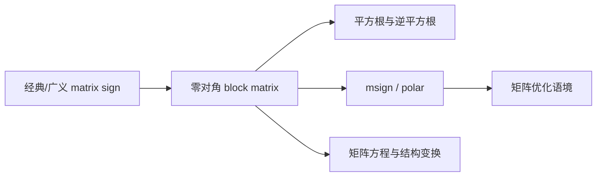

# 矩阵符号函数 mcsgn 能计算什么？

> [!abstract] 来源定位
> 文章用 block matrix sign 把平方根、逆平方根、msign/polar 以及若干矩阵方程联系起来，适合作为“一个矩阵函数如何编码多个问题”的发现入口。它采用了允许零值、使用伪逆的 `mcsgn` 扩展；本知识库将其与 Higham 标准经典 sign 明确分层，避免把扩展公式无条件搬进经典定理。

## 元数据

- 苏剑林，2025。
- 原文：[矩阵符号函数 mcsgn 能计算什么？](https://www.spaces.ac.cn/archives/11056)。
- 关联前文：[msign 算子的 Newton–Schulz 迭代（上）](https://www.spaces.ac.cn/archives/10922)。
- 关联后文：[msign 的导数](https://www.spaces.ac.cn/archives/11025)。

## 文章问题链

## 核心断言与核验

| ID | 文章线索 | 标准版本的条件 | 当前处理 |
|---|---|---|---|
| SU1 | $\operatorname{sign}\begin{psmallmatrix}0&A\\I&0\end{psmallmatrix}$ 产生 $A^{1/2}$ | $A$ 的谱避开闭负实轴 | 纳入经典正文 |
| SU2 | 一般 $\begin{psmallmatrix}0&A\\B&0\end{psmallmatrix}$ 的 sign 有非对角闭式 | $AB,BA$ 满足主根条件且可逆 | 纳入经典正文 |
| SU3 | $\begin{psmallmatrix}0&M\\M^*&0\end{psmallmatrix}$ 的 sign 产生 msign | 标准版要求方阵满秩 $M$ | 纳入并加边界 |
| SU4 | 矩形/秩亏 $M$ 也可得到 msign | 需要零映到零、伪逆的广义 sign | 记为 `mcsgn` 扩展 |
| SU5 | block 技巧可统一多个矩阵函数 | 每个特例需独立检查谱与分支 | 作为研究方法保留 |

## 最关键的定义分层

### 标准经典 sign

$$
\operatorname{sign}(A)=A(A^2)^{-1/2},
\qquad
\Lambda(A)\cap\mathrm i\mathbb R=\varnothing.
$$

它满足

$$
S^2=I.
$$

### 文章使用的零值扩展

若把零特征值映到零，并以伪逆处理平方根，则可以覆盖矩形 block 或秩亏问题。输出一般满足

$$
S^3=S,
$$

而不是 $S^2=I$。

### SVD 型 msign

若

$$
M=L_r\Sigma_rR_r^*,
$$

则

$$
\operatorname{msign}(M)=L_rR_r^*
=M(M^*M)^{\dagger/2}.
$$

这属于[[极分解]]，按奇异值工作，不是经典 $\operatorname{sign}(M)$。

## 独立核验的 block 关系

对方阵满秩 $M$，

$$
K_M=\begin{bmatrix}0&M\\M^*&0\end{bmatrix}
$$

无零特征值，并且

$$
K_M^2
=\operatorname{diag}(MM^*,M^*M).
$$

所以标准 sign 给出

$$
\operatorname{sign}(K_M)
=\begin{bmatrix}0&U\\U^*&0\end{bmatrix},
$$

其中 $U=M(M^*M)^{-1/2}$。

若 $M$ 矩形或秩亏，$K_M$ 有零特征值；此时同一块公式只能在明确的广义 sign 约定下成立。

## 限制与保留意见

- 博客符号 `mcsgn` 与标准数值线性代数文献 `sign` 的定义域不完全相同，引用时必须保留前缀或说明扩展。
- 伪逆扩展虽有用，但会改变对合性、投影公式、Newton 可逆性与局部光滑性。
- block embedding 证明“可以编码”，不证明它是计算上最优实现；显式把维度扩大一倍可能不经济。
- 与 Muon 的实际联系主要经过 msign/polar 与有限步多项式，不应把经典 sign 写成优化器直接目标。
- 评论区与启发性推广不作为经典定理证据；正式条件由 Higham 等来源补齐。

## 生成节点

- [x] [[矩阵符号函数]]
- [x] [[极分解]]
- [x] [[习题 - 矩阵符号函数]]
- [ ] 广义 matrix sign / 三幂等函数的独立专题

