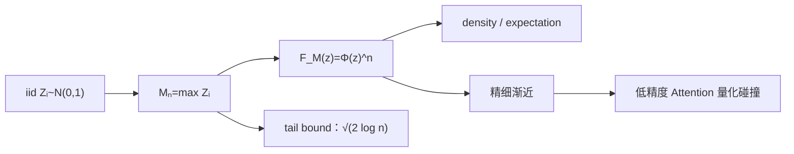

# n个正态随机数的最大值的渐近估计

> [!abstract] 来源定位
> 文章用三种路线估计独立标准正态样本最大值的期望，并把结果用于讨论低精度 Attention 分数出现重复最大值的概率。对当前概率入门章，最值得保留的是“最大值事件 → CDF 乘积 → density/期望”的完整路线；精细极值渐近、量化网格和 Attention 结论应在极限定理与数值实验节点再核验。

## 纳入判定

- 范围角色：`bridge`；
- 年代角色：`active-research`；
- 纳入理由：把 CDF、独立性、tail、极值渐近和低精度 Attention 连成可检验问题；
- 当前调用者：[[随机变量、分布与分位数]]。

## 元数据

- 正式引用：苏剑林，2025-11-06，《n个正态随机数的最大值的渐近估计》；
- 原始页面：[https://spaces.ac.cn/archives/11390](https://spaces.ac.cn/archives/11390)；
- 页面小结：三种方法估计 Gaussian 最大值期望，并讨论低精度 Attention 重复最大值；
- 本地保存范围：保留推导骨架、假设和待复现实验，不复制原文。

## 结构摘要

## 核心断言与核验

| ID | 断言 | 类型 | 假设/证据边界 | 当前判断 |
|---|---|---|---|---|
| C1 | $M_n\le z$ 等价于所有 $Z_i\le z$ | 事件恒等式 | 无需独立 | 已核验 |
| C2 | $F_{M_n}(z)=\Phi(z)^n$ | 推导 | $Z_i$ 独立同分布 | 已核验 |
| C3 | $f_{M_n}(z)=n\phi(z)\Phi(z)^{n-1}$ | 推导 | $\Phi$ 可微；有限 $n$ | 已核验 |
| C4 | $\mathbb E[M_n]$ 的主尺度为 $\sqrt{2\log n}$ | 渐近结论 | iid 标准 Gaussian，$n\to\infty$ | 经典结论；精细项留待核验 |
| C5 | 上界 $\mathbb E[M_n]\le\sqrt{2\log n}$ | 不等式 | $n\ge2$；可由 MGF/union-tail 路线得出 | 已核验 |
| C6 | 最大值尺度可帮助估计低精度 Attention 的量化重复 | 应用启发 | 还依赖 score 相关性、量化格式、scale、序列长度 | 需独立实验，不作普遍定理 |

## 当前课程保留的推导

令

$$
M_n=\max_{1\le i\le n}Z_i.
$$

首先只用事件逻辑：

$$
\{M_n\le z\}=\bigcap_{i=1}^n\{Z_i\le z\}.
$$

再调用独立性：

$$
F_{M_n}(z)
=P(M_n\le z)
=\prod_{i=1}^nP(Z_i\le z)
=\Phi(z)^n.
$$

求导得

$$
f_{M_n}(z)=n\phi(z)\Phi(z)^{n-1}.
$$

这三步分别属于事件逆像、联合独立和微积分；任何一步的条件都不能省略。

## 限制与保留意见

- $\sqrt{2\log n}$ 是主尺度/上界，不是有限 $n$ 的精确期望；精细渐近含较慢的 $\log\log n$ 修正；
- Attention logits 通常不严格 iid Gaussian，相关性、归一化、位置结构和训练都会改变极值；
- “重复最大值”还依赖离散量化网格和 tie-breaking，连续 Gaussian 本身几乎必然无并列；
- 从最大值期望推断碰撞概率需要额外分布信息，不能只凭一个均值；
- 页面全文直接抓取受到站点访问限制；文章日期、摘要和相关公式已由站内归档及搜索索引核对，精细三路线将在后续实验中逐式复查。

## 已生成与后续调用

- [x] [[随机变量、分布与分位数]]：CDF 与最大值逆像；
- [ ] [[联合分布、边缘分布与独立性]]：乘积步骤；
- [ ] [[中心极限定理与 Delta 方法]]或极值专题：精细渐近不属于普通 CLT；
- [ ] 实验：不同 $n$、相关系数与 FP8/BF16 量化下的最大值和 tie 概率。

## 交叉验证

- Gaussian concentration 与 sub-Gaussian maximum bound；
- 经典 extreme-value theory：Gaussian maxima 的 Gumbel 归一化；
- Attention score 分布和低精度量化的实测，而非 iid Gaussian 单一代理。
