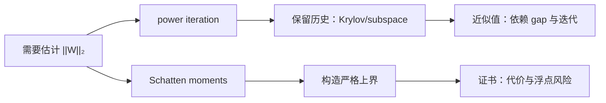

# 如何更科学地估计矩阵的谱范数？

> [!abstract] 来源定位
> 文章比较 power iteration、Krylov/subspace acceleration 与 Schatten-moment 上界三类谱范数估计路线。它适合作为“operator norm 的数值估计不等于精确谱定理”的中文问题入口；一般 Hilbert-space operator、收敛条件和浮点稳定性由正式教材与数值线性代数来源补严。

## 纳入判定

- 范围角色：`bridge`
- 年代角色：`active-research`
- 判定理由：矩阵谱范数直接进入线性层 Lipschitz 界、spectral normalization、Muon/最速方向与训练稳定性分析。
- 核心调用者：[[有界算子、紧算子与谱理论基础]]、[[矩阵范数]]和[[SVD 算法与谱范数估计]]。

## 元数据

- 正式引用：苏剑林，2026-05-04，《如何更科学地估计矩阵的谱范数？》。
- 原始页面：[https://spaces.ac.cn/archives/11736](https://spaces.ac.cn/archives/11736)
- 页面分类：信息时代；标签含迭代、矩阵、估计、谱范数。

## 结构摘要

## 核心断言

| ID | 断言 | 类型 | 假设/证据边界 | 当前判断 |
|---|---|---|---|---|
| C1 | 矩阵诱导二范数等于最大奇异值 | 经典定理 | 不是一般非正规矩阵的谱半径 | 已核验 |
| C2 | Power iteration 可用矩阵—向量乘积估计主奇异方向 | 算法事实 | 收敛受初始重叠、奇异值间隙和迭代次数影响 | 已核验 |
| C3 | Krylov/subspace 方法能利用迭代历史 | 数值方法视角 | 实际收益依赖重正交、内存和停止准则 | 已核验 |
| C4 | Schatten 高阶矩可逼近最大奇异值，并可参与上界构造 | 推导/算法 | 显式高次幂可能溢出、下溢或严重失真 | 已核验，保留实现边界 |
| C5 | 谱范数控制线性层的 Euclidean Lipschitz 常数 | 经典结论 | 网络整体上界还需激活、残差和归一化层共同分账 | 已核验 |

## 值得保留的方法

文章最有价值的不是某个孤立公式，而是把谱估计拆成两种不同任务：

1. **监控/归一化**只需足够好的近似，矩阵—向量乘积和 warm start 往往更重要；
2. **严格认证**要求确定上界，不能把未收敛的 power iteration 输出当作 certificate；
3. 任何“更紧”的估计都要和额外 matvec、存储、重正交以及浮点动态范围一起评估。

## 限制与保留意见

- 本文主要讨论 finite matrix；不能自动推广为任意无限维 operator 的可计算谱算法。
- $\lVert W\rVert_2$ 是最大奇异值，而 spectral radius $\rho(W)$ 是特征值模最大值；非正规矩阵上二者可相差很大。
- Power iteration 的输出通常是下估计或近似值，不附额外论证时不是严格上界。
- 显式形成 $(W^*W)^k$ 会放大条件数并制造溢出/下溢；可靠实现应优先 matvec、缩放和残差。
- 训练中较小的权重谱范数上界不自动推出更好泛化或更高任务性能。

## 已生成节点

- [x] [[有界算子、紧算子与谱理论基础]]
- [x] [[矩阵范数]]
- [x] [[SVD 算法与谱范数估计]]
- [x] [[幂法、反幂法与 Rayleigh 商迭代]]

## 交叉验证

- Takeru Miyato et al., [*Spectral Normalization for Generative Adversarial Networks*](https://openreview.net/forum?id=B1QRgziT-), ICLR 2018。
- MIT 18.102, [Lecture 20–22](https://ocw.mit.edu/courses/18-102-introduction-to-functional-analysis-spring-2021/pages/lecture-notes-and-readings/)：operator norm、spectrum 与 compact self-adjoint spectral theorem。
- Golub & Van Loan, *Matrix Computations*, 4th ed.：SVD、Krylov 与数值谱算法边界。
