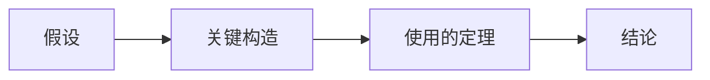

# 解答 - {{title}}

> [!warning] 使用边界
> 先完成独立尝试并记录卡点。能够读懂以下解答，不等于已经能够独立重建。

## A. 识别与复述

### EX-TOPIC-A01

**结论：**

**逐步说明：**

1. 先指出对象、空间和维度；
2. 再逐条匹配定义；
3. 最后说明容易混淆的选项为什么错。

## B. 手算与构造

### EX-TOPIC-B01

**已知：**

**目标：**

**逐步计算：**

$$
\text{保留所有关键中间式}
$$

**检查：**维度、代回、极端情况或残差。

## C. 推导与证明

### EX-TOPIC-C01

**证明路线：**

**逐步证明：**每一步注明定义、恒等式或定理。

## D. 边界与反例

### EX-TOPIC-D01

**被删除的条件：**

**最小反例：**

**验证反例满足什么、不满足什么：**

**原证明断裂的位置：**

## E. AI 迁移

### EX-TOPIC-E01

**对象和形状：**

**可以调用的结论：**

**仍需检查的假设：**

**不可扩大解释的部分：**

## 常见错误模式

| 错误 | 为什么错 | 回链 |
|---|---|---|
|  |  | [[待填写]] |

## 另一种解法

若存在，比较两种解法的直觉、前置知识、计算量和数值稳定性。

## 无提示重做

- [ ] 48 小时后不看解答重做 `hinted/copied` 题。
- [ ] 一周后抽取一道同类变式题。

