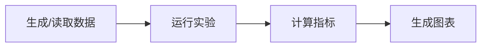

# {{title}}

## 研究问题

写成可以由结果支持或反驳的问题。

## 预注册假设

> [!hypothesis] 假设
> 在运行前写出预期趋势、主要指标和判断标准。

## 变量设计

| 类型 | 变量 | 取值/范围 | 说明 |
|---|---|---|---|
| 自变量 |  |  |  |
| 因变量 |  |  |  |
| 控制变量 |  |  |  |

## 环境

- 代码位置：
- Python/框架版本：
- 硬件：
- 随机种子：
- 数据来源与许可：

## 方法

## 运行记录

| Run | 参数变化 | 结果 | 异常 |
|---|---|---|---|
| 1 |  |  |  |

## 结果

先用图回答：**图中的哪些对象、对照或误差曲线能够直接回答本实验的研究问题，答案是什么？**

![[00-知识库管理/_assets/plots/待填写.svg|880]]

> [!figure] 实验图｜这里写“对象—结论—来源”
> 先说明图中画了什么，再写读者应读出的主要结论；最后列出生成脚本、数据来源、随机种子和关键参数。复制模板后必须用正式实验图替换占位资产。

**怎样读图。** 指出先看哪条轴、哪组对照、哪种误差表示，再说明怎样从图中读出主要结论，以及读者应核对的异常或反例信号。

**适用边界（图没有证明什么）。** 写明有限样本、参数范围、数值精度、模型设定与因果外推边界。

## 分析

- 支持还是反驳预注册假设？
- 是否存在混杂变量？
- 结果是否只由实现细节造成？
- 与理论或来源的差异是什么？

## 失败结果

记录失败运行和异常，不选择性删除。

## 结论边界

> [!warning] 不可外推之处
> 明确这个实验没有证明什么。

## 下一步

- [ ] 
