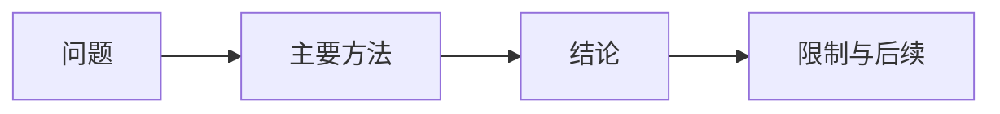

# {{title}}

> [!abstract] 来源定位
> 这份来源试图解决什么问题？它在证据链中的角色是什么？

## 纳入判定

- 范围角色：`core / bridge / excluded`
- 年代角色：`foundational / historical / active-research / implementation-aged`
- 判定理由：
- 若为 `bridge`，被哪个 `core` 节点调用：
- 若为 `excluded`：停止填写并移出知识库。

## 元数据

- 正式引用：
- 版本/DOI/arXiv ID：
- 原始附件或代码：
- 前文/后文：

## 结构摘要

用自己的语言概括论证结构，不按原文逐段改写。

## 核心断言

| ID | 断言 | 类型 | 假设/实验设置 | 证据位置 | 当前判断 |
|---|---|---|---|---|---|
| C1 |  | 定义/定理/推导/实验/直觉/猜测 |  |  | 待验证 |

## 值得保留的推导或方法

只记录推导路线和关键想法；完整重建放到独立推导节点。

## 限制与保留意见

- 作者明确说明的限制：
- 文中没有覆盖的情况：
- 可能混淆的因果关系：

## 评论、勘误与后续

> [!warning] 证据边界
> 评论区只记录作者确认的勘误、可验证反例和原始来源线索。

## 需要生成或更新的节点

- [ ] 概念：
- [ ] 推导：
- [ ] 实验：
- [ ] 专题：

## 少量必要引文

仅在必须保留精确措辞时引用，并紧跟来源位置。默认留空。
