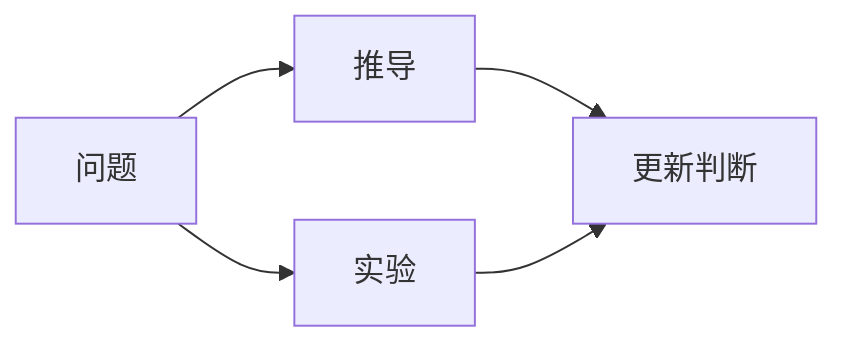

# {{title}}

## 精确问题

把问题写成可以由证明、反例或实验推进的形式。

## 为什么重要

- 它影响哪个模型、推导或设计选择？
- 如果答案为真/假，各有什么后果？

## 已知条件

| 条件 | 来源或理由 |
|---|---|
|  |  |

## 候选假设

> [!hypothesis] H1
> 

> [!hypothesis] H2
> 

## 需要的证据

- [ ] 定理或推导：
- [ ] 反例：
- [ ] 受控实验：
- [ ] 原始来源：

## 验证计划

## 当前判断

状态：未知 / 倾向支持 / 倾向反对 / 条件成立 / 已解决。

## 更新记录

- {{date:YYYY-MM-DD}}：创建问题。
