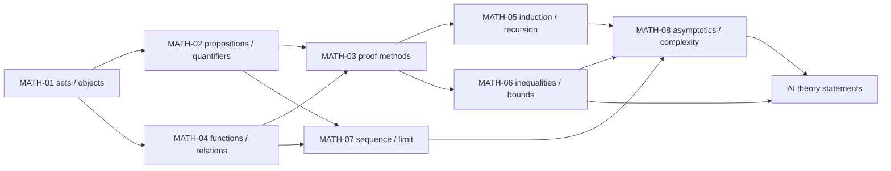
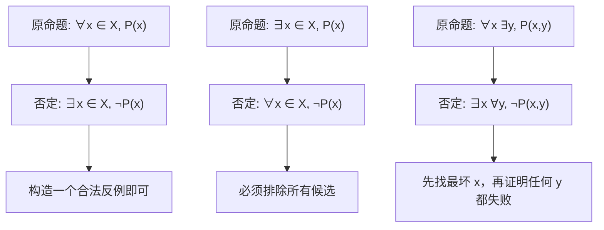

# 数学语言、逻辑与证明 MOC

> [!abstract] 本卷的核心任务
> 10.1 不负责堆积孤立的符号，而是训练一种可审计的数学工作方式：先确认对象和定义域，再展开量词与假设，随后选择证明策略、构造界或反例，最后判断结论是精确的、概率性的还是渐近的。完成本卷后，学习者应能阅读 AI 理论论文中的定义—引理—定理链，发现被省略的条件，并把“看起来合理”的解释改写成可以逐行检查的论证。

> [!question] 卷终必须能回答
> 1. $x\in A$、$A\subseteq B$、$A\in\mathcal P(B)$ 为什么是三种不同关系？
> 2. 怎样否定 $\forall x\exists y\,P(x,y)$？量词顺序为什么不能交换？
> 3. “$P$ 是 $Q$ 的充分条件”究竟对应哪一个 implication？
> 4. 何时用直接证明、逆否、反证、分类讨论、构造或反例？
> 5. Function 的 domain、codomain、image、preimage、injective、surjective 与 inverse如何区分？
> 6. Equivalence relation 为什么产生 quotient set？Representative-dependent expression怎样被识别？
> 7. Induction hypothesis究竟允许使用什么？Recurrence展开为什么需要base case和termination？
> 8. Cauchy–Schwarz、Young、Jensen、union bound等工具怎样组成可追踪的 bound chain？
> 9. $a_n\to a$、Cauchy、bounded、monotone与complete之间有哪些条件性关系？
> 10. $O,o,\Omega,\Theta,\sim$ 的量词分别是什么？Worst-case、amortized、expected complexity为何不能混报？

## 一、范围、角色与边界

### 1.1 本卷包含

- Set、element、subset、power set、Cartesian product、indexed family与基本集合运算；
- Proposition、predicate、truth value、connective、quantifier、logical equivalence与negation；
- Definition、axiom、lemma、theorem、corollary、necessary/sufficient condition与proof obligation；
- Direct proof、contrapositive、contradiction、casework、construction、uniqueness proof与counterexample；
- Function、relation、image/preimage、composition、inverse、equivalence relation、partition与quotient set；
- Mathematical induction、strong/structural induction、recursion、invariant、recurrence与基础组合计数；
- Inequality chain、norm/expectation bounds、equality condition与常用估计策略；
- Sequence limit、Cauchy/completeness直觉，以及asymptotic notation、growth rate和algorithmic complexity。

### 1.2 本卷不替代

- 完整的数理逻辑、模型论或集合论：不展开形式系统、Gödel定理、大基数等专题；
- 完整离散数学：graph theory、number theory与advanced combinatorics只在AI/算法需要时进入扩展节点；
- 完整实分析：函数极限、连续性、微分积分的正式主线属于[[多元微积分、矩阵微分与自动微分 MOC]]；
- 完整凸分析：Jensen、supporting hyperplane和Fenchel结构的系统理论属于[[优化与凸分析 MOC]]；
- 完整概率界：随机变量、concentration与PAC-style probability statement分别由概率卷和学习理论承接；
- 完整算法课：这里只建立complexity的量词、模型与比较规范，不百科展开sorting、graph algorithm或data structure。

> [!important] 为什么 10.1 最后回填
> 本卷逻辑上是10.2—10.10的共同先修，但施工上采用“先观察下游断点、再回填语言”的方式。这样每个概念都有真实调用点：quotient来自linear/function spaces，quantifier来自convergence和generalization，inequality来自probability/optimization，asymptotics来自attention与scaling law。当前回填不改变它在学习顺序中的先修地位。

## 二、八个核心节点

> [!info] 如何使用这张表
> “材料迁移”只判断页面是否按当前教学标准重写并通过仓库回归；它与学习者状态分开。建议严格按 MATH-01 → 02 → 04 → 03 → 05 → 06 → 07 → 08 阅读，并在每个阶段完成下面的验收任务后再继续。

| ID | 节点 | 核心问题 | 主要下游 | 材料迁移 |
|---|---|---|---|---|
| MATH-01 | [[集合、元素与集合运算]] | 数学对象如何归类、组合、限制和索引？ | spaces、events、parameter sets、datasets | `regression-passed` |
| MATH-02 | [[命题、量词与逻辑等价]] | “对所有”“存在”“唯一存在”和否定如何改变结论？ | theorem reading、convergence、generalization | `regression-passed` |
| MATH-03 | [[必要条件、充分条件与证明方法]] | 一个claim要求证明什么，哪种策略最匹配其逻辑结构？ | all proof-based nodes | `regression-passed` |
| MATH-04 | [[函数、映射、关系与等价类]] | Domain/codomain、image/preimage、relation与quotient怎样统一？ | models、operators、random variables、state quotient | `regression-passed` |
| MATH-05 | [[数学归纳、递归与组合计数]] | 局部递推怎样升级为全局结论，离散对象怎样可靠计数？ | recurrences、dynamic models、algorithm analysis | `regression-passed` |
| MATH-06 | [[基本不等式与界的构造]] | 如何从目标误差反向选择不等式并记录松弛来源？ | optimization、statistics、stability、generalization | `regression-passed` |
| MATH-07 | [[数列、极限与完备性的直觉]] | 无限过程怎样收敛，何时可以交换极限或保证极限仍在空间中？ | calculus、optimization convergence、function spaces | `regression-passed` |
| MATH-08 | [[渐近记号、增长率与复杂度]] | 如何比较时间、空间、样本与误差随规模变化的主导量级？ | attention、training cost、scaling law、sample complexity | `regression-passed` |

本页只登记唯一正文，不创建重复概念页。MATH-01—08 已完成课程位置、问题链、贯穿例、符号账本、核心公式拆解、机制图、各 15 道 A–E 题、独立详解和确定性实验，并通过公式、链接、图文与累计实验回归。节点正文仍保留 `draft` 写作状态，卷级材料为 `regression-passed`，学习者为 `not-attempted`；8/8 材料迁移完成不表示学习者已通过本卷。

## 三、认知依赖图

这不是说必须读完 MATH-04 才能理解任何证明，而是说明完整的证明审计需要同时回答：对象是谁、命题的量词是什么、映射是否良定义、所用策略是否履行了全部证明义务。

## 四、推荐学习路线

### 阶段 A：先学会读一句数学话

1. MATH-01：element/subset、set-builder notation、product与indexed family；
2. MATH-02：proposition/predicate、implication、equivalence、quantifier order与negation；
3. MATH-04：function/relation、domain/codomain、image/preimage和equivalence class。

验收：能把一句自然语言定理写成带完整量词的式子，也能把一个公式翻回准确自然语言；能发现domain缺失、符号重载和representative dependence。

### 阶段 B：把“我觉得”改成proof

4. MATH-03：direct、contrapositive、contradiction、construction、casework、existence/uniqueness；
5. MATH-05：ordinary/strong/structural induction、recursion、loop/state invariant和counting。

验收：能为claim列proof obligations，独立写出base case、induction hypothesis、step与closure；能用一个counterexample否证universal statement，而不把有限实验当证明。

### 阶段 C：学会控制误差与无限过程

6. MATH-06：triangle、Young、Cauchy–Schwarz、Hölder–Minkowski、Jensen、norm conversion、slack ledger与LSE；
7. MATH-07：sequence、epsilon–$N$、Cauchy、monotone/bounded、completeness与limit interchange警告。

验收：能解释bound chain每一步牺牲了什么；能从definition展开收敛量词，并构造删除条件后的失败序列。

### 阶段 D：用渐近语言评价算法和模型

8. MATH-08：$O,o,\Omega,\Theta,\sim$、dominant term、log/Polynomial/exponential增长、time/space/sample/communication complexity。

验收：能写出常数和起始阈值的量词；能区分input-size model、worst/average/expected/amortized cost，并用真实operation shape检查AI复杂度声明。

## 五、证明语言的统一合同

### 5.1 六种statement角色

| 角色 | 它做什么 | 是否需要proof | 常见误区 |
|---|---|---:|---|
| Definition | 约定一个对象/性质的含义 | 不证明，但要检查well-defined与非循环 | 把定义当经验结论 |
| Axiom/assumption | 当前系统或问题接受的前提 | 当前上下文不证明 | 忘记它是条件而非事实 |
| Lemma | 为主定理服务的可复用小结论 | 需要 | 只写名字不核条件 |
| Theorem | 在明确hypotheses下推出conclusion | 需要 | 删除hypotheses后继续引用 |
| Corollary | 从既有结论快速推出 | 需要说明substitution | 把“显然”当推理 |
| Conjecture/heuristic | 尚未证明或只具经验支持 | 不得伪装为theorem | 用实验图冒充普遍证明 |

### 5.2 每份证明的七步检查

1. **Object：** 每个symbol属于哪个set/space，维度和domain是什么？
2. **Claim：** 要证的是implication、equivalence、existence、uniqueness还是bound？
3. **Quantifier：** “任意”“存在”“唯一”“充分大”“几乎处处”的顺序是什么？
4. **Assumptions：** 哪些条件会在第几步被调用？是否存在完全未使用的假设？
5. **Method：** 直接、逆否、反证、构造、归纳或反例为何匹配claim？
6. **Edge cases：** Empty set、zero、boundary、singular/degenerate与finite/infinite是否处理？
7. **Closure：** 最后一行是否真的回到原claim，而不是只证明了更弱或不同的statement？

### 5.3 量词否定是反例设计器

例如，“每个small training loss模型都generalizes”是universal claim；一个满足训练loss小但test error大的合法construction足以否证它。反过来，展示一个generalizes的模型不能证明universal claim。

## 六、AI 理论调用地图

| AI 场景 | 10.1 调用对象 | 必须追问 |
|---|---|---|
| Tensor/shape推导 | set、Cartesian product、function domain | Batch/token/channel index分别属于什么集合？ |
| Model composition | function、composition、codomain compatibility | 前一层image是否落在后一层domain？ |
| Classification quotient | equivalence relation/class | Label invariance是否真的定义了equivalence relation？ |
| Generalization theorem | nested quantifiers、probability statement | Probability对sample、algorithm randomness还是test point取？ |
| Optimization convergence | sequence、limit、bound | Objective、iterate、gradient分别以哪种mode收敛？ |
| Recursive network/DP | induction、invariant、recurrence | Base case、state invariant与termination是什么？ |
| Error propagation | inequality chain、equality/slack | 每次triangle/Cauchy/Jensen引入多少松弛？ |
| Attention complexity | asymptotics、operation shape | 是time、activation memory还是parameter memory？$n,d$谁趋大？ |
| Scaling law | $O,\Theta,\sim$与model assumption | Empirical fit、heuristic derivation和asymptotic theorem是否分层？ |
| Counterexample audit | negated quantifiers | 失败例子是否仍满足原hypotheses？ |

### 6.1 一个复杂度声明的完整写法

“Self-attention是 $O(n^2)$”不够完整。至少应写：对sequence length $n$、head dimension $d$，dense score matrix $QK^\top$ 的arithmetic cost为 $\Theta(n^2d)$，显式materialization的score memory为 $\Theta(n^2)$；若$d$也随$n$变化、使用flash-style tiling、sparse mask或kernel factorization，time/memory合同必须重写。

科学空间的[线性 Attention 文章](https://spaces.ac.cn/archives/7546)可作为从operation reassociation讨论复杂度的中文案例；正式的 $O/\Theta$ 量词和计算模型仍由教材课程承担。

### 6.2 一个渐近推导的证据分层

科学空间的[Scaling Law 推导](https://spaces.ac.cn/archives/9607)展示了从能力量子与tail assumption得到power-law asymptotic的思路。10.1调用它时必须标注：

- Assumption：能力概率遵循给定power-law，且学习阈值模型成立；
- Derivation：tail sum以integral作asymptotic approximation；
- Conclusion：在模型假设下得到幂律指数；
- Boundary：不等于对所有真实模型、数据和训练算法的无条件定理。

## 七、本卷统一笔记规范

每个 MATH 节点必须至少包含：

1. **对象合同：** symbols、universe/domain、输入输出和相等关系；
2. **Formal definition：** 先给完整量词，再给直觉翻译；
3. **最小正例：** 手算到结论，不只列术语；
4. **最小反例：** 精确指出删除哪个条件后失败；
5. **Proof anatomy：** 标出assumption、method、关键推理与closure；
6. **AI迁移：** 至少一个真实模型/算法statement和一个越界解释；
7. **Visual：** 关系图、量词图、proof tree、bound chain或growth plot；
8. **A–E题：** 定义识别、手算、证明、反例、AI审计各3题，共15题；
9. **独立详解：** 不用“见正文”代替证明；
10. **状态边界：** 正文和解答生成后仍为`draft / composed / not-attempted`。

### 7.1 公式附近必须写的四件事

对每个重要formula，至少回答：

- 它是definition、identity、inequality、approximation还是asymptotic relation？
- 每个symbol的domain/shape是什么？
- 成立所需条件是什么？
- Equality、failure或remainder怎样检查？

## 八、最低视觉与实验配置

| 节点 | 最低视觉 | 最小可复现/交互任务 |
|---|---|---|
| MATH-01 | set/element/subset/power-set层级图 | 随机生成finite sets核对De Morgan与cardinality |
| MATH-02 | quantifier-negation作用域图 | 枚举finite domain检查量词换序反例 |
| MATH-03 | proof-strategy decision tree | 错误证明逐行标注proof obligation |
| MATH-04 | domain–codomain–image–preimage图 | 检查composition/inverse与quotient well-definedness |
| MATH-05 | induction ladder + recursion tree | recurrence展开与operation count双重核对 |
| MATH-06 | inequality bound chain | 扫描equality/slack与常数松弛 |
| MATH-07 | convergent/Cauchy/noncomplete sequence图 | epsilon–$N$ witness和limit-swap counterexample |
| MATH-08 | log/linear/polynomial/exponential growth plot | 实测operation scaling并回归log–log slope |

图形只承担结构和机制，不把有限枚举/数值曲线当作无限命题的proof。

## 九、证据分工与阅读顺序

1. [MIT 6.1200J Mathematics for Computer Science](https://ocw.mit.edu/courses/6-1200j-mathematics-for-computer-science-spring-2024/)：predicates、sets、proof、induction、recurrences、counting与asymptotics主线；
2. [MIT 18.100A Real Analysis notes](https://ocw.mit.edu/courses/18-100a-real-analysis-fall-2020/pages/lecture-notes-and-readings/)：sets、functions、induction、real-number completeness与epsilon-style proof；
3. [[S-2025-MIT-18.100B-Sequences-Convergence]]与[[S-2025-MIT-18.100B-Uniform-Convergence]]：Lectures 4–9的$\varepsilon$–$N$、单调/Cauchy、BW、级数与limsup，以及Lectures 20–21的逐点/一致与函数空间接口；
4. Lehman–Leighton–Meyer, *Mathematics for Computer Science*：正式开放教材和大量可检查练习；
5. Velleman, *How to Prove It*；Hammack, *Book of Proof*：proof strategy与初学者书写训练；
6. CLRS, *Introduction to Algorithms*：asymptotic notation、recurrence和algorithmic complexity接口；
7. 科学空间的不等式、Cesàro、级数逼近、复杂度和scaling-law文章：作为中文问题入口和审计案例，不独立承担逻辑/证明或一般分析定理。

科学空间的[经典不等式证明](https://spaces.ac.cn/archives/1420)可用于比较proof routes和检查Jensen条件；其术语方向、convex/concave convention与推广范围必须由MATH-06及凸分析卷重新核对。

MATH-07另使用[[S-2015-Su-3272-Cesaro平均]]训练prefix–tail split，使用[[S-2017-Su-4187-狄拉克与级数逼近]]训练limit-interchange audit；两篇文章均只承担C级桥接与问题意识。

MATH-08使用MIT 6.1200J Lectures 06–07承担渐近定义、递推与Master theorem骨架；[[S-2017-Vaswani-Transformer复杂度]]承担Attention work/span原始接口；[[S-2020-Su-7546-线性Attention]]与[[S-2023-Su-9607-量子化假设与尺度定律]]承担中文operation-reassociation与假设驱动推导入口；[[S-2020-Kaplan-语言模型尺度定律]]和[[S-2022-Hoffmann-计算最优训练]]共同展示经验指数与compute allocation依赖实验制度。

## 十、完成与验收标准

### 10.1 节点级完成

每个节点成稿后应具有：正文、至少一幅机制图、15道A–E题、逐题独立详解，以及能够失败的最小实验/错误证明诊断。此时状态仍只是`draft / composed`。

### 10.2 卷级累计验收

#### MATH-CUM-01：卷末综合验收闭环

| 层级 | ID | 验收路径 | 核心对象 | 材料状态 | 个人状态 |
|---|---|---|---|---|---|
| CUM | MATH-CUM-01 | 口试 → 闭卷 → nonce 随机轨 → 跨轨盲干预 → 订正 → 48 h / 14 d → 独立审计 | 量词关系、受迫递推与 rank 增长制度三轨门 | `regression-passed` | `not-attempted` |

八节点完成后，`MATH-CUM-01` 已形成以下不可跳步的证据链：

- 15 分钟口试先检查对象、量词、证明义务、极限证书与复杂度制度；
- [[阶段测验 - 数学语言、逻辑与证明（10.1）|100分、180分钟闭卷题]]与[[阶段测验解答 - 数学语言、逻辑与证明（10.1）|逐题独立详解]]严格隔离；
- definition/quantifier最低分区线；
- 至少两份完整proof和一份counterexample construction；
- 一条inequality bound chain与一条asymptotic complexity audit；
- [[实验 - 数学语言、逻辑与证明累计复现门]]把三波参数化为 $m$ 阶量词关系、$(q,r,c)$ 受迫收缩递推、$r(T)=T^\gamma/a$ 的 Attention work 制度；
- 冻结原稿后由 scorer nonce 指定主手推轨，并给出至少横跨两轨的盲参数；非默认参数必须写入独立文件，不能覆盖 canonical 图；
- 48 小时换机制重建，14 天审计陌生 AI 理论声明。

#### MATH-CUM 材料证书

- canonical SHA-256：`c635f3c63df194b79e53cd7ccf99f7c523b52158a66dd64df8d0896456960f25`；
- 固定跨轨盲测 SHA-256：`132a8211dfdbcce391c94f4a2e0ba5b8b8abc318c1eefc5cd030d38ac2d7da03`；
- [[math_foundations_cumulative_contract_audit.py]]独立复核8/8 scope、14/14题解与100分、答案/输出隔离、解析锚点、状态表面、canonical 双跑、覆盖保护及盲参 stdout/SVG/hash。

#### 从零如何执行 MATH-CUM

先按 MATH-01 → 02 → 04 → 03 → 05 → 06 → 07 → 08 完成节点练习；随后进行15分钟口试和180分钟闭卷。冻结原稿、hash与解析校准后，由评分者生成 nonce；保存盲测命令、stdout、SVG和hash后才打开详解。48小时换 $m$、递推参数或 rank exponent 重建，14天再把同一账本迁移到陌生 AI theorem。任何材料文件的存在都不能跳过这条路径。

只有真实口试、作答、评分和盲复现存在后，个人状态才能进入 `passed`；延迟门通过后才进入 `retained`。MOC、正文和标准答案的存在本身不证明掌握。

## 十一、当前进度与下一施工点

- 卷入口页：已建立；
- 核心节点：**8/8 教学迁移并通过回归**；
- 图文标准：8/8 主图均使用根目录稳定 v2 路径、正式图注、读图说明与显式“图没有证明什么”；8 幅图已重新通过结构、XML、实际渲染和人工视觉检查，极限/完备性图中的缺字下标已修复；
- 节点题：120；
- 计算审计：MATH-01—08 八套节点实验及卷末三轨门均成稿；累计脚本通过 canonical 双跑、XML、实际渲染、覆盖保护与固定跨轨盲参检查；
- 卷末验收：题卷、详解、三轨计算门和[[math_foundations_cumulative_contract_audit.py|独立累计审计]]均已成稿；
- 状态：MATH-CUM-01 材料 `regression-passed` / 学习者 `not-attempted`；节点正文保留 `draft`，不能被卷级材料状态冒充掌握；
- 下一步：学习者真实口试、闭卷、nonce 主轨、个人未见跨轨盲参、48 小时换机制与14天陌生迁移；
- 已闭合主线：对象—量词—证明—映射—离散递推—界构造—无限尾部—渐近与复杂度。

> [!warning] 初学顺序不等于施工顺序
> 仓库此前已完成大量下游数学节点，现在补10.1是为了统一语言和修复证明习惯。学习者正式阅读整套课程时，仍应从本卷开始，再进入10.2及后续各卷。
