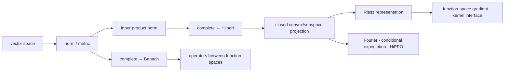

# Banach 空间、Hilbert 空间与正交投影

> [!info] 课程位置
> 这是 10.10 的 GEO-05，也是全课程第一次系统进入 infinite-dimensional linear analysis。[[向量空间]]、[[内积空间]]和[[正交投影]]告诉我们有限维对象怎样相加、测角和做最小二乘；[[度量空间、拓扑与连续映射]]告诉我们怎样谈 Cauchy、完备与连续。本章把这些语言搬到 sequence/function spaces，并逐项审计哪些有限维结论仍然成立。输出会立刻被 GEO-06 的 bounded/compact operators、GEO-07 的 RKHS 与 GEO-08 的 Sobolev/neural operator 调用。

## 建议两遍阅读

> [!tip] 第一遍：只追一条 \(\ell^2\) 主线
> 依次回答四件事：有限支撑序列为什么不完备；标准坐标截断为什么是最佳逼近；连续线性泛函为什么能由一个向量表示；为什么 \(e_n\rightharpoonup0\) 却不强收敛。第一遍不要求记住所有 \(L^p\) 反例、Banach 空间定理和基的分类。

> [!tip] 第二遍：再把主线推广到函数与 AI
> 回到正文证明 completion、projection theorem、Bessel/Parseval 与 Riesz representation；随后比较 \(L^1,L^2,L^\infty\)、Hamel/Schauder/orthonormal basis、strong/weak convergence，最后进入条件期望、HiPPO、函数空间梯度和离散化误差合同。

## 本章的推导问题链

1. 如果算法输出一列越来越接近的有限向量，它的极限为何可能不在原空间？
2. 补上极限以后，范数如何给出 Banach 空间；内积又额外给出什么？
3. 在 \(\ell^2\) 中保留前 \(N\) 个坐标，为什么不只是自然近似，而且是严格最优近似？
4. 为什么正交 residual 能把总误差精确分账，而一般范数通常只能给不等式？
5. 一个 linear response 什么时候可写成 inner product；为什么 continuous 是不可删的条件？
6. 为什么无限维中的 bounded sequence 不保证 strong subsequence，却可能保留 weak limit？
7. 把函数采样成向量以后，哪些 continuum 结论仍需额外证明？

读完第一遍，应能不看笔记复述：

$$
c_{00}
\xrightarrow[\|\cdot\|_2]{\text{completion}}
\ell^2
\xrightarrow{\text{orthogonal projection }P_N}
M_N
\xrightarrow{\text{Riesz}}
(\ell^2)^*,
$$

并说明每个箭头增加了什么能力、依赖什么条件。

## 初学者贯穿模型：有限序列怎样长成 Hilbert 空间

### 符号与对象账本

| 符号 | 类型 | 本章含义 | 不能误读成 |
|---|---|---|---|
| \(c_{00}\) | vector space | 只有有限个非零坐标的序列 | 完备空间 |
| \(\ell^2\) | Hilbert space | \(\sum_{n\ge1}|x_n|^2<\infty\) 的序列 | 任意有界序列 |
| \(e_n\) | vector | 第 \(n\) 个标准正交基向量 | 第 \(n\) 个样本 |
| \(M_N\) | closed subspace | \(\operatorname{span}\{e_1,\ldots,e_N\}\) | 整个 \(\ell^2\) |
| \(P_N\) | bounded operator | 到 \(M_N\) 的正交投影 | 任意截断或采样器 |
| \(r_N=x-P_Nx\) | vector | 截断 residual | 数值舍入误差 |
| \(L\in(\ell^2)^*\) | functional | 连续线性标量响应 | 自动存在的形式级数 |
| \(g\in\ell^2\) | vector | \(L\) 的 Riesz representer | 与度量无关的梯度坐标 |
| \(\to\) | convergence | norm/strong convergence | 逐坐标收敛 |
| \(\rightharpoonup\) | convergence | weak convergence | norm convergence |

### 第一步：有限支撑空间为什么会漏掉极限

从

$$
x^{(N)}
=\sum_{n=1}^{N}\frac1n e_n
=\left(1,\frac12,\ldots,\frac1N,0,\ldots\right)
\in c_{00}
$$

开始。若 \(M>N\)，则

$$
\|x^{(M)}-x^{(N)}\|_2^2
=\sum_{n=N+1}^{M}\frac1{n^2}
\le \sum_{n=N+1}^{\infty}\frac1{n^2}
\le \int_N^\infty\frac{dt}{t^2}
=\frac1N.
$$

因此 \((x^{(N)})\) 在 \(\ell^2\) 范数下是 Cauchy sequence。它唯一可能的逐坐标极限是

$$
x^\star=\left(1,\frac12,\frac13,\ldots\right).
$$

因为 \(\sum_{n\ge1}n^{-2}<\infty\)，所以 \(x^\star\in\ell^2\)；但它有无限多个非零坐标，所以 \(x^\star\notin c_{00}\)。这不是序列“没有极限”，而是我们选的空间太小，容不下极限。

> [!important] Completeness 在保障什么
> 完备性不是“所有序列都收敛”，而是：只要 approximants 已经彼此 Cauchy，它们就不会把极限丢到空间外。迭代算法、无穷级数、Fourier expansion 与 PDE approximation 都需要这份极限闭包合同。

同一列序列在 \(\ell^1\) 范数下甚至不是 Cauchy，因为

$$
\|x^{(2N)}-x^{(N)}\|_1
=\sum_{n=N+1}^{2N}\frac1n
\ge N\frac1{2N}
=\frac12.
$$

所以“是否 Cauchy”和“completion 补出什么对象”都依赖所选范数。\(c_{00}\) 在 \(\ell^2\) 范数下的 completion 是 \(\ell^2\)，在 \(\ell^1\) 范数下则是 \(\ell^1\)。

### 第二步：内积把尾误差变成正交账本

\(\ell^2\) 的内积和范数为

$$
\langle x,y\rangle
=\sum_{n=1}^{\infty}x_n\overline{y_n},
\qquad
\|x\|_2^2=\langle x,x\rangle.
$$

对任意 \(x=(x_n)_{n\ge1}\in\ell^2\)，定义前 \(N\) 个模态的截断

$$
P_Nx
=\sum_{n=1}^{N}x_ne_n
=(x_1,\ldots,x_N,0,\ldots).
$$

于是

$$
x=P_Nx+r_N,
\qquad
r_N=\sum_{n>N}x_ne_n,
\qquad
r_N\perp M_N.
$$

最后一个结论不是视觉猜测。若 \(y=\sum_{n=1}^{N}y_ne_n\in M_N\)，则

$$
\langle r_N,y\rangle
=\sum_{n>N}x_n\overline{y_n}
=0,
$$

因为 \(y_n=0\) 对所有 \(n>N\)。

### 第三步：为什么 \(P_Nx\) 是唯一最佳逼近

取任意 \(y\in M_N\)。把误差拆成

$$
x-y=(x-P_Nx)+(P_Nx-y).
$$

第一项属于 \(M_N^\perp\)，第二项属于 \(M_N\)，因此 Pythagorean identity 给出

$$
\|x-y\|_2^2
=\|x-P_Nx\|_2^2+\|P_Nx-y\|_2^2.
$$

右边第二项非负，且仅在 \(y=P_Nx\) 时为零，所以

$$
P_Nx
=\underset{y\in M_N}{\operatorname{argmin}}\,\|x-y\|_2,
\qquad
\inf_{y\in M_N}\|x-y\|_2^2
=\sum_{n>N}|x_n|^2.
$$

这里同时完成了三件事：

1. **存在性**：候选 \(P_Nx\) 确实属于 \(M_N\)；
2. **最优性**：任意其他 \(y\) 都多出非负的 \(\|P_Nx-y\|^2\)；
3. **唯一性**：等号只能在 \(y=P_Nx\) 发生。

> [!warning] 条件不能混写
> 在 Hilbert space 中，nonempty closed convex set有唯一最近点；若集合还是 linear subspace，residual 才对整个集合正交。集合不 closed 时最小值可能只可逼近而取不到；集合不 convex 时最近点可能不唯一；一般 Banach space 没有可随意调用的内积正交账本。

### 核心公式七问：正交投影误差分解

核心公式是

$$
\boxed{
\|x-y\|_2^2
=\|x-P_Nx\|_2^2+\|P_Nx-y\|_2^2,
\qquad y\in M_N.
}
$$

1. **对象是什么？** \(x\) 是待逼近的无限序列，\(y\) 是任意 \(N\) 维候选，\(P_Nx\) 是正交投影。
2. **每项属于哪里？** \(x-P_Nx\in M_N^\perp\)，而 \(P_Nx-y\in M_N\)。
3. **为什么能相加平方？** 两个误差分量正交，交叉内积恰为零。
4. **它比 triangle inequality 强在哪里？** 它是精确等式，能指出不可消除的尾误差和候选自身多出的误差。
5. **用了哪些条件？** 使用 Hilbert inner product 和 closed subspace projection；一般 normed space不能照搬。
6. **怎样计算？** 在标准正交基下只需保留前 \(N\) 个系数，最佳平方误差就是 tail energy。
7. **AI 中对应什么？** Basis truncation、Galerkin method、PCA/HiPPO state 与 spectral neural operator 都在选择有限表示；训练误差只有在目标 norm 与投影/离散化合同明确时才可解释。

### 第四步：Riesz theorem 把线性响应变成向量

定义

$$
L(x)=\sum_{n=1}^{\infty}\frac{x_n}{n}.
$$

令 \(g=(1,\frac12,\frac13,\ldots)\in\ell^2\)。按本章“第一变量线性”的约定，

$$
L(x)=\langle x,g\rangle.
$$

Cauchy–Schwarz 给出

$$
|L(x)|
\le \|x\|_2\|g\|_2,
\qquad
\|g\|_2
=\left(\sum_{n=1}^{\infty}\frac1{n^2}\right)^{1/2}
=\frac{\pi}{\sqrt6}.
$$

所以 \(L\) 连续，且 \(\|L\|=\|g\|_2\)。Riesz representation theorem 的一般结论是：Hilbert space 上每个 continuous linear functional 都唯一写成与某个 \(g\) 的内积。

连续性不能删除。若在 \(c_{00}\) 上形式地写

$$
\widetilde L(x)=\sum_{n\ge1}x_n,
$$

并取

$$
u^{(N)}
=\frac1{\sqrt N}\sum_{n=1}^{N}e_n,
$$

则 \(\|u^{(N)}\|_2=1\)，但 \(\widetilde L(u^{(N)})=\sqrt N\to\infty\)。因此它不可能延拓为 \(\ell^2\) 上的 bounded functional；系数序列 \((1,1,\ldots)\) 也不在 \(\ell^2\) 中。

> [!note] 为什么这就是 gradient 的抽象来源
> Fréchet differential \(DF(x)\) 首先是 covector \(H^*\) 中的 linear functional。只有选定 Hilbert inner product 后，Riesz map 才把它表示成 gradient vector。更换 inner product 会更换 representer，也会更换“最陡下降”方向。

### 第五步：弱收敛保留测试结果，却不保留范数距离

标准正交基满足

$$
\|e_n\|_2=1
$$

对所有 \(n\) 成立，所以 \(e_n\) 不可能 norm-converge 到 \(0\)。但对任意固定 \(g=(g_n)\in\ell^2\)，必有 \(g_n\to0\)，从而

$$
|\langle e_n,g\rangle|=|g_n|\to0.
$$

因此

$$
e_n\rightharpoonup0,
\qquad
e_n\not\to0.
$$

Weak convergence 只要求所有 continuous linear probes 的读数收敛；它允许能量向越来越高的坐标逃逸。GEO-06 会说明 compact operator 为什么能把这种 weakly convergent bounded sequence 的像提升为 strongly convergent subsequence。

## 用数据图核对三种容易混淆的结论

先问：**同一有限序列在不同范数下为何表现不同，Hilbert 投影的唯一性比一般 Banach 最小化多了什么，而“取样值”为什么不自动等于最佳投影？**

![[00-知识库管理/_assets/plots/functional-analysis/plot-banach-hilbert-projection-v2.svg|880]]

> [!figure] 图 10.10.5E｜完备化、最佳逼近与条件均值投影的确定性审计
> A 对 \(x^{(N)}=\sum_{n\le N}n^{-1}e_n\) 显示 \(\ell^2\) tail 以 \(N^{-1/2}\) 衰减，而 \(\ell^1\) doubling block 保持在 \(\log2\) 附近；B 比较点 \((1,0)\) 到直线 \(t(1,1)\) 的 \(\ell^1\) 与 \(\ell^2\) 距离，前者有整段 minimizers，后者只有 \(t=1/2\)；C 对 \(f(t)=t^2\) 比较分片常数 conditional mean projection 与左端采样，二者同阶但投影误差约小一半且 residual 正交。来源：独立计算；生成脚本：[[banach_hilbert_projection_audit.py]]；无随机抽样。

**怎样读图。** 先读 A 的纵轴：蓝线下降只证明 \(\ell^2\)-Cauchy，红线不下降否定 \(\ell^1\)-Cauchy；再读 B 的 minimizer 形状，严格凸的 Hilbert norm平方给唯一点，而 \(\ell^1\) 可出现平台；最后读 C，cell mean是对分片常数空间的真正 \(L^2\) projection，left sample只是另一种离散规则。

**适用边界（图没有证明什么）。** 三个轨道都是可解析例子，不单独证明一般 completion、projection theorem 或 conditional expectation theorem。B 不能推出所有 Banach projection 都不唯一；C 的一阶误差率依赖目标函数、网格与近似空间，也不能把 sampled loss 自动提升为 continuum error。

## 第一遍停靠线

到这里先停下。若能在不看正文的情况下完成下列五项，才进入后面的完整定理系统：

- 解释 \(x^{(N)}\) 为什么在 \(\ell^2\) 中 Cauchy、在 \(c_{00}\) 中却没有极限；
- 写出 \(P_Nx\) 和 tail error，并用正交分解证明其唯一最优性；
- 说清 Banach 比 normed 多 completeness，Hilbert 比 Banach 多 inner-product geometry；
- 用 \(L(x)=\langle x,g\rangle\) 解释 Riesz，并给出一个不连续形式 functional；
- 解释 \(e_n\rightharpoonup0\) 与 \(\|e_n\|=1\) 为什么不矛盾。

后续正文是在推广和加固这五件事，不是另起一套术语。

> [!abstract] 本章主问题
> 有限维线性代数里，Cauchy sequence 自动有极限、子空间自动 closed、closed bounded set 自动 compact、所有范数给出同一收敛、最小二乘自动有正交投影。这些结论进入 function/sequence spaces 后会逐一分裂。本章以 **norm → completeness → Banach** 和 **inner product → orthogonality → Hilbert** 两条主线重建无限维线性分析，并用 projection theorem 与 Riesz representation 把函数逼近、条件期望、Fourier/HiPPO、function-space gradient 和 neural operator 连接起来。

> [!question] 初学者读完必须能回答
> 1. Normed space 为什么还不够，Banach 的 completeness 究竟保障了什么？
> 2. 为什么 $c_{00}$ 中可有 Cauchy sequence，却没有空间内极限？Completion 新增了什么对象？
> 3. 为什么 $L^2$ 是 Hilbert，而 $L^1,L^\infty,C([0,1])$ 通常只是 Banach？
> 4. Closed、convex、Hilbert 三项在最佳逼近定理中各负责什么？
> 5. 为什么 infinite-dimensional orthonormal basis 不是 Hamel basis？Bessel、Parseval 分别要求什么？
> 6. Riesz theorem 如何把 continuous linear functional 变成 gradient/vector？为什么换 inner product 会换 gradient？
> 7. Weak convergence 为什么比 norm convergence 弱，却对无限维极限如此重要？
> 8. Conditional expectation、HiPPO、RKHS 与 neural operator 分别调用了哪一层空间结构？

## 0. 学习合同、符号与总路线

### 0.1 对象约定

- Scalar field $\mathbb K$ 为 $\mathbb R$ 或 $\mathbb C$；
- $X,Y$ 表示 normed/Banach spaces，范数为 $\|\cdot\|_X$；
- $H$ 表示 Hilbert space，inner product 固定为**第一变量线性、第二变量共轭线性**；
- $X^*$ 是 continuous dual，不是所有 algebraic linear functionals；
- $M^\perp=\{x:\langle x,m\rangle=0,\forall m\in M\}$；
- $\overline M$ 是 norm closure，$\operatorname{span}M$ 是 finite linear combinations；
- $P_M$ 专指 Hilbert space 中到 closed subspace $M$ 的 orthogonal projection；
- $x_n\to x$ 表示 norm/strong convergence，$x_n\rightharpoonup x$ 表示 weak convergence；
- $L^p(\Omega,\mu)$ 的元素是 almost-everywhere equivalence classes，不是逐点函数。

### 0.2 两条主线与三个 AI 接口

先用下图回答一个视觉问题：**norm、completeness 与 inner product 各增加了什么能力，projection theorem 依赖哪些条件，而连续函数对象为什么不能被采样向量悄悄替代？**

![[00-知识库管理/_assets/figures/functional-analysis/fig-banach-hilbert-projection-v2.svg|880]]

> [!figure] 图 10.10.5｜Normed、Banach、Hilbert 与正交投影
> A 从 vector space 依次加入 norm、completeness 与 inner product，区分 Banach/Hilbert 的结构层级，并标出无限维 bounded 不推出 compact；B 对 closed subspace $M$ 画出最近点 $p=P_Mx$ 与正交 residual $x-p$，同时分开 closed convex 的唯一最近点与 subspace 的正交性；C 从 continuum function、带权 samples 到 finite representation，提醒 $L^2$、sup 与 Sobolev norm 衡量不同误差。来源：独立绘制；理论接口参考 Banach/Hilbert spaces、projection theorem、Riesz representation 与 function-space approximation；生成脚本：[[plot_functional_analysis_v2.py]]；确定性结构示意，无随机种子。

**怎样读图。** A 先按“结构越多，可用定理越强”阅读，但不要反向推理：每个 Hilbert space 是 Banach，Banach 未必由 inner product 诱导；B 再把 optimization 与 geometry 分开，closed convex 保证唯一 metric projection，而 residual 对整个 $M$ 正交需要 $M$ 是 linear subspace；C 最后审计离散化，采样点、quadrature weights、basis/model 与目标 function-space norm 必须同时说明，grid loss 小不能直接推出 continuum loss 小。

**适用边界（图没有证明什么）。** 图没有证明 completion、projection theorem、Riesz representation、Bessel/Parseval 或 weak compactness。对非闭集合最近点可能不存在，对非凸集合可能不唯一，对一般 Banach space 也没有 Hilbert 式正交投影。C 未给 sampling/reconstruction 的稳定性定理；从离散范数到连续范数还需 regularity、quadrature、mesh 与 approximation 条件。

### 0.3 七个必须先分开的概念

$$
\boxed{
\begin{aligned}
\text{normed}&\ne\text{Banach},\\
\text{inner-product space}&\ne\text{Hilbert},\\
\text{closed and bounded}&\not\Rightarrow\text{compact}\quad(\dim=\infty),\\
\text{Hamel basis}&\ne\text{orthonormal basis},\\
\text{norm convergence}&\ne\text{weak convergence},\\
L^2\text{ convergence}&\ne\text{pointwise convergence},\\
\text{sampled vector norm}&\ne\text{continuum function norm}.
\end{aligned}}
$$

## 1. 为什么从有限向量进入函数空间

### 1.1 Functions 也是 vectors

若 $f,g:\Omega\to\mathbb K$，定义

$$
(f+g)(x)=f(x)+g(x),\qquad
(\alpha f)(x)=\alpha f(x),
$$

则适当函数集合形成 vector space。Sequence $(x_1,x_2,\ldots)$ 也可视为定义在 $\mathbb N$ 上的函数。因此：

- signal、trajectory、density、PDE solution 都可作为一个 vector；
- differentiation、integration、convolution、solution map 可作为 operators；
- approximation 是从 infinite-dimensional space 找有限维 subspace 中的近点。

但“函数可相加”尚未说明两个函数是否接近、级数是否收敛、极限是否还在模型空间中。

### 1.2 同一个函数集合可配不同范数

在 $C([0,1])$ 上可考察

$$
\|f\|_\infty=\max_{t\in[0,1]}|f(t)|,
$$

$$
\|f\|_1=\int_0^1|f(t)|dt,
$$

$$
\|f\|_2=\left(\int_0^1|f(t)|^2dt\right)^{1/2}.
$$

三者给出不同“误差小”的含义。Spike 可有很小 $L^1$、$L^2$ error，却有 $O(1)$ sup error。AI 中换 loss/reduction/measure 不只是换数值单位，而是在选择 function-space geometry。

## 2. Normed space 与 Banach space

### 2.1 Norm

> [!definition] Normed vector space
> Norm 是 map $\|\cdot\|:X\to[0,\infty)$，满足
> $$\|x\|=0\iff x=0,$$
> $$\|\alpha x\|=|\alpha|\|x\|,$$
> $$\|x+y\|\le\|x\|+\|y\|.$$

它诱导 translation-invariant metric

$$d(x,y)=\|x-y\|.$$

于是 continuity、Cauchy、closed、dense、compact 等 metric notions 都可调用。

### 2.2 Banach space

> [!definition] Banach space
> Complete normed vector space称 Banach space：每个 norm-Cauchy sequence $(x_n)$ 都存在 $x\in X$，使 $\|x_n-x\|\to0$。

Completeness 是“内部极限封闭”：若算法/级数给出越来越一致的 approximants，limit 不会逃出空间。

### 2.3 典型 examples

| 空间 | 范数 | Banach? | Hilbert? |
|---|---|---|---|
| $\mathbb K^n$ | 任意 norm | 是 | 只有内积诱导范数才是 |
| $\ell^p,1\le p<\infty$ | $(\sum|x_k|^p)^{1/p}$ | 是 | 仅 $p=2$ |
| $\ell^\infty$ | $\sup_k|x_k|$ | 是 | 否 |
| $c_0$ | sup norm，且 $x_k\to0$ | 是 | 否（此 norm） |
| $c_{00}$ | finite-support sequences | 否（$\ell^p$ norm） | pre-Hilbert when $p=2$ |
| $C(K)$，$K$ compact | sup norm | 是 | 通常否 |
| $L^p(\mu)$ | integral essential norm | 是 | 仅 $p=2$ |
| polynomial space | sup/$L^2$ norm | 通常否 | completion依 norm而变 |

### 2.4 Finite-dimensional 特权

任意 finite-dimensional normed space：

1. 所有 norms equivalent；
2. complete；
3. 所有 linear maps continuous；
4. 所有 subspaces closed；
5. closed and bounded sets compact。

这些都依赖 finite dimension。Infinite dimension中，norm choice改变 topology；unit ball通常不 compact；linear map不再自动 bounded；subspace可 dense但proper。

## 3. 完备性为何不是形式要求

### 3.1 $c_{00}$ 的 Cauchy sequence

令

$$x^{(N)}=(1,\tfrac12,\ldots,\tfrac1N,0,0,\ldots)\in c_{00}.$$

在 $\ell^2$ norm中，对 $M>N$：

$$
\|x^{(M)}-x^{(N)}\|_2^2
=\sum_{k=N+1}^M\frac1{k^2}\to0.
$$

所以 $(x^{(N)})$ Cauchy。若它在 $c_{00}$ 中收敛到 $x$，coordinate evaluation连续，便有 $x_k=1/k$ 对所有 $k$，但该 sequence不是 finite support，矛盾。它在 completion $\ell^2$ 中的 limit为 $(1/k)_{k\ge1}$。

同一序列在 $\ell^1$ norm中不是 Cauchy，因为

$$
\|x^{(2N)}-x^{(N)}\|_1
=\sum_{k=N+1}^{2N}\frac1k\to\log2.
$$

这同时说明 completeness 与 norm choice 都不可省略。

### 3.2 Closed subspace criterion

若 $X$ Banach、$M\subseteq X$ linear subspace，则

$$
M\text{ Banach under inherited norm}
\iff M\text{ closed in }X.
$$

证明：closed subset中的 Cauchy sequence在 $X$ 收敛，closedness把 limit留在 $M$。反向若 $M$ complete，取 $x_n\in M$ 且 $x_n\to x$ in $X$；它在 $M$ Cauchy并收敛到某 $m\in M$，metric limit uniqueness给 $x=m$。

### 3.3 Completion 的构造

任意 normed space $X$ 有 completion $\widehat X$：

1. 取 $X$ 中所有 Cauchy sequences；
2. 定义 $(x_n)\sim(y_n)$ 当 $\|x_n-y_n\|\to0$；
3. 对 equivalence classes逐项做加法与标量乘法；
4. 定义
   $$\|[(x_n)]\|=\lim_n\|x_n\|;$$
5. 把 $x\in X$ 映为 constant sequence class。

该 embedding isometric且 image dense，$\widehat X$ complete。Completion在保持 $X$ dense/isometric意义下 unique up to unique isometry。

> [!example] 同一 algebraic core，不同 completion
> $c_{00}$ 在 $\ell^1$ norm下 completion为 $\ell^1$，在 $\ell^2$ norm下为 $\ell^2$，在 sup norm下为 $c_0$。Completion不是“补一个固定边界”，而由 norm决定。

### 3.4 Banach fixed-point 接口

若 complete metric space $X$ 上 $T$ 满足

$$d(Tx,Ty)\le qd(x,y),\quad0<q<1,$$

则 Picard iterates $x_{n+1}=Tx_n$ Cauchy，completeness给 $x_n\to x\in X$，continuity给 $Tx=x$，contraction给 uniqueness。没有 completeness，iterates可逼近空间外 fixed point。ODE existence、implicit layer与iterative solver反复调用这一逻辑。

## 4. Bounded linear map 与 continuous dual

### 4.1 四个等价条件

对 linear $T:X\to Y$，以下等价：

1. $T$ continuous everywhere；
2. $T$ continuous at $0$；
3. $T$ bounded on unit ball；
4. 存在 $C$ 使
   $$\|Tx\|_Y\le C\|x\|_X\quad\forall x.$$

最小 $C$ 是 operator norm

$$
\|T\|=\sup_{\|x\|\le1}\|Tx\|.
$$

Linearity把 local continuity放大为 global Lipschitz bound。

### 4.2 Continuous dual

$$
X^*=\{f:X\to\mathbb K:f\text{ linear and bounded}\}
$$

配 dual norm

$$
\|f\|=\sup_{\|x\|\le1}|f(x)|.
$$

$X^*$ 总是 Banach，即使 $X$ 不 complete。Algebraic dual远大于 continuous dual；functional analysis默认使用后者。

### 4.3 Point evaluation 的边界

在 $C([0,1])$ sup norm上，$\delta_t(f)=f(t)$ bounded且 $\|\delta_t\|=1$。在 $L^2([0,1])$ 中：

- 元素只定义到 a.e. equivalence，$f(t)$ 不 well-defined；
- 即使选 representative，也可构造越来越窄的 unit-$L^2$ spikes使 point value无界。

RKHS 的特殊性正是把 point evaluation变成 continuous functional；这不是任意 Hilbert function space都有的性质。

## 5. Inner product、parallelogram 与 Hilbert space

### 5.1 Inner product

Complex convention下：

$$
\langle \alpha x+\beta y,z\rangle
=\alpha\langle x,z\rangle+\beta\langle y,z\rangle,
$$

$$
\langle x,y\rangle=\overline{\langle y,x\rangle},
\qquad
\langle x,x\rangle>0\;(x\ne0).
$$

它诱导 $\|x\|=\sqrt{\langle x,x\rangle}$。Cauchy–Schwarz保证 triangle inequality。

> [!definition] Hilbert space
> 对 inner-product norm complete 的 inner-product space称 Hilbert space。未 complete的称 pre-Hilbert/inner-product space。

### 5.2 Parallelogram law

Inner-product norm满足

$$
\boxed{
\|x+y\|^2+\|x-y\|^2
=2\|x\|^2+2\|y\|^2.}
$$

反过来，Jordan–von Neumann theorem说明：norm满足 parallelogram law当且仅当它来自某 inner product；real case用 polarization

$$
\langle x,y\rangle
=\frac14(\|x+y\|^2-\|x-y\|^2).
$$

Complex case还需 $x\pm iy$ 项。于是 $\ell^p$ 的 standard norm在 $p\ne2$ 时不是 inner-product norm。取 $e_1,e_2$：

$$
\|e_1+e_2\|_p^2+\|e_1-e_2\|_p^2
=2\cdot2^{2/p},
$$

右侧 parallelogram target为 $4$，只在 $p=2$ 相等。

### 5.3 典型 Hilbert spaces

- $\ell^2$：$\langle x,y\rangle=\sum_kx_k\overline{y_k}$；
- $L^2(\Omega,\mu)$：$\langle f,g\rangle=\int f\overline g,d\mu$；
- weighted $L^2$：measure/weight改变 geometry；
- Sobolev $H^1$：可取
  $$\langle f,g\rangle_{H^1}=\int f\bar g+f'\overline{g'};$$
- finite-dimensional Euclidean/unitarily weighted spaces。

同一 function set上 $L^2$ 与 $H^1$ gradients、orthogonality和nearest approximants不同。

## 6. Orthogonality 与正交级数

### 6.1 Pythagoras

若 $x\perp y$，则

$$\|x+y\|^2=\|x\|^2+\|y\|^2.$$

对 finite orthonormal family $e_1,\ldots,e_n$，

$$
P_nx=\sum_{k=1}^n\langle x,e_k\rangle e_k
$$

满足 $x-P_nx\perp\operatorname{span}\{e_1,\ldots,e_n\}$，所以

$$
\|x\|^2
=\sum_{k=1}^n|\langle x,e_k\rangle|^2
+\|x-P_nx\|^2.
$$

### 6.2 Bessel inequality

丢掉非负 residual并令 $n$ 增大：

$$
\boxed{
\sum_k|\langle x,e_k\rangle|^2\le\|x\|^2.}
$$

它只要求 orthonormal system，不要求 complete。Coefficient map $x\mapsto(\langle x,e_k\rangle)$ 因而落在 $\ell^2$。

### 6.3 Complete orthonormal system 与 Parseval

Orthonormal set $E$ complete/total指

$$
\overline{\operatorname{span}}E=H,
$$

等价于 $E^\perp=\{0\}$。若 $E=(e_k)$ 是 countable complete orthonormal system，则

$$
x=\sum_{k=1}^\infty\langle x,e_k\rangle e_k
\quad\text{in norm},
$$

$$
\boxed{
\|x\|^2=\sum_{k=1}^\infty|\langle x,e_k\rangle|^2.}
$$

Parseval equality需要 completeness；不 complete时只有 Bessel。

### 6.4 Hamel basis、Schauder basis 与 orthonormal basis

- Hamel basis：每个 vector是**有限** linear combination；infinite-dimensional Banach space的 Hamel basis通常不可数且不适合计算。
- Schauder basis：每个 vector有按固定顺序 norm-convergent series expansion；不是所有 Banach spaces都有。
- Hilbert orthonormal basis：orthonormal且closed span为全空间；每个 vector由 coefficient series norm-converge。

“Basis”在无限维里必须注明类型。Fourier basis不让一般 $L^2$ function成为有限三角多项式；它只给 $L^2$-convergent infinite expansion。

### 6.5 Separability

Metric space有 countable dense subset称 separable。Hilbert space separable当且仅当存在 countable orthonormal basis。$\ell^2$、$L^2([0,1])$ separable；$\ell^\infty$ 不 separable。Algorithm只能处理可数/有限 representations，separability是“可近似编码”的最低拓扑条件之一，但不自动给高效 rates。

## 7. Projection theorem：closed convex set上的最近点

### 7.1 定理

> [!theorem] Hilbert projection theorem
> 若 $C\subset H$ nonempty、closed、convex，则每个 $x\in H$ 有唯一 $p\in C$ 满足
> $$\|x-p\|=\inf_{z\in C}\|x-z\|.$$

### 7.2 Existence proof：parallelogram 让 minimizing sequence Cauchy

令 $d=\inf_{z\in C}\|x-z\|$，取 $y_n\in C$ 使 $\|x-y_n\|\to d$。Convexity给 midpoint $(y_n+y_m)/2\in C$。Parallelogram identity应用于 $x-y_n,x-y_m$：

$$
\|y_n-y_m\|^2
=2\|x-y_n\|^2+2\|x-y_m\|^2
-4\left\|x-\frac{y_n+y_m}{2}\right\|^2.
$$

最后一项至少 $4d^2$，故右侧趋于0；$(y_n)$ Cauchy。Hilbert completeness给 $y_n\to p\in H$；closedness给 $p\in C$；norm continuity给 $\|x-p\|=d$。

三项分工：

- convexity：midpoint仍可行；
- inner-product/parallelogram：minimizing sequence被迫 Cauchy；
- completeness+closedness：limit存在且仍可行。

### 7.3 Uniqueness

若 $p,q$ 都达到 $d$，midpoint仍在 $C$。同一 identity给

$$
\|p-q\|^2
=4d^2-4\left\|x-\frac{p+q}{2}\right\|^2\le0,
$$

故 $p=q$。

### 7.4 Variational characterization for convex sets

$p=P_Cx$ 当且仅当

$$
\operatorname{Re}\langle x-p,z-p\rangle\le0
\quad\forall z\in C.
$$

对 $p+t(z-p)$ 考察平方距离并令 $t\downarrow0$ 得 necessity；反向展开 $\|x-z\|^2$ 得 sufficiency。这是 projected gradient、proximal method与variational inequality的 Hilbert-space原型。

## 8. Closed subspace 的 orthogonal projection

### 8.1 Orthogonality condition

若 $M\subset H$ closed linear subspace，projection theorem给唯一 $m=P_Mx$。因 $m+tv\in M$ 对所有 $t\in\mathbb K,v\in M$，一维二次函数

$$\|x-m-tv\|^2$$

在 $t=0$ 最小，故

$$
\boxed{x-P_Mx\perp M.}
$$

反之若 $m\in M$ 且 $x-m\perp M$，则对 $z\in M$：

$$
\|x-z\|^2
=\|x-m\|^2+\|m-z\|^2,
$$

所以 $m$ 唯一最优。

### 8.2 Orthogonal decomposition

每个 $x$ 唯一分解

$$
x=P_Mx+(I-P_M)x,
$$

其中

$$
P_Mx\in M,\qquad(I-P_M)x\in M^\perp.
$$

故

$$
\boxed{H=M\oplus M^\perp.}
$$

并且

$$
(M^\perp)^\perp=\overline M.
$$

Closure 不能删：若 $M=c_{00}\subset\ell^2$，则 $M^\perp=\{0\}$，所以双正交补为整个 $\ell^2$，不是 $c_{00}$。

### 8.3 Projection operator characterization

$P=P_M$ 满足

$$
P^2=P,\qquad P^*=P,
$$

$$
\operatorname{ran}P=M,\qquad\ker P=M^\perp,
$$

$$
\|P\|=1\quad(M\ne\{0\}).
$$

反之 bounded linear $P$ 若 $P^2=P=P^*$，就是到其 closed range 的 orthogonal projection。仅有 $P^2=P$ 只是 oblique projection；range/kernel互补但不正交，norm可远大于1。

### 8.4 Closedness 不可删

取 $x=(1/k)\in\ell^2\setminus c_{00}$。因 $c_{00}$ dense，

$$\inf_{z\in c_{00}}\|x-z\|_2=0,$$

但没有 $z\in c_{00}$ 达到0。Proper dense subspace上“最近点”可能不存在。

### 8.5 Banach space 中为什么不同

在 $\ell^1(\mathbb R^2)$，把 $x=(1,0)$ 投到 line $M=\operatorname{span}(1,1)$：

$$
\|x-t(1,1)\|_1=|1-t|+|t|=1,
\quad t\in[0,1].
$$

Nearest point不唯一。一般 Banach space的 closed subspace也未必有 bounded linear complement。Hilbert geometry 的 orthogonal complement和contractive projection是特殊结构，不是“Banach加一个符号”。

## 9. Riesz representation theorem

### 9.1 定理

> [!theorem] Riesz representation for Hilbert spaces
> 对每个 bounded linear functional $f\in H^*$，存在唯一 $y_f\in H$ 使
> $$f(x)=\langle x,y_f\rangle\quad\forall x\in H,$$
> 且
> $$\|f\|_{H^*}=\|y_f\|_H.$$

在本章 convention下 $f\mapsto y_f$ 是 conjugate-linear isometric isomorphism；若 inner product第二变量线性，线性/共轭线性方向相反。

### 9.2 Proof

若 $f=0$，取 $y_f=0$。若 $f\ne0$，$M=\ker f$ 是 proper closed subspace。取 $z\notin M$，用 projection decomposition：

$$z=P_Mz+u,qquad0\ne u\in M^\perp.$$

对任意 $x$，令

$$m=x-\frac{f(x)}{f(u)}u.$$

则 $f(m)=0$，所以 $m\in M$，且

$$x=m+\frac{f(x)}{f(u)}u.$$

因为 $u\perp M$，适当取

$$
y_f=\frac{\overline{f(u)}}{\|u\|^2}u
$$

便有 $\langle x,y_f\rangle=f(x)$。Uniqueness：若 $\langle x,y-z\rangle=0$ 对所有 $x$，取 $x=y-z$。Norm equality由 Cauchy–Schwarz给 $\|f\|\le\|y_f\|$，再取 $x=y_f/\|y_f\|$ 得反向。

### 9.3 Differential 与 gradient

Fréchet differential $DF(u)$ 本来属于 $H^*$。选定 Hilbert inner product后，Riesz map给唯一 gradient：

$$
DF(u)[h]=\langle h,\nabla_HF(u)\rangle_H.
$$

若改用另一 inner product，functional $DF(u)$ 不变，但 representing gradient改变。Function-space中 $L^2$ gradient、Sobolev gradient与natural/preconditioned direction不能混同。

> [!example] $L^2$ 与 $H^1$ gradient
> 若 $DF(u)[h]=\int r h$，则 $L^2$ gradient是 $r$。若用 $H^1$ inner product，gradient $g$ 满足
> $$\int gh+g'h'=\int rh\quad\forall h,$$
> 即在适当 boundary条件下解 elliptic equation $(I-\partial_{xx})g=r$。换 metric相当于平滑/precondition gradient。

## 10. Weak convergence：只测试所有 continuous linear probes

### 10.1 定义

$$
x_n\rightharpoonup x
\iff
f(x_n)\to f(x)\quad\forall f\in X^*.
$$

Hilbert space借 Riesz 写成

$$
\langle x_n,y\rangle\to\langle x,y\rangle
\quad\forall y\in H.
$$

Norm convergence蕴含 weak convergence：

$$|f(x_n)-f(x)|\le\|f\|\|x_n-x\|.$$

### 10.2 Converse failure

在 $\ell^2$ 中 standard basis $e_n$ 满足 $\|e_n\|=1$，所以不 norm-converge到0。但对任意 $y=(y_k)\in\ell^2$，必有 $y_n\to0$，故

$$\langle e_n,y\rangle=\overline{y_n}\to0.$$

所以 $e_n\rightharpoonup0$。

### 10.3 Norm 的 weak lower semicontinuity

若 $x_n\rightharpoonup x$，则

$$
\|x\|\le\liminf_n\|x_n\|.
$$

Hilbert proof：若 $x\ne0$，用 probe $y=x/\|x\|$：

$$\|x\|=\lim_n\langle x_n,y\rangle\le\liminf_n\|x_n\|.$$

Weak limit可丢失 norm/energy，但不能凭空增加。这是 variational existence与regularized learning的重要 compactness替代接口。

### 10.4 Weak compactness 边界

Infinite-dimensional closed unit ball不 norm compact；Hilbert/reflexive Banach spaces中 bounded sequences有 weakly convergent subsequences（需进一步定理）。一般 Banach space不成立。本章只建立强弱分型，Banach–Alaoglu、reflexivity与weak-*留进阶。

## 11. 无限维 compactness 的失败

Infinite-dimensional Hilbert space取 orthonormal sequence $(e_n)$：

$$
\|e_n-e_m\|=\sqrt2\quad(n\ne m).
$$

Unit ball中的该 sequence没有 Cauchy subsequence，因此 closed unit ball不 compact。故有限维的 Heine–Borel不能搬来。

影响包括：

- continuous objective在 closed bounded feasible set上未必 attain minimum；
- bounded model family未必有 norm-convergent subsequence；
- finite-rank approximations需要额外 compactness/regularity；
- “参数有界”不自动推出 function outputs在强 topology预紧。

GEO-06 将用 compact operator解释何时 bounded sequence的 image重新具有 convergent subsequence。

## 12. Conditional expectation 是 $L^2$ projection

### 12.1 Subspace

在 probability space $(\Omega,\mathcal F,\mathbb P)$ 中，令

$$
H=L^2(\Omega,\mathcal F,\mathbb P),
$$

$$
M=L^2(\Omega,\mathcal G,\mathbb P),
\qquad\mathcal G\subseteq\mathcal F.
$$

$M$ 是 closed subspace。对 $X\in L^2(\mathcal F)$，conditional expectation满足

$$
\boxed{
\mathbb E[X\mid\mathcal G]=P_MX.}
$$

### 12.2 Orthogonality condition

对所有 bounded $\mathcal G$-measurable $Z$，并由 density扩展到 $Z\in L^2(\mathcal G)$：

$$
\mathbb E[(X-\mathbb E[X\mid\mathcal G])Z]=0.
$$

所以

$$
\mathbb E[(X-Z)^2]
=\mathbb E[(X-P_MX)^2]
+\mathbb E[(P_MX-Z)^2].
$$

Conditional expectation是所有只使用 $\mathcal G$ 信息的 square-integrable predictors中唯一最小 MSE者（up to a.s. equality）。

### 12.3 Regression interpretation

若 $\mathcal G=\sigma(S)$，则

$$
\mathbb E[Y\mid S]
$$

是所有 measurable functions $g(S)$ 中的 population MSE minimizer。Linear regression只把 feasible set进一步限制到 finite-dimensional linear span；两者不能混称。

> [!warning] Loss 与 integrability
> $L^2$ projection专属于 squared loss和second moment。Absolute loss对应 conditional median，quantile loss对应 conditional quantile；不能把所有 Bayes predictor都叫 orthogonal projection。

## 13. Function approximation、Fourier 与 HiPPO

### 13.1 Best approximation by a finite system

对 orthonormal $\phi_0,\ldots,\phi_N$，令 $V_N=\operatorname{span}\{\phi_k\}$。对 $f\in H$：

$$
P_{V_N}f
=\sum_{k=0}^N\langle f,\phi_k\rangle\phi_k.
$$

Coefficients不是“相关性启发”，而由 orthogonality normal equations唯一确定。对任意 $g\in V_N$：

$$
\|f-g\|^2
=\|f-P_{V_N}f\|^2
+\|P_{V_N}f-g\|^2.
$$

### 13.2 Fourier series 的 claim boundary

若 trigonometric system在 $L^2$ complete，则 partial sums $S_Nf\to f$ in $L^2$。这不自动给：

- every point pointwise convergence；
- uniform convergence；
- derivative convergence；
- sampled FFT approximation在任意 grid无 aliasing。

每种结论需要额外 regularity、summability或discretization条件。

### 13.3 HiPPO 的 projection view

HiPPO以 time-dependent measure定义历史 signal的 weighted $L^2$ approximation，并在线更新 orthogonal-polynomial projection coefficients。抽象地：

$$
c_n(t)=\langle u_{\le t},\phi_n^{(t)}\rangle_{L^2(\mu_t)}.
$$

它调用：

1. measure决定 norm与“过去哪些时间更重要”；
2. orthogonal basis给 best finite-dimensional projection；
3. basis/measure随时间变化，导数结构导出 coefficient dynamics；
4. discretization把 continuous ODE变成 recurrence。

因此“使用 Legendre matrix”不等于自动继承任意 HiPPO theorem；必须核对 measure、time scaling、basis normalization与discretization。

> [!connection] 到第四章的四层接口
> 本节只给 continuum weighted-$L^2$ projection。[[HiPPO、S4 与结构化长记忆]]继续区分：projection 最优性、coefficient ODE、离散 recurrence、下游任务质量。改变 $\mu_t$ 就改变内积、最佳逼近与记忆偏好；离散化和学习参数后，不能继续把连续投影定理无条件搬过去。

## 14. 从 Hilbert 到 RKHS、kernel 与 Gaussian objects

### 14.1 RKHS 的额外公理

Hilbert function space $H$ 若每个 point evaluation $f\mapsto f(x)$ continuous，则 Riesz theorem给唯一 $k_x\in H$：

$$
f(x)=\langle f,k_x\rangle_H.
$$

令 $k(x,y)=\langle k_y,k_x\rangle$，得到 reproducing kernel。这是 GEO-07 的入口。普通 $L^2$ 不满足 point evaluation continuity，所以不是任意 Hilbert space都有 reproducing kernel。

### 14.2 HSIC/MMD 的层级

Kernel mean embedding、MMD、HSIC要调用：

- 两个 RKHS 及其 feature maps；
- tensor-product/cross-covariance operator；
- characteristic/universality等额外 kernel条件；
- empirical estimator与population norm分离。

本章只提供 Hilbert projection、orthonormal expansion与Riesz语言；kernel positivity、representer theorem和Hilbert–Schmidt operator在 GEO-06/07补全。

## 15. Neural operator 与 discretization contract

Neural operator试图学习

$$
\mathcal G:X\to Y,
$$

其中 $X,Y$ 是 function spaces，而不是固定 mesh上的 $\mathbb R^n$。要把“跨离散率”声明写严，至少说明：

1. continuum input/output spaces与norms；
2. target operator在哪个 set上 continuous；
3. encoder/sampling $E_h:X\to\mathbb R^{n_h}$；
4. decoder/reconstruction $D_h$；
5. discrete model $G_h$ 与 continuum $\mathcal G$ 的comparison map；
6. mesh refinement下 approximation、optimization、generalization误差如何分账。

同一参数可在不同 grids运行不等于 convergence；finite test resolutions也不证明 continuum discretization invariance。

## 16. AI 中的 norm、projection 与 gradient 审计

### 16.1 Loss specifies geometry

若 training objective近似

$$
\int_\Omega w(x)|u_\theta(x)-u(x)|^2d\mu(x),
$$

则采样 distribution与weights共同指定 $L^2(w\mu)$ geometry。Uniform grid mean、nonuniform point mean、quadrature-weighted sum通常对应不同 continuum functional。

### 16.2 Projection、regularization 与 truncation

- finite basis truncation是投到有限维 subspace；
- PCA/Karhunen–Loève使用 covariance geometry选择 average-optimal subspace；
- spectral truncation的 error由 omitted coefficient energy控制；
- regularization不等于 projection：ridge给 shrinkage而非 idempotent map；
- nonlinear autoencoder image一般不是 convex subspace，nearest code可能不存在/不唯一。

### 16.3 Function-space gradient 与 discretized gradient

Discrete Euclidean gradient依 grid coordinates。要声称它逼近 $L^2$ 或 Sobolev gradient，必须追踪 mass matrix/quadrature：

$$
DF_h(u)[v]=v^\top M_h g_h.
$$

若代码默认 Euclidean pairing $v^\top\nabla f$，则 continuum Riesz representative通常是

$$g_h=M_h^{-1}\nabla f,$$

而非 raw coordinate gradient。Grid refinement时忽略 $M_h$ 会产生 resolution-dependent scaling。

## 17. 初学者最容易犯的错误

### 17.1 “Cauchy 就一定收敛”

只有在 complete ambient space中。$c_{00}$ 反例表明 Cauchy limit可在 completion里却不在原空间。

### 17.2 “Closed subspace 一定 finite-dimensional”

错。$\ell^2$ 中偶数 coordinates构成 infinite-dimensional closed subspace。Finite-dimensional subspace一定 closed，反向不成立。

### 17.3 “所有 Banach space都有 orthogonal projection”

错。Orthogonality需要 inner product；general Banach中nearest point可能不唯一，closed subspace可能没有 bounded complement。

### 17.4 “ONB expansion逐点成立”

错。Hilbert expansion默认 norm convergence。Fourier $L^2$ convergence与pointwise/uniform convergence是不同 theorem。

### 17.5 “Weak convergence 表示误差很小”

错。$e_n\rightharpoonup0$ 但 norm恒为1。Weak只表示每个固定 continuous linear probe看不到极限差异。

### 17.6 “Hilbert space中的函数可以随时取点值”

错。$L^2$ element是 a.e. class，point evaluation不 well-defined。RKHS额外保证 evaluation bounded。

### 17.7 “更多 basis functions必然改善数值模型”

Exact orthogonal projection error nonincreasing；但 sampled least squares可因 quadrature、aliasing、conditioning、noise与finite precision恶化。Approximation theorem与algorithm stability要分开。

## 18. 有限维与无限维对照表

| 命题 | finite-dimensional normed space | infinite-dimensional setting |
|---|---|---|
| norms | 全部 equivalent | 可给不同 topology/completion |
| completeness | 自动 | 必须验证/完成化 |
| subspace closed | 自动 | 可 proper dense |
| linear map continuous | 自动 | 只对 bounded maps |
| closed bounded compact | 是 | 通常否 |
| basis expansion | finite Hamel sum | ONB/Schauder series与closure |
| best subspace approximation | finite-dimensional closed | Hilbert中需 closed；Banach更复杂 |
| dual identification | 选 inner product可识别 | Hilbert由Riesz；一般 Banach $X^*\ne X$ |
| bounded sequence | 有 convergent subsequence | strong未必；可能只 weak |

## 19. 与相邻章节的接口

### 回接已学内容

- GEO-01：metric、completion、compactness、strong/weak topology；
- linear algebra：inner product、projection、least squares、basis；
- probability：$L^p$ random variables、conditional expectation；
- optimization：gradient是 differential的 Riesz representative；
- ODE：Banach fixed point与function-space solution。

### 通向 GEO-06—08

- GEO-06：bounded/compact operators、adjoint、spectrum、Banach三大定理；
- GEO-07：bounded point evaluation、RKHS、kernel operator、representer theorem；
- GEO-08：weak derivative、Sobolev Hilbert spaces、variational PDE与neural operator。

## 20. 掌握标准

### L1：对象不混淆

能定义 normed/Banach/pre-Hilbert/Hilbert、continuous dual、strong/weak convergence、orthogonal complement与不同 basis类型。

### L2：能手算

能检验 parallelogram law、计算 finite orthogonal projection、求 $L^2$ coefficients、构造 incomplete sequence与 weak-not-strong example。

### L3：能证明

能证明 closed-subspace completeness criterion、Hilbert projection theorem、$H=M\oplus M^\perp$、Bessel/Parseval链与 Riesz theorem。

### L4：能审计

能指出 closedness、convexity、completeness、separability、measure、norm与convergence mode，能为 sampled approximation写 continuum/discrete error ledger。

### L5：能迁移

能把 conditional expectation、function regression、HiPPO、RKHS或neural operator写成明确的 space–norm–projection/operator contract。

### L6：研究准备

能阅读 functional-analysis/modern operator-learning论文，识别 finite-dimensional proof transfer失败、weak/strong topology差异与discretization-invariance声明条件。

## 21. 自检清单

- [ ] 我能给同一 $c_{00}$ 写出三种不同 completion。
- [ ] 我能证明 $C(K)$ sup norm complete，并解释它通常不 Hilbert。
- [ ] 我能用 parallelogram law排除 $\ell^1/\ell^\infty$ standard norm来自内积。
- [ ] 我能完整重建 closed convex projection theorem的 existence与uniqueness。
- [ ] 我能解释 closed subspace projection为何 linear/self-adjoint/idempotent。
- [ ] 我不会把 Hamel、Schauder与orthonormal basis混写。
- [ ] 我能给 weak-not-strong convergence反例并解释 probe量词。
- [ ] 我能从 Riesz theorem解释 $L^2$ 与 Sobolev gradient的差异。
- [ ] 我能把 conditional expectation证明为 $L^2$ projection。
- [ ] 我能区分 HiPPO continuum projection、coefficient ODE与discrete recurrence。
- [ ] 我能说明 ordinary $L^2$ 为什么不是 RKHS。
- [ ] 我完成了[[习题 - Banach 空间、Hilbert 空间与正交投影]]并改参复现[[实验 - 完备化、最佳逼近与条件期望投影审计]]。

## 22. 参考与进一步阅读

### 正式主线

- [MIT 18.102 Introduction to Functional Analysis, full lecture notes](https://ocw.mit.edu/courses/18-102-introduction-to-functional-analysis-spring-2021/8fb8d5c170f1613151aca71de21027bc_MIT18_102s21_full_lec.pdf)：normed/Banach/Hilbert、projection、Riesz与operators。
- [MIT 18.102 Lecture 17: Minimizers, Orthogonal Complements and Riesz](https://ocw.mit.edu/courses/18-102-introduction-to-functional-analysis-spring-2021/resources/mit18_102s21_lec17/)：本章投影—表示主证明。
- [MIT 18.125 Measure Theory and Analysis](https://math.mit.edu/~dyatlov/125spring16/)：$L^p$ completeness、Hilbert projection、ONB、Fourier与Riesz。
- John B. Conway, *A Course in Functional Analysis*；Haim Brezis, *Functional Analysis, Sobolev Spaces and PDEs*。

### AI 与科学空间接口

- Gu et al., [HiPPO: Recurrent Memory with Optimal Polynomial Projections](https://proceedings.neurips.cc/paper_files/paper/2020/hash/102f0bb6efb3a6128a3c750dd16729be-Abstract.html), NeurIPS 2020。
- Kovachki et al., [Neural Operator: Learning Maps Between Function Spaces](https://www.jmlr.org/papers/v24/21-1524.html), JMLR 2023。
- [[S-2024-Su-10114-HiPPO正交函数投影]]：正交函数、weighted projection与SSM中文推导入口。
- [[S-2019-Su-6910-HSIC与RKHS接口]]：RKHS basis/kernel operator/HSIC的问题入口；正式kernel结论留 GEO-07。

> [!summary] 一句话收束
> Banach space保证“极限不逃逸”，Hilbert space进一步保证“误差可正交分账”；projection theorem把逼近变成几何，Riesz theorem把线性响应变成向量。现代函数学习若不先写清空间、范数、measure与收敛模式，任何“连续”“最优”“跨分辨率”都只是缺少对象合同的口号。
