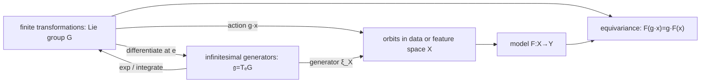

# Lie 群、Lie 代数与对称性

> [!abstract] 本章主问题
> 一个连续变换族若既能复合、取逆，又随参数光滑变化，它同时具有 **group** 与 **smooth manifold** 两种结构。Lie group 描述有限变换，位于单位元的 tangent space——Lie algebra——描述无穷小生成元，exponential map 把局部生成元送回有限变换。AI 中的 convolution、set model、无位置编码 attention、旋转/平移等变网络和 RoPE，都是“先指定作用，再让计算与作用相容”的不同实例。

> [!question] 初学者读完必须能回答
> 1. 为什么“旋转的集合”不仅是流形，而且是群？两种结构缺一会失去什么？
> 2. 为什么整个连续群的局部信息集中在单位元的 tangent space？
> 3. matrix exponential、Lie exponential 与 Riemannian exponential 有何关系，何时绝不能混写？
> 4. Lie bracket 怎样量化两个微小变换的不交换？BCH 公式修正了什么？
> 5. orbit、stabilizer、quotient 与 gauge freedom 分别回答什么问题？
> 6. invariant 与 equivariant 的 domain/codomain 条件是什么？CNN、Deep Sets、Transformer 各是哪一种？
> 7. 为什么 Lie algebra 看不见 reflection？为什么数据增强不等于严格等变？
> 8. 网络参数重标度对称与输入空间旋转对称为什么不是同一件事？

> [!note] 课程位置
> GEO-01—03 已把 $S^1$ 依次看成 topological space、smooth manifold 与 Riemannian manifold。本章改看“让圆旋转的变换集合”：$SO(2)$ 同时是 smooth manifold 和 group。单位元 tangent给 Lie algebra，matrix exponential生成 finite rotation，group action再把对称要求写成 model commuting diagram。

> [!tip] 建议两遍阅读
> **第一遍**只掌握 $SO(2)$：group law、$\mathfrak{so}(2)=\{\omega J\}$、$e^{\theta J}=R_\theta$、作用轨道、invariance/equivariance 与 group averaging。**第二遍**再进入一般 Lie group、noncommutative bracket/BCH、$SO(3)/SE(3)$、representation、Haar measure、convolution、RoPE、parameter quotient 与 Noether接口。第一遍必须能说清主动旋转、被动换坐标和模型等变不是同一句话。

## 本章的推导问题链

1. $S^1$ 上所有 rotation为什么对复合与逆封闭，从而形成 group？
2. 这个 group 怎样同时成为一维 smooth manifold？
3. 对 orthogonality constraint求导，为什么单位元 tangent恰是 skew-symmetric matrices？
4. $J^2=-I$ 怎样让 matrix exponential化成普通三角函数？
5. Lie algebra bracket 在 $SO(2)$ 中为什么为零，又为何不能据此推断所有 rotation group都交换？
6. Group action、orbit、stabilizer、invariant 与 equivariant分别是什么类型？
7. 怎样把任意函数平均成 invariant/equivariant map，有限测试又为何不是 exact certificate？

## 第一遍统一算例：从 circle rotation 到 exact equivariance

定义

$$
R_\theta
=
\begin{bmatrix}
\cos\theta&-\sin\theta\\
\sin\theta&\cos\theta
\end{bmatrix},
\qquad
SO(2)=\{R_\theta:\theta\in\mathbb R\}.
$$

### 符号与对象账本

| 符号 | 类型 | 本节角色 | 不能误写成 |
|---|---|---|---|
| $SO(2)$ | Lie group | finite rotations | circle data points本身 |
| $I$ | group identity | zero rotation | scalar 1 |
| $\mathfrak{so}(2)=T_I SO(2)$ | vector space / Lie algebra | infinitesimal rotations | entire group |
| $J$ | $2\times2$ generator | unit angular velocity | finite rotation $R_1$ |
| $\exp$ | algebra $\to$ group | integrate generator | 一般 Riemannian Exp |
| $R_\theta x$ | group action | rotation of state $x$ | passive coordinate tuple change |
| $F(R_\theta x)=R_\theta F(x)$ | equivariance contract | 两条路径交换 | invariance $F(R_\theta x)=F(x)$ |

### 第一步：finite rotations构成 group

三角恒等式或矩阵乘法给

$$
R_\theta R_\phi=R_{\theta+\phi}.
$$

因此

$$
R_0=I,
\qquad
R_\theta^{-1}=R_{-\theta},
$$

矩阵乘法本身 associative。于是 $SO(2)$ 对复合封闭、含 identity、每个元素可逆，是 group。又因为 $\theta$ 周期为 $2\pi$，它作为 manifold与 $S^1$ 同胚/微分同胚；但 group element是“变换”，$S^1$ point是“被作用的状态”，二者即使可一一对应也不能在对象账中混用。

### 第二步：从 constraint derivative得到 Lie algebra

一般写

$$
SO(2)=\{Q\in\mathbb R^{2\times2}:Q^TQ=I,\ \det Q=1\}.
$$

令 smooth curve $Q(t)\in SO(2)$ 满足 $Q(0)=I$，记

$$
\Omega=Q'(0).
$$

对 $Q(t)^TQ(t)=I$ 求导：

$$
\Omega^T+\Omega=0.
$$

所以 $\Omega$ 必须 skew-symmetric。在二维，所有这类矩阵都形如

$$
\boxed{
\mathfrak{so}(2)
=T_I SO(2)
=\{\omega J:\omega\in\mathbb R\},
\qquad
J=
\begin{bmatrix}0&-1\\1&0\end{bmatrix}
}.
$$

$\omega$ 是 angular velocity；$\omega J$ 是 identity处的 tangent direction，不是已经旋转了 $\omega$ radians 的 finite group element。

### 第三步：matrix exponential把 generator积分成 rotation

因为

$$
J^2=-I,
\qquad
J^{2k}=(-1)^kI,
\qquad
J^{2k+1}=(-1)^kJ,
$$

matrix exponential的 power series分成偶数与奇数项：

$$
\begin{aligned}
e^{\theta J}
&=\sum_{n=0}^{\infty}\frac{\theta^nJ^n}{n!}\\
&=\left(\sum_{k=0}^{\infty}\frac{(-1)^k\theta^{2k}}{(2k)!}\right)I
+\left(\sum_{k=0}^{\infty}\frac{(-1)^k\theta^{2k+1}}{(2k+1)!}\right)J\\
&=\cos\theta\,I+\sin\theta\,J\\
&=R_\theta.
\end{aligned}
$$

于是 $t\mapsto e^{t\omega J}=R_{t\omega}$ 是 one-parameter subgroup，并满足

$$
R_{(t+s)\omega}=R_{t\omega}R_{s\omega}.
$$

### 第四步：$SO(2)$ 的 bracket为零，但非交换性没有消失在一般理论中

Matrix Lie bracket是 commutator：

$$
[A,B]=AB-BA.
$$

任取 $A=aJ,B=bJ$，

$$
[aJ,bJ]=ab(J^2-J^2)=0.
$$

所以 $\mathfrak{so}(2)$ abelian，且 $SO(2)$ finite rotations也 commute。这是二维 rotation的特殊性；$SO(3)$ 中不同轴生成元通常 bracket非零，BCH correction不能删除。

Lie algebra还只看 identity component。Reflection属于 $O(2)$ 的另一个 disconnected component，不可能由 $e^{\theta J}$ 生成。因此“知道 Lie algebra”不等于“知道 group 的全部 global components”。

### 第五步：固定 action 后，orbit 与 stabilizer才有意义

$SO(2)$ 对 $S^1$ 的标准 action是

$$
a:SO(2)\times S^1\to S^1,
\qquad
a(R_\theta,p)=R_\theta p.
$$

它满足

$$
I\cdot p=p,
\qquad
(R_\theta R_\phi)\cdot p
=R_\theta\cdot(R_\phi\cdot p).
$$

对任意 $p\in S^1$，orbit

$$
SO(2)\cdot p=S^1,
$$

因为任何 circle point都能由某次 rotation到达。Stabilizer

$$
SO(2)_p=\{Q:Qp=p\}
$$

只有 $I$。若换成 group作用于图像、features或参数，orbit/stabilizer都会改变；它们不是 group脱离 action后的固有标签。

### 第六步：invariance 与 equivariance 的 codomain action不同

Scalar function $h:\mathbb R^2\to\mathbb R$ rotation-invariant是

$$
h(R_\theta x)=h(x),
$$

其中 scalar codomain使用 trivial action。Vector map $F:\mathbb R^2\to\mathbb R^2$ rotation-equivariant是

$$
\boxed{
F(R_\theta x)=R_\theta F(x)
}.
$$

例如 $h(x)=\|x\|^2$ invariant，而 $F(x)=x$ equivariant但不 invariant。只说“模型保持旋转”不够；必须同时声明 input action、output action和 equality类型。

### 第七步：所有 linear $SO(2)$-equivariant maps长什么样

若 $F(x)=Ax$，exact equivariance要求

$$
AR_\theta=R_\theta A
\qquad\forall\theta.
$$

在 $\theta=0$ 处求导可得必要条件

$$
AJ=JA.
$$

令 $A=\begin{bmatrix}\alpha&\beta\\\gamma&\delta\end{bmatrix}$，逐项比较得到

$$
\delta=\alpha,
\qquad
\gamma=-\beta.
$$

因此

$$
A=aI+bJ.
$$

反向代入可验证它与每个 $R_\theta$ commute，所以也是充分条件。这里有一个常被漏掉的细节：对 $SO(2)$，$bJ$ 也合法；若 symmetry扩大到含 reflection 的 $O(2)$，与 reflection commute会进一步迫使 $b=0$，只剩 scalar $aI$。

### 第八步：Haar averaging把任意 map投到对称子空间

对 integrable scalar $h$，定义

$$
\bar h(x)
=\frac1{2\pi}\int_0^{2\pi}h(R_\theta x)d\theta.
$$

变量平移 $\theta\mapsto\theta+\alpha$ 给

$$
\bar h(R_\alpha x)=\bar h(x),
$$

所以 $\bar h$ invariant。对 vector map $F$，定义

$$
\bar F(x)
=\frac1{2\pi}\int_0^{2\pi}
R_{-\theta}F(R_\theta x)d\theta.
$$

同样换元得到

$$
\bar F(R_\alpha x)=R_\alpha\bar F(x),
$$

所以 $\bar F$ equivariant。实际 Monte Carlo只抽有限 angles 时，只得到近似积分；有限测试 residual小不等于 architecture对连续群 exact equivariant。

### 核心公式七问：$e^{\theta J}=R_\theta$

1. **对象是什么？** Lie algebra element $\theta J$ 的 matrix exponential，一个 finite group element；
2. **怎样得到？** 用 $J^2=-I$ 把 power series分成 cosine/sine；
3. **条件是什么？** 这里是 matrix Lie group $SO(2)$；一般 Lie exponential不必用同一闭式；
4. **几何意义是什么？** Constant infinitesimal angular velocity积分成 finite rotation；
5. **怎样检查？** $\theta=0$ 得 $I$，derivative at 0得 $J$，且 determinant为 1；
6. **怎样误读？** 它不生成 reflection，也不应与任意 manifold上的 Riemannian Exp无条件等同；
7. **AI 中在哪里用？** RoPE block、rotation-equivariant features、pose updates和 continuous symmetry tests。

> [!success] 第一遍停靠线
> 你现在应能从 $Q^TQ=I$ 推出 $\mathfrak{so}(2)$，从 power series推出 $e^{\theta J}=R_\theta$，并写出 action、orbit、stabilizer、invariance、equivariance和 averaging projection。若仍把有限 augmentation测试当作 exact equivariance证明，或认为 $SO(2)$-equivariant linear map只能是 scalar identity，请先停在本例。

## 0. 学习合同、符号与总路线

### 0.1 对象与记号

- $G$ 表示 group，单位元为 $e$，逆元为 $g^{-1}$；
- $M,X,Y$ 表示 smooth manifolds 或 signal spaces；
- $L_g(h)=gh$、$R_g(h)=hg$ 分别是 left/right translation；
- $\mathfrak g=T_eG$ 是 $G$ 的 Lie algebra；
- $\exp_G:\mathfrak g\to G$ 是 Lie exponential；matrix Lie group 中常简写为 $e^A$；
- $\operatorname{Exp}^{\mathrm{Rie}}_p:T_pM\to M$ 专指 GEO-03 的 Riemannian exponential；
- $a:G\times X\to X$ 是 left action，$a(g,x)$ 简写为 $g\cdot x$；
- $\rho:G\to GL(V)$ 是 linear representation；
- $\xi_X$ 表示 $\xi\in\mathfrak g$ 在 $X$ 上诱导的 infinitesimal generator；
- $[A,B]=AB-BA$ 是 matrix commutator；
- $dF_x:T_xX\to T_{F(x)}Y$ 是 differential。

除非明确说明，本章的 Lie groups 均为 finite-dimensional real smooth Lie groups。有限群可看成零维 Lie group，但它的 Lie algebra 为 $\{0\}$；因此 Lie algebra 只编码 identity component 的连续局部信息。

### 0.2 三层桥梁

先用下图回答一个视觉问题：**有限连续变换怎样压缩为单位元处的生成元，group action 如何产生轨道，而等变模型究竟要求哪张交换图成立？**

![[00-知识库管理/_assets/figures/geometry/fig-lie-group-algebra-equivariance-v2.svg|880]]

> [!figure] 图 10.10.4｜Lie group–algebra、作用轨道与等变交换图
> A 从单位元 $e$ 处的 tangent algebra $\mathfrak g=T_eG$ 经 $\exp_G(t\xi)$ 生成 one-parameter subgroup，并以 $[A,B]=AB-BA$ 记录 infinitesimal noncommutativity；B 以 action orbit 表示 reachable states，以 stabilizer 表示 fixing transformations，并在 regular conditions 下连接 $G/G_x$；C 画出 $F(g\cdot x)=g\cdot F(x)$ 的 commuting square，分开 invariance、equivariance 与 augmentation。来源：独立绘制；理论接口参考 Lie groups/algebras、group actions、representations 与 equivariant learning；生成脚本：[[plot_geometry_foundations_v2.py]]；确定性结构示意，无随机种子。

**怎样读图。** A 先从 finite transformation 回到 identity tangent，bracket 只描述局部不交换，Lie exponential 也只保证生成 identity component 的局部/一参数信息；B 再固定指定 action，orbit 是可达集合，stabilizer 是保持点不动的 subgroup，quotient 解释冗余而不是自动赋予 semantic equivalence；C 最后同时给 domain 与 codomain action，比较“先作用再映射”和“先映射再作用”两条路径，只有二者相同才是 exact equivariance。

**适用边界（图没有证明什么）。** 图没有证明 Lie correspondence、BCH 收敛、orbit–stabilizer manifold theorem 或 universal approximation。Lie algebra 看不见 disconnected components，例如 reflection；$\exp_G$ 一般也不等于 Riemannian $\operatorname{Exp}$. 同一 orbit 不必语义等价，有限数据增强或抽样测试 group elements 也不能证明 architecture 对整个连续群严格等变。

### 0.3 先固定六个“不等于”

$$
\boxed{
\begin{aligned}
\text{group}&\ne \text{Lie group},\\
\exp_G&\ne \operatorname{Exp}^{\mathrm{Rie}}_p\quad\text{一般情形},\\
\text{invariant}&\ne\text{equivariant},\\
\text{coordinate change}&\ne\text{physical symmetry},\\
\text{data augmentation}&\ne\text{exact architectural equivariance},\\
\text{parameter symmetry}&\ne\text{input/output symmetry}.
\end{aligned}}
$$

## 1. 从群到 Lie 群

### 1.1 群：可复合且可撤销的变换

> [!definition] Group
> 集合 $G$ 配二元运算 $(g,h)\mapsto gh$，若满足：
> 1. associativity：$(gh)k=g(hk)$；
> 2. identity：存在 $e$ 使 $eg=ge=g$；
> 3. inverse：每个 $g$ 有 $g^{-1}$ 使 $gg^{-1}=g^{-1}g=e$，
> 则 $(G,\cdot)$ 是群。

封闭性包含在“运算 $G\times G\to G$”的类型中。交换律 $gh=hg$ 不是群公理；满足它的群称 abelian。

群的价值不是“有很多元素”，而是给出一致的变换演算：连续做两次变换仍在同一类中，恒等变换存在，每个变换可撤销，而且括号位置不影响结果。

### 1.2 Homomorphism、subgroup、normal subgroup 与 quotient

群同态 $\phi:G\to H$ 满足

$$
\phi(gh)=\phi(g)\phi(h).
$$

其 kernel

$$
\ker\phi=\{g:\phi(g)=e_H\}
$$

是 normal subgroup：$gNg^{-1}=N$。Normality 的作用是让 cosets 的乘法

$$
(gN)(hN)=(gh)N
$$

定义良好，从而得到 quotient group $G/N$。

> [!example] 表示中的“看不见”
> 若 representation $\rho:G\to GL(V)$ 有非平凡 kernel，那么这些群元素在 $V$ 上都表现为 identity。真正有效作用的是 $G/\ker\rho$。因此“模型对 $G$ 等变”可能包含冗余描述；先问 action 是否 faithful。

### 1.3 定义：Lie group

> [!definition] Lie group
> Lie group 是一个 smooth manifold $G$，同时也是 group，并且 multiplication 与 inversion
> $$m:G\times G\to G,\quad m(g,h)=gh,$$
> $$i:G\to G,\quad i(g)=g^{-1}$$
> 都是 smooth maps。

这一定义把 algebraic 与 differential structures 绑在一起。于是 $L_g$、$R_g$ 都是 diffeomorphisms，因为 $L_{g^{-1}}$、$R_{g^{-1}}$ 是其 smooth inverses。

### 1.4 第一组例子

| Lie group | 运算 | 维数 | 单位元 | Lie algebra 预告 |
|---|---|---:|---|---|
| $(\mathbb R^n,+)$ | 向量加法 | $n$ | $0$ | $\mathbb R^n$，bracket 为零 |
| $(\mathbb R_{>0},\times)$ | 标量乘法 | $1$ | $1$ | $\mathbb R$ |
| $S^1\cong U(1)$ | 复数乘法 | $1$ | $1$ | $i\mathbb R$ |
| $GL(n,\mathbb R)$ | 矩阵乘法 | $n^2$ | $I$ | 所有 $n\times n$ matrices |
| $O(n)$ | 矩阵乘法 | $n(n-1)/2$ | $I$ | skew-symmetric matrices |
| $SO(n)$ | 矩阵乘法 | $n(n-1)/2$ | $I$ | 同上；取 $\det=1$ component |
| $SE(n)$ | rigid motion composition | $n(n-1)/2+n$ | $(I,0)$ | rotation + translation twists |

$O(n)$ 有 $\det=1$ 与 $\det=-1$ 两个 connected components；$SO(n)$ 是包含单位元的 component。Reflection 在另一 component，不能由单位元附近的 Lie algebra curve 连续生成。

### 1.5 Matrix Lie group 与闭子群边界

本章把 closed subgroup $G\subseteq GL(n,\mathbb R)$ 称为 matrix Lie group。Closed subgroup theorem 保证它自动是 embedded Lie subgroup。Closed 条件不能随意删掉：immersed subgroup 可能在 ambient group 中稠密而非 embedded。

矩阵表示便于计算，但 abstract Lie group 不等于“某个给定矩阵集合”。有限维 Lie groups 在适当条件下可研究其 linear representations；本章只在需要时选一表示，不把具体矩阵坐标当作群本身。

## 2. 为什么单位元的 tangent space 足够重要

### 2.1 所有 tangent spaces 可由 translation 搬回单位元

因为 $L_g:G\to G$ 是 diffeomorphism，differential

$$
(dL_g)_e:T_eG\to T_gG
$$

是 linear isomorphism。故每个 $v\in T_gG$ 都唯一写成

$$
v=(dL_g)_e\xi,\qquad \xi\in T_eG.
$$

这不是说 manifold 只有一个 tangent space，而是 group translation 给出 canonical trivialization：任意位置的 tangent vector 可一致地拉回 $e$。

### 2.2 Left-invariant vector field

给 $\xi\in T_eG$，定义

$$
X_\xi(g)=(dL_g)_e\xi.
$$

它满足

$$
(dL_h)_gX_\xi(g)=X_\xi(hg),
$$

称 left-invariant vector field。反之，每个 left-invariant vector field 由其在 $e$ 的值唯一决定。

### 2.3 Lie algebra 与 bracket

> [!definition] Lie algebra
> Lie algebra 是 vector space $\mathfrak g$ 配 bilinear map $[\cdot,\cdot]:\mathfrak g\times\mathfrak g\to\mathfrak g$，满足
> $$[X,Y]=-[Y,X]$$
> 与 Jacobi identity
> $$[X,[Y,Z]]+[Y,[Z,X]]+[Z,[X,Y]]=0.$$

对 Lie group，取 $\mathfrak g=T_eG$，先把 $\xi,\eta$ 延拓为 left-invariant fields，再用 vector-field commutator，最后在 $e$ 取值：

$$
[\xi,\eta]_{\mathfrak g}=[X_\xi,X_\eta](e).
$$

对 matrix Lie group，这恰是

$$
\boxed{[A,B]=AB-BA.}
$$

Jacobi identity 可由 associative matrix multiplication 直接展开验证。

### 2.4 从约束求 matrix Lie algebra

若 $Q(t)\in O(n)$、$Q(0)=I$、$\dot Q(0)=A$，由

$$
Q(t)^\top Q(t)=I
$$

在 $t=0$ 求导得

$$
A^\top+A=0.
$$

所以

$$
\mathfrak{so}(n)=\{A:A^\top=-A\}.
$$

其独立参数是上三角的 $n(n-1)/2$ 个 entries。注意：$O(n)$ 与 $SO(n)$ 的单位元邻域相同，因此 Lie algebra 相同；Lie algebra 无法区分它们的 disconnected components。

### 2.5 Bracket 的操作意义：交换微小流的残差

令 $\Phi_t^X,\Phi_s^Y$ 是两个 vector fields 的 local flows。先沿 $X$、再沿 $Y$、反向沿 $X$、反向沿 $Y$ 的 commutator loop

$$
\Phi_{-s}^Y\circ\Phi_{-t}^X\circ\Phi_s^Y\circ\Phi_t^X
$$

的一阶位移相消，主导残差是 $ts[X,Y]$（符号依组合约定）。所以 bracket 不是抽象附加物：它记录“两个 infinitesimal transformations 的执行顺序”在二阶上造成的差异。

## 3. One-parameter subgroup 与 Lie exponential

### 3.1 One-parameter subgroup

One-parameter subgroup 是 smooth homomorphism

$$
\gamma:(\mathbb R,+)\to G,
\qquad
\gamma(t+s)=\gamma(t)\gamma(s).
$$

其初速度 $\dot\gamma(0)=\xi\in\mathfrak g$。反过来，每个 $\xi$ 唯一决定一个 one-parameter subgroup $\gamma_\xi$。定义

$$
\boxed{\exp_G(\xi)=\gamma_\xi(1),\qquad
\gamma_\xi(t)=\exp_G(t\xi).}
$$

### 3.2 Matrix group 中就是 matrix exponential

在 $GL(n)$ 中，ODE

$$
\dot X(t)=X(t)A,\qquad X(0)=I
$$

的解是

$$
X(t)=e^{tA}=\sum_{k=0}^\infty\frac{t^kA^k}{k!}.
$$

它满足

$$
e^{(s+t)A}=e^{sA}e^{tA},
\qquad
\frac d{dt}e^{tA}=Ae^{tA}=e^{tA}A.
$$

若 $A^\top=-A$，则

$$
(e^{tA})^\top e^{tA}=e^{-tA}e^{tA}=I,
$$

且 $\det(e^{tA})=e^{t\operatorname{tr}A}=1$，故 $e^{tA}\in SO(n)$。

### 3.3 Local theorem 与 global 陷阱

$d(\exp_G)_0=\operatorname{id}_{\mathfrak g}$。由 inverse function theorem，$\exp_G$ 在 $0$ 附近是到 $e$ 邻域的 local diffeomorphism。因此每个足够接近 $e$ 的 group element 有唯一小 logarithm。

但一般不能说：

- $\exp_G$ global injective；$SO(2)$ 中角度相差 $2\pi k$ 给同一 rotation；
- $\exp_G$ global surjective；一般 connected Lie group 也可能有非指数元素；
- matrix logarithm global single-valued；eigenvalues 穿过 branch cut 会导致分支与不连续；
- 任意 $g\in G$ 都能用一个“小生成元”稳定恢复。

### 3.4 Lie exponential 与 Riemannian exponential

| 对象 | base point | 输入 | 定义来源 | 主要性质 |
|---|---|---|---|---|
| $\exp_G$ | 固定在 $e$ | $\mathfrak g=T_eG$ | one-parameter subgroup / invariant flow | 编码 group multiplication |
| $\operatorname{Exp}^{\mathrm{Rie}}_p$ | 任意 $p$ | $T_pG$ 或 $T_pM$ | Levi–Civita geodesic | 编码 chosen Riemannian metric |

若 $G$ 配 bi-invariant Riemannian metric，则从 $e$ 出发的 geodesics 正是 $t\mapsto\exp_G(t\xi)$，两种 exponential 在 $e$ 对齐。只配 left-invariant metric 时一般已不相同；在任意 manifold 上更没有 group exponential。

> [!warning] AI/robotics 中的常见符号错误
> 写 $\operatorname{Exp}(\xi)$ 前必须说清它是 Lie group retraction、Riemannian geodesic，还是矩阵函数。三者有时数值相同，不代表定义相同。

## 4. SO(2)、SO(3) 与 SE(3)：可手算的连续对称

### 4.1 SO(2)

令

$$
J=\begin{bmatrix}0&-1\\1&0\end{bmatrix},
\qquad J^2=-I.
$$

则

$$
e^{\theta J}
=I\cos\theta+J\sin\theta
=\begin{bmatrix}
\cos\theta&-\sin\theta\\
\sin\theta&\cos\theta
\end{bmatrix}=R(\theta).
$$

因为 $\mathfrak{so}(2)=\operatorname{span}\{J\}$ 是一维的，任意 $aJ,bJ$ commute，故 $R(a)R(b)=R(a+b)$。SO(2) 是 abelian。

### 4.2 SO(3) 的 hat map

对 $\omega=(\omega_1,\omega_2,\omega_3)^\top$，定义

$$
\widehat\omega=
\begin{bmatrix}
0&-\omega_3&\omega_2\\
\omega_3&0&-\omega_1\\
-\omega_2&\omega_1&0
\end{bmatrix},
$$

使 $\widehat\omega v=\omega\times v$。hat map 是 $\mathbb R^3\cong\mathfrak{so}(3)$ 的 linear isomorphism，且

$$
[\widehat\omega,\widehat\nu]
=\widehat{\omega\times\nu}.
$$

因此 SO(3) 非 abelian：绕不同轴的小旋转顺序不同。

### 4.3 Rodrigues formula

令 $\theta=\|\omega\|$、$u=\omega/\theta$。由 $\widehat u^3=-\widehat u$，指数级数分组得

$$
\boxed{
e^{\widehat\omega}
=I+\frac{\sin\theta}{\theta}\widehat\omega
+\frac{1-\cos\theta}{\theta^2}\widehat\omega^2.}
$$

在 $\theta\to0$ 时要用 sinc 型稳定展开，而不是直接除以很小的 $\theta$。Axis-angle 在 $\theta=\pi$ 附近有 branch/axis ambiguity；$\omega$ 与 $\omega+2\pi k u$ 也不唯一。

### 4.4 SE(3) 与 homogeneous matrix

Rigid motion $(R,t)$ 作用于 $x\in\mathbb R^3$：

$$
x\mapsto Rx+t.
$$

写成

$$
T=
\begin{bmatrix}R&t\\0&1\end{bmatrix},
$$

则

$$
(R_1,t_1)(R_2,t_2)
=(R_1R_2,R_1t_2+t_1).
$$

平移与旋转耦合，所以 $SE(3)$ 不是 direct product $SO(3)\times\mathbb R^3$，而是 semidirect product。其 algebra element

$$
\widehat\xi=
\begin{bmatrix}
\widehat\omega&v\\0&0
\end{bmatrix}
$$

称 twist。完整 closed form 可在 robotics 专题展开；本章只要求理解 group law、generator 与 action 的类型。

## 5. BCH：从局部代数恢复非交换乘法

### 5.1 为什么 $e^Xe^Y$ 通常不等于 $e^{X+Y}$

若 $XY=YX$，幂级数可重排并得到

$$
e^Xe^Y=e^{X+Y}.
$$

不交换时，二阶项已经不同：

$$
e^Xe^Y
=I+X+Y+\frac12X^2+XY+\frac12Y^2+O(3),
$$

而

$$
e^{X+Y}
=I+X+Y+\frac12X^2+\frac12(XY+YX)+\frac12Y^2+O(3).
$$

差的主项是 $\tfrac12[X,Y]$。

### 5.2 Baker–Campbell–Hausdorff 公式

在 $X,Y$ 足够小的 local neighborhood 中，

$$
\log(e^Xe^Y)
=X+Y+\frac12[X,Y]
+\frac1{12}[X,[X,Y]]
+\frac1{12}[Y,[Y,X]]+\cdots.
$$

因此 Lie bracket 正是 local group multiplication 的首个非交换修正。令 $X=aX_0,Y=aY_0$：

- naive generator $X+Y$ 的 group error 通常是 $O(a^2)$；
- 加上 $\tfrac12[X,Y]$ 后，BCH2 error 通常降到 $O(a^3)$。

本章实验会数值恢复这两个阶数。

### 5.3 Adjoint representation

Conjugation $C_g(h)=ghg^{-1}$ 保持单位元。其 differential 定义

$$
\operatorname{Ad}_g=(dC_g)_e:\mathfrak g\to\mathfrak g.
$$

这是 representation：

$$
\operatorname{Ad}_{gh}=\operatorname{Ad}_g\operatorname{Ad}_h.
$$

Matrix group 中

$$
\operatorname{Ad}_gX=gXg^{-1}.
$$

再在 $g=\exp(tX)$ 处微分得

$$
\operatorname{ad}_X(Y)=[X,Y].
$$

于是 $\operatorname{Ad}_{e^X}=e^{\operatorname{ad}_X}$。大写 Ad 是 group action，小写 ad 是 algebra action，不能混用。

## 6. Group action：对称真正作用在哪里

### 6.1 定义与类型

> [!definition] Left group action
> $G$ 在 $X$ 上的 left action 是 map $a:G\times X\to X$，满足
> $$e\cdot x=x,$$
> $$(gh)\cdot x=g\cdot(h\cdot x).$$

Lie group smooth action 还要求 $a$ smooth。若 $X$ 是 vector space 且每个 $x\mapsto g\cdot x$ linear，便得到 representation。

群本身不能脱离 action 讨论“模型有何对称”。同一 $SO(3)$ 可作用在：

- points：$x\mapsto Rx$；
- scalar fields：$(R\cdot f)(x)=f(R^{-1}x)$；
- vector fields：$(R\cdot v)(x)=Rv(R^{-1}x)$；
- matrices/tensors：可能是 $A\mapsto RAR^\top$；
- network parameters：可能是 hidden-unit permutation 或 rescaling。

这些 representations 不同，等变方程也不同。

### 6.2 Orbit、stabilizer 与 fixed point

对 $x\in X$：

$$
G\cdot x=\{g\cdot x:g\in G\}
$$

称 orbit；

$$
G_x=\{g\in G:g\cdot x=x\}
$$

称 stabilizer/isotropy subgroup。若 $G_x=G$，则 $x$ 是 fixed point。

Map

$$
G/G_x\to G\cdot x,
\qquad gG_x\mapsto g\cdot x
$$

在适当 smooth/proper 条件下给出 homogeneous-space identification。若 orbit 是 embedded submanifold，

$$
\dim(G\cdot x)=\dim G-\dim G_x.
$$

直觉：群的某些方向真的移动 $x$，另一些方向留在 stabilizer 中“做了却看不见”。

### 6.3 Free、effective、transitive、proper

| 性质 | 条件 | 含义 |
|---|---|---|
| free | 每个 $G_x=\{e\}$ | 没有非平凡元素固定任何点 |
| effective/faithful | $\bigcap_xG_x=\{e\}$ | 没有元素固定全部点 |
| transitive | 任意 $x,y$ 有 $g\cdot x=y$ | $X$ 是单一 orbit |
| proper | action map 有 properness 条件 | quotient 往往更良性、stabilizer compact |

Free 比 effective 强。$SO(3)$ 作用于 $S^2$ transitive 但不 free：每点都有绕该轴旋转的 $SO(2)$ stabilizer。因此

$$
S^2\cong SO(3)/SO(2).
$$

### 6.4 Infinitesimal generator

对 $\xi\in\mathfrak g$，定义 $X$ 上的 vector field

$$
\xi_X(x)
=\left.\frac d{dt}\right|_{t=0}
\exp_G(t\xi)\cdot x.
$$

它是 continuous symmetry 的瞬时速度。切于 orbit 的 vectors 正是这些 generators 的像；在适当条件下

$$
T_x(G\cdot x)=\{\xi_X(x):\xi\in\mathfrak g\}.
$$

Kernel $\{\xi:\xi_X(x)=0\}$ 是 stabilizer algebra $\mathfrak g_x$。

## 7. Representation：群怎样作用于 features

### 7.1 Linear representation 与微分表示

Representation 是 smooth homomorphism

$$
\rho:G\to GL(V).
$$

在单位元微分得到

$$
d\rho:\mathfrak g\to\mathfrak{gl}(V),
$$

且保持 bracket：

$$
d\rho([X,Y])=[d\rho(X),d\rho(Y)].
$$

反向从 algebra representation 积分到 group representation 需要 global 条件；若 source group connected and simply connected，有限维 Lie algebra homomorphism 可唯一积分。若 group 不 simply connected，还需检查 monodromy/integrality；若不 connected，algebra 更不能决定其他 components。

### 7.2 Invariant subspace 与 irreducibility

子空间 $W\subseteq V$ 若对所有 $g$ 有 $\rho(g)W\subseteq W$，称 invariant subspace。只有 $\{0\}$、$V$ 两个 invariant subspaces 的非零 representation 称 irreducible。

对 compact groups，finite-dimensional real/complex representations 可通过 group-averaged inner product 变为 unitary/orthogonal。这让 feature space 分解、parameter tying 与 harmonic analysis 具有稳定线性代数基础。完整 irreducible decomposition 和 Peter–Weyl theory 留给进阶专题。

### 7.3 Scalars、vectors 与高阶 features

“Feature channel”不自动是 scalar。对 3D rotation：

- scalar feature：$s\mapsto s$；
- vector feature：$v\mapsto Rv$；
- rank-2 tensor：$A\mapsto RAR^\top$；
- pseudoscalar/pseudovector 在 reflection 下还带 determinant sign。

若 architecture 把 vector coordinates 当成三个不相关 scalars，rotation mixing law 就丢失了。等变网络设计首先是选择 feature types/representations，其次才是选 layer。

## 8. Invariance、equivariance 与 intertwiner

### 8.1 两个作用之间的相容

设 $G$ 分别作用在 $X,Y$ 上，记 $\rho_X(g),\rho_Y(g)$。Map $F:X\to Y$ 若满足

$$
\boxed{F(\rho_X(g)x)=\rho_Y(g)F(x)\quad
\forall g,x,}
$$

称 equivariant。

若 output action trivial，即 $\rho_Y(g)y=y$，则退化为 invariant：

$$
F(g\cdot x)=F(x).
$$

Invariant 不是比 equivariant “更好”；它只适合 output 不应随输入姿态变化的任务。Image class label 可 rotation-invariant，pose vector 则应 rotation-equivariant。

### 8.2 Commuting square

$$
\begin{array}{ccc}
X & \xrightarrow{\ F\ } & Y\\
{\scriptstyle\rho_X(g)}\downarrow &&
\downarrow{\scriptstyle\rho_Y(g)}\\
X & \xrightarrow{\ F\ } & Y
\end{array}
$$

“先变输入再计算”与“先计算再按 output rule 变换”得到同一点。这是等变最可审计的定义；实际代码可报告 residual

$$
r_g(x)=
\frac{\|F(\rho_X(g)x)-\rho_Y(g)F(x)\|}
{\|F(\rho_X(g)x)\|+\|\rho_Y(g)F(x)\|+\varepsilon}.
$$

### 8.3 Linear equivariant map 是 intertwiner

若 $F=L$ linear，则条件化为

$$
\boxed{L\rho_X(g)=\rho_Y(g)L.}
$$

满足它的 linear maps 组成 $\operatorname{Hom}_G(V_X,V_Y)$。Architecture 中的 weight tying，本质是把 $L$ 限制在这一 intertwiner space，而不是事后希望训练自行学到对称。

### 8.4 Infinitesimal equivariance

对 connected Lie group，若 $F$ smooth 且 global equivariant，对任意 $\xi\in\mathfrak g$ 沿 $t=0$ 微分：

$$
\boxed{
dF_x\big(\xi_X(x)\big)
=\xi_Y(F(x)).}
$$

若 $X,Y$ 是 linear representations，则

$$
dF_x\big(d\rho_X(\xi)x\big)
=d\rho_Y(\xi)F(x).
$$

反向结论需要 $F$ 足够正则，并把 generator identity 沿 flows 积分；它最多先给 identity component 的 equivariance。Reflection 等 disconnected components 必须另验。

> [!example] 关键反例
> $F:\mathbb R\to\mathbb R$ 满足所有平移 Lie algebra generators 的条件，可推出对 connected translation group 的结果；但对 $O(1)=\{\pm1\}$，Lie algebra 是零，infinitesimal condition vacuous，完全检查不出 $F(-x)=\pm F(x)$。

## 9. Haar measure 与 group averaging

### 9.1 为什么普通“把所有变换平均”还需要 measure

Finite group 可用 $|G|^{-1}\sum_g$。Continuous group 需要 translation-invariant Haar measure $\mu$。Every locally compact group 有 left Haar measure，unique up to positive scale；compact group 可归一化为 $\mu(G)=1$。Noncompact group 如 $\mathbb R^n$ 没有 finite normalized Haar probability measure，因此不能无条件对“所有平移”做均匀平均。

### 9.2 构造 invariant function

对 compact $G$，定义

$$
(\mathcal Pf)(x)=\int_Gf(g\cdot x)\,d\mu(g).
$$

Compact group 的 normalized Haar measure 同时 left/right invariant，因此

$$
(\mathcal Pf)(h\cdot x)
=\int_Gf(gh\cdot x)d\mu(g)
=(\mathcal Pf)(x)
$$

（变量替换方向依 left/right action convention）。而且 $\mathcal P^2=\mathcal P$：它是投到 invariant functions 的 Reynolds projector。

### 9.3 把任意 linear map 投到 equivariant maps

若 representations 取 unitary/orthogonal 形式，令

$$
\boxed{
\mathcal P(L)
=\int_G\rho_Y(g)^{-1}L\rho_X(g)\,d\mu(g).}
$$

对任意 $h$，利用 Haar invariance 可证

$$
\mathcal P(L)\rho_X(h)
=\rho_Y(h)\mathcal P(L).
$$

Finite cyclic group 上它就是 conjugates 的有限平均。本章实验会把非等变 dense matrix 平均成 circulant/equivariant matrix。

### 9.4 Monte Carlo averaging 的证据边界

只采 $m$ 个随机 group elements 得

$$
\widehat{\mathcal P}_m(L)
=\frac1m\sum_{j=1}^m
\rho_Y(g_j)^{-1}L\rho_X(g_j).
$$

这通常只有 approximate equivariance；误差取决于 sampling distribution、coverage、variance 和 tested norm。若 $G$ noncompact，还要选 window/distribution，这会改变目标，不能称为 exact uniform group average。

## 10. Convolution 为什么来自 translation equivariance

### 10.1 离散平移作用

在 cyclic grid $\mathbb Z_n$ 上定义 shift

$$
(T_kx)[u]=x[u-k].
$$

Circular convolution

$$
(K*x)[u]=\sum_{v\in\mathbb Z_n}K[v]x[u-v]
$$

满足

$$
K*(T_kx)=T_k(K*x).
$$

证明只是换指标：

$$
(K*T_kx)[u]
=\sum_vK[v]x[u-v-k]
=(T_k(K*x))[u].
$$

### 10.2 反向定理：commuting matrix 必为 circulant

设 linear map $L:\mathbb R^n\to\mathbb R^n$ 与 fundamental cyclic shift $T_1$ commute。令 $e_j=T_j e_0$，则

$$
Le_j=LT_je_0=T_jLe_0.
$$

所以 $L$ 的每一列都是第一列的 cyclic shift，即 $L$ 是 circulant matrix，也就是 circular convolution。于是 weight sharing 不是经验技巧，而是 translation-equivariant linear map 的结构刻画。

### 10.3 Boundary、stride 与 sampling 会破坏什么

- zero padding 选择了一个特殊边界，finite grid 上不再对所有 translation exact equivariant；
- stride/downsampling 只对某个 subgroup 或带 anti-aliasing 条件的变换相容；
- interpolation/rotation resampling 引入 discretization error；
- nonlinear activation 若 pointwise 且 feature representation 只是位置 permutation，通常保持 equivariance；对会混合 channels 的 nontrivial irreps，任意 scalar nonlinearity 未必合法；
- normalization 若统计跨错误的 axis，可能破坏指定 group action。

所以“使用 convolution”不等于整个网络端到端 exact translation equivariant。

### 10.4 Group convolution

对 finite/compact group，可写一类 group convolution/correlation

$$
(f*\psi)(g)
=\int_G f(h)\psi(h^{-1}g)\,d\mu(h).
$$

Left translation input 会对应 left translation output。不同文献对 convolution/correlation、inverse 与 left/right action 约定不同；证明前必须先固定 convention。G-CNN 把普通 grid translation weight sharing推广到 rotations/reflections 等 groups。

## 11. Set、Attention 与位置编码中的 permutation symmetry

### 11.1 Deep Sets：invariant readout

对有限集合/多重集 $X=\{x_1,\ldots,x_n\}$，permutation $\pi\in S_n$ 只重排 indices。Architecture

$$
F(X)=\rho\left(\sum_{i=1}^n\phi(x_i)\right)
$$

显然 invariant，因为求和与顺序无关。Deep Sets 的 representation theorem 需要对 input domain、set cardinality/continuity 等给出条件；不能把这一个式子无条件宣称为“所有集合函数”的唯一形式。

若逐元素输出

$$
y_i=\psi\left(x_i,\sum_j\phi(x_j)\right),
$$

则重排 input 会同样重排 output，是 permutation-equivariant。

### 11.2 Self-attention without positional information

令 $X\in\mathbb R^{n\times d}$，$P$ 是 permutation matrix。无 mask/position-dependent term 时

$$
Q=XW_Q,\quad K=XW_K,\quad V=XW_V.
$$

输入变为 $PX$ 后，$Q,K,V$ 同时左乘 $P$，score 变为

$$
(PQ)(PK)^\top=P(QK^\top)P^\top.
$$

Row-wise softmax 满足

$$
\operatorname{softmax}(PAP^\top)
=P\operatorname{softmax}(A)P^\top,
$$

因此

$$
\operatorname{Attn}(PX)=P\operatorname{Attn}(X).
$$

完整 sequence-to-sequence self-attention 是 **permutation equivariant**，不是 invariant；再做 symmetric pooling 才可得到 invariant output。

### 11.3 Mask 与 position encoding 是 symmetry specification

Causal mask、absolute position embedding、relative bias 或 RoPE 都引入 token position/order structure。它们不是简单地“让模型知道序号”，而是在修改允许的 group action：

- arbitrary $S_n$ permutation 通常不再是 symmetry；
- relative encoding 可保留某种 joint translation/relative-offset structure；
- causal order 选择有向时间序，只有保持该关系的变换才可能相容。

科学空间关于 decoder-only LLM 位置编码的讨论可作为问题入口，但要精确区分“固定 query 时重排 key-value 对的 invariance”与“同时重排全序列时的 equivariance”。

### 11.4 RoPE 作为平移群的旋转表示

在二维 channel block 上，令

$$
R(m)=
\begin{bmatrix}
\cos(m\theta)&-\sin(m\theta)\\
\sin(m\theta)&\cos(m\theta)
\end{bmatrix}
=e^{m\theta J}.
$$

它是 $(\mathbb Z,+)$（或连续延拓的 $\mathbb R$）到 $SO(2)$ 的 representation：

$$
R(m+n)=R(m)R(n).
$$

并且

$$
R(m)^\top R(n)=R(n-m),
$$

所以 rotated query/key inner product 可只依赖 relative displacement。多频率 block diagonal rotations 是多个二维 irreducible real blocks 的 direct sum。

> [!warning] 结论边界
> RoPE 的 algebraic relative-position property 不自动保证 long-context extrapolation、数值稳定或任何任务性能；frequency design、finite precision、attention kernel 与训练分布仍需单独验证。

> [!connection] 到第四章的位置表示
> [[RoPE 的旋转推导、群表示与内积]]把上述 representation law 落到 Q/K shape、pairing 与 cache；[[二维、多轴与多模态位置编码]]进一步要求多个平移 generator 的组合合同。若生成元不交换，$e^{xA+yB}$、$e^{xA}e^{yB}$ 与 BCH 修正一般不同，不能仅凭“用了矩阵指数”声称得到二维相对位置表示。

## 12. Euclidean 与 Lie-group equivariant learning

### 12.1 $E(n)$、$SE(n)$、$O(n)$ 的任务选择

对 point cloud $x_i\in\mathbb R^n$：

- $E(n)=O(n)\ltimes\mathbb R^n$ 包含 rotation、reflection 与 translation；
- $SE(n)=SO(n)\ltimes\mathbb R^n$ 不含 reflection；
- 只要 rotation invariance 时可先中心化，但中心化本身对缺失点/权重有统计假设。

Molecular energy 应常为 scalar invariant，force 是 vector equivariant。若任务区分 chirality，强行 $O(3)$ invariance 会把 mirror images 混同，应考虑 $SE(3)$ 或 parity-aware feature types。

### 12.2 Continuous group 的 kernel constraint

若 layer 在 homogeneous space/continuous domain 上积分，equivariance 常转化为 kernel 的 transformation constraint。LieConv 之类方法通过 Lie algebra coordinates、local neighborhoods 与 group convolution近似处理 arbitrary continuous data。算法实现还要承担：

- logarithm/chart 的 branch 与 coverage；
- neighborhood truncation；
- Monte Carlo integration；
- sampling density 与 boundary；
- finite-precision equivariance residual。

Continuous theory 不等于 discrete implementation exact。

### 12.3 Geometric deep learning blueprint

可以用四个问题审计任何“几何模型”：

1. domain $\Omega/X$ 是什么？
2. symmetry group $G$ 是什么，怎样作用？
3. signal/features 采用哪些 representations？
4. 模型要求 invariant、equivariant，还是只做 augmentation/regularization？

CNN、set network、GNN、Transformer、spherical/gauge CNN 的共同点不是“都用了几何”，而是都可由 domain、symmetry、locality 与 representation type 组织。

## 13. Exact、approximate 与 empirical symmetry

### 13.1 三种证据不能混写

| 层级 | 声明 | 所需证据 |
|---|---|---|
| exact architectural | 对所有 $g,x$ 数学等式成立 | layer proof + composition proof + implementation convention |
| numerical approximate | 测试域上 residual 小 | group/input sampling、norm、precision、worst/quantile、refinement |
| empirical robustness | transformed test data performance稳定 | dataset、transform distribution、metric、confidence/repeats |

Empirical robustness 不能证明 exact equivariance；exact equivariance 也不保证 task performance。

### 13.2 Augmentation 是风险目标平均，不是硬约束

若训练时采 $g\sim\nu$，优化

$$
\mathbb E_{(x,y)}\mathbb E_{g\sim\nu}
\ell(F(g\cdot x),g\cdot y),
$$

这鼓励在 training distribution 上相容，但有限样本、有限容量、optimizer 与 misspecified labels 都允许残差。即使 $\nu$ 是 Haar distribution，最优解的 equivariance 也还需 loss convexity/uniqueness 或显式 symmetrization 等条件。

### 13.3 Symmetry breaking 的来源

- **任务破缺**：label 本来依赖 orientation/order；
- **数据破缺**：采样分布不 invariant；
- **边界破缺**：crop/padding/domain boundary；
- **离散破缺**：rotation interpolation、mesh anisotropy、aliasing；
- **架构破缺**：position bias、channel mixing、normalization；
- **优化/数值破缺**：finite precision、stochastic training；
- **自发破缺类比**：objective symmetric 但具体 solution/initialization 选定某个代表。

设计前先判断哪种 symmetry 是物理/语义真约束，哪种只是假设或近似。

### 13.4 错误对称带来的 bias

把 hypothesis class 限制为 $G$-equivariant functions 可减少自由度和样本复杂度，但若真实 target 不 equivariant，则产生不可消除 approximation bias。典型错误包括：

- 对有绝对方向的遥感/重力任务强制全旋转不变；
- 对有序 sequence 强制任意 permutation invariance；
- 对 chiral molecular task 强制 reflection invariance；
- 把 nuisance transform 错当成 label-preserving transform。

## 14. 参数空间对称、可辨识性与 quotient

### 14.1 函数相同，参数不同

对正齐次 activation 的两层网络，一类变换为

$$
W_1\mapsto cW_1,
\qquad
W_2\mapsto c^{-1}W_2,
\qquad c>0.
$$

在适当 architecture/bias 条件下，network function 不变。Hidden units 的 permutation 也常产生同一 function。于是 parameter-to-function map 不是 injective，参数空间有 symmetry orbits。

### 14.2 Tangent zero modes

若 $f_{\theta(t)}=f_{\theta(0)}$ 沿 symmetry curve 恒定，则 function-based loss $L(\theta(t))$ 恒定，故

$$
\frac d{dt}L(\theta(t))\big|_{0}=0.
$$

在 stationary point 且足够 smooth 时，orbit tangent 可成为 Hessian/Fisher zero direction。由此：

- raw Hessian sharpness 依 parameter representative；
- inverse Fisher/Hessian 可能 singular；
- Laplace approximation 与 uncertainty 需要 quotient/gauge fixing/damping；
- parameter Euclidean norm 不是 function-space invariant complexity。

### 14.3 与 input equivariance 的根本区别

| 对称 | action space | “不变”的对象 | 主要后果 |
|---|---|---|---|
| data symmetry | inputs/outputs | task law 或 desired predictor relation | equivariant architecture / augmentation |
| parameter symmetry | parameter space | represented function | non-identifiability / flat directions |
| coordinate reparameterization | 同一抽象对象的 charts | geometry/object itself | component transformation laws |
| gauge symmetry | local frames/representatives | physical/geometric equivalence class | quotient/local equivariance/connection |

它们可能数学形式相似，但审计问题不同。科学空间的 L2/尺度偏移文章在这里作为 parameter symmetry 案例，不用于证明 input symmetry。

## 15. Global group、local gauge 与坐标变化

### 15.1 被动换坐标不自动是主动对称

Coordinate change 是同一 geometric object 的不同表示；physical/group action 把一个 state 送到另一个 state。若把二者混淆，会把“tensor components 正确变换”误说成“系统具有 rotation symmetry”。

例如地图换投影不等于旋转地球；同一 vector 的 basis components 改变不等于 vector 被物理旋转。

### 15.2 Global symmetry 与 gauge symmetry

Global action 对所有点使用同一个 $g\in G$。Gauge transformation 允许 $g=g(x)$ 随 base point 改变，本质上是 local frame choice。要比较相邻点的 feature，通常需 parallel transport/connection；仅有 global group convolution 公式不够。

本章只建立接口：

- global equivariance：一个 group element 同时作用全域；
- gauge equivariance：不同位置可独立改变 local frame；
- connection：规定不同 fibers/local frames 间怎样比较。

Fiber bundle、principal connection 与 gauge CNN 的完整理论留后续进阶节点，不在这里假装讲完。

## 16. Noether 接口：连续对称为何常连接守恒量

在 Lagrangian mechanics 中，若 action functional 对某个 differentiable one-parameter transformation invariant，并满足 Euler–Lagrange equations 与所需 regularity/boundary 条件，Noether theorem 把连续对称关联到 conserved quantity。

典型对应是：

- time translation $\leftrightarrow$ energy；
- spatial translation $\leftrightarrow$ momentum；
- rotation $\leftrightarrow$ angular momentum。

> [!warning] 不可越界
> “有 Lie group”并不自动产生守恒量；必须有 variational/dynamical structure、symmetry of the action 与 on-shell solution。普通 classifier 的 rotation equivariance 不能直接宣称存在 angular momentum。

## 17. 一条完整推导：从 global equivariance 到 generator PDE

设 $G$ connected，smoothly 作用在 $X,Y$，$F:X\to Y$ smooth 且

$$
F(\exp(t\xi)\cdot x)
=\exp(t\xi)\cdot F(x).
$$

对 $t$ 求导，在 $0$：左边由 chain rule 得

$$
dF_x\left(
\left.\frac d{dt}\right|_0\exp(t\xi)\cdot x
\right)
=dF_x(\xi_X(x));
$$

右边是 $\xi_Y(F(x))$。故

$$
dF_x(\xi_X(x))-\xi_Y(F(x))=0.
$$

若 $X=\mathbb R^d,Y=\mathbb R^m$ 且 actions linear：

$$
J_F(x)A_\xi x=B_\xi F(x),
$$

其中 $A_\xi=d\rho_X(\xi)$、$B_\xi=d\rho_Y(\xi)$。这是一个 first-order PDE/constraint，可用 automatic differentiation 测 generator residual。

反向时，沿每个 one-parameter orbit 解 ODE 可恢复 identity-component equivariance，但需要：

1. generator identity 在相关 domain 处处成立；
2. action flow 与 $F$ 有足够 regularity；
3. flow 留在 domain；
4. group element 可由 exponentials/identity-component paths 生成。

它不验证 disconnected components。

## 18. AI 对称性设计的 object contract

对任何“我们用了等变模型”的声明，逐项填写：

1. **Domain**：输入是 grid、set、graph、point cloud、manifold field 还是 parameters？
2. **Group**：$\mathbb Z^d$、$S_n$、$SO(3)$、$SE(3)$、$E(3)$，还是 learned/approximate transforms？
3. **Action**：群怎样作用于 locations、values、masks、boundaries 与 labels？
4. **Feature representations**：每层 channels 是 scalars、vectors、tensors 还是 irreps？
5. **Target relation**：invariant、equivariant、covariant convention，还是 robustness only？
6. **Architecture proof**：linear intertwiner、legal nonlinearity、pooling、normalization 与 composition 是否都相容？
7. **Discretization**：sampling/interpolation/padding/mesh 怎样破坏连续关系？
8. **Audit metric**：绝对/相对 residual、group sampling、input distribution、precision 与 worst case？
9. **Task validity**：labels 与 data law 真的具有该 symmetry 吗？
10. **Claim level**：exact theorem、numerical observation 还是 downstream empirical result？

## 19. 常见错误与最小反例

### 19.1 “Lie algebra 决定全部群”

错。$O(n)$ 与 $SO(n)$ 在单位元处有相同 algebra $\mathfrak{so}(n)$，但前者还有 reflection component。不同 global topology 的 connected groups 也可共享 algebra，例如 $\mathbb R$ 与 $S^1$ 的一维 abelian algebra 相同。

### 19.2 “指数满足 $e^{X+Y}=e^Xe^Y$”

只在 $[X,Y]=0$ 等条件下成立。取 $X=\widehat e_1,Y=\widehat e_2$，commutator $\widehat e_3\ne0$。

### 19.3 “输出不变就是等变失败”

错。Invariant 是 output 使用 trivial representation 的 equivariance。分类标签常应 invariant；pose/force 输出不应 invariant。

### 19.4 “无位置 attention 对 token 顺序不敏感，所以输出不变”

完整 sequence output 会随同一 permutation 重排，是 equivariant。只有 symmetric pooling、fixed query 对 key-value pair reorder 等特定对象才 invariant。

### 19.5 “测几个旋转 residual 为零就证明 SO(3) 等变”

错。有限测试只给 sampled numerical evidence；还可能遗漏 interpolation、reflection、boundary 与 mixed feature type。Exact claim 需要符号/结构证明。

### 19.6 “更多 symmetry 一定更好”

错。错误 quotient 会不可逆地合并 task-relevant states。Chirality 与 ordering 是最小反例。

## 20. 与相邻章节的接口

### 20.1 回接 GEO-02/GEO-03

- Lie group 是带兼容 group law 的 smooth manifold；
- $\mathfrak g=T_eG$ 使用 tangent-space 理论；
- action orbit 常是 immersed/embedded submanifold；
- quotient/homogeneous space 要调用 submersion 与 regularity；
- Lie exponential 与 Riemannian exponential 只有在特殊 metric 下对齐。

### 20.2 回接线性代数与矩阵分析

- representations 是 group homomorphisms 到 $GL(V)$；
- equivariant linear layers 是 intertwiners/commutants；
- matrix exponential 与 Fréchet derivative用于 Lie integration；
- irreducible decomposition 把 group constraints 化为 block linear algebra；
- nonnormal generators 仍有 conditioning 与 numerical exponential问题。

### 20.3 通向 GEO-05—08

- Infinite-dimensional representations 需要 Banach/Hilbert spaces；
- Haar integral、convolution 与 Fourier/Peter–Weyl 需要 operator/function-space语言；
- invariant positive-definite kernels连接 GEO-07；
- PDE 与 neural operator 的 group action 需定义在 function spaces；
- gauge/local frame 与 weak regularity会在 manifold/PDE接口继续出现。

## 21. 本章掌握标准

### L1：术语不混淆

能定义 group、Lie group、Lie algebra、exponential、action、orbit、stabilizer、representation、invariant 与 equivariant，并指出各自 domain/codomain。

### L2：可手算

能从 $Q^\top Q=I$ 推 $\mathfrak{so}(n)$；能求 SO(2) exponential、SO(3) bracket；能检验一个 map 的 permutation/translation equivariance。

### L3：可证明

能证明 left translations 是 diffeomorphisms、linear translation equivariance刻画 circulant convolution、group averaging是 projector、global equivariance推出 generator identity。

### L4：可审计

能检查 left/right convention、connectedness、compactness/Haar normalizability、feature representations、boundary/discretization 与 exact/empirical claim level。

### L5：可迁移到 AI

能为新任务写完整 symmetry contract，判断该用 invariant readout、equivariant features、augmentation 还是不应强制 symmetry，并设计 residual experiment。

### L6：研究准备

能阅读 G-CNN、Deep Sets、LieConv/GDL 等原论文的群作用部分，重建核心结构，识别 continuous-to-discrete gap、quotient/gauge 与 misspecified symmetry风险。

## 22. 自检清单

- [ ] 我能用一个表同时写出 group、action、representation 与 model map 的 domain/codomain。
- [ ] 我能解释 $T_eG$ 如何经 left translation生成全部 left-invariant fields。
- [ ] 我能用 commutator loop 或 BCH 解释 Lie bracket，而不只背定义。
- [ ] 我不会把 $\exp_G$ 与任意 $\operatorname{Exp}^{\mathrm{Rie}}_p$ 混用。
- [ ] 我知道 algebra 只看到 identity component，并能给 $O(n)/SO(n)$ 反例。
- [ ] 我能证明 circular convolution 的 translation equivariance及其 linear converse。
- [ ] 我能区分 sequence attention equivariance 与 pooled invariance。
- [ ] 我能说明 RoPE 的 relative property来自 translation group representation。
- [ ] 我会把 padding、sampling、interpolation 与 feature type 纳入等变审计。
- [ ] 我能区分 input symmetry、parameter symmetry、coordinate change 与 gauge symmetry。
- [ ] 我完成了 [[习题 - Lie 群、Lie 代数与对称性]]，且未提前查看解答。
- [ ] 我复现并改参了 [[实验 - Lie 指数、BCH 与群平均等变审计]]。

## 23. 参考与进一步阅读

### 正式数学主线

- Pavel Etingof, [MIT 18.755 / 18.745 Lie Groups and Lie Algebras notes](https://math.mit.edu/~etingof/lnlg.pdf)：Lie group/algebra、exponential、actions、homogeneous spaces 与 representations。
- Brian C. Hall, *Lie Groups, Lie Algebras, and Representations*：matrix Lie groups、BCH 与 representation 的课程级展开。
- John M. Lee, *Introduction to Smooth Manifolds*：Lie groups、flows、group actions 与 quotient 的 smooth-manifold条件。

### AI 原始/作者来源

- Taco Cohen & Max Welling, [Group Equivariant Convolutional Networks](https://proceedings.mlr.press/v48/cohenc16.html), ICML 2016。
- Manzil Zaheer et al., [Deep Sets](https://papers.nips.cc/paper/2017/hash/f22e4747da1aa27e363d86d40ff442fe-Abstract.html), NeurIPS 2017。
- Marc Finzi et al., [Generalizing CNNs for Equivariance to Lie Groups on Arbitrary Continuous Data](https://proceedings.mlr.press/v119/finzi20a.html), ICML 2020。
- Michael Bronstein et al., [Geometric Deep Learning: Grids, Groups, Graphs, Geodesics, and Gauges](https://arxiv.org/abs/2104.13478), 2021。

### 科学空间桥梁

- [[S-2021-Su-8397-二维RoPE与旋转表示]]：二维/多维 RoPE、旋转 block 与 relative displacement；
- [[S-2024-Su-10347-位置编码与置换对称]]：无位置 attention 的 permutation 结构和 position information；
- [[S-2020-Su-7681-L2正则与尺度不变性]]：parameter rescaling symmetry 与 L2 坐标依赖；
- [[S-2016-Su-3977-黎曼测地线]]：Klein/Erlangen “研究变换下不变量”的几何动机。

> [!summary] 一句话收束
> Lie theory 的核心不是记住若干旋转矩阵，而是掌握一条可迁移的链：**有限变换形成群，单位元附近的生成元形成 Lie algebra，exponential/BCH 连接局部与全局，action 把群落到数据空间，representation 指定 feature transformation，equivariance 让模型计算与这些变换交换。**
