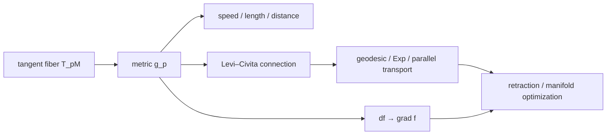

# Riemann 几何、测地线与流形优化

> [!abstract] 本章主问题
> GEO-02 只告诉我们每一点 $p$ 附近有一个线性空间 $T_pM$。本章再给每个 $T_pM$ 配置随 $p$ 光滑变化的内积 $g_p$，由此依次定义速度、长度、距离、梯度、联络、测地线、指数映射和优化更新。核心纪律是：几何对象不依赖坐标，但所有实际计算都要在坐标、嵌入或标架中完成；计算表示可以变，最终标量、向量和路径的几何意义必须相容。

> [!question] 初学者读完必须能回答
> 1. Riemannian metric 为什么不是 GEO-01 的 distance function，也不是机器学习里任意的“metric loss”？
> 2. 为什么 $df_p$ 本来是 covector，而 gradient 必须等选择 $g_p$ 后才成为 tangent vector？
> 3. 为什么普通二阶导数不能在流形上直接照搬，connection 到底修正了什么？
> 4. geodesic、局部最短曲线、全局最短曲线和直线插值有何关系？
> 5. exponential map、projection、normalization 和 retraction 各是什么，能否互换？
> 6. decoder pullback metric、natural gradient 和 orthogonality-constrained optimization 各自在哪个空间上做几何？

## 0. 学习合同、符号与路线

### 0.1 本章对象

除非另行说明：

- $M$ 是 $d$ 维 smooth manifold；
- $p,q\in M$；
- $T_pM$、$T_p^*M$ 分别是 tangent/cotangent space；
- $g$ 是 Riemannian metric，$g_p:T_pM\times T_pM\to\mathbb R$；
- 局部坐标写作 $x=(x^1,\ldots,x^d)$；
- $\partial_i=\partial/\partial x^i$，$g_{ij}=g(\partial_i,\partial_j)$；
- $(g^{ij})=(g_{ij})^{-1}$；
- 重复的上、下指标默认求和，但矩阵式会并排给出；
- $\bar f$ 表示定义在 ambient Euclidean neighborhood 上的 extension；
- $\operatorname{grad}f$ 固定表示 Riemannian gradient，$\nabla\bar f$ 表示 ambient Euclidean gradient；
- $\nabla_XY$ 中的 $\nabla$ 表示 connection，不能与 Euclidean gradient 混淆。

### 0.2 六层主线

这张图中有两条并行路线：

1. **测量路线**：metric $\to$ speed $\to$ length $\to$ Riemannian distance；
2. **微分路线**：metric $\to$ Levi–Civita connection $\to$ acceleration/geodesic；
3. **算法路线**：$df$ 经 metric 变成 gradient，再用 $\operatorname{Exp}$ 或 retraction 走有限步。

先用下图回答一个视觉问题：**位置相关内积怎样决定 gradient 与 geodesic，而一次可行的流形优化更新为何不能只做普通 Euclidean step？**

![[00-知识库管理/_assets/figures/geometry/fig-riemannian-geodesic-optimization-v2.svg|880]]

> [!figure] 图 10.10.3｜Riemannian metric、geodesic 与流形优化更新
> A 用不同基点处的单位椭圆表示 $g_p$ 随位置变化，并以 $g_p(v,w)=v^\top G(p)w$ 把 fixed differential 转成 metric-dependent gradient；B 对比满足 connection 零加速度的 geodesic、同端点绕行曲线与线性 chord，强调 affine parameter、local minimization 与 global shortest 不等价；C 将 ambient/coordinate differential、metric gradient、$\operatorname{Exp}_p$ 或 retraction step 及 feasibility/stationarity 验收串联。来源：独立绘制；理论接口参考 Riemannian metric、Levi–Civita connection、geodesic 与 manifold optimization；生成脚本：[[plot_geometry_foundations_v2.py]]；确定性几何示意，无随机种子。

**怎样读图。** A 先固定 $df_p$，观察 metric 改变 Riesz representation 后，steepest direction 与单位球一起改变；B 再分开三种对象：geodesic equation 是局部动力条件，长度局部极小需要额外邻域条件，全局 shortest 还受 cut locus 与 multiple geodesics 影响；C 最后按算法顺序读，先把 differential 变成 tangent gradient，再用 exact exponential 或声明阶数的 retraction 回到 manifold，并独立检查 constraint residual 与 stationarity。

**适用边界（图没有证明什么）。** 单位椭圆和曲线只是二维坐标示意，不给 coordinate invariance、Levi–Civita existence/uniqueness、Hopf–Rinow 或 convergence rate 的证明。Projection/normalization 只在满足 retraction 条件的特定 manifold/邻域中可用；它们一般不等于 exponential map。局部 geodesic 最短不等于任意端点间全局唯一最短，decoder pullback metric 也可能退化或病态。

### 0.3 先背下来的四个“不等于”

$$
\boxed{
\begin{aligned}
\text{Riemannian metric }g_p&\ne\text{point distance }d_g(p,q),\\
df_p&\ne \operatorname{grad}f(p),\\
\text{geodesic}&\ne\text{任意区间的全局最短路},\\
R_p(v)&\ne\operatorname{Exp}_p(v)\quad\text{一般情形}.
\end{aligned}}
$$

这些不是术语洁癖，而是后续证明和代码最常见的错误源。

## 1. 从 tangent space 到 Riemannian metric

### 1.1 为什么 manifold 本身还不够

Smooth manifold 只规定：

- 哪些点是附近的；
- 哪些坐标转换是 smooth 的；
- 怎样定义 tangent vector 和 differential。

它没有规定：

- tangent vector 的长度；
- 两个 tangent vector 的夹角；
- 哪条 curve 更短；
- $df_p$ 对应哪个“最陡”方向。

例如 $M=\mathbb R^2$ 可以配置 Euclidean metric，也可以配置

$$
g_{(x,y)}(u,v)=u^\top
\begin{bmatrix}
1&0\\0&e^{2x}
\end{bmatrix}v.
$$

underlying smooth manifold 完全相同，但长度、距离、geodesics 与 gradient 都会改变。

### 1.2 定义：Riemannian metric

> [!definition] Riemannian metric
> $M$ 上的 Riemannian metric 是一个 smooth $(0,2)$ tensor field $g$，使每个 $p\in M$ 上的双线性型
> $$g_p:T_pM\times T_pM\to\mathbb R$$
> 对称且正定：
> $$g_p(u,v)=g_p(v,u),\qquad g_p(v,v)>0\quad(v\ne0).$$

“smooth”可在任意 chart 中检查：系数

$$
g_{ij}(x)=g(\partial_i,\partial_j)
$$

都是 smooth functions。于是

$$
g=g_{ij}\,dx^i\otimes dx^j,
\qquad
\|v\|_{g,p}^2=g_p(v,v)=v^\top G(x)v.
$$

这里 $G(x)=[g_{ij}(x)]$ 只是 metric 在该 coordinate basis 下的 matrix，不是一个跨坐标固定不变的矩阵。

### 1.3 坐标变换律：分量变，对象不变

设新坐标 $y=y(x)$，写

$$
v_x=\frac{dx}{dt},
\qquad
v_y=\frac{dy}{dt}=J_{y\leftarrow x}v_x.
$$

要求同一向量的平方长度不变：

$$
v_x^\top G_xv_x=v_y^\top G_yv_y.
$$

代入 $v_y=Jv_x$ 得

$$
G_x=J^\top G_yJ,
\qquad
G_y=J^{-\top}G_xJ^{-1}.
$$

> [!warning] 主动变换与被动换坐标
> 若 $J$ 表示的方向相反，公式也相反。不要孤立背 $J^\top GJ$；先写清 vector components 怎样变，再由“平方长度不变”推 metric components。

### 1.4 Riemannian metric 与 point metric 的类型差异

| 对象 | 输入 | 输出 | 公理/条件 | 用途 |
|---|---|---|---|---|
| metric-space distance $d$ | 两个点 $(p,q)$ | 非负实数 | 非负、分离、对称、三角不等式 | topology、convergence、global distance |
| Riemannian metric $g$ | 同一点的两个 tangent vectors $(u,v)$ | 实数 | smooth、bilinear、symmetric、positive definite | infinitesimal length/angle |
| divergence | 两个模型/分布 | 非负数或扩展实数 | 通常不对称、无三角不等式 | loss/contrast |
| learned similarity | 两个表示 | 任意 score | 由任务决定 | retrieval/classification |

$g$ 通过 curve length 诱导 $d_g$，但二者不是同一种 typed object。

### 1.5 每个 smooth manifold 都有 metric 吗

在本课程采用的 Hausdorff、second-countable smooth manifold 定义下，$M$ 是 paracompact 的。可用 locally finite partition of unity 把各 chart 中的 Euclidean inner products 粘合成 global Riemannian metric。因此 metric 的存在通常不是困难；困难是：

- 哪个 metric 表达问题中真正的几何；
- 它是否可计算；
- 它是否条件良好；
- learning/data 是否足以识别它。

metric 并不由 smooth structure 唯一决定。

## 2. Metric 给出的局部线性代数

### 2.1 长度、角度、正交与单位球

对 $u,v\in T_pM$：

$$
\|v\|_{g,p}=\sqrt{g_p(v,v)},
$$

若 $u,v\ne0$，

$$
\cos\angle_g(u,v)
=\frac{g_p(u,v)}{\|u\|_{g,p}\|v\|_{g,p}}.
$$

正交指 $g_p(u,v)=0$。单位球

$$
\{v\in T_pM:g_p(v,v)=1\}
$$

在 coordinate components 中通常是 ellipse/ellipsoid，而不是 Euclidean circle/sphere。

若 $G=Q\Lambda Q^\top$，沿 $Q$ 第 $i$ 个方向的 coordinate radius 是 $1/\sqrt{\lambda_i}$。因此 eigenvalues 很悬殊意味着同样 coordinate step 在不同方向的 geometric length 差别很大。

### 2.2 Musical isomorphisms：vector 与 covector 的桥

metric 定义

$$
\flat_p:T_pM\to T_p^*M,
\qquad
v^\flat=g_p(v,\cdot),
$$

以及其逆

$$
\sharp_p:T_p^*M\to T_pM.
$$

coordinates 中，若 $v=(v^i)$，则

$$
v_i=g_{ij}v^j,
\qquad
\alpha^i=g^{ij}\alpha_j.
$$

这叫 lowering/raising indices。它不是“把 row 转成 column”，而是调用 $g$ 与 $g^{-1}$。

### 2.3 Riemannian gradient 从何而来

> [!definition] Riemannian gradient
> 对 smooth $f:M\to\mathbb R$，$\operatorname{grad}f(p)$ 是唯一满足
> $$
> g_p(\operatorname{grad}f(p),v)=df_p(v),
> \qquad \forall v\in T_pM
> $$
> 的 tangent vector。

因此

$$
\operatorname{grad}f=(df)^\sharp.
$$

coordinate matrix 中

$$
[\operatorname{grad}f]^i=g^{ij}\partial_jf,
\qquad
\operatorname{grad}f=G^{-1}\nabla_{\text{coord}}f.
$$

真正的计算应解线性方程

$$
Gv=\nabla_{\text{coord}}f
$$

而不是显式形成 $G^{-1}$。

> [!important] fixed differential, metric-dependent gradient
> $df_p$ 由 $f$ 和 smooth structure 决定；把它变成 vector 的 $\sharp$ 依赖 metric。因此同一 objective 在不同 metrics 下有不同 gradient vector field，却给同一个 directional derivative $df_p(v)$。

### 2.4 最速方向推导

在线性化下，希望在 unit tangent ball 中最大下降：

$$
\min_{\|v\|_{g,p}\le1}df_p(v).
$$

由定义和 Cauchy–Schwarz，

$$
df_p(v)=g_p(\operatorname{grad}f,v)
\ge-\|\operatorname{grad}f\|_g\|v\|_g.
$$

若 gradient 非零，最优方向是

$$
v_*=-\frac{\operatorname{grad}f}{\|\operatorname{grad}f\|_g}.
$$

所以“负 gradient 最陡”永远隐含“用哪个 inner product 测 step”。若约束是非 Hilbert norm 的 unit ball，最陡方向一般由 dual norm/duality map 给出，不一定是某个 Riemannian gradient。

### 2.5 Volume form 接口

在 oriented coordinate chart 中，Riemannian volume 写成

$$
d\operatorname{vol}_g
=\sqrt{\det G(x)}\,dx^1\wedge\cdots\wedge dx^d.
$$

换坐标时 $G$ 的 determinant 与 Jacobian determinant 正好补偿。这一公式连接：

- manifold 上积分；
- density 相对于 intrinsic volume 的定义；
- decoder 非方 Jacobian 的 volume factor；
- Laplace–Beltrami operator。

orientation、微分形式积分与 Stokes 的完整理论不在本章展开。

## 3. 六个必须会算的 metrics

### 3.1 Euclidean space

在 $M=\mathbb R^d$ 的 Cartesian coordinates 中，

$$
G(x)=I,
\quad
\operatorname{grad}f=\nabla f,
\quad
d_g(p,q)=\|p-q\|_2.
$$

这是特殊情形，不是定义本身。

### 3.2 Euclidean plane 的 polar coordinates

令

$$
F(r,\theta)=(r\cos\theta,r\sin\theta),
\qquad r>0.
$$

Jacobian columns 是

$$
\partial_rF=(\cos\theta,\sin\theta),
$$

$$
\partial_\theta F=(-r\sin\theta,r\cos\theta).
$$

由 ambient Euclidean inner product 诱导

$$
G=J_F^\top J_F
=\begin{bmatrix}1&0\\0&r^2\end{bmatrix},
$$

所以

$$
ds^2=dr^2+r^2d\theta^2.
$$

metric components 非常数，但 plane 的 Riemann curvature 为零。$r=0$ 处矩阵退化是 polar chart 失效，不是 Euclidean metric 退化。

### 3.3 Sphere 的 induced metric

unit sphere 的局部参数化

$$
F(\theta,\varphi)
=(\sin\theta\cos\varphi,
\sin\theta\sin\varphi,
\cos\theta)
$$

给出

$$
G=\begin{bmatrix}
1&0\\0&\sin^2\theta
\end{bmatrix},
\qquad
ds^2=d\theta^2+\sin^2\theta\,d\varphi^2.
$$

$\theta=0,\pi$ 的 determinant 为零仍是 spherical coordinate singularity；抽象 sphere 的 metric 在极点正定。

### 3.4 Embedded submanifold 的 induced metric

若 $M\subset\mathbb R^D$ 是 embedded submanifold，最常用选择是

$$
g_p(u,v)=u^\top v,
\qquad u,v\in T_pM\subset\mathbb R^D.
$$

若 local parametrization $F:U\subset\mathbb R^d\to M$ 是 immersion，coordinate metric 是

$$
G(z)=J_F(z)^\top J_F(z).
$$

因为 $J_F$ full column rank，$G$ 正定。若 rank collapse，$G$ 只半正定，不能定义 ordinary Riemannian metric。

### 3.5 Pullback metric

更一般地，smooth $F:M\to N$ 与 $N$ 上 metric $h$ 给

$$
(F^*h)_p(u,v)=h_{F(p)}(dF_pu,dF_pv).
$$

若 $F$ 是 immersion，则 $F^*h$ 正定；若 $dF_p$ 有 kernel，则 pullback 退化。

这正是 deterministic decoder $g:\mathcal Z\to\mathcal X\subseteq\mathbb R^D$ 的 latent metric：

$$
G(z)=J_g(z)^\top J_g(z).
$$

latent direction $v$ 的长度等于 decoded infinitesimal displacement：

$$
\|v\|_{G,z}=\|J_g(z)v\|_2.
$$

### 3.6 同一 manifold 上可有不同 metrics

在 SPD cone $\mathbb S_{++}^n$ 上，至少可选择：

1. ambient Frobenius metric $g_P(U,V)=\operatorname{tr}(UV)$；
2. affine-invariant metric

$$
g_P(U,V)=\operatorname{tr}(P^{-1}UP^{-1}V);
$$

3. log-Euclidean geometry，把 $P\mapsto\log P$ 送到 symmetric matrices 后使用 Euclidean metric。

它们给出不同 geodesics、distances 和 gradients。说“在 SPD manifold 上优化”仍不完整，必须声明 metric。

## 4. 从速度到长度、能量和距离

### 4.1 Curve speed 与 length

设 piecewise smooth curve $\gamma:[a,b]\to M$。速度是

$$
\dot\gamma(t)\in T_{\gamma(t)}M,
$$

speed 是

$$
\|\dot\gamma(t)\|_g
=\sqrt{g_{\gamma(t)}(\dot\gamma(t),\dot\gamma(t))}.
$$

length 定义为

$$
L_g(\gamma)=\int_a^b\|\dot\gamma(t)\|_g\,dt.
$$

coordinates 中

$$
L_g(\gamma)
=\int_a^b
\sqrt{g_{ij}(x(t))\dot x^i(t)\dot x^j(t)}\,dt.
$$

### 4.2 Length 对重参数不变

若 $\phi:[c,d]\to[a,b]$ smooth、严格递增且 onto，令 $\tilde\gamma=\gamma\circ\phi$，则

$$
\dot{\tilde\gamma}(s)=\dot\gamma(\phi(s))\phi'(s).
$$

因此

$$
L(\tilde\gamma)
=\int_c^d\|\dot\gamma(\phi(s))\|\phi'(s)ds
=L(\gamma).
$$

同一 oriented path image 走快走慢，length 不变。

### 4.3 Energy 不对任意重参数不变

定义

$$
E_g(\gamma)
=\frac12\int_a^b\|\dot\gamma(t)\|_g^2dt.
$$

由 Cauchy–Schwarz，

$$
L(\gamma)^2
=\left(\int_a^b1\cdot\|\dot\gamma\|dt\right)^2
\le(b-a)\int_a^b\|\dot\gamma\|^2dt,
$$

即

$$
\boxed{E(\gamma)\ge\frac{L(\gamma)^2}{2(b-a)}}.
$$

等号当且仅当 speed 几乎处处为常数。固定 path image 与时间区间时，constant-speed parametrization energy 最小。

> [!example] 同像、同长、不同能量
> 在 unit circle 上取 $\gamma_1(t)=(\cos\alpha t,\sin\alpha t)$ 与 $\gamma_2(t)=(\cos\alpha t^2,\sin\alpha t^2)$，$t\in[0,1]$。二者 image 和 length 都是 $\alpha$，但
> $$E(\gamma_1)=\frac12\alpha^2,\qquad E(\gamma_2)=\frac23\alpha^2.$$

### 4.4 Riemannian distance

在同一 connected component 上定义

$$
d_g(p,q)
=\inf\{L_g(\gamma):\gamma(a)=p,\gamma(b)=q\}.
$$

这是 genuine metric，并诱导原 manifold topology。证明要点是：

1. length 非负、反向 curve 同长，给非负与对称；
2. 拼接近最短 curves 给三角不等式；
3. 正定性与局部坐标中 $G(x)$ eigenvalues 在小 compact neighborhood 上有正下界有关；
4. 同一局部 eigenvalue 上下界还给 $d_g$ 与 Euclidean coordinate distance 的局部双向控制。

### 4.5 Ambient chord 与 intrinsic distance

若 $M\subset\mathbb R^D$ 使用 induced metric，则任何连接 $p,q$ 的 manifold curve 也在 ambient space，Euclidean fundamental theorem 给

$$
\|p-q\|_2\le L_g(\gamma).
$$

取 infimum 得

$$
\boxed{\|p-q\|_2\le d_g(p,q)}.
$$

unit sphere 上 antipodes 的 chord distance 是 $2$，geodesic distance 是 $\pi$。小距离时二者一阶接近，但全局可差很多。

### 4.6 Infimum 是否一定取到

不一定。Distance 的定义只要求 infimum。要保证任意两点由 minimizing geodesic 连接，需要 completeness 等全局条件，见第 7 节 Hopf–Rinow。

## 5. 为什么需要 connection

### 5.1 普通差分失去类型

Euclidean vector field $Y(x)$ 的 directional derivative 可写

$$
\lim_{t\to0}\frac{Y(x+tv)-Y(x)}t,
$$

因为所有 $Y(x+tv),Y(x)$ 属于同一个 vector space $\mathbb R^d$。

在 manifold 上，

$$
Y(\gamma(t))\in T_{\gamma(t)}M,
\qquad
Y(\gamma(0))\in T_{\gamma(0)}M.
$$

不同 tangent fibers 没有 canonical subtraction。Connection 正是规定如何微分、比较或 transport 这些 fiber-dependent vectors。

### 5.2 Affine connection 的定义

> [!definition] Connection
> connection 是映射
> $$
> \nabla:\mathfrak X(M)\times\mathfrak X(M)\to\mathfrak X(M),
> \qquad (X,Y)\mapsto\nabla_XY,
> $$
> 满足：
> $$
> \nabla_{fX+hZ}Y=f\nabla_XY+h\nabla_ZY,
> $$
> $$
> \nabla_X(Y+Z)=\nabla_XY+\nabla_XZ,
> $$
> $$
> \nabla_X(fY)=X[f]Y+f\nabla_XY.
> $$

它在第一参数上 $C^\infty(M)$-linear，在第二参数上遵循 Leibniz rule。

### 5.3 Christoffel symbols

在 coordinate frame 中定义

$$
\nabla_{\partial_i}\partial_j
=\Gamma^k_{ij}\partial_k.
$$

若 $Y=Y^j\partial_j$，则

$$
\nabla_{\partial_i}Y
=\left(\partial_iY^k+\Gamma^k_{ij}Y^j\right)\partial_k.
$$

$\partial_iY^k$ 单独不按 vector law 变换；$\Gamma$ 的非 tensor transformation term 正好补偿，使整体 $\nabla_XY$ 成为 geometric vector field。

> [!warning] Christoffel symbols 不是 tensor
> 可以在指定点选择 normal coordinates 让 $\Gamma^k_{ij}(p)=0$，但不能由此推出 connection 或 curvature 在该点为零。Curvature 涉及 $\Gamma$ 的导数和二次项。

### 5.4 Torsion 与 metric compatibility

connection 的 torsion 是

$$
T(X,Y)=\nabla_XY-\nabla_YX-[X,Y].
$$

torsion-free 指 $T=0$。

metric-compatible 指

$$
X[g(Y,Z)]
=g(\nabla_XY,Z)+g(Y,\nabla_XZ).
$$

它表示 parallel transport 保持 inner products、lengths 和 angles。

### 5.5 Levi–Civita 基本定理

> [!theorem] Fundamental theorem of Riemannian geometry
> 每个 Riemannian manifold $(M,g)$ 上存在唯一一个同时 torsion-free 且 metric-compatible 的 connection，称为 Levi–Civita connection。

证明的核心是 Koszul formula：

$$
\begin{aligned}
2g(\nabla_XY,Z)
={}&Xg(Y,Z)+Yg(Z,X)-Zg(X,Y)\\
&-g(X,[Y,Z])+g(Y,[Z,X])+g(Z,[X,Y]).
\end{aligned}
$$

右侧只由 $g$ 与 Lie bracket 决定；Riesz/musical identification 唯一决定 $\nabla_XY$，给唯一性。反过来用该式定义 $\nabla$ 并逐项验证 connection、torsion-free 与 compatibility，给存在性。

### 5.6 Levi–Civita Christoffel formula

coordinate vector fields commute：$[\partial_i,\partial_j]=0$。将 Koszul formula 代入得

$$
2g_{k\ell}\Gamma^\ell_{ij}
=\partial_i g_{jk}+\partial_j g_{ik}-\partial_k g_{ij}.
$$

乘 $g^{mk}$：

$$
\boxed{
\Gamma^m_{ij}
=\frac12g^{mk}
(\partial_i g_{jk}+\partial_j g_{ik}-\partial_k g_{ij})}.
$$

$\Gamma^m_{ij}=\Gamma^m_{ji}$ 对应 torsion-free。

### 5.7 沿 curve 的 covariant derivative

若 $V(t)=V^k(t)\partial_k|_{\gamma(t)}$ 是 along $\gamma$ 的 vector field，定义

$$
\frac{DV}{dt}=\nabla_{\dot\gamma}V.
$$

coordinates 中

$$
\frac{DV^k}{dt}
=\dot V^k+\Gamma^k_{ij}(\gamma(t))\dot\gamma^iV^j.
$$

$DV/dt=0$ 称 $V$ 沿 $\gamma$ parallel。给定初值 $V(a)=v$，这是线性 ODE，局部唯一；metric compatibility 给

$$
\frac d{dt}g(V,W)=0
$$

当 $V,W$ 都 parallel。

## 6. Geodesic：零协变加速度

### 6.1 定义与坐标方程

> [!definition] Affinely parametrized geodesic
> smooth curve $\gamma$ 若满足
> $$
> \frac{D\dot\gamma}{dt}
> =\nabla_{\dot\gamma}\dot\gamma=0,
> $$
> 则称 geodesic。

coordinates 中：

$$
\boxed{
\ddot x^k+\Gamma^k_{ij}(x)\dot x^i\dot x^j=0}.
$$

这是 smooth second-order ODE。给定 $p$ 与 $v\in T_pM$，存在唯一 maximal geodesic 满足

$$
\gamma(0)=p,
\qquad
\dot\gamma(0)=v.
$$

### 6.2 Geodesic speed 恒定

由 metric compatibility：

$$
\frac d{dt}g(\dot\gamma,\dot\gamma)
=2g(\nabla_{\dot\gamma}\dot\gamma,\dot\gamma)=0.
$$

所以 affinely parametrized geodesic 有 constant speed。非线性重参数后，path image 仍可能是 geodesic image，但不再满足零协变加速度的仿射参数方程。

### 6.3 从 energy first variation 得到 geodesic

令 $\Gamma(s,t)$ 是固定端点 variation，$T=\partial_t\Gamma$，$V=\partial_s\Gamma$。利用 torsion-free、metric compatibility 与分部积分：

$$
\left.\frac d{ds}E(\Gamma_s)\right|_{s=0}
=-\int_a^b g\!\left(V,\frac{DT}{dt}\right)dt
+\left[g(V,T)\right]_a^b.
$$

固定端点给 $V(a)=V(b)=0$，边界项消失：

$$
\delta E(V)
=-\int_a^b g(V,\nabla_TT)dt.
$$

若对所有 fixed-endpoint variations 都为零，fundamental lemma 给

$$
\nabla_TT=0.
$$

因此 geodesics 是 energy critical curves。Critical 不等于 global minimum。

### 6.4 “测地线 = 最短路”怎样修正

严格层级是：

1. geodesic：零协变加速度；
2. sufficiently short geodesic segment：在 normal neighborhood 内局部最短；
3. minimizing geodesic：其 length 实现 $d_g(p,q)$；
4. geodesic 延长后：可能经过 cut point，失去全局最短性；
5. closed geodesic：可以回到起点，显然整圈不是两相同端点间最短路。

unit sphere 上 great circles 是 geodesics。从北极到南极有无穷多条长度 $\pi$ 的 minimizing semicircles；继续走超过南极，原 great-circle segment 不再 minimizing。

### 6.5 Polar coordinates 中的平面 geodesic

对

$$
G=\operatorname{diag}(1,r^2),
$$

非零 Christoffel symbols 是

$$
\Gamma^r_{\theta\theta}=-r,
\qquad
\Gamma^\theta_{r\theta}
=\Gamma^\theta_{\theta r}=\frac1r.
$$

geodesic equations：

$$
\ddot r-r\dot\theta^2=0,
$$

$$
\ddot\theta+\frac2r\dot r\dot\theta=0.
$$

它们看似复杂，转换回 Cartesian coordinates 后仍是直线。这说明 $\Gamma\ne0$ 可纯粹来自 curvilinear coordinates。

### 6.6 Sphere geodesic 的 ambient 解释

unit sphere 上 $\gamma(t)$ 满足 $\|\gamma\|=1$。若 constant speed 为 $c$，对 constraint 求两次导数：

$$
\gamma^\top\dot\gamma=0,
$$

$$
\gamma^\top\ddot\gamma=-\|\dot\gamma\|^2=-c^2.
$$

geodesic 的 intrinsic acceleration 为零，故 ambient acceleration 纯 normal：

$$
\ddot\gamma=-c^2\gamma.
$$

解为 great circle：

$$
\gamma(t)=\cos(ct)p+\sin(ct)u,
$$

其中 $u\in T_pS^{n-1}$、$\|u\|=1$。

## 7. Exponential map、normal neighborhood 与 completeness

### 7.1 Exponential map

令 $\gamma_v$ 是满足

$$
\gamma_v(0)=p,
\qquad
\dot\gamma_v(0)=v
$$

的 geodesic。只要解在 $t=1$ 存在，定义

$$
\operatorname{Exp}_p(v)=\gamma_v(1).
$$

由时间缩放也可写

$$
\operatorname{Exp}_p(tv)=\gamma_v(t).
$$

在 $v=0$ 附近，

$$
\operatorname{Exp}_p(0)=p,
\qquad
D\operatorname{Exp}_p(0)=\operatorname{id}_{T_pM}.
$$

inverse function theorem 因此保证：存在 $0$ 的 neighborhood，使 $\operatorname{Exp}_p$ 是到 $p$ 附近 normal neighborhood 的 diffeomorphism。

### 7.2 Logarithmic map 只是局部对象

在上述 normal neighborhood 内定义

$$
\operatorname{Log}_p(q)=\operatorname{Exp}_p^{-1}(q).
$$

并有

$$
d_g(p,q)=\|\operatorname{Log}_p(q)\|_g.
$$

全局上 $\operatorname{Log}_p$ 可能：

- 多值：存在多条 minimizing geodesics；
- 不连续：跨越 cut locus；
- 不存在：非完备 manifold 或超出 exponential domain；
- 数值不稳定：接近 conjugate/cut points。

Sphere 上当 $q\ne-p$ 时，令 $\theta=\arccos(p^\top q)$，则

$$
\operatorname{Log}_p(q)
=\frac{\theta}{\sin\theta}(q-\cos\theta\,p).
$$

当 $q\to-p$，$\sin\theta\to0$，方向变得不唯一，公式条件恶化。

### 7.3 Sphere exponential map

对 $v\in T_pS^{n-1}$，

$$
\operatorname{Exp}_p(v)
=\cos\|v\|\,p
+\sin\|v\|\frac v{\|v\|},
$$

并以连续延拓定义 $v=0$。这条 closed form 是例外；一般 manifold 的 $\operatorname{Exp}$ 需要解 geodesic ODE。

### 7.4 Injectivity radius 与 cut locus

$p$ 的 injectivity radius 是 $\operatorname{Exp}_p$ 保持 diffeomorphic 的最大 radial size 的下确界式刻画。Cut locus 是 minimizing geodesic 首次失去唯一最短延拓的端点集合。两种失败机制要区分：

1. 多条 geodesics 到达同一点；
2. differential $D\operatorname{Exp}_p$ 变奇异，出现 conjugate behavior。

本章只把它们作为算法边界：不能把 global `log` 当作随处唯一可微的 primitive。

### 7.5 Geodesic completeness 与 metric completeness

- **geodesically complete**：每条 geodesic 可对所有 $t\in\mathbb R$ 延拓；
- **metrically complete**：$(M,d_g)$ 中每个 Cauchy sequence 收敛于 $M$ 中一点。

> [!theorem] Hopf–Rinow（connected finite-dimensional Riemannian manifold）
> 以下性质等价：
> 1. $(M,d_g)$ complete；
> 2. $M$ geodesically complete；
> 3. 对某个/每个 $p$，$\operatorname{Exp}_p$ 定义在整个 $T_pM$；
> 4. closed and bounded subsets 在 $d_g$ 下 compact。
> 并且任意两点间存在 minimizing geodesic。

有限维、connected、Riemannian 条件不能悄悄删除。Infinite-dimensional manifolds 上 Hopf–Rinow 的等价关系一般失效。

### 7.6 一个非完备例子

开单位 ball $B(0,1)\subset\mathbb R^d$ 配 Euclidean metric。径向 geodesic

$$
\gamma(t)=tv,
\qquad \|v\|=1
$$

在 $t\uparrow1$ 撞到缺失 boundary，不能作为 $B(0,1)$ 内 curve 继续；同时 $p_n=(1-1/n)v$ 是 Cauchy sequence，却在 $B(0,1)$ 内无极限。

## 8. Curvature：本章只建立算法接口

### 8.1 为什么每点 Euclidean 仍可整体弯曲

每个 $T_pM$ 都是 inner-product space，且可选 orthonormal basis；normal coordinates 甚至令

$$
G(p)=I,
\qquad
\partial_k g_{ij}(p)=0,
\qquad
\Gamma^k_{ij}(p)=0.
$$

但二阶变化不能一般消掉。Curvature 捕捉“局部一阶 Euclidean、二阶不能同时拉直”的 obstruction。

### 8.2 Riemann curvature operator

固定本章符号约定：

$$
R(X,Y)Z
=\nabla_X\nabla_YZ
-\nabla_Y\nabla_XZ
-\nabla_{[X,Y]}Z.
$$

不同教材可能整体取负号；引用 sectional/Ricci formula 时必须核对 convention。

$R$ 可以理解为：

- covariant derivatives 不交换的误差；
- infinitesimal loop parallel transport 的 holonomy；
- nearby geodesics 偏离 Euclidean linear spreading 的来源。

### 8.3 Sectional curvature

对 linearly independent $u,v\in T_pM$，

$$
K(u,v)
=\frac{g(R(u,v)v,u)}
{g(u,u)g(v,v)-g(u,v)^2}.
$$

它只依赖 span$(u,v)$。Euclidean space $K=0$；unit sphere 按本 convention 有 $K=1$；hyperbolic space 有 constant negative curvature。

### 8.4 Curvature 如何影响后续 AI/optimization

Curvature 影响：

- geodesics 的聚焦/发散；
- convex neighborhoods 的大小；
- exponential/logarithmic map 的 condition；
- geodesic convexity 与 convergence constants；
- volume growth、Brownian motion 与 heat kernel；
- hierarchical embedding 的 distance geometry。

但“某模型 embedding 看起来弯曲”不等于已估计 Riemann curvature。需要 metric、其 derivatives、regularity 和 sampling/estimation analysis。

## 9. Riemannian optimization 的对象合同

### 9.1 问题形式

考虑

$$
\min_{x\in M}f(x).
$$

这可以来自：

- equality constraints 的 regular level set；
- sphere/Stiefel/Grassmann/rotation/SPD/fixed-rank manifold；
- quotient structure 中的 parameter redundancy；
- 本来就定义在 abstract manifold 上的 objective。

完整算法合同至少写：

$$
(M,g,f,R,\text{transport},\text{step rule},\text{stopping rule}).
$$

只写“使用 Riemannian SGD”仍信息不足。

### 9.2 一阶最优性条件

若 $x_*$ 是 local minimizer 且无 boundary，则对任意 $v\in T_{x_*}M$ 取 curve $\gamma(0)=x_*$、$\dot\gamma(0)=v$，一元函数 $f\circ\gamma$ 在 $0$ 有极小：

$$
df_{x_*}(v)=0,
\qquad\forall v\in T_{x_*}M.
$$

等价于

$$
\boxed{\operatorname{grad}f(x_*)=0}.
$$

这是必要条件，不保证 local/global minimum。

### 9.3 Embedded submanifold 上的 gradient

若 $M\subset\mathbb R^D$ 配 induced metric，$f=\bar f|_M$，则

$$
df_x(v)=\nabla\bar f(x)^\top v
=g_x(P_x\nabla\bar f(x),v),
$$

故

$$
\boxed{
\operatorname{grad}f(x)=P_x\nabla\bar f(x)}
$$

其中 $P_x$ 是到 $T_xM$ 的 Euclidean orthogonal projector。

若 metric 不是 induced Euclidean metric，简单正交投影公式一般不成立。

### 9.4 Retraction：把 tangent step 映回 manifold

> [!definition] Retraction
> smooth map $R:TM\to M$ 若对所有 $x$ 满足
> $$R_x(0_x)=x,$$
> $$DR_x(0_x)=\operatorname{id}_{T_xM},$$
> 则称 retraction。

第二式表示：$t\mapsto R_x(tv)$ 在 $t=0$ 的初速度正是 $v$。因此

$$
R_x(v)=\operatorname{Exp}_x(v)+O(\|v\|^2)
$$

以局部坐标理解；若是 second-order retraction，则与 geodesic 的二阶 acceleration 相容，点误差常提升到 $O(\|v\|^3)$。

Exponential map 是 retraction，但实际算法可使用更便宜的 normalization、QR、polar 或其他结构化 retraction。

### 9.5 Sphere normalization retraction

对 $x\in S^{n-1}$、$v\in T_xS^{n-1}$：

$$
R_x(v)=\frac{x+v}{\|x+v\|}.
$$

因为 $x^\top v=0$，

$$
\|x+v\|=\sqrt{1+\|v\|^2},
$$

展开得

$$
R_x(v)
=x+v-\frac12\|v\|^2x
-\frac12\|v\|^2v+O(\|v\|^4).
$$

而

$$
\operatorname{Exp}_x(v)
=x+v-\frac12\|v\|^2x
-\frac16\|v\|^2v+O(\|v\|^4).
$$

所以二者差是 $O(\|v\|^3)$。直接 Euler point $x+v$ 的 squared-norm residual 是

$$
\|x+v\|^2-1=\|v\|^2.
$$

这正是实验 Track C 验证的二阶/三阶分账。

### 9.6 Riemannian gradient descent

基本迭代：

$$
\eta_k=-\alpha_k\operatorname{grad}f(x_k),
$$

$$
x_{k+1}=R_{x_k}(\eta_k).
$$

它包含两个不同近似：

1. 用 first-order model 选择 tangent direction；
2. 用 retraction 代替 exact exponential/geodesic step。

### 9.7 一个可审核的下降定理

假设 $f$ 沿 retraction 满足统一 quadratic upper model：对所考虑的 $x$、$\eta$，

$$
f(R_x(\eta))
\le f(x)+g_x(\operatorname{grad}f(x),\eta)
+\frac L2\|\eta\|_x^2.
$$

取 $\eta=-\alpha\operatorname{grad}f(x)$：

$$
f(x_+)
\le f(x)
-\alpha\left(1-\frac{L\alpha}{2}\right)
\|\operatorname{grad}f(x)\|^2.
$$

若 $0<\alpha\le1/L$，则

$$
f(x_+)
\le f(x)-\frac\alpha2\|\operatorname{grad}f(x)\|^2.
$$

若 $f\ge f_{\inf}$，对 $k=0,\ldots,K-1$ 求和：

$$
\min_{0\le k<K}\|\operatorname{grad}f(x_k)\|^2
\le
\frac{2(f(x_0)-f_{\inf})}{\alpha K}.
$$

因此得到 first-order stationarity 的 $O(1/K)$ squared-gradient bound。注意它不是 global optimality，也没有在任意 metric/retraction 上自动成立；关键假设是 uniform retraction-smooth upper model 和 lower bounded objective。

### 9.8 Backtracking line search

当 $L$ 未知，可从 trial $\alpha$ 开始，检查 Armijo condition：

$$
f(R_x(-\alpha\operatorname{grad}f(x)))
\le f(x)-c\alpha\|\operatorname{grad}f(x)\|^2,
\quad c\in(0,1).
$$

失败则 $\alpha\leftarrow\rho\alpha$，$\rho\in(0,1)$。工程上还需：

- 限制最大回退次数；
- 监控 retraction domain；
- 记录 objective evaluation cost；
- 不把浮点下的“几乎可行”当作 exact manifold membership。

### 9.9 Vector transport

Momentum、conjugate gradient、quasi-Newton 要把 $T_{x_k}M$ 中的 vector 与 $T_{x_{k+1}}M$ 中的 vector 组合。不能直接相加。需要 transport

$$
\mathcal T_{\eta}:T_xM\to T_{R_x(\eta)}M.
$$

parallel transport 是几何基准，但可能昂贵；retraction differential 或 tangent projection 可给 practical vector transport。必须审计它是否 linear、bounded、isometric 或只是 first-order compatible。

### 9.10 Riemannian Hessian

定义

$$
\operatorname{Hess}f(x)[v]
=\nabla_v\operatorname{grad}f.
$$

Levi–Civita connection 下它对应 symmetric bilinear form

$$
\operatorname{Hess}f(x)(u,v)
=g_x(\nabla_u\operatorname{grad}f,v).
$$

Second-order necessary condition：local minimizer 处 gradient 为零且 Hessian positive semidefinite。Newton/trust-region 还需 linear solve、model accuracy、retraction order 与 negative-curvature handling；完整算法留优化进阶专题。

## 10. Sphere、Stiefel 与 SPD 三个算法例子

### 10.1 Sphere：线性 objective

令

$$
f(x)=-c^\top x,
\qquad \|x\|=1.
$$

Ambient gradient 是 $-c$，tangent projector $P_x=I-xx^\top$，所以

$$
\operatorname{grad}f(x)
=-(I-xx^\top)c.
$$

stationarity 表示 $c$ 与 $x$ 共线；$x=c/\|c\|$ 是 global minimizer，$x=-c/\|c\|$ 是 global maximizer。仅用 gradient norm 为零不能区分二者。

### 10.2 Stiefel manifold

$$
\operatorname{St}(n,r)
=\{Y\in\mathbb R^{n\times r}:Y^\top Y=I_r\}.
$$

Tangent condition：

$$
T_Y\operatorname{St}(n,r)
=\{Z:Y^\top Z+Z^\top Y=0\}.
$$

在 ambient Frobenius metric 下，orthogonal tangent projection 是

$$
P_Y(A)=A-Y\operatorname{sym}(Y^\top A),
$$

其中

$$
\operatorname{sym}(B)=\frac12(B+B^\top).
$$

可用 thin QR retraction 或 polar retraction：

$$
R_Y(Z)=\operatorname{qf}(Y+Z),
$$

或

$$
R_Y(Z)=(Y+Z)\big((Y+Z)^\top(Y+Z)\big)^{-1/2}.
$$

QR 需固定 diagonal sign convention 才能局部 smooth；polar 需 full column rank neighborhood。Stiefel 还可采用 canonical metric，届时 gradient/connection 公式改变。

### 10.3 Grassmann 与 parameter redundancy

若 objective 只依赖 column span，$Y$ 与 $YQ$（$Q\in O(r)$）表示同一点。真正空间是 quotient

$$
\operatorname{Gr}(n,r)
=\operatorname{St}(n,r)/O(r).
$$

在 Stiefel 上直接优化可能沿 gauge directions 重复表示；Grassmann geometry 要区分 vertical/horizontal spaces。完整 quotient theory 留后续，但 AI 中低秩因子和表示规范冗余必须注意这条边界。

### 10.4 SPD affine-invariant geometry

在 $P\in\mathbb S_{++}^n$、$U\in T_P\mathbb S_{++}^n=\mathbb S^n$ 上：

$$
\operatorname{Exp}_P(U)
=P^{1/2}
\exp(P^{-1/2}UP^{-1/2})
P^{1/2}.
$$

Distance：

$$
d(P,Q)
=\left\|
\log(P^{-1/2}QP^{-1/2})
\right\|_F.
$$

这是 congruence-invariant geometry。数值实现不应无条件显式求 inverse/square root；应使用 symmetric eigendecomposition/Cholesky solve，并监控最小 eigenvalue 和 condition number。

## 11. AI 中的四个 Riemannian 接口

### 11.1 Decoder pullback geometry

Deterministic decoder

$$
g:\mathbb R^d\supset\mathcal Z\to\mathbb R^D
$$

若处处 full column rank，latent space 获得 pullback metric

$$
G(z)=J_g(z)^\top J_g(z).
$$

对 latent curve $z(t)$：

$$
L_G(z)
=\int\sqrt{\dot z^\top G(z)\dot z}\,dt
=\int\left\|\frac d{dt}g(z(t))\right\|_2dt.
$$

所以 latent geodesic 是 decoded curve length 的临界/局部最短候选；straight latent interpolation 则只对 Euclidean latent metric 特殊。

### 11.2 Rank collapse 与 metric conditioning

若 $\sigma_{\min}(J_g(z))\to0$，则

$$
\lambda_{\min}(G(z))=\sigma_{\min}(J_g(z))^2\to0.
$$

后果包括：

- $G^{-1}$ 或 gradient solve 放大误差；
- length 对某些 latent directions 几乎不敏感；
- Christoffel/geodesic ODE 变 stiff 或不稳定；
- decoder 不再是 immersion，普通 Riemannian model 失效。

工程审计至少记录：

$$
\lambda_{\min}(G),\quad
\lambda_{\max}(G),\quad
\kappa(G),\quad
\|G-G^\top\|,
$$

以及这些量在 train/validation/off-support paths 上的分布。

### 11.3 Stochastic decoder 的条件

若 decoder 输出 distribution 而非 deterministic point，选择 latent geometry 需要先声明 output-space comparison。对 diagonal Gaussian decoder，以 expected squared ambient displacement 作局部近似时常出现

$$
G(z)\approx
J_\mu(z)^\top J_\mu(z)
+J_\sigma(z)^\top J_\sigma(z),
$$

但系数和额外项依 parameterization/loss 定义而异。不能把 deterministic $J_g^\top J_g$ 无条件复制到任意 probabilistic decoder。

### 11.4 Geodesic interpolation 的研究声明阶梯

可允许的声明按强度递增：

1. **计算事实**：某离散 solver 找到 path，energy/length 比 baseline 小；
2. **局部几何事实**：metric SPD、ODE residual 小、path 位于 audited chart/domain；
3. **最短路候选**：多初值/多算法得到一致较小解；
4. **global minimizing geodesic**：还需理论/证书排除其他 homotopy/local minima；
5. **semantic interpolation 更好**：还需预注册的人类/下游指标与统计不确定性。

“图更平滑”最多是经验层证据，不证明 metric 真实或路径全局最短。

### 11.5 Natural gradient 与 Fisher geometry

对 statistical model $p_\theta(y)$，Fisher information

$$
F(\theta)
=\mathbb E_{Y\sim p_\theta}
[\nabla_\theta\log p_\theta(Y)
\nabla_\theta\log p_\theta(Y)^\top]
$$

在 identifiable regular model 上可给 parameter manifold 的 Riemannian metric。Natural gradient 是

$$
\widetilde\nabla L
=F(\theta)^{-1}\nabla_\theta L.
$$

它与本章 $G^{-1}df$ 完全同型，但有特殊统计来源。边界：

- overparameterization/symmetry 可使 $F$ singular；
- empirical/mini-batch Fisher、GGN 与 exact Fisher 不总相同；
- damping $F+\lambda I$ 改变 metric/step；
- block-diagonal/K-FAC 等 approximation 只近似 invariance；
- natural-gradient direction 仍需 step size，不能自动保证 loss 下降。

### 11.6 Manifold constraint 与 preconditioning 不同

- **Riemannian constrained optimization**：parameter $x$ 必须留在 $M$，gradient 属于 $T_xM$；
- **natural gradient/preconditioning**：parameter domain 可能仍是 open Euclidean set，只是 tangent metric 改变；
- **mirror descent**：通常由 Bregman geometry/dual coordinates 给 update，未必等于某 Riemannian exponential step；
- **normalization layer**：输出落在 sphere 不自动意味着训练算法是 Riemannian optimization。

### 11.7 Orthogonal/low-rank AI parameters

Orthogonal weights、subspace learning、PCA、fixed-rank completion 与部分 LoRA parameterizations 可用 matrix-manifold geometry。但必须问：

1. 约束对象是 weight、update 还是 optimizer direction？
2. Stiefel 还是 Grassmann，是否存在 right-orthogonal redundancy？
3. metric 是 Frobenius/canonical/任务自适应中的哪一个？
4. update 用 exact exponential、QR、polar 还是一阶 normalize？
5. finite-step orthogonality residual 和 task loss 如何共同报告？

科学空间“流形上的最速下降”系列提供问题入口；一般流形算法的定理不能由具体 sphere/Stiefel 推导自动替代。

### 11.8 Hyperbolic representation 接口

Negative-curvature spaces 可用来表示层级距离，但完整声明必须包含：

- model：Poincaré ball、hyperboloid 或其他；
- curvature scale；
- metric、distance、Exp/Log 的具体 convention；
- boundary 数值稳定化；
- Euclidean baseline 与 parameter-count/control；
- hierarchy metric 的统计验证。

仅把 embedding 画在 disk 中不证明学到了 hyperbolic geometry。

## 12. 数值实现与自动微分审计

### 12.1 不要显式求 metric inverse

计算 $v=G^{-1}b$ 时优先：

1. Cholesky factorization（确认 SPD）；
2. symmetric solve；
3. matrix-free CG（大规模且可实现 $Gv$）；
4. 必要时 damping/regularization，并披露其几何含义。

显式 `inverse` 同时损害稳定性和效率。

### 12.2 SPD 审计

浮点计算中的基本门：

$$
\frac{\|G-G^\top\|_F}{\|G\|_F},
\qquad
\lambda_{\min}(\tfrac12(G+G^\top)),
\qquad
\kappa_2(G).
$$

若使用 $G_\varepsilon=G+\varepsilon I$，必须报告 $\varepsilon$ 绝对值、相对 spectrum 和结果敏感性；这已改变 geometry，不只是“数值小技巧”。

### 12.3 Christoffel 计算成本

Naive dense coordinates 需要：

- $d^2$ metric entries；
- $d^3$ first derivatives/index contractions；
- repeated linear solves。

高维 latent/parameter space 中常不应显式 materialize 全部 $\Gamma^k_{ij}$。可用 JVP/VJP、energy variation、Hamiltonian formulation 或结构化 metric product 计算所需 contractions。

### 12.4 Geodesic boundary-value problem

给 initial $(p,v)$ 解 geodesic 是 IVP；给 endpoints $(p,q)$ 找 geodesic 是 BVP。常见方法：

- shooting：优化 initial velocity 使 $\operatorname{Exp}_p(v)\approx q$；
- path discretization：直接优化 nodes 的 energy/length；
- graph initialization + continuous refinement；
- multiple starts 处理多个 local solutions。

要同时报告 endpoint residual、ODE/variational residual、length、energy、constraint residual 和 solver tolerances。

### 12.5 Length 与 energy 离散化

离散 nodes $z_0,\ldots,z_N$ 时，直接把

$$
\sum_i\|z_{i+1}-z_i\|_2
$$

称作 Riemannian length 是错误的。至少应在 midpoint/segment 上使用 metric，或 decode 后测 ambient chord，并说明 quadrature order。Energy objective 还会偏好参数分布，必要时重参数化或加入 equal-speed control。

### 12.6 Retraction 的验收

对随机 tangent $v$ 与尺度 $t$，检查：

$$
R_x(0)=x,
$$

$$
\frac{R_x(tv)-x}{t}\to v
$$

（在 chart/ambient tangent comparison 中），以及 constraint residual。若声称 second-order，比较 $R_x(tv)$ 与 $\operatorname{Exp}_x(tv)$ 或 intrinsic acceleration，预期相应阶数。

### 12.7 Gradient check

随机 unit tangent $v$，检查

$$
\frac{f(R_x(hv))-f(R_x(-hv))}{2h}
\approx g_x(\operatorname{grad}f(x),v).
$$

扫 $h$ 应先显示 $O(h^2)$ truncation region，再出现 roundoff region。只测一个 $h$ 不能区分公式错误与偶然抵消。

### 12.8 Coordinate-invariance check

在 overlap 上用两 charts 独立计算同一：

- tangent norm；
- curve length；
- $df(v)$；
- geodesic image 或 objective value。

分量会变，不变量应在 tolerance 内一致。若 chart 靠近 singularity，condition number 可能放大误差；应记录 Jacobian condition。

## 13. 常见误区与最小修正

| 错误说法 | 错在哪里 | 最小修正 |
|---|---|---|
| “metric 是两点距离矩阵” | 把 $g_p$ 与 $d_g$ 混型 | $g_p$ 作用于同一点 tangent vectors；$d_g$ 由 path-length infimum 诱导 |
| “$df$ 就是 gradient” | covector 与 vector 混型 | $\operatorname{grad}f=(df)^\sharp$，需声明 metric |
| “$G(x)$ 非常数，所以空间有曲率” | curvilinear coordinates 也给非常数分量 | 计算 coordinate-invariant curvature；polar plane 是反例 |
| “Christoffel symbols 是 tensor” | transformation law 含二阶坐标项 | 整体 $\nabla_XY$ 才是 vector field |
| “测地线总是两点最短路” | critical/local 与 global 混淆 | 只在适当 normal neighborhood/minimizing segment 成立 |
| “energy 等于 length” | 一个平方 speed，一个不平方 | 固定时间与常速时有 $E=L^2/[2(b-a)]$ |
| “Exp 是全局一一映射” | cut locus/conjugate points | 只在 normal neighborhood 保证 local diffeomorphism |
| “retraction 就是 Exp” | retraction 只要求一阶相容 | 标明 exact Exp、first/second-order retraction |
| “tangent step 自动保约束” | 只一阶可行 | 用 retraction/projection，并报告 finite-step residual |
| “ambient projection 公式普适” | 依赖 embedding 与 induced metric | 一般 metric 要由定义解 gradient |
| “Fisher 总可逆” | redundancy/overparameterization 可退化 | 检查 rank、quotient 与 damping effect |
| “latent geodesic 就更语义” | 几何与语义证据不同 | 另做下游/人类评估和统计检验 |

## 14. 三条完整推导链

### 14.1 从 metric 到 distance

$$
g_p
\Rightarrow
\|v\|_{g,p}
\Rightarrow
\|\dot\gamma(t)\|_g
\Rightarrow
L_g(\gamma)
\Rightarrow
d_g(p,q)=\inf_\gamma L_g(\gamma).
$$

每个箭头的条件：positive definiteness、piecewise smooth curves、same connected component。最后 $d_g$ 是 global point metric，不能倒过来只凭一个 arbitrary distance 唯一恢复 smooth Riemannian metric。

### 14.2 从 metric 到 geodesic

$$
g
\overset{\text{torsion-free + compatible}}{\Longrightarrow}
\nabla^{LC}
\Longrightarrow
\nabla_{\dot\gamma}\dot\gamma=0
\Longleftrightarrow
\gamma\text{ energy-critical}.
$$

最后等价要求 fixed endpoints 与 affine/constant-speed parameter 处理正确。

### 14.3 从 objective 到 feasible update

$$
f
\Rightarrow
df_x
\overset{g^{-1}}{\Rightarrow}
\operatorname{grad}f(x)
\Rightarrow
\eta=-\alpha\operatorname{grad}f(x)
\overset{R_x}{\Rightarrow}
x_+\in M.
$$

这条链中：autodiff 通常给 differential/ambient gradient components；metric solve/projection 给 tangent gradient；retraction 才给 finite feasible point。

## 15. 来源、证据分工与科学空间接口

### 15.1 正式理论骨架

- John M. Lee, *Introduction to Riemannian Manifolds* 与 do Carmo, *Riemannian Geometry*：metric、connection、geodesic、Exp、curvature 与 Hopf–Rinow；
- Nicolas Boumal, [*An Introduction to Optimization on Smooth Manifolds*](https://www.nicolasboumal.net/)：embedded/general manifold、gradient、retraction、connection 与一二阶优化的可计算课程路线；
- Absil–Mahony–Sepulchre, *Optimization Algorithms on Matrix Manifolds*：retraction、vector transport、matrix-manifold algorithms；
- Edelman–Arias–Smith, [*The Geometry of Algorithms with Orthogonality Constraints*](https://doi.org/10.1137/S0895479895290954)：Stiefel/Grassmann geometry 与 orthogonality-constrained algorithms；
- Amari, [*Natural Gradient Works Efficiently in Learning*](https://doi.org/10.1162/089976698300017746)：information geometry 与 natural gradient 原始接口；
- Arvanitidis–Hansen–Hauberg, [*Latent Space Oddity*](https://openreview.net/forum?id=SJzRZ-WCZ)：deep generative decoder 的 stochastic pullback geometry 与 interpolation 应用。

### 15.2 科学空间的中文问题入口

- [[S-2016-Su-3969-从勾股定理到黎曼度量]]：从勾股定理、polar/sphere metric 到局部长度与 volume；
- [[S-2016-Su-3977-黎曼测地线]]：length variation、Christoffel 与 geodesic equation；
- [[S-2016-Su-3998-联络和协变导数]]：不同 tangent fibers 为什么需要 connection；
- [[S-2025-Su-11196-流形最速下降超球面]]：norm-dependent steepest direction、sphere constraint 与 tangent update。

> [!info] 证据纪律
> 科学空间承担直觉、问题选择与中文推导入口，不独自承担 manifold theorem、Hopf–Rinow、optimization complexity 或 AI empirical superiority。经典 theorem 由教材/课程复核；AI 方法事实由原始论文复核；本笔记新增的教学推导与实验必须标明是 analytic derivation 还是 synthetic numerical evidence。

## 16. 初学者掌握路径与验收标准

### 第一遍：对象不混型

能不看笔记写出：

$$
g_p:T_pM\times T_pM\to\mathbb R,
$$

$$
df_p:T_pM\to\mathbb R,
$$

$$
\operatorname{grad}f(p)\in T_pM,
$$

$$
\operatorname{Exp}_p:T_pM\supset U\to M.
$$

### 第二遍：手算四个例子

1. polar plane 的 $G$ 与 Christoffel；
2. sphere 的 tangent projector、gradient、Exp 与 normalization retraction；
3. decoder $G=J^\top J$ 的 eigenvalue/rank condition；
4. Stiefel tangent condition 与 Euclidean projection。

### 第三遍：完成证明链

1. length 重参数不变；
2. energy–length inequality 及 constant-speed equality；
3. embedded gradient projection；
4. metric compatibility 推 geodesic constant speed；
5. retraction-based descent inequality；
6. Hopf–Rinow 只准确陈述，不要求本章完整证明。

### 第四遍：研究与数值审计

完成：

- [[习题 - Riemann 几何、测地线与流形优化]]；
- [[解答 - Riemann 几何、测地线与流形优化]]；
- [[实验 - 坐标度量、测地能量与球面 Retraction 审计]]；
- 一次不看答案的 delayed redo；
- 一次更换 metric/step/seed 的 intervention。

### 能力等级

| 等级 | 能做什么 | 还不能声称什么 |
|---|---|---|
| L1 | 识别 metric、gradient、geodesic、retraction | 不能独立推导 |
| L2 | 手算 polar/sphere，解释 $df\ne\operatorname{grad}f$ | 不能审计 global 条件 |
| L3 | 推导 connection/geodesic/gradient projection | 不能保证 numerical solver |
| L4 | 实现并验证 retraction RGD 与 pullback metric | 不能把 synthetic result 推到真实数据 |
| L5 | 审计论文中的 metric、solver、cut locus、rank 与 claim | 不等于完成完整曲率/全局分析 |
| L6 | 能设计新 geometry/algorithm 并给 theorem + reproducible evidence | 仍需同行评审与外部复现 |

> [!success] 本章完成后的真正能力
> 你不只是会写 $ds^2=g_{ij}dx^idx^j$，而是能从 typed objects 出发，在坐标、嵌入和算法三种表示间来回转换；能判断一个 AI “几何”声明究竟是 theorem、modeling assumption、finite-sample estimate 还是 numerical observation；也能把 tangent direction、finite feasible update 与 convergence guarantee 分成三本账。

## 17. 后续接口

### 进入 GEO-04

[[Lie 群、Lie 代数与对称性]]将研究 group、action、one-parameter subgroup、generator、invariant/equivariant maps。注意 Lie group 上 one-parameter subgroup 是否是 geodesic，取决于 metric/connection；不能无条件等同。

### 进入 GEO-05—08

- GEO-05 把 finite-dimensional inner-product tangent spaces推广到 Hilbert/Banach function spaces；
- GEO-06 研究 bounded/compact operators 与 infinite-dimensional spectrum；
- GEO-07 把 kernel 变成 RKHS inner product 与 evaluation functional；
- GEO-08 用 weak derivative/Sobolev norm组织 PDE 与 neural operator。

### 状态说明

本节点为 `draft / composed / not-attempted`：正文、图、15 道题、独立详解与三轨计算门可以成稿，但只有学习者完成闭卷作答、评分、改参复现和间隔重做后，才可升级掌握状态。
