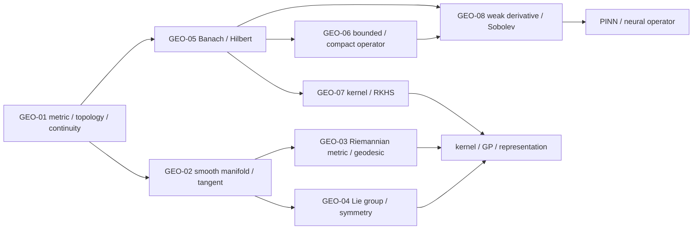

# 几何、泛函分析、核与算子基础 MOC

> [!abstract] 本卷的核心任务
> 把有限维线性代数、微积分和概率中的“空间直觉”升级为可迁移的抽象语言：先只用距离与开集定义附近、收敛和连续；再在局部 Euclidean 空间上建立 manifold/tangent/cotangent；随后加入 Riemannian metric 与 continuous symmetry；最后把向量空间推广到 Banach/Hilbert function spaces，用 operator、spectrum、kernel、weak derivative 与 Sobolev regularity进入 Gaussian process、kernel method、equivariant network、PINN 和 neural operator。

## 一、范围与边界

### 本卷包含

- metric space、topology、continuity、compactness、connectedness 与 completion；
- smooth manifold、chart、tangent/cotangent、differential 与 vector field；
- Riemannian metric、geodesic、gradient 与 manifold optimization；
- Lie group/action/algebra、generator、equivariance 与 symmetry；
- normed/Banach/Hilbert spaces、orthogonality、projection 与 duality；
- bounded/compact operators、adjoint 与 infinite-dimensional spectral basics；
- positive-definite kernels、RKHS、representer theorem 与 Gaussian process接口；
- weak derivative、Sobolev spaces、PDE variational form 与 neural operator接口。

### 本卷不替代

- 完整 point-set/algebraic topology：separation、product/quotient、fundamental group与homology只按AI需要调用；
- 完整 differential geometry：connection、curvature、geodesic completeness只建主线接口；
- 完整 functional analysis/PDE：Hahn–Banach、Banach–Steinhaus、distribution theory和elliptic regularity不百科展开；
- 任意“data manifold hypothesis”的真实性证明：有限样本低维可视化不是 manifold certificate；
- 把 graph topology、network architecture topology 与 topological space混成同一术语。

## 二、八个核心节点

| ID | 节点 | 必须回答的问题 | 状态 |
|---|---|---|---|
| GEO-01 | [[度量空间、拓扑与连续映射]] | 距离、邻域、开集、收敛与连续性怎样脱离坐标定义？ | draft |
| GEO-02 | [[光滑流形、切空间与余切空间]] | 弯曲空间如何在局部近似为线性空间？ | draft |
| GEO-03 | [[Riemann 几何、测地线与流形优化]] | 内积随位置变化时如何定义长度、梯度和最短路？ | draft |
| GEO-04 | [[Lie 群、Lie 代数与对称性]] | 连续对称如何连接global group action与local generator？ | draft |
| GEO-05 | [[Banach 空间、Hilbert 空间与正交投影]] | finite-dimensional linear algebra怎样推广到function space？ | draft |
| GEO-06 | [[有界算子、紧算子与谱理论基础]] | infinite-dimensional operator谱与矩阵谱有何异同？ | draft |
| GEO-07 | [[正定核、RKHS 与表示定理]] | kernel怎样隐式定义feature space与最优预测器？ | draft |
| GEO-08 | [[弱导数、Sobolev 空间与神经算子接口]] | 不光滑函数、PDE与operator learning需要什么regularity语言？ | draft |

## 三、四阶段学习路线

### 阶段 A：先建立“空间中什么叫附近”

1. metric axioms、balls、open/closed、closure/boundary；
2. topology、convergence、continuity、compactness、connectedness；
3. topology只保留qualitative neighborhood，metric还给quantitative尺度。

验收：能构造相同topology但不同completeness的metrics，能证明continuous image保持compact/connected，能解释finite sample topology的scale问题。

### 阶段 B：局部线性化与对称

4. manifold atlas、tangent/cotangent与differential；
5. Riemannian metric、geodesic、gradient与retraction；
6. Lie group、Lie algebra、group action与equivariance。

验收：能从coordinate-independent object回到chart computation，并区分invariant、equivariant和gauge-dependent quantity。

### 阶段 C：从向量到函数

7. normed/Banach/Hilbert、Cauchy completion、Riesz与projection；
8. bounded/compact operator、adjoint、spectrum与Fredholm直觉。

验收：能指出finite-dimensional theorem在infinite dimension断在哪一项，例如closed+bounded不再compact。

### 阶段 D：kernel与PDE/operator interface

9. PD kernel、feature map、RKHS、reproducing property、representer theorem；
10. weak derivative、Sobolev norm、variational residual与operator learning。

验收：能把kernel/GP、PINN/FNO/DeepONet中的input/output function space、norm、sampling与generalization对象写清楚。

## 四、AI 调用地图

| AI 场景 | 本卷对象 | 首要边界 |
|---|---|---|
| representation learning | latent metric/topology、neighborhood与embedding | metric choice、finite sample、hubness与scale |
| normalizing flow / Neural ODE | homeomorphism/diffeomorphism与connected support | exact flow vs finite solver、augmentation、singular data |
| WGAN / distribution matching | probability-measure topology与ground metric | critic restriction、empirical estimate、moment条件 |
| geometric deep learning | manifold/group action/equivariance | discrete mesh、chart、group近似与symmetry breaking |
| constrained optimization | tangent/retraction/Riemannian gradient | ambient step不保manifold；metric改变gradient |
| kernel method / GP | RKHS norm、kernel integral operator | kernel choice、regularization、finite sample与cubic cost |
| PINN / neural operator | Sobolev/function-space norm与operator map | point residual不等于function norm；mesh/distribution shift |

## 五、全卷必须维持的区分

| 容易混淆 | 必须分开 |
|---|---|
| metric vs topology | metric给数值距离；topology只保留open-set structure |
| equivalent metrics vs equal metrics | 可诱导同topology，但距离、Lipschitz常数与completeness未必同 |
| closed/bounded vs compact | 只在finite-dimensional Euclidean等特定空间可逆用Heine–Borel |
| continuous vs uniformly continuous vs Lipschitz | 量词与定量强度逐层增强 |
| connected vs path connected | 后者蕴含前者，反向一般失败 |
| homeomorphism vs diffeomorphism vs isometry | 分别保持topology、smooth structure、metric geometry |
| ambient distance vs geodesic distance | chord与沿manifold shortest path不是同一对象 |
| data cloud vs underlying support/manifold | finite set在metric topology下离散，必须引入scale与sampling assumptions |
| graph topology vs point-set topology | 前者常指edge pattern，后者是open-set system |

## 六、证据分工

- MIT 18.S190/18.100C、18.965/18.155 与 Munkres/Lee：metric/topology、smooth manifold、tangent/cotangent、rank、compactness与continuity的正式课程骨架；
- Conway/Kreyszig等functional-analysis教材：Banach/Hilbert、operator与infinite-dimensional反例；
- Aronszajn、MIT 9.520、Berlinet–Thomas-Agnan、Schölkopf–Herbrich–Smola：PSD kernel、RKHS、Mercer条件与representer theorem；Rasmussen–Williams、Rahimi–Recht、MMD/HSIC与NTK原论文承担 GP、random features、probability embedding与wide-network kernel接口；
- Evans/Adams–Fournier等：weak derivative与Sobolev/PDE主线；
- WGAN、Augmented Neural ODE、manifold flow、geometric deep learning与neural-operator原论文：AI中的原创方法和经验边界；
- [[S-2016-Su-3963-理解黎曼几何一条几何之路]]、[[S-2016-Su-3969-从勾股定理到黎曼度量]]、[[S-2016-Su-3977-黎曼测地线]]、[[S-2016-Su-3998-联络和协变导数]]与[[S-2025-Su-11196-流形最速下降超球面]]：内蕴几何、metric、geodesic、connection 与 sphere optimization 的中文问题入口，不单独承担 manifold/optimization theorem。

## 七、当前进度

GEO-01—08 已建立完整节点闭环。GEO-08 从 test functions 与 distribution derivative进入 $W^{k,p}$、$H_0^1$、$H^{-1}$；trace、Poincaré、Sobolev embedding 与 Rellich compactness均保留 domain/指数条件。Poisson 主线完整连接 weak form、Lax–Milgram、energy、Galerkin orthogonality与Céa，并把 strong PINN、Deep Ritz、VPINN/VarNet、DeepONet/FNO放在不同对象和 residual topology上审计。

八个核心节点的主图已于 2026-08-23 统一迁移为 v2 教材式图文单元：每篇均含可判定引图问题、对象/结论/来源图注、`怎样读图`与`图没有证明什么`，并使用根目录稳定路径和 `880 px` 显示宽度。两套确定性脚本 [[plot_geometry_foundations_v2.py]]、[[plot_functional_analysis_v2.py]] 生成八幅图；全部通过 SVG 结构、XML、1200 px 渲染与人工视觉检查。该状态只说明课程材料和视觉证据完整，不代表学习者已掌握。

全卷八套实验覆盖 topology、manifold、Riemannian geometry、Lie symmetry、Banach/Hilbert projection、compact spectrum、RKHS与weak PDE/operator。新增[[实验 - 弱导数、变分残差与解算子频谱审计]]：delta approximation mass为 $1.9998438$；P1 FEM 的 $L^2/H^1$ slopes为 $1.99892/0.99917$；algebraic weak residual低于 $2.73\times10^{-13}$ 而element-interior strong residual固定为 $6.97886$；八模态截断算子在训练子空间为零误差、对未见模态relative error为100%。两幅SVG均已实际PNG渲染目检。

## 八、卷末累计验收

`GEO-CUM-01`已经建立：

- [[阶段测验 - 几何、泛函分析、核与算子基础（10.10）|210分钟、100分闭卷题卷]]，按20/30/25/15/10五区覆盖GEO-01—08；
- [[阶段测验解答 - 几何、泛函分析、核与算子基础（10.10）|逐题独立详解]]，完整展开sphere geometry、RKHS representer与Poisson weak/Galerkin三道主证明；
- [[实验 - 几何、泛函与算子累计复现门]]，以球面几何—对称、Hilbert—compact—RKHS和弱PDE—operator三轨随机验收；
- definition/theorem-contract、完整证明、反例和continuous-to-discrete研究合同均设独立门槛；
- 48小时重做与14天迁移是状态升级的必要证据。

## 九、当前状态

10.10 当前为 **8/8 正文覆盖、120道节点题，累计验收 composed / not-attempted**。Canonical累计图已通过XML、确定性双跑与实际PNG渲染，但这只证明验收工具可执行。GEO-01—08继续保持`draft`；下一步是学习者真实闭卷、随机轨道手推、参数干预与间隔重做。课程材料下一施工点转向10.2线性代数卷级累计验收。
