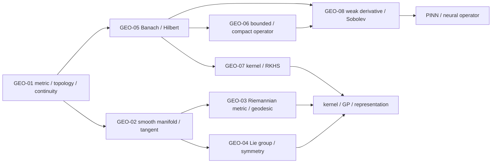

# 几何、泛函分析、核与算子基础 MOC

> [!abstract] 本卷的核心任务
> 把有限维线性代数、微积分和概率中的“空间直觉”升级为可迁移的抽象语言：先只用距离与开集定义附近、收敛和连续；再在局部 Euclidean 空间上建立 manifold/tangent/cotangent；随后加入 Riemannian metric 与 continuous symmetry；最后把向量空间推广到 Banach/Hilbert function spaces，用 operator、spectrum、kernel、weak derivative 与 Sobolev regularity进入 Gaussian process、kernel method、equivariant network、PINN 和 neural operator。

## 全卷教学迁移路线

10.10 的八篇深层正文、节点练习、图像、实验与累计验收已经存在；当前迁移任务是把它们重排成初学者能连续调用的三波模型链，而不是扩张成 topology 或 functional analysis百科。

| 波次 | 节点 | 主线 | 统一模型/证书 | 材料状态 | 学习状态 |
|---|---|---|---|---|---|
| A | GEO-01—04 | metric/topology → chart/tangent → Riemannian metric/optimization → Lie action/equivariance | $S^1$、induced geometry 与 $SO(2)$ | `regression-passed` | `draft / not-attempted` |
| B | GEO-05—06 | norm/completion → Hilbert projection → bounded/compact operator → spectrum | $c_{00}\subset\ell^2$、$P_N$ 与 $K e_n=n^{-1}e_n$ | `regression-passed` | `draft / not-attempted` |
| C | GEO-07—08 | PSD kernel → RKHS representation → weak derivative → variational/operator learning | Brownian bridge/Green kernel、$H_0^1$ 与 sine solution spectrum | `regression-passed` | `draft / not-attempted` |
| CUM | GEO-CUM | 口试—闭卷—三轨实验—延迟重做 | 三波随机回链、三条证明主链与 A/B/C 累计门 | `regression-passed` | `not-attempted` |

### 第一波的 $S^1$—$SO(2)$ 单一模型链

第一波固定

$$
S^1=\{p\in\mathbb R^2:\|p\|_2=1\},
\qquad
R_\theta=
\begin{bmatrix}
\cos\theta&-\sin\theta\\
\sin\theta&\cos\theta
\end{bmatrix}.
$$

同一个对象完成四次升级：

1. **GEO-01：先决定什么叫附近。** 对 $p=\gamma(\theta),q=\gamma(\phi)$，chord 与 wrapped angular metrics满足
   $$
   \frac{2}{\pi}d_{\rm ang}(p,q)
   \le d_{\rm ch}(p,q)
   \le d_{\rm ang}(p,q),
   $$
   所以同 topology但不等 metric；continuous image给 compact/connected，单一角参数因 periodic seam 不能作 global chart；
2. **GEO-02：从附近升级到可微。** 两张 stereographic charts 的 transition为 $s=1/t$，constraint $F(p)=\|p\|^2-1$ 给
   $$
   T_pS^1=\ker DF_p=\{v:p^Tv=0\};
   $$
   curve velocity、chart basis、cotangent与 decoder Jacobian在同一对象账中对齐；
3. **GEO-03：给 tangent 加 measurement。** Induced metric给 speed/length，circle Exp为
   $$
   \operatorname{Exp}_p(v)
   =\cos\|v\|\,p
   +\sin\|v\|\frac{v}{\|v\|},
   $$
   而 $\operatorname{grad}f=(I-pp^T)\nabla\bar f$；normalization只是一种 second-order retraction；
4. **GEO-04：把状态几何升级为变换结构。** $\mathfrak{so}(2)=\{\omega J\}$、$J^2=-I$ 给 $e^{\theta J}=R_\theta$；group action产生 orbit/stabilizer，$F(R_\theta x)=R_\theta F(x)$ 才是 equivariance，$SO(2)$-equivariant linear maps恰为 $aI+bJ$。

> [!success] 第一波材料证书
> [[geometry_functional_teaching_contract_audit.py]]检查 GEO-01—04 的六项初学者教学标记、$S^1/SO(2)$ 精确模型、作用域 Wiki 链接、四个图文单元与四幅正式 SVG 哈希。`regression-passed` 只证明材料自洽，四篇正文仍为 `draft`，个人学习仍为 `not-attempted`。

### 如何学习第一波，而不是背四套几何术语

1. **第一遍（约 360 分钟）：**只在 $S^1$ 上重算 chord/angular、stereographic transition、tangent kernel、Exp/gradient 与 Lie exponential；
2. **第二遍（约 720 分钟）：**回到四篇完整正文，扩展到 abstract topology、一般 manifold/connection、Stiefel/SPD 与 nonabelian groups；
3. **第三遍（约 180 分钟）：**改变 circle radius、objective vector、chart pole与测试 angles，运行前预测 metric constant、tangent、retraction error与 equivariance residual；
4. **验收：**完成 GEO-01—04 的四个节点实验，并无提示区分 point/coordinate/tangent/covector、metric/topology、Exp/retraction、invariance/equivariance。

### 第二波的 \(\ell^2\)—对角紧算子单一模型链

第二波固定

$$
H=\ell^2,
\qquad
M_N=\operatorname{span}\{e_1,\ldots,e_N\},
\qquad
P_Nx=\sum_{n=1}^{N}x_ne_n,
$$

并在同一标准正交基上定义

$$
Ke_n=\frac1n e_n,
\qquad
K_N=P_NK.
$$

同一组对象完成两次升级：

1. **GEO-05：从有限表示升级到完备 Hilbert 空间。** \(x^{(N)}=\sum_{n\le N}n^{-1}e_n\) 在 \(\ell^2\) 范数中 Cauchy，却在 \(c_{00}\) 中没有极限；completion补出 \(x^\star=(1/n)_{n\ge1}\)。对任意 \(x\in\ell^2\)，正交分解
   $$
   \|x-y\|_2^2
   =\|x-P_Nx\|_2^2+\|P_Nx-y\|_2^2,
   \qquad y\in M_N,
   $$
   同时给出最佳逼近、唯一性和 tail energy；Riesz 将 \(L(x)=\sum_nx_n/n\) 表成 \(\langle x,x^\star\rangle\)，而 \(e_n\rightharpoonup0\) 但 \(\|e_n\|=1\) 分离 weak 与 strong convergence；
2. **GEO-06：从空间升级到稳定作用与无限维谱。** \(K\) bounded、positive、self-adjoint，且
   $$
   \|K-K_N\|=\frac1{N+1}\to0,
   \qquad
   \sigma(K)=\{0\}\cup\{1/n:n\ge1\}.
   $$
   Finite-rank norm approximation证明 compactness；\(0\) 不是 eigenvalue却因 inverse 不满射且不 bounded 而属于 spectrum。Spectral cutoff 给
   $$
   \|x-K_N^\dagger y^\delta\|
   \le \|(I-P_N)x\|+N\delta,
   $$
   把低秩 bias 与高频噪声放大放进同一账本。

两篇各使用两种视觉语言：正式结构图解释 norm/completion/projection 与 bounded/compact/spectrum 的概念关系；确定性数据图复算 \(\ell^2\) tail、\(\ell^1\) 非 Cauchy、投影唯一性、compact tail、Volterra singular values、shift finite-section trap 与 kernel spectrum。

> [!success] 第二波材料证书
> [[geometry_functional_teaching_contract_audit.py]]现检查 GEO-01—06 的六项初学者教学标记、两波精确模型、189 条迁移范围 Wiki 链接、八个图文单元和八幅 SVG 哈希；并调用 [[banach_hilbert_projection_audit.py]] 与 [[compact_operator_spectrum_audit.py]]复算两张数据图。`regression-passed` 仍只表示材料回归通过，GEO-05—06 正文保持 `draft`，个人学习保持 `not-attempted`。

### 如何学习第二波，而不是背泛函分析定理名

1. **第一遍（约 210 分钟）：**只在 \(c_{00}\subset\ell^2\) 上重算 Cauchy tail、\(P_N\) 最佳逼近、Riesz functional、\(K_N\) operator tail 和 \(\sigma(K)\)；
2. **第二遍（约 480 分钟）：**回到两篇完整正文，扩展到 \(L^p/C(K)\)、一般 projection/Riesz、Banach 三大定理、adjoint、Hilbert–Schmidt、Fredholm 与 compact self-adjoint spectral theorem；
3. **第三遍（约 120 分钟）：**把 \(1/n\) 改成 \(1/n^\alpha\)，运行前预测 compactness、Hilbert–Schmidt threshold、rank-\(N\) tail 和 inverse amplification；
4. **验收：**完成两篇节点实验，并无提示区分 pointwise/strong/operator-norm convergence、bounded/compact、eigenvalue/spectrum 与 low-rank approximation/inverse stability。

### 第三波的 Green kernel—弱 PDE—解算子单一模型链

第三波固定区间 \([0,1]\) 和

$$
k(x,t)=\min(x,t)-xt.
$$

它同时承担三种角色：

$$
k(x,t)
=\langle\psi_x,\psi_t\rangle_{L^2},
\qquad
f(x)=\langle f,k_x\rangle_{H_0^1},
\qquad
(\mathcal Gg)(x)=\int_0^1k(x,t)g(t)\,dt,
$$

其中 \(\psi_x(s)=\mathbf1_{\{s\le x\}}-x\)，而 \(\mathcal G=(-\partial_{xx})^{-1}\) 使用 homogeneous Dirichlet boundary。

同一个 kernel 完成两次升级：

1. **GEO-07：从两点函数升级到可计算的 Hilbert geometry。** Feature identity 对所有有限 coefficients 给 Gram PSD；折线 section
   $$
   k_x(t)=
   \begin{cases}
   t(1-x),&t\le x,\\
   x(1-t),&t\ge x
   \end{cases}
   $$
   满足 \(f(x)=\int_0^1f'(t)k_x'(t)\,dt\)，因此 point evaluation bounded。Hilbert projection把 empirical regularized minimizer压到 \(\operatorname{span}\{k_{x_i}\}\)，KRR 得 \((K+n\lambda I)\alpha=y\)；Mercer modes为 \(\phi_m=\sqrt2\sin(m\pi x)\)、\(\lambda_m=(m\pi)^{-2}\)；
2. **GEO-08：从 kernel geometry 升级到 weak solution operator。** \(D_w|x|=\operatorname{sign}(x)\) 先建立 test-function identity；Poisson weak problem
   $$
   a(u,v)=\int_0^1u'v'
   =\int_0^1fv
   =F(v)
   $$
   由 Poincaré 与 Lax–Milgram闭合 existence、uniqueness、stability。Green superposition给 \(u=\mathcal Gf\)，sine gains仍为 \((m\pi)^{-2}\)；Galerkin orthogonality说明离散 weak residual 与 element-interior strong residual不能混写，八模态截断则给 unseen \(\phi_9\) 的 \(100\%\) relative operator error。

两篇各保留教材结构图和确定性数据图：GEO-07 分开 Gram validity、representer projection、KRR–GP mean identity 与 RFF distribution；GEO-08 分开 distribution concentration、FEM solution error、residual topology 与 operator-distribution shift。

> [!success] 第三波材料证书
> [[geometry_functional_teaching_contract_audit.py]]现检查 GEO-01—08 的六项初学者教学标记、三波精确模型、234 条全卷 Wiki 链接、十二个图文单元和十二幅 SVG 哈希；并实际调用 [[rkhs_kernel_audit.py]] 与 [[sobolev_variational_operator_audit.py]]复算第三波两张数据图。`regression-passed` 只证明八篇正文材料静态自洽，所有正文继续保持 `draft`，个人学习继续保持 `not-attempted`。

### 如何学习第三波，而不是背 kernel 与 PDE 名词

1. **第一遍（约 240 分钟）：**只在 \(k(x,t)=\min(x,t)-xt\) 上重算 feature PSD、reproducing identity、representer projection、Poisson weak form、Green superposition 与 sine gains；
2. **第二遍（约 540 分钟）：**回到两篇完整正文，扩展到 Moore–Aronszajn/Mercer、KRR/GP/MMD/HSIC、一般 Sobolev/trace/embedding/Rellich、Lax–Milgram/Céa、PINN/Deep Ritz 与 DeepONet/FNO；
3. **第三遍（约 150 分钟）：**改变 sample points、regularization、forcing modes、Galerkin mesh 与 learned cutoff，运行前预测 Gram spectrum、projection norm、FEM order、weak residual 和 unseen-mode error；
4. **验收：**完成两篇节点实验，并无提示区分 kernel/Gram/integral operator、classical/weak/distribution derivative、single-solution/function-to-function learning 与 training/resolution/operator generalization。

## 一、范围与边界

### 本卷包含

- metric space、topology、continuity、compactness、connectedness 与 completion；
- smooth manifold、chart、tangent/cotangent、differential 与 vector field；
- Riemannian metric、geodesic、gradient 与 manifold optimization；
- Lie group/action/algebra、generator、equivariance 与 symmetry；
- normed/Banach/Hilbert spaces、orthogonality、projection 与 duality；
- bounded/compact operators、adjoint 与 infinite-dimensional spectral basics；
- positive-definite kernels、RKHS、representer theorem 与 Gaussian process接口；
- weak derivative、Sobolev spaces、PDE variational form 与 neural operator接口。

### 本卷不替代

- 完整 point-set/algebraic topology：separation、product/quotient、fundamental group与homology只按AI需要调用；
- 完整 differential geometry：connection、curvature、geodesic completeness只建主线接口；
- 完整 functional analysis/PDE：Hahn–Banach、Banach–Steinhaus、distribution theory和elliptic regularity不百科展开；
- 任意“data manifold hypothesis”的真实性证明：有限样本低维可视化不是 manifold certificate；
- 把 graph topology、network architecture topology 与 topological space混成同一术语。

## 二、八个核心节点

| ID | 节点 | 必须回答的问题 | 状态 |
|---|---|---|---|
| GEO-01 | [[度量空间、拓扑与连续映射]] | 距离、邻域、开集、收敛与连续性怎样脱离坐标定义？ | draft |
| GEO-02 | [[光滑流形、切空间与余切空间]] | 弯曲空间如何在局部近似为线性空间？ | draft |
| GEO-03 | [[Riemann 几何、测地线与流形优化]] | 内积随位置变化时如何定义长度、梯度和最短路？ | draft |
| GEO-04 | [[Lie 群、Lie 代数与对称性]] | 连续对称如何连接global group action与local generator？ | draft |
| GEO-05 | [[Banach 空间、Hilbert 空间与正交投影]] | finite-dimensional linear algebra怎样推广到function space？ | draft |
| GEO-06 | [[有界算子、紧算子与谱理论基础]] | infinite-dimensional operator谱与矩阵谱有何异同？ | draft |
| GEO-07 | [[正定核、RKHS 与表示定理]] | kernel怎样隐式定义feature space与最优预测器？ | draft |
| GEO-08 | [[弱导数、Sobolev 空间与神经算子接口]] | 不光滑函数、PDE与operator learning需要什么regularity语言？ | draft |

## 三、四阶段学习路线

### 阶段 A：先建立“空间中什么叫附近”

1. metric axioms、balls、open/closed、closure/boundary；
2. topology、convergence、continuity、compactness、connectedness；
3. topology只保留qualitative neighborhood，metric还给quantitative尺度。

验收：能构造相同topology但不同completeness的metrics，能证明continuous image保持compact/connected，能解释finite sample topology的scale问题。

### 阶段 B：局部线性化与对称

4. manifold atlas、tangent/cotangent与differential；
5. Riemannian metric、geodesic、gradient与retraction；
6. Lie group、Lie algebra、group action与equivariance。

验收：能从coordinate-independent object回到chart computation，并区分invariant、equivariant和gauge-dependent quantity。

### 阶段 C：从向量到函数

7. normed/Banach/Hilbert、Cauchy completion、Riesz与projection；
8. bounded/compact operator、adjoint、spectrum与Fredholm直觉。

验收：能指出finite-dimensional theorem在infinite dimension断在哪一项，例如closed+bounded不再compact。

### 阶段 D：kernel与PDE/operator interface

9. PD kernel、feature map、RKHS、reproducing property、representer theorem；
10. weak derivative、Sobolev norm、variational residual与operator learning。

验收：能把kernel/GP、PINN/FNO/DeepONet中的input/output function space、norm、sampling与generalization对象写清楚。

## 四、AI 调用地图

| AI 场景 | 本卷对象 | 首要边界 |
|---|---|---|
| representation learning | latent metric/topology、neighborhood与embedding | metric choice、finite sample、hubness与scale |
| normalizing flow / Neural ODE | homeomorphism/diffeomorphism与connected support | exact flow vs finite solver、augmentation、singular data |
| WGAN / distribution matching | probability-measure topology与ground metric | critic restriction、empirical estimate、moment条件 |
| geometric deep learning | manifold/group action/equivariance | discrete mesh、chart、group近似与symmetry breaking |
| constrained optimization | tangent/retraction/Riemannian gradient | ambient step不保manifold；metric改变gradient |
| kernel method / GP | RKHS norm、kernel integral operator | kernel choice、regularization、finite sample与cubic cost |
| PINN / neural operator | Sobolev/function-space norm与operator map | point residual不等于function norm；mesh/distribution shift |

## 五、全卷必须维持的区分

| 容易混淆 | 必须分开 |
|---|---|
| metric vs topology | metric给数值距离；topology只保留open-set structure |
| equivalent metrics vs equal metrics | 可诱导同topology，但距离、Lipschitz常数与completeness未必同 |
| closed/bounded vs compact | 只在finite-dimensional Euclidean等特定空间可逆用Heine–Borel |
| continuous vs uniformly continuous vs Lipschitz | 量词与定量强度逐层增强 |
| connected vs path connected | 后者蕴含前者，反向一般失败 |
| homeomorphism vs diffeomorphism vs isometry | 分别保持topology、smooth structure、metric geometry |
| ambient distance vs geodesic distance | chord与沿manifold shortest path不是同一对象 |
| data cloud vs underlying support/manifold | finite set在metric topology下离散，必须引入scale与sampling assumptions |
| graph topology vs point-set topology | 前者常指edge pattern，后者是open-set system |

## 六、证据分工

- MIT 18.S190/18.100C、18.965/18.155 与 Munkres/Lee：metric/topology、smooth manifold、tangent/cotangent、rank、compactness与continuity的正式课程骨架；
- Conway/Kreyszig等functional-analysis教材：Banach/Hilbert、operator与infinite-dimensional反例；
- Aronszajn、MIT 9.520、Berlinet–Thomas-Agnan、Schölkopf–Herbrich–Smola：PSD kernel、RKHS、Mercer条件与representer theorem；Rasmussen–Williams、Rahimi–Recht、MMD/HSIC与NTK原论文承担 GP、random features、probability embedding与wide-network kernel接口；
- Evans/Adams–Fournier等：weak derivative与Sobolev/PDE主线；
- WGAN、Augmented Neural ODE、manifold flow、geometric deep learning与neural-operator原论文：AI中的原创方法和经验边界；
- [[S-2016-Su-3963-理解黎曼几何一条几何之路]]、[[S-2016-Su-3969-从勾股定理到黎曼度量]]、[[S-2016-Su-3977-黎曼测地线]]、[[S-2016-Su-3998-联络和协变导数]]与[[S-2025-Su-11196-流形最速下降超球面]]：内蕴几何、metric、geodesic、connection 与 sphere optimization 的中文问题入口，不单独承担 manifold/optimization theorem。

## 七、当前进度

GEO-01—08 已建立完整节点闭环。GEO-08 从 test functions 与 distribution derivative进入 $W^{k,p}$、$H_0^1$、$H^{-1}$；trace、Poincaré、Sobolev embedding 与 Rellich compactness均保留 domain/指数条件。Poisson 主线完整连接 weak form、Lax–Milgram、energy、Galerkin orthogonality与Céa，并把 strong PINN、Deep Ritz、VPINN/VarNet、DeepONet/FNO放在不同对象和 residual topology上审计。

八个核心节点的主图已于 2026-08-23 统一迁移为 v2 教材式图文单元：每篇均含可判定引图问题、对象/结论/来源图注、`怎样读图`与`图没有证明什么`，并使用根目录稳定路径和 `880 px` 显示宽度。两套确定性脚本 [[plot_geometry_foundations_v2.py]]、[[plot_functional_analysis_v2.py]] 生成八幅图；全部通过 SVG 结构、XML、1200 px 渲染与人工视觉检查。2026-08-27 又完成 GEO-01—04 的第一波初学者迁移，以 $S^1/SO(2)$ 闭合 topology、manifold、Riemannian geometry 与 symmetry；该材料状态为 `regression-passed`，不代表学习者已掌握。

全卷八套实验覆盖 topology、manifold、Riemannian geometry、Lie symmetry、Banach/Hilbert projection、compact spectrum、RKHS与weak PDE/operator。新增[[实验 - 弱导数、变分残差与解算子频谱审计]]：delta approximation mass为 $1.9998438$；P1 FEM 的 $L^2/H^1$ slopes为 $1.99892/0.99917$；algebraic weak residual低于 $2.73\times10^{-13}$ 而element-interior strong residual固定为 $6.97886$；八模态截断算子在训练子空间为零误差、对未见模态relative error为100%。两幅SVG均已实际PNG渲染目检。

## 八、GEO-CUM：卷末综合验收闭环

`GEO-CUM-01` 不把八套节点题简单拼接，而是检查三波知识能否在陌生声明中重新组成一条对象正确、量词完整的链：

### 从零如何执行 GEO-CUM

1. 建立唯一 `attempt_id`，关闭反向链接/悬浮预览，冻结空白口试与闭卷记录；
2. 完成[[阶段测验 - 几何、泛函分析、核与算子基础（10.10）|20 分钟口试 + 210 分钟、100 分闭卷]]；口试先验收 point/tangent/covector/function/operator 的类型链和 continuous-to-discrete 边界；
3. 冻结第一次答案后，才打开[[阶段测验解答 - 几何、泛函分析、核与算子基础（10.10）|逐题独立详解]]，按原答案第一个断点评分，不用最终数值覆盖过程错误；
4. 进入[[实验 - 几何、泛函与算子累计复现门]]，先冻结预测，再由 `attempt_id + scorer nonce` 指定 sphere/Hilbert/weak-PDE 一轨；canonical 只校准环境，正式证据来自手推和盲参数干预；
5. 48 小时换 sphere radius/谱指数/forcing mode 重建，14 天对未见 manifold/kernel/PINN/neural-operator 报告建立六层对象账本；
6. 只有口试、闭卷、随机实验、48 小时换例与 14 天迁移均有原始证据，才记 `retained`；随后仍要逐节点审查，不批量改写 GEO-01—08 状态。

### 三条累计证明主链

- **几何—对称：**regular level set $\to T_pS^{d-1}\to$ metric representation $\to$ Riemannian gradient $\to O(d)$ covariance，并区分 local immersion、global embedding 与 sampled symmetry tests；
- **Hilbert—kernel：**completion/orthogonal decomposition $\to$ compact spectral tail $\to$ RKHS evaluation representer $\to$ finite KRR system，并区分 continuum theorem 与 finite Gram evidence；
- **弱PDE—算子：**weak derivative $\to H_0^1/H^{-1}\to$ Lax–Milgram $\to$ energy/Galerkin/Céa $\to$ solution operator 与 multi-norm benchmark。

### GEO-CUM 材料证书

[[geometry_functional_cumulative_contract_audit.py]]独立检查：

- GEO-01—08 scope 8/8、闭卷第1—14题与100分配额；
- 口试/闭卷/答案隔离、错误回链、48小时换例与14天迁移门；
- 题卷、详解、实验、课程地图和台账的 `regression-passed / not-attempted` 双状态一致；
- A轨 sphere constraint/rotation covariance，B轨 Hilbert/compact/RKHS 谱账本，C轨 Poisson 多 norm 账本；
- 全卷教学审计实际复跑、累计脚本不同临时路径确定性双跑、SVG XML 与 SHA-256。

Canonical 累计图为 [[00-知识库管理/_assets/plots/geometry-functional/plot-geometry-functional-cumulative-gate-v2.svg]]，SHA-256 为 `d0ff3852b11f8a82af5feff469fa3ef4e1adde7836cf292b4911dec043c59bd1`。这一证书只说明材料可执行、自洽且答案隔离，没有替学习者完成任何口试、闭卷或复现。

## 九、当前状态

10.10 当前为 **8/8 正文覆盖、120 道节点题**。第一波 GEO-01—04、第二波 GEO-05—06、第三波 GEO-07—08 与 GEO-CUM 材料均为 `regression-passed`；个人证据仍为 `not-attempted`，八篇正文继续保持 `draft`。下一步不是继续补累计材料，而是按本页流程产生真实口试、闭卷、随机三轨、48小时换例与14天迁移证据。
