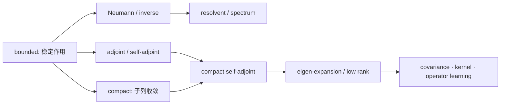

# 有界算子、紧算子与谱理论基础

> [!info] 课程位置
> 这是 10.10 的 GEO-06。GEO-05 已把有限支撑序列完备化为 \(\ell^2\)，并用 \(P_N\) 建立正交投影、Riesz 与 strong/weak convergence。本章保持同一个 Hilbert space 和同一组标准基，只增加一个 operator \(K e_n=n^{-1}e_n\)，由此依次推出 boundedness、finite-rank approximation、compactness、完整 spectrum、谱截断和逆问题病态性。下一步 GEO-07 会把这些结论用于 kernel integral/covariance operators，GEO-08 会区分 bounded compact operators 与带 domain 的 unbounded differential operators。

## 建议两遍阅读

> [!tip] 第一遍：只追对角算子 \(K\)
> 先算 \(\|K\|\)，再构造 \(K_N=P_NK\)，证明 \(\|K-K_N\|=1/(N+1)\)；随后完整求出 \(\sigma(K)=\{0\}\cup\{1/n:n\ge1\}\)，重点解释为什么 \(0\) 不是 eigenvalue 却仍在 spectrum。最后比较 identity 和 inverse noise amplification。

> [!tip] 第二遍：再推广到一般算子
> 回到正文学习三大 Banach 定理、adjoint、Hilbert–Schmidt/integral operators、resolvent、compact self-adjoint spectral theorem、Fredholm alternative、finite-section 陷阱，以及 covariance、kernel PCA、HSIC、spectral normalization 和 neural operator 的对象合同。

## 本章的推导问题链

1. Infinite-dimensional linear map 为什么不自动 continuous，operator norm 究竟控制什么？
2. 对角系数 \(1/n\) 趋于零，怎样使一个无限维 operator 可由有限秩 operator 在 operator norm 中逼近？
3. 为什么 finite-rank approximation 能推出 compactness，而 identity 做不到？
4. Spectrum 为什么必须用 \(K-\lambda I\) 是否 boundedly invertible 定义，不能只解 eigen-equation？
5. \(0\) 不是 \(K\) 的 eigenvalue，为什么 inverse 仍然失败？
6. Compact self-adjoint 结构怎样恢复类似 symmetric matrix 的正交谱展开？
7. 谱尾小为什么有利于低秩近似，却可能让 inverse problem 更病态？
8. 有限矩阵 eigenvalues 很漂亮时，为什么仍不能自动推出 continuum operator 的谱结论？

第一遍应能复述同一条链：

$$
\ell^2
\xrightarrow{K e_n=n^{-1}e_n}
\mathcal B(\ell^2)
\xleftarrow[\|K-K_N\|\to0]{K_N=P_NK}
\text{finite rank}
\Longrightarrow
\text{compact spectral structure}.
$$

## 初学者贯穿模型：一个对角算子包含多少无限维现象

### 符号与对象账本

| 符号 | 类型 | 本章含义 | 不能误读成 |
|---|---|---|---|
| \(H=\ell^2\) | Hilbert space | 输入和输出所在的完整空间 | 某个有限采样网格 |
| \(e_n\) | vector | 标准正交基向量 | eigenvalue |
| \(P_N\) | operator | 保留前 \(N\) 个坐标的正交投影 | 任意 discretization |
| \(K\) | bounded operator | \(K e_n=n^{-1}e_n\) | 有限对角矩阵 |
| \(K_N=P_NK\) | finite-rank operator | \(K\) 的前 \(N\) 模态截断 | \(K\) 本身 |
| \(\|K\|\) | scalar | 全单位球上的 operator norm | 某批样本上的最大比值 |
| \(\sigma(K)\) | set | \(K-\lambda I\) 无 bounded inverse 的所有 \(\lambda\) | eigenvalues 集合 |
| \(\rho(K)\) | set | resolvent set | spectral radius |
| \(r(K)\) | scalar | \(\sup_{\lambda\in\sigma(K)}|\lambda|\) | resolvent |
| \(K^{-1}\) | operator candidate | 仅在 range 上形式存在且 unbounded | 全空间稳定 inverse |

为避免符号混乱，正文继续把 resolvent set 记为 \(\operatorname{res}(K)\)，把 spectral radius 记为 \(r(K)\)。

### 第一步：先证明作用稳定，而不是只说它线性

定义

$$
K(x_1,x_2,\ldots)
=\left(x_1,\frac{x_2}{2},\frac{x_3}{3},\ldots\right),
\qquad
Ke_n=\frac1n e_n.
$$

它显然 linear，但 infinite-dimensional setting 中 linear 不自动 bounded。直接计算：

$$
\|Kx\|_2^2
=\sum_{n=1}^{\infty}\frac{|x_n|^2}{n^2}
\le \sum_{n=1}^{\infty}|x_n|^2
=\|x\|_2^2.
$$

所以 \(\|K\|\le1\)。取 \(x=e_1\) 时 \(\|Ke_1\|=\|e_1\|=1\)，从而

$$
\boxed{\|K\|=1.}
$$

这是一份全局稳定合同：

$$
\|Kx-Ky\|_2
\le \|K\|\,\|x-y\|_2
=\|x-y\|_2.
$$

它对整个 \(\ell^2\) 单位球成立，不是对有限训练样本做经验检查。

### 第二步：构造有限秩截断并精确计算尾误差

令

$$
K_N=P_NK,
$$

即

$$
K_Nx
=\left(x_1,\frac{x_2}{2},\ldots,\frac{x_N}{N},0,\ldots\right).
$$

其 range 位于 \(M_N=\operatorname{span}\{e_1,\ldots,e_N\}\)，故 \(K_N\) 是 finite rank。对任意 \(\|x\|_2=1\)，

$$
\|(K-K_N)x\|_2^2
=\sum_{n>N}\frac{|x_n|^2}{n^2}
\le \frac1{(N+1)^2}\sum_{n>N}|x_n|^2
\le \frac1{(N+1)^2}.
$$

于是 \(\|K-K_N\|\le1/(N+1)\)。取 \(x=e_{N+1}\) 达到等号，因此

$$
\boxed{
\|K-K_N\|
=\frac1{N+1}
\longrightarrow0.
}
$$

Finite-rank operator 把 bounded set送进有限维 bounded set，其像序列总能抽出 convergent subsequence，所以 finite-rank operators compact；compact operators 的 operator-norm limit 仍 compact。因此 \(K\) compact。

> [!important] 为什么必须是 operator-norm 逼近
> 对每个固定 \(x\)，\(P_Nx\to x\)，所以 \(P_N\to I\) strongly；但
> $$
> \|I-P_N\|=1
> $$
> 对所有 \(N\) 成立。Pointwise/strong convergence 不能替代 uniform operator-norm convergence，也不能据此把 identity 误判为 compact。

### 第三步：完整求出 spectrum，而不是只列 eigenvalues

对每个 \(m\ge1\)，

$$
Ke_m=\frac1m e_m,
$$

所以 \(1/m\) 是 eigenvalue，当然属于 spectrum。

现在看 \(\lambda=0\)。若 \(Kx=0\)，逐坐标得到 \(x_n=0\)，所以

$$
\ker K=\{0\}.
$$

因此 \(0\) 不是 eigenvalue。但取

$$
y=\left(1,\frac12,\frac13,\ldots\right)\in\ell^2.
$$

若 \(Kx=y\)，形式上必须有 \(x=(1,1,1,\ldots)\notin\ell^2\)，所以 \(K\) 不满射。等价地，形式 inverse

$$
K^{-1}(y_1,y_2,\ldots)
=(y_1,2y_2,3y_3,\ldots)
$$

不是 \(\ell^2\to\ell^2\) 的 bounded operator。因此

$$
0\in\sigma(K),
\qquad
0\notin\sigma_p(K).
$$

还要排除其他 spectral points。若

$$
\lambda\notin\{0,1,\tfrac12,\tfrac13,\ldots\},
$$

因为 \(1/n\to0\) 且 \(\lambda\ne0\)，存在 \(c_\lambda>0\) 使

$$
\left|\frac1n-\lambda\right|
\ge c_\lambda
$$

对所有 \(n\) 成立。于是

$$
(K-\lambda I)^{-1}y
=\left(
\frac{y_n}{1/n-\lambda}
\right)_{n\ge1}
$$

有定义且

$$
\|(K-\lambda I)^{-1}y\|_2
\le c_\lambda^{-1}\|y\|_2.
$$

所以这些 \(\lambda\) 都在 resolvent set。最终得到完整结论

$$
\boxed{
\sigma(K)
=\left\{0\right\}
\cup
\left\{\frac1n:n\ge1\right\}.
}
$$

这里 \(0\) 是非零 eigenvalues 的唯一聚点。有限矩阵没有这种“不是 eigenvalue 的 spectral accumulation point”，这正是 infinite-dimensional spectrum 的第一个关键断点。

### 第四步：self-adjoint、positive 与正交谱展开

对任意 \(x,y\in\ell^2\)，

$$
\langle Kx,y\rangle
=\sum_{n\ge1}\frac{x_n\overline{y_n}}n
=\langle x,Ky\rangle,
$$

所以 \(K=K^*\)。并且

$$
\langle Kx,x\rangle
=\sum_{n\ge1}\frac{|x_n|^2}{n}
\ge0,
$$

故 \(K\) positive。它的谱展开就是

$$
Kx
=\sum_{n=1}^{\infty}\frac1n\langle x,e_n\rangle e_n.
$$

这正是 compact self-adjoint spectral theorem 的模型版本：非零 eigenvalues 可数、具有有限重数、只能向 \(0\) 聚集；相应 eigenvectors 可正交选取。一般 bounded operator 没有这样整洁的正交 eigenbasis。

### 核心公式七问：紧性、谱尾与低秩近似

本章核心证书是

$$
\boxed{
\|K-K_N\|=\frac1{N+1},
\qquad
\sigma(K)=\{0\}\cup\{1/n:n\ge1\}.
}
$$

1. **对象是什么？** \(K\) 是 \(\ell^2\to\ell^2\) 的无限维 operator，\(K_N\) 是 finite-rank truncation，不是换了一个有限问题。
2. **误差在哪个范数中？** 是 operator norm，因此同时控制所有单位输入，而不只是逐点 convergence。
3. **为什么尾误差恰为 \(1/(N+1)\)？** 上界来自尾部最大对角系数，下界由 \(e_{N+1}\) 达到。
4. **为什么这推出 compact？** \(K\) 是 finite-rank compact operators 的 operator-norm limit。
5. **为什么 \(0\) 在谱里？** \(K\) injective 但不 surjective，形式 inverse 对高频坐标乘以 \(n\)，不 bounded。
6. **用了哪些额外结构？** 对角 ONB 给精确计算；self-adjointness 才保证正交谱展开。一般 compact nonnormal operator 仍需更谨慎。
7. **AI 中对应什么？** Spectral truncation、kernel PCA、covariance compression 与 neural operator mode cutoff 都利用谱衰减；但小 eigenvalues 也会放大 inverse、deconvolution 和 system identification 中的噪声。

### 第五步：低秩可逼近与 inverse 稳定是相反方向的问题

若观测

$$
y=Kx,
\qquad
y_n=\frac{x_n}{n},
$$

则 forward map 抑制高频，容易被低秩近似。但 inverse 需要

$$
x_n=ny_n,
$$

会放大高频噪声。给第 \(m\) 个观测坐标加入 \(\delta e_m\)，观测扰动范数只有 \(\delta\)，inverse 后的解扰动却是

$$
\|K^{-1}(\delta e_m)\|_2
=m\delta.
$$

当 \(m\to\infty\) 时没有统一稳定常数。

一个最简单的 regularized inverse 是只反演前 \(N\) 个模态：

$$
K_N^\dagger y^\delta
=\sum_{n=1}^{N}n\,y_n^\delta e_n.
$$

若 \(\|y^\delta-Kx\|_2\le\delta\)，则

$$
\|x-K_N^\dagger y^\delta\|_2
\le
\underbrace{\|(I-P_N)x\|_2}_{\text{truncation bias}}
+
\underbrace{N\delta}_{\text{noise amplification}}.
$$

\(N\) 太小会丢掉真解尾部，\(N\) 太大又会放大噪声。这就是 spectral cutoff regularization 的 bias–stability tradeoff，也是许多 inverse problem 与 operator learning 模型必须显式报告的量。

### 第六步：identity 与 shift 提供两种边界反例

Identity \(I\) bounded 且 \(\|I\|=1\)，但 \((Ie_n)=(e_n)\) 没有 strongly convergent subsequence，所以 \(I\) 不 compact；而且任意前 \(N\) 模态截断都满足 \(\|I-P_N\|=1\)。

Unilateral shift

$$
Se_n=e_{n+1}
$$

也满足 \(\|S\|=1\)。其 \(N\times N\) natural finite section 是 nilpotent matrix，所有 eigenvalues 都为 \(0\)，但 continuum shift 的 spectrum 不是 \(\{0\}\)。因此“每个有限矩阵都算得很准”仍不等于 finite sections 在正确意义下逼近 operator spectrum。

## 用数据图同时审计近似、谱与有限截面

先问：**怎样从数值曲线区分 compact tail、singular-value decay、eigenvalue 陷阱和 kernel operator 的有效低秩，而不把有限矩阵证据夸大成 continuum theorem？**

![[00-知识库管理/_assets/plots/functional-analysis/plot-compact-operator-spectrum-v2.svg|880]]

> [!figure] 图 10.10.6E｜紧性、谱截断与有限截面陷阱的四轨复现
> A 比较 \(K e_n=n^{-1}e_n\) 与 identity 的 best rank-\(N\) operator-norm tail，前者按 \(1/(N+1)\) 衰减，后者恒为 \(1\)；B 比较 Volterra 离散 singular values 与解析值 \(2/((2k-1)\pi)\)，同时提醒离散矩阵 eigenvalues 全为零并不妨碍 operator 有非零 singular values；C 展示 shift finite sections 的 eigenvalue radius 恒为零而 operator norm 恒为一；D 展示 Gaussian-kernel Nyström matrix 的 eigenvalue decay 与 Hilbert–Schmidt energy rank。来源：独立计算；生成脚本：[[compact_operator_spectrum_audit.py]]；确定性 NumPy SVD/eigendecomposition，无随机采样。

**怎样读图。** A 先比较蓝红两条 operator-norm tail，只有蓝线趋零才给 finite-rank norm approximation；B 必须分开 singular values 与 eigenvalues；C 是最重要的反循环检查，有限截面的零 eigenvalues 没有恢复 shift 的 continuum spectrum；D 的衰减支持该离散设置下的低秩近似，但必须连同 quadrature、kernel 与 grid 一起解释。

**适用边界（图没有证明什么）。** A 是特定对角算子的精确结果；B 的离散误差依赖 quadrature；C 只给出 finite-section 失败的一个反例；D 只审计固定 Gaussian kernel 和 Nyström discretization。图不证明一般 integral operator compact，不证明 eigenvalue convergence，也不证明学习到的 nonlinear neural operator 是 compact linear operator。

## 第一遍停靠线

到这里先停下。若能完成下列六项，再进入后面的三大 Banach 定理、Fredholm 与应用部分：

- 从定义推出 \(\|K\|=1\)，并解释 boundedness 是全空间稳定合同；
- 构造 \(K_N\) 并证明 \(\|K-K_N\|=1/(N+1)\)；
- 解释 finite-rank norm approximation 为什么推出 compactness；
- 完整求出 \(\sigma(K)\)，特别说明 \(0\) 不是 eigenvalue却属于 spectrum；
- 比较 \(K\) 与 identity 的截断误差，并说明 strong convergence 不等于 operator-norm convergence；
- 用 \(N\delta+\|(I-P_N)x\|\) 解释 spectral cutoff 的 bias–noise tradeoff。

后续正文会把这一模型推广到一般 Banach/Hilbert operators，但所有抽象定理都应能回到这六项做对象核对。

> [!abstract] 本章主问题
> 矩阵是有限维线性算子的坐标表示；进入函数空间后，“线性”还不保证连续，“可逆”还要检查逆是否有界，“谱”不再等于特征值集合，有限矩阵截断甚至可能完全看不见原算子的谱。**Bounded operator** 给出稳定作用，**compact operator** 把有界集压回具有收敛子列的形状，而 **compact self-adjoint operator** 最接近可由有限矩阵逼近的无限维对象：它重新获得可数正交特征展开和受控低秩截断。

> [!question] 初学者读完必须能回答
> 1. 为什么无限维中的 linear map 必须额外要求 bounded？
> 2. $\|T\|$、spectral radius $r(T)$ 与最大 singular value 分别是什么，何时相等？
> 3. Uniform boundedness、open mapping 与 closed graph 三个定理各解决什么隐蔽问题？
> 4. Compact operator 为什么不是“operator 本身属于某个紧集”？它怎样把 bounded sequence 变成 convergent subsequence？
> 5. 为什么 $0$ 可以属于 spectrum 却不是 eigenvalue？为什么 spectrum 在无限维中不能只靠解 $Tx=\lambda x$？
> 6. 一般 bounded self-adjoint operator 与 compact self-adjoint operator 的 spectral theorem 有何不同？
> 7. 为什么 integral、covariance、cross-covariance operators 常具有紧性或 Hilbert–Schmidt 结构？
> 8. Kernel PCA、HSIC、spectral normalization 与 neural operator 分别调用了哪一个 operator-level 结论？
> 9. 为什么 finite-section matrix 的 eigenvalues 可能误导 continuum spectrum？

先用下图回答一个视觉问题：**boundedness、compactness 与 spectrum 分别解决稳定、极限和可逆性的哪一层问题，为什么有限矩阵直觉只在附加结构下恢复？**

![[00-知识库管理/_assets/figures/functional-analysis/fig-bounded-compact-spectrum-v2.svg|880]]

> [!figure] 图 10.10.6｜Bounded、compact operators 与无限维 spectrum
> A 用 unit ball 的像表示 $\|Tx\|\le\|T\|\|x\|$，将 linear + bounded 与 continuity 对齐，并把 algebraic inverse 与 bounded inverse 分账；B 将 arbitrary bounded sequence 的像压到具有 convergent subsequence 的形状，且以 identity on infinite-dimensional $H$ 作为 bounded-but-not-compact 反例；C 从 $T-\lambda I$ 无 bounded inverse 定义 spectrum，分出 point/continuous/residual parts，再标出 compact self-adjoint operator 的正交 eigenmodes 与非零谱只能向 $0$ 聚集。来源：独立绘制；理论接口参考 bounded/compact operator theory、resolvent spectrum 与 compact self-adjoint spectral theorem；生成脚本：[[plot_functional_analysis_v2.py]]；确定性结构示意，无随机种子。

**怎样读图。** A 先把 operator norm 读成输入扰动到输出扰动的全局线性稳定界，不能只检查某批 samples；B 再按序列定义 compactness：对每个 bounded sequence，只要求存在一个像序列的 convergent subsequence，$T(B_X)$ 本身不必 closed；C 最后从 bounded invertibility 而非 eigen-equation 出发，只有在 compact + self-adjoint 等额外条件下，才可安全恢复类似 finite symmetric matrix 的正交谱截断。

**适用边界（图没有证明什么）。** 图没有证明 uniform boundedness、open mapping、closed graph、Fredholm alternative 或 spectral theorem。一般 bounded operator 的 spectrum 可能含 continuous/residual parts，$0$ 可属于 spectrum 却不是 eigenvalue；非正规算子还需 pseudospectrum。Finite-section eigenvalues 不自动收敛到 continuum spectrum，compact self-adjoint 的结论也不能套给 unbounded differential operators 或一般 noncompact operators。

## 0. 学习合同、符号与路线

### 0.1 对象约定

除非特别说明，本章使用以下约定：

- $X,Y$ 是复 Banach spaces；讨论 spectrum 时默认标量域为 $\mathbb C$；
- $H,G$ 是复 Hilbert spaces，inner product 对第一个变量线性；
- $\mathcal B(X,Y)$ 是所有 bounded linear maps $T:X\to Y$；$\mathcal B(X)=\mathcal B(X,X)$；
- $\mathcal K(X,Y)$ 是 compact linear operators；
- $I$ 是 identity operator；$T^*$ 是 Hilbert adjoint；
- $B_X=\{x\in X:\|x\|\le 1\}$ 是 closed unit ball；
- $\sigma(T)$ 是 spectrum，$\operatorname{res}(T)=\mathbb C\setminus\sigma(T)$ 是 resolvent set；
- $R(\lambda,T)=(T-\lambda I)^{-1}$ 是 resolvent operator，前提是 $\lambda\in\rho(T)$。

> [!warning] 符号冲突
> 有些教材用 $\rho(T)$ 表示 spectral radius。本章把 resolvent set 写成 $\operatorname{res}(T)$，并固定
> $$
> r(T)=\sup\{|\lambda|:\lambda\in\sigma(T)\}
> $$
> 表示 spectral radius。

### 0.2 四条学习主线

### 0.3 本章明确不做什么

1. Differential operators 的 domain、closed/unbounded self-adjointness、resolvent compactness 留到[[弱导数、Sobolev 空间与神经算子接口]]及后续 PDE；
2. RKHS existence、Mercer theorem、representer theorem 留到[[正定核、RKHS 与表示定理]]；
3. Arnoldi/Lanczos、pseudospectrum 与大规模 eigensolver 的数值细节回链[[非正规矩阵、预解式与伪谱]]和[[幂法、反幂法与 Rayleigh 商迭代]]；
4. 本章不把 finite-dimensional matrix 的“紧性”当成有内容的性质——有限维中所有 bounded linear operators 都 compact，真正分野只在无限维出现。

## 1. 一个最小反例：谱不再等于特征值

在 $H=\ell^2$ 上定义 diagonal operator

$$
T(x_1,x_2,\ldots)=\left(x_1,\frac{x_2}{2},\frac{x_3}{3},\ldots\right).
$$

标准正交向量 $e_n$ 满足

$$
Te_n=\frac1n e_n,
$$

所以 $1/n$ 都是 eigenvalues。另一方面，$0$ **不是** eigenvalue：$Tx=0$ 会逐坐标推出 $x=0$。但 $0$ 仍在 spectrum，因为 $T$ 虽一一对应到其 range，却没有 bounded inverse：形式逆

$$
T^{-1}(y_1,y_2,\ldots)=(y_1,2y_2,3y_3,\ldots)
$$

不在全部 $\ell^2$ 上有定义，也不连续。更直接地，

$$
\|e_n\|=1,
\qquad
\|Te_n\|=\frac1n\to0.
$$

若 $T^{-1}$ bounded，则 $1=\|e_n\|\le\|T^{-1}\|\|Te_n\|\to0$，矛盾。

> [!important] 第一个无限维断点
> Finite matrix 的 $A-\lambda I$ 不是 invertible，当且仅当它有非零 kernel；无限维 operator 还可能因为 **不满射、range 不 closed 或 inverse unbounded** 而失败。因此 spectrum 比 point spectrum 更大。

这个 $T$ 还是 compact operator。令 $T_N$ 只保留前 $N$ 个坐标，则 $T_N$ finite rank，而且

$$
\|T-T_N\|=\sup_{n>N}\frac1n=\frac1{N+1}\to0.
$$

它已经预告了 compact operator 的核心图景：可以在 operator norm 中由 finite-rank operators逼近，非零特征值只能向 $0$ 聚集。

## 2. Bounded linear operator：稳定性的第一份合同

### 2.1 定义与等价连续性

> [!definition] Bounded linear operator
> 线性映射 $T:X\to Y$ 称为 bounded，如果存在 $C<\infty$ 使
> $$
> \|Tx\|_Y\le C\|x\|_X,\qquad\forall x\in X.
> $$
> 最小可行常数是 operator norm：
> $$
> \|T\|=\sup_{x\ne0}\frac{\|Tx\|_Y}{\|x\|_X}
> =\sup_{\|x\|_X=1}\|Tx\|_Y.
> $$

对 linear map，以下条件等价：

1. $T$ bounded；
2. $T$ 在 $0$ continuous；
3. $T$ 在每一点 continuous；
4. $T$ 把 bounded sets 映成 bounded sets。

证明的关键是线性。若 $T$ 在 $0$ continuous，存在 $\delta>0$ 使 $\|z\|<\delta\Rightarrow\|Tz\|<1$。对 $x\ne0$ 取 $z=\delta x/(2\|x\|)$，就得到

$$
\|Tx\|<\frac{2}{\delta}\|x\|.
$$

### 2.2 为什么“线性”还不够

有限维 linear map 自动 continuous；无限维不成立。一个无需 Hamel-basis 选择公理的常见警告是 differentiation：

$$
D:C^1([0,1])\to C([0,1]),\qquad Df=f'.
$$

若 domain 只配 sup norm $\|f\|_\infty$，取

$$
f_n(t)=\frac{\sin(n^2t)}n,
$$

则 $\|f_n\|_\infty\le1/n\to0$，但 $\|Df_n\|_\infty=n\to\infty$。所以 $D$ 不是从 $(C^1,\|\cdot\|_\infty)$ 到 $(C,\|\cdot\|_\infty)$ 的 bounded map。

若改用

$$
\|f\|_{C^1}=\|f\|_\infty+\|f'\|_\infty,
$$

则 $\|Df\|_\infty\le\|f\|_{C^1}$。**同一个代数公式是否 bounded，取决于 domain、codomain 和 norms。**

### 2.3 Operator algebra

若 $T\in\mathcal B(X,Y)$、$S\in\mathcal B(Y,Z)$，则

$$
\|ST\|\le\|S\|\,\|T\|.
$$

若 $Y$ Banach，则 $\mathcal B(X,Y)$ 在 operator norm 下也是 Banach。证明要点是：若 $(T_n)$ 在 operator norm 中 Cauchy，则对每个 $x$，$(T_nx)$ 在 $Y$ 中 Cauchy；定义 $Tx=\lim_nT_nx$，再用一致 operator bound 证明 $T$ linear、bounded 且 $T_n\to T$ in norm。

> [!connection] AI 对象映射
> 一个 matrix layer $W\in\mathbb R^{d_{out}\times d_{in}}$ 是有限维 operator。它在 Euclidean norm 下的 operator norm 是 $\sigma_{max}(W)$。卷积、attention integral layer 和 PDE solution map 的 continuum 版本则必须先指定 function spaces；只写“它是一个算子”没有稳定性信息。

## 3. Inverse、Neumann series 与扰动

### 3.1 Neumann series

> [!theorem] Neumann series
> 若 $X$ Banach 且 $T\in\mathcal B(X)$ 满足 $\|T\|<1$，则 $I-T$ boundedly invertible，且
> $$
> (I-T)^{-1}=\sum_{k=0}^{\infty}T^k,
> \qquad
> \|(I-T)^{-1}\|\le\frac1{1-\|T\|}.
> $$

证明分三步：

1. 由 submultiplicativity，$\|T^k\|\le\|T\|^k$；几何级数收敛，所以 partial sums $S_N=\sum_{k=0}^NT^k$ 在 Banach space $\mathcal B(X)$ 中收敛到某个 $S$；
2. Telescope：
   $$
   (I-T)S_N=S_N(I-T)=I-T^{N+1};
   $$
3. 因 $\|T^{N+1}\|\le\|T\|^{N+1}\to0$，取 operator-norm limit 得 $(I-T)S=S(I-T)=I$。

截断误差还有明确界：

$$
\left\|(I-T)^{-1}-\sum_{k=0}^{N}T^k\right\|
\le\frac{\|T\|^{N+1}}{1-\|T\|}.
$$

### 3.2 Invertibility 是开放性质

若 $A$ boundedly invertible 且

$$
\|A^{-1}E\|<1,
$$

则

$$
A+E=A(I+A^{-1}E)
$$

仍可逆，并有

$$
(A+E)^{-1}=(I+A^{-1}E)^{-1}A^{-1}.
$$

这给出 inverse perturbation 的 operator-level 原型。风险不是只由 $\|E\|$ 决定，而由 $\|A^{-1}\|\|E\|$ 决定。

### 3.3 Resolvent identity

若 $\lambda,\mu\in\operatorname{res}(T)$，则

$$
R(\lambda,T)-R(\mu,T)
=(\lambda-\mu)R(\lambda,T)R(\mu,T).
$$

它来自 $A^{-1}-B^{-1}=A^{-1}(B-A)B^{-1}$，是 spectrum closed、resolvent analytic 与 perturbation theory 的基本工具。

## 4. Baire category 驱动的三大定理

这三条结论都在修复“逐点良好是否足以推出一致良好”的无限维缺口。它们依赖 domain/codomain 的 completeness，不是纯代数结论。

### 4.1 Uniform boundedness principle

> [!theorem] Banach–Steinhaus / uniform boundedness
> 设 $X$ Banach、$Y$ normed，且 $\mathcal F\subset\mathcal B(X,Y)$。若对每个固定 $x\in X$，
> $$
> \sup_{T\in\mathcal F}\|Tx\|<\infty,
> $$
> 则
> $$
> \sup_{T\in\mathcal F}\|T\|<\infty.
> $$

证明骨架必须看清量词怎样交换。定义 closed sets

$$
E_m=\left\{x\in X:\sup_{T\in\mathcal F}\|Tx\|\le m\right\}.
$$

Pointwise boundedness 给 $X=\bigcup_{m=1}^{\infty}E_m$。Baire theorem 说明至少一个 $E_m$ 有非空 interior：存在 $x_0,r>0$ 使 $B(x_0,r)\subset E_m$。若 $\|h\|\le r$，则 $x_0,x_0+h\in E_m$，所以

$$
\|Th\|\le\|T(x_0+h)\|+\|Tx_0\|\le2m.
$$

缩放 $h=rx/\|x\|$ 得 $\|Tx\|\le(2m/r)\|x\|$，且常数与 $T$ 无关。

> [!warning] 不能只检验训练样本
> 对每个有限样本 $x_i$ 观察到 $\|T_nx_i\|$ 有界，不等于对所有 $x\in X$ pointwise bounded；即使对每个 $x$ 成立，仍需 $X$ complete 才能调用定理。经验 probe 不是 uniform operator-norm certificate。

### 4.2 Open mapping theorem

> [!theorem] Open mapping
> 若 $X,Y$ 是 Banach spaces，$T\in\mathcal B(X,Y)$ 且 surjective，则 $T$ 把 open sets 映成 open sets。

证明路线不是“continuous map 自动 open”。由 surjectivity，

$$
Y=\bigcup_{n=1}^{\infty}T(nB_X).
$$

Baire theorem 使某个 $\overline{T(nB_X)}$ 含一个 ball；利用线性、平移和对称性可推出存在 $\delta>0$ 使

$$
B_Y(0,\delta)\subset\overline{T(B_X)}.
$$

再用逐次修正：对 $\|y\|<\delta$，先找 $x_1$ 使 $\|x_1\|<1$ 且 $\|y-Tx_1\|<\delta/2$；再为 residual 找 $x_2$ with $\|x_2\|<1/2$；如此继续。$\sum x_k$ 在 Banach $X$ 中收敛，且 $T\sum x_k=y$。于是小 ball 真正包含于 $T(CB_X)$，从而 $T$ open。

> [!corollary] Bounded inverse theorem
> 若 $X,Y$ Banach 且 bounded linear $T:X\to Y$ bijective，则 $T^{-1}:Y\to X$ 自动 bounded。

这解释了 spectrum 定义中为何常写“$T-\lambda I$ bijective with bounded inverse”：在 Banach-to-Banach setting，bijective 已通过 open mapping 自动给 bounded inverse；但把 ambient spaces、domain 或 completeness 改掉时不能省略。

### 4.3 Closed graph theorem

> [!theorem] Closed graph
> 若 $X,Y$ Banach，线性映射 $T:X\to Y$ 在整个 $X$ 上有定义，并且 graph
> $$
> \operatorname{Graph}(T)=\{(x,Tx):x\in X\}
> $$
> 在 $X\times Y$ 中 closed，则 $T$ bounded。

Graph 配 product norm 后是 Banach。Coordinate projection

$$
P_X:\operatorname{Graph}(T)\to X,\qquad(x,Tx)\mapsto x
$$

是 bounded bijection。Bounded inverse theorem 使 $P_X^{-1}:x\mapsto(x,Tx)$ bounded，再与 $Y$ coordinate projection 合成，得到 $T$ bounded。

> [!warning] Unbounded operators 没有被排除
> Differential operators 通常只在 proper dense domain $D(T)\subsetneq H$ 上定义。Closed graph theorem要求整个 Banach $X$ 都是 domain；“closed but unbounded operator”正是通过改变 domain 逃离该结论。

### 4.4 三大定理对照

| 定理 | 已知 | 自动得到 | 最易漏掉的条件 |
|---|---|---|---|
| Uniform boundedness | 每个 $x$ 上 family pointwise bounded | operator norms uniformly bounded | domain Banach；全量词 $x$ |
| Open mapping | bounded linear surjection | images of open sets are open | 两端 Banach |
| Closed graph | everywhere-defined linear map graph closed | map bounded | 两端 Banach；domain 是全部 $X$ |

## 5. Hilbert adjoint：把 output testing 拉回 input space

### 5.1 定义来自 Riesz representation

设 $T\in\mathcal B(H,G)$。固定 $y\in G$，映射

$$
x\longmapsto\langle Tx,y\rangle_G
$$

是 $H$ 上 continuous linear functional，因为

$$
|\langle Tx,y\rangle|
\le\|T\|\,\|x\|\,\|y\|.
$$

Riesz representation 保证存在唯一 $T^*y\in H$ 使

$$
\boxed{\langle Tx,y\rangle_G=\langle x,T^*y\rangle_H,\qquad\forall x\in H.}
$$

由唯一性，$T^*:G\to H$ linear；由上界，$\|T^*y\|\le\|T\|\|y\|$。

### 5.2 基本恒等式

$$
\begin{aligned}
(ST)^*&=T^*S^*,\\
(T^*)^*&=T,\\
\|T^*\|&=\|T\|,\\
\|T^*T\|&=\|T\|^2,\\
\ker T^*&=(\operatorname{Ran}T)^\perp,\\
\overline{\operatorname{Ran}T}&=(\ker T^*)^\perp.
\end{aligned}
$$

例如 $\|T^*T\|=\|T\|^2$ 的一边来自

$$
\|Tx\|^2=\langle T^*Tx,x\rangle
\le\|T^*T\|\|x\|^2,
$$

故 $\|T\|^2\le\|T^*T\|$；另一边由 submultiplicativity 与 $\|T^*\|=\|T\|$。

### 5.3 Banach adjoint 与 Hilbert adjoint

对 $T:X\to Y$，Banach adjoint 是

$$
T':Y^*\to X^*,\qquad T'f=f\circ T.
$$

它无需 inner product。Hilbert adjoint $T^*$ 是通过 Riesz maps 把 dual 再识别成 vectors 后的版本。自动微分里的 VJP 主要是 dual/pullback 结构；只有选定 Euclidean/Hilbert metric 后，才可把 covector 解释为同一坐标中的 gradient vector。

## 6. Self-adjoint、positive、unitary 与 normal

对 $T\in\mathcal B(H)$：

| 类型 | 定义 | 有限维对应 | 核心谱性质 |
|---|---|---|---|
| self-adjoint | $T=T^*$ | Hermitian/symmetric | spectrum real |
| positive | $\langle Tx,x\rangle\ge0$ | PSD | spectrum in $[0,\infty)$ |
| unitary | $T^*T=TT^*=I$ | orthogonal/unitary | norm-preserving，spectrum on unit circle |
| normal | $T^*T=TT^*$ | normal matrix | spectral theorem，但一般用 spectral measure |
| projection | $P=P^*=P^2$ | orthogonal projector | spectrum subset $\{0,1\}$ |

> [!warning] “Self-adjoint”必须连 domain 一起说
> 本章只讨论 bounded everywhere-defined operators。对 differential operators，formal integration by parts symmetry 不等于 self-adjointness；boundary conditions 与 operator domain 是定义的一部分。

## 7. Compact operator：把 bounded sequence 压回可收敛世界

### 7.1 三个等价表述

> [!definition] Compact linear operator
> $K\in\mathcal B(X,Y)$ 称为 compact，如果以下等价条件成立：
> 1. $\overline{K(B_X)}$ compact；
> 2. 每个 bounded sequence $(x_n)\subset X$ 都有 subsequence $(x_{n_j})$，使 $(Kx_{n_j})$ 在 $Y$ 中 convergent；
> 3. $K$ 把 bounded sets 映成 relatively compact sets。

“Compact operator”描述的是 **image of bounded sets**，不是说 $K$ 作为 $\mathcal B(X,Y)$ 中的一个点属于某个 compact set。

### 7.2 Finite rank 一定 compact

若 $\operatorname{Ran}K$ finite-dimensional，则 $K(B_X)$ bounded，并落在一个 finite-dimensional subspace。其 closure 在该子空间中 closed and bounded，所以由 Heine–Borel compact。

### 7.3 Operator-norm limit of compact operators remains compact

设 $K_m\to K$ in operator norm。给 bounded sequence $x_n$，先对 $K_1x_n$ 取 convergent subsequence；再对该子列的 $K_2$ image 取子列，如此 diagonalize 得一列，使每个固定 $m$ 的 image Cauchy。若 $\|x_n\|\le M$，选 $m$ 使 $\|K-K_m\|M<\varepsilon/3$，再选足够后面的两个 diagonal elements 使

$$
\|K_mx_{n_j}-K_mx_{n_k}\|<\varepsilon/3.
$$

则

$$
\|Kx_{n_j}-Kx_{n_k}\|
\le2M\|K-K_m\|+\|K_mx_{n_j}-K_mx_{n_k}\|<\varepsilon.
$$

$Y$ complete 时得到 convergence。特别地，在 Hilbert spaces 上，compact operators 正好是 finite-rank operators 的 operator-norm closure。

### 7.4 Compact operators form an operator ideal

若 $K\in\mathcal K(X,Y)$、$A\in\mathcal B(Y,Z)$、$B\in\mathcal B(W,X)$，则

$$
AKB\in\mathcal K(W,Z).
$$

原因是 $B$ 把 bounded sequence 送到 bounded sequence，$K$ 提取 convergent image subsequence，$A$ 的 continuity 保持 convergence。

### 7.5 Infinite-dimensional identity 不 compact

在 infinite-dimensional Hilbert $H$ 中取 orthonormal sequence $(e_n)$。它有界，但

$$
\|Ie_n-Ie_m\|=\|e_n-e_m\|=\sqrt2,
\qquad n\ne m,
$$

所以没有 Cauchy subsequence，$I$ 不 compact。这正是“closed bounded 不再 compact”的 operator 版本。

> [!important] Compact 不等于小 norm
> $100P$ 若 $P$ finite rank，仍 compact；$10^{-100}I$ 在 infinite-dimensional $H$ 上 norm 极小但仍不 compact。Compactness 描述的是尾部方向能否被 uniform 压缩，不是整体幅度。

## 8. Integral operators 与 Hilbert–Schmidt class

### 8.1 Square-integrable kernel 给 bounded operator

设 $\Omega$ 有有限测度，$k\in L^2(\Omega\times\Omega)$，定义

$$
(Kf)(x)=\int_\Omega k(x,y)f(y)\,dy,
\qquad K:L^2(\Omega)\to L^2(\Omega).
$$

对几乎处处的 $x$，Cauchy–Schwarz 给

$$
|Kf(x)|^2
\le\left(\int_\Omega|k(x,y)|^2dy\right)\|f\|_2^2.
$$

再对 $x$ integrate：

$$
\|Kf\|_2^2\le\|k\|_{L^2(\Omega^2)}^2\|f\|_2^2,
\qquad
\|K\|\le\|k\|_{L^2(\Omega^2)}.
$$

### 8.2 为什么它 compact

在 $L^2(\Omega^2)$ 中用 finite sums

$$
k_m(x,y)=\sum_{j=1}^{r_m}a_j(x)b_j(y)
$$

逼近 $k$。对应 operator

$$
K_mf=\sum_{j=1}^{r_m}a_j\int_\Omega b_j(y)f(y)dy
$$

range 落在 $\operatorname{span}\{a_1,\ldots,a_{r_m}\}$，所以 finite rank。由上面的 norm bound，

$$
\|K-K_m\|\le\|k-k_m\|_{L^2(\Omega^2)}\to0,
$$

故 $K$ compact。

### 8.3 Hilbert–Schmidt norm

若 $T:H\to G$ 且对某个 orthonormal basis $(e_n)$ 有

$$
\|T\|_{HS}^2=\sum_{n=1}^{\infty}\|Te_n\|^2<\infty,
$$

则 $T$ 是 Hilbert–Schmidt operator。该值与 ONB 无关，而且

$$
\|T\|\le\|T\|_{HS},
\qquad
T\text{ is compact}.
$$

Integral operator 的 $\|K\|_{HS}=\|k\|_{L^2(\Omega^2)}$。但 converse 不成立：compact 只要求 singular values $s_n\to0$；Hilbert–Schmidt 还要求 $\sum_ns_n^2<\infty$。

### 8.4 Volterra operator：compact 但非 self-adjoint

$$
(Vf)(x)=\int_0^x f(t)\,dt
$$

对应 kernel $k(x,t)=\mathbf1_{t\le x}\in L^2([0,1]^2)$，故 $V$ Hilbert–Schmidt and compact。其 adjoint 为

$$
(V^*g)(t)=\int_t^1g(x)\,dx,
$$

所以 $V\ne V^*$。事实上 $\sigma(V)=\{0\}$，却 $\|V\|=2/\pi>0$；这说明 compact 也不保证由 eigenvectors diagonalize，self-adjoint/normal 条件不可省略。

## 9. Resolvent 与 spectrum

### 9.1 定义

> [!definition] Resolvent and spectrum
> 对 $T\in\mathcal B(X)$，
> $$
> \operatorname{res}(T)=\{\lambda\in\mathbb C:T-\lambda I\text{ boundedly invertible}\},
> $$
> $$
> \sigma(T)=\mathbb C\setminus\operatorname{res}(T).
> $$

在 complex Banach space 上，$\sigma(T)$ 总是 nonempty compact subset，并满足

$$
\sigma(T)\subset\{\lambda:|\lambda|\le\|T\|\}.
$$

若 $|\lambda|>\|T\|$，则

$$
T-\lambda I=-\lambda\left(I-\frac{T}{\lambda}\right)
$$

由 Neumann series 可逆，且

$$
\|(T-\lambda I)^{-1}\|\le\frac1{|\lambda|-\|T\|}.
$$

Resolvent set open 可由 inverse perturbation 得到；故 spectrum closed。Nonemptiness 的标准证明使用 Banach-valued analytic resolvent 与 Liouville theorem，本章保留证明路线，不把 complex analysis 隐藏成“显然”。

### 9.2 Point、continuous 与 residual spectrum

令 $A_\lambda=T-\lambda I$：

| 类型 | Injective? | Range | 失败原因 |
|---|---:|---|---|
| point spectrum | 否 | 任意 | 有 eigenvector |
| continuous spectrum | 是 | dense but not all | inverse 在 range 上 unbounded |
| residual spectrum | 是 | not dense | 存在未被 range 接近的 directions |

不同教材对边界情形的命名略有差异；报告时最好直接写 injectivity、range density、surjectivity 和 inverse boundedness，而不是只给类别名。

### 9.3 Spectral radius formula

$$
r(T)=\sup_{\lambda\in\sigma(T)}|\lambda|
=\lim_{n\to\infty}\|T^n\|^{1/n}
=\inf_{n\ge1}\|T^n\|^{1/n}.
$$

总有 $r(T)\le\|T\|$，但非正规对象上可以严格小很多。Volterra operator 满足 $r(V)=0$ 而 $\|V\|=2/\pi$；finite nilpotent matrix 更可有 $r(A)=0$ 但 $\|A\|$ 很大。

> [!warning] 三个“谱”不要混淆
> - Operator norm $\|T\|$：最大 amplification；
> - Spectral radius $r(T)$：spectrum 离原点的最大模；
> - Singular values：$|T|=(T^*T)^{1/2}$ 的 eigenvalues（紧算子时形成离散序列）。
> 只有 normal operators 才有 $r(T)=\|T\|$；“spectral norm”这个工程术语通常指最大 singular value，而不是 spectral radius。

## 10. 四个原型把 spectrum 的差异一次看清

### 10.1 Compact diagonal operator

前述 $Te_n=e_n/n$ 满足

$$
\sigma(T)=\{0\}\cup\left\{1,\frac12,\frac13,\ldots\right\}.
$$

$0$ 是 spectrum 的 accumulation point 但不是 eigenvalue；其余非零谱点都是 finite-multiplicity eigenvalues。

### 10.2 Multiplication operator：纯连续谱可以是一整段

在 $L^2([0,1])$ 上定义

$$
(Mf)(t)=t f(t).
$$

则 $M=M^*$、$\|M\|=1$，且

$$
\sigma(M)=[0,1].
$$

但它没有 eigenvalues：若 $Mf=\lambda f$，则 $(t-\lambda)f(t)=0$ a.e.；单点 $\{\lambda\}$ 的 Lebesgue measure 为 $0$，故 $f=0$ in $L^2$。这说明 **self-adjoint 不等于有可数 eigenbasis**；一般 spectral theorem 需要 projection-valued measure。

### 10.3 Unilateral shift：有限截面会丢掉整个谱盘

在 $\ell^2(\mathbb N)$ 上定义 right shift

$$
S(x_1,x_2,\ldots)=(0,x_1,x_2,\ldots).
$$

$S$ isometry，所以 $\|S\|=1$，但没有 eigenvalues，且

$$
\sigma(S)=\{\lambda:|\lambda|\le1\}.
$$

把 $S$ 截成 $N\times N$ shift matrix $S_N$，它 nilpotent：$S_N^N=0$，所以全部 eigenvalues 都是 $0$。因此“增加 $N$ 并观察 matrix eigenvalues”仍看不到 infinite operator 的 unit disk spectrum。

### 10.4 Volterra：只有零谱但有非零作用

Volterra $V$ compact，$\sigma(V)=\{0\}$，却有一列非零 singular values

$$
s_n(V)=\frac{2}{(2n-1)\pi},\qquad n=1,2,\ldots
$$

因此 eigenvalues 描述不了 nonnormal operator 的 amplification 与 low-rank approximability；singular system 才是正确工具。

## 11. 一般 bounded self-adjoint operator 的谱

若 $A=A^*\in\mathcal B(H)$，则：

1. $\sigma(A)\subset\mathbb R$；
2. $\|A\|=\sup_{\lambda\in\sigma(A)}|\lambda|$；
3. $A\ge0$ 当且仅当 $\sigma(A)\subset[0,\infty)$；
4. 若
   $$
   a_- = \inf_{\|x\|=1}\langle Ax,x\rangle,
   \qquad
   a_+ = \sup_{\|x\|=1}\langle Ax,x\rangle,
   $$
   则 $\sigma(A)\subset[a_-,a_+]$，且 endpoints 属于 spectrum。

### 11.1 为什么 spectrum 是 real

取 $\lambda=s+it$，$t\ne0$，令 $B=A-sI$。因为 $B=B^*$，

$$
\left|\operatorname{Im}\langle(B-itI)x,x\rangle\right|
=|t|\|x\|^2.
$$

Cauchy–Schwarz 给

$$
\|(A-\lambda I)x\|\ge |t|\|x\|.
$$

因此 $A-\lambda I$ injective 且 range closed。同样 $(A-\lambda I)^*=A-\bar\lambda I$ injective，于是

$$
\overline{\operatorname{Ran}(A-\lambda I)}
=(\ker(A-\bar\lambda I))^\perp=H.
$$

Range 同时 dense and closed，故等于 $H$；bounded inverse theorem 再给 bounded inverse。所以非实 $\lambda$ 都在 resolvent。

### 11.2 Spectral measure 版本

一般 bounded self-adjoint $A$ 不一定有 eigenbasis。正确结论是存在唯一 projection-valued measure $E$ on $\sigma(A)$，使

$$
A=\int_{\sigma(A)}\lambda\,dE(\lambda).
$$

对 bounded Borel function $f$，可定义

$$
f(A)=\int_{\sigma(A)}f(\lambda)\,dE(\lambda).
$$

Finite-dimensional diagonalization 是这个积分退化为有限求和；compact self-adjoint case 则退化为至多可数求和。初学者此处只需掌握三层关系，不要求立即构造 spectral measure：

| 情形 | “Diagonalization”的形式 |
|---|---|
| Hermitian matrix | finite sum over eigenvectors |
| compact self-adjoint operator | countable sum，nonzero eigenvalues只在 $0$ 聚集 |
| general bounded self-adjoint operator | projection-valued integral，可含 continuous spectrum |

## 12. Compact operator 的离散谱结构

### 12.1 非零谱点必须是 eigenvalue

> [!theorem] Riesz–Schauder spectral structure
> 对 infinite-dimensional complex Banach space 上的 compact $K$：
> 1. 每个 $\lambda\in\sigma(K)\setminus\{0\}$ 都是 eigenvalue；
> 2. 每个非零 eigenspace finite-dimensional；
> 3. 对每个 $\varepsilon>0$，满足 $|\lambda|\ge\varepsilon$ 的 eigenvalues 只有有限个；
> 4. 因而非零 spectrum 至多 countable，唯一可能的 accumulation point 是 $0$。

Eigenspace finite-dimensional 的证明最透明。若 $E_\lambda=\ker(K-\lambda I)$ infinite-dimensional，可在其中取 unit sequence $(x_n)$，使任意两项距离至少某个正常数（Hilbert 情形取 orthonormal sequence）。但

$$
Kx_n=\lambda x_n,
$$

所以 $Kx_n$ 也没有 convergent subsequence，与 compactness 矛盾。

第一条完整证明使用 quotient/approximate eigenvector 与 compactness；关键逻辑是：若 $K-\lambda I$ injective 却非 bounded below，就能取 unit $x_n$ 使 $(K-\lambda I)x_n\to0$。Compactness 给 $Kx_{n_j}\to y$，于是

$$
\lambda x_{n_j}=Kx_{n_j}-(K-\lambda I)x_{n_j}\to y,
$$

从而 $x_{n_j}\to y/\lambda$，极限提供非零 kernel vector，矛盾。剩余工作是由非可逆推出这种 approximate sequence 或 adjoint obstruction。

### 12.2 Fredholm alternative

对 compact $K:H\to H$，方程

$$
(I-K)x=y
$$

满足二择：

- 若 homogeneous equation $(I-K)x=0$ 只有零解，则 $I-K$ boundedly invertible，对每个 $y$ 有唯一解；
- 若 homogeneous equation 有非零解，则 solvability 受 adjoint nullspace 约束：
  $$
  y\perp\ker(I-K^*).
  $$

Self-adjoint $K$ 时条件简化为 $y\perp\ker(I-K)$。这不是简单的 finite matrix rank test；compactness 保证 range closed、defect finite-dimensional，才恢复有限维式的 alternative。

### 12.3 Adjoint 保持 compactness

Schauder theorem 给

$$
K\in\mathcal K(X,Y)
\quad\Longleftrightarrow\quad
K':Y^*\to X^*\text{ compact}.
$$

Hilbert 情形即 $K$ compact iff $K^*$ compact。这个结论比 ideal property 深，证明通常使用 finite-rank approximation、Hahn–Banach 或 weak compactness；本章将其作为正式定理使用，不伪装成由 $\|K^*\|=\|K\|$ 立即推出。

## 13. Compact self-adjoint spectral theorem

> [!theorem] Compact self-adjoint spectral theorem
> 设 $K=K^*\in\mathcal K(H)$。则 $\ker K^\perp=\overline{\operatorname{Ran}K}$ 有一组 orthonormal eigenvectors $(e_n)$，对应 real nonzero eigenvalues $(\lambda_n)$；若序列无限，则 $|\lambda_n|\to0$。对每个 $x\in H$，
> $$
> Kx=\sum_n\lambda_n\langle x,e_n\rangle e_n
> $$
> 在 norm 中收敛。再加上 $\ker K$ 的任意 ONB，就得到 $H$ 的 ONB。

### 13.1 证明路线：先找最大 Rayleigh direction

对 self-adjoint $K$，

$$
\|K\|=\sup_{\|x\|=1}|\langle Kx,x\rangle|.
$$

选 unit sequence $x_n$ 使绝对 Rayleigh quotient趋于 $\|K\|$。Compactness 使 $Kx_{n_j}$ 有 convergent subsequence。结合 polarization/二次型恒等式，可证明极值在某个 unit $e_1$ 处达到，并有

$$
Ke_1=\lambda_1e_1,
\qquad
|\lambda_1|=\|K\|.
$$

这里 compactness 替代了 finite-dimensional unit sphere compactness。

### 13.2 Restrict to orthogonal complement

若 $Ke_1=\lambda_1e_1$ 且 $K=K^*$，则 $e_1^\perp$ invariant：对 $x\perp e_1$，

$$
\langle Kx,e_1\rangle
=\langle x,Ke_1\rangle
=\lambda_1\langle x,e_1\rangle=0.
$$

于是把 $K$ restrict 到 $e_1^\perp$，重复寻找下一极值。Distinct eigenspaces orthogonal；若不能终止，就得到 $|\lambda_n|\downarrow0$，否则 compactness 会被 $K e_n=\lambda_ne_n$ 的 uniformly separated image破坏。

### 13.3 Completeness of eigenvectors

令 $M$ 是所有 nonzero eigenvectors 的 closed span。若 $M^\perp$ 上的 restriction 非零，上一步又会找到非零 eigenvector，矛盾。因此 $K=0$ on $M^\perp$，所以 $M^\perp=\ker K$。

> [!important] 条件分账
> - **Compactness**：让 extremizing sequence 的 image 获得 convergent subsequence，并强迫非零谱离散；
> - **Self-adjointness**：让 Rayleigh quotient real、不同 eigenspaces orthogonal、orthogonal complement invariant；
> - **Hilbert structure**：提供 adjoint、orthogonality 与 ONB expansion。
> 删除任一项，都不能原样保留结论。

## 14. Singular system 与无限维低秩逼近

### 14.1 从 $K^*K$ 构造 singular values

任意 compact $K:H\to G$ 的 $K^*K$ 是 compact、self-adjoint、positive。令

$$
K^*Kv_n=s_n^2v_n,
\qquad s_1\ge s_2\ge\cdots>0.
$$

定义 $u_n=Kv_n/s_n$，则 $(u_n)$ orthonormal，而且

$$
Kv_n=s_nu_n,
\qquad
K^*u_n=s_nv_n.
$$

因此

$$
Kx=\sum_ns_n\langle x,v_n\rangle u_n.
$$

这就是 compact-operator Schmidt decomposition。它不要求 $K$ self-adjoint；左右 singular functions 可不同。

### 14.2 Infinite-dimensional Eckart–Young

令

$$
K_rx=\sum_{n=1}^rs_n\langle x,v_n\rangle u_n.
$$

则 $K_r$ rank at most $r$，并满足

$$
\|K-K_r\|=s_{r+1}
=\inf_{\operatorname{rank}F\le r}\|K-F\|.
$$

若 $K$ Hilbert–Schmidt，还得到

$$
\|K-K_r\|_{HS}^2=\sum_{n>r}s_n^2.
$$

Operator norm 管 worst-case function direction；HS norm 管所有正交 directions 的平方总能量。选择 rank 不能只写“保留 99%”，必须说明按 $s_n$ 还是 $s_n^2$、用 worst-case 还是 average-energy error。

### 14.3 Compactness 与可压缩性的真正关系

对 Hilbert-space linear operator：

$$
K\text{ compact}
\quad\Longleftrightarrow\quad
s_n(K)\to0
\quad\Longleftrightarrow\quad
K\text{ 可被 finite-rank operators in operator norm逼近}.
$$

“可压缩”不是说前几个 singular values 必然衰减很快；compactness 只保证最终趋零，实际 rank–accuracy curve 由衰减速度决定。

## 15. Covariance operator 与 Kernel PCA

### 15.1 Population covariance

设随机 feature $\Phi(X)\in H$ 满足 $\mathbb E\|\Phi(X)\|^2<\infty$，均值 $\mu=\mathbb E\Phi(X)$。定义 rank-one operator

$$
(u\otimes v)h=\langle h,v\rangle u
$$

以及 covariance operator

$$
C=\mathbb E[(\Phi(X)-\mu)\otimes(\Phi(X)-\mu)].
$$

它满足

$$
\langle Ch,h\rangle
=\mathbb E\left|\langle\Phi(X)-\mu,h\rangle\right|^2\ge0,
$$

所以 $C$ self-adjoint and positive；在二阶矩条件下它是 trace-class，因而 compact，并有

$$
\operatorname{tr}C=\mathbb E\|\Phi(X)-\mu\|^2.
$$

### 15.2 Empirical covariance 的 rank ceiling

给样本 $x_1,\ldots,x_n$，

$$
\widehat C=\frac1n\sum_{i=1}^n(\Phi_i-\bar\Phi)\otimes(\Phi_i-\bar\Phi).
$$

这是 finite-rank operator，且

$$
\operatorname{rank}\widehat C\le n-1.
$$

Kernel PCA 通过 centered Gram matrix $K_c\in\mathbb R^{n\times n}$ 求 empirical eigendirections。对象合同是：

| 层级 | 对象 | 结论 |
|---|---|---|
| Population | $C:H\to H$ | compact positive spectral expansion |
| Sample | $\widehat C$ | rank $\le n-1$；有 sampling error |
| Matrix | centered Gram $K_c$ | 表示 empirical operator 的非零谱 |
| Algorithm | eigensolver/truncation | 另有 residual、roundoff 与 rank threshold |

> [!warning] Empirical zero eigenvalues 不证明 population finite rank
> 当 $H$ infinite-dimensional 时，$\widehat C$ 仍因样本数有限而 rank $\le n-1$。观察到长串零 singular values 首先是 sampling ceiling，不是 population representation 已严格低维。

## 16. Cross-covariance operator 与 HSIC

设 $\phi(X)\in\mathcal F$、$\psi(Y)\in\mathcal G$ 是 RKHS features。Cross-covariance operator可定义为

$$
C_{XY}=\mathbb E[(\phi(X)-\mu_X)\otimes(\psi(Y)-\mu_Y)]:\mathcal G\to\mathcal F.
$$

它满足

$$
\langle f,C_{XY}g\rangle_{\mathcal F}
=\operatorname{Cov}(f(X),g(Y)).
$$

Hilbert–Schmidt independence criterion 是

$$
\operatorname{HSIC}(P_{XY};\mathcal F,\mathcal G)
=\|C_{XY}\|_{HS}^2.
$$

有限样本 biased estimator 常写成

$$
\widehat{\operatorname{HSIC}}_b
=\frac1{n^2}\operatorname{tr}(KHLH),
\qquad
H=I-\frac1n\boldsymbol1\boldsymbol1^\top,
$$

其中 $K,L\in\mathbb R^{n\times n}$ 是两个 Gram matrices。

> [!warning] Independence claim 的必要边界
> $X\perp Y$ 一定推出 $C_{XY}=0$。反向“HSIC $=0$ 推出 independence”需要 kernels/feature spaces 足够 rich（常用 characteristic/universal 条件及相应 domain assumptions）。[[S-2019-Su-6910-HSIC与RKHS接口]]提供中文入口，但不能把“任意 kernel”升级成该充要结论。

## 17. Spectral normalization：operator norm 不是 spectral radius

### 17.1 单层与多层 Lipschitz 上界

线性层 $x\mapsto Wx$ 在 Euclidean norms 下的 exact Lipschitz constant 是

$$
\|W\|_2=\sigma_{max}(W).
$$

若网络

$$
f=W_L\circ\phi_{L-1}\circ W_{L-1}\circ\cdots\circ\phi_1\circ W_1
$$

且每个 activation $\phi_j$ 是 $L_j$-Lipschitz，则

$$
\operatorname{Lip}(f)
\le\left(\prod_{\ell=1}^{L}\|W_\ell\|_2\right)
\left(\prod_{j=1}^{L-1}L_j\right).
$$

这是 upper bound，不保证 tight。Residual addition、normalization、attention data dependence、convolution padding 与 chosen norms 都需要另算。

### 17.2 Power iteration 的证据级别

Spectral normalization常用 power iteration近似 $\sigma_{max}(W)$。若 warm-start vectors $u,v$ 更新为

$$
v\leftarrow\frac{W^*u}{\|W^*u\|},
\qquad
u\leftarrow\frac{Wv}{\|Wv\|},
$$

再取 $u^*Wv$。其收敛依赖：

- 初始向量对主 singular subspace 有非零分量；
- top singular value 与后续值存在足够 gap；
- 迭代数、参数更新速度与 warm start 合理；
- matvec、normalization 和低精度没有破坏 residual。

[[S-2026-Su-11736-矩阵谱范数估计]]进一步比较 power/Krylov 与 Schatten-moment 上界。未收敛 estimate 不能当 strict Lipschitz certificate；严格认证要同时报告 upper-bound construction 与 numerical error。

### 17.3 论文结论的边界

Miyato et al. 的 spectral normalization 是训练 GAN discriminator 的已建立方法；“控制每层 norm 有助于稳定某些训练设置”不能升级为“任何模型上都保证泛化、robustness 或全局 $1$-Lipschitz”。Architecture、loss、norm、data domain 与估计误差仍在合同内。

## 18. Neural Operator 与 continuum attention

### 18.1 Integral layer 的 operator 视角

一类 neural operator layer 形如

$$
v_{\ell+1}(x)
=\sigma\left(W_\ell v_\ell(x)
+\int_D\kappa_\ell(x,y,a(x),a(y))v_\ell(y)\,dy+b_\ell(x)\right).
$$

其中输入 $a:D\to\mathbb R^{d_a}$、hidden field $v_\ell:D\to\mathbb R^{d_v}$。若冻结 $a$ 与 parameters，integral part 对 $v_\ell$ 是 linear operator；若 kernel square-integrable，它常是 Hilbert–Schmidt/compact。加入 activation、input-dependent kernel 与多层 composition 后，整个 map 一般 nonlinear，不能直接称为 compact **linear** operator。

Kovachki et al. 把 neural operators 定义为 function-space maps，并强调 parameter sharing across discretizations。这里的数学合同是：

1. 先声明 continuum spaces $\mathcal A\to\mathcal U$；
2. 再声明 observation/interpolation maps；
3. Matrix/tensor implementation只是某个 mesh/quadrature 上的 discretization；
4. “同参数跨网格”不等于“误差与网格无关”，仍需 approximation theorem 与 resolution test。

### 18.2 Continuum attention

Calvello et al. 把 attention 写成 function-space operator，并证明常用 finite attention可解释为 Monte Carlo 或 finite-difference approximation。一个 schematic normalized kernel form 是

$$
(\mathcal Av)(x)
=\frac{\int_D\exp(q(x)^\top k(y))v(y)\,d\mu(y)}
{\int_D\exp(q(x)^\top k(y))\,d\mu(y)}.
$$

离散后得到 query locations $x_i$、key/value locations $y_j$ 上的矩阵权重。审计时必须分开：

- continuum measure $\mu$ 与 sampled/quadrature weights；
- fixed $q,k$ 时对 $v$ 的 linearity，与 $q,k$ 也由 input生成时整体 nonlinear；
- normalization denominator 的 lower bound；
- continuum approximation error、sampling error 与 finite precision；
- self-attention matrix 的 finite-dimensional compactness是平凡事实，不能单独证明 continuum operator compact。

> [!research] 前沿接口的证据地位
> Continuum attention 的 function-space formulation、approximation theorem 与 transformer-neural-operator universality来自 2025 JMLR 原论文，属于已建立但较新的方法结果。它不证明所有现有 Transformer 都 discretization invariant，也不证明更高分辨率上经验性能必然提升。

## 19. 数值谱近似：matrix 不是 continuum 的无条件替身

### 19.1 Galerkin / finite section contract

选 finite-dimensional subspace $H_N$ 与 projection $P_N$，常见离散算子是

$$
T_N=P_NT|_{H_N}.
$$

需要分别问：

1. $P_Nx\to x$ 是 strong 还是 operator-norm convergence？
2. $\|T-T_N\|\to0$ 是否成立？对 compact $T$ 配合合适 $P_N$ 常成立，对 identity/shift 通常不成立；
3. Eigenvalues、eigenspaces、resolvent 中哪一种 quantity 收敛？
4. 是否存在 spectral pollution 或 spectral loss？

Unilateral shift 的 $S_N$ 例子说明 strong approximation 并不足以保证 spectrum set convergence。

### 19.2 Nyström discretization 的权重

对 symmetric kernel integral operator

$$
(Kf)(x)=\int_Dk(x,y)f(y)d\mu(y),
$$

取 quadrature nodes $x_i$ 与 positive weights $w_i$。直接 matrix $[k(x_i,x_j)w_j]$ 一般在 Euclidean inner product 下不 symmetric；与 $L^2(\mu)$ geometry 对应的 symmetric matrix 是

$$
A_{ij}=\sqrt{w_i}\,k(x_i,x_j)\sqrt{w_j}.
$$

忽略 weights 可能改变 spectrum，尤其在 nonuniform grid 上。Eigen residual、quadrature convergence 与 kernel regularity要分别报告。

### 19.3 六项误差账本

| 层级 | 误差 | 常见检查 |
|---|---|---|
| Model | continuum operator 是否正确描述任务 | units、boundary、measure |
| Observation | functions怎样被采样 | mesh、noise、aliasing |
| Discretization | quadrature/Galerkin error | refine grid、known order |
| Truncation | rank/modes不足 | tail singular values、held-out function |
| Solver | eigen/SVD 未收敛 | residual、orthogonality、restart |
| Floating point | roundoff/overflow/low precision | scaling、backward error、dtype sweep |

> [!important] Residual 不等于 continuum error
> Matrix eigenpair满足 $\|A_Nv-\lambda v\|$ 很小，只证明离散 algebraic problem 解得好；它不控制 $T$ 与 $T_N$ 的 modeling/discretization gap。

## 20. 配套实验预告

[[实验 - 紧性、谱截断与有限截面陷阱审计]]同时运行四条轨道：

1. 对 $Te_n=e_n/n$ 验证最佳 rank-$N$ operator-norm error 为 $1/(N+1)$，而 identity tail 始终为 $1$；
2. 用 strictly lower-triangular Volterra discretization 对比全部为零的 eigenvalues 与趋近 $2/\pi$ 的 top singular value；
3. 展示 unilateral-shift finite sections 的 eigenvalue radius 恒为 $0$、operator norm 恒为 $1$，从而暴露 finite-section spectral loss；
4. 用 weighted Gaussian-kernel Nyström matrix观察 positive compact integral operator 的谱衰减与 rank–accuracy curve。

这些实验只验证具体 discretizations 的数值行为；它们不替代 compact spectral theorem，也不把 Gaussian-kernel 谱衰减外推到任意 learned kernel。

## 21. 初学者最容易犯的错误

### 21.1 “Linear 所以 continuous”

只在 finite-dimensional normed spaces自动成立。无限维必须证明 boundedness，并同时写 domain/codomain norms。

### 21.2 “Bijection 所以 inverse stable”

需要 Banach spaces 与 bounded linear map，才能用 bounded inverse theorem。非完整空间或变动 domain 会破坏推理。

### 21.3 “Compact 表示 norm 很小”

错误。Compactness 是 image precompactness；任意 scalar multiple of finite-rank operator仍 compact。

### 21.4 “Spectrum 就是 eigenvalues”

只对 finite-dimensional matrices成立。Multiplication operator可有整段 spectrum却没有 eigenvalues。

### 21.5 “Self-adjoint 就有可数 eigenbasis”

还要 compactness，或改用一般 projection-valued spectral theorem。$Mf(t)=tf(t)$ 是反例。

### 21.6 “Compact operator 都能正交对角化”

Volterra compact but nonnormal，spectrum只有 $0$；需要 singular system，不能用单组 orthonormal eigenvectors。

### 21.7 “Finite matrix eigenvalues随网格细化必收敛到 operator spectrum”

Shift finite sections 是直接反例。必须证明 norm-resolvent、collectively compact 或其他适合的 spectral approximation 条件。

### 21.8 “Power iteration 输出就是谱范数上界”

未收敛 Rayleigh/singular estimate通常不是严格 certificate。需要 residual、gap、迭代历史或可证明 upper bound。

### 21.9 “小 operator norm 就等于高模型质量”

它只控制 chosen norms 下的 worst-case amplification。Expressivity、optimization、data geometry 与 task loss不会自动改善。

### 21.10 “Empirical covariance 低秩说明 population 低秩”

Sample covariance rank首先受 $n-1$ 限制；需要 sampling theory、confidence 与 population tail model。

## 22. 有限维矩阵与无限维算子对照

| 问题 | Finite matrix | General bounded operator | Compact self-adjoint operator |
|---|---|---|---|
| Linear 是否 bounded | 自动 | 否，需假设/证明 | 是，定义内 |
| Unit ball compact | 是 | 否 | image closure compact |
| Spectrum 是否只有 eigenvalues | 是（复数域） | 否 | 除可能的 $0$ 外是 eigenvalues |
| Spectrum 形状 | finite set | nonempty compact set，可连续 | 至多可数，非零点只积聚到 $0$ |
| 正交 eigenbasis | Hermitian matrix有 | self-adjoint也可能只有连续谱 | 有，连同 kernel ONB |
| Low-rank norm approximation | 总可截断 SVD | 不一定收敛 | singular tail趋零 |
| Invertible 是否 inverse bounded | 自动 | Banach + bounded bijection时自动 | 同左 |
| Numerical matrix是否无偏代表 | 对象本身 | 需 discretization theorem | 仍需 quadrature/subspace control |

## 23. 与相邻章节的接口

### 23.1 回接已学内容

- [[Banach 空间、Hilbert 空间与正交投影]]提供 completeness、Riesz、weak convergence 与 projection；
- [[矩阵范数]]提供 finite-dimensional induced norm、singular value 与 submultiplicativity；
- [[非正规矩阵、预解式与伪谱]]解释 resolvent norm、transient growth 与 spectrum-only analysis 的局限；
- [[定理 - Eckart–Young–Mirsky]]在本章升级为 compact-operator singular truncation。

### 23.2 通向 GEO-07—08

- GEO-07 [[正定核、RKHS 与表示定理]]：evaluation functional、positive kernel、Mercer operator、representer theorem 与 Gaussian process；
- GEO-08 [[弱导数、Sobolev 空间与神经算子接口]]：unbounded differential operator、weak formulation、compact embedding 与 PDE solution operator；
- Kernel PCA 与 HSIC 将在 GEO-07 补齐 kernel conditions；
- Neural operator 的 Sobolev regularity、PDE well-posedness 与 mesh convergence将在 GEO-08补齐。

## 24. 掌握标准

### L1：对象不混淆

能区分 $\mathcal B(X,Y)$、$\mathcal K(X,Y)$、adjoint、spectrum、point spectrum、operator norm、spectral radius 与 singular values。

### L2：能手算

能计算 diagonal/shift/multiplication/finite-rank/integral operator 的 norm、adjoint、compactness证据和基本 spectrum。

### L3：能证明

能重建 Neumann series、identity noncompact、finite-rank compact、compact ideal、adjoint kernel/range关系与 compact self-adjoint theorem 的关键步骤。

### L4：能审计

能指出 finite-section eigenvalue、power-iteration estimate、empirical covariance rank 和 HSIC independence claim 中缺失的条件。

### L5：能迁移

能把 covariance、kernel integral、spectral normalization、attention 与 neural operator 写成明确 domain/codomain/shape/measure 合同。

### L6：研究准备

能根据问题选择 eigen expansion、singular system、spectral measure、pseudospectrum 或 discretization theorem，并明确没有被当前证据证明的部分。

## 25. 自检清单

- [ ] 我能解释为什么 diagonal $1/n$ operator 的 $0$ 在 spectrum 但不是 eigenvalue。
- [ ] 我能写出 bounded operator norm 并说明 norms改变会改变 boundedness。
- [ ] 我能陈述 Banach–Steinhaus、open mapping 与 closed graph 的完整条件。
- [ ] 我能证明 infinite-dimensional identity 不 compact。
- [ ] 我能从 $L^2$ kernel 推出 integral operator bounded and compact。
- [ ] 我能区分 general self-adjoint spectral integral 与 compact self-adjoint eigen-expansion。
- [ ] 我能写出 compact operator singular system和 rank-$r$ error。
- [ ] 我能说明 empirical covariance rank ceiling 与 population spectrum 的差别。
- [ ] 我不会把任意-kernel HSIC $=0$ 写成 independence 的充要条件。
- [ ] 我能解释 shift finite sections 为什么丢失 continuum spectrum。
- [ ] 我能区分谱范数近似、严格上界和 Lipschitz certificate。
- [ ] 我完成了[[习题 - 有界算子、紧算子与谱理论基础]]并改参复现[[实验 - 紧性、谱截断与有限截面陷阱审计]]。

## 26. 参考与进一步阅读

### 正式理论主线

1. MIT 18.102, [Lecture Notes and Readings, Lectures 1–4 and 18–22](https://ocw.mit.edu/courses/18-102-introduction-to-functional-analysis-spring-2021/pages/lecture-notes-and-readings/)：Baire 三大定理、adjoint、compact operator、spectrum 与 compact self-adjoint spectral theorem。
2. John B. Conway, *A Course in Functional Analysis*, 2nd ed.：bounded operators、Banach algebra、compact/Fredholm与 spectral theory。
3. Haim Brezis, *Functional Analysis, Sobolev Spaces and Partial Differential Equations*：Banach theorems、compactness、weak methods 与 PDE 接口。
4. Michael Reed & Barry Simon, *Methods of Modern Mathematical Physics I: Functional Analysis*：general spectral theorem、unbounded operators 与物理接口。

### AI、统计与数值接口

1. Arthur Gretton et al., [*Measuring Statistical Dependence with Hilbert-Schmidt Norms*](https://doi.org/10.1007/11564089_7), ALT 2005：cross-covariance operator 与 HSIC。
2. Takeru Miyato et al., [*Spectral Normalization for Generative Adversarial Networks*](https://openreview.net/forum?id=B1QRgziT-), ICLR 2018。
3. Nikola Kovachki et al., [*Neural Operator: Learning Maps Between Function Spaces with Applications to PDEs*](https://www.jmlr.org/papers/v24/21-1524.html), JMLR 2023。
4. Edoardo Calvello et al., [*Continuum Attention for Neural Operators*](https://www.jmlr.org/papers/v26/24-0879.html), JMLR 2025。
5. [[S-2026-Su-11736-矩阵谱范数估计]]：power/Krylov/Schatten 谱范数估计的中文问题入口。
6. [[S-2019-Su-6910-HSIC与RKHS接口]]：HSIC 与 kernel feature 的中文入口，正式 independence 条件由原论文与 GEO-07补严。
7. [[S-2025-Su-10847-矩阵的有效秩]]与[[S-2024-Su-10407-低秩近似之路（二）SVD]]：finite spectrum、rank threshold 与 operator singular tail 的回接。
