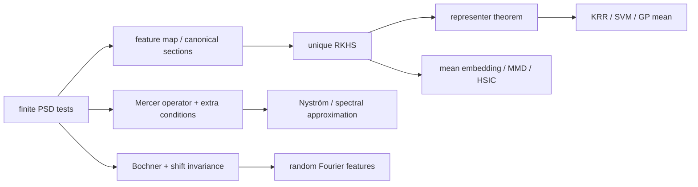

# 正定核、RKHS 与表示定理

> [!info] 课程位置
> 这是 10.10 的 GEO-07。GEO-05 已建立 Hilbert projection 与 Riesz representation，GEO-06 已建立 compact self-adjoint operator 的谱语言。本章把这两层结构放到 function space：一个 PSD kernel 先产生 canonical Hilbert geometry，bounded point evaluation 再产生 reproducing property，projection argument 最后把无限维 regularized optimization 压到有限 sample span。输出将直接进入 GEO-08 的 Green operator、Sobolev weak solution 与 neural operator。

## 建议两遍阅读

> [!tip] 第一遍：只追 Brownian bridge / Green kernel
> 固定 \(\mathcal X=[0,1]\) 和
> $$
> k(x,t)=\min(x,t)-xt.
> $$
> 依次证明它 PSD、写出 kernel section \(k_x\)、验证 \(f(x)=\langle f,k_x\rangle\)、推出 representer form，并读出正弦 Mercer eigenpairs。第一遍不要求记住 universal、characteristic、MMD、HSIC、Nyström、RFF 与 NTK 的全部条件。

> [!tip] 第二遍：再把单一模型推广
> 回到正文完成 Moore–Aronszajn 的 quotient/completion、Mercer theorem 的 topology–measure 合同、一般 representer theorem、KRR/GP 对照、mean embedding 与各种 kernel approximation；每遇到一个抽象结论，都回到 \(k(x,t)=\min(x,t)-xt\) 检查对象、范数与量词。

## 本章的推导问题链

1. 一个 symmetric similarity 为什么还不是合法 kernel，PSD 的全称量词到底是什么？
2. 怎样把两点函数写成 feature inner product，从而一次性证明所有有限 Gram matrices PSD？
3. 为什么 RKHS 不是任意 Hilbert function space，point evaluation bounded 起什么作用？
4. 对具体的 \(k(x,t)=\min(x,t)-xt\)，evaluation representer 为什么恰是一条折线？
5. Reproducing identity 如何把“取函数值”变成 inner product？
6. Empirical loss 为什么看不见 sample span 的正交补，norm regularizer 为什么会删掉它？
7. Kernel ridge regression 怎样从无限维问题变成有限 Gram linear system？
8. 同一个 kernel 怎样成为 compact integral operator，并与下一章的 Green solution operator 对齐？

第一遍读完，应能复述

$$
k
\xrightarrow{\text{all finite PSD tests}}
\mathcal H_k
\xrightarrow{\text{bounded evaluation}}
f(x)=\langle f,k_x\rangle
\xrightarrow{\text{projection}}
f^\star\in\operatorname{span}\{k_{x_i}\}.
$$

## 初学者贯穿模型：一个核同时连接 RKHS 与 Poisson 方程

### 符号与对象账本

| 符号 | 类型 | 本章含义 | 不能误读成 |
|---|---|---|---|
| \(\mathcal X=[0,1]\) | set/domain | kernel 输入所在区间 | 训练样本集合 |
| \(k(x,t)\) | scalar function | \(\min(x,t)-xt\) | 任意相似度或 smoothing window |
| \(k_x=k(x,\cdot)\) | function/vector | 点 \(x\) 的 canonical kernel section | scalar \(k(x,x)\) |
| \(K\in\mathbb R^{n\times n}\) | matrix | \(K_{ij}=k(x_i,x_j)\) | population integral operator |
| \(\mathcal H_k\) | Hilbert function space | kernel 生成的 RKHS | 普通 \(L^2\) |
| \(\delta_x\) | functional | \(f\mapsto f(x)\) | Dirac density |
| \(M\) | subspace | \(\operatorname{span}\{k_{x_1},\ldots,k_{x_n}\}\) | 整个 RKHS |
| \(T_k\) | operator | \(g\mapsto\int_0^1k(\cdot,t)g(t)\,dt\) | finite Gram matrix \(K\) |
| \(\phi_m\) | function | \(\sqrt2\sin(m\pi x)\) | sampled eigenvector |
| \(\lambda_m\) | scalar | \(1/(m\pi)^2\) | regularization parameter |

### 第一步：用显式 feature map 证明 kernel PSD

定义

$$
\psi_x(s)=\mathbf 1_{\{s\le x\}}-x,
\qquad s\in[0,1].
$$

直接展开积分：

$$
\begin{aligned}
\int_0^1\psi_x(s)\psi_t(s)\,ds
&=\int_0^1
\bigl(\mathbf1_{\{s\le x\}}-x\bigr)
\bigl(\mathbf1_{\{s\le t\}}-t\bigr)\,ds\\
&=\min(x,t)-xt\\
&=k(x,t).
\end{aligned}
$$

因此 \(x\mapsto\psi_x\in L^2(0,1)\) 是一个显式 feature map。对任意样本 \(x_1,\ldots,x_n\) 与系数 \(c_1,\ldots,c_n\)，

$$
\begin{aligned}
\sum_{i,j=1}^{n}c_ic_jk(x_i,x_j)
&=\int_0^1
\left(\sum_{i=1}^{n}c_i\psi_{x_i}(s)\right)^2ds\\
&\ge0.
\end{aligned}
$$

这一步一次性覆盖了 PSD 定义中的所有 \(n\)、所有 points 与所有 coefficients，而不是只检查某一个 observed Gram matrix。

> [!warning] Symmetric 远远不够
> 在 \(\{0,1\}\) 上取 \(q(x,t)=-|x-t|^2\)，Gram matrix 为
> $$
> \begin{bmatrix}0&-1\\-1&0\end{bmatrix}.
> $$
> 它 symmetric，但对 \(c=(1,1)^T\) 有 \(c^TKc=-2<0\)，因此不是 PSD kernel。核的合法性是 quadratic-form 条件，不是“数值随距离变小”或“矩阵看起来对称”。

### 第二步：先具体构造函数空间，再验证 reproducing

先考虑边界为零、绝对连续且导数平方可积的函数：

$$
\mathcal H
=\left\{
f:[0,1]\to\mathbb R:
f(0)=f(1)=0,
f\text{ absolutely continuous},\
f'\in L^2(0,1)
\right\},
$$

配内积

$$
\langle f,g\rangle_{\mathcal H}
=\int_0^1f'(t)g'(t)\,dt.
$$

GEO-08 会把它正式识别为 Sobolev space \(H_0^1(0,1)\)；这里先在可直接使用 fundamental theorem of calculus 的代表元上计算。

固定 \(x\in(0,1)\)。Kernel section 是折线

$$
k_x(t)=k(x,t)
=
\begin{cases}
t(1-x),&0\le t\le x,\\
x(1-t),&x\le t\le1.
\end{cases}
$$

它的导数几乎处处为

$$
k_x'(t)
=
\begin{cases}
1-x,&t<x,\\
-x,&t>x.
\end{cases}
$$

于是

$$
\begin{aligned}
\langle f,k_x\rangle_{\mathcal H}
&=(1-x)\int_0^x f'(t)\,dt
-x\int_x^1f'(t)\,dt\\
&=(1-x)\bigl(f(x)-f(0)\bigr)
-x\bigl(f(1)-f(x)\bigr)\\
&=f(x).
\end{aligned}
$$

这就是 reproducing property。它还立即给出 evaluation bound：

$$
|f(x)|
=|\langle f,k_x\rangle_{\mathcal H}|
\le \|f\|_{\mathcal H}\|k_x\|_{\mathcal H}.
$$

而

$$
\|k_x\|_{\mathcal H}^2
=\langle k_x,k_x\rangle_{\mathcal H}
=k(x,x)
=x(1-x),
$$

所以

$$
\boxed{
|f(x)|
\le\sqrt{x(1-x)}\,\|f\|_{\mathcal H}.
}
$$

Point evaluation 不只是“可以写”，而是 continuous linear functional；Riesz theorem 才保证它有唯一 representer \(k_x\)。

> [!important] 为什么普通 \(L^2\) 不是这里的 RKHS
> \(L^2\) 元素是 almost-everywhere equivalence classes，改动单点值不改变元素，因此 \(f(x)\) 通常不良定义；即使选代表元，窄高 spike 也可保持 \(L^2\) norm 有界而让点值发散。RKHS 比 Hilbert function space 多出的正是 bounded point evaluation。

### 第三步：表示定理就是 Hilbert projection 的一次调用

给定样本 \((x_i,y_i)_{i=1}^{n}\)，考虑

$$
\min_{f\in\mathcal H_k}
\frac1n\sum_{i=1}^{n}\bigl(f(x_i)-y_i\bigr)^2
+\lambda\|f\|_{\mathcal H_k}^2,
\qquad \lambda>0.
$$

令

$$
M=\operatorname{span}\{k_{x_1},\ldots,k_{x_n}\}.
$$

由 Hilbert projection，任意 \(f\in\mathcal H_k\) 唯一分解为

$$
f=f_\parallel+f_\perp,
\qquad
f_\parallel\in M,\quad f_\perp\in M^\perp.
$$

因为

$$
f_\perp(x_i)
=\langle f_\perp,k_{x_i}\rangle_{\mathcal H_k}
=0,
$$

所以 empirical loss 只看见 \(f_\parallel\)。另一方面，

$$
\|f\|_{\mathcal H_k}^2
=\|f_\parallel\|_{\mathcal H_k}^2
+\|f_\perp\|_{\mathcal H_k}^2.
$$

任何非零 \(f_\perp\) 都不改变训练预测，却严格增加 regularizer。因此最优解必满足

$$
\boxed{
f^\star
=\sum_{i=1}^{n}\alpha_i k_{x_i}.
}
$$

将 \(f^\star(x_j)=(K\alpha)_j\) 代回目标，得到 finite Gram system

$$
\boxed{
(K+n\lambda I)\alpha=y.
}
$$

\(\lambda>0\) 使 \(K+n\lambda I\) positive definite，即使 \(K\) singular 也可唯一求解系数。这里的“有限化”不是因为 RKHS 实际有限维，而是 loss 只观察有限 evaluations，strictly increasing norm penalty 删除了不可见的正交部分。

> [!warning] 表示定理有合同
> 若 loss 还观察 derivatives、integrals 或其他 functionals，相应 Riesz representers 也要进入 span；若 regularizer 不是 Hilbert norm 的单调函数，或 minimizer 不存在，经典 finite sample span 结论不能原样套用。

### 第四步：同一个 kernel 也是 compact Green operator

在 \(L^2(0,1)\) 上定义

$$
(T_kg)(x)
=\int_0^1k(x,t)g(t)\,dt.
$$

令

$$
\phi_m(x)=\sqrt2\sin(m\pi x),
\qquad m=1,2,\ldots
$$

则

$$
T_k\phi_m
=\lambda_m\phi_m,
\qquad
\lambda_m=\frac1{(m\pi)^2}.
$$

因此

$$
k(x,t)
=2\sum_{m=1}^{\infty}
\frac{\sin(m\pi x)\sin(m\pi t)}{(m\pi)^2}.
$$

这条 Mercer expansion 同时揭示两种几何：

1. \(T_k\) 的 eigenvalues 按 \(m^{-2}\) 衰减，所以它 compact、易低秩逼近；
2. 若 \(f=\sum_ma_m\phi_m\)，则
   $$
   \|f\|_{\mathcal H_k}^2
   =\sum_{m=1}^{\infty}\frac{a_m^2}{\lambda_m}
   =\sum_{m=1}^{\infty}(m\pi)^2a_m^2,
   $$
   高频函数在 RKHS norm 中代价更高。

GEO-08 会证明 \(T_k=(-\partial_{xx})^{-1}\) 是 homogeneous Dirichlet Poisson solution operator；这里先看见 kernel geometry 与 differential regularity 已经是同一个谱对象的正反两面。

### 核心公式七问：从 PSD 到有限表示

核心链是

$$
\boxed{
k(x,t)=\langle\psi_x,\psi_t\rangle_{L^2},
\qquad
f(x)=\langle f,k_x\rangle_{\mathcal H_k},
\qquad
f^\star=\sum_{i=1}^{n}\alpha_i k_{x_i}.
}
$$

1. **对象是什么？** \(x,t\) 是 input points，\(\psi_x\) 是 feature vector，\(k_x\) 是 RKHS function，\(f^\star\) 是优化变量。
2. **第一式解决什么？** 它对任意有限组合给平方范数，从而证明全部 Gram tests PSD。
3. **第二式为何成立？** Evaluation functional bounded，Riesz representer 恰为 \(k_x\)。
4. **第三式为何有限？** Sample loss 看不见 \(M^\perp\)，norm regularizer 会删除它。
5. **用了哪些条件？** PSD、Hilbert completion、bounded evaluations、有限 observations、适当单调 regularizer 和 minimizer existence。
6. **怎样计算？** 只需形成 \(K_{ij}=k(x_i,x_j)\)，再解 regularized Gram system；这没有把 population RKHS 变成 finite-dimensional。
7. **AI 中对应什么？** KRR/SVM、GP posterior mean、kernel PCA、MMD/HSIC 与部分 NTK 分析都在调用这条链的不同层；必须分别报告 kernel validity、Gram conditioning、statistical assumptions 与 approximation error。

## 用数据图审计“合法、有限化、概率解释与近似”

先问：**如何用数值证据区分 kernel PSD、representer projection、KRR–GP 均值等价和随机特征近似，而不把其中任何一项误当成其他三项？**

![[00-知识库管理/_assets/plots/functional-analysis/plot-rkhs-krr-rff-v2.svg|880]]

> [!figure] 图 10.10.7E｜Gram、表示投影、KRR–GP 与随机特征四轨审计
> A 比较 RBF Gram 与 symmetric negative squared-distance matrix 的谱，后者出现约 \(-45.78\) 的负 eigenvalue；B 把 finite-feature weight 分成 sample row span 与正交补，投影后 predictions 最大变化约 \(2.9\times10^{-15}\)，而 norm 从 \(8.58\) 降到 \(3.66\)；C 在 \(\sigma^2=n\lambda\) 下验证 KRR prediction 与 zero-mean GP posterior mean 完全一致，同时保留 GP uncertainty band；D 用 48 条独立随机特征轨道显示平均 Gram error slope 约 \(-0.502\)，但约 \(48\%\) 的单 seed 路径并不逐点单调。来源：独立计算；生成脚本：[[rkhs_kernel_audit.py]]；根种子 20260819。

**怎样读图。** A 只审计有限样本 Gram 合法性；B 是 representer projection 的有限维类比；C 的均值相同不表示 KRR 与 GP 拥有相同统计语义；D 应读 mean 与 quantile band，不能要求每条随机路径随 feature dimension 单调下降。

**适用边界（图没有证明什么）。** 单个 RBF Gram PSD 不证明 kernel 在整个 domain 上 PSD；finite-feature projection 只是抽象 Hilbert proof 的可计算影子；KRR–GP mean identity 依赖 matched noise/regularization 和 zero prior mean；RFF slope 是该数据分布、带宽和误差范数下的实验结果，不是对所有 kernels 的统一常数。

## 第一遍停靠线

到这里先停下。若能无提示完成下列六项，再进入后面的 kernel taxonomy 与统计应用：

- 用 \(\psi_x=\mathbf1_{\{\cdot\le x\}}-x\) 证明 \(k(x,t)=\min(x,t)-xt\) PSD；
- 写出折线 \(k_x\)，并从导数积分推出 \(f(x)=\langle f,k_x\rangle\)；
- 解释普通 \(L^2\) 为什么没有 bounded point evaluation；
- 用 \(f=f_\parallel+f_\perp\) 证明 representer form；
- 从 KRR 目标推出 \((K+n\lambda I)\alpha=y\)；
- 写出正弦 eigenfunctions 和 \(1/(m\pi)^2\) eigenvalues，并说明它们将怎样成为 Poisson Green operator。

后续正文是在扩展这六项的适用范围，不是另起一套 kernel 术语。

> [!abstract] 本章主问题
> 一个只接收两点并输出数值的函数 $k(x,z)$，凭什么能代表某个可能无限维空间中的内积？答案不是“看起来像相似度”，而是它对**每一组有限样本、每一组系数**都生成半正定二次型。Moore–Aronszajn 定理把这种正定核唯一地提升为一个 reproducing kernel Hilbert space（RKHS）；表示定理再说明，一大类无限维正则化问题的最优解实际上落在有限个 kernel sections 的张成空间中。由此，核岭回归、Gaussian process、MMD/HSIC、Kernel PCA、随机特征与部分宽网络极限获得同一条数学主线。

> [!question] 初学者读完必须能回答
> 1. 为什么 symmetric similarity 不一定是 positive-semidefinite kernel？核的正定性量词是什么？
> 2. PSD、strictly PD、conditionally PD、characteristic 与 universal 分别说什么，为什么不能互换？
> 3. $k(x,z)=\langle\phi(x),\phi(z)\rangle$ 怎样保证每个 Gram matrix PSD？反向怎样构造 canonical feature map？
> 4. RKHS 为什么不是“任意 Hilbert function space”？bounded point evaluation 起什么作用？
> 5. Moore–Aronszajn 构造为什么要处理 zero-norm directions 并做 completion？
> 6. Mercer expansion 需要哪些 compactness、continuity 与 measure 条件？为什么不能从“核 PSD”直接跳到级数？
> 7. 表示定理如何把无限维优化降成 $n$ 个系数？strictly increasing 与 nondecreasing regularizer 有何差别？
> 8. KRR 与带 Gaussian noise 的 GP regression 为什么有相同 posterior mean，却不是同一个统计对象？
> 9. Kernel mean embedding、MMD 与 HSIC 何时能识别分布或独立性？
> 10. Nyström、random Fourier features 与 NTK 分别近似了哪一层对象，又引入什么新误差？

先用下图回答一个视觉问题：**一个两点函数怎样通过所有有限 Gram tests 成为 Hilbert 几何，点值如何被 inner product 再生，而无限维优化为何有条件地落入有限 sample span？**

![[00-知识库管理/_assets/figures/functional-analysis/fig-positive-kernel-rkhs-representer-v2.svg|880]]

> [!figure] 图 10.10.7｜Positive kernel、RKHS 与 representer theorem
> A 将任意有限 points 组装成 $K_{ij}=k(x_i,x_j)$，以“对所有 $n$、points、coefficients 都有 $c^\top Kc\ge0$”作为 PSD kernel 入口；B 用 canonical section $k_x=k(x,\cdot)$ 表示 evaluation functional，并由 $f(x)=\langle f,k_x\rangle_{\mathcal H_k}$ 得到点值连续界；C 把只依赖 sample values 且带单调 RKHS-norm regularizer 的最优解压到 $\operatorname{span}\{k_{x_i}\}$，再形成 finite Gram system。来源：独立绘制；理论接口参考 Moore–Aronszajn theorem、reproducing property 与 representer theorem；生成脚本：[[plot_functional_analysis_v2.py]]；确定性结构示意，无随机种子。

**怎样读图。** A 先读完整量词，一个 observed Gram matrix PSD 只是有限测试，不足以证明 $k$ 在整个 $\mathcal X$ 上 PSD；B 再把“函数取值”看成 continuous linear functional，由 Riesz representation 得到唯一 $k_x$，这才是 reproducing 的来源；C 最后把候选 $f$ 正交分解成 sample span 与其正交补，empirical loss 看不见正交补，而严格单调 norm regularizer 会删掉它，从而得到有限表示。

**适用边界（图没有证明什么）。** 图没有完成 zero-norm quotient、completion、Moore–Aronszajn uniqueness 或 representer theorem 的证明。PSD 不等于 strictly PD、universal 或 characteristic；Mercer expansion 还需 topology、measure、continuity/compactness 条件。若 loss 依赖 derivatives/非样本 functionals、regularizer 非单调或问题无 minimizer，图中的 finite span 结论需修改；Gram system 仍可能严重 ill-conditioned。

## 0. 对象合同与学习路线

### 0.1 基本约定

- $\mathcal X$ 是非空输入集合；除 Mercer 部分外，不预设 topology 或 measure；
- 实数情形 $k:\mathcal X\times\mathcal X\to\mathbb R$ 默认 symmetric；复数情形改为 Hermitian：$k(x,z)=\overline{k(z,x)}$；
- $k_x:=k(x,\cdot)$；$K=[k(x_i,x_j)]_{i,j=1}^n$ 是 Gram matrix；
- $\mathcal H_k$ 是以 $k$ 为 reproducing kernel 的 RKHS；
- 复 Hilbert space 的 inner product 约定对第一个变量 linear。于是 $f(x)=\langle f,k_x\rangle_{\mathcal H_k}$；
- 样本数是 $n$，显式 feature dimension 是 $D$，Mercer eigen-index 用 $j$。

### 0.2 三条不能混写的主线



第一条是集合层的 **positive kernel $\leftrightarrow$ RKHS**；第二条是带 topology/measure 后的 **integral operator 与 Mercer spectrum**；第三条是优化层的 **representer theorem**。三条互相连接，但没有一条可以无条件代替另一条。

### 0.3 “kernel”一词的三种常见含义

1. 本章的 positive-semidefinite kernel：生成 inner product/Gram PSD；
2. Kernel density estimation 中的 smoothing window：重点是积分为一、带宽与密度估计，不必是本章意义的 PSD kernel；
3. Linear operator 的 null space/kernel：$\ker T=\{x:Tx=0\}$。

语境相同不代表数学对象相同。尤其不能因为一个函数被称为“Gaussian kernel”就跳过其用途与条件审计。

## 1. 正定核：量词比“相似”更重要

### 1.1 定义

> [!definition] Positive-semidefinite kernel
> 实函数 $k$ 称为 positive semidefinite（PSD）kernel，如果它 symmetric，且对任意 $n\ge1$、任意 $x_1,\ldots,x_n\in\mathcal X$、任意 $c\in\mathbb R^n$，都有
> $$
> \sum_{i,j=1}^n c_ic_jk(x_i,x_j)=c^\top Kc\ge0.
> $$
> 复数情形把 $c_ic_j$ 改为 $c_i\overline{c_j}$，并要求 Hermitian symmetry。

“所有 $n$、所有点、所有系数”是完整量词。只检查一个数据集上的一个 Gram matrix PSD，只能说明该有限样本通过测试，不能证明 $k$ 在整个 $\mathcal X$ 上是 PSD kernel。

> [!warning] 术语约定
> 机器学习文献常把上述 semidefinite kernel 简称 positive definite kernel。本章需要区分时写 **PSD kernel**；只有当互异 $x_i$ 和非零 $c$ 总给 $c^\top Kc>0$ 时才写 **strictly positive definite**（strictly PD）。Strictly PD 关心有限 Gram matrix 是否 nonsingular，不等于 characteristic 或 universal。

### 1.2 立刻得到的必要条件

取 $n=1$ 得

$$
k(x,x)\ge0.
$$

对 $x,z$ 的 $2\times2$ Gram matrix 用 determinant 非负，得 kernel Cauchy–Schwarz：

$$
|k(x,z)|^2\le k(x,x)k(z,z).
$$

所以若 $k(x,x)=0$，则 $k(x,z)=0$ 对所有 $z$。但 $k(x,z)$ 本身可以为负；PSD 约束的是所有 quadratic forms，不是每个 entry 非负。

### 1.3 相似度、距离与核不是同义词

对 $\mathcal X=\{0,1,2\}$，令 $k(x,z)=-|x-z|^2$。它 symmetric，却有 $k(0,1)=-1$ 且 Gram matrix 可出现负 eigenvalue，因此不是 PSD kernel。另一方面，$-|x-z|^2$ 在满足 $\sum_i c_i=0$ 的系数上可能具有 conditionally positive/negative definite 结构；这类对象可经 centering 或 exponentiation 构造核，但它们不是“无条件 PSD”。

> [!important] 条件正定不等于正定
> Conditionally positive definite 只在某个线性约束（常见为 $\sum_i c_i=0$）下要求二次型非负。Thin-plate splines、distance kernels 等需要 polynomial side conditions 或 centering。把条件删掉会改变问题。

## 2. Gram matrix 与合法核的构造法

### 2.1 Feature inner product 自动给 PSD

若存在 Hilbert space $\mathcal F$ 与 map $\phi:\mathcal X\to\mathcal F$，使

$$
k(x,z)=\langle\phi(x),\phi(z)\rangle_{\mathcal F},
$$

则

$$
c^\top Kc
=\left\|\sum_{i=1}^n c_i\phi(x_i)\right\|_{\mathcal F}^2\ge0.
$$

这就是 kernel trick 的代数核心：算法若只使用 feature inner products，就可直接用 $k(x_i,x_j)$，无需显式构造可能高维或无限维的 $\phi$。

### 2.2 闭包规则

若 $k_1,k_2$ 是 PSD kernels，$a,b\ge0$，则下列仍 PSD：

1. $ak_1+bk_2$；
2. pointwise product $k_1k_2$（有限样本上由 Schur product theorem）；
3. 对任意 map $T:\mathcal Z\to\mathcal X$，pullback $\tilde k(z,w)=k(Tz,Tw)$；
4. $g(x)k(x,z)g(z)$；
5. 若 power series $f(t)=\sum_{m\ge0}a_mt^m$ 在值域上收敛且 $a_m\ge0$，则 $f\circ k$ PSD。

从线性核 $x^\top z$ 出发，$(c+x^\top z)^p$ 在 $c\ge0$、整数 $p\ge0$ 时是 polynomial kernel。不能把 $p$ 任意改成非整数并仍声称全域 PSD；负数底数还可能使函数都未定义。

### 2.3 常用例子及其 feature 解释

| 核 | Domain/参数 | 结构解释 |
|---|---|---|
| $x^\top z$ | $\mathbb R^d$ | 原空间 inner product |
| $(c+x^\top z)^p$ | $c\ge0,p\in\mathbb N$ | 有限维 monomial features |
| $\exp(-\|x-z\|^2/(2\ell^2))$ | $\ell>0$ | Gaussian/RBF；无限维 feature，平移不变 |
| $\exp(-\|x-z\|_1/\ell)$ | $\ell>0$ | Laplace kernel |
| $\min(s,t)$ | $s,t\in[0,1]$ | Brownian covariance；可写成 $\int\mathbf1_{u\le s}\mathbf1_{u\le t}du$ |
| $\sum_m\lambda_m\psi_m(x)\psi_m(z)$ | $\lambda_m\ge0$，收敛 | 谱 feature $\phi_m(x)=\sqrt{\lambda_m}\psi_m(x)$ |

RBF 的 bandwidth $\ell$ 是建模假设：$\ell$ 小时 Gram matrix趋近 identity，局部且可能过拟合；$\ell$ 大时趋近 rank-one constant kernel，表达方向塌缩。合法 PSD 不等于适合任务。

## 3. 从核到空间：Moore–Aronszajn 构造

### 3.1 先从有限线性组合开始

给定 PSD kernel $k$，令

$$
\mathcal H_0
=\operatorname{span}\{k_x:x\in\mathcal X\}
=\left\{\sum_{i=1}^m a_i k_{x_i}:m<\infty\right\}.
$$

对

$$
f=\sum_i a_i k_{x_i},
\qquad
g=\sum_j b_j k_{z_j},
$$

定义

$$
\langle f,g\rangle_0
=\sum_{i,j}a_i\overline{b_j}k(x_i,z_j).
$$

PSD 保证 $\langle f,f\rangle_0\ge0$。要确认它不依赖同一函数的不同表示，注意

$$
\langle f,k_z\rangle_0=\sum_i a_i k(x_i,z)=f(z).
$$

若 $f$ 是零函数，则它与每个 generator $k_z$ inner product 为零，因而与整个 span inner product 为零。另一种通用构造是先把 formal combinations 中的 zero-seminorm directions quotient 掉；两种写法得到同一 pre-Hilbert space。

### 3.2 Completion 与再生性质

$\mathcal H_0$ 未必 complete。对它做 Hilbert completion 得 $\mathcal H_k$。因为

$$
|f(x)|=|\langle f,k_x\rangle|
\le\|f\|_{\mathcal H_k}\|k_x\|_{\mathcal H_k}
=\sqrt{k(x,x)}\,\|f\|_{\mathcal H_k},
$$

point evaluation $\delta_x:f\mapsto f(x)$ 是 bounded linear functional，故 Cauchy sequences 的逐点值有唯一极限；completion 中的元素仍可识别成函数。

> [!theorem] Moore–Aronszajn
> 每个 PSD kernel $k$ 都对应唯一的 RKHS $\mathcal H_k$，使 $k_x\in\mathcal H_k$ 且
> $$
> f(x)=\langle f,k_x\rangle_{\mathcal H_k}.
> $$
> 反过来，每个 RKHS 有唯一 reproducing kernel $k(x,z)=\langle k_x,k_z\rangle$。

“唯一”是作为带指定点值的函数 Hilbert space 唯一；其他 feature spaces 可以产生同一个 kernel，但其 feature span closure 与 canonical RKHS 等距同构。

### 3.3 为什么普通 $L^2$ 不是 RKHS

$L^2$ 元素是 a.e. equivalence classes，改变单点值不改变元素，因此 $f(x)$ 通常连良定义都不是。即使选 continuous representative，point evaluation 也未必在 $L^2$ norm 下 bounded：可造越来越窄、越来越高而 $L^2$ norm有界的 spikes，使固定点值发散。

这不是说 $L^2$ 不好，而是它控制平均平方，不控制每一点。Sobolev spaces 在足够 regularity 条件下可由 embedding theorem 获得 continuous evaluation，届时才可能成为 RKHS；详见[[弱导数、Sobolev 空间与神经算子接口]]。

## 4. Canonical feature map 与核诱导几何

### 4.1 点被映成一个函数

Canonical feature map 是

$$
\Phi:\mathcal X\to\mathcal H_k,
\qquad
\Phi(x)=k_x.
$$

于是

$$
k(x,z)=\langle k_x,k_z\rangle_{\mathcal H_k},
\qquad
\|k_x\|^2=k(x,x).
$$

对 normalized kernel

$$
\tilde k(x,z)=\frac{k(x,z)}{\sqrt{k(x,x)k(z,z)}}
$$

需要 $k(x,x),k(z,z)>0$；它相当于 feature-space cosine，但 normalization 会改变 RKHS 与统计估计，不能只视为“数值技巧”。

### 4.2 Kernel distance

定义

$$
d_k(x,z)^2
=\|k_x-k_z\|_{\mathcal H_k}^2
=k(x,x)+k(z,z)-2\operatorname{Re}k(x,z).
$$

它总满足 nonnegativity、symmetry 与 triangle inequality，但可能只有 pseudometric：若 $k_x=k_z$ 而 $x\ne z$，则 $d_k(x,z)=0$。只有 canonical feature map injective 时它才是 metric。

### 4.3 RKHS norm 是函数复杂度，不是点值平方和

若 $f=\sum_i\alpha_i k_{x_i}$，则

$$
\|f\|_{\mathcal H_k}^2=\alpha^\top K\alpha.
$$

当表示不唯一时，不同 $\alpha$ 可能代表同一个函数；zero-Gram directions 的 norm 为零并在空间构造中被识别。不能把 $\|f\|_{\mathcal H_k}$ 与 $\sum_i f(x_i)^2$ 或 $L^2$ norm混同。

## 5. Mercer theorem：何时能写特征函数级数

### 5.1 先建立 integral operator

令 $\mathcal X$ 是 compact Hausdorff space，$\mu$ 是有限 Borel measure，$k$ continuous、symmetric PSD。定义

$$
(T_kf)(x)=\int_{\mathcal X}k(x,z)f(z)d\mu(z).
$$

在常见条件下，$T_k:L^2(\mu)\to L^2(\mu)$ compact、self-adjoint、positive。因此由 compact spectral theorem 存在 eigenpairs

$$
T_k\psi_j=\lambda_j\psi_j,
\qquad
\lambda_j\ge0,
$$

非零 $\lambda_j$ 只能向 $0$ 聚集。

### 5.2 Mercer expansion

在上述经典条件以及适当 support 条件下，

$$
k(x,z)=\sum_{j=1}^{\infty}\lambda_j\psi_j(x)\psi_j(z),
$$

并获得比单纯 $L^2(\mu\times\mu)$ 更强的 convergence（经典紧致连续版本可 uniform/absolute convergence）。相应 RKHS 可表为

$$
\mathcal H_k
=\left\{f=\sum_j a_j\psi_j:
\sum_{j:\lambda_j>0}\frac{a_j^2}{\lambda_j}<\infty\right\},
\qquad
\|f\|_{\mathcal H_k}^2
=\sum_{j:\lambda_j>0}\frac{a_j^2}{\lambda_j}.
$$

小 $\lambda_j$ 方向代价大：RKHS norm 对 kernel operator 认为“不自然”的高频/弱能量方向施加强惩罚。

> [!warning] Mercer 不是 PSD 的同义改写
> Moore–Aronszajn 只需一个集合和 PSD kernel；Mercer expansion 还引入 topology、measure、integral operator、compactness 与 continuity。离散样本 Gram eigendecomposition 总能做，但它不是无条件的 population Mercer theorem。

### 5.3 Empirical spectrum 与 population spectrum

样本 Gram matrix $K/n$ 可看作 empirical integral operator 的有限表示。其 eigenvalues 可近似 population spectrum，但误差取决于 sampling、measure、normalization、kernel boundedness、spectral gaps 与 concentration。只画一张 Gram spectrum 图不能证明 population eigen-decay。

## 6. 表示定理：无限维问题为何得到有限展开

### 6.1 定理的精确形式

给样本 $x_1,\ldots,x_n$，考虑

$$
\min_{f\in\mathcal H_k}
L\bigl(f(x_1),\ldots,f(x_n)\bigr)
+\Omega(\|f\|_{\mathcal H_k}),
$$

其中 $L$ 可非常一般，不必 convex 或 differentiable。

> [!theorem] Generalized representer theorem
> 若 $\Omega:[0,\infty)\to\mathbb R$ strictly increasing，则任一 minimizer（若存在）都具有
> $$
> f^*(\cdot)=\sum_{i=1}^n\alpha_i k(x_i,\cdot).
> $$
> 若 $\Omega$ 仅 nondecreasing，则至少存在一个 sample-span minimizer，但可能还有带 orthogonal component 的 minimizers。

定理说明解的形式，不自动保证 minimizer 存在、唯一，也不保证 coefficient $\alpha$ 稀疏。

### 6.2 一页纸证明

令

$$
S=\operatorname{span}\{k_{x_1},\ldots,k_{x_n}\}.
$$

由 Hilbert projection，任意 $f$ 唯一分解为

$$
f=f_\parallel+f_\perp,
\qquad f_\parallel\in S,\quad f_\perp\perp S.
$$

对每个训练点，reproducing property 给

$$
f_\perp(x_i)=\langle f_\perp,k_{x_i}\rangle=0,
$$

所以 $f$ 与 $f_\parallel$ 有完全相同的 empirical loss。另一方面，Pythagoras 给

$$
\|f\|^2=\|f_\parallel\|^2+\|f_\perp\|^2.
$$

若 $f_\perp\ne0$ 且 $\Omega$ strictly increasing，删去 $f_\perp$ 会严格降低 objective，故 minimizer 必有 $f_\perp=0$。

> [!important] 真正压缩解的是两件事
> Loss 只观察有限个 bounded linear functionals，regularizer 只按 Hilbert norm 单调惩罚。若 loss 还依赖 training points之外的 derivative/integral functionals，表示基会加入这些 functionals 的 Riesz representers；若 regularizer不是 norm 的单调函数，经典结论可能失效。

## 7. Kernel ridge regression：从函数优化到线性系统

### 7.1 Primal objective 与 finite representation

采用

$$
J(f)=\frac1n\sum_{i=1}^n(f(x_i)-y_i)^2
+\lambda\|f\|_{\mathcal H_k}^2,
\qquad \lambda>0.
$$

表示定理令 $f=\sum_j\alpha_jk_{x_j}$。训练预测向量为 $K\alpha$，norm为 $\alpha^\top K\alpha$，故

$$
J(\alpha)=\frac1n\|K\alpha-y\|_2^2
+\lambda\alpha^\top K\alpha.
$$

Stationarity 给

$$
K(K\alpha-y+n\lambda\alpha)=0.
$$

一个唯一、稳定的 canonical linear-system solution 是

$$
\boxed{\alpha=(K+n\lambda I)^{-1}y},
$$

因为 $K+n\lambda I\succ0$。即使 $K$ singular，$\lambda>0$ 仍保证这个 system invertible；对应函数 minimizer 也唯一。要注意：若 $v\in\ker K$，$\alpha+v$ 可能是 coefficient objective 的另一组 minimizer coefficients，并代表完全相同的 RKHS 函数；唯一的是上述 canonical system solution与函数 $f^*$，不是任意冗余 coefficient表示。

测试点 $x$ 的预测为

$$
\hat f(x)=k_x^{(n)\top}(K+n\lambda I)^{-1}y,
\qquad
k_x^{(n)}=(k(x_1,x),\ldots,k(x_n,x))^\top.
$$

### 7.2 Scaling 与 intercept 陷阱

若 objective 不含 $1/n$，系统变成 $(K+\lambda I)\alpha=y$。所以报告 $\lambda$ 必须同时报告 loss scaling。未正则化的 intercept $b$ 需要另加变量、centering 或使用含 constant component 的 kernel；不能偷偷把 $b$ 吸收后仍沿用同一 normal equation。

### 7.3 Effective smoother 与 bias–variance

训练 fitted values 为

$$
\hat y=S_\lambda y,
\qquad
S_\lambda=K(K+n\lambda I)^{-1}.
$$

若 $K=U\operatorname{diag}(\kappa_j)U^\top$，则每个 empirical eigendirection 被缩放为

$$
\frac{\kappa_j}{\kappa_j+n\lambda}.
$$

因此 $\lambda$ 不是简单“把 coefficients变小”，而是按 kernel spectrum 进行方向依赖的 shrinkage。Effective degrees of freedom常记为 $\operatorname{tr}S_\lambda$。

### 7.4 数值实现合同

- 不显式求 inverse；对 $K+n\lambda I$ 做 Cholesky solve；
- 若因 floating-point 得到微小负 eigenvalue，可先查 symmetry、formula 与 scaling，再加数值 jitter；
- Jitter 是 factorization safeguard，statistical regularization 是模型选择，二者数值上都加 diagonal但语义不同；
- Dense exact training 通常 time $O(n^3)$、memory $O(n^2)$；大样本需 low-rank、iterative solve、structured kernel 或显式 features；
- 报告 condition number、residual 与 predictive stability，不只报告 training loss。

## 8. Gaussian process 与 KRR：同均值，不同问题

### 8.1 GP regression posterior

令

$$
f\sim\mathcal{GP}(0,k),
\qquad
y_i=f(x_i)+\varepsilon_i,\quad
\varepsilon_i\overset{iid}{\sim}\mathcal N(0,\sigma^2).
$$

有限点上的 covariance matrix 必须 PSD，这正是合法 kernel 的概率版本。对测试点 $x_*$，Gaussian conditioning 给

$$
\mathbb E[f_*\mid y]
=k_*^\top(K+\sigma^2I)^{-1}y,
$$

$$
\operatorname{Var}(f_*\mid y)
=k(x_*,x_*)-k_*^\top(K+\sigma^2I)^{-1}k_*.
$$

若预测 noisy observation，再加 $\sigma^2$。

### 8.2 与 KRR 的对应

在本章 KRR 使用 $n^{-1}$ loss 的约定下，取

$$
n\lambda=\sigma^2,
$$

KRR predictor 与 zero-mean GP posterior mean完全相同。但：

- KRR 是 regularized point estimator；GP 是 function distribution conditional inference；
- GP 还给 posterior covariance 和 marginal likelihood；
- RKHS 中的典型函数不必是 GP sample path。对无限维 Gaussian process，sample path 往往以概率 $1$ 不属于其 covariance kernel 的 RKHS；
- 同一公式不等于同一 uncertainty 声明。

## 9. Kernel mean embedding、MMD 与 HSIC

### 9.1 Probability measure 作为 RKHS 中的均值

若 $X\sim P$ 且满足例如

$$
\mathbb E\sqrt{k(X,X)}<\infty,
$$

则 Bochner mean embedding

$$
\mu_P=\mathbb E[k_X]\in\mathcal H_k
$$

存在，并对 $f\in\mathcal H_k$ 满足

$$
\mathbb E_Pf(X)=\langle f,\mu_P\rangle.
$$

于是 maximum mean discrepancy 是

$$
\operatorname{MMD}_k(P,Q)
=\|\mu_P-\mu_Q\|_{\mathcal H_k}
=\sup_{\|f\|_{\mathcal H_k}\le1}
\left|\mathbb E_Pf-\mathbb E_Qf\right|.
$$

平方后用 kernel trick 展开：

$$
\operatorname{MMD}_k^2(P,Q)
=\mathbb E k(X,X')+\mathbb E k(Y,Y')-2\mathbb E k(X,Y).
$$

### 9.2 Characteristic、universal、strict PD 不同层

- Characteristic：map $P\mapsto\mu_P$ 在指定 probability-measure class 上 injective，因此 MMD $=0\Rightarrow P=Q$；
- Universal：RKHS 在某个 target function space（如 compact domain上的 $C(\mathcal X)$）中 dense；必须声明 topology/norm/domain；
- Strictly PD：互异有限点的 Gram matrix positive definite。

三者有关但不等价。一个 kernel 是否 characteristic 还依赖 domain 与所考虑 measure class；“Gaussian kernel常用”不能替代条件声明。

### 9.3 HSIC

对 kernels $k,l$ 的 centered feature maps，cross-covariance operator可写为

$$
C_{XY}
=\mathbb E[(\phi(X)-\mu_X)\otimes(\psi(Y)-\mu_Y)].
$$

HSIC 定义为

$$
\operatorname{HSIC}(P_{XY};k,l)=\|C_{XY}\|_{HS}^2.
$$

对 paired sample 的常见 biased estimator 是

$$
\widehat{\operatorname{HSIC}}_b
=\frac1{n^2}\operatorname{tr}(KHLH),
\qquad
H=I-\frac1n\mathbf1\mathbf1^\top.
$$

Independence 总推出合适 integrability 下 HSIC $=0$；反向需要 kernels 足够 characteristic/rich。Estimator 的 biased/unbiased 版本、dependent samples、null calibration、bandwidth 和 scaling 必须另行报告。ScienceSpaces 的 HSIC 文章提供了很好的问题入口，但其“任意核均可判独立”的直观说法不能作为正式条件。

## 10. Kernel PCA：在看不见的 feature space 做 PCA

令 centered features 为 $\tilde\phi_i=\phi(x_i)-\bar\phi$，经验 covariance operator

$$
\widehat C=\frac1n\sum_{i=1}^n\tilde\phi_i\otimes\tilde\phi_i.
$$

Centered Gram matrix 是

$$
K_c=HKH.
$$

非零 operator eigenvalues 与 $K_c/n$ 的非零 eigenvalues对应；若 $K_cv_j=n\hat\lambda_jv_j$，则 feature-space principal direction 可写为

$$
u_j=\frac1{\sqrt{n\hat\lambda_j}}
\sum_i(v_j)_i\tilde\phi_i.
$$

因为 centered $n$ 个 features 的和为零，empirical rank至多 $n-1$。这不推出 population covariance finite rank，也不保证 out-of-sample preimage 存在。

## 11. 从精确核到有限计算：Nyström 与 RFF

### 11.1 Nyström

从 $m\ll n$ 个 landmarks 形成

$$
K\approx K_{nm}K_{mm}^{\dagger}K_{mn}.
$$

它近似 sample Gram/operator 的低秩结构。误差受 landmark selection、leverage、effective dimension、regularization 与 $K_{mm}$ conditioning 影响。用 pseudoinverse 或截断不是免费步骤，必须记录 rank threshold。

### 11.2 Bochner theorem 与 random Fourier features

对 $\mathbb R^d$ 上 continuous shift-invariant kernel

$$
k(x,z)=\kappa(x-z),
$$

Bochner theorem 说明 $\kappa$ PSD 当且仅当它是某个 finite nonnegative measure 的 Fourier transform。若规范化为 probability spectral density $p(\omega)$，则

$$
k(x,z)=\mathbb E_{\omega\sim p}
e^{i\omega^\top(x-z)}.
$$

引入 $b_r\sim\operatorname{Unif}[0,2\pi]$ 与 $\omega_r\sim p$，定义

$$
z_D(x)=\sqrt{\frac2D}
\bigl(\cos(\omega_1^\top x+b_1),\ldots,
\cos(\omega_D^\top x+b_D)\bigr),
$$

则

$$
\mathbb E[z_D(x)^\top z_D(z)]=k(x,z).
$$

它把 $O(n^2)$ Gram storage换成 $O(nD)$ features，并可用线性算法；但带来 Monte Carlo approximation error，典型 fixed-set RMS 随 $D$ 约按 $D^{-1/2}$ 降低，常数与 domain、kernel、置信度和误差范数有关。

> [!warning] RFF 的适用条件
> 经典 RFF 直接依赖 shift invariance 与 Bochner spectral measure。一般 graph/string/kernel 不能未经新构造就采 $\omega$。正定性仍成立于显式 feature Gram $ZZ^\top$，但它近似目标 kernel 的质量需另行验收。

### 11.3 误差账本

```text
population target
  -> finite sample error
  -> exact Gram / operator discretization error
  -> low-rank or random-feature approximation error
  -> solver / floating-point error
  -> downstream task error
```

只报告最后 accuracy 会掩盖是哪一层失效；只报告 $\|K-\tilde K\|_F$ 也不自动给下游 risk bound。

## 12. 核与现代 AI 的接口

### 12.1 SVM、regularization networks 与 learned representations

SVM、kernel logistic regression 和 spline regularization都调用表示定理，但 loss 与 regularizer不同。Deep kernel learning 常令

$$
k_\theta(x,z)=k_0(h_\theta(x),h_\theta(z)),
$$

只要 $k_0$ PSD，任意 deterministic representation $h_\theta$ 的 pullback仍 PSD。优化 $\theta$ 后，problem不再只是固定 convex kernel machine；representation learning、hyperparameter selection 与 generalization需另证。

### 12.2 Linear Attention 的 kernel factorization视角

若 attention affinity 可写为

$$
a(q,k)=\phi(q)^\top\varphi(k),
$$

则可利用矩阵乘法结合律避免显式 $n\times n$ affinity。若 $\phi=\varphi$，它更接近 PSD kernel feature factorization；若两者不同，得到的是一般双线性 feature pairing，不必是 symmetric PSD kernel。Softmax normalization、causal mask、positivity 与 approximation error都会改变最终 operator。

ScienceSpaces 关于“无限维线性 Attention”的推导很好地展示了指数 dot-product 如何经 Taylor 或随机正特征被 factorize；本章只把它作为 kernel feature 的 AI 接口，不把未经归一化的 kernel approximation等同于完整 attention layer。

### 12.3 Neural tangent kernel

对 parameterized network $f_\theta$，finite-width empirical NTK 可写为

$$
\Theta_\theta(x,z)
=\langle\nabla_\theta f_\theta(x),
\nabla_\theta f_\theta(z)\rangle,
$$

所以对固定 $\theta$ 它是 PSD kernel。某些 width、parameterization、initialization 与 learning-rate limits 下，NTK 在训练中趋于 deterministic 且近似保持不变，network dynamics可由 kernel gradient flow描述。

> [!warning] NTK 不是“所有深网都等于核机”
> Infinite-width theorem有明确 scaling与limit次序；finite network 的 features可显著移动。NTK regime解释的是一类 lazy/linearized dynamics，不能无条件覆盖 feature learning、finite-step optimizer、normalization或大步长训练。

## 13. 常见错误与修复

| 错误 | 为什么错 | 修复 |
|---|---|---|
| symmetric + 对角非负就一定是核 | 不能保证所有二次型非负 | 检查完整 PSD 量词或给 feature construction |
| Gram 在当前数据上 PSD，所以函数全域 PSD | 只通过一个 finite test | 给普遍证明或限制声明到该矩阵 |
| PSD 意味着 entries非负 | PSD 约束 quadratic form | 允许负 inner products |
| 任意 Hilbert function space都是 RKHS | evaluation可能不连续/不良定义 | 检查每个 $\delta_x$ bounded |
| Mercer 对任意 PSD kernel成立 | 缺 topology、measure、compactness/continuity | 写明经典 Mercer 假设 |
| Strictly PD、universal、characteristic同义 | 分别控制 finite interpolation、function density、measure injection | 指明 domain与目标 class |
| Representer theorem保证优化有解且唯一 | 它主要给 minimizer 的形式 | 另查 coercivity、lower semicontinuity、convexity |
| $K^{-1}y$ 是通用 kernel solution | $K$ 可 singular且插值可能不稳定 | 用 regularization和 stable solve |
| Jitter 就是统计正则 | 数值与建模语义不同 | 分开报告 jitter 与 $\lambda$ |
| GP posterior mean = KRR，所以不确定性也相同 | 一个是分布推断，一个是点估计 | 单独报告 posterior covariance与prior/noise |
| MMD/HSIC 为零总识别目标 | 需 characteristic/rich kernels | 声明 measure class与 kernel条件 |
| RFF 维数翻倍误差必严格下降 | Monte Carlo realization可波动 | 多 seed报告均值、分位数与斜率 |
| Finite NTK PSD证明所有深网训练是核回归 | PSD只是固定 Jacobian Gram事实 | 核验 width/scaling/kernel drift |

## 14. 一套可执行的 kernel audit

面对一个新核或新“kernelized”模型，按顺序回答：

1. **对象**：domain、codomain、real/complex、symmetry是什么？
2. **合法性**：PSD 由 feature map、closure theorem、Bochner还是直接 quadratic-form proof保证？
3. **退化**：strict PD吗？哪些不同输入被 canonical feature map合并？
4. **空间**：对应 RKHS 的函数和 norm在控制什么？point evaluation bound是多少？
5. **谱**：是否真的满足 Mercer 的 topology/measure条件？empirical与population如何缩放？
6. **优化**：loss观察哪些 functionals？regularizer是否满足 representer theorem？
7. **统计**：kernel选择、bandwidth、regularization、characteristic/universal条件是什么？
8. **计算**：exact Gram、Nyström、RFF或iterative solve各自的 time/memory？
9. **数值**：condition、jitter、dtype、solve residual与PSD tolerance？
10. **声明**：有限样本、population、uncertainty和下游性能是否分账？

## 15. 掌握标准

### A. 定义层

- 能完整写出 PSD kernel 的全量词；
- 能区分 RKHS、$L^2$、feature space 与 Gram matrix；
- 能区分 strictly PD、characteristic、universal 与 conditionally PD。

### B. 计算层

- 能手算 linear/polynomial/Brownian kernel Gram 与 feature map；
- 能从 KRR objective 推出 $(K+n\lambda I)\alpha=y$；
- 能写 GP posterior mean/variance、MMD 与 centered HSIC estimator。

### C. 证明层

- 能重建 Moore–Aronszajn pre-Hilbert construction；
- 能用 projection完整证明 generalized representer theorem；
- 能说明 Mercer theorem 比 Moore–Aronszajn 多了哪些条件。

### D. 反例与审计层

- 能构造 symmetric but indefinite similarity；
- 能解释 ordinary $L^2$ 不是 RKHS；
- 能识别 empirical PSD、population Mercer、GP/KRR同均值、RFF/NTK近似中的越界声明。

### E. AI 迁移层

- 能为 KRR/GP/MMD/HSIC/Kernel PCA 建立对象—条件—算法—误差合同；
- 能比较 exact Gram、Nyström 与 RFF 的统计/计算取舍；
- 能把 linear attention 或 NTK 的 kernel说法限制在精确假设内。

完成上述内容还不等于掌握。请先闭卷做[[习题 - 正定核、RKHS 与表示定理]]，再独立复现[[实验 - Gram 正定性、KRR 表示与随机特征近似审计]]并至少修改 bandwidth、regularization、feature dimension 三组参数。

## 16. 来源与进一步阅读

### 16.1 正式理论骨架

- N. Aronszajn, [*Theory of Reproducing Kernels*](https://www.ams.org/tran/1950-068-03/S0002-9947-1950-0051437-7/S0002-9947-1950-0051437-7.pdf), 1950：RKHS 一般理论与唯一对应；
- MIT 9.520, [Class 3: Reproducing Kernel Hilbert Spaces](https://ocw.mit.edu/courses/9-520-statistical-learning-theory-and-applications-spring-2006/resources/class03/)：RKHS、Mercer 与 regularization/representer 的课程入口；
- B. Schölkopf, R. Herbrich, A. J. Smola, [*A Generalized Representer Theorem*](https://alex.smola.org/papers/2001/SchHerSmo01.pdf), 2001：广义表示定理原始论文；
- C. E. Rasmussen, C. K. I. Williams, [*Gaussian Processes for Machine Learning*](https://gaussianprocess.org/gpml/chapters/), 2006：GP、covariance kernels、RKHS 与大规模近似。

### 16.2 统计与近似接口

- A. Rahimi, B. Recht, [*Random Features for Large-Scale Kernel Machines*](https://proceedings.neurips.cc/paper_files/paper/2007/hash/013a006f03dbc5392effeb8f18fda755-Abstract.html), NeurIPS 2007；
- B. K. Sriperumbudur et al., [*Hilbert Space Embeddings and Metrics on Probability Measures*](https://www.jmlr.org/papers/v11/sriperumbudur10a.html), JMLR 2010；
- A. Gretton et al., [*A Kernel Two-Sample Test*](https://www.jmlr.org/papers/v13/gretton12a.html), JMLR 2012；
- A. Jacot, F. Gabriel, C. Hongler, [*Neural Tangent Kernel*](https://papers.nips.cc/paper/2018/hash/5a4be1fa34e62bb8a6ec6b91d2462f5a-Abstract.html), NeurIPS 2018。

### 16.3 ScienceSpaces 问题入口

- [[S-2019-Su-6910-HSIC与RKHS接口]]：从 test functions、核展开进入 dependence measure，并补严 characteristic 条件；
- [[S-2021-Su-8601-无限维线性Attention与核特征]]：从 exponential dot-product 的 feature factorization 进入 linear attention，并区分 kernel approximation 与 normalized attention。

> [!info] 证据分工
> Aronszajn、MIT 课程与表示定理论文承担定义、存在唯一性和定理条件；GPML、MMD/RFF/NTK 原论文承担对应模型与近似声明；ScienceSpaces 承担中文动机、推导路径和 AI 问题连接。正文中的统一误差账本与教学组织是本课程综合，不反向冒充任何单一来源的结论。
