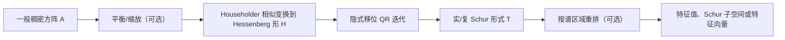
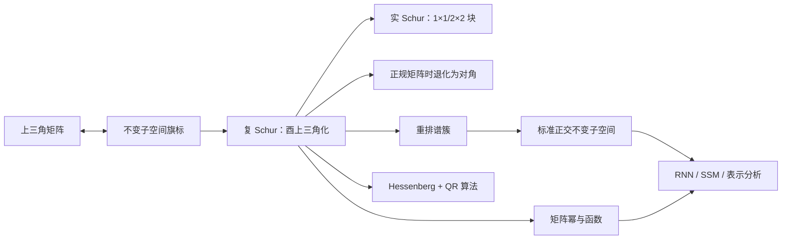

# Schur 分解

> [!abstract] 本章主问题
> 当特征基不存在或极度病态时，怎样仍用良态换基保存全部谱值、耦合与不变子空间？每个复方阵都可以通过**酉相似变换**化为上三角矩阵：
> $$
> \boldsymbol A
> =
> \boldsymbol Q\boldsymbol T\boldsymbol Q^*,
> \qquad
> \boldsymbol Q^*\boldsymbol Q=\boldsymbol I.
> $$
> 三角矩阵 $\boldsymbol T$ 的对角线保存全部特征值，严格上三角部分保存不同 Schur 方向之间的耦合；因为 $\boldsymbol Q$ 不改变欧氏长度，Schur 分解是连接精确谱理论、稳定不变子空间和 QR 特征值算法的核心中间语言。

> [!warning] “稳定表示”不等于“问题自动变得良态”
> 酉/正交换基不会放大范数，因此比病态特征向量基或 Jordan 基可靠；但一般非正规矩阵的特征值本身仍可能对扰动高度敏感。Schur 分解改善的是表示与算法，不会消除原问题的条件性。

## 学习目标

完成本章后，应能独立完成以下任务：

1. 区分 Schur 分解、QR 分解、特征分解和 Jordan 分解；
2. 解释为什么上三角矩阵等价于一条嵌套不变子空间链；
3. 从零证明复 Schur 定理；
4. 说明 $\boldsymbol Q$ 的列为什么叫 Schur 向量，以及为什么它们通常不是逐个特征向量；
5. 从 $\boldsymbol T$ 读取特征值、特征多项式、trace 和 determinant；
6. 证明正规矩阵的 Schur 形式必为对角矩阵，从而恢复复谱定理；
7. 区分复 Schur 上三角形式与实 Schur 准上三角形式；
8. 解释实 Schur 形式中 $2\times2$ 块怎样编码一对共轭复特征值；
9. 证明 Schur 向量的前 $k$ 列张成不变子空间，并正确理解重排；
10. 使用分块 Schur 形式和 Sylvester 方程解释谱簇分离与子空间敏感性；
11. 推导二阶三角块的矩阵幂与矩阵函数公式；
12. 说明 QR 迭代为什么是一连串酉相似变换，以及它如何逼近 Schur 形式；
13. 报告 Schur 计算的重构残差、正交性残差和三角泄漏；
14. 在 RNN、SSM、Neural ODE 和表示子空间分析中选择正确的谱对象。

> [!question] 初学者读完必须能回答
> 1. Schur、QR、特征分解与 Jordan 分解分别是什么类型的分解？
> 2. 为什么每个复方阵都能酉三角化，而不要求可对角化？
> 3. $T$ 的对角线与严格上三角部分分别保存什么？
> 4. Schur 向量为何通常不是逐列特征向量，却形成嵌套不变子空间？
> 5. 正规矩阵的上三角 Schur 形式为什么必须退化为对角阵？
> 6. 实 Schur 的 $2\times2$ 对角块怎样编码共轭复特征值？
> 7. Hessenberg 化与带位移 QR 迭代怎样逼近 Schur 形式？
> 8. 重构、正交性与三角泄漏三项残差分别检查什么？

![[00-知识库管理/_assets/figures/eigen/fig-schur-triangular-invariant-qr-v2.svg|880]]

> [!figure] 图 1　酉三角化、不变子空间旗与 QR 数值路线
> 左栏展示 $A=QTQ^*$ 与上三角 $T$ 的谱值、耦合分工；中栏展示 Schur 向量前缀张成的嵌套不变子空间；右栏展示 Hessenberg 化、带位移 QR 迭代和三项验收量。**来源：**依据复/实 Schur 定理、LAPACK/SciPy 算法接口和本章所引苏剑林 SSM 文章独立绘制。

**怎样读图。** 先看左栏，$Q$ 是条件数为 1 的酉换基，$T$ 对角线保存特征值，严格上三角保留不能消去的方向耦合。再看中栏：单个 $q_j$ 未必是特征向量，但前 $k$ 列的 span 对 $A$ 不变。最后沿右栏理解实际算法，并用三项残差分别验证重构、酉性和三角结构。

**适用边界（图没有证明什么）。** 图的“表示稳定”只指酉换基不放大二范数，不表示非正规矩阵的特征值问题自动良态。实数计算允许 $2\times2$ 准三角块；Schur 重排移动的是谱簇及对应不变子空间，不应把它误解为任意交换单个特征向量。

## 进入正文前：放弃强求对角，换取对所有矩阵都存在的良态坐标

> [!info] 承接—中心—去路
> - **承接：** [[定理 - 有限维谱定理]]只对正规矩阵保证酉对角化；[[广义特征向量与 Jordan 结构]]虽覆盖缺陷矩阵，却依赖对扰动不连续的非正交基。
> - **中心：** Schur 分解保留酉/正交换基，把“必须对角”放宽为“上三角”。对角线保留谱值，严格上三角保留不能由良态正交坐标消除的耦合。
> - **去路：** [[矩阵函数与矩阵指数]]会在三角 Schur 形式上计算 $f(A)$；Hessenberg–QR 算法、稳定/不稳定子空间和 Sylvester 方程都以 Schur 形式为接口。

### 两遍阅读路线

第一遍掌握 $A=QTQ^*$、三角对角线读谱、Schur 向量前缀不变以及正规情形退化为对角。第二遍再读实 Schur 块、重排、谱簇分离、QR 迭代、后向稳定性和矩阵函数递推。

全章主线是：

$$
\text{任意复方阵 }A
\Longrightarrow
A=QTQ^*,
\quad Q^*Q=I,
\quad T\text{ 上三角};
$$

$$
A\text{ 正规}
\Longrightarrow
T\text{ 实际为对角阵}.
$$

### 本章的问题链

1. 为什么“上三角”比“对角”少要求特征向量，却仍保留全部谱？
2. 上三角形式与一条嵌套不变子空间旗怎样等价？
3. 为什么 $Q$ 的单列通常不是特征向量，而前 $k$ 列的 span 却不变？
4. 正规性为什么迫使 Schur 严格上三角部分为零？
5. 实数域为什么需要 $2\times2$ 块表示共轭复特征值？
6. QR 分解与 QR 迭代如何分工，为什么都出现字母 QR 却不是同一分解任务？
7. Schur 表示稳定为什么不等价于特征值问题良态？

### 用 $S,B,J$ 看 Schur 形式究竟保留什么

矩阵 $B$ 和 $J$ 已经上三角，因此它们各自已有一个最简单的 Schur 分解：

$$
B=I
\begin{bmatrix}3&1\\0&1\end{bmatrix}
I,
\qquad
J=I
\begin{bmatrix}1&1\\0&1\end{bmatrix}
I.
$$

两者的对角线分别给出 $3,1$ 与 $1,1$；严格上三角的 1 则保存正交坐标中仍存在的方向耦合。对 $B$，它并不妨碍另找非正交特征基完成对角化；对 $J$，它对应真正的缺陷链。

相比之下，对称矩阵

$$
S=\begin{bmatrix}2&1\\1&2\end{bmatrix}
$$

正规，所以任何复 Schur 形式都可选成对角形式 $\operatorname{diag}(3,1)$。这说明 Schur 不是“近似 Jordan”：它优先保护酉坐标，三角耦合的意义要结合正规性、谱分离与不变子空间判断。

### 最小 Schur 账本

| 对象 | 保证 | 不保证 |
|---|---|---|
| $Q$ | 酉/正交，$\kappa_2(Q)=1$ | 每一列都是特征向量 |
| $T$ 对角线 | 按代数重数保存特征值 | 单独描述全部非正规几何 |
| $T$ 严格上三角 | 保存 Schur 坐标中的耦合 | 等同 Jordan 块 |
| 前 $k$ 个 Schur 向量 | 张成不变子空间 | 每个向量单独不变 |

> [!tip] 初学者的停靠点
> 若把 $A=QR$ 与 $A=QTQ^*$ 混为一谈，先做类型检查：QR 是列空间分解，$R$ 与 $A$ 同为矩形或上梯形；Schur 是方阵的酉相似变换，$T$ 与 $A$ 同阶并保存特征值。

## 阅读前检查

本章会直接调用以下知识：

- [[内积空间]]：知道正交、标准正交基和共轭转置；
- [[标准正交基与 Gram-Schmidt]]：知道任意基可在保持前缀张成空间的条件下正交化；
- [[特征多项式与重数]]：知道三角矩阵的对角线给出按代数重数计数的特征值；
- [[广义特征向量与 Jordan 结构]]：知道一般矩阵可能不可对角化，且 Jordan 基可能病态；
- [[QR 分解]]：知道“矩阵乘积分解 $A=QR$”与正交/酉矩阵的基本性质。

若只记一条酉矩阵性质，请先记住：

$$
\boldsymbol Q^*\boldsymbol Q
=
\boldsymbol Q\boldsymbol Q^*
=
\boldsymbol I,
$$

因此

$$
\boldsymbol Q^{-1}=\boldsymbol Q^*,
\qquad
\|\boldsymbol Q\boldsymbol x\|_2=\|\boldsymbol x\|_2,
\qquad
\kappa_2(\boldsymbol Q)=1.
$$

## 先看一个具体问题：不可对角化，也能否使用良态基

考虑实矩阵

$$
\boldsymbol A
=
\begin{bmatrix}
1&-1\\
1&3
\end{bmatrix}.
$$

其特征多项式为

$$
\begin{aligned}
p_{\boldsymbol A}(t)
&=
\det
\begin{bmatrix}
t-1&1\\
-1&t-3
\end{bmatrix}\\
&=(t-1)(t-3)+1\\
&=t^2-4t+4\\
&=(t-2)^2.
\end{aligned}
$$

唯一特征值是 $2$，代数重数为 $2$。但

$$
\boldsymbol A-2I
=
\begin{bmatrix}
-1&-1\\
1&1
\end{bmatrix}
$$

只有一维零空间，因此 $\boldsymbol A$ 不可对角化。

取单位特征向量

$$
\boldsymbol q_1
=
\frac1{\sqrt2}
\begin{bmatrix}1\\-1\end{bmatrix}.
$$

再取与它正交的单位向量

$$
\boldsymbol q_2
=
\frac1{\sqrt2}
\begin{bmatrix}1\\1\end{bmatrix}.
$$

令

$$
\boldsymbol Q
=
\begin{bmatrix}
\boldsymbol q_1&\boldsymbol q_2
\end{bmatrix}
=
\frac1{\sqrt2}
\begin{bmatrix}
1&1\\
-1&1
\end{bmatrix}.
$$

两列标准正交，所以

$$
\boldsymbol Q^{\mathsf T}\boldsymbol Q=I.
$$

计算

$$
\boldsymbol A\boldsymbol q_1=2\boldsymbol q_1,
$$

以及

$$
\boldsymbol A\boldsymbol q_2
=
-2\boldsymbol q_1+2\boldsymbol q_2.
$$

因此

$$
\boxed{
\boldsymbol T
=
\boldsymbol Q^{\mathsf T}\boldsymbol A\boldsymbol Q
=
\begin{bmatrix}
2&-2\\
0&2
\end{bmatrix}
}.
$$

等价地，

$$
\boxed{
\boldsymbol A
=
\boldsymbol Q\boldsymbol T\boldsymbol Q^{\mathsf T}
}.
$$

这已经是一个实 Schur 分解。

### 这个例子告诉了我们什么

1. $\boldsymbol A$ 不可对角化，但可以被**正交相似**为上三角矩阵；
2. $\boldsymbol q_1$ 是特征向量，$\boldsymbol q_2$ 不是，因为
   $$
   \boldsymbol A\boldsymbol q_2
   \ne2\boldsymbol q_2;
   $$
3. 严格上三角元素 $-2$ 记录 $\boldsymbol q_2$ 向 $\boldsymbol q_1$ 的耦合；
4. $\boldsymbol Q$ 的条件数恰为 $1$，不存在 Jordan 特征基趋于共线的问题；
5. Schur 形式不要求把非对角元素标准化为 $1$，因此它不是 Jordan 标准形。

开章图已把酉相似、三角耦合、不变子空间旗和数值验收并列；本例的严格上三角元素 $-2$ 正是这种方向耦合的一个具体坐标。

## 对象、形状与符号

本章默认

$$
\boldsymbol A\in\mathbb F^{n\times n},
\qquad
\mathbb F\in\{\mathbb R,\mathbb C\}.
$$

| 符号 | 形状 | 含义 |
|---|---:|---|
| $\boldsymbol A$ | $n\times n$ | 原方阵或线性算子的坐标表示 |
| $\boldsymbol Q$ | $n\times n$ | 酉矩阵；实数情形为正交矩阵 |
| $\boldsymbol T$ | $n\times n$ | 复上三角或实准上三角 Schur 形式 |
| $\boldsymbol q_j$ | $n$ | $\boldsymbol Q$ 的第 $j$ 列，称为 Schur 向量 |
| $\boldsymbol Q_k$ | $n\times k$ | 前 $k$ 个 Schur 向量组成的矩阵 |
| $\mathcal S_k$ | 子空间 | $\operatorname{range}(\boldsymbol Q_k)$ |
| $\boldsymbol P_k$ | $n\times n$ | 到 $\mathcal S_k$ 的正交投影 $\boldsymbol Q_k\boldsymbol Q_k^*$ |

对于复矩阵，以下三种写法完全等价：

$$
\boldsymbol T
=
\boldsymbol Q^*\boldsymbol A\boldsymbol Q,
$$

$$
\boldsymbol A\boldsymbol Q
=
\boldsymbol Q\boldsymbol T,
$$

$$
\boldsymbol A
=
\boldsymbol Q\boldsymbol T\boldsymbol Q^*.
$$

第二式最适合逐列解释，第三式是软件文档常用的分解形式。

> [!warning] 星号 $*$ 的含义
> 对实矩阵，$\boldsymbol Q^*=\boldsymbol Q^{\mathsf T}$；对复矩阵，必须先逐项共轭再转置。不能把复 Schur 分解中的 $Q^*$ 简化成普通转置。

## 一、什么叫上三角化

> [!definition] 上三角矩阵
> 若方阵 $\boldsymbol T=[t_{ij}]$ 满足
> $$
> t_{ij}=0
> \qquad\text{对所有 }i>j,
> $$
> 则称它为上三角矩阵。

三阶形式为

$$
\boldsymbol T
=
\begin{bmatrix}
t_{11}&t_{12}&t_{13}\\
0&t_{22}&t_{23}\\
0&0&t_{33}
\end{bmatrix}.
$$

矩阵的第 $j$ 列是 $T\boldsymbol q_j$ 在基 $(\boldsymbol q_1,\ldots,\boldsymbol q_n)$ 下的坐标。上三角性意味着

$$
T\boldsymbol q_j
\in
\operatorname{span}
\{\boldsymbol q_1,\ldots,\boldsymbol q_j\}.
$$

它不是说每个 $T\boldsymbol q_j$ 都只沿 $\boldsymbol q_j$ 方向；前面的基向量仍可以出现。

## 二、上三角矩阵与不变子空间旗标

> [!definition] 不变子空间旗标
> 一列嵌套子空间
> $$
> \{0\}
> \subset\mathcal S_1
> \subset\mathcal S_2
> \subset\cdots
> \subset\mathcal S_n=V,
> \qquad
> \dim\mathcal S_k=k,
> $$
> 称为一个完整旗标。若每个 $\mathcal S_k$ 都对 $T$ 不变，则称为 $T$-不变旗标。

> [!theorem] 三角化的等价刻画
> 对基 $\boldsymbol q_1,\ldots,\boldsymbol q_n$，以下三条等价：
>
> 1. $T$ 在这组基下的矩阵上三角；
> 2. 对每个 $k$，
>    $$
>    \mathcal S_k
>    =\operatorname{span}(\boldsymbol q_1,\ldots,\boldsymbol q_k)
>    $$
>    对 $T$ 不变；
> 3. 对每个 $k$，
>    $$
>    T\boldsymbol q_k
>    \in
>    \operatorname{span}(\boldsymbol q_1,\ldots,\boldsymbol q_k).
>    $$

### 2.1 从上三角到不变子空间

若矩阵上三角，则第 $j$ 列在第 $j$ 行以下全为零，所以

$$
T\boldsymbol q_j
\in
\operatorname{span}(\boldsymbol q_1,\ldots,\boldsymbol q_j).
$$

当 $j\le k$ 时，右边包含于 $\mathcal S_k$，因此 $T$ 把 $\mathcal S_k$ 的每个基向量都映回 $\mathcal S_k$。线性性给出

$$
T(\mathcal S_k)\subseteq\mathcal S_k.
$$

### 2.2 从不变子空间到上三角

若每个 $\mathcal S_k$ 不变，则特别有

$$
T\boldsymbol q_k\in\mathcal S_k.
$$

把 $T\boldsymbol q_k$ 展开为整组基的线性组合时，不需要 $\boldsymbol q_{k+1},\ldots,\boldsymbol q_n$，所以矩阵第 $k$ 列在第 $k$ 行以下为零。这对所有列成立，矩阵上三角。

### 2.3 Schur 向量作为整体的含义

若

$$
\boldsymbol A\boldsymbol Q
=
\boldsymbol Q\boldsymbol T,
$$

把前 $k$ 列分离出来。由于 $\boldsymbol T$ 上三角，其前 $k$ 列只有前 $k$ 行可能非零，因此

$$
\boxed{
\boldsymbol A\boldsymbol Q_k
=
\boldsymbol Q_k\boldsymbol T_{11}
}
$$

其中 $\boldsymbol T_{11}\in\mathbb C^{k\times k}$ 是左上主块。因此

$$
\operatorname{range}(\boldsymbol Q_k)
$$

是 $\boldsymbol A$-不变子空间。

> [!important] 单个向量与整个子空间
> $\boldsymbol q_1$ 一定是特征向量；$\boldsymbol q_2,\ldots,\boldsymbol q_n$ 通常不是。但前 $k$ 个向量的张成空间对 $\boldsymbol A$ 不变。Schur 分解最稳定、最有意义的对象常是这个子空间，而不是每一列的单独语义。

## 三、复 Schur 定理

> [!theorem] 复 Schur 分解
> 对任意
> $$
> \boldsymbol A\in\mathbb C^{n\times n},
> $$
> 存在酉矩阵 $\boldsymbol Q\in\mathbb C^{n\times n}$ 与上三角矩阵 $\boldsymbol T\in\mathbb C^{n\times n}$，使
> $$
> \boxed{
> \boldsymbol A
> =
> \boldsymbol Q\boldsymbol T\boldsymbol Q^*
> }.
> $$

> [!analysis] Schur 分解公式的七问拆解
> | 问题 | 回答 |
> |---|---|
> | 它放宽了对角化的哪项要求？ | 不再要求 $n$ 个独立特征向量，只要求找到一条不变子空间旗，因此对角矩阵放宽为上三角矩阵。 |
> | 为什么复数域总能开始归纳？ | 特征多项式在 $\mathbb C$ 上至少有一个根，从而至少有一个单位特征向量可扩充成酉基。 |
> | $Q$ 与 $T$ 分别保存什么？ | $Q$ 给出条件数为 1 的坐标，$T$ 的对角保存谱值、严格上三角保存这些坐标中的耦合。 |
> | Schur 向量为何不必逐列是特征向量？ | 上三角矩阵的第 $j$ 列可依赖前 $j$ 个坐标；因此只有前缀 span 必然不变，单列通常不是。 |
> | 正规矩阵为何退化为谱定理？ | 正规性在酉相似下保持，而正规上三角矩阵必须没有严格上三角项，所以 $T$ 对角。 |
> | 怎样验收数值结果？ | 检查相对重构残差、$\|Q^*Q-I\|$ 与 $T$ 的下三角泄漏；分析子空间还要检查不变性残差。 |
> | 为什么它优于数值 Jordan 形？ | 酉换基不放大二范数，且 Schur 形式随扰动连续得多；但它不会消除非正规谱问题自身的敏感性。 |

与对角化不同，这个定理对**每个**复方阵成立，不要求有 $n$ 个线性无关特征向量。

### 3.1 证明准备：至少有一个复特征向量

特征多项式

$$
p_{\boldsymbol A}(t)
=
\det(tI-\boldsymbol A)
$$

是 $n$ 次复系数多项式。代数基本定理保证它至少有一个复根 $\lambda_1$。因此存在非零向量 $\boldsymbol v_1$ 使

$$
\boldsymbol A\boldsymbol v_1
=
\lambda_1\boldsymbol v_1.
$$

归一化得到单位特征向量

$$
\boldsymbol q_1
=
\frac{\boldsymbol v_1}{\|\boldsymbol v_1\|_2}.
$$

### 3.2 把单位特征向量扩充为标准正交基

把 $\boldsymbol q_1$ 扩充为 $\mathbb C^n$ 的标准正交基

$$
\boldsymbol q_1,
\boldsymbol u_2,
\ldots,
\boldsymbol u_n.
$$

令

$$
\boldsymbol U
=
\begin{bmatrix}
\boldsymbol q_1&\boldsymbol u_2&\cdots&\boldsymbol u_n
\end{bmatrix}.
$$

则 $\boldsymbol U$ 酉。因为第一列是特征向量，

$$
\boldsymbol A\boldsymbol q_1
=
\lambda_1\boldsymbol q_1.
$$

所以

$$
\boldsymbol U^*\boldsymbol A\boldsymbol U
=
\begin{bmatrix}
\lambda_1&\boldsymbol w^*\\
\boldsymbol0&\boldsymbol B
\end{bmatrix}
$$

其中 $\boldsymbol B\in\mathbb C^{(n-1)\times(n-1)}$。

左下角为什么为零？第一列的后 $n-1$ 个坐标是

$$
\boldsymbol u_j^*\boldsymbol A\boldsymbol q_1
=
\lambda_1\boldsymbol u_j^*\boldsymbol q_1
=0,
\qquad j=2,\ldots,n.
$$

### 3.3 对低一维块使用归纳

当 $n=1$ 时结论显然成立。假设结论对所有 $(n-1)\times(n-1)$ 复矩阵成立。于是存在酉矩阵 $\boldsymbol V$，使

$$
\boldsymbol V^*\boldsymbol B\boldsymbol V
=
\boldsymbol R
$$

上三角。

定义块对角酉矩阵

$$
\widehat{\boldsymbol V}
=
\begin{bmatrix}
1&\boldsymbol0\\
\boldsymbol0&\boldsymbol V
\end{bmatrix}.
$$

则

$$
\begin{aligned}
\widehat{\boldsymbol V}^*
(\boldsymbol U^*\boldsymbol A\boldsymbol U)
\widehat{\boldsymbol V}
&=
\begin{bmatrix}
\lambda_1&\boldsymbol w^*\boldsymbol V\\
\boldsymbol0&\boldsymbol R
\end{bmatrix},
\end{aligned}
$$

右边上三角。

令

$$
\boldsymbol Q
=
\boldsymbol U\widehat{\boldsymbol V},
$$

则 $\boldsymbol Q$ 是两个酉矩阵的乘积，仍酉。令右边三角矩阵为 $\boldsymbol T$，便得到

$$
\boldsymbol Q^*\boldsymbol A\boldsymbol Q
=
\boldsymbol T.
$$

等价地，

$$
\boldsymbol A
=
\boldsymbol Q\boldsymbol T\boldsymbol Q^*.
\qquad\square
$$

> [!warning] 正交补不必对 $A$ 不变
> 证明没有声称 $\boldsymbol q_1^\perp$ 对 $\boldsymbol A$ 不变。右下角 $\boldsymbol B$ 是在正交补上的**压缩**，而不一定是 $A$ 在不变子空间上的限制。左上块能被固定，是因为 $\operatorname{span}\{\boldsymbol q_1\}$ 不变。

### 3.4 另一条证明路线：先三角化，再保持旗标正交化

复数域上，最小多项式分裂，因此存在某组基

$$
\boldsymbol v_1,\ldots,\boldsymbol v_n
$$

使矩阵上三角。相应前缀空间

$$
\operatorname{span}(\boldsymbol v_1,\ldots,\boldsymbol v_k)
$$

全部不变。

对这组基做 Gram–Schmidt，得到标准正交基

$$
\boldsymbol q_1,\ldots,\boldsymbol q_n.
$$

Gram–Schmidt 保持每个前缀张成空间：

$$
\operatorname{span}(\boldsymbol q_1,\ldots,\boldsymbol q_k)
=
\operatorname{span}(\boldsymbol v_1,\ldots,\boldsymbol v_k).
$$

所以新的前缀空间仍全部不变，上三角性仍成立。这条路线清楚揭示：Schur 定理就是“复三角化 + 保持旗标的正交化”。

## 四、从 Schur 形式读取谱信息

设

$$
\boldsymbol T
=
\boldsymbol Q^*\boldsymbol A\boldsymbol Q
=
\begin{bmatrix}
\lambda_1&*&\cdots&*\\
0&\lambda_2&\ddots&\vdots\\
\vdots&\ddots&\ddots&*\\
0&\cdots&0&\lambda_n
\end{bmatrix}.
$$

相似矩阵具有相同特征多项式：

$$
p_{\boldsymbol A}(t)
=
p_{\boldsymbol T}(t).
$$

而三角矩阵满足

$$
\det(tI-\boldsymbol T)
=
\prod_{j=1}^{n}(t-\lambda_j).
$$

因此

$$
\boxed{
\sigma(\boldsymbol A)
=
\{\lambda_1,\ldots,\lambda_n\}
}
$$

按代数重数计数。

同时得到

$$
\boxed{
\operatorname{tr}(\boldsymbol A)
=
\sum_{j=1}^{n}\lambda_j
}
$$

和

$$
\boxed{
\det(\boldsymbol A)
=
\prod_{j=1}^{n}\lambda_j
}.
$$

### 4.1 严格上三角部分还保存什么

写成

$$
\boldsymbol T
=
\boldsymbol\Lambda+\boldsymbol N,
$$

其中

$$
\boldsymbol\Lambda
=
\operatorname{diag}(\lambda_1,\ldots,\lambda_n),
$$

$\boldsymbol N$ 严格上三角，因此 $\boldsymbol N^n=0$。但一般有

$$
\boldsymbol\Lambda\boldsymbol N
\ne
\boldsymbol N\boldsymbol\Lambda,
$$

所以不能像单个 Jordan 块那样直接套普通二项式公式。$\boldsymbol N$ 的非零元素记录 Schur 方向之间的单向耦合，也是非正规瞬态的重要来源。

### 4.2 Schur 对角线相同，不代表矩阵相似

例如

$$
I_2
$$

与

$$
J_2(1)
=
\begin{bmatrix}1&1\\0&1\end{bmatrix}
$$

的 Schur 对角线都是 $(1,1)$，但前者可对角化，后者不可。对角线只记录特征值多重集合，严格上三角部分及其精确相似结构仍很重要。

## 五、Schur 向量不是一般意义下的特征向量

由

$$
\boldsymbol A\boldsymbol Q
=
\boldsymbol Q\boldsymbol T
$$

逐列读取：

$$
\boldsymbol A\boldsymbol q_j
=
\sum_{i=1}^{j}t_{ij}\boldsymbol q_i.
$$

当 $j=1$ 时，

$$
\boldsymbol A\boldsymbol q_1
=
t_{11}\boldsymbol q_1,
$$

所以 $\boldsymbol q_1$ 是特征向量。

当 $j>1$ 时，通常存在 $i<j$ 使 $t_{ij}\ne0$，于是 $\boldsymbol A\boldsymbol q_j$ 还含前面 Schur 向量的分量，$\boldsymbol q_j$ 不是特征向量。

> [!important] 软件输出的 `Z` 或 `Q`
> Schur vectors 不是 eigenvectors 的同义词。若确实需要特征向量，通常先求 Schur 形式，再对三角矩阵做回代/逆迭代，最后乘回 $Q$；LAPACK 将这些步骤分成不同例程。

## 六、正规矩阵：Schur 形式何时退化成对角矩阵

> [!theorem] 正规矩阵的 Schur 特例
> 设 $\boldsymbol A\in\mathbb C^{n\times n}$，且
> $$
> \boldsymbol A^*\boldsymbol A
> =
> \boldsymbol A\boldsymbol A^*.
> $$
> 若
> $$
> \boldsymbol A
> =
> \boldsymbol Q\boldsymbol T\boldsymbol Q^*
> $$
> 是 Schur 分解，则 $\boldsymbol T$ 必为对角矩阵。

### 6.1 正规性在酉相似下保持

因为

$$
\boldsymbol T=\boldsymbol Q^*\boldsymbol A\boldsymbol Q,
$$

有

$$
\begin{aligned}
\boldsymbol T^*\boldsymbol T
&=
\boldsymbol Q^*\boldsymbol A^*
\boldsymbol Q\boldsymbol Q^*
\boldsymbol A\boldsymbol Q\\
&=
\boldsymbol Q^*\boldsymbol A^*\boldsymbol A\boldsymbol Q,
\end{aligned}
$$

以及

$$
\boldsymbol T\boldsymbol T^*
=
\boldsymbol Q^*\boldsymbol A\boldsymbol A^*\boldsymbol Q.
$$

若 $\boldsymbol A$ 正规，则两式相等，故 $\boldsymbol T$ 正规。

### 6.2 正规上三角矩阵必须对角

先比较 $\boldsymbol e_1$ 上的范数。由于 $\boldsymbol T$ 上三角，第一列只有 $t_{11}$：

$$
\|\boldsymbol T\boldsymbol e_1\|_2^2
=
|t_{11}|^2.
$$

而 $\boldsymbol T^*$ 下三角，$\boldsymbol T^*\boldsymbol e_1$ 是 $\boldsymbol T$ 第一行的共轭：

$$
\|\boldsymbol T^*\boldsymbol e_1\|_2^2
=
|t_{11}|^2
+|t_{12}|^2
+\cdots
+|t_{1n}|^2.
$$

正规矩阵满足

$$
\|\boldsymbol T\boldsymbol x\|_2
=
\|\boldsymbol T^*\boldsymbol x\|_2
$$

对所有 $\boldsymbol x$ 成立。取 $\boldsymbol x=\boldsymbol e_1$，得到

$$
t_{12}=\cdots=t_{1n}=0.
$$

于是第一行除对角元外全为零。再对右下 $(n-1)\times(n-1)$ 上三角块重复同一论证，最终所有严格上三角元素均为零。故 $\boldsymbol T$ 对角。$\square$

### 6.3 谱定理是 Schur 定理加正规性

若 $\boldsymbol A$ 正规，

$$
\boldsymbol A
=
\boldsymbol Q\boldsymbol\Lambda\boldsymbol Q^*,
$$

其中 $\boldsymbol\Lambda$ 对角。这就是[[定理 - 有限维谱定理]]的复数版本。

反过来，若存在酉对角化，则对角矩阵与其共轭转置可交换，从而 $\boldsymbol A$ 正规。因此

$$
\boxed{
\boldsymbol A\text{ 酉对角化}
\Longleftrightarrow
\boldsymbol A\text{ 正规}
}.
$$

> [!intuition] 严格上三角部分是“偏离正规”的可见证据
> 在某个 Schur 排序下，非零严格上三角元素表明 Schur 向量之间存在单向耦合。它不是唯一的非正规性度量，但正规矩阵在任何 Schur 形式中都可以完全消去这些耦合。

## 七、实 Schur 分解

复 Schur 定理对实矩阵当然也能使用，只需把实矩阵视为复矩阵；但得到的 $\boldsymbol Q$、$\boldsymbol T$ 可能含复数。若希望始终保留实数运算，就需要实 Schur 形式。

> [!theorem] 实 Schur 分解
> 对任意
> $$
> \boldsymbol A\in\mathbb R^{n\times n},
> $$
> 存在正交矩阵 $\boldsymbol Q\in\mathbb R^{n\times n}$，使
> $$
> \boxed{
> \boldsymbol A
> =
> \boldsymbol Q\boldsymbol T\boldsymbol Q^{\mathsf T}
> },
> $$
> 其中 $\boldsymbol T$ 是**准上三角矩阵**（quasi-upper triangular）：其对角线上只有 $1\times1$ 和 $2\times2$ 块，所有这些对角块以下的块均为零。

更准确的块记号是

$$
\boldsymbol T
=
\begin{bmatrix}
\boldsymbol B_1&*&\cdots&*\\
0&\boldsymbol B_2&\cdots&*\\
\vdots&\ddots&\ddots&\vdots\\
0&\cdots&0&\boldsymbol B_s
\end{bmatrix},
\qquad
\boldsymbol B_j\in
\left\{
[\lambda_j],\
\begin{bmatrix}a_j&b_j\\c_j&d_j\end{bmatrix}
\right\}.
$$

每个 $\boldsymbol B_j$ 只占 $1$ 维或 $2$ 维；块对角线以下严格为零，而块上方可以非零。

### 7.1 为什么实数域需要 $2\times2$ 块

考虑旋转矩阵

$$
\boldsymbol R
=
\begin{bmatrix}
0&-1\\
1&0
\end{bmatrix}.
$$

其特征多项式是

$$
t^2+1,
$$

在 $\mathbb R$ 上没有根，所以不可能通过实正交相似变换得到实上三角矩阵；否则三角矩阵的实对角元会给出实特征值。

但 $\boldsymbol R$ 自身就是一个合法的 $2\times2$ 实 Schur 对角块，编码共轭特征值

$$
i,
\qquad
-i.
$$

### 7.2 一个复特征向量怎样产生二维实不变子空间

设实矩阵 $\boldsymbol A$ 有复特征对

$$
\lambda=a+ib,
\qquad
\boldsymbol z=\boldsymbol x+i\boldsymbol y,
\qquad
b\ne0,
$$

满足

$$
\boldsymbol A\boldsymbol z
=
\lambda\boldsymbol z.
$$

展开实部与虚部：

$$
\boldsymbol A\boldsymbol x
+i\boldsymbol A\boldsymbol y
=
(a+ib)(\boldsymbol x+i\boldsymbol y).
$$

右边为

$$
(a\boldsymbol x-b\boldsymbol y)
+i(b\boldsymbol x+a\boldsymbol y).
$$

比较实部、虚部得到

$$
\begin{aligned}
\boldsymbol A\boldsymbol x
&=a\boldsymbol x-b\boldsymbol y,\\
\boldsymbol A\boldsymbol y
&=b\boldsymbol x+a\boldsymbol y.
\end{aligned}
$$

所以

$$
\operatorname{span}_{\mathbb R}
\{\boldsymbol x,\boldsymbol y\}
$$

是二维实不变子空间。对 $\boldsymbol x,\boldsymbol y$ 做 Gram–Schmidt 可得到该子空间的一组实标准正交基；在这组基下，$\boldsymbol A$ 的限制由一个实 $2\times2$ 块表示。

### 7.3 标准化的 $2\times2$ 实块

LAPACK 的标准实 Schur 块可写成

$$
\boldsymbol B
=
\begin{bmatrix}
a&b\\
c&a
\end{bmatrix},
\qquad
bc<0.
$$

其特征多项式为

$$
\det(tI-\boldsymbol B)
=(t-a)^2-bc,
$$

故特征值为

$$
\boxed{
a\pm i\sqrt{-bc}
}.
$$

不同库可能采用等价的 $2\times2$ 标准化约定；不应仅凭块内单个元素判断特征值，应该对整个块求二阶特征值。

### 7.4 实 Schur 与复 Schur 如何选择

| 需求 | 推荐形式 | 原因 |
|---|---|---|
| 输入实、希望保持实运算 | 实 Schur | 避免不必要的复数存储，保留共轭对块 |
| 希望直接从对角线读取所有复特征值 | 复 Schur | $T$ 真正上三角，对角线就是复特征值 |
| 需要实稳定/不稳定子空间 | 实 Schur + 块重排 | 共轭对必须整体移动 |
| 推导复谱定理 | 复 Schur | 结构最简洁 |

SciPy 的 `schur` 在实输入时默认返回实 Schur 形式，也可用 `output="complex"` 请求复 Schur 形式。

## 八、Schur 分解不唯一

Schur 分解保证存在，不保证唯一。主要自由度包括：

1. **特征值顺序**：复 Schur 对角线上的特征值通常可以重排；实 Schur 中共轭对所在的 $2\times2$ 块必须整体移动；
2. **列相位或符号**：把 $\boldsymbol q_j$ 乘单位模复数，同时相应改变 $\boldsymbol T$，仍是合法分解；实数情形至少有符号自由度；
3. **重复特征值内部的基**：重复谱对应的不变子空间内可以旋转标准正交基；
4. **不同不变旗标**：一般矩阵可能存在多条完整不变子空间链；
5. **实 $2\times2$ 块标准化**：不同正交基可给出等价的块表示。

不随这些选择改变的核心量包括：

- 特征值多重集合；
- trace、determinant、特征多项式；
- 被选定谱簇对应的不变子空间，在谱簇与其余谱充分分离且选择规则固定时，作为几何对象可被稳定比较；
- 任意酉不变范数，例如 $\|\boldsymbol A\|_F=\|\boldsymbol T\|_F$。

> [!warning] 不要逐元素比较两次 Schur 输出
> 两个正确实现可能给出不同的特征值顺序、列符号/相位和块内基。验证应比较重构残差、正交性、谱多重集合，以及目标不变子空间的投影，而不是要求 $Q$、$T$ 逐元素相同。

## 九、重排 Schur 形式与不变子空间

若把关心的一簇特征值重排到 Schur 形式左上角，可写成

$$
\boldsymbol T
=
\begin{bmatrix}
\boldsymbol T_{11}&\boldsymbol T_{12}\\
\boldsymbol0&\boldsymbol T_{22}
\end{bmatrix},
\qquad
\boldsymbol Q
=
\begin{bmatrix}
\boldsymbol Q_1&\boldsymbol Q_2
\end{bmatrix},
$$

其中 $\boldsymbol Q_1\in\mathbb C^{n\times k}$。

由

$$
\boldsymbol A\boldsymbol Q
=
\boldsymbol Q\boldsymbol T
$$

读取前 $k$ 列：

$$
\boxed{
\boldsymbol A\boldsymbol Q_1
=
\boldsymbol Q_1\boldsymbol T_{11}
}.
$$

因此

$$
\mathcal S
=
\operatorname{range}(\boldsymbol Q_1)
$$

是 $\boldsymbol A$-不变子空间，并且 $\boldsymbol Q_1$ 给出它的标准正交基。

### 9.1 稳定/不稳定子空间

离散时间系统常按单位圆分类：

$$
|\lambda|<1
\quad\text{稳定},
\qquad
|\lambda|>1
\quad\text{不稳定}.
$$

连续时间系统常按左右半平面分类：

$$
\operatorname{Re}\lambda<0
\quad\text{稳定},
\qquad
\operatorname{Re}\lambda>0
\quad\text{不稳定}.
$$

把稳定谱重排到 $\boldsymbol T_{11}$ 后，$\operatorname{range}(\boldsymbol Q_1)$ 就是稳定不变子空间的一个标准正交表示。SciPy 的 `schur(..., sort="iuc")` 和 `sort="lhp"` 分别提供单位圆内与左半平面排序接口。

### 9.2 正交投影不一定与 $A$ 可交换

到 $\mathcal S$ 的正交投影是

$$
\boldsymbol P
=
\boldsymbol Q_1\boldsymbol Q_1^*.
$$

不变性只给出

$$
\boldsymbol A\mathcal S\subseteq\mathcal S,
$$

或等价地

$$
(I-\boldsymbol P)\boldsymbol A\boldsymbol P=0.
$$

它一般**不**推出

$$
\boldsymbol A\boldsymbol P
=
\boldsymbol P\boldsymbol A.
$$

在 Schur 坐标中，

$$
\widetilde{\boldsymbol P}
=
\begin{bmatrix}I&0\\0&0\end{bmatrix}.
$$

直接计算

$$
\boldsymbol T\widetilde{\boldsymbol P}
=
\begin{bmatrix}
\boldsymbol T_{11}&0\\
0&0
\end{bmatrix},
$$

而

$$
\widetilde{\boldsymbol P}\boldsymbol T
=
\begin{bmatrix}
\boldsymbol T_{11}&\boldsymbol T_{12}\\
0&0
\end{bmatrix}.
$$

只有当 $\boldsymbol T_{12}=0$ 时二者相等。此时 $\mathcal S$ 与 $\mathcal S^\perp$ 都不变，称为**约化子空间**（reducing subspace）。正规矩阵的谱子空间具有这一更强性质；一般非正规矩阵的 Schur 不变子空间不一定有。

### 9.3 Schur 正交投影与谱投影不要混淆

对一般非正规矩阵，围绕孤立谱簇定义的谱投影通常是斜投影，未必自伴；而

$$
\boldsymbol Q_1\boldsymbol Q_1^*
$$

总是正交投影。二者的值域可以相同，但沿什么补空间投影不同。只有在正规/约化等特殊情形，它们自然重合。

## 十、分块 Schur 形式、Sylvester 方程与谱分离

分块 Schur 形式还解释了为什么接近的谱簇难以分离。考虑

$$
\boldsymbol T
=
\begin{bmatrix}
\boldsymbol T_{11}&\boldsymbol T_{12}\\
0&\boldsymbol T_{22}
\end{bmatrix}.
$$

尝试用非酉上三角变换

$$
\boldsymbol S
=
\begin{bmatrix}
I&\boldsymbol X\\
0&I
\end{bmatrix},
\qquad
\boldsymbol S^{-1}
=
\begin{bmatrix}
I&-\boldsymbol X\\
0&I
\end{bmatrix}
$$

把非对角块消掉。

先算

$$
\boldsymbol T\boldsymbol S
=
\begin{bmatrix}
\boldsymbol T_{11}&
\boldsymbol T_{11}\boldsymbol X+\boldsymbol T_{12}\\
0&\boldsymbol T_{22}
\end{bmatrix}.
$$

再左乘 $\boldsymbol S^{-1}$：

$$
\boldsymbol S^{-1}\boldsymbol T\boldsymbol S
=
\begin{bmatrix}
\boldsymbol T_{11}&
\boldsymbol T_{11}\boldsymbol X
-\boldsymbol X\boldsymbol T_{22}
+\boldsymbol T_{12}\\
0&\boldsymbol T_{22}
\end{bmatrix}.
$$

要使右上块为零，需要解 Sylvester 方程

$$
\boxed{
\boldsymbol T_{11}\boldsymbol X
-\boldsymbol X\boldsymbol T_{22}
=
-\boldsymbol T_{12}
}.
$$

若

$$
\sigma(\boldsymbol T_{11})
\cap
\sigma(\boldsymbol T_{22})
=\varnothing,
$$

该方程有唯一解。直觉上，当两块谱充分分离时，$\boldsymbol X$ 通常较温和；当它们接近时，Sylvester 算子的逆可能很大，子空间重排和分离会变得敏感。

更精确的数值理论使用

$$
\operatorname{sep}(\boldsymbol T_{11},\boldsymbol T_{22})
$$

衡量线性映射

$$
\boldsymbol X
\mapsto
\boldsymbol T_{11}\boldsymbol X
-\boldsymbol X\boldsymbol T_{22}
$$

离奇异有多远。LAPACK 的专家 Schur 例程可以估计相关不变子空间的倒条件数。

> [!important] “看起来有 gap”还不够
> 对正规矩阵，谱点的几何距离通常直接控制子空间稳定性；对一般非正规矩阵，块间分离由 Sylvester 算子决定，不能只用对角线上两个数字的距离替代全部条件分析。

## 十一、二阶 Schur 块的矩阵幂

考虑复上三角矩阵

$$
\boldsymbol T
=
\begin{bmatrix}
\lambda_1&\eta\\
0&\lambda_2
\end{bmatrix}.
$$

### 11.1 递推推导

设

$$
\boldsymbol T^k
=
\begin{bmatrix}
\lambda_1^k&s_k\\
0&\lambda_2^k
\end{bmatrix}.
$$

则

$$
\boldsymbol T^{k+1}
=
\boldsymbol T^k\boldsymbol T
=
\begin{bmatrix}
\lambda_1^{k+1}&
\lambda_1^k\eta+s_k\lambda_2\\
0&\lambda_2^{k+1}
\end{bmatrix},
$$

所以

$$
s_{k+1}
=
\lambda_2s_k+\eta\lambda_1^k,
\qquad
s_1=\eta.
$$

展开递推得到

$$
s_k
=
\eta
\sum_{j=0}^{k-1}
\lambda_1^{k-1-j}\lambda_2^j.
$$

### 11.2 两个特征值不同

若 $\lambda_1\ne\lambda_2$，有限几何级数给出

$$
\sum_{j=0}^{k-1}
\lambda_1^{k-1-j}\lambda_2^j
=
\frac{\lambda_1^k-\lambda_2^k}
{\lambda_1-\lambda_2}.
$$

因此

$$
\boxed{
\boldsymbol T^k
=
\begin{bmatrix}
\lambda_1^k&
\eta\dfrac{\lambda_1^k-\lambda_2^k}
{\lambda_1-\lambda_2}\\
0&\lambda_2^k
\end{bmatrix}
}.
$$

### 11.3 两个特征值相等

若 $\lambda_1=\lambda_2=\lambda$，求和中的每一项都是 $\lambda^{k-1}$，共有 $k$ 项，所以

$$
\boxed{
\boldsymbol T^k
=
\begin{bmatrix}
\lambda^k&k\eta\lambda^{k-1}\\
0&\lambda^k
\end{bmatrix}
}.
$$

这正是 Jordan 多项式因子的 Schur 表达；$\eta$ 不需要等于 $1$。

### 11.4 接近重根时不要直接相减

公式

$$
\frac{\lambda_1^k-\lambda_2^k}
{\lambda_1-\lambda_2}
$$

在数学上良好，其 $\lambda_2\to\lambda_1$ 的极限是

$$
k\lambda_1^{k-1}.
$$

但浮点中，当 $\lambda_1\approx\lambda_2$ 时直接相减会发生消去。可靠实现会使用专门的递推、分块算法或稳定的 divided difference，而不是机械套用这个商。

## 十二、Schur 形式上的矩阵函数

若

$$
\boldsymbol A
=
\boldsymbol Q\boldsymbol T\boldsymbol Q^*,
$$

且 $f$ 可由适当的多项式/解析函数演算定义，则

$$
\boxed{
f(\boldsymbol A)
=
\boldsymbol Qf(\boldsymbol T)\boldsymbol Q^*
}.
$$

由于 $\boldsymbol Q$ 酉，真正的计算难点转移为“怎样对上三角/准上三角矩阵求函数”。

### 12.1 二阶函数公式

对

$$
\boldsymbol T
=
\begin{bmatrix}
\lambda_1&\eta\\
0&\lambda_2
\end{bmatrix},
$$

若 $\lambda_1\ne\lambda_2$，则

$$
\boxed{
f(\boldsymbol T)
=
\begin{bmatrix}
f(\lambda_1)&
\eta\dfrac{f(\lambda_1)-f(\lambda_2)}
{\lambda_1-\lambda_2}\\
0&f(\lambda_2)
\end{bmatrix}
}.
$$

若 $\lambda_1=\lambda_2=\lambda$，极限给出

$$
\boxed{
f(\boldsymbol T)
=
\begin{bmatrix}
f(\lambda)&\eta f'(\lambda)\\
0&f(\lambda)
\end{bmatrix}
}.
$$

这与[[广义特征向量与 Jordan 结构]]中的导数公式一致，但 Schur 方法不需要构造病态 Jordan 基。

### 12.2 矩阵指数

令 $f(z)=e^{tz}$。当 $\lambda_1\ne\lambda_2$ 时，

$$
e^{t\boldsymbol T}
=
\begin{bmatrix}
e^{t\lambda_1}&
\eta\dfrac{e^{t\lambda_1}-e^{t\lambda_2}}
{\lambda_1-\lambda_2}\\
0&e^{t\lambda_2}
\end{bmatrix}.
$$

当 $\lambda_1=\lambda_2=\lambda$ 时，

$$
e^{t\boldsymbol T}
=
e^{t\lambda}
\begin{bmatrix}
1&\eta t\\
0&1
\end{bmatrix}.
$$

后续[[矩阵函数与矩阵指数]]会推广到分块 Parlett 递推、缩放平方和 Krylov 作用量计算。

## 十三、Schur 分解与 QR 分解不是一回事

### 13.1 QR 分解

QR 分解把一个矩阵写成乘积：

$$
\boldsymbol A
=
\boldsymbol Q\boldsymbol R,
$$

其中 $\boldsymbol Q$ 酉/正交，$\boldsymbol R$ 上三角。它通常服务于正交化、最小二乘和线性方程求解。

### 13.2 Schur 分解

Schur 分解是相似变换：

$$
\boldsymbol A
=
\boldsymbol Q\boldsymbol T\boldsymbol Q^*.
$$

它服务于特征值、不变子空间和矩阵函数。

两者都出现“酉矩阵 + 三角矩阵”，但代数结构完全不同：

| 对比 | QR 分解 | Schur 分解 |
|---|---|---|
| 形式 | $A=QR$ | $A=QTQ^*$ |
| 是否相似变换 | 否 | 是 |
| 是否保持特征值 | 不适用为等式两边比较 | $A$ 与 $T$ 相似，谱相同 |
| 三角矩阵对角线 | 不直接是 $A$ 的特征值 | 是复特征值或实 Schur 对角块 |
| 主要用途 | 最小二乘、求解、正交基 | 谱、子空间、矩阵函数 |

### 13.3 QR 迭代为什么能逼近 Schur 形式

从

$$
\boldsymbol A_0=\boldsymbol A
$$

开始，第 $k$ 步做 QR 分解

$$
\boldsymbol A_k
=
\boldsymbol Q_k\boldsymbol R_k,
$$

再反转乘积：

$$
\boldsymbol A_{k+1}
=
\boldsymbol R_k\boldsymbol Q_k.
$$

因为 $\boldsymbol R_k=\boldsymbol Q_k^*\boldsymbol A_k$，

$$
\begin{aligned}
\boldsymbol A_{k+1}
&=
\boldsymbol R_k\boldsymbol Q_k\\
&=
\boldsymbol Q_k^*\boldsymbol A_k\boldsymbol Q_k.
\end{aligned}
$$

所以每一步都是酉相似变换，特征值保持不变。

令累积酉矩阵

$$
\boldsymbol Z_k
=
\boldsymbol Q_0\boldsymbol Q_1\cdots\boldsymbol Q_{k-1},
$$

则

$$
\boxed{
\boldsymbol A_k
=
\boldsymbol Z_k^*\boldsymbol A\boldsymbol Z_k
}.
$$

若迭代收敛到上三角或准上三角形式 $\boldsymbol T$，累积的 $\boldsymbol Z_k$ 就逼近 Schur 向量矩阵。

> [!warning] 这只是核心不变量，不是完整工业算法
> 实际算法先把稠密矩阵有限步约化为 Hessenberg 形式，再使用隐式移位、多重移位、deflation 和专门的收敛判据。无移位 QR 对某些矩阵很慢或表现不理想。完整算法见[[Hessenberg 化与 QR 特征值算法]]。

## 十四、实际数值路线

对一般稠密方阵，标准路线不是“展开特征多项式并求根”，也不是“计算 Jordan 形式”，而是：



### 14.1 为什么先约化到 Hessenberg 形

上 Hessenberg 矩阵只允许第一条次对角线非零：

$$
\boldsymbol H
=
\begin{bmatrix}
*&*&*&\cdots&*\\
*&*&*&\cdots&*\\
0&*&*&\cdots&*\\
\vdots&\ddots&\ddots&\ddots&\vdots\\
0&\cdots&0&*&*
\end{bmatrix}.
$$

Householder 相似变换可以在有限步内把一般稠密矩阵化为 Hessenberg 形，同时保持特征值。之后 QR 步可以利用带状结构，把每步成本从一般稠密 QR 的立方量级降到平方量级。

### 14.2 总体成本与存储

对稠密 $n\times n$ 矩阵：

- 完整 Schur 分解的总体时间通常为 $O(n^3)$；
- 存储原矩阵、Schur 向量和工作区为 $O(n^2)$；
- 若只需大规模稀疏矩阵的一小部分谱，不应形成完整 Schur 分解，通常转向 Arnoldi/Lanczos 等 Krylov 方法。

大 $O$ 只表达尺度，不给出具体常数；是否计算全部 Schur 向量、是否重排、实/复算术和硬件实现都会改变实际成本。

### 14.3 LAPACK 的接口分工

LAPACK 的一般非对称特征问题典型分三层：

1. `xGEHRD`：把一般矩阵正交/酉约化为 Hessenberg 形；
2. `xHSEQR`：把 Hessenberg 形迭代到 Schur 形式，并可累积 Schur 向量；
3. `xTREVC` 等：若需要，再从 Schur 形式计算左右特征向量。

`xGEES`/`xGEESX` 提供更高层 Schur driver；专家版本还能重排特征值并估计谱簇或相应不变子空间的条件性。

## 十五、为什么 Schur 比 Jordan 更适合浮点计算

### 15.1 换基的条件数

Jordan 分解写成

$$
\boldsymbol A
=
\boldsymbol P\boldsymbol J\boldsymbol P^{-1},
$$

其中一般可逆矩阵 $\boldsymbol P$ 可能满足

$$
\kappa_2(\boldsymbol P)
\gg1.
$$

坐标误差会被 $\boldsymbol P^{-1}$ 和 $\boldsymbol P$ 放大。

Schur 分解中

$$
\boldsymbol P=\boldsymbol Q,
\qquad
\boldsymbol Q^{-1}=\boldsymbol Q^*,
\qquad
\kappa_2(\boldsymbol Q)=1.
$$

所以变换到 Schur 坐标与返回原坐标都不放大二范数。

### 15.2 Schur 形式允许连续变化

Jordan 形式要求精确判断块大小，任意小扰动都可能改变块划分。Schur 形式不强迫严格上三角元素成为离散的 $0$ 或 $1$；耦合可以随输入连续变化，因此更适合表达近缺陷矩阵。

### 15.3 但特征值问题仍可能病态

考虑上一章的近 Jordan 矩阵

$$
\boldsymbol A_\varepsilon
=
\begin{bmatrix}
1&1\\
\varepsilon&1
\end{bmatrix}.
$$

大小为 $O(\varepsilon)$ 的扰动产生

$$
1\pm\sqrt\varepsilon
$$

的特征值。Schur 算法可以用良态的酉坐标返回一个后向准确的结果，但不能改变“真特征值对输入本身很敏感”这一数学事实。

> [!important] 条件性与稳定性分工
> - **条件性**问：邻近矩阵的精确 Schur/谱对象是否接近？
> - **算法稳定性**问：计算结果是否可看作某个邻近矩阵的精确结果？
> - 酉变换帮助后者，不自动保证前者。

### 15.4 后向稳定的典型表述

对可靠实现，期望计算出的 $\widehat Q,\widehat T$ 满足近似正交性，并存在小扰动 $E$ 使

$$
\boldsymbol A+\boldsymbol E
=
\widehat{\boldsymbol Q}
\widehat{\boldsymbol T}
\widehat{\boldsymbol Q}^*.
$$

典型尺度是

$$
\frac{\|\boldsymbol E\|}
{\|\boldsymbol A\|}
=O(u),
$$

其中 $u$ 是机器舍入单位；常数依赖维数、算法和实现。不能把这个后向误差结论改写成“每个特征值都有 $O(u)$ 相对前向误差”，因为非正规特征值可能病态。

## 十六、计算结果怎样验收

设软件返回 $\widehat{\boldsymbol T},\widehat{\boldsymbol Q}$，并声称

$$
\boldsymbol A
\approx
\widehat{\boldsymbol Q}
\widehat{\boldsymbol T}
\widehat{\boldsymbol Q}^*.
$$

至少检查以下三项。

### 16.1 相对重构残差

$$
\boxed{
r_{\mathrm{rec}}
=
\frac{
\|\boldsymbol A-\widehat{\boldsymbol Q}
\widehat{\boldsymbol T}
\widehat{\boldsymbol Q}^*\|_F
}{\|\boldsymbol A\|_F}
}.
$$

它回答“分解是否重构原矩阵”。若 $\boldsymbol A=0$，分母需改用绝对残差或安全尺度。

### 16.2 正交/酉残差

$$
\boxed{
r_{\mathrm{orth}}
=
\|\widehat{\boldsymbol Q}^*
\widehat{\boldsymbol Q}-I\|_F
}.
$$

它回答“Schur 向量是否仍近似标准正交”。

### 16.3 三角泄漏

复 Schur 情形定义

$$
\boxed{
r_{\mathrm{tri}}
=
\frac{
\|\operatorname{tril}(\widehat{\boldsymbol T},-1)\|_F
}{\|\boldsymbol A\|_F}
}.
$$

实 Schur 形式允许 $2\times2$ 块，因此第一条次对角线可能非零；此时应检查合法块结构以下的元素，而不是把全部次对角元素都误判为泄漏。

### 16.4 不变子空间残差

若只关心 $\widehat Q_1$ 张成的子空间和左上块 $\widehat T_{11}$，检查

$$
\boxed{
r_{\mathrm{inv}}
=
\frac{
\|\boldsymbol A\widehat Q_1
-\widehat Q_1\widehat T_{11}\|_F
}{\|\boldsymbol A\|_F}
}.
$$

这比对每列计算“特征向量残差”更符合 Schur 向量的真实语义。

### 16.5 残差小不等于前向误差小

即使这些残差都接近机器精度，若谱簇之间的 `sep` 很小，所选不变子空间仍可能对输入扰动敏感。验收报告应把残差与条件估计、谱间隔和数据噪声分开列出。

## 十七、完整手算例子：Schur 坐标中的幂与指数

回到

$$
\boldsymbol A
=
\begin{bmatrix}
1&-1\\
1&3
\end{bmatrix},
\qquad
\boldsymbol Q
=
\frac1{\sqrt2}
\begin{bmatrix}
1&1\\
-1&1
\end{bmatrix},
$$

$$
\boldsymbol T
=
\begin{bmatrix}
2&-2\\
0&2
\end{bmatrix}.
$$

### 17.1 验证 Schur 分解

先检查

$$
\boldsymbol Q^{\mathsf T}\boldsymbol Q=I.
$$

再检查

$$
\boldsymbol A\boldsymbol Q
=
\boldsymbol Q\boldsymbol T.
$$

左边第 1 列是

$$
\boldsymbol A\boldsymbol q_1=2\boldsymbol q_1;
$$

第 2 列是

$$
\boldsymbol A\boldsymbol q_2
=-2\boldsymbol q_1+2\boldsymbol q_2.
$$

所以等式成立。

### 17.2 求 $\boldsymbol T^k$

写

$$
\boldsymbol T
=
2I+\boldsymbol N,
\qquad
\boldsymbol N
=
\begin{bmatrix}
0&-2\\
0&0
\end{bmatrix},
\qquad
\boldsymbol N^2=0.
$$

因此

$$
\begin{aligned}
\boldsymbol T^k
&=2^kI+k2^{k-1}\boldsymbol N\\
&=
\begin{bmatrix}
2^k&-k2^k\\
0&2^k
\end{bmatrix}\\
&=
2^k
\begin{bmatrix}
1&-k\\
0&1
\end{bmatrix}.
\end{aligned}
$$

### 17.3 返回原坐标求 $\boldsymbol A^k$

$$
\boldsymbol A^k
=
\boldsymbol Q\boldsymbol T^k\boldsymbol Q^{\mathsf T}.
$$

也可以注意

$$
\boldsymbol A=2I+\boldsymbol M,
\qquad
\boldsymbol M
=
\begin{bmatrix}
-1&-1\\
1&1
\end{bmatrix},
\qquad
\boldsymbol M^2=0.
$$

故

$$
\boxed{
\boldsymbol A^k
=
2^{k-1}
\begin{bmatrix}
2-k&-k\\
k&2+k
\end{bmatrix}
}.
$$

检查 $k=1$：

$$
2^0
\begin{bmatrix}
1&-1\\
1&3
\end{bmatrix}
=\boldsymbol A.
$$

### 17.4 求矩阵指数

因为 $\boldsymbol M^2=0$，

$$
\begin{aligned}
e^{t\boldsymbol A}
&=e^{t(2I+\boldsymbol M)}\\
&=e^{2t}e^{t\boldsymbol M}\\
&=e^{2t}(I+t\boldsymbol M).
\end{aligned}
$$

因此

$$
\boxed{
e^{t\boldsymbol A}
=
e^{2t}
\begin{bmatrix}
1-t&-t\\
t&1+t
\end{bmatrix}
}.
$$

Schur 计算给出同一结果：

$$
e^{t\boldsymbol A}
=
\boldsymbol Qe^{t\boldsymbol T}
\boldsymbol Q^{\mathsf T}.
$$

### 17.5 例子的数值教训

- 对角线 $(2,2)$ 只告诉我们指数尺度 $2^k$ 或 $e^{2t}$；
- 上三角耦合 $-2$ 产生额外的 $k$ 或 $t$ 因子；
- Schur 基保持正交，返回原坐标不会额外乘上病态基条件数；
- 但矩阵本身的动力学仍包含多项式瞬态，酉换基不会删除真实耦合。

## 十八、最小可复现代码

```python
import numpy as np
from scipy.linalg import schur

A = np.array([[1.0, -1.0],
              [1.0,  3.0]])

T, Q = schur(A, output="real")

reconstruction = np.linalg.norm(A - Q @ T @ Q.T, ord="fro")
orthogonality = np.linalg.norm(Q.T @ Q - np.eye(2), ord="fro")
triangular_leak = np.linalg.norm(np.tril(T, -1), ord="fro")

print(T)
print(reconstruction, orthogonality, triangular_leak)
```

不要把输出 $T$ 与本章手算的

$$
\begin{bmatrix}2&-2\\0&2\end{bmatrix}
$$

逐元素比较。库可能改变 $Q$ 的列符号，从而得到上三角元素为 $+2$ 的等价 Schur 形式；正确验收是残差、正交性和谱。

对于实矩阵但希望得到复上三角形式，可使用：

```python
Tc, Qc = schur(A, output="complex")
```

## 十九、四种分解的角色对照

| 分解 | 形式 | 存在条件 | 换基性质 | 主要读取内容 | 浮点角色 |
|---|---|---|---|---|---|
| 特征分解 | $A=V\Lambda V^{-1}$ | 可对角化 | $V$ 可能病态 | 独立特征方向 | 条件良好时可用 |
| Jordan | $A=PJP^{-1}$ | 特征多项式分裂 | $P$ 可极病态 | 完整精确相似类型 | 理论分类，不作一般算法 |
| 复 Schur | $A=QTQ^*$ | 任意复方阵 | $Q$ 酉 | 谱 + 不变旗标 + 耦合 | 一般稠密谱问题核心形式 |
| 实 Schur | $A=QTQ^{\mathsf T}$ | 任意实方阵 | $Q$ 正交 | 实特征值与共轭对块 | 保持实算术 |

### 19.1 Schur 不是“近似 Jordan”

二者都可能是上三角，但目标不同：

- Jordan 追求离散、规范、完整的精确相似分类；
- Schur 追求酉/正交坐标、三角结构和可靠数值入口；
- Jordan 块大小除排列外唯一；Schur 形式通常不唯一；
- Schur 严格上三角元素不能直接当作 Jordan 链数量或块大小。

### 19.2 Schur 不是“总能对角化”

复数域保证

$$
\boldsymbol Q^*\boldsymbol A\boldsymbol Q
$$

上三角，不保证对角。只有正规矩阵才能保证酉对角化。

## 二十、AI 中的直接连接

### 20.1 线性 RNN 与状态空间模型

考虑共享状态转移

$$
\boldsymbol h_{k+1}
=
\boldsymbol A\boldsymbol h_k,
\qquad
\boldsymbol h_k\in\mathbb C^n.
$$

Schur 分解给出

$$
\boldsymbol A
=
\boldsymbol Q\boldsymbol T\boldsymbol Q^*.
$$

定义 Schur 坐标

$$
\boldsymbol y_k
=
\boldsymbol Q^*\boldsymbol h_k.
$$

则

$$
\boldsymbol y_{k+1}
=
\boldsymbol T\boldsymbol y_k.
$$

由于 $Q$ 酉，

$$
\|\boldsymbol y_k\|_2
=
\|\boldsymbol h_k\|_2.
$$

这意味着可以在不扭曲欧氏尺度的条件下，把状态传播分解为：

- 对角线上的模态增长/衰减；
- 严格上三角部分的非正规耦合；
- 按谱簇组织的不变子空间。

仅把 $A$ 替换成对角矩阵是一种更强的模型约束；一般 Schur 形式保留了无法由酉换基删除的耦合。

### 20.2 有限时间瞬态与梯度传播

若某个 Schur 主块为

$$
\boldsymbol T_s
=
\begin{bmatrix}
r&\gamma\\
0&r
\end{bmatrix},
\qquad
|r|<1,
$$

则

$$
\boldsymbol T_s^k
=
\begin{bmatrix}
r^k&k\gamma r^{k-1}\\
0&r^k
\end{bmatrix}.
$$

即使全部特征值严格位于单位圆内，$k\gamma r^{k-1}$ 也可能在有限时间内先增长再衰减。反向传播中还会出现 $(\boldsymbol T_s^*)^k$，所以只对角监控 $|r|$ 会漏掉耦合引起的瞬态。

### 20.3 Neural ODE 与连续状态传播

连续系统

$$
\dot{\boldsymbol h}(t)
=
\boldsymbol A\boldsymbol h(t)
$$

满足

$$
\boldsymbol h(t)
=
\boldsymbol Qe^{t\boldsymbol T}
\boldsymbol Q^*\boldsymbol h(0).
$$

Schur 坐标保持范数，而 $e^{tT}$ 的三角结构揭示指数模态与多项式耦合。数值计算矩阵指数时，Schur 路线比显式 Jordan 分解可靠；大型稀疏情形则常直接近似 $e^{tA}v$。

### 20.4 稳定/不稳定表示子空间

若模型分析只关心单位圆内或左半平面的谱簇，可重排 Schur 形式并报告

$$
\boldsymbol Q_1,
\qquad
\boldsymbol P_1=\boldsymbol Q_1\boldsymbol Q_1^*.
$$

比较两个训练 checkpoint 时，比起逐个比较可能换序、换相位或旋转的特征向量，更合理的是比较子空间投影，例如

$$
\|\boldsymbol P_1^{(a)}
-\boldsymbol P_1^{(b)}\|_2
$$

或主角度。但必须同时报告谱簇与其余谱的分离；没有分离时，整个子空间也可能不稳定。

### 20.5 对称 Hessian、协方差与 Gram 矩阵

精确实对称/Hermitian 对象是正规矩阵，其 Schur 形式自动对角。因此：

- 对称 Hessian 或协方差应优先使用结构化 Hermitian eigensolver；
- 若一般 Schur 形式出现明显严格上三角部分，应先检查输入是否真的对称；
- 重复特征值下应比较整个特征子空间，而不是强行固定一组方向。

### 20.6 可微训练中的边界

Schur 分解是很好的离线分析与数值线性代数接口，但“直接对 Schur 向量求梯度”仍会受到排序、相位、重复谱和谱簇分离的影响。若损失只依赖一个谱函数，应尽量把目标写成基不变形式；若依赖子空间，应对投影或子空间距离定义目标，而不是依赖任意的 Schur 基列。

## 二十一、与科学空间材料的接口

[《Google新作试图“复活”RNN：RNN能否再次辉煌？》](https://spaces.ac.cn/archives/9554)使用复对角状态矩阵解释线性 RNN 的高效参数化；[《重温SSM（二）：HiPPO的一些遗留问题》](https://spaces.ac.cn/archives/10137)则在具有不同特征值的特定状态矩阵上使用对角化与矩阵指数。

Schur 视角补充三点：

1. 复数域保证上三角化，不保证每个一般矩阵都可对角化；
2. 对角状态矩阵是有效的模型设计选择，但会删除一般 Schur 形式中的非正规耦合；
3. 若分析训练得到的一般状态矩阵，Schur 形式与重排不变子空间比显式 Jordan 或无条件对角化更可靠。

这不是否定对角 SSM/RNN，而是把“参数化选择”和“对任意矩阵的等价重写”严格区分。

## 二十二、前沿地位与研究边界

| 内容 | 知识地位 | 本章处理方式 |
|---|---|---|
| 复/实 Schur 存在性 | 经典定理 | 给出证明、域边界与 $2\times2$ 块 |
| Hessenberg + QR 计算 Schur | 已建立数值方法 | 给出算法骨架、复杂度与官方接口 |
| 重排 Schur 得到谱簇不变子空间 | 已建立方法 | 给出块等式、残差与 `sep` 边界 |
| 用严格上三角范数诊断非正规耦合 | 有用诊断 | 依赖排序/基选择，不当作完整不变量 |
| 用 Schur 向量解释神经网络语义方向 | 条件化解释 | 必须控制相位、排序、重复谱与子空间分离 |
| 把所有 RNN 等价改写成对角状态矩阵 | 一般不成立 | 只有可对角化时是等价换基；否则是模型限制/近似 |

## 二十三、常见误区与最小修正

1. **把 QR 分解当 Schur 分解**：$A=QR$ 是乘积分解，$A=QTQ^*$ 才是 Schur 相似分解。
2. **认为 Schur 向量全是特征向量**：只有第一列，或经过适当重排后某个解耦 $1\times1$ 块对应列，必然直接是特征向量；一般列只组成不变旗标。
3. **认为复数域保证可对角化**：它只保证上三角化/Jordan 形式存在。
4. **认为实矩阵总能实上三角化**：非实共轭对需要 $2\times2$ 实 Schur 块。
5. **从实 Schur 对角线逐个读取全部特征值**：遇到 $2\times2$ 块必须对整个块求特征值。
6. **认为 Schur 分解唯一**：排序、相位、重复谱和块内基都带来自由度。
7. **逐元素比较两个 $Q,T$ 输出**：应比较重构、正交性、谱和子空间投影。
8. **认为酉换基让病态特征值变稳定**：它避免坐标放大，不消除问题本身的扰动敏感性。
9. **把不变子空间等同于约化子空间**：前者只要求 $A\mathcal S\subseteq\mathcal S$，后者还要求正交补不变。
10. **认为正交投影一定与 $A$ 可交换**：一般 Schur 不变子空间的正交投影并非谱投影。
11. **对 Schur 每列计算 eigenvector residual**：正确的子空间残差是 $\|AQ_1-Q_1T_{11}\|$。
12. **只看 Schur 对角线预测有限时间传播**：严格上三角耦合会产生 divided difference 和多项式瞬态。
13. **把小重构残差当作小前向误差证明**：还需检查谱/子空间条件性。
14. **大规模稀疏问题仍求完整 Schur**：若只需少量谱，应使用 Krylov 方法。

## 二十四、本节回顾

### 24.1 概念主线



### 24.2 必须能回答的十二个问题

1. $A=QTQ^*$ 中每个对象的形状和类型是什么？
2. 为什么上三角性等价于前缀空间全部不变？
3. 复 Schur 定理的归纳证明怎样工作？
4. 为什么证明中正交补不必对 $A$ 不变？
5. 为什么只有第一个 Schur 向量必为特征向量？
6. 怎样从复 Schur 对角线读取特征值、trace 和 determinant？
7. 为什么实 Schur 需要 $2\times2$ 块？
8. 为什么正规上三角矩阵必为对角矩阵？
9. 重排后为什么 $AQ_1=Q_1T_{11}$？
10. 正交投影为什么不一定与 $A$ 可交换？
11. QR 迭代怎样保持酉相似？
12. 为什么小 Schur 残差不能保证病态特征值有小前向误差？

### 24.3 一页公式表

$$
\begin{aligned}
A&=QTQ^*,\qquad Q^*Q=I,\\
AQ_k&=Q_kT_{11},\\
p_A(t)&=\prod_{j=1}^{n}(t-t_{jj}),\\
\operatorname{tr}(A)&=\sum_jt_{jj},\\
\det(A)&=\prod_jt_{jj},\\
A_k&=Q_kR_k,
\qquad
A_{k+1}=R_kQ_k=Q_k^*A_kQ_k,\\
T_{11}X-XT_{22}&=-T_{12},\\
r_{\mathrm{rec}}
&=\frac{\|A-QTQ^*\|_F}{\|A\|_F},\\
r_{\mathrm{orth}}
&=\|Q^*Q-I\|_F,\\
r_{\mathrm{inv}}
&=\frac{\|AQ_1-Q_1T_{11}\|_F}{\|A\|_F}.
\end{aligned}
$$

## 二十五、练习、后继与来源

- 分层训练：[[习题 - Schur 分解]]；
- 独立详解：[[解答 - Schur 分解]]；
- 理论前置：[[广义特征向量与 Jordan 结构]]；
- 证明回链：[[标准正交基与 Gram-Schmidt]]、[[定理 - 有限维谱定理]]；
- 算法后继：[[Hessenberg 化与 QR 特征值算法]]；
- 函数后继：[[矩阵函数与矩阵指数]]；
- 稳定性后继：[[矩阵扰动]]；
- 上级导航：[[线性代数 MOC]]与[[数值线性代数 MOC]]。

### 主要来源

1. Sheldon Axler, [*Linear Algebra Done Right*, 4th ed.](https://linear.axler.net/LADR4e.pdf), Sections 5C、6B、7B：上三角矩阵与不变旗标、标准正交基下的 Schur 定理、正规矩阵的谱定理。
2. LAPACK, [*Eigenvalues, Eigenvectors and Schur Factorization*](https://www.netlib.org/lapack/lug/node50.html)、[`xHSEQR`](https://www.netlib.org/lapack/explore-html/d9/dc6/group__hseqr_ga219e97652e1036a3d007166023b03b3f.html)、[`xGEES`](https://netlib.org/lapack/explore-html/d5/d38/group__gees_ga9771d66ab90276553d50820f3dfca14d.html)：Hessenberg—Schur 数值流程、实准上三角块与重排不变子空间。
3. SciPy, [`scipy.linalg.schur`](https://docs.scipy.org/doc/scipy/reference/generated/scipy.linalg.schur.html)：实/复输出、谱区域排序和接口错误边界。
4. MIT 18.335, [Week 6: QR algorithm and eigensolvers](https://ocw.mit.edu/courses/18-335j-introduction-to-numerical-methods-spring-2019/pages/week-6/)：Hessenberg 约化、QR 迭代、复杂度和实际 eigensolver 路线。
5. 苏剑林，[线性 RNN 与复对角状态矩阵](https://spaces.ac.cn/archives/9554)、[HiPPO/SSM 遗留问题](https://spaces.ac.cn/archives/10137)：AI 中的对角状态传播接口；本章补充一般矩阵的 Schur 与非正规边界。

> [!note] 来源分工
> 教材承担存在性与谱定理证明；LAPACK、SciPy 和 MIT 课程承担数值算法与接口事实；科学空间承担 AI 问题入口。本章中的二阶幂/函数、Sylvester 消块、验收指标与 AI 映射均按统一符号重新推导。
