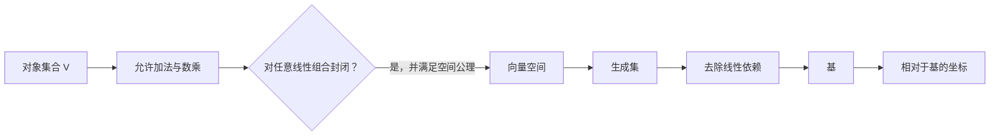

# 向量空间

> [!abstract] 本章主问题
> 什么资格使一类对象成为“向量”？关键不在外形，而在对象集合、标量域、加法与数乘共同满足一套稳定规则：任意有限线性组合仍是同类对象。矩阵、函数、参数元组都可以是向量；概率单纯形、固定范数集合和正交矩阵集合虽然位于某个环境向量空间中，却通常不是向量空间。基与坐标只是选定字典后的表示，不能与抽象向量本身混同。

> [!info] 学习目标
> 学完本章后，应能：逐条解释向量空间八条公理的作用；判断矩阵、函数、概率向量与约束参数集是否构成向量空间；区分向量、坐标和数组；说明数域改变为何会改变维数；识别 AI 中“环境向量空间”和“非线性可行集”的区别。

> [!question] 初学者读完必须能回答
> 1. 一个向量空间的集合、标量域、加法和数乘分别是什么？
> 2. 为什么只检查“加法和数乘封闭”仍不能替代全部公理？
> 3. 为什么齐次线性约束通常给出子空间，而非齐次约束只给出仿射集合？
> 4. 同一集合改用不同标量域时，维数为什么可能改变？
> 5. 向量、坐标列和程序数组处于哪三个不同层次？
> 6. 神经网络参数空间与带正交、范数或概率约束的可行集是什么关系？

面对任何“向量化对象”，先不要数数组有多少个元素；先声明对象、数域和运算，再检查线性组合是否留在集合中。

![[00-知识库管理/_assets/figures/vector-spaces/fig-vector-space-closure-v2.svg|880]]

> [!figure] 图 1　环境空间、线性子空间与约束集合
> 左侧几何画布对比经过原点的齐次子空间、平移后的仿射集合与固定范数集合；右侧给出从对象合同到封闭性的三层判断。**来源：**依据本章定义与 Axler、Strang 的向量空间讲法独立绘制。

**怎样读图。** 先看蓝线为何经过原点：若 $\boldsymbol u,\boldsymbol v\in U$，任意 $a\boldsymbol u+b\boldsymbol v$ 仍落在同一方向集合。再看棕色对象：仿射平移不含零向量，固定范数集合不对任意缩放封闭。最后把这一差别迁移到 AI：参数数组通常属于环境空间 $V$，训练约束只是在 $V$ 中切出可行集。

**适用边界（图没有证明什么）。** 图中的二维直线和圆只承担结构示意，不表示所有向量空间都有欧氏几何、内积或二维坐标；“经过原点”是有限维坐标图中的必要直觉，正式判据仍是对线性组合封闭。

## 进入正文前：线性代数首先研究“什么运算是合法的”

> [!info] 承接—中心—去路
> - **承接：** [[集合、元素与集合运算]]给出对象集合，[[函数、映射、关系与等价类]]让加法与数乘成为有定义域和值域的运算，[[必要条件、充分条件与证明方法]]帮助我们区分定义、公理、判据与反例。
> - **中心：** 本页不是从列向量计算开始，而是先建立 vector-space contract：对象属于什么集合，标量来自哪个域，加法和数乘怎样定义，以及这些运算为什么能稳定地产生有限线性组合。
> - **去路：** [[子空间、张成与线性无关]]会问给定方向究竟生成多少自由度，[[基与坐标]]会把抽象向量编码成数字列，[[线性映射]]则研究哪些变换保留这套组合结构。

### 两遍阅读路线

第一次只读“空间合同”：阅读前检查、具体问题、定义与符号、典型空间和最小例子；目标是能判断一个集合是不是向量空间。第二次再读仿射空间、数域、数值表示和 AI 接口；目标是区分环境空间、可行集、坐标数组与真实数学对象。

全章主线是：

$$
\text{对象集合 }V
\to \text{标量域 }\mathbb F
\to \text{加法与数乘}
\to \text{向量空间公理}
\to \text{合法线性组合}
\to \text{子空间与坐标}.
$$

### 本章的问题链

1. 为什么一个 tensor 的形状不能单独决定它是不是“向量”？
2. 加法 $V\times V\to V$ 与数乘 $\mathbb F\times V\to V$ 为什么必须先成为合法函数？
3. 八条公理分别保证哪些日常代数操作不会产生歧义？
4. 为什么“任意线性组合仍在集合中”是线性结构最可迁移的总结？
5. 齐次约束、仿射约束、概率约束与固定范数约束为何产生不同对象？
6. 同一个集合换标量域，维数为什么会改变？
7. 神经网络参数属于向量空间，为什么正交权重、单位范数或低秩约束集通常不是子空间？

### 一个贯穿前三章的二维自由度系统

在环境空间 $V=\mathbb R^3$ 中考虑

$$
U=\{(x,y,z)^\top:z=x+y\}.
$$

令

$$
\boldsymbol v_1=(1,0,1)^\top,
\qquad
\boldsymbol v_2=(0,1,1)^\top,
\qquad
\boldsymbol v_3=(1,1,2)^\top.
$$

本页先验证 $V$ 是向量空间，并看到 $U$ 对任意线性组合封闭；下一页会证明 $U=\operatorname{span}(\boldsymbol v_1,\boldsymbol v_2)$ 且 $\boldsymbol v_3=\boldsymbol v_1+\boldsymbol v_2$ 是冗余方向；再下一页会把 $U$ 中同一向量用两组不同的基编码。这样，“空间—生成—唯一表示”不会被拆成三个互不相干的术语表。

### 最小对象账本

| 记号 | 对象类型 | 首要检查 |
|---|---|---|
| $V$ | 非空对象集合 | 元素究竟是数列、矩阵、函数还是参数元组？ |
| $\mathbb F$ | 标量域 | 是 $\mathbb R$ 还是 $\mathbb C$，允许哪些系数？ |
| $+:V\times V\to V$ | 二元运算 | 输出是否仍属于 $V$？ |
| $\cdot:\mathbb F\times V\to V$ | 数乘运算 | 标量与向量的类型是否匹配？ |
| $\boldsymbol0_V$ | $V$ 中的加法零元 | 不一定是“数字 0”，但必须属于 $V$ |
| $U\subseteq V$ | 候选子空间或可行集 | 是否对所有线性组合封闭？ |

> [!tip] 初学者的停靠点
> 若判断一个集合时仍只看“能不能相加”，先停在“定义与符号”和“典型向量空间与非例子”。必须同时声明对象、数域、两种运算，并能用一个失败的系数或两个元素构造反例。

## 阅读前检查

本章不要求任何线性代数前置，但默认读者会集合、函数和实数/复数的基本运算。阅读时始终先问三件事：

1. 底层集合是什么？
2. 标量来自哪个数域 $\mathbb F$？
3. 加法和数乘具体怎样定义？

如果第三问没有回答，“它看起来像向量”不是数学定义。

## 先看具体问题：模型参数到底住在哪里

一个两层网络的参数可以写成

$$
\theta=(\boldsymbol W_1,\boldsymbol b_1,\boldsymbol W_2,\boldsymbol b_2),
$$

其中

$$
\boldsymbol W_1\in\mathbb R^{h\times d},\quad
\boldsymbol b_1\in\mathbb R^h,\quad
\boldsymbol W_2\in\mathbb R^{o\times h},\quad
\boldsymbol b_2\in\mathbb R^o.
$$

所有这类参数组成乘积空间

$$
V=\mathbb R^{h\times d}\times\mathbb R^h
\times\mathbb R^{o\times h}\times\mathbb R^o.
$$

逐块相加、逐块乘实数后仍具有同样形状，所以 $V$ 是实向量空间，维数为

$$
\dim V=hd+h+oh+o.
$$

但若再要求“每个权重矩阵都正交”或“总参数范数恒等于 1”，满足约束的参数集合通常不再对任意线性组合封闭。优化仍在环境向量空间 $V$ 中表达，但可行集需要流形、球面或其他非线性几何描述。

## 问题背景

神经网络中的输入、隐藏状态、参数增量和梯度通常写成数组，但“数组可相加”还不足以说明我们正在做线性代数。必须先回答：对象属于哪个域？允许哪些运算？线性组合是否仍然满足约束？

例如：所有 $m\times n$ 实矩阵构成向量空间，但所有秩不超过 $k$ 的矩阵通常不构成向量空间，因为两个秩 $k$ 矩阵之和可能具有更高的秩。

## 定义与符号

> [!definition] 向量空间
> 设 $V$ 是非空集合，$\mathbb{F}$ 是数域（本库通常取 $\mathbb{R}$ 或 $\mathbb{C}$）。若 $V$ 上定义了向量加法 $+:V\times V\to V$ 和数乘 $\mathbb{F}\times V\to V$，并满足交换、结合、零元、加法逆元、两个分配律、数乘结合律和单位元公理，则称 $V$ 是 $\mathbb{F}$ 上的向量空间。

把八条公理完整写出，可以防止“只会背封闭性却不知道运算是否合法”：

| 公理 | 对任意允许对象的正式表达 | 它保证什么 |
|---|---|---|
| 加法交换 | $\boldsymbol u+\boldsymbol v=\boldsymbol v+\boldsymbol u$ | 两项相加不依赖次序 |
| 加法结合 | $(\boldsymbol u+\boldsymbol v)+\boldsymbol w=\boldsymbol u+(\boldsymbol v+\boldsymbol w)$ | 多项求和可省略括号 |
| 零元 | 存在 $\boldsymbol0$ 使 $\boldsymbol v+\boldsymbol0=\boldsymbol v$ | 有“不改变对象”的加法元素 |
| 加法逆元 | 每个 $\boldsymbol v$ 有 $-\boldsymbol v$，使 $\boldsymbol v+(-\boldsymbol v)=\boldsymbol0$ | 可以做减法 |
| 标量对向量和分配 | $a(\boldsymbol u+\boldsymbol v)=a\boldsymbol u+a\boldsymbol v$ | 缩放与向量加法相容 |
| 标量和对向量分配 | $(a+b)\boldsymbol v=a\boldsymbol v+b\boldsymbol v$ | 标量加法与缩放相容 |
| 数乘结合 | $(ab)\boldsymbol v=a(b\boldsymbol v)$ | 连续缩放可合并 |
| 标量单位元 | $1\boldsymbol v=\boldsymbol v$ | 数域单位元不改变向量 |

> [!analysis] 向量空间定义的七问拆解
> | 问题 | 回答 |
> |---|---|
> | 为什么需要定义？ | 为“线性组合、消元、基、矩阵表示”规定一套不会因对象外形而改变的共同语法。 |
> | 对象是什么？ | 四元合同 $(V,\mathbb F,+,\cdot)$；只写集合 $V$ 还没有定义向量空间。 |
> | 运算的形状是什么？ | $+:V\times V\to V$，$\cdot:\mathbb F\times V\to V$；值域声明同时承担封闭性。 |
> | 八条公理从哪里来？ | 它们要求 $V$ 的加法形成交换群，并要求数乘与域运算相容。 |
> | 怎样最小检查？ | 先检查零元、负数乘和两个任意元素之和；固定范数集、概率单纯形等通常立即失败。 |
> | 哪个反例最有信息？ | 若 $v\in S$ 而 $-v\notin S$，则负数乘封闭失败；若 $0\notin S$，甚至不可能是子空间。 |
> | AI 中怎样调用？ | 参数增量、梯度和同形张量通常在环境向量空间中；归一化、正交和低秩约束需要另建可行集几何。 |

特别注意，“向量”不是箭头的同义词。只要对象与这套运算合同相容，多项式、函数、矩阵甚至模型参数元组都可以成为向量；反之，一个看起来像列向量的概率数组也可能只属于非线性约束集。

此外，加法与数乘本身已经声明为

$$
+:V\times V\to V,
\qquad
\cdot:\mathbb F\times V\to V,
$$

所以“对运算封闭”包含在运算的定义域和值域中。八条公理不是八个互不相干的技巧；它们共同保证有限线性组合有一致含义。

### 可以从公理推出、无需另列的性质

例如 $0\boldsymbol v=\boldsymbol0$ 的推导是

$$
0\boldsymbol v
=(0+0)\boldsymbol v
=0\boldsymbol v+0\boldsymbol v.
$$

等式两边加上 $-(0\boldsymbol v)$，得到 $0\boldsymbol v=\boldsymbol0$。同理可推出

$$
a\boldsymbol0=\boldsymbol0,
\qquad
(-1)\boldsymbol v=-\boldsymbol v,
\qquad
(-a)\boldsymbol v=-(a\boldsymbol v).
$$

这些小推导的意义在于：以后证明中的“消去”“移项”和“零倍”都确实来自公理，而不是从坐标数组偷渡来的直觉。

这些公理的计算含义是：对任意 $\boldsymbol{v}_1,\ldots,\boldsymbol{v}_k\in V$ 与 $a_1,\ldots,a_k\in\mathbb{F}$，线性组合

$$
a_1\boldsymbol{v}_1+\cdots+a_k\boldsymbol{v}_k
$$

仍然是 $V$ 中的合法对象，且括号和运算次序不会造成歧义。

### 子空间判别

> [!theorem] 子空间判别法
> 非空子集 $U\subseteq V$ 是向量子空间，当且仅当对任意 $\boldsymbol{u},\boldsymbol{v}\in U$ 和 $a,b\in\mathbb{F}$，都有 $a\boldsymbol{u}+b\boldsymbol{v}\in U$。

这条判据的逻辑方向必须分开读：若 $U$ 已是子空间，封闭性来自定义；反过来，若 $U$ 非空且对任意 $a,b,u,v$ 的组合封闭，那么取不同的特殊系数即可构造零元、负元、加法与数乘封闭，其余公理从环境空间 $V$ 继承。这里的“任意”不能用若干随机样本替代。

“对子空间中的向量做任意线性组合仍在子空间中”同时覆盖了加法、数乘、零向量和加法逆元。

## 生成、线性无关、基与维数

这一节只建立概念地图；完整判别、删除冗余和交换引理见[[子空间、张成与线性无关]]，坐标同构与换基见[[基与坐标]]。

| 概念 | 定义 | 它排除的问题 |
|---|---|---|
| $\operatorname{span}(S)$ | $S$ 中有限个向量的所有线性组合 | 当前向量能否由给定方向生成？ |
| 线性无关 | $\sum_i a_i\boldsymbol{v}_i=\boldsymbol{0}$ 只在所有 $a_i=0$ 时成立 | 表示是否冗余？ |
| 基 | 同时线性无关并生成整个空间的向量组 | 怎样得到唯一坐标？ |
| 维数 | 任一基中向量的个数 | 独立自由度有多少？ |

有限维空间中，一旦选择有序基 $\mathcal{B}=(\boldsymbol{b}_1,\ldots,\boldsymbol{b}_n)$，每个 $\boldsymbol{v}\in V$ 都有唯一表示

$$
\boldsymbol{v}=x_1\boldsymbol{b}_1+\cdots+x_n\boldsymbol{b}_n,
\qquad
[\boldsymbol{v}]_{\mathcal B}=(x_1,\ldots,x_n)^{\top}.
$$

坐标列 $[\boldsymbol{v}]_{\mathcal B}$ 随基改变，抽象向量 $\boldsymbol{v}$ 不变。

### 基为什么给出唯一坐标

“生成”给出存在性，“线性无关”给出唯一性。若

$$
\boldsymbol v=\sum_i a_i\boldsymbol b_i
=\sum_i c_i\boldsymbol b_i,
$$

两式相减得到

$$
\sum_i(a_i-c_i)\boldsymbol b_i=\boldsymbol0.
$$

基向量线性无关，所以 $a_i-c_i=0$，即 $a_i=c_i$。这个证明说明基的两个条件缺一不可。

### 基的存在、扩充与删减

在有限维空间中有两条基本施工路线：

- 从生成组出发，反复删除可由其余向量表示的冗余项，最终得到基；
- 从线性无关组出发，只要尚未张成整个空间，就加入一个不在当前张成中的向量，最终扩充为基。

因此有限维空间的任意两组基长度相同，维数才是良定义的。无限维空间中仍可讨论 Hamel 基，但“每个向量是有限线性组合”的代数基与分析中允许无限级数展开的 Schauder 基不同；本课程主体以有限维 AI 对象为主，不把二者混用。

## 典型向量空间与非例子

| 对象 | 标量域 | 加法/数乘 | 是否为向量空间 | 备注 |
|---|---|---|---:|---|
| $\mathbb F^n$ | $\mathbb F$ | 逐坐标 | 是 | 最常见坐标模型 |
| $\mathbb F^{m\times n}$ | $\mathbb F$ | 逐元素 | 是 | 维数 $mn$ |
| 次数至多 $d$ 的多项式 $\mathcal P_d$ | $\mathbb F$ | 函数加法/数乘 | 是 | 维数 $d+1$ |
| 所有函数 $X\to\mathbb F$ | $\mathbb F$ | 逐点 | 是 | 通常无限维 |
| 对称矩阵集合 | $\mathbb R$ | 普通矩阵运算 | 是 | 独立自由度 $n(n+1)/2$ |
| 概率单纯形 | $\mathbb R$ | 普通运算 | 否 | 不含零，且不对负数乘封闭 |
| 秩恰好为 $r$ 的矩阵 | $\mathbb R$ | 普通运算 | 否 | 不含零，和也可能变秩 |
| 神经网络实现同一函数的参数等价类 | 不自动确定 | 需先定义 | 通常不是 | 常含置换、缩放等非线性商结构 |

### 数域不是装饰信息

同一集合配不同数域可能成为不同向量空间。例如 $\mathbb C$：

$$
\dim_{\mathbb C}\mathbb C=1,
\qquad
\dim_{\mathbb R}\mathbb C=2,
$$

因为作为实向量空间可取基 $(1,i)$。同样，一个实矩阵若允许复系数，特征结构和可对角化结论也可能改变。因此元数据中的 $\mathbb F$ 必须贯穿后续公式。

## 直觉与图示

上面的流程图强调：坐标是最后一步。直接把数组当作向量，会掩盖域、约束和基的选择；开章图则负责区分环境空间与其中的约束集合。

## 最小例子

考虑

$$
U=\{(x,y,z)\in\mathbb{R}^3:x+y+z=0\}.
$$

若 $\boldsymbol{u},\boldsymbol{v}\in U$，则对任意 $a,b\in\mathbb{R}$，

$$
(a\boldsymbol{u}+b\boldsymbol{v})_1+
(a\boldsymbol{u}+b\boldsymbol{v})_2+
(a\boldsymbol{u}+b\boldsymbol{v})_3
=a\cdot0+b\cdot0=0,
$$

所以 $U$ 是子空间。令 $z=-x-y$，可写成

$$
(x,y,-x-y)=x(1,0,-1)+y(0,1,-1),
$$

因此 $U$ 的一组基为 $\{(1,0,-1),(0,1,-1)\}$，维数是 2。

结果检查：两个基向量都满足坐标和为零；它们不成比例，所以线性无关；任意满足约束的向量都被上式生成。三项分别验证了“属于集合、无冗余、无遗漏”。

## 仿射空间：AI 中的偏置为什么重要

向量空间要求包含原点；仿射空间只要求对系数和为 1 的组合封闭。若 $U$ 是向量子空间、$\boldsymbol a$ 是固定向量，则

$$
\boldsymbol a+U
=\{\boldsymbol a+\boldsymbol u:\boldsymbol u\in U\}
$$

是仿射空间。其任意两点之差属于 $U$，所以 $U$ 描述方向，$\boldsymbol a$ 描述位置。

线性方程组

$$
\boldsymbol A\boldsymbol x=\boldsymbol b
$$

若有特解 $\boldsymbol x_0$，全部解为

$$
\boldsymbol x_0+\mathcal N(\boldsymbol A).
$$

当 $\boldsymbol b\ne0$ 时，这通常不是子空间。神经网络层

$$
\boldsymbol x\mapsto\boldsymbol W\boldsymbol x+\boldsymbol b
$$

同样是仿射映射而非线性映射；完整区别见[[线性映射]]。

## 计算与数值视角

向量空间公理是精确代数层，代码还需要额外契约：

| 层面 | 必须检查的问题 | 常见失败 |
|---|---|---|
| 对象 | shape、dtype、device 是否一致 | 广播悄悄改变预期对象 |
| 数域 | 实、复、有限精度还是整数模运算 | 忘记复共轭或整数溢出 |
| 运算 | 实现的加法/数乘是否与理论相同 | 量化、裁剪后不再严格分配 |
| 约束 | 运算后是否仍在可行集 | 归一化向量相加后离开单位球面 |
| 表示 | 数组是对象本身还是某基下坐标 | 病态基放大坐标误差 |

有限精度浮点集合本身不严格满足实向量空间公理，例如结合律可能因舍入失败：

$$
(a+b)+c\ne a+(b+c).
$$

数值线性代数的做法不是否认向量空间模型，而是把浮点运算看成对理想实/复运算的近似，并另行分析误差；见[[浮点数与舍入误差]]。

## 边界与反例

> [!warning] 约束集合未必是子空间
> 概率单纯形 $\{\boldsymbol{p}:p_i\ge0,\sum_i p_i=1\}$ 不含零向量，也不对任意数乘封闭，因此不是向量空间。正交矩阵集合和固定秩矩阵集合也不是向量空间；它们需要流形或其他几何语言。

- 仿射集合允许“系数和为 1”的组合，不一定经过原点；不要与子空间混淆。
- 同一底层集合在不同数域上维数可能不同，例如 $\mathbb{C}$ 作为实向量空间维数为 2，作为复向量空间维数为 1。
- “张量形状相同”通常使逐元素加法有定义，但含离散约束、归一化约束或秩约束的子集未必构成空间。

## 在 AI 中的连接

- 一个固定形状的实值激活张量 $\boldsymbol H\in\mathbb R^{B\times T\times d}$ 在忽略额外约束时属于维数 $BTd$ 的有限维实向量空间；reshape 只改变坐标组织，不自动改变抽象自由度。
- Embedding 把离散符号映射到一个连续向量空间；距离和方向的含义还依赖[[内积空间]]。
- LoRA 的更新 $\Delta\boldsymbol{W}=\boldsymbol{B}\boldsymbol{A}$ 属于矩阵空间，但“秩不超过 $r$ 的更新集合”不是线性子空间，这解释了其参数化问题为何是非凸的。
- 微分 $\mathrm df_\theta$ 是参数空间上的线性泛函；选定内积后，Riesz 表示才把它对应为梯度向量 $\nabla f(\theta)$。因此“梯度方向”依赖度量，而不只是数组 shape。

| AI 对象 | 环境空间 | 额外结构/约束 | 不能直接推出什么 |
|---|---|---|---|
| 权重 $\boldsymbol W\in\mathbb R^{d_{out}\times d_{in}}$ | 矩阵向量空间 | 可能有低秩、稀疏或正交约束 | 可行集仍是子空间 |
| 概率向量 $\boldsymbol p$ | $\mathbb R^K$ | $p_i\ge0,\sum p_i=1$ | 可任意相加或乘负数 |
| batch 表示 $\boldsymbol H\in\mathbb R^{B\times d}$ | $\mathbb R^{B\times d}$ | 数据流形、归一化、有限样本 | batch span 等于总体表示空间 |
| LoRA 更新 $\boldsymbol B\boldsymbol A$ | $\mathbb R^{d_{out}\times d_{in}}$ | rank $\le r$ 的非线性集合 | 因子列具有唯一语义 |

## 不同视角

| 视角 | 重点 | 本库采用方式 |
|---|---|---|
| 抽象代数 | 公理、线性无关、基不依赖坐标 | 用于定义和证明 |
| 数值线性代数 | 数组、矩阵分解、误差 | 用于计算和稳定性 |
| 机器学习 | 表示、参数、特征子空间 | 必须补充对象与约束，不能只谈形状 |

## 开放问题

- [x] 在[[基与坐标]]中补充换基矩阵及“参数化改变但映射不变”的例子。
- [ ] 在后续流形几何节点解释正交矩阵、固定秩矩阵为什么需要非线性几何。

## 本节回顾

读完后应能不看正文回答：

1. 向量空间需要先指定哪两个运算和哪个数域？
2. 八条公理怎样保证线性组合可一致计算？
3. 子空间、仿射空间和一般约束集合最直接的区别是什么？
4. 为什么同一个抽象向量不能与某个固定坐标数组等同？
5. 为什么概率单纯形、固定秩矩阵和正交矩阵集合不是向量空间？
6. 微分与梯度为什么不能在尚未选择内积时混为一谈？

## 练习与掌握

- 习题：[[习题 - 向量空间]]；
- 独立解答：[[解答 - 向量空间]]；
- 建议完成后继续学习[[子空间、张成与线性无关]]与[[基与坐标]]。

## 来源

- Sheldon Axler, [Linear Algebra Done Right, 4th ed.](https://linear.axler.net/LADR4e.pdf), Chapters 1–2。
- Gilbert Strang, *Introduction to Linear Algebra*, Chapter 1，作为矩阵空间与方程空间的计算入口。
- MIT OpenCourseWare, 18.06，vector spaces and subspaces lectures，作为几何与计算补充。
