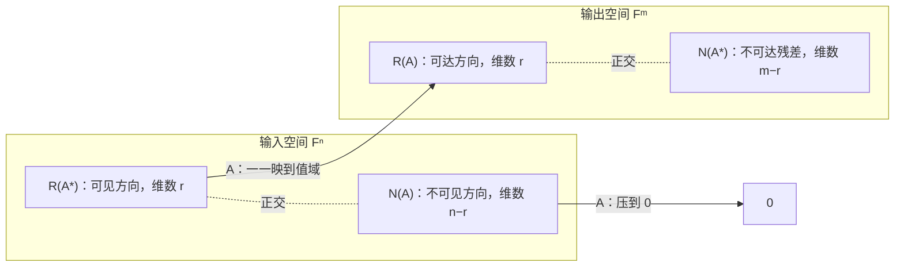

# 四个基本子空间

> [!abstract] 本章主问题
> 一个矩阵同时遗漏了哪些输入信息，又无法产生哪些输出方向？对 $\boldsymbol A:\mathbb F^n\to\mathbb F^m$，输入空间正交分成可见的行空间与被抹掉的零空间，输出空间正交分成可达的列空间与不可拟合的左零空间。两侧环境空间不同，却由共同的秩 $r$ 连接；SVD 则为四个空间提供数值上可用的标准正交基。

> [!info] 学习目标
> 学完本章后，应能：在不混淆环境空间的前提下计算四个基本子空间；证明两组正交补关系和两个正交直和分解；证明 $A$ 在行空间到列空间之间的限制是同构；用投影矩阵解释可见输入与可达输出；比较 RREF、QR 与 SVD 求基的用途和数值边界；把参数不可辨识、回归残差和表示瓶颈写成明确的子空间命题。

> [!question] 初学者读完必须能回答
> 1. 列空间、左零空间、行空间和零空间分别位于 $\mathbb F^m$ 还是 $\mathbb F^n$？
> 2. 为什么 $\mathcal R(A^*)=\mathcal N(A)^\perp$，而不是只证明二者正交？
> 3. 四个空间的维数为什么分别是 $r,m-r,r,n-r$？
> 4. $A$ 限制在行空间后为什么成为到列空间的双射？
> 5. RREF、QR 与 SVD 各自适合回答哪些“求基”问题？
> 6. 参数不可辨识与最小二乘残差分别落在哪个基本子空间？

![[00-知识库管理/_assets/figures/fundamental-subspaces/fig-four-subspaces-two-ambient-spaces-v2.svg|880]]

> [!figure] 图 1　两个环境空间中的四个基本子空间
> 左侧把输入分成行空间与零空间，右侧把输出分成列空间与左零空间；中间只让行空间通过 $A$ 双射到列空间，并把零空间压到零。**来源：**依据 Strang 的四个基本子空间组织方式与本章正交补证明独立绘制。

**怎样读图。** 先检查四个空间住在哪里，不能把 $m$ 维输出子空间与 $n$ 维输入子空间混在一个坐标平面。再沿上方箭头看共同的秩 $r$：行空间中的每个可见自由度恰对应一个可达输出。最后看两组垂直分解，分别回答“输入什么信息被丢掉”和“目标哪些分量无法拟合”。

**适用边界（图没有证明什么）。** 图中的上下分块表示正交直和而非矩阵行列的物理分区；只有选取适配基后，它们才会表现为坐标块。SVD 给出规范正交基，但精确秩与数值秩仍须结合奇异值尺度和容差判断。

## 进入正文前：一个矩阵同时在输入侧和输出侧制造两种分解

> [!info] 承接—中心—去路
> - **承接：** [[核、像与秩零化度定理]]区分核与像，[[内积空间]]提供正交补，[[最小二乘]]已经让残差落入列空间的正交补。
> - **中心：** 本页把定义域与陪域各自正交分成两块：输入侧是可见的行空间与不可见的零空间；输出侧是可达的列空间与不可拟合的左零空间。
> - **去路：** [[线性方程组、消元与 LU 分解]]会用行变换识别 pivot、自由变量与可解性；SVD 会为四个空间提供成对的标准正交基；伪逆则只在可见输入与可达输出之间反演。

### 两遍阅读路线

第一次只掌握四个空间的住所、维数、两组正交补和最小二乘残差。第二次再读限制同构、SVD/投影表示、RREF/QR/SVD 的计算分工与数值秩边界。

全章主线是：

$$
\mathbb F^n
=\mathcal R(A^*)\oplus\mathcal N(A),
\qquad
\mathbb F^m
=\mathcal R(A)\oplus\mathcal N(A^*).
$$

### 本章的问题链

1. 为什么列空间与左零空间住在输出空间，行空间与零空间住在输入空间？
2. $Ax$ 只依赖输入的行空间分量，这一结论怎样由正交分解推出？
3. 为什么 $\mathcal R(A^*)\subseteq\mathcal N(A)^\perp$，又怎样用维数升级为等号？
4. 四个空间的维数为何是 $r,m-r,r,n-r$？
5. $A$ 限制在行空间后为什么与列空间一一对应？
6. 最小二乘残差为什么属于左零空间，而参数不可辨识方向属于零空间？
7. RREF、QR 与 SVD 为什么不能互相无条件替代为同一种“求基方法”？

### 沿用上一批的矩阵与残差

仍取

$$
A=
\begin{bmatrix}
1&1\\1&0\\0&1
\end{bmatrix},
\qquad \operatorname{rank}A=2.
$$

它的四个基本子空间为

$$
\mathcal R(A)=\operatorname{span}\{(1,1,0)^T,(1,0,1)^T\}
\subseteq\mathbb R^3,
$$

$$
\mathcal N(A^T)=\operatorname{span}\{(1,-1,-1)^T\}
\subseteq\mathbb R^3,
$$

$$
\mathcal R(A^T)=\mathbb R^2,
\qquad
\mathcal N(A)=\{0\}.
$$

上一批得到的最小二乘残差

$$
r=\left(-\frac13,\frac13,\frac13\right)^T
$$

正是左零空间基向量的倍数，因此 $A^Tr=0$。目标 $b=e_3$ 的分解 $b=A\hat x+r$ 就是输出空间正交直和的一个具体实例。

### 最小四空间账本

| 空间 | 所在环境 | 本例维数 | 语义 |
|---|---|---:|---|
| $\mathcal R(A)$ | $\mathbb R^3$ 输出侧 | 2 | 可达预测 |
| $\mathcal N(A^T)$ | $\mathbb R^3$ 输出侧 | 1 | 不可拟合残差方向 |
| $\mathcal R(A^T)$ | $\mathbb R^2$ 输入侧 | 2 | 可被映射感知的参数方向 |
| $\mathcal N(A)$ | $\mathbb R^2$ 输入侧 | 0 | 不改变输出的参数方向 |

> [!tip] 初学者的停靠点
> 若仍把“左零空间”理解成矩阵左边的某块，先只做住所检查：$A$ 把 $\mathbb F^n$ 送到 $\mathbb F^m$，所以 $A^*$ 才把输出方向送回输入；四个空间必须分成两个环境分别画。

## 阅读前检查

本章依赖：

1. [[核、像与秩零化度定理]]：核和值域、秩—零度；
2. [[内积空间]]：正交、正交补与伴随记号 $A^*$；
3. [[直和、商空间与不变子空间]]：直和与唯一分解。

若尚未学习 SVD，可先跳过“用 SVD 一次读出四个空间”；那是一个向前预览，不参与本章基本定理的证明。

## 先看具体问题：同一矩阵同时遗漏了什么输入和输出

令

$$
\boldsymbol A=
\begin{bmatrix}
1&1&0\\
0&0&1
\end{bmatrix}:
\mathbb R^3\to\mathbb R^2.
$$

输入方向 $(1,-1,0)^T$ 被送到零，所以模型无法区分相差该方向的两个输入；另一方面，$A$ 满行秩，所有二维输出都能达到，所以输出空间没有不可拟合的正交方向。一个矩阵的“信息丢失”必须同时区分输入侧的核与输出侧的左核。

## 四个空间分别住在哪里

设 $\boldsymbol A\in\mathbb F^{m\times n}$，秩为 $r$。

| 空间 | 记号 | 所在环境 | 维数 | 问题 |
|---|---|---|---:|---|
| 列空间/值域 | $\mathcal R(\boldsymbol A)$ | $\mathbb F^m$ | $r$ | 哪些输出可以由 $\boldsymbol A\boldsymbol x$ 达到？ |
| 左零空间 | $\mathcal N(\boldsymbol A^{*})$ | $\mathbb F^m$ | $m-r$ | 哪些输出方向与所有可达输出正交？ |
| 行空间 | $\mathcal R(\boldsymbol A^{*})$ | $\mathbb F^n$ | $r$ | 哪些输入方向能被映射感知？ |
| 零空间/核 | $\mathcal N(\boldsymbol A)$ | $\mathbb F^n$ | $n-r$ | 哪些输入变化不会改变输出？ |

> [!warning] 列空间与左零空间在输出空间；行空间与零空间在输入空间
> $m\ne n$ 时，把四个空间都画在同一个平面里会隐藏维度错误。

上面的 Mermaid 图强调依赖和映射关系；开章总览图进一步固定了两个环境空间、四个维数和两组正交直和，后续证明将把这些关系逐一关闭。

## 两组正交补关系

> [!theorem] 基本子空间定理
> 对有限维内积空间上的矩阵，
> $$
> \mathcal R(\boldsymbol A^{*})
> =\mathcal N(\boldsymbol A)^{\perp},
> \qquad
> \mathcal R(\boldsymbol A)
> =\mathcal N(\boldsymbol A^{*})^{\perp}.
> $$
> 因此
> $$
> \mathbb F^n
> =\mathcal R(\boldsymbol A^{*})\oplus\mathcal N(\boldsymbol A),
> $$
> $$
> \mathbb F^m
> =\mathcal R(\boldsymbol A)\oplus\mathcal N(\boldsymbol A^{*}).
> $$

> [!analysis] 基本子空间定理的七问拆解
> | 问题 | 回答 |
> |---|---|
> | 四个空间分别住在哪里？ | $\mathcal R(A^*)$ 与 $\mathcal N(A)$ 在输入空间 $\mathbb F^n$；$\mathcal R(A)$ 与 $\mathcal N(A^*)$ 在输出空间 $\mathbb F^m$。不能因为它们由同一个矩阵产生，就把两侧混在一起。 |
> | 两组关系为什么先得到“正交包含”？ | 伴随恒等式把内积中的 $A^*$ 移到另一侧；若 $Ax=0$，则 $\langle A^*z,x\rangle=\langle z,Ax\rangle=0$。 |
> | 为什么正交还不够？ | $U\perp V$ 只说明 $U\subseteq V^\perp$，可能仍漏掉方向；还须用秩—零度证明两侧维数相同，才能升级为相等。 |
> | 两个直和式表达什么？ | 每个输入唯一分成可被 $A$ 看见的行空间分量与被抹掉的零空间分量；每个输出唯一分成可达的列空间分量与不可达的左零空间分量。 |
> | 共同的秩 $r$ 在连接什么？ | 行空间与列空间都为 $r$ 维，而且 $A$ 限制在 $\mathcal R(A^*)$ 上时，是到 $\mathcal R(A)$ 的同构。 |
> | 在贯穿例中怎样看见它？ | $A$ 满列秩，所以输入侧没有零空间；输出侧仍多出一维 $\mathcal N(A^T)$，上一章的最小二乘残差恰落在该方向。 |
> | AI 中怎样调用？ | 参数零空间刻画局部不可辨识方向，列空间刻画线性层可表达的输出，左零空间刻画不可拟合残差；数值上还须用奇异值和容差区分精确秩与数值秩。 |

### 为什么行空间与零空间正交

若 $\boldsymbol y\in\mathcal R(\boldsymbol A^{*})$，则存在 $\boldsymbol z$ 使 $\boldsymbol y=\boldsymbol A^{*}\boldsymbol z$。对任意 $\boldsymbol x\in\mathcal N(\boldsymbol A)$，

$$
\langle\boldsymbol y,\boldsymbol x\rangle
=\langle\boldsymbol A^{*}\boldsymbol z,\boldsymbol x\rangle
=\langle\boldsymbol z,\boldsymbol A\boldsymbol x\rangle
=0.
$$

所以 $\mathcal R(\boldsymbol A^{*})\subseteq\mathcal N(\boldsymbol A)^{\perp}$。另一方面，

$$
\dim\mathcal R(\boldsymbol A^{*})=r,
$$

而秩—零度定理给出

$$
\dim\mathcal N(\boldsymbol A)^{\perp}
=n-(n-r)=r.
$$

包含关系两边维数相同，因此相等。另一组关系对 $\boldsymbol A^{*}$ 使用同样论证即可。

### 为什么“包含且同维”可以升级为相等

有限维空间中若 $U\subseteq W$ 且 $\dim U=\dim W$，取 $U$ 的一组基，它在 $W$ 中已经有 $\dim W$ 个线性无关向量，所以同时是 $W$ 的基，故 $U=W$。这里有限维假设不能静默省略；在无限维空间中，真子空间可以与原空间有相同的基数维数。

### 两个正交分解如何作用于任意向量

每个输入都有唯一分解

$$
\boldsymbol x
=\boldsymbol x_{\mathrm{row}}+\boldsymbol x_{\mathrm{null}},
\quad
\boldsymbol x_{\mathrm{row}}\in\mathcal R(A^*),
\quad
\boldsymbol x_{\mathrm{null}}\in\mathcal N(A).
$$

于是

$$
A\boldsymbol x=A\boldsymbol x_{\mathrm{row}},
$$

因为 $A\boldsymbol x_{\mathrm{null}}=0$。同样，每个输出目标唯一分解为

$$
\boldsymbol b
=\boldsymbol b_{\mathrm{col}}+\boldsymbol b_{\mathrm{left}},
$$

其中只有 $\boldsymbol b_{\mathrm{col}}$ 可由 $A\boldsymbol x$ 达到，而 $\boldsymbol b_{\mathrm{left}}$ 与所有可达输出正交。

## 秩—零度定理

> [!theorem] Rank–nullity
> 对 $\boldsymbol A:\mathbb F^n\to\mathbb F^m$，
> $$
> \operatorname{rank}(\boldsymbol A)
> +\operatorname{nullity}(\boldsymbol A)=n.
> $$

直觉上，输入的 $n$ 个独立自由度被分成两类：$r$ 个在输出中留下痕迹，$n-r$ 个被映射压成零。限制映射

$$
\boldsymbol A|_{\mathcal R(\boldsymbol A^{*})}:
\mathcal R(\boldsymbol A^{*})\to\mathcal R(\boldsymbol A)
$$

是一一且满的；伪逆恰好在这两个“可见”子空间之间反向映射。

### 限制映射为何是同构

满射性来自定义：任取 $\boldsymbol y\in\mathcal R(A)$，存在 $\boldsymbol x$ 使 $\boldsymbol y=A\boldsymbol x$。把输入正交分解为 $\boldsymbol x=\boldsymbol x_{\mathrm{row}}+\boldsymbol x_{\mathrm{null}}$，则

$$
\boldsymbol y=A\boldsymbol x_{\mathrm{row}},
$$

所以行空间中已有一个原像。

单射性：若 $\boldsymbol x_{\mathrm{row}}\in\mathcal R(A^*)$ 且 $A\boldsymbol x_{\mathrm{row}}=0$，则它同时属于 $\mathcal R(A^*)$ 与 $\mathcal N(A)$。二者正交，交集只有零向量，因此 $\boldsymbol x_{\mathrm{row}}=0$。

所以

$$
A|_{\mathcal R(A^*)}:\mathcal R(A^*)\xrightarrow{\cong}\mathcal R(A).
$$

这说明秩 $r$ 是输入可见自由度与输出可达自由度共同的维数。

## 用 SVD 一次读出四个空间

若完整 SVD 为

$$
\boldsymbol A
=\begin{bmatrix}\boldsymbol U_r&\boldsymbol U_0\end{bmatrix}
\begin{bmatrix}\boldsymbol\Sigma_r&\boldsymbol0\\\boldsymbol0&\boldsymbol0\end{bmatrix}
\begin{bmatrix}\boldsymbol V_r&\boldsymbol V_0\end{bmatrix}^{*},
$$

则

$$
\begin{aligned}
\mathcal R(\boldsymbol A)&=\operatorname{span}(\boldsymbol U_r),\\
\mathcal N(\boldsymbol A^{*})&=\operatorname{span}(\boldsymbol U_0),\\
\mathcal R(\boldsymbol A^{*})&=\operatorname{span}(\boldsymbol V_r),\\
\mathcal N(\boldsymbol A)&=\operatorname{span}(\boldsymbol V_0).
\end{aligned}
$$

这里 $\boldsymbol U_r,\boldsymbol U_0$ 把输出空间正交分解，$\boldsymbol V_r,\boldsymbol V_0$ 把输入空间正交分解。

### 用投影矩阵读取两个分解

学习[[Moore-Penrose 伪逆]]后，可把四个分量写成

$$
\begin{aligned}
P_{\mathcal R(A)}&=AA^\dagger,
&P_{\mathcal N(A^*)}&=I_m-AA^\dagger,\\
P_{\mathcal R(A^*)}&=A^\dagger A,
&P_{\mathcal N(A)}&=I_n-A^\dagger A.
\end{aligned}
$$

形状检查：$AA^\dagger\in\mathbb F^{m\times m}$ 作用在输出空间；$A^\dagger A\in\mathbb F^{n\times n}$ 作用在输入空间。两者都自伴且幂等，因此是正交投影。这个公式是后续结论，不应在尚未学习伪逆时当作本章证明起点。

## 最小例子

令

$$
\boldsymbol A=
\begin{bmatrix}
1&1&0\\
0&0&1
\end{bmatrix}.
$$

它是 $2\times3$ 满行秩矩阵，$r=2$。

- 列空间是 $\mathbb R^2$，因为列中含 $(1,0)^{\top}$ 和 $(0,1)^{\top}$；
- 左零空间只有 $\{0\}$；
- 行空间由 $(1,1,0)^{\top}$、$(0,0,1)^{\top}$ 张成；
- 零空间由 $(1,-1,0)^{\top}$ 张成。

检查正交性：

$$
\left\langle(1,-1,0),(1,1,0)\right\rangle=0,
\qquad
\left\langle(1,-1,0),(0,0,1)\right\rangle=0.
$$

输入 $\boldsymbol x$ 沿 $(1,-1,0)$ 改变时，前两个坐标一增一减，$\boldsymbol A\boldsymbol x$ 不变。这正是参数不可辨识方向的线性原型。

再把任意输入写成

$$
\boldsymbol x=(x_1,x_2,x_3)^T
=\frac{x_1+x_2}{2}(1,1,0)^T+x_3(0,0,1)^T
+\frac{x_1-x_2}{2}(1,-1,0)^T.
$$

前两项属于行空间，最后一项属于零空间；代入 $A$ 后最后一项消失。该公式直接验证输入正交分解的存在性和唯一性。

## 怎样计算四个空间：精确结构与数值算法

| 方法 | 适合回答的问题 | 输出 | 主要成本（稠密） | 数值边界 |
|---|---|---|---:|---|
| RREF/消元 | 精确小矩阵、符号关系、主元列 | 核的参数基、原矩阵主元列 | 约 $O(mn\min\{m,n\})$ | 浮点下主元阈值敏感，基通常不正交 |
| QR/QRCP | 列空间、满秩最小二乘、近秩亏诊断 | 正交列空间基、置换 | 约 $O(mn^2)$（$m\ge n$） | 普通 QR 不直接给完整零空间；QRCP 是启发式秩揭示 |
| SVD | 四个空间、数值秩、条件性 | 左右正交基与奇异值 | 约 $O(mn\min\{m,n\})$ | 成本较高；阈值决定数值秩 |

使用 RREF 求列空间基时要从**原矩阵**取主元列，因为行操作保持行关系和方程解集，却会改变列空间在 $\mathbb F^m$ 中的具体方向。使用 SVD 时必须报告数值秩阈值，例如

$$
\sigma_i>\tau\sigma_1,
$$

并说明 $\tau$、dtype、数据噪声和缩放；否则“零空间维数”不是可复现结论。

### 残差小不等于空间估计稳定

若 $\sigma_r$ 与 $\sigma_{r+1}$ 很接近，微小扰动就可能显著旋转所选的 $r$ 维奇异子空间。维数可能保持不变，基向量和投影却变化很大。稳定对象通常是整个子空间投影，而不是某一列基向量；详见[[特征向量与子空间扰动定理]]。

## 最小二乘中的几何

对任意目标 $\boldsymbol b\in\mathbb F^m$，唯一正交分解为

$$
\boldsymbol b
=\boldsymbol b_{\parallel}+\boldsymbol b_{\perp},
\qquad
\boldsymbol b_{\parallel}\in\mathcal R(\boldsymbol A),
\quad
\boldsymbol b_{\perp}\in\mathcal N(\boldsymbol A^{*}).
$$

最小二乘只能拟合 $\boldsymbol b_{\parallel}$；最优残差为

$$
\boldsymbol r_{\star}
=\boldsymbol b-\boldsymbol A\boldsymbol x_{\star}
=\boldsymbol b_{\perp},
$$

满足

$$
\boldsymbol A^{*}\boldsymbol r_{\star}=0.
$$

如果 $\boldsymbol z\in\mathcal N(\boldsymbol A)$，则 $\boldsymbol x_{\star}+\boldsymbol z$ 给出相同预测；Moore–Penrose 伪逆选择其中位于行空间的最小范数解。

## 在 AI 中的连接

- **可辨识性**：Jacobian 的零空间给出一阶不改变模型输出的参数方向；行空间是局部损失能“看见”的方向。
- **梯度结构**：平方损失梯度 $\boldsymbol A^{*}(\boldsymbol A\boldsymbol x-\boldsymbol b)$ 总在 $\mathcal R(\boldsymbol A^{*})$ 中，因此纯梯度更新不能直接改变零空间分量。
- **线性探针与回归**：左零空间残差是当前表示无法线性解释的目标部分。
- **过参数化**：当 $n>r$ 时存在参数零空间；不同参数可实现同一训练预测，隐式偏置决定最终选到哪一个解。
- **低秩表示**：SVD 的 $\boldsymbol V_r$ 描述被权重矩阵读取的输入子空间，$\boldsymbol U_r$ 描述能被写入的输出子空间。
- **LoRA/Gauge 自由度**：因子内部的不可辨识方向不必等同于乘积矩阵作为线性映射的零空间，应分层讨论。

### AI 对象、形状与结论边界

设线性化或设计矩阵

$$
\boldsymbol A\in\mathbb R^{m\times n}.
$$

| 解释 | 子空间 | 环境与形状 | 结论成立的层次 | 不能直接外推 |
|---|---|---|---|---|
| 可改变输出的参数增量 | $\mathcal R(A^*)\subseteq\mathbb R^n$ | 参数增量空间 | 固定 $A$ 的线性/局部一阶模型 | 全局非线性训练轨迹 |
| 一阶不可辨识方向 | $\mathcal N(A)\subseteq\mathbb R^n$ | 参数空间 | Jacobian 在当前点固定 | 有限步移动后仍完全不可辨识 |
| 可拟合目标分量 | $\mathcal R(A)\subseteq\mathbb R^m$ | 输出/样本空间 | 固定特征设计矩阵 | 新数据分布下仍可拟合 |
| 不可拟合正交残差 | $\mathcal N(A^*)\subseteq\mathbb R^m$ | 输出/样本空间 | 欧氏或已声明内积下 | 非平方损失仍采用相同正交残差 |

若 $A$ 是网络 Jacobian，它只描述当前基点的一阶局部结构；若 $A$ 是一个 batch 的表示矩阵，它只描述当前有限样本。把零空间维数称为“模型全局自由度”需要额外的跨样本、跨参数点和数值阈值验证。

## 边界与常见误区

1. “行空间”在复数情形应理解为 $\mathcal R(\boldsymbol A^{*})$，不是逐元素不共轭地转置。
2. 列空间的一个基不必由原矩阵的前 $r$ 列组成；必须选线性无关的主元列或使用正交分解。
3. 精确零空间在浮点数中依赖阈值；接近零的奇异值产生“近似零空间”，见[[条件数]]与[[矩阵扰动]]。
4. 维数只告诉自由度数量，不告诉方向对扰动是否稳定；子空间稳定性还取决于谱间隙。

## 本节回顾

读完后应能回答：

1. 四个基本子空间各自位于 $\mathbb F^n$ 还是 $\mathbb F^m$？
2. 如何从伴随恒等式证明行空间与零空间正交？
3. 为什么还需要维数论证才能把正交包含升级为正交补相等？
4. $A|_{\mathcal R(A^*)}$ 为什么是到 $\mathcal R(A)$ 的同构？
5. $AA^\dagger$ 与 $A^\dagger A$ 分别作用在哪个空间？
6. RREF、QR 与 SVD 求子空间基时各自回答什么，风险是什么？
7. Jacobian 零空间或单 batch 表示秩为什么不能直接解释为模型的全局性质？

## 练习与掌握

- 习题：[[习题 - 四个基本子空间]]；
- 独立解答：[[解答 - 四个基本子空间]]；
- 后继：[[正交投影]]、[[最小二乘]]、[[Moore-Penrose 伪逆]]与[[奇异值分解]]。

## 来源

- Gilbert Strang, [Introduction to Linear Algebra, 6th ed.](https://math.mit.edu/~gs/linearalgebra/ila6/Introduction%20to%20Linear%20Algebra%206th%20edition%20and%20A%20%3D%20CR_04.pdf)，四个基本子空间与秩的几何解释。
- Sheldon Axler, [Linear Algebra Done Right, 4th ed.](https://linear.axler.net/LADR4e.pdf)，线性映射基本定理与正交补。
- MIT OpenCourseWare 18.06，four fundamental subspaces lectures。
- Gene H. Golub & Charles F. Van Loan, *Matrix Computations*, rank-revealing factorizations and subspace computation sections。
- [[奇异值分解]]、[[最小二乘]]、[[Moore-Penrose 伪逆]]。
