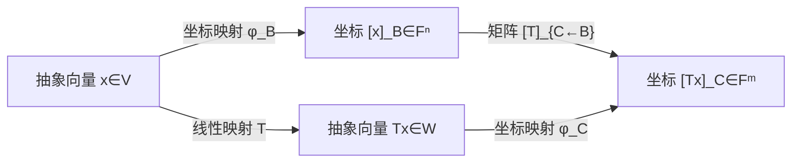

# 基与坐标

> [!abstract] 本章主问题
> 抽象向量怎样被一列数字唯一编码，而换一套编码为何不应改变对象本身？一组基同时提供生成性与线性无关性，因此每个向量恰有一组坐标。换基矩阵连接两套坐标字典；主动变换改变向量，被动换基只改变描述。若基近线性相关，几何上温和的问题也会被放大成病态的坐标计算。

> [!info] 学习目标
> 学完本章后，应能：证明坐标映射是线性同构；从“基向量在另一基中的坐标”构造换基矩阵；区分主动变换和被动换坐标；推导向量、线性泛函、算子和 Gram 矩阵的不同变换律；手算同一算子的相似表示；用奇异值和条件数诊断病态基。

> [!question] 初学者读完必须能回答
> 1. 为什么“生成”保证坐标存在，“线性无关”保证坐标唯一？
> 2. $[\boldsymbol x]_{\mathcal B}$ 与 $\boldsymbol x$ 为什么不是同一个对象？
> 3. 换基矩阵的第 $j$ 列为什么是第 $j$ 个输入基向量在输出基下的坐标？
> 4. 记号 $\boldsymbol P_{\mathcal C\leftarrow\mathcal B}$ 的箭头怎样阻止矩阵方向写反？
> 5. 主动线性变换与被动换坐标各自保持什么、改变什么？
> 6. 为什么非正交或近共线基会放大坐标误差？

![[00-知识库管理/_assets/figures/basis-coordinates/fig-basis-coordinate-dictionary-v2.svg|880]]

> [!figure] 图 1　同一对象、两套坐标字典与两类变换
> 中央保留抽象向量 $\boldsymbol x$，左右分别用基 $\mathcal B$ 与 $\mathcal C$ 编码；下方区分被动换坐标和主动线性变换。**来源：**依据坐标同构与换基定义独立绘制。

**怎样读图。** 从中央对象出发，向左或向右编码便得到两组不同数字；沿底部路径直接用 $\boldsymbol P_{\mathcal C\leftarrow\mathcal B}$ 转换，必须与“先解码为 $\boldsymbol x$、再用另一基编码”得到同一结果。然后比较下方两种操作：被动换基固定 $\boldsymbol x$，主动变换则把它送到 $T\boldsymbol x$。

**适用边界（图没有证明什么）。** 图中的“字典”只是编码类比，不能替代坐标映射的线性与双射证明。图也没有展示协向量、算子和 Gram 矩阵的不同变换律；这些对象不能把同一个换基公式机械套用到底。

## 进入正文前：基不是空间中的装饰，而是一套可逆编码协议

> [!info] 承接—中心—去路
> - **承接：** [[子空间、张成与线性无关]]已经把生成性解释为“至少一种表示”，把无关性解释为“至多一种表示”；二者合起来才允许定义唯一坐标。
> - **中心：** 本页把抽象对象与数字表示分开：基决定编码/解码协议，坐标是编码结果，换基矩阵只改变描述；主动算子则真的改变对象。
> - **去路：** [[线性映射]]会把抽象变换编码成矩阵；特征分解与 SVD 会选择适合算子的特殊基；条件数会量化坏基怎样放大数据和舍入误差。

### 两遍阅读路线

第一次阅读只走“向量编码”：基与唯一坐标 → 坐标同构 → 换基矩阵 → 主动/被动区别。第二次再读线性映射的矩阵表示、相似变换、协向量/Gram 的不同变换律以及病态基；第一次学习时，可在进入算子小节前先完成[[线性映射]]再回来。

全章主线是：

$$
\text{生成 + 无关}
\to \text{有序基 }\mathcal B
\to \text{编码 }\phi_{\mathcal B}
\to [\boldsymbol x]_{\mathcal B}
\to \text{换基 }P_{\mathcal C\leftarrow\mathcal B}
\to \text{矩阵表示与条件性}.
$$

### 本章的问题链

1. 为什么“基”必须同时包含生成性和无关性？
2. 抽象向量 $\boldsymbol x$、坐标列 $[\boldsymbol x]_{\mathcal B}$ 和内存数组为何属于不同语义层？
3. 坐标映射为什么既线性又双射，其逆映射具体做什么？
4. 换基矩阵为什么由“输入基向量在输出基下的坐标”按列组成？
5. 为什么 $P_{\mathcal C\leftarrow\mathcal B}$ 的箭头已经规定了乘法方向？
6. 主动线性变换与被动换坐标分别改变哪个对象？
7. 同一算子的不同矩阵为何相似，哪些量因此不依赖基？
8. 近线性相关的基为什么让坐标巨大、重建敏感却不改变抽象对象？

### 贯穿例：同一平面、两套字典

在

$$
U=\operatorname{span}(\boldsymbol v_1,\boldsymbol v_2)
$$

中取两组有序基

$$
\mathcal B=(\boldsymbol v_1,\boldsymbol v_2),
\qquad
\mathcal C=(\boldsymbol c_1,\boldsymbol c_2)
=(\boldsymbol v_1+\boldsymbol v_2,\boldsymbol v_2).
$$

对同一向量

$$
\boldsymbol x=3\boldsymbol v_1+2\boldsymbol v_2,
$$

有

$$
[\boldsymbol x]_{\mathcal B}=
\begin{bmatrix}3\\2\end{bmatrix},
\qquad
[\boldsymbol x]_{\mathcal C}=
\begin{bmatrix}3\\-1\end{bmatrix},
$$

因为 $3\boldsymbol c_1-\boldsymbol c_2=3\boldsymbol v_1+2\boldsymbol v_2$。换基矩阵为

$$
P_{\mathcal C\leftarrow\mathcal B}
=
\begin{bmatrix}
1&0\\
-1&1
\end{bmatrix},
\qquad
P_{\mathcal C\leftarrow\mathcal B}
\begin{bmatrix}3\\2\end{bmatrix}
=
\begin{bmatrix}3\\-1\end{bmatrix}.
$$

数字改变而 $\boldsymbol x$ 不变；这就是被动换坐标最小而完整的检查例。

### 最小类型账本

| 记号 | 对象/形状 | 作用 |
|---|---|---|
| $\mathcal B=(b_1,\ldots,b_n)$ | $V$ 的有序基 | 规定编码字典与列顺序 |
| $\phi_{\mathcal B}:V\to\mathbb F^n$ | 坐标同构 | 抽象向量编码为数字列 |
| $[x]_{\mathcal B}\in\mathbb F^n$ | 坐标列 | 依赖基，不等于抽象对象本身 |
| $P_{\mathcal C\leftarrow\mathcal B}\in\mathbb F^{n\times n}$ | 换基矩阵 | 输入 $\mathcal B$ 坐标，输出 $\mathcal C$ 坐标 |
| $[T]_{\mathcal C\leftarrow\mathcal B}$ | 线性映射的矩阵 | 同时依赖输入基和输出基 |
| $\kappa(P)$ | 坐标变换条件数 | 衡量坐标误差可能被放大的程度 |

> [!tip] 初学者的停靠点
> 若会算 $P^{-1}$，却说不清矩阵的每一列属于哪套坐标，先停在“基、坐标与坐标同构”和“换基矩阵”。任何换基公式都应先做类型检查，再做矩阵乘法。

## 阅读前检查

开始前应能回答：

1. 为什么“生成”保证表示存在，而“线性无关”保证表示唯一？见[[子空间、张成与线性无关]]；
2. 若准备阅读本章的“线性映射矩阵表示”小节，再确认线性映射为何保持线性组合；第一次学习可先完成基、坐标与换基主线，学习[[线性映射]]后回读该小节；
3. 矩阵乘法 $\boldsymbol A\boldsymbol x$ 的输入、输出形状分别是什么？

本章采用列坐标，并把

$$
\boldsymbol P_{\mathcal C\leftarrow\mathcal B}
$$

读作“输入 $\mathcal B$ 坐标、输出 $\mathcal C$ 坐标”。箭头方向是公式的一部分。

## 先看具体问题：同一个向量为何有两组数字

在 $\mathbb R^2$ 中，令

$$
\mathcal E=(\boldsymbol e_1,\boldsymbol e_2),
\qquad
\mathcal B=((1,0)^T,(1,1)^T).
$$

抽象向量 $\boldsymbol x=(3,2)^T$ 在标准基下的坐标是 $(3,2)^T$，在 $\mathcal B$ 下却是 $(1,2)^T$，因为

$$
\boldsymbol x=1(1,0)^T+2(1,1)^T.
$$

对象没有变，变的是描述它的“字典”。这与同一个地理位置可以用经纬度或局部坐标表示相似，但本章不会依靠类比代替下面的代数证明。

## 为什么必须区分对象与表示

向量空间中的向量、线性映射是抽象对象；列向量和矩阵是选定基之后的表示。若不区分两层，就容易把以下三件事混在一起：

1. 向量真的发生了变化；
2. 同一向量改用另一套坐标描述；
3. 坐标不变，但线性算子作用后得到了新向量。

上图是交换图：先做抽象映射再取坐标，与先取坐标再乘矩阵，结果相同。

## 基、坐标与坐标同构

设 $V$ 是 $\mathbb F$ 上的 $n$ 维向量空间。

> [!definition] 有序基
> 有序向量组
> $$
> \mathcal B=(\boldsymbol b_1,\ldots,\boldsymbol b_n)
> $$
> 是 $V$ 的一组基，当且仅当每个 $\boldsymbol x\in V$ 都存在唯一标量 $c_1,\ldots,c_n$，使
> $$
> \boldsymbol x=\sum_{j=1}^{n}c_j\boldsymbol b_j.
> $$

由唯一性可定义坐标列向量

$$
[\boldsymbol x]_{\mathcal B}
=
\begin{bmatrix}c_1&\cdots&c_n\end{bmatrix}^{\top}.
$$

坐标映射

$$
\phi_{\mathcal B}:V\to\mathbb F^n,
\qquad
\phi_{\mathcal B}(\boldsymbol x)=[\boldsymbol x]_{\mathcal B}
$$

是线性同构。这说明有限维向量空间一旦选基，就与 $\mathbb F^n$ 线性等价；但这个同构不是天然唯一的，它依赖 $\mathcal B$。

> [!analysis] 坐标同构的七问拆解
> | 问题 | 回答 |
> |---|---|
> | 为什么需要它？ | 把抽象向量转换成可计算的数字列，同时保留全部线性结构。 |
> | 定义域和值域是什么？ | $\phi_{\mathcal B}:V\to\mathbb F^n$；输入是抽象对象，输出才是坐标数组。 |
> | 为什么存在？ | 基生成 $V$，所以每个 $x$ 至少有一组系数。 |
> | 为什么单值且单射？ | 基线性无关，所以同一 $x$ 不可能有两组不同系数，零坐标也只来自零向量。 |
> | 为什么满射？ | 任意 $c\in\mathbb F^n$ 都可解码为 $\sum_i c_i b_i\in V$。 |
> | 为什么线性？ | 向量线性组合的系数按同样方式线性组合，再由展开唯一性识别坐标。 |
> | 哪个结论不能误读？ | $V\cong\mathbb F^n$ 不等于 $V=\mathbb F^n$；同构依赖所选基，并非天然坐标。 |

### 坐标映射为何线性且可逆

若

$$
\boldsymbol x=\sum_i x_i\boldsymbol b_i,
\qquad
\boldsymbol y=\sum_i y_i\boldsymbol b_i,
$$

则对标量 $a,c$，

$$
a\boldsymbol x+c\boldsymbol y
=\sum_i(ax_i+cy_i)\boldsymbol b_i.
$$

由基展开唯一性，

$$
\phi_{\mathcal B}(a\boldsymbol x+c\boldsymbol y)
=a\phi_{\mathcal B}(\boldsymbol x)+c\phi_{\mathcal B}(\boldsymbol y),
$$

所以 $\phi_{\mathcal B}$ 线性。它的逆映射是合成算子

$$
\phi_{\mathcal B}^{-1}(\boldsymbol c)
=\sum_{i=1}^n c_i\boldsymbol b_i.
$$

每个坐标列都合成为一个向量，所以满射；坐标唯一，所以单射。至此“选基后 $V\cong\mathbb F^n$”不是口号，而是一个具有显式正逆映射的同构。

## 换基矩阵

设 $\mathcal B=(\boldsymbol b_1,\ldots,\boldsymbol b_n)$、$\mathcal C=(\boldsymbol c_1,\ldots,\boldsymbol c_n)$ 是 $V$ 的两组有序基。定义

$$
\boldsymbol P_{\mathcal C\leftarrow\mathcal B}
=
\begin{bmatrix}
[\boldsymbol b_1]_{\mathcal C}&\cdots&[\boldsymbol b_n]_{\mathcal C}
\end{bmatrix}.
$$

它的第 $j$ 列是旧基向量 $\boldsymbol b_j$ 在新基 $\mathcal C$ 下的坐标，因此

$$
[\boldsymbol x]_{\mathcal C}
=\boldsymbol P_{\mathcal C\leftarrow\mathcal B}
[\boldsymbol x]_{\mathcal B}.
$$

方向下标很重要：箭头表示“输入 $\mathcal B$ 坐标，输出 $\mathcal C$ 坐标”。两个方向互逆：

$$
\boldsymbol P_{\mathcal B\leftarrow\mathcal C}
=\boldsymbol P_{\mathcal C\leftarrow\mathcal B}^{-1}.
$$

> [!analysis] 换基公式的类型检查
> | 部件 | 类型与意义 |
> |---|---|
> | $[x]_{\mathcal B}$ | 输入数字列，描述 $x$ 在旧字典 $\mathcal B$ 下的系数 |
> | $P_{\mathcal C\leftarrow\mathcal B}$ | 从 $\mathcal B$ 坐标空间到 $\mathcal C$ 坐标空间的线性映射 |
> | 第 $j$ 列 | $b_j$ 在 $\mathcal C$ 下的坐标；令输入为第 $j$ 个标准坐标即可检查 |
> | $[x]_{\mathcal C}$ | 输出数字列，抽象向量 $x$ 本身未改变 |
> | 可逆性 | 两边都是基，编码/解码均唯一，因此反向换基存在 |
> | 最小验算 | 分别用两套坐标重建抽象向量，结果必须相同 |
> | 数值边界 | 基近相关时矩阵仍可能精确可逆，却因条件数大而不适合稳定计算 |

### 换基公式的逐步推导

令 $\boldsymbol x$ 的 $\mathcal B$ 坐标为 $\boldsymbol c=(c_1,\ldots,c_n)^T$。由定义，

$$
\boldsymbol x=\sum_j c_j\boldsymbol b_j.
$$

对等式取 $\mathcal C$ 坐标并使用坐标映射的线性性：

$$
\begin{aligned}
[\boldsymbol x]_{\mathcal C}
&=\left[\sum_j c_j\boldsymbol b_j\right]_{\mathcal C}\\
&=\sum_j c_j[\boldsymbol b_j]_{\mathcal C}\\
&=
\begin{bmatrix}
[\boldsymbol b_1]_{\mathcal C}&\cdots&[\boldsymbol b_n]_{\mathcal C}
\end{bmatrix}
[\boldsymbol x]_{\mathcal B}.
\end{aligned}
$$

最后一行正是矩阵按列线性组合的定义，因此得到换基公式。它还解释了为什么矩阵必须把“输入基向量在输出基中的坐标”按列排列。

## 被动换坐标与主动变换

两种操作都可能出现同一矩阵，却回答不同问题：

| 视角 | 保持不变 | 发生改变 | 典型公式 |
|---|---|---|---|
| 被动换坐标 | 抽象向量 $\boldsymbol x$ | 坐标列和基 | $[\boldsymbol x]_{\mathcal C}=\boldsymbol P[\boldsymbol x]_{\mathcal B}$ |
| 主动线性变换 | 基/坐标系 | 向量变为 $T\boldsymbol x$ | $[T\boldsymbol x]_{\mathcal B}=\boldsymbol A[\boldsymbol x]_{\mathcal B}$ |

主动旋转真的改变向量；被动旋转坐标轴只改变同一向量的读数。若不声明哪一种视角，常见的 $\boldsymbol P$ 与 $\boldsymbol P^{-1}$ 方向争论没有意义。

开章图给出了对象、坐标与换基矩阵的关系。本节的表格进一步把两种操作的“不变量”写清；近共线基造成的数值放大将在后文用奇异值和条件数定量说明。

## 线性映射的矩阵表示

设 $T:V\to W$，$\mathcal B=(\boldsymbol b_1,\ldots,\boldsymbol b_n)$ 是 $V$ 的基，$\mathcal C$ 是 $W$ 的基。矩阵

$$
[T]_{\mathcal C\leftarrow\mathcal B}
=
\begin{bmatrix}
[T\boldsymbol b_1]_{\mathcal C}&\cdots&[T\boldsymbol b_n]_{\mathcal C}
\end{bmatrix}
$$

满足

$$
[T\boldsymbol x]_{\mathcal C}
=[T]_{\mathcal C\leftarrow\mathcal B}[\boldsymbol x]_{\mathcal B}.
$$

若输入基从 $\mathcal B$ 换为 $\mathcal B'$、输出基从 $\mathcal C$ 换为 $\mathcal C'$，则

$$
[T]_{\mathcal C'\leftarrow\mathcal B'}
=
\boldsymbol P_{\mathcal C'\leftarrow\mathcal C}
[T]_{\mathcal C\leftarrow\mathcal B}
\boldsymbol P_{\mathcal B\leftarrow\mathcal B'}.
$$

左侧换输出坐标，右侧换输入坐标；这个顺序也可直接由矩阵维度检查出来。

### 为什么基向量的像足以确定整个映射

若 $\boldsymbol x=\sum_j x_j\boldsymbol b_j$，线性性给出

$$
T\boldsymbol x
=T\left(\sum_jx_j\boldsymbol b_j\right)
=\sum_jx_jT\boldsymbol b_j.
$$

因此只要知道所有 $T\boldsymbol b_j$，就能计算任意 $T\boldsymbol x$。反过来，任意指定 $n$ 个输出向量 $\boldsymbol w_j\in W$，公式

$$
T\left(\sum_jx_j\boldsymbol b_j\right)=\sum_jx_j\boldsymbol w_j
$$

定义了唯一线性映射。这是“一个 $m\times n$ 矩阵有 $mn$ 个自由坐标”的抽象原因。

### 同一空间中算子的相似变换

若 $T:V\to V$，输入和输出使用同一组基。记

$$
\boldsymbol A_{\mathcal B}=[T]_{\mathcal B\leftarrow\mathcal B},
\qquad
\boldsymbol A_{\mathcal C}=[T]_{\mathcal C\leftarrow\mathcal C},
$$

则

$$
\boldsymbol A_{\mathcal C}
=\boldsymbol P_{\mathcal C\leftarrow\mathcal B}
\boldsymbol A_{\mathcal B}
\boldsymbol P_{\mathcal B\leftarrow\mathcal C}
=\boldsymbol P\boldsymbol A_{\mathcal B}\boldsymbol P^{-1}.
$$

相似矩阵表示同一个线性算子，因而具有相同的特征多项式、特征值、迹和行列式；但矩阵元素、列空间（作为坐标子集）、范数和数值条件性未必相同。

## 不同对象的换基律不能混用

仍记

$$
\boldsymbol c_{\mathcal C}
=\boldsymbol P\boldsymbol c_{\mathcal B},
\qquad
\boldsymbol P=\boldsymbol P_{\mathcal C\leftarrow\mathcal B}.
$$

| 对象 | 坐标关系 | 原因 |
|---|---|---|
| 向量 | $\boldsymbol c_{\mathcal C}=\boldsymbol P\boldsymbol c_{\mathcal B}$ | 定义 |
| 线性泛函 $\ell(\boldsymbol x)=\boldsymbol a^*\boldsymbol c$ | $\boldsymbol a_{\mathcal C}=\boldsymbol P^{-*}\boldsymbol a_{\mathcal B}$ | 保持标量读数不变 |
| 算子 $T:V\to V$ | $\boldsymbol A_{\mathcal C}=\boldsymbol P\boldsymbol A_{\mathcal B}\boldsymbol P^{-1}$ | 输入先回旧坐标，输出再到新坐标 |
| Gram 矩阵 | $\boldsymbol G_{\mathcal C}=\boldsymbol P^{-*}\boldsymbol G_{\mathcal B}\boldsymbol P^{-1}$ | 保持内积值不变 |

这里 $\boldsymbol P^{-*}=(\boldsymbol P^{-1})^*$。验证泛函公式：

$$
\boldsymbol a_{\mathcal B}^*\boldsymbol c_{\mathcal B}
=\boldsymbol a_{\mathcal B}^*\boldsymbol P^{-1}\boldsymbol c_{\mathcal C}
=(\boldsymbol P^{-*}\boldsymbol a_{\mathcal B})^*\boldsymbol c_{\mathcal C}.
$$

这就是向量与协向量采用不同变换律的有限维坐标版本；完整抽象解释见[[线性泛函与对偶空间]]。

## 最小例子

在 $\mathbb R^2$ 中取标准基 $\mathcal E=(\boldsymbol e_1,\boldsymbol e_2)$，以及

$$
\mathcal B=(\boldsymbol b_1,\boldsymbol b_2)
=((1,0)^{\top},(1,1)^{\top}).
$$

于是

$$
\boldsymbol P_{\mathcal E\leftarrow\mathcal B}
=\begin{bmatrix}1&1\\0&1\end{bmatrix}.
$$

对 $\boldsymbol x=(3,2)^{\top}$，解

$$
\boldsymbol x=1\boldsymbol b_1+2\boldsymbol b_2,
$$

所以 $[\boldsymbol x]_{\mathcal B}=(1,2)^{\top}$，并验证

$$
[\boldsymbol x]_{\mathcal E}
=\begin{bmatrix}1&1\\0&1\end{bmatrix}
\begin{bmatrix}1\\2\end{bmatrix}
=\begin{bmatrix}3\\2\end{bmatrix}.
$$

再令 $T(x_1,x_2)=(2x_1,x_2)$。标准基矩阵为

$$
\boldsymbol A_{\mathcal E}=\begin{bmatrix}2&0\\0&1\end{bmatrix},
$$

而 $\mathcal B$ 下的同一算子为

$$
\boldsymbol A_{\mathcal B}
=\boldsymbol P_{\mathcal B\leftarrow\mathcal E}
\boldsymbol A_{\mathcal E}
\boldsymbol P_{\mathcal E\leftarrow\mathcal B}
=\begin{bmatrix}2&1\\0&1\end{bmatrix}.
$$

两个矩阵不同，但它们表达的是同一个 $T$。

### 代回检查

在 $\mathcal B$ 坐标中取 $[\boldsymbol x]_{\mathcal B}=(1,2)^T$，则

$$
\boldsymbol A_{\mathcal B}[\boldsymbol x]_{\mathcal B}
=
\begin{bmatrix}2&1\\0&1\end{bmatrix}
\begin{bmatrix}1\\2\end{bmatrix}
=\begin{bmatrix}4\\2\end{bmatrix}.
$$

合成回标准坐标：

$$
\boldsymbol P_{\mathcal E\leftarrow\mathcal B}
\begin{bmatrix}4\\2\end{bmatrix}
=\begin{bmatrix}6\\2\end{bmatrix}
=T(3,2)^T.
$$

抽象路线和坐标路线得到同一结果，交换图通过。

## 正交基为何特别

把基向量按列排成矩阵 $\boldsymbol B$。在欧氏空间中，$\boldsymbol x=\boldsymbol B\boldsymbol c$。因此

$$
\sigma_{\min}(\boldsymbol B)\|\boldsymbol c\|_2
\le \|\boldsymbol x\|_2
\le \sigma_{\max}(\boldsymbol B)\|\boldsymbol c\|_2.
$$

若 $\boldsymbol B$ 正交/酉，则所有奇异值为 1，坐标映射保持长度和夹角，逆变换就是共轭转置。若基向量近乎线性相关，则 $\sigma_{\min}(\boldsymbol B)$ 很小，小的向量误差可对应很大的坐标误差；此时换基本身就是病态问题。

> [!warning] “基存在”是代数结论，“基适合计算”是数值结论
> 一组向量只要线性无关就能做基，但机器学习与数值计算通常更偏好正交基、良好缩放的基，或显式控制 $\kappa_2(\boldsymbol B)$ 的参数化。

### 一个病态基的可计算例子

令

$$
\boldsymbol B_\varepsilon
=\begin{bmatrix}1&1\\0&\varepsilon\end{bmatrix},
\qquad \varepsilon\ne0.
$$

两列精确线性无关，所以始终是一组基。但对 $\boldsymbol x=(0,1)^T$，坐标满足

$$
\boldsymbol B_\varepsilon\boldsymbol c=\boldsymbol x.
$$

从第二行得 $c_2=1/\varepsilon$，第一行得 $c_1=-1/\varepsilon$。当 $|\varepsilon|$ 很小时，一个长度为 1 的向量需要两个巨大的、几乎相消的坐标表示。其根源是

$$
\sigma_{\min}(\boldsymbol B_\varepsilon)\to0,
\qquad
\kappa_2(\boldsymbol B_\varepsilon)\asymp |\varepsilon|^{-1}.
$$

代数上的“逆存在”只回答能否唯一编码；条件数回答这种编码对输入和舍入误差是否可靠。

## 计算方法与复杂度

若基矩阵 $\boldsymbol B\in\mathbb F^{n\times n}$ 的列用标准坐标存储，求 $[\boldsymbol x]_{\mathcal B}$ 就是解

$$
\boldsymbol B\boldsymbol c=\boldsymbol x.
$$

| 情形 | 推荐方法 | 主要成本 | 数值备注 |
|---|---|---:|---|
| 正交/酉基 | $\boldsymbol c=\boldsymbol B^*\boldsymbol x$ | $O(n^2)$ | 条件数为 1 |
| 一般稠密基，单次分解 | LU/QR 后三角求解 | 分解 $O(n^3)$ | 不显式形成 $\boldsymbol B^{-1}$ |
| 同一基、多个向量 | 复用分解 | 每个右端 $O(n^2)$ | 同时报告残差与条件估计 |
| 近相关基 | QRCP 或 SVD 诊断 | 通常 $O(n^3)$ | 可能应改基或降维 |

残差

$$
\|\boldsymbol B\widehat{\boldsymbol c}-\boldsymbol x\|
$$

很小不保证坐标误差小；若 $\kappa(\boldsymbol B)$ 很大，邻近输入可以有相差很大的坐标。

## 与特征基、奇异向量基的关系

- 若算子可对角化，选择特征向量基会把矩阵化为对角阵；见[[特征分解]]。
- 对称/正规算子存在正交/酉特征基；见[[定理 - 有限维谱定理]]。
- 任意矩形映射的输入、输出空间可以分别选择右、左奇异向量基，使矩阵化为非负“对角”形；见[[奇异值分解]]。
- 白化是对协方差特征基进行旋转和重缩放，不只是普通旋转。

## 在 AI 中的连接

- **Embedding 与表示空间**：隐藏向量的坐标依赖表示基；单个神经元的语义可能随可逆重参数化而改变，而子空间或函数行为不变。
- **参数重参数化**：对相邻线性层插入 $\boldsymbol P\boldsymbol P^{-1}$ 可保持整体函数，却改变各层权重、梯度尺度和优化路径。
- **白化与预条件**：选择近似消除二阶相关性的坐标，可降低局部条件数；这改变优化几何，但不改变抽象问题的解集。
- **Gauge symmetry**：低秩因子 $\boldsymbol L\boldsymbol R$ 可替换为 $(\boldsymbol L\boldsymbol C)(\boldsymbol C^{-1}\boldsymbol R)$，是中间表示基的自由度。
- **解释性边界**：若结论只对某一坐标的神经元成立，却不对可逆换基保持，应谨慎把它称为模型的内在机制。

### 张量形状、调用条件与失败边界

以两个相邻且中间没有非线性的线性层为例：

$$
\boldsymbol h=\boldsymbol W_1\boldsymbol x,
\qquad
\boldsymbol y=\boldsymbol W_2\boldsymbol h,
$$

其中

$$
\boldsymbol W_1\in\mathbb R^{d_h\times d_{in}},
\qquad
\boldsymbol W_2\in\mathbb R^{d_{out}\times d_h}.
$$

对任意可逆 $\boldsymbol P\in\mathbb R^{d_h\times d_h}$，令

$$
\widetilde{\boldsymbol W}_1=\boldsymbol P\boldsymbol W_1,
\qquad
\widetilde{\boldsymbol W}_2=\boldsymbol W_2\boldsymbol P^{-1}.
$$

则

$$
\widetilde{\boldsymbol W}_2\widetilde{\boldsymbol W}_1
=\boldsymbol W_2\boldsymbol W_1.
$$

整体线性函数不变，但中间坐标、单个隐藏单元的数值和梯度尺度改变。若两层之间插入 ReLU、LayerNorm、逐坐标门控或坐标相关正则项，一般不再能任意插入 $\boldsymbol P\boldsymbol P^{-1}$。因此“神经元语义不是基不变的”有明确调用条件，不能推广到含任意非线性的整个网络。

## 边界与常见误区

1. 换基矩阵不是把向量“物理旋转”了；它可能只重编码同一对象。
2. 相似变换要求同一算子在同一空间的两种基；左右使用两个无关可逆矩阵的一般等价变换不保持特征值。
3. 特征值在相似变换下不变，奇异值一般不在非酉相似变换下保持。
4. 坐标列的欧氏内积不一定等于抽象空间的内积；非正交基下需引入 Gram 矩阵 $\boldsymbol G=\boldsymbol B^{*}\boldsymbol B$。

## 本节回顾

读完后应能回答：

1. 坐标映射为什么是线性同构，而不是任意编码？
2. $\boldsymbol P_{\mathcal C\leftarrow\mathcal B}$ 的第 $j$ 列是什么，为什么？
3. 主动变换与被动换基分别改变什么？
4. 为什么向量、协向量和算子不能套同一个换基公式？
5. 相似与一般左右等价分别保持哪些量？
6. 为什么病态基会导致大坐标和误差放大，正交基为何特殊？

## 练习与掌握

- 习题：[[习题 - 基与坐标]]；
- 独立解答：[[解答 - 基与坐标]]；
- 后继：[[线性泛函与对偶空间]]、[[特征分解]]与[[奇异值分解]]。

## 来源

- Sheldon Axler, [Linear Algebra Done Right, 4th ed.](https://linear.axler.net/LADR4e.pdf), Chapters 2–3。
- Gilbert Strang, *Introduction to Linear Algebra*, coordinate systems and change-of-basis sections。
- MIT OpenCourseWare 18.06，basis and change-of-basis lectures。
- [[向量空间]]与[[线性映射]]。
