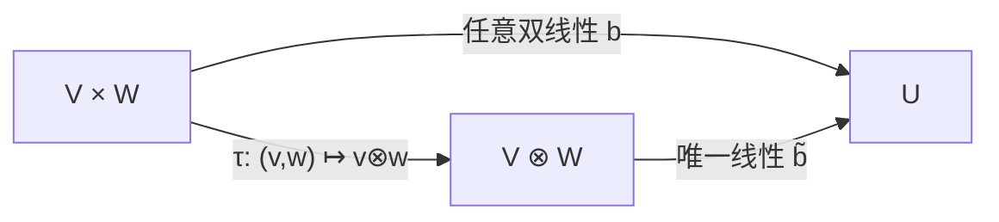

# 多线性映射、张量与缩并

> [!abstract] 本章主问题
> 怎样用统一的指标合同描述“创建新轴、沿配对轴求和、只变换某个轴”，同时不把抽象张量误同于某个多维数组？张量可视为张量积空间中的元素或多线性关系的坐标表示；数组只是选基和轴顺序后的实现。外积创建自由指标，缩并消去配对求和指标，mode-$n$ 乘积替换一个轴；Attention、卷积、JVP/VJP 与高阶导数都可由这些动作组合。

> [!question] 初学者读完必须能回答
> 1. 多线性为何要求“固定其他输入后，对每一个输入分别线性”？
> 2. 抽象张量、张量分量和程序数组分别处在哪一层？
> 3. order、shape、mode、矩阵秩、CP rank 与 multilinear rank 为什么不能混用？
> 4. 外积怎样创建自由指标，缩并怎样消去求和指标？
> 5. mode-$n$ 乘积如何只替换一个轴并保持其他轴语义？
> 6. broadcasting、reshape、transpose 与 contraction 哪些会求和，哪些只重排或复制？
> 7. 怎样用 `einsum` 字符串审计矩阵乘法、Attention 和张量线性层？
> 8. 缩并顺序为何影响中间内存和计算量，却不改变精确代数结果？

![[00-知识库管理/_assets/figures/tensors/fig-tensor-indices-contraction-modes-v2.svg|880]]

> [!figure] 图 1　自由指标、缩并指标与 mode 轴替换
> 左栏展示外积保留两个自由指标，中栏展示矩阵乘向量时重复指标求和并消失，右栏展示 mode-3 乘积把 feature 轴 $K$ 替换为 $L$；底栏用 `einsum` 做指标审计。**来源：**依据 Kolda–Bader、NumPy/PyTorch `einsum` 语义独立绘制。

**怎样读图。** 先逐式标出输出仍出现的自由指标：外积中的 $i,j$ 都保留。再找重复且未出现在输出中的指标，它们按约定求和并被缩并。最后看 mode 乘积，$I,J$ 两轴保持角色，只有 $K$ 经过 $W$ 变成 $L$；这与单纯 reshape 或 transpose 完全不同。

**适用边界（图没有证明什么）。** 图以坐标指标说明计算合同，不能替代张量积的抽象通用性质。程序 broadcasting 可能隐式扩展批量轴，`einsum` 也可能选择不同缩并路径；正确的输出形状不保证计算量、内存峰值或轴语义正确。

## 进入正文前：高阶数组不是新魔法，而是更多自由指标与缩并合同

> [!info] 承接—中心—去路
> - **承接：** [[Kronecker 积、向量化与矩阵方程]]通过展开把两个轴压成一个长坐标轴；[[伴随算子]]中的权重梯度 $g_yx^T$ 已经展示了一个双线性外积。
> - **中心：** 本页不再优先把所有轴压平，而是显式追踪自由指标、求和指标和轴角色。抽象张量是坐标无关对象，数组是选基、选轴顺序后的分量表。
> - **去路：** Attention、卷积和自动微分都可被审计为一串“创建指标—重排指标—缩并指标—施加非线性”的操作；张量分解则进一步用低秩因子压缩这些多轴关系。

### 两遍阅读路线

第一遍掌握分别线性、外积、缩并、Einstein 记号、mode-$n$ 乘积以及 reshape/transpose/broadcasting 的区别。第二遍再读张量积通用性质、CP/Tucker rank、Attention/卷积/JVP/VJP、缩并路径与复数共轭边界。

全章主线是：

$$
\text{自由指标决定输出轴},
\qquad
\text{重复且被消去的指标决定求和},
\qquad
\text{轴标签决定语义而不只是长度}.
$$

### 本章的问题链

1. 为什么“分别对每个输入线性”不同于把所有输入拼起来后的联合线性？
2. 张量、张量分量和程序数组分别属于抽象对象、坐标与存储的哪一层？
3. 外积为什么创建自由指标，缩并为什么消去成对指标？
4. `einsum` 的输入标签、输出标签和省略标签怎样形成可检查合同？
5. mode-$n$ 乘积怎样只替换一个轴，而 reshape/transpose 为什么不做线性求和？
6. Attention、卷积与 VJP 怎样落回相同的指标语言？
7. 为什么代数上等价的缩并顺序可能具有完全不同的时间和峰值内存？

### 贯穿例：权重梯度就是一个外积，微分就是一次双重缩并

继续取

$$
w=e_3\in\mathbb R^3,
\qquad
\hat x=(-1/3,2/3)^T\in\mathbb R^2.
$$

外积创建两个自由指标：

$$
(G_A)_{ij}=w_i\hat x_j,
\qquad
G_A=w\hat x^T\in\mathbb R^{3\times2}.
$$

现在令 $H\in\mathbb R^{3\times2}$ 是参数矩阵的一个微小扰动。损失的一阶变化为

$$
\mathrm dL[H]
=w^TH\hat x
=\sum_{i=1}^{3}\sum_{j=1}^{2}
w_iH_{ij}\hat x_j
=\langle G_A,H\rangle_F.
$$

这条等式把本批四页闭合起来：$\mathrm dL$ 是协向量；伴随把输出测量传回；`vec` 把 $G_A$ 展开为 $\hat x\otimes w$；张量记号则把同一计算写成两个指标的缩并。任何一个表示都不改变最终标量。

### 最小指标账本

| 记号 | 指标角色 | 输出 |
|---|---|---|
| $w_i\hat x_j$ | $i,j$ 都自由 | 二阶数组 $G_{ij}$ |
| $A_{ik}x_k$ | $i$ 自由，$k$ 求和 | 向量 $y_i$ |
| $w_iH_{ij}\hat x_j$ | $i,j$ 都求和 | 标量 $\mathrm dL$ |
| $X_{btd}$ | batch、token、feature 都自由 | 三阶数组 |
| $Q_{btd}K_{bsd}$ | $b,t,s$ 自由，$d$ 求和 | Attention score $S_{bts}$ |

> [!tip] 初学者的停靠点
> 每看到一个张量公式，先圈出输出中保留的自由指标，再标出只在输入乘积中重复的求和指标。若无法由这些标签独立推出输出 shape，就先不要依赖 broadcasting 猜结果。

## 学习目标

完成本章后，应能：

1. 定义双线性/多线性映射，并给出非多线性反例；
2. 解释张量积的通用性质，而不只把它当作数组操作；
3. 区分张量的阶数、形状、维数、矩阵秩、CP rank 与 multilinear rank；
4. 在选定基下写出张量分量和换基含义；
5. 手算外积、内积、双重缩并和 mode-$n$ 乘积；
6. 用指标记号检查每个自由指标与求和指标；
7. 将矩阵乘法、batch matmul、Attention 和卷积写成显式 `einsum`；
8. 解释 broadcasting、reshape、transpose 与 contraction 的区别；
9. 将 JVP、VJP、Jacobian/Hessian 作用理解为张量缩并；
10. 评估缩并顺序、内存中间量和低秩分解的工程边界。

## 阅读前检查与术语约定

需要熟悉：

- [[线性映射]]与复合；
- [[线性泛函与对偶空间]]：向量与协向量；
- [[基与坐标]]：数组分量依赖基；
- [[Kronecker 积、向量化与矩阵方程]]：积空间坐标与 `vec`；
- 求和符号和基本程序数组形状。

本章统一使用：

- **order/阶数**：需要多少个指标，例如矩阵是 order-$2$；
- **shape/形状**：每个指标的取值范围，例如 $I\times J\times K$；
- **mode/模态**：某一个轴的角色；
- **rank**：必须带定义，不允许只写“tensor rank”。

## 一、从线性到多线性

函数

$$
f:V_1\times\cdots\times V_d\to W
$$

称为多线性，如果固定除第 $k$ 个输入外的所有输入后，它关于第 $k$ 个输入是线性的。

也就是说，对每个 $k$，

$$
f(v_1,\ldots,av_k+bv_k',\ldots,v_d)
$$

等于

$$
af(v_1,\ldots,v_k,\ldots,v_d)
+bf(v_1,\ldots,v_k',\ldots,v_d).
$$

### 1.1 例子

1. 内积 $x^Ty$ 对 $x,y$ 分别线性（复内积对一个变量共轭线性，需要声明约定）；
2. 外积 $(x,y)\mapsto xy^T$ 是双线性的；
3. 三线性形式
   $$
   f(x,y,z)=\sum_{ijk}\mathcal T_{ijk}x_iy_jz_k
   $$
   对三个向量分别线性；
4. 矩阵乘法 $(A,B)\mapsto AB$ 是双线性的。

### 1.2 反例

$$
f(x,y)=x+y
$$

不是双线性的。固定 $y\ne0$ 后，$x\mapsto x+y$ 不是线性映射，因为 $f(0,y)=y\ne0$。

$$
g(x,y)=(x^Ty)^2
$$

也不是双线性的，因为对每个输入是二次而非一次齐次。

> [!important] 联合线性与分别线性不同
> 双线性映射通常不是从直积 $V\times W$ 到 $U$ 的联合线性映射。例如 $(x,y)\mapsto xy^T$ 中同时缩放两个输入会产生 $ab$，不是 $a+b$ 型线性。

## 二、张量积的通用性质

对向量空间 $V,W$，张量积 $V\otimes W$ 配有双线性映射

$$
\tau:V\times W\to V\otimes W,
\qquad
(v,w)\mapsto v\otimes w,
$$

并满足：对任意双线性映射

$$
b:V\times W\to U,
$$

存在唯一线性映射

$$
\widetilde b:V\otimes W\to U
$$

使

$$
b(v,w)=\widetilde b(v\otimes w).
$$

用交换图表示：



这称为张量积的通用性质。它把“分别线性”的问题转化为普通线性映射问题。

### 2.1 有限维基与维数

若 $e_1,\ldots,e_m$ 是 $V$ 的基，$f_1,\ldots,f_n$ 是 $W$ 的基，则

$$
\{e_i\otimes f_j:1\le i\le m,1\le j\le n\}
$$

是 $V\otimes W$ 的基，所以

$$
\dim(V\otimes W)=mn.
$$

任意张量可写为

$$
T=\sum_{i=1}^m\sum_{j=1}^n t_{ij}e_i\otimes f_j.
$$

在这组积基下，系数 $t_{ij}$ 可以排成一个 $m\times n$ 数组。

### 2.2 简单张量不是全部张量

形如

$$
v\otimes w
$$

的元素称为简单/纯张量。一般张量需要多个简单张量之和。

在 $V\otimes W$ 与矩阵空间的坐标对应下，简单张量对应 rank-$1$ 矩阵；一般矩阵并不都是 rank-$1$。因此“张量积空间由纯张量张成”不等于“每个张量都是一个纯张量”。

## 三、张量、数组与坐标

在有限维 Euclidean 场景中，我们常把 order-$d$ 张量写成数组

$$
\mathcal X\in\mathbb F^{I_1\times\cdots\times I_d}.
$$

其坐标为

$$
x_{i_1\cdots i_d}.
$$

抽象对象与数组的关系类似“线性映射与矩阵”：

| 抽象层 | 坐标层 |
|---|---|
| 张量积空间中的元素 | 多维数组 |
| 选择每个因子空间的基 | 确定各轴坐标 |
| 基变换 | 分量按多轴规则变化 |
| contraction | 配对向量/协向量或对应指标 |

在机器学习中通常固定标准 Euclidean 基，所以数组语言足够做计算；但讨论旋转、等变性、梯度和物理量时，必须记住分量会随基变化。

## 四、阶数、形状与各种 rank

设

$$
\mathcal X\in\mathbb R^{4\times7\times9}.
$$

- 它是 order-$3$ 张量；
- shape 是 $(4,7,9)$；
- 元素总数是 $4\cdot7\cdot9$；
- 这些信息都没有说明它的“rank”。

### 4.1 CP rank

若

$$
\mathcal X
=\sum_{r=1}^R
a_r^{(1)}\circ a_r^{(2)}\circ\cdots\circ a_r^{(d)},
$$

其中 $\circ$ 表示外积，则最小这样的 $R$ 称为 CP rank。

### 4.2 multilinear/Tucker rank

把张量沿第 $n$ 个 mode 展开成矩阵 $X_{(n)}$，定义

$$
\operatorname{rank}_{ML}(\mathcal X)
=\left(
\operatorname{rank}X_{(1)},\ldots,
\operatorname{rank}X_{(d)}
\right).
$$

这是一个元组，不是单个整数。

### 4.3 为什么不能含糊写 rank

对 order-$2$ 矩阵，各种自然 rank 汇合到矩阵秩；对高阶张量，CP rank、Tucker rank、tensor-train rank 等不同，计算复杂度和唯一性也不同。

> [!warning] order 不是 rank
> “这是一个 rank-4 tensor”在软件文档中有时只是说有四个轴，但数学上 rank 有完全不同的含义。建议写 `order-4` 或明确 `CP rank = 4`。

## 五、外积：创建自由指标

对

$$
a\in\mathbb R^I,
\quad
b\in\mathbb R^J,
\quad
c\in\mathbb R^K,
$$

三向量外积定义为

$$
\mathcal X=a\circ b\circ c,
$$

其中

$$
x_{ijk}=a_ib_jc_k.
$$

输出 shape 为 $I\times J\times K$。没有任何指标被求和；每个输入指标都保留为输出自由指标。

### 5.1 手算

取

$$
a=\begin{bmatrix}1\\2\end{bmatrix},
\qquad
b=\begin{bmatrix}3\\4\end{bmatrix},
\qquad
c=\begin{bmatrix}1\\-1\end{bmatrix}.
$$

第一张 frontal slice 为

$$
\mathcal X_{::1}=ab^T
=\begin{bmatrix}3&4\\6&8\end{bmatrix},
$$

第二张为

$$
\mathcal X_{::2}=-ab^T
=\begin{bmatrix}-3&-4\\-6&-8\end{bmatrix}.
$$

这是 CP rank-$1$ 张量。

## 六、缩并：配对指标并求和

缩并把两个或多个相同范围的指标配对并求和。

### 6.1 矩阵乘法是一次缩并

$$
C_{ij}=\sum_k A_{ik}B_{kj}.
$$

$i,j$ 是自由指标，出现在输出中；$k$ 是求和指标，只出现在输入乘积中。

> [!analysis] 缩并公式的七问拆解
> | 问题 | 回答 |
> |---|---|
> | 这条公式在做什么？ | 对共享的 $k$ 轴配对、相乘并求和，同时保留行指标 $i$ 与列指标 $j$。 |
> | 哪些是自由指标？ | $i,j$ 出现在输出左侧，决定输出的两条轴及其顺序。 |
> | 哪个是缩并指标？ | $k$ 在输入乘积中重复且不出现在输出中，因此被求和并消失。 |
> | shape 怎样推出？ | 若 $A$ 为 $I\times K$、$B$ 为 $K\times J$，共享轴长度必须同为 $K$，输出为 $I\times J$。 |
> | 为什么不是 Hadamard 或 broadcasting？ | Hadamard 不消去轴；broadcasting 只扩展兼容轴。这里有明确的乘积后求和合同。 |
> | 怎样用代码审计？ | 显式写 `einsum("ik,kj->ij", A, B)`，逐个核对输入轴、保留轴与被消去轴。 |
> | AI 中怎样扩展？ | Attention score 为 `btd,bsd->bts`，value 聚合为 `bts,bsv->btv`；本质仍是指定自由指标与缩并指标。 |

### 6.2 向量内积是完全缩并

$$
s=\sum_i x_iy_i.
$$

没有自由指标，输出是标量。

### 6.3 双重缩并

对相同形状矩阵，Frobenius 内积为

$$
\langle A,B\rangle_F
=\sum_{ij}a_{ij}b_{ij}.
$$

两个指标都被缩并。

### 6.4 张量与矩阵的缩并

若

$$
\mathcal X\in\mathbb R^{I\times J\times K},
\qquad
M\in\mathbb R^{L\times K},
$$

沿 $K$ 轴缩并：

$$
y_{ijl}=\sum_{k=1}^Kx_{ijk}m_{lk}.
$$

输出 shape 为 $I\times J\times L$。原来的 $K$ 轴被新轴 $L$ 替换。

## 七、Einstein 求和记号

传统 Einstein 约定中，重复指标暗示求和。例如

$$
C_{ij}=A_{ik}B_{kj}
$$

省略了 $\sum_k$。

在编程中更安全的做法是显式写输出：

```python
C = einsum("ik,kj->ij", A, B)
```

### 7.1 指标审计规则

对一个 `einsum` 表达式：

1. 每个输入轴必须有一个标签；
2. 输出标签是自由指标，决定输出轴和顺序；
3. 未出现在输出中的标签被求和；
4. 同一标签在不同输入中要求对应轴长度相同或满足框架的广播规则；
5. 重复标签在同一输入中通常表示取对角/迹；
6. batch 标签若应保留，必须出现在输出中。

> [!important] 始终显式写 `->output`
> NumPy 隐式模式可能按字母顺序重排输出轴。教学和生产代码中显式写输出，能把数学自由指标与程序 shape 一一对应。

## 八、mode-$n$ 乘积

设

$$
\mathcal X\in
\mathbb R^{I_1\times\cdots\times I_n\times\cdots\times I_d},
$$

以及

$$
U\in\mathbb R^{J\times I_n}.
$$

> [!definition] mode-$n$ 乘积
> $$
> \mathcal Y=\mathcal X\times_n U
> $$
> 的 shape 为
> $$
> I_1\times\cdots\times I_{n-1}\times J\times I_{n+1}\times\cdots\times I_d,
> $$
> 且
> $$
> y_{i_1\cdots i_{n-1}j i_{n+1}\cdots i_d}
> =\sum_{i_n=1}^{I_n}
> x_{i_1\cdots i_n\cdots i_d}u_{j i_n}.
> $$

它就是沿第 $n$ 个轴对每条 fiber 使用同一个线性映射 $U$。

### 8.1 展开矩阵公式

若 $X_{(n)}$ 表示 mode-$n$ unfolding，约定第 $n$ 轴作为行，其余轴按固定词典序作为列，则

$$
Y_{(n)}=UX_{(n)}.
$$

这条公式不依赖其他轴具体列排序，只要 $X_{(n)}$ 与 $Y_{(n)}$ 使用同一约定。

### 8.2 多轴变换

若每个 mode 都施加矩阵 $U^{(n)}$，

$$
\mathcal Y
=\mathcal X
\times_1U^{(1)}
\times_2U^{(2)}
\cdots
\times_dU^{(d)}.
$$

在完全向量化后，可写成若干 Kronecker 因子的乘法；因子顺序取决于 `vec` 与 unfolding 约定，所以应从指标推导而非死记。

## 九、unfolding、reshape 与 transpose

### 9.1 unfolding

mode-$n$ unfolding 把一个轴作为矩阵行，其余轴组合成列。它是元素的重新排列，不做求和。

### 9.2 reshape

reshape 重新解释索引分组；若存储连续且顺序兼容，可以是 view，否则可能复制。数学上它是坐标重排，不等于线性缩并。

### 9.3 transpose/permute

permute 改变轴顺序。它不改变元素集合，但改变每个位置的语义与内存 strides。

### 9.4 contraction

contraction 对某些轴求和，通常改变元素数值与阶数。它不是纯重排。

| 操作 | 求和 | 改轴顺序 | 可能改元素总数 | 可能只是 view |
|---|---:|---:|---:|---:|
| reshape | 否 | 隐含重分组 | 否 | 是 |
| permute | 否 | 是 | 否 | 是 |
| broadcasting | 否 | 扩展/对齐 | 逻辑上是 | 常为 view |
| contraction | 是 | 由自由指标决定 | 通常是 | 通常否 |

## 十、Attention 是两次缩并加一个非线性

设

$$
Q\in\mathbb R^{B\times H\times L_q\times D},
$$

$$
K,V\in\mathbb R^{B\times H\times L_k\times D}.
$$

### 10.1 分数

$$
S_{bhij}
=\frac1{\sqrt D}
\sum_{r=1}^D Q_{bhir}K_{bhjr}.
$$

shape 为

$$
B\times H\times L_q\times L_k.
$$

对应

```python
S = einsum("bhir,bhjr->bhij", Q, K) / sqrt(D)
```

其中 $b,h$ 是保留的 batch/head 指标，$r$ 被缩并，$i,j$ 是 query/key 位置。

### 10.2 softmax

$$
P_{bhij}=\operatorname{softmax}_j(S_{bhij}).
$$

softmax 是非线性，不是张量缩并；它沿 key 位置 $j$ 归一化。

### 10.3 聚合 value

$$
O_{bhir}
=\sum_{j=1}^{L_k}P_{bhij}V_{bhjr}.
$$

对应

```python
O = einsum("bhij,bhjr->bhir", P, V)
```

输出恢复 shape

$$
B\times H\times L_q\times D.
$$

> [!warning] Attention 整体不是多线性映射
> $QK^T$ 与 $PV$ 的局部运算是双线性缩并，但 softmax 使完整 Attention 非线性；而 $P$ 还依赖 $Q,K$，不能把三者整体当作简单三线性形式。

## 十一、卷积是带共享与位移结构的缩并

二维卷积的简化指标式为

$$
Y_{bohw}
=\sum_{i=1}^{C_{in}}
\sum_{r=1}^{R}
\sum_{s=1}^{S}
K_{oirs}
X_{bi,h+r,w+s}.
$$

这里：

- $b,o,h,w$ 是输出自由指标；
- $i,r,s$ 被缩并；
- 同一核 $K$ 在不同空间位置共享；
- stride、padding、dilation 改变 $h+r,w+s$ 的索引映射。

卷积可以通过 `im2col + GEMM` 表示，但展开会引入重复数据；高性能内核通常不会把数学等价的巨大 Toeplitz/patch 矩阵完整物化。

## 十二、JVP、VJP 与高阶导数是缩并

设

$$
f:\mathbb R^n\to\mathbb R^m,
\qquad
J_{ij}=\frac{\partial f_i}{\partial x_j}.
$$

### 12.1 JVP

对方向 $v\in\mathbb R^n$，

$$
(Jv)_i=\sum_jJ_{ij}v_j.
$$

缩并输入指标 $j$，保留输出指标 $i$。

### 12.2 VJP

对输出 cotangent $u\in\mathbb R^m$，

$$
(u^TJ)_j=\sum_i u_iJ_{ij}.
$$

缩并输出指标 $i$，保留输入指标 $j$。

### 12.3 向量值函数的 Hessian

若 $f:\mathbb R^n\to\mathbb R^m$，二阶导数组件为

$$
\mathcal H_{ijk}
=\frac{\partial^2f_i}{\partial x_j\partial x_k},
$$

是 order-$3$ 数组。对两个方向 $v,w$ 的二阶作用为

$$
z_i=\sum_{jk}\mathcal H_{ijk}v_jw_k.
$$

自动微分通常计算这种作用量，而不物化 $m\times n\times n$ 张量。

## 十三、双线性层与三阶参数张量

设输入

$$
x\in\mathbb R^I,
\qquad
y\in\mathbb R^J,
$$

输出

$$
z\in\mathbb R^K.
$$

一般双线性层可以写成

$$
z_k=\sum_{ij}\mathcal W_{kij}x_iy_j,
$$

其中

$$
\mathcal W\in\mathbb R^{K\times I\times J}.
$$

对应显式 `einsum`：

```python
z = einsum("kij,i,j->k", W, x, y)
```

参数量为 $KIJ$。若使用 CP/Tucker/TT 分解，可以降低参数和运算，但会引入 rank 选择、非唯一参数化与近似误差。

## 十四、CP 与 Tucker：只建立接口

### 14.1 CP 分解

$$
\mathcal X
\approx
\sum_{r=1}^R
a_r^{(1)}\circ\cdots\circ a_r^{(d)}.
$$

它把张量表示为 $R$ 个 rank-$1$ 外积之和。

### 14.2 Tucker 分解

$$
\mathcal X
\approx
\mathcal G
\times_1U^{(1)}
\times_2\cdots
\times_dU^{(d)}.
$$

核心张量 $\mathcal G$ 描述各 mode 潜在分量的交互，因子矩阵压缩各轴。

### 14.3 与矩阵 SVD 的差异

矩阵 SVD 有正交方向、排序奇异值和强最优性；高阶 CP/Tucker 不会自动继承全部性质。CP 最佳低 rank 近似甚至可能不存在，分解唯一性和算法稳定性也更复杂。本章只建立语言，完整理论应进入独立张量分解章节。

## 十五、缩并顺序与复杂度

考虑

$$
z_{il}=\sum_{jkr}A_{ij}B_{jkr}C_{kl}d_r.
$$

数学上只要有限求和，结合顺序不改变精确结果；计算上不同顺序产生不同中间张量大小、FLOPs 和浮点舍入。

例如可以先缩并 $B$ 与 $d$：

$$
M_{jk}=\sum_rB_{jkr}d_r,
$$

再与 $A,C$ 相乘；也可以先收缩 $A$ 与 $B$。哪种更好取决于 $I,J,K,L,R$ 的相对大小。

NumPy 的 `einsum_path` 和某些框架/库会搜索 contraction path，但：

- 最少 FLOPs 不一定最少通信；
- 最小峰值内存不一定最快；
- 混合精度的归约顺序会影响数值误差；
- 动态 shape 与编译缓存也影响实际性能。

## 十六、broadcasting 不是 contraction

设

$$
X\in\mathbb R^{B\times L\times D},
\qquad
b\in\mathbb R^D.
$$

$$
Y_{bld}=X_{bld}+b_d
$$

通过 broadcasting 把 $b_d$ 逻辑复制到 $B,L$ 轴，没有求和。

而

$$
s_{bl}=\sum_dX_{bld}w_d
$$

沿 $D$ 缩并，输出删除该轴。

把广播轴误写为重复求和指标，会让输出数值和尺度完全改变。

## 十七、复数、对偶与共轭

在实 Euclidean 坐标中，向量和协向量常都写成列数组，容易忽略对象区别。严格地说，缩并自然配对的是协向量与向量。

复内积

$$
\langle x,y\rangle=x^*y
$$

包含共轭，而纯双线性 contraction

$$
x^Ty
$$

不包含共轭。`einsum("i,i->", x, y)` 是否共轭依赖库的乘法语义，通常不会自动实现 Hermitian 内积；应使用 `vdot`/显式 `conj`。

> [!warning] 指标相同不自动意味着共轭
> Einstein 标签只描述轴配对与求和。复数几何还需显式声明哪个因子共轭。

## 十八、AI 形状审计模板

对每个张量表达式，按以下顺序记录：

1. 每个张量的 shape；
2. 每个轴的语义，例如 batch/head/token/channel；
3. 自由指标与输出顺序；
4. 缩并指标与求和范围；
5. 是否存在 broadcasting；
6. 是否存在 transpose/permute/reshape；
7. dtype、累加精度与归约长度；
8. 最大中间张量 shape；
9. 是否有可利用的稀疏、低秩、对称或 Kronecker 结构；
10. 反向传播需要保存哪些中间量。

这份清单比只写一行 `einsum` 更接近可验证的理论和工程说明。

## 十九、常见误区

> [!warning] 误区 1：张量就是高维数组
> 数组是选定基和轴顺序后的坐标表示。讨论变换律和不变量时必须回到抽象对象。

> [!warning] 误区 2：order-$3$ 就是 rank-$3$
> order 是轴数；CP/Tucker/TT rank 是分解复杂度。

> [!warning] 误区 3：相同标签一定是合法缩并
> 被配对轴长度必须兼容，且要确认该轴语义确实应被求和。

> [!warning] 误区 4：batch/head 标签重复就会自动保留
> 若没有写在输出中，它们可能被错误求和。显式输出指标是最安全的契约。

> [!warning] 误区 5：reshape 等于 transpose 或 contraction
> reshape 只重组索引；transpose 改轴顺序；contraction 求和。

> [!warning] 误区 6：Attention 是三线性映射
> softmax 使整体非线性，且权重依赖 $Q,K$。

> [!warning] 误区 7：数学等价的缩并顺序性能相同
> 中间大小、通信、kernel 融合和舍入误差都可能不同。

> [!warning] 误区 8：复数 `einsum` 自动做共轭内积
> 通常只是普通乘法与求和，应显式共轭或使用 Hermitian 内积 API。

## 二十、掌握检查

1. 多线性为何不是联合线性？
2. 张量积的通用性质解决了什么问题？
3. order、shape、CP rank 和 Tucker rank 分别是什么？
4. 外积与缩并对指标做了什么相反动作？
5. 怎样从指标式写出显式输出 `einsum`？
6. mode-$n$ 乘积怎样改变 shape？
7. Attention 中哪些指标保留、哪些指标求和？
8. 卷积为什么既是缩并又带参数共享？
9. JVP 与 VJP 分别缩并 Jacobian 的哪一侧？
10. 为什么高阶导数和巨型 Kronecker Jacobian通常不应物化？

## 二十一、练习与后继

- 分层练习：[[习题 - 多线性映射、张量与缩并]]；
- 独立详解：[[解答 - 多线性映射、张量与缩并]]；
- 坐标与矩阵方程：[[Kronecker 积、向量化与矩阵方程]]；
- 微分接口：[[全微分与 Fréchet 导数]]；
- 低秩前置：[[奇异值分解]]、[[有效秩]]；
- 自动微分几何：[[线性泛函与对偶空间]]、[[伴随算子]]。

## 来源与证据边界

- Tamara G. Kolda & Brett W. Bader, [*Tensor Decompositions and Applications*](https://doi.org/10.1137/07070111X), 2009：多维数组、fiber/slice、mode-$n$ 乘积、unfolding、Kronecker、CP 与 Tucker 的主要术语来源；
- NumPy, [numpy.einsum](https://numpy.org/doc/stable/reference/generated/numpy.einsum.html)：显式/隐式输出、轴顺序、广播与 contraction path 的当前接口事实；
- PyTorch, [torch.einsum](https://docs.pytorch.org/docs/stable/generated/torch.einsum.html)：深度学习张量上的 Einstein 求和接口；
- 本章只建立 CP/Tucker 入口，不宣称高阶张量拥有矩阵 SVD 的全部最优性、稳定性或唯一性；框架 API 事实与抽象张量定义分层书写。
