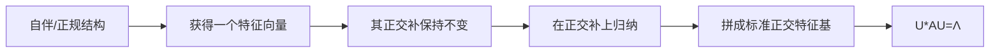

# 定理 - 有限维谱定理

> [!abstract] 本章主问题
> 哪些算子不仅拥有特征基，而且拥有不会放大二范数的标准正交/酉特征基？复有限维内积空间中的精确答案是正规算子；自伴算子的谱进一步全为实数，半正定算子的谱非负，实对称矩阵因此可被实正交矩阵对角化。谱投影形式 $A=\sum_\lambda\lambda P_\lambda$ 比某一组可旋转的特征向量更能表达重复谱结构。

## 学习目标

完成本章后，你应能：

1. 区分正规、自伴、酉、正交与半正定；
2. 准确陈述复正规谱定理和实对称特例；
3. 证明自伴算子特征值为实数、异特征空间正交；
4. 证明特征向量的正交补保持不变，并理解归纳结构；
5. 用 Schur 分解解释“正规上三角必对角”；
6. 写出 $A=\sum_j\lambda_jP_j$ 并解释重复特征值时投影为何更本质；
7. 从谱定理推导 Rayleigh 商界、矩阵函数、平方根与 SVD；
8. 说明实正规矩阵为何不一定能实正交对角化；
9. 区分结构定理、数值算法和扰动稳定性。

> [!question] 初学者读完必须能回答
> 1. 正规、自伴、酉/正交与半正定之间有哪些包含关系，哪些不能反推？
> 2. 复正规谱定理与实对称谱定理的标量域结论有何不同？
> 3. 自伴算子的特征值为什么为实数，异特征空间为什么正交？
> 4. 为什么特征向量的正交补仍是算子不变子空间？
> 5. Schur 证明中，“正规上三角矩阵必为对角矩阵”关闭了哪一步？
> 6. 为什么重复特征值时应优先谈谱投影 $P_\lambda$ 而不是某一根特征向量？
> 7. Rayleigh 商、矩阵函数、平方根与 SVD 怎样从谱定理导出？
> 8. 实正规矩阵为什么可能无法在实数域中正交对角化？

![[00-知识库管理/_assets/figures/spectral-theorem/fig-spectral-theorem-projectors-functions-v2.svg|880]]

> [!figure] 图 1　结构条件、正交特征基与谱投影
> 左栏区分正规、自伴、酉与半正定；中栏展示 $A=U\Lambda U^*$ 的标准正交/酉特征基；右栏用谱投影表达 $I,A,f(A)$ 和 Rayleigh 商。**来源：**依据有限维谱定理、Axler 及本章所引苏剑林 SVD 文章的谱投影视角独立绘制。

**怎样读图。** 先从左栏确定算子结构：自伴与酉都蕴含正规，半正定还要求非负谱。再看中栏，$U$ 的列两两正交且单位长度，所以换基条件数为 1。最后看右栏，把同一特征值对应的整个特征空间合并成 $P_\lambda$，矩阵函数只需把每个 $\lambda$ 替换成 $f(\lambda)$。

**适用边界（图没有证明什么）。** 图以复正规与实对称两条最干净的主线组织结论；实正规矩阵可能只能得到含 $2\times2$ 旋转块的实 Schur 形式。谱定理保证良态换基存在，却不自动保证近重特征值对应的单根/单向量对扰动稳定。

## 进入正文前：谱定理比“可对角化”多承诺了良态几何

> [!info] 承接—中心—去路
> - **承接：** [[特征分解]]允许一般可逆特征基 $V$，但 $V$ 可能非正交甚至病态；[[伴随算子]]提供正规性 $A^*A=AA^*$ 的结构语言。
> - **中心：** 复有限维中，正规性恰好等价于存在酉特征基；实对称/Hermitian 情形还保证特征值为实数。此时换基不放大二范数。
> - **去路：** [[Schur 分解]]会证明任意复方阵都能酉三角化，正规性再迫使三角部分退化为对角；矩阵函数与 SVD 都会调用谱投影形式。

### 两遍阅读路线

第一遍掌握正规、自伴、酉、半正定的包含关系，谱定理陈述，以及 $S=Q\Lambda Q^T$。第二遍再读正交补归纳证明、谱投影、Rayleigh 商、SVD 接口、实正规旋转块与谱簇扰动边界。

全章主线是：

$$
A^*A=AA^*
\Longleftrightarrow
A=U\Lambda U^*,
\quad U^*U=I,
$$

在实对称情形写成 $A=Q\Lambda Q^T$。

### 本章的问题链

1. 一般可对角化矩阵为什么不一定拥有正交特征向量？
2. 正规性怎样迫使不同特征空间彼此正交？
3. 为什么自伴算子的特征值必须为实数？
4. 正交补不变性怎样允许按维数归纳拼出完整特征基？
5. 谱投影为什么比重复特征值中的某一组基向量更本质？
6. 为什么复正规结论不能原样偷换成“任意实正规矩阵可实正交对角化”？
7. 谱定理怎样导出 Rayleigh 商、正定平方根和 SVD？

### 贯穿例：$S$ 通过，$B$ 被正规性挡住

对

$$
S=\begin{bmatrix}2&1\\1&2\end{bmatrix},
\qquad
Q=\frac1{\sqrt2}
\begin{bmatrix}1&1\\1&-1\end{bmatrix},
$$

有

$$
Q^TQ=I,
\qquad
S=Q\begin{bmatrix}3&0\\0&1\end{bmatrix}Q^T.
$$

因此任意 $x=c_1q_1+c_2q_2$ 都满足

$$
x^TSx=3c_1^2+c_2^2,
$$

立刻得到 Rayleigh 商位于 $[1,3]$。相比之下，

$$
B=\begin{bmatrix}3&1\\0&1\end{bmatrix}
$$

虽可对角化，却满足 $B^TB\ne BB^T$，所以不存在正交特征基。第三个对照 $J$ 更进一步，连普通特征基都不存在。

### 最小结构账本

| 结构 | 代数条件 | 谱结论 |
|---|---|---|
| 正规 | $A^*A=AA^*$ | 复数域存在酉特征基 |
| 自伴/Hermitian | $A=A^*$ | 正规，且特征值全实 |
| 实对称 | $A=A^T$ | 实正交对角化 |
| 半正定 | 自伴且 $x^*Ax\ge0$ | 特征值全非负 |
| 一般可对角化 | $A=V\Lambda V^{-1}$ | $V$ 不一定酉，条件数可能很大 |

> [!tip] 初学者的停靠点
> “有特征基”只够得到 $V^{-1}$；“有标准正交特征基”才允许写 $U^*$。若没有先验证正规/自伴结构，就把所有特征向量归一化后宣称它们正交，是常见的逻辑跳步。

## 阅读前自检

- 已知伴随恒等式 $\langle Tx,y\rangle=\langle x,T^*y\rangle$；
- 已知标准正交基、正交投影和特征空间；
- 明白“实对称”是“复 Hermitian”的实数特例；
- 注意本库采用第一变量线性，所以第二变量中的标量提出时取共轭。

## 前置定义

设 $V$ 是有限维内积空间，$T^{*}$ 表示 $T$ 的伴随算子。

> [!definition] 正规、自伴与半正定
> - 正规：$T^{*}T=TT^{*}$；
> - 自伴/Hermitian：$T=T^{*}$；
> - 酉/正交：$T^{*}T=TT^{*}=I$；
> - 半正定：$T=T^{*}$ 且对所有 $\boldsymbol x$，$\langle T\boldsymbol x,\boldsymbol x\rangle\ge0$。

自伴、酉、正交算子都是正规算子。实矩阵中“自伴”就是对称，复矩阵中必须使用共轭转置，不能只用普通转置。

## 完整陈述

> [!theorem] 复有限维谱定理
> 对复有限维内积空间上的算子 $T$，以下命题等价：
>
> 1. $T$ 正规；
> 2. $V$ 存在由 $T$ 的特征向量组成的标准正交基；
> 3. 在某个标准正交基下，$T$ 的矩阵为对角阵；
> 4. 存在酉矩阵 $\boldsymbol U$ 和对角矩阵 $\boldsymbol\Lambda$，使
>    $$
>    \boldsymbol A=\boldsymbol U\boldsymbol\Lambda\boldsymbol U^{*}.
>    $$

> [!theorem] 自伴与实对称特例
> 若 $T=T^{*}$，则所有特征值为实数，并存在酉特征基。特别地，对任意实对称矩阵 $\boldsymbol A=\boldsymbol A^{\top}$，存在实正交矩阵 $\boldsymbol Q$ 和实对角矩阵 $\boldsymbol\Lambda$，使
> $$
> \boldsymbol A=\boldsymbol Q\boldsymbol\Lambda\boldsymbol Q^{\top}.
> $$

> [!analysis] 谱定理的七问拆解
> | 问题 | 回答 |
> |---|---|
> | 它比一般对角化多给什么？ | 特征基可取标准正交/酉，因此逆矩阵就是伴随，二范数条件数为 1。 |
> | 复数域的精确条件是什么？ | $A$ 正规，即 $A^*A=AA^*$；这是酉对角化的充要条件。 |
> | 自伴情形为什么更强？ | $A=A^*$ 不仅蕴含正规，还迫使每个特征值等于自身共轭，因此全为实数。 |
> | 证明的递归支点是什么？ | 先找一个单位特征向量，再证明其正交补对 $A$ 不变，于低一维空间重复。 |
> | 重复特征值怎样表达最稳妥？ | 把整个特征空间合并成正交投影 $P_\lambda$，写 $A=\sum_\lambda\lambda P_\lambda$，不依赖该空间内部选哪组基。 |
> | 实数域有什么例外？ | 实对称矩阵可实正交对角化；一般实正规矩阵可能含旋转，只有转到复数域或保留 $2\times2$ 实块。 |
> | AI 中怎样调用？ | 对称 Hessian、协方差、Gram 矩阵、核矩阵和图 Laplacian；若实际算子非正规，不能只因“有特征值”就套用正交谱结论。 |

对半正定矩阵还有 $\lambda_i\ge0$；对正定矩阵有 $\lambda_i>0$。

## 证明路线

### 第一步：自伴算子的特征值为实数

若 $T\boldsymbol v=\lambda\boldsymbol v$ 且 $\boldsymbol v\ne0$，则

$$
\lambda\|\boldsymbol v\|^2
=\langle T\boldsymbol v,\boldsymbol v\rangle
=\langle\boldsymbol v,T\boldsymbol v\rangle
=\overline\lambda\|\boldsymbol v\|^2.
$$

故 $\lambda=\overline\lambda$，即 $\lambda\in\mathbb R$。

### 第二步：不同特征值的特征向量正交

若 $T\boldsymbol u=\lambda\boldsymbol u$、$T\boldsymbol v=\mu\boldsymbol v$，且 $T$ 自伴，则

$$
\lambda\langle\boldsymbol u,\boldsymbol v\rangle
=\langle T\boldsymbol u,\boldsymbol v\rangle
=\langle\boldsymbol u,T\boldsymbol v\rangle
=\mu\langle\boldsymbol u,\boldsymbol v\rangle.
$$

当 $\lambda\ne\mu$，有 $\langle\boldsymbol u,\boldsymbol v\rangle=0$。

这里已经使用第一步得到 $\lambda,\mu\in\mathbb R$；否则第二变量中的 $\mu$ 应以共轭形式出现。

### 第三步：特征向量正交补保持不变

取单位特征向量 $\boldsymbol v$。若 $\boldsymbol x\perp\boldsymbol v$，则

$$
\langle T\boldsymbol x,\boldsymbol v\rangle
=\langle\boldsymbol x,T\boldsymbol v\rangle
=\lambda\langle\boldsymbol x,\boldsymbol v\rangle
=0.
$$

所以 $T\boldsymbol x\in\boldsymbol v^{\perp}$。把 $T$ 限制到低一维的 $\boldsymbol v^{\perp}$，重复该过程，即可归纳构造标准正交特征基。

实对称矩阵至少有一个实特征值/特征向量，可由实特征多项式与复根共轭结构，或 Rayleigh 商在单位球面取极值证明。之后同样在实正交补上归纳。

### 正规算子的证明骨架

这一证明所调用的存在性、归纳块结构和“正规上三角必对角”的逐步论证见[[Schur 分解]]。本节只保留谱定理所需的压缩版本。

复数域上先用 Schur 分解写

$$
\boldsymbol A=\boldsymbol U\boldsymbol R\boldsymbol U^{*},
$$

其中 $\boldsymbol R$ 上三角。酉相似保持正规性，所以 $\boldsymbol R$ 也正规；而正规上三角矩阵必须是对角阵。于是 $\boldsymbol R=\boldsymbol\Lambda$。

反向很直接：若 $\boldsymbol A=\boldsymbol U\boldsymbol\Lambda\boldsymbol U^{*}$，则

$$
\boldsymbol A^{*}\boldsymbol A
=\boldsymbol U\boldsymbol\Lambda^{*}\boldsymbol\Lambda\boldsymbol U^{*}
=\boldsymbol U\boldsymbol\Lambda\boldsymbol\Lambda^{*}\boldsymbol U^{*}
=\boldsymbol A\boldsymbol A^{*}.
$$

## 谱分解与投影形式

把相同特征值合并。若不同特征值为 $\lambda_1,\ldots,\lambda_s$，对应特征空间的正交投影为 $\boldsymbol P_1,\ldots,\boldsymbol P_s$，则

$$
\boldsymbol A=\sum_{j=1}^{s}\lambda_j\boldsymbol P_j,
$$

且

$$
\boldsymbol P_i\boldsymbol P_j=0\ (i\ne j),
\qquad
\boldsymbol P_j^{2}=\boldsymbol P_j=\boldsymbol P_j^{*},
\qquad
\sum_j\boldsymbol P_j=\boldsymbol I.
$$

这个形式比逐个列出特征向量更不依赖基：重复特征值内可旋转特征向量，但整个谱投影不变。

## 一个完整二维例子

取实对称矩阵

$$
A=\begin{bmatrix}2&1\\1&2\end{bmatrix}.
$$

特征值为 $3,1$，标准正交特征向量为

$$
q_1=\frac1{\sqrt2}(1,1)^T,
\qquad
q_2=\frac1{\sqrt2}(1,-1)^T.
$$

令 $Q=[q_1\ q_2]$，则

$$
Q^TAQ=\operatorname{diag}(3,1),
\qquad
A=Q\operatorname{diag}(3,1)Q^T.
$$

投影形式为

$$
A=3q_1q_1^T+1q_2q_2^T.
$$

对 $x=c_1q_1+c_2q_2$，二次型直接变成

$$
x^TAx=3c_1^2+c_2^2,
$$

所以最小和最大单位方向曲率分别为 $1$ 与 $3$。

## 回看结构条件、正交特征基与谱函数

开章图已把结构条件、良态特征基和谱投影函数演算放在同一页；下面用 Rayleigh 商把“谱值”进一步解释为单位方向二次型的极值与加权平均。

## Rayleigh 商与极值

对 Hermitian 矩阵定义

$$
R_{\boldsymbol A}(\boldsymbol x)
=\frac{\boldsymbol x^{*}\boldsymbol A\boldsymbol x}
{\boldsymbol x^{*}\boldsymbol x}.
$$

若 $\boldsymbol x=\sum_i c_i\boldsymbol u_i$，则

$$
R_{\boldsymbol A}(\boldsymbol x)
=\frac{\sum_i\lambda_i|c_i|^2}{\sum_i|c_i|^2},
$$

是特征值的加权平均。因此

$$
\lambda_{\min}\le R_{\boldsymbol A}(\boldsymbol x)\le\lambda_{\max},
$$

边界在对应特征子空间达到。这是 PCA、二次型、Hessian 曲率和许多特征值算法的变分入口。

## 矩阵函数与正定结构

对正规矩阵可定义

$$
f(\boldsymbol A)
=\boldsymbol U f(\boldsymbol\Lambda)\boldsymbol U^{*}
=\sum_j f(\lambda_j)\boldsymbol P_j.
$$

若 $\boldsymbol A\succeq0$，则唯一半正定平方根为

$$
\boldsymbol A^{1/2}
=\boldsymbol U\operatorname{diag}(\sqrt{\lambda_i})\boldsymbol U^{*}.
$$

若 $\boldsymbol A\succ0$，还可定义 $\boldsymbol A^{-1/2}$，用于白化、预条件、自然梯度近似和矩阵优化器。小特征值会在逆平方根中被放大，因此通常需要阻尼：

$$
(\boldsymbol A+\varepsilon\boldsymbol I)^{-1/2}.
$$

## SVD 如何由谱定理得到

对任意 $\boldsymbol A\in\mathbb F^{m\times n}$，

$$
\boldsymbol A^{*}\boldsymbol A
$$

是 Hermitian 半正定矩阵。由谱定理，

$$
\boldsymbol A^{*}\boldsymbol A
=\boldsymbol V\boldsymbol\Lambda\boldsymbol V^{*},
\qquad \lambda_i\ge0.
$$

令 $\sigma_i=\sqrt{\lambda_i}$，并对 $\sigma_i>0$ 定义

$$
\boldsymbol u_i=\frac{\boldsymbol A\boldsymbol v_i}{\sigma_i},
$$

即可构造 SVD。这个论证适合证明存在性；数值计算中显式形成 $\boldsymbol A^{*}\boldsymbol A$ 会平方条件数。

## 谱范数与谱半径在正规矩阵上重合

若 $\boldsymbol A$ 正规，则

$$
\|\boldsymbol A\|_2
=\|\boldsymbol\Lambda\|_2
=\max_i|\lambda_i|
=\rho(\boldsymbol A).
$$

一般矩阵只有 $\rho(\boldsymbol A)\le\|\boldsymbol A\|_2$。因此“谱范数”和“谱半径”不能在一般方阵上当作同义词。

## 在 AI 中的连接

- **PCA/协方差**：协方差半正定，主成分是最大特征值对应的正交子空间。
- **Hessian 与曲率**：对称 Hessian 的正负特征值区分局部上升/下降曲率；零或很小的值表示平坦或近退化方向。
- **白化和归一化**：$\boldsymbol C^{-1/2}$ 在协方差特征基上逐方向缩放；阻尼决定对小特征值的处理。
- **谱滤波**：图神经网络、核方法和扩散算子常把 $f(\lambda)$ 施加到谱上，但大规模计算通常用多项式/迭代近似而非显式分解。
- **SVD 与矩阵优化**：极分解、矩阵符号和逆平方根都建立在谱函数之上，是 Muon/Shampoo 等方法的数学前置。

| 调用点 | 矩阵形状 | 结构前提 | 可读出的量 | 主要边界 |
|---|---|---|---|---|
| 协方差/PCA | $d\times d$ | 对称半正定 | 方差与正交主子空间 | 样本误差和小谱间隙 |
| Hessian | $p\times p$ | 二阶光滑下对称 | 局部曲率正负与平坦方向 | 只在当前点局部有效 |
| 白化/预条件 | $d\times d$ | 正定或加阻尼 | $C^{-1/2}$ 的方向缩放 | 小特征值噪声放大 |
| 图/核谱滤波 | $n\times n$ | 常取对称正规化算子 | $f(\lambda_i)$ 模态响应 | 大规模不能默认完整分解 |

## 一致性检查

- [x] $\boldsymbol A=\boldsymbol I$：任意标准正交基都是特征基，说明基不唯一但投影到整个空间唯一。
- [x] 对角实矩阵：定理退化为显然结论。
- [x] $\boldsymbol A=\begin{bmatrix}0&-1\\1&0\end{bmatrix}$：实正规但没有实特征向量，说明“实正规矩阵可实正交对角化”为假；在复数域可酉对角化。
- [x] Jordan 块不是正规矩阵，不能得到酉对角化。

## 边界与反例

> [!warning] 实数域上的完整正规谱定理需要额外表述
> 实正规矩阵不一定能在实数域对角化；一般只能实正交化为由 $1\times1$ 实块和 $2\times2$ 旋转—缩放块组成的块对角形。实对称矩阵则没有这个障碍。

- 谱定理是结构定理，不自动给出高效稳定的数值算法；实际计算常用 QR、Lanczos 或随机方法。
- 重复特征值时单个特征向量不唯一，只有特征子空间/谱投影具有基不变意义。
- 极小谱间隙会使选定特征方向对扰动敏感，即使特征值本身变化很小；见[[矩阵扰动]]。

## 计算与数值验收

谱定理保证分解存在，但不指定实现：

- 稠密 Hermitian 矩阵常先约化为三对角，再用 QR、分治或 MRRR 类算法；
- 只需少数极端特征对时使用 Lanczos；只需 $f(A)x$ 时优先多项式、Krylov 或有理逼近；
- 显式特征向量矩阵需要 $O(n^2)$ 存储，稠密完整分解成本量级 $O(n^3)$；
- 验收时检查
  $$
  \frac{\|AQ-Q\Lambda\|}{\|A\|},
  \qquad
  \|Q^*Q-I\|,
  $$
  分别对应特征残差与正交性；
- 重复/聚簇特征值应比较谱投影或子空间主角，而不是逐列特征向量。

## 复习检查

1. 自伴、酉为何都蕴含正规？
2. 自伴特征值实数的证明在哪一步使用自伴？
3. 为什么异特征值的特征向量正交？
4. 正交补不变怎样支持维数归纳？
5. 复正规与实对称的定理陈述有何不同？
6. 重复特征值时为什么谱投影比特征向量基更稳定？
7. 如何从 $A^*A$ 的谱定理构造 SVD？
8. 为什么算法仍要讨论残差、谱间隙和舍入误差？

## 习题与解答

- 习题：[[习题 - 有限维谱定理]]
- 独立详解：[[解答 - 有限维谱定理]]

## 来源

- Sheldon Axler, [Linear Algebra Done Right, 4th ed.](https://linear.axler.net/LADR4e.pdf), Sections 7B–7D。
- [[S-2024-Su-10407-低秩近似之路（二）SVD]]，作为从对称谱分解到 SVD 的问题导向桥梁。
