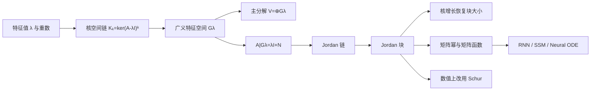

# 广义特征向量与 Jordan 结构

> [!abstract] 本章主问题
> 当代数重数承诺的方向没有全部出现在普通特征空间中时，缺失自由度去了哪里？普通特征向量被 $A-\lambda I$ 一步消去；广义特征向量允许经过有限步才归零。若特征多项式在当前域上分裂，空间可分解为广义特征空间的直和，每个部分都是“标量伸缩 $\lambda I$ + 幂零耦合 $N$”，Jordan 链和块长精确编码方向间的单向耦合。

> [!warning] 本章的双重定位
> Jordan 形式是理解不可对角化算子、最小多项式、矩阵幂和矩阵函数的精确理论语言；它对微小扰动极其敏感，因此**不是一般浮点矩阵的推荐数值算法**。理论分析与数值计算必须分开。

## 学习目标

完成本章后，应能独立完成以下任务：

1. 解释普通特征向量为什么不足，以及“缺失方向”怎样变成广义特征向量；
2. 定义广义特征向量的阶、广义特征空间和核空间增长链；
3. 证明 $\ker(\boldsymbol A-\lambda\boldsymbol I)^k$ 单调增长，并在有限维中稳定；
4. 证明广义特征空间对 $\boldsymbol A$ 不变，并把其限制写成 $\lambda\boldsymbol I+\boldsymbol N$；
5. 正确陈述广义特征空间直和分解所需的**分裂条件**；
6. 定义 Jordan 链、Jordan 块与 Jordan 基，并证明一条 Jordan 链线性无关；
7. 理解幂零算子存在 Jordan 基的完整证明结构；
8. 从 $\dim\ker(\boldsymbol A-\lambda\boldsymbol I)^k$ 的增长唯一恢复 Jordan 块大小；
9. 证明代数重数、几何重数、最小多项式指数分别编码“总块大小、块数量、最大块大小”；
10. 推导 Jordan 块的整数幂、矩阵指数和一般解析函数公式；
11. 分析 Jordan 块在线性 RNN、状态空间模型和 Neural ODE 中产生的多项式瞬态；
12. 用具体扰动解释为什么数值计算应转向 Schur 形式和不变子空间。

> [!question] 初学者读完必须能回答
> 1. 普通特征向量与 $k$ 阶广义特征向量分别满足什么核条件？
> 2. $K_k=\ker(A-\lambda I)^k$ 为什么单调增长并最终稳定？
> 3. 一条 Jordan 链为何线性无关，箭头方向表达什么算子作用？
> 4. 代数重数、几何重数和最小多项式指数分别编码块的什么信息？
> 5. 核维数增量怎样恢复不同长度 Jordan 块的数量？
> 6. 为什么广义特征空间直和分解仍需要特征多项式分裂？
> 7. $J=\lambda I+N$ 怎样在 $J^k$、$e^{tJ}$ 与 $f(J)$ 中产生导数和多项式因子？
> 8. Jordan 形为何适合精确理论，却不适合一般浮点计算？

![[00-知识库管理/_assets/figures/eigen/fig-jordan-chain-kernel-growth-v2.svg|880]]

> [!figure] 图 1　Jordan 链、核空间增长与多项式瞬态
> 左栏展示幂零部分 $N=A-\lambda I$ 逐级把 $v_3$ 送到 $v_2,v_1,0$；中栏展示 $\ker N^k$ 的增长阶梯；右栏连接块长、最小多项式、矩阵幂与指数。**来源：**依据 Jordan 链、核增长恢复定理及本章所引苏剑林线性 RNN/矩阵指数文章独立绘制。

**怎样读图。** 先沿左栏箭头施加 $N$，箭头不表示时间，而表示一次算子作用。再看中栏：$K_1$ 只有普通特征向量，更高 $K_k$ 逐步收回链上游方向；维数增量记录块的长度分布。最后看右栏，$N^s=0$ 截断二项式和指数级数，因此块长 $s$ 带来最高 $s-1$ 次多项式因子。

**适用边界（图没有证明什么）。** 图描述精确代数结构，不表示 Jordan 基在数值上可靠。任意微小扰动都可能改变块结构；浮点谱计算应优先使用 Schur 形式、谱簇和不变子空间，Jordan 形则保留为证明、手算与机制解释语言。

## 进入正文前：缺失的特征方向没有消失，而是形成单向耦合链

> [!info] 承接—中心—去路
> - **承接：** [[特征多项式与重数]]用 $a_\lambda-g_\lambda$ 检测普通特征方向缺口，[[特征分解]]说明缺口会使特征向量矩阵不可逆。
> - **中心：** 把 $A$ 在单一特征值部分写成 $\lambda I+N$；普通特征向量一步被 $N$ 消去，广义特征向量经过有限步才归零，方向由 Jordan 链串起。
> - **去路：** [[Schur 分解]]会保留酉坐标而放弃脆弱的 Jordan 块判定；[[矩阵函数与矩阵指数]]则用块长决定需要多少阶标量导数。

### 两遍阅读路线

第一遍只掌握二阶块 $J=I+N$、广义特征向量、Jordan 链、核增长和 $e^{tJ}$。第二遍再读主分解、Jordan 形式存在性、由核维数恢复块、最小多项式与数值不连续性。

全章主线是：

$$
(A-\lambda I)v_1=0,
\qquad
(A-\lambda I)v_{j+1}=v_j,
\qquad
J_r(\lambda)=\lambda I+N,
\quad N^r=0.
$$

### 本章的问题链

1. 代数重数大于几何重数时，缺失方向怎样重新进入一组基？
2. 为什么 $\ker(A-\lambda I)^k$ 单调增长并最终停止？
3. Jordan 链的箭头为什么由广义向量指向普通特征向量？
4. 块数、总块大小和最大块大小分别由哪三个量记录？
5. 幂零部分为什么让矩阵幂和指数出现多项式因子？
6. 为什么精确 Jordan 结构对任意小扰动都可能改变？

### 贯穿例：$J$ 缺少的第二个方向成为链尾

令

$$
J=\begin{bmatrix}1&1\\0&1\end{bmatrix}
=I+N,
\qquad
N=\begin{bmatrix}0&1\\0&0\end{bmatrix},
\qquad
N^2=0.
$$

这里只有一条普通特征方向，因为

$$
Ne_1=0,
\qquad
\ker N=\operatorname{span}\{e_1\}.
$$

但第二个基向量满足

$$
Ne_2=e_1,
\qquad
N^2e_2=0,
$$

所以 $(e_1,e_2)$ 是长度 2 的 Jordan 链。由二项式展开，

$$
J^k=(I+N)^k=I+kN
=\begin{bmatrix}1&k\\0&1\end{bmatrix},
$$

而

$$
e^{tJ}=e^t(I+tN)
=e^t\begin{bmatrix}1&t\\0&1\end{bmatrix}.
$$

特征值只给出 $1^k$ 或 $e^t$ 的指数尺度；Jordan 链额外产生 $k$ 或 $t$ 的多项式瞬态。

### 最小 Jordan 账本

| 结构量 | 对二阶 $J$ 的值 | 解释 |
|---|---:|---|
| 代数重数 $a_1$ | 2 | 所有块大小之和 |
| 几何重数 $g_1$ | 1 | Jordan 块数量 |
| 最小多项式指数 | 2 | 最大块大小 |
| $\dim\ker N$ | 1 | 长度至少 1 的链数 |
| $\dim\ker N^2$ | 2 | 两步内收回全部方向 |

> [!tip] 初学者的停靠点
> 广义特征向量并不满足 $Av=\lambda v$。它满足更弱的“经过若干次 $A-\lambda I$ 后归零”。若把链尾也当成普通特征向量，就无法解释矩阵中的超对角 1 和多项式瞬态。

## 阅读前检查

本章真正依赖三条主线：

- [[特征多项式与重数]]：知道代数重数 $a_\lambda$、几何重数 $g_\lambda$、最小多项式和带分裂条件的可对角化判据；
- [[线性映射]]：能区分抽象算子 $T:V\to V$ 与其坐标矩阵 $\boldsymbol A$；
- [[基与坐标]]：知道换基产生相似矩阵 $\boldsymbol P^{-1}\boldsymbol A\boldsymbol P$。

证明幂零算子存在 Jordan 基时会用到一个很小的对偶空间事实：给定非零向量 $\boldsymbol w$，存在一个线性泛函 $\varphi$ 使 $\varphi(\boldsymbol w)\ne0$。若这一步陌生，可回看[[线性泛函与对偶空间]]；本章会在使用时重新解释。

## 先看一个具体问题：只找到一个特征向量怎么办

考虑三阶矩阵

$$
\boldsymbol J
=
\begin{bmatrix}
\lambda&1&0\\
0&\lambda&1\\
0&0&\lambda
\end{bmatrix}
=
\lambda\boldsymbol I+\boldsymbol N,
\qquad
\boldsymbol N
=
\begin{bmatrix}
0&1&0\\
0&0&1\\
0&0&0
\end{bmatrix}.
$$

由于 $\boldsymbol J$ 是上三角矩阵，

$$
p_{\boldsymbol J}(t)=(t-\lambda)^3,
$$

所以 $\lambda$ 的代数重数是 $3$。但

$$
\boldsymbol N
\begin{bmatrix}x_1\\x_2\\x_3\end{bmatrix}
=
\begin{bmatrix}x_2\\x_3\\0\end{bmatrix},
$$

故

$$
\ker(\boldsymbol J-\lambda\boldsymbol I)
=
\ker\boldsymbol N
=
\operatorname{span}\{\boldsymbol e_1\}.
$$

普通特征向量只能提供一个方向。可是另外两个坐标方向并没有消失：

$$
\begin{aligned}
\boldsymbol N\boldsymbol e_1&=\boldsymbol0,\\
\boldsymbol N\boldsymbol e_2&=\boldsymbol e_1,\\
\boldsymbol N\boldsymbol e_3&=\boldsymbol e_2.
\end{aligned}
$$

继续作用可得

$$
\boldsymbol N^2\boldsymbol e_2=\boldsymbol0,
\qquad
\boldsymbol N^2\boldsymbol e_3=\boldsymbol e_1,
\qquad
\boldsymbol N^3\boldsymbol e_3=\boldsymbol0.
$$

因此：

- $\boldsymbol e_1$ 被 $\boldsymbol N$ 一步消去，是普通特征向量；
- $\boldsymbol e_2$ 被 $\boldsymbol N^2$ 消去，是二阶广义特征向量；
- $\boldsymbol e_3$ 被 $\boldsymbol N^3$ 消去，是三阶广义特征向量。

它们形成一条链：

$$
\boldsymbol e_3
\xmapsto{\ \boldsymbol A-\lambda\boldsymbol I\ }
\boldsymbol e_2
\xmapsto{\ \boldsymbol A-\lambda\boldsymbol I\ }
\boldsymbol e_1
\xmapsto{\ \boldsymbol A-\lambda\boldsymbol I\ }
\boldsymbol0.
$$

开章图已把链作用与核增长阶梯并列。本例中箭头仍是 $N=A-\lambda I$ 的作用而不是时间方向：$e_1\in K_1$，$e_2\in K_2\setminus K_1$，$e_3\in K_3\setminus K_2$。

> [!intuition] 缺失的特征方向去了哪里
> 它们没有变成新的特征值方向，而是成为“喂给前一个方向”的上游向量。普通特征向量看的是静止方向；Jordan 链还记录方向之间的单向耦合。

## 对象、符号与标量域

本章先用抽象算子表述，再随时切换到矩阵：

$$
T:V\to V,
\qquad
\dim V=n<\infty,
\qquad
\mathbb F\in\{\mathbb R,\mathbb C\}.
$$

选择 $V$ 的一组基后，$T$ 的矩阵记为

$$
\boldsymbol A\in\mathbb F^{n\times n}.
$$

| 符号 | 类型 | 含义 |
|---|---|---|
| $\lambda\in\mathbb F$ | 标量 | 一个特征值 |
| $\boldsymbol N_\lambda=\boldsymbol A-\lambda\boldsymbol I$ | $n\times n$ 矩阵 | 把 $\lambda$ 的标量作用从 $\boldsymbol A$ 中移除后的部分 |
| $K_k(\lambda)$ | 子空间 | $\ker(\boldsymbol A-\lambda\boldsymbol I)^k$ |
| $G_\lambda(\boldsymbol A)$ | 子空间 | $\lambda$ 的广义特征空间 |
| $J_r(\lambda)$ | $r\times r$ 矩阵 | 特征值为 $\lambda$、大小为 $r$ 的 Jordan 块 |
| $a_\lambda$ | 正整数 | $\lambda$ 的代数重数 |
| $g_\lambda$ | 正整数 | $\lambda$ 的几何重数 |
| $s_\lambda$ | 正整数 | $\lambda$ 对应的最大 Jordan 块大小 |

> [!warning] 分裂条件不可省略
> 复数域上的特征多项式总能分裂为一次因子，所以每个复方阵都有 Jordan 形式。实数域上不一定如此，例如二维旋转矩阵的特征多项式 $t^2+1$ 在 $\mathbb R$ 上不分裂；它没有实 Jordan 形式，但在 $\mathbb C$ 上可以对角化。

## 一、广义特征向量

> [!definition] 广义特征向量与阶
> 设 $\lambda$ 是 $\boldsymbol A$ 的特征值。非零向量 $\boldsymbol v$ 称为对应于 $\lambda$ 的**广义特征向量**（generalized eigenvector），如果存在正整数 $k$ 使
> $$
> (\boldsymbol A-\lambda\boldsymbol I)^k\boldsymbol v=\boldsymbol0.
> $$
> 满足上式的最小正整数 $k$ 称为 $\boldsymbol v$ 的**阶**或**秩**。本章统一使用“阶”，避免与矩阵 rank 混淆。

当 $k=1$ 时，

$$
(\boldsymbol A-\lambda\boldsymbol I)\boldsymbol v=\boldsymbol0,
$$

所以普通特征向量正是一阶广义特征向量。

### 为什么要求向量非零

零向量对任何 $\lambda$ 和任何 $k$ 都满足

$$
(\boldsymbol A-\lambda\boldsymbol I)^k\boldsymbol0=\boldsymbol0.
$$

若允许零向量，定义就无法识别任何谱结构。因此“广义特征向量”本身要求非零；但广义特征**空间**必须包含零向量。

### 一个二阶例子

令

$$
\boldsymbol A
=
\begin{bmatrix}
2&1\\
0&2
\end{bmatrix},
\qquad
\boldsymbol N=\boldsymbol A-2\boldsymbol I
=
\begin{bmatrix}
0&1\\
0&0
\end{bmatrix}.
$$

则

$$
\boldsymbol N\boldsymbol e_1=\boldsymbol0,
\qquad
\boldsymbol N\boldsymbol e_2=\boldsymbol e_1,
\qquad
\boldsymbol N^2\boldsymbol e_2=\boldsymbol0.
$$

所以 $\boldsymbol e_1$ 是一阶广义特征向量，$\boldsymbol e_2$ 是二阶广义特征向量。二者合起来成为整个 $\mathbb R^2$ 的基，补回了普通特征向量缺少的方向。

### 广义特征向量属于哪个特征值是唯一的

假设非零 $\boldsymbol v$ 同时满足

$$
(\boldsymbol A-\lambda\boldsymbol I)^k\boldsymbol v=\boldsymbol0,
\qquad
(\boldsymbol A-\mu\boldsymbol I)^\ell\boldsymbol v=\boldsymbol0,
$$

且 $\lambda\ne\mu$。多项式 $(t-\lambda)^k$ 与 $(t-\mu)^\ell$ 互素，所以 Bézout 恒等式给出多项式 $p,q$，使

$$
p(t)(t-\lambda)^k+q(t)(t-\mu)^\ell=1.
$$

把 $t$ 替换为 $\boldsymbol A$，再作用于 $\boldsymbol v$：

$$
\begin{aligned}
\boldsymbol v
&=
p(\boldsymbol A)(\boldsymbol A-\lambda\boldsymbol I)^k\boldsymbol v
+q(\boldsymbol A)(\boldsymbol A-\mu\boldsymbol I)^\ell\boldsymbol v\\
&=\boldsymbol0+\boldsymbol0
=\boldsymbol0,
\end{aligned}
$$

与 $\boldsymbol v\ne\boldsymbol0$ 矛盾。因此一个非零广义特征向量不可能同时属于两个不同特征值。

## 二、核空间增长链

固定特征值 $\lambda$，定义

$$
K_k(\lambda)
\triangleq
\ker(\boldsymbol A-\lambda\boldsymbol I)^k,
\qquad k=0,1,2,\ldots,
$$

其中约定

$$
(\boldsymbol A-\lambda\boldsymbol I)^0=\boldsymbol I,
\qquad
K_0(\lambda)=\{\boldsymbol0\}.
$$

### 2.1 为什么核空间单调增长

若 $\boldsymbol v\in K_k(\lambda)$，则

$$
(\boldsymbol A-\lambda\boldsymbol I)^k\boldsymbol v=\boldsymbol0.
$$

再左乘一次 $\boldsymbol A-\lambda\boldsymbol I$：

$$
(\boldsymbol A-\lambda\boldsymbol I)^{k+1}\boldsymbol v
=
(\boldsymbol A-\lambda\boldsymbol I)\boldsymbol0
=
\boldsymbol0.
$$

因此

$$
\boxed{
K_0(\lambda)
\subseteq K_1(\lambda)
\subseteq K_2(\lambda)
\subseteq\cdots
}.
$$

这是一条子空间的递增链。

### 2.2 一旦停止增长，之后永远停止

> [!theorem] 核空间稳定性
> 若对某个 $k\ge0$ 有
> $$
> K_k(\lambda)=K_{k+1}(\lambda),
> $$
> 则对所有 $j\ge k$ 都有
> $$
> K_j(\lambda)=K_k(\lambda).
> $$

**证明。** 只需证明

$$
K_{k+2}(\lambda)\subseteq K_{k+1}(\lambda),
$$

反复使用同一论证即可。任取 $\boldsymbol v\in K_{k+2}(\lambda)$，令

$$
\boldsymbol w=(\boldsymbol A-\lambda\boldsymbol I)\boldsymbol v.
$$

则

$$
(\boldsymbol A-\lambda\boldsymbol I)^{k+1}\boldsymbol w
=
(\boldsymbol A-\lambda\boldsymbol I)^{k+2}\boldsymbol v
=\boldsymbol0,
$$

所以 $\boldsymbol w\in K_{k+1}(\lambda)$。由假设 $K_{k+1}=K_k$，又有

$$
(\boldsymbol A-\lambda\boldsymbol I)^k\boldsymbol w=\boldsymbol0.
$$

代回 $\boldsymbol w$：

$$
(\boldsymbol A-\lambda\boldsymbol I)^{k+1}\boldsymbol v=\boldsymbol0,
$$

故 $\boldsymbol v\in K_{k+1}(\lambda)$。结合本来就有的 $K_{k+1}\subseteq K_{k+2}$，得到二者相等。$\square$

### 2.3 为什么最多到第 $n$ 步就稳定

每次严格包含

$$
K_k(\lambda)\subsetneq K_{k+1}(\lambda)
$$

都会使维数至少增加 $1$。但所有 $K_k$ 都是 $n$ 维空间 $V$ 的子空间，维数不可能超过 $n$。因此严格增长最多发生 $n$ 次，必有

$$
K_n(\lambda)=K_{n+1}(\lambda)=K_{n+2}(\lambda)=\cdots.
$$

> [!important] 有限维带来的统一指数
> 定义中每个向量似乎可以有自己的指数 $k$；有限维性保证统一用 $n=\dim V$ 就足够。若某个向量会在有限步被消去，那么它一定已经属于 $K_n(\lambda)$。

## 三、广义特征空间

> [!definition] 广义特征空间
> 特征值 $\lambda$ 的广义特征空间定义为
> $$
> G_\lambda(\boldsymbol A)
> =
> \{\boldsymbol v:\exists k\ge1,
> (\boldsymbol A-\lambda\boldsymbol I)^k\boldsymbol v=\boldsymbol0\}.
> $$
> 在 $n$ 维空间中，核空间稳定性给出等价表达
> $$
> \boxed{
> G_\lambda(\boldsymbol A)
> =
> \ker(\boldsymbol A-\lambda\boldsymbol I)^n
> }.
> $$

定义集合中包含 $\boldsymbol0$；所有非零元素才叫对应于 $\lambda$ 的广义特征向量。

普通特征空间是

$$
E_\lambda(\boldsymbol A)
=
\ker(\boldsymbol A-\lambda\boldsymbol I)
=K_1(\lambda),
$$

所以

$$
E_\lambda(\boldsymbol A)
\subseteq
G_\lambda(\boldsymbol A).
$$

### 3.1 为什么它确实是子空间

用

$$
G_\lambda(\boldsymbol A)
=
\ker(\boldsymbol A-\lambda\boldsymbol I)^n
$$

即可立即看出它是线性映射的零空间，因此是子空间。若直接从“存在某个 $k$”的定义证明，则两个向量可能对应不同指数，需要取两者指数的最大值；有限维表达避免了这个小麻烦。

### 3.2 对 $\boldsymbol A$ 的不变性

> [!theorem] 广义特征空间是不变子空间
> 对任意 $\boldsymbol v\in G_\lambda(\boldsymbol A)$，都有
> $$
> \boldsymbol A\boldsymbol v\in G_\lambda(\boldsymbol A).
> $$

**证明。** 因为 $\boldsymbol A$ 与 $\boldsymbol A-\lambda\boldsymbol I$ 都是 $\boldsymbol A$ 的多项式，所以它们可交换：

$$
(\boldsymbol A-\lambda\boldsymbol I)^n\boldsymbol A
=
\boldsymbol A(\boldsymbol A-\lambda\boldsymbol I)^n.
$$

若 $\boldsymbol v\in G_\lambda$，则

$$
\begin{aligned}
(\boldsymbol A-\lambda\boldsymbol I)^n(\boldsymbol A\boldsymbol v)
&=
\boldsymbol A(\boldsymbol A-\lambda\boldsymbol I)^n\boldsymbol v\\
&=\boldsymbol A\boldsymbol0\\
&=\boldsymbol0.
\end{aligned}
$$

故 $\boldsymbol A\boldsymbol v\in G_\lambda$。$\square$

### 3.3 在广义特征空间上，算子是“标量 + 幂零”

在 $G_\lambda$ 上定义限制算子

$$
\boldsymbol N_\lambda
=
(\boldsymbol A-\lambda\boldsymbol I)|_{G_\lambda}.
$$

因为

$$
\boldsymbol N_\lambda^n=\boldsymbol0,
$$

所以 $\boldsymbol N_\lambda$ 是幂零算子。于是

$$
\boxed{
\boldsymbol A|_{G_\lambda}
=
\lambda\boldsymbol I+\boldsymbol N_\lambda,
\qquad
\boldsymbol N_\lambda^n=\boldsymbol0
}.
$$

这就是整章的核心结构：$\lambda$ 决定指数伸缩/旋转率，$\boldsymbol N_\lambda$ 决定同一特征值内部的链式耦合。

## 四、幂零算子

> [!definition] 幂零
> 若线性算子 $N:V\to V$ 满足
> $$
> N^m=0
> $$
> 对某个正整数 $m$ 成立，则称 $N$ 是**幂零算子**（nilpotent operator）。满足该式的最小正整数 $m$ 称为幂零指数。

若 $\dim V=n$，则幂零算子总满足

$$
N^n=0.
$$

这由核空间链

$$
\ker N\subseteq\ker N^2\subseteq\cdots
$$

的稳定性直接得到。

### 4.1 幂零算子的特征值只能是零

若

$$
N\boldsymbol v=\lambda\boldsymbol v,
\qquad
\boldsymbol v\ne\boldsymbol0,
$$

则

$$
N^m\boldsymbol v=\lambda^m\boldsymbol v.
$$

左边为零，所以 $\lambda^m\boldsymbol v=\boldsymbol0$。因 $\boldsymbol v\ne0$，得到 $\lambda=0$。

反过来，“唯一特征值是 $0$”要谨慎解释：

- 若特征多项式在当前标量域上分裂，且全部特征值都是 $0$，则 Cayley–Hamilton 给出 $p_N(t)=t^n$，从而 $N^n=0$；
- 在 $\mathbb R$ 上若只说“唯一的**实**特征值是 $0$”，可能还藏有非实特征值，因此不能推出幂零。

例如

$$
\begin{bmatrix}
0&0&0\\
0&0&-1\\
0&1&0
\end{bmatrix}
$$

的唯一实特征值是 $0$，但它包含一个旋转块，不是幂零矩阵。

## 五、广义特征空间分解

> [!theorem] 主分解定理：分裂情形
> 设 $T:V\to V$ 是有限维线性算子，并假设其最小多项式在 $\mathbb F$ 上分裂：
> $$
> m_T(t)
> =
> \prod_{j=1}^{q}(t-\lambda_j)^{s_j},
> $$
> 其中 $\lambda_1,\ldots,\lambda_q$ 两两不同。则
> $$
> \boxed{
> V
> =
> G_{\lambda_1}(T)
> \oplus\cdots\oplus
> G_{\lambda_q}(T)
> }.
> $$
> 每个 $G_{\lambda_j}(T)$ 都对 $T$ 不变，而且
> $$
> (T-\lambda_j I)|_{G_{\lambda_j}(T)}
> $$
> 是幂零算子。

在 $\mathbb C$ 上，代数基本定理保证特征多项式和最小多项式都分裂，因此结论对每个复方阵成立。

### 5.1 证明的多项式工具

记

$$
f_j(t)=(t-\lambda_j)^{s_j},
\qquad
m_T(t)=f_1(t)\cdots f_q(t).
$$

由于 $\lambda_j$ 两两不同，$f_1,\ldots,f_q$ 两两互素。中国剩余定理或重复使用 Bézout 恒等式，可构造多项式 $e_j(t)$，使

$$
e_j(t)\equiv1\pmod{f_j(t)},
\qquad
e_j(t)\equiv0\pmod{f_\ell(t)}\quad(\ell\ne j),
$$

且

$$
e_1(t)+\cdots+e_q(t)\equiv1\pmod{m_T(t)}.
$$

定义算子

$$
P_j=e_j(T).
$$

因为 $m_T(T)=0$，这些算子满足

$$
P_1+\cdots+P_q=I,
\qquad
P_jP_\ell=0\quad(j\ne\ell),
\qquad
P_j^2=P_j.
$$

因此 $P_j$ 是彼此互补的代数投影。

### 5.2 每个投影的像恰是对应广义特征空间

由 $e_j(t)$ 对其他 $f_\ell$ 可整除的构造，可把它写成

$$
e_j(t)=u_j(t)\prod_{\ell\ne j}f_\ell(t).
$$

于是

$$
\begin{aligned}
f_j(T)P_j
&=f_j(T)e_j(T)\\
&=u_j(T)\prod_{\ell=1}^{q}f_\ell(T)\\
&=u_j(T)m_T(T)\\
&=0.
\end{aligned}
$$

所以

$$
\operatorname{im}P_j
\subseteq
\ker f_j(T)
=
\ker(T-\lambda_jI)^{s_j}.
$$

反过来，若 $\boldsymbol v\in\ker f_j(T)$，则对 $\ell\ne j$，$e_\ell(t)$ 含因子 $f_j(t)$，所以 $P_\ell\boldsymbol v=0$。再由 $\sum P_\ell=I$：

$$
\boldsymbol v
=
\sum_{\ell=1}^{q}P_\ell\boldsymbol v
=P_j\boldsymbol v.
$$

故

$$
\ker(T-\lambda_jI)^{s_j}
\subseteq
\operatorname{im}P_j.
$$

两边结合得到

$$
\operatorname{im}P_j
=
\ker(T-\lambda_jI)^{s_j}
=G_{\lambda_j}(T).
$$

最后一个等号值得单独核对。$\ker(T-\lambda_jI)^{s_j}\subseteq G_{\lambda_j}$ 由定义立即成立。反过来，若 $\boldsymbol v\in G_{\lambda_j}$，在由 $\boldsymbol v$ 生成的有限维循环子空间上，$T=\lambda_jI+N$ 且 $N$ 幂零。令

$$
q_j(t)=\prod_{\ell\ne j}(t-\lambda_\ell)^{s_\ell}.
$$

因为 $q_j(\lambda_j)\ne0$，算子

$$
q_j(T)=q_j(\lambda_j)I+\widetilde N
$$

是“非零标量倍恒等 + 幂零”的形式，因此可逆；其逆可由有限 Neumann 级数写出。再由

$$
0=m_T(T)\boldsymbol v
=(T-\lambda_jI)^{s_j}q_j(T)\boldsymbol v
$$

以及两个多项式算子可交换，作用 $q_j(T)^{-1}$ 得

$$
(T-\lambda_jI)^{s_j}\boldsymbol v=0.
$$

所以 $G_{\lambda_j}\subseteq\ker(T-\lambda_jI)^{s_j}$，等号成立。

### 5.3 为什么是直和

任意 $\boldsymbol v\in V$ 都有

$$
\boldsymbol v
=
P_1\boldsymbol v+\cdots+P_q\boldsymbol v,
$$

且 $P_j\boldsymbol v\in G_{\lambda_j}$，所以这些子空间之和覆盖 $V$。

若

$$
\boldsymbol v_1+\cdots+\boldsymbol v_q=0,
\qquad
\boldsymbol v_j\in G_{\lambda_j},
$$

对等式作用 $P_i$。因为 $P_i$ 在自己的像上是恒等，在其他像上为零，得到

$$
\boldsymbol v_i=0.
$$

这对每个 $i$ 都成立，因此和是直和。$\square$

> [!intuition] 频率分组之后再看内部耦合
> 主分解先按不同特征值把空间拆开；每个子空间中只剩一个特征值，复杂性全部压缩为一个幂零算子。Jordan 理论接下来的任务只是理解“幂零算子能由哪些链组成”。

## 六、Jordan 链与 Jordan 块

固定特征值 $\lambda$，记

$$
N=T-\lambda I.
$$

> [!definition] Jordan 链
> 非零向量序列
> $$
> \boldsymbol v_1,\boldsymbol v_2,\ldots,\boldsymbol v_r
> $$
> 称为一条长度为 $r$ 的 Jordan 链，如果
> $$
> N\boldsymbol v_1=\boldsymbol0,
> \qquad
> N\boldsymbol v_{j+1}=\boldsymbol v_j
> \quad(j=1,\ldots,r-1).
> $$

链头 $\boldsymbol v_1$ 是普通特征向量；$\boldsymbol v_j$ 是恰好 $j$ 阶的广义特征向量，因为

$$
N^{j-1}\boldsymbol v_j=\boldsymbol v_1\ne\boldsymbol0,
\qquad
N^j\boldsymbol v_j=\boldsymbol0.
$$

### 6.1 一条 Jordan 链必线性无关

> [!theorem] 链的线性无关性
> Jordan 链 $\boldsymbol v_1,\ldots,\boldsymbol v_r$ 线性无关。

**证明。** 假设

$$
c_1\boldsymbol v_1+\cdots+c_r\boldsymbol v_r=\boldsymbol0.
$$

若并非所有系数都为零，令 $j$ 是满足 $c_j\ne0$ 的最大下标。对等式作用 $N^{j-1}$。对 $i<j$，有

$$
N^{j-1}\boldsymbol v_i=\boldsymbol0,
$$

而

$$
N^{j-1}\boldsymbol v_j=\boldsymbol v_1.
$$

所以

$$
c_j\boldsymbol v_1=\boldsymbol0.
$$

因 $\boldsymbol v_1\ne0$，得到 $c_j=0$，与选择矛盾。故所有系数都为零。$\square$

### 6.2 链在矩阵中长什么样

在有序基

$$
(\boldsymbol v_1,\boldsymbol v_2,\ldots,\boldsymbol v_r)
$$

下，

$$
\begin{aligned}
T\boldsymbol v_1&=\lambda\boldsymbol v_1,\\
T\boldsymbol v_2&=\boldsymbol v_1+\lambda\boldsymbol v_2,\\
&\ \vdots\\
T\boldsymbol v_r&=\boldsymbol v_{r-1}+\lambda\boldsymbol v_r.
\end{aligned}
$$

矩阵的第 $j$ 列是 $T\boldsymbol v_j$ 的坐标，因此得到

$$
\boxed{
J_r(\lambda)
=
\begin{bmatrix}
\lambda&1&0&\cdots&0\\
0&\lambda&1&\ddots&\vdots\\
\vdots&\ddots&\ddots&\ddots&0\\
0&\cdots&0&\lambda&1\\
0&\cdots&\cdots&0&\lambda
\end{bmatrix}
}.
$$

这称为大小为 $r$、特征值为 $\lambda$ 的 Jordan 块。

> [!analysis] Jordan 块公式的七问拆解
> | 问题 | 回答 |
> |---|---|
> | 对角线与超对角线分别保存什么？ | 对角线的 $\lambda$ 保存共同特征值；超对角 1 保存相邻广义特征向量之间的单向幂零耦合。 |
> | 为什么写成 $J_r(\lambda)=\lambda I+N$？ | 标量部分控制指数缩放，幂零部分 $N^r=0$ 控制有限长度链与多项式修正。 |
> | 基的顺序如何决定 1 的位置？ | 采用 $(v_1,\ldots,v_r)$ 且 $Nv_{j+1}=v_j$ 时，第 $j+1$ 列含 $v_j$，所以 1 在超对角线。 |
> | 三种重数怎样读块？ | 代数重数是块大小总和，几何重数是块数，最小多项式中 $(t-\lambda)$ 的指数是最大块长。 |
> | 为什么可对角化是特殊情况？ | 所有块都长 1 时 $N=0$，普通特征向量已经组成基；任何长块都制造方向缺口。 |
> | 矩阵函数为什么出现导数？ | $f(\lambda I+N)$ 的 Taylor 展开因 $N^r=0$ 截断，系数依次为 $f^{(k)}(\lambda)/k!$。 |
> | 为什么不作为浮点算法？ | 微小扰动能拆开重根并改变块长，Jordan 基也可能极端病态；数值计算应使用 Schur 形式与不变子空间。 |

> [!warning] 超对角线还是次对角线
> 本章把链按“特征向量在前、上游向量在后”的顺序写成 $(\boldsymbol v_1,\ldots,\boldsymbol v_r)$，因此 $1$ 出现在**超对角线**。若教材把链顺序反过来，矩阵中的 $1$ 会出现在次对角线；两种约定描述同一结构，不能混着使用。

### 6.3 Jordan 基与 Jordan 形式

> [!definition] Jordan 基
> 若 $V$ 的一组基可以拆成若干条 Jordan 链，则称它是 $T$ 的 Jordan 基。在这组基下，矩阵为若干 Jordan 块的块对角矩阵：
> $$
> \boldsymbol J
> =
> \operatorname{diag}
> \bigl(
> J_{r_1}(\lambda_1),\ldots,J_{r_s}(\lambda_s)
> \bigr).
> $$

若 $\boldsymbol P$ 的列依次是 Jordan 基向量，则

$$
\boldsymbol A=\boldsymbol P\boldsymbol J\boldsymbol P^{-1}.
$$

注意 $\boldsymbol P$ 一般既不正交也不酉，甚至可能极端病态。

## 七、为什么幂零算子一定能拆成 Jordan 链

这是 Jordan 形式存在性的真正核心。下面给出有限维情形的完整证明结构，而不是只引用结论。

> [!theorem] 幂零算子的 Jordan 基定理
> 设 $N:V\to V$ 是有限维幂零算子。则 $V$ 存在一组由 Jordan 链组成的基。

### 7.1 证明策略

对 $\dim V$ 做归纳：

1. 先取出一条最长链，它张成不变子空间 $U$；
2. 构造一个同样对 $N$ 不变的补空间 $W$，使 $V=U\oplus W$；
3. 在更低维的 $W$ 上使用归纳假设；
4. 把 $U$ 的链与 $W$ 的所有链合并。

困难不在“找到一条链”，而在“找到一个**不变**补空间”。任意线性补空间一般不对 $N$ 不变。

### 7.2 取出一条最长链

设 $m$ 是满足 $N^m=0$ 的最小正整数。由最小性，存在 $\boldsymbol u\in V$ 使

$$
N^{m-1}\boldsymbol u\ne\boldsymbol0.
$$

考虑

$$
U
=
\operatorname{span}
\{\boldsymbol u,N\boldsymbol u,\ldots,N^{m-1}\boldsymbol u\}.
$$

列表

$$
\boldsymbol u,N\boldsymbol u,\ldots,N^{m-1}\boldsymbol u
$$

线性无关。证明与 Jordan 链相同：若最高次非零系数对应 $N^j\boldsymbol u$，就作用 $N^{m-1-j}$，只留下非零倍数的 $N^{m-1}\boldsymbol u$。

因此

$$
\dim U=m.
$$

而且 $U$ 对 $N$ 不变，因为

$$
N(N^j\boldsymbol u)=N^{j+1}\boldsymbol u\in U,
$$

最后 $N(N^{m-1}\boldsymbol u)=N^m\boldsymbol u=0$。

把顺序反写为

$$
N^{m-1}\boldsymbol u,
N^{m-2}\boldsymbol u,
\ldots,
N\boldsymbol u,
\boldsymbol u,
$$

就得到一条长度 $m$ 的 Jordan 链。

### 7.3 用线性泛函构造不变补空间

因为 $N^{m-1}\boldsymbol u\ne0$，可把它扩充成 $V$ 的一组基，并定义线性泛函

$$
\varphi\in V'
$$

使

$$
\varphi(N^{m-1}\boldsymbol u)\ne0.
$$

定义

$$
W
=
\{\boldsymbol v\in V:
\varphi(N^k\boldsymbol v)=0,
k=0,1,\ldots,m-1\}.
$$

这是若干线性泛函零空间的交，因此是子空间。

若 $\boldsymbol v\in W$，则对 $k=0,\ldots,m-2$，

$$
\varphi(N^k(N\boldsymbol v))
=
\varphi(N^{k+1}\boldsymbol v)
=0;
$$

而对 $k=m-1$，

$$
\varphi(N^{m-1}(N\boldsymbol v))
=
\varphi(N^m\boldsymbol v)
=0.
$$

所以 $N\boldsymbol v\in W$，即 $W$ 对 $N$ 不变。

### 7.4 证明 $U\cap W=\{0\}$

若存在非零 $\boldsymbol v\in U\cap W$，写成

$$
\boldsymbol v
=
c_0\boldsymbol u+c_1N\boldsymbol u+\cdots+c_{m-1}N^{m-1}\boldsymbol u.
$$

令 $j$ 是最小的满足 $c_j\ne0$ 的下标。作用 $N^{m-1-j}$：

$$
N^{m-1-j}\boldsymbol v
=
c_jN^{m-1}\boldsymbol u,
$$

因为所有更高幂都包含 $N^m$ 而消失。再作用 $\varphi$：

$$
\varphi(N^{m-1-j}\boldsymbol v)
=
c_j\varphi(N^{m-1}\boldsymbol u)
\ne0.
$$

但 $\boldsymbol v\in W$ 要求左边为零，矛盾。因此交只有零向量。

### 7.5 用维数证明 $U+W=V$

定义线性映射

$$
S:V\to\mathbb F^m,
\qquad
S\boldsymbol v
=
\bigl(
\varphi(\boldsymbol v),
\varphi(N\boldsymbol v),
\ldots,
\varphi(N^{m-1}\boldsymbol v)
\bigr).
$$

按定义，

$$
\ker S=W.
$$

秩—零度定理给出

$$
\begin{aligned}
\dim W
&=\dim V-\operatorname{rank}S\\
&\ge\dim V-m,
\end{aligned}
$$

因为 $S$ 的值域位于 $m$ 维空间 $\mathbb F^m$，故 $\operatorname{rank}S\le m$。

已经知道 $U\cap W=\{0\}$ 且 $\dim U=m$，所以

$$
\begin{aligned}
\dim(U\oplus W)
&=\dim U+\dim W\\
&\ge m+(\dim V-m)\\
&=\dim V.
\end{aligned}
$$

但 $U\oplus W$ 是 $V$ 的子空间，维数不可能超过 $\dim V$，因此

$$
V=U\oplus W.
$$

若 $W=\{0\}$，证明结束；否则 $\dim W<\dim V$，且 $N|_W$ 仍幂零。由归纳假设，$W$ 有 Jordan 基。把它与 $U$ 中那条最长链合并，就得到 $V$ 的 Jordan 基。$\square$

> [!important] 证明中真正使用了什么
> 有限维性保证归纳与维数公式；幂零性保证链终止；线性泛函帮助构造**不变**补空间。这个证明并没有假设内积，因此 Jordan 基一般不是正交基。

## 八、Jordan 形式存在定理

> [!theorem] Jordan 形式
> 设 $T:V\to V$ 是有限维线性算子。若特征多项式在 $\mathbb F$ 上分裂，则存在 $V$ 的一组基，使 $T$ 的矩阵是 Jordan 块的块对角矩阵。

**证明路线。**

1. 主分解定理给出
   $$
   V=\bigoplus_{\lambda}G_\lambda(T).
   $$
2. 在每个 $G_\lambda(T)$ 上，
   $$
   T|_{G_\lambda}=\lambda I+N_\lambda,
   $$
   其中 $N_\lambda$ 幂零。
3. 幂零 Jordan 基定理为每个 $N_\lambda$ 提供若干条链。
4. 同一组链对 $T=\lambda I+N_\lambda$ 给出对应特征值为 $\lambda$ 的 Jordan 块。
5. 把所有广义特征空间中的基合并，得到 $V$ 的 Jordan 基。$\square$

### 8.1 复数域与实数域

- **复数域**：每个 $\boldsymbol A\in\mathbb C^{n\times n}$ 都有 Jordan 形式；
- **实数域且特征多项式分裂**：也有实 Jordan 形式；
- **实数域但存在非实特征值**：不能只用实数 Jordan 块覆盖；可复数化，或使用实 Schur 形式中的 $2\times2$ 共轭对块。

### 8.2 可对角化是 Jordan 形式的特殊情况

矩阵可对角化，当且仅当所有 Jordan 块大小都是 $1$。因为

$$
J_1(\lambda)=[\lambda]
$$

没有幂零耦合，而任何 $r>1$ 的块都只提供一个普通特征向量。

## 九、怎样从核空间增长恢复 Jordan 块

“存在 Jordan 形式”还不够。我们还需要回答：不同 Jordan 基会不会给出完全不同的块大小？答案是不会；块的排列可以改变，但每个特征值对应的块大小多重集合由算子唯一决定。

固定特征值 $\lambda$，设其 Jordan 块大小为

$$
r_1,r_2,\ldots,r_b.
$$

定义

$$
d_k(\lambda)
\triangleq
\dim\ker(\boldsymbol A-\lambda\boldsymbol I)^k,
\qquad
d_0(\lambda)=0.
$$

### 9.1 一个块对 $d_k$ 贡献多少维

对大小为 $r$ 的单个 Jordan 块，令

$$
N_r=J_r(\lambda)-\lambda I.
$$

在标准基中，

$$
N_r\boldsymbol e_1=0,
\qquad
N_r\boldsymbol e_j=\boldsymbol e_{j-1}.
$$

因此 $N_r^k$ 消去前 $k$ 个链向量；若 $k\ge r$，则消去整个块。于是

$$
\dim\ker N_r^k
=
\min(k,r).
$$

多个块构成直和，所以维数相加：

$$
\boxed{
d_k(\lambda)
=
\sum_{i=1}^{b}\min(k,r_i)
}.
$$

### 9.2 一阶差分数“长度至少为 $k$ 的块”

定义增长量

$$
\Delta_k(\lambda)
\triangleq
d_k(\lambda)-d_{k-1}(\lambda).
$$

单个大小为 $r_i$ 的块在从 $k-1$ 到 $k$ 时：

- 若 $r_i\ge k$，贡献 $1$ 个新维度；
- 若 $r_i<k$，已完全进入核，不再贡献。

因此

$$
\boxed{
\Delta_k(\lambda)
=
\#\{i:r_i\ge k\}
}.
$$

也就是说，$\Delta_k$ 等于大小至少为 $k$ 的 Jordan 块数量。

### 9.3 二阶差分数“长度恰好为 $k$ 的块”

大小恰好为 $k$ 的块，在“至少为 $k$”的计数中出现，在“至少为 $k+1$”的计数中消失。因此

$$
\boxed{
\#\{i:r_i=k\}
=
\Delta_k(\lambda)-\Delta_{k+1}(\lambda)
}.
$$

这说明只要知道所有 $d_k(\lambda)$，就能唯一恢复块大小。

> [!theorem] Jordan 块大小的唯一性
> 若特征多项式分裂，则 Jordan 形式除块的排列顺序外唯一。对每个 $\lambda$，唯一性由相似不变量
> $$
> \dim\ker(\boldsymbol A-\lambda\boldsymbol I)^k
> $$
> 的序列决定。

这里确实是相似不变量。若

$$
\boldsymbol B=\boldsymbol P^{-1}\boldsymbol A\boldsymbol P,
$$

则

$$
(\boldsymbol B-\lambda\boldsymbol I)^k
=
\boldsymbol P^{-1}(\boldsymbol A-\lambda\boldsymbol I)^k\boldsymbol P.
$$

可逆变换 $\boldsymbol P$ 在两个零空间之间建立双射，因此二者维数相等。

### 9.4 三个最重要的读块规则

由上述公式立刻得到：

$$
\boxed{
\begin{aligned}
a_\lambda
&=\sum_{i=1}^{b}r_i,
&&\text{全部块大小之和},\\
g_\lambda
&=b,
&&\text{Jordan 块数量},\\
s_\lambda
&=\max_i r_i,
&&\text{最大 Jordan 块大小}.
\end{aligned}
}
$$

逐条解释如下。

#### 代数重数：总共占多少维

特征值 $\lambda$ 对应的所有 Jordan 块共同构成 $G_\lambda$，故

$$
\dim G_\lambda
=
\sum_i r_i.
$$

另一方面，Jordan 形式的特征多项式是各块特征多项式之积：

$$
p_{\boldsymbol A}(t)
=
\prod_{\lambda}
(t-\lambda)^{\sum_i r_i}.
$$

所以

$$
\boxed{a_\lambda=\dim G_\lambda}.
$$

这补完了上一章预告的结论。

#### 几何重数：有多少条链

每个 Jordan 块恰好贡献一个位于链头的普通特征向量，因此

$$
\boxed{g_\lambda=d_1(\lambda)=b}.
$$

#### 最小多项式指数：最长链有多长

对一个大小为 $r$ 的块，

$$
(J_r(\lambda)-\lambda I)^r=0,
$$

但

$$
(J_r(\lambda)-\lambda I)^{r-1}\ne0.
$$

为了同时消去所有对应于 $\lambda$ 的块，$(t-\lambda)$ 的指数必须至少等于最大块大小，且取最大块大小就足够。因此

$$
\boxed{
m_{\boldsymbol A}(t)
=
\prod_{\lambda}(t-\lambda)^{s_\lambda},
\qquad
s_\lambda=\max_i r_i
}.
$$

### 9.5 缺陷 $a_\lambda-g_\lambda$ 的结构意义

若块大小为 $r_1,\ldots,r_b$，则

$$
\begin{aligned}
a_\lambda-g_\lambda
&=
\sum_{i=1}^{b}r_i-b\\
&=
\sum_{i=1}^{b}(r_i-1).
\end{aligned}
$$

每条链只有链头是普通特征向量，其余 $r_i-1$ 个向量必须由广义特征向量补齐。因此缺陷正是所有链中“非链头位置”的总数。

> [!warning] $a_\lambda$ 与 $g_\lambda$ 仍不足以确定块大小
> 当 $a_\lambda=4$、$g_\lambda=2$ 时，块可能是 $3+1$，也可能是 $2+2$。前者最小多项式含 $(t-\lambda)^3$，后者只含 $(t-\lambda)^2$。还必须知道核空间增长或最小多项式等更细信息。

## 十、完整手算例子：从核空间增长重建全部块

考虑一个六维算子，其某组基下的矩阵为

$$
\boldsymbol A
=
\operatorname{diag}
\bigl(
J_3(2),
J_1(2),
J_2(-1)
\bigr).
$$

展开写成

$$
\boldsymbol A
=
\begin{bmatrix}
2&1&0&0&0&0\\
0&2&1&0&0&0\\
0&0&2&0&0&0\\
0&0&0&2&0&0\\
0&0&0&0&-1&1\\
0&0&0&0&0&-1
\end{bmatrix}.
$$

### 10.1 特征多项式与代数重数

各 Jordan 块都是上三角矩阵，因此

$$
\begin{aligned}
p_{\boldsymbol A}(t)
&=(t-2)^3(t-2)(t+1)^2\\
&=(t-2)^4(t+1)^2.
\end{aligned}
$$

所以

$$
a_2=4,
\qquad
a_{-1}=2.
$$

### 10.2 几何重数

特征值 $2$ 有两个块 $J_3(2)$ 与 $J_1(2)$，所以

$$
g_2=2.
$$

特征值 $-1$ 有一个块 $J_2(-1)$，所以

$$
g_{-1}=1.
$$

于是 $\boldsymbol A$ 不可对角化。

### 10.3 核空间增长

对 $\lambda=2$：

$$
\begin{aligned}
d_1(2)&=\min(1,3)+\min(1,1)=2,\\
d_2(2)&=\min(2,3)+\min(2,1)=3,\\
d_3(2)&=\min(3,3)+\min(3,1)=4,\\
d_k(2)&=4\quad(k\ge3).
\end{aligned}
$$

增长量是

$$
\Delta_1(2)=2,
\qquad
\Delta_2(2)=1,
\qquad
\Delta_3(2)=1,
\qquad
\Delta_4(2)=0.
$$

所以：

- 大小至少为 $1$ 的块有 $2$ 个；
- 大小至少为 $2$ 的块有 $1$ 个；
- 大小至少为 $3$ 的块有 $1$ 个；
- 大小至少为 $4$ 的块有 $0$ 个。

唯一可能的块大小就是 $3$ 与 $1$。

对 $\lambda=-1$：

$$
d_1(-1)=1,
\qquad
d_2(-1)=2,
\qquad
d_k(-1)=2\quad(k\ge2),
$$

所以只有一个大小为 $2$ 的块。

### 10.4 最小多项式

特征值 $2$ 的最大块大小是 $3$，特征值 $-1$ 的最大块大小是 $2$，因此

$$
\boxed{
m_{\boldsymbol A}(t)
=(t-2)^3(t+1)^2
}.
$$

检查：它整除特征多项式，但比特征多项式少了一个 $(t-2)$ 因子；缺少的那个因子对应额外的 $J_1(2)$，并没有增加最大链长。

### 10.5 从不在 Jordan 形式中的矩阵恢复结构

实际手算题不一定直接给出块。若已经知道特征值及其代数重数，可按下列顺序：

1. 对每个 $\lambda$ 计算
   $$
   d_1,d_2,\ldots
   $$
   直到稳定到 $a_\lambda$；
2. 计算
   $$
   \Delta_k=d_k-d_{k-1};
   $$
3. 用 $\Delta_k$ 读取大小至少为 $k$ 的块数量；
4. 用 $\Delta_k-\Delta_{k+1}$ 读取大小恰好为 $k$ 的块数量；
5. 若需要显式 Jordan 基，再从高阶核空间中挑选链尾并逐步求原像。

> [!warning] 理论恢复与数值恢复不同
> 以上步骤适合精确整数、有理数或符号矩阵。浮点数中，每一步都要用数值 rank 判定零空间维数，而 rank 对阈值敏感；这正是 Jordan 块在数值上难以可靠识别的根源之一。

## 十一、怎样构造显式 Jordan 链

知道块大小后，还要找到基向量。以固定 $\lambda$ 和

$$
N=\boldsymbol A-\lambda\boldsymbol I
$$

为例。

### 11.1 从链尾开始

若需要一条长度 $r$ 的链，应寻找

$$
\boldsymbol v_r
\in
\ker N^r\setminus\ker N^{r-1}.
$$

然后定义

$$
\boldsymbol v_{r-1}=N\boldsymbol v_r,
\quad
\boldsymbol v_{r-2}=N^2\boldsymbol v_r,
\quad\ldots\quad,
\boldsymbol v_1=N^{r-1}\boldsymbol v_r.
$$

由于 $\boldsymbol v_r\notin\ker N^{r-1}$，有 $\boldsymbol v_1\ne0$；又因为 $\boldsymbol v_r\in\ker N^r$，有 $N\boldsymbol v_1=0$。这确实是一条长度 $r$ 的链。

### 11.2 多条链不能随意重复选择

若 $\Delta_r$ 表明存在多条长度至少为 $r$ 的链，需要在商空间

$$
\ker N^r
\Big/
\bigl(\ker N^{r-1}+N\ker N^{r+1}\bigr)
$$

中选择独立代表，以避免新链被旧链生成的子空间吞掉。初学阶段通常通过解线性方程并不断检查所得链向量是否与已有链独立来完成；抽象的商空间公式解释了为什么单纯在 $\ker N^r\setminus\ker N^{r-1}$ 中任取向量可能重复计数。

> [!info] 本章的计算边界
> 手算中，先由 $d_k$ 确定块大小，再构造链，比盲目猜测 $\boldsymbol P$ 更可靠。大型浮点问题则不应显式构造 Jordan 链。

## 十二、Jordan 块的矩阵幂

令

$$
J_r(\lambda)=\lambda I+N,
\qquad
N^r=0.
$$

因为 $\lambda I$ 与 $N$ 可交换，二项式定理适用于矩阵：对整数 $k\ge0$，

$$
\begin{aligned}
J_r(\lambda)^k
&=(\lambda I+N)^k\\
&=\sum_{j=0}^{k}\binom{k}{j}
(\lambda I)^{k-j}N^j\\
&=\sum_{j=0}^{k}\binom{k}{j}
\lambda^{k-j}N^j.
\end{aligned}
$$

由于 $N^j=0$ 对 $j\ge r$ 成立，求和自动截断：

$$
\boxed{
J_r(\lambda)^k
=
\sum_{j=0}^{\min(k,r-1)}
\binom{k}{j}
\lambda^{k-j}N^j
}.
$$

上限写成 $\min(k,r-1)$ 同时表达两种截断：二项式展开本来只有 $j\le k$，幂零性又消去 $j\ge r$ 的项。这样即使 $\lambda=0$，也不会出现无意义的负指数。

### 12.1 二阶块产生线性因子

对

$$
J_2(\lambda)
=
\begin{bmatrix}\lambda&1\\0&\lambda\end{bmatrix},
$$

有 $N^2=0$，所以

$$
J_2(\lambda)^k
=
\lambda^k I+k\lambda^{k-1}N
=
\begin{bmatrix}
\lambda^k&k\lambda^{k-1}\\
0&\lambda^k
\end{bmatrix}.
$$

### 12.2 三阶块产生二次因子

对 $J_3(\lambda)$，$N^3=0$，因此

$$
J_3(\lambda)^k
=
\lambda^k I
+k\lambda^{k-1}N
+\binom{k}{2}\lambda^{k-2}N^2.
$$

最大块大小为 $r$ 时，最强的额外因子大约是 $k^{r-1}$。这就是“谱半径并不描述全部有限时间行为”的精确来源之一。

### 12.3 离散稳定性要同时看 $|\lambda|$ 与块大小

对固定矩阵的渐近行为：

- 若 $|\lambda|<1$，指数衰减最终压过任意固定次数的多项式增长，故对应块幂趋于零；
- 若 $|\lambda|>1$，指数增长主导；
- 若 $|\lambda|=1$ 且块大小 $r>1$，则 $k^{r-1}$ 因子使块幂通常无界；
- 若所有单位圆上的特征值都只有 $1\times1$ 块，并且其余特征值严格在单位圆内，则矩阵幂有界。

因此

$$
\rho(\boldsymbol A)\le1
$$

不是矩阵幂有界的充分条件；还必须排除单位圆上的非平凡 Jordan 块。

## 十三、矩阵指数与一般矩阵函数

Jordan 形式的一个主要理论价值，是把“函数作用于矩阵”还原为标量函数在特征值处的导数。

### 13.1 矩阵指数

由指数级数和 $\lambda I$ 与 $N$ 可交换，

$$
e^{tJ_r(\lambda)}
=
e^{t(\lambda I+N)}
=
e^{\lambda t}e^{tN}.
$$

因为 $N^r=0$，指数级数有限截断：

$$
e^{tN}
=
I+tN+\frac{t^2}{2!}N^2+\cdots+
\frac{t^{r-1}}{(r-1)!}N^{r-1}.
$$

所以

$$
\boxed{
e^{tJ_r(\lambda)}
=
e^{\lambda t}
\sum_{j=0}^{r-1}\frac{t^j}{j!}N^j
}.
$$

连续时间系统

$$
\dot{\boldsymbol h}(t)=\boldsymbol A\boldsymbol h(t)
$$

的解是

$$
\boldsymbol h(t)=e^{t\boldsymbol A}\boldsymbol h(0).
$$

因此大小为 $r$ 的 Jordan 块带来

$$
t^j e^{\lambda t},
\qquad
j=0,\ldots,r-1,
$$

这样的项。

### 13.2 一般解析函数

若标量函数 $f$ 在 $\lambda$ 附近解析，Taylor 展开为

$$
f(\lambda+z)
=
\sum_{j=0}^{\infty}
\frac{f^{(j)}(\lambda)}{j!}z^j.
$$

把 $z$ 替换成幂零矩阵 $N$，所有 $j\ge r$ 的项消失：

$$
\boxed{
f(J_r(\lambda))
=
\sum_{j=0}^{r-1}
\frac{f^{(j)}(\lambda)}{j!}N^j
}.
$$

这揭示两个重要事实：

1. 对角化情形只有 $j=0$，所以只需函数值 $f(\lambda)$；
2. 非平凡 Jordan 块需要导数 $f'(\lambda),f''(\lambda),\ldots$，链越长，需要的导数阶数越高。

### 13.3 多项式的特例

若 $p$ 是多项式，则

$$
p(J_r(\lambda))
=
p(\lambda)I
+p'(\lambda)N
+\cdots+
\frac{p^{(r-1)}(\lambda)}{(r-1)!}N^{r-1}.
$$

要让 $p(J_r(\lambda))=0$，必须有

$$
p(\lambda)=p'(\lambda)=\cdots=p^{(r-1)}(\lambda)=0,
$$

等价于 $(t-\lambda)^r$ 整除 $p(t)$。这从矩阵函数角度再次解释：最小多项式中 $(t-\lambda)$ 的指数就是最大块大小。

## 十四、相似矩阵、Jordan 形式与坐标选择

若

$$
\boldsymbol A=\boldsymbol P\boldsymbol J\boldsymbol P^{-1},
$$

则对任意多项式 $p$，

$$
p(\boldsymbol A)
=
\boldsymbol Pp(\boldsymbol J)\boldsymbol P^{-1}.
$$

若 $f$ 由收敛幂级数定义，同样有

$$
f(\boldsymbol A)
=
\boldsymbol Pf(\boldsymbol J)\boldsymbol P^{-1}.
$$

这在理论上把矩阵函数问题完全化为逐块计算。不过范数估计还会受到

$$
\kappa(\boldsymbol P)
=
\|\boldsymbol P\|\,\|\boldsymbol P^{-1}\|
$$

影响：

$$
\|f(\boldsymbol A)\|
\le
\|\boldsymbol P\|\,
\|f(\boldsymbol J)\|\,
\|\boldsymbol P^{-1}\|.
$$

若 Jordan 基病态，即使块内公式简单，返回原坐标后也可能出现巨大放大。

## 十五、为什么 Jordan 形式数值不稳定

### 15.1 一个任意小扰动会拆开 Jordan 块

从二阶块开始：

$$
\boldsymbol J
=
\begin{bmatrix}
\lambda&1\\
0&\lambda
\end{bmatrix}.
$$

加入一个很小的扰动

$$
\boldsymbol E_\varepsilon
=
\begin{bmatrix}
0&0\\
\varepsilon&0
\end{bmatrix},
\qquad
\|\boldsymbol E_\varepsilon\|_2=|\varepsilon|.
$$

扰动后矩阵为

$$
\boldsymbol J_\varepsilon
=
\begin{bmatrix}
\lambda&1\\
\varepsilon&\lambda
\end{bmatrix}.
$$

其特征多项式是

$$
\begin{aligned}
p_{\boldsymbol J_\varepsilon}(t)
&=
\det
\begin{bmatrix}
t-\lambda&-1\\
-\varepsilon&t-\lambda
\end{bmatrix}\\
&=(t-\lambda)^2-\varepsilon.
\end{aligned}
$$

若 $\varepsilon\ne0$，两个特征值变成

$$
\lambda_\pm
=
\lambda\pm\sqrt{\varepsilon}
$$

（复数情形选择平方根的两个分支）。它们通常不同，于是矩阵立刻变成可对角化。扰动大小是 $O(|\varepsilon|)$，而特征值分裂是 $O(\sqrt{|\varepsilon|})$；在 $\varepsilon=0$ 附近甚至不是通常的线性响应。

### 15.2 “块大小”不是连续量

精确的 $J_2(\lambda)$ 有一个大小为 $2$ 的块；任意小的典型扰动后，会出现两个大小为 $1$ 的块。Jordan 块划分发生离散跳变，因此不能期望从含舍入误差的数据中稳定判断“精确块大小”。

### 15.3 rank 判定会层层放大不确定性

恢复块需要判断

$$
\dim\ker(\boldsymbol A-\lambda\boldsymbol I)^k.
$$

在浮点数中必须通过奇异值和阈值决定“哪些量算零”。当矩阵接近缺陷时：

- $\lambda$ 本身已有误差；
- 减法 $\boldsymbol A-\lambda\boldsymbol I$ 会改变小奇异值；
- 取幂可能放大舍入与尺度问题；
- 轻微改变阈值就可能改变 nullity，从而改变推断的块数量。

所以“软件给出的 Jordan 块”若没有精确代数输入、容差说明和条件分析，不能当作可靠数值事实。

### 15.4 数值上用什么替代

对一般稠密浮点矩阵，优先使用

$$
\boldsymbol A
=
\boldsymbol Q\boldsymbol T\boldsymbol Q^*
$$

的 Schur 分解：

- 复数情形 $\boldsymbol Q$ 酉，$\boldsymbol T$ 上三角；
- 实数情形 $\boldsymbol Q$ 正交，$\boldsymbol T$ 是带 $1\times1$ 与 $2\times2$ 对角块的准上三角矩阵；
- $\boldsymbol Q^{-1}=\boldsymbol Q^*$，不会引入病态换基；
- 需要一组接近/重复特征值时，更适合研究对应的不变子空间，而不是单个不稳定特征向量。

LAPACK 的 `xHSEQR` 系列正是从 Hessenberg 形式计算特征值与 Schur 形式，而不是计算 Jordan 形式。后续[[Schur 分解]]会系统展开这一数值替代。

> [!warning] 不要从“Jordan 不稳定”误推“Jordan 没用”
> 它在精确分类、证明矩阵函数公式、理解最小多项式和构造反例方面极其有力。需要拒绝的是把它当作一般浮点数据的稳定诊断工具，而不是拒绝这套理论语言。

## 十六、与正规矩阵和谱定理的关系

若 $\boldsymbol A$ 是实对称、复 Hermitian 或更一般的正规矩阵，[[定理 - 有限维谱定理]]给出酉对角化：

$$
\boldsymbol A
=
\boldsymbol U\boldsymbol\Lambda\boldsymbol U^*,
\qquad
\boldsymbol U^*\boldsymbol U=\boldsymbol I.
$$

因此正规矩阵的所有 Jordan 块都是 $1\times1$。即使特征值重复，也只是对应一个更高维的正交特征空间，不会出现非平凡 Jordan 链。

可用一个直接论证看出这一点。若正规矩阵存在长度为 $2$ 的链，令

$$
(\boldsymbol A-\lambda I)\boldsymbol v_2=\boldsymbol v_1,
\qquad
(\boldsymbol A-\lambda I)\boldsymbol v_1=0.
$$

正规性保证

$$
\ker(\boldsymbol A-\lambda I)
=
\ker(\boldsymbol A^*-\overline\lambda I).
$$

于是

$$
\begin{aligned}
\|\boldsymbol v_1\|^2
&=\langle\boldsymbol v_1,\boldsymbol v_1\rangle\\
&=\langle(\boldsymbol A-\lambda I)\boldsymbol v_2,
\boldsymbol v_1\rangle\\
&=\langle\boldsymbol v_2,
(\boldsymbol A^*-\overline\lambda I)\boldsymbol v_1\rangle\\
&=0,
\end{aligned}
$$

推出 $\boldsymbol v_1=0$，矛盾。因此不存在非平凡链。

这也是为什么协方差矩阵、Gram 矩阵和对称 Hessian 在精确数学中不需要 Jordan 块；它们的困难来自重复谱下的子空间非唯一性、谱间隙和数值误差，而不是缺陷结构。

## 十七、AI 中的直接连接

### 17.1 离散状态传播：RNN 与线性状态空间层

考虑

$$
\boldsymbol h_{k+1}
=
\boldsymbol A\boldsymbol h_k,
\qquad
\boldsymbol h_k\in\mathbb F^n,
\qquad
\boldsymbol A\in\mathbb F^{n\times n}.
$$

于是

$$
\boldsymbol h_k=\boldsymbol A^k\boldsymbol h_0.
$$

若某个不变子空间上有 $J_r(\lambda)$，状态中会出现

$$
\binom{k}{j}\lambda^{k-j},
\qquad
j=0,\ldots,r-1.
$$

这意味着：

| 谱位置 | Jordan 结构 | 状态行为 |
|---|---|---|
| $|\lambda|<1$ | 任意固定块大小 | 最终衰减，但可有较长多项式瞬态 |
| $|\lambda|=1$ | 只有 $1\times1$ 块 | 对应分量可有界振荡或保持 |
| $|\lambda|=1$ | 存在 $r>1$ 的块 | 典型增长为 $k^{r-1}$，不再有界 |
| $|\lambda|>1$ | 任意块 | 指数增长，并叠加多项式因子 |

对反向传播，若同一状态转移反复出现，梯度也会包含 $\boldsymbol A^{*k}$ 或相邻 Jacobian 的乘积。因此仅看谱半径不足以描述短期梯度放大；链结构与更一般的非正规性都会产生瞬态。

### 17.2 连续深度模型与 Neural ODE

线性化后的连续系统

$$
\dot{\boldsymbol h}(t)
=
\boldsymbol A\boldsymbol h(t)
$$

具有传播算子 $e^{t\boldsymbol A}$。Jordan 块贡献

$$
t^j e^{\lambda t}.
$$

因此 $\operatorname{Re}\lambda<0$ 给出最终指数衰减，但接近虚轴且链较长时，有限时间内仍可能出现明显多项式延迟或放大。这里 Jordan 公式提供精确解析模型；实际大规模求 $e^{t\boldsymbol A}\boldsymbol v$ 时通常使用 Krylov、缩放平方或 Schur 方法，而不是显式 Jordan 分解。

### 17.3 矩阵函数与可学习算子

图神经网络、谱滤波、状态空间模型和隐式层中经常出现

$$
p(\boldsymbol A)\boldsymbol x,
\quad
e^{t\boldsymbol A}\boldsymbol x,
\quad
(z\boldsymbol I-\boldsymbol A)^{-1}\boldsymbol x.
$$

Jordan 结构说明：对非对角化部分，函数不仅依赖特征值处的函数值，还依赖导数。两个矩阵即使拥有相同特征值多重集合，只要 Jordan 块不同，$f(\boldsymbol A)$ 就可能不同。

### 17.4 Krylov 子空间与最小多项式

给定起始向量 $\boldsymbol b$，Krylov 子空间为

$$
\mathcal K_m(\boldsymbol A,\boldsymbol b)
=
\operatorname{span}
\{\boldsymbol b,
\boldsymbol A\boldsymbol b,
\ldots,
\boldsymbol A^{m-1}\boldsymbol b\}.
$$

最长 Jordan 链决定最小多项式所需的最高指数，也影响 Krylov 序列何时出现精确线性依赖。这个联系会在后续[[Krylov 子空间与预条件]]中从算法角度重建。

### 17.5 可微特征分解的边界

深度学习框架中的一般特征分解通常假设输入可对角化；当特征值重复或非常接近时，单个特征向量不是稳定对象。以 PyTorch 官方文档为例，`torch.linalg.eig` 明确提醒：使用特征向量计算的梯度只有在特征值互异时才保证有限，特征值间距接近零时梯度会数值不稳定。

Jordan 理论解释极端端点：在缺陷矩阵处甚至没有完整特征向量基。工程上应优先问：

- 损失是否真的需要单个特征向量，还是只需要不变子空间或特征值函数？
- 输入是否具有对称/Hermitian 结构，可改用 `eigh`？
- 重复谱附近是否应该对整个子空间定义目标，而不是固定一个任意基？

### 17.6 对称 Hessian 与协方差：不要误用 Jordan 解释

精确的实对称 Hessian、协方差矩阵和 Gram 矩阵都可正交对角化，不会出现非平凡 Jordan 块。重复特征值意味着对应子空间内基不唯一，而不是“少了特征向量”。

若实际代码得到一个明显非对称的近似 Hessian，可能来自：

- 随机估计噪声；
- 只实现了近似曲率算子；
- 浮点误差或算子实现不一致；
- 对非保守更新场求了 Jacobian，而不是标量损失的 Hessian。

应先核对对象，再决定使用 Jordan/非正规分析还是对称谱理论。

## 十八、与科学空间材料的接口

科学空间目前没有一篇以“广义特征向量与 Jordan 定理”为主线的文章，但有三组材料直接调用了本章的后继对象。它们适合作为应用阅读，不替代本章的教材级存在性证明。

### 18.1 矩阵指数与 RoPE

苏剑林在[《Transformer升级之路：4、二维位置的旋转式位置编码》](https://spaces.ac.cn/archives/8397)中从幂级数定义矩阵指数，并用

$$
e^{t\boldsymbol A}
$$

描述常系数线性微分方程的传播。本文第十三节补上不可对角化情形：若 $\boldsymbol A$ 含 $J_r(\lambda)$，指数不只是 $e^{\lambda t}$，还会出现

$$
t^j e^{\lambda t},
\qquad 0\le j\le r-1.
$$

### 18.2 HiPPO/SSM 中的可对角化特例

[《重温SSM（二）：HiPPO的一些遗留问题》](https://spaces.ac.cn/archives/10137)研究的有限维 LegS 状态矩阵是三角矩阵，且对角线上给出两两不同的特征值，因此它确实可对角化。该文章随后通过矩阵指数分析记忆衰减。

本章负责说明逻辑边界：

$$
\text{三角矩阵}
\not\Rightarrow
\text{可对角化},
$$

真正起作用的是“有足够多线性无关特征向量”；两两不同特征值是一个充分条件。若状态矩阵出现重复且缺陷的特征值，就必须使用广义特征向量或 Schur 形式，传播中还会多出多项式因子。

### 18.3 线性 RNN 的对角参数化边界

[《Google新作试图“复活”RNN：RNN能否再次辉煌？》](https://spaces.ac.cn/archives/9554)使用

$$
\boldsymbol A
=
\boldsymbol P^{-1}\boldsymbol\Lambda\boldsymbol P
$$

解释把线性 RNN 的状态矩阵改写为复对角形式。这里必须区分两种命题：

1. **对一个已经可对角化的矩阵做等价换基**：上式成立；
2. **把模型直接参数化为对角状态矩阵**：这是模型设计选择，计算高效，但不能由“复数域”单独推出每个一般矩阵都与对角矩阵相似。

复数域保证特征多项式分裂，从而保证 Jordan 形式存在；它不保证所有 Jordan 块都是 $1\times1$。这个细小但关键的区别，正是本章相对于应用文章的理论补全。

## 十九、前沿地位与研究边界

| 内容 | 知识地位 | 本章怎样使用 |
|---|---|---|
| 广义特征空间分解与 Jordan 存在性 | 经典定理 | 给出条件、证明路线与块恢复公式 |
| Schur 分解作为通用数值接口 | 已建立方法 | 作为浮点一般矩阵的默认替代 |
| Jordan 块导致多项式乘指数项 | 经典定理 | 精确分析线性离散/连续动力学 |
| 训练出的网络权重“接近某个 Jordan 块” | 需条件化的经验判断 | 必须结合奇异值、伪谱、扰动与阈值，不由 eig 输出直接断言 |
| 用缺陷性解释所有梯度爆炸 | 错误泛化 | 梯度还受非正规性、时变 Jacobian、非线性与优化轨迹影响 |

Jordan 块是非正规动力学的一个极端、可解析模型，但一般非正规矩阵即使可对角化，也能因病态特征基产生巨大瞬态。后续[[矩阵扰动]]、[[Schur 分解]]和伪谱相关节点会把这个边界展开。

## 二十、常见误区与最小修正

1. **把广义特征向量当成新的特征值方向**：它属于已有特征值，经过若干次 $\boldsymbol A-\lambda I$ 才归零。
2. **忘记非零条件**：零向量属于广义特征空间，但不叫广义特征向量。
3. **认为每个广义特征向量都不是普通特征向量**：普通特征向量正是一阶广义特征向量。
4. **只算 $a_\lambda$ 和 $g_\lambda$ 就断定全部块大小**：$4=3+1=2+2$ 且两种划分都有两个块。
5. **认为代数重数等于最大块大小**：代数重数是所有块大小之和；最大块大小由最小多项式指数给出。
6. **认为几何重数等于最大块大小**：几何重数是块数量。
7. **把链的顺序与矩阵中 $1$ 的位置混淆**：先声明链顺序，再逐列写 $T\boldsymbol v_j$。
8. **在实数域无条件声称存在 Jordan 形式**：必须要求特征多项式分裂，或转到复数域。
9. **认为相同特征多项式意味着相似**：还需核空间增长序列/块大小等信息。
10. **认为 Jordan 基可以取正交**：只有所有块都是 $1\times1$ 且算子满足相应正规条件时，才有酉/正交特征基。
11. **把精确 Jordan 形式当成浮点诊断**：任意小扰动可改变块划分。
12. **只看 $\rho(\boldsymbol A)$ 判断所有时间尺度**：Jordan 多项式因子和一般非正规瞬态仍可能主导有限时间。
13. **把重复特征值自动等同于缺陷**：$\lambda I$ 有重复特征值但完全可对角化。
14. **把数值上接近的特征值直接合并成重根**：需要误差模型、容差、后向误差与结构信息。

## 二十一、本节回顾

### 21.1 概念主线

### 21.2 必须能回答的十个问题

1. 广义特征向量与普通特征向量差在哪里？
2. 为什么 $K_k\subseteq K_{k+1}$？
3. 为什么有限维中 $G_\lambda=K_n$？
4. 为什么 $G_\lambda$ 对 $\boldsymbol A$ 不变？
5. 广义特征空间直和分解需要什么标量域条件？
6. 为什么 Jordan 链必线性无关？
7. 幂零算子的 Jordan 基证明中，不变补空间怎样构造？
8. $d_k-d_{k-1}$ 为什么等于大小至少为 $k$ 的块数？
9. 代数重数、几何重数和最小多项式指数分别读什么？
10. 为什么 Jordan 形式理论上精确、数值上却不可靠？

### 21.3 一页公式表

$$
\begin{aligned}
G_\lambda(\boldsymbol A)
&=\ker(\boldsymbol A-\lambda I)^n,\\
V
&=\bigoplus_\lambda G_\lambda,\\
\boldsymbol A|_{G_\lambda}
&=\lambda I+N_\lambda,
\qquad N_\lambda^{s_\lambda}=0,\\
d_k(\lambda)
&=\sum_i\min(k,r_i),\\
d_k-d_{k-1}
&=\#\{i:r_i\ge k\},\\
a_\lambda
&=\sum_i r_i=\dim G_\lambda,\\
g_\lambda
&=\#\text{Jordan blocks for }\lambda,\\
m_{\boldsymbol A}(t)
&=\prod_\lambda(t-\lambda)^{\max_i r_i},\\
J_r(\lambda)^k
&=\sum_{j=0}^{\min(k,r-1)}\binom{k}{j}\lambda^{k-j}N^j,\\
f(J_r(\lambda))
&=\sum_{j=0}^{r-1}\frac{f^{(j)}(\lambda)}{j!}N^j.
\end{aligned}
$$

## 二十二、练习、后继与来源

- 分层训练：[[习题 - 广义特征向量与 Jordan 结构]]；
- 独立详解：[[解答 - 广义特征向量与 Jordan 结构]]；
- 前一节点：[[特征多项式与重数]]；
- 数值后继：[[Schur 分解]]；
- 函数后继：[[矩阵函数与矩阵指数]]；
- 稳定性后继：[[矩阵扰动]]；
- 上级导航：[[线性代数 MOC]]与[[数学基础 MOC]]。

### 主要来源

1. Sheldon Axler, [*Linear Algebra Done Right*, 4th ed.](https://linear.axler.net/LADR4e.pdf), Sections 8A–8C：广义特征向量、广义特征空间分解、幂零算子与 Jordan 基的证明。
2. 苏剑林，[二维 RoPE](https://spaces.ac.cn/archives/8397)、[HiPPO/SSM 遗留问题](https://spaces.ac.cn/archives/10137)、[线性 RNN 复对角参数化](https://spaces.ac.cn/archives/9554)：矩阵指数、状态传播与对角化在 AI 中的调用场景；本章补充其分裂/可对角化边界。
3. LAPACK, [*Eigenvalues, Eigenvectors and Schur Factorization*](https://www.netlib.org/lapack/lug/node50.html) 与 [DHSEQR](https://www.netlib.org/lapack/explore-html/d9/dc6/group__hseqr_ga62c3f96d2f67f96d6dc10334e118e451.html)：一般非对称特征问题的 Schur 数值接口。
4. PyTorch, [`torch.linalg.eig`](https://docs.pytorch.org/docs/main/generated/torch.linalg.eig.html)：一般特征分解的可对角化边界，以及重复/接近特征值下特征向量梯度的警告。

> [!note] 来源分工
> 教材承担定义与存在性证明；官方数值库和框架文档承担算法接口与自动微分边界。本章中的核空间差分恢复公式、扰动手算和 AI 动力学解释均已按统一符号重新推导，而不是把来源段落直接拼接。
