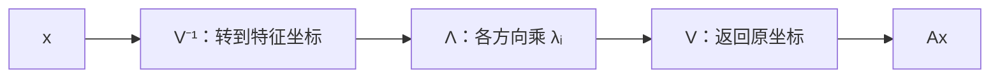

# 特征分解

> [!abstract] 本章主问题
> 什么时候一个耦合线性算子可以改写成若干彼此独立的标量模式？特征向量是在算子作用下方向不变的向量；只有它们能组成一组基时，才得到 $A=V\Lambda V^{-1}$。这使矩阵幂、动力系统和矩阵函数化为逐特征值计算，但一般矩阵可能在当前域上不分裂、缺少特征向量，或拥有极度病态的非正交特征基。

## 学习目标

完成本章后，你应能：

1. 从 $Av=\lambda v$ 解释特征方向、不变直线与特征空间；
2. 用 $\det(A-\lambda I)=0$ 和核空间手算小矩阵特征对；
3. 证明不同特征值的特征向量线性无关；
4. 判断矩阵何时可对角化，并区分代数重数与几何重数；
5. 从 $AV=V\Lambda$ 推导 $A=V\Lambda V^{-1}$ 与 $A^k$；
6. 识别 Jordan 块、实旋转和病态特征基三类失败边界；
7. 区分特征值、奇异值、谱半径与谱范数；
8. 说明 RNN/SSM、Hessian 和协方差中谱结论的适用层次；
9. 理解数值算法为什么优先 Schur/子空间，而非显式 Jordan 形。

> [!question] 初学者读完必须能回答
> 1. 为什么特征值只对 $V\to V$ 的算子定义，矩形矩阵应转向 SVD？
> 2. $Av=\lambda v$ 如何表达不变直线与沿该方向的缩放？
> 3. 不同特征值的特征向量为什么线性无关？
> 4. 从 $AV=V\Lambda$ 到 $A=V\Lambda V^{-1}$ 还需要什么条件？
> 5. 特征多项式分裂、几何重数和可对角化之间是什么关系？
> 6. 对角化后为何 $A^k$ 与矩阵函数变得简单？
> 7. 不分裂、缺陷和病态特征基是三种怎样不同的失败？
> 8. 对称/正规矩阵为什么比一般可对角化矩阵数值上更安全？

![[00-知识库管理/_assets/figures/eigendecomposition/fig-eigenbasis-coordinate-dynamics-failures-v2.svg|880]]

> [!figure] 图 1　特征方向、特征坐标与分解失败边界
> 左侧展示算子沿两条特征方向只做缩放；右上展示先用 $V^{-1}$ 换到特征坐标、用 $\Lambda$ 独立缩放；右下区分不分裂、缺陷与病态三类失败。**来源：**依据特征基对角化与一般矩阵的基本反例独立绘制。

**怎样读图。** 先在左侧固定一条特征方向：算子可以改变长度和符号，却不把向量旋出这条直线。若能找到一整组特征基，就沿右上路径把一般向量分解成特征坐标，让每个坐标独立乘 $\lambda_i$。最后逐项检查右下三道门：当前域是否有全部根、特征向量是否足够、特征基是否良态。

**适用边界（图没有证明什么）。** 图的 $A=V\Lambda V^{-1}$ 只适用于可对角化算子；$V^{-1}$ 不等于 $V^*$，除非特征基可取酉/正交。即使分解在精确代数中存在，若 $V$ 条件数很大，显式特征坐标计算仍可能放大误差；一般数值入口通常是 Schur 分解。

## 进入正文前：对角化是在寻找一套让模式彼此解耦的坐标

> [!info] 承接—中心—去路
> - **承接：** [[特征多项式与重数]]给出候选特征值与每个特征空间，但还没有回答这些空间能否覆盖整个状态空间。
> - **中心：** 若能从所有特征空间中取出一组基，算子在这套坐标中只对每个分量独立缩放，得到 $A=V\Lambda V^{-1}$。
> - **去路：** [[定理 - 有限维谱定理]]将进一步问 $V$ 能否取成条件数为 1 的酉/正交矩阵；[[广义特征向量与 Jordan 结构]]处理 $V$ 不可逆；[[Schur 分解]]处理一般浮点矩阵。

### 两遍阅读路线

第一遍掌握特征方向、$AV=V\Lambda$、可对角化判据和矩阵幂。第二遍再读非正交特征基的条件数、谱投影、特征值/奇异值边界和数值验收。

全章主线是：

$$
Av_i=\lambda_i v_i
\quad\forall i
\Longrightarrow
AV=V\Lambda;
\qquad
V\text{ 可逆}
\Longrightarrow
A=V\Lambda V^{-1}.
$$

### 本章的问题链

1. 特征向量为什么对应一维不变子空间？
2. 多条特征方向什么时候能组成整个空间的基？
3. 从列式 $AV=V\Lambda$ 到相似分解还缺哪一步？
4. 对角化怎样把矩阵幂、递推与矩阵函数化成标量模式？
5. 不分裂、缺陷和病态特征基为何是三种不同失败？
6. 可对角化为什么不保证正交对角化或数值稳定？

### 用 $S,B,J$ 区分三道门

对称矩阵

$$
S=\begin{bmatrix}2&1\\1&2\end{bmatrix}
$$

有单位特征向量

$$
q_1=\frac1{\sqrt2}(1,1)^T,
\qquad
q_2=\frac1{\sqrt2}(1,-1)^T,
$$

所以

$$
S=Q\operatorname{diag}(3,1)Q^T.
$$

矩阵

$$
B=\begin{bmatrix}3&1\\0&1\end{bmatrix}
$$

也有两个独立特征向量，例如 $(1,0)^T$ 与 $(-1,2)^T$，因此同样可对角化；但它们不正交，分解一般写成 $B=V\Lambda V^{-1}$，不能把 $V^{-1}$ 偷换成 $V^T$。最后，

$$
J=\begin{bmatrix}1&1\\0&1\end{bmatrix}
$$

只有 $\operatorname{span}\{e_1\}$ 一条普通特征方向，任何用特征向量组成的 $V$ 都不可能可逆。

### 最小分解账本

| 矩阵 | 特征值 | 特征基 | 正交特征基 | 结论 |
|---|---|---|---|---|
| $S$ | $3,1$ | 有 | 有 | 正交对角化 |
| $B$ | $3,1$ | 有 | 无 | 可对角化但非正规 |
| $J$ | $1,1$ | 不足 | 无 | 不可对角化 |

> [!tip] 初学者的停靠点
> $A=V\Lambda V^{-1}$ 不是“求出特征值后自动成立”的公式。先数 $V$ 是否有 $n$ 个独立列，再检查 $AV=V\Lambda$；若 $V$ 不可逆，继续写 $V^{-1}$ 已经失去数学意义。

## 阅读前自检

- 特征值只对 $V\to V$ 的算子定义；矩形映射要用 SVD；
- $V^{-1}$ 表示换到特征坐标，只有酉/正交基时才等于 $V^*$；
- “存在分解”是代数结论，“能稳定算出”是数值结论；
- 本章先讲可对角化情形，缺陷情形由[[广义特征向量与 Jordan 结构]]补全。

## 特征值回答什么

线性映射通常会同时改变向量的方向和长度。特征向量寻找例外方向：

> [!definition] 特征对
> 对算子 $T:V\to V$，若 $\boldsymbol v\ne\boldsymbol0$ 且存在标量 $\lambda$ 使
> $$
> T\boldsymbol v=\lambda\boldsymbol v,
> $$
> 则 $\lambda$ 是特征值，$\boldsymbol v$ 是对应特征向量。特征空间为
> $$
> E_{\lambda}(T)=\mathcal N(T-\lambda I).
> $$

特征值只对“同一空间到自身”的算子定义；一般矩形映射没有通常意义的特征值，但总有奇异值分解。

### 怎样手算特征对

$Av=\lambda v$ 等价于

$$
(A-\lambda I)v=0.
$$

要有非零解，$A-\lambda I$ 必须奇异，因此

$$
\det(A-\lambda I)=0.
$$

这给出特征多项式；求出根后，再分别求核 $\mathcal N(A-\lambda I)$。行列式负责找候选标量，核空间负责找方向，两步不能合并为“解出一个数字就结束”。大规模数值计算不会真的展开高次特征多项式，相关算法见[[Schur 分解]]与[[Hessenberg 化与 QR 特征值算法]]。

## 从特征基到对角化

设 $\boldsymbol A\in\mathbb F^{n\times n}$ 有 $n$ 个线性无关的特征向量 $\boldsymbol v_1,\ldots,\boldsymbol v_n$，对应 $\lambda_1,\ldots,\lambda_n$。令

$$
\boldsymbol V=
\begin{bmatrix}\boldsymbol v_1&\cdots&\boldsymbol v_n\end{bmatrix},
\qquad
\boldsymbol\Lambda=\operatorname{diag}(\lambda_1,\ldots,\lambda_n).
$$

由 $\boldsymbol A\boldsymbol V=\boldsymbol V\boldsymbol\Lambda$ 得

$$
\boldsymbol A=\boldsymbol V\boldsymbol\Lambda\boldsymbol V^{-1}.
$$

> [!analysis] 特征分解公式的七问拆解
> | 问题 | 回答 |
> |---|---|
> | 公式要完成什么？ | 把耦合算子改写成“进入特征坐标—逐坐标缩放—返回原坐标”三步。 |
> | $V$ 与 $\Lambda$ 保存什么？ | $V$ 的列是特征向量，$\Lambda$ 对角元是按相同列顺序排列的特征值。 |
> | 从 $AV=V\Lambda$ 到分解缺什么？ | 必须证明 $V$ 可逆，也就是拥有 $n$ 个线性无关特征向量；否则不能右乘 $V^{-1}$。 |
> | 怎样验算列的配对没有错位？ | 同时检查 $AV-V\Lambda=0$、$V$ 的秩以及 $A-V\Lambda V^{-1}=0$；交换 $V$ 的列时必须同步交换 $\Lambda$。 |
> | $V^{-1}$ 何时等于 $V^*$？ | 只有特征向量可组成标准正交/酉基时；一般可对角化矩阵如 $B$ 不满足。 |
> | 分解为何可能数值危险？ | 若特征方向接近平行，$\kappa_2(V)$ 很大，进入与离开特征坐标都会放大舍入和数据扰动。 |
> | AI 中怎样调用？ | 分析线性 RNN/SSM 的模式、对称 Hessian/协方差的谱；对非正规或近缺陷算子还要结合 Schur、伪谱与有限时间增益。 |

> [!theorem] 可对角化判据
> $\boldsymbol A$ 可对角化，当且仅当其特征向量能构成整个空间的一组基。若 $\boldsymbol A$ 有 $n$ 个两两不同的特征值，则必可对角化；反过来不成立，因为重复特征值也可能拥有足够大的特征空间。

注意 $\boldsymbol V^{-1}$ 通常不等于 $\boldsymbol V^{*}$。只有存在正交/酉特征基时，分解才同时具有良好的几何与数值性质。

## 为什么分解有用

若 $\boldsymbol A=\boldsymbol V\boldsymbol\Lambda\boldsymbol V^{-1}$，则

$$
\boldsymbol A^k
=\boldsymbol V\boldsymbol\Lambda^k\boldsymbol V^{-1},
$$

并可对适当函数定义

$$
f(\boldsymbol A)
=\boldsymbol V f(\boldsymbol\Lambda)\boldsymbol V^{-1},
\qquad
f(\boldsymbol\Lambda)
=\operatorname{diag}(f(\lambda_1),\ldots,f(\lambda_n)).
$$

这把矩阵幂、指数、平方根和动力系统化成标量函数。但对不可对角化矩阵，需要 Jordan 形式、最小多项式或更稳健的 Schur/函数演算；不能直接套上式。

若使用 2-范数，还可得到

$$
\|A^k\|_2
\le \|V\|_2\|V^{-1}\|_2\max_i|\lambda_i|^k
=\kappa_2(V)\rho(A)^k.
$$

它清楚分开两个因素：特征值控制渐近指数尺度，特征基条件数控制坐标混合的放大。这个上界可能很松，但足以说明“只看 $|\lambda_i|$”为何遗漏非正规瞬态。

## 一个完整手算例子

取

$$
A=\begin{bmatrix}4&1\\0&2\end{bmatrix}.
$$

特征多项式为 $(4-\lambda)(2-\lambda)$。对应特征向量可取

$$
v_1=(1,0)^T\quad(\lambda_1=4),
\qquad
v_2=(1,-2)^T\quad(\lambda_2=2).
$$

令

$$
V=\begin{bmatrix}1&1\\0&-2\end{bmatrix},
\quad
\Lambda=\begin{bmatrix}4&0\\0&2\end{bmatrix},
\quad
V^{-1}=\begin{bmatrix}1&1/2\\0&-1/2\end{bmatrix}.
$$

可直接验证 $AV=V\Lambda$ 与 $A=V\Lambda V^{-1}$。两条特征方向不正交，所以这是相似对角化，不是正交对角化。

## 回看方向、坐标与失败模式

开章图已经把特征方向、特征坐标流水线与三类失败边界并列；下面继续把缺陷结构与数值替代路线接入同一框架。

完整的缺陷情形见[[广义特征向量与 Jordan 结构]]：它把每个广义特征空间写成 $\lambda I+N$，并证明长度为 $r$ 的 Jordan 链会在 $\boldsymbol A^k$ 中产生最高 $k^{r-1}$ 级的多项式因子。

对一般浮点矩阵，更可靠的数值入口是[[Schur 分解]]：即使 $A$ 不可对角化，仍可写成

$$
A=QTQ^*,
$$

其中 $Q$ 酉、$T$ 上三角；实数运算中则得到含 $1\times1/2\times2$ 对角块的准上三角形式。Schur 向量不必逐列是特征向量，但其前缀张成不变子空间，且酉换基不放大二范数。这正是从“是否存在特征基”转向“怎样稳定计算谱簇与矩阵函数”的关键桥梁。

## 两个最小反例

### 重复特征值不保证可对角化

$$
\boldsymbol J=
\begin{bmatrix}1&1\\0&1\end{bmatrix}
$$

只有特征值 $1$，而

$$
\mathcal N(\boldsymbol J-\boldsymbol I)
=\operatorname{span}\{(1,0)^{\top}\}
$$

只有一维，无法提供 $\mathbb R^2$ 的特征基，所以 $\boldsymbol J$ 不可对角化。其幂为

$$
\boldsymbol J^k=
\begin{bmatrix}1&k\\0&1\end{bmatrix},
$$

即使特征值模都等于 1，仍出现多项式增长。

### 可对角化也可能数值不稳定

$$
\boldsymbol A_K=
\begin{bmatrix}1&K\\0&2\end{bmatrix}
$$

有不同特征值 $1,2$，所以可对角化；但对应特征向量可取

$$
\boldsymbol v_1=(1,0)^{\top},
\qquad
\boldsymbol v_2=(K,1)^{\top}.
$$

当 $K$ 很大，两向量几乎平行，$\boldsymbol V$ 条件数很大。于是小扰动、舍入误差或坐标噪声会被 $\boldsymbol V^{-1}$ 放大。代数上的“有分解”不等于数值上的“分解可靠”。

## 代数重数与几何重数

本节点只保留结构总览；从特征多项式定义、相似不变性到重数不等式的完整证明见[[特征多项式与重数]]。

对特征值 $\lambda$：

- 代数重数：$\lambda$ 作为特征多项式根的重数；
- 几何重数：$\dim E_{\lambda}(\boldsymbol A)$。

总有

$$
1\le \dim E_{\lambda}(\boldsymbol A)
\le \text{代数重数}.
$$

在标量域 $\mathbb F$ 上，完整判据是：

$$
\boxed{
p_{\boldsymbol A}\text{ 在 }\mathbb F\text{ 上分裂}
\quad\text{且}\quad
g_\lambda=a_\lambda\text{ 对每个特征值成立}
}.
$$

分裂条件不能省略；例如二维实旋转矩阵没有实特征值，因而不能在 $\mathbb R$ 上对角化。

进一步地，[[广义特征向量与 Jordan 结构]]证明：

$$
\begin{aligned}
a_\lambda&=\dim G_\lambda(\boldsymbol A)=\text{对应 Jordan 块大小之和},\\
g_\lambda&=\text{对应 Jordan 块数量},\\
s_\lambda&=\text{最大 Jordan 块大小}
\end{aligned}
$$

其中 $s_\lambda$ 是最小多项式中 $(t-\lambda)$ 的指数。这样，特征多项式、特征空间和最小多项式分别读取同一块结构的三个不同侧面。

## 特征值与奇异值不能混用

| 比较 | 特征值 | 奇异值 |
|---|---|---|
| 适用对象 | 方阵/算子 | 任意矩形矩阵 |
| 可能取值 | 实数或复数，可为负 | 非负实数 |
| 基向量 | 左右通常同一组特征向量 | 输入右奇异向量与输出左奇异向量 |
| 存在完整正交分解 | 仅正规矩阵 | 总是存在 |
| 控制欧氏最大放大率 | 一般不直接控制 | $\sigma_1=\|\boldsymbol A\|_2$ |

总有谱半径

$$
\rho(\boldsymbol A)=\max_i|\lambda_i|
\le\|\boldsymbol A\|_2=\sigma_1.
$$

若 $\boldsymbol A$ 正规，则等号成立；非正规矩阵可能有 $\rho(\boldsymbol A)\ll\|\boldsymbol A\|_2$，并表现出强烈的有限时间瞬态放大。

## 谱投影与不变子空间

单个特征向量不是唯一对象：可以缩放，相同特征值的特征空间内可任选基。更稳定的对象常是由一簇特征值对应的不变子空间或谱投影。

若 $\boldsymbol V=[\boldsymbol V_1\ \boldsymbol V_2]$ 且 $\boldsymbol V_1$ 的列张成一个不变子空间，则

$$
\boldsymbol A\boldsymbol V_1=\boldsymbol V_1\boldsymbol B
$$

对某个小矩阵 $\boldsymbol B$ 成立。重复或接近的特征值下，比较整个子空间比逐个比较特征向量更有意义；见[[矩阵扰动]]。

## 在 AI 中的连接

- **线性动力学与 RNN**：$\boldsymbol h_{t+1}=\boldsymbol A\boldsymbol h_t$ 的长期行为与谱有关，但非正规性和 Jordan 块会造成特征值之外的瞬态增长。
- **协方差、Hessian 与 Fisher**：它们在理想条件下是对称/半正定矩阵，可用正交特征方向解释方差或局部曲率。
- **PCA**：协方差特征分解与中心化数据矩阵的 SVD 等价，但直接构造协方差会平方条件数。
- **图与 Attention 动力学**：反复混合可由主特征空间解释，但掩码、残差、非正规性和非线性会破坏简单的谱半径叙事。
- **初始化与稳定性**：只限制特征值模不一定限制单层最大放大率；谱范数和奇异值更直接控制欧氏 Lipschitz 上界。

### 形状与调用边界

| 场景 | 矩阵 | 特征对象 | 可推出 | 不能仅凭谱推出 |
|---|---|---|---|---|
| 线性 RNN/SSM | $A\in\mathbb R^{d\times d}$ | 不变方向/子空间 | 固定线性递推的模态 | 带门控、输入和非线性的全局训练稳定性 |
| Hessian | $H\in\mathbb R^{p\times p}$ | 局部曲率方向 | 当前点二阶局部模型 | 远距离损失地形与优化轨迹 |
| 协方差 | $C\in\mathbb R^{d\times d}$ | 方差主方向 | 二阶统计结构 | 语义重要性、因果性、下游最优性 |
| token 混合矩阵 | $M\in\mathbb R^{T\times T}$ | 混合模态 | 固定层/固定输入下的传播 | 数据依赖 Attention 的统一全局谱 |

## 边界与常见误区

1. 不同特征值的特征向量只保证线性无关，不保证正交；正交性需要正规/自伴等结构。
2. 特征值连续变化不意味着选定的单个特征向量连续；重复值处方向本身不唯一。
3. Jordan 标准形适合结构证明，但数值上极不稳定，不应作为通用计算算法。
4. $\rho(\boldsymbol A)<1$ 控制固定有限维矩阵幂的渐近衰减，但不能单独量化有限时间峰值。

## 计算与数值验收

- 稠密一般矩阵的完整特征分解通常先 Hessenberg 化，再做隐式移位 QR，成本量级 $O(n^3)$；
- 对称/Hermitian 问题应使用保结构算法，得到实特征值和正交特征向量；
- 只需少数极端特征对时，使用 Lanczos/Arnoldi 或矩阵—向量乘 action；
- 一般特征向量的可靠性同时受残差与条件性影响。至少检查
  $$
  \frac{\|Av-\lambda v\|}{\|A\|\|v\|}
  $$
  并结合谱间隙、左右特征向量或子空间角度判断；
- 重复/聚簇特征值下应验收整个不变子空间残差 $\|AQ-Q(Q^*AQ)\|$，而非逐列符号。

## 复习检查

1. 为什么 $\det(A-\lambda I)=0$ 只找特征值，不直接给出特征向量？
2. 可对角化与有 $n$ 个互异特征值是什么关系？
3. $V^{-1}$ 与 $V^*$ 何时相等？
4. Jordan 块怎样反驳“谱半径描述所有暂态”？
5. 为什么可对角化矩阵仍可能数值病态？
6. 特征值与奇异值分别适用于哪些对象？
7. 为什么聚簇谱下比较子空间优于比较单个向量？

## 习题与解答

- 习题：[[习题 - 特征分解]]
- 独立详解：[[解答 - 特征分解]]

## 来源

- Sheldon Axler, [Linear Algebra Done Right, 4th ed.](https://linear.axler.net/LADR4e.pdf), Chapters 5–8。
- Lloyd N. Trefethen and David Bau III, *Numerical Linear Algebra*, Lectures 24–28：Schur、QR 算法与非正规特征问题。
- [[基与坐标]]、[[广义特征向量与 Jordan 结构]]、[[Schur 分解]]、[[定理 - 有限维谱定理]]、[[奇异值分解]]。
