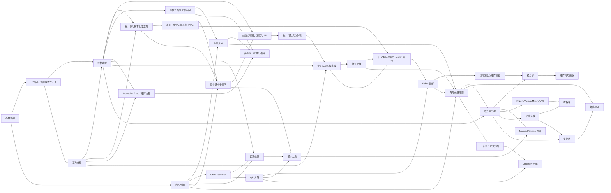

# 线性代数 MOC

> [!abstract] 本模块的任务
> 用“空间—映射—几何—分解—近似”五层结构解释矩阵，而不是把线性代数缩减为矩阵运算。完成本模块后，应能判断一个公式的对象、维度、子空间含义、数值风险及其在 AI 模型中的调用点。

## 当前教学迁移路线

> [!important] 先区分材料状态与学习者状态
> 下表的 `regression-passed` 表示节点已按“课程位置—问题链—贯穿例—公式七问—图文—AI 映射”重写并通过仓库回归；它不表示学习者已掌握。正文仍保持 `draft`，直到真实闭卷、复现和延迟迁移证据齐全。

本卷的 24 个正式正文节点按认知依赖分为六个波次。旧的“补全批次”保留施工历史，正式学习和本轮重写以此表为准。

| 波次 | ID | 节点 | 这一页解决的核心矛盾 | 材料迁移 |
|---|---|---|---|---|
| A | LA-01 | [[向量空间]] | 什么对象与运算构成线性组合的合法环境？ | `regression-passed` |
| A | LA-02 | [[子空间、张成与线性无关]] | 给定向量能生成哪里，其中有多少冗余方向？ | `regression-passed` |
| A | LA-03 | [[基与坐标]] | 抽象向量怎样获得唯一、可逆但依赖字典的数字编码？ | `regression-passed` |
| B | LA-04 | [[线性映射]] | 哪些变换保留线性组合，矩阵表示依赖哪些基？ | `regression-passed` |
| B | LA-05 | [[核、像与秩零化度定理]] | 输入自由度怎样分成丢失方向与可达输出？ | `regression-passed` |
| B | LA-06 | [[直和、商空间与不变子空间]] | 怎样唯一拆分、忽略等价方向并保留算子结构？ | `regression-passed` |
| C | LA-07 | [[内积空间]] | 长度、夹角与正交需要添加什么几何结构？ | `regression-passed` |
| C | LA-08 | [[标准正交基与 Gram-Schmidt]] | 怎样保持 span 并逐步消除方向耦合？ | `regression-passed` |
| C | LA-09 | [[正交投影]] | 怎样得到最近点及与子空间正交的残差？ | `regression-passed` |
| C | LA-10 | [[QR 分解]] | 怎样把列空间几何与三角坐标分离？ | `regression-passed` |
| C | LA-11 | [[最小二乘]] | 无精确解时怎样定义并稳定计算最佳近似？ | `regression-passed` |
| D | LA-12 | [[四个基本子空间]] | 输入与输出怎样分成可见、不可见、可达和不可达方向？ | `regression-passed` |
| D | LA-13 | [[线性方程组、消元与 LU 分解]] | 消元、可解性、pivot 与可复用求解怎样统一？ | `regression-passed` |
| D | LA-14 | [[迹、行列式与体积]] | 哪些标量摘要记录不变性、体积与可逆性？ | `regression-passed` |
| E | LA-15 | [[线性泛函与对偶空间]] | 向量与读取向量的线性测量为何是不同类型？ | `regression-passed` |
| E | LA-16 | [[伴随算子]] | 输出测量怎样搬回输入并形成反向传播接口？ | `regression-passed` |
| E | LA-17 | [[Kronecker 积、向量化与矩阵方程]] | 矩阵未知量怎样改写为结构化线性算子？ | `regression-passed` |
| E | LA-18 | [[多线性映射、张量与缩并]] | 线性结构怎样推广到多输入、指标和张量 shape？ | `regression-passed` |
| F | LA-19 | [[特征多项式与重数]] | 特征值根、代数重数与特征方向数为何不同？ | `regression-passed` |
| F | LA-20 | [[特征分解]] | 哪些方向在算子作用下只缩放，何时能组成基？ | `regression-passed` |
| F | LA-21 | [[定理 - 有限维谱定理]] | 哪类算子能用标准正交特征基完全对角化？ | `regression-passed` |
| F | LA-22 | [[广义特征向量与 Jordan 结构]] | 缺失的特征方向怎样由广义链补齐？ | `regression-passed` |
| F | LA-23 | [[Schur 分解]] | 任意方阵怎样在良态正交坐标中三角化？ | `regression-passed` |
| F | LA-24 | [[矩阵函数与矩阵指数]] | 不可对角化时怎样定义并计算 $f(A)$？ | `regression-passed` |

> [!tip] 第一遍的停靠线
> 初学者完成 LA-01—03 后，应能对同一例子依次回答：它属于哪个空间；三个列向量生成什么子空间；哪个方向冗余；留下的基如何给出唯一坐标；更换基后为什么数字改变而对象不变。若这条链不能独立复述，不进入线性映射。

> [!tip] 第二遍的停靠线
> 完成 LA-04—06 后，应能从 $T(x,y,z)=(x+z,y+z,0)$ 独立推出：线性合同、表示矩阵、一维核、二维像、秩—零化度、$\mathbb R^3=\operatorname{im}T\oplus\ker T$、斜投影分解以及 $\mathbb R^3/\ker T\cong\operatorname{im}T$。其中任一箭头说不出理由，就回到对应节点而不是继续背新分解。

> [!tip] 第三遍的停靠线
> 完成 LA-07—11 后，应能对 $A=[(1,1,0)^T\ (1,0,1)^T]$ 与 $b=e_3$ 手算 $Q,R,QQ^Tb,\hat x,r$，并逐项检查 $Q^TQ=I$、$A=QR$、$A\hat x=QQ^Tb$、$A^Tr=0$。还必须解释为什么正规方程是数学充要条件，却通常不是首选数值实现。

> [!tip] 第四遍的停靠线
> 完成 LA-12—14 后，应能对同一个 $A$ 与 $b$ 独立算出四个基本子空间，说明 $r\in\mathcal N(A^T)$；再从 $G=A^TA=\begin{bmatrix}2&1\\1&2\end{bmatrix}$ 推出 $G=LU$，用前代与回代重得 $\hat x=(-1/3,2/3)^T$；最后解释 $\operatorname{tr}G=4=\|A\|_F^2$、$\det G=3$ 与列平行四边形面积 $\sqrt3$ 分别在汇总什么。若不能区分矩形 $A$ 的列面积与方阵 $G$ 的 determinant，先不进入对偶空间。

> [!tip] 第五遍的停靠线
> 完成 LA-15—18 后，应能对同一个 $A$、$\hat x=(-1/3,2/3)^T$ 与输出测试量 $w=e_3$ 逐步推出：$A'\psi_w=\psi_w\circ A$、$A^*w=A^Tw=(0,1)^T$、$G_A=w\hat x^T$、$\operatorname{vec}(G_A)=\hat x\otimes w$，并对任意扰动 $H$ 验证 $w^TH\hat x=\langle G_A,H\rangle_F$。还必须说明每一步是在拉回协向量、选择度量表示、重排坐标，还是缩并指标；只会说“反向就是转置”不算通过。

> [!tip] 第六遍暨卷终停靠线
> 完成 LA-19—24 后，应能比较 $S=\begin{bmatrix}2&1\\1&2\end{bmatrix}$、$B=\begin{bmatrix}3&1\\0&1\end{bmatrix}$ 与 $J=\begin{bmatrix}1&1\\0&1\end{bmatrix}$：先算特征多项式与两种重数，再说明 $S$ 正交对角化、$B$ 仅一般对角化、$J$ 需要长度 2 的 Jordan 链；随后把三者放入 Schur 框架，并推出 $J^k=I+kN$、$e^{tJ}=e^t(I+tN)$。必须能解释“同谱、可对角化、正规、稳定表示、数值良态”是五个不同判断。

## 核心依赖图



箭头表示认知依赖，而非历史顺序。伪逆可以不借助 SVD 定义，但 SVD 给出最清楚、最稳定的统一表达。

## 第一批节点

| 节点 | 核心问题 | 状态 |
|---|---|---|
| [[向量空间]] | 什么结构使向量可以被线性组合？ | draft |
| [[线性映射]] | 哪些变换保留线性组合，矩阵表示依赖什么？ | draft |
| [[内积空间]] | 长度、夹角、正交和最近点依赖什么几何？ | draft |
| [[正交投影]] | 怎样把向量分解成“可解释部分 + 正交残差”？ | draft |
| [[最小二乘]] | 方程无解或超定时，怎样定义最佳近似解？ | draft |
| [[Moore-Penrose 伪逆]] | 非方阵或奇异矩阵怎样获得唯一的规范化逆？ | draft |
| [[奇异值分解]] | 任意线性映射如何分解为正交方向上的缩放？ | draft |
| [[定理 - Eckart–Young–Mirsky]] | 为什么截断 SVD 是最优低秩近似？ | draft |
| [[矩阵范数]] | 怎样度量矩阵大小、放大率和谱的整体规模？ | draft |
| [[有效秩]] | 严格秩不稳定时，怎样描述“近似维数”？ | draft |

## 第二批节点：坐标、谱与稳定性

| 节点 | 核心问题 | 状态 |
|---|---|---|
| [[基与坐标]] | 抽象对象如何表示，换基时什么改变、什么不变？ | draft |
| [[四个基本子空间]] | 输入/输出分别怎样分成可见、不可见与可达、不可达方向？ | draft |
| [[特征分解]] | 哪些方向在算子作用下保持不变，何时能构成特征基？ | draft |
| [[定理 - 有限维谱定理]] | 哪些矩阵能被正交/酉对角化，为什么？ | draft |
| [[条件数]] | 问题对数据误差的最坏敏感性有多大？ | draft |
| [[矩阵扰动]] | 谱值与谱方向分别怎样随扰动变化，gap 起什么作用？ | draft |
| [[实验 - 谱间隙与特征向量稳定性]] | 特征值稳定时，特征向量为何仍可能大幅旋转？ | draft |

## 第三批节点：正交化、QR 与正定结构

| 节点 | 核心问题 | 状态 |
|---|---|---|
| [[标准正交基与 Gram-Schmidt]] | 怎样保持张成空间不变，同时得到可直接读取坐标的标准正交基？ | draft |
| [[QR 分解]] | 怎样把列空间几何与上三角坐标分开，并稳定求解最小二乘？ | draft |
| [[二次型与正定矩阵]] | 怎样用所有方向上的能量、谱和主子式判断曲率？ | draft |
| [[Cholesky 分解]] | 正定矩阵为什么等价于唯一的正对角三角 Gram 因子？ | draft |
| [[实验 - Gram-Schmidt 与 QR 的正交性误差]] | 理论等价的正交化顺序为何在浮点数中表现不同？ | draft |
| [[实验 - 正定边界、条件数与 Cholesky pivot]] | 接近半正定边界时，条件数和三角主元怎样共同预警？ | draft |

## 第四批节点：直接求解与标量不变量

| 节点 | 核心问题 | 状态 |
|---|---|---|
| [[线性方程组、消元与 LU 分解]] | 消元为什么导出 LU，pivot、置换、稳定性与多右端复用如何联系？ | draft |
| [[迹、行列式与体积]] | 如何从结构定义推出不变性、体积、log-det 和随机 trace 估计？ | draft |

## 第五批节点：对偶、伴随与反向传播

| 节点 | 核心问题 | 状态 |
|---|---|---|
| [[线性泛函与对偶空间]] | 怎样从向量中线性读取标量，为什么微分是协向量而梯度依赖内积？ | draft |
| [[伴随算子]] | 怎样把输出测量搬回输入，为什么标准坐标中出现转置/共轭转置？ | draft |

## 第六批节点：特征多项式、广义特征空间与缺陷

| 节点 | 核心问题 | 状态 |
|---|---|---|
| [[特征多项式与重数]] | 为什么相同特征值和代数重数仍可能产生不同数量的特征方向，完整可对角化判据是什么？ | draft |
| [[广义特征向量与 Jordan 结构]] | 缺失的普通特征方向怎样由链补齐，块大小如何控制矩阵幂、最小多项式和数值风险？ | draft |

## 第七批节点：正交三角化与数值谱接口

| 节点 | 核心问题 | 状态 |
|---|---|---|
| [[Schur 分解]] | 任意方阵怎样在不放大二范数的酉/正交坐标中化为上三角或准上三角形式，并怎样由此前缀获得稳定不变子空间？ | draft |
| [[习题 - Schur 分解]] | 怎样手算、证明、构造反例并把 Schur 子空间迁移到 RNN/SSM 的状态与梯度？ | draft |
| [[解答 - Schur 分解]] | Schur 的存在性、正规特例、实块、QR 接口与数值边界怎样形成完整解题链？ | draft |

## 第八批节点：矩阵函数、连续动力学与可微计算

| 节点 | 核心问题 | 状态 |
|---|---|---|
| [[矩阵函数与矩阵指数]] | 怎样在不可对角化情形定义 $f(A)$，并把指数连接到 ODE、SSM、稳定算法与 Fréchet 导数？ | draft |
| [[习题 - 矩阵函数与矩阵指数]] | 怎样手算矩阵指数、重建定义与 ODE 推导、纠正交换/分支误区并精确离散化 SSM？ | draft |
| [[解答 - 矩阵函数与矩阵指数]] | Jordan/Hermite/Cauchy、半群、增广指数、作用量和反向梯度怎样形成完整解题链？ | draft |
| [[实验 - 稳定非正规系统的矩阵指数瞬态]] | 为什么相同的稳定特征值仍可产生完全不同的有限时间状态放大？ | draft |

## 第九批节点：极分解、正交投影与矩阵优化

| 节点 | 核心问题 | 状态 |
|---|---|---|
| [[极分解]] | 任意矩阵怎样分成方向与非负伸缩，满秩/秩亏时哪些因子唯一，并怎样稳定计算和微分？ | draft |
| [[习题 - 极分解]] | 怎样手算矩形与秩亏例子、证明最近 Stiefel 定理、构造数值反例并迁移到矩阵值最速下降？ | draft |
| [[解答 - 极分解]] | SVD 构造、trace 最大化、PSD 投影、谱迭代、Sylvester 微分与 Muon 边界怎样形成完整解题链？ | draft |
| [[实验 - Newton-Schulz 极分解的条件数效应]] | 为什么局部二次收敛仍不能保证固定步数精度，零奇异值为何永远无法恢复？ | draft |

## 第十批节点：标准空间结构补全

| 节点 | 核心问题 | 状态 |
|---|---|---|
| [[子空间、张成与线性无关]] | 一个集合何时仍是线性空间，生成能力与表示唯一性分别由什么控制？ | draft |
| [[核、像与秩零化度定理]] | 一个线性映射遗失了多少输入自由度，又保留了多少可达输出自由度？ | draft |
| [[直和、商空间与不变子空间]] | 怎样唯一拆分空间、忽略等价方向，并让算子保留可分析的子结构？ | draft |

三章均配有 A–E 各三题、独立完整解答和确定性三面板 SVG；它们补上此前被基、四个基本子空间、Jordan 与 Schur 章节隐式调用的代数前置。

## 第十一批节点：矩阵—张量接口

| 节点 | 核心问题 | 状态 |
|---|---|---|
| [[Kronecker 积、向量化与矩阵方程]] | 怎样把块结构、矩阵未知量和矩阵 Jacobian 写成统一线性算子，又避免显式物化巨型系统？ | draft |
| [[多线性映射、张量与缩并]] | 怎样从多线性映射和自由/求和指标严格推出张量 shape、缩并及 Attention/卷积契约？ | draft |

两章各有 A–E 15 题、独立完整解答和一幅按指标语义重新设计的 v2 教材式 SVG。前章统一 Kronecker、列 `vec`、Sylvester/Lyapunov、separation 与 K-FAC；后章统一张量积通用性质、order/shape/rank、mode-$n$、`einsum`、JVP/VJP、Attention 和卷积。

## 卷级累计验收

| 验收件 | 覆盖与作用 | 当前状态 |
|---|---|---|
| [[阶段测验 - 线性代数（10.2）]] | 20 分钟口试 + 240 分钟、100 分 A—E 闭卷，覆盖 LA-01—24 | `regression-passed / not-attempted` |
| [[阶段测验解答 - 线性代数（10.2）]] | 逐题独立详解、口试红线、评分边界、AI 迁移与错题回链 | `sealed until first attempt` |
| [[实验 - 线性代数累计复现门]] | `attempt_id + scorer nonce` 随机指定病态坐标/商与投影、Jordan/SVD、attention rank/vec 三轨；含盲参数干预 | `regression-passed / not-attempted` |
| [[linear_algebra_cumulative_contract_audit.py]] | 题—解隔离、解析量、状态表面、Wiki 链接、累计 SVG 与 canonical 双跑 | `regression-passed` |

### 卷末证据时间线

```text
20 分钟无提示口试
  → 240 分钟闭卷（冻结原稿）
  → scorer nonce 随机三轨 + 盲参数干预
  → 才打开独立详解并逐项归因
  → 48 小时换例空白重建
  → 14 天陌生 AI 报告迁移
```

前一阶段的输出必须先冻结，后一阶段才开放；不能先看解答再补写“原始推导”。`passed-initial` 需要口试、闭卷与随机实验全部通过，`retained` 还需要两次延迟门。材料回归通过不会自动产生任何个人学习证据。

### 四个贯穿模型族：24 节不是 24 个孤岛

| 模型族 | 主要覆盖 | 从入口追到出口 |
|---|---|---|
| 秩亏线性映射 $A$ | LA-01—06、LA-12—14 | 空间、span、坐标、map、kernel/image、quotient、四个基本子空间、solve 与标量不变量 |
| 设计矩阵 $X$ 与目标 $b$ | LA-07—16 | inner product、Gram–Schmidt、projection、QR、least squares、四子空间、LU、trace/determinant、dual/adjoint |
| $AXB$ 与 $QK^T\mapsto\operatorname{softmax}(QK^T)$ | LA-17—18 与 AI 迁移 | vec/Kronecker、tensor contraction，并审计结构 rank 穿过非线性后哪些结论失效 |
| $S/B/J/M$ 谱对照族 | LA-19—24；另调用 SVD/伪逆桥接知识 | 重数、一般/正交对角化、谱定理、Jordan、Schur、矩阵函数；矩形映射再由 SVD 给规范反演 |

口试按“对象类型 → 唯一性/商 → 几何/伴随 → QR/SVD → 谱/Jordan → AI 线性出口”六条链抽查；闭卷再要求证明与计算；实验只负责验证有限实现。三者互补，任何一项都不能替代另两项。

`L2-A / L2-B / L2-C / LA-AI`保留为复习与补救分组，不再作为遗漏的独立卷；LA-CUM-01已经统一验收24个正式节点。工具、解答与SVG存在只证明验收链可执行，不代表学习者已经掌握，因此所有节点继续保持`draft`，直至首次口试、闭卷、评分、随机轨道、盲干预、48小时重做与14天迁移均有证据。

## 统一符号

| 符号 | 约定 |
|---|---|
| $\mathbb{F}$ | $\mathbb{R}$ 或 $\mathbb{C}$ |
| $\boldsymbol{A}\in\mathbb{F}^{m\times n}$ | 从 $\mathbb{F}^n$ 到 $\mathbb{F}^m$ 的线性映射的标准基矩阵 |
| $\boldsymbol{A}^{*}$ | 实数情形为转置 $\boldsymbol{A}^{\top}$，复数情形为共轭转置 |
| $\mathcal{R}(\boldsymbol{A})$ | 值域/列空间 |
| $\mathcal{N}(\boldsymbol{A})$ | 零空间 |
| $r$ | $\operatorname{rank}(\boldsymbol{A})$，除非另有说明 |
| $\sigma_1\ge\cdots\ge\sigma_r>0$ | 正奇异值，按降序排列 |

## 学习顺序

完整的第二至四层课程路线见[[线性代数完整学习路线与掌握标准]]。当前 MOC 中已有节点属于主干，学习时按下列扩展顺序补齐：

1. 从[[向量空间]]进入[[子空间、张成与线性无关]]，先会判断“哪些对象仍构成空间”，再用[[基与坐标]]建立唯一表示和换基语言。
2. 学习[[线性映射]]与[[核、像与秩零化度定理]]，再用[[直和、商空间与不变子空间]]组织分解、压缩和算子保留结构；随后回读基与坐标中的矩阵表示和相似变换。
3. 在[[内积空间]]后学习[[标准正交基与 Gram-Schmidt]]和[[QR 分解]]，再进入[[正交投影]]与[[最小二乘]]。
4. 学习[[线性方程组、消元与 LU 分解]]，再用[[迹、行列式与体积]]连接可逆性、体积、log-det 与随机 trace 估计。
5. 学习[[线性泛函与对偶空间]]、[[伴随算子]]，补齐正文中 $T^{*}$ 的抽象来源。
6. 学习[[Kronecker 积、向量化与矩阵方程]]，固定列 `vec` 和复合指标约定，再进入[[多线性映射、张量与缩并]]，把矩阵语言推广到 Attention、卷积和自动微分的高阶形状。
7. 学习[[二次型与正定矩阵]]、[[Cholesky 分解]]，再复查谱定理、最小二乘和优化曲率。
8. 沿[[特征多项式与重数]] → [[特征分解]] → [[广义特征向量与 Jordan 结构]] → [[Schur 分解]] → [[矩阵函数与矩阵指数]]推进；依次区分根、特征基、缺陷结构、稳定谱表示和函数演算。
9. 用[[奇异值分解]]同时解释子空间、范数和条件性；在此基础上学习[[Moore-Penrose 伪逆]]，统一无解、多解和最小范数选择。
10. 从 SVD 进入[[极分解]]，把输入/输出正交结构连接到最近 Stiefel 因子、矩阵优化和 Muon。
11. 用[[定理 - Eckart–Young–Mirsky]]进入低秩近似，再比较[[有效秩]]的不同定义。
12. 以[[矩阵符号函数]]区分特征值函数与 SVD 型谱变换，然后进入[[数值线性代数 MOC]]，把存在性定理转换成稳定算法和误差判断。

## 与 AI 的直接接口

| 线性代数对象 | AI 中的调用点 |
|---|---|
| 子空间、基和坐标 | Embedding、表示子空间、特征基变换 |
| 核、像与秩—零化度 | 不可辨识方向、线性层信息瓶颈、Jacobian 局部自由度、LoRA 容量上界 |
| 直和、商空间与不变子空间 | 多头/多分支表示拆分、nuisance 等价类、状态空间稳定子模块与规范自由度 |
| 线性/仿射映射 | Linear layer、卷积、Q/K/V 投影 |
| 投影和最小二乘 | 线性回归、残差分析、局部二次近似 |
| 伪逆 | 最小范数解、闭式初始化、线性探针、低秩拟合 |
| SVD | PCA、LoRA/压缩、谱归一化、条件数、Muon |
| 低秩近似 | 参数压缩、核/Attention 近似、适配器 |
| 矩阵范数 | Lipschitz 上界、权重约束、优化几何 |
| 有效秩 | 表示坍缩、Attention 秩、内在维数诊断 |
| LU、三角求解 | 隐式微分、二阶系统、可逆层和多右端复用 |
| trace、determinant、log-det | 高斯归一化、normalizing flow、曲率和总方差摘要 |
| 对偶空间、微分与对偶范数 | 线性 probe、cotangent、参数化不变量和非欧氏优化 |
| 伴随与 VJP | 线性层/卷积反向、reverse-mode AD、共享参数梯度累加 |
| Kronecker、vec 与矩阵方程 | K-FAC/结构化曲率、可分离协方差、隐式层反向、Sylvester/Lyapunov 与 matrix-free Jacobian |
| 多线性映射与张量缩并 | Attention/卷积指标契约、`einsum`、多模态交互、JVP/VJP、高阶导数与 CP/Tucker 参数化 |
| 特征多项式与重数 | RNN/状态矩阵幂、缺陷动力学、重复谱下可微 eig 的退化点 |
| 广义特征空间与 Jordan 链 | RNN/SSM 多项式瞬态、矩阵指数、近缺陷 eig 条件性与 Schur 子空间选择 |
| Schur 形式与重排不变子空间 | 一般状态矩阵的良态坐标、稳定/不稳定谱簇、非正规瞬态、Neural ODE 与矩阵函数 |
| 矩阵函数、矩阵指数与 Fréchet 导数 | RoPE 旋转、连续 SSM 精确离散化、Neural ODE 局部传播、可微矩阵层与 action 算法 |
| 极分解、最近 Stiefel 因子与谱迭代 | Muon、正交权重 retraction、Procrustes 对齐、白化/逆平方根与矩阵层微分 |
| 经典矩阵 sign 与半平面谱投影 | 连续 SSM/Neural ODE 稳定模态、谱分治、Riccati/implicit layer 与可微投影 |

## 后续节点

- 第一补全批次已完成：[[标准正交基与 Gram-Schmidt]]、[[QR 分解]]、[[二次型与正定矩阵]]、[[Cholesky 分解]]及其习题、解答与两个实验；
- 第二补全批次已完成十个节点：[[线性方程组、消元与 LU 分解]]、[[迹、行列式与体积]]、[[线性泛函与对偶空间]]、[[伴随算子]]、[[特征多项式与重数]]、[[广义特征向量与 Jordan 结构]]、[[Schur 分解]]、[[矩阵函数与矩阵指数]]、[[极分解]]、[[矩阵符号函数]]及配套习题/解答；
- 早期底座升级批次已完成：[[向量空间]]、[[基与坐标]]、[[线性映射]]、[[四个基本子空间]]均补齐初学者推导、数值/AI 边界、分层题与独立解答；开章插图已升级为按概念选择视觉语法的 v2 教材式 SVG；
- 几何—求解升级批次已完成：[[内积空间]]、[[标准正交基与 Gram-Schmidt]]、[[正交投影]]、[[最小二乘]]已贯通“度量—正交化—正交分解—最近点—残差正交—规范解—稳定算法”，并统一采用新版开章图、读图顺序和图示边界；
- 对偶—谱入口升级批次已完成：[[线性泛函与对偶空间]]、[[伴随算子]]、[[QR 分解]]、[[迹、行列式与体积]]、[[特征多项式与重数]]、[[特征分解]]已补齐对象类型、依赖顺序、初学者问题层与六幅不同视觉语法的 v2 SVG；
- 谱—低秩升级批次已完成：[[特征分解]]、[[定理 - 有限维谱定理]]、[[奇异值分解]]、[[Moore-Penrose 伪逆]]、[[定理 - Eckart–Young–Mirsky]]已贯通“方向—正交谱—双空间缩放—规范反演—最优截断”，共 75 题、五份独立详解与五幅 SVG；
- 度量—敏感性升级批次已完成：[[矩阵范数]]、[[条件数]]、[[矩阵扰动]]、[[有效秩]]已贯通“大小—条件—扰动—近似维数”，共 60 题、四份独立详解与四幅三面板 SVG；
- 第三补全批次 D1 已完成：[[子空间、张成与线性无关]]、[[核、像与秩零化度定理]]、[[直和、商空间与不变子空间]]，共 45 道分层习题、三份独立详解和三幅 SVG；
- D2 已完成：[[Rayleigh 商与极值表征]]、[[特征向量与子空间扰动定理]]，共 30 道分层习题、两份独立详解和两幅 SVG；
- D3 已完成：[[Kronecker 积、向量化与矩阵方程]]、[[多线性映射、张量与缩并]]，共 30 道分层习题、两份独立详解和两幅 SVG；10.2 已达到 24/24 正文覆盖；
- 2026-08-23 图文最新版回查完成：10.2 的 24/24 正文节点均具有 v2 开章图、figure 来源说明、读图顺序与显式“图没有证明什么”；[[矩阵函数与矩阵指数]]另含一张 v2 非正规瞬态研究图，合计 25/25 图文单元通过结构、XML、1200 px 渲染和资源引用验收。共享实验 [[实验 - 稳定非正规系统的矩阵指数瞬态]]已同步脚本、图注、复现命令与边界说明；
- 10.2 卷级验收已回归：[[阶段测验 - 线性代数（10.2）]]、[[阶段测验解答 - 线性代数（10.2）]]与[[实验 - 线性代数累计复现门]]已把24节点接成“口试—闭卷—随机三轨—盲干预—48小时—14天”闭环；[[linear_algebra_cumulative_contract_audit.py]]验证材料为`regression-passed`，个人仍为`not-attempted`；
- 数值补全批次：[[数值线性代数 MOC]]中的误差、稳定算法与迭代方法；
- 第四层：[[练习与测验 MOC]]中的节点习题、完整解答和阶段测验；
- 数值秩、伪谱与误差分析；
- SVD/特征分解的导数和自动微分退化点；
- CR、ID、CUR 和随机低秩近似。

## 主要来源

- Sheldon Axler, [Linear Algebra Done Right, 4th ed.](https://linear.axler.net/LADR4e.pdf)，尤其是 1C、2A、3B、5C 及第 6—9 章。
- JAX Authors, [Forward- and reverse-mode autodiff in JAX](https://docs.jax.dev/en/latest/jacobian-vector-products.html)。
- Tamara G. Kolda & Brett W. Bader, [Tensor Decompositions and Applications](https://doi.org/10.1137/07070111X), 2009；NumPy/PyTorch 官方 `einsum` 与 PyTorch `kron` 文档。
- LAPACK, [DHSEQR](https://www.netlib.org/lapack/explore-html/d9/dc6/group__hseqr_ga62c3f96d2f67f96d6dc10334e118e451.html)；PyTorch, [torch.linalg.eig](https://docs.pytorch.org/docs/main/generated/torch.linalg.eig.html)。
- Carl Eckart & Gale Young, [The Approximation of One Matrix by Another of Lower Rank](https://doi.org/10.1007/BF02288367), 1936。
- Leon Mirsky, [Symmetric Gauge Functions and Unitarily Invariant Norms](https://doi.org/10.1093/qmath/11.1.50), 1960。
- Chandler Davis & W. M. Kahan, [The Rotation of Eigenvectors by a Perturbation. III](https://doi.org/10.1137/0707001), 1970。
- Per-Åke Wedin, [Perturbation bounds in connection with singular value decomposition](https://doi.org/10.1007/BF01932678), 1972。
- 苏剑林，“低秩近似之路”系列及“矩阵的有效秩”。
- [[S-2025-Su-10878-SVD的导数]]。
