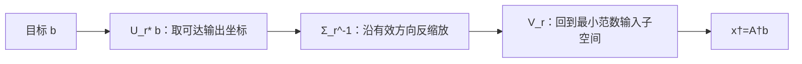

# Moore–Penrose 伪逆

> [!abstract] 本章主问题
> 当矩阵不是可逆方阵，方程可能无解或有无穷多解时，“反演”还能否有一个唯一、坐标无关且几何自然的答案？Moore–Penrose 伪逆先把目标正交投影到可达输出，再在全部最小二乘解中选择欧氏范数最小的输入；在 SVD 坐标中，它只对非零奇异值取倒数，并把零奇异方向保持为零。

## 学习目标

完成本章后，你应能：

1. 解释普通逆为何不能覆盖非方阵、秩亏、无解与多解；
2. 写出四个 Penrose 条件并说明前两条与后两条的分工；
3. 从紧致 SVD 构造 $A^\dagger$ 并验证四条条件；
4. 证明四条条件刻画唯一算子；
5. 解释 $AA^\dagger$ 与 $A^\dagger A$ 分别投到哪个空间；
6. 描述所有最小二乘解，并证明 $A^\dagger b$ 唯一最小范数；
7. 推导可逆、满列秩和满行秩三个特例；
8. 比较精确伪逆、截断 SVD 与 Tikhonov 滤波；
9. 识别秩改变处的不连续性和逆序律失败；
10. 分析线性 probe、固定因子更新与模型编辑中的形状和噪声放大。

> [!question] 初学者读完必须能回答
> 1. 普通逆为什么无法同时处理长方形、秩亏、无解和多解？
> 2. 四个 Penrose 条件中，前两条与后两条分别排除了什么不唯一性？
> 3. $AA^\dagger$ 与 $A^\dagger A$ 分别投影到哪个空间，形状为何不同？
> 4. 为什么 $A^\dagger b$ 同时给出最小二乘预测和最小范数参数？
> 5. SVD 中的零奇异方向为什么不应取“无穷大倒数”？
> 6. 精确伪逆、截断 SVD 与 Tikhonov 滤波怎样交换偏差与稳定性？
> 7. 伪逆为什么在固定秩层内连续，却可能在跨秩时爆炸？

下图回答：伪逆怎样先修正不可达输出，再从全部最小二乘解中选出唯一最短输入，并在谱坐标中暴露噪声放大？

![[00-知识库管理/_assets/figures/pseudoinverse/fig-pseudoinverse-two-projections-filter-boundary-v2.svg|880]]

> [!figure] 图 1：伪逆的两阶段几何、谱滤波与秩边界
> **图源与改绘：** 本库原创教学图；问题入口参照[[S-2024-Su-10366-低秩近似之路（一）伪逆]]，规范定义参照 Penrose 与 Golub–Van Loan。
>
> **怎样读图。** 左栏先在输出空间把 $b$ 投到 $\mathcal R(A)$，得到唯一最佳预测 $AA^\dagger b$；中栏回到输入空间，从仿射解族 $A^\dagger b+\mathcal N(A)$ 中选取与零空间正交的最短向量；右栏再从奇异值滤波解释为何精确反演会放大小奇异方向，以及截断和岭正则如何引入偏差换取稳定性。
>
> **适用边界（图没有证明什么）。** 图中“最短”与“正交”依赖标准 Euclidean/Hermitian 内积；若采用加权范数，规范广义逆也会改变。伪逆没有消除病态性，$\|A^\dagger\|_2=1/\sigma_{\min}^+$；跨越秩变化点时，连续性和微分公式都必须重新审查。

## 进入正文前：规范反演必须同时处理不可达输出与不可辨识输入

> [!info] 承接—中心—去路
> - **承接：** [[奇异值分解]]把输入分成可传递与零奇异方向，[[条件数]]说明反演小奇异值会放大噪声，[[最小二乘]]给出输出投影但解可能不唯一。
> - **中心：** 伪逆先把目标投到 $\mathcal R(A)$，再只在 $\mathcal R(A^*)$ 中反演非零奇异通道，从解族中选出唯一最小范数代表。
> - **去路：** [[定理 - Eckart–Young–Mirsky]]会问是否应主动丢弃短奇异轴；截断伪逆与岭滤波则把精确反演改成有偏但更稳定的谱滤波。

### 两遍阅读路线

第一遍掌握 SVD 取倒数、两个正交投影、最佳预测与最小范数解。第二遍再读 Penrose 四条件的存在唯一性、满秩特例、滤波、跨秩不连续和逆序律边界。

全章主线是：

$$
b
\xrightarrow{U_r^*}
\text{保留可达输出坐标}
\xrightarrow{\Sigma_r^{-1}}
\text{反演非零奇异值}
\xrightarrow{V_r}
x^+=A^\dagger b.
$$

### 本章的问题链

1. 普通逆为何不能处理无解、多解、矩形与秩亏？
2. Penrose 前两条怎样表达有效子空间上的逆，后两条怎样选出正交投影？
3. 为什么零奇异值必须保持为零而不是取无穷大倒数？
4. $AA^\dagger$ 与 $A^\dagger A$ 分别作用在哪个环境空间？
5. 为什么 $A^\dagger b$ 同时实现最小残差与最小参数范数？
6. 精确伪逆为何在秩改变处不连续，截断/岭滤波怎样交换偏差与方差？

### 把 $A_\varepsilon$ 推到端点 $A_0$

对 $\varepsilon>0$，

$$
A_\varepsilon^+=A_\varepsilon^{-1}
=\operatorname{diag}(1,1/\varepsilon).
$$

在秩亏端点

$$
A_0=\operatorname{diag}(1,0),
\qquad
A_0^+=\operatorname{diag}(1,0).
$$

取目标

$$
b=(1,\beta)^T.
$$

则

$$
A_0A_0^+b=(1,0)^T,
\qquad
r=b-A_0A_0^+b=(0,\beta)^T.
$$

全部最小二乘解为 $(1,t)^T$，$t\in\mathbb R$；伪逆选出

$$
x^+=A_0^+b=(1,0)^T,
$$

即与零空间 $\operatorname{span}\{e_2\}$ 正交的最短代表。注意若固定 $\beta\ne0$ 并从 $\varepsilon>0$ 逼近 0，则 $A_\varepsilon^+b=(1,\beta/\varepsilon)^T$ 发散，而端点伪逆给 $(1,0)^T$；这正是跨秩不连续。

### 最小伪逆账本

| 对象 | 形状 | 几何作用 |
|---|---:|---|
| $A^\dagger$ | $n\times m$ | 输出到最小范数输入 |
| $AA^\dagger$ | $m\times m$ | 投到 $\mathcal R(A)$ |
| $A^\dagger A$ | $n\times n$ | 投到 $\mathcal R(A^*)=\mathcal N(A)^\perp$ |
| $I-AA^\dagger$ | $m\times m$ | 提取不可达残差 |
| $I-A^\dagger A$ | $n\times n$ | 提取不可辨识零空间分量 |

> [!tip] 初学者的停靠点
> 伪逆不是“把矩阵变成方阵再求逆”。先在输出空间做投影，再在可辨识输入子空间反演；这两个环境空间不同，正是两个投影矩阵形状不同的原因。

## 阅读前自检

- 已理解最小二乘的“输出投影 + 输入最小范数”两阶段；
- 已知 $\mathcal R(A^*)=\mathcal N(A)^\perp$；
- 能写出紧致 SVD $A=U_r\Sigma_rV_r^*$；
- 注意 $A:m\times n$ 时 $A^\dagger:n\times m$，它不是同形矩阵。

## 问题背景

普通逆矩阵只适用于可逆方阵。实际 AI 问题经常遇到：

- 非方阵：特征维度与输出维度不同；
- 秩亏：特征冗余或表示坍缩；
- 方程无解：目标不在列空间；
- 方程多解：参数中存在不影响输出的零空间方向。

“找任意广义逆”仍不唯一。Moore–Penrose 条件通过正交几何选出唯一对象。

## 四个 Penrose 条件

> [!definition] Moore–Penrose 伪逆
> 对 $\boldsymbol{A}\in\mathbb F^{m\times n}$，其伪逆是唯一的 $\boldsymbol{A}^{\dagger}\in\mathbb F^{n\times m}$，满足
> $$
> \begin{aligned}
> \boldsymbol{A}\boldsymbol{A}^{\dagger}\boldsymbol{A}&=\boldsymbol{A},\\
> \boldsymbol{A}^{\dagger}\boldsymbol{A}\boldsymbol{A}^{\dagger}&=\boldsymbol{A}^{\dagger},\\
> (\boldsymbol{A}\boldsymbol{A}^{\dagger})^{*}&=\boldsymbol{A}\boldsymbol{A}^{\dagger},\\
> (\boldsymbol{A}^{\dagger}\boldsymbol{A})^{*}&=\boldsymbol{A}^{\dagger}\boldsymbol{A}.
> \end{aligned}
> $$

前两个条件表达“在有效子空间上互为逆”，后两个条件确保相应投影是正交投影，而不是任意斜投影。

## SVD 公式

设紧致 SVD 为

$$
\boldsymbol{A}=\boldsymbol{U}_r\boldsymbol{\Sigma}_r\boldsymbol{V}_r^{*},
\qquad
\boldsymbol{\Sigma}_r=\operatorname{diag}(\sigma_1,\ldots,\sigma_r),
\quad \sigma_i>0.
$$

则

$$
\boxed{
\boldsymbol{A}^{\dagger}
=
\boldsymbol{V}_r\boldsymbol{\Sigma}_r^{-1}\boldsymbol{U}_r^{*}
}
$$

> [!analysis] SVD 伪逆公式的七问拆解
> | 问题 | 回答 |
> |---|---|
> | 它要规范化哪两种不唯一？ | 输出可能含不可达分量，输入解可能沿零空间任意移动；伪逆分别用正交投影和最小范数选择解决。 |
> | 因子为何反序？ | 前向是先 $V_r^*$、再 $\Sigma_r$、后 $U_r$；反演必须先读输出 $U_r^*$，再反缩放，最后由 $V_r$ 返回输入。 |
> | 为什么只倒数正奇异值？ | 零奇异方向没有被前向映射传递，输出不含足够信息恢复它；最小范数约定把该输入坐标设为零。 |
> | 两个投影怎样出现？ | $AA^\dagger=U_rU_r^*$ 投到列空间，$A^\dagger A=V_rV_r^*$ 投到行空间。 |
> | 怎样验收？ | 检查四个 Penrose 条件、两投影的自伴/幂等性，并验证 $Ax^+$ 是最近预测且 $x^+\perp\mathcal N(A)$。 |
> | 为什么小奇异值危险？ | 对应滤波系数为 $1/\sigma_i$，会同时放大数据噪声、舍入误差与梯度；伪逆本身不提供正则化。 |
> | AI 中怎样调用？ | 线性 probe、最小范数插值、模型编辑与固定特征回归；必须报告截断阈值、rank 判据和是否采用岭滤波。 |

其中 $\boldsymbol{\Sigma}_r^{-1}=\operatorname{diag}(1/\sigma_1,\ldots,1/\sigma_r)$。

零奇异值对应无法从输出反推的方向，伪逆不会把它们取成“无穷大”，而是将对应分量设为零。

### 存在性：验证四个条件

由 $U_r^*U_r=V_r^*V_r=I_r$，

$$
AA^\dagger=U_rU_r^*,
\qquad
A^\dagger A=V_rV_r^*.
$$

二者都是自伴投影。进一步，

$$
AA^\dagger A
=U_rU_r^*U_r\Sigma_rV_r^*=A,
$$

$$
A^\dagger A A^\dagger
=V_rV_r^*V_r\Sigma_r^{-1}U_r^*=A^\dagger.
$$

所以 SVD 构造满足四个 Penrose 条件，证明存在性。

### 唯一性：四个条件固定了每个输入的输出

设 $X$ 满足四个条件。$AX$ 是自伴幂等算子，且

$$
\mathcal R(AX)=\mathcal R(A),
$$

所以必是唯一的正交投影 $P_{\mathcal R(A)}$。同理，$XA$ 是到 $\mathcal R(A^*)$ 的正交投影。

对任意 $b$，$AXb=P_{\mathcal R(A)}b$，而由 $X=XAX$ 可知 $Xb\in\mathcal R(A^*)=\mathcal N(A)^\perp$。因此 $Xb$ 是产生最优预测的唯一最小范数输入。这个向量对每个 $b$ 都唯一，所以算子 $X$ 唯一。

## 几何含义

由 SVD 立即得到

$$
\boldsymbol{A}\boldsymbol{A}^{\dagger}
=\boldsymbol{U}_r\boldsymbol{U}_r^{*}
=P_{\mathcal R(\boldsymbol{A})},
$$

$$
\boldsymbol{A}^{\dagger}\boldsymbol{A}
=\boldsymbol{V}_r\boldsymbol{V}_r^{*}
=P_{\mathcal N(\boldsymbol{A})^{\perp}}
=P_{\mathcal R(\boldsymbol{A}^{*})}.
$$

因此 $\boldsymbol{A}^{\dagger}\boldsymbol{b}$ 的计算分两步：

1. $\boldsymbol{A}\boldsymbol{A}^{\dagger}\boldsymbol{b}$ 是 $\boldsymbol{b}$ 到列空间的最近点；
2. 在所有产生该最近点的输入中，$\boldsymbol{A}^{\dagger}\boldsymbol{b}$ 与零空间正交，因而范数最小。

> [!theorem] 最佳近似与最小范数
> 对任意 $\boldsymbol{b}$，$\boldsymbol{x}_{\dagger}=\boldsymbol{A}^{\dagger}\boldsymbol{b}$ 最小化 $\|\boldsymbol{A}\boldsymbol{x}-\boldsymbol{b}\|_2$；在所有达到相同最小残差的 $\boldsymbol{x}$ 中，它还唯一最小化 $\|\boldsymbol{x}\|_2$。

所有最小二乘解组成

$$
x=A^\dagger b+(I-A^\dagger A)z,
\qquad z\in\mathbb F^n.
$$

$I-A^\dagger A$ 是到 $\mathcal N(A)$ 的正交投影。两项正交，因此

$$
\|x\|^2
=\|A^\dagger b\|^2
+\|(I-A^\dagger A)z\|^2.
$$

## 常见满秩特例

| 条件 | 伪逆公式 | 相应单位关系 |
|---|---|---|
| 可逆方阵 | $\boldsymbol{A}^{\dagger}=\boldsymbol{A}^{-1}$ | 两侧都为单位阵 |
| 满列秩，$m\ge n$ | $(\boldsymbol{A}^{*}\boldsymbol{A})^{-1}\boldsymbol{A}^{*}$ | $\boldsymbol{A}^{\dagger}\boldsymbol{A}=\boldsymbol{I}_n$ |
| 满行秩，$m\le n$ | $\boldsymbol{A}^{*}(\boldsymbol{A}\boldsymbol{A}^{*})^{-1}$ | $\boldsymbol{A}\boldsymbol{A}^{\dagger}=\boldsymbol{I}_m$ |

这些闭式公式有严格的秩前提。一般秩亏情形不能直接写普通逆。

## 最小例子

令

$$
\boldsymbol{A}=\begin{bmatrix}2&0\\0&0\end{bmatrix}.
$$

则

$$
\boldsymbol{A}^{\dagger}
=\begin{bmatrix}1/2&0\\0&0\end{bmatrix}.
$$

对 $\boldsymbol{b}=(4,3)^{\top}$，

$$
\boldsymbol{x}_{\dagger}=(2,0)^{\top},
\qquad
\boldsymbol{A}\boldsymbol{x}_{\dagger}=(4,0)^{\top}.
$$

第二个输出分量不可达，因此残差为 $(0,3)^{\top}$；第二个输入方向位于零空间，最小范数原则把它设为零。

## 回看总图：双投影、谱滤波与秩变化

回看图 1：$AA^\dagger$ 修正输出，$A^\dagger A$ 选择输入；二者是同一 SVD 中左右有效子空间的正交投影。真正的数值风险并不来自零奇异值本身，而来自趋近于零、却仍被精确反演的小奇异值。

## 与“优化定义”的关系

科学空间从

$$
\min_{\boldsymbol{B}}\|\boldsymbol{A}\boldsymbol{B}-\boldsymbol{I}\|_F^2
$$

引出右伪逆视角。这个入口很有启发性，但必须保留秩条件：当 $\boldsymbol{A}$ 满列秩时，最优解唯一且为 $(\boldsymbol{A}^{*}\boldsymbol{A})^{-1}\boldsymbol{A}^{*}$；若 $\boldsymbol{A}$ 秩亏，单独这个最优化问题可能有多个最优解，不能取代四个 Penrose 条件或 SVD 定义。

## 数值边界

> [!warning] 小奇异值取倒数会放大噪声
> 若 $\sigma_r$ 很小，$1/\sigma_r$ 很大，输入或舍入误差会被显著放大。数学上的伪逆存在，不代表数值问题适定。

常见处理包括：

- 截断 SVD：低于相对阈值的奇异值按零处理；
- Tikhonov 正则：用 $\sigma_i/(\sigma_i^2+\lambda)$ 替代 $1/\sigma_i$；
- 迭代求解：避免显式形成完整伪逆；
- 报告阈值：数值秩和伪逆依赖容差，不能隐藏默认值。

三种谱滤波要明确区分：

| 方法 | 奇异方向滤波因子 | 目标 | 边界 |
|---|---|---|---|
| 精确伪逆 | $1/\sigma_i$（$\sigma_i>0$） | 数学最小范数 LS | 小值强烈放大噪声 |
| 截断 SVD | $1/\sigma_i$ 或 $0$ | 硬阈值数值秩 | 阈值处不连续 |
| Ridge/Tikhonov | $\sigma_i/(\sigma_i^2+\lambda)$ | 带正则目标 | 有偏但平滑收缩 |

若奇异值从非零趋于零，$A^\dagger$ 的范数趋于无穷；因此伪逆在固定秩流形上光滑，但跨秩变化一般不连续。自动微分和模型编辑若接近秩改变，必须报告截断/阻尼策略。

实际通常应直接求解所需的最小二乘系统，而不是显式存储 $A^\dagger$。对稠密矩阵，完整伪逆需要 SVD 量级成本与 $O(mn)$ 输出存储；若只需 $A^\dagger b$，迭代 LS 或分解 action 更合适。

### 逆序律通常失败

一般没有

$$
(AB)^\dagger=B^\dagger A^\dagger.
$$

例如 $A=[1\ 1]$、$B=(1,0)^T$，则 $AB=[1]$，所以 $(AB)^\dagger=1$；但

$$
B^\dagger A^\dagger
=[1\ 0]\frac12\begin{bmatrix}1\\1\end{bmatrix}
=\frac12.
$$

只有在额外的值域/秩兼容条件下才可使用逆序律。

## 在 AI 中的连接

- 闭式线性 probe、最小二乘层和某些模型编辑步骤会使用伪逆或正则化伪逆。
- 低秩分解中，固定一侧因子时，另一侧的最优最小二乘更新可由伪逆表达；两侧同时优化仍是非凸问题。
- 对中间表示做伪逆重构时，小奇异值会放大测量噪声和分布偏移。
- 自动微分穿过 SVD/伪逆时，在奇异值重合或越过截断阈值附近可能不平滑，需要单独分析。

| 场景 | $A$ 的形状 | $A^\dagger$ 作用 | 前提 | 失败模式 |
|---|---|---|---|---|
| 线性 probe | $N\times d$ | 标签 $N\times c\mapsto$ 权重 $d\times c$ | 表示冻结、平方损失 | 近秩亏放大标签噪声 |
| 固定一侧低秩因子 | 由激活/另一因子组成 | 闭式交替更新 | 另一侧固定 | 联合问题仍非凸 |
| 线性模型编辑 | Jacobian/特征矩阵 | 选最小范数参数改动 | 局部线性、样本集合固定 | 分布外副作用 |
| 解码/反演表示 | 编码线性化 | 可达输出的最小范数原像 | 固定算子与度量 | 小奇异方向噪声爆炸 |

## 边界与常见误区

1. $A^\dagger$ 不是“把零奇异值取倒数”；零方向保持为零；
2. $AA^\dagger$ 与 $A^\dagger A$ 形状不同、投影空间不同；
3. 满列/满行闭式公式有严格秩条件；
4. 数学伪逆唯一，不等于数值结果不依赖容差；
5. 最小范数依赖所选参数内积，重参数化会改变含义；
6. $(AB)^\dagger=B^\dagger A^\dagger$ 一般错误；
7. 伪逆闭式更新只解决固定线性子问题，不自动解决联合非凸训练。

## 复习检查

1. 四个 Penrose 条件分别排除了哪些不唯一性？
2. SVD 构造怎样验证存在性？
3. 唯一性证明为何要识别两个正交投影？
4. $AA^\dagger$ 与 $A^\dagger A$ 的值域分别是什么？
5. 全部最小二乘解怎样参数化？
6. 截断 SVD 与 Ridge 的滤波因子有何不同？
7. 为什么跨秩变化时伪逆可能不连续？

## 习题与解答

- 习题：[[习题 - Moore-Penrose 伪逆]]
- 独立详解：[[解答 - Moore-Penrose 伪逆]]

## 来源

- [[S-2024-Su-10366-低秩近似之路（一）伪逆]]。
- Sheldon Axler, [Linear Algebra Done Right, 4th ed.](https://linear.axler.net/LADR4e.pdf), definitions 6.68–6.70 and SVD consequences in Section 7E。
- Roger Penrose, [A generalized inverse for matrices](https://doi.org/10.1017/S0305004100030401), 1955。
- Gene H. Golub and Charles F. Van Loan, *Matrix Computations*, 4th ed., Chapter 5：最小二乘、秩亏与数值求解。
