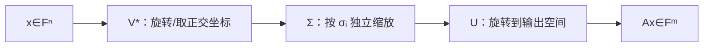

# 奇异值分解

> [!abstract] 本章主问题
> 一个可能是长方形、不可逆、甚至秩亏的矩阵，能否仍被拆成彼此正交且可解释的基本作用？SVD 的回答是：先在输入空间选取右奇异方向，再沿各方向作非负缩放，最后在输出空间选取左奇异方向。由此可在同一套坐标中读出秩、四个基本子空间、伪逆、范数、条件性与最优低秩近似。

## 学习目标

完成本章后，你应能：

1. 写出完整、薄型与紧致 SVD 的形状；
2. 从 $A^*A$ 的谱定理证明 SVD 存在，并处理零奇异值；
3. 解释右奇异向量、奇异值和左奇异向量的输入—缩放—输出语义；
4. 从 SVD 读出秩、四个基本子空间、范数、条件数与伪逆；
5. 手算秩一和对角型矩阵的 SVD；
6. 区分特征值与奇异值以及左右方向；
7. 解释符号/相位、重数和零空间导致的非唯一性；
8. 根据规模选择完整 SVD、截断 SVD、Lanczos 或随机 SVD；
9. 使用重构、正交性和左右残差验收数值结果；
10. 分析 PCA、谱归一化、压缩和表示秩中的形状与失败边界。

> [!question] 初学者读完必须能回答
> 1. 为什么一般 $m\times n$ 矩阵需要两组奇异向量，而不能只谈一组特征向量？
> 2. $V^*$、$\Sigma$、$U$ 分别作用在哪个空间，矩阵形状怎样闭合？
> 3. 为什么奇异值一定非负，它们与 $A^*A$ 的特征值有什么关系？
> 4. 怎样从一份 SVD 直接读出秩、值域、零空间和谱范数？
> 5. 完整 SVD、薄型 SVD、紧致 SVD 和截断 SVD 各保留了什么？
> 6. 重复或为零的奇异值为什么使“向量”不唯一，而相应子空间仍有意义？
> 7. 为什么用 $A^*A$ 能证明存在性，却未必是稳定的数值算法？

下图回答：一个长方形矩阵如何在两个不同空间之间完成“取坐标—非负缩放—重新定向”，并同时暴露四个基本子空间？

![[00-知识库管理/_assets/figures/svd/fig-svd-rotate-scale-subspaces-v2.svg|880]]

> [!figure] 图 1：SVD 的两空间几何与结构读取
> **图源与改绘：** 本库原创教学图；内容参照[[S-2024-Su-10407-低秩近似之路（二）SVD]]、Axler *Linear Algebra Done Right* 与 Golub–Van Loan *Matrix Computations*。
>
> **怎样读图。** 从左向右先用 $V^*$ 读取输入在右奇异基中的坐标，$\Sigma$ 再把第 $i$ 个坐标缩放 $\sigma_i$ 倍并把零奇异方向压到零，最后由 $U$ 把结果放入输出空间。下栏说明同一分解还能读出秩、零空间、值域和截断近似；这些并不是互不相关的附加结论。
>
> **适用边界（图没有证明什么）。** 圆到椭圆只是二维直观，SVD 本身适用于实或复、方形或长方形矩阵。紧致、薄型与完整形式的形状不同；重奇异值、零奇异值对应的基不唯一。由 $A^*A$ 构造 SVD 主要服务于理论证明，数值计算通常使用双对角化或迭代方法。

## 进入正文前：先问每个正交方向被放大多少

> [!info] 承接—中心—去路
> - **承接：** 10.2 的[[定理 - 有限维谱定理]]只直接对正规方阵给出一组特征方向；[[四个基本子空间]]则区分了输入与输出两侧。
> - **中心：** SVD 为任意矩形矩阵分别选择输入右奇异基与输出左奇异基，在两组正交坐标之间只剩非负对角缩放。
> - **去路：** [[矩阵范数]]会把奇异值谱压缩成不同“大小”，[[条件数]]会比较最长与最短轴，[[矩阵扰动]]会研究这些轴在噪声下怎样移动。

### 两遍阅读路线

第一遍掌握形状、$Av_i=\sigma_i u_i$、几何椭球、秩与四个子空间。第二遍再读由 $A^*A$ 的存在性证明、完整/薄型/紧致区别、重奇异值非唯一性和数值算法边界。

全章主线是：

$$
x
\xrightarrow{V^*}
\text{输入正交坐标}
\xrightarrow{\Sigma}
\text{逐方向非负缩放}
\xrightarrow{U}
Ax.
$$

### 本章的问题链

1. 矩形映射为什么需要输入与输出两组方向？
2. 为什么 $A^*A$ 的特征值非负，并可开方成为奇异值？
3. $Av_i=\sigma_i u_i$ 怎样同时确定左右奇异方向？
4. 零奇异值怎样对应核，正奇异值怎样对应秩与值域？
5. 完整、薄型、紧致和截断 SVD 各删除了哪些坐标？
6. 为什么由 $A^*A$ 证明存在，不等于应在浮点程序中显式形成 $A^*A$？

### 本卷贯穿例：一条正在塌缩的短轴

令

$$
A_\varepsilon=
\begin{bmatrix}
1&0\\
0&\varepsilon
\end{bmatrix},
\qquad
0<\varepsilon\le1.
$$

它已经处于奇异向量坐标中：

$$
A_\varepsilon
=I
\begin{bmatrix}1&0\\0&\varepsilon\end{bmatrix}
I^T,
$$

所以 $\sigma_1=1$、$\sigma_2=\varepsilon$，$v_i=u_i=e_i$。单位圆被送成半轴为 $1$ 与 $\varepsilon$ 的椭圆。随着 $\varepsilon\downarrow0$，第二个方向越来越难从输出中辨认；在 $\varepsilon=0$ 时它进入零空间，秩从 2 降到 1。

这一个例子将在首波依次回答：矩阵有多大、反演有多敏感、离奇异边界多远，以及哪些扰动结论仍然成立。

### 最小 SVD 账本

| 对象 | 所在空间/形状 | 在 $A_\varepsilon$ 中 |
|---|---|---|
| $v_i$ | 输入空间 $\mathbb R^2$ | $e_i$ |
| $u_i$ | 输出空间 $\mathbb R^2$ | $e_i$ |
| $\sigma_i$ | 非负标量 | $1,\varepsilon$ |
| $\Sigma$ | $2\times2$ 对角矩阵 | $\operatorname{diag}(1,\varepsilon)$ |
| rank | 正奇异值个数 | $\varepsilon>0$ 时为 2，$\varepsilon=0$ 时为 1 |

> [!tip] 初学者的停靠点
> 若只能背 $A=U\Sigma V^*$，先用形状和动作复述：$V^*$ 在输入侧取坐标，$\Sigma$ 跨越两侧并缩放，$U$ 在输出侧重建。把 $u_i$ 与 $v_i$ 当成同一空间中的方向，会在矩形矩阵上立即出错。

## 阅读前自检

- $A:m\times n$ 把输入 $\mathbb F^n$ 映到输出 $\mathbb F^m$；
- $A^*A:n\times n$ 与 $AA^*:m\times m$ 都是 Hermitian 半正定；
- 正交投影、四个基本子空间和谱定理已经掌握；
- SVD 的存在性证明可形成 $A^*A$，但数值实现不应默认这样做。

## 定义与形状

设 $\boldsymbol{A}\in\mathbb F^{m\times n}$，秩为 $r$。

> [!definition] 紧致 SVD
> 存在列正交矩阵
> $$
> \boldsymbol{U}_r\in\mathbb F^{m\times r},
> \qquad
> \boldsymbol{V}_r\in\mathbb F^{n\times r},
> $$
> 和正对角矩阵
> $$
> \boldsymbol{\Sigma}_r
> =\operatorname{diag}(\sigma_1,\ldots,\sigma_r),
> \qquad
> \sigma_1\ge\cdots\ge\sigma_r>0,
> $$
> 使
> $$
> \boldsymbol{A}=\boldsymbol{U}_r\boldsymbol{\Sigma}_r\boldsymbol{V}_r^{*}.
> $$

> [!analysis] 紧致 SVD 公式的七问拆解
> | 问题 | 回答 |
> |---|---|
> | 它解决什么限制？ | 特征分解只适用于方阵且可能缺少良态特征基；SVD 对任意矩形、秩亏矩阵都存在。 |
> | 三个因子分别住在哪里？ | $V_r$ 的列在输入空间 $\mathbb F^n$，$U_r$ 的列在输出空间 $\mathbb F^m$，$\Sigma_r$ 在两套 $r$ 维坐标间缩放。 |
> | 为什么奇异值非负？ | 它们是半正定矩阵 $A^*A$ 的特征值平方根，并按非增顺序约定。 |
> | 为什么只保留 $r$ 列？ | 紧致形式删除零奇异方向，只保留 $A$ 真正传递的 $r=\operatorname{rank}A$ 个通道。 |
> | 怎样验收？ | 检查重构残差、$U_r^*U_r=I$、$V_r^*V_r=I$ 以及 $Av_i-\sigma_i u_i$、$A^*u_i-\sigma_i v_i$。 |
> | 哪些部分不唯一？ | 单个奇异向量可同时改相位/符号；重奇异值子空间内部可酉旋转；零空间的补基也不唯一。 |
> | AI 中怎样调用？ | PCA/表示谱、低秩压缩、谱归一化、伪逆与可辨识性；报告时必须说明矩阵 shape、中心化方式与截断阈值。 |

完整 SVD 把 $\boldsymbol{U}_r,\boldsymbol{V}_r$ 分别补成 $m\times m$、$n\times n$ 酉矩阵，并把 $\boldsymbol{\Sigma}$ 补零为 $m\times n$。

若 $p=\min(m,n)$，常见“薄型/economy SVD”保留 $U\in\mathbb F^{m\times p}$、$\Sigma\in\mathbb R^{p\times p}$、$V\in\mathbb F^{n\times p}$；紧致 SVD 只保留 $r$ 个正奇异方向。不同软件对 `full_matrices=False` 的命名略有差异，使用时应直接核对形状。

## 几何作用

对任意输入 $\boldsymbol{x}$，

$$
\boldsymbol{A}\boldsymbol{x}
=
\sum_{i=1}^{r}
\sigma_i\boldsymbol{u}_i
\langle \boldsymbol{x},\boldsymbol{v}_i\rangle.
$$

它依次执行：

1. $\boldsymbol{V}_r^{*}$：读取输入在右奇异向量方向的坐标；
2. $\boldsymbol{\Sigma}_r$：第 $i$ 个方向缩放 $\sigma_i$ 倍；
3. $\boldsymbol{U}_r$：把缩放后的坐标放到输出左奇异方向。

在实二维中，单位圆经 $\boldsymbol{A}$ 映成椭圆，主轴方向是 $\boldsymbol{u}_i$，半轴长度是 $\sigma_i$。

## 与特征分解的关系

$$
\boldsymbol{A}^{*}\boldsymbol{A}
=
\boldsymbol{V}_r\boldsymbol{\Sigma}_r^2\boldsymbol{V}_r^{*},
$$

$$
\boldsymbol{A}\boldsymbol{A}^{*}
=
\boldsymbol{U}_r\boldsymbol{\Sigma}_r^2\boldsymbol{U}_r^{*}.
$$

因此：

- $\boldsymbol{v}_i$ 是 $\boldsymbol{A}^{*}\boldsymbol{A}$ 的特征向量；
- $\boldsymbol{u}_i$ 是 $\boldsymbol{A}\boldsymbol{A}^{*}$ 的特征向量；
- $\sigma_i^2$ 是两者的正特征值；
- $\boldsymbol{u}_i=\boldsymbol{A}\boldsymbol{v}_i/\sigma_i$。

SVD 对任意矩形矩阵都存在，不要求 $\boldsymbol{A}$ 是方阵、对称或可对角化。

### 存在性证明：从 $A^*A$ 构造

由谱定理，可取 $A^*A$ 的标准正交特征基 $v_1,\ldots,v_n$，对应特征值 $\lambda_i\ge0$。令

$$
\sigma_i=\sqrt{\lambda_i}.
$$

对每个 $\sigma_i>0$，定义

$$
u_i=\frac{Av_i}{\sigma_i}.
$$

它们标准正交，因为

$$
\langle u_i,u_j\rangle
=\frac{\langle Av_i,Av_j\rangle}{\sigma_i\sigma_j}
=\frac{\langle v_i,A^*Av_j\rangle}{\sigma_i\sigma_j}
=\frac{\sigma_j^2\langle v_i,v_j\rangle}{\sigma_i\sigma_j}.
$$

当 $i=j$ 得 1，当 $i\ne j$ 得 0。并且 $Av_i=\sigma_i u_i$。对 $\sigma_i=0$，有

$$
\|Av_i\|^2=\langle v_i,A^*Av_i\rangle=0,
$$

所以 $Av_i=0$，这些 $v_i$ 张成 $\mathcal N(A)$。再把正奇异向量组补成输入/输出空间的标准正交基，即得完整 SVD。

## 一次读出多个结构

| 对象 | SVD 表达 |
|---|---|
| 列空间 | $\mathcal R(\boldsymbol{A})=\operatorname{span}\{\boldsymbol{u}_1,\ldots,\boldsymbol{u}_r\}$ |
| 行空间 | $\mathcal R(\boldsymbol{A}^{*})=\operatorname{span}\{\boldsymbol{v}_1,\ldots,\boldsymbol{v}_r\}$ |
| 核 | 完整 $\boldsymbol{V}$ 中零奇异值对应右奇异向量的张成空间 |
| 秩 | 正奇异值个数 |
| 伪逆 | $\boldsymbol{V}_r\boldsymbol{\Sigma}_r^{-1}\boldsymbol{U}_r^{*}$ |
| 谱范数 | $\|\boldsymbol{A}\|_2=\sigma_1$ |
| Frobenius 范数 | $\|\boldsymbol{A}\|_F=(\sum_i\sigma_i^2)^{1/2}$ |
| 核范数 | $\|\boldsymbol{A}\|_*=\sum_i\sigma_i$ |
| 满秩有效子空间条件数 | $\kappa_2=\sigma_1/\sigma_r$；可逆方阵时 $r=n$ |

## 最小例子

令

$$
\boldsymbol{A}=
\begin{bmatrix}
3&0\\
0&1\\
0&0
\end{bmatrix}.
$$

它已经是奇异值对角形式：$\sigma_1=3,\sigma_2=1$，右奇异向量是 $\mathbb R^2$ 的标准基，左奇异向量是 $\mathbb R^3$ 的前两个标准基。单位圆被映成位于 $z=0$ 平面、半轴为 3 和 1 的椭圆。

若只保留第一项，

$$
\boldsymbol{A}_1
=3\boldsymbol{u}_1\boldsymbol{v}_1^{\top}
=
\begin{bmatrix}
3&0\\0&0\\0&0
\end{bmatrix},
$$

得到秩 1 近似；丢失的谱范数误差为 1，Frobenius 误差也为 1。

### 非对角秩一例子

令

$$
A=\begin{bmatrix}3&0\\4&0\end{bmatrix}.
$$

则 $A^TA=\operatorname{diag}(25,0)$，所以紧致 SVD 为

$$
\sigma_1=5,
\qquad
v_1=(1,0)^T,
\qquad
u_1=(3/5,4/5)^T,
$$

$$
A=5u_1v_1^T.
$$

右零空间由 $e_2$ 张成，左零空间由 $(-4/5,3/5)^T$ 张成。一个秩一分解同时把四个基本子空间全部显露出来。

## 回看总图：从几何作用到四个基本子空间

回看图 1：右奇异方向先决定“从输入中读取什么”，左奇异方向再决定“把结果送到输出的哪里”；零奇异方向给出零空间，正奇异方向给出值域，而仅保留最大若干半轴便得到截断 SVD。

## 非唯一性

> [!warning] SVD 存在不等于每个奇异向量唯一
> 奇异值唯一（按重数计），但奇异向量可能不唯一。

- 单个实奇异向量对可以同时乘以 $-1$；复数情形可同时乘单位相位。
- 若奇异值重复，对应奇异子空间内可以做任意酉旋转。
- 零奇异值对应的补空间基可任意选取。

因此，比较两个模型的奇异向量时应比较子空间或投影矩阵，而不是直接逐列比较符号。

## 数值计算、复杂度与验收

- 从 $\boldsymbol{A}^{*}\boldsymbol{A}$ 做特征分解可以证明存在性，但会平方条件数，通常不是最稳健的数值算法。
- 大矩阵只需前 $k$ 个奇异方向时，应使用 Lanczos、随机 SVD 或迭代方法，避免完整分解。
- 在浮点数中“正奇异值个数”依赖阈值；严格秩与数值秩必须区分。
- 对重复或非常接近的奇异值，单个奇异向量对扰动敏感，但整个不变子空间可能稳定。

| 目标 | 常用路径 | 成本/存储重点 | 风险 |
|---|---|---|---|
| 稠密完整 SVD | 双对角化 + 迭代 | 量级 $O(mn\min(m,n))$ | 完整向量存储大 |
| 前 $k$ 个方向 | Lanczos/Golub–Kahan | 依赖 $A,A^*$ action | 重启、谱隙、重正交 |
| 近似前 $k$ 个方向 | 随机值域 + 小 SVD | 约若干次矩阵乘 | oversampling 与 power iteration |
| 只估计 $\sigma_1$ | 幂法/范数估计 | 每步两次 action | 小谱隙收敛慢 |

数值 SVD 至少检查

$$
\frac{\|A-U\Sigma V^*\|}{\|A\|},
\qquad
\|U^*U-I\|,
\qquad
\|V^*V-I\|,
$$

以及单对残差

$$
\|Av_i-\sigma_i u_i\|,
\qquad
\|A^*u_i-\sigma_i v_i\|.
$$

截断结果还应报告相对尾能量、阈值和是否针对谱范数或 Frobenius 范数。

## 在 AI 中的连接

- PCA 对中心化数据矩阵做 SVD，右/左奇异向量的角色取决于样本放在行还是列。
- LoRA、矩阵压缩和截断权重分解使用[[定理 - Eckart–Young–Mirsky]]，但训练后再截断与直接训练低秩参数并不等价。
- 谱归一化用 $\sigma_1$ 控制线性层的欧氏 Lipschitz 常数。
- Attention/表示的奇异值谱可诊断秩坍缩，但“谱更平坦”不自动等于任务表现更好。
- Muon 与极分解/矩阵符号函数密切相关；SVD 给出这些矩阵函数的谱定义。

| 场景 | 矩阵约定 | 读取对象 | 不能自动推出 |
|---|---|---|---|
| PCA（样本按行） | $X:N\times d$ | $V_k:d\times k$ 为特征方向 | 下游监督任务最优 |
| 权重压缩 | $W:d_{out}\times d_{in}$ | $U_k\Sigma_kV_k^*$ | 模型输出/损失最小 |
| 谱归一化 | 线性层矩阵 | $\sigma_1$ | 含非线性和残差的整网精确 Lipschitz 常数 |
| 表示谱 | 激活矩阵，轴需声明 | 数值秩/尾能量 | 语义质量或因果解释 |

## 边界与常见误区

1. $A^*A$ 的特征值是 $\sigma_i^2$，不是 $\sigma_i$；
2. 左右奇异向量位于不同空间，矩形矩阵不能把它们混成一组；
3. 严格秩对任意非零扰动不稳定，数值秩必须声明阈值；
4. 奇异值重复时单个向量不唯一，应比较子空间/投影；
5. SVD 最优截断只针对酉不变矩阵范数，不自动针对任务损失；
6. 直接训练低秩因子与训练后截断不是同一个优化问题；
7. 穿过重复奇异值或截断阈值的自动微分可能不光滑。

## 复习检查

1. 紧致、薄型和完整 SVD 的形状有何不同？
2. 为什么 $A^*A$ 的特征值非负？
3. 构造 $u_i=Av_i/\sigma_i$ 时为何只对正奇异值使用？
4. 如何从 SVD 读出四个基本子空间？
5. 为什么 $A^*A$ 适合存在性证明却不宜默认数值计算？
6. 奇异值重合时什么仍唯一、什么不唯一？
7. 数值 SVD 应检查哪几类残差？

## 习题与解答

- 习题：[[习题 - 奇异值分解]]
- 独立详解：[[解答 - 奇异值分解]]
- 数值专题：[[SVD 算法与谱范数估计]]

## 来源

- [[S-2024-Su-10407-低秩近似之路（二）SVD]]。
- Sheldon Axler, [Linear Algebra Done Right, 4th ed.](https://linear.axler.net/LADR4e.pdf), Section 7E, especially matrix SVD 7.80 and consequences in 7F。
- Gene H. Golub and Charles F. Van Loan, *Matrix Computations*, 4th ed., Chapter 8：双对角化与数值 SVD。
