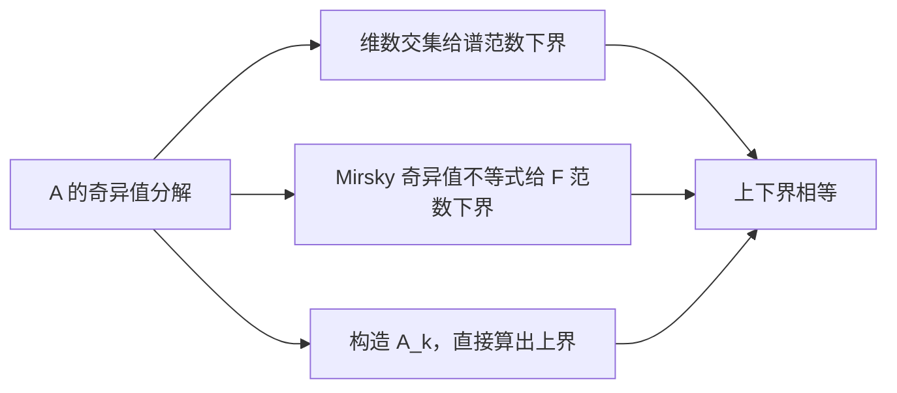

# 定理 - Eckart–Young–Mirsky

> [!abstract] 本章主问题
> 在所有秩不超过 $k$ 的矩阵中，怎样证明“保留最大的 $k$ 个奇异方向”不仅合理，而且确实全局最优？Eckart–Young–Mirsky 定理给出两步答案：截断 SVD 直接达到一个尾谱误差上界，而维数交集或奇异值不等式证明任何其他秩-$k$ 候选都不可能更好。

## 学习目标

完成本章后，你应能：

1. 准确定义截断 SVD $A_k$ 及秩约束可行集；
2. 陈述谱范数、Frobenius 范数和酉不变范数版本；
3. 直接计算 $A-A_k$ 的尾部奇异值与误差；
4. 用维数交集证明谱范数下界；
5. 用投影与 Ky Fan 原理证明 Frobenius 下界；
6. 解释 Mirsky 不等式如何推广到任意酉不变范数；
7. 区分最优值唯一、最优子空间唯一和最优矩阵唯一；
8. 将秩约束写成 $LR$ 因子化并识别 gauge 非唯一性；
9. 判断加权误差、缺失观测和任务损失下为何不能直接套定理；
10. 给出权重压缩/PCA 的输入输出误差边界与局限。

> [!question] 初学者读完必须能回答
> 1. $A_k$ 保留了哪些奇异三元组，它为什么一定满足秩约束？
> 2. 谱范数误差为何只看 $\sigma_{k+1}$，Frobenius 误差为何累计整个尾谱？
> 3. 怎样用子空间维数交集构造一个任何秩-$k$ 候选都无法逼近的方向？
> 4. Frobenius 下界的投影证明与 Mirsky 推广分别揭示了什么？
> 5. 为什么“存在闭式最优矩阵”不等于低秩因子化优化一定容易？
> 6. 最优误差值、最优子空间和最优矩阵的唯一性为什么要分开讨论？
> 7. 加权观测、缺失数据、量化约束或任务损失为何会越出定理边界？

下图回答：在第 $k$ 个奇异值处切开后，谱范数和 Frobenius 范数分别怎样读取尾误差，定理又在哪些任务上不再直接适用？

![[00-知识库管理/_assets/figures/low-rank-approximation/fig-eym-singular-tail-ledger-v2.svg|880]]

> [!figure] 图 1：截断 SVD 的奇异值账本、两种误差与任务边界
> **图源与改绘：** 本库原创教学图；问题脉络参照[[S-2024-Su-10407-低秩近似之路（二）SVD]]，定理依据参照 Eckart–Young、Mirsky 与 Golub–Van Loan。
>
> **怎样读图。** 左侧在第 $k$ 个奇异值后切开：蓝色部分构成 $A_k$，棕色尾谱构成误差。右上只取尾谱最大柱，得到谱范数误差 $\sigma_{k+1}$；右下累计尾谱平方能量，得到 Frobenius 误差。下栏提醒先检查实际目标是否真是酉不变矩阵范数。
>
> **适用边界（图没有证明什么）。** 定理约束的是矩阵秩并优化酉不变范数；它不直接处理非均匀权重、缺失条目、量化可行集或数据分布上的任务损失。当 $\sigma_k=\sigma_{k+1}$ 时，最优值仍确定，但截断子空间与最优矩阵可能不唯一。

## 进入正文前：丢弃一个方向也可以是可证明的最优决策

> [!info] 承接—中心—去路
> - **承接：** [[Moore-Penrose 伪逆]]精确反演每个非零奇异值，却可能放大短轴噪声；[[矩阵范数]]区分最坏方向误差与总体能量误差。
> - **中心：** 在秩不超过 $k$ 的所有候选中，截断 SVD 同时达到谱范数和 Frobenius 范数的全局最小误差；尾谱给出不可突破的误差账本。
> - **去路：** [[有效秩]]会把“应保留多少个方向”改写为阈值型或连续型维数诊断；实际压缩还需检查任务损失是否属于定理覆盖的酉不变范数。

### 两遍阅读路线

第一遍掌握 $A_k$、两条误差公式和谱范数维数交集证明。第二遍再读 Frobenius 投影证明、Mirsky 推广、唯一性、低秩因子化 gauge 与任务损失边界。

全章主线是：

$$
\text{构造 }A_k
\Longrightarrow
\text{算出可达到的尾误差}
\Longrightarrow
\text{证明任意 rank-}k\text{ 候选至少有同样误差}.
$$

### 本章的问题链

1. 截断 SVD 为什么天然满足秩约束？
2. 谱范数为何只读取最大尾奇异值，Frobenius 范数为何累计全部尾能量？
3. 怎样找到一个任何 rank-$k$ 候选都无法覆盖的输入方向？
4. 最优误差值、最优子空间和最优矩阵的唯一性为什么不同？
5. $A_k=LR$ 的非凸参数化为何不改变闭式最优值，却改变优化问题？
6. 加权误差、缺失观测、量化和任务损失为何可能越出定理边界？

### 回到 $A_\varepsilon$：删除短轴的代价恰好是 $\varepsilon$

对

$$
A_\varepsilon=\operatorname{diag}(1,\varepsilon),
\qquad0<\varepsilon<1,
$$

最佳 rank-1 截断是

$$
(A_\varepsilon)_1
=\operatorname{diag}(1,0)
=A_0.
$$

误差矩阵为

$$
A_\varepsilon-A_0
=\operatorname{diag}(0,\varepsilon),
$$

因此

$$
\|A_\varepsilon-A_0\|_2=\varepsilon,
\qquad
\|A_\varepsilon-A_0\|_F=\varepsilon.
$$

在二维 rank-1 情形，尾谱只有一个值，所以两种误差碰巧相等；高维多尾方向时 Frobenius 会累计平方能量。这里主动截断把条件数从 $1/\varepsilon$ 的精确反演问题，换成一个有偏但不再尝试恢复短轴的 rank-1 模型。

### 最小尾谱账本

| 决策 | 保留 | 丢弃 | 误差 |
|---|---|---|---|
| rank-$k$ 截断 | $\sigma_1,\ldots,\sigma_k$ | $\sigma_{k+1},\ldots$ | 由尾谱决定 |
| 谱范数 | 最大尾方向 | 其余尾方向不累计 | $\sigma_{k+1}$ |
| Frobenius | 头部平方能量 | 尾部平方能量 | $(\sum_{i>k}\sigma_i^2)^{1/2}$ |
| 一般任务损失 | 未必按 SVD 方向可分 | 需另建数据/权重模型 | EYM 不直接保证 |

> [!tip] 初学者的停靠点
> “SVD 压缩最优”必须补全三个限定：秩不超过 $k$、误差比较的是整个矩阵、范数是谱/Frobenius 或一般酉不变范数。缺少任一项，都不能直接把定理搬到任务性能上。

## 阅读前自检

- 已知 SVD 与谱/Frobenius 范数的奇异值表达；
- 能使用维数公式判断两个子空间交集非零；
- 理解 $\operatorname{rank}(B)\le k$ 是非凸约束；
- 注意定理优化的是矩阵范数，不是任意数据分布或任务损失。

## 前置条件与符号

设

$$
\boldsymbol{A}
=\boldsymbol{U}\boldsymbol{\Sigma}\boldsymbol{V}^{*}
=\sum_{i=1}^{r}\sigma_i\boldsymbol{u}_i\boldsymbol{v}_i^{*},
\qquad
\sigma_1\ge\cdots\ge\sigma_r>0.
$$

对 $0\le k<r$，定义截断 SVD

$$
\boldsymbol{A}_k
=\sum_{i=1}^{k}\sigma_i\boldsymbol{u}_i\boldsymbol{v}_i^{*}.
$$

显然 $\operatorname{rank}(\boldsymbol{A}_k)\le k$。

## 定理陈述

> [!theorem] Eckart–Young–Mirsky 定理
> 对任意 $\operatorname{rank}(\boldsymbol{B})\le k$：
> $$
> \|\boldsymbol{A}-\boldsymbol{B}\|_2
> \ge \sigma_{k+1},
> $$
> $$
> \|\boldsymbol{A}-\boldsymbol{B}\|_F
> \ge \left(\sum_{i=k+1}^{r}\sigma_i^2\right)^{1/2}.
> $$
> 两个下界都由 $\boldsymbol{B}=\boldsymbol{A}_k$ 达到。因此
> $$
> \min_{\operatorname{rank}(\boldsymbol{B})\le k}
> \|\boldsymbol{A}-\boldsymbol{B}\|_2=\sigma_{k+1},
> $$
> $$
> \min_{\operatorname{rank}(\boldsymbol{B})\le k}
> \|\boldsymbol{A}-\boldsymbol{B}\|_F
> =\left(\sum_{i=k+1}^{r}\sigma_i^2\right)^{1/2}.
> $$

> [!analysis] EYM 定理的七问拆解
> | 问题 | 回答 |
> |---|---|
> | 可行集是什么？ | 所有与 $A$ 同形且 rank 不超过 $k$ 的矩阵；不要求候选共享 $A$ 的奇异向量。 |
> | 构造候选为何容易？ | 保留前 $k$ 个奇异三元组得到 $A_k$，其 rank 至多为 $k$，误差奇异值正是尾谱。 |
> | 谱范数下界从哪里来？ | 前 $k+1$ 个右奇异方向组成的空间必与任意 rank-$k$ 候选的零空间有非零交；该方向至少留下 $\sigma_{k+1}$ 误差。 |
> | Frobenius 下界为何累计尾部？ | Frobenius 范数按正交奇异方向累加平方能量，任何 $k$ 维输出子空间最多捕获前 $k$ 项能量。 |
> | 何时最优矩阵不唯一？ | 若截断边界有重奇异值，最优值固定，但边界奇异子空间内部的 rank-$k$ 选择可以旋转。 |
> | 定理没有保证什么？ | 不保证低秩因子非凸优化容易，也不保证矩阵范数最优等于数据加权损失、量化误差或下游任务最优。 |
> | AI 中怎样调用？ | 作为权重压缩、PCA 与低秩适配的可解释基线；真实部署还需测激活分布、任务损失、量化和推理成本。 |

Mirsky 的推广表明：$\boldsymbol{A}_k$ 对任意酉不变范数都是最佳秩-$k$ 近似；最优误差由尾部奇异值在相应对称规范函数下的大小给出。

## 证明路线

## 第一步：截断 SVD 的误差

$$
\boldsymbol{A}-\boldsymbol{A}_k
=\sum_{i=k+1}^{r}\sigma_i\boldsymbol{u}_i\boldsymbol{v}_i^{*}.
$$

因此剩余矩阵的奇异值正是 $\sigma_{k+1},\ldots,\sigma_r$，从而

$$
\|\boldsymbol{A}-\boldsymbol{A}_k\|_2=\sigma_{k+1},
$$

$$
\|\boldsymbol{A}-\boldsymbol{A}_k\|_F^2
=\sum_{i=k+1}^{r}\sigma_i^2.
$$

这给出可达到的误差上界；还需要证明没有别的秩-$k$ 矩阵更好。

## 第二步：谱范数下界

令

$$
S=\operatorname{span}\{\boldsymbol{v}_1,\ldots,\boldsymbol{v}_{k+1}\},
\qquad \dim S=k+1.
$$

若 $\operatorname{rank}(\boldsymbol{B})\le k$，则 $\dim\mathcal N(\boldsymbol{B})\ge n-k$。由维数公式，

$$
\dim S+\dim\mathcal N(\boldsymbol{B})
\ge(k+1)+(n-k)=n+1,
$$

所以交集 $S\cap\mathcal N(\boldsymbol{B})$ 至少包含一个非零向量。取其中单位向量 $\boldsymbol{x}$，有 $\boldsymbol{B}\boldsymbol{x}=0$，并且

$$
\begin{aligned}
\|(\boldsymbol{A}-\boldsymbol{B})\boldsymbol{x}\|_2
&=\|\boldsymbol{A}\boldsymbol{x}\|_2\\
&=\left(\sum_{i=1}^{k+1}\sigma_i^2
|\langle\boldsymbol{x},\boldsymbol{v}_i\rangle|^2\right)^{1/2}\\
&\ge \sigma_{k+1}
\left(\sum_{i=1}^{k+1}
|\langle\boldsymbol{x},\boldsymbol{v}_i\rangle|^2\right)^{1/2}\\
&=\sigma_{k+1}.
\end{aligned}
$$

取单位向量上的上确界得到

$$
\|\boldsymbol{A}-\boldsymbol{B}\|_2\ge\sigma_{k+1}.
$$

## 第三步：Frobenius 范数下界

Mirsky 奇异值不等式的一个特例是

$$
\sum_i
(\sigma_i(\boldsymbol{A})-\sigma_i(\boldsymbol{B}))^2
\le
\|\boldsymbol{A}-\boldsymbol{B}\|_F^2.
$$

当 $\operatorname{rank}(\boldsymbol{B})\le k$ 时，$i>k$ 的 $\sigma_i(\boldsymbol{B})=0$，所以

$$
\|\boldsymbol{A}-\boldsymbol{B}\|_F^2
\ge
\sum_{i=k+1}^{r}\sigma_i(\boldsymbol{A})^2.
$$

这与 $\boldsymbol{A}_k$ 达到的误差相同，证明最优性。

### 初学者可重建的投影证明

上面的 Mirsky 不等式很强，但不应把 Frobenius 结论完全变成黑箱。令 $U=\mathcal R(B)$，$P$ 为到 $U$ 的正交投影，则

$$
A-B=(I-P)A+(PA-B).
$$

第一项每一列位于 $U^\perp$，第二项每一列位于 $U$，故在 Frobenius 内积下正交：

$$
\|A-B\|_F^2
=\|(I-P)A\|_F^2+\|PA-B\|_F^2
\ge\|(I-P)A\|_F^2.
$$

又

$$
\|(I-P)A\|_F^2
=\|A\|_F^2-\|PA\|_F^2.
$$

写 $AA^*=\sum_i\sigma_i^2u_iu_i^*$，则

$$
\|PA\|_F^2
=\operatorname{tr}(PAA^*)
=\sum_i\sigma_i^2\|Pu_i\|^2.
$$

各权重 $\alpha_i=\|Pu_i\|^2$ 满足 $0\le\alpha_i\le1$ 且

$$
\sum_i\alpha_i=\operatorname{tr}P=\operatorname{rank}P\le k.
$$

把最多 $k$ 单位权重分配给降序排列的 $\sigma_i^2$，最大只能是 $\sum_{i=1}^k\sigma_i^2$。因此

$$
\|(I-P)A\|_F^2
\ge\sum_{i=k+1}^r\sigma_i^2.
$$

这给出一个只依赖正交投影、迹和谱定理的完整证明。

## 与低秩因子化的等价

任意秩不超过 $k$ 的矩阵都可写成

$$
\boldsymbol{B}=\boldsymbol{L}\boldsymbol{R},
\qquad
\boldsymbol{L}\in\mathbb F^{m\times k},
\quad
\boldsymbol{R}\in\mathbb F^{k\times n}.
$$

因此

$$
\min_{\boldsymbol{L},\boldsymbol{R}}
\|\boldsymbol{A}-\boldsymbol{L}\boldsymbol{R}\|_F^2
$$

与在所有秩不超过 $k$ 的乘积矩阵上优化等价。最优乘积可以取 $\boldsymbol{A}_k$，例如

$$
\boldsymbol{L}=\boldsymbol{U}_k\boldsymbol{\Sigma}_k^{1/2},
\qquad
\boldsymbol{R}=\boldsymbol{\Sigma}_k^{1/2}\boldsymbol{V}_k^{*}.
$$

但因子不唯一：对任意可逆 $\boldsymbol{C}\in\mathbb F^{k\times k}$，

$$
(\boldsymbol{L}\boldsymbol{C})(\boldsymbol{C}^{-1}\boldsymbol{R})
=\boldsymbol{L}\boldsymbol{R}.
$$

## 一致性检查

- **$k=0$**：最佳近似是零矩阵，谱误差 $\sigma_1$、Frobenius 误差 $\|\boldsymbol{A}\|_F$。
- **$k\ge r$**：可取 $\boldsymbol{A}_k=\boldsymbol{A}$，误差为零。
- **秩一矩阵**：$k=1$ 时精确恢复。
- **单位阵 $\boldsymbol{I}_n$**：所有奇异值相等；任意选取 $k$ 维正交子空间都给出一个最优解，说明最优解可不唯一。
- **维度**：每个 $\boldsymbol{u}_i\boldsymbol{v}_i^{*}$ 都是 $m\times n$。

## 回看总图：截断、尾误差与适用边界

回看图 1：上界来自显式构造 $A_k$，下界来自“秩-$k$ 候选必然遗漏某个前 $k+1$ 维方向”或更一般的奇异值不等式。两端相遇，才构成最优性证明，而不只是观察到截断效果不错。

## 唯一性与边界

> [!warning] 最优值唯一，不代表最优矩阵总唯一
> 若截断点出现奇异值重数，即 $\sigma_k=\sigma_{k+1}$，可以在对应奇异子空间中旋转并得到多个最优解。Frobenius 范数下，$\sigma_k>\sigma_{k+1}$ 可保证截断子空间意义上的唯一最佳近似；对非严格凸范数还需更谨慎分析唯一性。

- 定理要求误差范数酉不变。加入非均匀元素权重、缺失观测或任务相关损失后，截断 SVD 通常不再最优。
- 最佳矩阵近似不保证下游任务最佳；小奇异方向可能携带预测所需信息。
- 秩约束集合非凸，因子化优化可能有鞍点、尺度不辨识和优化偏置；存在闭式最优乘积不等于梯度法总能到达它。

## 在 AI 中的连接

- 权重压缩：截断预训练权重在 Frobenius 意义下最优，但不直接最小化模型输出误差。
- LoRA：固定目标更新矩阵时，SVD 给出最优静态秩-$k$ 表示；训练低秩因子则是数据和损失驱动的另一问题。
- 线性 Attention/Nyström/CUR：结构、采样或核约束改变可行集合，需要不同误差定理。
- PCA：中心化数据的最佳线性 $k$ 维重构是该定理的直接结果。

### 从权重误差到单层输出误差

若用 $W_k$ 近似线性层 $W$，则对任意输入 $x$，

$$
\|(W-W_k)x\|_2
\le\|W-W_k\|_2\|x\|_2
=\sigma_{k+1}(W)\|x\|_2.
$$

这给出最坏方向的单层误差界。对 batch $X$，

$$
\|(W-W_k)X\|_F
\le\|W-W_k\|_2\|X\|_F.
$$

但进入多层网络后，误差还会被后续 Jacobian、激活模式、归一化和残差路径改变；矩阵最优不等于端到端损失最优。

## 计算与数值边界

- 若只需 $A_k$，不必计算完整 SVD；可用 Lanczos、随机 SVD 或子空间迭代；
- 近似算法需要区分“算法没找到精确 $A_k$”与“即使精确 $A_k$ 的尾误差也很大”；
- 当 $\sigma_k\approx\sigma_{k+1}$，最优值稳定但选定 $k$ 维子空间可能敏感；
- 应报告 $k$、阈值、oversampling、幂迭代次数、谱/尾能量误差与随机种子；
- 低秩因子 $L,R$ 的存储从 $mn$ 降至约 $k(m+n)$，但实际速度还取决于硬件、布局和是否融合算子。

## 复习检查

1. 为什么先算 $A-A_k$ 只给出上界，还没证明最优？
2. 谱范数下界中的交集为何必含非零向量？
3. 投影证明中两项为何 Frobenius 正交？
4. Ky Fan 权重论证为何把能量分配给前 $k$ 个方向？
5. $\sigma_k=\sigma_{k+1}$ 时哪些对象不唯一？
6. 为什么元素加权误差不再受 EYM 直接保证？
7. 单层谱误差界为什么不能等同端到端损失界？

## 习题与解答

- 习题：[[习题 - Eckart–Young–Mirsky]]
- 独立详解：[[解答 - Eckart–Young–Mirsky]]
- 大规模延伸：[[随机化低秩近似与随机 SVD]]

## 来源

- Carl Eckart & Gale Young, [The Approximation of One Matrix by Another of Lower Rank](https://doi.org/10.1007/BF02288367), *Psychometrika* 1(3), 1936, pp. 211–218。
- Leon Mirsky, [Symmetric Gauge Functions and Unitarily Invariant Norms](https://doi.org/10.1093/qmath/11.1.50), *Quarterly Journal of Mathematics* 11(1), 1960, pp. 50–59。
- [[S-2024-Su-10407-低秩近似之路（二）SVD]]。
- Gene H. Golub and Charles F. Van Loan, *Matrix Computations*, 4th ed., Chapter 2：SVD、范数与低秩近似。
