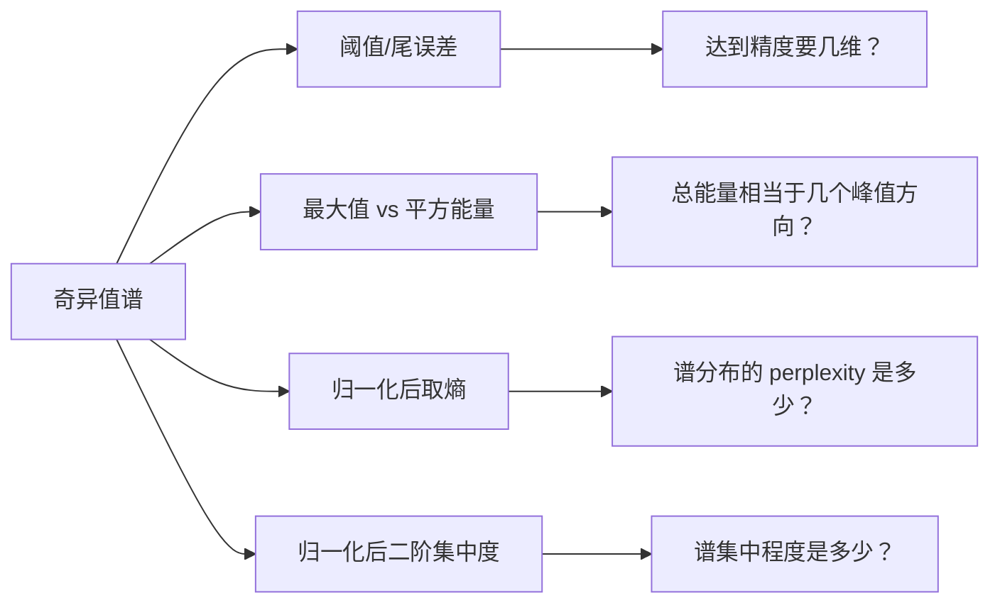

# 有效秩

> [!abstract] 本章主问题
> 一个矩阵的严格秩可能被极小噪声瞬间抬满，但它在当前任务中究竟表现得像多少维？“有效秩”不是唯一答案，而是一族把奇异谱压缩成维数诊断的指标：重构秩问误差预算，stable rank 比较总能量与峰值，熵秩和 participation ratio 描述谱质量的分散程度。

## 学习目标

完成本章后，你应能：

1. 解释严格秩为何对任意小扰动不连续；
2. 区分阈值/重构秩、stable rank、熵有效秩、participation ratio 和核谱比；
3. 写清概率是按 $\sigma_i$ 归一化还是按 $\sigma_i^2$ 归一化；
4. 证明连续型指标的尺度不变性、酉不变性与 $[1,r]$ 界；
5. 对给定小型奇异值谱手算多种有效秩；
6. 解释各指标对峰值、长尾和阈值的不同敏感性；
7. 正确处理零矩阵、近零矩阵和浮点阈值；
8. 选择完整 SVD、随机 SVD、幂迭代或流式能量统计；
9. 对权重、激活、协方差和 Attention 写清形状、中心化与秩上限；
10. 把有效秩作为描述性诊断，而不是性能或因果结论。

> [!question] 初学者读完必须能回答
> 1. 严格秩为什么在代数上自然，却对微小扰动不连续？
> 2. 重构秩、stable rank、熵有效秩和 participation ratio 各在回答哪一个问题？
> 3. 为什么熵秩或 PR 必须声明 $p_i\propto\sigma_i$ 还是 $p_i\propto\sigma_i^2$？
> 4. 哪些有效秩依赖阈值，哪些会被最大奇异值强烈控制？
> 5. 同一个长尾谱为什么可能在不同指标下得到很不一样的“维数”？
> 6. 零矩阵、近零矩阵与数值秩阈值应怎样单独约定？
> 7. 大矩阵无法完整 SVD 时，哪些量可以用幂迭代、随机 SVD 或迹估计获得？
> 8. 为什么有效秩变化不能单独证明表示更优、泛化更好或某机制成立？

下图回答：面对同一条长尾谱，四种有效秩各自把“重要维数”编码成了什么诊断问题？

![[00-知识库管理/_assets/figures/effective-rank/fig-effective-rank-spectrum-dashboard-v2.svg|880]]

> [!figure] 图 1：同一奇异谱的四种维数仪表与最小报告契约
> **图源与改绘：** 本库原创教学图；定义比较参照[[S-2025-Su-10847-矩阵的有效秩]]与 Roy–Vetterli 的熵有效秩框架。
>
> **怎样读图。** 顶部固定同一条长尾谱；下方四个仪表不竞争“谁才是真秩”，而是分别读取误差预算、相对峰值能量、谱熵和参与分散度。最下栏把可复现报告需要绑定的对象、中心化、归一化、阈值和估计器列成契约。
>
> **适用边界（图没有证明什么）。** 连续、尺度不变或落在 $[1,r]$ 内，并不意味着不同指标可互换。有限样本、batch 秩上限、中心化和尾谱估计都会系统性改变结果；有效秩是依赖对象与任务的描述量，不能脱离预测性能、干预或置信区间作因果解释。

## 进入正文前：近似维数不是一个脱离任务的唯一真值

> [!info] 承接—中心—去路
> - **承接：** [[定理 - Eckart–Young–Mirsky]]用误差预算决定需要保留多少奇异方向，[[矩阵扰动]]说明严格非零判据会被微小噪声改变。
> - **中心：** 有效秩是一组谱摘要：阈值秩回答重构预算，stable rank 回答总能量相当于多少个峰值方向，熵秩与 PR 回答谱质量怎样分散。
> - **去路：** [[极分解]]会保留全部奇异值但把方向与伸缩分开；模型表示分析则必须把有效秩与对象 shape、中心化、样本上限和任务指标共同报告。

### 两遍阅读路线

第一遍掌握严格秩不连续、重构秩、stable rank、熵有效秩和 PR。第二遍再读尺度/酉不变性证明、零矩阵约定、估计偏差、不同谱概率和真实 AI 报告合同。

全章主线是：

$$
\{\sigma_i\}
\xrightarrow{\text{选择问题}}
\begin{cases}
\text{误差预算型整数},\\
\text{能量/峰值比},\\
\text{熵或参与度型连续维数}.
\end{cases}
$$

### 本章的问题链

1. 严格秩为什么对任意小非零奇异值一视同仁？
2. 重构秩怎样把 EYM 尾误差和任务容限连接起来？
3. stable rank 为何只需 Frobenius 与谱范数？
4. 熵秩和 PR 为什么必须声明按 $\sigma$ 还是 $\sigma^2$ 归一化？
5. 连续、尺度不变与稳定是否意味着不同指标可以互换？
6. 权重、激活、协方差和 Attention 的有效秩为何有不同 shape 上限与中心化要求？

### 回到谱 $(1,\varepsilon)$：严格秩不变，连续仪表逐渐回到 1

对 $A_\varepsilon$，只要 $\varepsilon>0$，

$$
\operatorname{rank}(A_\varepsilon)=2.
$$

但 stable rank 为

$$
\operatorname{srank}(A_\varepsilon)
=\frac{1+\varepsilon^2}{1}
=1+\varepsilon^2,
$$

而使用 $p_i\propto\sigma_i$ 的 participation ratio 为

$$
r_{\mathrm{PR}}(A_\varepsilon)
=\frac{(1+\varepsilon)^2}{1+\varepsilon^2}.
$$

二者都在 $\varepsilon\downarrow0$ 时连续趋近 1，却以不同速度响应短轴。熵有效秩使用

$$
p=\left(\frac1{1+\varepsilon},\frac{\varepsilon}{1+\varepsilon}\right)
$$

计算 $\exp(H(p))$。重构秩则必须先给容限：若允许的相对谱误差至少为 $\varepsilon$，rank 1 已够；容限更严格时仍需 rank 2。

### 最小指标账本

| 指标 | 是否需要阈值 | 对短尾的主要反应 |
|---|---:|---|
| 严格秩 | 否，但依赖精确零 | 任意非零都计为 1 个完整方向 |
| 重构有效秩 | 是 | 直接由允许尾误差决定 |
| stable rank | 否 | 平方能量相对峰值 |
| 熵有效秩 | 否 | 谱概率的 Shannon 分散度 |
| PR | 否 | 谱概率的二阶集中度 |

> [!tip] 初学者的停靠点
> 报告“有效秩为 7.3”仍不完整。必须给出指标公式、使用 $\sigma$ 还是 $\sigma^2$、矩阵对象与 shape、中心化、阈值或估计器；否则不同实验的数字不可比较。

## 阅读前自检

- 严格秩等于正奇异值个数；
- $\|A\|_2=\sigma_1$、$\|A\|_F^2=\sum_i\sigma_i^2$、$\|A\|_*=\sum_i\sigma_i$；
- 截断 SVD 的 Frobenius 尾误差为 $\sum_{i>k}\sigma_i^2$；
- Shannon 熵 $H(p)=-\sum_i p_i\log p_i$，约定 $0\log0=0$。

## 为什么严格秩不够

严格秩是非零奇异值个数：

$$
\operatorname{rank}(\boldsymbol{A})
=\#\{i:\sigma_i(\boldsymbol{A})>0\}.
$$

它在精确代数中自然，但对扰动不连续。例如

$$
\operatorname{diag}(1,\varepsilon)
$$

对任意 $\varepsilon\ne0$ 都是秩 2，即使 $\varepsilon=10^{-100}$；当 $\varepsilon=0$ 时突然变成秩 1。浮点误差、测量噪声和近似模型需要连续或阈值化的替代。

## 主要定义

设 $\boldsymbol{A}\ne\boldsymbol{0}$，正奇异值为 $\sigma_1\ge\cdots\ge\sigma_r>0$。

### 1. 阈值/重构有效秩

给定相对 Frobenius 误差容限 $\varepsilon\in[0,1)$，定义

$$
r_{\varepsilon}^{(F)}(\boldsymbol{A})
=
\min\left\{k:
\frac{\|\boldsymbol{A}-\boldsymbol{A}_k\|_F}
{\|\boldsymbol{A}\|_F}
\le\varepsilon
\right\}.
$$

由[[定理 - Eckart–Young–Mirsky]]，等价于寻找最小 $k$ 使

$$
\sum_{i>k}\sigma_i^2
\le
\varepsilon^2\sum_i\sigma_i^2.
$$

它最直接回答“保留多少维才能达到指定重构精度”，但强烈依赖阈值和范数。

若关心最坏方向，可定义谱范数版本

$$
r_{\varepsilon}^{(2)}(A)
=\min\left\{k:\frac{\|A-A_k\|_2}{\|A\|_2}\le\varepsilon\right\}
=\min\{k:\sigma_{k+1}\le\varepsilon\sigma_1\}.
$$

同一个谱在 Frobenius 和谱范数容限下可能得到不同整数。前者累计尾能量，后者只看最大的被丢弃方向。

### 2. Stable rank

$$
\boxed{
\operatorname{srank}(\boldsymbol{A})
=
\frac{\|\boldsymbol{A}\|_F^2}{\|\boldsymbol{A}\|_2^2}
=
\frac{\sum_i\sigma_i^2}{\sigma_1^2}
}
$$

> [!analysis] Stable rank 公式的七问拆解
> | 问题 | 回答 |
> |---|---|
> | 它把什么换算成“维数”？ | 把全部平方能量除以单个最强方向的平方能量，得到相当于多少个峰值强度方向。 |
> | 为什么尺度不变？ | $A\mapsto cA$ 时分子分母都乘 $|c|^2$，比值不变。 |
> | 为什么酉不变？ | Frobenius 范数与谱范数都只依赖奇异值，左右乘酉矩阵不改变它们。 |
> | 为什么落在 $[1,r]$？ | 分子至少含 $\sigma_1^2$，又至多为 $r\sigma_1^2$。 |
> | 它与严格秩有何区别？ | 任意弱尾方向都会增加严格秩 1，却只按 $\sigma_i^2/\sigma_1^2$ 小幅增加 stable rank。 |
> | 它遗漏什么？ | 只知道总平方能量与峰值，无法区分不同长尾形状；两个谱可有相同 stable rank、不同重构误差曲线。 |
> | AI 中怎样调用？ | 快速诊断权重/激活/Jacobian 的能量分散；仍要报告 shape、中心化、样本秩上限与谱估计误差。 |

它衡量总平方能量相当于多少个“最大奇异值方向”。只需 Frobenius 范数和最大奇异值，通常比完整 SVD 便宜。

### 3. 熵有效秩

Roy–Vetterli 定义归一化谱

$$
p_i=\frac{\sigma_i}{\sum_j\sigma_j},
\qquad
H(\boldsymbol{p})=-\sum_i p_i\log p_i,
$$

并定义

$$
\boxed{
\operatorname{erank}_{H}(\boldsymbol{A})
=\exp(H(\boldsymbol{p}))
}
$$

它是谱分布的 perplexity：若能量均匀分布在 $q$ 个相等奇异值上，则结果正好是 $q$。

### 4. Participation ratio：先声明用哪种谱概率

$$
r_{\mathrm{PR}}(\boldsymbol{A})
=
\frac{\|\boldsymbol{A}\|_*^2}{\|\boldsymbol{A}\|_F^2}
=
\frac{(\sum_i\sigma_i)^2}{\sum_i\sigma_i^2}.
$$

它等于概率 $p_i=\sigma_i/\sum_j\sigma_j$ 的逆二阶集中度 $1/\sum_i p_i^2$。

物理、神经科学和表示分析中还常把**平方奇异值**当能量概率：

$$
q_i=\frac{\sigma_i^2}{\sum_j\sigma_j^2},
$$

并定义能量 participation ratio

$$
r_{\mathrm{PR},2}(A)
=\frac1{\sum_iq_i^2}
=\frac{(\sum_i\sigma_i^2)^2}{\sum_i\sigma_i^4}.
$$

二者都有人简称 PR，却数值不同。本库约定：无下标 $r_{\mathrm{PR}}$ 使用 Roy–Vetterli 的 $p_i\propto\sigma_i$；平方谱版本明确写 $r_{\mathrm{PR},2}$ 或“能量 PR”。

同理也有人定义能量熵秩

$$
\operatorname{erank}_{H,2}(A)
=\exp\left(-\sum_iq_i\log q_i\right).
$$

它不是本章默认的 $\operatorname{erank}_H$。论文或代码若只写 `effective_rank`，必须查看实际归一化公式。

### 5. 核范数/谱范数之比

$$
r_{*,2}(\boldsymbol{A})
=
\frac{\|\boldsymbol{A}\|_*}{\|\boldsymbol{A}\|_2}
=
\frac{\sum_i\sigma_i}{\sigma_1}.
$$

它同样位于 $[1,r]$，可看作奇异值总量相对于最大方向的有效数量。

## 共同性质与差异

对非零矩阵，以上连续型指标通常满足

$$
1\le r_{\mathrm{eff}}(\boldsymbol{A})
\le\operatorname{rank}(\boldsymbol{A}).
$$

并具有：

- **尺度不变**：$r_{\mathrm{eff}}(c\boldsymbol{A})=r_{\mathrm{eff}}(\boldsymbol{A})$，$c\ne0$；
- **酉不变**：左右乘酉矩阵不改变奇异值，因此不改变指标；
- **谱均匀时最大**：若 $r$ 个非零奇异值相等，多数定义都等于 $r$；
- **秩一时为 1**。

但它们对谱尾的敏感度不同：

| 指标 | 是否需完整谱 | 主要敏感对象 | 输出类型 |
|---|---|---|---|
| $r_{\varepsilon}^{(F)}$ | 通常需要前若干谱/尾能量 | 用户给定误差容限 | 整数 |
| Stable rank | 只需 $\sigma_1$ 与总平方和 | 最大方向相对总能量 | 连续实数 |
| 熵有效秩 | 需要全部奇异值之和和谱 | 整体谱均匀性 | 连续实数 |
| Participation ratio | 需要核范数与 F 范数 | 二阶集中度 | 连续实数 |
| $r_{*,2}$ | 需要核范数与最大奇异值 | 总谱质量与峰值 | 连续实数 |

### 性质证明而不只背结论

**尺度不变性。** 对 $c\ne0$，奇异值全乘 $|c|$。所有范数比值中的尺度相消，归一化概率 $p_i,q_i$ 也不变。

**酉不变性。** $UAV$ 与 $A$ 有相同奇异值，所以所有只依赖奇异值的定义不变。

**上下界。** 对非零矩阵，

$$
\operatorname{srank}(A)
=\frac{\sum_i\sigma_i^2}{\sigma_1^2}
$$

的分子至少含 $\sigma_1^2$、至多含 $r$ 个不超过 $\sigma_1^2$ 的项，因此位于 $[1,r]$。核谱比同理由

$$
\sigma_1\le\sum_i\sigma_i\le r\sigma_1
$$

得到。对任意支撑大小为 $r$ 的概率分布，熵满足 $0\le H(p)\le\log r$，所以 $1\le e^{H(p)}\le r$；逆集中度也由 $1/r\le\sum_i p_i^2\le1$ 得到。

所有这些连续型指标等于 $r$ 的典型条件都是 $r$ 个非零奇异值相等；等于 1 则对应秩一谱。阈值秩是整数，不满足同样的连续性。

### 指标之间不是固定排序

默认 $p_i\propto\sigma_i$ 时，Rényi 熵随阶数增加而不增，因此

$$
r_{\mathrm{PR}}=e^{H_2(p)}
\le e^{H_1(p)}=\operatorname{erank}_H.
$$

但 stable rank 使用 $\sigma_i^2/\sigma_1^2$，并非同一概率熵，所以不能不加证明地把它插入上述固定排序。阈值秩更会随 $\varepsilon$ 阶梯跳变。

## 可复现实验图

当 64 维指数谱从平坦逐渐变为尖锐时，不同“有效维数”是否会以相同速度下降？

![[00-知识库管理/_assets/plots/effective-rank/plot-effective-rank-exponential-spectrum-v2.svg|880]]

> [!figure] 图 2：指数衰减谱下四种有效秩的响应差异
> **图源与生成：** 本库确定性脚本[[plot_effective_rank_spectra.py]]生成；完整设置、数值表和复现实验见[[实验 - 不同奇异值谱下的有效秩比较]]。
>
> **怎样读图。** 横轴 $\alpha$ 越大，奇异值谱越集中。Stable rank 最快下降，因为它直接用最大奇异值归一化总平方能量；熵有效秩保留更多长尾质量；participation ratio 位于另一种集中度尺度；99% 能量秩是整数，因而呈阶梯状。曲线没有共同的固定比例或排序公式。
>
> **适用边界（图没有证明什么）。** 该图只覆盖维数 64 的指数谱族、指定归一化和 99% 能量阈值，不能推出任意谱族上的普遍排序，也不代表模型性能。改变按 $\sigma_i$ 或 $\sigma_i^2$ 归一化、阈值、有限样本估计器或尾谱截断都会改变曲线。

## 最小例子

取奇异值

$$
(\sigma_1,\sigma_2,\sigma_3)=(4,2,1).
$$

严格秩为 3，而

$$
\operatorname{srank}
=\frac{4^2+2^2+1^2}{4^2}
=\frac{21}{16}
=1.3125,
$$

$$
r_{\mathrm{PR}}
=\frac{(4+2+1)^2}{4^2+2^2+1^2}
=\frac{49}{21}
\approx2.333,
$$

而能量 PR 为

$$
r_{\mathrm{PR},2}
=\frac{(16+4+1)^2}{16^2+4^2+1^2}
=\frac{441}{273}
\approx1.615.
$$

$$
\operatorname{erank}_H
=\exp\left(
-\frac47\log\frac47
-\frac27\log\frac27
-\frac17\log\frac17
\right)
\approx2.60.
$$

这些答案都正确，但回答不同问题。只写“有效秩约为 2”而不写公式没有可复现意义。

## 零矩阵与数值阈值

> [!warning] 零矩阵需要单独约定
> 上述比值和谱概率在 $\boldsymbol{A}=0$ 时出现 $0/0$。有些实现约定有效秩为 0，有些返回未定义；本库默认写“未定义（可按应用约定为 0）”，并在代码中显式分支。

阈值数值秩还必须记录：

- 绝对阈值还是相对 $\sigma_1$ 的阈值；
- 阈值是否随矩阵维度与机器精度缩放；
- 奇异值来自精确 SVD、随机估计还是幂迭代；
- 指标是在权重、激活、协方差还是 Attention 矩阵上计算。

## 扰动稳定性：连续不等于同样稳

设 $\widehat A=A+E$。奇异值满足

$$
|\sigma_i(\widehat A)-\sigma_i(A)|\le\|E\|_2.
$$

由此可以区分：

- **严格秩**：任意小扰动都可能把零奇异值抬成非零，最不连续；
- **阈值秩**：只有当谱远离阈值时才局部稳定；谱穿过阈值就跳 1；
- **stable rank**：在 $A\ne0$ 附近连续，但若 $\sigma_1$ 和整体尺度都接近噪声底，比例仍缺乏统计意义；
- **熵/PR**：对非零谱连续，却可能受大量微小尾项和估计偏差影响；$x\log x$ 在零附近的导数并不温和；
- **整数重构秩**：即使最优重构误差连续，满足给定容限的最小 $k$ 仍可能跳变。

因此“continuous effective rank”比严格秩稳健，是局部数学性质；它不自动意味着小样本估计方差小。

## 怎样计算：完整谱不是唯一途径

| 指标 | 最小所需信息 | 大规模路径 | 主要偏差 |
|---|---|---|---|
| stable rank | $\|A\|_F^2,\sigma_1$ | 流式平方和 + 幂迭代 | $\sigma_1$ 低估会使结果偏高 |
| $r_{\varepsilon}^{(F)}$ | 前缀谱与总能量 | 随机 SVD + 尾能量估计 | 漏尾会使所需秩偏低 |
| 熵秩/默认 PR | 核范数和谱分布 | 随机化谱估计/小型代理 | 小奇异值总量难估 |
| 能量 PR | $\sum\sigma_i^2,\sum\sigma_i^4$ | trace/随机迹估计 | 随机方差与有限样本偏差 |

计算后至少检查：

1. 所有指标是否在 $[1,\operatorname{rank}_{num}]$ 或约定的零值范围；
2. 对 $cA$ 是否不变；
3. 对 $UAV$ 的正交变换是否不变；
4. 截断累计能量是否单调；
5. 估计值是否违反明显的范数上下界。

若跨训练步跟踪，应固定算法、迭代数、随机种子策略和阈值；否则曲线变化可能来自估计器而非模型。

## 回看总图：同一奇异谱，不同“维数问题”

回看图 1：只要改变“重要”的定义——超过阈值、贡献重构能量、相对峰值不弱或在概率质量中广泛参与——同一条谱就会产生不同的有效维数。结论必须与所选问题和报告契约一起出现。

## AI 对象、轴与秩上限

| 对象 | 形状 | 最大严格秩 | 前处理/解释重点 |
|---|---:|---:|---|
| 权重 $W$ | $d_{out}\times d_{in}$ | $\min(d_{out},d_{in})$ | 参数谱不等于激活谱 |
| batch 激活 $X$ | $N\times d$ | $\min(N,d)$；中心化后至多 $N-1$ | 样本按行还是列、是否中心化 |
| 协方差 $C=X_c^*X_c/N$ | $d\times d$ | 至多 $\min(N-1,d)$ | 其特征值是 $X_c$ 奇异值平方/尺度 |
| LoRA 更新 $\Delta W=BA$ | $d_{out}\times d_{in}$ | 至多参数秩 $r$ | 实际有效秩可远小于 $r$ |
| Attention $P$ | $T\times T$ | 至多 $T$ | mask、长度、head、行随机与非正规性 |
| 梯度矩阵 $G$ | 与参数相同 | 受 batch/结构限制 | 聚合方式和优化器前后应分开 |

跨层比较原始 effective rank 会受不同最大秩影响。可同时报告归一化指标

$$
\frac{r_{eff}(A)}{\min(m,n)},
$$

但这又回答“占可用维度的比例”，不能替代原始有效方向数。对不同 token 长度或 batch 大小，也应同时报告支持上限。

## 在 AI 中的连接

- 表示坍缩：激活或协方差谱集中时，有效秩下降，但必须区分批次大小造成的秩上限。
- Attention 秩：可用于描述注意力矩阵的谱集中，不能单独证明信息丢失或任务性能下降。

> [!connection] 到第四章的严格出口
> [[Attention 矩阵的秩、瓶颈与有效秩]]分别检查 logit、softmax weight 与 output 的 rank；[[低秩投影与序列维压缩 Attention]]则把“可压缩”变成指定 sequence axis、rank $k$、norm 与输出误差的合同。这里任一 effective-rank 数值都只是描述量，不能单独推出线性 Attention 可行、长上下文无损或任务性能改善。
- LoRA：目标秩 $r$ 是参数化上限，不等于实际更新的有效秩。
- 模型压缩：阈值有效秩直接连接允许的重构误差；任务损失可能更关心小奇异方向。
- 训练监控：Stable rank 计算较便宜，但最大奇异值的估计误差会直接影响结果。

> [!warning] 指标不是因果解释
> 有效秩变化与性能变化相关，不代表前者导致后者。不同层、样本分布、中心化方式和归一化方式都会改变谱。

## 边界与常见误区

1. **只写 effective rank**：至少给公式，尤其说明用 $\sigma_i$ 还是 $\sigma_i^2$ 归一化。
2. **把非整数当错误**：stable rank 和熵秩本来就是连续维数，可取 1.37。
3. **把目标秩当实际秩**：LoRA 的超参数 $r$ 只是上限，训练后谱可更集中。
4. **忽略中心化**：未中心化激活的首奇异方向常主要反映均值，而非样本变化。
5. **忽略样本上限**：$N$ 个中心化样本的协方差秩至多 $N-1$，低秩可能只是 batch 小。
6. **跨尺寸直接比较**：原始有效秩和可用最大秩都随 $m,n,T,N$ 改变。
7. **把小有效秩等同压缩可用**：Frobenius 重构好不保证任务损失保留，弱奇异方向可能任务关键。
8. **忽略估计偏差**：截断谱通常低估核范数和熵尾，幂迭代低估 $\sigma_1$ 则会高估 stable rank。
9. **阈值没有单位**：必须写绝对/相对阈值、dtype、噪声模型和矩阵尺度。
10. **把相关性当因果**：有效秩是诊断量，不单独证明表示坍缩导致性能下降。

## 复习检查表

- [ ] 我能解释严格秩的不连续性。
- [ ] 我能写出并手算五类有效秩。
- [ ] 我明确区分 $p_i\propto\sigma_i$ 与 $q_i\propto\sigma_i^2$。
- [ ] 我能证明尺度/酉不变性和 $[1,r]$ 界。
- [ ] 我知道阈值秩为什么会跳变。
- [ ] 我能根据是否有完整谱选择估计器。
- [ ] 我会报告对象形状、轴、中心化、阈值、估计方法和最大秩。
- [ ] 我不会把有效秩直接解释成任务性能或因果机制。

## 练习与解答

- 习题：[[习题 - 有效秩]]
- 独立详解：[[解答 - 有效秩]]

## 开放问题

- [x] 初步比较指数谱衰减下四种指标，见[[实验 - 不同奇异值谱下的有效秩比较]]。
- [ ] 扩展到幂律、分段平台和尖峰长尾谱。
- [ ] 分析 Attention 中行随机约束对奇异值与有效秩上界的影响。
- [ ] 比较权重有效秩与激活有效秩的可解释性。

## 来源

- Olivier Roy & Martin Vetterli, [The Effective Rank: A Measure of Effective Dimensionality](https://doi.org/10.5281/zenodo.40328), EUSIPCO 2007。
- [[S-2025-Su-10847-矩阵的有效秩]]。
