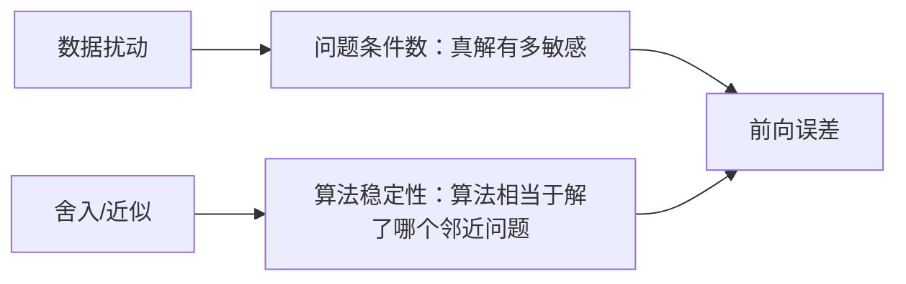

# 条件数

> [!abstract] 本章主问题
> 当数据、参数或舍入误差发生微小变化时，真解会移动多远？条件数描述问题本身的局部敏感性，算法稳定性则描述计算过程是否只引入一个邻近问题。对可逆线性系统，$\kappa_2(A)=\sigma_{\max}/\sigma_{\min}$；短奇异轴意味着反演时必须剧烈放大某些扰动。

## 学习目标

完成本章后，你应能：

1. 区分绝对条件数、相对条件数和分量条件数；
2. 从 Fréchet/Jacobian 导数写出一般问题的局部条件数；
3. 区分问题条件性、算法稳定性、残差、后向误差和前向误差；
4. 推导线性系统对右端项和系数矩阵扰动的误差界；
5. 从 SVD 解释 $\kappa_2(A)=\sigma_1/\sigma_n$；
6. 证明 $1/\kappa_2(A)$ 是到奇异矩阵集合的相对距离；
7. 解释正规方程为何平方条件数；
8. 区分预条件、坐标缩放和正则化的目标；
9. 使用残差计算后向误差，并用条件数解释前向误差；
10. 在大规模问题上估计条件数，而不显式形成逆矩阵；
11. 分析 Hessian、白化、隐式层和低精度训练中的条件性；
12. 写清矩阵形状、范数、扰动模型和可辨识子空间。

> [!question] 初学者读完必须能回答
> 1. 绝对条件数、相对条件数和分量条件数各自依赖什么扰动模型？
> 2. “问题病态”与“算法不稳定”为什么是两个独立判断？
> 3. 可逆方阵的 $\kappa_2(A)$ 为什么等于最长奇异轴与最短奇异轴之比？
> 4. $1/\kappa_2(A)$ 与到奇异矩阵集合的相对距离有什么关系？
> 5. 小残差为什么不必然推出小前向误差，后向误差在其中扮演什么角色？
> 6. 正规方程为什么会把二范数条件数平方？
> 7. 预条件和正则化分别改变了求解几何还是原问题？

下图回答：短奇异轴怎样把几何压扁转化成逆问题敏感性，以及问题条件性和算法稳定性怎样共同决定前向误差？

![[00-知识库管理/_assets/figures/conditioning/fig-condition-number-ellipse-error-chain-v2.svg|880]]

> [!figure] 图 1：条件数的椭球几何与误差闭环
> **图源与改绘：** 本库原创教学图；内容参照 Trefethen–Bau、Golub–Van Loan 与 Higham 的数值线性代数框架。
>
> **怎样读图。** 左栏把单位圆映成椭圆：正问题最多放大 $\sigma_{\max}$，而逆问题必须把最短轴 $\sigma_{\min}$ 拉回单位尺度，于是得到 $\kappa_2=\sigma_{\max}/\sigma_{\min}$。右栏把问题条件性与算法稳定性分开，二者通过“后向误差/残差 × 条件数”共同控制可保证的前向误差。
>
> **适用边界（图没有证明什么）。** 椭圆图直接对应可逆方阵；长方形矩阵需在可辨识子空间中使用最大奇异值与最小正奇异值，秩一旦丢失，相应逆问题条件数可视为无穷。条件数还依赖所选范数和扰动模型，单个 $\kappa_2$ 不能替代分量条件分析。

## 进入正文前：大范数与病态不是同一件事

> [!info] 承接—中心—去路
> - **承接：** [[矩阵范数]]测量正向作用有多大，[[奇异值分解]]同时给出最长轴 $\sigma_1$ 与最短可辨识轴 $\sigma_n$。
> - **中心：** 条件数比较输入扰动与真解变化的最坏相对放大；它属于问题与扰动模型，不等同于某个算法的舍入误差。
> - **去路：** [[矩阵扰动]]会从单个问题映射推广到谱值、方向与子空间；[[Moore-Penrose 伪逆]]会把反演限制在可辨识子空间。

### 两遍阅读路线

第一遍掌握问题条件性/算法稳定性区别、$\kappa_2=\sigma_1/\sigma_n$、右端扰动和残差链。第二遍再读一般导数条件数、系数矩阵扰动、到奇异集距离、分量模型、预条件与正则化边界。

全章主线是：

$$
\text{后向误差}
\xrightarrow{\times\ \text{问题条件数}}
\text{可保证的前向误差},
$$

而不是“残差小，所以答案必然准确”。

### 本章的问题链

1. 条件数属于数学问题、数据点还是具体算法？
2. 为什么同一映射在绝对、整体相对和分量相对模型下有不同条件数？
3. 线性反演为什么同时受到最长轴与最短轴控制？
4. 小残差怎样转成小后向误差，又为什么仍要乘条件数？
5. $1/\kappa_2(A)$ 为什么等于到奇异矩阵集合的相对距离？
6. 预条件与正则化分别改变求解坐标还是原问题？

### 回到 $A_\varepsilon$：短轴把微小右端误差放大

对

$$
A_\varepsilon=\operatorname{diag}(1,\varepsilon),
$$

有

$$
\kappa_2(A_\varepsilon)
=\frac{1}{\varepsilon}.
$$

令

$$
b=(1,\varepsilon)^T,
\qquad
A_\varepsilon x=b,
$$

则真解为 $x=(1,1)^T$。若只把右端第二分量扰动为

$$
\delta b=(0,\delta)^T,
$$

则

$$
\delta x=A_\varepsilon^{-1}\delta b
=(0,\delta/\varepsilon)^T.
$$

当 $\varepsilon$ 很小时，绝对值很小的 $\delta$ 也会导致显著解变化。相反，若扰动只沿第一方向，放大倍数为 1；条件数描述最坏方向，不声称所有扰动都达到上界。

此外取

$$
E_*=\operatorname{diag}(0,-\varepsilon),
$$

便有 $\|E_*\|_2=\varepsilon$ 且 $A_\varepsilon+E_*=\operatorname{diag}(1,0)$ 奇异，所以距奇异边界恰是最小奇异值。

### 最小条件账本

| 对象 | 对 $A_\varepsilon$ 的值 | 含义 |
|---|---:|---|
| $\|A\|_2$ | 1 | 最大正向放大 |
| $\|A^{-1}\|_2$ | $1/\varepsilon$ | 最大逆向放大 |
| $\kappa_2(A)$ | $1/\varepsilon$ | 最坏相对敏感性上界 |
| $\operatorname{dist}_2(A,\text{singular})$ | $\varepsilon$ | 失去可逆性所需最小绝对扰动 |

> [!tip] 初学者的停靠点
> 一个矩阵可以范数很大但条件数为 1，例如 $100I$；也可以范数为 1 却极病态，例如 $A_\varepsilon$。条件数衡量轴长比例和逆问题敏感性，不是矩阵元素或输出绝对大小。

## 阅读前自检

- 已掌握[[矩阵范数]]、SVD 和伪逆；
- 知道 $A:m\times n$ 的输入空间是 $\mathbb F^n$、输出空间是 $\mathbb F^m$；
- 能区分“精确问题的真解”和“算法输出”；
- 知道一阶近似 $f(x+\delta x)-f(x)\approx Df(x)[\delta x]$ 的含义。

## 问题条件性与算法稳定性

考虑问题映射 $f:\mathcal X\to\mathcal Y$。局部绝对条件数可写成

$$
\operatorname{cond}_{\mathrm{abs}}(f,\boldsymbol x)
=\lim_{\varepsilon\to0}
\sup_{\|\delta\boldsymbol x\|\le\varepsilon}
\frac{\|f(\boldsymbol x+\delta\boldsymbol x)-f(\boldsymbol x)\|}
{\|\delta\boldsymbol x\|}.
$$

若 $f$ 可微，它就是 Jacobian 的诱导范数。相对条件数则比较相对误差：

$$
\operatorname{cond}_{\mathrm{rel}}(f,\boldsymbol x)
\approx
\frac{\|\boldsymbol x\|}{\|f(\boldsymbol x)\|}
\|Df(\boldsymbol x)\|,
$$

但在输入或输出为零时需改用绝对误差或分量条件数。

> [!warning] 病态问题与不稳定算法是两个轴
> 好算法无法消除问题固有的敏感性，但应避免额外放大误差；稳定算法也可能在病态问题上产生较大前向误差。

### 从有限扰动定义到导数公式

若想避免“约等于”的含混，可把相对条件数定义成局部最坏放大率

$$
\operatorname{cond}_{\mathrm{rel}}(f,x)
=\lim_{\varepsilon\downarrow0}
\sup_{0<\|\delta x\|\le\varepsilon\|x\|}
\frac{\|f(x+\delta x)-f(x)\|/\|f(x)\|}
{\|\delta x\|/\|x\|}.
$$

当 $f$ Fréchet 可微且 $x,f(x)$ 非零时，

$$
f(x+\delta x)-f(x)
=Df(x)[\delta x]+o(\|\delta x\|),
$$

于是

$$
\boxed{
\operatorname{cond}_{\mathrm{rel}}(f,x)
=\frac{\|Df(x)\|\,\|x\|}{\|f(x)\|}
}.
$$

条件数因此不是某个矩阵专属概念，而是“问题映射的导数有多大”。矩阵条件数只是反演映射在线性方程问题中的特殊实例。

### 绝对、整体相对和分量相对误差

三种误差模型回答不同问题：

| 模型 | 输入约束 | 适合场景 | 盲点 |
|---|---|---|---|
| 绝对 | $\|\delta x\|\le\varepsilon$ | $x$ 可能为零、噪声有固定量纲 | 不具有尺度不变性 |
| 整体相对 | $\|\delta x\|\le\varepsilon\|x\|$ | 单位一致、只关心整体比例 | 小分量可被大分量遮蔽 |
| 分量相对 | $|\delta x_i|\le\varepsilon|x_i|$ | 数据逐项有相对精度 | 零分量需另行约定绝对容限 |

例如 $f(x)=x^2$ 在 $x\ne0$ 时绝对条件数为 $2|x|$，相对条件数为 2。函数没有改变，误差模型改变后“条件数”也会改变。

### 条件数、稳定性与总误差的逻辑链

若稳定算法返回的 $\widehat y$ 是某个邻近输入 $x+\Delta x$ 的精确输出，且

$$
\frac{\|\Delta x\|}{\|x\|}=O(u),
$$

那么在一阶范围内

$$
\frac{\|\widehat y-y\|}{\|y\|}
\lesssim
\operatorname{cond}_{\mathrm{rel}}(f,x)\,O(u).
$$

这条链说明：后向稳定只控制“算法引入的数据扰动”，前向精度还要乘问题条件数。若 $\kappa u\gtrsim1$，即使算法后向稳定，也可能没有可靠相对有效数字。

## 矩阵条件数

对可逆矩阵 $\boldsymbol A$ 和任意相容诱导范数，定义

$$
\kappa(\boldsymbol A)
=\|\boldsymbol A\|\,\|\boldsymbol A^{-1}\|.
$$

由 $\|\boldsymbol I\|\le\|\boldsymbol A\|\|\boldsymbol A^{-1}\|$，有 $\kappa(\boldsymbol A)\ge1$。二范数下，SVD 给出

$$
\kappa_2(\boldsymbol A)
=\frac{\sigma_1(\boldsymbol A)}{\sigma_n(\boldsymbol A)}.
$$

> [!analysis] 二范数条件数的七问拆解
> | 问题 | 回答 |
> |---|---|
> | 它在比较什么？ | $\sigma_1$ 是最大正向放大，$1/\sigma_n$ 是最大逆向放大；乘积得到最坏相对敏感性尺度。 |
> | 为什么整体缩放不改变它？ | $cA$ 的所有奇异值同时乘 $|c|$，比值保持不变；条件数测形状各向异性而非绝对大小。 |
> | 何时定义为无穷？ | 方阵奇异时 $\sigma_n=0$；某个输出方向无法唯一反演，任意小扰动都可能导致无界相对变化。 |
> | 长方形情形怎样理解？ | 满列秩时用最大与最小正奇异值，控制可辨识参数方向；秩亏时必须说明伪逆、商空间或正则化问题。 |
> | 它是精确放大倍数吗？ | 它是给定范数与扰动模型下的最坏上界；具体扰动若避开最敏感方向，实际放大可小得多。 |
> | 怎样连接奇异边界？ | $\operatorname{dist}_2(A,\text{singular})=\sigma_n$，故相对距离为 $1/\kappa_2(A)$。 |
> | AI 中怎样调用？ | 白化、Hessian/Gram 求解、隐式层、低精度训练与正规方程；必须区分预条件改善求解与正则化修改任务。 |

若 $\boldsymbol A$ 奇异，则约定 $\kappa_2(\boldsymbol A)=\infty$。对满列秩矩形矩阵，可定义

$$
\kappa_2(\boldsymbol A)=\frac{\sigma_1}{\sigma_n}
=\|\boldsymbol A\|_2\|\boldsymbol A^{+}\|_2,
$$

它控制最小二乘在可识别子空间上的敏感性。

## 线性系统对右端项的敏感性

考虑

$$
\boldsymbol A\boldsymbol x=\boldsymbol b,
\qquad
\boldsymbol A(\boldsymbol x+\delta\boldsymbol x)
=\boldsymbol b+\delta\boldsymbol b.
$$

因为 $\delta\boldsymbol x=\boldsymbol A^{-1}\delta\boldsymbol b$，

$$
\|\delta\boldsymbol x\|
\le\|\boldsymbol A^{-1}\|\,\|\delta\boldsymbol b\|.
$$

又有 $\|\boldsymbol b\|\le\|\boldsymbol A\|\|\boldsymbol x\|$，故

$$
\frac{\|\delta\boldsymbol x\|}{\|\boldsymbol x\|}
\le
\kappa(\boldsymbol A)
\frac{\|\delta\boldsymbol b\|}{\|\boldsymbol b\|}.
$$

这是最坏方向上界，不表示每个扰动都恰好被放大 $\kappa$ 倍。二范数下，最敏感的右端方向与最小奇异值对应的左奇异向量有关。

## 系数矩阵扰动

保持 $\boldsymbol b$ 不变，令

$$
(\boldsymbol A+\boldsymbol E)(\boldsymbol x+\delta\boldsymbol x)
=\boldsymbol b.
$$

精确整理得

$$
\delta\boldsymbol x
=-(\boldsymbol A+\boldsymbol E)^{-1}\boldsymbol E\boldsymbol x.
$$

若 $\|\boldsymbol A^{-1}\boldsymbol E\|<1$，Neumann 级数保证 $\boldsymbol A+\boldsymbol E$ 可逆，并有

$$
\frac{\|\delta\boldsymbol x\|}{\|\boldsymbol x\|}
\le
\frac{\kappa(\boldsymbol A)
\frac{\|\boldsymbol E\|}{\|\boldsymbol A\|}}
{1-\kappa(\boldsymbol A)
\frac{\|\boldsymbol E\|}{\|\boldsymbol A\|}}.
$$

分母说明：当相对扰动接近 $1/\kappa(\boldsymbol A)$ 时，矩阵可能被推到奇异边界附近，线性一阶估计不再可靠。

## 残差为何不能单独证明解准确

给定算法输出 $\widehat x$，定义残差

$$
r=b-A\widehat x.
$$

真实误差 $e=x-\widehat x$ 满足

$$
Ae=r,
\qquad
e=A^{-1}r.
$$

所以

$$
\frac{\|e\|}{\|x\|}
\le
\kappa(A)\frac{\|r\|}{\|b\|}.
$$

小残差只说明 $\widehat x$ 几乎满足方程；若 $A^{-1}$ 在某个方向放大很大，$\widehat x$ 仍可能离真解很远。

一个范数相对后向误差可定义为：允许同时扰动 $A,b$ 时，使

$$
(A+\Delta A)\widehat x=b+\Delta b
$$

成立的最小相对扰动。常用可计算尺度为

$$
\eta(\widehat x)
=\frac{\|r\|}{\|A\|\,\|\widehat x\|+\|b\|}.
$$

它把残差和问题数据的自然尺度放在同一个分母中。诊断线性求解器时应同时报告：

1. 缩放残差或后向误差 $\eta$；
2. 条件数估计 $\widehat\kappa$；
3. 预期前向误差尺度 $\widehat\kappa\eta$；
4. 若有参考解，再报告实际前向误差。

可复现反例见[[实验 - 小残差、大前向误差与条件数]]。

## 到奇异矩阵集合的距离

二范数下有几何等式

> [!theorem] 距离到奇异性
> 对可逆 $\boldsymbol A$，
> $$
> \min_{\boldsymbol A+\boldsymbol E\ \text{奇异}}
> \|\boldsymbol E\|_2
> =\sigma_{\min}(\boldsymbol A).
> $$
> 因而相对距离为
> $$
> \min_{\boldsymbol A+\boldsymbol E\ \text{奇异}}
> \frac{\|\boldsymbol E\|_2}{\|\boldsymbol A\|_2}
> =\frac1{\kappa_2(\boldsymbol A)}.
> $$

证明上界：取最小奇异三元组 $\boldsymbol A\boldsymbol v_n=\sigma_n\boldsymbol u_n$，令

$$
\boldsymbol E=-\sigma_n\boldsymbol u_n\boldsymbol v_n^{*},
$$

则 $(\boldsymbol A+\boldsymbol E)\boldsymbol v_n=0$ 且 $\|\boldsymbol E\|_2=\sigma_n$。下界由奇异值扰动不等式

$$
|\sigma_n(\boldsymbol A+\boldsymbol E)-\sigma_n(\boldsymbol A)|
\le\|\boldsymbol E\|_2
$$

得到。

## 最小例子

令

$$
\boldsymbol A_{\varepsilon}
=\begin{bmatrix}1&0\\0&\varepsilon\end{bmatrix},
\qquad 0<\varepsilon\ll1.
$$

则

$$
\kappa_2(\boldsymbol A_{\varepsilon})=\frac1\varepsilon.
$$

解 $\boldsymbol A_{\varepsilon}\boldsymbol x=(b_1,b_2)^{\top}$ 得

$$
\boldsymbol x=(b_1,b_2/\varepsilon)^{\top}.
$$

第二个输出坐标中的误差被放大 $1/\varepsilon$。这不是求逆算法“写坏了”，而是映射在第二个输入方向几乎压扁，逆问题必然需要把该方向重新放大。

## 正规方程为何平方条件数

若 $\boldsymbol A$ 满列秩，则 $\boldsymbol A^{*}\boldsymbol A$ 的特征值为 $\sigma_i^2$，所以

$$
\kappa_2(\boldsymbol A^{*}\boldsymbol A)
=\frac{\sigma_1^2}{\sigma_n^2}
=\kappa_2(\boldsymbol A)^2.
$$

因此用正规方程求最小二乘会在谱上平方条件数。QR 或 SVD 通常更稳健；SVD 还能显式处理数值秩与正则化。

## 坐标、缩放与预条件

条件数依赖所用范数和坐标缩放。把单位不同、量级差异巨大的特征直接拼接，可能人为制造较大的矩阵条件数。预条件通过可逆变换

$$
\boldsymbol M^{-1}\boldsymbol A\boldsymbol x
=\boldsymbol M^{-1}\boldsymbol b
$$

或变量替换改善求解器看到的谱，而不改变原方程的真解。

但不能简单说“换基后条件数变小，所以原问题不病态”：若输入/输出误差模型也随坐标变化，必须把度量一起变换。正交/酉换基保持二范数条件数，一般非酉换基不保持。

## 与正则化的关系

当小奇异方向主要承载噪声时，可使用截断 SVD 或 Tikhonov 正则化。岭解

$$
\boldsymbol x_{\lambda}
=(\boldsymbol A^{*}\boldsymbol A+\lambda\boldsymbol I)^{-1}
\boldsymbol A^{*}\boldsymbol b
$$

在奇异方向上的滤波因子是

$$
\frac{\sigma_i}{\sigma_i^2+\lambda},
$$

避免直接使用 $1/\sigma_i$。代价是引入偏差；正则化不是“恢复丢失信息”，而是在偏差与方差之间做选择。

### 预条件与正则化不是同一件事

| 操作 | 是否改变原问题的精确解 | 主要目标 | 典型代价 |
|---|---|---|---|
| 单位/坐标缩放 | 若连同变量解释一起变换，则不改变 | 让误差度量和数值尺度合理 | 解释必须随坐标更新 |
| 预条件 | 理想精确算术中不改变 | 改善迭代器看到的谱或聚类 | 构造、应用和并行成本 |
| 正则化 | 通常改变 | 抑制不可识别或噪声放大的方向 | 引入偏差和超参数 |

把 $A^*A$ 加上 $\lambda I$ 会改善被求解矩阵的条件数，但它同时改变目标；这不是“免费预条件”。反过来，左预条件 $M^{-1}A$ 不应直接用变换后残差替代原方程残差，验收仍要回到原问题。

## 条件数怎样估计：不要显式求逆

公式 $\kappa(A)=\|A\|\|A^{-1}\|$ 不授权我们形成 $A^{-1}$。显式逆通常更贵、存储更多，并可能掩盖求解结构。

| 场景 | 建议方法 | 说明 |
|---|---|---|
| 小型稠密、需准确 $\kappa_2$ | SVD | 直接得到 $\sigma_1,\sigma_n$ |
| 已有 LU/QR 分解 | 1-范数逆估计器 | 只需反复解 $Ax=y,A^*x=y$ |
| SPD 大矩阵 | Lanczos 估计极端特征值 | $\kappa_2=\lambda_{max}/\lambda_{min}$ |
| 只需筛查 | `rcond`/条件数下界 | 应写明只是估计，不作过度精确解释 |
| 隐式 Jacobian/Hessian | JVP/VJP + Krylov | 不形成巨型矩阵 |

若目标是判断数值是否危险，数量级往往比许多有效数字更重要。报告应包含范数、估计器、迭代/容差、是否预条件以及估计作用于原矩阵还是变换后矩阵。

## 二范数条件数的几何图景

回看图 1：最长轴控制正向最大放大，最短轴控制逆向最大放大；右侧误差链则提醒我们，前向误差必须同时结合问题条件数、算法后向稳定性和实际残差判断。

## AI 对象、形状与条件性

| 对象 | 典型形状 | 条件性问题 | 不能直接推出 |
|---|---:|---|---|
| 设计矩阵 $X$ | $N\times d$ | 回归可辨识性、最小二乘敏感性 | 测试集泛化好坏 |
| 局部 Hessian $H$ | $p\times p$ 或隐式算子 | 二次模型方向尺度差异 | 非凸全局收敛 |
| 激活协方差 $C$ | $d\times d$ | 白化/逆平方根稳定性 | 表示的语义质量 |
| 层 Jacobian $J$ | $d_{out}\times d_{in}$ | 局部正反向放大和压扁 | 整个数据分布上的鲁棒性 |
| 隐式层 Jacobian $I-D_zF$ | $d\times d$ | 固定点反向求解敏感性 | 迭代算法一定收敛 |
| Kronecker 预条件因子 | $d_i\times d_i$ | 逆根与阻尼尺度 | 完整 Fisher/Hessian 被精确反演 |

在 AI 中的具体连接：

- **Hessian 二次模型**：SPD 情形下，梯度下降在最坏界中的收敛因子受 $\kappa(H)$ 控制；预条件相当于改变局部度量。
- **白化与归一化**：若协方差有很小特征值，逆平方根会放大估计噪声，必须用 $C+\varepsilon I$、截断或收缩估计。
- **深层映射**：乘积条件数满足 $\kappa(AB)\le\kappa(A)\kappa(B)$，但这个上界可能极松；真实 Jacobian 还含激活导数和残差支路。
- **低精度训练**：当 $\kappa u$ 接近 1，舍入或量化扰动可吞掉有效数字；混合精度需结合缩放、累加精度和迭代改进。
- **线性探针**：高条件数使拟合权重对样本和正则强烈敏感；应同时报告数据预处理、岭参数和谱诊断。
- **隐式微分**：反向传播中的线性解既有问题条件性，也有求解器稳定性与停止误差，三者不能合并为“梯度不稳”。

## 边界与常见误区

1. $\kappa(\boldsymbol A)$ 大，不代表每个 $\boldsymbol b$ 都敏感；它描述最坏方向。
2. 条件数小，不保证某个实现稳定；算法可能额外放大舍入误差。
3. 绝对、相对、分量条件数回答不同误差模型，不能只写“条件数”而不说明范数和扰动方式。
4. 对非方阵、秩亏最小二乘，必须说明只在可辨识子空间上定义，或改用伪逆/截断条件数。
5. 条件数不是泛化能力的充分指标；改善谱可能改善优化，却不必然改善任务误差。
6. 行列式非零只证明精确可逆；多个奇异值的乘积无法单独告诉你最小奇异值有多小。
7. 小残差不是小前向误差；必须结合缩放后向误差与条件数。
8. 正则化改善了被修改问题的条件性，但没有恢复已被小奇异方向丢失的信息。
9. 一般换基可改变二范数条件数；若误差模型没有随坐标一起变换，比较会失去物理意义。
10. 对非正规特征值问题，$\sigma_1/\sigma_n$ 不是全部敏感性；还需左右特征向量、预解式或伪谱。

## 复习检查表

- [ ] 我能从导数定义写出一般问题的绝对/相对条件数。
- [ ] 我能明确说出条件数属于问题，后向稳定属于算法。
- [ ] 我能推导右端扰动与系数矩阵扰动界，并说明分母条件。
- [ ] 我能解释 $1/\kappa_2(A)$ 的距离几何。
- [ ] 我会从残差计算后向误差，并用 $\kappa\eta$ 解释可能的前向误差。
- [ ] 我不会为了计算 $\|A^{-1}\|$ 而显式形成 $A^{-1}$。
- [ ] 我能区分坐标缩放、预条件和正则化。
- [ ] 我能在 AI 问题中写清对象形状、范数、扰动方式和估计方法。

## 练习与解答

- 习题：[[习题 - 条件数]]
- 独立详解：[[解答 - 条件数]]

## 来源

- Lloyd N. Trefethen & David Bau III, *Numerical Linear Algebra*, SIAM, 1997。
- Gene H. Golub & Charles F. Van Loan, *Matrix Computations*, 4th ed., Johns Hopkins University Press, 2013。
- Nicholas J. Higham, *Accuracy and Stability of Numerical Algorithms*, 2nd ed., SIAM, 2002：条件性、稳定性、后向误差与估计器。
- [[奇异值分解]]、[[矩阵范数]]、[[矩阵扰动]]。
