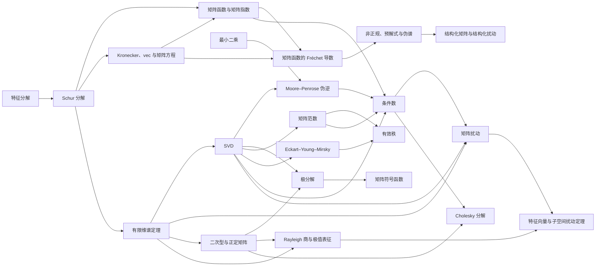

# 矩阵分析 MOC

> [!abstract] 本模块的任务
> 研究矩阵如何放大向量、怎样受扰动、如何分解，以及怎样在有限精度下近似。线性代数回答结构，矩阵分析进一步回答大小、稳定性、谱和误差。

## 当前教学迁移路线

> [!important] 正文状态与材料迁移状态分开
> 下表的 `syntax-clean` 表示节点内容、插图与基础结构已经存在，但尚未按本轮“课程位置—问题链—贯穿例—公式七问—停靠线”完成迁移；`regression-passed` 只表示材料通过仓库回归，不表示学习者已经闭卷掌握。

本卷 16 个正式正文节点按认知依赖重排为四波。旧的“下一批节点”保留建设历史，正式学习与本轮迁移以下表为准。

| 波次 | ID | 节点 | 本页解决的核心矛盾 | 材料迁移 |
|---|---|---|---|---|
| A | MA-01 | [[奇异值分解]] | 任意矩形映射怎样分成两组正交方向与非负伸缩？ | `regression-passed` |
| A | MA-02 | [[矩阵范数]] | 怎样按最坏方向、总体能量或谱总量衡量矩阵大小？ | `regression-passed` |
| A | MA-03 | [[条件数]] | 小数据误差为何可能造成大真解变化？ | `regression-passed` |
| A | MA-04 | [[矩阵扰动]] | 谱值、方向与子空间各需要什么稳定条件？ | `regression-passed` |
| B | MA-05 | [[Moore-Penrose 伪逆]] | 不可逆或矩形映射怎样实现规范最小范数反演？ | `regression-passed` |
| B | MA-06 | [[定理 - Eckart–Young–Mirsky]] | 截断 SVD 为什么给出酉不变范数下的最优低秩基线？ | `regression-passed` |
| B | MA-07 | [[有效秩]] | 严格秩不足以描述谱衰减时怎样量化近似维数？ | `regression-passed` |
| B | MA-08 | [[极分解]] | 一般矩阵怎样拆成方向因子与半正定伸缩？ | `regression-passed` |
| C | MA-09 | [[二次型与正定矩阵]] | 怎样由方向能量判断正定性与曲率？ | `regression-passed` |
| C | MA-10 | [[Cholesky 分解]] | 正定结构怎样转成无主元三角分解和稳定求解？ | `regression-passed` |
| C | MA-11 | [[Rayleigh 商与极值表征]] | 特征值和谱子空间怎样由变分问题刻画？ | `regression-passed` |
| C | MA-12 | [[特征向量与子空间扰动定理]] | 谱间隙怎样控制方向与谱簇子空间旋转？ | `regression-passed` |
| D | MA-13 | [[矩阵函数的 Fréchet 导数]] | 矩阵函数的一阶变化怎样成为方向线性算子？ | `regression-passed` |
| D | MA-14 | [[非正规矩阵、预解式与伪谱]] | 点谱为何可能遗漏瞬态放大与特征值敏感性？ | `regression-passed` |
| D | MA-15 | [[结构化矩阵与结构化扰动]] | 允许扰动受参数结构约束时条件性怎样改变？ | `regression-passed` |
| D | MA-16 | [[矩阵符号函数]] | 怎样用矩阵函数完成谱半平面分割并连接极分解？ | `regression-passed` |

首波固定使用

$$
A_\varepsilon=\operatorname{diag}(1,\varepsilon),
\qquad0<\varepsilon\le1,
$$

贯通“奇异轴—范数摘要—反演敏感性—距奇异边界与扰动稳定性”。

> [!tip] 第一波停靠线
> 完成 MA-01—04 后，应能对 $A_\varepsilon=\operatorname{diag}(1,\varepsilon)$ 独立写出 SVD，计算谱/Frobenius/核范数和 $\kappa_2=1/\varepsilon$；再对 $b=(1,\varepsilon)^T$ 与 $\delta b=(0,\delta)^T$ 推出 $\delta x=(0,\delta/\varepsilon)^T$，并构造范数为 $\varepsilon$ 的扰动把 $A_\varepsilon$ 推到奇异边界。最后必须说明谱值稳定、方向稳定、问题条件性和算法稳定性是四个不同判断。

> [!tip] 第二波停靠线
> 完成 MA-05—08 后，应能把 $A_\varepsilon$ 推到 $A_0=\operatorname{diag}(1,0)$：对 $b=(1,\beta)^T$ 算出最佳预测、残差、全部最小二乘解与最小范数解；证明最佳 rank-1 近似就是 $A_0$ 且两种尾误差均为 $\varepsilon$；计算 $\operatorname{srank}(A_\varepsilon)=1+\varepsilon^2$ 与所选 PR；再对 $M_\varepsilon=RA_\varepsilon$ 写出极分解 $M_\varepsilon=R A_\varepsilon$，解释为什么伸缩因子始终唯一而方向因子在秩亏端点失去唯一延拓。

第三波固定使用

$$
H_\tau=
\begin{bmatrix}1&1-\tau\\1-\tau&1\end{bmatrix},
\qquad0<\tau\le1,
$$

贯通“方向能量—正定裕量—Cholesky pivot—Rayleigh 极值—特征子空间旋转”。它还刻意分离两个常被混淆的边界：$\tau\downarrow0$ 时条件数发散但 eigengap 保持；$\tau\uparrow1$ 时条件数趋于 $1$ 但 eigengap 消失。

> [!tip] 第三波停靠线
> 完成 MA-09—12 后，应能写出 $H_\tau$ 的两组特征对和 Cholesky 因子，推出 $\rho_{H_\tau}(x)=(2-\tau)|c_+|^2+\tau|c_-|^2$；再对 $E_\eta=\operatorname{diag}(\eta,-\eta)$ 推出 $\tan(2\theta)=\eta/(1-\tau)$。最后必须解释：$\lambda_{\min}$ 控制正定裕量和求解条件性，簇外 eigengap 控制特征方向/子空间可辨识性，二者不是同一个分母。

第四波固定使用

$$
T_K=
\begin{bmatrix}-1&K\\0&-2\end{bmatrix},
\qquad
B_K=T_K+\frac32I
=
\begin{bmatrix}\tfrac12&K\\0&-\tfrac12\end{bmatrix},
$$

贯通“方向导数—预解式放大—结构化可达方向—半平面谱投影”。$T_K$ 的点谱固定为 $\{-1,-2\}$，但非正规耦合 $K$ 改变指数传播、伪谱和无结构条件性；平移后的 $B_K$ 保留特征向量几何，并把谱放到虚轴两侧供 matrix sign 分割。

> [!tip] 第四波停靠线
> 完成 MA-13—16 后，应能区分 $L_f(A)$、$L_f(A,E)$ 与伴随 VJP；由 $T_K$ 写出 $e^{tT_K}$ 和 $R(z;T_K)$，复述伪谱四定义等价链；说明为什么 $\lambda=-1$ 的无结构条件数为 $\sqrt{1+K^2}$、上三角结构化条件数却为 $1$；最后由 $B_K^2=\tfrac14I$ 推出 $\operatorname{sign}(B_K)=2B_K$，并验收两个斜谱投影。

> [!success] 10.3 静态课程材料已完成迁移
> MA-01—16 已全部通过本轮教学合同和仓库回归，卷级题—解—实验也已组成。材料状态是`regression-passed`，个人状态是`not-attempted`：前者证明材料可读、可算、可复现，不代表学习者已经完成口试、闭卷、独立评分、错题订正与延迟迁移。

## 当前主线



## 已建立节点

| 节点 | 稳定结论 | 还需补什么 |
|---|---|---|
| [[Moore-Penrose 伪逆]] | Penrose 存在唯一性、双投影、最小范数、谱滤波与秩变化边界 | 截断与正则化误差实验 |
| [[奇异值分解]] | 存在性、形状、四子空间、谱几何、算法选择与验收 | 奇异值重合处的导数专题 |
| [[极分解]] | 矩形/秩亏存在性、唯一性、最近 Stiefel 因子、Newton/NS/QDWH、Sylvester 微分与 Muon 接口 | 低精度与真实梯度谱实验；后继经典矩阵 sign |
| [[实验 - Newton-Schulz 极分解的条件数效应]] | 固定步误差由小奇异值抬升期控制，秩亏不能由多项式迭代恢复 | fp32/bf16、动态缩放与 QDWH 对照 |
| [[矩阵符号函数]] | 半平面谱分割、谱投影、sign 分解、block 根/polar、Newton/Schur、Fréchet 与非正规条件性 | 低精度迭代、rational/Krylov action 与真实 SSM Jacobian |
| [[实验 - 矩阵符号函数的谱分割与非正规敏感性]] | 固定点谱下，斜投影几何可使 sign、方向导数与统一缩放 Newton 成本同时增长 | fp32/bf16 求解、虚轴伪谱与高维 Schur 块 |
| [[矩阵范数]] | 诱导 $1/\infty/2$ 范数、Frobenius/核/Schatten、秩界、谱—核对偶、估计器与 AI 形状契约 | 更一般的混合诱导范数与真实卷积算子实验 |
| [[定理 - Eckart–Young–Mirsky]] | 谱/Frobenius 两条完整下界证明、酉不变推广、唯一性与任务边界 | 带权误差反例实验 |
| [[有效秩]] | 重构/stable/entropy/PR/核谱比、$\sigma$ 与 $\sigma^2$ 归一化、稳定性、估计偏差与 AI 报告契约 | 幂律谱和真实模型矩阵验证 |
| [[实验 - 不同奇异值谱下的有效秩比较]] | 指数谱上的指标敏感度 | 幂律与真实谱 |
| [[特征分解]] | 手算、可对角化判据、矩阵幂、缺陷/病态特征基与 AI 动力学边界 | 真实模型不变子空间实验 |
| [[Schur 分解]] | 复/实三角化、不变旗标、重排谱簇、正规特例、矩阵函数和 QR 数值接口 | QR 特征值算法与非正规伪谱实验 |
| [[Kronecker 积、向量化与矩阵方程]] | vec 恒等式、Sylvester/Lyapunov 唯一性、separation、结构求解与隐式 Jacobian | D4 的矩阵函数 Fréchet 导数与结构化扰动 |
| [[矩阵函数与矩阵指数]] | Jordan/Hermite/Cauchy 定义、指数与 ODE、Schur/Padé/action、Fréchet 导数与条件性 | Krylov 误差界、伪谱与时变系统 |
| [[矩阵函数的 Fréchet 导数]] | 算子定义、块公式、除差、exp/log/sqrt、Kronecker 条件数、伴随 VJP 与 action | 非正规 resolvent/伪谱界与结构化条件数 |
| [[非正规矩阵、预解式与伪谱]] | 正规/非正规几何、左右特征向量、resolvent、伪谱四定义、Kreiss 下界、数值域与 SSM 诊断 | 结构化伪谱、真实高维 SSM 与大规模稀疏计算 |
| [[结构化矩阵与结构化扰动]] | 线性/仿射/锥/流形/分层结构、基与 Gram 度量、切空间/投影/retraction、结构化条件数、后向误差、伪谱与 AI 参数化 | 闭卷证明、真实高维 LoRA/卷积/SSM 实验与结构保持算法审计 |
| [[定理 - 有限维谱定理]] | 正规/自伴酉对角化、谱投影、谱函数、数值验收与 AI 曲率接口 | 大规模真实谱实验 |
| [[Rayleigh 商与极值表征]] | 谱加权平均、极端值、Courant–Fischer、Ritz、Ky Fan、广义商与 PCA/Hessian 接口 | 闭卷证明与跨任务迁移验收 |
| [[条件数]] | 一般导数条件数、三种误差模型、线性系统界、奇异距离、残差链、估计器及预条件/正则化边界 | 真实隐式层和混合精度压力测试 |
| [[矩阵扰动]] | Weyl、主角度、Davis–Kahan/Wedin、方向导数、Bauer–Fike、结构化/随机扰动与 AI 验收 | 高维随机谱簇与真实模型子空间实验 |
| [[特征向量与子空间扰动定理]] | 单向量 sinθ 证明、主角度、投影距离、Davis–Kahan、Wedin、PCA/Hessian/LoRA 契约 | 高维随机矩阵概率界与非正规推广 |
| [[实验 - 谱间隙与特征向量稳定性]] | 谱值稳定不蕴含方向稳定 | 高维谱簇与非正规实验 |
| [[二次型与正定矩阵]] | 正定/半正定谱判据、Rayleigh 界、Gram 结构与 PSD 序 | 凸优化和核矩阵专题 |
| [[Cholesky 分解]] | 存在唯一性、递推、Schur 补、求解与 log-det | 高维稳定性与带主元版本 |
| [[实验 - 正定边界、条件数与 Cholesky pivot]] | 小特征值、条件数和消元 pivot 是同一退化的不同信号 | 高维变量顺序实验 |
| [[实验 - 稳定非正规系统的矩阵指数瞬态]] | 谱横坐标相同不意味着有限时间传播范数相同 | 高维 Schur 耦合与伪谱实验 |

## 卷级累计验收

| 验收件 | 覆盖与作用 | 当前状态 |
|---|---|---|
| [[阶段测验 - 矩阵分析（10.3）]] | 20分钟口试 + 270分钟、100分A—E闭卷，覆盖MA-01—16 | `regression-passed / not-attempted` |
| [[阶段测验解答 - 矩阵分析（10.3）]] | 完整证明、口试红线、反例、评分边界与AI研究合同 | `sealed until first attempt` |
| [[实验 - 矩阵分析累计复现门]] | `attempt_id + scorer nonce`随机指定正定、扰动/非正规或matrix-function/structure轨；含盲参数干预 | `regression-passed / not-attempted` |
| [[matrix_analysis_cumulative_contract_audit.py]] | 题—解隔离、解析模型、状态表面、Wiki链接、累计SVG与canonical双跑 | `regression-passed` |

### 卷末证据时间线

```text
20 分钟无提示口试
  → 270 分钟闭卷（冻结原稿）
  → scorer nonce 随机三轨 + 盲参数干预
  → 才打开独立详解并逐项归因
  → 48 小时换机制空白重建
  → 14 天陌生 AI 算子报告迁移
```

前一阶段输出必须先冻结，后一阶段才开放；不能先看解答再补写“原始推导”。`passed-initial`需要口试、闭卷与随机实验全部通过，`retained`还需要两次延迟门。材料回归通过不会自动产生个人学习证据。

### 四波统一模型族与三条证明主链

| 波次 | 贯穿对象 | 从入口追到出口 |
|---|---|---|
| A | $A_\varepsilon=\operatorname{diag}(1,\varepsilon)$ | SVD → norm → condition → distance/perturbation |
| B | $A_0$ 与 $M_\varepsilon=RA_\varepsilon$ | pseudoinverse → EYM → effective rank → polar uniqueness |
| C | $H_\tau$ 与 $E_\eta$ | quadratic/PSD → Cholesky → Rayleigh/min–max → subspace rotation |
| D | $T_K$ 与 $B_K$ | Fréchet → resolvent/pseudospectrum → structured condition → matrix sign/projectors |

闭卷的三条主证明链分别是：Rayleigh—Courant–Fischer—Cholesky；Weyl—residual angle—Eckart–Young；Cauchy/Fréchet—block identity—sign/projector—structured supremum。口试检查能否先说清对象与分母，实验只核对有限构造；三者互补，任何一项都不能替代另两项。

本卷不重复10.2的基础空间与分解构造，也不替代10.8的浮点算法验收。它统一检查norm—gap—condition—pseudospectrum—structure之间的判断链。材料、脚本与SVG存在只证明验收工具可执行；在真实口试、闭卷、nonce随机轨道、盲干预、48小时换机制和14天迁移完成前，MA-01—16继续保持`draft`。

## 必须同时保持的四种视角

| 视角 | 典型问题 | 失败时的表现 |
|---|---|---|
| 代数 | 秩、核、精确可逆性 | 方程无解或多解 |
| 几何 | 正交、投影、最小距离 | 度量选择不明确 |
| 谱 | 放大率、能量、低秩结构 | 小奇异值、谱集中 |
| 数值 | 浮点误差、条件数、迭代收敛 | 理论公式可用但计算不可靠 |

任何涉及“逆、秩或低秩”的 AI 笔记都必须检查这四层，避免把精确代数结论直接当作浮点算法。

## 与 AI 的接口

- **模型压缩**：截断 SVD 给出矩阵范数下的最优基线，但任务损失可能不同。
- **Attention**：奇异值谱、有效秩与掩码共同影响表达；仅看严格秩不足以解释模型行为。
- **训练稳定性**：谱范数、最小奇异值与条件数控制前向/反向扰动。
- **矩阵优化器**：Muon、Shampoo 等利用矩阵几何、极分解、逆平方根或预条件。
- **结构化曲率与隐式层**：Kronecker 因子、Sylvester 算子和 matrix-free VJP 把巨型 Jacobian 还原为可计算的矩阵作用。
- **结构化参数与约束优化**：LoRA、卷积、掩码、SPD 协方差、正交权重与稳定 SSM 都要求先声明允许扰动集，再投影环境梯度并用结构相容的有限步更新。
- **可微矩阵函数层**：Fréchet JVP/伴随 VJP 统一 SSM 指数、白化逆平方根、矩阵优化器和 Lie 参数化，并把重复谱与 eig 基退化分开。
- **动力系统谱分割**：经典 matrix sign 把连续时间线性化的衰减/增长不变子空间分开，但不能替代同侧非正规瞬态分析。
- **低秩适配**：因子化限制秩上限，同时带来非唯一参数化和非凸优化。
- **PCA 与表示谱**：Courant–Fischer/Ky Fan 给出方差最优性，Davis–Kahan/Wedin 用谱间隙判断方向或子空间是否可解释。
- **Hessian 曲率**：Rayleigh 商刻画方向曲率；顶部谱成簇时应比较主角度和投影，而不是强行追踪单个特征向量。

## 下一批节点

完整顺序见[[线性代数完整学习路线与掌握标准]]和[[数值线性代数 MOC]]。

1. 已完成 [[QR 分解]]、[[二次型与正定矩阵]]与[[Cholesky 分解]]，并建立正交性与正定边界实验。
2. 已完成 [[Schur 分解]]、[[矩阵函数与矩阵指数]]、[[极分解]]与[[矩阵符号函数]]，均已建立结构图、实验和 A–E 训练闭环；经典 sign、SVD 型 msign 与逐元素 sign 已严格分层。
3. D2 已完成 [[Rayleigh 商与极值表征]]与[[特征向量与子空间扰动定理]]，含两幅结构化教学图、30 道分层题及独立详解；谱值优化与方向稳定性已经分层。
4. D3 已完成 [[Kronecker 积、向量化与矩阵方程]]及配套 15 题、独立详解和结构图，为 D4 的矩阵函数方向导数建立算子接口。
5. D4 已完成 [[矩阵函数的 Fréchet 导数]]、[[非正规矩阵、预解式与伪谱]]与[[结构化矩阵与结构化扰动]]，共 45 题、三份独立详解和三幅图；10.3 的 16 个正文已经覆盖。
6. D0-N 已升级 [[矩阵范数]]、[[条件数]]、[[矩阵扰动]]与[[有效秩]]：新增 60 道 A–E 题、四份独立详解和四幅结构化教学图；度量—敏感性—谱稳定—近似维数链已形成初学者闭环。
7. 下一施工主线转入 10.4，从[[函数极限、连续性与收敛模式]]开始建立多元微积分、矩阵微分与自动微分先修链。
8. 10.3 的后续工作不再扩充核心节点，而是闭卷证明、实验复现、跨章迁移和间隔复查；全部通过后才升级状态。
9. 10.3卷级验收已回归：[[阶段测验 - 矩阵分析（10.3）]]、[[阶段测验解答 - 矩阵分析（10.3）]]与[[实验 - 矩阵分析累计复现门]]已把MA-01—16接成“口试—闭卷—随机三轨—盲干预—48小时—14天”闭环；[[matrix_analysis_cumulative_contract_audit.py]]验证材料为`regression-passed`，个人仍为`not-attempted`。
10. 2026-08-20 已完成首批导学与视觉升级：[[奇异值分解]]、[[矩阵范数]]、[[条件数]]、[[二次型与正定矩阵]]、[[Cholesky 分解]]和[[Rayleigh 商与极值表征]]统一加入“主问题—学习目标—自测问题—v2 总图—读图说明—适用边界”，旧概览图已从正文退出。
11. 2026-08-21 已完成第二批伪逆—低秩—极分解链升级：[[Moore-Penrose 伪逆]]、[[定理 - Eckart–Young–Mirsky]]、[[有效秩]]、[[极分解]]和[[矩阵符号函数]]已加入差异化 v2 总图与定义域边界；有效秩和极分解的实验曲线继续保留。余下 5 个正文节点进入扰动—导数—非正规—结构化收尾批次。
12. 2026-08-23 已完成 10.3 图像资源版本清零：最后五个扰动—导数—非正规—结构化节点已换用教材线稿、证明结构或脚本生成的 v2 图；两张保留实验曲线也已连同生成脚本升级。16 个正文共 18 个图文单元现均使用根目录稳定路径、明确宽度、图注、来源、读图说明与“图没有证明什么”。

每个节点同步建立[[练习与测验 MOC|A–E 习题、独立解答和阶段测验]]，不再把练习留到整章最后补写。

## 主要来源

- Roger Horn & Charles Johnson, *Matrix Analysis*。
- Gene Golub & Charles Van Loan, *Matrix Computations*。
- Leon Mirsky, [Symmetric Gauge Functions and Unitarily Invariant Norms](https://doi.org/10.1093/qmath/11.1.50)。
- Chandler Davis & W. M. Kahan, [The Rotation of Eigenvectors by a Perturbation. III](https://doi.org/10.1137/0707001)。
- Per-Åke Wedin, [Perturbation bounds in connection with singular value decomposition](https://doi.org/10.1007/BF01932678)。
- Yi Yu, Tengyao Wang & Richard J. Samworth, [A useful variant of the Davis–Kahan theorem for statisticians](https://doi.org/10.1093/biomet/asv008)。
- Nicholas J. Higham, [Functions of Matrices](https://epubs.siam.org/doi/10.1137/1.9780898717778)；Higham & Relton, [Higher Order Fréchet Derivatives](https://doi.org/10.1137/130945259)。
- 科学空间“低秩近似之路”及矩阵优化相关系列。
