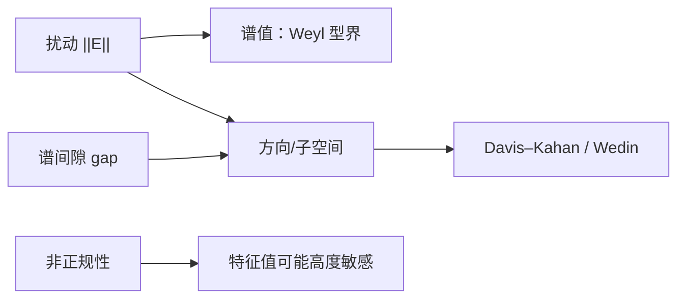

# 矩阵扰动

> [!abstract] 本章主问题
> “矩阵只改变了一点”究竟能保证哪些输出也只改变一点？Hermitian 特征值和任意矩阵的奇异值具有直接的 Lipschitz 稳定性，但方向与不变子空间还要除以谱间隙；当矩阵非正规时，特征值本身也可能对微小扰动高度敏感。因此扰动分析必须先声明研究对象、允许扰动集合、范数和谱隔离条件。

## 学习目标

完成本章后，你应能：

1. 把谱值、单个方向和不变子空间三层问题分开；
2. 从 Courant–Fischer 表征解释 Hermitian Weyl 界；
3. 使用奇异值 Lipschitz 界判断数值秩阈值；
4. 从二维例子推导方向旋转约为“扰动/谱间隙”；
5. 使用主角度和投影比较子空间，而非逐列比较符号；
6. 正确陈述 Davis–Kahan 和 Wedin 结论所需的谱簇、间隙与范数；
7. 解释 SVD 导数中的谱间隙分母与有限扰动界的统一性；
8. 用 Bauer–Fike 或伪谱理解非正规特征值敏感性；
9. 区分无结构扰动、结构化扰动、确定性最坏界和随机概率界；
10. 为 PCA、低秩截断、谱归一化和可微 SVD 写出形状、gap 与验收量。

> [!question] 初学者读完必须能回答
> 1. 谱值、单个方向和不变子空间为何是三个不同的稳定性问题？
> 2. Hermitian 特征值与奇异值为什么能被 $\|E\|_2$ 直接控制？
> 3. 特征向量旋转界中的谱间隙从哪里出现？
> 4. 重复谱时为什么应比较投影或主角度，而不是逐列比较向量？
> 5. Davis–Kahan 与 Wedin 分别控制哪类对象？
> 6. 非正规矩阵为何可能连特征值都对小扰动敏感？
> 7. 无结构最坏扰动、结构化扰动与随机噪声为何不能混用同一结论？

下面这张图回答：同样的扰动尺度，为什么对“谱值、方向和非正规谱”给出的保证完全不同？

![[00-知识库管理/_assets/figures/matrix-perturbation/fig-matrix-perturbation-three-levels-v2.svg|880]]

> [!figure] 图 1：矩阵扰动的三个稳定层次
> **图源与改绘：** 本库独立绘制；谱值层参照 Weyl 型界，方向层参照 Davis–Kahan/Wedin，非正规层参照预解式与伪谱理论。
>
> **怎样读图。** A 中的琥珀区间是确定性最坏移动范围，而不是随机误差条；B 中相同 $\|E\|$ 只有与 `gap` 比较后才能预测方向旋转；C 中黑点保持相同，但非正规伪谱可远超普通 $\varepsilon$ 圆盘，说明特征值敏感性不能只由点谱判断。
>
> **适用边界（图没有证明什么）。** 三个 panel 是定理结构的示意，不代替假设、常数和谱簇匹配条件。C 只表达可能性，并未给出某个具体矩阵的概率分布；真实模型还需声明扰动结构、绝对或相对尺度以及所用范数。

## 进入正文前：先声明你要稳定的是值、方向还是子空间

> [!info] 承接—中心—去路
> - **承接：** [[条件数]]研究一个问题映射在给定数据附近的最坏敏感性；本页把对象扩展到特征值、奇异值、单向量和谱簇子空间。
> - **中心：** Hermitian 特征值和奇异值可直接由 $\|E\|_2$ 控制；方向还需要谱间隙；非正规矩阵甚至可能连特征值都高度敏感。
> - **去路：** [[特征向量与子空间扰动定理]]会完整证明主角度界，[[非正规矩阵、预解式与伪谱]]会把“可能出现哪些扰动后特征值”变成几何集合。

### 两遍阅读路线

第一遍掌握三层对象、Weyl/奇异值 Lipschitz、噪声与 gap 的比值、主角度。第二遍再读 Davis–Kahan/Wedin 的谱簇条件、SVD 导数分母、Bauer–Fike、伪谱以及结构化/随机扰动边界。

全章主线是：

$$
\|E\|
\Longrightarrow
\begin{cases}
\text{谱值变化 }O(\|E\|),\\
\text{方向变化 }O(\|E\|/\mathrm{gap}),\\
\text{非正规特征值：还受特征向量几何/预解式控制}.
\end{cases}
$$

### 本章的问题链

1. “矩阵接近”必须用哪种范数和哪类允许扰动定义？
2. 为什么奇异值移动不超过 $\|E\|_2$？
3. 为什么谱值稳定并不推出单个方向稳定？
4. 重复或成簇谱为何应比较投影与主角度？
5. Davis–Kahan 和 Wedin 的 gap 分别隔离哪些谱块？
6. 非正规矩阵为什么突破“特征值附近小圆盘”的直觉？

### 回到 $A_\varepsilon$：值的稳定性可以达到等号

令

$$
E_\delta=\operatorname{diag}(0,\delta),
\qquad
\widehat A=A_\varepsilon+E_\delta
=\operatorname{diag}(1,\varepsilon+\delta).
$$

只要没有发生排序交叉，第二奇异值变化为

$$
|\sigma_2(\widehat A)-\sigma_2(A_\varepsilon)|
=|\delta|
=\|E_\delta\|_2,
$$

所以 Lipschitz 界可以是紧的。当 $\delta=-\varepsilon$ 时，最小奇异值恰好降到 0，与上一页“距奇异性为 $\varepsilon$”完全闭合。

但这个对角扰动不会旋转奇异向量，不能用来理解方向敏感性。方向必须转向正文的非对角扰动例子；在那里真正控制旋转的是 $\|E\|/\mathrm{gap}$，而不是 $\|E\|$ 单独一个数。

### 最小扰动账本

| 研究对象 | 典型比较量 | 额外条件 |
|---|---|---|
| Hermitian 特征值 | $|\widehat\lambda_i-\lambda_i|$ | Hermitian 结构 |
| 奇异值 | $|\widehat\sigma_i-\sigma_i|$ | 任意同形矩阵均可 |
| 单个方向 | 夹角 | 简单谱值与局部 gap |
| 谱簇子空间 | $\|\sin\Theta\|$ 或投影距离 | 目标簇与互补谱隔离 |
| 非正规特征值 | 伪谱/预解式 | 不能只看点谱 |

> [!tip] 初学者的停靠点
> 每次看到“稳定”先补全宾语：谱值稳定、向量稳定、子空间稳定还是算法后向稳定？这些结论使用不同假设，不能由其中一个自动推出其余三个。

## 阅读前自检

- Hermitian 矩阵可酉对角化，且特征值为实数；
- SVD 的左、右奇异向量分别属于输出和输入空间；
- $\|E\|_2$ 是最坏欧氏放大率；
- 重复特征值处单个特征向量不唯一，但对应不变子空间唯一。

## 三层问题必须分开

设观测或计算矩阵为

$$
\widehat{\boldsymbol A}=\boldsymbol A+\boldsymbol E,
$$

其中 $\boldsymbol E$ 可以表示采样噪声、量化误差、浮点误差、近似算法残差或一次训练更新。

| 层次 | 问题 | 典型控制量 |
|---|---|---|
| 谱值 | $\lambda_i$ 或 $\sigma_i$ 变化多少？ | $\|\boldsymbol E\|_2$ |
| 单个方向 | 特征向量/奇异向量旋转多少？ | 扰动大小 ÷ 局部谱间隙 |
| 子空间 | 一簇谱对应的整体空间旋转多少？ | $\sin\Theta$ 与簇间隔离 |

## Hermitian 特征值的 Weyl 型稳定性

设 $\boldsymbol A$、$\widehat{\boldsymbol A}=\boldsymbol A+\boldsymbol E$ 都为 Hermitian，特征值按降序排列。则

> [!theorem] Hermitian 特征值扰动
> $$
> |\lambda_i(\widehat{\boldsymbol A})-\lambda_i(\boldsymbol A)|
> \le\|\boldsymbol E\|_2,
> \qquad i=1,\ldots,n.
> $$

证明可由 Courant–Fischer 变分表征得到：对任意单位向量，

$$
|\boldsymbol x^{*}\boldsymbol E\boldsymbol x|
\le\|\boldsymbol E\|_2,
$$

因此所有 Rayleigh 商、进而极小极大特征值都至多移动 $\|\boldsymbol E\|_2$。

这个结论不需要特征值彼此不同；重复值时谱值仍稳定，但对应的单个特征向量没有唯一含义。

## 奇异值的稳定性

对任意同形矩阵 $\boldsymbol A,\widehat{\boldsymbol A}$，有

> [!theorem] 奇异值扰动
> $$
> |\sigma_i(\widehat{\boldsymbol A})-\sigma_i(\boldsymbol A)|
> \le\|\widehat{\boldsymbol A}-\boldsymbol A\|_2
> =\|\boldsymbol E\|_2.
> $$

> [!analysis] 奇异值扰动界的七问拆解
> | 问题 | 回答 |
> |---|---|
> | 它控制什么对象？ | 控制排序后的每个奇异值这一标量，不直接控制对应左右奇异向量。 |
> | 输入条件是什么？ | $A$ 与 $\widehat A$ 只需同形；不要求方阵、正规、满秩或奇异值简单。 |
> | 为什么使用谱范数？ | $\|E\|_2$ 是扰动对任意单位输入的最大欧氏作用，与奇异值的变分表征自然匹配。 |
> | 界能达到吗？ | 能；对角例 $E_\delta=\operatorname{diag}(0,\delta)$ 在不换序时使短奇异值恰移动 $|\delta|=\|E_\delta\|_2$。 |
> | 它怎样解释数值秩？ | 小于噪声尺度的奇异值可能被扰动推到 0 或与 0 无法区分，因此 rank 阈值必须绑定误差模型。 |
> | 为什么不能推出奇异向量稳定？ | 方向由谱间隙隔离；重合或近重奇异值中，子空间可稳定而内部基向量任意旋转。 |
> | AI 中怎样调用？ | 低秩截断、表示谱、PCA 与可微 SVD；报告噪声尺度、gap、比较的是值还是子空间。 |

因此大于噪声尺度的奇异值不能被轻易抹掉，远小于噪声尺度的“非零奇异值”却很难与数值/统计噪声区分。这是数值秩必须绑定阈值和误差模型的原因。

## 为什么方向还需要谱间隙

考虑对称二阶例子

$$
\boldsymbol A_{\delta}
=\begin{bmatrix}1+\delta&0\\0&1\end{bmatrix},
\qquad
\boldsymbol E_{\varepsilon}
=\begin{bmatrix}0&\varepsilon\\\varepsilon&0\end{bmatrix},
$$

其中原特征间隙为 $\delta>0$，扰动谱范数为 $|\varepsilon|$。$\boldsymbol A_{\delta}+\boldsymbol E_{\varepsilon}$ 的主特征向量相对 $\boldsymbol e_1$ 的旋转角满足

$$
\tan(2\theta)=\frac{2\varepsilon}{\delta},
\qquad
\theta=\frac12\operatorname{atan2}(2|\varepsilon|,\delta).
$$

- 若 $\delta\gg|\varepsilon|$，则 $\theta\approx|\varepsilon|/\delta$，方向稳定；
- 若 $\delta\lesssim|\varepsilon|$，角度可达到几十度；
- 若 $\delta=0$，原矩阵是单位阵的倍数，任何方向都是特征向量，讨论“原来的那个特征向量”没有基不变意义。

这正是[[实验 - 谱间隙与特征向量稳定性]]复现的现象。

## 用主角度比较子空间

设 $\mathcal U,\widehat{\mathcal U}$ 是相同维数的子空间，正交基矩阵分别为 $\boldsymbol U,\widehat{\boldsymbol U}$。$\boldsymbol U^{*}\widehat{\boldsymbol U}$ 的奇异值可写为

$$
\cos\theta_1\ge\cdots\ge\cos\theta_k,
$$

其中 $\theta_i\in[0,\pi/2]$ 是主角。常用距离包括

$$
\|\sin\boldsymbol\Theta\|_2
=\sin\theta_{\max}
=\|\boldsymbol P_{\mathcal U}-\boldsymbol P_{\widehat{\mathcal U}}\|_2,
$$

以及 Frobenius 版本。投影距离不受子空间内部换基、符号或相位影响，适合重复谱值和模型间比较。

## Davis–Kahan：Hermitian 不变子空间

> [!theorem] $\sin\Theta$ 结论的安全表述
> 设 $\boldsymbol A$ 与 $\widehat{\boldsymbol A}=\boldsymbol A+\boldsymbol E$ 为 Hermitian，$\mathcal U$、$\widehat{\mathcal U}$ 是对应于目标谱簇的不变子空间。若目标簇与另一矩阵的互补谱之间保持距离 $\delta>0$，则适当的酉不变范数下有
> $$
> \|\sin\boldsymbol\Theta(\mathcal U,\widehat{\mathcal U})\|
> \le\frac{\|\boldsymbol E\|}{\delta}.
> $$

不同版本对“$\delta$ 比较哪两组谱”和常数的写法不同，应用时必须逐条核对。若只知道原矩阵目标簇与其余谱的间隙 $\gamma$，并有 $\|\boldsymbol E\|_2<\gamma/2$，Weyl 界保证谱簇不会交叉，可使用常数更松但直观的

$$
\|\sin\boldsymbol\Theta\|_2
\lesssim\frac{2\|\boldsymbol E\|_2}{\gamma}.
$$

关键结构不是常数 1 或 2，而是“噪声/谱间隙”的比值。

## Wedin：奇异子空间

Wedin 型定理把 Davis–Kahan 的思想推广到矩形矩阵。若选定奇异值簇与其余奇异值保持分离，则左右奇异子空间的主角满足

$$
\max\left\{
\|\sin\boldsymbol\Theta(\mathcal U,\widehat{\mathcal U})\|,
\|\sin\boldsymbol\Theta(\mathcal V,\widehat{\mathcal V})\|
\right\}
\le C\frac{\|\boldsymbol E\|}{\delta},
$$

其中 $C$ 与具体范数、残差式和间隙定义有关。完整使用时不能省略：

1. 选的是哪一段奇异谱；
2. 间隙是跨哪两个矩阵/谱块定义；
3. 比较左子空间、右子空间还是两者；
4. 使用谱范数还是 Frobenius 范数。

## SVD 导数为何出现谱间隙分母

在奇异值简单且满足适当满秩条件时，SVD 微分中会出现

$$
F_{ij}=\frac1{\sigma_j^2-\sigma_i^2},
\qquad i\ne j.
$$

当两个奇异值接近，分母变小，奇异向量导数变大；当奇异值重合，单个奇异向量的选择不唯一，普通坐标公式出现奇异性。这与 Wedin 定理不是两件互不相关的事：局部微分和有限扰动界都揭示“方向敏感性由谱分离控制”。

对最大奇异值本身，若 $\sigma_1>\sigma_2$，有简单微分

$$
d\sigma_1=\boldsymbol u_1^{*}(d\boldsymbol A)\boldsymbol v_1,
$$

所以梯度为 $\boldsymbol u_1\boldsymbol v_1^{*}$；若最大奇异值重复，谱范数仍是 Lipschitz 函数，但一般不可微，只能谈次梯度。

### 一阶展开：值和方向为何有不同分母

对 Hermitian $A(t)=A+tE$ 的简单特征值 $\lambda_i(t)$ 和单位特征向量 $u_i(t)$，在 $t=0$ 有

$$
\lambda_i'(0)=u_i^*Eu_i,
$$

而选取 $u_i^*u_i'=0$ 的规范后，

$$
u_i'(0)
=\sum_{j\ne i}
u_j\frac{u_j^*Eu_i}{\lambda_i-\lambda_j}.
$$

第一式没有谱间隙分母，且 $|\lambda_i'|\le\|E\|_2$；第二式每个混合方向都除以 $\lambda_i-\lambda_j$。这从微分层面精确解释了：谱值可 Lipschitz 稳定，而方向在近重根处非常敏感。

推导第二式：对 $Au_i=\lambda_i u_i$ 求导，得

$$
Eu_i+Au_i'=\lambda_i'u_i+\lambda_i u_i'.
$$

左乘 $u_j^*$、$j\ne i$，利用 $u_j^*A=\lambda_j u_j^*$，得到

$$
(\lambda_i-\lambda_j)u_j^*u_i'=u_j^*Eu_i.
$$

将 $u_i'$ 在正交特征基中展开即得结论。

## 非正规矩阵：特征值也可能敏感

Hermitian 结论不能直接推广到一般方阵。考虑

$$
\boldsymbol A_M=
\begin{bmatrix}0&M\\0&0\end{bmatrix},
\qquad
\boldsymbol E_{\varepsilon}=
\begin{bmatrix}0&0\\\varepsilon&0\end{bmatrix}.
$$

$\boldsymbol A_M$ 的两个特征值都是 0，而

$$
\boldsymbol A_M+\boldsymbol E_{\varepsilon}
$$

的特征值是 $\pm\sqrt{M\varepsilon}$。扰动范数只有 $|\varepsilon|$，但特征值位移按平方根变化，并受非正规尺度 $M$ 放大。

若一般方阵可对角化为

$$
A=V\Lambda V^{-1},
$$

则 Bauer–Fike 定理给出：对 $A+E$ 的任意特征值 $\mu$，存在 $A$ 的某个特征值 $\lambda_i$，使

$$
\boxed{
|\mu-\lambda_i|
\le\kappa_2(V)\,\|E\|_2
}.
$$

证明要点：若 $\mu\notin\Lambda(A)$ 且 $(A+E)x=\mu x$，则

$$
x=(\mu I-A)^{-1}Ex,
$$

从而 $1\le\|(\mu I-A)^{-1}\|_2\|E\|_2$。再用

$$
(\mu I-A)^{-1}=V(\mu I-\Lambda)^{-1}V^{-1}
$$

上界预解式范数，便得到结论。若 $A$ 正规，可取 $V$ 酉、$\kappa_2(V)=1$；若特征向量基病态，圆盘会按 $\kappa_2(V)$ 放大。缺陷矩阵不能套用此版本，伪谱是更稳健的全局语言。

> [!definition] $\varepsilon$-伪谱
> $$
> \Lambda_{\varepsilon}(\boldsymbol A)
> =\left\{z:\ z\in\Lambda(\boldsymbol A+\boldsymbol E)
> \text{ for some }\|\boldsymbol E\|_2<\varepsilon\right\}.
> $$

等价地，在 $z\boldsymbol I-\boldsymbol A$ 可逆处，

$$
z\in\Lambda_{\varepsilon}(\boldsymbol A)
\iff
\|(z\boldsymbol I-\boldsymbol A)^{-1}\|_2>1/\varepsilon.
$$

伪谱比裸特征值更能揭示非正规动力学的瞬态增长和鲁棒稳定性。

## 扰动集合不同，问题就不同

经典界允许任意满足 $\|E\|\le\varepsilon$ 的矩阵，这是**无结构、确定性、最坏情况**模型。真实应用中的扰动常更窄：

| 来源 | 合法扰动示例 | 更合适的问题 |
|---|---|---|
| 样本协方差 | $\widehat C-C$ 为 Hermitian，且由样本生成 | 高概率谱界、PCA 子空间误差 |
| 量化权重 | 元素受网格和尺度限制 | 结构化/分量扰动与随机舍入 |
| LoRA 更新 | $E=UV^*$，秩至多 $k$ | 低秩允许方向中的最坏变化 |
| 卷积参数 | 由共享 kernel 诱导的算子扰动 | 参数空间到算子空间的 Jacobian |
| 浮点分解 | 满足某个算法的后向误差结构 | 先证明邻近问题，再套扰动定理 |

在同一范数下，限制合法扰动集合只会让最坏条件数不增大；但若改用了参数范数或概率尺度，就必须重新声明度量，不能直接比较数值。

确定性界回答“所有允许扰动中最坏会怎样”；随机矩阵界回答“给定分布下以多大概率怎样”。随机噪声通常不会精确对齐最坏方向，但这不推翻确定性上界。

## 数值实验与验收契约

| 任务 | 至少报告 | 主要失败信号 |
|---|---|---|
| Hermitian 特征值 | $\|E\|_2$、排序后谱差 | 谱差超过扰动范数（实现/尺度错误） |
| 特征子空间 | 目标簇、gap、$\|\sin\Theta\|$ | 逐列符号比较制造假差异 |
| 截断 SVD | $\sigma_k-\sigma_{k+1}$、左右投影距离 | 误差值稳但基剧烈旋转 |
| 可微 SVD | 重数、gap、梯度有限差分/VJP 检查 | gap 很小时梯度爆大或 NaN |
| 非正规特征值 | 左右残差、$\kappa(V)$ 或伪谱 | 小残差被误读为小前向谱误差 |

计算子空间距离时，若 $U,\widehat U\in\mathbb F^{n\times k}$ 列正交，可通过 $U^*\widehat U$ 的奇异值求主角，也可直接算

$$
\|UU^*-\widehat U\widehat U^*\|_2.
$$

对大规模矩阵不必形成投影矩阵；可利用正交基和小型 $k\times k$ SVD。实验应扫描多个 $\|E\|/\mathrm{gap}$ 比率，而不是只展示一个噪声点。现有可复现实验见[[实验 - 谱间隙与特征向量稳定性]]。

## 回看总图：值、方向与非正规性的三层边界

回看图 1：从 A 到 B 增加的是谱间隙，从 B 到 C 改变的是矩阵类别。若不先说明正在研究哪一层，就会把“谱值稳定”误读成“表示方向稳定”，或把 Hermitian 结论误套到一般非正规矩阵。

左图表示谱值移动被 $\|E\|_2$ 控制；中图表示相同扰动在 gap 小时可造成大角度旋转；右图表示非正规特征基或大预解式会让特征值本身也高度敏感。

## AI 对象与形状

| 对象 | 形状 | 目标谱/子空间 | 必须同时记录 |
|---|---:|---|---|
| 中心化激活 $X$ | $N\times d$ | 右奇异表示子空间 | batch、中心化、$\sigma_k-\sigma_{k+1}$ |
| 协方差 $C=X^*X/N$ | $d\times d$ Hermitian PSD | PCA 主特征子空间 | $\|\widehat C-C\|$ 或统计上界 |
| 权重 $W$ | $d_{out}\times d_{in}$ | 左/右奇异子空间 | 扰动是训练步、量化还是压缩 |
| Attention $P$ | $T\times T$ | 奇异值/奇异子空间 | mask、token 长度、行随机不保证正规 |
| Hessian $H$ | $p\times p$ 或隐式 | 顶部/底部曲率子空间 | 对称化误差、Ritz 残差、gap |

这些对象不能只写“特征向量变了多少”：矩形权重应说明左还是右空间，协方差要说明样本估计，Hessian 要说明隐式算法的 Ritz 残差，Attention 还要警惕非正规性。

## 在 AI 中的连接

- **PCA/表示子空间**：协方差估计误差小并不自动保证主方向稳定；还需主特征值与后续谱之间有足够间隙。
- **谱归一化**：幂迭代跟踪最大奇异向量；$\sigma_1\approx\sigma_2$ 时方向收敛慢且梯度可能不稳定，但最大奇异值估计仍可较稳。
- **可微 SVD/白化**：重复或接近奇异值会放大反向传播中的谱间隙分母，应使用阻尼、子空间形式或专门的稳定梯度。
- **低秩截断**：若 $\sigma_k-\sigma_{k+1}$ 很小，最佳误差值稳定，但选出的秩-$k$ 子空间可能显著旋转。
- **量化与低精度**：谱值误差可由量化误差矩阵范数上界；方向误差仍需结合 gap。
- **训练动力学**：非正规 Jacobian/权重乘积可能在特征值看似安全时产生短时放大，不能只看谱半径。

## 边界与常见误区

1. “特征值稳定”不等于“特征向量稳定”。
2. gap 必须说明是哪个谱簇与哪个互补谱之间的距离；只写“最小特征值差”通常不够。
3. 重复谱值处应比较整个不变子空间/投影，而不是强行配对单个向量。
4. Davis–Kahan 依赖 Hermitian/对称结构；一般非正规矩阵需特征向量条件数、Bauer–Fike、Schur 或伪谱工具。
5. 上界是最坏情况保证，不代表随机噪声一定达到该角度；统计结构可给出更精细的概率界。
6. $\sigma_k$ 稳定不保证阈值秩稳定；若阈值就在谱附近，极小扰动即可改变整数秩。
7. 逐列比较奇异向量会受到符号、相位、排列和簇内旋转影响；应优先比较投影。
8. 自动微分返回一个选定基的导数，不表示重复谱处存在基不变的唯一向量导数。
9. 参数扰动小不自动意味着算子扰动小；卷积、共享参数和因子化需要参数到矩阵的导数界。
10. 小 Ritz/特征残差是后向信息；非正规时仍不能直接推出小前向特征值误差。

## 复习检查表

- [ ] 我能分别陈述谱值、单方向和子空间的扰动问题。
- [ ] 我能从极小极大表征解释 Weyl 界的 $\|E\|_2$。
- [ ] 我能从二维例子算出 $\tan(2\theta)=2\varepsilon/\delta$。
- [ ] 我能用主角度或投影距离处理重复谱值。
- [ ] 我会在使用 Davis–Kahan/Wedin 时写明目标簇、互补谱、gap 和范数。
- [ ] 我能解释方向导数中的谱间隙分母。
- [ ] 我知道一般非正规矩阵为何需要 Bauer–Fike 或伪谱。
- [ ] 我会区分无结构、结构化与随机扰动模型。

## 练习与解答

- 习题：[[习题 - 矩阵扰动]]
- 独立详解：[[解答 - 矩阵扰动]]

## 来源

- Chandler Davis & W. M. Kahan, [The Rotation of Eigenvectors by a Perturbation. III](https://doi.org/10.1137/0707001), *SIAM Journal on Numerical Analysis* 7(1), 1970, pp. 1–46。
- Per-Åke Wedin, [Perturbation bounds in connection with singular value decomposition](https://doi.org/10.1007/BF01932678), *BIT* 12, 1972, pp. 99–111。
- [[S-2025-Su-10878-SVD的导数]]，作为谱间隙、可微性和 AI 反向传播的桥接来源。
