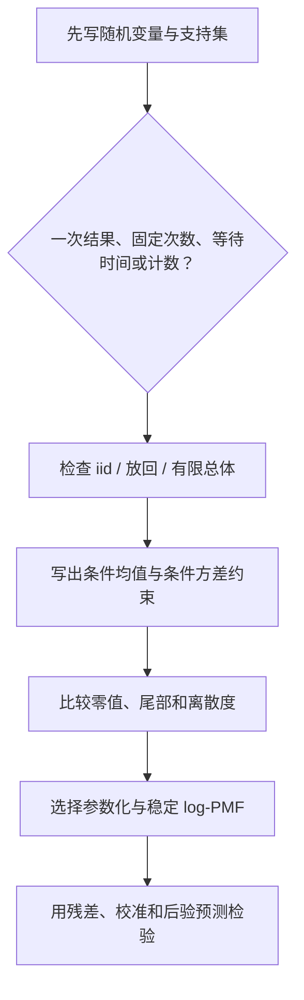

# 常用离散分布

> [!abstract] 本章主问题
> 离散分布不是一张需要死记的公式表，而是随机机制的压缩描述：一次二元试验产生 Bernoulli，固定次数的独立重复产生 Binomial，等待成功产生 Geometric，固定类别试验的计数产生 Multinomial，不放回抽样产生 Hypergeometric，稀有独立事件的计数极限产生 Poisson。先识别机制、支持集与条件，再选择分布，比看到“计数”就套 Poisson 可靠得多。

## 学习目标

完成本章后，应能：

1. 从随机实验而不是关键词识别 Bernoulli、Categorical、Binomial、Multinomial、Geometric、Negative Binomial、Hypergeometric 与 Poisson；
2. 对每个分布写出随机变量、参数空间、支持集、PMF、均值和方差；
3. 从独立试验、组合计数、指标变量或极限推导主要公式；
4. 证明 Geometric 的无记忆性、Poisson 的可加性与 Binomial 的 Poisson 极限；
5. 使用概率生成函数统一求矩与独立和的分布；
6. 在大参数、极小概率和尾部区域稳定计算 PMF/log-PMF；
7. 审计分类、token 采样、计数建模和离散潜变量中的支持集、独立性与过度离散假设。

> [!question] 初学者读完必须能回答
> 1. 同一串 Bernoulli 试验为什么会产生 Binomial、Geometric 和 Negative Binomial？
> 2. Categorical 与 Multinomial 的记录对象有何不同？
> 3. Hypergeometric 为什么不能用独立试验公式？
> 4. Poisson 极限除了 $n$ 大还需要哪些缩放条件？
> 5. 支持集、参数范围、均值与方差怎样从生成机制核对？
> 6. “计数数据”为什么不自动等于 Poisson 模型？

先用下图回答一个视觉问题：**分布名称怎样由“试验机制 + 记录对象 + 依赖结构 + 极限尺度”共同决定？**

![[00-知识库管理/_assets/figures/probability/fig-discrete-distribution-mechanisms-v2.svg|880]]

> [!figure] 图 10.5.4｜二元重复、多类别/无放回与 Poisson 极限
> A 展示同一 Bernoulli 序列因记录总数或等待时间而产生不同分布；B 对照 iid 多类别计数与无放回抽样；C 写出 Binomial 到 Poisson 的完整稀有事件缩放。来源：独立绘制；生成脚本：[[plot_probability_foundations_v2.py]]；确定性结构示意，无随机种子。

**怎样读图。** A 先固定底层试验，只改变随机变量；B 再比较放回/独立与不放回的依赖差异；C 最后同时检查 $n\to\infty$、$p_n\to0$ 和 $np_n\to\lambda$，不能只凭样本量大使用 Poisson。

**适用边界（图没有证明什么）。** 箭头表示生成或极限关系，不表示这些分布在任意参数下彼此近似。图没有给出尾部近似误差，也不能诊断真实计数数据中的过度离散、零膨胀或非平稳性。

## 进入正文前：分布名首先是生成机制的缩写

> [!info] 课程位置
> 前两章已经给出期望、方差、协方差和条件期望。本章不再逐个孤立背诵 PMF，而是学习从“试验怎样生成、记录什么量、条件独立是否成立”推出离散分布。下一章把同样方法用于连续支持集，并用指数族统一许多公式。

> [!tip] 建议两遍阅读
> - 第一遍只比较“固定成功率的 Binomial”与“随机成功率混合后的 Beta-Binomial”，看清相同边缘成功率为何仍可有不同计数方差。
> - 第二遍再按正文的机制表学习 Bernoulli、Categorical、Binomial、Geometric、Negative Binomial、Hypergeometric、Poisson 与 Multinomial，并完成每族的支持集和参数审计。

> [!question] 本章的推导问题链
> 1. 随机变量记录一次结果、成功总数还是等待时间，会怎样改变分布？
> 2. Binomial 的组合系数、$p^k$ 和 $(1-p)^{n-k}$ 各来自哪里？
> 3. “条件 iid”与“边缘 iid”为什么不是一回事？
> 4. 混合不同成功率后，计数分布为何比固定参数 Binomial 更分散？
> 5. 支持集、参数空间和生成假设怎样共同阻止错误套公式？

### 贯穿例：固定硬币与随机硬币得到不同的计数分布

先考虑固定 $p=1/2$ 的两次独立 Bernoulli 试验。成功数

$$
S=X_1+X_2\sim\operatorname{Binomial}(2,1/2),
$$

因为得到恰好 $k$ 次成功需要：

1. 从两个位置中选出 $k$ 个成功位置，共 $\binom2k$ 种；
2. 每个指定序列因独立性具有概率 $(1/2)^k(1/2)^{2-k}$。

所以

$$
P(S=k)=\binom2k\left(\frac12\right)^2,
\qquad k\in\{0,1,2\},
$$

其 PMF 为

$$
\left(\frac14,\frac12,\frac14\right),
\qquad
\mathbb E[S]=1,
\qquad
\operatorname{Var}(S)=\frac12.
$$

现在改成随机成功率模型：

$$
\Theta\sim\operatorname{Beta}(2,2),
\qquad
S\mid\Theta=\theta\sim\operatorname{Binomial}(2,\theta).
$$

给定 $\Theta$ 后，Binomial 机制完全成立；但边缘分布必须把未知的 $\theta$ 积掉：

$$
P(S=k)
=\binom2k\int_0^1
\theta^k(1-\theta)^{2-k}\,6\theta(1-\theta)\,d\theta.
$$

逐项计算可得

$$
\begin{aligned}
P(S=0)&=6\int_0^1\theta(1-\theta)^3d\theta=\frac3{10},\\
P(S=1)&=12\int_0^1\theta^2(1-\theta)^2d\theta=\frac25,\\
P(S=2)&=6\int_0^1\theta^3(1-\theta)d\theta=\frac3{10}.
\end{aligned}
$$

这叫 Beta-Binomial 混合；现在只需要理解其生成机制，不要求先背一般 PMF。两种模型的比较是：

| 模型 | 条件结构 | $P(S=0,1,2)$ | 均值 | 方差 |
|---|---|---|---:|---:|
| 固定 $p=1/2$ | $X_1,X_2$ 边缘独立 | $(1/4,1/2,1/4)$ | $1$ | $1/2$ |
| $\Theta\sim\operatorname{Beta}(2,2)$ | 给定 $\Theta$ 独立，边缘相关 | $(3/10,2/5,3/10)$ | $1$ | $3/5$ |

两者每次试验的边缘成功概率都是 $1/2$，均值也相同；随机成功率模型却把更多概率推向 $0$ 和 $2$，方差从 $1/2$ 增到 $3/5$。因此“每次成功概率为 $p$”还不够推出 Binomial；还必须有固定次数、相同的固定 $p$ 和试验独立性。

> [!important] 识别离散分布的四问
> 1. 底层试验是什么：二元、多类别、有限总体抽样，还是事件到达？
> 2. 记录对象是什么：一次标签、固定次数内的计数、等待时间，还是类别计数向量？
> 3. 哪些量固定、哪些量随机：$n$、$p$、总体组成或事件率是否会随样本改变？
> 4. 依赖结构是什么：独立重复、不放回、条件独立，还是潜变量混合？

> [!note] 本轮符号账本
> | 符号 | 类型 | 解释 |
> |---|---|---|
> | $p$ | 固定参数，$[0,1]$ | 普通 Bernoulli/Binomial 的成功概率 |
> | $\Theta$ | $(0,1)$ 上的随机变量 | 混合模型中随个体变化的成功概率 |
> | $X_i$ | $\{0,1\}$ 上的随机变量 | 单次成功指标 |
> | $S=\sum_iX_i$ | 整数值随机变量 | 固定次数内的成功总数 |
> | $\binom nk$ | 非随机组合数 | 具有 $k$ 个成功位置的序列数 |

> [!analysis] Binomial PMF 的公式七问
> 1. **为什么引入？** 它压缩固定次数独立二元试验的成功总数，而不保留成功顺序。
> 2. **对象是什么？** $S$ 是随机变量，$n,p$ 是固定参数，$k$ 是支持集中的候选取值。
> 3. **条件是什么？** 次数 $n$ 固定；每次只有成功/失败；成功概率同为固定 $p$；各次独立。
> 4. **怎样推出？** 指定一个含 $k$ 次成功的序列概率为 $p^k(1-p)^{n-k}$，再乘互斥序列数 $\binom nk$。
> 5. **如何核对？** 支持集是 $0,ldots,n$，各项非负，并由二项式定理知 PMF 总和为 $(p+1-p)^n=1$。
> 6. **边界在哪里？** 不放回、成功率漂移、潜变量混合和试验相关都会破坏普通 Binomial 假设。
> 7. **AI 中对应什么？** 二元标签计数、dropout 掩码总数和重复评测成功数可用它建模，但 batch 内相关性与样本异质性会造成过度离散。

> [!success] 第一遍停靠线
> 应能从生成过程分别推出固定 $p$ 的 $(1/4,1/2,1/4)$ 与随机 $\Theta$ 的 $(3/10,2/5,3/10)$，核对两者均值同为 $1$、方差分别为 $1/2$ 与 $3/5$，并明确说出：**条件于 $\Theta$ 的 Binomial 分布，边缘化后不再是同参数的普通 Binomial。**

## 零、阅读前检查

本章会直接调用：

- [[随机变量、分布与分位数]]：PMF、CDF、支持集和分位数；
- [[联合分布、边缘分布与独立性]]：独立重复试验和条件分布；
- [[期望、方差与矩]]：指标变量、期望线性与独立和的方差；
- [[协方差、相关性与条件期望]]：Multinomial 计数之间的负协方差。

约定 $\mathbb N_0=\{0,1,2,\ldots\}$。组合数写为

$$
\binom nk=\frac{n!}{k!(n-k)!},
$$

并约定当 $k\notin\{0,\ldots,n\}$ 时 $\binom nk=0$。

## 一、先看一个随机机器：同一批试验产生四种分布

设一枚硬币每次出现正面的概率为 $p$，各次投掷独立。令

$$
X_i=\mathbf 1\{\text{第 }i\text{ 次为正面}\}.
$$

仅仅改变“我们记录什么”，就得到不同随机变量：

| 记录对象 | 随机变量 | 分布 |
|---|---|---|
| 第一次是否成功 | $X_1\in\{0,1\}$ | Bernoulli$(p)$ |
| 前 $n$ 次成功数 | $S_n=\sum_{i=1}^nX_i$ | Binomial$(n,p)$ |
| 第一次成功所在试验号 | $T=\min\{i\ge1:X_i=1\}$ | Geometric$(p)$ |
| 第 $r$ 次成功所在试验号 | $T_r$ | Negative Binomial/Pascal$(r,p)$ |

因此分布由三部分共同决定：

1. 底层随机机制；
2. 独立、同分布、放回与否等结构假设；
3. 随机变量怎样把结果压缩成数值。

> [!warning] 不能只看数值类型
> “非负整数计数”并不足以推出 Poisson；Binomial、Negative Binomial、Hypergeometric 也都产生非负整数。必须先问次数是否固定、总体是否有限、是否放回、事件率是否恒定以及方差是否与均值相容。

## 二、统一对象表：先看支持集和机制

| 分布 | 参数 | 支持集 | 生成机制 | 均值 | 方差 |
|---|---|---|---|---:|---:|
| Bernoulli$(p)$ | $0\le p\le1$ | $\{0,1\}$ | 一次二元试验 | $p$ | $p(1-p)$ |
| Categorical$(\boldsymbol\pi)$ | $\pi_k\ge0,\sum_k\pi_k=1$ | $\{1,\ldots,K\}$ | 一次 $K$ 类试验 | 依编码而定 | 依编码而定 |
| Binomial$(n,p)$ | $n\in\mathbb N_0$ | $\{0,\ldots,n\}$ | $n$ 次 iid Bernoulli 的成功数 | $np$ | $np(1-p)$ |
| Multinomial$(n,\boldsymbol\pi)$ | 同上且 $n\in\mathbb N_0$ | $\boldsymbol x\in\mathbb N_0^K,\sum x_k=n$ | $n$ 次 iid Categorical 的类别计数 | $n\boldsymbol\pi$ | 见协方差矩阵 |
| Geometric$(p)$ | $0<p\le1$ | $\{1,2,\ldots\}$ | 第一次成功的试验号 | $1/p$ | $(1-p)/p^2$ |
| Negative Binomial$(r,p)$ | $r\in\mathbb N,0<p\le1$ | $\{r,r+1,\ldots\}$ | 第 $r$ 次成功的试验号 | $r/p$ | $r(1-p)/p^2$ |
| Hypergeometric$(N,K,n)$ | 整数且 $n\le N,K\le N$ | 可行成功数 | 有限总体中无放回抽 $n$ 个 | $nK/N$ | $np(1-p)(N-n)/(N-1)$ |
| Poisson$(\lambda)$ | $\lambda\ge0$ | $\mathbb N_0$ | 固定区间内稀有独立事件数 | $\lambda$ | $\lambda$ |

表格中的公式是结果摘要，不是选择分布的理由。下面逐个从机制推导。

## 三、Bernoulli：一次二元结果的指标变量

> [!definition] Bernoulli 分布
> 若 $X\in\{0,1\}$ 且
> $$
> P(X=1)=p,\qquad P(X=0)=1-p,
> $$
> 则记 $X\sim\operatorname{Bernoulli}(p)$，其中 $p\in[0,1]$。

PMF 可以合写为

$$
p_X(x)=p^x(1-p)^{1-x},\qquad x\in\{0,1\}.
$$

因为 $X^m=X$ 对所有整数 $m\ge1$ 成立，

$$
\mathbb E[X]=p,
\qquad
\mathbb E[X^2]=p,
\qquad
\operatorname{Var}(X)=p-p^2=p(1-p).
$$

Bernoulli 本质上就是事件指标 $X=\mathbf1_A$。它把概率声明 $P(A)=p$ 转换为期望声明 $\mathbb E[X]=p$。

### 3.1 参数边界

- $p=0$ 时 $X=0$ a.s.；
- $p=1$ 时 $X=1$ a.s.；
- 方差在 $p=1/2$ 达到最大值 $1/4$；
- 自然参数 logit $\eta=\log\frac p{1-p}$ 只在 $0<p<1$ 有限。

边界分布是合法的，但某些参数化、梯度或对数似然会在边界发散。

## 四、Categorical：一次多类别结果

> [!definition] Categorical 分布
> 给定概率向量
> $$
> \boldsymbol\pi=(\pi_1,\ldots,\pi_K)^\top,
> \qquad \pi_k\ge0,
> \qquad \sum_{k=1}^K\pi_k=1,
> $$
> 若 $Y\in\{1,\ldots,K\}$ 且 $P(Y=k)=\pi_k$，则 $Y\sim\operatorname{Categorical}(\boldsymbol\pi)$。

类别编号 $1,\ldots,K$ 只是标签，不应把 $\mathbb E[Y]$ 当作具有稳定语义的“平均类别”。AI 中更常使用 one-hot 向量

$$
\boldsymbol Z=(\mathbf1\{Y=1\},\ldots,\mathbf1\{Y=K\})^\top\in\{0,1\}^K,
\qquad \mathbf1^\top\boldsymbol Z=1.
$$

于是

$$
\mathbb E[\boldsymbol Z]=\boldsymbol\pi,
$$

且

$$
\operatorname{Cov}(\boldsymbol Z)
=\operatorname{diag}(\boldsymbol\pi)-\boldsymbol\pi\boldsymbol\pi^\top.
$$

对 $j\ne k$，$Z_jZ_k=0$，所以

$$
\operatorname{Cov}(Z_j,Z_k)=-\pi_j\pi_k<0
$$

只要两类概率均非零。原因不是“类别互相排斥”这一句口号，而是一次试验的 one-hot 约束使一个分量为 $1$ 时其他分量必须为 $0$。

### 4.1 logits 与 softmax

给定 logits $a_1,\ldots,a_K\in\mathbb R$，softmax 定义

$$
\pi_k=\frac{e^{a_k}}{\sum_{j=1}^Ke^{a_j}}.
$$

对任意常数 $c$，$\operatorname{softmax}(\boldsymbol a+c\mathbf1)=\operatorname{softmax}(\boldsymbol a)$，因此 logits 不可辨识到一个整体平移。数值实现使用

$$
\log\sum_j e^{a_j}
=m+\log\sum_j e^{a_j-m},
\qquad m=\max_j a_j,
$$

避免指数溢出。

## 五、Binomial：固定次数独立重复中的成功数

令 $X_1,\ldots,X_n\overset{\mathrm{iid}}\sim\operatorname{Bernoulli}(p)$，并定义

$$
S_n=\sum_{i=1}^nX_i.
$$

> [!theorem] Binomial PMF
> 对 $k=0,\ldots,n$，
> $$
> P(S_n=k)=\binom nkp^k(1-p)^{n-k}.
> $$

### 5.1 逐步推导组合因子

指定某一个含 $k$ 个成功位置的序列，例如前 $k$ 次成功，其概率由独立性给出

$$
p^k(1-p)^{n-k}.
$$

恰有 $k$ 个成功的不同位置集合共有 $\binom nk$ 个；这些序列事件两两互斥，所以概率相加：

$$
P(S_n=k)
=\binom nkp^k(1-p)^{n-k}.
$$

这里三个条件缺一不可：

1. 试验次数固定为 $n$；
2. 各次成功概率相同为 $p$；
3. 各次试验独立。

### 5.2 用指标变量求均值和方差

期望线性不需要独立：

$$
\mathbb E[S_n]
=\sum_{i=1}^n\mathbb E[X_i]
=np.
$$

方差相加需要零协方差；独立性保证这一点：

$$
\operatorname{Var}(S_n)
=\sum_{i=1}^n\operatorname{Var}(X_i)
=np(1-p).
$$

### 5.3 手算例子

若 $n=4,p=1/3$，则

$$
P(S_4=2)
=\binom42\left(\frac13\right)^2\left(\frac23\right)^2
=\frac8{27}.
$$

均值和方差为

$$
\mathbb E[S_4]=\frac43,
\qquad
\operatorname{Var}(S_4)=\frac89.
$$

检查：均值落在支持区间 $[0,4]$；方差非负；当 $p\to0$ 或 $1$ 时方差趋零。

## 六、Multinomial：多类别试验的计数向量

令 $Y_1,\ldots,Y_n$ iid Categorical$(\boldsymbol\pi)$。定义每类出现次数

$$
N_k=\sum_{i=1}^n\mathbf1\{Y_i=k\},
\qquad
\boldsymbol N=(N_1,\ldots,N_K)^\top.
$$

支持集不是整个 $\mathbb N_0^K$，而是

$$
\mathcal S_n=\left\{\boldsymbol n\in\mathbb N_0^K:
\sum_{k=1}^Kn_k=n\right\}.
$$

> [!theorem] Multinomial PMF
> 若 $\boldsymbol n\in\mathcal S_n$，则
> $$
> P(\boldsymbol N=\boldsymbol n)
> =\frac{n!}{\prod_{k=1}^Kn_k!}
> \prod_{k=1}^K\pi_k^{n_k}.
> $$

多项式系数 $n!/\prod n_k!$ 计算具有同一类别计数的序列数。

由 one-hot 向量之和，

$$
\mathbb E[\boldsymbol N]=n\boldsymbol\pi,
$$

以及

$$
\operatorname{Cov}(\boldsymbol N)
=n\left[
\operatorname{diag}(\boldsymbol\pi)
-\boldsymbol\pi\boldsymbol\pi^\top
\right].
$$

矩阵是半正定但奇异，因为

$$
\mathbf1^\top\boldsymbol N=n
$$

没有随机性，从而

$$
\operatorname{Var}(\mathbf1^\top\boldsymbol N)=0.
$$

这也是 softmax 分类中不能把 $K$ 个概率当成 $K$ 个自由参数的原因。

## 七、Geometric：等待第一次成功

本章采用“试验次数”约定：

$$
T=\min\{t\ge1:X_t=1\}.
$$

若 $X_t$ iid Bernoulli$(p)$，则

$$
P(T=t)=(1-p)^{t-1}p,
\qquad t=1,2,\ldots.
$$

前 $t-1$ 次必须失败，第 $t$ 次成功。归一化来自几何级数：

$$
\sum_{t=1}^{\infty}(1-p)^{t-1}p=1.
$$

### 7.1 两种参数约定必须写明

有些资料把 $F=T-1$，即第一次成功前的失败次数，称为 Geometric。此时支持集为 $\mathbb N_0$，均值为 $(1-p)/p$。两个约定只差 $1$，但若不写支持集，均值和实现接口会出现 off-by-one 错误。

### 7.2 无记忆性

对整数 $s,t\ge0$，

$$
\begin{aligned}
P(T>s+t\mid T>s)
&=\frac{P(T>s+t)}{P(T>s)}\\
&=\frac{(1-p)^{s+t}}{(1-p)^s}\\
&=(1-p)^t\\
&=P(T>t).
\end{aligned}
$$

已经连续失败 $s$ 次并不会改变未来还需等待的分布。这依赖 iid Bernoulli 假设；若成功概率随时间变化，通常不再无记忆。

### 7.3 用递推求均值

第一次试验后：以概率 $p$ 结束；以概率 $1-p$ 消耗一次试验并重新开始。因此

$$
\mathbb E[T]
=p\cdot1+(1-p)(1+\mathbb E[T]),
$$

解得

$$
\mathbb E[T]=\frac1p.
$$

类似计算或 PGF 给出

$$
\operatorname{Var}(T)=\frac{1-p}{p^2}.
$$

## 八、Negative Binomial：等待第 $r$ 次成功

令 $T_r$ 为第 $r$ 次成功出现的试验号。要有 $T_r=t$，前 $t-1$ 次中必须恰有 $r-1$ 次成功，且第 $t$ 次成功：

$$
P(T_r=t)
=\binom{t-1}{r-1}p^r(1-p)^{t-r},
\qquad t=r,r+1,\ldots.
$$

也可以写成 $r$ 个独立 Geometric 等待时间之和：

$$
T_r=G_1+\cdots+G_r.
$$

因此

$$
\mathbb E[T_r]=\frac rp,
\qquad
\operatorname{Var}(T_r)=\frac{r(1-p)}{p^2}.
$$

另一常见约定记录第 $r$ 次成功前的失败数 $F_r=T_r-r$，支持集变为 $\mathbb N_0$。软件库的 `total_count`、`number of failures` 和 `number of trials` 可能采用不同约定，使用前必须检查支持集与均值公式。

### 8.1 计数建模中的另一参数化

统计建模常把 Negative Binomial 参数化为均值 $\mu$ 与离散度 $\alpha$，使

$$
\operatorname{Var}(Y)=\mu+\alpha\mu^2.
$$

它能表达方差大于均值的计数数据。这个参数化与“等待第 $r$ 次成功”的 $r,p$ 可以互换，但不同库对 $alpha$、$r$ 或概率参数的定义并不统一。

## 九、Hypergeometric：无放回抽样

总体大小为 $N$，其中 $K$ 个标记为成功；从中均匀地无放回抽取 $n$ 个。令 $X$ 为抽中的成功数。

> [!definition] Hypergeometric PMF
> 对所有满足
> $$
> \max(0,n-(N-K))\le k\le\min(n,K)
> $$
> 的整数 $k$，
> $$
> P(X=k)
> =\frac{\binom Kk\binom{N-K}{n-k}}{\binom Nn}.
> $$

分母计算所有大小为 $n$ 的样本；分子先从 $K$ 个成功对象中选 $k$ 个，再从 $N-K$ 个失败对象中选 $n-k$ 个。

令 $p=K/N$。用每个被抽位置的成功指标可以得到

$$
\mathbb E[X]=np.
$$

当 $N>1$ 时，方差为

$$
\operatorname{Var}(X)
=np(1-p)\frac{N-n}{N-1}.
$$

因子

$$
\frac{N-n}{N-1}
$$

称为有限总体修正。除非 $n=1$ 或抽样比例很小，它小于 $1$，反映无放回导致的负相关。

若 $N=1$，模型只能退化为确定抽取或不抽取，方差应直接由定义计算为 $0$，不把含 $N-1$ 的公式机械代入。

### 9.1 与 Binomial 的关键差别

- Binomial：每次试验可视为放回或来自无限总体，条件下独立；
- Hypergeometric：有限总体无放回，试验相互依赖；
- 当 $n/N$ 很小时，有限总体修正接近 $1$，Hypergeometric 可近似 Binomial；
- “类别比例相同”不能消除依赖结构差异。

## 十、Poisson：稀有独立事件的计数

> [!definition] Poisson 分布
> 若 $X\in\mathbb N_0$ 且
> $$
> P(X=k)=e^{-\lambda}\frac{\lambda^k}{k!},
> \qquad k=0,1,2,\ldots,
> $$
> 则 $X\sim\operatorname{Poisson}(\lambda)$，其中 $\lambda\ge0$。

当 $\lambda=0$ 时，$X=0$ a.s.。对 $\lambda>0$，归一化来自指数级数：

$$
\sum_{k=0}^{\infty}e^{-\lambda}\frac{\lambda^k}{k!}
=e^{-\lambda}e^\lambda=1.
$$

### 10.1 从 Binomial 得到稀有事件极限

令 $X_n\sim\operatorname{Binomial}(n,p_n)$，并取

$$
p_n=\frac\lambda n.
$$

固定 $k$，则

$$
\begin{aligned}
P(X_n=k)
&=\binom nk\left(\frac\lambda n\right)^k
\left(1-\frac\lambda n\right)^{n-k}\\
&=\frac{n(n-1)\cdots(n-k+1)}{n^k}
\frac{\lambda^k}{k!}
\left(1-\frac\lambda n\right)^n
\left(1-\frac\lambda n\right)^{-k}.
\end{aligned}
$$

当 $n\to\infty$：

$$
\frac{n(n-1)\cdots(n-k+1)}{n^k}\to1,
$$

$$
\left(1-\frac\lambda n\right)^n\to e^{-\lambda},
$$

并且最后一个因子趋于 $1$，所以

$$
P(X_n=k)\to e^{-\lambda}\frac{\lambda^k}{k!}.
$$

关键渐近不是“$n$ 很大”一个条件，而是

$$
n\to\infty,
\qquad p_n\to0,
\qquad np_n\to\lambda\in(0,\infty).
$$

### 10.2 均值与方差

利用 $k/k!=1/(k-1)!$，

$$
\begin{aligned}
\mathbb E[X]
&=\sum_{k=1}^{\infty}k e^{-\lambda}\frac{\lambda^k}{k!}\\
&=\lambda e^{-\lambda}
\sum_{j=0}^{\infty}\frac{\lambda^j}{j!}\\
&=\lambda.
\end{aligned}
$$

先算阶乘矩：

$$
\mathbb E[X(X-1)]=\lambda^2.
$$

由 $X^2=X(X-1)+X$，

$$
\operatorname{Var}(X)
=\lambda^2+\lambda-\lambda^2
=\lambda.
$$

### 10.3 独立 Poisson 的可加性

若 $X\sim\operatorname{Poisson}(\lambda)$、$Y\sim\operatorname{Poisson}(\mu)$ 且独立，则

$$
X+Y\sim\operatorname{Poisson}(\lambda+\mu).
$$

可以用卷积证明：

$$
\begin{aligned}
P(X+Y=n)
&=\sum_{k=0}^n
e^{-\lambda}\frac{\lambda^k}{k!}
e^{-\mu}\frac{\mu^{n-k}}{(n-k)!}\\
&=e^{-(\lambda+\mu)}\frac{(\lambda+\mu)^n}{n!}.
\end{aligned}
$$

最后一步使用二项式定理。

### 10.4 thinning

若 $N\sim\operatorname{Poisson}(\lambda)$，并独立地以概率 $q$ 保留每个事件，则保留数

$$
M\sim\operatorname{Poisson}(q\lambda).
$$

被保留数与被删除数还相互独立。该结论是事件流分流、数据 subsampling 和计数模型的重要接口；它依赖独立、同概率 thinning。

## 十一、概率生成函数：统一非负整数分布

对 $X\in\mathbb N_0$，概率生成函数定义为

$$
G_X(s)=\mathbb E[s^X]
=\sum_{k=0}^{\infty}P(X=k)s^k,
$$

至少在 $|s|\le1$ 上存在。

在可微条件下，

$$
G_X'(1)=\mathbb E[X],
$$

$$
G_X''(1)=\mathbb E[X(X-1)].
$$

若 $X,Y$ 独立，则

$$
G_{X+Y}(s)
=\mathbb E[s^{X+Y}]
=G_X(s)G_Y(s).
$$

常见 PGF：

| 分布 | $G_X(s)$ |
|---|---|
| Bernoulli$(p)$ | $1-p+ps$ |
| Binomial$(n,p)$ | $(1-p+ps)^n$ |
| Geometric failures$(p)$ | $p/[1-(1-p)s]$ |
| Poisson$(\lambda)$ | $\exp(\lambda(s-1))$ |

例如两个独立 Poisson 的 PGF 相乘：

$$
e^{\lambda(s-1)}e^{\mu(s-1)}
=e^{(\lambda+\mu)(s-1)},
$$

立即识别为 Poisson$(\lambda+\mu)$。

> [!note] PGF、MGF 与特征函数
> PGF 专门利用非负整数幂级数结构；MGF 使用 $\mathbb E[e^{tX}]$，未必在 $0$ 附近存在；特征函数使用 $\mathbb E[e^{itX}]$，总是存在。三者不可仅凭符号相似而混用。

## 十二、分布之间的关系与近似

### 12.1 精确关系

- Bernoulli 是 Binomial$(1,p)$；
- Binomial 的每个类别边缘是 Multinomial 的特例；
- Negative Binomial 等于独立 Geometric 等待时间之和；
- 独立 Poisson 之和仍为 Poisson；
- Categorical one-hot 是 Multinomial$(1,\boldsymbol\pi)$。

### 12.2 近似关系必须写渐近制度

1. **Poisson approximation to Binomial**：$n$ 大、$p$ 小、$np=\lambda$ 有限；
2. **Binomial approximation to Hypergeometric**：抽样比例 $n/N$ 小；
3. **Gaussian approximation to Binomial/Poisson**：均值和方差足够大，且关注中央区域；严格误差与尾部问题留给[[中心极限定理与 Delta 方法]]；
4. **Geometric 到 Exponential**：时间步长趋零、单步成功概率按速率缩放；见[[常用连续分布与指数族]]。

> [!warning] 近似不是改名
> 近似应说明比较对象、参数映射、误差指标和有效区域。中央区域看起来相近，不保证极端尾概率、零计数概率或分位数同样准确。

## 十三、稳定计算与采样

### 13.1 不直接计算阶乘

大 $n$ 下直接计算 $n!$ 会溢出。Binomial log-PMF 应写为

$$
\begin{aligned}
\log P(X=k)
={}&\log\Gamma(n+1)-\log\Gamma(k+1)\\
&-\log\Gamma(n-k+1)
+k\log p+(n-k)\log(1-p).
\end{aligned}
$$

当 $p$ 接近 $0$ 或 $1$ 时使用 `log1p(-p)`，减少 $1-p$ 的精度损失。

### 13.2 相邻概率递推

Binomial 的相邻概率比为

$$
\frac{P(X=k+1)}{P(X=k)}
=\frac{n-k}{k+1}\frac p{1-p}.
$$

Poisson 的相邻概率比为

$$
\frac{P(X=k+1)}{P(X=k)}
=\frac\lambda{k+1}.
$$

从众数附近向两侧递推通常比从极小的 $P(X=0)$ 开始更稳，但完整实现仍需归一化与尾部停止标准。

### 13.3 CDF 与 survival function

当目标是 $P(X\ge k)$ 且该概率极小时，不应计算

$$
1-P(X\le k-1),
$$

因为两个接近 $1$ 的数相减会损失有效位。应调用专门的 survival function 或 log-survival 实现。

### 13.4 采样不是 PMF 评估

- 评估 log-PMF：给定 $x$ 计算模型赋予它的对数质量；
- 采样：生成服从分布的随机实现；
- 可微采样：还要求梯度估计器如何穿过随机节点。

这三件事的数学目标不同。离散抽样通常不能对实现值做普通 pathwise derivative；score-function、enumeration、Gumbel–Softmax 等方法各自引入不同方差或偏差。

## 十四、AI 中的具体调用

### 14.1 二分类输出

对样本 $x_i\in\mathbb R^d$，模型输出 logit $a_i=f_\theta(x_i)$，令

$$
p_\theta(y_i=1\mid x_i)=\sigma(a_i).
$$

这是条件 Bernoulli 模型。负 log-likelihood 为 binary cross-entropy：

$$
-y_i\log p_i-(1-y_i)\log(1-p_i).
$$

它声明的是 $Y_i\mid X_i=x_i$ 的分布，不自动保证校准、样本独立或部署分布不变。

### 14.2 多分类与 token 模型

分类器输出 $K$ 个 logits，定义 Categorical 分布。语言模型对词表大小 $V$ 的下一个 token 输出

$$
\boldsymbol\pi_t\in\Delta^{V-1}.
$$

序列联合概率由条件链式法则构造：

$$
p_\theta(x_{1:T})
=\prod_{t=1}^T p_\theta(x_t\mid x_{<t}).
$$

每一步是 Categorical，不代表不同时间 token 独立。

### 14.3 bag-of-words 与 Multinomial

若在给定文档长度 $n$ 和类别概率 $\boldsymbol\pi$ 后假设 token iid，则词频向量可建模为 Multinomial。现实文本具有语序、主题混合和 burstiness，常违反 iid 假设；相同词频也不能恢复原序列。

### 14.4 计数回归

若 $Y_i\mid x_i\sim\operatorname{Poisson}(\lambda_i)$，常取

$$
\lambda_i=\exp(f_\theta(x_i))>0.
$$

条件方差被强制等于条件均值：

$$
\operatorname{Var}(Y_i\mid x_i)=\mathbb E[Y_i\mid x_i]=\lambda_i.
$$

若观察到系统性过度离散、零膨胀、相关事件或暴露时间不同，必须扩展模型，例如 Negative Binomial、zero-inflated model、random effects 或带 offset 的速率模型。

### 14.5 类别不平衡与采样机制

训练集中的类别频率可能来自下采样、重加权或 case-control selection。此时经验 Categorical 频率不必等于部署先验；损失权重改变优化目标，也不自动等于改变数据生成分布。

### 14.6 Gumbel–Softmax 与离散潜变量

Categorical 样本可由 Gumbel-max 表示：

$$
Y=\arg\max_k(a_k+G_k),
\qquad G_k\overset{\mathrm{iid}}\sim\operatorname{Gumbel}(0,1).
$$

把 argmax 替换为温度 $\tau>0$ 的 softmax 得到连续松弛：

$$
\widetilde Z_k
=\frac{\exp((a_k+G_k)/\tau)}
{\sum_j\exp((a_j+G_j)/\tau)}.
$$

当 $\tau\downarrow0$，样本趋近 one-hot，但梯度可能变得尖锐、方差增大；有限温度下优化的是松弛对象，不等于对原离散目标的无偏 pathwise 梯度。

## 十五、选择分布的审计流程

最少回答：

1. 随机变量究竟记录什么？
2. 支持集是否与数据完全一致？
3. 试验次数固定还是随机？
4. 条件独立和同概率是否合理？
5. 均值—方差关系是否被数据系统性违反？
6. 训练时用 log-PMF、采样还是梯度估计？

## 十六、常见错误与最小反例

### 16.1 所有计数都用 Poisson

反例：固定做 $n=10$ 次试验，成功数不可能超过 $10$，而 Poisson 对所有非负整数都赋正概率。支持集已经冲突。

### 16.2 无放回抽样仍用独立 Bernoulli

抽到一个成功对象后，剩余成功比例下降。指标变量负相关；Binomial 方差会遗漏有限总体修正。

### 16.3 把概率向量当自由欧氏向量

$K$ 类概率必须非负且总和为 $1$。Multinomial 协方差奇异，softmax logits 还有整体平移不辨识。

### 16.4 忘记 Geometric/Negative Binomial 约定

“试验次数”和“失败次数”相差 $r$；若只报参数而不报支持集，均值、样本与库接口可能全部错位。

### 16.5 从均值等于方差认定 Poisson

均值和方差只提供两个摘要，不能唯一确定分布。即使经验均值接近经验方差，也只是初步诊断，不是生成机制证明。

### 16.6 把 softmax 概率当已校准概率

softmax 只保证输出位于单纯形。训练损失、模型错设、分布偏移和选择偏差仍会造成失校准。

### 16.7 在尾部用 $1-\mathrm{CDF}$

若 CDF 在浮点数中已舍入为 $1$，相减会得到错误的零。应使用 survival/log-survival。

## 十七、贯通例题：缺陷检测中的三种计数模型

一条生产线每小时检查 $100$ 个零件。历史平均缺陷率为 $p=0.02$。

### 17.1 固定检查 100 个，近似独立

缺陷数

$$
X\sim\operatorname{Binomial}(100,0.02),
$$

所以

$$
\mathbb E[X]=2,
\qquad
\operatorname{Var}(X)=1.96.
$$

零缺陷概率为

$$
P(X=0)=0.98^{100}\approx0.1326.
$$

### 17.2 Poisson 近似

由于 $n$ 大、$p$ 小且 $np=2$，可用

$$
X\approx\operatorname{Poisson}(2),
$$

得到

$$
P(X=0)\approx e^{-2}\approx0.1353.
$$

两者接近，但 Poisson 仍对 $X>100$ 赋极小正概率，因此只是近似。

### 17.3 从有限批次中无放回抽样

若一个批次仅有 $N=500$ 个零件，其中已知 $K=10$ 个缺陷，从中无放回检查 $n=100$ 个，则

$$
X\sim\operatorname{Hypergeometric}(500,10,100).
$$

均值仍为 $2$，但方差为

$$
100(0.02)(0.98)\frac{400}{499}
\approx1.571.
$$

比 Binomial 小，因为抽样比例达到 $20\%$，无放回依赖不能忽略。

### 17.4 AI 诊断

若神经网络以机器状态 $z$ 预测缺陷计数，不能因为目标是整数就直接采用 Poisson loss。应检查：

- 每个样本的暴露量是否相同；
- 同一小时内缺陷是否由共同故障模式聚集；
- 条件方差是否显著大于条件均值；
- 是否存在额外的结构性零值；
- 训练/部署的抽检机制是否一致。

## 十八、研究边界

### 经典定理

- 本章各分布的 PMF、矩、PGF 与精确关系；
- Geometric 无记忆性；
- Binomial 的 Poisson 极限；
- 独立 Poisson 的可加性与 thinning；
- Hypergeometric 的有限总体修正。

### 已建立方法

- softmax/Categorical likelihood；
- Bernoulli、Multinomial 与 Poisson 回归；
- Negative Binomial 过度离散模型；
- Gumbel-max 采样和 Gumbel–Softmax 连续松弛。

### 模型依赖或经验声明

- 某数据集“近似 Poisson”必须由条件分布诊断支持；
- 温度越低不保证离散潜变量训练越好；
- 训练集类别频率是否代表部署先验取决于采样机制。

### 后续开放方向

- 概率质量的非线性变换：[[随机变量变换与密度换元]]；
- 极限近似及误差：[[中心极限定理与 Delta 方法]]、[[浓缩不等式]]；
- 参数学习：[[最大似然估计与 MAP]]；
- 隐变量与离散采样梯度：后续生成模型专题。

## 十九、本节回顾

1. 分布选择从生成机制、支持集与条件独立开始；
2. Bernoulli/Categorical 描述一次试验，Binomial/Multinomial 描述固定次数计数；
3. Geometric/Negative Binomial 描述等待时间，参数约定必须伴随支持集；
4. Hypergeometric 的无放回依赖带来有限总体修正；
5. Poisson 是稀有事件计数模型，均值等于方差是强约束而非普遍事实；
6. PGF 把非负整数和的分布转为函数乘法；
7. AI 中的 likelihood、采样与可微估计是不同任务。

## 二十、掌握检查清单

- [ ] 能从实验描述选出分布，并写出所有关键假设；
- [ ] 能从组合计数推导 Binomial 与 Multinomial PMF；
- [ ] 能用指标变量推导均值、方差与协方差；
- [ ] 能证明 Geometric 无记忆性；
- [ ] 能逐步推导 Binomial 到 Poisson 的极限；
- [ ] 能解释 Hypergeometric 有限总体修正；
- [ ] 能用 PGF 证明独立和的分布；
- [ ] 能在 log-space 稳定计算大参数 PMF；
- [ ] 能识别 Poisson 过度离散、support mismatch 和类别采样偏差；
- [ ] 能说明 Gumbel–Softmax 的松弛偏差与温度边界。

## 二十一、训练入口

- 习题：[[习题 - 常用离散分布]]；
- 独立解答：[[解答 - 常用离散分布]]；
- 后继：[[常用连续分布与指数族]]、[[多元高斯分布]]；
- 分卷地图：[[概率论与数理统计 MOC]]。

## 来源与延伸

- MIT 6.041SC，Discrete Random Variables、Bernoulli Process 与 Poisson Process；
- MIT 6.436J，discrete random variables 与 generating functions 的严格表述；
- Bertsekas & Tsitsiklis, *Introduction to Probability*；
- Blitzstein & Hwang, *Introduction to Probability*；
- [[S-2019-Su-6705-从正态分布到Gumbel-Softmax]]：连续/离散重参数与梯度估计入口；
- [[S-2022-Su-9085-从重参数看离散概率分布]]：离散概率归一化与 softmax 推广的问题入口。
