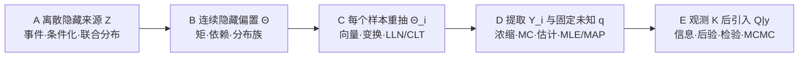

# 概率论与数理统计 MOC

> [!abstract] 本卷的核心任务
> 把“不确定性”从含混语言变成可计算、可检验、可更新的数学对象。课程先建立概率空间和条件化，再用随机变量把结果推前为分布；随后发展期望、常用分布、收敛、Monte Carlo 和有限样本界，最后进入估计、Bayesian 推断、区间/检验与 MCMC。AI 中的似然、采样、校准、生成模型和不确定性报告都必须回到这些对象与假设。

### 当前教学迁移路线

> [!important] 学习状态与材料迁移状态分开
> 下表只记录“课程位置—问题链—贯穿例—公式七问—停靠线”是否完成。正文 frontmatter 与核心节点表中的 `draft` 仍表示学习者尚未完成闭卷、订正和延迟复做；`regression-passed` 不能把它升级为已掌握。

| 波次 | ID 范围 | 认知主线 | 材料迁移 |
|---|---|---|---|
| A | PROB-01—04 | 概率空间 → 条件/Bayes → 随机变量/分布 → joint/独立 | `regression-passed` |
| B | PROB-05—08 | 期望/矩 → 协方差/条件期望 → 离散分布族 → 连续分布/指数族 | `regression-passed` |
| C | PROB-09—12 | 多元 Gaussian → 随机变量变换 → 收敛/LLN → CLT/Delta | `regression-passed` |
| D | PROB-13—16 | 浓缩 → Monte Carlo → 估计量/风险 → MLE/MAP | `regression-passed` |
| E | PROB-17—20 | Fisher/渐近 → Bayesian → 检验/区间 → MCMC | `regression-passed` |
| CUM | PROB-CUM | 卷级路线—口试—题解—实验—回归 | `regression-passed` |

第一波固定使用隐藏硬币模型：以 $2/3$ 选择公平硬币 $F$，以 $1/3$ 选择正面率 $3/4$ 的偏置硬币 $B$，随后给定来源条件独立地抛两次。

它在八原子空间上同时给出

$$
P(B\mid X_1=1)=\frac37,
\qquad
P(B\mid X_1=X_2=1)=\frac9{17},
$$

正面数 $S=X_1+X_2$ 的 PMF

$$
\left(\frac3{16},\frac{11}{24},\frac{17}{48}\right),
$$

以及

$$
P(X_1=X_2=1)=\frac{17}{48}
\ne
\left(\frac7{12}\right)^2,
\qquad
X_1\perp X_2\mid Z.
$$

先用下图回答一个视觉问题：**同一份八原子联合模型，怎样依次支持事件概率、Bayes 更新、推前分布和独立性审计？**

![[00-知识库管理/_assets/figures/probability/fig-hidden-coin-probability-language-v2.svg|920]]

> [!figure] 图 10.5-A｜第一波桥接图：从概率合同到潜变量依赖
> A 固定八个互斥原子及其点质量；B 用同一模型做一次/两次证据更新，并把原子推前为正面数分布；C 边缘化隐藏来源后检查独立性失败，同时保留给定 $Z$ 的条件独立。来源：独立绘制；生成与精确分数断言：[[plot_probability_foundations_v2.py]]；确定性有限概率模型，无随机种子。

**怎样读图。** 先在 A 中核对样本空间与总质量；再沿 B 区分“条件化重加权”和“随机变量合并原子”；最后到 C 比较 joint 格子与边缘乘积。三栏不是三个互不相关的例题，而是对同一联合分布进行不同操作。

**适用边界。** 有限硬币模型适合完整手算对象与分数，却没有覆盖不可数空间、连续条件密度或从数据学习未知参数；条件独立来自建模假设，不是由两次观测自动证明的因果结论。

> [!tip] 第一波停靠线
> 完成 PROB-01—04 后，应能列出八个原子并验证总质量为 $1$；由全概率与 Bayes 得到 $3/7$ 和 $9/17$；把 $S=X_1+X_2$ 写成可测函数并推出 PMF/CDF/分位数；最后从 joint table 算出边缘 $P(X_i=1)=7/12$，用 $17/48\ne49/144$ 否定边缘独立，同时解释给定潜变量后为何仍条件独立。

第二波把离散的“二选一硬币来源”升级为连续随机偏置：

$$
\Theta\sim\operatorname{Beta}(2,2),
\qquad
X_i\mid\Theta\overset{\mathrm{iid}}{\sim}\operatorname{Bernoulli}(\Theta),
\qquad
S=X_1+X_2.
$$

它用同一组精确分数贯通四章：

$$
\mathbb E[\Theta]=\frac12,
\qquad
\mathbb E[\Theta^2]=\frac3{10},
\qquad
\operatorname{Var}(\Theta)=\frac1{20},
$$

$$
\operatorname{Cov}(X_1,X_2)=\frac1{20},
\qquad
\rho(X_1,X_2)=\frac15,
\qquad
\mathbb E[X_2\mid X_1]=\frac25+\frac15X_1,
$$

以及 Beta-Binomial 边缘 PMF

$$
P(S=0,1,2)=\left(\frac3{10},\frac25,\frac3{10}\right),
\qquad
\operatorname{Var}(S)=\frac35.
$$

先用下图回答一个视觉问题：**为什么每次试验的边缘成功概率都为 $1/2$，成功总数却比固定公平硬币的 Binomial 模型更分散？**

![[00-知识库管理/_assets/figures/probability/fig-beta-bernoulli-moments-families-v2.svg|920]]

> [!figure] 图 10.5-B｜第二波桥接图：从连续隐变量到矩、依赖与分布族
> A 把 $\Theta$ 画成 $(0,1)$ 上的 Beta density 并标出一、二阶矩；B 展示给定 $\Theta$ 的条件独立与边缘化后的正相关、条件预测；C 对照固定 $p=1/2$ 的 Binomial 与随机 $\Theta$ 混合后的 Beta-Binomial，并接到 Bernoulli 指数族的 $A'$、$A''$。来源：独立绘制；生成与精确分数断言：[[plot_probability_foundations_v2.py]]；确定性解析模型，无随机种子。

**怎样读图。** 从 A 到 B 是“连续参数进入条件分布”，从 B 到 C 是“边缘化共同参数后得到离散计数分布”。蓝色和绿色柱形均值相同，但混合模型把更多质量放到两个端点；多出的方差正是隐藏成功率异质性留下的可观测痕迹。

**适用边界。** Beta$(2,2)$ 是为了能手算全部分数的教学模型，不表示真实成功率一定服从对称 Beta；过度离散也可能来自时间漂移、遗漏协变量或其他相关机制，不能仅凭样本方差反推出唯一潜变量。

> [!tip] 第二波停靠线
> 完成 PROB-05—08 后，应能从 Beta density 复算三个矩；由 $P(X_1=X_2=1)=3/10$ 得到协方差、相关系数和两种条件均值；分别推出 Binomial PMF $(1/4,1/2,1/4)$ 与混合 PMF $(3/10,2/5,3/10)$；最后把 Bernoulli 写成 $\exp\{x\eta-A(\eta)\}$ 并解释 $A'=\theta$、$A''=\theta(1-\theta)$。这四步共同说明：中心、依赖、生成机制与曲率必须放在同一个概率模型里理解。

第三波把上一轮的一对观测复制为 iid 样本。对每个 $i$ 都重新抽取

$$
\Theta_i\sim\operatorname{Beta}(2,2),
\qquad
X_{i1},X_{i2}\mid\Theta_i
\overset{\mathrm{iid}}{\sim}\operatorname{Bernoulli}(\Theta_i),
\qquad
W_i=(X_{i1},X_{i2})^\top.
$$

单个 $W_i$ 是四原子离散向量，却具有

$$
\mu=
\begin{bmatrix}1/2\\1/2\end{bmatrix},
\qquad
\Sigma=
\begin{bmatrix}
1/4&1/20\\
1/20&1/4
\end{bmatrix}.
$$

第三波先定义矩匹配参照 $G\sim\mathcal N(\mu,\Sigma)$，用特征值 $3/10,1/5$、Cholesky 和条件 Gaussian 学习协方差几何；再用正交主成分与白化学习推前和 Jacobian。随后对

$$
\overline W_n=\frac1n\sum_{i=1}^nW_i
$$

依次得到

$$
\mathbb E\|\overline W_n-\mu\|_2^2=\frac1{2n},
\qquad
\overline W_n\xrightarrow P\mu,
$$

$$
\sqrt n(\overline W_n-\mu)
\xrightarrow d\mathcal N(0,\Sigma).
$$

最后令 $g(a,b)=ab$，Delta 方法给出

$$
\sqrt n\left(g(\overline W_n)-\frac14\right)
\xrightarrow d
\mathcal N\left(0,\frac3{20}\right).
$$

先用下图回答一个视觉问题：**为什么四点离散向量、矩匹配 Gaussian 和样本平均的 Gaussian 极限必须区分，却又共享同一个 $\mu,\Sigma$？**

![[00-知识库管理/_assets/figures/probability/fig-paired-observation-gaussian-limit-v2.svg|920]]

> [!figure] 图 10.5-C｜第三波桥接图：从四原子观测到 Gaussian 极限
> A 对照四原子 $W$ 与只匹配一、二阶矩的连续 Gaussian 参照；B 用主方向旋转、白化和“样本级潜变量/全局潜变量”对照揭示变换与 LLN 的依赖边界；C 将多元 CLT 通过乘积函数的梯度传播为方差 $3/20$ 的 Delta 极限。来源：独立绘制；生成与精确有理数断言：[[plot_probability_limits_v2.py]]；确定性解析模型，无随机种子。

**怎样读图。** A 的箭头只表示“用相同 $\mu,\Sigma$ 建参照”，不表示离散向量已经变成 Gaussian；B 上方是固定维度可逆变换，下方比较不同跨样本依赖合同；只有 fresh $\Theta_i$ 分支才能沿 C 进入以固定 $\mu$ 为中心的普通 iid CLT。

**适用边界。** 二维有界样本使所有矩与经典 iid 极限定理都很干净；真实高维、重尾、时间相关或维度随样本量增长的数据不自动满足同一结论。CLT 是分布极限，图中的箭头没有给有限 $n$ 尾部误差，也没有把共享潜变量错误平均掉。

> [!tip] 第三波停靠线
> 完成 PROB-09—12 后，应能从四原子 PMF 重建 $\mu,\Sigma$；区分 $W$ 与矩匹配 $G$；用 $Q^\top\Sigma Q=\operatorname{diag}(3/10,1/5)$ 解释主成分和白化；由 $\operatorname{Cov}(\overline W_n)=\Sigma/n$ 建立 LLN；再由多元 CLT 与 $\nabla g(\mu)=(1/2,1/2)^\top$ 得到 Delta 方差 $3/20$。同时必须能说明：若所有样本共享一个全局 $\Theta$，平均会收敛到 $(\Theta,\Theta)^\top$，普通 iid 结论的目标已经改变。

第四波从观测对提取共同成功指标

$$
Y_i=X_{i1}X_{i2}
\sim\operatorname{Bernoulli}(q_\star),
\qquad
q_\star=\frac3{10},
\qquad
\widehat q_n=\frac1n\sum_{i=1}^nY_i.
$$

在有限样本层，

$$
\operatorname{Var}(\widehat q_n)=\frac{21}{100n},
\qquad
P(|\widehat q_n-q_\star|\ge\varepsilon)
\le2e^{-2n\varepsilon^2}.
$$

在概率计算合同中，目标分布可评价而积分难算：直接采样的单样本方差为 $21/100$；从 $\operatorname{Bernoulli}(3/4)$ proposal 采样并加权后降为 $3/100$；proposal 改成 $\operatorname{Bernoulli}(1/20)$ 时则恶化为 $171/100$。

在统计推断合同中，$q$ 改为固定未知参数。若 $K=\sum_iY_i$，

$$
\widehat q_{\mathrm{MLE}}=\frac Kn,
\qquad
R(q,\widehat q_{\mathrm{MLE}})=\frac{q(1-q)}n.
$$

Beta$(2,2)$ prior 对应收缩估计器

$$
\widehat q_{\mathrm{MAP}}=\frac{K+1}{n+2}.
$$

当观测 $n=10,K=3$ 时，

$$
\widehat q_{\mathrm{MLE}}=\frac3{10},
\qquad
q\mid y\sim\operatorname{Beta}(5,9),
\qquad
\widehat q_{\mathrm{MAP}}=\frac13,
\qquad
\mathbb E[q\mid y]=\frac5{14}.
$$

先用下图回答一个视觉问题：**为什么同一个 Bernoulli 样本平均，在浓缩、Monte Carlo 和参数推断中拥有相似公式，却不能共享同一种“未知”与概率解释？**

![[00-知识库管理/_assets/figures/probability/fig-bernoulli-computation-inference-v2.svg|920]]

> [!figure] 图 10.5-D｜第四波桥接图：从有限样本界到 MLE/MAP
> A 对固定真分布下的样本平均给出 Chebyshev、Hoeffding 与样本量反解；B 在目标分布可评价的计算合同中比较直接采样、良好 proposal 与糟糕 proposal 的精确方差；C 在参数未知的推断合同中区分 MLE、prior、posterior、MAP 和 posterior mean。来源：独立绘制；生成与精确有理数/确定性浮点断言：[[plot_statistical_estimation_v2.py]]；无随机种子。

**怎样读图。** A 的概率对重复样本取，控制的是随机偏差；B 的 proposal 由算法选择，权重必须使用可评价的目标分布；C 的 $q$ 固定未知，不能偷用真值构造重要性权重。三栏都出现平均和方差，但信息合同依次是“控制”“计算”“推断”。

**适用边界。** 二点 Bernoulli 模型使支持、权重和 posterior 都能闭式计算；一般 Monte Carlo 可能有连续重尾权重，统计模型可能错设或不可辨识，MAP 也可能位于边界、多峰或依赖坐标。Hoeffding 上界不是精确尾概率，Beta prior 也不是由数据自动推出的事实。

> [!tip] 第四波停靠线
> 完成 PROB-13—16 后，应能比较 $n=50,\varepsilon=1/5$ 时 Chebyshev 的 $0.105$ 与 Hoeffding 的 $2e^{-4}$；复算 good/bad proposal 的 $3/100$ 与 $171/100$；区分 estimand、estimator、estimate 与 risk；最后从 $n=10,K=3$ 推出 MLE $3/10$、Beta$(5,9)$ posterior、MAP $1/3$ 和 posterior mean $5/14$。最关键的口头验收是：积分难算时目标分布可评价，参数未知时不能把真参数偷偷放进算法。

第五波继续使用 Bernoulli 数据 $n=10,K=3$。对参数 $q$，单观测 Fisher 信息和总信息为

$$
I_1(q)=\frac1{q(1-q)},
\qquad
I_{10}(3/10)=\frac{1000}{21},
$$

所以无偏正则估计的 CRLB 为 $21/1000$，样本均值在本模型中恰好取等。

Bayesian 合同指定

$$
Q\sim\operatorname{Beta}(2,2),
\qquad
Q\mid y\sim\operatorname{Beta}(5,9),
$$

并得到

$$
\mathbb E[Q\mid y]=\frac5{14},
\qquad
\operatorname{Var}(Q\mid y)=\frac3{196},
$$

以及两次未来成功数的 posterior predictive

$$
P(M=0,1,2\mid y)
=\left(\frac37,\frac37,\frac17\right).
$$

同一数据在 frequentist point-null 检验下给出

$$
p_{\mathrm{two\text{-}sided}}
=P_{q=1/2}(K\le3\text{ or }K\ge7)
=\frac{11}{32},
$$

而 posterior 事件为

$$
P(Q<1/2\mid y)=\frac{7099}{8192}.
$$

二者并不冲突，因为条件方向和事件不同。最后以 Beta$(5,9)$ 为 MCMC target、Beta$(2,2)$ 为 independence proposal，使用解析均值、方差和尾概率 $1093/8192$ 校准多链计算。

先用下图回答一个视觉问题：**sampling precision、posterior uncertainty、frequentist error control 与 MCMC numerical error 为什么必须分成不同层报告？**

![[00-知识库管理/_assets/figures/probability/fig-bernoulli-inference-layers-v2.svg|920]]

> [!figure] 图 10.5-E｜第五波桥接图：一份 Bernoulli 数据的三层不确定性
> A 从 score、Fisher 到 CRLB 与 MLE sampling precision；B 并列 posterior/predictive、exact p 值与 Hoeffding confidence procedure，明确 Bayesian 条件概率和 frequentist 重复抽样对象；C 在 Beta$(5,9)$ target 上增加 MH 相关采样与数值诊断层。来源：独立绘制；生成、精确分数断言与固定种子四链校准：[[plot_statistical_inference_v2.py]]；种子 20260827。

**怎样读图。** A 的方差是固定真参数下重复数据的 sampling variance；B 绿色语句条件于模型与已观测数据，蓝色/橙色语句控制固定参数下的重复程序；C 假设 posterior target 已定义，再问有限相关样本是否足以近似它。后一层不能修复前一层的模型错设。

**适用边界。** Bernoulli–Beta 的正则内点、共轭解析与单峰 posterior 使三层都容易校准；边界参数、point-mass null、非共轭高维 posterior、多峰和不可辨识会改变公式或计算难度。固定种子四链 sanity gate 只验证本例实现，不是一般 MCMC 收敛证明。

> [!tip] 第五波停靠线
> 完成 PROB-17—20 后，应能从 score 得到 $I_1(q)=1/[q(1-q)]$ 与 CRLB；从 Beta$(5,9)$ 得到 mean $5/14$、variance $3/196$ 和 predictive $(3/7,3/7,1/7)$；从 exact Binomial null 算出 p 值 $11/32$ 并与 posterior probability $7099/8192$ 区分；最后写出 prior-proposal independence MH ratio，使用 mean、variance、tail、$\widehat R$、ESS 与 MCSE 联合校准。口头结论应是：数据随机性、参数不确定性与计算误差可以同时存在，但绝不能混成一个“置信度”数字。

## 零、怎样从零真正学完本卷

> [!important] 卷级学习合同
> 本卷已经完成的是**材料迁移**，不是学习者的自动掌握。推荐路径不是从头到尾只读一遍，而是“对象与直觉 → 推导与反例 → 无提示输出与计算复现”三遍循环。任何一遍出现断点，都回到最早不能独立解释的章节，而不是继续堆术语。

### 0.1 进入门：先确认四项最低前置

开始 PROB-01 前，只要求能够：用集合语言表达交并补；读懂函数、原像和求和记号；完成一元微分与积分的基本计算；理解向量、矩阵乘法和二次型。测度论、Lebesgue 积分、矩阵分解和多元微积分的严格工具会在需要处双层引入，不要求先学完整门课程。若上述四项中有两项不能无提示完成，先回到[[集合、元素与集合运算]]、[[函数、映射、关系与等价类]]、[[函数极限、连续性与收敛模式]]与[[向量空间]]的第一遍停靠线。

### 0.2 五波不是五套孤立例题，而是一族逐步改造的模型

下图中的箭头表示**教学模型的改造与问题升级**，不是声称五波共用完全相同的数据生成过程。每次改变 iid 层级、参数是否固定或是否条件化，都必须重新写概率合同。

| 波次 | 核心随机对象 | 固定/随机/已观测对象 | 本波第一次能够回答的问题 | 改模时最容易犯的错 |
|---|---|---|---|---|
| A | $Z,X_1,X_2,S$ | 来源与抛掷都随机，尚无未知参数推断 | 事件怎样赋概率、证据怎样重加权、边缘化为何制造依赖 | 把 $P(B\mid X_1=1)$ 读成因果效应 |
| B | $\Theta,X_1,X_2,S$ | $\Theta$ 是生成层随机变量 | 隐变量的矩怎样传播成观测相关与过度离散 | 把给定 $\Theta$ 独立误写成边缘独立 |
| C | $\Theta_i,W_i,\overline W_n$ | 每个样本重新抽 $\Theta_i$，故 $W_i$ iid | 向量平均为何稳定、怎样近似 Gaussian、非线性函数怎样传播误差 | 偷换成全样本共享一个 $\Theta$ 后仍套 iid LLN |
| D | $Y_i,\widehat q_n$ 或积分样本 | 计算问题中分布已知；统计问题中 $q$ 固定未知 | 有限样本界、MC 误差、sampling risk 与 likelihood 怎样分层 | 把“积分难算”和“参数未知”混成同一不确定性 |
| E | $K,Q,\widetilde K,Q^{(s)}$ | $K=3$ 已观测；frequentist 中 $q$ 固定，Bayesian 中 $Q\mid y$ 随机 | 信息下界、posterior prediction、error control 与 MCMC error 怎样联合报告 | 把 coverage、posterior probability 与 MCSE 合并成一个置信度 |

### 0.3 三遍学习与每遍退出条件

| 遍次 | 怎样读 | 必须产生的无提示输出 | 达不到时怎样回退 |
|---|---|---|---|
| 第一遍：对象与直觉 | 只读每章“课程位置—问题链—贯穿例—第一遍停靠线”，先不追全部严格证明 | 能说清随机对象、条件对象、目标量、一个 AI 对应和一个不能推出的结论 | 回到当前波桥接图，重新画生成顺序与条件箭头 |
| 第二遍：推导与边界 | 逐式完成公式七问、正文推导、最小反例和章末习题 | 不看正文重建本章 2—4 条核心推导，并说明每一步所需条件 | 回到第一个丢失对象/条件的公式，不从最终答案倒背 |
| 第三遍：整合与验收 | 冻结笔记，完成卷级口试、闭卷题、计算门与延迟迁移 | 口头重建五波模型；闭卷各能力区过线；独立生成图和 hash；48 小时与 14 天复做 | 按错题的“第一个断点”回链到具体小节，订正不冒充首次独立通过 |

### 0.4 五层证据与状态语义

1. **复述证据**：能用自己的话解释对象与问题，但不等于会推导；
2. **推导证据**：能无提示完成公式和反例，但不等于会跨章选工具；
3. **闭卷证据**：[[阶段测验 - 概率论与数理统计（10.5）|PROB-CUM-01]] 总分与分区同时过线；
4. **复现证据**：[[实验 - 概率统计累计复现门]]的解析校准、随机指定轨道、手检和干预预测通过；
5. **保持与迁移证据**：48 小时重做、14 天换分布/换 AI 情境仍能独立完成。

`regression-passed` 只说明仓库材料通过静态与计算回归；节点 frontmatter 的 `draft` 继续表示尚无个人学习证据。只有真实证据链存在，才按[[数学基础完整课程地图与掌握标准]]升级学习状态。

### 0.5 卷级总图：三个看似正常的数字为何仍可能失败

先遮住图注回答：95% coverage、较高 weight ESS 和 $\widehat R\approx1$ 分别依赖什么重复单位？它们各自遗漏了哪一种全局失败？

![[00-知识库管理/_assets/figures/probability/plot-probability-cumulative-gate-v2.svg|920]]

> [!figure] 图 10.5-CUM｜概率统计卷级复现门
> A 用重复数据检查 interval procedure 的 coverage；B 用 Gaussian rare-event 估计显示 ESS 不是目标无关的精度证书；C 用双峰链显示同峰初始化时低 $\widehat R$ 仍可能共同犯错。来源：独立计算与绘制；生成脚本：[[plot_probability_cumulative_gate.py]]；固定种子 `20260819`；正式 SVG SHA-256 为 `69ebc90f4b09cc85829b3a642840f0a0dced9d71f7f6b76a755e66b204bea896`。

**怎样读图。** A 先找每次重新生成的完整数据集；B 同时读 tail 命中、目标函数 RMSE 与已见权重 ESS；C 把链间一致性与解析真均值、mode occupancy 联读。横向比较时，不要把三个指标当成同一种“样本量”或“置信度”。

**适用边界。** 图只覆盖 Bernoulli Wald 区间、一维 Gaussian tail 和一个双峰 random-walk MH 反例；它不证明所有区间、重要性采样器或 MCMC 都有同样行为，也不替代现代 rank-normalized 诊断、跨 seed 研究与真实数据生成审计。

> [!success] 卷级第一遍停靠线
> 合上笔记后，应能在 15 分钟内画出 A—E 五波对象链，指出每次改模改变了什么；再分别给 sampling uncertainty、posterior uncertainty、Monte Carlo/MCMC numerical error 写出一个对象或公式，并说明模型错设不属于这三者中任何一个数值误差条。做不到时，暂不进入闭卷题。

## 一、范围与边界

### 本卷包含

- 样本空间、事件、$\sigma$-代数、概率测度与可测随机变量；
- 条件概率、Bayes 公式、独立性、联合/边缘/条件分布；
- PMF、PDF、CDF、分位数、期望、方差、矩与常用分布族；
- 大数定律、中心极限定理、浓缩界与 Monte Carlo；
- 统计模型、估计量、似然、Fisher 信息、Bayesian 后验和预测；
- 置信区间、假设检验、多重比较、MCMC 与诊断；
- 与分类、语言模型、VAE、扩散模型、校准和不确定性估计的具体接口。

### 本卷不替代

- 完整的实分析与测度论课程：只引入概率主线实际需要的 $\sigma$-代数、可测性、Lebesgue 积分和收敛定理；
- 信息论的熵、KL、互信息和变分目标闭环：见后续 10.6；
- 优化算法和收敛率：见后续 10.7；
- 随机过程、Itô 微积分和 SDE：见后续 10.9；
- 因果推断：条件概率用于信息更新，不自动等于干预或因果效应。

## 二、依赖总图

~~~mermaid
flowchart LR
    A["PROB-01 概率空间"] --> B["PROB-02 条件概率 / Bayes"]
    A --> X["PROB-03 随机变量 / 分布"]
    B --> J["PROB-04 联合 / 独立"]
    X --> J
    X --> E["PROB-05 期望 / 方差"]
    J --> C["PROB-06 协方差 / 条件期望"]
    E --> D["PROB-07/08 分布族"]
    C --> G["PROB-09 多元 Gaussian"]
    X --> T["PROB-10 变量变换"]
    E --> L["PROB-11/12 LLN / CLT"]
    L --> K["PROB-13 浓缩"]
    L --> M["PROB-14 Monte Carlo"]
    E --> S["PROB-15—20 统计推断"]
    B --> S
    M --> S
~~~

> [!note] 读图说明
> 箭头表示主要认知依赖。课程采用“双层严谨度”：初学者先在有限/可数模型中获得完整计算能力，同时从第一章就看到 $\sigma$-代数、可测性和推前测度；需要连续模型或极限定理时再调用严格层，避免到后半程才发现早期定义无法支撑连续概率。

## 三、20 个核心节点

| ID | 节点 | 本章必须回答的问题 | 状态 |
|---|---|---|---|
| PROB-01 | [[样本空间、事件与概率公理]] | 一个随机实验怎样成为合法概率模型，为什么不能给任意集合随意赋概率？ | draft |
| PROB-02 | [[条件概率、全概率与 Bayes 公式]] | 新信息怎样改变概率，先验、似然、证据和后验分别是什么对象？ | draft |
| PROB-03 | [[随机变量、分布与分位数]] | 随机变量为何是函数，PMF/PDF/CDF/分位数怎样描述同一个分布？ | draft |
| PROB-04 | [[联合分布、边缘分布与独立性]] | 多个随机量的依赖结构怎样表达，独立比“不相关”强在哪里？ | draft |
| PROB-05 | [[期望、方差与矩]] | 分布的平均位置、波动和高阶形状怎样定义并可靠计算？ | draft |
| PROB-06 | [[协方差、相关性与条件期望]] | 线性依赖、信息投影和最优平方预测如何连接？ | draft |
| PROB-07 | [[常用离散分布]] | Bernoulli、Binomial、Geometric、Poisson 等分布来自哪些生成机制？ | draft |
| PROB-08 | [[常用连续分布与指数族]] | Uniform、Exponential、Gaussian、Gamma/Beta 与指数族为何反复出现？ | draft |
| PROB-09 | [[多元高斯分布]] | 均值与协方差如何决定 Gaussian 几何、条件分布和退化边界？ | draft |
| PROB-10 | [[随机变量变换与密度换元]] | 非线性映射怎样推前分布，非单射和维数改变时怎么办？ | draft |
| PROB-11 | [[随机变量的收敛与大数定律]] | 样本平均为什么稳定，几乎处处/概率/$L^p$/分布收敛如何区分？ | draft |
| PROB-12 | [[中心极限定理与 Delta 方法]] | 标准化误差何时近似 Gaussian，非线性统计量怎样传播渐近误差？ | draft |
| PROB-13 | [[浓缩不等式]] | 有限样本偏离期望的概率如何由有界性、方差或尾部条件控制？ | draft |
| PROB-14 | [[Monte Carlo、重要性采样与方差缩减]] | 难算期望如何采样估计，误差、有效样本量和权重退化怎样诊断？ | draft |
| PROB-15 | [[统计模型、估计量与偏差方差]] | 数据生成假设、参数、统计量与估计程序应怎样分层？ | draft |
| PROB-16 | [[最大似然估计与 MAP]] | 似然为何不是参数上的概率，正则化何时可解释为先验？ | draft |
| PROB-17 | [[Fisher 信息、Cramér–Rao 界与渐近正态性]] | 参数估计精度的局部极限是什么，正则条件失效时会怎样？ | draft |
| PROB-18 | [[Bayesian 推断与后验预测]] | 参数不确定性怎样由后验保留并传播到预测？ | draft |
| PROB-19 | [[假设检验、置信区间与多重比较]] | $p$ 值、错误率、效应量和区间覆盖为什么不能互相替代？ | draft |
| PROB-20 | [[MCMC 与随机模拟诊断]] | 无法直接采样的后验怎样近似，收敛与有效样本量如何验证？ | draft |

## 四、四阶段学习路线

### 阶段 A：概率语言与信息更新

1. [[样本空间、事件与概率公理]]；
2. [[条件概率、全概率与 Bayes 公式]]；
3. [[随机变量、分布与分位数]]；
4. [[联合分布、边缘分布与独立性]]；
5. [[期望、方差与矩]]；
6. [[协方差、相关性与条件期望]]。

阶段验收：能从 $\sigma$-代数与概率公理推出基本恒等式；能用分割推导全概率与 Bayes；能把随机变量写为可测函数并在 PMF/PDF/CDF/分位数之间切换；能从 joint 求 marginal/conditional，构造 pairwise-not-mutual 反例，检查矩存在性，并从 $L^2$ 投影重建条件期望的最小 MSE 性质。

### 阶段 B：分布族与变换

7. [[常用离散分布]]；
8. [[常用连续分布与指数族]]；
9. [[多元高斯分布]]；
10. [[随机变量变换与密度换元]]。

阶段验收：不是背表，而是能从生成机制、支持集和变换推导分布，并能指出密度、质量、参数化和退化情形。

### 阶段 C：极限、有限样本与随机计算

11. [[随机变量的收敛与大数定律]]；
12. [[中心极限定理与 Delta 方法]]；
13. [[浓缩不等式]]；
14. [[Monte Carlo、重要性采样与方差缩减]]。

阶段验收：能区分渐近结论、有限样本界和数值估计；报告 Monte Carlo 结果时同时给标准误、有效样本量、随机种子和失败诊断。

### 阶段 D：统计推断

15. [[统计模型、估计量与偏差方差]]；
16. [[最大似然估计与 MAP]]；
17. [[Fisher 信息、Cramér–Rao 界与渐近正态性]]；
18. [[Bayesian 推断与后验预测]]；
19. [[假设检验、置信区间与多重比较]]；
20. [[MCMC 与随机模拟诊断]]。

阶段验收：能明确区分模型内概率、重复抽样性质和主观/决策不确定性；任何区间、检验或后验声明都必须写出数据、模型、条件与校准对象。

## 五、全卷必须维持的区分

| 容易混淆的对象 | 正确区分 |
|---|---|
| outcome vs event | outcome 是 $\omega\in\Omega$；event 是可判定集合 $A\in\mathcal F$ |
| probability zero vs impossible | 连续模型中单点可有概率零但仍属于样本空间 |
| PMF/PDF vs probability | PMF 在点上给质量；PDF 是单位尺度密度，点值可大于 1；概率需求和/积分 |
| random variable vs observed value | $X$ 是从结果到数值的函数；$x$ 是一次实现值 |
| conditional probability vs causality | $P(Y\mid X)$ 描述观测条件化；$P(Y\mid do(X))$ 属于因果问题 |
| likelihood vs parameter probability | $p(x\mid\theta)$ 固定 $x$ 后是关于 $\theta$ 的函数，不自动归一化为参数分布 |
| independence vs uncorrelated | 独立控制所有可测事件；零协方差通常只排除线性关系 |
| asymptotic vs finite-sample | $n\to\infty$ 的保证不能直接当作当前样本量的误差证书 |
| confidence vs posterior probability | 置信区间的覆盖率是重复抽样性质；Bayesian credible interval 是给定模型和数据的后验概率声明 |

## 六、AI 调用地图

| AI 场景 | 本卷真正被调用的对象 | 主要失败边界 |
|---|---|---|
| 分类 softmax | 条件类别分布 $p_\theta(y\mid x)$ | 训练分布偏移、未校准、选择偏差、把 score 当真概率 |
| 语言模型 | token 条件链与序列联合概率 | 暴露偏差、支持集、长度归一化、条件独立误读 |
| VAE/扩散/flow | 联合、边缘、条件分布与变量变换 | 后验近似、密度方向、Jacobian、采样器误差 |
| 小批量训练 | 随机梯度估计量与方差 | 非独立抽样、归约尺度、重尾、数据重复 |
| 不确定性与校准 | 预测分布、分位数、覆盖率 | 分布外输入、条件覆盖失效、选择后评估 |
| 离线评估/A-B 测试 | 估计量、区间、检验和多重比较 | 数据泄漏、可选停止、效应量与显著性混淆 |
| Bayesian 模型 | 先验、似然、后验与后验预测 | 先验敏感性、不可辨识、MCMC 未收敛、模型错误 |

## 七、当前稳定结论与缺口

| 节点 | 已建立 | 仍需验收 |
|---|---|---|
| [[样本空间、事件与概率公理]] | 概率三元组、$\sigma$-代数、Kolmogorov 公理、导出规则、有限/可数/连续模型和 AI 数据分布接口 | 学习者闭卷重建公理推论、构造事件族并完成连续零概率审计 |
| [[条件概率、全概率与 Bayes 公式]] | 条件概率作为新测度、乘法/链式/全概率/Bayes、odds、base-rate、连续密度和 AI 后验接口 | 学习者闭卷完成树图/表格/odds 三路推导，审计选择偏差和条件—因果混淆 |
| [[随机变量、分布与分位数]] | 可测映射与推前分布、PMF/PDF/CDF/atom/mixed law、广义分位数、经验分布和 AI 输出接口 | 学习者闭卷在四种表示间转换，完成离散跳跃、密度点值与分位数覆盖审计 |
| [[联合分布、边缘分布与独立性]] | 随机向量、联合 CDF/PMF/PDF、边缘化、条件核、coupling、四种独立刻画、pairwise/mutual/conditional independence 与 autoregressive/OT 接口 | 学习者闭卷画支持、重建 XOR/selection 反例，审计 joint tensor 轴和经验独立性声明 |
| [[期望、方差与矩]] | 测度积分、LOTUS、可积性、指标变量、矩、Jensen/Cauchy–Schwarz、方差传播、稳定归约与初始化/Attention 接口 | 学习者闭卷判断矩存在性、推导交叉项并比较 two-pass/Welford；复现 AI 尺度假设 |
| [[协方差、相关性与条件期望]] | covariance/correlation、PSD covariance matrix、条件期望定义、tower/total variance/covariance、$L^2$ 投影和 denoising/score 接口 | 学习者闭卷证明投影与 total variance，区分 conditional mean/full law，并审计高维样本 covariance |
| [[常用离散分布]] | Bernoulli/Categorical、Binomial/Multinomial、Geometric/Negative Binomial、Hypergeometric/Poisson 的生成机制、PGF、极限关系与 log-PMF | 学习者闭卷从机制选型，推导 Poisson 极限与 thinning，并审计 exposure、过度离散和离散梯度 |
| [[常用连续分布与指数族]] | density/CDF/survival/hazard、Uniform/Exponential/Gaussian/Gamma/Beta、自然参数、log-partition 的矩与曲率、likelihood 接口 | 学习者闭卷完成归一化与 $\nabla A/\nabla^2A$ 推导，审计 support、rate/scale、尾部和能量配分函数 |
| [[多元高斯分布]] | 投影定义、仿射构造、椭球几何、边缘/条件、Schur 补、退化支撑、Cholesky 与 VAE/扩散/GP 接口 | 学习者闭卷推导 block conditional，构造 marginal-not-joint 反例，并用 solve/logdet 审计高维 covariance |
| [[随机变量变换与密度换元]] | 推前测度、离散原像求和、CDF/多分支法、一维/多维 Jacobian、卷积、奇异支撑、inverse sampling、VAE 重参数与 flow logdet | 学习者闭卷证明换元/卷积，审计 forward/inverse 方向、维数改变、临界点和近奇异 Jacobian |
| [[随机变量的收敛与大数定律]] | a.s./概率/$L^p$/分布收敛、蕴含与逆向反例、子序列、连续映射/Slutsky、WLLN/SLLN、UI 和点态/一致 LLN 边界 | 学习者闭卷重建量词、证明 WLLN/蕴含、构造尖峰与稀有事件反例，并审计相关 batch 的有效样本量 |
| [[中心极限定理与 Delta 方法]] | iid/多元 CLT、特征函数路线、Berry–Esseen、连续性修正、Lindeberg 边界、一阶/二阶/多元 Delta 与 studentization | 学习者闭卷正确标准化、推导 Delta、处理导数退化，并审计高维/重尾/非平稳 Gaussian-noise 声明 |
| [[浓缩不等式]] | Markov/Chebyshev、Chernoff MGF 模板、Hoeffding、Bernoulli KL、次 Gaussian、Bernstein、union/McDiarmid、MoM 与高维接口 | 学习者闭卷证明 Hoeffding、反解样本复杂度，区分点态/一致/序贯界，并审计重尾、选择后评估和 gradient concentration |
| [[Monte Carlo、重要性采样与方差缩减]] | simple MC、MCSE、ordinary IS/SNIS、support/二阶矩、weight/MCMC ESS、log 权重、control/antithetic/stratification/Rao–Blackwell 与 AI 场景 | 学习者闭卷推导 IS/SNIS 渐近方差，构造 support/无限方差反例，并提交含 MCSE、ESS、seed、重复运行与失败诊断的报告 |
| [[统计模型、估计量与偏差方差]] | model/parameter/estimand/estimator 分层、sampling distribution、risk、bias–variance–MSE、consistency、robustness、misspecification 与 prediction decomposition | 学习者闭卷构造无偏不一致/一致有偏反例，推导参数与预测两类分解，并审计数据—优化—选择—部署随机性 |
| [[最大似然估计与 MAP]] | density/likelihood/posterior 区分、MLE、score、KL projection、MAP、L1/L2、坐标依赖、边界/分离/mixture singularity 与稳定 NLL | 学习者闭卷推导经典 MLE/MAP，核对 sum/mean 与 weight decay，并识别 likelihood 不存在、无界和 AI surrogate 改目标 |
| [[Fisher 信息、Cramér–Rao 界与渐近正态性]] | score mean-zero、information identity、KL geometry、CRLB、nuisance Schur 补、MLE Taylor–CLT–LLN、sandwich 与奇异/边界模型 | 学习者闭卷重建证明链，区分 expected/observed/empirical Fisher/GGN，并解释 Uniform、mixture 与 neural symmetry 的非正则失败 |
| [[Bayesian 推断与后验预测]] | joint/evidence/posterior、共轭更新、Bayes action、credible interval、predictive variance、prior/PPC/held-out/SBC、hierarchy 与 BvM 边界 | 学习者闭卷推导 Beta/Dirichlet/Normal 更新与 posterior predictive，执行 prior sensitivity，并区分 parameter、observation、model 与 computation uncertainty |
| [[假设检验、置信区间与多重比较]] | valid p-value、level/power、Neyman–Pearson、Wald/score/LR、test inversion、effect/equivalence、FWER/FDR、optional stopping 与 selection | 学习者闭卷推导检验和区间、手算 Bonferroni/Holm/BH，并把 multiple metrics、seeds、interim looks 与 independent confirmation 写入 AI 评价协议 |
| [[MCMC 与随机模拟诊断]] | invariant kernel、detailed balance、MH/Gibbs、Markov-chain CLT、IACT/ESS/MCSE、rank R-hat、HMC/NUTS、divergence、multimodality 与离散 proposal | 学习者闭卷证明 MH flow、计算相关样本 MCSE，构造低 R-hat 仍漏 mode 的反例，并提交含多链、bulk/tail ESS、MCSE 与 sampler-specific diagnostics 的报告 |

## 八、来源与证据分工

- MIT 6.041SC 与 Harvard Stat 110：初学者计算路线、直觉、经典问题和训练次序；
- MIT 6.436J：$\sigma$-代数、概率测度、可测随机变量、派生分布、收敛、LLN/CLT 与 UI 的严格层；
- Bertsekas–Tsitsiklis、Blitzstein–Hwang：概率模型、条件概率、随机变量和分布的教材主线；
- Wasserman、Casella–Berger：估计、检验、渐近统计和决策边界；
- Gelman 等：Bayesian 建模、后验预测和诊断；
- MIT 18.655：统计模型、minimum contrast/MLE、information inequality、Cramér–Rao bound、Delta 方法与 MLE 渐近正态性的正式证明主线；
- MIT 18.650/18.655、ASA 与 Benjamini–Hochberg：检验、区间、p-value 解释、多重比较和 Bayesian 渐近接口；
- Hastings、Vehtari 等与 Stan Reference Manual：MH 不变流、现代 rank-$\widehat R$/bulk-tail ESS、HMC/NUTS 与有限计算诊断；
- MIT 18.465 与 MIT 6.436J：Hoeffding–Chernoff、有限样本尾界与 MGF 证明；
- Art Owen 与 Glynn：simple Monte Carlo、重要性采样、误差估计和五类方差缩减；
- 科学空间的 MLE—EM、L2 尺度不变性、VAE、MCMC/模拟退火、NICE/flow、扩散、Wasserstein/PMI、初始化、条件得分与随机分布文章：提供 AI 问题入口和可审计推导，不承担估计存在性、信息下界、检验错误率、MCMC 收敛诊断或统计渐近结论的唯一证据。

## 九、卷级验收与后续接口

PROB-01—20 已完成正文、图示和 A–E 训练链，概率论与数理统计在材料层达到 **20/20 正文覆盖与 PROB-CUM 回归通过**。`PROB-CUM-01` 由[[阶段测验 - 概率论与数理统计（10.5）|15 分钟卷级口试与 100 分闭卷题卷]]、[[阶段测验解答 - 概率论与数理统计（10.5）|独立详解]]、[[实验 - 概率统计累计复现门|解析校准与 coverage–IS–MCMC 计算门]]及[[probability_cumulative_contract_audit.py|静态教学合同审计]]组成。材料状态为 `regression-passed`，个人学习状态仍是 **composed / not-attempted**。10.6 已承接完成[[自信息、熵与编码长度]]、[[联合熵、条件熵与链式法则]]和[[交叉熵与 KL 散度]]，当前继续到[[互信息与依赖性]]；概率卷所有节点在真实口试、闭卷作答、计算复现和间隔复查前继续保持 `draft`，不以验收文档存在冒充掌握。

### 2026-08-23 图像标准化进度

- PROB-01—20 全部迁移为 v2 教材图，章内 v1 与相对图片路径均为 0；
- 20/20 使用稳定根路径、明确宽度、引图问题、标准图注、读图说明与适用边界；
- PROB-01—08 由[[plot_probability_foundations_v2.py]]、PROB-09—13 由[[plot_probability_limits_v2.py]]、PROB-14—17 由[[plot_statistical_estimation_v2.py]]、PROB-18—20 由[[plot_statistical_inference_v2.py]]确定性生成；
- 20/20 已重跑并通过 SVG 结构、XML 与 1200 px 实际渲染；图像标准化在 10.5 章级完成，但不替代闭卷、习题与实验掌握门。
