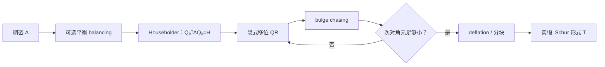
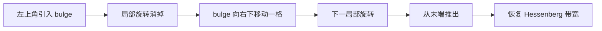

# Hessenberg 化与 QR 特征值算法

> [!abstract] 本章主问题
> 稠密 QR 特征值算法不是对原矩阵一遍遍做昂贵的完整 QR：它先用有限次 Householder 正交相似变换把矩阵约化成上 Hessenberg 形，再用隐式移位 QR、bulge chasing 与 deflation 保持带宽并迭代到实/复 Schur 形式。正交相似提供后向稳定性，移位决定收敛速度，而单个特征值和特征向量的前向可信度仍由谱条件性决定。

先用下图回答一个视觉问题：**稠密 QR 特征值算法怎样把一次 $O(n^3)$ 约化、便宜的隐式结构迭代与可靠 deflation 组合起来？**

![[00-知识库管理/_assets/figures/numerical-analysis/fig-hessenberg-qr-v2.svg|880]]

> [!figure] 图 10.8.11｜Hessenberg 约化、隐式 bulge chasing 与 Schur deflation
> A 用稠密/上 Hessenberg 非零模式说明双侧正交相似约化只做一次，并保留谱、迹与二范数；B 以三个快照表示 Francis 隐式移位产生 bulge、再用 Householder/Givens 把填充追回带内；C 从活跃 Hessenberg 块、尺度感知次对角检验到 $1\times1$/实 $2\times2$ Schur 块，最后列出相似残差、正交性与非正规条件性检查。来源：独立绘制；理论接口参考 Demmel、Higham 与 LAPACK Hessenberg/Schur 驱动；生成脚本：[[plot_numerical_spectral_methods_v2.py]]；确定性结构示意，无随机种子。

**怎样读图。** A 先回答复杂度：一次 $Q_0^TAQ_0=H$ 以 $O(n^3)$ 换来随后每步 $O(n^2)$ 的带状操作；B 再回答结构：隐式 $Q$ 定理允许只构造移位步的首列信息并追逐 bulge，无需显式形成完整 QR；C 最后回答停止：次对角元必须相对局部尺度足够小才可 deflate，输出应验收 $\|AQ-QT\|$ 与 $\|Q^TQ-I\|$。

**适用边界（图没有证明什么）。** 图示非零模式不等于具体数值误差证明，也省略 balancing、多重移位、异常移位和 AED 等工业实现细节。后向稳定的 Schur 分解只说明求得邻近矩阵的精确 Schur 形式；对于非正规或近缺陷矩阵，特征向量和单个特征值仍可高度前向敏感，需要条件数或伪谱语境。

## 学习目标

完成本章后，你应能：

1. 区分 QR 分解与 QR 特征值迭代；
2. 定义上 Hessenberg、未约化 Hessenberg、实 Schur 形式和 deflation；
3. 解释为什么 Hessenberg 化必须从左右两侧施加同一个正交变换；
4. 手算一个 $3\times3$ Hessenberg 约化步骤并检查迹与相似残差；
5. 证明 QR 迭代每一步都是正交相似变换；
6. 解释 QR 迭代与正交迭代/反幂法的联系；
7. 证明 Hessenberg 结构在 QR 步中保持，并说明每步为何只需 $O(n^2)$；
8. 理解 Rayleigh/Wilkinson/Francis 移位、隐式 $Q$ 定理和 bulge chasing；
9. 写出尺度感知的 deflation 判据与实 $2\times2$ 块处理；
10. 说明 LAPACK `DGEHRD/DHSEQR` 的输入输出、Schur 向量和失败状态；
11. 区分算法后向稳定与非正规特征问题的前向敏感；
12. 把小型 Hessenberg–Schur 求解器迁移到 Arnoldi、DMD、稳定性分析和矩阵函数。

> [!question] 初学者读完必须能回答
> 1. QR 分解与 QR 特征值迭代的对象和目标有何不同？
> 2. 为什么 Hessenberg 约化必须左右施加同一个正交变换？
> 3. 一次 $O(n^3)$ 约化如何把后续 QR 步降到 $O(n^2)$？
> 4. 隐式 $Q$ 定理与 bulge chasing 各自解决什么问题？
> 5. 移位为什么影响收敛速度，却不改变目标特征值？
> 6. Deflation 判据为何必须与局部尺度比较？
> 7. 后向稳定 Schur 形式为何不能保证非正规矩阵的特征向量前向准确？

## 阅读前检查

### 检查 1：QR 分解不是 QR 迭代

- QR 分解：对一个固定矩阵写 $A=QR$；
- QR 迭代：反复分解当前矩阵 $A_k=Q_kR_k$，再交换因子次序得到 $A_{k+1}=R_kQ_k$。

前者是一步分解工具，后者是计算特征值/Schur 形式的迭代框架。

### 检查 2：相似变换保特征值

若 $S$ 可逆，

$$
B=S^{-1}AS,
$$

则

$$
\det(B-\lambda I)
=\det(S^{-1}(A-\lambda I)S)
=\det(A-\lambda I).
$$

当 $S=Q$ 正交时，$Q^{-1}=Q^T$，变换还保二范数且数值上可靠。

### 检查 3：算法真正追求的是 Schur 形式

一般矩阵可能不可对角化，Jordan 结构又极端敏感。可靠稠密算法计算

$$
A=QTQ^*,
$$

其中 $Q$ 酉/正交，$T$ 为复上三角或实准上三角 Schur 形式。

> [!note] 课程位置
> NUM-10 只提取一个目标特征方向；本章转向“稠密矩阵的全部谱”，解释为什么必须先约化结构、再做移位 QR 和 deflation。对于对称矩阵，Hessenberg 会进一步缩成三对角，这恰好与 NUM-12 的 Lanczos 小矩阵相接。

> [!tip] 建议两遍阅读
> 第一遍只完成两件事：把统一 Gram 矩阵正交相似成给定三对角 $T$，再对一个 $2\times2$ 活跃块做一次精确移位 QR；第二遍再进入 Householder 约化、隐式 $Q$ 定理、bulge chasing、多重移位、AED 和实 Schur 块。先看清 similarity 与 deflation，再研究工业实现。

## 本章的推导问题链

1. 为什么 QR iteration 的每一步必须是相似变换，才能保持目标谱？
2. 直接对稠密矩阵重复 QR 为什么可能达到 $O(n^4)$？
3. 双侧正交变换怎样一次性把一般矩阵压成 Hessenberg？
4. 对称性为什么迫使 Hessenberg 进一步成为三对角？
5. 一个 shift 怎样改变收敛速度，却不改变特征值？
6. 精确 shift 为什么能让一个小活跃块立即出现零次对角元？
7. 浮点中何时才允许把“小”次对角元设为零并 deflate？

## 贯穿算例：同一 Gram 谱的三对角化与一次精确 deflation

沿用

$$
G=Q\operatorname{diag}\!\left(1,\frac14,\frac1{16}\right)Q^T.
$$

在特征坐标中取三个标准正交向量

$$
c_1=\frac1{\sqrt3}\begin{bmatrix}1\\1\\1\end{bmatrix},
\quad
c_2=\frac1{\sqrt{14}}\begin{bmatrix}3\\-1\\-2\end{bmatrix},
\quad
c_3=\frac1{\sqrt{42}}\begin{bmatrix}1\\-5\\4\end{bmatrix},
$$

并令 $V=Q[c_1,c_2,c_3]$。则 $V^TV=I$。

### 符号与对象账本

| 对象 | 定义 | 本例中的作用 |
|---|---|---|
| $G$ | $A^TA$ | 原始稠密对称谱问题 |
| $V$ | 正交相似基 | 把 $G$ 变成对称三对角 |
| $T$ | $V^TGV$ | Hessenberg 的对称特例 |
| $\mu$ | QR shift | 加速选定活跃块收敛 |
| $S$ | $2\times2$ 活跃块 | 隔离一次 shifted QR 机制 |
| $Z,R_s$ | $S-\mu I=ZR_s$ | 当前移位分解 |
| deflation | 次对角元可忽略时分块 | 缩小后续活跃问题 |

### 第一步：对称 Hessenberg 必然三对角

直接计算得到

$$
T=V^TGV
=\begin{bmatrix}
\frac7{16} & \frac{\sqrt{42}}{16} & 0\\
\frac{\sqrt{42}}{16} & \frac{19}{28} & \frac{5\sqrt3}{56}\\
0 & \frac{5\sqrt3}{56} & \frac{11}{56}
\end{bmatrix}.
$$

这里的 $(3,1)$ 和 $(1,3)$ 同时为零：上 Hessenberg 只要求 $(3,1)=0$，对称性又强迫转置位置也为零。由于 $T=V^TGV$，它与 $G$ 有完全相同的特征值

$$
1,\quad\frac14,\quad\frac1{16}.
$$

两个独立不变量为

$$
\operatorname{tr}(T)
=\frac7{16}+\frac{19}{28}+\frac{11}{56}
=\frac{21}{16},
$$

以及

$$
\det(T)=1\cdot\frac14\cdot\frac1{16}=\frac1{64}.
$$

> [!warning] 证书不是算法
> 本例用已知 $Q$ 写出 $V$，只是为了让三对角条目和谱不变量可精确回归；真实 Hessenberg reduction 不知道特征向量，而是用 Householder 从原矩阵逐列消元。不能把这里的构造当成求谱算法。

### 第二步：用二维活跃块隔离一次 shifted QR

在 $u_1,u_2$ 的不变平面中换一个 $45^\circ$ 正交基，可得到

$$
S=\begin{bmatrix}
\frac58&\frac38\\
\frac38&\frac58
\end{bmatrix},
$$

其特征值仍为 $1$ 与 $1/4$。取精确 shift

$$
\mu=\frac14.
$$

则

$$
S-\mu I
=\begin{bmatrix}\frac38&\frac38\\\frac38&\frac38\end{bmatrix}
=ZR_s,
$$

其中

$$
Z=\frac1{\sqrt2}
\begin{bmatrix}1&-1\\1&1\end{bmatrix},
\qquad
R_s=\begin{bmatrix}
\frac{3\sqrt2}{8}&\frac{3\sqrt2}{8}\\
0&0
\end{bmatrix}.
$$

交换因子并加回 shift：

$$
S_+=R_sZ+\mu I
=\begin{bmatrix}1&0\\0&\frac14\end{bmatrix}.
$$

一次精确移位便让次对角元成为零，两个特征值可以立即分块。这是 shift 加速与 deflation 的最小模型。

### 第三步：为什么交换因子仍保持谱

由 $S-\mu I=ZR_s$ 且 $Z^TZ=I$，

$$
\begin{aligned}
S_+
&=R_sZ+\mu I\\
&=Z^T(S-\mu I)Z+\mu I\\
&=Z^TSZ.
\end{aligned}
$$

所以 shifted QR step 是正交相似变换。Shift 改变的是坐标更新路径和收敛速度，不改变精确特征值。

### 第四步：浮点 deflation 不能只问“是不是零”

真实计算中次对角元通常不会恰好等于零。对活跃 Hessenberg 块，典型尺度感知测试形如

$$
|h_{i+1,i}|
\le \tau_{\rm defl}
\bigl(|h_{ii}|+|h_{i+1,i+1}|\bigr),
$$

并还要考虑 safe minimum、邻近元素与实现精度。绝对阈值会把不同量级矩阵错误地一视同仁；过早 deflate 改变问题，过晚 deflate 浪费迭代并可能恶化相对精度。

### 核心公式七问：$A_{k+1}=Q_k^TA_kQ_k$

1. **怎样得到？** 从 $A_k-\mu I=Q_kR_k$ 和 $A_{k+1}=R_kQ_k+\mu I$ 消去 $R_k$。
2. **保留什么？** 特征值、迹、行列式和二范数等正交相似不变量。
3. **Shift 做什么？** 改变 QR 坐标选择，使目标谱块更快显现；不改变谱本身。
4. **为何先 Hessenberg？** 稠密 QR 每步 $O(n^3)$；Hessenberg 带宽使隐式步降到 $O(n^2)$。
5. **Bulge chasing 做什么？** 局部产生并追逐带外填充，恢复 Hessenberg 结构而不显式形成完整 $Q_k$。
6. **Deflation 何时可信？** 次对角相对局部尺度和精度足够小，并通过 backward-error 语境解释。
7. **AI 中如何用？** 小型 projected eigensolver、DMD、stability analysis 和矩阵函数常把高维问题压成 Hessenberg/Schur 子问题。

> [!warning] 教学模型边界
> $S$ 使用精确特征值作 shift，因此一步完全 deflate；工业算法通常只有近似 Wilkinson/Francis shift，还要处理多重特征值、实 $2\times2$ 共轭块、异常 shift 和 AED。对非正规矩阵，即使 Schur residual 很小，单个 eigenvector 仍可能高度敏感。

> [!success] 第一遍停靠线
> 应能核对 $T$ 的 trace $21/16$、determinant $1/64$ 和三对角结构；再验证 $S-\frac14I=ZR_s$、$R_sZ+\frac14I=\operatorname{diag}(1,1/4)$，并用三行代数证明 shifted QR 是正交相似变换。

## 一、为什么先约化、后迭代

若直接对每个稠密 $A_k\in\mathbb R^{n\times n}$ 做完整 QR：

- 每个 QR 步约需 $O(n^3)$；
- 通常需要 $O(n)$ 量级甚至更多步完成所有 deflation；
- 总成本可能达到 $O(n^4)$，不可接受。

关键策略是把工作拆成：

1. **一次性约化**：$O(n^3)$ 把 $A$ 变成 Hessenberg $H$；
2. **结构化迭代**：每个 QR 步利用带宽只做 $O(n^2)$；
3. **逐块 deflation**：收敛后缩小活跃矩阵。

总成本恢复到 $O(n^3)$。



## 二、上 Hessenberg 形

> [!definition] 上 Hessenberg 矩阵
> $H\in\mathbb R^{n\times n}$ 若满足
> $$h_{ij}=0\quad\text{当 }i>j+1,$$
> 即只有主对角线以上和第一条次对角线允许非零，则称为上 Hessenberg。

例如

$$
H=
\begin{bmatrix}
\times&\times&\times&\times\\
\times&\times&\times&\times\\
0&\times&\times&\times\\
0&0&\times&\times
\end{bmatrix}.
$$

若所有次对角元都非零：

$$
h_{i+1,i}\ne0,
\qquad i=1,\ldots,n-1,
$$

则称为未约化（unreduced）Hessenberg。

### 2.1 对称矩阵的特殊化

若 $A=A^T$，正交相似后的 $H=Q^TAQ$ 仍对称。上 Hessenberg与对称同时成立，迫使第二条超对角线以外也为零，所以 $H$ 实际是对称三对角矩阵。

## 三、正交相似变换保留什么

令

$$
H=Q^TAQ,
\qquad Q^TQ=I.
$$

则：

1. $A,H$ 特征值相同；
2. 若 $Hz=\lambda z$，则 $A(Qz)=\lambda(Qz)$；
3. $\|H\|_2=\|A\|_2$，$\|H\|_F=\|A\|_F$；
4. 正规性保持：$A^TA=AA^T$ 当且仅当 $H^TH=HH^T$；
5. Schur 向量可通过累积 $Q$ 回到原坐标。

> [!warning] 只左乘不是相似变换
> QR 求解中左乘反射器是为了消元；特征值约化必须同时做 $A\leftarrow U^TAU$。只做 $U^TA$ 一般会改变特征值。

## 四、Householder Hessenberg 化：一列怎样消零

在第 $k$ 步，希望把第 $k$ 列中

$$
A_{k+2:n,k}
$$

消为零，同时保留前面已形成的 Hessenberg 结构。

取尾向量

$$
x=A_{k+1:n,k}\in\mathbb R^{n-k},
$$

构造 Householder 反射 $P_k$，使

$$
P_k^Tx=\alpha e_1.
$$

把它嵌入

$$
U_k=I_k\oplus P_k.
$$

然后执行

$$
A\leftarrow U_k^TAU_k.
$$

左侧应用制造第 $k$ 列的零；右侧应用恢复相似关系。因为 $U_k$ 的前 $k$ 个坐标不动，已经形成的零不会被破坏。

### 4.1 不显式形成 $U_k$

若 $P_k=I-\beta vv^T$，则左应用为

$$
A_{k+1:n,k:n}
\leftarrow
A_{k+1:n,k:n}
-\beta v(v^TA_{k+1:n,k:n}),
$$

右应用为

$$
A_{1:n,k+1:n}
\leftarrow
A_{1:n,k+1:n}
-\beta(A_{1:n,k+1:n}v)v^T.
$$

只存 $v,\beta$ 即可。

## 五、完整手算：一次 $3\times3$ Hessenberg 约化

取

$$
A=
\begin{bmatrix}
1&2&3\\
3&4&5\\
4&6&7
\end{bmatrix}.
$$

要消掉 $a_{31}=4$，处理

$$
x=\begin{bmatrix}3\\4\end{bmatrix},
\qquad \|x\|_2=5.
$$

选择目标 $-5e_1$，可取

$$
v=x+5e_1=\begin{bmatrix}8\\4\end{bmatrix}.
$$

对应二维反射为

$$
P=I-2\frac{vv^T}{v^Tv}
=
\begin{bmatrix}
-0.6&-0.8\\
-0.8&0.6
\end{bmatrix}.
$$

检查：

$$
Px=
\begin{bmatrix}
-0.6&-0.8\\-0.8&0.6
\end{bmatrix}
\begin{bmatrix}3\\4\end{bmatrix}
=\begin{bmatrix}-5\\0\end{bmatrix}.
$$

嵌入

$$
U=
\begin{bmatrix}
1&0&0\\
0&-0.6&-0.8\\
0&-0.8&0.6
\end{bmatrix}.
$$

由于 $U^T=U$，两侧相似变换得到

$$
H=U^TAU
=
\begin{bmatrix}
1&-3.6&0.2\\
-5&11.2&0.6\\
0&-0.4&-0.2
\end{bmatrix}.
$$

第 $(3,1)$ 元已为零。迹检查：

$$
\operatorname{tr}(A)=1+4+7=12,
$$

$$
\operatorname{tr}(H)=1+11.2-0.2=12.
$$

迹相同是相似变换的必要检查，但单独不足以证明相似；完整检查应计算 $\|U^TAU-H\|$ 与 $\|U^TU-I\|$。

## 六、Hessenberg 约化的成本与存储

一般稠密矩阵约化到 Hessenberg 形需要 $O(n^3)$ 工作；经典计数在不显式形成完整 $Q$ 时约为

$$
\frac{10}{3}n^3
$$

flops 的量级，具体常数随分块、是否累积 $Q$ 与实现改变。

存储与 QR 类似：

- 上三角与第一条次对角线保存 $H$；
- 更下方被数学上消为零的位置可紧凑保存 Householder 向量；
- 另存 `TAU`；
- 只有需要 Schur/特征向量时才累积或生成 $Q$。

LAPACK `DGEHRD` 正是这一契约。

## 七、无移位 QR 迭代

从 $A_0=A$ 开始：

$$
A_k=Q_kR_k,
$$

然后定义

$$
A_{k+1}=R_kQ_k.
$$

因为

$$
\begin{aligned}
A_{k+1}
&=R_kQ_k\\
&=Q_k^TQ_kR_kQ_k\\
&=Q_k^TA_kQ_k,
\end{aligned}
$$

$A_{k+1}$ 与 $A_k$ 正交相似，因而每一步保持特征值。

若迭代收敛到上三角/准上三角形式，其对角块就给出特征值。

## 八、QR 迭代与正交迭代的联系

正交迭代从 $Z_0=I$ 出发：

$$
AZ_k=Z_{k+1}\widehat R_{k+1}.
$$

令

$$
T_k=Z_k^TAZ_k.
$$

可以归纳证明，$T_k$ 正是 QR 迭代产生的 $A_k$（在 QR 符号约定一致时）。直觉上：

- 正交迭代让 $Z_k$ 的前几列靠近主不变子空间；
- 在该移动基中表示 $A$，下三角部分逐渐缩小；
- QR 迭代把“更新基”和“更新矩阵表示”合并在一起。

这也解释了为什么无移位 QR 的收敛受特征值模排序影响。

## 九、Hessenberg 结构为什么在 QR 步中保持

若 $H$ 上 Hessenberg，考虑 QR 分解

$$
H=QR.
$$

消去第一条次对角线以下本来就没有元素，因此构造 $Q$ 只需相邻 Givens 旋转，$Q$ 具有相应的结构。再形成

$$
H_+=RQ=Q^THQ
$$

时，理论上仍是上 Hessenberg。

结构带来的关键成本变化：

- 一般稠密显式 QR 步：$O(n^3)$；
- Hessenberg 隐式 QR 步：$O(n^2)$；
- 对称三对角隐式步：可进一步做到 $O(n)$ 每步处理活跃块的局部带宽，完整特征向量累积另计。

## 十、移位 QR：把反幂机制嵌入整体迭代

选择移位 $\mu_k$：

$$
A_k-\mu_kI=Q_kR_k,
$$

然后

$$
A_{k+1}=R_kQ_k+\mu_kI.
$$

同样有

$$
\begin{aligned}
A_{k+1}
&=Q_k^T(A_k-\mu_kI)Q_k+\mu_kI\\
&=Q_k^TA_kQ_k.
\end{aligned}
$$

所以移位改变收敛速度，不改变谱。末列/末行的收敛可理解为在转置问题上隐式执行反幂步骤。

## 十一、常见移位策略

### 11.1 Rayleigh shift

最简单选择

$$
\mu_k=(A_k)_{nn}.
$$

当末端已接近一个实特征值时，这个对角元会成为改进移位。

### 11.2 Wilkinson shift（对称三对角）

取尾部 $2\times2$ 块

$$
\begin{bmatrix}a&b\\b&d\end{bmatrix}
$$

的两个特征值中离 $d$ 更近者作为 $\mu$。稳定公式为

$$
\delta=\frac{a-d}{2},
$$

$$
\mu=d-
\frac{\operatorname{sign}(\delta)b^2}
{|\delta|+\sqrt{\delta^2+b^2}}.
$$

它避免直接计算两个接近根时的消去，并通常带来很快的末端 deflation。

### 11.3 Francis 双移位

一般实矩阵可能有复共轭特征对。若逐个使用复移位会进入复算术；Francis 双移位以尾部 $2\times2$ 块的迹与行列式构造实多项式

$$
(H-\mu_1I)(H-\mu_2I),
$$

在实算术中同时推进共轭对。

现代实现还使用多重移位与 aggressive early deflation；课堂单移位只是机制入口。

## 十二、隐式 $Q$ 定理：为什么不必显式算完整 QR

对未约化上 Hessenberg $H$，若正交矩阵 $Q$ 使

$$
Q^THQ
$$

仍为上 Hessenberg，那么在给定 $Q$ 第一列后，其余列在符号约定下基本被确定。这就是隐式 $Q$ 定理的核心含义。

对移位 QR，$Q$ 的第一列由

$$
(H-\mu I)e_1
$$

的方向决定。于是可以：

1. 只构造第一个局部 Givens/Householder 变换；
2. 在左上角制造一个超出 Hessenberg 带宽的“小鼓包” bulge；
3. 用后续局部变换把 bulge 沿对角线向下追赶；
4. bulge 从右下角离开后，得到与显式移位 QR 等价的 Hessenberg 矩阵。

## 十三、bulge chasing：结构化相似变换的局部传播

单移位时，第一步 Givens 只作用于坐标 $1,2$。从左侧消元后，右侧相似应用会在 $(3,1)$ 附近制造一个原本应为零的元素。接着：



每个局部变换只更新少数行/列附近，但累积 Schur 向量时还要把变换应用到全局向量矩阵。数据移动和 cache blocking 因而成为生产实现的重要部分。

## 十四、deflation：何时可以把问题拆成两块

若某个次对角元精确为零：

$$
h_{i+1,i}=0,
$$

则

$$
H=
\begin{bmatrix}
H_{11}&H_{12}\\
0&H_{22}
\end{bmatrix},
$$

特征值是两个对角块特征值的并集，可以独立处理。

浮点中不会等待精确零。典型尺度感知判据形如

$$
|h_{i+1,i}|
\le
c u\left(|h_{ii}|+|h_{i+1,i+1}|\right),
$$

并配更谨慎的局部测试，避免对尺度极端或元素接近零的块过早 deflate。

> [!warning] deflation 是后向判定
> 把小次对角元设为零等价于对 $H$ 做一个小扰动。判据应保证这个扰动与算法目标精度相容，而不是宣称原矩阵中该元素数学上精确为零。

## 十五、实 Schur 形式与 $2\times2$ 块

实矩阵的复特征值成共轭对。实 Schur 形式是准上三角：

$$
T=
\begin{bmatrix}
T_{11}&*&\cdots\\
0&T_{22}&\cdots\\
\vdots&\vdots&\ddots
\end{bmatrix},
$$

每个对角块为：

- $1\times1$：一个实特征值；
- $2\times2$：一对复共轭特征值。

对

$$
B=\begin{bmatrix}a&b\\c&d\end{bmatrix},
$$

特征值由

$$
\lambda^2-(a+d)\lambda+(ad-bc)=0
$$

得到。生产代码使用缩放和稳定二次根公式，避免溢出与消去。

## 十六、从输入矩阵到可验收 Schur 分解

完整稠密非对称流程通常是：

1. **可选平衡**：置换/对角缩放以隔离块、改善元素尺度；
2. **Hessenberg 约化**：$Q_0^TAQ_0=H$；
3. **隐式多移位 QR**：$Z^THZ=T$；
4. **累积 Schur 向量**：$Q=Q_0Z$；
5. **可选重排**：把目标谱簇移动到指定 Schur 块；
6. **可选特征向量**：从 $T$ 回代并映回原坐标。

最终验收：

$$
\eta_{\mathrm{Schur}}
=\frac{\|AQ-QT\|_F}{\|A\|_F},
$$

$$
\eta_Q=\|Q^TQ-I\|_F,
$$

以及 $T$ 的准上三角结构残差。

## 十七、LAPACK 的实现契约

### 17.1 `DGEHRD`

官方定义：

$$
Q^TAQ=H.
$$

输出数组中：

- 上三角与第一条次对角线保存 $H$；
- 更下方元素与 `TAU` 表示 $Q$ 的 Householder 反射器；
- `ILO/IHI` 指定由前置平衡步骤确定的活跃块。

### 17.2 `DHSEQR`

它从 Hessenberg $H$ 计算特征值，并可选返回

$$
H=ZTZ^T.
$$

`COMPZ='V'` 时，可把 $Z$ 后乘进已有 $Q_0$，直接得到原矩阵的 Schur 向量 $Q_0Z$。

### 17.3 失败不是“无输出”

若 `INFO>0`，表示仍有未收敛活跃块；文档明确指出哪些特征值已经成功计算、最终 $H$ 的哪些区间仍包含未收敛谱。调用者必须保留状态并报告，不能把部分结果静默标成完整成功。

## 十八、为什么算法可以后向稳定

Hessenberg 约化和隐式 QR 主要由 Householder/Givens 正交变换组成。在标准模型和适当缩放下，计算结果可解释为邻近矩阵 $A+E$ 的精确 Schur 分解：

$$
A+E=\widehat Q\widehat T\widehat Q^T,
\qquad
\|E\|\lesssim c(n)u\|A\|.
$$

这意味着算法没有制造远大于舍入尺度的输入扰动。

但前向误差仍取决于问题：

- 对称/正规矩阵的特征值条件良好；
- 一般非正规矩阵的特征值可有大左右特征向量条件数；
- 聚簇特征值的单个向量敏感，但对应不变子空间可能稳定；
- 近缺陷矩阵即使后向稳定，特征值前向误差也可能远大于 $u\|A\|$。

## 十九、对称问题为何更特殊

对称 $A$ 先约化为三对角 $T$。优势包括：

- 特征值为实数；
- 正交特征向量存在；
- Weyl 定理给出 $|\delta\lambda_i|\le\|E\|_2$；
- Wilkinson shift 在典型非退化局部情形下非常快；
- 可使用二分、分治、MRRR 等专用算法，而非只有 QR。

因此“QR 算法”不是所有对称谱任务的唯一首选；需要全部特征向量、部分特征值或高相对精度时，专用驱动可能更合适。

## 二十、收敛困难与工程机制

### 20.1 无移位可能很慢

特征值模接近时，正交迭代对应的谱比接近 $1$。移位的意义正是把目标局部变为反幂加速。

### 20.2 聚簇与近缺陷

聚簇导致单向量/单值敏感，近缺陷导致特征向量矩阵病态。可靠实现更关注 Schur 块和不变子空间。

### 20.3 exceptional shifts

某些模式下标准移位可能停滞。生产代码会在检测到进展不足时使用 exceptional shifts，破除周期或糟糕几何。

### 20.4 aggressive early deflation

现代多移位 QR 会在尾部小窗口中提前识别已收敛谱块，减少整个活跃矩阵上的 bulge chasing。性能由窗口、移位数和缓存行为共同决定。

### 20.5 平衡不是无条件有益

对角缩放能改善元素尺度，却会改变特征向量坐标和相对误差解释；极端平衡甚至可能损害特定结构。必须保留反变换与任务指标。

## 二十一、AI 与科学计算中的接口

### 21.1 Arnoldi 的小型投影问题

Arnoldi 构造

$$
AQ_k=Q_{k+1}\bar H_k,
$$

其中 $\bar H_k$ 是小型上 Hessenberg。大矩阵的 Ritz 值通过求解小 $H_k$ 的 Schur/特征问题得到；本章算法因此是大规模 Krylov 方法的内核。

### 21.2 动态模态分解（DMD）

DMD 从快照拟合线性演化算子，再分析其特征值。显式高维算子常先投影到低维子空间，最终仍需对小型非对称矩阵做 Schur/QR。非正规性决定模态是否可信。

### 21.3 训练动力学与 Jacobian 稳定性

局部线性化 Jacobian 的谱用于判断固定点和离散更新稳定性。但只看特征值可能漏掉非正规暂态；应结合 Schur 结构、预解式或奇异值。

### 21.4 矩阵函数和状态传播

对中小型稠密矩阵，先做 Schur 分解再计算

$$
f(A)=Qf(T)Q^T
$$

是矩阵指数、sign、log 等函数的标准路线。Schur 比特征向量分解更稳健，尤其在不可对角化附近。

### 21.5 模型中的小矩阵谱诊断

优化器块、协方差近似、低秩核心矩阵和子空间 Hessian 常只有几十到几百维。此时调用成熟 Schur/eig 驱动通常优于手写幂法或显式特征多项式。

## 二十二、可微 Schur/特征值算法的边界

对单纯特征值，特征值微分涉及左右特征向量：

$$
d\lambda=\frac{y^*(dA)x}{y^*x}.
$$

当 $y^*x$ 很小时，导数病态。对重复/聚簇特征值，单个值和向量的排序、相位与导数都可能不连续。

在自动微分系统中还要区分：

- 对抽象 Schur/eig 映射求导；
- 对有限步 QR 算法展开求导；
- 是否在 deflation、排序和移位选择处分支；
- 任务真正需要单向量、谱簇还是矩阵函数。

谱投影或不变子空间往往比逐个特征向量更合适。

## 二十三、实验：结构、移位与成本

[[实验 - Hessenberg 约化、移位与 QR deflation]]展示：

1. 随机型确定性稠密矩阵经双侧 Householder 约化后，第二条次对角线以下为零；
2. 相似残差约 $4.95\times10^{-16}$，正交缺陷约 $1.02\times10^{-15}$；
3. 四阶对称三对角例子中，无移位约 40 步 deflate，Rayleigh shift 约 4 步，Wilkinson shift 约 3 步；
4. 工作量代理显示稠密显式步按 $n^3$、Hessenberg 隐式步按 $n^2$ 增长。

这些曲线验证机制，不替代生产级多移位实现的性能测量。

## 二十四、可信特征值报告模板

```text
problem: n, dtype, real/complex, symmetric/general, dense/sparse
preprocess: balancing/permutation/scaling
reduction: Hessenberg or tridiagonal; accumulated Q?
iteration: shift strategy, active block, deflation tolerance
output: eigenvalues only / Schur form / Schur vectors / eigenvectors
diagnostics: ||AQ-QT||/||A||, ||Q*Q-I||, structure residual
conditioning: normal/nonnormal, reciprocal condition estimates if available
status: INFO, converged blocks, unconverged interval, fallback
software: driver, version, BLAS, hardware
```

## 二十五、常见失败模式

| 失败模式 | 错误 | 修正 |
|---|---|---|
| 在原稠密矩阵上显式 QR 到底 | 每步 $O(n^3)$，总成本过高 | 先 Hessenberg 化，再隐式 QR |
| 只左乘 Householder | 不再相似，改变特征值 | 同时做 $U^TAU$ |
| 把小次对角元直接当精确零 | 尺度不变性缺失，可能过早 deflate | 使用相对局部判据 |
| 实矩阵强行输出全实上三角 | 复共轭对需要 $2\times2$ 块 | 使用实 Schur 形式 |
| 后向稳定就宣称特征向量准确 | 非正规问题可高度敏感 | 报残差、条件估计和 Schur 子空间 |
| 忽略 `INFO>0` | 把部分收敛当完整成功 | 报未收敛活跃块 |
| 手写课堂 QR 替代库 | 缺少多移位、AED、异常移位和缩放 | 调成熟 LAPACK/供应商驱动 |

## 二十六、掌握检查

你应能不看正文回答：

1. Hessenberg 形保留了哪些非零，为什么足够一般？
2. Hessenberg 化为什么必须双侧应用反射器？
3. QR 迭代为何是相似变换？
4. 为什么先约化能把每步从 $O(n^3)$ 降到 $O(n^2)$？
5. 移位怎样嵌入反幂机制？
6. 隐式 $Q$ 定理与 bulge chasing 解决什么成本问题？
7. deflation 为什么应解释为允许的小后向扰动？
8. 实 Schur 的 $2\times2$ 块表示什么？
9. `DGEHRD` 与 `DHSEQR` 分别负责什么？
10. 后向稳定为何不能保证非正规特征值前向准确？

配套：

- [[习题 - Hessenberg 化与 QR 特征值算法]]；
- [[解答 - Hessenberg 化与 QR 特征值算法]]；
- [[实验 - Hessenberg 约化、移位与 QR deflation]]。

## 二十七、课程闭环与后继

- 前置局部变换：[[Householder 与 Givens 变换]]；
- 前置单向量机制：[[幂法、反幂法与 Rayleigh 商迭代]]；
- 理论目标：[[Schur 分解]]；
- 下一节点：[[Lanczos 方法]]；
- 非对称大规模后继：[[Arnoldi 方法]]；
- 条件性后继：[[非正规矩阵、预解式与伪谱]]。

## 来源与证据边界

- [[S-2023-Demmel-幂法反幂与QR迭代]]：正交迭代、移位 QR、Hessenberg 保持、隐式 $Q$ 与 bulge chasing 教学主线；
- [[S-2025-LAPACK-Hessenberg与Schur驱动]]：`DGEHRD/DHSEQR` 的存储、Schur 向量、实块与失败状态契约；
- [[S-2002-Higham-数值算法准确性与稳定性]]：正交变换后向稳定性框架。

本章给出经典单/双移位机制；供应商库中的多移位策略、aggressive early deflation、缓存优化和并行性能会随版本与硬件变化，不能把课堂代码当作生产实现说明。
