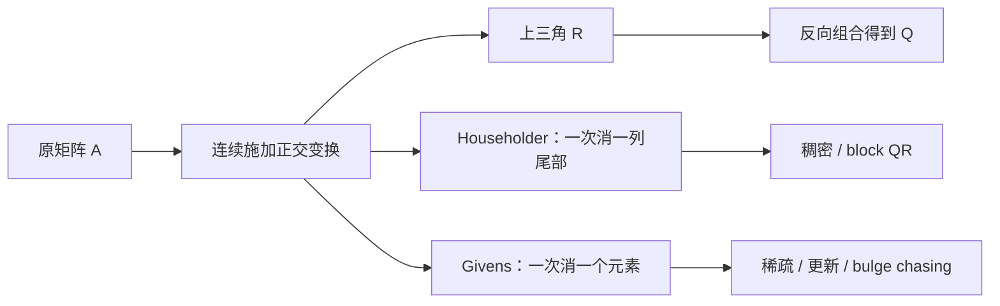

# Householder 与 Givens 变换

> [!abstract] 本章主问题
> Householder 反射一次把一个向量的整段尾部消成零，因而是稠密 QR 的稳定默认构件；Givens 旋转一次只混合两个坐标，因而适合稀疏、增量和结构化更新。二者的共同核心不是“消元公式更漂亮”，而是正交变换在二范数下不放大误差，并能把整段浮点计算解释为对邻近矩阵执行精确正交变换。

先用下图回答一个视觉问题：**Householder 与 Givens 怎样以不同粒度制造零，并在有限精度下保持正交几何与可验收 QR？**

![[00-知识库管理/_assets/figures/numerical-analysis/fig-householder-givens-qr-v2.svg|880]]

> [!figure] 图 10.8.8｜安全 Householder、scaled Givens 与 QR 双重验收
> A 画出将 $x$ 反射到 $\pm\|x\|e_1$ 的 Householder geometry，并用 $v=x+\operatorname{sign}(x_1)\|x\|e_1$ 避免近等相减；B 在二维平面把 $(a,b)$ 安全旋转到 $(r,0)$，强调 `hypot`/scaling；C 对比 Householder 的 dense/block 场景与 Givens 的 sparse/update/bulge-chasing 场景，并同时列出 reconstruction residual 与 orthogonality defect。来源：独立绘制；理论接口参考 Higham、Demmel 与 LAPACK；生成脚本：[[plot_numerical_direct_methods_v2.py]]；确定性结构示意，无随机种子。

**怎样读图。** A 先选择让 $v$ 避免灾难性消去的目标符号，再以紧凑 reflector 应用 $H=I-2vv^T/(v^Tv)$；B 不直接平方极大/极小 $a,b$，而用 scaled `hypot` 生成 $r,c,s$；C 根据稠密度、更新粒度与通信选择变换，并对 $\|A-QR\|/\|A\|$ 和 $\|I-Q^TQ\|$ 分别验收。

**适用边界（图没有证明什么）。** 二维图忽略 complex phase、blocked implementation 与 accumulation order。正交矩阵在精确二范数下 condition number 为 1，不代表浮点 reflector/rotation 参数生成自动无误；符号、scale 和 storage order 仍关键。小 reconstruction residual 不能单独证明 $Q$ 正交；显式形成 full $Q$ 也可能是不必要的成本。

## 学习目标

完成本章后，你应能：

1. 从几何和代数两种视角证明 Householder 矩阵是反射；
2. 推导把任意非零向量映到坐标轴的反射器；
3. 解释为什么 Householder 向量必须选择避免消去的符号；
4. 手算一个完整的 Householder 消元步骤；
5. 用反射器序列写出 $A=QR$，并判断 $Q$ 与 $Q^T$ 的应用顺序；
6. 推导 Givens 旋转的 $c,s,r$，并使用安全缩放避免溢出/下溢；
7. 比较 Householder、Givens、MGS、Cholesky QR 的稳定性、成本与结构适用性；
8. 写出 QR 的后向误差与正交性验收指标；
9. 解释 compact WY、block QR 与通信成本；
10. 把稳定 QR 迁移到最小二乘、Krylov、随机 SVD、低秩适配和 Muon/流式幂迭代。

> [!question] 初学者读完必须能回答
> 1. Householder matrix 为什么是正交对称反射？
> 2. 将 $x$ 映到坐标轴时，安全符号选择怎样避免 cancellation？
> 3. Reflector vectors 应怎样紧凑存储和按何种顺序应用？
> 4. Givens 的 $c,s,r$ 怎样推导，为什么应使用 scaled `hypot`？
> 5. Householder 与 Givens 分别适合 dense column、sparse entry、update 和 bulge chasing 中哪些场景？
> 6. 正交变换保持哪些范数/内积，浮点实现又如何写 backward error？
> 7. 为什么 QR 必须同时检查 reconstruction residual 与 orthogonality defect？

## 阅读前检查

### 检查 1：QR 的数学对象

对 $A\in\mathbb R^{m\times n}$、$m\ge n$、满列秩，薄 QR 为

$$
A=QR,
\qquad
Q\in\mathbb R^{m\times n},
\quad Q^TQ=I_n,
\quad R\in\mathbb R^{n\times n}
$$

且 $R$ 上三角。若要求 $r_{ii}>0$，薄 QR 唯一。

### 检查 2：为什么正交矩阵特殊

方阵 $U\in\mathbb R^{m\times m}$ 正交，意味着

$$
U^TU=UU^T=I_m.
$$

因此

$$
\|Ux\|_2^2
=x^TU^TUx
=\|x\|_2^2,
$$

并且

$$
\|UA\|_2=\|A\|_2,
\qquad
\kappa_2(U)=1.
$$

### 检查 3：本章与 Gram–Schmidt 的分工

[[标准正交基与 Gram-Schmidt]]回答“怎样从投影逐列理解 QR”；本章回答“在有限精度和真实硬件上，怎样用正交变换可靠地实现 QR”。

## 一、为什么稳定 QR 从“变换行”而不是“修补列”开始

Gaussian 消元使用一般初等行变换制造零；QR 希望制造零的同时不扭曲二范数。理想操作应满足：

1. 能把指定的下三角元素变成零；
2. 不改变向量长度和夹角；
3. 逆变换廉价；
4. 可以紧凑存储，而不显式形成 $m\times m$ 矩阵；
5. 多步组合后仍有可控制的浮点误差。

Householder 与 Givens 正好是两种最小构件：

- Householder：选一个超平面，把整个空间反射一次；
- Givens：选一个坐标平面，只旋转两个分量。

二者都属于正交变换，因此不会像一般消元乘子那样从变换本身引入二范数放大。

## 二、正交变换保留哪些量

若 $U$ 正交，则左乘 $U$：

$$
A\longmapsto UA
$$

具有以下不变量：

### 2.1 列之间的 Gram 矩阵

$$
(UA)^T(UA)=A^TU^TUA=A^TA.
$$

所以列内积、列范数和奇异值都不变。

### 2.2 二范数残差

$$
\|Ax-b\|_2
=\|U(Ax-b)\|_2
=\|(UA)x-Ub\|_2.
$$

这正是 QR 能稳定改写最小二乘而不改变目标函数的原因。

### 2.3 扰动大小

对任意 $E$，

$$
\|UE\|_2=\|E\|_2,
\qquad
\|UE\|_F=\|E\|_F.
$$

多步正交变换不会把早期舍入误差按某个巨大乘子继续放大；误差主要是逐步累加，而非几何放大。

> [!warning] 不要跨层误读
> 正交变换条件数为 1，不表示输入矩阵 $A$ 条件良好。若 $A$ 近秩亏，它的列空间、最小二乘解和 $R^{-1}$ 仍可能高度敏感。

## 三、Householder 反射的定义与几何

取非零向量 $v\in\mathbb R^p$，定义

$$
H
=I-2\frac{vv^T}{v^Tv}.
$$

若令 $u=v/\|v\|_2$，也可写成

$$
H=I-2uu^T.
$$

### 3.1 它把向量拆成平行与垂直两部分

任意 $x$ 可写成

$$
x=x_\parallel+x_\perp,
$$

其中

$$
x_\parallel=uu^Tx,
\qquad
x_\perp=(I-uu^T)x.
$$

于是

$$
Hx
=x-2uu^Tx
=-x_\parallel+x_\perp.
$$

沿法向量 $u$ 的分量变号，超平面 $u^Tx=0$ 内的分量保持不变。这就是关于该超平面的镜面反射。

### 3.2 对称性

$$
H^T=H.
$$

### 3.3 正交性与自逆性

利用 $u^Tu=1$：

$$
\begin{aligned}
H^TH
&=H^2\\
&=(I-2uu^T)^2\\
&=I-4uu^T+4u(u^Tu)u^T\\
&=I.
\end{aligned}
$$

因此

$$
H^{-1}=H^T=H.
$$

反射两次回到原处。

### 3.4 特征值与行列式

- 沿 $u$ 的方向，$Hu=-u$；
- 与 $u$ 正交的 $p-1$ 维超平面上，$Hx=x$。

所以特征值为一个 $-1$ 和 $p-1$ 个 $+1$，从而

$$
\det(H)=-1.
$$

## 四、怎样把向量一次反射到坐标轴

给定 $x\in\mathbb R^p$、$x\ne0$，目标是构造 $H$，使

$$
Hx=\alpha e_1,
\qquad
|\alpha|=\|x\|_2.
$$

因为反射保持长度，目标非零分量的绝对值只能是 $\|x\|_2$。

令

$$
v=x-\alpha e_1.
$$

只要 $v\ne0$，用它构造 Householder 反射。下面验证 $Hx=\alpha e_1$。

先计算

$$
v^Tx
=x^Tx-\alpha x_1
=\|x\|_2^2-\alpha x_1.
$$

再计算

$$
\begin{aligned}
v^Tv
&=(x-\alpha e_1)^T(x-\alpha e_1)\\
&=\|x\|_2^2-2\alpha x_1+\alpha^2\\
&=2(\|x\|_2^2-\alpha x_1),
\end{aligned}
$$

其中最后一步使用 $\alpha^2=\|x\|_2^2$。所以

$$
2\frac{v^Tx}{v^Tv}=1.
$$

于是

$$
Hx
=x-2v\frac{v^Tx}{v^Tv}
=x-v
=\alpha e_1.
$$

这不是近似关系，而是精确算术中的恒等式。

## 五、符号选择：最短的公式可能是最坏的实现

理论上 $\alpha=\pm\|x\|_2$ 都能工作；浮点中不能随意选择。

### 5.1 危险选择

若 $x_1>0$ 且 $x$ 已非常接近 $\|x\|_2e_1$，选择

$$
\alpha=+\|x\|_2
$$

会得到

$$
v_1=x_1-\|x\|_2,
$$

即两个非常接近的正数相减。尾部方向所携带的信息可能在 $v_1$ 中消失。

### 5.2 稳定选择

采用

$$
\boxed{
\alpha=-\operatorname{sign}(x_1)\|x\|_2
}
$$

并约定 $x_1=0$ 时取 $\operatorname{sign}(0)=1$。此时

$$
v_1
=x_1-\alpha
=x_1+\operatorname{sign}(x_1)\|x\|_2,
$$

两个同号量相加，不发生灾难性消去，并且

$$
|v_1|=|x_1|+\|x\|_2\ge\|x\|_2.
$$

### 5.3 范数本身也要安全计算

直接计算

$$
\sqrt{x_1^2+\cdots+x_p^2}
$$

可能在 $x_i$ 很大时 overflow、很小时 underflow。安全实现先缩放：

$$
s=\max_i|x_i|,
\qquad
\|x\|_2
=s\sqrt{\sum_i(x_i/s)^2}.
$$

实际库使用更细致的 safe minimum/maximum 处理。

> [!important] 本节是数值分析的典型模式
> 数学上等价的两个目标符号，浮点中可能一个稳定、一个失效。稳定算法不只选择“正确公式”，还选择保留信息的执行路径。

## 六、Householder QR：从一列尾部到整矩阵上三角化

设

$$
A\in\mathbb R^{m\times n},
\qquad m\ge n.
$$

第 $k$ 步只处理子向量

$$
x=A_{k:m,k}.
$$

构造 $\widetilde H_k\in\mathbb R^{(m-k+1)\times(m-k+1)}$，使

$$
\widetilde H_k x
=\alpha_k e_1.
$$

把它嵌入完整空间：

$$
H_k=
\begin{bmatrix}
I_{k-1}&0\\
0&\widetilde H_k
\end{bmatrix}.
$$

左乘 $H_k$ 不会破坏前 $k-1$ 列已经制造的零，因为它不再混合前 $k-1$ 行。

经过 $r=\min(m-1,n)$ 步：

$$
R=H_rH_{r-1}\cdots H_1A.
$$

每个 $H_k$ 对称且自逆，因此

$$
A=H_1H_2\cdots H_rR.
$$

定义

$$
Q=H_1H_2\cdots H_r,
$$

便得到完整 QR：

$$
A=Q
\begin{bmatrix}R_1\\0\end{bmatrix}.
$$

### 6.1 顺序为什么容易写反

消元时先施加 $H_1$，再施加 $H_2$，所以最终左乘积是

$$
H_r\cdots H_2H_1A.
$$

但恢复 $A$ 时要乘逆变换；由于 $H_k^{-1}=H_k$，顺序反转成

$$
Q=H_1H_2\cdots H_r.
$$

若要计算

$$
Q^Tb=H_r\cdots H_1b,
$$

实际操作顺序是先把 $H_1$ 作用到 $b$，再依次作用 $H_2,ldots,H_r$。不要只看公式最左边的矩阵判断第一步。

## 七、绝不显式形成每个 Householder 矩阵

若

$$
H=I-\tau vv^T,
$$

则对矩阵 $B$：

$$
HB
=B-\tau v(v^TB).
$$

计算分两步：

1. $w^T=\tau v^TB$；
2. $B\leftarrow B-vw^T$。

只需向量、点积和 rank-one update，不需要存储 $p^2$ 个 $H$ 元素。

### 7.1 LAPACK 风格归一化

可把 $v$ 缩放成首分量为 1：

$$
v=\begin{bmatrix}1\\v_2\\\vdots\\v_p\end{bmatrix},
\qquad
H=I-\tau vv^T.
$$

若由任意非零 $z$ 缩放得到 $v=z/z_1$，则

$$
\tau=\frac{2}{v^Tv}.
$$

### 7.2 原地存储

成熟稠密 QR 通常：

- 在 $A$ 的对角线及其上方保存 $R$；
- 在对角线下方保存每个 reflector 向量的尾部；
- 单独保存 $\tau_1,ldots,\tau_r$；
- 需要 $Qx$、$Q^Tx$ 或显式 $Q$ 时，再调用专用例程应用这些反射器。

所以 `qr_factor` 返回的矩阵缓存并不等于用户可以直接读取的 $Q$。

## 八、完整手算：把 $(4,3,0)^T$ 反射到坐标轴

取

$$
x=\begin{bmatrix}4\\3\\0\end{bmatrix},
\qquad
\|x\|_2=5.
$$

因为 $x_1>0$，稳定目标取

$$
\alpha=-5.
$$

于是

$$
v=x-\alpha e_1
=\begin{bmatrix}9\\3\\0\end{bmatrix}.
$$

$$
v^Tv=90.
$$

反射器为

$$
H=I-\frac{2}{90}vv^T
=
\begin{bmatrix}
-4/5&-3/5&0\\
-3/5&4/5&0\\
0&0&1
\end{bmatrix}.
$$

代回：

$$
Hx
=
\begin{bmatrix}
-4/5&-3/5&0\\
-3/5&4/5&0\\
0&0&1
\end{bmatrix}
\begin{bmatrix}4\\3\\0\end{bmatrix}
=
\begin{bmatrix}-5\\0\\0\end{bmatrix}.
$$

正交性检查：

$$
H^TH=I,
\qquad
\|Hx\|_2=5=\|x\|_2.
$$

## 九、Householder QR 的成本

对实稠密 $m\times n$ 矩阵、$m\ge n$，只计算紧凑 QR 因子约需

$$
\boxed{
2mn^2-\frac23n^3+O(mn)
}
$$

flops。

### 9.1 这个公式从哪里来

第 $k$ 步处理约

$$
(m-k+1)\times(n-k+1)
$$

的尾随矩阵。一次 $v^TB$ 和一次 $v w^T$ 更新各与该子矩阵大小成正比；把 $k=1,ldots,n$ 求和就得到上述三次多项式。

### 9.2 还要区分三种任务

| 任务 | 产物 | 典型成本层级 |
|---|---|---|
| factorize | $R$ 与紧凑 reflectors | $O(mn^2)$ |
| apply $Q$/$Q^T$ | 作用到 $p$ 个右端 | $O(mnp)$ |
| form explicit $Q$ | 显式薄/完整矩阵 | 额外 $O(mn^2)$ 或更高 |

只为求最小二乘的 $Q^Tb$ 时，不应先形成完整 $m\times m$ 的 $Q$。

## 十、Givens 旋转：只动两个坐标

取

$$
G=
\begin{bmatrix}
c&s\\
-s&c
\end{bmatrix},
\qquad
c^2+s^2=1.
$$

则

$$
G^TG=I_2,
\qquad
\det(G)=1.
$$

它是平面旋转，而非反射。

在 $m$ 维中，$G(i,j;c,s)$ 等于单位矩阵，只把第 $i,j$ 个坐标对应的 $2\times2$ 子块替换为 $G$。因此一次变换只混合两行或两列。

## 十一、用 Givens 消掉一个元素

给定

$$
\begin{bmatrix}f\\g\end{bmatrix},
$$

希望

$$
\begin{bmatrix}
c&s\\
-s&c
\end{bmatrix}
\begin{bmatrix}f\\g\end{bmatrix}
=
\begin{bmatrix}r\\0\end{bmatrix}.
$$

若 $r\ne0$，取

$$
r=\operatorname{sign}(f)\sqrt{f^2+g^2},
\qquad
c=\frac{f}{r},
\qquad
s=\frac{g}{r}.
$$

则

$$
cf+sg
=\frac{f^2+g^2}{r}
=r,
$$

且

$$
-sf+cg=0.
$$

同时

$$
c^2+s^2=1.
$$

### 11.1 手算例子

取 $f=3,g=4$：

$$
r=5,
\qquad
c=\frac35,
\qquad
s=\frac45.
$$

$$
\begin{bmatrix}
3/5&4/5\\
-4/5&3/5
\end{bmatrix}
\begin{bmatrix}3\\4\end{bmatrix}
=
\begin{bmatrix}5\\0\end{bmatrix}.
$$

## 十二、Givens QR：从下往上逐个消零

对第 $j$ 列，可以从底部开始：

$$
a_{mj},a_{m-1,j},\ldots,a_{j+1,j}.
$$

每次选相邻两行，用一个 Givens 旋转消掉较下面的元素。自底向上能避免重新制造已经消掉的零。

### 12.1 旋转数量

稠密 $m\times n$ 矩阵需要

$$
\sum_{j=1}^{n}(m-j)
=mn-\frac{n(n+1)}2
$$

次旋转。

### 12.2 稠密成本

若每次旋转更新从第 $j$ 列到第 $n$ 列的两个行段，粗略 flop 数为

$$
6\sum_{j=1}^{n}(m-j)(n-j+1).
$$

方阵时主项约 $2n^3$，高于 Householder QR 的 $\frac43n^3$。因此 Givens 通常不是一般稠密 QR 的默认选择。

### 12.3 它为何仍不可替代

若矩阵只有少数位置非零，或只新增一行/一列，Givens 可以只触碰局部坐标；Householder 往往会把更长的向量段纳入一次反射。真正成本取决于 fill-in 和数据移动，而不只取决于稠密 flop 公式。

## 十三、安全生成 Givens：不要直接平方

朴素公式

$$
r=\sqrt{f^2+g^2}
$$

存在两个问题：

- $|f|,|g|\approx10^{300}$ 时，平方会 overflow，尽管真实 $r\approx10^{300}$ 仍可表示；
- $|f|,|g|\approx10^{-300}$ 时，平方会 underflow 为零，尽管真实 $r\ne0$。

### 13.1 缩放公式

令

$$
t=\max(|f|,|g|).
$$

若 $t\ne0$，先算

$$
\rho=t\sqrt{(f/t)^2+(g/t)^2},
$$

再按所选符号约定得到 $r,c,s$。所有平方都在 $[0,1]$ 附近。

### 13.2 特殊值

一个完整实现还要定义：

- $g=0$ 时返回恒等旋转；
- $f=0$ 时如何选择 $c,s,r$ 的符号；
- subnormal、safe minimum 和 safe maximum；
- NaN/Inf 的传播契约；
- 实数与复数版本是否采用同一相位约定。

LAPACK `xLARTG` 正是这类“看似只有三行公式，实际需要完整数值契约”的辅助例程。

## 十四、Householder 与 Givens 的方法选择

| 维度 | Householder | Givens |
|---|---|---|
| 基本动作 | 一次反射一整段 | 一次旋转两个坐标 |
| 每次制造的零 | 一列的连续尾部 | 一个指定元素 |
| 稠密 QR | 默认，flops 较少 | 通常更多 flops |
| 稀疏 QR | 可能引入较广 fill | 可按局部结构选旋转 |
| 在线增量 | 不一定局部 | 非常自然 |
| Hessenberg/双对角 QR | 可用于初始约化 | bulge chasing 核心工具 |
| 并行矩阵乘 | block reflector 很合适 | 细粒度旋转需批处理 |
| 存储 | reflector 向量 + $\tau$ | $(i,j,c,s)$ 序列 |
| 数值核心 | 避免 $x_1-\|x\|$ 消去 | 安全计算 hypot/符号 |

不能只问“哪个更稳定”；二者都可构成后向稳定算法。真正差异通常来自矩阵结构、更新模式、通信和实现。

## 十五、为什么正交变换 QR 后向稳定

先看一次计算变换。设机器中生成的 reflector/rotation 接近某个精确正交矩阵 $U$，浮点应用满足

$$
\operatorname{fl}(UA)=UA+E,
\qquad
\|E\|\le c_1u\|A\|.
$$

因为 $U$ 正交，

$$
UA+E
=U(A+U^TE).
$$

并且

$$
\|U^TE\|=\|E\|.
$$

所以一次浮点正交变换可以解释为：对略微扰动的输入执行精确正交变换。

### 15.1 多次组合

若连续施加 $U_1,ldots,U_r$，每步误差分别为 $E_k$，则最终误差具有形式

$$
U_r\cdots U_1A
+U_r\cdots U_2E_1
+\cdots
+U_rE_{r-1}+E_r.
$$

由于左乘正交矩阵不改变范数，

$$
\|E_{\mathrm{total}}\|
\le\sum_{k=1}^{r}\|E_k\|.
$$

误差按步数累加，而没有额外的几何放大。

### 15.2 QR 的标准结论形式

在标准浮点模型、无灾难性 overflow/underflow 且维度适用时，计算因子可解释为：存在精确正交矩阵 $\widetilde Q$ 和小扰动 $\Delta A$，使

$$
A+\Delta A
=\widetilde Q\widehat R,
$$

且

$$
\frac{\|\Delta A\|}{\|A\|}
\le c(m,n)u+O(u^2).
$$

若显式形成 $\widehat Q$，通常还满足

$$
\|I-\widehat Q^T\widehat Q\|
\le c_Q(m,n)u+O(u^2).
$$

常数取决于范数、实现、block 方式和是否显式形成 $Q$；严谨报告不应把 $O(u)$ 写成与规模无关的神奇常数。

## 十六、与 CGS、MGS 和 Cholesky QR 比较

对近相关列，常见一阶量级图景是：

| 方法 | 正交性缺陷的典型理论依赖 | 主要边界 |
|---|---|---|
| CGS | 可能到 $O(u\kappa(A)^2)$ | 投影误差被近相关性放大 |
| MGS | 常见为 $O(u\kappa(A))$ | 极病态时仍需重正交化 |
| Householder/Givens | $O(u)$ 乘维度常数 | 输入子空间条件性仍存在 |
| Cholesky QR | 形成 $A^TA$，受 $\kappa(A)^2$ 影响 | 快，但近秩亏处可能失败 |

这些是解释机制的首阶量级，不是对所有变体、范数和硬件统一成立的单行定理。

### 16.1 为什么重构残差不够

一个 QR 实现可能同时满足

$$
\|A-\widehat Q\widehat R\|
\text{ 很小}
$$

但

$$
\|I-\widehat Q^T\widehat Q\|
\text{ 很大}.
$$

[[实验 - Gram-Schmidt 与 QR 的正交性误差]]已经展示 CGS 的这种现象。Householder/Givens 的优势正是同时控制重构与正交结构。

## 十七、QR 的最低验收指标

给定计算结果 $\widehat Q,\widehat R$，至少检查四项。

### 17.1 相对重构残差

$$
\eta_{\mathrm{rec}}
=\frac{\|A-\widehat Q\widehat R\|_F}{\|A\|_F}.
$$

### 17.2 正交性缺陷

$$
\eta_{\mathrm{orth}}
=\|I-\widehat Q^T\widehat Q\|_F.
$$

### 17.3 三角性缺陷

$$
\eta_{\mathrm{tri}}
=\frac{\|\operatorname{tril}(\widehat R,-1)\|_F}{\|A\|_F}.
$$

### 17.4 下游任务残差

若用 QR 解最小二乘，还需检查

$$
r=b-A\widehat x,
\qquad
A^Tr,
$$

以及相应后向误差和条件估计。一个漂亮的 $Q^TQ$ 不能替代任务输出验收。

> [!tip] 推荐归一化
> 除了原始指标，可报告 $\eta_{\mathrm{rec}}/(u\,p(m,n))$、$\eta_{\mathrm{orth}}/(u\,q(m,n))$，让不同规模间更可比；多项式 $p,q$ 必须明确，而不能用“误差很小”代替。

## 十八、block Householder 与数据移动

逐个 reflector 的 Level-2 形式主要做矩阵—向量操作，现代硬件常受内存带宽限制。把一组反射器组合为 compact WY 形式：

$$
H_1H_2\cdots H_b
=I-VTV^T,
$$

其中

$$
V\in\mathbb R^{m\times b},
\qquad
T\in\mathbb R^{b\times b}
$$

且 $T$ 上三角。应用到尾随矩阵 $C$：

$$
C\leftarrow C-V(T(V^TC)).
$$

这把大量工作转为矩阵乘，能提高缓存、SIMD 和加速器利用率。

### 18.1 算法评价的三张账

1. **flops**：总乘加次数；
2. **communication**：内存层级与设备之间移动多少数据；
3. **synchronization**：panel、归约和跨设备需要多少同步。

block 化通常不改变主阶 flop 数，却能显著改变后两项。TSQR、CAQR 等方法进一步以树形归约降低通信，但其误差、重现性和树结构要单独记录。

## 十九、秩亏、列主元与 rank revealing

无列主元 Householder QR 稳定地分解输入，但不保证 $R$ 的对角线按数值重要性排序。

### 19.1 列主元 QR

引入列置换 $\Pi$：

$$
A\Pi=QR.
$$

每步选择尾随部分范数较大的列，可以让

$$
|r_{11}|\gtrsim|r_{22}|\gtrsim\cdots
$$

在很多问题中成立，并提供数值秩线索。

### 19.2 它不是无条件最优列选择

QRCP 是贪心算法，存在对抗矩阵；普通 QRCP 也不等于 strong rank-revealing QR。[[S-2024-Su-10501-低秩近似之路四ID|科学空间的“低秩近似之路（四）：ID”]]把列驱 QR 放到插值分解中，并明确指出它的经验有效性和极端失效边界。

### 19.3 rank tolerance 必须绑定尺度

不能只判断 $r_{kk}=0$。常见尺度化判断类似

$$
|r_{kk}|
\le\tau |r_{11}|
$$

或结合矩阵范数、维度和噪声模型。$\tau$ 是任务假设，不是数学常数。

## 二十、Householder QR 怎样解最小二乘

考虑 $m\ge n$、满列秩：

$$
\min_x\|Ax-b\|_2.
$$

完整 QR 写成

$$
A=Q
\begin{bmatrix}R\\0\end{bmatrix}.
$$

令

$$
Q^Tb=
\begin{bmatrix}c_1\\c_2\end{bmatrix},
\qquad c_1\in\mathbb R^n.
$$

利用正交不变性：

$$
\begin{aligned}
\|Ax-b\|_2^2
&=
\left\|
\begin{bmatrix}R\\0\end{bmatrix}x
-
\begin{bmatrix}c_1\\c_2\end{bmatrix}
\right\|_2^2\\
&=\|Rx-c_1\|_2^2+\|c_2\|_2^2.
\end{aligned}
$$

所以解三角方程

$$
R\widehat x=c_1.
$$

算法从不需要形成 $A^TA$，因此避免把条件数平方。完整误差与 rank-deficient 情形留给[[稳定最小二乘与正规方程的风险]]。

## 二十一、AI 与科学计算中的直接接口

### 21.1 block power iteration、随机 SVD 与 Muon

设要跟踪 $M\in\mathbb R^{d_1\times d_2}$ 的前 $r$ 个右奇异方向，block power iteration 常包含

$$
Y_t=M^TMV_{t-1},
\qquad
V_t=\operatorname{QR}(Y_t),
$$

其中

$$
V_t\in\mathbb R^{d_2\times r},
\qquad
V_t^TV_t=I_r.
$$

正交化防止所有列同时塌缩到第一奇异方向。科学空间的流式幂迭代 Muon 把这一步放进训练循环，并把标准 Householder QR 与更快但更敏感的 Cholesky QR/SCQR 作工程权衡。

### 21.2 随机低秩近似

随机 SVD 先形成

$$
Y=A\Omega,
\qquad
Y\in\mathbb R^{m\times(r+p)},
$$

再计算

$$
Y=QR.
$$

$Q$ 提供采样子空间的标准正交基。若 $Q$ 数值上不正交，后续投影 $QQ^TA$、误差估计和幂迭代都会被污染。

### 21.3 LoRA 子空间—坐标分离

若 LoRA 更新

$$
\Delta W=BA,
\qquad
B\in\mathbb R^{d_{\mathrm{out}}\times r},
\quad
A\in\mathbb R^{r\times d_{\mathrm{in}}},
$$

且 $B=QR$，则

$$
\Delta W=Q(RA).
$$

$Q$ 表示更新子空间，$RA$ 表示该子空间内坐标。QR 是重参数化，不自动改善训练；若 $B$ 近秩亏，梯度和符号约定仍可能敏感。

### 21.4 Stiefel 约束与 retraction

对一个一般矩阵 $Z$ 做薄 QR，取 $Q$ 作为满足 $Q^TQ=I$ 的参数，可作为 Stiefel 流形上的 retraction。必须固定 $R$ 对角线符号，否则同一邻域可能因符号翻转出现不连续输出。

### 21.5 Krylov 与大模型谱诊断

Arnoldi/Lanczos、谱范数估计和多向量幂迭代持续生成新方向。这里 Householder、MGS2 或 Givens 的选择会直接影响：

- 基向量是否保持正交；
- Ritz 值/奇异值估计是否产生 ghost；
- 通信和同步是否可承受；
- 混合精度下是否需要重正交化。

### 21.6 流式最小二乘

新样本到来时，已有 $R$ 只多出一行数据。Givens 可以局部旋转恢复上三角结构，而不从头分解整个历史矩阵。这是在线回归、递推估计和滑动窗口求解的重要接口。

## 二十二、可微 QR：为什么满秩与符号约定不可省略

设薄 QR

$$
A=QR,
\qquad Q^TQ=I,
$$

并规定 $R$ 对角线为正。微分：

$$
dA=dQ\,R+Q\,dR.
$$

右乘 $R^{-1}$ 并左乘 $Q^T$：

$$
X:=Q^TdA\,R^{-1}
=Q^TdQ+dR\,R^{-1}.
$$

由 $Q^TQ=I$：

$$
d(Q^TQ)=dQ^TQ+Q^TdQ=0,
$$

所以

$$
S:=Q^TdQ
$$

是斜对称矩阵。另一方面，$dR\,R^{-1}$ 上三角。因此 $X$ 的严格下三角部分完全来自 $S$：

$$
S_{ij}=X_{ij},\quad i>j,
\qquad
S_{ji}=-X_{ij}.
$$

再对 $dA\,R^{-1}$ 做垂直/切向分解：

$$
\boxed{
dQ
=(I-QQ^T)dA\,R^{-1}+QS
}
$$

### 22.1 为什么近秩亏时梯度爆炸

公式显式含 $R^{-1}$。当 $\sigma_{\min}(A)$ 很小时，

$$
\|R^{-1}\|_2
=\frac1{\sigma_{\min}(A)}
$$

很大，微小 $dA$ 会引起巨大 $dQ$。

### 22.2 为什么符号翻转造成不连续

若不固定 $r_{ii}>0$，同一个 QR 可把 $q_i$ 与 $R$ 第 $i$ 行同时乘 $-1$。数值库在参数变化时若切换分支，$Q$ 会突然翻转符号；函数值 $QR$ 不变，但单独使用 $Q$ 的损失和梯度可能不连续。

## 二十三、常见失败模式

| 错误做法 | 失败原因 | 最小修正 |
|---|---|---|
| 显式形成每个 $H$ | 存储和计算从向量级膨胀到矩阵级 | 保存 $v,\tau$ 并做 rank-one/block update |
| 固定取 $\alpha=\|x\|$ | $x_1\approx\|x\|$ 时灾难性消去 | 取相反符号目标 |
| 用 `sqrt(f*f+g*g)` | 极端尺度 overflow/underflow | safe hypot / `xLARTG` |
| 只检查 $A-QR$ | 可能漏掉 $Q$ 严重失去正交 | 同时报正交性缺陷 |
| 为求 $Q^Tb$ 先形成完整 $Q$ | 浪费时间和内存 | 直接应用 reflectors |
| 把 QRCP 当最优列子集 | 贪心不等于全局最优 | 说明经验边界，必要时 strong RRQR/SVD |
| 认为正交算法能修复 rank deficiency | 稳定性不能创造信息 | 条件估计、rank tolerance、SVD/正则化 |
| 用 Cholesky QR 替代所有 QR | $A^TA$ 平方条件数 | 检测、shift、迭代或回退 Householder |
| 忽略 QR 的符号规范 | 输出/梯度会跳变 | 固定 $R$ 正对角并记录 API 约定 |

## 二十四、可信 QR 报告模板

### 24.1 输入

- $m,n$、实/复、稠密/稀疏；
- dtype、累加精度、设备与库版本；
- $\|A\|$、尺度范围、条件数/数值秩估计；
- 是否含 NaN/Inf、subnormal 或结构化零。

### 24.2 算法

- Householder、block Householder、Givens、TSQR、MGS2、QRCP 或 Cholesky QR；
- reflector/rotation 的符号与缩放规则；
- 是否显式形成 $Q$；
- block size、归约树、列主元和回退路径。

### 24.3 指标

- $\eta_{\mathrm{rec}}$；
- $\eta_{\mathrm{orth}}$；
- $\eta_{\mathrm{tri}}$；
- rank/condition estimate；
- 下游 residual、task error；
- flops、时间、内存流量、同步和最坏样本。

### 24.4 结论句式

> 在给定矩阵族、维度、dtype 与实现上，该方法的重构和正交性缺陷分别为……；当条件数/尺度达到……时出现……；因此它适合作为……的基线，但对……必须回退或提高精度。

## 二十五、实验：三个“等价公式不等价实现”边界

[[实验 - Householder 符号、Givens 缩放与 QR 正交性]]固定三组因果变量：

1. 向量逐渐接近 $e_1$ 时，只改变 Householder 目标符号；
2. $(f,g)$ 从 $10^{-300}$ 扫到 $10^{300}$ 时，只改变 Givens 半径计算；
3. 矩阵条件数上升时，用相同输入比较 MGS、Householder 与 Givens QR。

图中验证：

- 错误符号因消去失去 reflector 方向，稳定符号保持自然精度；
- 朴素平方和在极端尺度失败，安全缩放保持可用；
- Householder/Givens 的正交性缺陷接近舍入误差量级，而 MGS 随条件数上升。

这些结果支持执行路径分析，不代表某个 BLAS/GPU 库的性能排序。

## 二十六、掌握检查

### L1：解释

- 能否用“平行分量变号、垂直分量不变”解释反射？
- 能否说明 Givens 为什么只影响两个坐标？

### L2：计算

- 能否手算 $x=(4,3,0)^T$ 的 Householder 反射？
- 能否为 $(3,4)^T$ 生成 Givens 参数并验算？

### L3：推导

- 能否证明 $Hx=\alpha e_1$？
- 能否从逐步误差推导正交变换序列的后向稳定骨架？

### L4：判断

- 能否根据稠密、稀疏、在线更新和通信约束选择 Householder/Givens？
- 能否诊断重构好但正交性坏的 QR 输出？

### L5：AI 迁移

- 能否为 block power/Muon 或随机 SVD 写出 QR 的形状、频率、误差指标和回退？
- 能否解释 LoRA 因子 QR 重参数化改变什么、不改变什么？

### L6：研究

- 能否比较 Householder、TSQR、SCQR 与 MGS2 的通信—精度相图？
- 能否审计一个可微 QR kernel 在 rank collision、符号翻转和低精度下的梯度？

## 二十七、课程闭环

- 主笔记：本章；
- 代数先修：[[QR 分解]]、[[内积空间]]；
- 数值先修：[[浮点数与舍入误差]]、[[数值稳定性]]；
- 对照节点：[[标准正交基与 Gram-Schmidt]]、[[实验 - Gram-Schmidt 与 QR 的正交性误差]]；
- 分层训练：[[习题 - Householder 与 Givens 变换]]；
- 完整解答：[[解答 - Householder 与 Givens 变换]]；
- 可复现实验：[[实验 - Householder 符号、Givens 缩放与 QR 正交性]]；
- 下一节点：[[稳定最小二乘与正规方程的风险]]；
- 谱算法分支：[[Hessenberg 化与 QR 特征值算法]]、[[Lanczos 方法]]、[[Arnoldi 方法]]。

## 来源与证据边界

### 经典理论与课程

- [[S-2024-Demmel-Householder-Givens稳定QR]]：反射、旋转、QR 路线与后向稳定证明骨架；
- [[S-2002-Higham-数值算法准确性与稳定性]]：浮点误差模型、正交变换与矩阵分解的稳定性语言；
- Lloyd N. Trefethen & David Bau III, *Numerical Linear Algebra*, Lectures 10–12：Householder、Givens 与 QR；
- Gene H. Golub & Charles F. Van Loan, *Matrix Computations*, 4th ed.：block/稀疏 QR、rank revealing 与实现路线。

### 软件与 AI 接口

- [[S-2025-LAPACK-QR反射与平面旋转]]：`xGEQRF` 紧凑 reflector 契约与 `xLARTG` 安全缩放；
- [[S-2026-Su-11654-流式幂迭代Muon初识]]：Muon/流式幂迭代中的标准 QR、Cholesky QR 和回退接口；
- [[S-2024-Su-10501-低秩近似之路四ID|苏剑林：低秩近似之路（四）——ID]]：QRCP 在低秩列选择中的几何与经验边界。

### 本章不宣称

- 不把 $O(u)$ 写成与矩阵规模、实现和范数无关的绝对常数；
- 不把正交变换稳定性误写成 rank-deficient 问题条件良好；
- 不把 QRCP 当作所有矩阵上的最优或强 rank-revealing 方法；
- 不从纯 Python 实验推断 BLAS、GPU 或分布式 QR 的性能；
- 不在本章完成稳定最小二乘、TSQR/CAQR、稀疏 multifrontal QR 或可微 QR 的全部理论。
