# 幂法、反幂法与 Rayleigh 商迭代

> [!abstract] 本章主问题
> 幂法反复乘 $A$，把绝对值最大的特征方向按谱比逐步放大；反幂法通过反复求解 $(A-\sigma I)y=x$，把离移位 $\sigma$ 最近的特征方向变成主方向；Rayleigh 商迭代让移位随当前向量更新，在实对称/复 Hermitian、单特征值和局部收敛条件下可达到三次收敛。速度由谱间隙决定，可信度必须由残差、条件性和线性求解质量共同验证。

先用下图回答一个视觉问题：**幂法、移位反幂法和 RQI 本质上分别使用了什么谱过滤器，速度与可信度由什么控制？**

![[00-知识库管理/_assets/figures/numerical-analysis/fig-power-inverse-rqi-v2.svg|880]]

> [!figure] 图 10.8.10｜幂过滤、shift–invert 与 Rayleigh 商移位更新
> A 用谱分量柱形图表示幂法经过 $k$ 步后按 $|\lambda_i/\lambda_1|^k$ 抑制非主方向；B 表示 shift–invert 将特征值映为 $(\lambda_i-\sigma)^{-1}$，使离 $\sigma$ 最近的方向成为主模方向；C 串联 RQI 的 Rayleigh 商、移位线性求解和归一化，并标出对称、单特征值、局部区域下的三次角误差收敛。来源：独立绘制；理论接口参考 Demmel、Higham 与对称特征值迭代理论；生成脚本：[[plot_numerical_spectral_methods_v2.py]]；确定性结构示意，无随机种子。

**怎样读图。** 把三种算法统一看成“用函数 $f(A)$ 过滤当前向量”：A 的 $f(\lambda)=\lambda^k$ 选择主模，B 的 $f(\lambda)=(\lambda-\sigma)^{-1}$ 选择离移位最近的谱点，C 则用当前 Rayleigh 商动态移动极点。收敛速度先由过滤后目标分量与其余分量的比值决定；停止时再检查特征残差 $\|Ax-\rho x\|$、谱间隙和每次线性求解质量。

**适用边界（图没有证明什么）。** 柱形图默认可用正交特征基解释分量，不能直接覆盖 defective 或强非正规矩阵。反幂法应求解线性系统而非形成逆；移位越近虽增强过滤，也使系统更难解。RQI 的三次收敛是对称/Hermitian、单特征值附近的局部结论，不是任意初值、重特征值或一般非正规矩阵的全局保证。

## 学习目标

完成本章后，你应能：

1. 写出幂法、固定移位反幂法与 Rayleigh 商迭代的完整算法；
2. 用特征向量展开推导幂法的收敛因子 $|\lambda_2/\lambda_1|$；
3. 说明初始向量没有目标分量、主模特征值并列或矩阵不可对角化时怎样失败；
4. 手算二维幂法和三维反幂法的前两步；
5. 推导反幂法的收敛因子与移位的关系；
6. 解释为什么必须“求解线性系统”而不是显式形成逆；
7. 证明对称矩阵 Rayleigh 商的特征值误差是角误差的二阶量；
8. 说明 RQI 局部三次收敛需要哪些条件；
9. 用特征残差给出后验停止与误差解释；
10. 把方法迁移到谱归一化、PCA、随机 SVD、Hessian 曲率和 Muon/流式幂迭代。

> [!question] 初学者读完必须能回答
> 1. 幂法的谱展开怎样导出 $|\lambda_2/\lambda_1|^k$ 收敛因子？
> 2. 初始向量缺少目标分量或主模并列时为何会失败？
> 3. Shift–invert 为何把靠近 $\sigma$ 的特征值变成主模？
> 4. 为什么实现反幂法时只能求解 $(A-\sigma I)y=x$，不能显式求逆？
> 5. Rayleigh 商为何对对称矩阵的方向误差呈二阶特征值误差？
> 6. RQI 的局部三次收敛需要哪些条件？
> 7. Residual、spectral gap 与线性求解误差如何共同决定可接受的停止准则？

## 阅读前检查

### 检查 1：特征对与不变方向

对 $A\in\mathbb C^{n\times n}$，若

$$
Aq=\lambda q,
\qquad q\ne0,
$$

则 $(\lambda,q)$ 是右特征对。向量 $q$ 的非零倍数表示同一方向，所以算法比较的是方向而非符号或相位。

### 检查 2：本章首先使用的安全情形

大部分精确收敛推导先假设 $A$ 为实对称矩阵：

$$
A=Q\Lambda Q^T,
\qquad Q^TQ=I.
$$

这样：

- 特征值全为实数；
- 特征向量可取标准正交基；
- 向量角度和谱系数直接对应；
- 残差能给出清楚的后验误差界。

一般非正规矩阵将在边界章节单独处理。

### 检查 3：不能形成特征多项式来做大规模计算

特征多项式适合定义和小矩阵手算，却通常不是可靠数值算法。若只需要一个极端特征对，矩阵—向量乘法可能远便宜于完整 Schur 分解。

> [!note] 课程位置
> NUM-09 的正规矩阵 $G=A^TA$ 已经把最小二乘弱方向变成特征值问题。本章研究只取一个目标特征方向时怎样用谱过滤避免完整分解；NUM-11 会计算全部 Schur 谱，NUM-12 则把多个幂方向正交化成 Krylov 子空间。

> [!tip] 建议两遍阅读
> 第一遍只在三个已知特征方向上追踪系数：幂法看 $1,4^{-k},16^{-k}$，shift–invert 看三个倒数距离，RQI 在二维平面证明 $\tan\theta_{+}=-\tan^3\theta$；第二遍再进入一般初值、残差后验界、线性求解误差、重特征值和非正规边界。

## 本章的推导问题链

1. 若矩阵已有正交特征基，一次乘 $G$ 会怎样改变各谱分量？
2. 反复归一化为什么选择最大模特征值，而不是“最大代数值”？
3. 将 $G-\sigma I$ 求逆作用后，为什么最近的谱点成为最大模？
4. 移位越接近目标，为何过滤更强、线性系统也更难解？
5. Rayleigh 商为何把方向误差变成二阶特征值误差？
6. 对称简单特征值附近，RQI 的三次角收敛怎样精确出现？
7. 最终为什么仍要用 residual 与 gap，而不能只看相邻迭代差？

## 贯穿算例：对最小二乘 Gram 矩阵做三种谱过滤

沿用 NUM-09 的

$$
G=A^TA
=Q\Lambda Q^T,
\qquad
\Lambda=\operatorname{diag}\!\left(1,\frac14,\frac1{16}\right),
$$

并记

$$
u_i=Qe_i,
\qquad
Gu_i=\lambda_i u_i.
$$

### 符号与对象账本

| 对象 | 本例中的值 | 作用 |
|---|---|---|
| $\lambda_1,\lambda_2,\lambda_3$ | $1,1/4,1/16$ | 三个谱尺度 |
| $u_i$ | $Qe_i$ | 标准正交特征方向 |
| $x_0$ | $(u_1+u_2+u_3)/\sqrt3$ | 对三个方向均有非零分量 |
| $\rho(x)$ | $x^TGx/(x^Tx)$ | 当前方向的特征值估计 |
| $r(x)$ | $Gx-\rho(x)x$ | 近似特征对证书 |
| $\sigma$ | 固定或动态 shift | 决定 shift–invert 目标 |
| $\theta$ | $x$ 与目标 $u_1$ 的夹角 | 方向误差坐标 |

### 第一步：幂法就是按特征值反复重加权

不归一化的第 $k$ 次幂为

$$
G^kx_0
=\frac1{\sqrt3}
\left(
u_1+4^{-k}u_2+16^{-k}u_3
\right).
$$

归一化只改变整体长度，不改变方向比例。因此相对主方向的两个污染系数是

$$
\left|\frac{c_2^{(k)}}{c_1^{(k)}}\right|=4^{-k},
\qquad
\left|\frac{c_3^{(k)}}{c_1^{(k)}}\right|=16^{-k}.
$$

例如 $k=2$ 时比例为 $1:1/16:1/256$。主导收敛因子是 $|\lambda_2/\lambda_1|=1/4$，因为第二方向衰减最慢。

当前 Rayleigh 商也可精确写为

$$
\rho_k
=\frac{
1+\frac14\,16^{-k}+\frac1{16}\,256^{-k}
}{
1+16^{-k}+256^{-k}
},
$$

它趋向 $1$；但方向已经接近并不等于 residual 已达到任务容差，停止时仍需显式计算 $Gx_k-\rho_kx_k$。

### 第二步：shift–invert 把“距离最近”变成“绝对值最大”

若取

$$
\sigma=\frac5{16},
$$

则

$$
(G-\sigma I)^{-1}u_i
=\frac1{\lambda_i-\sigma}u_i.
$$

三个映射后的特征值为

$$
\frac{16}{11},
\qquad
-16,
\qquad
-4.
$$

绝对值最大的是与 $\lambda_2=1/4$ 对应的 $-16$，所以反幂法选择中间特征方向 $u_2$；次大绝对值为 $4$，渐近方向因子是 $4/16=1/4$。实现必须每步**求解**

$$
(G-\sigma I)y_k=x_k,
$$

不能形成 inverse。此例 shifted system 的谱距离最小为 $1/16$、最大为 $11/16$；过滤变强的同时，求解条件也比远离谱时更苛刻。

### 第三步：Rayleigh 商的二阶准确性可以直接算出

在不变平面 $\operatorname{span}\{u_1,u_2\}$ 中写

$$
x=\cos\theta\,u_1+\sin\theta\,u_2,
\qquad \|x\|_2=1.
$$

则

$$
\begin{aligned}
\rho(x)
&=\cos^2\theta+\frac14\sin^2\theta\\
&=1-\frac34\sin^2\theta.
\end{aligned}
$$

所以

$$
|\rho(x)-\lambda_1|
=\frac34\sin^2\theta.
$$

方向角是 $O(\theta)$ 时，特征值误差已经是 $O(\theta^2)$。这依赖对称正交谱分解；一般非正规矩阵不能照搬。

### 第四步：RQI 的三次角收敛在二维中是一个等式

RQI 取 $\sigma=\rho(x)$ 并解

$$
(G-\rho I)y=x.
$$

在 $u_1,u_2$ 坐标中，归一化前的新分量比为

$$
\begin{aligned}
\tan\theta_+
&=\tan\theta\,
\frac{\lambda_1-\rho}{\lambda_2-\rho}\\
&=\tan\theta\,
\frac{(3/4)\sin^2\theta}{-(3/4)\cos^2\theta}\\
&=-\tan^3\theta.
\end{aligned}
$$

因此在目标特征向量附近，角误差按三次方缩小；负号只表示跨过目标方向，不影响无向特征向量的距离。这个精确等式也说明三次收敛是**局部**现象：$\theta$ 不小时，不能只用渐近阶预测步数。

### 核心公式七问：特征残差 $r=Gx-\rho x$

1. **为什么选 Rayleigh 商？** 对固定单位 $x$，它使 $\|Gx-\mu x\|$ 关于标量 $\mu$ 最小。
2. **Residual 为零意味着什么？** $(\rho,x)$ 是精确特征对。
3. **Residual 小就能保证方向准吗？** 还需要目标与其余谱之间有 gap；聚簇时只能认证子空间。
4. **幂法的迭代差能替代 residual 吗？** 不能；符号翻转、停滞或归一化会让差值误导。
5. **反幂法还需什么证据？** 每个 shifted solve 的 backward error，否则 outer residual 可能被内层误差污染。
6. **RQI 三次收敛需要什么？** 对称/Hermitian、简单特征值、进入局部邻域以及足够准确的线性求解。
7. **AI 中如何用？** 谱归一化、Hessian 曲率、PCA 和 Muon/流式幂迭代都应报告过滤目标、谱隙、residual 与 matvec/solve 精度。

> [!warning] 教学模型边界
> $G$ 是小型对称正定矩阵，具有精确正交特征基；实际 Hessian 可能不定，非正规算子可能没有正交谱坐标，矩阵—向量乘也可能带随机/mini-batch 噪声。固定 shift 的“最近”还必须唯一，否则会出现目标歧义。

> [!success] 第一遍停靠线
> 应能写出 $G^kx_0$ 的三个系数，得到幂法因子 $1/4$；把 $\sigma=5/16$ 映成 $16/11,-16,-4$；最后从二维 Rayleigh 商独立推出 $|\rho-1|=(3/4)\sin^2\theta$ 与 $\tan\theta_+=-\tan^3\theta$。

## 一、问题：只求一个方向，为什么还要分解整个矩阵

完整稠密特征分解通常需要 $O(n^3)$ 工作和 $O(n^2)$ 存储。但许多 AI/科学计算任务只需要：

- 最大奇异值或谱范数；
- 最大/最小特征值；
- 离某个频率或移位最近的特征对；
- 前 $k$ 个主子空间方向；
- Hessian 最尖锐或最负的曲率方向。

若可以廉价计算

$$
x\longmapsto Ax,
$$

就可以用迭代法逐步提取方向，而不显式访问所有矩阵元素。

```mermaid
flowchart LR
    V["当前向量 xₖ"] --> P["乘 A：放大主模方向"]
    V --> I["解 (A−σI)y=xₖ：放大近 σ 方向"]
    P --> N["归一化"]
    I --> N
    N --> R["Rayleigh 商 + 残差"]
    R --> S{"停止或更新 σ"}
    S --> V
```



## 二、两个后验量：Rayleigh 商与残差

对非零 $x$，Rayleigh 商定义为

$$
\rho(x;A)=\frac{x^*Ax}{x^*x}.
$$

若 $\|x\|_2=1$，则

$$
\rho=x^*Ax.
$$

以 $\rho$ 为特征值估计，定义残差

$$
r=Ax-\rho x.
$$

若 $r=0$，则 $x$ 是精确特征向量、$\rho$ 是精确特征值。若 $r$ 很小，则 $(\rho,x)$ 是近似特征对，但还要结合谱间隙和非正规性解释方向误差。

### 2.1 Rayleigh 商为什么是当前向量的最佳标量

固定单位向量 $x$，考虑

$$
\min_\mu\|Ax-\mu x\|_2^2.
$$

展开：

$$
\|Ax\|^2-2\operatorname{Re}(\mu^*x^*Ax)+|\mu|^2.
$$

最优标量为

$$
\mu=x^*Ax=\rho(x;A).
$$

所以 Rayleigh 商是“给定方向后，使特征方程残差最小”的标量。

## 三、幂法：反复乘矩阵并归一化

给定 $x_0\ne0$：

$$
\begin{aligned}
y_{k+1}&=Ax_k,\\
x_{k+1}&=\frac{y_{k+1}}{\|y_{k+1}\|_2},\\
\rho_{k+1}&=x_{k+1}^*Ax_{k+1}.
\end{aligned}
$$

归一化不改变方向，却防止 $\|A^kx_0\|$ 溢出或下溢。概念上

$$
x_k=\frac{A^kx_0}{\|A^kx_0\|_2}.
$$

每一步主要成本是一遍矩阵—向量乘：

- 稠密矩阵：$O(n^2)$；
- 含 `nnz(A)` 个非零元的稀疏矩阵：$O(\operatorname{nnz}(A))$；
- 隐式算子：由一次 forward/JVP/VJP 的成本决定。

## 四、完整手算：二维幂法

取

$$
A=\begin{bmatrix}5&0\\0&2\end{bmatrix},
\qquad
x_0=\frac1{\sqrt2}\begin{bmatrix}1\\1\end{bmatrix}.
$$

第一次乘法：

$$
y_1=Ax_0=\frac1{\sqrt2}\begin{bmatrix}5\\2\end{bmatrix}.
$$

其范数为 $\sqrt{29/2}$，故

$$
x_1=\frac1{\sqrt{29}}\begin{bmatrix}5\\2\end{bmatrix}.
$$

Rayleigh 商：

$$
\rho_1
=\frac{25\cdot5+4\cdot2}{29}
=\frac{133}{29}
\approx4.5862.
$$

第二步未归一化方向为

$$
Ax_1\propto\begin{bmatrix}25\\4\end{bmatrix},
$$

所以

$$
x_2=\frac1{\sqrt{641}}
\begin{bmatrix}25\\4\end{bmatrix}.
$$

第二分量相对第一分量从 $1$ 变为 $2/5$，再变为 $(2/5)^2$。这已经暴露一般收敛因子。

## 五、幂法收敛定理：谱比怎样出现

先设 $A$ 为实对称，并按模排序：

$$
|\lambda_1|>|\lambda_2|\ge\cdots\ge|\lambda_n|.
$$

设标准正交特征向量为 $q_i$，初始向量展开为

$$
x_0=\sum_{i=1}^n\alpha_iq_i,
\qquad \alpha_1\ne0.
$$

则

$$
\begin{aligned}
A^kx_0
&=\sum_{i=1}^n\alpha_i\lambda_i^kq_i\\
&=\lambda_1^k\left(
\alpha_1q_1+
\sum_{i=2}^n\alpha_i
\left(\frac{\lambda_i}{\lambda_1}\right)^kq_i
\right).
\end{aligned}
$$

归一化消掉共同尺度 $\lambda_1^k$。其余方向相对主方向的最大比例不超过

$$
C\left|\frac{\lambda_2}{\lambda_1}\right|^k,
$$

其中 $C$ 依赖初始系数。于是

$$
\sin\angle(x_k,q_1)
=O\left(\left|\frac{\lambda_2}{\lambda_1}\right|^k\right).
$$

> [!theorem] 幂法的线性收敛
> 若主模特征值唯一、初始向量在对应特征方向上的投影非零，并且矩阵具有适当的特征向量展开，则方向按谱比 $|\lambda_2/\lambda_1|$ 的幂衰减。

### 5.1 需要多少步

若希望误差从 $e_0$ 降到 $\varepsilon$，近似需要

$$
k\gtrsim
\frac{\log(\varepsilon/e_0)}{
\log|\lambda_2/\lambda_1|}.
$$

当谱比接近 $1$，分母接近零，迭代数会很大。

## 六、幂法的四个必要检查

### 6.1 初始向量必须含目标分量

若 $\alpha_1=0$，则 $A^kx_0$ 永远没有 $q_1$ 分量。随机初始化在连续分布下“恰好正交”的概率为零，但有限精度、结构约束和对抗输入仍可能使投影极小。

### 6.2 主模必须可区分

若

$$
|\lambda_1|=|\lambda_2|,
$$

相对比例不衰减。算法可能停留在二维不变子空间、振荡或旋转。

### 6.3 负主特征值导致符号交替

若 $\lambda_1<0$，方向按 $q_1,-q_1,q_1,\ldots$ 交替。比较方向时应使用

$$
\min(\|x_k-q_1\|,\|x_k+q_1\|)
$$

或夹角，而不是直接向量差。

### 6.4 一般矩阵还需检查可对角化性和非正规性

若 $A=S\Lambda S^{-1}$，则

$$
A^kx_0=S\Lambda^kS^{-1}x_0.
$$

谱比仍出现，但常数可能被 $\kappa(S)$ 放大。近缺陷矩阵可出现长暂态，简单的单调收敛图景不再可靠。

## 七、对称矩阵中 Rayleigh 商为何更准

设 $A=A^T$，$\|x\|=1$，并写成

$$
x=\sum_i\alpha_iq_i,
\qquad \sum_i\alpha_i^2=1.
$$

则

$$
\rho(x)=x^TAx=\sum_i\lambda_i\alpha_i^2.
$$

Rayleigh 商是特征值的加权平均。若目标为 $\lambda_1$，令

$$
\sin^2\theta=\sum_{i\ge2}\alpha_i^2.
$$

则

$$
\begin{aligned}
\lambda_1-\rho(x)
&=\sum_{i\ge2}(\lambda_1-\lambda_i)\alpha_i^2\\
&\le(\lambda_1-\lambda_n)\sin^2\theta.
\end{aligned}
$$

因此方向角误差是 $O(\theta)$ 时，Rayleigh 特征值误差是 $O(\theta^2)$。

> [!intuition] 为什么会多一阶
> 在特征向量处，Rayleigh 商受单位球约束的一阶变化为零；特征向量是其驻点，所以首个非零误差项是二阶。

## 八、残差给出的后验信息

对称矩阵有重要结论：

$$
\min_i|\rho-\lambda_i|\le\|r\|_2.
$$

证明由特征基展开：

$$
\|r\|_2^2
=\sum_i|\lambda_i-\rho|^2|\alpha_i|^2
\ge
\left(\min_i|\lambda_i-\rho|\right)^2.
$$

若已知 $\rho$ 附近只有一个目标特征值 $\lambda_j$，并令

$$
\operatorname{gap}
=\min_{i\ne j}|\lambda_i-\rho|,
$$

则非目标分量满足

$$
\sin\angle(x,q_j)
\le\frac{\|r\|_2}{\operatorname{gap}}.
$$

所以停止准则不能只有 $\|r\|$；若谱间隙极小，小残差仍可能只确定一个子空间，而不能确定单个向量。

## 九、反幂法：把“离移位最近”变成“绝对值最大”

选定移位 $\sigma$，假设 $A-\sigma I$ 可逆。若

$$
Aq_i=\lambda_iq_i,
$$

则

$$
(A-\sigma I)^{-1}q_i
=\frac1{\lambda_i-\sigma}q_i.
$$

因此对

$$
B=(A-\sigma I)^{-1}
$$

做幂法，会选出使 $|\lambda_i-\sigma|$ 最小的特征方向。

算法为：

$$
\begin{aligned}
(A-\sigma I)y_{k+1}&=x_k,\\
x_{k+1}&=y_{k+1}/\|y_{k+1}\|,\\
\rho_{k+1}&=x_{k+1}^*Ax_{k+1}.
\end{aligned}
$$

## 十、固定移位反幂法的收敛因子

设目标特征值 $\lambda_j$ 离 $\sigma$ 最近，第二近为 $\lambda_\ell$。在正规/可对角化的理想情形，方向误差因子为

$$
\left|
\frac{1/(\lambda_\ell-\sigma)}
{1/(\lambda_j-\sigma)}
\right|
=\left|
\frac{\lambda_j-\sigma}
{\lambda_\ell-\sigma}
\right|.
$$

移位越接近目标、同时远离其他特征值，该比值越小，收敛越快。

> [!warning] 等距边界
> 若 $\sigma$ 与两个特征值等距，变换后的两个主模相同，反幂法不能唯一选择其中一个方向。实验中的 $\sigma=1.5$ 对 $\lambda=1,2$ 正好展示这一平台。

## 十一、绝不显式形成 $(A-\sigma I)^{-1}$

数学符号写成逆，算法应写成求解：

$$
(A-\sigma I)y=x.
$$

固定移位时，可先分解一次：

$$
P(A-\sigma I)=LU,
$$

之后每步只做两个三角求解。若 $A$ 对称正定且移位保持适当结构，可选专用分解；一般对称不定问题使用带主元的 $LDL^T$。

显式逆的问题包括：

- 计算更多无用元素；
- 放大舍入和存储成本；
- 破坏稀疏性；
- 难以利用多右端和已有因子；
- 隐藏线性求解残差。

## 十二、完整手算：反幂法怎样选择内部特征值

取

$$
A=\operatorname{diag}(5,2,1),
\qquad
\sigma=1.9,
\qquad
x_0=\frac1{\sqrt3}(1,1,1)^T.
$$

第一步求解给出未归一化向量

$$
y_1
=\frac1{\sqrt3}
\begin{bmatrix}
1/(5-1.9)\\
1/(2-1.9)\\
1/(1-1.9)
\end{bmatrix}
=\frac1{\sqrt3}
\begin{bmatrix}
1/3.1\\10\\-1/0.9
\end{bmatrix}.
$$

目标第二分量被放大为 $10$，而其他分量绝对值约为 $0.323$ 与 $1.111$。相对第二分量的比例约为

$$
0.0323,
\qquad 0.1111.
$$

第二步会再乘相同的相对因子，所以方向迅速靠近 $e_2$。决定速度的不是 $|2|$ 在原谱中的大小，而是 $|2-1.9|$ 相对其他移位距离的大小。

## 十三、Rayleigh 商迭代：让移位自己改进

Rayleigh 商迭代（RQI）令

$$
\sigma_k=\rho_k=x_k^*Ax_k
$$

并执行

$$
\begin{aligned}
(A-\rho_kI)y_{k+1}&=x_k,\\
x_{k+1}&=y_{k+1}/\|y_{k+1}\|,\\
\rho_{k+1}&=x_{k+1}^*Ax_{k+1}.
\end{aligned}
$$

与固定移位反幂法相比，每一步都要重新分解或求解新的矩阵，所以单步更贵；但局部迭代次数可能极少。

### 13.1 为什么接近奇异仍可能成功

当 $\rho_k\to\lambda_j$ 时，$A-\rho_kI$ 越来越病态。我们并不要求得到高相对精度的 $y$ 每个分量，而是要求归一化后的方向准确。沿 $q_j$ 的巨大放大正是算法所需。

这不意味着可以忽略求解质量：若误差大到污染方向，理论收敛阶仍会丢失。

## 十四、对称 RQI 的局部三次收敛

设 $A=A^T$，目标为单特征对 $(\lambda,q)$，当前单位向量与 $q$ 的角误差为

$$
e_k=\sin\angle(x_k,q)\ll1.
$$

第一步，上一节已证明 Rayleigh 商误差是二阶：

$$
|\rho_k-\lambda|=O(e_k^2).
$$

第二步，反幂法把非目标分量相对目标分量再乘约

$$
\frac{|\lambda-\rho_k|}
{\operatorname{sep}(\lambda,\Lambda\setminus\{\lambda\})}.
$$

因此

$$
e_{k+1}
=O(e_k)\cdot O(e_k^2)
=O(e_k^3).
$$

> [!theorem] 对称 RQI 局部三次收敛
> 对实对称/复 Hermitian 矩阵，在足够接近单特征向量、谱间隙非零并且线性系统求解足够准确时，RQI 的方向误差局部按三次阶收敛。

### 14.1 删除假设会怎样

- 一般非正规矩阵：通常不能宣称三次；
- 多重或聚簇特征值：单向量可能不唯一，应转向子空间；
- 初值不在吸引域：RQI 可能收敛到别的特征对；
- 线性求解过粗：只能保留较低收敛阶甚至停滞。

## 十五、不精确反幂与内外迭代

大规模问题中，不会精确解

$$
(A-\sigma I)y=x,
$$

而用迭代线性求解器得到 $\widehat y$，满足

$$
(A-\sigma I)\widehat y=x+s.
$$

内层残差 $s$ 必须与外层特征残差协调：

- 早期外层误差大，可使用较松内层容差；
- 接近收敛时需收紧，否则外层平台化；
- 预条件器决定内部特征值能否高效求得；
- 移位变化会使固定预条件器逐步失配。

这类 forcing rule 的原则与 inexact Newton 相似：不必过度求解早期子问题，但必须保证内层误差不会主导外层进展。

## 十六、最小特征值与 shift-and-invert

若 $A\succ0$，对 $A^{-1}$ 做幂法得到最小特征值方向。仍应通过求解

$$
Ay=x
$$

实现，不形成 $A^{-1}$。

更一般地，shift-and-invert 把内部谱目标 $\lambda\approx\sigma$ 变为变换后谱的外部目标。代价是每次需要可靠线性求解；收益是可从只会“看极端”的幂法转为定位任意邻近特征值。

## 十七、块幂法与正交迭代

单向量幂法扩展到 $p$ 维子空间：

$$
Y_{k+1}=AZ_k,
\qquad
Y_{k+1}=Z_{k+1}R_{k+1},
$$

其中

$$
Z_k\in\mathbb R^{n\times p},
\qquad Z_k^TZ_k=I_p.
$$

QR 重新正交化防止所有列塌缩到同一主方向。若

$$
|\lambda_p|>|\lambda_{p+1}|,
$$

则目标主不变子空间按相应谱间隙收敛。

当特征值聚簇时，单个向量可能不稳定，但整个不变子空间仍可稳定；这正是块方法的理论优势。

## 十八、奇异值幂迭代：为什么又出现条件数平方

为估计矩阵 $W\in\mathbb R^{m\times n}$ 的最大奇异值，可对

$$
W^TWv=\sigma^2v
$$

做幂法：

$$
u_{k+1}=\frac{Wv_k}{\|Wv_k\|},
\qquad
v_{k+1}=\frac{W^Tu_{k+1}}{\|W^Tu_{k+1}\|}.
$$

这里不需要显式形成 $W^TW$，但谱比变成

$$
\left(\frac{\sigma_2}{\sigma_1}\right)^2.
$$

平方使主奇异方向在有谱隙时收敛更快，却也会压缩弱奇异方向并扩大动态范围。若目标是完整小奇异值结构，不能把 $W^TW$ 当无害替代。

## 十九、随机初始化与概率边界

随机 $x_0$ 常用于避免与目标方向精确正交。对连续各向同性分布，$q_1^Tx_0=0$ 的概率为零。但仍需注意：

- 初始投影可能很小，增加前期迭代；
- 结构化随机向量未必各向同性；
- 分布式/低精度归一化可能破坏小分量；
- 结果应报告 seed 与重复运行方差；
- 无谱间隙时随机性不能制造收敛间隙。

## 二十、非正规与缺陷矩阵的边界

对一般 $A$，特征值模大小不足以完整预测 $\|A^kx\|$。若特征向量矩阵 $S$ 病态，

$$
A^k=S\Lambda^kS^{-1}
$$

可因 $\kappa(S)$ 出现巨大暂态。Jordan 块还会产生多项式因子，例如

$$
\begin{bmatrix}\lambda&1\\0&\lambda\end{bmatrix}^k
=
\begin{bmatrix}
\lambda^k&k\lambda^{k-1}\\0&\lambda^k
\end{bmatrix}.
$$

因此：

- 迭代轨迹可能非单调；
- Rayleigh 商对一般矩阵未必为实数，也不是全局极值表征；
- 小残差仍需结合左右特征向量条件数；
- 近缺陷问题更适合报告 Schur 子空间，而非脆弱的单特征向量。

## 二十一、AI 中的直接接口

### 21.1 谱归一化

权重矩阵

$$
W\in\mathbb R^{d_{\text{out}}\times d_{\text{in}}}
$$

的谱范数 $\sigma_1(W)$ 常用少量奇异值幂迭代估计。训练中只做一两步意味着得到的是跟踪估计，不是每步精确谱范数；参数变化速度与谱隙共同决定偏差。

### 21.2 PCA、表示分析与随机 SVD

激活矩阵 $H\in\mathbb R^{N\times d}$ 的主方向可由 $H^TH$ 的块幂法或随机子空间迭代求得。每轮必须重新正交化，否则所有向量塌到第一主成分。

### 21.3 Hessian 极端曲率

通过 Hessian-vector product

$$
v\longmapsto\nabla^2L(\theta)v
$$

可以运行幂法估计最大模特征值。若要区分最大正曲率与最负曲率，仅看最大绝对值不够；可使用移位、Lanczos 或分别分析 Rayleigh 商符号。

### 21.4 Muon 与流式块幂迭代

科学空间的流式幂迭代 Muon 把 block power 与 QR 正交化放入训练循环。这里的数学接口是：

$$
V_t=\operatorname{QR}(M_t^TM_tV_{t-1}),
$$

其中 QR 防止列塌缩。标准 Householder QR 稳健但成本较高，Cholesky QR 更适配矩阵乘硬件却会暴露 Gram 条件数平方风险；这是速度—稳定性的工程权衡，不是单一方法无条件更优。

### 21.5 图与扩散/动力系统中的谱半径

消息传递、线性递推或局部线性化的增长由谱半径与非正规暂态共同决定。幂法能估主模方向，但若矩阵非正规，仅用谱半径解释短期增长可能严重不足。

## 二十二、可微迭代与训练中的截断反向传播

将 $K$ 步幂迭代展开成计算图，梯度依赖：

- 每次矩阵—向量乘；
- 归一化的 Jacobian；
- 初始向量和迭代步数；
- 谱间隙；
- 是否停止梯度穿过迭代状态。

有限步输出不是精确特征向量，因此“对特征分解求导”的公式不能直接无条件替代“对 $K$ 步算法求导”。当特征值聚簇时，单向量梯度会出现 $1/\text{gap}$ 放大；子空间或谱投影通常更稳定。

## 二十三、停止准则与可信报告

推荐使用尺度化残差

$$
\eta_{\mathrm{eig}}
=\frac{\|Ax-\rho x\|_2}{\|A\|_2\|x\|_2}.
$$

还应报告：

```text
problem: n, dtype, symmetric/Hermitian/general, sparse/operator
target: largest magnitude / largest algebraic / nearest shift / subspace
initialization: distribution, seed, initial projection if known
method: power / inverse / RQI / block power
shift: fixed or adaptive; factorization/preconditioner
iteration: maxiter, tolerance, achieved residual
spectral evidence: Rayleigh quotient, gap/sep estimate
linear solves: residual, factor reuse, inner tolerance
status: converged, stagnated, tied magnitude, breakdown
```

对固定移位反幂法，还必须报告线性系统残差；对块方法，还要报告

$$
\|Z^TZ-I\|,
\qquad
\|AZ-Z(Z^TAZ)\|.
$$

## 二十四、实验：谱比、移位与三次律

[[实验 - 谱间隙、移位与 Rayleigh 商迭代收敛]]使用对角矩阵隔离三种机制：

1. 当 $|\lambda_2/\lambda_1|$ 从 $0.2$ 增到 $0.98$，幂法从快速到几乎停滞；
2. 反幂移位从 $1.9$ 变到 $1.99$ 时，目标 $\lambda=2$ 的残差明显更快下降；
3. 移位 $1.5$ 与 $1,2$ 等距，残差停在非零平台，展示唯一主模条件不可删；
4. 对 $A=\operatorname{diag}(1,3)$，局部 RQI 满足 $e_{k+1}\approx e_k^3$。

## 二十五、常见失败模式

| 失败模式 | 错误 | 修正 |
|---|---|---|
| 只监控 $|\rho_{k+1}-\rho_k|$ | 特征值估计停滞不等于特征向量可靠 | 报特征残差与 gap |
| 显式形成逆 | 多算、破坏稀疏、隐藏求解误差 | 分解/迭代求解线性系统 |
| 最大模当最大代数 | 负大特征值会被选中 | 明确 target，必要时移位或 Lanczos |
| 主模并列仍期待单向量收敛 | 没有衰减因子 | 求不变子空间或改变变换 |
| 对一般矩阵宣称 RQI 三次 | 删除对称/Hermitian 条件 | 说明局部阶和非正规边界 |
| 用 $A^TA$ 求全部奇异结构 | 平方动态范围且丢弱方向 | bidiagonal/SVD 或矩阵自由方法 |
| 不报 seed | 随机初始投影不可复查 | 保存 seed 和重复统计 |

## 二十六、掌握检查

你应能独立回答：

1. 幂法的谱比从哪一步出现？
2. 为什么初始目标分量为零会永久失败？
3. 反幂法为何能选择内部特征值？
4. 为什么移位等距会停滞？
5. Rayleigh 商为什么对称情形下有二阶特征值精度？
6. 对称 RQI 的三次阶怎样由“二阶移位 + 一阶方向”组成？
7. 小残差怎样通过 gap 转化为方向证书？
8. 非正规矩阵为什么不能只看谱比？
9. 谱归一化中的一步幂迭代承诺了什么、没有承诺什么？

配套：

- [[习题 - 幂法、反幂法与 Rayleigh 商迭代]]；
- [[解答 - 幂法、反幂法与 Rayleigh 商迭代]]；
- [[实验 - 谱间隙、移位与 Rayleigh 商迭代收敛]]。

## 二十七、课程闭环与后继

- 前置求解器：[[稳定求解线性方程组]]；
- 前置误差语言：[[矩阵扰动]]；
- 下一节点：[[Hessenberg 化与 QR 特征值算法]]；
- 大规模子空间后继：[[Lanczos 方法]]、[[Arnoldi 方法]]；
- 奇异值后继：[[SVD 算法与谱范数估计]]、[[随机化低秩近似与随机 SVD]]。

## 来源与证据边界

- [[S-2023-Demmel-幂法反幂与QR迭代]]：幂法、反幂法、正交迭代、QR 迭代与对称 RQI 收敛主线；
- [[S-2002-Higham-数值算法准确性与稳定性]]：浮点误差与可靠求解框架；
- [[S-2026-Su-11654-流式幂迭代Muon初识]]：Muon/流式块幂迭代中的 QR 调用和工程稳定性权衡。

对角实验只隔离收敛因子；一般非正规矩阵、内层迭代求解和真实训练性能需要独立实验，不能从本章的理想收敛曲线直接外推。
