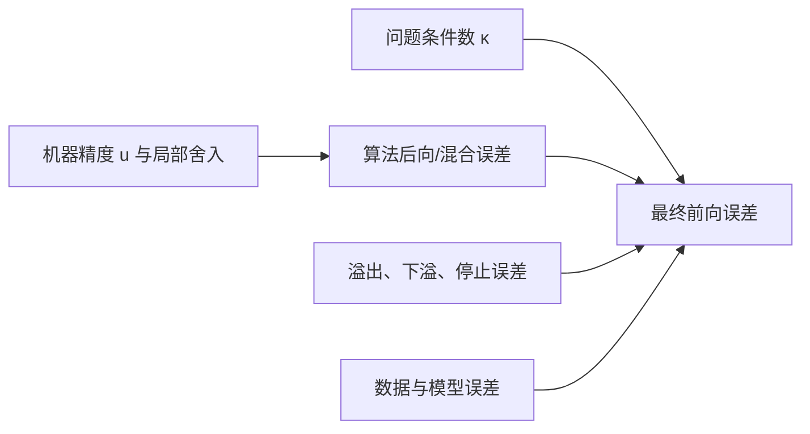

# 数值稳定性

> [!abstract] 本章主问题
> 数值稳定性不是“结果看起来正常”，也不是“问题条件数小”，而是：在明确的浮点模型、输入尺度和允许扰动下，算法是否把舍入误差控制成一个与机器精度同阶的邻近问题误差，或至多再附加一个同阶输出误差。稳定算法忠实地求解原问题附近的问题；最终答案是否准确，还要乘上问题本身的条件性。

先用下图回答一个视觉问题：**问题条件性、算法稳定性与一次结果准确性怎样分工，为什么代数等价公式会走出不同数值路径？**

![[00-知识库管理/_assets/figures/numerical-analysis/fig-numerical-stability-formulas-v2.svg|880]]

> [!figure] 图 10.8.3｜条件性—稳定性—准确性、稳定改写与三类承诺
> A 将 problem condition 与 algorithm stability 作为共同影响 forward accuracy 的两条独立输入；B 对比 $\sqrt{1+x}-1$ 的消去路径与有理化后的稳定路径，并列出 scaling/reordering/factorization/compensation；C 分开 backward、forward 与 mixed stability 中扰动位于输入还是输出。来源：独立绘制；理论接口参考 Higham、Hammarling 与 Demmel；生成脚本：[[plot_numerical_error_foundations_v2.py]]；确定性结构示意，无随机种子。

**怎样读图。** A 先对数学映射估计 $\kappa$，再对具体执行图证明或测量 backward/mixed error，二者才共同解释 forward accuracy；B 沿实际中间量检查动态范围和相近数相减，不要停在实数恒等式；C 逐字读清稳定性定理把哪个对象改成了邻近量，并核对 norm、scale、structure、dimension factor 与浮点假设。

**适用边界（图没有证明什么）。** 三角图只是逻辑依赖，不给自动的误差常数。$\sqrt{1+x}-1$ 是消去的代表例，不证明所有有理化都更快或更稳定。Backward stability 是强而自然的算法属性，但可能只在 normwise 或 unstructured 扰动下成立；它不能拯救 ill-conditioned problem，也不等于 convergence、statistical robustness 或 deployment safety。

## 学习目标

学完本章，应能独立完成以下任务：

1. 用一句完整陈述区分**问题条件性、算法稳定性和最终准确性**；
2. 对映射 $f:X\to Y$ 写出前向稳定、后向稳定和混合稳定的量化形式；
3. 解释为什么“后向误差小”是强而自然的算法承诺，却仍不能拯救病态问题；
4. 从局部条件数推导“前向误差 $\lesssim$ 条件数 $\times$ 后向误差 + 输出舍入”的主关系；
5. 指出稳定性结论必须声明的输入集合、度量、结构、维度因子、舍入模式及溢出假设；
6. 用二次方程、求和和 Horner 法分析“数学等价公式为何数值上不等价”；
7. 解释缩放、重排、因式分解和补偿为何是稳定算法设计的四种基本策略；
8. 区分范数型、分量型与结构化稳定性，不把一种保证偷换成另一种；
9. 判断 LU、QR、Cholesky、SVD 等算法究竟需要报告什么残差或结构误差；
10. 为 softmax、log-sum-exp、混合精度矩阵乘与迭代求解设计可信的 AI 数值验收。

> [!question] 初学者读完必须能回答
> 1. well-conditioned、stable 与 accurate 分别描述问题、算法还是结果？
> 2. 为什么 stable algorithm 在 ill-conditioned problem 上仍可能给不准确答案？
> 3. backward、forward 与 mixed stability 的量化定义有何不同？
> 4. 稳定性定理为什么必须声明 norm、scale、structure、dimension factor 与 overflow assumptions？
> 5. 代数等价公式为何在浮点执行图中不等价？
> 6. scaling、reordering、factorization 与 compensation 分别怎样改变误差路径？
> 7. softmax、矩阵分解和迭代求解的稳定性验收为何不能只看“没有 NaN”或训练 loss？

## 阅读前检查

### 检查 1：浮点局部模型

在无溢出、无下溢异常并采用 round-to-nearest 的理想化条件下，基本运算通常写成

$$
\operatorname{fl}(a\circ b)
=(a\circ b)(1+\delta),
\qquad |\delta|\le u,
$$

其中 $u$ 是单位舍入误差。连续 $n$ 次同类误差常压缩为

$$
\prod_{i=1}^{n}(1+\delta_i)=1+\theta_n,
\qquad
|\theta_n|\le \gamma_n:=\frac{nu}{1-nu},
$$

前提是 $nu<1$。细节见[[浮点数与舍入误差]]。

### 检查 2：前向与后向误差

若精确问题是 $y=f(x)$，算法输出 $\widehat y$，则：

- 前向误差比较 $\widehat y$ 与 $f(x)$；
- 后向误差寻找一个邻近输入 $\widetilde x$，使 $\widehat y=f(\widetilde x)$；
- “邻近”必须由尺度、范数、分量权重或结构约束定义。

完整语言见[[前向误差与后向误差]]。

### 检查 3：条件数

条件数研究的是精确映射 $f$ 对输入扰动的敏感性。它属于**问题**，不属于某段实现。算法改写不能把一个数学上病态的问题凭空变成条件良好，但可以避免额外放大舍入误差。

## 对象、符号与强制术语

| 符号 | 含义 |
|---|---|
| $x\in X$ | 精确输入数据，可能是标量、向量、矩阵或结构化对象 |
| $f:X\to Y$ | 要计算的精确数学问题 |
| $y=f(x)$ | 原问题的精确输出 |
| \(\operatorname{alg}_u(x)\) | 在单位舍入误差为 $u$ 的算术中运行算法所得输出 |
| $\widehat y$ | 实际计算输出 $\operatorname{alg}_u(x)$ |
| $d_X,d_Y$ | 输入、输出上的绝对或相对距离 |
| $\eta(x,\widehat y)$ | 后向误差：让 $\widehat y$ 成为精确解所需的最小输入扰动 |
| $\kappa_f(x)$ | 问题 $f$ 在 $x$ 附近、相对所选度量的局部条件数 |
| $p(n),q(n)$ | 随问题规模增长的低阶因子，不应被藏进模糊的“常数” |

本章强制区分：

- **well-conditioned / ill-conditioned**：问题对数据扰动不敏感 / 敏感；
- **stable / unstable**：算法是否额外放大有限精度扰动；
- **accurate / inaccurate**：这一次输出是否靠近原问题真解；
- **convergent / divergent**：随着步长、网格或迭代指标变化，近似是否趋近目标；
- **robust**：工程语境可能同时包含异常输入、分布偏移、容错等，不能自动等同数值稳定。

## 一、为什么“公式正确”仍远远不够

数学公式通常住在实数系统中，满足结合律、分配律和无限动态范围。计算机浮点运算则具有三个关键差异：

1. 每次结果要舍入到有限集合；
2. 加法、乘法的结合顺序会改变舍入路径；
3. 表示范围有限，可能上溢到 `inf` 或下溢到零/次正规数。

因此，两个实数上完全相同的表达式，可能具有截然不同的数值行为。例如

$$
\sqrt{1+x}-1
=\frac{x}{\sqrt{1+x}+1}.
$$

当 $x$ 很小时，左式先计算两个接近 1 的数再相减，有效数字大量消失；右式没有这次灾难性消去。**代数等价不是浮点执行图等价。**

> [!example] 最小手算
> 假设十进制浮点只保留 4 位有效数字，令 $x=10^{-4}$。则
> $\sqrt{1+x}\approx 1.000$，左式得到 $0$；右式约为
> $10^{-4}/2.000=5.000\times10^{-5}$。真值也约为 $4.999875\times10^{-5}$。

问题不在数学恒等式，而在**算法选择了哪条中间计算路径**。

## 二、先分开三个问题

### 2.1 问题条件性：精确问题会不会放大数据误差

若输入有相对扰动 $\varepsilon_X$，精确输出的一阶相对变化通常满足

$$
\varepsilon_Y
\approx
\kappa_f(x)\,\varepsilon_X.
$$

这是关于 $f$ 的陈述；即使使用无限精度算法，输入数据本身的噪声也会被放大。

### 2.2 算法稳定性：实现是否只引入了小的等效扰动

算法在浮点中经历许多局部舍入。稳定性分析要证明这些局部误差的总效果可以解释为：

- 输入被轻微改变；或
- 输入轻微改变，同时输出再有轻微舍入；或
- 最终前向误差不超过问题条件性所允许的自然量级。

### 2.3 最终准确性：这一次答案离原真解多远

准确性同时受两者控制：

最重要的四种组合是：

| 问题 | 算法 | 常见结果 |
|---|---|---|
| 条件良好 | 稳定 | 通常准确，这是理想组合 |
| 条件不良 | 稳定 | 忠实求解邻近问题，但原问题答案仍可能不准 |
| 条件良好 | 不稳定 | 本来可算准，却被算法额外破坏 |
| 条件不良 | 不稳定 | 无法从普通精度结果获得可信结论 |

> [!warning] 稳定性不是输出的形容词
> 更严谨的说法是“算法相对于某类问题、某个扰动模型和某种算术是稳定的”。只说“这个数稳定”通常信息不足。

## 三、精确问题与计算算法

### 3.1 两个映射不能混为一谈

精确数学问题是

$$
f:X\to Y,
\qquad y=f(x).
$$

浮点算法则是另一个映射

$$
\operatorname{alg}_u:X\cap\mathbb F^m\to Y\cap\mathbb F^k,
\qquad
\widehat y=\operatorname{alg}_u(x).
$$

算法可以包含相同数学公式的不同执行图，也可以使用因式分解、缩放、迭代或随机化。稳定性比较的不是两段伪代码“看上去是否相似”，而是它们相对 $f$ 的误差承诺。

### 3.2 相对距离不是永远可用

最常见的范数型相对距离为

$$
d_X(x,\widetilde x)
=\frac{\|\widetilde x-x\|}{\|x\|},
\qquad
d_Y(y,\widehat y)
=\frac{\|\widehat y-y\|}{\|y\|}.
$$

但当 $x=0$、$y=0$、分量尺度差异极大或零模式必须保持时，应改用：

- 绝对误差；
- `atol + rtol × scale` 混合尺度；
- 分量型权重；
- 结构化距离；
- 子空间夹角、正交性残差等对象专用度量。

定义错误的度量，会得到数学上正确却工程上无意义的“稳定性”。

## 四、前向稳定：结果达到问题允许的自然精度

“前向稳定”在不同教材中并非完全统一。本库不用一个裸术语代替不等式，而采用以下可检查版本。

> [!definition] 条件感知的前向稳定
> 若存在随规模缓慢增长的 $p(n)$，使
> $$
> d_Y\!\left(\operatorname{alg}_u(x),f(x)\right)
> \le p(n)\,u\,\kappa_f(x)+O(u^2),
> $$
> 则称算法在该输入类和度量下达到条件感知的前向稳定量级。

若问题条件良好，即 $\kappa_f(x)=O(1)$，前向误差就是 $O(p(n)u)$。若 $\kappa_f(x)u\gtrsim1$，工作精度中可能连一个相对有效数字都无法保证；这不自动说明算法不稳定。

### 4.1 “前向准确”与“前向稳定”

有些资料把

$$
d_Y(\widehat y,f(x))=O(u)
$$

称为前向稳定。这个要求对病态问题过强：即使输入只发生不可避免的 $O(u)$ 舍入，也会产生 $O(\kappa u)$ 输出变化。因此阅读论文时必须检查作者是否把条件数写入定义。

### 4.2 前向界的局限

只给前向误差界通常不能解释：

- 算法究竟把哪个输入改变了；
- 是否保持了对称、正定、稀疏或概率单纯形结构；
- 在未知真解时怎样验收；
- 误差来自问题病态还是实现不稳。

这就是后向分析更常被视为“算法稳定性”的核心语言。

## 五、后向稳定：精确求解一个邻近问题

> [!definition] 后向稳定
> 算法 $\operatorname{alg}_u$ 对问题 $f$ 是后向稳定的，如果对每个允许输入 $x$，都存在邻近输入 $\widetilde x$，满足
> $$
> \operatorname{alg}_u(x)=f(\widetilde x),
> \qquad
> d_X(x,\widetilde x)\le p(n)u+O(u^2).
> $$

它的普通语言版本是：

> 计算机给出的答案，是一个只比原输入改变机器精度量级的问题的**精确答案**。

### 5.1 这是存在性结论，不要求算法显式输出 $\widetilde x$

证明通常采用构造法：把每次舍入吸收到某个局部输入扰动中，再把这些扰动合并为整体 $\widetilde x$。也可以先由输出残差求出最小后向扰动，证明它是 $O(u)$。

### 5.2 后向稳定必须写出允许扰动什么

对 $Ax=b$，以下陈述不是同一件事：

1. 只允许 $b$ 改变；
2. 只允许 $A$ 改变；
3. 允许 $A,b$ 同时改变；
4. 只允许保持 $A$ 对称、正定或稀疏模式的扰动；
5. 要求每个非零分量只发生小相对改变。

因此“某算法后向稳定”必须附上扰动模型。完整推导见[[前向误差与后向误差]]。

### 5.3 后向稳定为何是强保证

它把复杂的中间舍入历史压缩为一个容易解释的输入扰动；若输入本身已经只知道到 $10^{-7}$，算法只额外引入 $10^{-16}$ 级的后向误差，那么算法误差通常不是主要矛盾。

但它不是万能保证：若 $\kappa_f(x)\approx10^{16}$，一个 $10^{-16}$ 的输入扰动就足以产生 $O(1)$ 输出变化。

## 六、混合稳定：输入和输出都允许小扰动

一些算法难以证明严格后向稳定，却可以证明：存在 $\widetilde x$，使计算结果接近 $f(\widetilde x)$。

> [!definition] 混合稳定
> 若存在 $\widetilde x$ 满足
> $$
> d_X(x,\widetilde x)\le p(n)u,
> \qquad
> d_Y\!\left(\operatorname{alg}_u(x),f(\widetilde x)\right)
> \le q(n)u,
> $$
> 则称算法在给定度量下混合稳定。

严格后向稳定是混合稳定的特殊情形：第二个误差恰为零。

### 6.1 为什么输出误差项有时不可避免

精确输出 $f(\widetilde x)$ 可能本身不在浮点集合中，最终存储还要舍入。对于输出包含正交矩阵、子空间基、特征向量或迭代近似的算法，允许一个可控的输出扰动往往更自然。

### 6.2 不要把“混合”理解为“含糊”

混合稳定仍必须给出两个清晰不等式。只说“输入和输出都差不多”不构成分析。

## 七、主关系：条件性把后向误差转成前向误差

设算法满足混合稳定。记

$$
\widehat y=\operatorname{alg}_u(x),
\qquad
\widetilde y=f(\widetilde x),
\qquad
y=f(x).
$$

由三角不等式，

$$
d_Y(\widehat y,y)
\lesssim
d_Y(\widehat y,\widetilde y)
+d_Y(\widetilde y,y).
$$

第一项由算法的输出稳定误差控制：

$$
d_Y(\widehat y,\widetilde y)
\le q(n)u.
$$

第二项由问题条件数控制：

$$
d_Y(f(\widetilde x),f(x))
\lesssim
\kappa_f(x)d_X(\widetilde x,x)
\le
\kappa_f(x)p(n)u.
$$

合并得

$$
\boxed{
d_Y(\widehat y,f(x))
\lesssim
q(n)u+\kappa_f(x)p(n)u
}
$$

忽略高阶项后，这就是数值分析最重要的误差预算之一。

### 7.1 后向稳定特例

若 $q(n)=0$，则

$$
d_Y(\widehat y,f(x))
\lesssim
\kappa_f(x)p(n)u.
$$

所以：

- 后向稳定 + 条件良好 $\Rightarrow$ 通常前向准确；
- 后向稳定 + 条件不良 $\Rightarrow$ 结果可能不准确，但已达到工作精度允许的自然极限；
- 后向不稳定 $\Rightarrow$ 即使问题条件良好，也可能白白损失精度。

### 7.2 一阶关系的适用边界

上式隐含：扰动足够小、条件数在邻域内没有剧烈变化、度量相容、没有跨越奇异边界。若输入靠近秩变化、重特征值、分支切换或可行域边界，必须使用有限扰动界、伪条件数或结构化分析，而不能机械套用局部导数。

## 八、一条完整稳定性定理至少要声明什么

“算法是稳定的”缺少以下任何一项，都可能无法复核。

### 8.1 问题与允许输入

必须说明 $f$ 是什么、输入属于什么集合。例如 Cholesky 的输入是对称正定矩阵，而不是任意方阵；softmax 的输入是有限 logits，而不是包含 `NaN` 的任意数组。

### 8.2 扰动对象与度量

必须说明改动 $x$ 的哪些部分，以及使用绝对、相对、范数型、分量型还是结构化度量。

### 8.3 算术与实现假设

至少说明：

- 精度格式和单位舍入误差 $u$；
- 舍入模式；
- 是否允许 FMA；
- 中间量和累加器是否使用更高精度；
- 是否假设不发生上溢、破坏性下溢或 `NaN`；
- 并行归约树是否固定。

### 8.4 规模因子

把 $p(n)$ 写出来。$10u$ 与 $n^3u$ 都是“$O(u)$”，但当 $n=10^6$ 时意义完全不同。若定理要求 $p(n)u<1$，也必须写出。

### 8.5 结论类型

明确是：

- 严格后向稳定；
- 混合稳定；
- 条件感知的前向界；
- 高概率界；
- 经验误差观察；
- 只对某个输出量成立的结构保持结论。

> [!example] 合格陈述示意
> “在 round-to-nearest、无溢出且 $nu<1$ 时，长度为 $n$ 的顺序求和可写成邻近输入 $\widetilde x_i=x_i(1+\theta_i)$ 的精确和，其中 $|\theta_i|\le\gamma_{n-1}$；因此它在 $1$ 范数相对输入度量下具有 $O(nu)$ 的后向误差。”

这比“求和是稳定的”多写了一行，却消除了几乎所有歧义。

## 九、最小例子：稳定算法仍可能得到不准确答案

考虑求和问题

$$
s=f(x_1,\ldots,x_n)=\sum_{i=1}^{n}x_i.
$$

顺序求和可在适当条件下解释为邻近输入的精确和：

$$
\widehat s
=\sum_{i=1}^{n}x_i(1+\theta_i),
\qquad
|\theta_i|\le\gamma_{n-1}.
$$

这是一种分量型后向稳定陈述。但求和问题的相对条件数是

$$
\kappa_{\mathrm{sum}}(x)
=\frac{\sum_i|x_i|}{\left|\sum_i x_i\right|}.
$$

当正负项严重抵消时，分母很小，$\kappa_{\mathrm{sum}}$ 很大。于是

$$
\frac{|\widehat s-s|}{|s|}
\lesssim
\gamma_{n-1}\kappa_{\mathrm{sum}}(x).
$$

### 9.1 三项手算

取

$$
(x_1,x_2,x_3)=(10^{16},1,-10^{16}).
$$

精确和为 $1$。在 binary64 中，按左到右计算时，$10^{16}+1$ 可能舍入回 $10^{16}$，随后减去 $10^{16}$ 得 $0$。算法的局部舍入并不巨大；失败来自严重抵消使问题相对病态，以及不利的归约顺序。

重排为

$$
(10^{16}-10^{16})+1=1
$$

可恢复结果，但一般数据中“最佳顺序”未必便宜或易知。pairwise summation、补偿求和或更高精度累加器提供更系统的控制。

## 十、最小例子：数学等价的二次公式并不数值等价

考虑

$$
x^2-2Bx+1=0,
\qquad B>1.
$$

两个精确根为

$$
x_+=B+\sqrt{B^2-1},
\qquad
x_-=B-\sqrt{B^2-1}.
$$

当 $B$ 很大时，$B$ 与 $\sqrt{B^2-1}$ 非常接近。直接计算小根 $x_-$ 会发生灾难性消去。

### 10.1 用根的乘积改写

由于 $x_+x_-=1$，

$$
x_-
=\frac{1}{B+\sqrt{B^2-1}}.
$$

右式避免两个大而接近的数相减。

### 10.2 为什么小根本身并非必然病态

令

$$
g(B)=B-\sqrt{B^2-1}
=\frac{1}{B+\sqrt{B^2-1}}.
$$

对大 $B$，$g(B)\approx1/(2B)$，其相对条件数为

$$
\left|\frac{Bg'(B)}{g(B)}\right|
\approx1.
$$

所以从 $B$ 到小根的相对问题并不随着 $B$ 无限恶化。直接公式丢失精度主要是**算法路径不稳定**，不是问题本身注定算不准。

### 10.3 更一般的稳定二次公式

对

$$
ax^2+bx+c=0,
\qquad \Delta=b^2-4ac\ge0,
$$

先计算

$$
q=-\frac12\left(b+\operatorname{sign}(b)\sqrt{\Delta}\right),
$$

再取

$$
x_1=\frac{q}{a},
\qquad
x_2=\frac{c}{q}.
$$

这样把可能发生的危险相减改成同号相加，再用根的乘积得到另一个根。

### 10.4 边界仍要处理

- $a=0$ 时问题退化为线性方程；
- $c=0$ 或 $q=0$ 时要单独分支；
- $b^2$ 和 $4ac$ 可能先溢出，应使用缩放或可靠库函数；
- $\Delta$ 接近零时，两根合并，根方向对系数扰动变敏感；
- 复根需要一致的复数分支和缩放策略。

因此“稳定公式”也不是一条无条件适用的代码行，而是一组连同边界处理的算法。

## 十一、Horner 法：稳定性与多项式条件性

多项式

$$
p(x)=a_0+a_1x+\cdots+a_nx^n
$$

可由 Horner 法写成

$$
p(x)=a_0+x(a_1+x(a_2+\cdots+x a_n)).
$$

它只需 $n$ 次乘法和 $n$ 次加法。标准浮点分析可得到类似

$$
\widehat p(x)
=\sum_{i=0}^{n}a_i(1+\delta_i)x^i,
\qquad
|\delta_i|\lesssim\gamma_{2n}.
$$

这说明计算结果是一个系数轻微扰动多项式在 $x$ 处的精确值，即系数意义下的后向稳定。

然而若

$$
|p(x)|\ll \sum_{i=0}^{n}|a_i||x|^i,
$$

多项式求值的相对条件数很大，Horner 仍可能给出较大相对前向误差。这再次说明：

$$
\text{后向稳定}
+\text{病态求值点}
\not\Rightarrow
\text{高相对精度}.
$$

> [!note] 函数表达式也是问题数据的一部分
> 同一个数学函数若用展开式、因式分解式或特殊函数表示，浮点求值的扰动模型会不同。数值分析不只问“函数是什么”，还问“输入数据以何种表示给出”。

## 十二、溢出与下溢：相对误差模型之外的失败

标准模型

$$
\operatorname{fl}(a\circ b)=(a\circ b)(1+\delta)
$$

并不自动覆盖：

- 精确结果超出最大有限数而上溢；
- 结果进入次正规区，失去相对精度；
- 结果下溢为零；
- 非法操作产生 `NaN`；
- 编译器重排、flush-to-zero 或非默认舍入模式改变语义。

### 12.1 `hypot` 的缩放思想

直接计算

$$
\sqrt{x^2+y^2}
$$

可能在最终答案完全可表示时，中间的 $x^2$ 已经溢出。令

$$
m=\max(|x|,|y|),
$$

则

$$
\sqrt{x^2+y^2}
=m\sqrt{(x/m)^2+(y/m)^2}.
$$

缩放后括号中的量位于可控范围；可靠的 `hypot` 实现还会处理零、无穷和次正规边界。

### 12.2 稳定性证明必须包含动态范围条件

若一个证明只控制 $|\delta|\le u$，却没有说明中间量会不会溢出，那么它只证明了**条件性稳定**：在无异常值的理想浮点模型中稳定。工程实现仍需范围分析。

## 十三、稳定算法设计的四个基本动作

### 13.1 缩放：把中间量搬回安全范围

例：`hypot`、softmax 减最大值、矩阵平衡、混合精度 loss scaling。

### 13.2 重排：减少误差传播深度或抵消

例：pairwise summation、按幅值排序、固定归约树、Horner 法。

### 13.3 改写：选择浮点更友好的等价表达

例：

$$
\sqrt{1+x}-1
\quad\longrightarrow\quad
\frac{x}{\sqrt{1+x}+1},
$$

以及 `log1p(x)`、`expm1(x)`、稳定二次公式、log-sum-exp。

### 13.4 分解：避免显式形成更病态或范围更大的对象

例：

- 解 $Ax=b$ 时使用分解和三角求解，不显式形成 $A^{-1}$；
- 最小二乘优先 QR/SVD，而不是无条件形成 $A^TA$；
- 计算奇异值不直接求 $A^TA$ 的特征值；
- 概率连乘转入 log 域。

这些动作不是互斥的；成熟算法通常同时使用多个动作。

## 十四、线性代数中的稳定性承诺

本节只建立“应该问什么”；具体常数和证明留给后续算法节点。

| 任务 | 常用稳定实现 | 关键验收量 | 不能只看什么 |
|---|---|---|---|
| 解一般稠密 $Ax=b$ | 带主元 LU | $\|b-A\widehat x\|$、分量型后向误差、条件估计、增长因子 | `solve` 没报错 |
| 解 SPD 系统 | Cholesky | 因子残差、pivot、正定边界、解的后向误差 | 只看 $L$ 是否生成 |
| 最小二乘 | Householder QR / SVD | 原始残差、正规方程残差、秩判定、条件数 | 只看训练 MSE |
| 特征值 | Hessenberg–QR / 对称专用法 | $\|A\widehat v-\widehat\lambda\widehat v\|$、正交性、谱间隙 | 只比较特征值列表 |
| SVD | 双对角化等稳定算法 | $\|A-\widehat U\widehat\Sigma\widehat V^*\|$、$U/V$ 正交性 | 只看重构图像 |
| 大规模迭代解 | CG/GMRES 等 | 真残差、递推残差差距、预条件后指标、停止误差 | 只看迭代次数 |

### 14.1 残差小不自动证明算法稳定

一次运行的残差小，只说明这次输出对某个方程近似满足。算法稳定是对一类允许输入的统一陈述；需要理论界或系统实验覆盖尺度、条件数和结构边界。

### 14.2 因子残差与解残差不同

若计算 $\widehat L\widehat U\approx PA$，小因子残差说明分解对应邻近矩阵；随后三角求解也要稳定，才能得到整个线性求解的后向稳定性。模块稳定性需要沿计算图逐段组合。

### 14.3 正交算法为何受青睐

正交/酉变换满足

$$
\|Qx\|_2=\|x\|_2,
\qquad
\kappa_2(Q)=1.
$$

它们不放大二范数误差，因而 Householder、Givens、正交相似变换在稳定矩阵算法中反复出现。但实现出的 $\widehat Q$ 仍需检查正交性

$$
\|I-\widehat Q^*\widehat Q\|.
$$

## 十五、范数型、分量型与结构化稳定性

### 15.1 范数型稳定性

典型承诺为

$$
\frac{\|\Delta A\|}{\|A\|}\le p(n)u.
$$

它便于推导、坐标无关，但大分量可能掩盖小而重要的分量。

### 15.2 分量型稳定性

典型承诺为

$$
|\Delta A|\le p(n)u,|A|
$$

逐项理解。它保留零模式：若 $a_{ij}=0$，右边也是零，要求对应扰动保持为零。分量型保证通常比同范数级别的范数型保证更强，也更贴近尺度差异很大的数据。

### 15.3 结构化稳定性

若输入属于结构集合 $\mathcal S$，结构化后向稳定要求

$$
A+\Delta A\in\mathcal S.
$$

可能需要保持：

- 对称 / Hermitian；
- 正定；
- Toeplitz、Hankel 或稀疏模式；
- 概率归一化与非负性；
- 低秩参数化、卷积或等变结构。

非结构后向误差小，不保证存在同样小的结构内扰动。对 AI 而言，若参数必须位于概率单纯形、Stiefel 流形或低秩因子族中，结构化问题尤为重要。

### 15.4 方法选择表

| 数据特征 | 首选误差模型 |
|---|---|
| 所有分量尺度接近，旋转不变性重要 | 范数型 |
| 分量跨多个数量级，小分量有独立含义 | 分量型 |
| 零模式、对称、正定、概率约束不可破坏 | 结构化 |
| 输出是基但基不唯一 | 子空间角或投影矩阵 |
| 输出是概率 | 绝对误差、相对误差、KL/TV 等任务相关组合 |

## 十六、迭代、离散化与随机算法中的“稳定”

### 16.1 总误差不只有舍入误差

迭代或离散化方法的总误差至少包含

$$
\text{总误差}
\le
\text{建模/离散化误差}
+\text{迭代停止误差}
+\text{浮点误差}
+\text{数据误差}.
$$

一个浮点后向稳定的线性求解器，如果在外层优化中只迭代两步，仍可能有很大停止误差。反之，一个迭代逼近非常充分的方法也可能因残差递推漂移而在浮点中停错位置。

### 16.2 收敛不等于稳定

“当步长 $h\to0$ 时方法收敛”是离散化族的渐近性质；“固定 $h$、固定精度时舍入扰动不被灾难性放大”是稳定性问题。两者相关，但不能交换。

在线性初值问题等特定框架中，稳定性与一致性可推出收敛；这类结论有明确假设，不能把口号无条件推广到所有算法。

### 16.3 随机算法的稳定性

随机低秩、随机舍入或随机采样算法可能给出

$$
\Pr\!\left(
d_Y(\widehat y,f(x))
\le C\,u\,\kappa_f(x)
\right)
\ge1-\delta.
$$

此时必须报告失败概率 $\delta$、随机种子策略、尾界依赖的分布假设，以及随机近似误差和浮点误差如何组合。平均误差小不等于最坏情况稳定。

## 十七、Softmax 与 log-sum-exp：AI 中的稳定改写

### 17.1 数学不变性

对 logits $z\in\mathbb R^n$，

$$
\operatorname{softmax}(z)_i
=\frac{e^{z_i}}{\sum_j e^{z_j}}.
$$

对任意常数 $c$，

$$
\operatorname{softmax}(z+c\mathbf1)
=\operatorname{softmax}(z).
$$

取

$$
m=\max_i z_i,
$$

则

$$
\operatorname{softmax}(z)_i
=\frac{e^{z_i-m}}{\sum_j e^{z_j-m}}.
$$

所有指数的输入都不大于零，最大项正好为 $e^0=1$，避免正向溢出。

### 17.2 log-sum-exp

直接计算

$$
\log\sum_j e^{z_j}
$$

可能先在指数阶段溢出。稳定形式为

$$
\operatorname{LSE}(z)
=m+\log\sum_j e^{z_j-m}.
$$

若最大项唯一且其他项很小，可进一步用 `log1p` 保留小修正。

### 17.3 减最大值不解决所有问题

- 很负的项仍会下溢为零；若它们在任务中应当可区分，需要更高精度或 log 域；
- 归约和仍有舍入误差，维度很大时可采用 pairwise / block reduction 或高精度累加；
- 若输入已有 `inf`/`NaN`，必须定义语义；
- softmax 输出前向误差小不保证交叉熵梯度、校准或下游决策误差小；
- 分布式 shard 上需要全局最大值和全局归约，两阶段通信也应纳入误差与复现性分析。

## 十八、混合精度与张量内核

现代 AI 内核常使用“低精度输入 × 低精度输入 → 较高精度累加 → 低精度输出”。稳定性陈述必须拆开：

1. 输入量化误差；
2. 每次乘法的格式与舍入；
3. 累加器格式、FMA 与归约树；
4. 最终 cast；
5. 缩放、饱和、flush-to-zero；
6. 后续非线性对误差的条件放大。

### 18.1 矩阵乘的典型分量界

对 $C=AB$，经典同精度点积模型给出类似

$$
|\widehat C-AB|
\le
\gamma_k |A||B|,
$$

其中 $k$ 是内积长度。混合精度时，右侧要分别包含输入量化、乘法、累加与输出舍入项，不能只使用一个模糊的“FP16 误差”。

### 18.2 为什么任务准确率不能替代数值验收

验证集准确率可能对小数值误差不敏感，也可能在某些样本上突然跨过决策边界。合理报告至少同时包含：

- 高精度参考的张量前向误差；
- 核心代数残差或后向误差；
- 条件或尺度指标；
- `inf/NaN/underflow` 计数；
- 任务指标与最坏样本；
- 不同批次、长度、设备与归约布局。

## 十九、怎样验证一个算法“稳定”

### 19.1 先写假说，不先画图

示例：

> 对问题族 $x^2-2Bx+1=0$ 的小根，直接相减公式的相对前向误差随 $B$ 增长并最终变为 $100\%$；利用根乘积的改写在无溢出区保持接近机器精度的误差。

### 19.2 分开四个旋钮

1. **问题条件性**：改变 $\kappa_f$，但保持算法相同；
2. **算法路径**：对同一精确问题比较代数等价实现；
3. **工作精度**：float16/bfloat16/float32/float64 或模拟舍入；
4. **规模与动态范围**：改变维度、最大幅值、归约深度。

一次只改变一个主旋钮，才能归因。

### 19.3 至少报告四类量

| 量 | 回答的问题 |
|---|---|
| 前向误差 | 离原问题真解多远？ |
| 残差/后向误差 | 是否精确解了邻近问题？ |
| 条件指标 | 邻近输入变化应被放大多少？ |
| 例外与成本 | 是否溢出/下溢，稳定改写付出多少时间和内存？ |

### 19.4 参考值不能来自同一条可疑路径

可使用：

- 高精度算术；
- 有闭式但数值稳定的等价式；
- 区间算术；
- 独立算法交叉验证；
- 可证明误差界。

如果“算法”和“真值”都调用同一个库函数、同一种精度和同一执行图，误差为零可能只是共同偏差。

### 19.5 本章实验

[[实验 - 等价公式不等价稳定]]使用两个问题族：

1. 二次方程小根：分离消去导致的前向/后向失稳；
2. log-sum-exp：展示数学结果可表示但中间指数先溢出的路径失败。

实验图不是装饰，而是把“同一问题、不同算法路径”的差异直接画出来。

## 二十、AI 中的直接连接

### 20.1 Attention

Attention 同时调用矩阵乘、缩放、softmax 和归约。稳定性检查要覆盖 score 动态范围、减最大值、mask 的 `-inf` 语义、低精度累加和长序列归约。

### 20.2 归一化层

方差的朴素公式

$$
\operatorname{Var}(x)=E[x^2]-E[x]^2
$$

可能发生两个大而接近的量相减。Welford 等在线算法通常更稳定；还要区分加在分母中的 $\varepsilon$ 是防零、改变数学问题，还是掩盖低精度误差。

### 20.3 概率损失

直接先算 softmax 概率再取对数，可能得到 `log(0)`；融合的 log-softmax / cross-entropy 在 log 域改写，可减少溢出、下溢和不必要舍入。

### 20.4 隐式层与二阶优化

内层线性/非线性求解器的残差会传到外层梯度。需要同时报告内层后向误差、问题条件数、隐式 Jacobian 的条件性与外层任务误差。

### 20.5 分布式训练

浮点加法不结合导致不同归约树产生不同结果。非确定性不自动等于不稳定，但会使复现和误差诊断变难。若要求 bitwise reproducibility，需要固定归约顺序或使用可复现累加算法，并明确性能代价。

### 20.6 量化

量化误差通常大于舍入到工作格式的误差。应把“量化后的邻近模型”与“量化内核是否稳定执行这个模型”分成两层；任务准确率只验证它们组合后的行为。

## 二十一、科学空间语境中的“前向稳定”边界

科学空间在 MuP、LoRA 或网络宽度标度语境中使用“前向稳定性”时，常关心的是：随着宽度、深度或参数化变化，激活与更新量级是否保持 $O(1)$，不爆炸也不消失。

本章的数值分析语义关心的是：

$$
\operatorname{alg}_u(x)
\quad\text{相对}\quad
f(x)
$$

的有限精度偏差。

两者可以相互影响，例如激活量级爆炸会导致浮点溢出，但它们不是同一定义：

| 语境 | 改变的极限参数 | “稳定”主要控制什么 |
|---|---|---|
| 数值分析 | $u\to0$、规模 $n$、算法路径 | 计算结果相对精确问题的误差 |
| 宽度标度 / 参数化 | width、depth、learning rate | 激活、梯度、更新的渐近量级 |
| 优化动力学 | step size、iteration | 轨迹是否收敛或爆炸 |

阅读文章时先问“稳定是关于哪个极限、哪个对象和哪个误差度量”，避免术语碰撞。

## 二十二、常见误区与最小修正

| 误区 | 断裂点 | 最小修正 |
|---|---|---|
| 条件数大，所以算法不稳定 | 条件数属于问题 | 分别报告条件数和后向误差 |
| 后向稳定，所以答案一定准确 | 病态问题会放大小扰动 | 再乘条件数或给前向界 |
| 残差小，所以算法稳定 | 单次残差不是算法类保证 | 尺度化为后向误差并覆盖问题族 |
| 没出现 `NaN`，所以稳定 | 大量有效数字可能已丢失 | 比较高精度参考、残差和条件指标 |
| 两个公式代数等价，精度也相同 | 浮点执行路径不等价 | 分析中间量、消去和动态范围 |
| 用 float64 就无需稳定算法 | 精度提高只缩小 $u$ | 不稳定路径可在更大尺度再次失败 |
| $O(u)$ 就一定很小 | 隐藏的 $p(n)$ 可能巨大 | 写出规模因子和适用条件 |
| 前向误差小就证明后向稳定 | 可能只是这个输入碰巧准确 | 构造邻近输入或证明统一后向界 |
| 训练 loss 正常说明内核稳定 | 任务指标会掩盖局部误差 | 加入张量误差、异常计数和参考实现 |
| 可复现等于准确 | 错误算法也可确定性复现 | 分开复现性、稳定性与准确性 |

## 二十三、掌握检查

### L1：解释

- 能否不用公式解释条件性、稳定性和准确性各属于谁？
- 能否说明为什么后向稳定算法仍可能在病态问题上不准确？

### L2：计算

- 能否手算 $\sqrt{1+x}-1$ 两种公式在低精度下的差异？
- 能否对二次方程小根同时计算前向误差与尺度化残差？

### L3：推导

- 能否从混合稳定的两个不等式推导条件感知前向误差界？
- 能否为顺序求和或 Horner 法写出邻近输入/系数解释？

### L4：判断

- 给定一条“算法稳定”陈述，能否指出缺失的扰动模型、规模因子和范围假设？
- 能否构造条件良好但算法不稳定，以及算法后向稳定但输出不准确的例子？

### L5：AI 迁移

- 能否为一个 fused softmax 或 mixed-precision matmul 内核设计稳定性验收矩阵？
- 能否区分宽度标度的“前向稳定”和数值分析的前向误差？

### L6：研究

- 能否对一个陌生算法提出可证伪的稳定性假说、选择参考值并构造压力测试族？
- 能否说明确定性最坏界、高概率界和经验误差曲线分别支持什么结论？

## 二十四、课程闭环

- 主笔记：本章；
- 分层训练：[[习题 - 数值稳定性]]；
- 完整解答：[[解答 - 数值稳定性]]；
- 可复现实验：[[实验 - 等价公式不等价稳定]]；
- 前置复习：[[浮点数与舍入误差]]、[[前向误差与后向误差]]、[[条件数]]；
- 后续节点：[[稳定求解线性方程组]]、[[Gram-Schmidt 的数值稳定性]]、[[Householder 与 Givens 变换]]、[[稳定最小二乘与正规方程的风险]]。

## 来源与证据边界

### 经典理论

- Nicholas J. Higham, *Accuracy and Stability of Numerical Algorithms*, 2nd ed., SIAM, 2002：浮点误差分析、稳定性框架和经典算法案例；
- Lloyd N. Trefethen & David Bau III, *Numerical Linear Algebra*, SIAM, 1997：条件性、稳定、后向稳定与矩阵算法课程主线；
- [[S-2005-Hammarling-计算解质量导论]]：前向/后向误差和解质量的教学桥梁；
- [[S-2023-Demmel-Math221误差分析]]：条件数、残差、后向分析与线性代数接口；
- [[S-2015-Johnson-递归求和后向稳定性]]：构造邻近输入的最小完整证明；
- [[S-1991-Goldberg-浮点数]]、[[S-2021-Higham-极端规模与低精度稳定性]]：浮点模型、低精度和极端规模边界；
- [[S-1999-LAPACK-误差界]]：实际线性代数库中的残差、条件估计和验收接口。

### 本章不宣称

- 不把某次实验表现好提升为对全部输入的稳定性定理；
- 不在本章给出 LU、QR、Cholesky、特征值与 SVD 算法的完整常数级误差证明；
- 不把数值稳定性等同于统计鲁棒性、优化收敛、训练不发散或宽度标度稳定；
- 不保证任何具体硬件/编译器在未核对舍入、FMA、flush-to-zero 和归约语义时满足理想模型。
