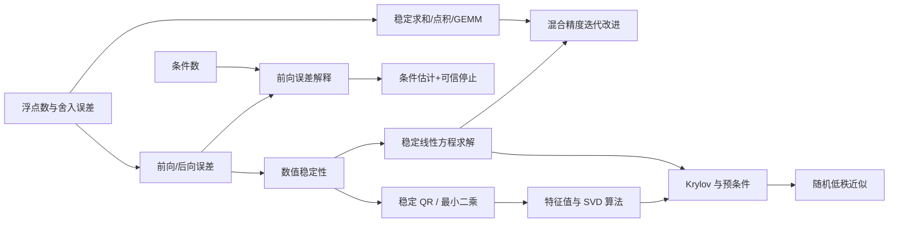
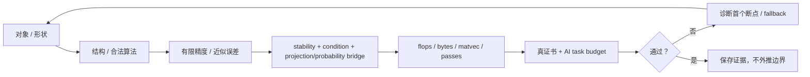

# 数值线性代数 MOC

> [!abstract] 本模块的任务
> 研究有限精度计算中怎样可靠地求解线性方程、最小二乘和谱问题。这里不只问公式是否成立，还问数据误差怎样传播、算法产生多大后向误差、计算成本是多少，以及大规模稀疏矩阵该如何近似。

> [!info] 与全局课程地图的关系
> 本分卷在[[数学基础完整课程地图与掌握标准]]中固定为 NUM-01 至 NUM-20 共 20 个核心节点。本 MOC 还会调用[[条件数]]、[[矩阵扰动]]、[[Cholesky 分解]]、[[Schur 分解]]等 10.2/10.3 节点，并列出实验与辅助专题；这些交叉调用不重复计入 20 个数值核心节点。

## 全卷教学迁移路线

现有 20 篇正文已经具备深层理论、实验和正式插图；当前工作不是扩张范围，而是按初学者认知顺序补齐“问题引入—贯穿算例—对象账本—逐步推导—公式七问—第一遍停靠线”，并为每波建立可重复的精确回归。材料通过与学习通过严格分离。

| 波次 | 节点 | 主线 | 统一算例/证书 | 材料状态 | 学习状态 |
|---|---|---|---|---|---|
| A | NUM-01—04 | 浮点网格 → 误差对象 → 算法稳定性 → 条件感知停止 | $\tau=10^{-4}$；$\mathbb F_{10,4}$ 与 $A_\tau=\operatorname{diag}(1,\tau)$ | `regression-passed` | `draft / not-attempted` |
| B | NUM-05—08 | reduction 内核 → pivoted solve → mixed-precision refinement → 稳定正交变换 | $\varepsilon=10^{-8}$；$A_\varepsilon$、近似逆 $B$ 与 $PA_\varepsilon$ 的 QR | `regression-passed` | `draft / not-attempted` |
| C | NUM-09—12 | 最小二乘 → 极端特征对 → 稠密 QR 流水线 → 对称 Krylov | $A=[\Sigma Q^\mathsf T;0]$、$G=A^\mathsf TA$ 与共享三对角 $T$ | `regression-passed` | `draft / not-attempted` |
| D | NUM-13—16 | 一般 Krylov → SVD → 定常迭代 → 预条件 | 非正规 $A$、$H=A^TA$、$B=I-A/2$ 与 $S=D^{-1/2}HD^{-1/2}$ | `regression-passed` | `draft / not-attempted` |
| E | NUM-17—20 | CG → GMRES/MINRES → 稀疏系统 → 随机低秩 | $H=A^TA$ 的 CG、$A$ 的 GMRES/CSR 与 $Q=\operatorname{orth}(A\Omega)$ | `regression-passed` | `draft / not-attempted` |
| CUM | NLA-CUM-01 | 口试 → 闭卷 → nonce 随机轨 → 盲干预 → 订正 → 48 h / 14 d → 独立审计 | 五波回链与 A/B/C 累计三轨 | `regression-passed` | `not-attempted` |

### 第一波的单一模型链

第一波故意不使用四个互不相关的例子，而让同一个小参数承担四个逐层加深的角色：

1. **NUM-01：有限网格。** 在 $\mathbb F_{10,4}$ 中，$1$ 右侧 gap 为 $10^{-3}$，unit roundoff 为 $5\times10^{-4}$，故 $\operatorname{fl}(1+10^{-4})=1$；
2. **NUM-02：误差对象。** 对 $A_\tau=\operatorname{diag}(1,\tau)$，候选解的相对残差约 $10^{-4}$，相对前向误差却为 $1/\sqrt2$；normwise 联合后向误差约 $5\times10^{-5}$，componentwise 后向误差为 $1$；
3. **NUM-03：算法路径。** $g(\tau)=\sqrt{1+\tau}-1$ 的相对条件数趋近 $1$，朴素式的相对后向误差为 $1$，有理化式只有 $2.5\times10^{-5}$；
4. **NUM-04：停止合同。** $\kappa_2(A_\tau)=10^4$ 将约 $10^{-4}$ 的残差放大成 $O(1)$ 风险；若任务只允许 $1\%$ 相对前向误差，条件感知阈值必须收紧到约 $10^{-6}$。

> [!success] 第一波材料证书
> [[numerical_teaching_contract_audit.py]]已经验证 4/4 教学合同、标量与对角系统精确关系、作用域内 Wiki 链接、数学块、4 个完整图文单元及正式 SVG 哈希。该结论只表示材料可重复、链接闭合和算例自洽，不表示读者已经独立完成推导或通过测验。

### 如何学习第一波，而不是只把它读完

1. **第一遍（约 90 分钟）：**只做每篇的贯穿算例和“第一遍停靠线”，不看后半篇一般理论；
2. **第二遍（约 180 分钟）：**回到 IEEE 754、一般 backward error、stability 定义和 Jacobian/condition estimator；
3. **第三遍（约 120 分钟）：**无提示重建 $\tau$ 模型，故意更换 norm、精度和任务预算，判断哪些结论保留；
4. **验收：**完成节点习题并复现[[实验 - 条件估计、误差传播与可信停止]]；未提交独立作答前，四篇始终保持 `draft`。

### 第二波的单一模型链

第二波固定

$$
\varepsilon=10^{-8},
\qquad
A_\varepsilon=
\begin{bmatrix}\varepsilon&1\\1&1\end{bmatrix},
\qquad
b=(1,2)^\mathsf T,
$$

让同一个 small pivot 依次变成内核动态范围、消元失败、可修正误差和稳定 QR：

1. **NUM-05：归约内核。** $(\varepsilon^{-1},1,-\varepsilon^{-1})$ 的精确和为 $1$，左结合在 $\mathbb F_{10,4}$ 中给 $0$，先消去或 Neumaier compensation 给 $1$；$\kappa_{\rm sum}=200000001$；
2. **NUM-06：选主元求解。** $\kappa_\infty(A_\varepsilon)=4/(1-\varepsilon)\approx4$，问题本身条件良好；无主元 multiplier 为 $10^8$，输出相对前向误差为 $1$，partial pivoting 把 multiplier 降为 $10^{-8}$，前向误差降为 $10^{-8}$，BERR 为 $\varepsilon/(2+\varepsilon)$；
3. **NUM-07：迭代改进。** 以 $B=(3/4)A_\varepsilon^{-1}$ 表示近似 inverse action，得到 $I-BA_\varepsilon=(1/4)I$ 与相对误差 $1/4,1/16,1/64,1/256$；加入 residual error 后显式出现 $e_{k+1}=e_k/4-B\xi_k$ 的停滞地板；
4. **NUM-08：稳定正交变换。** 对 $PA_\varepsilon=\left[\begin{smallmatrix}1&1\\\varepsilon&1\end{smallmatrix}\right]$ 构造 $c=1/r,s=\varepsilon/r$ 的 Givens QR，并用 $v_{\rm safe}=(1+r,\varepsilon)^T$ 对比会让 $1-r$ 消去的 Householder 符号。

> [!success] 第二波材料证书
> [[numerical_teaching_contract_audit.py]]已扩展到 NUM-01—08：8/8 教学合同、231 条作用域内 Wiki 链接、8 个完整图文单元、两波精确数值断言和 8 幅正式 SVG 哈希全部通过。第二波的 `regression-passed` 只认证材料与模型，不认证读者已经掌握 direct methods。

### 如何学习第二波，而不是背算法名

1. **第一遍（约 120 分钟）：**只手算 reduction、两种 LU 路径、四步 refinement 比例与一次 Givens/Householder；
2. **第二遍（约 240 分钟）：**进入 $\gamma_n$、pivot growth、三精度条件、blocked QR 与 BERR/FERR；
3. **第三遍（约 150 分钟）：**把 $\varepsilon$ 改为 $10^{-4}$ 或换成 binary16 scale，预先判断哪些舍入结论改变、哪些代数恒等式保留；
4. **验收：**依次复现[[实验 - 稳定归约、点积消去与混合精度累加]]、[[实验 - 选主元、后向误差与迭代改进]]与[[实验 - Householder 符号、Givens 缩放与 QR 正交性]]，并解释何时必须触发 precision/factorization fallback。

### 第三波的单一模型链

第三波固定一组可完全手算、又足以暴露谱算法本质的正交基与奇异值：

$$
Q=\frac13
\begin{bmatrix}
1&2&2\\
2&1&-2\\
-2&2&-1
\end{bmatrix},
\qquad
\Sigma=\operatorname{diag}\!\left(1,\frac12,\frac14\right),
\qquad
A=
\begin{bmatrix}
\Sigma Q^\mathsf T\\
0_{1\times3}
\end{bmatrix}.
$$

令 $x_\star=(1,-1,2)^\mathsf T$、$b=Ax_\star+e_4$，再把最小二乘的 Gram 矩阵记为

$$
G=A^\mathsf TA
=Q\operatorname{diag}\!\left(1,\frac14,\frac1{16}\right)Q^\mathsf T.
$$

于是四篇不再是四个孤立算法，而是同一个对象从“解系数”到“看全谱”、再到“只投影所需谱信息”的连续变焦：

1. **NUM-09：最小二乘与条件数平方。** $r_\star=b-Ax_\star=e_4$ 且 $A^\mathsf Tr_\star=0$，所以 $x_\star$ 满足几何正交条件；$\kappa_2(A)=4$，但 $\kappa_2(G)=16$，正规方程把病态程度平方，而 Householder QR 不需要先形成 $G$；
2. **NUM-10：同一 Gram 谱上的滤波。** 从 $x_0=(u_1+u_2+u_3)/\sqrt3$ 出发，幂法三方向系数按 $1:4^{-k}:16^{-k}$ 衰减；固定移位 $\sigma=5/16$ 后，反幂法的放大因子为 $16/11,-16,-4$，转而瞄准 $\lambda_2=1/4$；在 $\operatorname{span}(u_1,u_2)$ 中，Rayleigh 商迭代进一步满足 $\tan\theta_{k+1}=-\tan^3\theta_k$；
3. **NUM-11：先约化，再做 QR 迭代。** 选定共享正交基 $V$ 后，$G$ 被正交相似地化为三对角
   $$
   T=V^\mathsf TGV=
   \begin{bmatrix}
   7/16&\sqrt{42}/16&0\\
   \sqrt{42}/16&19/28&5\sqrt3/56\\
   0&5\sqrt3/56&11/56
   \end{bmatrix};
   $$
   它与 $G$ 有相同的 trace、determinant 和特征值。对一个 $2\times2$ active block 取精确移位 $\mu=1/4$，一步 shifted QR 就产生对角矩阵，具体展示“相似变换为何保谱、次对角元为何意味着 deflation”；
4. **NUM-12：不形成完整相似变换也能取谱信息。** Lanczos 从同一个首向量生成 $\alpha_1=7/16$、$\beta_1=\sqrt{42}/16$、$\alpha_2=19/28$、$\beta_2=5\sqrt3/56$。二阶 $T_2$ 的 Ritz 值为 $(125\pm\sqrt{8961})/224$，残差只需末分量即可计算；三步后 $T_3=T$ 且 $\beta_3=0$，发生 exact-arithmetic lucky breakdown。

> [!success] 第三波材料证书
> [[numerical_teaching_contract_audit.py]]已扩展到 NUM-01—12：12/12 教学合同、369 条作用域内 Wiki 链接、12 个完整图文单元、三波精确数值断言和 12 幅正式 SVG 哈希全部通过。这里的 `regression-passed` 只说明正文结构、统一模型、链接与图像可重复；四篇仍是 `draft`，读者尚未完成的推导不能被材料回归代替。

### 如何学习第三波，而不是把谱算法混成一类

1. **第一遍（约 150 分钟）：**只沿 $A\to G\to T_2\to T_3$ 手算，分别说清“解最小二乘”“找单个特征对”“求稠密全谱”“取大规模对称矩阵少量 Ritz 对”四种任务；
2. **第二遍（约 300 分钟）：**回到 QR/SVD 的舍入稳定性、谱隙、移位选择、隐式 QR、Krylov 投影和 Ritz residual，把每个定理的条件补齐；
3. **第三遍（约 180 分钟）：**改变奇异值比例、起始向量或移位，先预测收敛方向与速度，再运行实验验证；尤其要构造“起始向量与目标特征向量正交”“移位碰到特征值”“Lanczos 丢失正交性”三个失败边界；
4. **验收：**依次复现[[实验 - 正规方程、QR 与截断 SVD 的稳定性]]、[[实验 - 谱间隙、移位与 Rayleigh 商迭代收敛]]、[[实验 - Hessenberg 约化、移位与 QR deflation]]与[[实验 - Lanczos Ritz 收敛、残差与正交性]]；最后在不看正文时，从统一模型独立重建四篇的中心公式。

### 第四波的单一模型链

第四波固定一个带 Jordan 耦合的非正规矩阵：

$$
A=
\begin{bmatrix}
1&2&0\\
0&1&0\\
0&0&3
\end{bmatrix},
\qquad
x_\star=(1,-1,1)^T,
\qquad
b=Ax_\star=(-1,-1,3)^T.
$$

同一个 $A$ 依次被看成非对称 eigen-operator、input–output map、固定点系统和 Gram/Hessian operator：

1. **NUM-13：一般 Krylov 投影。** 从 $q_1=(1,1,1)^T/\sqrt3$ 出发，两步 Arnoldi 得到 $h_{11}=7/3$、$h_{21}=2\sqrt2/3$、$h_{12}=-\sqrt2/3$、$h_{22}=2/3$、$h_{32}=\sqrt3$。$H_2$ 的 Ritz values 恰为 $1,2$，但对应 residual 分别为 $2\sqrt6/3$ 与 $1$；“数值命中真 eigenvalue”不等于 Ritz vector 已合格；
2. **NUM-14：奇异值才描述最大放大。** $A^TA$ 的谱为 $9,3+2\sqrt2,3-2\sqrt2$，所以奇异值为 $3,1+\sqrt2,\sqrt2-1$，$\kappa_2(A)=3(1+\sqrt2)$。左右奇异向量不同，交替幂迭代的次主方向比例为 $[(3+2\sqrt2)/9]^k$；
3. **NUM-15：渐近收敛不等于单调收敛。** 对 Richardson 步长 $1/2$，$B=I-A/2$ 满足 $\rho(B)=1/2$，但从第二标准基方向出发，$B^k\mathbf e_2=(-k/2^{k-1},2^{-k},0)^T$，前两步误差范数反而超过初值；
4. **NUM-16：预条件重塑的是坐标、谱与成本。** 对 $H=A^TA$ 取 $D=\operatorname{diag}(1,5,9)$，对称预条件算子 $S=D^{-1/2}HD^{-1/2}$ 的条件数从 $27+18\sqrt2\approx52.46$ 降到 $9+4\sqrt5\approx17.94$。三次残差多项式可湮灭三条谱线，但机械在两端放根会让中间模态变成 $p_2(1)=-4$。

> [!success] 第四波材料证书
> [[numerical_teaching_contract_audit.py]]已扩展到 NUM-01—16：16/16 教学合同、480 条作用域内 Wiki 链接、16 个完整图文单元、四波精确数值断言和 16 幅正式 SVG 哈希全部通过。第四波的 `regression-passed` 仍只认证材料；Arnoldi/SVD/迭代求解的独立推导、实验与延迟重做尚未完成，因此学习状态保持 `draft / not-attempted`。

### 如何学习第四波，而不是把所有迭代都叫“幂法”

1. **第一遍（约 180 分钟）：**只手算 $A\to H_2$、$A\to\Sigma$、$A\to B$ 与 $H\to S$ 四次变焦，每一步都先写任务输出，再写 residual；
2. **第二遍（约 360 分钟）：**进入非正规伪谱、双对角化/Golub–Kahan、Jordan 收敛证明、Petrov–Galerkin 与 left/right/symmetric preconditioning，补齐每个结论的结构条件；
3. **第三遍（约 210 分钟）：**改变 Jordan 耦合、Richardson 步长、初始向量与预条件强度，先预测 Ritz residual、奇异方向比例、暂态峰值和总成本，再运行实验；
4. **验收：**依次复现[[实验 - Arnoldi 非正规性、重正交与重启]]、[[实验 - SVD 双对角化、谱范数与随机子空间]]、[[实验 - 定常迭代的频率阻尼、谱半径与暂态]]与[[实验 - 预条件的谱重塑、PCG 收敛与成本权衡]]；最后在不看正文时解释 eigenvalue、singular value、iteration eigenvalue 与 generalized eigenvalue 为何不能混用。

### 第五波的单一模型链

第五波沿用第四波的非正规稀疏算子，但把右端限制到左上 Jordan block：

$$
A=
\begin{bmatrix}
1&2&0\\
0&1&0\\
0&0&3
\end{bmatrix},
\qquad
x_\dagger=(1,-1,0)^T,
\qquad
b=Ax_\dagger=(-1,-1,0)^T.
$$

这一次不再只解释算法结构，而是把它们落实为完整求解、存储与概率证书：

1. **NUM-17：SPD 能量求解。** 对 $H=A^TA$、$g=Hx_\dagger=(-1,-3,0)^T$，两轮 CG 精确得到 $\alpha_0=5/29$、$\beta_1=4/841$、$\alpha_1=29/5$；$r_1^Tr_0=0$、$p_0^THp_1=0$，能量误差平方按 $2\to8/29\to0$ 闭合；
2. **NUM-18：一般/不定最小残差。** 对原 $A$，两步 Arnoldi 产生 $\bar H_1=(2,1)^T$ 与 $H_2=\left[\begin{smallmatrix}2&-1\\1&0\end{smallmatrix}\right]$，GMRES residual 按 $\sqrt2\to\sqrt{2/5}\to0$；$p_2(t)=(1-t)^2$ 显式消去二阶 Jordan block。对称增广 $\mathcal J=\left[\begin{smallmatrix}0&A\\A^T&0\end{smallmatrix}\right]$ 则用 $\pm\sigma_i$ 说明 MINRES 合法、CG 非法；
3. **NUM-19：稀疏不是免费午餐。** $A$ 的 CSR 为 `indptr=[0,2,3,4]`、`indices=[0,1,1,2]`、`data=[1,2,1,3]`。float64/int32 下它占 $64$ bytes，dense 占 $72$ bytes；形成五个非零元的 Gram 后，CSR 反增至 $76$ bytes；
4. **NUM-20：随机值域必须带证书。** 固定两列 Rademacher sketch 后，$Y=A\Omega$ 的单位补方向为 $w=(3,-6,-1)^T/\sqrt{46}$，range error 精确为 $3/\sqrt{23}\approx0.6255$，高于最佳 rank-$2$ 误差 $\sqrt2-1$。在三维中用 $p=1$ 捕获完整值域后，range error 为零，但最终 rank-$2$ 截断误差仍为 $\sqrt2-1$。

> [!success] 第五波材料证书
> [[numerical_teaching_contract_audit.py]]已扩展到 NUM-01—20：20/20 教学合同、571 条作用域内 Wiki 链接、20 个完整图文单元、五波精确数值断言和 20 幅正式 SVG 哈希全部通过。第五波的 `regression-passed` 只认证 CG/GMRES 算例、稀疏字节模型、随机值域证书和正文结构；学习状态仍为 `draft / not-attempted`。

### 如何学习第五波，而不是只比较算法名称

1. **第一遍（约 210 分钟）：**手算两步 CG、两步 GMRES、一次 CSR SpMV/字节核算和一次固定 random sketch，逐篇写下输出对象与最终证书；
2. **第二遍（约 420 分钟）：**进入 CG/PCG 收敛界、GMRES restart/MINRES-QLP、ordering/fill/负载与 randomized tail bound/后验概率常数；
3. **第三遍（约 240 分钟）：**改变右端以激活第三谱方向，改变 restart 长度、dtype/index width、$p/q$ 与 seed，先预测再实验，并用 time-to-true-residual 或独立 validation 统一验收；
4. **验收：**依次复现[[实验 - CG 能量几何、谱聚集与递推残差漂移]]、[[实验 - GMRES 重启、MINRES 结构与残差最小化]]、[[实验 - 稀疏存储、消元填充与并行负载]]与[[实验 - 随机 SVD 的过采样、幂步与概率证书]]，再进入卷级闭卷、口试、实验组合和延迟重做。

> [!success] 全卷静态迁移结论
> NUM-01—20 的正文与 `NLA-CUM-01` 卷级材料已全部进入确定性回归；这表示课程正文、图像、链接、统一算例、口试/闭卷/实验入口与审计脚本已完备，不表示读者已掌握。个人学习状态继续保持 `not-attempted`，只有独立完成答案/输出隔离、nonce 随机轨、盲干预、48 小时换机制和 14 天陌生 AI 数值迁移后才可升级。

## 核心区别

| 层次 | 典型问题 | 代表对象 |
|---|---|---|
| 数学问题 | 真解对输入变化是否敏感？ | [[条件数]] |
| 数据误差 | 输入本身有多少噪声或量化误差？ | [[矩阵扰动]] |
| 算法误差 | 实现是否相当于精确求解邻近问题？ | [[前向误差与后向误差]]、[[数值稳定性]] |
| 计算代价 | 完整分解是否可承受？ | 复杂度、内存、稀疏性 |
| 近似质量 | 只算部分方向时误差多大？ | 残差、谱间隙、概率界 |

## 3A. 误差语言

| 节点 | 核心问题 | 状态 |
|---|---|---|
| [[浮点数与舍入误差]] | IEEE 格式、$u/\gamma_n$、消去、求和/FMA 与 AI 混合精度怎样形成一条误差链？ | draft |
| [[前向误差与后向误差]] | 前向误差、残差、范数型/分量型/结构化后向误差怎样经条件数连接，并迁移到固定点、谱问题与 AI 验收？ | draft |
| [[数值稳定性]] | 条件性、准确性与稳定性如何分离，前向、后向和混合稳定分别承诺什么？ | draft |
| [[误差传播、条件估计与停止准则]] | Jacobian 怎样传播局部扰动，条件估计怎样把残差转成可信停止预算？ | draft |
| [[稳定求和、点积与矩阵乘法]] | 归约树、补偿、FMA 和累加精度如何决定 AI 基础内核的精度？ | draft |
| [[条件数]] | 问题本身对扰动有多敏感？ | draft |
| [[矩阵扰动]] | 谱值、方向和子空间怎样受噪声影响？ | draft |

## 3B. 直接方法

| 节点 | 核心问题 | 状态 |
|---|---|---|
| [[线性方程组、消元与 LU 分解]] | 消元、$PA=LU$、三角求解与数值问题的理论桥梁是什么？ | draft |
| [[稳定求解线性方程组]] | 选主元、增长因子、LU/三角求解后向误差、BERR/FERR、条件估计与迭代改进怎样形成完整验收链？ | draft |
| [[迭代改进、混合精度与残差校正]] | 低精度分解、工作精度更新与高精度残差如何共同决定 classical/GMRES-IR 的区间？ | draft |
| [[标准正交基与 Gram-Schmidt]] | 经典与改进 Gram–Schmidt 为何表现不同，为什么稳定实现还要进入 Householder/Givens？ | draft（10.2 交叉调用） |
| [[Householder 与 Givens 变换]] | 反射符号、安全平面旋转、紧凑/分块存储和正交变换后向误差怎样组成稳定 QR？ | draft |
| [[稳定最小二乘与正规方程的风险]] | 从投影几何、条件数平方、残差/参数误差分离到 QR、QRCP、SVD、TSVD 与 ridge，算法应怎样选择和验收？ | draft |
| [[Cholesky 分解]] | SPD 结构怎样减少成本并保持稳定？ | draft |
| [[实验 - Gram-Schmidt 与 QR 的正交性误差]] | 小重构残差为什么不能保证正交性？ | draft |
| [[实验 - 正定边界、条件数与 Cholesky pivot]] | 正定性接近失效时有哪些连续预警？ | draft |
| [[实验 - 选主元、后向误差与迭代改进]] | 为什么条件良好的系统仍会被无主元消元算坏，混合精度改进又在哪里失效？ | draft |
| [[实验 - Householder 符号、Givens 缩放与 QR 正交性]] | 为什么局部变换必须安全生成，Householder/Givens 又怎样把正交性保持在舍入地板附近？ | draft |

## 3C. 特征值与奇异值算法

| 节点 | 核心问题 | 状态 |
|---|---|---|
| [[Schur 分解]] | QR 特征值算法最终逼近什么结构，怎样从重排形式获得谱簇不变子空间并验收残差？ | draft |
| [[矩阵函数与矩阵指数]] | 稠密完整函数、稀疏作用量与 Fréchet 导数为什么需要不同算法？ | draft |
| [[极分解]] | SVD、QR、Newton、Newton–Schulz 与 QDWH 怎样在稳定性、乘法密度、条件数和精度间取舍？ | draft |
| [[实验 - Newton-Schulz 极分解的条件数效应]] | 为什么局部二次收敛不等于固定步精确，秩亏为何不能由多项式迭代恢复？ | draft |
| [[矩阵符号函数]] | Schur、Newton、无逆多项式与 rational/Krylov action 怎样完成半平面谱分割？ | draft |
| [[实验 - 矩阵符号函数的谱分割与非正规敏感性]] | 为什么固定点谱仍不能控制 sign 范数、导数和统一缩放 Newton 的步数？ | draft |
| [[幂法、反幂法与 Rayleigh 商迭代]] | 谱比、移位距离、Rayleigh 商与线性求解精度怎样控制极端或邻近特征对的收敛？ | draft |
| [[Hessenberg 化与 QR 特征值算法]] | 双侧 Householder、隐式移位、bulge chasing 与 deflation 怎样把一般稠密矩阵推进到实 Schur 形式？ | draft |
| [[Lanczos 方法]] | 对称大矩阵怎样由三项递推压缩为三对角问题，并管理浮点正交性？ | draft |
| [[Arnoldi 方法]] | 一般非正规大矩阵怎样构造 Hessenberg 投影、重启并认证 Ritz 对？ | draft |
| [[SVD 算法与谱范数估计]] | 双对角化、Golub–Kahan、幂迭代与随机值域分别适合什么规模？ | draft |

## 3D. 大规模稀疏与迭代求解

| 节点 | 核心问题 | 状态 |
|---|---|---|
| [[定常迭代法与谱半径]] | 矩阵分裂、误差传播与谱半径怎样决定 Jacobi、GS、SOR 的收敛和暂态？ | draft |
| [[Krylov 子空间与预条件]] | 残差多项式、投影与谱重塑怎样加速大规模线性求解？ | draft |
| [[共轭梯度法]] | SPD 二次问题如何在 Krylov 空间中实现能量最优，并在有限精度下可靠停止？ | draft |
| [[GMRES、MINRES 与残差最小化]] | 一般非对称或对称不定系统怎样最小化残差，并在重启、预条件和有限精度下可靠停止？ | draft |
| [[稀疏矩阵计算与存储复杂度]] | COO/CSR/CSC、SpMV/SpGEMM、消元填充与并行负载怎样共同决定真实成本？ | draft |
| [[随机化低秩近似与随机 SVD]] | 随机值域、过采样、幂步和独立后验证书怎样换取可控的低秩近似？ | draft |

## 与 AI 的直接接口

- **训练稳定性**：低精度、量化和大批量归约都依赖浮点误差模型。
- **线性回归与探针**：算法选择不能只看闭式公式；QR/SVD 与正规方程有不同稳定性。
- **谱归一化**：幂迭代估计 $\sigma_1$ 的收敛速度受谱间隙影响。
- **PCA 和表示分析**：大规模激活矩阵通常只能做截断或随机 SVD。
- **矩阵优化器**：逆平方根、正交化和矩阵符号需要稳定迭代与阻尼。
- **稀疏与结构化模型**：大矩阵的主要成本往往是矩阵—向量乘积，而不是显式分解。

## 配套实验路线

1. [[实验 - 浮点求和次序与灾难性消去]]（已完成）：半 ulp 吸收、归约次序、补偿求和与稳定公式改写；
2. [[实验 - 小残差、大前向误差与条件数]]（已完成）：病态方向中的残差压缩、条件放大以及范数型/分量型后向误差分离；
3. [[实验 - 等价公式不等价稳定]]（已完成）：二次根消去与 log-sum-exp 溢出中的执行路径差异；
4. [[实验 - 选主元、后向误差与迭代改进]]（已完成）：固定良好条件数下比较无主元/部分选主元，再扫描混合精度改进的条件数边界；
5. [[实验 - Gram-Schmidt 与 QR 的正交性误差]]（已完成）：重构残差与正交性缺陷分离；
6. [[实验 - Householder 符号、Givens 缩放与 QR 正交性]]（已完成）：局部参数生成、极端动态范围与正交变换序列的三层稳定性；
7. [[实验 - 正规方程、QR 与截断 SVD 的稳定性]]（已完成）：条件数平方、残差与参数误差分离、TSVD 偏差—稳定性取舍；
8. [[实验 - 谱间隙、移位与 Rayleigh 商迭代收敛]]（已完成）：幂法谱比、反幂移位唯一性与对称 RQI 局部三次律；
9. [[实验 - Hessenberg 约化、移位与 QR deflation]]（已完成）：正交相似不变量、移位速度与 $O(n^3)$/$O(n^2)$ 结构差异；
10. [[实验 - Lanczos Ritz 收敛、残差与正交性]]（已完成）：极端 Ritz 收敛、廉价残差与低精度正交性丢失；
11. [[实验 - Arnoldi 非正规性、重正交与重启]]（已完成）：非正规 Ritz 残差、一次/二次 MGS 与保留目标的短重启；
12. [[实验 - SVD 双对角化、谱范数与随机子空间]]（已完成）：双对角结构、谱隙效应与随机值域的 $p/q$ 取舍；
13. [[实验 - 定常迭代的频率阻尼、谱半径与暂态]]（已完成）：Poisson 模态阻尼、Jacobi/GS/SOR 真残差与非正规暂态；
14. [[实验 - 预条件的谱重塑、PCG 收敛与成本权衡]]（已完成）：广义谱压缩、块 PCG 与非单调工作代理；
15. [[实验 - CG 能量几何、谱聚集与递推残差漂移]]（已完成）：能量椭圆、同条件数异谱收敛与低精度虚假残差；
16. [[实验 - GMRES 重启、MINRES 结构与残差最小化]]（已完成）：完整/重启 GMRES 的记忆—收敛权衡、非单调重启维数与对称不定 MINRES；
17. [[实验 - 稀疏存储、消元填充与并行负载]]（已完成）：CSR 索引交叉、二维网格排序填充与同 nnz 不同分区的尾部负载；
18. [[实验 - 随机 SVD 的过采样、幂步与概率证书]]（已完成）：多 seed 误差尾部、幂步—数据 pass 交换与独立 Gaussian 后验上界。
19. [[实验 - 条件估计、误差传播与可信停止]]（已完成）：局部 Jacobian 乘积、一范数条件估计与弱方向残差误停。
20. [[实验 - 稳定归约、点积消去与混合精度累加]]（已完成）：半 ulp 吸收、点积消去与 FP16/FP32 accumulator 分层契约。
21. [[实验 - 三精度迭代改进与 GMRES-IR 边界]]（已完成）：binary16 LU、残差精度地板与 GMRES-IR 扩展/奇异因子边界。

补充完成：[[实验 - 正定边界、条件数与 Cholesky pivot]]，作为 SPD 求解与共轭梯度之前的条件性直觉实验。

矩阵函数补充链：[[实验 - 稳定非正规系统的矩阵指数瞬态]]已经用解析矩阵族建立“渐近稳定不等于有限时间收缩”的基线；[[非正规矩阵、预解式与伪谱]]进一步补齐左右特征向量、最小奇异值等值线、Kreiss 型下界、矩阵函数界与大规模计算边界。后续扩展到真实高维稀疏 SSM。

极分解补充实验：[[实验 - Newton-Schulz 极分解的条件数效应]]已经用精确奇异值递推分离条件数、固定步数和秩亏边界；后续比较低精度、动态缩放、Muon 五次多项式与 QDWH。

## 配套练习

每个节点按[[练习与测验 MOC]]建立 A–E 五类题。算法节点额外要求：

- 至少一次手工追踪两步迭代；
- 至少一次复杂度与存储分析；
- 至少一个“应选哪个算法，为什么”的情境题；
- 至少一个失败例子或病态输入；
- 代码实验必须报告残差、误差和条件数，而不只报告运行成功。

## 卷末累计验收

### 怎样从零真正学完本卷

本卷不是二十个算法名的目录，而是一个反复回答同一问题的课程：**有限资源上的计算结果，凭什么值得相信？** 初学者应先掌握最低前置，再沿五波主线学习；不要从 GMRES、随机 SVD 等后半卷名词反向拼补基础。

最低前置只要求能独立完成：

1. 矩阵—向量乘法、线性方程和最小二乘的对象/形状检查；
2. 2-norm、内积、正交、特征值、奇异值、SPD 的基本定义；
3. 一元 Taylor 近似、几何级数和 $O(\cdot)$ 记号；
4. 用 Python 运行已有脚本、记录命令并核对文本输出；
5. 接受“精确数学公式”和“有限精度执行路径”是两个需要连接、但不能混写的层。

若第 1—3 项不能在纸上完成，先回到[[线性代数 MOC]]和[[矩阵分析 MOC]]；若只是不熟悉程序环境，可以边学第一波边补，不需要先学完整软件工程。

### 全卷的六问主线

以后遇到新的数值 AI 问题，先按固定顺序提问：

1. **对象是什么？** 是解 $x$、least-squares residual、特征子空间、singular range，还是 downstream gradient？
2. **结构是什么？** 矩形、SPD、对称不定、一般非正规、稀疏，还是只能 matrix-free action？
3. **误差从哪里来？** 数据噪声、舍入、算法截断、迭代未收敛、随机 sketch，还是模型错设？
4. **理论桥是什么？** stability、condition、projection optimality、residual polynomial，还是 probabilistic bound？
5. **成本是什么？** flops、bytes、matvec/VJP、同步、fill、data pass、restart 和随机 repetitions 分别多少？
6. **任务何时接受或回退？** 哪个真 residual、误差界、概率、显存或 downstream loss threshold 触发 `converged / fallback / failed`？

这六问把 NUM-01—20 收束为一条闭环：

### 三遍学习

| 遍次 | 目标 | 具体动作 | 禁止用什么冒充完成 |
|---|---|---|---|
| 第一遍：建立骨架 | 能用自己的话复述五波交接 | 按本页顺序做每篇贯穿算例与“第一遍停靠线”；每波结束闭卷画一次对象—误差—证书图 | 阅读时觉得“都懂”、抄写公式 |
| 第二遍：重建推导 | 能从假设推出公式，并说出每个条件 | 完成公式七问、两步手算、关键证明和失败反例；把 residual、forward/backward、condition 分栏 | 只看答案、只跑代码 |
| 第三遍：迁移与研究 | 能给新 AI 系统设计数值合同 | 改矩阵结构、dtype、右端、restart、预条件、index width 与 $p/q/seed$；运行前预测，运行后解释 | 看到结果后补故事、只报最快方法 |

建议节奏是每波用三次学习 session：第一遍 2—3 小时，第二遍 4—6 小时，第三遍 3—4 小时；五波之间留至少一次无提示回忆。时间不是通过条件，独立证据才是。

### 卷级总图

先遮住图中文字回答：为什么 A 中 residual 很小仍不能通过；为什么 B 中 $\rho(B)<1$ 仍可能先增长；为什么 C 中 CSR 字节更小与 randomized range error 更小都还不是 AI 任务成功的充分条件？

![[00-知识库管理/_assets/figures/numerical-analysis/fig-numerical-cumulative-gate-v2.svg|880]]

> [!figure] NLA-CUM-01 卷级总图｜从数值观测到可部署证书
> A 把舍入、relative residual、condition amplification 与 task gate 连成可靠性链；B 在同一非正规算子及 Gram 系统上按结构分流 CG、GMRES、stationary iteration 与 preconditioning；C 把 dense/CSR 字节和 randomized range/truncation error 分账。生成脚本：[[plot_numerical_cumulative_gate.py]]；同一入口还包含精确断言。

**怎样读图。** 左栏先读“观测 residual 为什么还要 condition”；中栏先读每个算法左侧的结构前提，再读右侧的迭代证据；右栏先比较 value/index/pointer 的存储账，再比较 range 与 rank-$k$ truncation 两种误差。底部箭头给出新问题的固定审计顺序，而不是宣称任何一条算法总是最优。

**适用边界（图没有证明什么）。** 图是三阶、规范 2-norm、固定 CSR 格式和固定 sketch 的可手算校准；它没有证明一般硬件性能、非正规 GMRES 的统一速率、任意预条件器的收益，也没有把一个 deterministic realization 变成跨 seed 的概率保证。

### 口试—闭卷—实验组合门

NUM-01—20 的累计验收由三个互不替代的入口组成：

- [[阶段测验 - 数值计算与数值线性代数（10.8）]]：先做 15 分钟无提示口试，再做 180 分钟、100 分闭卷；按定义/手算/推导/失败诊断/AI 迁移五区评分；
- [[阶段测验解答 - 数值计算与数值线性代数（10.8）]]：冻结原答后才打开；含逐步推导、卷级口试参考、评分断点、诊断回链与 AI 求解器合同；
- [[实验 - 数值线性代数累计复现门]]：冻结 `attempt_id`、环境与答案/输出隔离后，由 `scorer nonce` 指定 A 可靠性、B 结构求解或 C 稀疏随机轨；先交两项手算和盲参数预测，再保存新 output/SVG/hash，不能用 canonical 输出冒充个人证据；
- [[numerical_cumulative_contract_audit.py]]：独立复算 A/B/C 解析锚点，检查 20 节教学合同、14/14 题解与 100 分、题—解隔离、六个状态入口、canonical 确定性双跑、固定盲参数输出/hash 与 SVG XML。

### 五层证据

| 层 | 要保存的证据 | 它证明什么 | 仍不能证明什么 |
|---|---|---|---|
| 1. 无提示口试 | 录音/提纲、四问结果、第一个断点 | 五波主线能否从记忆中调用 | 复杂计算是否正确 |
| 2. 闭卷手算与推导 | 原始答卷、A—E 分区分、关键题非零 | 对象、公式、证明和诊断能否独立落地 | 代码与环境能否复现 |
| 3. nonce 累计实验 | `attempt_id`、scorer nonce、轨道、环境、两项手算、盲预测、新 output/SVG/hash | 理论是否在答案与输出隔离下约束实现和结论边界 | 新情境中是否仍会调用 |
| 4. 48 小时换机制重建 | 空白重做、首个错误断点、换算术/结构/预条件/存储/随机机制后的结果 | 错误是否真正修复，而非短时记答案或记固定参数 | 长期保持与迁移 |
| 5. 14 天陌生 AI 数值迁移 | 新算子与 dtype 合同、误差预算、证书、成本与 fallback | 能否在未见 AI 系统中选择数值对象并限制 claim | 真实部署的全部外部风险 |

五层必须分别记录。材料脚本的 `PASS` 属于课程资产证书，不占用任何个人证据层；看过题解后的正确答案只能记 `corrected`，不能倒填为 `independent`。

### 当前状态边界

当前材料状态是 **NUM-01—20 正文 20/20 `regression-passed`，NLA-CUM-01 `regression-passed`；个人学习 0/20 经真实累计测验认证**。

- 题卷、题解、累计实验和总图已经成稿；独立审计已通过解析复算、canonical 双跑、固定盲参数 fixture 与六个状态入口，只证明验收工具可执行；
- 题卷与题解保持独立文件，正式作答前不得打开题解；
- 尚无学习者口试、闭卷原稿、nonce 随机轨与个人未见参数输出、48 小时换机制或 14 天陌生 AI 迁移证据；
- 因此 NUM-01—20 继续保持 `draft`，个人累计状态保持 `not-attempted`；
- 只有某个节点自己的 A—E 练习、卷级证据与延迟迁移都满足，才逐项讨论从 `draft` 升到 `verified`。

## 2026-08-23 图像标准化进度

NUM-01—20 已按最新版图文规范完成迁移，图像标准化进度为 **20/20**：

- [[浮点数与舍入误差]]、[[前向误差与后向误差]]、[[数值稳定性]]、[[误差传播、条件估计与停止准则]]已形成“局部舍入—后向解释—条件放大—可信停止”的连续基础图组；
- [[稳定求和、点积与矩阵乘法]]、[[稳定求解线性方程组]]、[[迭代改进、混合精度与残差校正]]、[[Householder 与 Givens 变换]]进一步把底层算术误差接到 reduction、pivoted solve、三精度 refinement 与稳定 QR；
- [[稳定最小二乘与正规方程的风险]]、[[幂法、反幂法与 Rayleigh 商迭代]]、[[Hessenberg 化与 QR 特征值算法]]、[[Lanczos 方法]]把同一验收语言延伸到秩敏感最小二乘、谱过滤、稠密 Schur 流水线和对称 Krylov 投影；
- [[Arnoldi 方法]]、[[SVD 算法与谱范数估计]]、[[定常迭代法与谱半径]]、[[Krylov 子空间与预条件]]继续连接一般投影、双侧奇异三元组证书、固定误差动力学和预条件总成本；
- [[共轭梯度法]]、[[GMRES、MINRES 与残差最小化]]、[[稀疏矩阵计算与存储复杂度]]、[[随机化低秩近似与随机 SVD]]完成 SPD 能量求解、一般最小残差、稀疏系统成本与概率低秩证书的收束；
- 20/20 使用根目录稳定 `v2` 路径、`880 px` 宽度、可判定引图问题、正式图注、来源脚本、读图说明和“图没有证明什么”；
- 二十幅图由五套确定性脚本生成，已通过 SVG 规范、XML、1200 px 渲染和分批人工视觉检查；20 个正文节点的数学块均成对闭合；
- 章内 `v1=0`、相对图片路径 `=0`。Householder 图的一条 bracket warning 已核对为矩阵/向量数学记号，不是发布占位符；10.8 整章图像标准化通过。

## 主要来源

- Lloyd N. Trefethen & David Bau III, *Numerical Linear Algebra*, SIAM, 1997。
- [[S-2002-Higham-数值算法准确性与稳定性|Nicholas J. Higham, Accuracy and Stability of Numerical Algorithms]], 2nd ed., SIAM, 2002。
- Gene H. Golub & Charles F. Van Loan, *Matrix Computations*, 4th ed., 2013。
- [MIT 18.335 Introduction to Numerical Methods](https://ocw.mit.edu/courses/18-335j-introduction-to-numerical-methods-spring-2019/)。
- [[S-1991-Goldberg-浮点数|Goldberg：What Every Computer Scientist Should Know About Floating-Point Arithmetic]]。
- [[S-2021-Higham-极端规模与低精度稳定性|Higham：Numerical Stability at Extreme Scale and Low Precisions]]。
- [[S-2009-Demmel-高斯消元稳定性|Demmel：Gaussian Elimination Stability]]。
- [[S-1999-LAPACK-误差界|LAPACK Users' Guide：Accuracy and Stability]]。
- [[S-2024-Demmel-Householder-Givens稳定QR|Demmel：Householder、Givens 与稳定 QR]]。
- [[S-2025-LAPACK-QR反射与平面旋转|LAPACK：QR reflectors 与 safe Givens]]。
- [[S-2026-Su-11654-流式幂迭代Muon初识|苏剑林：流式幂迭代 Muon 中的 QR 接口]]。
- [[S-2023-Demmel-最小二乘数值算法|Demmel：正规方程、QR 与 SVD 的最小二乘路线]]。
- [[S-2025-LAPACK-最小二乘驱动|LAPACK：DGELS、DGELSY 与 DGELSD 最小二乘驱动]]。
- [[S-2023-Demmel-幂法反幂与QR迭代|Demmel：幂法、反幂法、RQI 与移位 QR]]。
- [[S-2025-LAPACK-Hessenberg与Schur驱动|LAPACK：DGEHRD 与 DHSEQR 的 Hessenberg—Schur 契约]]。
- [[S-2023-Demmel-Krylov-Arnoldi-Lanczos|Demmel：Krylov、Arnoldi 与 Lanczos 投影主线]]。
- [[S-2000-Netlib-Krylov-Eigensolver-Templates|Netlib：Krylov 特征求解模板、重正交与重启]]。
- [[S-1965-Golub-Kahan-SVD算法|Golub–Kahan：SVD 双对角化算法]]。
- [[S-2025-LAPACK-SVD驱动与双对角化|LAPACK：SVD 驱动与双对角化接口]]。
- [[S-2011-Halko-Martinsson-Tropp-随机低秩|Halko–Martinsson–Tropp：随机低秩近似]]。
- [[S-2023-Demmel-分裂法Krylov与预条件|Demmel：分裂法、Krylov、CG 与预条件]]。
- [[S-1994-Barrett-线性系统迭代模板|Netlib：线性系统迭代模板]]。
- [[S-1952-Hestenes-Stiefel-共轭梯度|Hestenes–Stiefel：共轭梯度原始论文]]。
- [[S-2026-PETSc-KSP与PCG契约|PETSc：KSP、PCG 与预条件接口契约]]。
- [[S-1986-Saad-Schultz-GMRES|Saad–Schultz：GMRES 原始论文]]。
- [[S-2011-Choi-Paige-Saunders-MINRESQLP|Choi–Paige–Saunders：MINRES-QLP 与奇异对称系统]]。
- [[S-2026-GraphBLAS-稀疏线性代数规范|GraphBLAS C API：稀疏半环、mask 与图计算契约]]。
- [[S-1996-Amestoy-Davis-Duff-AMD|Amestoy–Davis–Duff：近似最小度排序]]。
- [[S-2020-Martinsson-Tropp-随机数值线性代数|Martinsson–Tropp：随机数值线性代数综述]]。
- [[S-2019-IEEE-754|IEEE 754-2019]]。
- [[S-1988-Higham-一范数估计与条件数|Higham：一范数估计与条件数]]。
- [[S-2005-Ogita-Rump-Oishi-精确求和点积|Ogita–Rump–Oishi：Accurate Sum and Dot Product]]。
- [[S-2018-Carson-Higham-三精度迭代改进|Carson–Higham：三精度迭代改进]]。
- [[S-2022-Higham-Mary-混合精度数值线性代数|Higham–Mary：混合精度数值线性代数]]。
