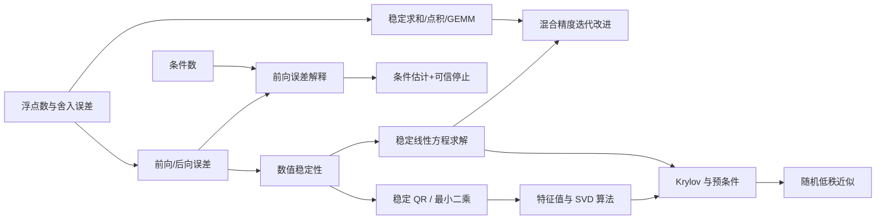

# 数值线性代数 MOC

> [!abstract] 本模块的任务
> 研究有限精度计算中怎样可靠地求解线性方程、最小二乘和谱问题。这里不只问公式是否成立，还问数据误差怎样传播、算法产生多大后向误差、计算成本是多少，以及大规模稀疏矩阵该如何近似。

> [!info] 与全局课程地图的关系
> 本分卷在[[数学基础完整课程地图与掌握标准]]中固定为 NUM-01 至 NUM-20 共 20 个核心节点。本 MOC 还会调用[[条件数]]、[[矩阵扰动]]、[[Cholesky 分解]]、[[Schur 分解]]等 10.2/10.3 节点，并列出实验与辅助专题；这些交叉调用不重复计入 20 个数值核心节点。

## 核心区别

| 层次 | 典型问题 | 代表对象 |
|---|---|---|
| 数学问题 | 真解对输入变化是否敏感？ | [[条件数]] |
| 数据误差 | 输入本身有多少噪声或量化误差？ | [[矩阵扰动]] |
| 算法误差 | 实现是否相当于精确求解邻近问题？ | [[前向误差与后向误差]]、[[数值稳定性]] |
| 计算代价 | 完整分解是否可承受？ | 复杂度、内存、稀疏性 |
| 近似质量 | 只算部分方向时误差多大？ | 残差、谱间隙、概率界 |

## 3A. 误差语言

| 节点 | 核心问题 | 状态 |
|---|---|---|
| [[浮点数与舍入误差]] | IEEE 格式、$u/\gamma_n$、消去、求和/FMA 与 AI 混合精度怎样形成一条误差链？ | draft |
| [[前向误差与后向误差]] | 前向误差、残差、范数型/分量型/结构化后向误差怎样经条件数连接，并迁移到固定点、谱问题与 AI 验收？ | draft |
| [[数值稳定性]] | 条件性、准确性与稳定性如何分离，前向、后向和混合稳定分别承诺什么？ | draft |
| [[误差传播、条件估计与停止准则]] | Jacobian 怎样传播局部扰动，条件估计怎样把残差转成可信停止预算？ | draft |
| [[稳定求和、点积与矩阵乘法]] | 归约树、补偿、FMA 和累加精度如何决定 AI 基础内核的精度？ | draft |
| [[条件数]] | 问题本身对扰动有多敏感？ | draft |
| [[矩阵扰动]] | 谱值、方向和子空间怎样受噪声影响？ | draft |

## 3B. 直接方法

| 节点 | 核心问题 | 状态 |
|---|---|---|
| [[线性方程组、消元与 LU 分解]] | 消元、$PA=LU$、三角求解与数值问题的理论桥梁是什么？ | draft |
| [[稳定求解线性方程组]] | 选主元、增长因子、LU/三角求解后向误差、BERR/FERR、条件估计与迭代改进怎样形成完整验收链？ | draft |
| [[迭代改进、混合精度与残差校正]] | 低精度分解、工作精度更新与高精度残差如何共同决定 classical/GMRES-IR 的区间？ | draft |
| [[Gram-Schmidt 的数值稳定性]] | 经典与改进 Gram–Schmidt 为何表现不同？ | planned |
| [[Householder 与 Givens 变换]] | 反射符号、安全平面旋转、紧凑/分块存储和正交变换后向误差怎样组成稳定 QR？ | draft |
| [[稳定最小二乘与正规方程的风险]] | 从投影几何、条件数平方、残差/参数误差分离到 QR、QRCP、SVD、TSVD 与 ridge，算法应怎样选择和验收？ | draft |
| [[Cholesky 分解]] | SPD 结构怎样减少成本并保持稳定？ | draft |
| [[实验 - Gram-Schmidt 与 QR 的正交性误差]] | 小重构残差为什么不能保证正交性？ | draft |
| [[实验 - 正定边界、条件数与 Cholesky pivot]] | 正定性接近失效时有哪些连续预警？ | draft |
| [[实验 - 选主元、后向误差与迭代改进]] | 为什么条件良好的系统仍会被无主元消元算坏，混合精度改进又在哪里失效？ | draft |
| [[实验 - Householder 符号、Givens 缩放与 QR 正交性]] | 为什么局部变换必须安全生成，Householder/Givens 又怎样把正交性保持在舍入地板附近？ | draft |

## 3C. 特征值与奇异值算法

| 节点 | 核心问题 | 状态 |
|---|---|---|
| [[Schur 分解]] | QR 特征值算法最终逼近什么结构，怎样从重排形式获得谱簇不变子空间并验收残差？ | draft |
| [[矩阵函数与矩阵指数]] | 稠密完整函数、稀疏作用量与 Fréchet 导数为什么需要不同算法？ | draft |
| [[极分解]] | SVD、QR、Newton、Newton–Schulz 与 QDWH 怎样在稳定性、乘法密度、条件数和精度间取舍？ | draft |
| [[实验 - Newton-Schulz 极分解的条件数效应]] | 为什么局部二次收敛不等于固定步精确，秩亏为何不能由多项式迭代恢复？ | draft |
| [[矩阵符号函数]] | Schur、Newton、无逆多项式与 rational/Krylov action 怎样完成半平面谱分割？ | draft |
| [[实验 - 矩阵符号函数的谱分割与非正规敏感性]] | 为什么固定点谱仍不能控制 sign 范数、导数和统一缩放 Newton 的步数？ | draft |
| [[幂法、反幂法与 Rayleigh 商迭代]] | 谱比、移位距离、Rayleigh 商与线性求解精度怎样控制极端或邻近特征对的收敛？ | draft |
| [[Hessenberg 化与 QR 特征值算法]] | 双侧 Householder、隐式移位、bulge chasing 与 deflation 怎样把一般稠密矩阵推进到实 Schur 形式？ | draft |
| [[Lanczos 方法]] | 对称大矩阵怎样由三项递推压缩为三对角问题，并管理浮点正交性？ | draft |
| [[Arnoldi 方法]] | 一般非正规大矩阵怎样构造 Hessenberg 投影、重启并认证 Ritz 对？ | draft |
| [[SVD 算法与谱范数估计]] | 双对角化、Golub–Kahan、幂迭代与随机值域分别适合什么规模？ | draft |

## 3D. 大规模稀疏与迭代求解

| 节点 | 核心问题 | 状态 |
|---|---|---|
| [[定常迭代法与谱半径]] | 矩阵分裂、误差传播与谱半径怎样决定 Jacobi、GS、SOR 的收敛和暂态？ | draft |
| [[Krylov 子空间与预条件]] | 残差多项式、投影与谱重塑怎样加速大规模线性求解？ | draft |
| [[共轭梯度法]] | SPD 二次问题如何在 Krylov 空间中实现能量最优，并在有限精度下可靠停止？ | draft |
| [[GMRES、MINRES 与残差最小化]] | 一般非对称或对称不定系统怎样最小化残差，并在重启、预条件和有限精度下可靠停止？ | draft |
| [[稀疏矩阵计算与存储复杂度]] | COO/CSR/CSC、SpMV/SpGEMM、消元填充与并行负载怎样共同决定真实成本？ | draft |
| [[随机化低秩近似与随机 SVD]] | 随机值域、过采样、幂步和独立后验证书怎样换取可控的低秩近似？ | draft |

## 与 AI 的直接接口

- **训练稳定性**：低精度、量化和大批量归约都依赖浮点误差模型。
- **线性回归与探针**：算法选择不能只看闭式公式；QR/SVD 与正规方程有不同稳定性。
- **谱归一化**：幂迭代估计 $\sigma_1$ 的收敛速度受谱间隙影响。
- **PCA 和表示分析**：大规模激活矩阵通常只能做截断或随机 SVD。
- **矩阵优化器**：逆平方根、正交化和矩阵符号需要稳定迭代与阻尼。
- **稀疏与结构化模型**：大矩阵的主要成本往往是矩阵—向量乘积，而不是显式分解。

## 配套实验路线

1. [[实验 - 浮点求和次序与灾难性消去]]（已完成）：半 ulp 吸收、归约次序、补偿求和与稳定公式改写；
2. [[实验 - 小残差、大前向误差与条件数]]（已完成）：病态方向中的残差压缩、条件放大以及范数型/分量型后向误差分离；
3. [[实验 - 等价公式不等价稳定]]（已完成）：二次根消去与 log-sum-exp 溢出中的执行路径差异；
4. [[实验 - 选主元、后向误差与迭代改进]]（已完成）：固定良好条件数下比较无主元/部分选主元，再扫描混合精度改进的条件数边界；
5. [[实验 - Gram-Schmidt 与 QR 的正交性误差]]（已完成）：重构残差与正交性缺陷分离；
6. [[实验 - Householder 符号、Givens 缩放与 QR 正交性]]（已完成）：局部参数生成、极端动态范围与正交变换序列的三层稳定性；
7. [[实验 - 正规方程、QR 与截断 SVD 的稳定性]]（已完成）：条件数平方、残差与参数误差分离、TSVD 偏差—稳定性取舍；
8. [[实验 - 谱间隙、移位与 Rayleigh 商迭代收敛]]（已完成）：幂法谱比、反幂移位唯一性与对称 RQI 局部三次律；
9. [[实验 - Hessenberg 约化、移位与 QR deflation]]（已完成）：正交相似不变量、移位速度与 $O(n^3)$/$O(n^2)$ 结构差异；
10. [[实验 - Lanczos Ritz 收敛、残差与正交性]]（已完成）：极端 Ritz 收敛、廉价残差与低精度正交性丢失；
11. [[实验 - Arnoldi 非正规性、重正交与重启]]（已完成）：非正规 Ritz 残差、一次/二次 MGS 与保留目标的短重启；
12. [[实验 - SVD 双对角化、谱范数与随机子空间]]（已完成）：双对角结构、谱隙效应与随机值域的 $p/q$ 取舍；
13. [[实验 - 定常迭代的频率阻尼、谱半径与暂态]]（已完成）：Poisson 模态阻尼、Jacobi/GS/SOR 真残差与非正规暂态；
14. [[实验 - 预条件的谱重塑、PCG 收敛与成本权衡]]（已完成）：广义谱压缩、块 PCG 与非单调工作代理；
15. [[实验 - CG 能量几何、谱聚集与递推残差漂移]]（已完成）：能量椭圆、同条件数异谱收敛与低精度虚假残差；
16. [[实验 - GMRES 重启、MINRES 结构与残差最小化]]（已完成）：完整/重启 GMRES 的记忆—收敛权衡、非单调重启维数与对称不定 MINRES；
17. [[实验 - 稀疏存储、消元填充与并行负载]]（已完成）：CSR 索引交叉、二维网格排序填充与同 nnz 不同分区的尾部负载；
18. [[实验 - 随机 SVD 的过采样、幂步与概率证书]]（已完成）：多 seed 误差尾部、幂步—数据 pass 交换与独立 Gaussian 后验上界。
19. [[实验 - 条件估计、误差传播与可信停止]]（已完成）：局部 Jacobian 乘积、一范数条件估计与弱方向残差误停。
20. [[实验 - 稳定归约、点积消去与混合精度累加]]（已完成）：半 ulp 吸收、点积消去与 FP16/FP32 accumulator 分层契约。
21. [[实验 - 三精度迭代改进与 GMRES-IR 边界]]（已完成）：binary16 LU、残差精度地板与 GMRES-IR 扩展/奇异因子边界。

补充完成：[[实验 - 正定边界、条件数与 Cholesky pivot]]，作为 SPD 求解与共轭梯度之前的条件性直觉实验。

矩阵函数补充链：[[实验 - 稳定非正规系统的矩阵指数瞬态]]已经用解析矩阵族建立“渐近稳定不等于有限时间收缩”的基线；[[非正规矩阵、预解式与伪谱]]进一步补齐左右特征向量、最小奇异值等值线、Kreiss 型下界、矩阵函数界与大规模计算边界。后续扩展到真实高维稀疏 SSM。

极分解补充实验：[[实验 - Newton-Schulz 极分解的条件数效应]]已经用精确奇异值递推分离条件数、固定步数和秩亏边界；后续比较低精度、动态缩放、Muon 五次多项式与 QDWH。

## 配套练习

每个节点按[[练习与测验 MOC]]建立 A–E 五类题。算法节点额外要求：

- 至少一次手工追踪两步迭代；
- 至少一次复杂度与存储分析；
- 至少一个“应选哪个算法，为什么”的情境题；
- 至少一个失败例子或病态输入；
- 代码实验必须报告残差、误差和条件数，而不只报告运行成功。

## 卷末累计验收

NUM-01—20 的累计验收已经建立：

- [[阶段测验 - 数值计算与数值线性代数（10.8）]]：180 分钟、100 分、闭卷，按定义/手算/推导/失败诊断/AI 迁移五区评分；
- [[阶段测验解答 - 数值计算与数值线性代数（10.8）]]：逐步推导、评分断点、诊断回链和 AI 求解器契约；
- 实验门：从本卷最近三个实验中随机指定一项，要求重新生成图、核验哈希、手算数值并预注册一次参数干预。

当前是 **20/20 正文 draft，0/20 经真实累计测验认证**。题卷成稿不改变节点状态；只有独立作答、分区达线、实验复现、48 小时重做和节点自身证据共同满足时，才逐项讨论升级。

## 2026-08-23 图像标准化进度

NUM-01—20 已按最新版图文规范完成迁移，图像标准化进度为 **20/20**：

- [[浮点数与舍入误差]]、[[前向误差与后向误差]]、[[数值稳定性]]、[[误差传播、条件估计与停止准则]]已形成“局部舍入—后向解释—条件放大—可信停止”的连续基础图组；
- [[稳定求和、点积与矩阵乘法]]、[[稳定求解线性方程组]]、[[迭代改进、混合精度与残差校正]]、[[Householder 与 Givens 变换]]进一步把底层算术误差接到 reduction、pivoted solve、三精度 refinement 与稳定 QR；
- [[稳定最小二乘与正规方程的风险]]、[[幂法、反幂法与 Rayleigh 商迭代]]、[[Hessenberg 化与 QR 特征值算法]]、[[Lanczos 方法]]把同一验收语言延伸到秩敏感最小二乘、谱过滤、稠密 Schur 流水线和对称 Krylov 投影；
- [[Arnoldi 方法]]、[[SVD 算法与谱范数估计]]、[[定常迭代法与谱半径]]、[[Krylov 子空间与预条件]]继续连接一般投影、双侧奇异三元组证书、固定误差动力学和预条件总成本；
- [[共轭梯度法]]、[[GMRES、MINRES 与残差最小化]]、[[稀疏矩阵计算与存储复杂度]]、[[随机化低秩近似与随机 SVD]]完成 SPD 能量求解、一般最小残差、稀疏系统成本与概率低秩证书的收束；
- 20/20 使用根目录稳定 `v2` 路径、`880 px` 宽度、可判定引图问题、正式图注、来源脚本、读图说明和“图没有证明什么”；
- 二十幅图由五套确定性脚本生成，已通过 SVG 规范、XML、1200 px 渲染和分批人工视觉检查；20 个正文节点的数学块均成对闭合；
- 章内 `v1=0`、相对图片路径 `=0`。Householder 图的一条 bracket warning 已核对为矩阵/向量数学记号，不是发布占位符；10.8 整章图像标准化通过。

## 主要来源

- Lloyd N. Trefethen & David Bau III, *Numerical Linear Algebra*, SIAM, 1997。
- [[S-2002-Higham-数值算法准确性与稳定性|Nicholas J. Higham, Accuracy and Stability of Numerical Algorithms]], 2nd ed., SIAM, 2002。
- Gene H. Golub & Charles F. Van Loan, *Matrix Computations*, 4th ed., 2013。
- [MIT 18.335 Introduction to Numerical Methods](https://ocw.mit.edu/courses/18-335j-introduction-to-numerical-methods-spring-2019/)。
- [[S-1991-Goldberg-浮点数|Goldberg：What Every Computer Scientist Should Know About Floating-Point Arithmetic]]。
- [[S-2021-Higham-极端规模与低精度稳定性|Higham：Numerical Stability at Extreme Scale and Low Precisions]]。
- [[S-2009-Demmel-高斯消元稳定性|Demmel：Gaussian Elimination Stability]]。
- [[S-1999-LAPACK-误差界|LAPACK Users' Guide：Accuracy and Stability]]。
- [[S-2024-Demmel-Householder-Givens稳定QR|Demmel：Householder、Givens 与稳定 QR]]。
- [[S-2025-LAPACK-QR反射与平面旋转|LAPACK：QR reflectors 与 safe Givens]]。
- [[S-2026-Su-11654-流式幂迭代Muon初识|苏剑林：流式幂迭代 Muon 中的 QR 接口]]。
- [[S-2023-Demmel-最小二乘数值算法|Demmel：正规方程、QR 与 SVD 的最小二乘路线]]。
- [[S-2025-LAPACK-最小二乘驱动|LAPACK：DGELS、DGELSY 与 DGELSD 最小二乘驱动]]。
- [[S-2023-Demmel-幂法反幂与QR迭代|Demmel：幂法、反幂法、RQI 与移位 QR]]。
- [[S-2025-LAPACK-Hessenberg与Schur驱动|LAPACK：DGEHRD 与 DHSEQR 的 Hessenberg—Schur 契约]]。
- [[S-2023-Demmel-Krylov-Arnoldi-Lanczos|Demmel：Krylov、Arnoldi 与 Lanczos 投影主线]]。
- [[S-2000-Netlib-Krylov-Eigensolver-Templates|Netlib：Krylov 特征求解模板、重正交与重启]]。
- [[S-1965-Golub-Kahan-SVD算法|Golub–Kahan：SVD 双对角化算法]]。
- [[S-2025-LAPACK-SVD驱动与双对角化|LAPACK：SVD 驱动与双对角化接口]]。
- [[S-2011-Halko-Martinsson-Tropp-随机低秩|Halko–Martinsson–Tropp：随机低秩近似]]。
- [[S-2023-Demmel-分裂法Krylov与预条件|Demmel：分裂法、Krylov、CG 与预条件]]。
- [[S-1994-Barrett-线性系统迭代模板|Netlib：线性系统迭代模板]]。
- [[S-1952-Hestenes-Stiefel-共轭梯度|Hestenes–Stiefel：共轭梯度原始论文]]。
- [[S-2026-PETSc-KSP与PCG契约|PETSc：KSP、PCG 与预条件接口契约]]。
- [[S-1986-Saad-Schultz-GMRES|Saad–Schultz：GMRES 原始论文]]。
- [[S-2011-Choi-Paige-Saunders-MINRESQLP|Choi–Paige–Saunders：MINRES-QLP 与奇异对称系统]]。
- [[S-2026-GraphBLAS-稀疏线性代数规范|GraphBLAS C API：稀疏半环、mask 与图计算契约]]。
- [[S-1996-Amestoy-Davis-Duff-AMD|Amestoy–Davis–Duff：近似最小度排序]]。
- [[S-2020-Martinsson-Tropp-随机数值线性代数|Martinsson–Tropp：随机数值线性代数综述]]。
- [[S-2019-IEEE-754|IEEE 754-2019]]。
- [[S-1988-Higham-一范数估计与条件数|Higham：一范数估计与条件数]]。
- [[S-2005-Ogita-Rump-Oishi-精确求和点积|Ogita–Rump–Oishi：Accurate Sum and Dot Product]]。
- [[S-2018-Carson-Higham-三精度迭代改进|Carson–Higham：三精度迭代改进]]。
- [[S-2022-Higham-Mary-混合精度数值线性代数|Higham–Mary：混合精度数值线性代数]]。
