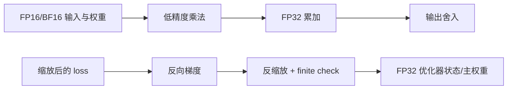
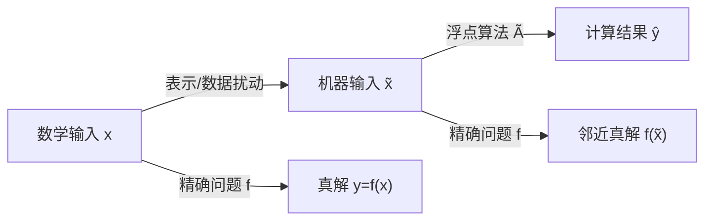

# 浮点数与舍入误差

> [!abstract] 本章主问题
> 计算机通常不是在实数域 $\mathbb R$ 上运算，而是在一个有限的浮点集合 $\mathbb F$ 上反复执行
> $$
> x\circ y\longmapsto\operatorname{fl}(x\circ y).
> $$
> 在默认的“舍入到最近、平局取偶”模式下，若精确结果处于正规范围，一次基本运算可写成
> $$
> \boxed{\operatorname{fl}(x\circ y)=(x\circ y)(1+\delta),\qquad |\delta|\le u.}
> $$
> $u$ 是**单位舍入误差**。这个局部界很小，但消去、吸收、上溢/下溢和大量归约会改变最终误差；低精度 AI 计算因此必须同时设计输入格式、累加精度、运算次序、尺度管理和验收方法。

> [!important] 本章守住三层边界
> 1. **表示层**：哪些数能存，数之间的间距多大？
> 2. **舍入层**：一次运算怎样落回可表示集合？
> 3. **算法层**：许多次舍入怎样沿计算图累积？
>
> 本章回答“误差从哪里来”。“问题本身是否敏感”与“算法是否稳定”的正式语言分别放在[[条件数]]、[[前向误差与后向误差]]和[[数值稳定性]]。

## 学习目标

完成本章后，应能：

1. 解释为什么有限位模式不可能精确表示全部实数；
2. 从基数 $\beta$、精度 $p$ 和指数范围定义浮点系统；
3. 区分正规数、次正规数、$\pm0$、$\pm\infty$ 与 NaN；
4. 读懂 binary16、binary32、binary64 的符号位、指数位和 fraction 位；
5. 区分 fraction bits 与包含隐藏首位的 significand precision；
6. 计算一个 binade 内的浮点间距和 ulp；
7. 严格区分 `eps` 与单位舍入误差 $u$；
8. 解释四种基本舍入方向以及 ties-to-even 的作用；
9. 推导 $\operatorname{fl}(x)=x(1+\delta)$ 与基本运算模型；
10. 说明该相对误差模型为何需要正规范围等条件；
11. 用具体二进制例子解释吸收、非结合性和非分配性；
12. 解释灾难性消去为何常是“暴露已有误差”；
13. 证明并使用 Sterbenz 引理；
14. 推导 $\gamma_n=nu/(1-nu)$ 误差累积界；
15. 推导串行求和和点积的绝对误差界；
16. 用求和条件数解释大相对结果误差；
17. 比较串行、排序、成对和补偿求和；
18. 解释 FMA 为何把乘加的两次舍入减为一次；
19. 分析平方根差、二次方程、`log1p` 和方差公式的稳定改写；
20. 比较 FP16、BF16、FP32、FP64 与 TF32 的精度/范围角色；
21. 解释 loss scaling、FP32 累加与稳定 softmax 分别解决哪一类问题；
22. 说明 GPU 并行归约为何可能不逐比特复现；
23. 为 AI 数值故障设计最小复现、参考值和精度扫描；
24. 明确“换成 float64”能缓解什么、不能解决什么。

> [!question] 初学者读完必须能回答
> 1. 浮点系统的基数、significand precision、指数范围与 subnormal 分别控制什么？
> 2. ulp、`eps` 与 unit roundoff $u$ 有何区别，为什么不能互换？
> 3. $\operatorname{fl}(x\circ y)=(x\circ y)(1+\delta)$ 在什么范围和舍入模式下成立？
> 4. 吸收、灾难性消去、上溢、下溢与非结合性分别发生在执行链的哪一层？
> 5. $\gamma_n=nu/(1-nu)$ 怎样合并局部误差，它为什么只是最坏情形界？
> 6. pairwise/compensated summation 与 FMA 分别减少哪一种舍入路径？
> 7. AI 混合精度实验为何必须同时声明 storage、operation、accumulator、scaling 与 validation？

## 阅读前检查

### 检查 1：绝对误差与相对误差

若真值为 $x$，近似值为 $\widehat x$，则

$$
e_{\mathrm{abs}}=|\widehat x-x|,
\qquad
e_{\mathrm{rel}}=\frac{|\widehat x-x|}{|x|}\quad(x\ne0).
$$

绝对误差有量纲；相对误差描述损失了多少比例。真值接近零时，相对误差会变得不稳定甚至无定义，所以浮点分析不能只保留一种误差尺度。

### 检查 2：科学记数法

十进制科学记数法把

$$
1234.5=1.2345\times10^3.
$$

浮点数只是把“基数、有效数字和指数”编码到固定位数；主流二进制格式将 $10$ 换成 $2$。

### 检查 3：等比级数

对 $|r|<1$，

$$
1+r+r^2+\cdots=\frac1{1-r}.
$$

这会用于解释 $0.1$ 为什么在二进制中循环，也会用于推导 $\gamma_n$。

### 检查 4：误差上界不是典型误差

若证明 $|e|\le B$，只说明最坏情形不会超过 $B$。它不说明误差必定接近 $B$，也不允许在关键系统中用“通常会抵消”代替验收。

先用下图回答一个视觉问题：**有限浮点网格、一次舍入模型与完整执行链怎样共同决定最终数值误差？**

![[00-知识库管理/_assets/figures/numerical-analysis/fig-floating-point-system-v2.svg|880]]

> [!figure] 图 10.8.1｜有限网格、混合精度执行链与舍入累积
> A 用跨 binade 的数轴说明浮点间距随指数增大、subnormal 附近相对模型改变；B 分开 input storage、operation、accumulator 与 output cast，并标出 FMA、scale management 与 reduction order；C 从单次 $\delta$ 模型进入 $\theta_n/\gamma_n$ 界，再列出吸收、消去和 over/underflow 等不能被朴素相对模型吞掉的路径。来源：独立绘制；理论接口参考 IEEE 754、Goldberg 与 Higham；生成脚本：[[plot_numerical_error_foundations_v2.py]]；确定性结构示意，无随机种子。

**怎样读图。** A 先比较同一 binade 内的固定间距与跨 binade 后的加倍，再区分 `eps at 1` 和 $u$；B 沿数据实际执行方向逐项记录每个格式，不要用一个 `dtype` 概括整条链；C 只有在 $nu<1$ 且无异常范围事件时读取 $\gamma_n$，随后仍需检查具体算法是否发生消去、吸收或溢出。

**适用边界（图没有证明什么）。** 数轴没有按真实 IEEE 位宽比例绘制，也未展开 NaN、signed zero 与全部舍入模式。$|\delta|\le u$ 和 $\gamma_n$ 是带条件的 worst-case 模型，不证明误差会达到或远小于该界；并行硬件、flush-to-zero、tensor core 与编译器重排可能改变执行。升高精度也不能修复病态问题、错误模型或不稳定公式。

## 对象、记号与强制术语

| 符号 | 含义 |
|---|---|
| $\mathbb F$ | 当前格式的有限浮点集合 |
| $\beta$ | 基数；IEEE 二进制格式取 $\beta=2$ |
| $p$ | 有效数精度，**包含隐藏首位** |
| $e_{\min},e_{\max}$ | 正规数的最小/最大无偏指数 |
| $\operatorname{fl}(x)$ | 把实数 $x$ 按当前模式舍入到 $\mathbb F$ |
| $\operatorname{RN}(x)$ | 舍入到最近；本章默认 ties-to-even |
| $\operatorname{ulp}(x)$ | $x$ 所在量级的末位单位 |
| $\varepsilon_{\rm gap}$ | $1$ 与其右侧下一个浮点数之差 |
| $u$ | unit roundoff；舍入到最近时的最大正规相对舍入误差 |
| $\delta$ | 一次舍入的局部相对误差，$|\delta|\le u$ |
| $\theta_n$ | 至多 $n$ 次相对扰动合并后的总扰动 |
| $\gamma_n$ | $nu/(1-nu)$，要求 $nu<1$ |
| $\widehat x$ | 计算得到的浮点结果 |

> [!warning] mantissa、fraction 与 significand
> - fraction field 是实际存储的小数部分位；
> - significand 是参与数值的有效数，通常还包含未存储的隐藏首位 $1$；
> - 旧资料常把 significand 称为 mantissa，但这容易与对数中的尾数混淆。
>
> 例如 binary32 存 23 个 fraction bits，但精度是 $p=24$。

## 一、为什么必须近似：有限编码与无限实数

### 1.1 一个计数论事实

固定 $b$ 个比特只能产生至多 $2^b$ 种位模式；实数却不可数。于是任何固定宽度格式都只能表示有限个实数，其余实数必须：

1. 舍入到邻近可表示数；
2. 溢出到特殊值；
3. 或在软件多精度表示中使用可变长度存储。

所以舍入误差不是某个语言的 bug，而是有限表示实数的结构性代价。

### 1.2 整数与实数的差异

在范围内，32 位整数的加减乘可以精确；超出范围时发生整数溢出。浮点数把一部分位分给指数，获得巨大动态范围，但同一量级只能保留有限个有效二进制位：

$$
\text{动态范围}
\quad\longleftrightarrow\quad
\text{局部精度}
$$

是一项根本交换。

## 二、一般浮点系统

### 2.1 正规浮点数的抽象形式

一个基数为 $\beta$、精度为 $p$ 的正规浮点数写成

$$
x=\pm(d_0.d_1d_2\cdots d_{p-1})_\beta\,\beta^e,
$$

其中

$$
d_0\in\{1,\ldots,\beta-1\},\qquad
d_i\in\{0,\ldots,\beta-1\},\qquad
e_{\min}\le e\le e_{\max}.
$$

$d_0\ne0$ 让表示规范化。对 $\beta=2$，正规数的首位必为 $1$，因此可隐含不存：

$$
x=(-1)^s(1.f)_2\,2^e.
$$

### 2.2 一个玩具系统

取

$$
\beta=2,\qquad p=4,\qquad -2\le e\le2.
$$

在区间 $[1,2)$ 中，可表示数为

$$
1.000_2,\ 1.001_2,\ 1.010_2,\ldots,\ 1.111_2,
$$

相邻间距是

$$
2^{-(p-1)}=2^{-3}=\frac18.
$$

在 $[2,4)$ 中，指数增加 $1$，间距也翻倍为 $1/4$。这就是“浮点数不是均匀网格”的第一直觉。

### 2.3 binade 与局部间距

把区间

$$
[2^e,2^{e+1})
$$

称为一个二进制 binade。精度为 $p$ 时，正规数在该区间的间距是

$$
\boxed{\Delta_e=2^{e-(p-1)}.}
$$

绝对间距随量级增长，但相对间距近似固定：这正是浮点格式适合跨越许多数量级的原因。

## 三、IEEE 754 二进制格式

### 3.1 三个字段

主流 IEEE 二进制浮点编码由三部分组成：

| 字段 | 作用 |
|---|---|
| sign | 符号 $(-1)^s$ |
| exponent | 带偏置指数，兼顾大小排序与特殊编码 |
| fraction | 有效数的小数部分；正规数首位 $1$ 隐藏 |

对普通正规数，数值是

$$
\boxed{x=(-1)^s(1.f)_2\,2^{E-\mathrm{bias}}.}
$$

### 3.2 常用 IEEE 基本二进制格式

| 名称 | 总位数 | exponent bits | fraction bits | 精度 $p$ | $u=2^{-p}$ | 最小正规正数 | 最大有限正数 |
|---|---:|---:|---:|---:|---:|---:|---:|
| binary16 / FP16 | 16 | 5 | 10 | 11 | $2^{-11}\approx4.88\times10^{-4}$ | $2^{-14}\approx6.10\times10^{-5}$ | $65504$ |
| binary32 / FP32 | 32 | 8 | 23 | 24 | $2^{-24}\approx5.96\times10^{-8}$ | $2^{-126}\approx1.18\times10^{-38}$ | $\approx3.40\times10^{38}$ |
| binary64 / FP64 | 64 | 11 | 52 | 53 | $2^{-53}\approx1.11\times10^{-16}$ | $2^{-1022}\approx2.23\times10^{-308}$ | $\approx1.80\times10^{308}$ |

> [!warning] “16 位”不等于“16 位有效精度”
> FP16 只有 $p=11$ 个二进制有效位，约提供 $3$–$4$ 位十进制有效数字。32 位浮点约 $7$ 位，64 位约 $16$ 位。这些是精度数量级，不是对所有实数、所有运算链的最终误差保证。

### 3.3 bfloat16：范围优先的 16 位格式

BF16 通常使用：

| sign | exponent | fraction | 精度 $p$ |
|---:|---:|---:|---:|
| 1 | 8 | 7 | 8 |

因此

$$
u_{\rm BF16}=2^{-8}\approx3.91\times10^{-3}.
$$

它保留与 FP32 相同宽度的指数域，正规动态范围接近 FP32，但有效精度显著低于 FP16。其设计偏好是：

- 先避免梯度/激活因指数范围不足而溢出；
- 再靠 FP32 累加、尺度控制和训练鲁棒性弥补低精度。

> [!warning] 次正规数是实现契约的一部分
> 不能只看位宽就假设所有硬件保留次正规数。例如当前 Cloud TPU 文档明确说明其 BF16 转换会把次正规数 flush to zero。涉及下溢时，必须核对具体设备与算子。

### 3.4 TF32 不是一种常规 19 位存储类型

NVIDIA TF32 是矩阵乘/卷积中的计算模式：输入保留接近 FP32 的指数范围，但乘法只读取 10 个 fraction bits（有效精度约 $p=11$），常以 FP32 累加。它不应被描述为“程序里普遍存储的 IEEE 基本格式”。

这一区分非常重要：

$$
\text{storage dtype}
\ne
\text{multiply precision}
\ne
\text{accumulator precision}
\ne
\text{output dtype}.
$$

## 四、正规数、次正规数与特殊值

### 4.1 正规数

正规数使用隐含首位 $1$，因而在给定位数下获得最大有效精度。

### 4.2 次正规数与渐进下溢

指数域全零而 fraction 非零时，二进制 IEEE 格式表示次正规数：

$$
x=(-1)^s(0.f)_2\,2^{e_{\min}}.
$$

它们放弃隐藏首位，让数轴从最小正规数逐步走向 $0$。binary32 的最小正次正规数为 $2^{-149}$，binary16 的最小正次正规数为 $2^{-24}$。

渐进下溢的价值在于：很小的非零结果不必突然全部变成 $0$。代价是越接近零，有效位越少，统一的相对误差界也不再适用。

### 4.3 $\pm0$

IEEE 浮点含 $+0$ 与 $-0$。通常 $+0=-0$ 在数值比较中成立，但符号仍能保留方向信息，例如按 IEEE 语义：

$$
\frac1{+0}=+\infty,\qquad
\frac1{-0}=-\infty.
$$

这对复函数分支、区间端点和下溢方向有用。

### 4.4 $\pm\infty$

有限数上溢或非零数除以有符号零可产生无穷。无穷不等同于一个“很大的普通数”：

$$
\infty+1=\infty,\qquad
1/\infty=0,\qquad
\infty-\infty=\mathrm{NaN}.
$$

### 4.5 NaN

NaN 表示无效或未定义的浮点结果，例如

$$
0/0,\qquad \sqrt{-1}\ \text{（实数运算）},\qquad \infty-\infty.
$$

NaN 会传播，而且与包括自身在内的普通有序比较通常为假。训练中只在最后检查 loss 是否 NaN 太迟；应在首个非有限张量处定位。

## 五、十进制小数为什么常常不能精确表示

### 5.1 判据

一个最简分数 $a/b$ 在基数 $\beta$ 下有有限展开，当且仅当 $b$ 的所有素因子都包含在 $\beta$ 的素因子中。

对十进制 $\beta=10=2\cdot5$，$1/10$ 有限；对二进制 $\beta=2$，分母中的因子 $5$ 无法消掉，因此

$$
0.1_{10}=0.0001100110011\ldots_2.
$$

### 5.2 `0.1 + 0.2 != 0.3` 的正确解释

程序实际计算的是

$$
\operatorname{fl}\bigl(\operatorname{fl}(0.1)+\operatorname{fl}(0.2)\bigr),
$$

再与 $\operatorname{fl}(0.3)$ 比较。三次十进制到二进制舍入不必满足代数恒等式。

正确教训不是“浮点数不能比较”，而是：

- 精确离散状态、计数器、ID 不应使用近似浮点语义；
- 数值结果的容差应来自误差尺度，而不是随手写 `1e-6`；
- 若业务要求十进制精确金额，应使用十进制定点/decimal 规则。

## 六、舍入模式

IEEE 754 的常用方向包括：

| 模式 | 含义 | 典型用途 |
|---|---|---|
| round to nearest, ties to even | 取最近值；正好居中时取末位为偶者 | 默认科学计算，偏差较对称 |
| toward $+\infty$ | 向上取整 | 区间算术上界 |
| toward $-\infty$ | 向下取整 | 区间算术下界 |
| toward $0$ | 截断绝对值 | 某些转换/底层算法 |

### 6.1 为什么平局取偶

若每次恰在中点都固定向上取，长计算会积累方向偏差。ties-to-even 让中点一半落向较小、一半落向较大，避免系统性偏向；它不保证任意数据上的误差均值严格为零。

### 6.2 正确舍入

对规定为 correctly rounded 的基本操作，可把过程理解为：

1. 在数学上得到精确结果；
2. 按当前格式与舍入模式选择唯一浮点结果。

实现不必真的使用无限精度中间量，只需最终位模式与该规范一致。

## 七、ulp、`eps` 与单位舍入误差 $u$

这是本章最容易产生两倍差异的地方。

### 7.1 ulp

在正规 binade $[2^e,2^{e+1})$ 内，

$$
\operatorname{ulp}(x)=2^{e-(p-1)}.
$$

舍入到最近时，绝对舍入误差最多约半个 ulp：

$$
|\operatorname{RN}(x)-x|\le\frac12\operatorname{ulp}(x).
$$

### 7.2 1 右侧的间距

在 $[1,2)$ 中，

$$
\boxed{\varepsilon_{\rm gap}=2^{-(p-1)}.}
$$

多数库的 `finfo.eps` 指“$1$ 与右侧下一个可表示数的差”，所以：

| 格式 | `eps` / $\varepsilon_{\rm gap}$ | $u$ |
|---|---:|---:|
| FP16 | $2^{-10}$ | $2^{-11}$ |
| FP32 | $2^{-23}$ | $2^{-24}$ |
| FP64 | $2^{-52}$ | $2^{-53}$ |

### 7.3 单位舍入误差

舍入到最近时，最大正规相对误差可取

$$
\boxed{u=\frac12\beta^{1-p}.}
$$

对 $\beta=2$，

$$
u=2^{-p}=\frac12\varepsilon_{\rm gap}.
$$

> [!warning] machine epsilon 术语不统一
> 有些教材把 machine epsilon 定义为 $\varepsilon_{\rm gap}$，有些把它定义为 $u$。本库强制使用：
> - `eps` 或 $\varepsilon_{\rm gap}$：$1$ 右侧间距；
> - $u$：unit roundoff。
>
> 引用外部公式时必须先检查作者采用哪一种。

## 八、一次舍入的标准模型

### 8.1 对实数的舍入

设非零实数 $x$ 的舍入结果处于正规范围。round-to-nearest 给出

$$
\boxed{\operatorname{fl}(x)=x(1+\delta),\qquad |\delta|\le u.}
$$

若 $x\in[2^e,2^{e+1})$，半个间距是 $2^{e-p}$。又因为 $|x|\ge2^e$，所以

$$
\frac{|\operatorname{fl}(x)-x|}{|x|}\le\frac{2^{e-p}}{2^e}=2^{-p}=u.
$$

### 8.2 基本运算模型

若 $x,y\in\mathbb F$，$\circ\in\{+,-,\times,/\}$，精确结果处于适用范围，则

$$
\boxed{\operatorname{fl}(x\circ y)=(x\circ y)(1+\delta),\qquad |\delta|\le u.}
$$

这里右侧 $x\circ y$ 是数学上的精确结果，左侧才是浮点结果。

### 8.3 模型的适用边界

相对模型不是无条件咒语：

- 发生上溢时，有限相对界失效；
- 结果进入次正规区时，统一相对精度逐步丢失；
- 非基本函数的误差契约可能是若干 ulp，而非正确舍入；
- 编译器重排、FMA contraction 与 flush-to-zero 会改变实际运算图；
- 输入十进制常量已经先被舍入，分析时不能假装它仍是数学真值。

次正规区更自然使用绝对模型

$$
\operatorname{fl}(x)=x+\eta,
$$

其中 $|\eta|$ 由最小间距控制。

## 九、浮点代数失去哪些实数性质

### 9.1 吸收：小量加不到大量上

对 binary64，$u=2^{-53}$，$1$ 右侧间距是 $2^{-52}$。因此

$$
\operatorname{fl}(1+2^{-54})=1.
$$

小量不是零，但小于当前量级半个 ulp，舍入后被吸收。

### 9.2 加法不结合

在 binary64 中取

$$
a=10^{16},\qquad b=-10^{16},\qquad c=1.
$$

则

$$
\operatorname{fl}(\operatorname{fl}(a+b)+c)=1,
$$

但

$$
\operatorname{fl}(a+\operatorname{fl}(b+c))=0,
$$

因为 $b+c$ 先舍入回 $b$。数学表达式相等，不代表浮点运算图相同。

### 9.3 乘法与分配律

浮点数一般不满足

$$
a(b+c)=ab+ac.
$$

左右两边的舍入点数目与位置不同。编译器的 fast-math 重写可能改变结果，即便重写在实数代数中合法。

### 9.4 正确舍入不等于整个程序唯一

一次基本操作正确舍入，只固定该操作在给定输入、格式和模式下的输出。一个复合程序还受到括号、FMA、分支、并行顺序和非基本函数实现影响。

## 十、消去：最危险也最容易讲错的现象

### 10.1 什么是消去

两个大小接近、符号相反的量相加时，前导有效位抵消：

$$
(1.234567+\Delta_1)-(1.234566+\Delta_2)
=10^{-6}+(\Delta_1-\Delta_2).
$$

原操作数中的小误差 $\Delta_1,\Delta_2$ 相对最终小差值可能很大。

### 10.2 灾难性消去的准确解释

> [!important] 减法可能精确，结果仍可能很差
> 若两个输入本身已经经过近似，减法会把共同前导位消掉，让此前隐藏在末位的输入误差占据结果。问题常不是“这次减法产生了巨大舍入”，而是“这次减法暴露并放大了旧误差”。

因此要区分：

- **良性消去**：精确已知的浮点数相减，结果可非常准确，甚至精确；
- **灾难性消去**：相减前的操作数已经带误差，而真差值很小。

### 10.3 Sterbenz 引理

> [!theorem] Sterbenz 引理
> 若 $x,y$ 是同一浮点系统中的非负浮点数，并且
> $$
> \frac y2\le x\le2y,
> $$
> 且差值不因范围处理失效，则 $x-y$ 可被精确表示。

#### 为什么成立

设 $x\ge y$。两者相差不超过一个二进制数量级，指数对齐后，$x-y$ 所需的有效位不超过原格式能容纳的位数；规范化只会左移并补零，不会凭空增加非零有效位。因此差值属于 $\mathbb F$。

这个引理再次说明：相近浮点数相减本身可能完全精确；危险来自输入形成过程。

### 10.4 经典稳定改写：平方根差

直接计算

$$
f(x)=\sqrt{x+1}-\sqrt x
$$

在大 $x$ 时会消去。乘以共轭式：

$$
\boxed{
\sqrt{x+1}-\sqrt x
=\frac1{\sqrt{x+1}+\sqrt x}
}.
$$

右式避免两个接近大数相减。它仍有舍入，但不再把结果放在“大数减大数”的末位残差里。

### 10.5 二次方程

对

$$
ax^2+bx+c=0,\qquad D=b^2-4ac,
$$

直接公式某一支的分子 $-b\pm\sqrt D$ 可能消去。稳定做法是先计算

$$
q=-\frac12\left(b+\operatorname{sign}(b)\sqrt D\right),
$$

再取

$$
x_1=\frac qa,\qquad x_2=\frac cq.
$$

利用根的乘积 $x_1x_2=c/a$ 避开另一个危险分子。

### 10.6 专用函数

当 $x$ 很小时，$\log(1+x)$ 与 $e^x-1$ 会先形成接近 $1$ 的量再减/取对数。数学库因此提供 `log1p(x)` 与 `expm1(x)`，用专门算法在小 $x$ 区域保留信息。

## 十一、上溢、下溢与尺度设计

### 11.1 上溢

当精确结果的绝对值超过最大有限数，默认结果通常为 $\pm\infty$。FP16 最大有限值只有 $65504$，所以指数、平方、归约和未缩放梯度尤其危险。

### 11.2 下溢

小于最小正规数不等于立刻变零：若支持次正规数，会逐步损失有效位；若硬件/模式 flush-to-zero，则更早变为零。

### 11.3 数学恒等式也可改变范围安全性

softmax 为

$$
\operatorname{softmax}(z)_i=\frac{e^{z_i}}{\sum_j e^{z_j}}.
$$

减去 $m=\max_j z_j$ 不改变结果：

$$
\boxed{
\operatorname{softmax}(z)_i
=\frac{e^{z_i-m}}{\sum_j e^{z_j-m}}
}.
$$

此时最大指数参数为 $0$，避免正向上溢。这首先是**范围稳定化**，不等于解决了所有求和误差。

## 十二、多次舍入：$\gamma_n$ 引理

### 12.1 目标

若每一步引入

$$
1+\delta_i,\qquad |\delta_i|\le u,
$$

希望把它们合并为

$$
\prod_{i=1}^n(1+\delta_i)=1+\theta_n.
$$

### 12.2 上界推导

若 $nu<1$，则

$$
\prod_{i=1}^n(1+|\delta_i|)\le(1+u)^n.
$$

利用二项式展开与几何级数比较：

$$
(1+u)^n
\le1+nu+(nu)^2+\cdots
=\frac1{1-nu}.
$$

于是

$$
\left|\prod_{i=1}^n(1+\delta_i)-1\right|
\le\frac{nu}{1-nu}.
$$

定义

$$
\boxed{\gamma_n=\frac{nu}{1-nu}.}
$$

故

$$
\boxed{\prod_{i=1}^n(1+\delta_i)=1+\theta_n,\qquad|\theta_n|\le\gamma_n.}
$$

当 $nu\ll1$ 时，

$$
\gamma_n=nu+O(n^2u^2).
$$

### 12.3 怎样理解这个界

- 它是确定性的最坏情形上界；
- 它不声称每步误差同号；
- 当 $nu\ge1$ 时，这个形式失去信息，不等于计算必然失败；
- 大规模低精度下，阻塞、树形归约、FMA 和更高精度累加会改变有效误差深度。

## 十三、求和误差

令

$$
s=\sum_{i=1}^n x_i.
$$

### 13.1 串行求和

递推

$$
\widehat s_1=x_1,\qquad
\widehat s_k=\operatorname{fl}(\widehat s_{k-1}+x_k)
$$

可展开为每个 $x_i$ 乘上一串局部扰动。由 $\gamma_n$ 引理得到

$$
\boxed{
|\widehat s-s|\le\gamma_{n-1}\sum_{i=1}^n|x_i|
}.
$$

### 13.2 求和问题的条件数预告

若 $s\ne0$，两边除以 $|s|$：

$$
\frac{|\widehat s-s|}{|s|}
\le
\gamma_{n-1}
\underbrace{\frac{\sum_i|x_i|}{|\sum_i x_i|}}_{\kappa_{\rm sum}}.
$$

定义

$$
\boxed{\kappa_{\rm sum}=\frac{\sum_i|x_i|}{|\sum_i x_i|}.}
$$

若所有项同号，$\kappa_{\rm sum}=1$；若正负大量抵消，分母很小，$\kappa_{\rm sum}$ 可极大。于是

$$
\text{小舍入误差}
\times
\text{病态求和}
=
\text{大相对结果误差}.
$$

这正是“条件性”和“算法误差”必须分开的预告。

### 13.3 运算次序为什么重要

串行求和中，一个大部分和会吸收后续小项。常见改进：

1. 同号数从小到大加；
2. 使用二叉树/成对求和；
3. 使用 Kahan 等补偿求和；
4. 使用更高精度累加器；
5. 对关键结果使用准确求和或可复现归约。

“从小到大”不是对任意正负混合数据的万能最优规则；它只是减少量级悬殊吸收的一种启发式。

### 13.4 成对求和

把 $n$ 项排成平衡二叉树，每个输入最多经历约 $\lceil\log_2 n\rceil$ 层加法，因此典型最坏界可把线性深度换成对数深度：

$$
|\widehat s_{\rm pair}-s|
\lesssim
\gamma_{\lceil\log_2n\rceil}\sum_i|x_i|.
$$

并行归约天然接近这种结构，但具体树形取决于线程、块大小与库实现。

### 13.5 Kahan 补偿求和

核心思想是额外维护补偿量 $c$，记录上一次加法中丢失的低位：

```text
s = 0
c = 0
for x in data:
    y = x - c
    t = s + y
    c = (t - s) - y
    s = t
```

在温和条件下，其误差主项可接近 $O(u)\sum|x_i|$，而不是 $O(nu)\sum|x_i|$。但它：

- 不是任意情况下的精确求和；
- 增加运算与数据依赖；
- 编译器若按实数代数错误重排，可能破坏补偿结构；
- 在超低精度或巨大动态范围下仍需更高精度累加。

## 十四、点积、矩阵乘法与 FMA

### 14.1 点积误差界

对

$$
s=x^Ty=\sum_{i=1}^n x_iy_i,
$$

普通乘后加模型给出经典界

$$
\boxed{
|\operatorname{fl}(x^Ty)-x^Ty|
\le
\gamma_n\,|x|^T|y|
}.
$$

若 $x^Ty$ 因正负项消去接近零，相对误差仍可很大。

### 14.2 FMA

融合乘加计算

$$
\operatorname{fma}(a,b,c)=\operatorname{RN}(ab+c),
$$

只有一次舍入。分离计算则是

$$
\operatorname{RN}(\operatorname{RN}(ab)+c),
$$

有两次舍入，而且第一次可能先丢掉随后消去时需要的低位。

> [!important] FMA 更准确，但不保证与非 FMA 路径逐比特相同
> 两条路径都可能符合 IEEE 754，只是运算图不同。因此 CPU/GPU、编译选项或不同版本出现末位差异，不足以单独判定哪边“错了”。

### 14.3 矩阵乘法

矩阵乘法的每个元素都是点积：

$$
C_{ij}=\sum_kA_{ik}B_{kj}.
$$

所以必须分别问：

- $A,B$ 以什么格式存储？
- 乘法读取多少有效位？
- 乘积以什么精度形成？
- 部分和以什么精度累加？
- 分块之间怎样归约？
- 输出再舍入成什么格式？

只写“矩阵乘法使用 FP16”通常信息不足。

## 十五、方差、范数与常见稳定公式

### 15.1 一遍方差公式的消去

数学恒等式

$$
\operatorname{Var}(x)=\mathbb E[x^2]-\mathbb E[x]^2
$$

在均值很大、波动很小时会变成两个接近大数相减。浮点结果可能失去大部分有效位，甚至因舍入得到微小负数。

更稳健的路线包括：

- 两遍法：先求均值，再求 $\sum(x_i-\bar x)^2$；
- Welford 在线更新；
- 更高精度累加统计量。

### 15.2 范数计算

直接计算 $\sqrt{x^2+y^2}$ 可能先平方上溢或下溢。取

$$
m=\max(|x|,|y|)
$$

后写成

$$
m\sqrt{(x/m)^2+(y/m)^2}
$$

可控制中间范围；标准库 `hypot` 通常采用类似专门策略。

## 十六、AI 中的低精度计算

### 16.1 三个独立风险

| 风险 | 现象 | 典型对策 |
|---|---|---|
| 精度不足 | 小更新被权重吸收、归约末位丢失 | FP32 累加/主权重、补偿或分块 |
| 指数范围不足 | 激活/梯度变 Inf 或 0 | BF16、更合理尺度、loss scaling |
| 不稳定公式 | softmax 上溢、方差消去 | max shift、两遍/Welford、专用函数 |

提高一种资源不能自动解决另两种问题。例如 BF16 的范围接近 FP32，但 $u$ 比 FP16 更大；loss scaling 改善下溢，却不会提高 BF16 的有效位。

### 16.2 混合精度的最小语义

混合精度不是“把模型全部 cast 成 FP16”，而是让不同环节承担不同角色：



### 16.3 loss scaling

设原损失为 $L$，缩放因子 $S>0$。先反传 $SL$：

$$
\nabla_\theta(SL)=S\nabla_\theta L.
$$

这样小梯度在写入 FP16 前被移入可表示范围；更新前再除以 $S$。动态 loss scaling 会：

1. 检查梯度是否出现 Inf/NaN；
2. 若上溢则跳过更新并减小 $S$；
3. 若连续安全则尝试增大 $S$。

它解决的是**范围使用**，不是凭空创造有效位。

### 16.4 为什么大归约常保留 FP32

softmax 分母、均值、方差、梯度范数和 batch statistics 都包含大量加法。若 $n$ 大，$\gamma_n$ 的最坏界随有效深度增长；低精度累加还会更早出现吸收。因此常见契约是：

- 输入/输出可为 FP16/BF16；
- 关键归约和累加用 FP32；
- 优化器状态或主权重用 FP32；
- 最后再按需要 cast 回低精度。

### 16.5 TF32 的理解方式

TF32 常用于 FP32 输入的张量核心矩阵运算：乘法精度接近 FP16，但指数范围接近 FP32，累加仍可在 FP32。它主要交换矩阵乘精度以换吞吐；对精度敏感的恒等映射、病态矩阵或谱计算，必须做误差与任务指标验收。

### 16.6 FP8 与更低精度的阅读原则

更低精度格式会持续演化。本章不把某一代硬件的 FP8/MXFP8 细节写成永恒定义，而保留统一审计框架：

1. 位布局与有限值范围；
2. 次正规数、饱和与 NaN 语义；
3. 舍入方式；
4. per-tensor、per-channel 或 block scale；
5. 乘法与累加精度；
6. 哪些算子回退高精度；
7. 误差、收敛与硬件吞吐的共同验收。

## 十七、并行归约与可复现性

### 17.1 线程数会改变括号

串行和是

$$
(((x_1+x_2)+x_3)+\cdots)+x_n,
$$

并行树可能是

$$
(x_1+x_2)+(x_3+x_4)+\cdots.
$$

由于不结合，两个结果可能不同。线程划分、块大小、原子加法到达次序和通信拓扑都可能改变归约树。

### 17.2 随机性与数值非确定性不同

固定随机种子只能控制伪随机序列，不能自动固定：

- 非确定性 GPU kernel；
- 分布式 all-reduce 拓扑；
- 编译器 FMA/重排；
- 不同库版本的算法选择；
- 不同硬件的非基本函数实现。

### 17.3 三种“相同”

| 目标 | 要求 |
|---|---|
| 逐比特相同 | 运算图、顺序、硬件/库契约高度固定 |
| 数值接近 | 误差落在理论/经验容差内 |
| 任务等价 | 训练曲线、验证指标或科学结论一致 |

工程中必须先说明需要哪一层，不能把“任务等价”误报为逐比特可复现。

## 十八、怎样诊断一个浮点问题

### 18.1 最小诊断矩阵

每次至少记录：

| 项目 | 问题 |
|---|---|
| 输入 | 数值范围、分布、是否含非有限值？ |
| 存储 | 每个张量的 dtype 是什么？ |
| 运算 | 乘法、累加、输出分别是什么精度？ |
| 顺序 | 是串行、树形、原子还是分布式归约？ |
| 公式 | 是否有接近量相减、指数上溢或平方溢出？ |
| 参考 | 有无高精度/多精度或解析真值？ |
| 验收 | 报告绝对误差、相对误差、残差还是任务指标？ |

### 18.2 精度扫描

最小实验应比较至少两种精度，并控制相同输入：

$$
\text{FP16/BF16}\rightarrow\text{FP32}\rightarrow\text{FP64/高精度参考}.
$$

若换高精度后问题缓解，说明舍入/范围是嫌疑，但仍需定位具体算子；若完全不缓解，问题可能来自条件性、模型公式或逻辑错误。

### 18.3 尺度扫描

将输入统一乘 $2^k$。二进制缩放在范围内通常精确，因此特别适合区分：

- 绝对尺度导致的上溢/下溢；
- 与尺度无关的相对条件性；
- 某个阈值触发的实现分支。

### 18.4 运算顺序扫描

对求和/点积比较：

- 原次序；
- 反向次序；
- 按绝对值排序；
- 成对求和；
- 补偿求和；
- 高精度参考。

若结果对顺序高度敏感，必须报告该敏感性，而非只挑一个最好看的数。

## 十九、一个完整例子：为什么 $1+N2^{-24}$ 会“卡住”

在 FP32 中，$1$ 右侧间距为 $2^{-23}$，而 $2^{-24}$ 恰好是半个 ulp。ties-to-even 下，

$$
\operatorname{fl}(1+2^{-24})=1,
$$

因为 $1$ 的末位为偶。若每次都把 $2^{-24}$ 加到当前部分和 $1$ 上，则每次都被吸收：

$$
\widehat s_{\rm big\ first}=1.
$$

但先把 $N$ 个小量相加：

$$
t=N2^{-24},\qquad
\widehat s_{\rm small\ first}=\operatorname{fl}(1+t),
$$

在相当大的 $N$ 范围内可以恢复真实增量。这不是数学和改变，而是括号改变。

配套实验[[实验 - 浮点求和次序与灾难性消去]]会同时画出这一现象和平方根差的稳定改写。

## 二十、与后续章节的接口

### 20.1 表示误差、问题误差、算法误差



- $x\to\widetilde x$：输入表示或测量误差；
- $f(x)\to f(\widetilde x)$：问题条件性；
- $f(\widetilde x)\to\widehat y$：算法舍入误差；
- 若 $\widehat y=f(\widetilde x+\Delta x)$：后向误差视角。

这些量的正式定义在[[前向误差与后向误差]]展开。

### 20.2 本章不能推出什么

1. $u$ 很小，不推出最终相对误差很小；
2. 算法结果接近，不推出问题良态；
3. 残差小，不自动推出解误差小；
4. 使用 FP64，不保证不发生消去或上溢；
5. 逐比特不同，不自动说明其中一个实现错误；
6. 训练最终精度相同，不说明中间计算逐比特可靠。

## 二十一、常见误区与最小修正

| 误区 | 断裂点 | 最小修正 |
|---|---|---|
| “float32 有 32 位有效数字” | 位宽还包含符号和指数 | $p=24$ 个二进制有效位 |
| “`eps` 就是 $u$” | 常相差 2 倍 | 明确 $\varepsilon_{\rm gap}=2u$ |
| “减法一定不稳定” | Sterbenz 条件下可精确 | 检查输入是否已带误差 |
| “每次误差 $\le u$，总误差也 $\le u$” | 多步误差会累积 | 用 $\gamma_n$ 或结构化分析 |
| “换求和次序不影响结果” | 浮点加法不结合 | 明确归约树 |
| “BF16 比 FP16 更精确” | BF16 范围大但有效位更少 | 分开比较 range 与 precision |
| “loss scaling 提高精度” | 主要改变表示范围 | 仍需高精度累加与状态 |
| “FMA 与乘后加必须相同” | 舍入点不同 | 两条路径均可能合规 |
| “没有 NaN 就没问题” | 有限但错误的数更常见 | 对照参考、残差和任务指标 |
| “float64 能治所有数值问题” | 条件性与不稳定公式仍在 | 改公式/算法并做误差分析 |

## 二十二、掌握检查

若能闭卷回答下列问题，才算完成本章第一轮：

1. binary32 为什么是 $p=24$ 而不是 $23$？
2. 为什么 `finfo.eps` 常是 $u$ 的两倍？
3. 标准相对误差模型在哪些情况下失效？
4. 为什么相近浮点数相减可能精确，却仍出现灾难性消去？
5. $\gamma_n$ 为什么要求 $nu<1$？
6. 求和绝对误差界为什么含 $\sum|x_i|$ 而非 $|\sum x_i|$？
7. 成对求和怎样把误差深度从 $n$ 降为 $\log n$？
8. FMA 改变了哪一个舍入点？
9. FP16 与 BF16 分别优先保留什么？
10. loss scaling、stable softmax 与 FP32 accumulation 各解决什么？
11. 固定随机种子为什么不保证 GPU 逐比特复现？
12. 怎样构造高精度参考和尺度/次序扫描？

## 二十三、课程闭环

- 分层练习：[[习题 - 浮点数与舍入误差]]
- 独立解答：[[解答 - 浮点数与舍入误差]]
- 可复现实验：[[实验 - 浮点求和次序与灾难性消去]]
- 下一章：[[前向误差与后向误差]]
- 模块地图：[[数值线性代数 MOC]]

## 来源与证据边界

### 规范与经典理论

- IEEE, [IEEE 754-2019 Standard for Floating-Point Arithmetic](https://standards.ieee.org/ieee/754/6210/)：格式、运算、异常和结果语义的规范入口；完整标准受访问权限约束。
- David Goldberg, [What Every Computer Scientist Should Know About Floating-Point Arithmetic](https://docs.oracle.com/cd/E19957-01/806-3568/ncg_goldberg.html)：表示、ulp、舍入、guard digit、消去、次正规数和系统语义的经典教程。
- Nicholas J. Higham, [Numerical Stability of Algorithms at Extreme Scale and Low Precisions](https://eprints.maths.manchester.ac.uk/2833/)：标准模型、$\gamma_n$、低精度格式、阻塞归约与大规模误差界。

### 当前实现与 AI 接口

- NVIDIA, [Floating-Point Computation](https://docs.nvidia.com/cuda/cuda-programming-guide/05-appendices/mathematical-functions.html)：当前 CUDA 的格式、FMA、点积和编译实现边界。
- NVIDIA, [Train With Mixed Precision](https://docs.nvidia.com/deeplearning/performance/mixed-precision-training/index.html)：FP16 范围、loss scaling、FP32 主权重与大归约建议。
- PyTorch, [Numerical accuracy](https://docs.pytorch.org/docs/stable/notes/numerical_accuracy.html)：非结合性、批处理/切片差异、TF32 与跨平台逐比特边界。
- Google Cloud TPU, [bfloat16 format conversion details](https://docs.cloud.google.com/tpu/docs/bfloat16)：TPU BF16 的舍入与 flush-to-zero 实现契约。

> [!info] 证据分工
> IEEE 与 Goldberg/Higham 承担稳定定义和误差分析；厂商/框架官方文档只承担当前硬件、编译器和 API 行为。实现事实会更新，数学模型不会随版本号改变。
