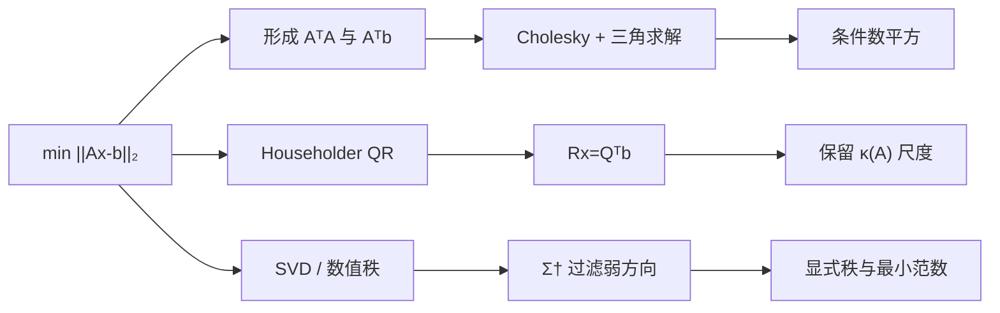

# 稳定最小二乘与正规方程的风险

> [!abstract] 本章主问题
> 正规方程 $A^TAx=A^Tb$ 在精确算术中完全正确，却把二范数条件数从 $\kappa_2(A)$ 平方为 $\kappa_2(A)^2$；因此它可能在残差看似合理时已经丢失参数的弱方向。满秩稠密问题通常以 Householder QR 为稳定基线；秩亏、近秩亏或需要最小范数与数值秩诊断时，应使用秩揭示 QR 或 SVD，并把容差当作问题定义的一部分。

先用下图回答一个视觉问题：**同一个最小二乘问题为何会有多条代数等价、数值信息却不同的执行路径？**

![[00-知识库管理/_assets/figures/numerical-analysis/fig-least-squares-stability-v2.svg|880]]

> [!figure] 图 10.8.9｜投影几何、条件数平方与最小二乘算法选择
> A 把 $b$ 分解为列空间中的投影 $Ax_\star$ 与正交残差 $r$，并用 $A^Tr=0$ 表示驻点条件；B 对比正规方程、Householder QR 与 QRCP/SVD 三条路径分别保留或损失的条件、秩与弱方向信息；C 按满秩稠密、秩不确定、最小范数/弱模态和流式/稀疏任务给出算法入口，并把 residual、正交性、rank 与参数敏感性列为交付证据。来源：独立绘制；理论接口参考 Demmel、Higham 与 LAPACK；生成脚本：[[plot_numerical_spectral_methods_v2.py]]；确定性结构示意，无随机种子。

**怎样读图。** 先读 A：最小二乘首先是正交投影问题，小残差不等于参数准确；再读 B：形成 $A^TA$ 会平方奇异值比，而正交变换保留原始尺度，QRCP/SVD 进一步显式暴露数值秩；最后读 C：算法选择由矩阵形状、秩假设和所需解的规范共同决定，结果必须用原始 $A,b$ 重算 residual 与驻点残差，并报告 rank tolerance 或正则化参数。

**适用边界（图没有证明什么）。** 图只给出稠密基线与决策骨架，不证明 QR 对所有稀疏/结构化问题都最优，也不把 SVD 说成无条件首选。$\kappa_2(A^TA)=\kappa_2(A)^2$ 针对二范数、满列秩和显式正规矩阵；缩放、正则化、迭代法与 mixed precision 会改变实现权衡。正则化还改变优化目标，不能只解释成“更稳定的求解器”。

## 学习目标

完成本章后，你应能：

1. 从几何和微分两条路线推导正规方程；
2. 证明满列秩时最小二乘解唯一，并解释秩亏时“拟合唯一、参数不唯一”的区别；
3. 用 SVD 证明 $\kappa_2(A^TA)=\kappa_2(A)^2$；
4. 手算同一个问题的正规方程与 QR 解，并检查残差正交性；
5. 解释为什么“正规方程数学正确”不推出“形成 $A^TA$ 的算法数值可靠”；
6. 区分原始残差、驻点残差、参数前向误差、后向误差和数值秩；
7. 比较 Householder QR、QRCP、完全正交分解、SVD、截断 SVD 与岭正则；
8. 处理欠定、多右端、加权和流式最小二乘；
9. 为具体矩阵形状、秩假设、精度与硬件选择算法；
10. 把这些结论迁移到线性 probe、Gauss–Newton、低秩拟合、隐式微分和训练诊断。

> [!question] 初学者读完必须能回答
> 1. 为什么 $A^Tr=0$ 同时表示几何正交与最小二乘驻点？
> 2. 为什么小 residual 不能保证 $x$ 的弱方向准确？
> 3. 形成 $A^TA$ 怎样把 $\kappa_2(A)$ 平方？
> 4. Householder QR 相比正规方程保留了什么数值信息？
> 5. 何时必须使用 QRCP、COD、SVD 或截断/正则化方法？
> 6. 欠定、秩亏与近秩亏时，“拟合解”和“最小范数参数”有何区别？
> 7. 一份可信最小二乘结果至少应报告哪些 residual、rank 与 sensitivity 证据？

## 阅读前检查

### 检查 1：问题中的对象

给定

$$
A\in\mathbb R^{m\times n},
\qquad
b\in\mathbb R^m,
$$

线性最小二乘问题是

$$
\min_{x\in\mathbb R^n}\|Ax-b\|_2.
$$

本章先讨论 $m\ge n$ 的超定问题，再推广到秩亏和 $m<n$ 的欠定问题。这里：

- $A$ 是设计矩阵或线性算子；
- $x$ 是待估参数；
- $b$ 是观测或目标；
- $r=b-Ax$ 是残差。

### 检查 2：数学解与计算结果不是同一对象

- 精确解记为 $x_\star$；
- 浮点算法返回 $\widehat x$；
- 数据本身也可能是理想数据 $(A,b)$ 的扰动 $(A+\Delta A,b+\Delta b)$。

因此至少有三个不同问题：

1. $x_\star$ 是否存在、是否唯一？
2. $x_\star$ 对数据扰动是否敏感？
3. 算法是否把额外的舍入误差控制在合理范围？

### 检查 3：本章与前置节点的分工

- [[最小二乘]]建立投影、正规方程和伪逆的数学定义；
- [[Householder 与 Givens 变换]]建立稳定 QR 的底层变换；
- 本章决定在有限精度、秩不确定和真实任务中怎样可靠求解。

## 一、为什么同一个公式会对应不同质量的算法

在精确算术中，以下表达在满列秩时给出同一个 $x_\star$：

$$
x_\star
=(A^TA)^{-1}A^Tb
=R^{-1}Q^Tb
=V\Sigma^{-1}U^Tb.
$$

但计算机并不执行抽象等号，而是执行具体路径：



执行路径改变了：

- 中间量的条件数；
- 消去与舍入方式；
- 可检测的秩信息；
- 时间、内存和数据移动；
- 返回解究竟是哪一种规范解。

> [!important] 本章主线
> 公式等价是实数代数命题；算法稳定是浮点执行命题。前者不能替代后者。

## 二、最小二乘的几何：把 $b$ 投影到列空间

$Ax$ 总位于列空间 $\mathcal R(A)$。因此最小二乘是在 $\mathcal R(A)$ 中寻找离 $b$ 最近的向量：

$$
p=Ax_\star=\operatorname{proj}_{\mathcal R(A)}b.
$$

最优残差

$$
r_\star=b-Ax_\star
$$

垂直于整个列空间。因为 $A$ 的每一列都在 $\mathcal R(A)$ 中，所以

$$
A^Tr_\star=0.
$$

代入 $r_\star=b-Ax_\star$ 得

$$
A^T(b-Ax_\star)=0,
$$

即

$$
A^TAx_\star=A^Tb.
$$

这就是正规方程（normal equations）。

> [!intuition] 为什么残差一般不为零
> 当 $b\notin\mathcal R(A)$ 时，不存在 $Ax=b$。最优性要求的不是 $r_\star=0$，而是残差已经没有任何能被 $A$ 的列方向继续解释的分量。

## 三、从目标函数微分推导正规方程

定义平方目标

$$
f(x)=\frac12\|Ax-b\|_2^2.
$$

先展开：

$$
\begin{aligned}
f(x)
&=\frac12(Ax-b)^T(Ax-b)\\
&=\frac12x^TA^TAx-x^TA^Tb+\frac12b^Tb.
\end{aligned}
$$

因为 $A^TA$ 对称，梯度为

$$
\nabla f(x)=A^TAx-A^Tb=A^T(Ax-b).
$$

驻点满足 $\nabla f(x)=0$，所以再次得到

$$
A^TAx=A^Tb.
$$

Hessian 为

$$
\nabla^2f(x)=A^TA\succeq0.
$$

因此任何驻点都是全局最小点。若 $A$ 满列秩，则对任意 $z\ne0$，

$$
z^TA^TAz=\|Az\|_2^2>0,
$$

所以 $A^TA\succ0$，目标严格凸，最小点唯一。

## 四、存在、唯一与秩：三个容易混淆的层次

### 4.1 最佳拟合向量总是唯一

有限维子空间 $\mathcal R(A)$ 是闭集，正交投影

$$
p_\star=\operatorname{proj}_{\mathcal R(A)}b
$$

总是唯一。因此最佳预测 $Ax_\star=p_\star$ 唯一。

### 4.2 参数未必唯一

若 $A$ 秩亏，存在 $z\ne0$ 使 $Az=0$。于是

$$
A(x_\star+z)=Ax_\star.
$$

所有

$$
x_\star+z,
\qquad z\in\mathcal N(A),
$$

都给出同一拟合和同一残差。

### 4.3 最小范数解增加了一个选择原则

在所有最小二乘解中，Moore–Penrose 解

$$
x_\dagger=A^\dagger b
$$

还满足

$$
x_\dagger\perp\mathcal N(A),
$$

因而具有最小二范数。它不是由“残差最小”单独决定的，而是增加了“参数范数最小”的规范。

## 五、完整手算：正规方程、QR 与残差检查

取

$$
A=
\begin{bmatrix}
1&0\\
1&1\\
1&2
\end{bmatrix},
\qquad
b=
\begin{bmatrix}
1\\2\\2
\end{bmatrix}.
$$

### 5.1 正规方程路线

计算

$$
A^TA=
\begin{bmatrix}
3&3\\
3&5
\end{bmatrix},
\qquad
A^Tb=
\begin{bmatrix}
5\\6
\end{bmatrix}.
$$

于是

$$
\begin{bmatrix}
3&3\\3&5
\end{bmatrix}
\begin{bmatrix}x_1\\x_2\end{bmatrix}
=
\begin{bmatrix}5\\6\end{bmatrix}.
$$

两式相减得到 $2x_2=1$，所以 $x_2=1/2$；代回第一式：

$$
3x_1+\frac32=5,
$$

故

$$
x_\star=
\begin{bmatrix}
7/6\\1/2
\end{bmatrix}.
$$

### 5.2 QR 路线

第一列归一化为

$$
q_1=\frac1{\sqrt3}
\begin{bmatrix}1\\1\\1\end{bmatrix}.
$$

第二列减去沿 $q_1$ 的投影：

$$
\begin{bmatrix}0\\1\\2\end{bmatrix}
-q_1q_1^T
\begin{bmatrix}0\\1\\2\end{bmatrix}
=
\begin{bmatrix}-1\\0\\1\end{bmatrix}.
$$

因此

$$
q_2=\frac1{\sqrt2}
\begin{bmatrix}-1\\0\\1\end{bmatrix},
\qquad
R=
\begin{bmatrix}
\sqrt3&\sqrt3\\
0&\sqrt2
\end{bmatrix}.
$$

又有

$$
Q^Tb=
\begin{bmatrix}
5/\sqrt3\\
1/\sqrt2
\end{bmatrix}.
$$

解三角系统 $Rx=Q^Tb$：

$$
x_2=\frac{1/\sqrt2}{\sqrt2}=\frac12,
$$

$$
x_1=\frac{5/\sqrt3-\sqrt3/2}{\sqrt3}=\frac76.
$$

### 5.3 验收残差

采用 $r=b-Ax_\star$：

$$
r_\star=
\begin{bmatrix}
-1/6\\1/3\\-1/6
\end{bmatrix}.
$$

检查

$$
A^Tr_\star=
\begin{bmatrix}
-1/6+1/3-1/6\\
1/3-2/6
\end{bmatrix}
=0.
$$

所以残差确实垂直于两列。最小残差范数为

$$
\|r_\star\|_2=\sqrt{\frac16}.
$$

## 六、核心定理：正规方程为什么平方条件数

设 $A$ 满列秩，紧致 SVD 为

$$
A=U\Sigma V^T,
\qquad
\Sigma=\operatorname{diag}(\sigma_1,\ldots,\sigma_n),
$$

其中

$$
\sigma_1\ge\cdots\ge\sigma_n>0.
$$

则

$$
\begin{aligned}
A^TA
&=(U\Sigma V^T)^T(U\Sigma V^T)\\
&=V\Sigma U^TU\Sigma V^T\\
&=V\Sigma^2V^T.
\end{aligned}
$$

因此 $A^TA$ 的特征值为 $\sigma_i^2$。于是

$$
\kappa_2(A^TA)
=\frac{\sigma_1^2}{\sigma_n^2}
=\left(\frac{\sigma_1}{\sigma_n}\right)^2
=\kappa_2(A)^2.
$$

> [!theorem] 条件数平方
> 对满列秩 $A$，有 $\kappa_2(A^TA)=\kappa_2(A)^2$。这不是误差分析的松上界，而是二范数下的精确恒等式。

### 6.1 数字意味着什么

双精度单位舍入误差约为

$$
u\approx1.11\times10^{-16}.
$$

若 $\kappa_2(A)\approx10^8$，那么

$$
u\kappa_2(A)^2\approx1.
$$

这表示正规方程在最坏方向上可能已经没有任何有效数字，而 QR 路线对应的典型放大量仍约为

$$
u\kappa_2(A)\approx10^{-8}.
$$

这些是量级诊断，不是对每个输入的精确误差预测。

## 七、形成 $A^TA$ 怎样丢失弱方向

考虑两列几乎相同的矩阵

$$
A_\varepsilon=
\begin{bmatrix}
1&1\\
\varepsilon&0\\
0&\varepsilon
\end{bmatrix}.
$$

它的 Gram 矩阵为

$$
A_\varepsilon^TA_\varepsilon=
\begin{bmatrix}
1+\varepsilon^2&1\\
1&1+\varepsilon^2
\end{bmatrix}.
$$

强方向 $(1,1)^T$ 的特征值是 $2+\varepsilon^2$；弱方向 $(1,-1)^T$ 的特征值是 $\varepsilon^2$。当 $\varepsilon^2$ 小于 $1$ 附近的浮点分辨率时，

$$
\operatorname{fl}(1+\varepsilon^2)=1,
$$

于是计算得到的 Gram 矩阵可能变为

$$
\begin{bmatrix}1&1\\1&1\end{bmatrix},
$$

弱方向被直接压成零。

> [!warning] 这里不是 Cholesky 的错
> 对已经给定的 SPD 矩阵 $G$，Cholesky 是高效稳定算法。风险来自先把原问题变成更病态的 $G=A^TA$，并在形成 $G$ 时发生消去和信息压缩。

## 八、Householder QR 怎样避免条件数平方

假设 $m\ge n$ 且 $A$ 满列秩。薄 QR 为

$$
A=QR,
\qquad
Q^TQ=I_n,
\quad R\in\mathbb R^{n\times n}
$$

且 $R$ 可逆。

把 $Q$ 补成方阵正交基 $[Q,Q_\perp]$。由于正交变换保二范数，

$$
\begin{aligned}
\|Ax-b\|_2^2
&=\left\|
\begin{bmatrix}Q^T\\Q_\perp^T\end{bmatrix}(QRx-b)
\right\|_2^2\\
&=\left\|
\begin{bmatrix}
Rx-Q^Tb\\
-Q_\perp^Tb
\end{bmatrix}
\right\|_2^2\\
&=\|Rx-Q^Tb\|_2^2+\|Q_\perp^Tb\|_2^2.
\end{aligned}
$$

第二项与 $x$ 无关，所以最优解满足

$$
Rx=Q^Tb.
$$

实际实现不显式形成完整 $Q$：

1. 用 Householder 向量紧凑存储 QR；
2. 把相同反射器依次作用到 $b$，得到 $Q^Tb$；
3. 解上三角系统。

整个过程从未形成 $A^TA$。

## 九、QR 路线的稳定性承诺与成本

标准误差分析可把计算结果解释为对邻近数据进行精确分解与求解：

$$
A+\Delta A=\widehat Q\widehat R,
\qquad
\|\Delta A\|\lesssim c(m,n)u\|A\|,
$$

且 $\widehat Q$ 接近正交。进一步的三角求解也后向稳定。因此，若问题本身不过分病态，参数前向误差通常受 $u\kappa(A)$ 尺度控制，而不是 $u\kappa(A)^2$。

> [!warning] 不要把后向稳定误读成参数永远准确
> 若 $\sigma_n(A)$ 极小，邻近矩阵也可能有完全不同的最小二乘参数。QR 能控制算法制造的扰动，却不能消除问题本身的敏感性。

对 $m\times n$、$m\ge n$ 的稠密 Householder QR，主分解成本约为

$$
2mn^2-\frac23n^3
$$

flops；只应用 $Q^T$ 到少量右端，比形成完整 $Q$ 便宜得多。

## 十、为什么“小残差”不能证明参数可靠

最小二乘中的原始残差是

$$
r=b-A\widehat x.
$$

若 $A$ 有弱奇异方向 $v_n$，则改变参数

$$
\widehat x\longmapsto\widehat x+t v_n
$$

只会让预测改变

$$
A(tv_n)=t\sigma_nu_n.
$$

当 $\sigma_n$ 很小时，即使 $t$ 很大，预测和残差也只发生很小变化。因此可能同时出现：

$$
\|A\widehat x-b\|_2\ \text{很小},
\qquad
\|\widehat x-x_\star\|_2\ \text{很大}.
$$

这不是验收程序出错，而是数据没有足够信息识别弱方向。

## 十一、问题条件性还依赖残差几何

固定 $A$，只扰动 $b$。满列秩时

$$
x_\star=A^\dagger b,
\qquad
\delta x=A^\dagger\delta b.
$$

令 $\theta$ 是 $b$ 与列空间的夹角，即

$$
\cos\theta=\frac{\|Ax_\star\|_2}{\|b\|_2}.
$$

因为

$$
\|Ax_\star\|_2\le\|A\|_2\|x_\star\|_2,
$$

有

$$
\frac{\|\delta x\|_2}{\|x_\star\|_2}
\le
\frac{\kappa_2(A)}{\cos\theta}
\frac{\|\delta b\|_2}{\|b\|_2}.
$$

这说明：

- $\kappa(A)$ 大会放大扰动；
- 若 $b$ 几乎垂直于列空间，$\cos\theta$ 很小，相对参数也很敏感；
- 对 $A$ 的扰动还会移动列空间，本质上更复杂，可能出现与 $\kappa(A)^2$ 和残差大小有关的项。

## 十二、SVD 给出秩亏问题的完整坐标

设

$$
A=U\Sigma V^T,
$$

秩为 $r$，非零奇异值为 $\sigma_1\ge\cdots\ge\sigma_r>0$。将

$$
b=\sum_{i=1}^r(u_i^Tb)u_i+b_\perp,
\qquad b_\perp\perp\mathcal R(A).
$$

最小范数解为

$$
x_\dagger
=\sum_{i=1}^r\frac{u_i^Tb}{\sigma_i}v_i.
$$

最小残差为

$$
\|b_\perp\|_2.
$$

每个可识别方向的噪声放大因子清楚地写成 $1/\sigma_i$。SVD 因而同时回答：

1. 哪些方向可由数据识别？
2. 每个方向会放大多少噪声？
3. 最小范数解怎样选择？
4. 数值秩阈值改变时，解怎样改变？

## 十三、QRCP 与完全正交分解

列主元 QR（QRCP）计算

$$
AP=Q
\begin{bmatrix}
R_{11}&R_{12}\\
0&R_{22}
\end{bmatrix},
$$

其中置换 $P$ 尝试把较独立的列移到前面。若根据容差判定 $R_{22}$ 可忽略，可再从右侧施加正交变换，得到完全正交分解

$$
AP
=Q
\begin{bmatrix}
T_{11}&0\\
0&0
\end{bmatrix}Z.
$$

这样可以求可能秩亏问题的最小范数解。

LAPACK `DGELSY` 使用这一思想，并以 `RCOND` 与条件估计决定有效秩。必须注意：

- QRCP 的普通版本通常是实用秩揭示基线；
- 它不是任意矩阵上的最优列选择保证；
- 数值秩由容差和数据尺度共同决定。

## 十四、截断 SVD：不稳定求逆变成受控丢弃

给定阈值

$$
\tau=\texttt{rcond}\cdot\sigma_1,
$$

截断 SVD（TSVD）定义

$$
x_\tau
=\sum_{\sigma_i>\tau}
\frac{u_i^Tb}{\sigma_i}v_i.
$$

舍弃 $\sigma_i\le\tau$ 的方向会：

- 增加偏差或训练残差；
- 降低参数范数和噪声放大；
- 改变有效秩；
- 使解对阈值产生分段变化。

所以 `rcond` 不是无关紧要的软件参数，而是在回答：低于什么信噪比的方向不再被视为可识别？

## 十五、岭正则：连续衰减而不是硬截断

岭回归求解

$$
\min_x\ \|Ax-b\|_2^2+\lambda\|x\|_2^2,
\qquad \lambda>0.
$$

正规方程为

$$
(A^TA+\lambda I)x=A^Tb.
$$

在 SVD 坐标中：

$$
x_\lambda
=\sum_i
\frac{\sigma_i}{\sigma_i^2+\lambda}
(u_i^Tb)v_i.
$$

滤波因子

$$
\frac{\sigma_i}{\sigma_i^2+\lambda}
$$

不会像 $1/\sigma_i$ 那样在 $\sigma_i\to0$ 时爆炸。与 TSVD 的硬阈值相比，岭正则连续地压低弱方向。

> [!warning] 正则化改变了问题
> 它不是“免费修复数值误差”，而是用偏差换稳定性。$\lambda$ 应由噪声、验证集、先验或任务代价决定，而不是只为让 Cholesky 不报错。

## 十六、欠定问题：最小残差之后还要最小范数

若 $m<n$ 且 $A$ 满行秩，则 $Ax=b$ 通常有无穷多解。最小范数解为

$$
x_\dagger=A^T(AA^T)^{-1}b.
$$

但数值实现仍不应显式形成逆。可选路线包括：

- 对 $A^T$ 做 QR；
- 对 $A$ 做 LQ；
- 使用 SVD；
- 若可能秩亏，使用完全正交分解或 SVD。

满秩超定问题的 `DGELS` 使用 QR；满秩欠定问题使用 LQ。两者都利用正交变换避免不必要的 Gram 矩阵。

## 十七、算法选择：不要只按一个“稳定性排行”

| 情形 | 首选基线 | 主要收益 | 必须报告的边界 |
|---|---|---|---|
| 稠密、满列秩、条件适中 | Householder QR / `DGELS` | 稳定、成本适中 | 不负责可靠检测近秩亏 |
| 可能秩亏，需要较快诊断 | QRCP/完全正交分解 / `DGELSY` | 给有效秩与最小范数解 | 秩揭示依赖容差，QRCP 有极端边界 |
| 严重病态、秩亏、需奇异值 | SVD / `DGELSD` | 最完整谱诊断 | 成本、内存与阈值选择 |
| 条件良好、性能压倒性重要 | 正规方程 + Cholesky | 乘法密集、常数小 | 先估计条件；不得静默跨过 $u^{-1/2}$ 区域 |
| 稀疏大规模 | 稀疏 QR、LSQR/LSMR、增广系统 | 利用稀疏和矩阵—向量乘 | 预条件、停止准则和正则化 |
| 多右端、固定 $A$ | 复用 QR/SVD 因子 | 摊薄分解成本 | 右端缩放和批量内存 |

> [!important] 一个可执行的决策顺序
> 先问秩是否可信，再问需要参数还是只需预测，再问精度目标，最后才比较 flops 与硬件吞吐。若顺序反过来，常会把最快的错误答案当成最优实现。

## 十八、加权最小二乘与白化

若观测噪声协方差为 $\Sigma_b\succ0$，广义加权目标为

$$
\min_x (Ax-b)^T\Sigma_b^{-1}(Ax-b).
$$

若 $\Sigma_b=CC^T$，则白化后问题为

$$
\min_x\|C^{-1}Ax-C^{-1}b\|_2.
$$

数值上不应显式形成 $\Sigma_b^{-1}$。应通过 Cholesky 因子解三角系统。还要检查：

- $C$ 是否病态；
- 白化是否放大测量噪声；
- 权重估计误差是否比原问题更大；
- 行缩放是否改变容差的含义。

## 十九、多右端、流式与更新问题

当

$$
B\in\mathbb R^{m\times p}
$$

包含 $p$ 个右端时，求

$$
\min_X\|AX-B\|_F.
$$

同一个 QR/SVD 因子可服务所有列。若数据按行到达，Givens 旋转可维护三角因子；删除旧样本则需要 downdate，并可能失去稳定性。

流式算法的最低契约包括：

1. 更新的是 $R$、$Q^Tb$ 还是 Gram 矩阵；
2. 是否定期重分解；
3. 遗忘因子是否造成有效条件数恶化；
4. downdate 失败怎样检测与回退。

## 二十、AI 中的直接接口

### 20.1 线性回归与线性 probe

设激活矩阵

$$
H\in\mathbb R^{N\times d},
\qquad
Y\in\mathbb R^{N\times c}.
$$

线性 probe 求

$$
\min_W\|HW-Y\|_F^2,
\qquad W\in\mathbb R^{d\times c}.
$$

当特征高度相关时，训练误差很小也不保证 $W$ 稳定。应报告：

- $H$ 的数值秩或奇异谱；
- 正则化和阈值；
- 参数范数与验证误差；
- 不同子样本下列空间是否稳定。

### 20.2 Gauss–Newton 与 Levenberg–Marquardt

非线性残差 $r(\theta)\in\mathbb R^m$ 在当前点线性化：

$$
r(\theta+\Delta)\approx r(\theta)+J\Delta,
$$

其中 $J\in\mathbb R^{m\times p}$。Gauss–Newton 子问题是

$$
\min_\Delta\|J\Delta+r\|_2.
$$

直接形成 $J^TJ$ 会平方 Jacobian 条件数。Levenberg–Marquardt 加入阻尼，但仍需区分：阻尼改善的是子问题条件性，同时改变了更新方向。

### 20.3 低秩因子拟合与交替最小二乘

固定 $U\in\mathbb R^{m\times r}$，求

$$
\min_V\|UV-M\|_F
$$

是多右端最小二乘。若 $U$ 近秩亏，更新 $V$ 会放大噪声；交替最小二乘还可能在两侧因子间产生尺度漂移。

### 20.4 模型编辑、蒸馏与层间对齐

用激活样本拟合线性映射时，解只对采样分布中的列空间负责。离开该子空间的行为由最小范数、正则化或其他先验决定，不能从训练残差外推。

## 二十一、可微最小二乘：反向传播本身也要解系统

满列秩解满足

$$
A^T(Ax-b)=0.
$$

令 $r=b-Ax$。对 $A,b,x$ 同时微分：

$$
d(A^Tr)=0.
$$

展开得到

$$
(dA)^Tr+A^T(db-dA\,x-A\,dx)=0.
$$

整理：

$$
A^TA\,dx
=A^T(db-dA\,x)+(dA)^Tr.
$$

这表明反向传播需要解与 $A^TA$ 相关的系统；近秩亏时导数会变大。可靠实现应：

- 复用 QR/SVD 因子或调用求解器，而非形成显式逆；
- 在秩变化处承认导数可能不连续或不存在；
- 将正则化、阈值和 QR/SVD 符号约定纳入计算图契约。

## 二十二、最小二乘的最低验收指标

设计算结果为 $\widehat x$，残差为

$$
\widehat r=b-A\widehat x.
$$

至少报告：

### 22.1 原始相对残差

$$
\eta_r=\frac{\|\widehat r\|_2}{\|A\|_2\|\widehat x\|_2+\|b\|_2}.
$$

它衡量拟合程度，但不能单独证明驻点性或参数准确性。

### 22.2 驻点残差

$$
\eta_g
=\frac{\|A^T\widehat r\|_2}{\|A\|_2\|\widehat r\|_2}.
$$

它检查残差是否接近垂直于列空间。若 $\widehat r=0$，应单独处理分母。

### 22.3 数值秩与阈值

报告

$$
\widehat r_{\mathrm{num}},
\qquad
\tau,
\qquad
\widehat\sigma_1,
\qquad
\widehat\sigma_{r}.
$$

不能只输出一个没有容差的“rank”。

### 22.4 条件估计与参数范数

记录 $\widehat\kappa(A)$ 或 `RCOND`、$\|\widehat x\|$、正则化参数及不同阈值下解的变化。

### 22.5 算法状态

报告分解是否成功、是否检测到秩亏、是否发生缩放、迭代是否达到停止准则，以及 LAPACK `INFO` 等状态码。

## 二十三、实验：三个量为何不可互换

[[实验 - 正规方程、QR 与截断 SVD 的稳定性]]使用

$$
A_\varepsilon=
\begin{bmatrix}
1&1\\\varepsilon&0\\0&\varepsilon
\end{bmatrix}
$$

隔离弱方向，并比较正规方程、Householder QR 与结构化 SVD。

实验显示：

1. 正规方程的参数误差随 $\kappa(A)^2$ 尺度上升，并在 $\kappa(A)\approx u^{-1/2}$ 附近丢失弱方向；
2. QR 与不形成 Gram 矩阵的 SVD 路线把误差保持在舍入地板附近；
3. 原始残差相近时，参数误差仍可相差许多数量级；
4. TSVD 舍弃弱方向会增加残差，却降低解范数和噪声放大。

> [!experiment] 证据等级
> 这些结果只针对确定性构造矩阵与脚本实现；一般结论由条件数恒等式、QR 后向稳定性与 SVD 理论承担。

## 二十四、常见失败模式

| 失败模式 | 错在哪里 | 修正 |
|---|---|---|
| 写 `inv(A.T@A)@A.T@b` | 显式逆且形成 Gram 矩阵 | 调用 QR/SVD/专用 least-squares 驱动 |
| 只看 $\|Ax-b\|$ | 弱方向可隐藏巨大参数误差 | 同时报驻点残差、条件估计和解范数 |
| 把 `rank` 当精确事实 | 数值秩依赖阈值与尺度 | 报告 `rcond`、奇异值和敏感性 |
| Cholesky 失败就加很小正则 | 正则化改变目标且尺度未校准 | 按噪声和任务选择 $\lambda$，记录偏差 |
| 认为 SVD 自动解决统计问题 | SVD 只揭示线性代数结构 | 仍需处理数据偏差、过拟合与分布漂移 |
| 在反向传播中显式求逆 | 放大病态并浪费计算 | 复用分解、解伴随系统 |
| 忽略库状态码 | 未收敛或秩亏结果被当成功 | 检查 `INFO/rank/residual` |

## 二十五、可信最小二乘报告模板

```text
problem: m, n, nrhs, dtype, sparse/dense
model: unweighted / weighted / regularized
solver: QR / QRCP / SVD / iterative / normal equations
rank contract: assumed full rank or estimated; rcond/tolerance
scale: ||A||, ||b||, equilibration/whitening
diagnostics: residual, stationarity, rank, condition estimate, ||x||
regularization: type, lambda/cutoff, selection rule
status: convergence/info code/fallback
reproducibility: library, version, seed, hardware
```

## 二十六、掌握检查

完成本章后，你应能不看正文回答：

1. 为什么正规方程在精确算术中正确？
2. 为什么 $A^TA$ 会平方二范数条件数？
3. 为什么小原始残差不能证明参数准确？
4. 满列秩、近秩亏和欠定问题分别应怎样选择算法？
5. QRCP 的“rank revealing”有什么边界？
6. TSVD 与岭回归怎样分别过滤弱奇异方向？
7. 可微最小二乘为什么在秩变化处困难？
8. 一个可信求解报告至少包含哪些量？

配套训练：

- [[习题 - 稳定最小二乘与正规方程的风险]]；
- [[解答 - 稳定最小二乘与正规方程的风险]]；
- [[实验 - 正规方程、QR 与截断 SVD 的稳定性]]。

## 二十七、课程闭环与后继

- 前置数值构件：[[Householder 与 Givens 变换]]；
- 数学基础：[[最小二乘]]、[[Moore-Penrose 伪逆]]、[[奇异值分解]]；
- 下一节点：[[幂法、反幂法与 Rayleigh 商迭代]]；
- 大规模后继：[[Lanczos 方法]]、[[Arnoldi 方法]]、[[随机化低秩近似与随机 SVD]]。

## 来源与证据边界

- [[S-2023-Demmel-最小二乘数值算法]]：正规方程、Householder QR、SVD 与算法选择主线；
- [[S-2025-LAPACK-最小二乘驱动]]：`DGELS/DGELSY/DGELSD` 的秩、最小范数与软件契约；
- [[S-2002-Higham-数值算法准确性与稳定性]]：浮点误差、后向稳定性与条件性框架；
- [[S-2024-Su-10366-低秩近似之路（一）伪逆]]：低秩拟合中单侧最小二乘与伪逆入口；
- [[S-2024-Su-10407-低秩近似之路（二）SVD]]：SVD、低秩与 Gram 构造数值边界。

经典定理与软件接口由 A 级教材、课程和官方文档承担；科学空间用于问题组织和 AI/低秩桥梁。实验不证明一般稳定性定理，性能结论也不外推到未测硬件。
