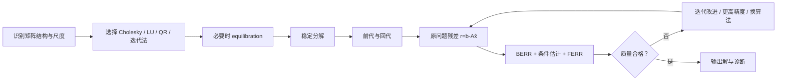

# 稳定求解线性方程组

> [!abstract] 本章主问题
> 对一般稠密方阵，可靠求解不是把 $x=A^{-1}b$ 直译成代码，而是：根据结构与尺度选择分解，用选主元控制消元乘子和元素增长，通过稳定三角求解得到候选解，再用尺度化残差、后向误差和条件估计解释前向精度；必要时用更高精度残差做迭代改进。部分选主元 LU 通常可靠，但其保证取决于 pivot growth，不能被简化成“永远后向稳定”。

先用下图回答一个视觉问题：**从选结构、pivoted factorization 到 BERR/FERR，一次可靠线性求解需要交付哪些证据？**

![[00-知识库管理/_assets/figures/numerical-analysis/fig-pivoting-linear-solve-v2.svg|880]]

> [!figure] 图 10.8.6｜线性求解流水线、pivot growth 与解质量证书
> A 将 structure recognition、equilibration、factorization、triangular solve 和 residual validation 串成求解流水线；B 用 $2\times2$ small-pivot 例子说明 partial pivoting 如何交换行并控制 multipliers，同时保留 $U$ 元素增长风险；C 从原始 $A,b$ 重算 true residual，再分别形成 componentwise BERR 与 condition-informed FERR。来源：独立绘制；理论接口参考 Higham、Demmel 与 LAPACK；生成脚本：[[plot_numerical_direct_methods_v2.py]]；确定性结构示意，无随机种子。

**怎样读图。** A 每一步都要保留原问题尺度，不能用 factorization success 代替最终验收；B 先检查 pivot 大小与交换，再检查 $|L||U|$ 或 growth factor，不能把 $|l_{ik}|\le1$ 误当成完整稳定性证明；C 用原始数据重算 residual，BERR 回答“精确解了多近的问题”，FERR 再结合 condition estimate 回答“解可能离真解多远”。

**适用边界（图没有证明什么）。** $2\times2$ 例子只说明 small pivot 机制；GEPP 在实践中通常可靠，但存在大 growth 的构造。Equilibration 改变坐标尺度，不消除原问题固有敏感性。BERR/FERR 依赖允许扰动模型、norm/scale 与估计器质量；矩阵奇异、近秩亏、稀疏 pivoting 和结构化问题可能需要 QR、SVD、rook/threshold pivoting 或专用求解器。

## 学习目标

学完本章，应能独立完成以下任务：

1. 从 $Ax=b$ 的代数解法写出“选结构—分解—三角求解—验收”的数值流水线；
2. 用一个条件良好的 $2\times2$ 系统解释无主元消元为何会因小 pivot 失败；
3. 手算部分选主元并正确处理 $P A=L U$ 与 $Pb$；
4. 推导三角求解和 LU 分解的分量型后向误差形式；
5. 解释 $|L||U|$、经典元素增长因子 $\rho$ 与最终后向误差的关系；
6. 区分无主元、部分、完全、rook、threshold pivoting 的目的与代价；
7. 计算 normwise/componentwise backward error，并结合条件数解释 forward error；
8. 说明 equilibration 改变的是求解坐标与尺度，而不是凭空消除原问题敏感性；
9. 推导迭代改进的一步误差递推，说明高精度残差为何关键；
10. 为隐式层、二阶优化、协方差系统和混合精度批量求解设计验收报告。

> [!question] 初学者读完必须能回答
> 1. 为什么数值实现应解分解后的系统，而不是显式计算 $A^{-1}$？
> 2. Small pivot 怎样放大消元 multiplier，partial pivoting 如何缓解？
> 3. $|L||U|$ 与 pivot growth $\rho$ 怎样进入 LU 后向误差？
> 4. 为什么“GEPP 总是后向稳定”不是无条件定理？
> 5. True residual、normwise/componentwise BERR 与 FERR 分别衡量什么？
> 6. Equilibration 能改善数值尺度，却为何不能消除 intrinsic condition number？
> 7. 何时应回退到 stronger pivoting、QR、SVD、iterative refinement 或更高精度？

## 阅读前检查

### 检查 1：精确 LU 流水线

若

$$
P A=L U,
$$

则

$$
Ax=b
\iff
LUx=Pb.
$$

先解

$$
Ly=Pb,
$$

再解

$$
Ux=y.
$$

代数构造、复杂度与多右端复用见[[线性方程组、消元与 LU 分解]]。

### 检查 2：线性系统条件数

在相容范数下，

$$
\kappa(A)=\|A\|\,\|A^{-1}\|.
$$

$\kappa(A)$ 属于问题，不属于 LU 实现。若 $\kappa(A)$ 很大，即使算法后向误差只有 $O(u)$，解的相对前向误差仍可能达到 $O(\kappa(A)u)$。

### 检查 3：残差与后向误差

对候选解 $\widehat x$，取

$$
r=b-A\widehat x.
$$

残差有单位，必须经过 $A,\widehat x,b$ 的尺度归一化后，才成为某个明确扰动模型下的后向误差。见[[前向误差与后向误差]]。

## 对象、符号与层次

| 符号 | 含义 |
|---|---|
| $A\in\mathbb F^{n\times n}$ | 原系数矩阵，本章默认非奇异 |
| $b,x\in\mathbb F^n$ | 右端与精确解，满足 $Ax=b$ |
| $P$ | 行置换矩阵 |
| $\widehat L,\widehat U$ | 浮点计算得到的 LU 因子 |
| $\widehat x$ | 实际计算解 |
| $r=b-A\widehat x$ | 使用原始 $A,b$ 重新计算的真实残差 |
| $u$ | 工作算术的单位舍入误差 |
| $\gamma_n=nu/(1-nu)$ | 长度 $n$ 误差累积的标准上界，要求 $nu<1$ |
| $\rho$ | 消元过程中元素的经典 pivot growth factor |
| $g$ | $\|\,|L||U|\,\|/\|A\|$ 型 growth factor |
| `BERR` | 分量型后向误差估计 |
| `FERR` | 前向误差界/估计，通常需要条件信息 |

本章严格区分四个层次：

1. **原问题**：$Ax=b$ 是否可逆、条件如何；
2. **分解**：计算的 $\widehat L,\widehat U$ 离 $PA$ 多远；
3. **三角求解**：前代/回代对因子的误差有多大；
4. **最终验收**：$\widehat x$ 对原始 $A,b$ 的后向和前向质量如何。

## 一、可靠线性求解不是一条公式

数学上可写

$$
x=A^{-1}b.
$$

数值上，推荐思维是：



“求得一个向量”与“得到可信解”之间，差的正是后半条验收链。

### 1.1 为什么不默认显式求逆

形成 $A^{-1}$ 再乘 $b$：

- 需要更多计算和存储；
- 把一次求解变成求出全部逆矩阵列；
- 增加额外舍入和数据移动；
- 隐式微分和多右端问题本来就可直接复用因子。

“不要显式求逆”是默认工程原则，不是说逆矩阵永远算不准。若任务本身需要 $A^{-1}$，应使用专门算法和误差分析；若只需要 $A^{-1}b$，应调用 `solve` 语义。

### 1.2 先利用结构

| 矩阵/任务 | 首选路线 | 原因 |
|---|---|---|
| 一般稠密方阵 | 带主元 LU | 成本约 $\tfrac23n^3$，可复用多右端 |
| Hermitian 正定 | Cholesky | 约一半 LU 成本，不需一般行 pivot |
| 三角矩阵 | 前代/回代 | 已处于最简结构 |
| 超定最小二乘 | Householder QR | 避免无条件形成 $A^TA$ |
| 秩亏/严重病态 | SVD 或秩揭示分解 | 需要显式识别有效秩 |
| 大规模稀疏 | 稀疏直接或 Krylov + 预条件 | 内存、fill-in 与矩阵—向量乘主导 |

本章聚焦一般稠密方阵和 LU；其他结构只做算法选择边界。

## 二、消元为何会放大舍入误差

第 $k$ 步消元用 pivot $a_{kk}^{(k)}$ 形成乘子

$$
\ell_{ik}
=\frac{a_{ik}^{(k)}}{a_{kk}^{(k)}},
\qquad i>k,
$$

并更新尾随子矩阵

$$
a_{ij}^{(k+1)}
=a_{ij}^{(k)}-\ell_{ik}a_{kj}^{(k)}.
$$

若 pivot 很小而其下方元素正常，$|\ell_{ik}|$ 很大。更新就变成两个大数相减：

$$
\text{原本 }O(1)\text{ 的元素}
-\text{一个 }O(|\ell_{ik}|)\text{ 的乘积}.
$$

即使精确结果最终仍为 $O(1)$，中间量已放大局部舍入。小 pivot 的危险不是“除法本身神秘”，而是它制造巨大 multiplier 和后续消去。

## 三、贯穿全章的条件良好反例

考虑

$$
A_\varepsilon=
\begin{bmatrix}
\varepsilon&1\\
1&1
\end{bmatrix},
\qquad
b=\begin{bmatrix}1\\2\end{bmatrix},
\qquad
0<\varepsilon\ll1.
$$

### 3.1 原问题并不病态

$$
A_\varepsilon^{-1}
=\frac1{\varepsilon-1}
\begin{bmatrix}
1&-1\\
-1&\varepsilon
\end{bmatrix}.
$$

在无穷范数下，$\|A_\varepsilon\|_\infty=2$，且小 $\varepsilon$ 时

$$
\|A_\varepsilon^{-1}\|_\infty
=\frac2{1-\varepsilon}.
$$

因此

$$
\kappa_\infty(A_\varepsilon)
=\frac4{1-\varepsilon}
\to4.
$$

它是条件良好的问题。若算法失败，不能怪条件数。

### 3.2 精确解

由

$$
\begin{cases}
\varepsilon x_1+x_2=1,\\
x_1+x_2=2,
\end{cases}
$$

相减得

$$
(1-\varepsilon)x_1=1.
$$

所以

$$
x_1=\frac1{1-\varepsilon},
\qquad
x_2=\frac{1-2\varepsilon}{1-\varepsilon}.
$$

二者都接近 1。

### 3.3 无主元消元

第一步乘子为

$$
\ell_{21}=\frac1\varepsilon.
$$

更新后

$$
U=
\begin{bmatrix}
\varepsilon&1\\
0&1-\varepsilon^{-1}
\end{bmatrix}.
$$

当 $\varepsilon=10^{-4}$，$\ell_{21}=10^4$，中间量从 $O(1)$ 膨胀到 $O(10^4)$。

### 3.4 三位十进制浮点手算

取 $\varepsilon=10^{-4}$，每步只保留 3 位有效数字：

$$
\ell_{21}=1.00\times10^4.
$$

于是

$$
u_{22}
=\operatorname{fl}(1-10^4)
=-1.00\times10^4,
$$

前代右端

$$
y_2
=\operatorname{fl}(2-10^4\cdot1)
=-1.00\times10^4.
$$

回代得到

$$
\widehat x_2=1,
\qquad
\widehat x_1
=\operatorname{fl}\frac{1-1}{10^{-4}}
=0.
$$

算法返回 $(0,1)^T$，而真解约为 $(1.0001,0.9999)^T$。一个条件数约 4 的问题，因执行路径失去约一半解分量。

### 3.5 部分选主元修复路径

先交换两行：

$$
PA_\varepsilon
=\begin{bmatrix}
1&1\\
\varepsilon&1
\end{bmatrix},
\qquad
Pb=\begin{bmatrix}2\\1\end{bmatrix}.
$$

此时

$$
\ell_{21}=\varepsilon,
\qquad
u_{22}=1-\varepsilon,
$$

所有中间量保持 $O(1)$。三位算术会得到接近 $(1,1)^T$ 的结果，与工作精度和问题条件性相符。

> [!important] 反例的逻辑
> 同一个 $A,b$、同一个精确问题、相同工作精度，只改变 pivot 顺序，结果从严重错误变为自然精度。因此这是算法稳定性差异，不是问题条件性差异。

## 四、部分选主元 Gaussian 消元（GEPP）

第 $k$ 步在当前列中选择

$$
p=\arg\max_{i=k,\ldots,n}|a_{ik}^{(k)}|,
$$

交换第 $k,p$ 行，再进行消元。

### 4.1 为什么它限制乘子

交换后，

$$
|a_{kk}^{(k)}|
=\max_{i\ge k}|a_{ik}^{(k)}|.
$$

所以

$$
|\ell_{ik}|
=\left|
\frac{a_{ik}^{(k)}}{a_{kk}^{(k)}}
\right|
\le1.
$$

这阻断了第三节中 $1/\varepsilon$ 型巨大乘子。

### 4.2 原地存储伪代码

```text
for k = 1,...,n-1
    p = argmax_{i=k,...,n} |A[i,k]|
    if A[p,k] == 0: declare singular
    swap rows k and p in A; record pivot p
    A[k+1:n,k] /= A[k,k]                    # multipliers: L below diagonal
    A[k+1:n,k+1:n] -= A[k+1:n,k] A[k,k+1:n] # trailing update
end
```

程序通常把 $L$ 的严格下三角和 $U$ 的上三角放在同一数组中，$L$ 的单位对角不显式存储。置换用 pivot 索引数组保存，而不是形成稠密 $P$。

### 4.3 求解阶段

1. 对 $b$ 应用记录的行交换，得到 $Pb$；
2. 解 $Ly=Pb$；
3. 解 $Ux=y$。

漏掉第 1 步会解错问题。若有多个右端 $B$，同一因子和 pivot 序列可复用。

### 4.4 成本

稠密 $n\times n$：

- LU 分解约 $\frac23n^3$ flops；
- 每个右端的两次三角求解约 $2n^2$ flops；
- pivot 搜索约 $O(n^2)$ 比较，但在现代硬件上还会影响通信和并行。

## 五、三角求解本身的后向稳定性

假设 $T$ 是非奇异三角矩阵，使用标准前代或回代得到 $\widehat x$。

> [!theorem] 三角求解的分量后向误差
> 在无溢出且 $nu<1$ 的标准浮点模型下，计算结果满足
> $$
> (T+\Delta T)\widehat x=b,
> \qquad
> |\Delta T|\le\gamma_n |T|,
> $$
> 其中 $\Delta T$ 保持同一三角零结构。

### 5.1 证明骨架

回代第 $i$ 行计算

$$
\widehat x_i
=\operatorname{fl}\left(
\frac{b_i-\sum_{j=i+1}^{n}t_{ij}\widehat x_j}{t_{ii}}
\right).
$$

点积和减法的局部舍入可以吸收到该行系数 $t_{ij}$ 的小相对扰动中；除法舍入再吸收到 $t_{ii}$。逐行合并后，得到一个同为三角的 $T+\Delta T$，使计算向量精确满足扰动系统。

### 5.2 后向稳定仍不保证三角系统前向准确

若 $T$ 本身病态，$O(u)$ 系数扰动仍可使解变化 $O(\kappa(T)u)$。三角求解稳定说明实现没有额外制造远超工作精度的误差，不说明 $T$ 条件良好。

## 六、LU 因子分解的后向误差

浮点 GE 计算出的因子一般不会严格满足

$$
PA=\widehat L\widehat U.
$$

正确问法是：需要把原矩阵改动多少，计算因子才成为精确分解？

> [!theorem] LU 因子分解误差的标准形式
> 在标准模型和适用规模条件下，存在 $\Delta A$，使
> $$
> P A+\Delta A
> =\widehat L\widehat U,
> $$
> 且一阶分量界具有形式
> $$
> |\Delta A|
> \lesssim
> \gamma_n\,|\widehat L|\,|\widehat U|.
> $$

不同实现、阻塞方式和常数会改变精确的 $\gamma$ 下标，但结构始终重要：误差尺度由 $|L||U|$，而不是只由 $|A|$ 控制。

### 6.1 为什么出现 $|L||U|$

矩阵乘法的每个元素是长度至多 $n$ 的点积。若把计算的 Schur complement 更新理解为局部外积/矩阵乘，浮点点积误差自然产生

$$
|\operatorname{fl}(LU)-LU|
\lesssim\gamma_n|L||U|.
$$

若因子元素因 pivot 路径变得巨大，即使最终 $LU$ 中发生精确抵消，绝对值乘积 $|L||U|$ 不会抵消，于是误差界放大。

### 6.2 因子残差的验收

可计算

$$
\eta_{LU}
=\frac{\|PA-\widehat L\widehat U\|}
{\|A\|},
$$

或更贴近分量界的

$$
\omega_{LU}
=\max_{ij}
\frac{|(PA-\widehat L\widehat U)_{ij}|}
{(|\widehat L||\widehat U|)_{ij}},
$$

对零分母需要安全处理。$\eta_{LU}$ 小说明因子重构好；它仍不是最终 $x$ 的完整验收，因为三角求解还会产生误差。

## 七、把分解与三角求解误差合并

设

$$
PA+\Delta A_F=\widehat L\widehat U
$$

是因子分解误差。浮点前代和回代分别可解释为

$$
(\widehat L+\Delta L)\widehat y=Pb,
$$

$$
(\widehat U+\Delta U)\widehat x=\widehat y.
$$

代入：

$$
Pb
=(\widehat L+\Delta L)
(\widehat U+\Delta U)\widehat x.
$$

展开：

$$
Pb
=\left(
\widehat L\widehat U
+\Delta L\widehat U
+\widehat L\Delta U
+\Delta L\Delta U
\right)\widehat x.
$$

再用 $\widehat L\widehat U=PA+\Delta A_F$，可合并为

$$
(A+\Delta A_S)\widehat x=b,
$$

其中一阶上

$$
|\Delta A_S|
\lesssim
c_n u\,P^T|\widehat L||\widehat U|,
$$

$c_n$ 为 $O(n)$ 的规模因子；经典教学近似常写成约 $3 n u$ 乘 $|L||U|$。

> [!important] 整个求解后向稳定的关键
> 三角求解各自后向稳定还不够。只有当 $|L||U|$ 相对 $|A|$ 没有过度增长，合并后的 $\Delta A_S$ 才是原矩阵尺度上的小扰动。

## 八、两个 growth factor，不要混称

文献中“增长因子”有相关但不同的定义。本库同时保留两种。

### 8.1 经典元素增长因子

令 $a_{ij}^{(k)}$ 表示第 $k$ 步消元时尾随矩阵元素，定义

$$
\rho
=\frac{
\max_{i,j,k}|a_{ij}^{(k)}|
}{
\max_{i,j}|a_{ij}|
}.
$$

它直接测量消元中间量相对原始最大元素放大多少。

### 8.2 因子型增长量

对所选范数定义

$$
g
=\frac{
\|\,|\widehat L||\widehat U|\,\|
}{
\|A\|
}.
$$

它直接进入前一节的后向误差界。

### 8.3 两者关系

部分选主元使 $|\ell_{ik}|\le1$，因而 $L$ 不会出现第三节的巨大乘子；但 $U$ 的元素仍可能在更新中增长。$\rho$ 控制这种内部最大元素，$g$ 同时综合 $L,U$ 和所选范数。它们通常同趋势，但数值和常数不必相同。

### 8.4 后向—前向误差链

若求解后向误差满足

$$
\frac{\|\Delta A_S\|}{\|A\|}
\lesssim c_n g u,
$$

则一阶前向误差预算为

$$
\boxed{
\frac{\|\widehat x-x\|}{\|x\|}
\lesssim
\kappa(A)c_n g u
}
$$

这条式子把三个来源清晰分开：

- $u$：算术精度；
- $c_n g$：算法路径与规模；
- $\kappa(A)$：问题敏感性。

## 九、部分选主元为何“通常可靠但非无条件完美”

### 9.1 好消息：乘子受控

GEPP 保证

$$
|\ell_{ik}|\le1.
$$

对大量实际矩阵，$\rho$ 和 $g$ 较温和，因此后向误差接近 $O(nu)$ 量级。

### 9.2 坏消息：最坏增长可指数级

经典构造矩阵可使 GEPP 达到

$$
\rho=2^{n-1}.
$$

于是形式上

$$
n u\rho
$$

可能很快不再小。这个最坏界非常悲观，却是真实可构造的；因此严谨说法是：

> GEPP 在实践中通常具有很好的后向稳定性，但其最坏情况保证受 pivot growth 影响，不存在对所有矩阵都温和的简单 $O(nu)$ 范数界。

### 9.3 最坏界大不等于每次实际误差都大

误差界使用绝对值去掉了舍入之间的抵消，通常高估实际误差；某些增长矩阵在特定浮点中甚至可能因二进制幂恰好可表示而表现得比界好。growth 是**风险与理论上界指标**，不是实际错误的同义词。

### 9.4 应该怎么做

- 默认一般稠密系统使用成熟库的 GEPP/专家驱动；
- 报告 residual、BERR、条件估计，必要时估计 pivot growth；
- 对已知对抗结构、极端缩放或高可靠需求，考虑更强 pivoting、缩放、更高精度或独立验证；
- 不要仅凭“多数随机矩阵表现好”抹去最坏边界。

## 十、pivoting 策略比较

| 策略 | 搜索范围 | 优点 | 代价/边界 |
|---|---|---|---|
| 无主元 | 不搜索 | 最少通信；某些结构可安全使用 | 一般矩阵可被小 pivot 摧毁 |
| 部分选主元 GEPP | 当前列 | 标准、便宜，乘子绝对值 ≤ 1 | 最坏 growth 指数级；行交换影响并行 |
| scaled partial | 按行尺度比较当前列 | 尺度差异大时 pivot 决策更合理 | 缩放标准本身需定义；非普遍更优定理 |
| 完全选主元 GECP | 整个尾随子矩阵 | 更强 worst-case growth 控制 | 搜索、通信和列置换昂贵 |
| rook pivoting | 交替找行/列局部最大 | 完全与部分之间的折中 | 实现和置换更复杂 |
| threshold pivoting | 接受超过阈值的候选 | 稀疏/并行中兼顾稳定与 fill-in | 阈值改变稳定—稀疏—通信权衡 |

### 10.1 为什么不能总用 complete pivoting

数值算法不仅优化 flops，还受内存访问、通信、稀疏 fill-in 和并行同步限制。更强搜索可能比算术本身更贵。工程目标是选择足够的稳定性，而不是把 pivot 搜索做到理论最强。

### 10.2 何时可以不 pivot

不是因为“对角非零”就安全，而是因为结构定理提供保证。例如：

- 对称正定矩阵用[[Cholesky 分解]]；
- 某些严格对角占优矩阵；
- 特定 M-matrix 或已知稳定结构；
- 算法通过别的正交/酉变换避免消元增长。

每一种都需要具体定理，不能把结构经验推广到任意矩阵。

## 十一、缩放与 equilibration

若行列量级跨越许多数量级，pivot 比较和 normwise 误差可能被尺度主导。可引入对角矩阵 $D_r,D_c$：

$$
\widetilde A=D_r A D_c,
\qquad
\widetilde b=D_r b,
\qquad
x=D_c\widetilde x.
$$

然后求解

$$
\widetilde A\widetilde x=\widetilde b.
$$

### 11.1 equilibration 能做什么

- 把各行/列幅值搬到相近范围；
- 改善 pivot 选择的尺度公平性；
- 减少上溢/下溢风险；
- 有时改善 normwise 条件估计和后向误差解释。

### 11.2 它不能做什么

- 不保证消除接近线性相关；
- 不保证任意范数条件数下降；
- 不改变“求解原系统”的最终语义，必须正确反缩放；
- 若业务上每个分量尺度有固定物理意义，还需同时报告原坐标中的误差。

LAPACK 专家驱动会根据行列尺度判断是否 equilibration，并在输出前把解变回原系统坐标。

## 十二、最终解的后向误差

### 12.1 normwise 联合后向误差

对

$$
r=b-A\widehat x,
$$

常用

$$
\eta_{\mathrm{norm}}
=\frac{\|r\|}
{\|A\|\,\|\widehat x\|+\|b\|}.
$$

它回答：允许 $A,b$ 在所选范数中共同相对扰动时，$\widehat x$ 离某个邻近问题精确解有多远。

### 12.2 componentwise backward error

定义

$$
\eta_{\mathrm{comp}}
=\max_i
\frac{|r_i|}
{(|A||\widehat x|+|b|)_i}.
$$

它逐行按实际分量尺度归一化，能发现小方程被大行范数掩盖的问题。软件实现还会对极小分母加入 underflow-safe 修正。

### 12.3 为什么用原始 $A,b$ 重算 residual

因子残差回答“分解好不好”，而最终 residual 必须回答“输出是否满足原问题”。若只用已经舍入、equilibrated 或被覆盖的因子内部量计算残差，可能漏掉数据变换和存储误差。

### 12.4 真实 residual 与递推 residual

迭代过程中的递推残差可能随轮数与 $b-Ax$ 漂移。验收时应周期性用原始数据重新计算真实残差，最好使用不低于解更新精度的累加。

## 十三、从 BERR 到 FERR：条件估计不可缺席

后向误差小只说明 $\widehat x$ 精确解了邻近系统。要估计它离原解多远，还需条件信息。

### 13.1 范数型有限扰动界

若

$$
(A+\Delta A)\widehat x=b,
\qquad
\eta=\frac{\|\Delta A\|}{\|A\|},
$$

并且

$$
\kappa(A)\eta<1,
$$

则可得到类似

$$
\frac{\|\widehat x-x\|}{\|x\|}
\le
\frac{\kappa(A)\eta}{1-\kappa(A)\eta}.
$$

当 $\kappa(A)\eta\ll1$，退化为熟悉的一阶关系

$$
\frac{\|\widehat x-x\|}{\|x\|}
\lesssim\kappa(A)\eta.
$$

### 13.2 推导

由

$$
A x=(A+\Delta A)\widehat x=b,
$$

得到

$$
A(x-\widehat x)=\Delta A\widehat x.
$$

因此

$$
\|x-\widehat x\|
\le\|A^{-1}\|\,\|\Delta A\|\,\|\widehat x\|
\le\kappa(A)\eta\,\|\widehat x\|.
$$

又因为

$$
\|\widehat x\|
\le\|x\|+\|\widehat x-x\|,
$$

移项即得分母 $1-\kappa(A)\eta$。

### 13.3 不显式形成 $A^{-1}$ 的条件估计

精确计算 $\kappa(A)$ 通常需要昂贵范数/奇异值信息。成熟实现利用已有 LU 因子，通过反复求解 $A v$、$A^T v$ 相关系统估计 $\|A^{-1}\|_1$ 或无穷范数条件量，只需 $O(n^2)$ 级额外工作，不显式形成逆矩阵。

### 13.4 `RCOND`、`BERR`、`FERR`

软件接口常报告：

- `RCOND`：倒条件数估计，接近机器精度时表示解可能没有可信相对数字；
- `BERR`：分量型后向误差；
- `FERR`：前向误差界/估计，结合条件与残差信息。

字段的精确定义随例程和版本变化，应查对应官方文档；不能仅凭变量名假设范数和概率意义。

## 十四、迭代改进：用残差校正已有解

给定初始解 $x_0$，第 $k$ 步：

1. 计算真实残差
   $$
   r_k=b-Ax_k;
   $$
2. 用已有因子近似解校正方程
   $$
   A d_k=r_k;
   $$
3. 更新
   $$
   x_{k+1}=x_k+d_k.
   $$

### 14.1 精确算术为什么一步结束

若校正方程精确求解，

$$
d_k=A^{-1}(b-Ax_k)=x-x_k,
$$

所以

$$
x_{k+1}=x.
$$

需要多步完全是因为残差、校正求解和更新都在有限精度中。

### 14.2 误差递推

设校正求解器等价于解

$$
(A+E_k)\widehat d_k=r_k.
$$

记 $e_k=x-x_k$，则精确残差 $r_k=Ae_k$。于是

$$
\widehat d_k=(A+E_k)^{-1}Ae_k.
$$

新误差为

$$
e_{k+1}
=e_k-\widehat d_k
=\left[I-(A+E_k)^{-1}A\right]e_k
=(A+E_k)^{-1}E_k e_k.
$$

所以收缩因子粗略受

$$
\|(A+E_k)^{-1}E_k\|
\approx
\kappa(A)\frac{\|E_k\|}{\|A\|}
$$

控制。

### 14.3 为什么 residual 最好用更高精度

当 $x_k$ 已接近 $x$ 时，$b$ 与 $Ax_k$ 很接近。若仍用低精度计算

$$
r_k=b-Ax_k,
$$

小 residual 可能被舍入噪声淹没，改进停在低精度地板。用更高精度乘加计算 residual，能向校正方程提供仍有意义的小误差信号。

### 14.4 经典适用条件

理想化地，若低精度求解器的相对后向误差为 $O(u_f)$，常见充分条件具有

$$
\kappa(A)u_f<1
$$

的形式；最终精度还受 residual 精度 $u_r$、解更新精度 $u$ 和分量尺度影响。现代 mixed-precision refinement 可使用更精细条件或 Krylov 内层扩展适用范围，但不能无条件跨越低精度因子已经数值奇异的情形。

### 14.5 停止准则

不要只固定迭代次数。可同时检查：

- `BERR` 是否低于目标；
- correction $\|d_k\|/\|x_k\|$ 是否足够小；
- residual 是否停滞或反弹；
- 条件估计是否说明目标前向精度可达；
- 是否出现 `NaN/inf`、低精度 singular pivot 或不可靠缩放。

## 十五、混合精度求解的完整误差账本

设：

- $u_f$：因子分解精度；
- $u_s$：三角校正求解精度；
- $u_r$：residual 计算精度；
- $u_x$：解存储与更新精度。

完整报告应说明：

1. 原始 $A,b$ 的存储格式；
2. 送入低精度因子的量化/转换误差；
3. pivot 搜索在哪个格式中比较；
4. GEMM/update 使用的乘法和累加精度；
5. residual 是否用原始高精度 $A,b$；
6. correction 和 update 的格式；
7. overflow、underflow、saturation 与 flush-to-zero 语义。

### 15.1 为什么低精度 LU + 高精度 residual 可以更快

LU 是 $O(n^3)$ 主成本，低精度硬件吞吐更高；每轮 residual 和三角校正约为 $O(n^2)$ 每右端。若迭代轮数很少，就能用便宜因子获得接近高精度的最终解。

### 15.2 性能不是稳定性的证据

加速比、训练 loss 或一次求解成功不能替代：

- 低精度因子的 pivot growth；
- 原坐标 BERR；
- 条件估计与 FERR；
- refinement 收敛曲线；
- 失败矩阵族和 singular warning。

## 十六、奇异、近奇异与秩判定

### 16.1 exact zero pivot

若经过允许 pivoting 后仍出现 $u_{kk}=0$，矩阵在工作数据上奇异，唯一解不存在。软件应返回明确状态，而不是继续除零。

### 16.2 tiny pivot

极小但非零 pivot 可能意味着：

- 矩阵接近奇异；
- 缩放极差；
- 当前 pivoting 策略不理想；
- 输入结构允许更合适的专用算法。

单看 pivot 大小不能区分这些原因，要结合尺度、growth 和条件估计。

### 16.3 LU 不是通用秩揭示工具

普通 GEPP 的对角元不能无条件当作可靠数值秩判据。秩亏或近秩亏任务应考虑 rank-revealing QR、SVD 或带阈值的专用分解，并明确 tolerance 的尺度意义。

### 16.4 damping/jitter 改变了问题

对

$$
(A+\lambda I)x_\lambda=b,
$$

增加 $\lambda$ 可能改善条件和正定性，但求得的是正则化问题的解，不是原 $Ax=b$ 的“更稳定实现”。应同时报告：

- 原问题 residual $b-Ax_\lambda$；
- 正则化系统 residual；
- $\lambda$ 对任务偏差的影响。

## 十七、稀疏、分块与通信边界

### 17.1 fill-in

稀疏 $A$ 的 $L,U$ 可能出现大量新非零。行列重排序同时影响：

- 数值稳定性；
- fill-in 与内存；
- 并行任务图；
- pivot 搜索通信。

### 17.2 threshold pivoting

稀疏直接法往往不总选全列最大值，而接受超过阈值的候选，减少破坏稀疏结构的行交换。这是可量化的稳定—稀疏折中，不是“忽略 pivot”。

### 17.3 block LU 与 BLAS-3

现代稠密 LU 将多个消元步骤组成 panel，再用矩阵乘更新尾随矩阵，以提高缓存和加速器利用率。数学上仍是 LU，浮点执行图、归约深度和通信却发生改变；误差界的常数与重现性需要按实现核对。

### 17.4 communication-avoiding pivoting

减少全局同步的 tournament/communication-avoiding 策略会改变 pivot 选择。评价不能只报 flops，应同时报告通信量、growth、BERR、FERR 和对抗输入。

## 十八、自动微分中的 solve

设

$$
A(\theta)x(\theta)=b(\theta).
$$

微分：

$$
(dA)x+A\,dx=db,
$$

所以

$$
A\,dx=db-(dA)x.
$$

### 18.1 反向模式

若损失梯度为

$$
g=\frac{\partial\mathcal L}{\partial x},
$$

先解伴随系统

$$
A^T v=g.
$$

则

$$
\frac{\partial\mathcal L}{\partial b}=v,
\qquad
\frac{\partial\mathcal L}{\partial A}=-v x^T.
$$

复数情形使用共轭转置并遵守所用微分约定。

### 18.2 数值含义

- 前向与反向都调用同一 $A$ 或其转置，可复用因子；
- 若 $A$ 病态，$x$ 和 $v$ 都可能敏感；
- 前向 residual 小不保证梯度可靠，需检查伴随 residual；
- damping、截断迭代或低精度因子会改变实际反向算子；
- 不应显式构造 $A^{-T}$。

## 十九、AI 中的直接连接

### 19.1 隐式层与深度平衡模型

固定点反向常需求解

$$
(I-J_F)^T v=g.
$$

当 $I-J_F$ 接近奇异，内层求解条件差；停止 residual、条件估计和外层梯度误差必须一起报告。

### 19.2 Newton、Gauss–Newton 与自然梯度

更新方向满足

$$
H p=-g
$$

或 Fisher/曲率近似系统。若矩阵 SPD，优先 Cholesky/CG；若加 damping，要区分数值稳定目的与优化正则目的。

### 19.3 K-FAC、Shampoo 与小块矩阵

大量小 SPD 块通常批量分解。要测试：最小 eigenvalue、Cholesky failure、jitter、dtype、批量中最坏块、反向误差和更新方向变化，而不是只报平均吞吐。

### 19.4 Gaussian process、Kalman 与协方差系统

协方差矩阵理论上 PSD，但有限样本、核参数和舍入可使其近奇异。Cholesky、pivoted Cholesky、jitter 与低秩近似分别改变不同层次，必须明确求的是原系统还是正则化系统。

### 19.5 可逆层与 normalizing flow

LU 参数化可复用三角结构计算逆作用和 log-determinant。对角过小会同时影响 solve、log-det 与梯度；参数化“形式可逆”不等于数值上良好条件。

### 19.6 线性 attention 与状态空间模型

某些递推、卷积或状态求解可转化为三角/块线性系统。长序列会放大规模、非正规性和低精度归约影响；需要结构专用求解，而不是把稠密 GEPP 当作默认答案。

## 二十、可信求解报告模板

### 20.1 问题描述

- $A$ 的维度、dtype、稠密/稀疏与结构；
- $b$ 的右端数量和尺度；
- 数据来源、单位和预期噪声；
- 是否允许 equilibration、pivoting、damping 或近似解。

### 20.2 算法描述

- 分解类型和 pivoting 策略；
- 因子、solve、residual、update 分别使用的精度；
- 库、版本、设备和关键编译/数学模式；
- 是否复用因子，是否进行 iterative refinement。

### 20.3 最低数值指标

| 指标 | 最低要求 |
|---|---|
| 原问题 residual | $\|b-A\widehat x\|$ 及尺度化版本 |
| BERR | normwise 或 componentwise，说明公式 |
| condition | $\kappa$ 或 `RCOND` 估计及范数 |
| FERR | 解析参考误差或条件感知估计 |
| factor quality | 因子残差，必要时 growth |
| exceptions | singular pivot、`NaN/inf`、underflow、refinement 停滞 |
| cost | factor/solve/refine 时间、内存、通信、迭代轮数 |

### 20.4 结论句式

合格示例：

> “GEPP 在 binary64 中对该矩阵族得到 componentwise `BERR≤3×10^{-15}`；1-范数 `RCOND≈2×10^{-6}`，故预期相对 forward error 为 $10^{-9}$ 量级。高精度参考观测到 $4×10^{-10}$。在缩放参数低于 $10^{-12}$ 时 pivot growth 和 refinement 轮数显著上升，因此结论不外推到更极端尺度。”

不合格示例：“`solve` 跑通，误差很小，所以算法稳定。”

## 二十一、实验：选主元与迭代改进

[[实验 - 选主元、后向误差与迭代改进]]分成两个确定性问题族：

1. 条件良好的 $A_\varepsilon$：比较无主元和 GEPP 的 forward/BERR；
2. 可控条件数的旋转 SPD 系统：比较 float32 因子初解与 float64 residual iterative refinement。

实验同时回答：

- pivoting 是否能修复算法制造的误差？
- BERR 能否发现这次失败？
- 条件数升高时，稳定低精度初解为何仍会失去 forward accuracy？
- 高精度 residual 的 refinement 在什么区域恢复精度，何时停滞？

## 二十二、常见误区与最小修正

| 误区 | 断裂点 | 最小修正 |
|---|---|---|
| $A$ 可逆，所以无主元 LU 安全 | 可逆只保证精确唯一解 | 检查 pivot 路径或使用 GEPP |
| GEPP 永远后向稳定 | 最坏 growth 可指数级 | 报告/估计 growth 与 BERR |
| pivot 只为避免除零 | tiny pivot 也会制造巨大中间量 | 选择相对大的 pivot |
| $|L|\le1$ 就没有增长 | $U$ 仍可指数增长 | 同时分析 $U$ 与 $\rho$ |
| 因子重构好，解就准确 | 三角求解和条件数仍在 | 再算原 residual、BERR、FERR |
| residual 小就有高精度解 | 病态系统会放大 residual | 结合 condition estimate |
| equilibration 消除了病态性 | 缩放不一定消除近线性相关 | 回到原坐标报告误差 |
| iterative refinement 总会收敛 | 低精度因子可能已数值奇异 | 检查 $\kappa u_f$、停滞和 pivot |
| 加 jitter 是数值等价实现 | $A+\lambda I$ 是新问题 | 分别报告原/正则化 residual |
| 显式 inverse 更符合公式 | 它做了不必要的全部逆列 | 使用 solve 和因子复用 |
| 前向 solve 通过，梯度就可靠 | 伴随系统也可能病态/未收敛 | 验收 $A^Tv=g$ |
| 平均 batch 误差小就够 | 最坏小块可能 singular | 报告分位数与最坏样本 |

## 二十三、掌握检查

### L1：解释

- 能否解释为什么小 pivot 会产生大 multiplier？
- 能否用普通语言区分矩阵条件数与 pivot growth？

### L2：计算

- 能否手算 $A_\varepsilon$ 的无主元与 GEPP 路径？
- 能否从候选解计算 normwise 和 componentwise BERR？

### L3：推导

- 能否从因子误差与两次三角求解误差推出整个 solve 的后向扰动形式？
- 能否推导 $\kappa\eta/(1-\kappa\eta)$ 前向界与 iterative refinement 误差递推？

### L4：判断

- 给定 $A$ 的结构、尺度、growth、BERR、RCOND，能否判断是问题病态还是算法失稳？
- 能否构造条件良好但无主元消元失败，以及后向稳定但前向不准的系统？

### L5：AI 迁移

- 能否为隐式层或 K-FAC 小块设计 primal/adjoint 双向验收？
- 能否说明 damping、equilibration、mixed precision 分别改变哪一层问题？

### L6：研究

- 能否审计一个 GPU batched solve 内核的 pivoting、累加、growth、误差界与通信权衡？
- 能否设计对抗矩阵族，区分最坏理论界、典型经验行为和硬件特定失败？

## 二十四、课程闭环

- 主笔记：本章；
- 分层训练：[[习题 - 稳定求解线性方程组]]；
- 完整解答：[[解答 - 稳定求解线性方程组]]；
- 可复现实验：[[实验 - 选主元、后向误差与迭代改进]]；
- 代数先修：[[线性方程组、消元与 LU 分解]]；
- 误差先修：[[浮点数与舍入误差]]、[[前向误差与后向误差]]、[[数值稳定性]]；
- 结构分支：[[Cholesky 分解]]；
- 后续节点：[[Householder 与 Givens 变换]]、[[稳定最小二乘与正规方程的风险]]、[[迭代改进、混合精度与残差校正]]。

## 来源与证据边界

### 经典理论与课程

- [[S-2002-Higham-数值算法准确性与稳定性]]：LU、三角求解、iterative refinement 与误差分析的规范教材框架；
- [[S-2009-Demmel-高斯消元稳定性]]：小 pivot 反例、因子/solve 后向误差、growth 与 pivoting 的课程推导；
- Lloyd N. Trefethen & David Bau III, *Numerical Linear Algebra*, SIAM, 1997：Gaussian 消元稳定性与矩阵算法课程主线；
- Gene H. Golub & Charles F. Van Loan, *Matrix Computations*, 4th ed., 2013：分解、pivoting、误差界与高性能实现。

### 软件与实现

- [[S-1999-LAPACK-误差界]]：equilibration、条件估计、iterative refinement、`BERR/FERR` 与专家驱动；
- [LAPACK `DGESVX` 官方说明](https://www.netlib.org/lapack/explore-html/d5/dbe/group__gesvx_ga82173a93234afc15d70b64233b3e5bc8.html)：当前例程的分解、缩放、条件警告与 refinement 流程；
- [[S-2021-Higham-极端规模与低精度稳定性]]：低精度、规模与误差模型边界。

### 本章不宣称

- 不把 GEPP 的典型可靠性提升为对所有矩阵的温和 worst-case 界；
- 不把小 residual 单独当作小 forward error 的证明；
- 不把某个库名下所有版本、设备和 dtype 视为相同浮点实现；
- 不在本章完成稀疏 direct solver、communication-avoiding LU 或 GMRES refinement 的全部理论；
- 不把 regularization 后的新问题答案称为原问题的“更稳定精确解”。
