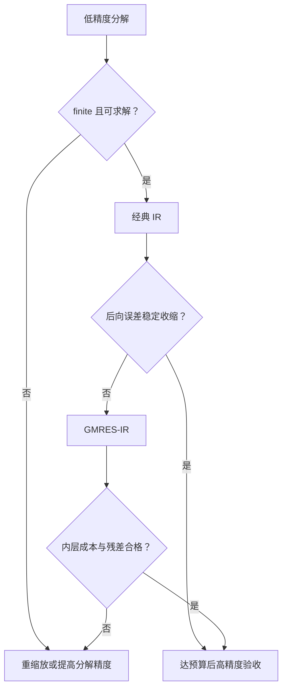

# 迭代改进、混合精度与残差校正

> [!abstract] 本章主问题
> 迭代改进把“低精度做大部分工作”与“高精度计算一个可信残差”组合起来：残差是当前误差经 $A$ 映射后的可观测信号，低精度分解近似作用 $A^{-1}$ 将它还原为修正。成功与否由低精度求解质量、残差精度、缩放、条件数和校正求解器共同决定。

先用下图回答一个视觉问题：**高精度残差、低精度因子与工作精度更新怎样组成迭代改进闭环，失败时又怎样回退？**

![[00-知识库管理/_assets/figures/numerical-analysis/fig-mixed-precision-refinement-v2.svg|880]]

> [!figure] 图 10.8.7｜误差方程、三精度职责与 refinement 回退
> A 从 $r_k=b-Ax_k=Ae_k$ 出发，循环执行高精度 residual、复用低精度 factors 解 $Md_k=r_k$ 和工作精度更新；B 将 factor/correction precision $u_f$、solution precision $u$ 与 residual precision $u_r$ 分开；C 以 error map $I-M^{-1}A$ 区分 converging、stagnating 和 diverging，并给出 GMRES-IR、refactor 与 raise-precision 回退阶梯。来源：独立绘制；理论接口参考 Carson–Higham 与 Higham–Mary；生成脚本：[[plot_numerical_direct_methods_v2.py]]；确定性结构示意，无随机种子。

**怎样读图。** A 把 residual 当作误差经 $A$ 映射后的观测，correction solve 只是近似应用逆；B 逐项记录三种 $u$ 以及 GEMV/triangular-solve 的内部 accumulator；C 同时监测 true residual/BERR、correction size 与 stagnation，不能只看循环次数。若近似逆无用，高精度 residual 只会更准确地报告失败。

**适用边界（图没有证明什么）。** 线性 error map 假设固定 $M$；有限精度、non-normality、动态 pivoting 和 GMRES 内迭代会增加项。$\kappa(A)u_f<1$ 是有用直觉而非三精度 refinement 的完整充分必要条件。GMRES-IR 可扩大成功区间，但不保证奇异/极病态系统收敛，也不替代 scale-aware stopping 和 precision fallback。

## 学习目标

1. 从 $Ae_k=r_k$ 独立推出经典迭代改进算法；
2. 用迭代矩阵 $I-M^{-1}A$ 解释收敛速度；
3. 区分分解精度 $u_f$、工作精度 $u$ 和残差精度 $u_r$；
4. 解释为何残差要比修正求解更准；
5. 理解 $\kappa(A)u_f<1$ 的直观、用处和不完整性；
6. 设计后向误差+修正量+停滞的停止契约；
7. 说明 GMRES-IR 为何能扩展可用条件数区间，以及为何它仍可失败；
8. 对 GPU/Tensor Core、隐式层和优化系统制定精度回退契约。

> [!question] 初学者读完必须能回答
> 1. 为什么 $r_k=Ae_k$ 使 residual correction 成为可执行的误差方程？
> 2. 近似逆 $M^{-1}$ 怎样导出 $e_{k+1}=(I-M^{-1}A)e_k$？
> 3. Factor precision $u_f$、working precision $u$ 与 residual precision $u_r$ 各负责什么？
> 4. 为什么 residual 通常要比 correction solve 更高精度？
> 5. $\kappa(A)u_f<1$ 提供什么直觉，又遗漏哪些三精度与 growth 条件？
> 6. True residual、BERR、correction norm 与 stagnation 怎样组成停止合同？
> 7. GMRES-IR 为什么能扩展区间，何时仍需 refactor 或提高 precision？

## 一、从精确误差方程出发

设 $Ax=b$，当前近似是 $x_k$，真误差为

$$
e_k=x-x_k.
$$

残差

$$
r_k=b-Ax_k=Ax-Ax_k=Ae_k.
$$

因此若能精确求解

$$
Ad_k=r_k,
$$

则 $d_k=e_k$，一次更新 $x_{k+1}=x_k+d_k$ 就得到真解。迭代改进的本质不是神秘的“多做几步”，而是反复解这个**误差方程**。

## 二、经典算法

```text
factorize A approximately: P A ≈ L U
x0 = solve(L,U,Pb)
repeat:
    r  = b - A x          # preferably higher precision
    d  = solve(L,U,Pr)    # reuse low-precision factors
    x  = x + d            # working precision
until backward-error/correction/stagnation contract fires
```

关键是分解只做一次，以后每步仅做矩阵—向量乘和两次三角求解。对多个右端，分解成本还可进一步摊薄。

## 三、精确线性模型：迭代矩阵

把实际校正求解看成应用一个近似逆 $M^{-1}$：

$$
d_k=M^{-1}r_k=M^{-1}Ae_k.
$$

由 $x_{k+1}=x_k+d_k$，

$$
e_{k+1}
=x-x_{k+1}
=e_k-M^{-1}Ae_k
=(I-M^{-1}A)e_k.
$$

所以在固定线性模型中，

$$
\boxed{e_k=(I-M^{-1}A)^ke_0}.
$$

若

$$
\rho(I-M^{-1}A)<1,
$$

则渐近收敛；一个更强但易用的充分条件是 $\|I-M^{-1}A\|<1$。注意非正规矩阵下，谱半径小于 1 仍可有暂态增长；有限精度模型还要加上残差与更新的舍入项。

## 四、三种精度不能混成一个 dtype

| 符号 | 作用 | 典型例子 |
|---|---|---|
| $u_f$ | 形成分解和应用低精度校正求解 | binary16 |
| $u$ | 存储并更新 $x_k$ | binary32 |
| $u_r$ | 计算 $r_k=b-Ax_k$ | binary64 |

通常 $u_r\le u\le u_f$。此外还应声明：$A,b$ 的原始存储精度、残差 GEMV 的累加精度、三角求解的内部精度和最终输出 cast。

### 4.1 为何残差需要更高精度

收敛后 $Ax_k\approx b$，残差是两个近等向量的差。若在工作精度中计算，当真残差小到与 GEMV 舍入噪声同阶时，校正方向就被污染。用 $u_r$ 计算残差，可把这个信号地板推低。

但高精度残差不能修复一个已完全失效的 $M^{-1}$；它只是更准地告诉你“错在哪里”。

## 五、为什么常看到 $\kappa(A)u_f<1$

稳定低精度分解/求解可粗略视为对 $A+\Delta A$ 求解，其中

$$
\frac{\|\Delta A\|}{\|A\|}\lesssim c(n)u_f.
$$

令 $M=A+\Delta A$，则

$$
I-M^{-1}A=M^{-1}(M-A)=M^{-1}\Delta A.
$$

一阶上

$$
\|M^{-1}\Delta A\|
\approx
\|A^{-1}\|\|\Delta A\|
\lesssim c(n)\kappa(A)u_f.
$$

因此 $c(n)\kappa(A)u_f<1$ 是校正收缩的自然充分条件。常被简写的 $\kappa(A)u_f<1$ 隐去了：

- 维数因子与 pivot growth；
- 范数型与分量型条件数的差异；
- 缩放和平衡化；
- 实际三角求解与残差舍入；
- 非正规性与暂态行为。

所以它是设计直觉，不是对所有矩阵的必要且充分阈值。

## 六、可达误差地板

有限精度误差递推可抽象为

$$
e_{k+1}=Ge_k+\xi_k,
\qquad G\approx I-M^{-1}A,
$$

其中 $\xi_k$ 收集残差、校正求解和更新舍入。若 $\|G\|=\rho<1$ 且 $\|\xi_k\|\le\xi$，则

$$
\|e_k\|
\le \rho^k\|e_0\|+\frac{1-\rho^k}{1-\rho}\xi.
$$

前一项是几何收缩，后一项是舍入造成的误差地板。提高残差精度主要降低 $\xi$；改善分解/预条件器主要降低 $\rho$。

## 七、缩放、平衡化与分量精度

若 $A$ 的行列尺度跨越很大，低精度 cast 可先溢出或把小元素压为零。可考虑

$$
\widetilde A=D_r A D_c,
\qquad
\widetilde b=D_r b,
\qquad
x=D_c\widetilde x,
$$

使行列尺度更接近。平衡化不改变原问题的数学解，但改变了浮点路径与范数条件数。最终验收应回到原坐标的

$$
r=b-A\widehat x
$$

和分量后向误差，不能只看缩放问题的内部残差。

## 八、停止准则

一个可信的 IR 终止至少结合：

### 8.1 后向误差

$$
\eta_k
=\frac{\|b-Ax_k\|}{\|A\|\|x_k\|+\|b\|}
$$

或分量型 $\omega_k$。它直接回答计算解是否精确求解了一个小扰动问题。

### 8.2 修正量

$$
\frac{\|d_k\|}{\|x_k\|}
$$

应足够小，但若 $x_k+d_k=x_k$ 只是因为工作精度无法表示更新，这是停滞而非成功。

### 8.3 收缩与停滞

记录 $\eta_{k+1}/\eta_k$ 或 $\|d_{k+1}\|/\|d_k\|$。若连续多步不改善，应：

1. 重算高精度真实残差；
2. 检查 `NaN/Inf`、低精度零主元与增长因子；
3. 尝试重缩放、GMRES-IR 或更高分解精度；
4. 若仍失败，返回非成功状态。

## 九、GMRES-IR：不要只做一次低精度 solve

经典 IR 用

$$
d_k\approx M^{-1}r_k
$$

作为一次校正。GMRES-IR 则在外层残差 $r_k$ 固定后，用 GMRES 近似解

$$
Ad=r_k,
$$

并把低精度 LU 作为左或右预条件器。以右预条件为例，解

$$
AM^{-1}y=r_k,
\qquad d=M^{-1}y.
$$

若 $M^{-1}$ 不足以单次给出准确校正，但 $AM^{-1}$ 仍是 GMRES 能在少量步数中处理的近似恒等算子，内层 Krylov 组合多个预条件方向，会得到更准的 $d$。

### 9.1 为何能扩展区间

经典 IR 类似受 $\|I-M^{-1}A\|<1$ 限制。GMRES-IR 不要求一次 $M^{-1}$ 就是收缩映射；它要求预条件后的线性系统在内层容差内可解。因此可容忍更粗糙的低精度因子。

### 9.2 为何仍可失败

- 低精度分解溢出、奇异或严重增长；
- $AM^{-1}$ 非正规，GMRES 短重启停滞；
- 内层 matvec/残差精度不足；
- 内层迭代成本抵消低精度加速；
- 内层过度求解，超过外层当前误差预算。

实现中应使内层容差随外层误差预算调整，并记录“外层步数+内层总 matvec+预条件应用数”，不只报外层迭代数。

## 十、与经典 stationary refinement 的关系

迭代改进也是一个残差校正定常迭代：

$$
x_{k+1}=x_k+M^{-1}(b-Ax_k).
$$

它与 Richardson/Jacobi 的形式一致，区别是 $M$ 通常由原矩阵的低精度直接分解得到，所以有机会是很强的近似。这个视角统一了直接法、定常迭代和 Krylov 预条件。

## 十一、延伸到最小二乘与其他分解

- **Cholesky-IR**：对 SPD 问题可用低精度 Cholesky，但舍入可使 pivot 失去正性，需缩放/对角扰动/回退；
- **最小二乘**：直接对法方程做 IR 会继承 $\kappa(A)^2$ 的风险；更稳定的 QR 或增广系统需要专门分析；
- **特征值/SVD**：也有残差校正思想，但校正方程、正交约束和谱间隙使理论不能直接照搬线性系统 IR。

## 十二、GPU 与 AI 系统视角

### 12.1 性能模型

混合精度 IR 只在以下总时间更小时才算加速：

$$
T_{\rm low\ factor}
+N_{\rm out}(T_{\rm residual}+T_{\rm correction})
+T_{\rm cast/transfer/fallback}
<T_{\rm high\ factor}.
$$

低精度 Tensor Core 分解可很快，但高精度残差可受带宽限制，GMRES-IR 又可引入同步。所以报告不应只比理论 FLOP/s。

### 12.2 AI 迁移

| 场景 | 低精度大工作 | 高精度校验 | 回退 |
|---|---|---|---|
| 二阶/自然梯度 | 预条件器或近似分解 | HVP 线性系统真残差 | 更高精度或更强 Krylov |
| 隐式层反向 | 低精度 fixed-point/预条件 | 伴随方程残差与梯度抽查 | 紧化内外容差 |
| 大模型最后层求解 | 低精度分解 | FP64 残差/验证 loss | 重缩放或 FP32 分解 |
| 实验性低精度优化器 | 低精度状态更新 | 主权重/高精度状态与 loss | 动态 loss scale/高精度状态 |

这些是残差校正的设计类比，不意味着所有训练迭代都等同线性 IR。

## 十三、失败诊断与回退树



应区分五类退出：`converged`、`stagnated`、`low_factor_failed`、`inner_solver_failed`、`budget_exhausted`。不能把所有情形折叠成一个布尔值。

## 十四、验收清单

1. 报告 $u_f,u,u_r$ 和原始存储/输出精度；
2. 报告是 classical IR 还是 GMRES-IR，预条件在左还是右；
3. 报告原坐标真实残差、范数/分量后向误差与修正量；
4. 估计条件数、pivot growth 与缩放范围；
5. 记录外层步、内层 matvec、三角求解、高精度残差次数；
6. 压力测试包含尺度失衡、近奇异、pivot growth、非正规和低精度溢出；
7. 对比高精度直接求解的精度、时间和能耗；
8. 任何回退都记录原因，避免幸存者偏差。

## 十五、常见误解

1. “高精度残差能修复任何低精度分解”—错；
2. “$\kappa u_f<1$ 是精确分界”—错，它隐藏了常数、结构与实现；
3. “修正量舍入为零就收敛”—可能是停滞；
4. “GMRES-IR 只会更好”—它可过贵、重启停滞或内层失败；
5. “只看最终残差”—会隐藏巨大内层成本与回退率；
6. “缩放后残差合格就结束”—必须回到原问题验收。

## 配套练习与实验

- [[习题 - 迭代改进、混合精度与残差校正]]
- [[解答 - 迭代改进、混合精度与残差校正]]
- [[实验 - 三精度迭代改进与 GMRES-IR 边界]]
