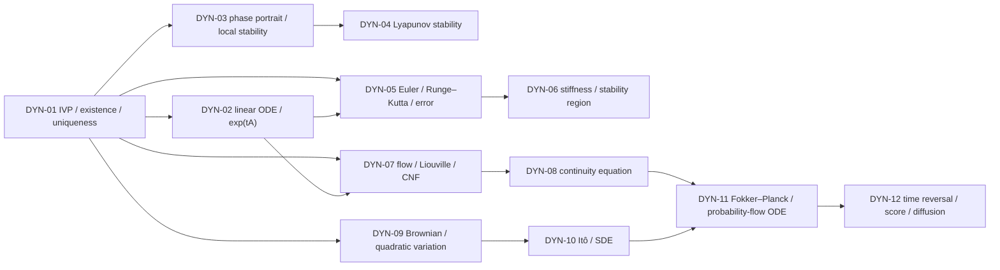

# ODE、动力系统与 SDE MOC

> [!abstract] 本卷的核心任务
> 建立一条从确定性轨迹到随机生成过程的完整连续时间语言：先判断初值问题是否存在唯一、能否延拓；再研究线性系统、平衡点、Lyapunov 稳定与离散求解；随后把单条轨迹提升为流和密度演化；最后引入 Brownian motion、Itô calculus、Fokker–Planck、反向时间与 score-based generation。AI 中写出 $\dot x=f_\theta(t,x)$ 只是建模开始，不自动提供唯一流、数值准确性、可逆性、密度变换或训练可靠性。

## 一、范围与边界

### 本卷包含

- 常微分方程、初值问题、局部/整体存在唯一性与连续依赖；
- 线性 ODE、矩阵指数、相图、平衡点、线性化与 Lyapunov 方法；
- Euler、Runge–Kutta、局部/全局误差、稳定域与刚性；
- 流映射、Jacobian determinant、Liouville 公式、连续正规化流；
- 连续性方程、守恒律与 probability transport；
- Brownian motion、二次变差、Itô 引理、SDE 与 Fokker–Planck；
- probability-flow ODE、time reversal、score 与 diffusion generation。

### 本卷不替代

- 实分析/测度论：完备空间、绝对连续、Lebesgue 积分和弱收敛只按需调用；
- 多元微积分：Jacobian、Hessian、链式法则、JVP/VJP 见 10.4；
- 数值线性代数：matrix exponential action、Krylov、linear solve 与 finite precision 见 10.8；
- 概率统计：条件期望、Gaussian、收敛和 Monte Carlo 见 10.5；
- 完整 PDE 理论：连续性/Fokker–Planck 只建设 AI 所需的 classical/weak 最小接口；
- 任意 diffusion engineering recipe：scheduler、parameterization和sampler必须另立实现合同。

## 二、连续时间问题的六层对象

| 层 | 必须回答 | 常见越界 |
|---|---|---|
| 方程 | state、time、vector field、domain 是什么？ | 只写网络模块，不写状态空间和时间域 |
| 解概念 | classical、absolutely continuous、weak 还是 stochastic solution？ | 把数值数组直接叫 exact solution |
| 适定性 | existence、uniqueness、continuous dependence 是否成立？ | continuous vector field 自动推出 unique flow |
| 长期动力学 | equilibrium、stability、invariant set、blow-up 如何？ | finite interval 拟合成功便声称全局稳定 |
| 数值实现 | solver、step/tolerance、local/global error 与 stability？ | ODE 存在唯一便认为 solver 准确 |
| 分布/统计 | 单轨迹、随机路径、density、population objective 哪一层？ | 把 pathwise 结论直接升级为 distribution theorem |

## 三、12 个核心节点与依赖图

| ID | 节点 | 必须回答的问题 | 状态 |
|---|---|---|---|
| DYN-01 | [[常微分方程、初值问题与解的存在唯一性]] | 一个连续时间演化何时真正定义良好？ | draft |
| DYN-02 | [[线性 ODE 与矩阵指数]] | 线性系统的时间演化怎样由谱与非正规性控制？ | draft |
| DYN-03 | [[相图、平衡点与局部稳定性]] | 不显式求解时怎样读出轨迹的局部长期行为？ | draft |
| DYN-04 | [[Lyapunov 稳定性与能量函数]] | 怎样用标量能量证明稳定、吸引与不变性？ | draft |
| DYN-05 | [[Euler、Runge-Kutta 与离散化误差]] | 连续模型怎样变成有误差预算的离散算法？ | draft |
| DYN-06 | [[刚性系统、绝对稳定域与隐式方法]] | 为什么真实轨迹稳定，显式求解却仍可能爆炸？ | draft |
| DYN-07 | [[流映射、Liouville 公式与连续正规化流]] | 唯一轨迹怎样形成可微流并搬运体积与密度？ | draft |
| DYN-08 | [[连续性方程与守恒律]] | 从粒子轨迹怎样得到概率质量的 PDE？ | draft |
| DYN-09 | [[随机过程、Brownian 运动与二次变差]] | 连续但不可微的随机路径如何改变微积分？ | draft |
| DYN-10 | [[Itô 引理与随机微分方程]] | stochastic differential、积分解释与额外二阶项从何而来？ | draft |
| DYN-11 | [[Fokker-Planck 方程与概率流 ODE]] | SDE 的 law 怎样演化，何时有相同 marginals 的 ODE？ | draft |
| DYN-12 | [[时间反演、score 与扩散生成动力学]] | forward noising 怎样严格反演为生成过程？ | draft |

## 四、四阶段学习路线

### 阶段 A：先让轨迹定义良好

1. IVP、积分方程、Picard–Lindelöf、Gronwall 与 maximal solution；
2. linear system、matrix exponential 与 variation of constants；
3. phase portrait、equilibrium 与 local linearization；
4. Lyapunov stability 与 invariant-set 语言。

验收：能区分 existence/uniqueness/global continuation/continuous dependence，能用反例说明每个条件为何不能省略。

### 阶段 B：连续模型必须经过求解器

5. Euler/RK 的 consistency、local/global error；
6. absolute stability、stiffness 与 implicit solve。

验收：能把 model error、discretization error、roundoff、solver tolerance 与 training/generalization error 分账。

### 阶段 C：从轨迹到流和密度

7. flow map、Jacobian、Liouville 与 continuous normalizing flow；
8. continuity equation、conservation 与 characteristics。

验收：能证明 trajectory uniqueness、flow invertibility、log-density evolution 的条件，而不是只背 CNF 公式。

### 阶段 D：从确定性流到随机生成

9. Brownian path 与 quadratic variation；
10. Itô formula、SDE existence与numerical sampling；
11. Fokker–Planck 与 probability-flow ODE；
12. reverse-time SDE/ODE、score 与 diffusion/flow matching。

验收：能在 path、transition law、marginal density 与 learned score 之间保持对象一致。

## 五、AI 调用地图

| AI 场景 | 连续时间对象 | 首要边界 |
|---|---|---|
| ResNet / continuous depth | Euler-like residual update与ODE limit | 固定深度类比不等于收敛到某个ODE |
| Neural ODE | $\dot h=f_\theta(t,h)$ 的IVP与numerical solver | vector field regularity、NFE、tolerance、adjoint mismatch |
| continuous normalizing flow | invertible flow与log-density ODE | global existence、Jacobian trace、solver error、topology |
| state-space / latent dynamics | latent IVP/SDE与observation model | identifiability、irregular time、solver/measurement noise |
| diffusion / score model | forward SDE、reverse SDE、probability-flow ODE | score approximation、time endpoint、stiffness、discretization |
| flow matching / rectified flow | learned velocity field与transport path | regression optimum、ODE well-posedness、finite-NFE mismatch |
| optimization dynamics | gradient flow或second-order ODE | discrete optimizer不等于continuous system，implicit bias需另证 |

## 六、证据分工

- MIT 18.100B：Banach fixed point 与 Picard–Lindelöf 的分析证明；
- MIT 18.330、Hairer–Nørsett–Wanner I与Hairer–Wanner II：IVP、nonstiff/stiff数值求解、误差、A/L-stability、BDF/IRK与DAE；
- SciPy `solve_ivp`：当前method、rtol/atol、dense output、event、NFE与success/status的软件语义，不承担一般数值定理；
- SUNDIALS CVODES：BDF、Newton、$I-\gamma J$、direct/Krylov/preconditioning与reuse的production solver合同；
- Hirsch–Smale–Devaney/Teschl：flow、phase portrait、stability 与 dynamical-systems theorem；
- MIT 18.152/18.306与Teschl PDE：transport、控制体、characteristics、weak conservation、shock与entropy的PDE主线；
- DiPerna–Lions：低正则transport与renormalized solution的正式边界；Benamou–Brenier：continuity-constrained dynamic optimal transport；
- MIT 18.175/15.070J、Durrett与Mörters–Peres：Brownian FDD、filtration、random-walk limit、path regularity、quadratic variation、simple-process Itô integral与isometry；
- Øksendal、Karatzas–Shreve与Kloeden–Platen：Brownian、Itô、SDE existence与strong/weak numerics；Anderson承担reverse-time diffusion原始定理；
- Chen et al.、Grathwohl et al.、Hutchinson、Rezende–Mohamed与Dupont et al.：Neural ODE/CNF、stochastic trace、离散flow脉络与连续流表达限制；Kim et al.、Zhuang et al.承担stiff ODE与continuous/checkpoint adjoint的原始 AI 证据；
- Li et al.与Kidger et al.：stochastic adjoint、neural SDE gradient与path-distribution generative modeling；Hyvärinen/Vincent、Sohl-Dickstein、Ho、DDIM、Song SDE、Nichol–Dhariwal与Karras：score/denoising、离散/连续扩散、反向采样、参数化与solver design；Lipman与Albergo：flow matching与stochastic interpolants；
- 科学空间的随机游走、扩散 SDE/ODE 与瞬时/平均速度系列：中文问题入口；不单独承担 Donsker、Brownian path theorem、Itô、Fokker–Planck、time reversal 或 numerical convergence theorem。

## 七、全卷必须维持的区分

| 容易混淆 | 必须分开 |
|---|---|
| ODE vs IVP | 方程族不含特定轨迹；初值才选择候选解 |
| existence vs uniqueness | 至少一个解与只有一个解是不同命题 |
| local vs global existence | 小时间区间存在不排除 finite-time blow-up |
| continuous vs Lipschitz vector field | continuity常给existence；state-Lipschitz给标准uniqueness |
| exact flow vs numerical trajectory | solver输出含离散化、容差与舍入误差 |
| trajectory stability vs solver stability | continuous system稳定不保证离散方法稳定 |
| autonomous vs nonautonomous | $f(x)$与$f(t,x)$的flow/group性质不同，可用augmented state统一 |
| deterministic ODE vs stochastic SDE | Brownian path不可按ordinary derivative处理 |
| pathwise vs distributional statement | 单样本轨迹结论不等于density/PDE结论 |
| invertible flow vs arbitrary network map | unique ODE flow保留拓扑，普通layer可折叠/交叉 |

## 八、当前进度

DYN-01—12 已全部进入成稿闭环；10.9 当前为 **12/12 正文覆盖、180 道节点题，并已建立 DYN-CUM-01 卷末验收**。[[阶段测验 - ODE、动力系统与 SDE（10.9）]]以 240 分钟、100 分和 A—E 分区覆盖全卷，[[阶段测验解答 - ODE、动力系统与 SDE（10.9）]]逐项给出条件、推导、评分断点与回链。[[实验 - ODE、动力系统与 SDE 累计复现门]]用三轨串联 continuous/discrete stability、FPE–PF–CNF density ledger 与 Brownian/Itô/reverse-score coefficient；canonical SVG 双跑一致、XML 与实际 PNG 渲染已通过。全卷所有节点仍为 `draft`，累计验收只记 `composed / not-attempted`；下一施工卷进入 10.10，首节点为 GEO-01 [[度量空间、拓扑与连续映射]]。

## 九、2026-08-23 图像标准化结果

- DYN-01—12 共 12 个正文节点、14 个正式图文单元全部迁移；Itô 与 Fokker–Planck 各保留一张机制图和一张 research plot；
- 14/14 使用根目录稳定 `v2` 路径、`880 px` 宽度、可判定引图问题、正式图注、来源/生成脚本、读图说明和“图没有证明什么”；
- 12 张教材机制图由三套确定性脚本生成；2 张实验图保留原 seed、数值数据和断言，由统一 research-plot 脚本重绘；
- 14/14 已通过 SVG 规范、XML 与 1200 px 实际渲染，完成分批人工视觉检查；12 个节点数学块均成对闭合；
- 章内 `v1=0`、相对图片路径 `=0`。两条 bracket warning 已核对为 Picard 算子/函数空间区间和 probability-current 数学括号，不是发布占位符；10.9 整章图像标准化通过。
