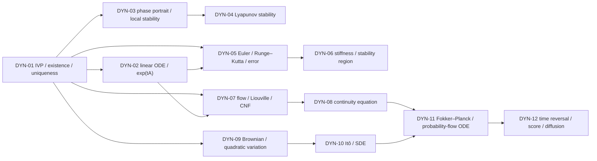

# ODE、动力系统与 SDE MOC

> [!abstract] 本卷的核心任务
> 建立一条从确定性轨迹到随机生成过程的完整连续时间语言：先判断初值问题是否存在唯一、能否延拓；再研究线性系统、平衡点、Lyapunov 稳定与离散求解；随后把单条轨迹提升为流和密度演化；最后引入 Brownian motion、Itô calculus、Fokker–Planck、反向时间与 score-based generation。AI 中写出 $\dot x=f_\theta(t,x)$ 只是建模开始，不自动提供唯一流、数值准确性、可逆性、密度变换或训练可靠性。

## 全卷教学迁移路线

10.9 的十二篇正文、习题、解答、实验和正式图已经齐备；当前迁移不扩张范围，而是把深层材料重排成初学者可调用的四波模型链。每波都补齐课程位置、两遍路线、推导问题链、统一算例、对象账本、核心公式七问和第一遍停靠线；材料通过与个人学习通过继续分离。

| 波次 | 节点 | 主线 | 统一模型/证书 | 材料状态 | 学习状态 |
|---|---|---|---|---|---|
| A | DYN-01—04 | 适定性 → 线性传播 → 局部相图 → Lyapunov 证书 | 欠阻尼振子 $q''+q'+q=0$；$e^{tA}$、spiral sink、LaSalle 与 $A^TP+PA=-I$ | `regression-passed` | `draft / not-attempted` |
| B | DYN-05—06 | consistency/order → absolute stability → stiffness/implicit solve | $y'=-y$ 的三种传播多项式；$\operatorname{diag}(-1,-100)$ 的快慢系统 | `regression-passed` | `draft / not-attempted` |
| C | DYN-07—08 | unique flow → Jacobian/volume → density transport/conservation | $\operatorname{diag}(1,-2)x+(1,0)^T$ 与推前 Gaussian | `regression-passed` | `draft / not-attempted` |
| D | DYN-09—12 | Brownian variation → Itô/SDE → Fokker–Planck/PF-ODE → reverse score | $dX=-Xdt+\sqrt2dW$ 与 Gaussian data law | `regression-passed` | `draft / not-attempted` |
| CUM | DYN-CUM | 口试—闭卷—三轨实验—延迟重做 | 12 节随机回链与累计计算门 | `composed` | `not-attempted` |

### 第一波的单一模型链

第一波固定

$$
z=(q,p)^T,
\qquad
\dot z=Az,
\qquad
A=\begin{bmatrix}0&1\\-1&-1\end{bmatrix},
\qquad
z_0=(1,0)^T.
$$

它等价于欠阻尼振子 $q''+q'+q=0$。四篇不是四个互不相关的专题，而是同一连续时间对象的四层证书：

1. **DYN-01：轨迹先要定义良好。** $\|A\|_2=(1+\sqrt5)/2$ 给 global Lipschitz 与 linear growth；积分方程和 Gronwall 给 existence/uniqueness、global continuation 与初值连续依赖，但 $e^{Lt}$ 只是松上界；
2. **DYN-02：传播子给精确时间结构。** Cayley–Hamilton 得 $A^2+A+I=0$，令 $B=A+I/2$ 后 $B^2=-3I/4$，从而
   $$
   e^{tA}=e^{-t/2}\left[I\cos\frac{\sqrt3t}{2}+\frac2{\sqrt3}B\sin\frac{\sqrt3t}{2}\right];
   $$
   状态包络、振荡频率与面积缩放分别为 $e^{-t/2}$、$\sqrt3/2$ 与 $\det e^{tA}=e^{-t}$；
3. **DYN-03：相图把一条解提升为局部轨道组织。** Nullclines 为 $p=0$ 与 $p=-q$；$(T,D,\Delta)=(-1,1,-3)$，特征值 $-1/2\pm i\sqrt3/2$，结合 $z_0$ 处向下箭头得到顺时针 spiral sink；
4. **DYN-04：标量证书避免逐条求解。** 自然能量 $E=(q^2+p^2)/2$ 满足 $\dot E=-p^2$，LaSalle 用 $p=0$ 中最大不变子集只有原点推出吸引；另取
   $$
   P=\begin{bmatrix}3/2&1/2\\1/2&1\end{bmatrix}
   $$
   满足 $A^TP+PA=-I$，得到 strict quadratic decay 与显式 exponential envelope。

这条链故意保留两个看似矛盾、实则互补的事实：DYN-01 的通用 Gronwall 上界允许 $e^{Lt}$ 增长，DYN-02—04 的专门结构却证明真实系统衰减。前者保证可靠，后者利用额外结构变紧；不能用“界很松”否定定理，也不能用这个特例替代一般条件。

> [!success] 第一波材料证书
> [[dynamics_teaching_contract_audit.py]]检查 DYN-01—04 的教学标记、统一振子精确关系、作用域 Wiki 链接、公式闭合、四个图文单元与正式 SVG 哈希。`regression-passed` 只表示材料自洽可复现；四篇仍为 `draft`，尚无学习者口试、手算、实验或延迟重做证据。

### 如何学习第一波，而不是把定理和图景分开背

1. **第一遍（约 180 分钟）：**只手算四篇新增统一算例；在一张纸上从 $A$ 依次推出 $L$、$e^{tA}$、$(T,D,\Delta)$、$\dot E$ 与 Lyapunov equation；
2. **第二遍（约 360 分钟）：**进入 continuity/Lipschitz/continuation、Peano–Baker/forcing、hyperbolic/nonhyperbolic、LaSalle/converse theorem，并为每条定理写出删条件反例；
3. **第三遍（约 180 分钟）：**把阻尼系数改成 $c\in\{0,1,3\}$，运行前预测 eigenvalue 类型、energy derivative、稳定性与离散 Euler 限制；
4. **验收：**完成四套节点习题和对应实验；无提示说明“存在唯一”“显式传播”“局部稳定”“Lyapunov 证书”为何是四个不能互相替代的结论。

### 第二波的离散化—稳定性模型链

第二波先固定标量衰减

$$
y'=-y,
\qquad y(0)=1,
\qquad 0\le t\le1,
$$

再把它提升为快慢系统

$$
\dot x=
\begin{bmatrix}-1&0\\0&-100\end{bmatrix}x,
\qquad x(0)=(1,1)^T.
$$

两篇围绕同一个 stability-function 接口 $y_{n+1}=R(h\lambda)y_n$ 分工：

1. **DYN-05：近原点时匹配 exact flow。** Euler、Heun、RK4 分别使用
   $$
   R_E(z)=1+z,
   \quad
   R_H(z)=1+z+\frac{z^2}{2},
   \quad
   R_4(z)=\sum_{k=0}^4\frac{z^k}{k!}.
   $$
   在 $T=1,h=1/2$ 上，它们的终点误差约为 $1.1788\times10^{-1}$、$2.2746\times10^{-2}$、$2.9140\times10^{-4}$；step halving 让 observed order 依次趋于 $1,2,4$，把 local $O(h^{p+1})$ 与 global $O(h^p)$ 闭合；
2. **DYN-06：远离原点时先通过稳定门。** 取 $h=0.05$，慢模态 $z_s=-0.05$ 对三种方法都合理，快模态却有 $z_f=-5$：Forward Euler、Backward Euler、trapezoidal 的因子分别为 $-4,1/6,-3/7$。前者不稳定；后二者 A-stable，但只有 Backward Euler 满足 $R(z)\to0$ 的 L-stability；
3. **同一接口，不同问题。** Order 比较 $R(z)$ 与 $e^z$ 在 $z=0$ 附近匹配几阶；absolute stability 检查给定 $z$ 是否满足 $|R(z)|\le1$；L-stability 再检查极快衰减极限。高阶、稳定和强阻尼不能互相推出；
4. **隐式成本必须显式登记。** Backward Euler 的纸面公式最终变成 $F(y_{n+1})=0$，再进入 Newton matrix $I-hJ$、linear/Krylov solve、preconditioner、nonlinear/linear tolerance 与 transpose gradient solve。

> [!success] 第二波材料证书
> [[dynamics_teaching_contract_audit.py]]检查 DYN-01—06 的教学标记，并对 DYN-05 的三组 stability polynomial、局部/终点误差和 observed order，以及 DYN-06 的快慢因子、Forward Euler 步长门、A/L-stability 极限进行数值断言；同时回归六个图文单元与正式 SVG 哈希。`regression-passed` 仍只表示教材材料可复现，不表示学习者已经通过任何验收。

### 如何学习第二波，而不是把 solver 排成排行榜

1. **第一遍（约 120 分钟）：**手算 $y'=-y$ 在 $h=1/2$ 上的三个 $R(-h)$、两步结果和 local defect，再算快慢系统在 $h=0.05$ 上的 FE/BE/TR 因子；
2. **第二遍（约 300 分钟）：**完成一般 local-to-global 证明、RK 阶条件、adaptive estimator/controller、$\theta$-method A-stability、Dahlquist 屏障和 implicit Newton–Krylov 误差账；
3. **第三遍（约 120 分钟）：**把 fast eigenvalue 改成 $-10,-100,-1000$，在运行前预测 FE 稳定步长、BE/TR 极限行为、工作量和需要解析的 transient；
4. **验收：**完成[[实验 - ODE 阶数、自适应步长与离散梯度审计]]与[[实验 - 刚性稳定域、隐式追踪与梯度审计]]；无提示说明“convergent as $h\to0$”为什么不等于“当前 $h$ 稳定且准确”。

### 第三波的流—密度守恒模型链

第三波固定二维仿射速度场和标准 Gaussian 初值：

$$
\dot X_t=AX_t+b,
\qquad
A=\begin{bmatrix}1&0\\0&-2\end{bmatrix},
\qquad
b=\begin{bmatrix}1\\0\end{bmatrix},
\qquad
X_0\sim\mathcal N(0,I_2).
$$

它故意同时包含平移、单方向扩张、更强的正交收缩与净体积压缩，使 flow、density 与守恒账本都能手算：

1. **DYN-07：从初值标签到 flow 与 density。** 闭式流和 Jacobian 为
   $$
   \phi_t(a)=\bigl(e^t(a_1+1)-1,e^{-2t}a_2\bigr)^T,
   \qquad
   D\phi_t=\operatorname{diag}(e^t,e^{-2t}).
   $$
   因此 $\det D\phi_t=e^{-t}$ 与 $\exp\int_0^t\operatorname{tr}A\,ds$ 一致；推前分布是
   $$
   \mathcal N\!\left((e^t-1,0)^T,\operatorname{diag}(e^{2t},e^{-4t})\right),
   $$
   沿轨迹 $d\log p_t(X_t)/dt=1$。Rademacher trace probe 在本 diagonal 例上零方差，Gaussian probe 仍无偏但方差为 $10$；
2. **DYN-08：从固定空间到 continuity equation。** 对同一显式 $p_t$，逐点验证
   $$
   \partial_t\log p_t+v\cdot\nabla\log p_t=1=-\nabla\cdot v,
   $$
   再用测试函数 $1,x,xx^T$ 得到质量守恒、$\dot m=Am+b$ 与 $\dot\Sigma=A\Sigma+\Sigma A^T$；Gaussian differential entropy 为 $\log(2\pi e)-t$，其速率 $-1$ 与平均 divergence 一致；
3. **两种坐标语言必须相遇。** Lagrangian 语言固定 material label 并跟随 $X_t$；Eulerian 语言固定空间点 $x$ 并观察 $p_t(x)$ 与 flux $p_tv$。前者的 finite change of variables、后者的 continuity PDE 和 test-function weak form在光滑条件下给同一密度路径；
4. **公式闭合不等于生成系统闭合。** CNF/Flow Matching 仍要另验 support、velocity nonuniqueness、finite-step ODE error、trace variance、边界通量与 learned regression error。

> [!success] 第三波材料证书
> [[dynamics_teaching_contract_audit.py]]检查 DYN-01—08 的教学标记，并对第三波的 affine composition、Jacobian/Liouville、Gaussian mean/covariance/density、pathwise log-density、Hutchinson variance、pointwise PDE residual、moment ODE 与 entropy rate做确定性断言；同时回归八个图文单元和正式 SVG 哈希。`regression-passed` 仍只表示教材材料可复现，所有学习证据继续记为 `not-attempted`。

### 如何学习第三波，而不是把粒子图和密度图分开看

1. **第一遍（约 120 分钟）：**从 $A,b$ 手算 $\phi_t,J_t,\det J_t,m_t,\Sigma_t,p_t$，再用同一页纸核对 pathwise log-density 与 Eulerian continuity residual；
2. **第二遍（约 300 分钟）：**学习一般两参数流、变分方程、Liouville/CNF、trace estimator、控制体/弱形式、边界、finite volume、Flow Matching 与 OT 接口；
3. **第三遍（约 120 分钟）：**把 $A$ 改成 $\operatorname{diag}(2,-1)$、skew rotation 和非正规上三角矩阵，运行前预测 determinant、shape、density height、entropy 与 trace-estimator variance；
4. **验收：**完成[[实验 - 流映射、Liouville 与随机迹审计]]与[[实验 - 守恒通量、压缩密度与边缘速度审计]]；无提示解释 injectivity、local diffeomorphism、global onto、mass conservation 和 likelihood accuracy 为何不能互相替代。

### 第四波的 Brownian—扩散—反演模型链

第四波固定常系数 VP–OU 和一个非平稳 Gaussian 数据分布：

$$
dX_t=-X_tdt+\sqrt2dW_t,
\qquad
X_0\sim\mathcal N\!\left(2,\frac14\right).
$$

它既保留 Brownian path 的随机性，又有完整解析 transition、marginal、score、Fokker–Planck、probability flow 和 reverse dynamics：

1. **DYN-09：先校准随机时间耦合。** 在 $[0,1]$ 的 $N$ 等分网格上，$\Delta W_k=N^{-1/2}Z_k$，差商方差为 $N$；quadratic variation proxy $Q_N=N^{-1}\sum Z_k^2$ 满足 $\mathbb EQ_N=1$、$\operatorname{Var}Q_N=2/N$，而 absolute-increment sum 的期望按 $\sqrt N$ 发散。Shared-noise coupling 虽保持 $\mathcal N(0,t)$ 边缘，却有零 QV，证明 one-time marginals 不定义 process；
2. **DYN-10：Itô calculus 把 Brownian 驱动变成可解 SDE。** Integrating factor 给
   $$
   X_t=e^{-t}X_0+\sqrt2\int_0^te^{-(t-s)}dW_s,
   $$
   因而 $q_{t|0}=\mathcal N(e^{-t}x_0,1-e^{-2t})$，而
   $$
   p_t=\mathcal N\!\left(2e^{-t},1-\frac34e^{-2t}\right).
   $$
   对 $X^2$ 的 Itô formula 产生 $+2dt$，闭合 $d\mathbb E X^2/dt=-2\mathbb E X^2+2$；$h=0.1$ 的 EM conditional mean/variance $0.9x,0.2$ 与 exact $0.904837x,0.181269$ 分账；
3. **DYN-11：从 path generator 升级到 density。** $\mathcal L=-x\partial_x+\partial_{xx}$ 的 adjoint 给 $\partial_tp=\partial_x(xp)+\partial_{xx}p$；Gaussian score 为 $s_t(x)=-(x-m_t)/v_t$，current 给正向 PF velocity
   $$
   u_t(x)=-x-s_t(x).
   $$
   其均值/方差满足 $\dot m=-m,\dot v=2(1-v)$，与 SDE 同 marginals；stationary 时 PF 粒子不动而 OU path 继续有 QV；
4. **DYN-12：反向时钟分离 full/half score。** 令 $Y_s=X_{T-s}$，则
   $$
   dY_s=[Y_s+2s_{T-s}(Y_s)]ds+\sqrt2d\overline W_s,
   \qquad
   \frac{dY_s}{ds}=Y_s+s_{T-s}(Y_s)
   \qquad\text{(reverse PF)}.
   $$
   Conditional score 经 $\mathbb E[\cdot\mid X_t]$ 恢复 marginal score；$T=3$ 时 $D_{\rm KL}(p_T\|\mathcal N(0,1))\approx0.00495837$，把 terminal mismatch 与 score/solver error 分开。

> [!success] 第四波材料证书
> [[dynamics_teaching_contract_audit.py]]检查 DYN-01—12 的教学标记，并对 Brownian QV、OU conditional/marginal、Itô moment、EM transition、Fokker–Planck/PF moments、DSM identity、terminal KL、reverse full/half score 与 stationary sanity check 做确定性断言；同时回归十四个图文单元和正式 SVG 哈希。`regression-passed` 仍只表示材料自洽，全卷学习状态继续为 `draft / not-attempted`。

### 如何学习第四波，而不是先背扩散模型配方

1. **第一遍（约 240 分钟）：**在一张连续账本上从 $\Delta W$ 推到 $[W]_t$、Itô $X^2$、OU transition/marginal、score、Fokker–Planck、PF velocity 与两条反向动力学；
2. **第二遍（约 480 分钟）：**进入 filtration/martingale、Itô integral/强弱解、Kolmogorov adjoint、一般 time reversal、DSM/Tweedie、参数化、DDPM/DDIM 与数值 SDE；
3. **第三遍（约 180 分钟）：**改变 $X_0$ 的均值/方差、终止时间 $T$ 和 Euler 步长，在运行前预测 terminal KL、score slope、反向 drift、moment 与 solver bias；
4. **验收：**完成四个节点实验，并无提示解释 conditional/marginal、path/density、forward/reverse clock、full/half score、exact/learned/finite-step 五组边界。

## 一、范围与边界

### 本卷包含

- 常微分方程、初值问题、局部/整体存在唯一性与连续依赖；
- 线性 ODE、矩阵指数、相图、平衡点、线性化与 Lyapunov 方法；
- Euler、Runge–Kutta、局部/全局误差、稳定域与刚性；
- 流映射、Jacobian determinant、Liouville 公式、连续正规化流；
- 连续性方程、守恒律与 probability transport；
- Brownian motion、二次变差、Itô 引理、SDE 与 Fokker–Planck；
- probability-flow ODE、time reversal、score 与 diffusion generation。

### 本卷不替代

- 实分析/测度论：完备空间、绝对连续、Lebesgue 积分和弱收敛只按需调用；
- 多元微积分：Jacobian、Hessian、链式法则、JVP/VJP 见 10.4；
- 数值线性代数：matrix exponential action、Krylov、linear solve 与 finite precision 见 10.8；
- 概率统计：条件期望、Gaussian、收敛和 Monte Carlo 见 10.5；
- 完整 PDE 理论：连续性/Fokker–Planck 只建设 AI 所需的 classical/weak 最小接口；
- 任意 diffusion engineering recipe：scheduler、parameterization和sampler必须另立实现合同。

## 二、连续时间问题的六层对象

| 层 | 必须回答 | 常见越界 |
|---|---|---|
| 方程 | state、time、vector field、domain 是什么？ | 只写网络模块，不写状态空间和时间域 |
| 解概念 | classical、absolutely continuous、weak 还是 stochastic solution？ | 把数值数组直接叫 exact solution |
| 适定性 | existence、uniqueness、continuous dependence 是否成立？ | continuous vector field 自动推出 unique flow |
| 长期动力学 | equilibrium、stability、invariant set、blow-up 如何？ | finite interval 拟合成功便声称全局稳定 |
| 数值实现 | solver、step/tolerance、local/global error 与 stability？ | ODE 存在唯一便认为 solver 准确 |
| 分布/统计 | 单轨迹、随机路径、density、population objective 哪一层？ | 把 pathwise 结论直接升级为 distribution theorem |

## 三、12 个核心节点与依赖图

| ID | 节点 | 必须回答的问题 | 状态 |
|---|---|---|---|
| DYN-01 | [[常微分方程、初值问题与解的存在唯一性]] | 一个连续时间演化何时真正定义良好？ | draft |
| DYN-02 | [[线性 ODE 与矩阵指数]] | 线性系统的时间演化怎样由谱与非正规性控制？ | draft |
| DYN-03 | [[相图、平衡点与局部稳定性]] | 不显式求解时怎样读出轨迹的局部长期行为？ | draft |
| DYN-04 | [[Lyapunov 稳定性与能量函数]] | 怎样用标量能量证明稳定、吸引与不变性？ | draft |
| DYN-05 | [[Euler、Runge-Kutta 与离散化误差]] | 连续模型怎样变成有误差预算的离散算法？ | draft |
| DYN-06 | [[刚性系统、绝对稳定域与隐式方法]] | 为什么真实轨迹稳定，显式求解却仍可能爆炸？ | draft |
| DYN-07 | [[流映射、Liouville 公式与连续正规化流]] | 唯一轨迹怎样形成可微流并搬运体积与密度？ | draft |
| DYN-08 | [[连续性方程与守恒律]] | 从粒子轨迹怎样得到概率质量的 PDE？ | draft |
| DYN-09 | [[随机过程、Brownian 运动与二次变差]] | 连续但不可微的随机路径如何改变微积分？ | draft |
| DYN-10 | [[Itô 引理与随机微分方程]] | stochastic differential、积分解释与额外二阶项从何而来？ | draft |
| DYN-11 | [[Fokker-Planck 方程与概率流 ODE]] | SDE 的 law 怎样演化，何时有相同 marginals 的 ODE？ | draft |
| DYN-12 | [[时间反演、score 与扩散生成动力学]] | forward noising 怎样严格反演为生成过程？ | draft |

## 四、四阶段学习路线

### 阶段 A：先让轨迹定义良好

1. IVP、积分方程、Picard–Lindelöf、Gronwall 与 maximal solution；
2. linear system、matrix exponential 与 variation of constants；
3. phase portrait、equilibrium 与 local linearization；
4. Lyapunov stability 与 invariant-set 语言。

验收：能区分 existence/uniqueness/global continuation/continuous dependence，能用反例说明每个条件为何不能省略。

### 阶段 B：连续模型必须经过求解器

5. Euler/RK 的 consistency、local/global error；
6. absolute stability、stiffness 与 implicit solve。

验收：能把 model error、discretization error、roundoff、solver tolerance 与 training/generalization error 分账。

### 阶段 C：从轨迹到流和密度

7. flow map、Jacobian、Liouville 与 continuous normalizing flow；
8. continuity equation、conservation 与 characteristics。

验收：能证明 trajectory uniqueness、flow invertibility、log-density evolution 的条件，而不是只背 CNF 公式。

### 阶段 D：从确定性流到随机生成

9. Brownian path 与 quadratic variation；
10. Itô formula、SDE existence与numerical sampling；
11. Fokker–Planck 与 probability-flow ODE；
12. reverse-time SDE/ODE、score 与 diffusion/flow matching。

验收：能在 path、transition law、marginal density 与 learned score 之间保持对象一致。

## 五、AI 调用地图

| AI 场景 | 连续时间对象 | 首要边界 |
|---|---|---|
| ResNet / continuous depth | Euler-like residual update与ODE limit | 固定深度类比不等于收敛到某个ODE |
| Neural ODE | $\dot h=f_\theta(t,h)$ 的IVP与numerical solver | vector field regularity、NFE、tolerance、adjoint mismatch |
| continuous normalizing flow | invertible flow与log-density ODE | global existence、Jacobian trace、solver error、topology |
| state-space / latent dynamics | latent IVP/SDE与observation model | identifiability、irregular time、solver/measurement noise |
| diffusion / score model | forward SDE、reverse SDE、probability-flow ODE | score approximation、time endpoint、stiffness、discretization |
| flow matching / rectified flow | learned velocity field与transport path | regression optimum、ODE well-posedness、finite-NFE mismatch |
| optimization dynamics | gradient flow或second-order ODE | discrete optimizer不等于continuous system，implicit bias需另证 |

## 六、证据分工

- MIT 18.100B：Banach fixed point 与 Picard–Lindelöf 的分析证明；
- MIT 18.330、Hairer–Nørsett–Wanner I与Hairer–Wanner II：IVP、nonstiff/stiff数值求解、误差、A/L-stability、BDF/IRK与DAE；
- SciPy `solve_ivp`：当前method、rtol/atol、dense output、event、NFE与success/status的软件语义，不承担一般数值定理；
- SUNDIALS CVODES：BDF、Newton、$I-\gamma J$、direct/Krylov/preconditioning与reuse的production solver合同；
- Hirsch–Smale–Devaney/Teschl：flow、phase portrait、stability 与 dynamical-systems theorem；
- MIT 18.152/18.306与Teschl PDE：transport、控制体、characteristics、weak conservation、shock与entropy的PDE主线；
- DiPerna–Lions：低正则transport与renormalized solution的正式边界；Benamou–Brenier：continuity-constrained dynamic optimal transport；
- MIT 18.175/15.070J、Durrett与Mörters–Peres：Brownian FDD、filtration、random-walk limit、path regularity、quadratic variation、simple-process Itô integral与isometry；
- Øksendal、Karatzas–Shreve与Kloeden–Platen：Brownian、Itô、SDE existence与strong/weak numerics；Anderson承担reverse-time diffusion原始定理；
- Chen et al.、Grathwohl et al.、Hutchinson、Rezende–Mohamed与Dupont et al.：Neural ODE/CNF、stochastic trace、离散flow脉络与连续流表达限制；Kim et al.、Zhuang et al.承担stiff ODE与continuous/checkpoint adjoint的原始 AI 证据；
- Li et al.与Kidger et al.：stochastic adjoint、neural SDE gradient与path-distribution generative modeling；Hyvärinen/Vincent、Sohl-Dickstein、Ho、DDIM、Song SDE、Nichol–Dhariwal与Karras：score/denoising、离散/连续扩散、反向采样、参数化与solver design；Lipman与Albergo：flow matching与stochastic interpolants；
- 科学空间的随机游走、扩散 SDE/ODE 与瞬时/平均速度系列：中文问题入口；不单独承担 Donsker、Brownian path theorem、Itô、Fokker–Planck、time reversal 或 numerical convergence theorem。

## 七、全卷必须维持的区分

| 容易混淆 | 必须分开 |
|---|---|
| ODE vs IVP | 方程族不含特定轨迹；初值才选择候选解 |
| existence vs uniqueness | 至少一个解与只有一个解是不同命题 |
| local vs global existence | 小时间区间存在不排除 finite-time blow-up |
| continuous vs Lipschitz vector field | continuity常给existence；state-Lipschitz给标准uniqueness |
| exact flow vs numerical trajectory | solver输出含离散化、容差与舍入误差 |
| trajectory stability vs solver stability | continuous system稳定不保证离散方法稳定 |
| autonomous vs nonautonomous | $f(x)$与$f(t,x)$的flow/group性质不同，可用augmented state统一 |
| deterministic ODE vs stochastic SDE | Brownian path不可按ordinary derivative处理 |
| pathwise vs distributional statement | 单样本轨迹结论不等于density/PDE结论 |
| invertible flow vs arbitrary network map | unique ODE flow保留拓扑，普通layer可折叠/交叉 |

## 八、当前进度

DYN-01—12 已全部进入成稿闭环；10.9 当前为 **12/12 正文覆盖、180 道节点题，并已建立 DYN-CUM-01 卷末验收**。四波 DYN-01—12 的初学者教学迁移均已达到 `regression-passed`。[[阶段测验 - ODE、动力系统与 SDE（10.9）]]以 240 分钟、100 分和 A—E 分区覆盖全卷，[[阶段测验解答 - ODE、动力系统与 SDE（10.9）]]逐项给出条件、推导、评分断点与回链。[[实验 - ODE、动力系统与 SDE 累计复现门]]用三轨串联 continuous/discrete stability、FPE–PF–CNF density ledger 与 Brownian/Itô/reverse-score coefficient。全卷所有正文仍为 `draft`，个人学习只记 `not-attempted`；下一教学施工是将 DYN-CUM 的口试、闭卷、三轨实验与延迟重做合同升级为 `regression-passed`。

## 九、2026-08-23 图像标准化结果

- DYN-01—12 共 12 个正文节点、14 个正式图文单元全部迁移；Itô 与 Fokker–Planck 各保留一张机制图和一张 research plot；
- 14/14 使用根目录稳定 `v2` 路径、`880 px` 宽度、可判定引图问题、正式图注、来源/生成脚本、读图说明和“图没有证明什么”；
- 12 张教材机制图由三套确定性脚本生成；2 张实验图保留原 seed、数值数据和断言，由统一 research-plot 脚本重绘；
- 14/14 已通过 SVG 规范、XML 与 1200 px 实际渲染，完成分批人工视觉检查；12 个节点数学块均成对闭合；
- 章内 `v1=0`、相对图片路径 `=0`。两条 bracket warning 已核对为 Picard 算子/函数空间区间和 probability-current 数学括号，不是发布占位符；10.9 整章图像标准化通过。
