# 数学基础 MOC

## 目标

为模型结构、损失函数、优化算法和生成过程提供统一数学语言。数学节点应包含定义、假设、推导、反例和 AI 中的实际调用点。

全数学区已经固定为**十卷、150 个核心节点**；全局范围、先修顺序、掌握等级和完成标准见[[数学基础完整课程地图与掌握标准]]。线性—矩阵—数值主线的施工细节见[[线性代数完整学习路线与掌握标准]]。

## 模块

- 10.1 数学语言、逻辑与证明：8 个节点；入口为[[数学语言、逻辑与证明 MOC]]
- 10.2 线性代数：24 个节点；入口为[[线性代数 MOC]]
- 10.3 矩阵分析：16 个节点；入口为[[矩阵分析 MOC]]
- 10.4 多元微积分、矩阵微分与自动微分：16 个节点；入口为[[多元微积分、矩阵微分与自动微分 MOC]]
- 10.5 概率论与数理统计：20 个节点；入口为[[概率论与数理统计 MOC]]
- 10.6 信息论与统计学习接口：10 个节点；入口为[[信息论与统计学习接口 MOC]]
- 10.7 优化与凸分析：16 个节点；入口为[[优化与凸分析 MOC]]
- 10.8 数值计算与数值线性代数：20 个节点；入口为[[数值线性代数 MOC]]
- 10.9 ODE、动力系统与 SDE：12 个节点；入口为[[ODE、动力系统与 SDE MOC]]
- 10.10 几何、泛函分析、核与算子基础：8 个节点；入口为[[几何、泛函分析、核与算子基础 MOC]]
- 练习、解答、实验与阶段测验：[[练习与测验 MOC]] · [[推导与实验 MOC]]

## 总验收与当前状态

- 完备性审计：[[数学基础十卷完备性审计与学习状态总表]]；
- 十卷总题：[[数学基础十卷总验收 - 跨卷理论与 AI 迁移]]；
- 独立详解：[[数学基础十卷总验收解答 - 跨卷理论与 AI 迁移]]；
- 跨卷计算门：[[实验 - 数学基础十卷跨章累计复现门]]；
- 独立总出口审计：[[math_foundations_capstone_contract_audit.py]]。

150 个正文、150 份 A—E 习题、150 份独立解答、十份分卷验收链和 `MATH-FND-CAP-01` 总出口均已建立并达到材料 `regression-passed`。材料状态不等于学习通过：尚无十份个人 `retained` 前置、真实总卷口试、闭卷、scorer nonce盲测和间隔迁移证据，因此全课程个人状态仍是 `not-attempted`，已完成分卷数为 0。下文“批次”保留为建设史与局部路线，不再代表当前施工进度。

## 第一批节点

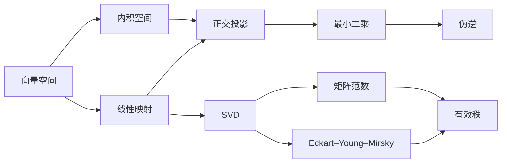

第一批已经建立 10 个可阅读节点，均暂列为 `draft`：定义、主要推导、最小例子、数值边界和 AI 接口已经完成；数值实验与跨章节复查完成后再升级为 `verified`。详细状态见[[线性代数 MOC]]。

## 第二批：坐标、谱与稳定性

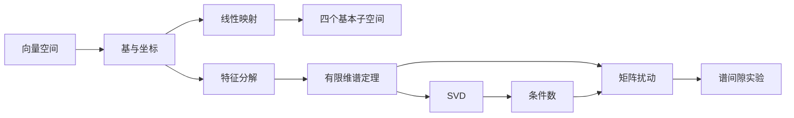

第二批已建立 6 个理论节点与 1 个可复现实验，仍统一标记为 `draft`。这一批把“代数上存在”与“数值上稳定”分开：谱值误差主要由扰动范数控制，特征/奇异方向还必须有足够谱间隙。

## 第三批：正交化与正定结构

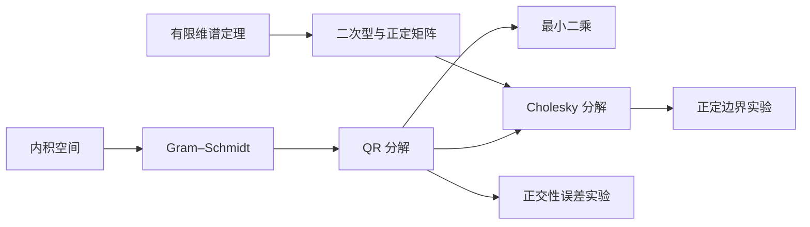

第三批已建立 4 个初学者版理论节点、4 份 A–E 习题、4 份独立详解和 2 个可复现实验。正文把手算、证明、数值边界与 AI 调用点放在同一条学习链上；当前仍处于草稿状态，等待阶段测验和间隔复查后再升级。

## 第四批：直接求解与标量不变量

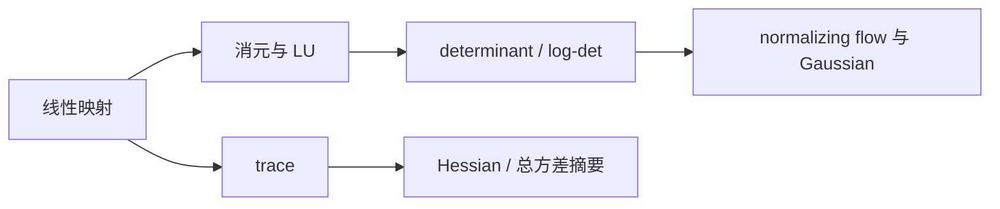

第四批已建立[[线性方程组、消元与 LU 分解]]、[[迹、行列式与体积]]两个理论节点，以及各自的 A–E 习题与独立详解。这一批补齐了从手算消元到稳定求解的桥梁，也建立了体积、可逆性、log-det 和 stochastic trace estimation 通向 AI 的接口。

## 第五批：对偶、伴随与反向传播

~~~mermaid
flowchart LR
    V["向量空间 V"] --> D["对偶空间 V′"]
    IP["内积/度量"] --> R["Riesz 表示"]
    D --> R
    R --> G["梯度向量"]
    T["线性映射 T"] --> DP["对偶映射 T′"]
    DP --> A["伴随 T*"]
    A --> VJP["VJP / 反向传播"]
~~~

第五批已建立[[线性泛函与对偶空间]]、[[伴随算子]]两个初学者版核心节点，配套 2 份 A–E 习题、2 份独立详解和 1 幅自绘协向量等值线图。它明确区分微分、梯度、对偶映射、伴随与逆，并把标准线性代数直接连接到 reverse-mode automatic differentiation。

## 第六批：特征多项式、Jordan 结构与缺陷动力学

~~~mermaid
flowchart LR
    D["det(tI-A)"] --> P["特征多项式"]
    P --> AM["代数重数"]
    K["ker(A-λI)"] --> GM["几何重数"]
    AM --> C["1≤gλ≤aλ"]
    GM --> C
    C --> DIAG["带分裂条件的可对角化判据"]
    P --> G["广义特征空间"]
    GM --> G
    G --> J["Jordan 链与块"]
    J --> SCHUR["数值上转向 Schur"]
    C --> AI["状态传播与可微 eig 边界"]
    J --> AI
~~~

第六批已建立[[特征多项式与重数]]、[[广义特征向量与 Jordan 结构]]两个递进理论节点，各自配套 A–E 习题、独立详解与自绘图。前者建立 polynomial、两种重数和可对角化入口；后者补齐核空间稳定、广义特征空间直和、幂零 Jordan 基存在性、块大小唯一恢复、矩阵幂/指数、AI 动力学与数值不稳定边界。

## 第七批：Schur 三角化、不变子空间与数值谱接口

~~~mermaid
flowchart LR
    J["Jordan：精确相似结构"] --> S["Schur：酉/正交三角化"]
    QR["QR 分解"] --> QRI["QR 相似迭代"]
    QRI --> S
    S --> INV["重排不变子空间"]
    S --> F["矩阵幂与矩阵函数"]
    S --> ST["正规特例：谱定理"]
    INV --> AI["RNN/SSM 稳定谱簇"]
    F --> AI
~~~

第七批已建立[[Schur 分解]]、A–E 习题、独立完整解答与一幅自绘结构图。正文从不变旗标给出复 Schur 存在性证明，区分复上三角与实 $1\times1/2\times2$ 块形式，并连接重排、Sylvester 方程、Hessenberg—QR 算法、后向残差、矩阵函数和非正规状态传播；其函数演算接口已在第八批展开。

## 第八批：矩阵函数、矩阵指数与连续动力学

~~~mermaid
flowchart LR
    S["标量函数及谱上导数"] --> J["Jordan 定义"]
    S --> H["Hermite 插值"]
    S --> C["Cauchy 积分"]
    J --> F["主矩阵函数 f(A)"]
    H --> F
    C --> F
    F --> E["矩阵指数 e^A"]
    E --> ODE["线性 ODE / 精确离散化"]
    F --> NUM["Schur–Parlett / Padé / action"]
    F --> FR["Fréchet 导数与条件性"]
    ODE --> AI["RoPE / SSM / Neural ODE"]
    NUM --> AI
    FR --> AI
~~~

第八批已建立[[矩阵函数与矩阵指数]]、A–E 习题、独立完整解答、一幅定义—算法分流图与[[实验 - 稳定非正规系统的矩阵指数瞬态]]。正文对初学者完整推导三种等价定义、指数级数、半群、ODE 与增广精确离散化，并进一步覆盖缩放平方、Schur–Parlett、大规模 action、Fréchet 导数、条件数和 AI 接口。

## 第九批：极分解、Stiefel 几何与矩阵优化

~~~mermaid
flowchart LR
    SVD["A = LΣR*"] --> U["方向 U = LR*"]
    SVD --> H["伸缩 H = RΣR*"]
    U --> NEAR["最近 Stiefel / Procrustes"]
    H --> PSD["平方根、绝对值与 PSD 投影"]
    U --> ITER["Newton / Newton–Schulz / QDWH"]
    ITER --> COND["条件数、固定步数与秩边界"]
    U --> DIFF["Sylvester 微分"]
    NEAR --> AI["Muon / 正交权重 retraction"]
    COND --> AI
    DIFF --> AI
~~~

第九批已建立[[极分解]]、A–E 习题、独立完整解答、一幅定理—算法—AI 结构图与[[实验 - Newton-Schulz 极分解的条件数效应]]。正文从初学者可复核的 SVD 构造出发，完整区分满秩/秩亏唯一性、半酉补全/规范偏等距、右/左极分解，并覆盖最近 Stiefel 定理、PSD 投影、Newton/NS/QDWH、Sylvester 微分、Muon 与经典矩阵 sign 的边界。

## 第十批：矩阵符号函数、谱投影与稳定模态

~~~mermaid
flowchart LR
    A["谱避开虚轴的 A"] --> S["S = sign(A)"]
    S --> P["P± = (I ± S)/2"]
    P --> INV["左右半平面不变子空间"]
    S --> DEC["A = S(A²)¹ᐟ²"]
    S --> ITER["Newton / Schur / rational"]
    S --> FRE["Fréchet / Sylvester"]
    FRE --> COND["跨侧间隔 + 非正规性"]
    INV --> AI["SSM / Neural ODE 稳定模态"]
    S --> BLOCK["block roots / polar bridge"]
~~~

第十批已建立[[矩阵符号函数]]、A–E 习题、独立完整解答、一幅谱分割—算法—AI 结构图与[[实验 - 矩阵符号函数的谱分割与非正规敏感性]]。正文从复半平面定义完整推导 Jordan/平方根表示、谱投影、sign 分解、block 平方根与 polar 桥梁、Newton/Schur、Fréchet 导数和虚轴伪谱条件性，并严格区分标准经典 sign、科学空间 `mcsgn` 零值扩展、SVD 型 msign 与逐元素 sign。

## 第十一批：浮点表示、舍入误差与 AI 混合精度

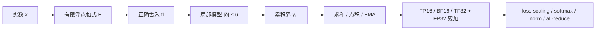

第十一批已建立[[浮点数与舍入误差]]、A–E 习题、独立完整解答、一幅表示—误差—AI 结构图与[[实验 - 浮点求和次序与灾难性消去]]。正文从初学者的二进制表示出发，严格区分 `eps` 与单位舍入误差 $u$，推导标准模型、Sterbenz、$\gamma_n$、求和/点积界，并连接次正规数、FMA、补偿求和、FP16/BF16、TF32、loss scaling、稳定 softmax 与并行复现。

## 第十二批：前向误差、后向误差与验收语言

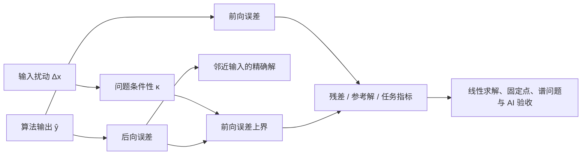

第十二批已建立[[前向误差与后向误差]]、A–E 习题、独立完整解答、一幅误差对象关系图与[[实验 - 小残差、大前向误差与条件数]]。正文区分真值误差、残差、范数型/分量型/结构化后向误差，推导“条件数 × 后向误差”对前向误差的控制，并用病态线性系统说明小残差不保证小解误差。该节点把误差语言迁移到固定点、特征问题和 AI 数值验收，并由第十三批[[数值稳定性]]承接。

## 第十三批：数值稳定性与等价公式的执行路径

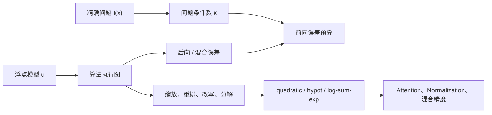

第十三批已建立[[数值稳定性]]、A–E 习题、独立完整解答、一幅三面板稳定性对照图与[[实验 - 等价公式不等价稳定]]。正文面向初学者严格区分问题条件性、算法稳定性和输出准确性，给出前向、后向与混合稳定定义，推导“条件数 × 后向误差 + 输出舍入”的主关系，并系统展开消去、缩放、溢出、范数型/分量型/结构化保证以及 softmax、log-sum-exp、混合精度和分布式归约。实验用 90 位参考验证同一数学问题的不同执行路径可从机器精度分化到完全失败；其在线性系统中的落实由第十四批承接。

## 第十四批：选主元 LU、计算解验收与迭代改进

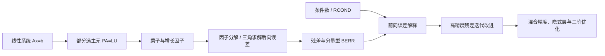

第十四批已建立[[稳定求解线性方程组]]、A–E 习题、独立完整解答、一幅三面板算法对照图与[[实验 - 选主元、后向误差与迭代改进]]。正文从一个 $\kappa_\infty\to4$ 的 $2\times2$ 族出发，证明条件良好并不能挽救无主元消元；继而完整建立 GEPP、增长因子、LU 与三角求解后向误差、范数型/分量型验收、FERR/RCOND、平衡缩放、混合精度迭代改进以及线性求解的反向传播。实验把算法制造的误差与问题固有敏感性分开控制，并明确展示迭代改进的成功区、退化区和低精度失效边界；其稳定 QR 后续由第十五批承接。

## 第十五批：Householder、Givens 与稳定 QR

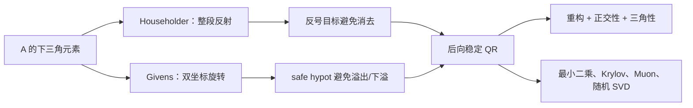

第十五批已建立[[Householder 与 Givens 变换]]、A–E 习题、独立完整解答、一幅三面板稳定性图与[[实验 - Householder 符号、Givens 缩放与 QR 正交性]]。正文从反射几何与平面旋转出发，逐步推导映轴公式、稳定符号、安全 Givens、QR 乘积顺序、紧凑存储、flop 计数、正交变换序列后向误差、compact WY、rank revealing 边界与 QR 微分，并把算法连接到流式幂迭代 Muon、随机 SVD、LoRA、Stiefel retraction、Krylov 和在线最小二乘。实验分别隔离局部参数生成错误、极端动态范围和条件数放大；其最小二乘调用由第十六批承接。

## 第十六批：稳定最小二乘、数值秩与正则化选择

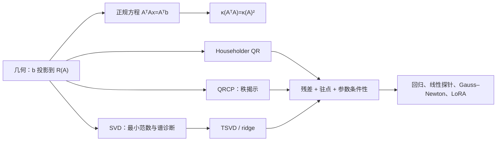

第十六批已建立[[稳定最小二乘与正规方程的风险]]、25 道 A–E 习题、逐题完整解答、一幅三面板算法对照图与[[实验 - 正规方程、QR 与截断 SVD 的稳定性]]。正文从投影几何和正规方程的精确正确性出发，推导 Gram 条件数平方、残差与参数误差分离、Householder QR 后向稳定、QRCP 数值秩、SVD 最小范数、TSVD/ridge 偏差—方差取舍，并给出满秩、秩亏、欠定、加权、多右端和流式任务的算法选择表。实验在同一确定性矩阵族上显示正规方程约在 $\kappa(A)\sim u^{-1/2}$ 后丢失弱方向，而 QR/SVD 仍保持原问题精度。

## 第十七批：幂法、反幂法与 Rayleigh 商迭代

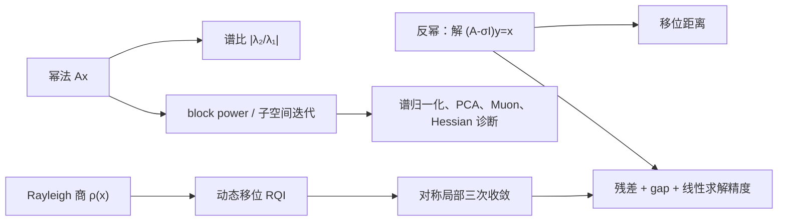

第十七批已建立[[幂法、反幂法与 Rayleigh 商迭代]]、25 道 A–E 习题、逐题完整解答、一幅三面板收敛图与[[实验 - 谱间隙、移位与 Rayleigh 商迭代收敛]]。正文从特征基展开严格推出幂法谱比，解释 Rayleigh 商、特征残差与 gap 的关系，再把反幂法写成线性求解而非显式逆；对称情形进一步证明 Rayleigh 商误差为二阶、RQI 局部为三次。实验保留了移位与两个特征值等距时的停滞反例，并把对角教学结论与非正规、Jordan、inexact solve 和随机初始化边界分开。

## 第十八批：Hessenberg 化、隐式移位 QR 与实 Schur 终态

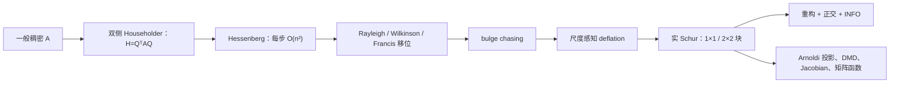

第十八批已建立[[Hessenberg 化与 QR 特征值算法]]、25 道 A–E 习题、逐题完整解答、一幅三面板结构—收敛—成本图与[[实验 - Hessenberg 约化、移位与 QR deflation]]。正文完整推导双侧 Householder 为什么保持谱且不破坏旧零、QR 步为什么是正交相似、正交迭代为何等价，并进一步解释隐式 $Q$ 定理、Francis 双移位、bulge chasing、相对 deflation、实 $2\times2$ Schur 块与 `DGEHRD`/`DHSEQR` 的部分收敛契约。实验同时验收相似残差和正交缺陷，避免把“零结构正确”误当成全部正确。

## 第十九批：Lanczos、Arnoldi 与数值 SVD

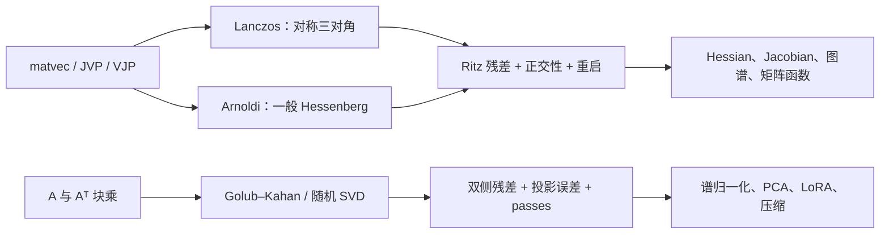

第十九批一次完成三个相互咬合的谱算法节点：[[Lanczos 方法]]从对称性推出三项递推、三对角投影、交错和廉价 Ritz 残差，并单列浮点 ghost、重正交、锁定与 SLQ；[[Arnoldi 方法]]删除对称假设，完整讲解 Hessenberg 长递推、非正规左右条件性、Schur/harmonic 提取、MGS2 与重启，并连接 GMRES、矩阵函数和 JVP；[[SVD 算法与谱范数估计]]则从双侧 Householder 双对角化贯通 LAPACK 驱动、Golub–Kahan、交替幂法、随机值域、数值秩与可微 SVD。

三章各配 25 道 A–E 习题、逐题独立解答、一幅确定性三面板 SVG 和一份可复现实验：[[实验 - Lanczos Ritz 收敛、残差与正交性]]、[[实验 - Arnoldi 非正规性、重正交与重启]]、[[实验 - SVD 双对角化、谱范数与随机子空间]]。共同验收语言从“迭代运行了”升级为残差、正交性、谱隙/非正规条件、重启信息、数据 pass 与随机性边界。

## 第二十批：定常迭代、预条件与共轭梯度

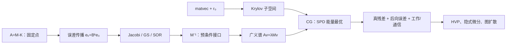

第二十批完成 NUM-15 至 NUM-17。[[定常迭代法与谱半径]]从矩阵分裂、固定点与误差传播证明“任意初值收敛当且仅当 $\rho(B)<1$”，再分清渐近收敛、非正规暂态、频率平滑与真残差；[[Krylov 子空间与预条件]]用残差多项式和 Petrov–Galerkin 统一搜索空间，严格区分左右/对称预条件、广义谱、固定/可变接口与迭代数—总成本；[[共轭梯度法]]则从 SPD 二次能量推导最速下降、$A$-共轭递推、Galerkin 能量最优、Chebyshev 界和 PCG，并单列递推残差漂移、负曲率与分布式归约。

三章各配 25 道 A–E 习题、逐题完整解答和一份确定性三面板实验：[[实验 - 定常迭代的频率阻尼、谱半径与暂态]]、[[实验 - 预条件的谱重塑、PCG 收敛与成本权衡]]、[[实验 - CG 能量几何、谱聚集与递推残差漂移]]。本批把“收敛了”的验收扩展为：原方程真残差、后向误差、预条件后的谱/自然范数、有限精度残差间隙，以及包含 setup、apply、matvec 与通信的总工作。

## 第二十一批：残差最小化、稀疏计算与随机低秩

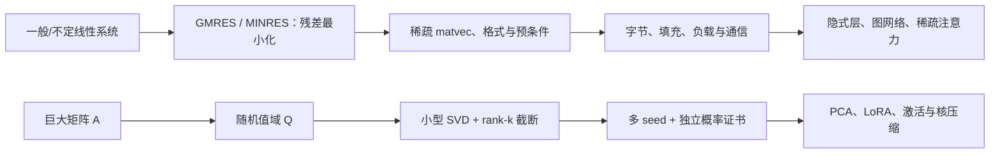

第二十一批完成 NUM-18 至 NUM-20。[[GMRES、MINRES 与残差最小化]]从 Arnoldi/Lanczos 投影推导小最小二乘、Givens 在线残差、残差多项式与有限终止，并严格区分完整/重启、左右/flexible 预条件、对称不定和奇异系统；[[稀疏矩阵计算与存储复杂度]]从结构零与 COO/CSR/CSC 编码进入 SpMV/SpMM/SpGEMM、符号消元、fill-in、AMD、并行长尾和 GraphBLAS 半环，再把参数剪枝、稀疏注意力、MoE 与 GNN 的理论 sparsity 落到真实字节和 kernel；[[随机化低秩近似与随机 SVD]]则从最佳 rank-$k$ 基线推导 Gaussian range finder、确定性误差骨架、过采样、幂方案、后验概率证书及 Nyström/CUR/ID/流式变体。

三章各配 25 道 A–E 习题、逐题完整解答、一幅确定性三面板 SVG 和一份可复现实验：[[实验 - GMRES 重启、MINRES 结构与残差最小化]]、[[实验 - 稀疏存储、消元填充与并行负载]]、[[实验 - 随机 SVD 的过采样、幂步与概率证书]]。本批把“大规模算法快”拆为可审计的 matvec/pass、基内存、索引字节、填充、通信、跨 seed 尾部和真残差/后验证书。

## 第二十二批：误差传播、稳定基础算子与混合精度校正

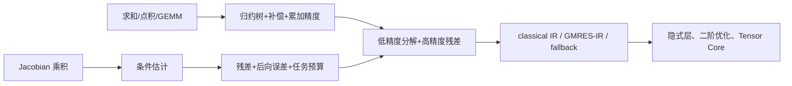

第二十二批回填 NUM-04、05、07，使 10.8 的 20 个核心节点全部达到 `draft` 正文覆盖。[[误差传播、条件估计与停止准则]]从 Taylor/Jacobian 局部化进入残差—条件—前向预算，并把递推残差 gap、停滞和随机早停纳入同一契约；[[稳定求和、点积与矩阵乘法]]推导 $\gamma_n$、求和/点积条件数、pairwise/Kahan/Neumaier、TwoSum/TwoProd 和 $|\Delta C|\le\gamma_k|A||B|$，并强制分报 storage/multiply/accumulate/output precision；[[迭代改进、混合精度与残差校正]]则从 $Ae=r$ 推出迭代矩阵、三精度记账、误差地板、GMRES-IR 和精度回退树。

三章各配 25 道 A–E 习题、逐题解答和三面板确定性实验：[[实验 - 条件估计、误差传播与可信停止]]、[[实验 - 稳定归约、点积消去与混合精度累加]]、[[实验 - 三精度迭代改进与 GMRES-IR 边界]]。本批不把数值卷升级为 `verified`；累计测验已在第二十三批补齐，但间隔复查和学习者实际作答证据仍未产生。

## 第二十三批：10.8 卷末累计验收

[[阶段测验 - 数值计算与数值线性代数（10.8）]]已经把 NUM-01—20 压缩为一张 180 分钟、100 分的累计测验：20 分定义与条件、30 分手算、25 分主推导、15 分失败诊断、10 分 AI 迁移，并附随机实验复现门。[[阶段测验解答 - 数值计算与数值线性代数（10.8）]]独立保存完整推导、评分断点和按失分区回链的补修路线；这一早期版本后来在第九十六批升级为含 nonce、盲参数与延迟迁移的完整证据门。

这一步建立的是 **验收工具**，不是学习者成绩。10.8 仍保持 20/20 正文 draft、0/20 累计测验认证；在真实闭卷答题、分区达线、48 小时重做和实验复现完成前，不升级任何节点。

## 第二十四批：标准空间结构补全

本批补齐 10.2 中三个长期被下游章节隐式调用的核心断点。[[子空间、张成与线性无关]]从封闭性、span 最小性和表示唯一性推到交换引理，并区分精确无关与近相关；[[核、像与秩零化度定理]]用核基扩充完整证明维数守恒和第一同构定理；[[直和、商空间与不变子空间]]统一唯一分解、等价类压缩、幂等投影和分块上三角结构。

三章均面向初学者提供完整手算、证明路线、数值边界、AI 对象/形状契约和自绘三面板 SVG；另建立 45 道 A–E 习题及三份独立详解。10.2 正文覆盖由 19/24 提升为 22/24，但所有新节点仍保持 `draft`，不以材料成稿替代真实作答。

## 第二十五批：谱的变分与子空间稳定性

本批补齐 10.3 的两个定理层断点。[[Rayleigh 商与极值表征]]从特征值加权平均、球面约束驻点推进到 Courant–Fischer、Ritz、Ky Fan 与广义 Rayleigh 商，并把 PCA、Hessian、LDA 和图 Laplacian 放进同一变分语言；[[特征向量与子空间扰动定理]]则从二维精确旋转、主角度和投影距离出发，完整证明单向量 sinθ 界，再分层陈述 Davis–Kahan、Wedin、残差证书和非正规边界。

两章各配 15 道 A–E 习题、逐题完整解答和一幅确定性三面板 SVG，并与既有[[二次型与正定矩阵]]、[[矩阵扰动]]、[[幂法、反幂法与 Rayleigh 商迭代]]及[[实验 - 谱间隙与特征向量稳定性]]建立双链。10.3 正文覆盖由 11/16 提升为 13/16；新增节点仍为 `draft`。

## 第二十六批：矩阵—张量接口

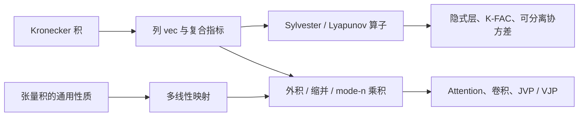

本批完成 10.2 最后两个核心节点。[[Kronecker 积、向量化与矩阵方程]]从块定义与张量积作用推进到混合乘积、列 `vec`、交换矩阵、Sylvester/Lyapunov 唯一性、separation、结构算法和 K-FAC；[[多线性映射、张量与缩并]]则从通用性质、阶数/形状/秩纪律推进到外积、缩并、unfolding、mode-$n$ 乘积、显式 `einsum`、Attention、卷积与自动微分。

两章各配 15 道 A–E 习题、逐题完整解答和一幅确定性三面板 SVG。D3 因而具备“正文—手算—证明—反例—AI 迁移—视觉”的学习闭环；10.2 正文覆盖由 22/24 提升为 24/24，但状态仍为 `draft`，需真实作答和间隔复查后再升级。

## 第二十七批：矩阵函数的一阶敏感性与反向传播

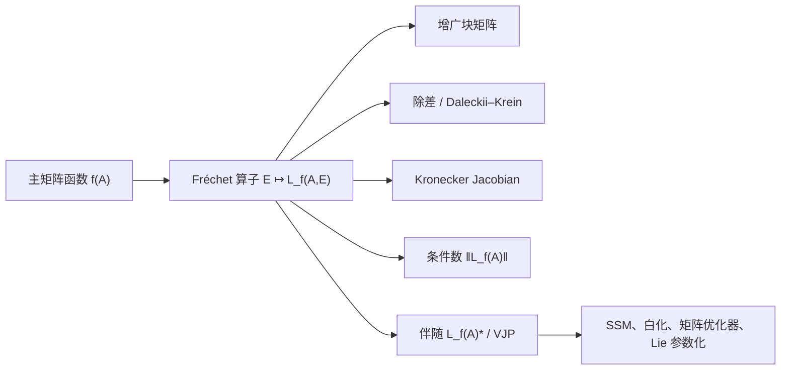

本批完成 D4 第一节点[[矩阵函数的 Fréchet 导数]]。正文从 $L_{z^2}(A,E)=AE+EA$ 的非交换反例出发，完整建立 Fréchet/Gâteaux 区分、多项式扰动插入、块矩阵定理、Daleckii–Krein 除差、重复谱连续延拓、exp/log/sqrt/inverse-sqrt、Kronecker Jacobian、无结构/结构化条件数和伴随 VJP，并把 Schur、Sylvester、专用 `expm_frechet` 与 block Krylov 放入分任务算法表。

节点配有 15 道 A–E 习题、逐题完整解答和一幅三面板 SVG；Taylor 斜率、中心差分与伴随点积构成实现验收三联。10.3 正文覆盖由 13/16 提升为 14/16，D4 仍为 `in progress`，下一节点是[[非正规矩阵、预解式与伪谱]]。

## 第二十八批：非正规谱、频域响应与瞬态增长

~~~mermaid
flowchart LR
    E["点谱与左右特征向量"] --> R["预解式 R(z;A)"]
    R --> S["最小奇异值 σmin(zI−A)"]
    S --> P["ε-伪谱四种等价定义"]
    P --> K["Kreiss 型瞬态下界"]
    R --> F["矩阵函数 / Fréchet 双预解式"]
    K --> AI["SSM、Neural ODE、RNN 诊断"]
    F --> AI
~~~

本批完成 D4 第二节点[[非正规矩阵、预解式与伪谱]]。正文从“渐近稳定、单调收缩、有限时间峰值、鲁棒稳定”四层分离出发，建立交换子、Schur 非正规度、左右特征向量条件数、resolvent、伪谱四定义及其秩一扰动证明；再从 Laplace 表示推导 Kreiss 型瞬态下界，从 Cauchy 表示推导矩阵函数与 Fréchet 双 resolvent 界。

同一解析族 $A_K=[[-1,K],[0,-2]]$ 贯穿手算、伪谱成员判断、数值横坐标和指数瞬态。配套 SVG 直接计算 $\sigma_{\min}(zI-A)$ 的等值线，比较正规 $A_0$ 与非正规 $A_8$，并给出相同点谱下约 $2.08$ 的传播峰值；另有 15 道 A–E 习题及逐题独立详解。10.3 正文覆盖由 14/16 提升为 15/16，D4 仍为 `in progress`，下一节点是[[结构化矩阵与结构化扰动]]。

## 第二十九批：结构集合、参数切空间与保结构误差

~~~mermaid
flowchart LR
    A["环境矩阵空间"] --> S["允许结构集合 S"]
    S --> L["线性结构：固定投影"]
    S --> M["流形结构：随基点变化的切空间"]
    L --> C["结构化条件数与后向误差"]
    M --> R["投影梯度与 retraction"]
    C --> P["结构化伪谱与稳定半径"]
    R --> AI["LoRA、卷积、正交权重、SPD、SSM"]
    P --> AI
~~~

本批完成 D4 第三节点[[结构化矩阵与结构化扰动]]。正文先把“结构”严格区分为线性子空间、仿射集合、开锥、光滑流形、分层代数簇以及不等式/离散约束，再用基矩阵与 Gram 矩阵推导结构投影；随后分别建立 SPD、Stiefel 与固定秩集合的切空间、正交投影、维数和 retraction，并解释 LoRA 因子化中的规范冗余。

条件分析部分把无结构扰动集替换为允许方向，系统给出结构化/参数化条件数、结构化特征值敏感性、结构化后向误差、结构化伪谱与稳定半径，并严格区分“输入扰动有结构”“算法保持结构”和“结构化后向稳定”。配套三面板 SVG 展示环境梯度向对称/Toeplitz 方向的收缩、切向合法不等于有限步可行，以及同一标量输出在五种结构下的精确一阶增益；另有 15 道 A–E 习题及逐题独立详解。

D4 至此完成三章正文、45 题、三份独立详解与三幅 SVG；10.3 矩阵分析达到 16/16 正文覆盖。这里的“完成”只指内容建设闭环，所有正文仍为 `draft`，尚需真实闭卷作答、实验复现、跨章迁移和间隔复查。

## 第三十批：极限量词、函数空间与随机收敛

~~~mermaid
flowchart LR
    Q["ε–N / ε–δ 量词"] --> S["数列与函数极限"]
    S --> C["连续与一致连续"]
    S --> F["函数列：逐点、一致与 Lᵖ"]
    F --> X["交换极限、积分与导数"]
    S --> R["随机收敛：a.s.、概率、Lᵖ、分布"]
    F --> AI["经验风险与训练后参数"]
    R --> AI
    X --> AI
~~~

本批开启 10.4，完成 CALC-01 [[函数极限、连续性与收敛模式]]。正文以量词顺序为主线，从度量空间中的数列极限、Cauchy 与完备性，推进到连续/一致连续、逐点/一致/$L^p$ 函数收敛，再分层说明随机变量的几乎处处、依概率、$L^p$ 和依分布收敛；每条蕴含都配有条件或反例，不把“都趋于零”当成可互换结论。

AI 接口把一致收敛接到经验风险，把随机收敛接到小批量梯度和生成分布，把交换极限接到训练后参数、可微求解器与梯度期望。配套三面板 SVG 可复现 $1/n$ 的尾部量词、$x^n$ 的逐点非一致收敛和面积不消失的连续尖峰；另有 15 道 A–E 习题与逐题独立详解。CALC-01 仍为 `draft`，下一节点是[[一元导数与中值定理]]。

## 第三十一批：差商、局部线性与中值定理

~~~mermaid
flowchart LR
    Q["割线差商"] --> D["点处导数"]
    D --> L["一阶局部线性 + o(|h|)"]
    D --> F["Fermat 驻点定理"]
    F --> R["Rolle 定理"]
    R --> M["Lagrange / Cauchy 中值定理"]
    M --> B["单调性、Lipschitz 与有限增量界"]
    D --> N["尖角、振荡、竖直切线"]
    B --> AI["激活函数、梯度检查、训练切片"]
    N --> AI
~~~

本批完成 CALC-02 [[一元导数与中值定理]]。正文不从求导表起步，而是从差商极限推导唯一一阶局部线性模型，证明可微必连续、乘积/倒数/商/链式法则，再把内部极值、闭区间极值和端点割线依次组织成 Fermat—Rolle—Lagrange/Cauchy 的证明链。

推论部分系统建立零导数函数为常数、导数符号控制单调性、导数模长界推出 Lipschitz、导数上下界控制有限增量和 Darboux 中间值性质；反例则覆盖尖角、无穷斜率、有界振荡、导数不连续、非连通定义域与驻点非极值。AI 接口明确区分 ReLU 经典导数和框架约定、函数 Lipschitz 与梯度 Lipschitz、梯度裁剪与函数性质，以及有限差分和 AD。配套三面板 SVG、15 道 A–E 习题和独立详解已经建立；下一节点是[[Taylor 展开与余项]]。

## 第三十二批：高阶局部模型、余项证书与有限步下降

~~~mermaid
flowchart LR
    J["中心导数 jet"] --> T["唯一 Taylor 多项式"]
    T --> P["Peano：局部主导阶"]
    T --> L["Lagrange / 积分余项"]
    L --> B["区间导数界与误差预算"]
    P --> E["驻点分类与平坦反例"]
    B --> GD["下降引理与有限学习率"]
    B --> FD["有限差分：截断 + 舍入"]
    T --> S["对称扰动与噪声期望"]
    S --> AI["logsumexp / 代理激活 / AI 审计"]
    GD --> AI
    FD --> AI
~~~

本批完成 CALC-03 [[Taylor 展开与余项]]。正文从导数匹配证明局部多项式唯一性，严格区分精确余项定义、Peano 渐近、Lagrange/Cauchy 存在式和积分型余项，再由连接区间上的高阶导数界建立可计算误差证书。平坦函数反例把有限多项式、形式 Taylor 级数与解析性明确分层。

应用部分从二阶项推导局部极值和一维下降引理，给出有限学习率的单步安全区；从奇偶项抵消推导前向/中心差分阶数及截断—舍入最佳步长；再将同一结构迁移到对称噪声、logsumexp 方向均值/方差与代理激活的函数—梯度双重证书。配套三面板 SVG、15 道 A–E 习题和逐题详解已建立；CALC-03 仍为 `draft`，下一节点是[[多元函数、偏导数与方向导数]]。

## 第三十三批：路径极限、方向切片与统一可微性边界

~~~mermaid
flowchart LR
    F["F: Rⁿ → Rᵐ"] --> L["多元极限：全部邻近路径"]
    F --> P["偏导：坐标轴切片"]
    F --> D["方向导数：固定直线切片"]
    L --> C["连续性"]
    P --> X["偏导存在不推出连续"]
    D --> Y["全方向存在不推出可微"]
    C --> Y
    X --> U["统一线性余项"]
    Y --> U
    U --> J["JVP = J_F v"]
    J --> AI["随机方向检查 / 扩散速度场 / 约束方向"]
~~~

本批完成 CALC-04 [[多元函数、偏导数与方向导数]]。正文从映射形状、定义域、图像/水平集与开球进入多元极限，严格解释两路径只能反证、全部固定直线仍可能漏掉弯曲路径；随后把偏导写成坐标轴切片，把方向导数写成一般直线切片，再用三个递进反例逐层拆开偏导存在、全方向存在、连续与 Fréchet 可微。

正面理论给出连续偏导推出可微的中值定理证明骨架、可微推出方向映射线性、Clairaut–Schwarz 的条件及混合偏导不交换反例；向量值部分把方向导数接到 JVP，并进一步覆盖随机方向 gradcheck、ReLU/Top-k 分支、重参数化、概率单纯形与约束切方向。配套三面板 SVG、15 道 A–E 习题和逐题详解已建立；CALC-04 仍为 `draft`，下一节点是[[全微分与 Fréchet 导数]]。

## 第三十四批：统一线性算子、方向一致性与局部敏感性

~~~mermaid
flowchart LR
    I["有限增量 ΔF"] --> A["仿射局部模型"]
    A --> D["DF(a): 有界线性算子"]
    D --> R["余项 ‖r(h)‖/‖h‖ → 0"]
    D --> G["固定方向：Gâteaux"]
    G --> H["变化方向：Hadamard"]
    H --> R
    D --> B["双线性 / 矩阵乘法微分"]
    D --> N["算子范数 / 局部条件数"]
    B --> J["JVP 与 matmul 节点"]
    N --> AI["鲁棒性 / 误差传播 / 混合精度"]
    J --> AI
~~~

本批完成 CALC-05 [[全微分与 Fréchet 导数]]。正文把一元斜率提升为赋范空间之间的有界线性算子，用完整量词解释统一小 o 余项，并从定义证明导数唯一、可微必连续和全部方向导数由同一算子产生。两个递进反例进一步区分“方向响应非线性”与“方向响应已线性但坏方向随尺度移动”，由此建立方向导数—Gâteaux—Hadamard—Fréchet 的严格层级。

计算主线从精确扰动展开推导平方范数、一般二次型、有界双线性映射、矩阵乘法和多参数线性层的微分；结构主线区分微分、梯度、Jacobian 与 JVP，并以算子范数连接局部条件数、扰动放大和 AI 鲁棒性。配套三面板 SVG、15 道 A–E 习题和逐题详解已建立；CALC-05 仍为 `draft`，下一节点是[[梯度、方向导数与最陡方向]]。

## 第三十五批：协向量、度量梯度与一般范数最陡方向

~~~mermaid
flowchart LR
    F["Fréchet 微分 Df ∈ X*"] --> R["Riesz：选择内积"]
    R --> G["度量梯度 gradₘ f"]
    G --> E["欧氏最陡：Cauchy–Schwarz"]
    F --> N["选择步长范数 / 单位球"]
    N --> D["对偶范数：最大一阶响应"]
    D --> P["ℓ₁ / ℓ₂ / ℓ∞ 方向"]
    D --> M["Frobenius / 谱 / 核范数方向"]
    G --> C["坐标变换 / 预条件 / 梯度流"]
    P --> AI["SignSGD / FGSM / clipping"]
    M --> AI2["Muon / 矩阵参数几何"]
~~~

本批完成 CALC-06 [[梯度、方向导数与最陡方向]]。正文先把微分固定为对偶空间中的协向量，再完整证明有限维 Riesz 表示与唯一性，由此说明梯度是选定内积后的向量表示；加权内积给出 $\operatorname{grad}_M f=M^{-1}g$，而协向量、度量矩阵和梯度在重参数化下分别服从 $S^\top$、$S^\top MS$ 和 $S^{-1}$ 的变换规律。

最陡方向主线从对偶范数定理出发，严格推导 $\ell_1,\ell_2,\ell_\infty$ 单位球的坐标、归一化梯度与符号方向，并把同一原则迁移到矩阵 Frobenius、谱范数和核范数球，得到保留奇异值比例、极因子和秩一三类更新。AI 接口进一步审计 SignSGD、FGSM、clipping、预条件和 Muon，始终区分局部一阶几何、有限步下降与离散算法收敛。配套三联 SVG、15 道 A–E 习题和逐题详解已建立；CALC-06 仍为 `draft`，下一节点是[[Jacobian、JVP 与 VJP]]。

## 第三十六批：Jacobian 坐标表、切向量前推与协向量回拉

~~~mermaid
flowchart LR
    D["DF(x): X → Y"] --> J["选基：Jacobian J"]
    D --> P["JVP: v ↦ Jv"]
    D --> Q["对偶回拉: u* ↦ u*∘DF"]
    Q --> V["欧氏表示: Jᵀu"]
    P --> C["输入基探针：逐列构造"]
    V --> R["输出基探针：逐行构造"]
    P --> A["矩阵自由 JᵀJ / JJᵀ"]
    V --> A
    V --> B["标量损失反向传播"]
    P --> S["扩散速度场 / 敏感方向"]
    A --> AI["Gauss–Newton / NTK / Jacobian 正则"]
~~~

本批完成 CALC-07 [[Jacobian、JVP 与 VJP]]。正文从 Fréchet 导数线性算子出发，证明 Jacobian 第 $j$ 列是 $DF(x)[e_j]$，再把 JVP 定义为切向量 pushforward，把 VJP 定义为不依赖内积的对偶 pullback；标准欧氏坐标中的 $J^\top u$ 只是伴随向量表示，加权内积则给出 $M_X^{-1}J^\top M_Y$。

计算主线覆盖按列/按行形成 full Jacobian 的成本选择、多输入树结构、批量线性层中的权重/输入/广播偏置 VJP、$X\mapsto AXB$ 的结构化算子与 Kronecker 表示，以及 $J^\top Jv,JJ^\top u$ 的矩阵自由组合。验证主线建立“形状与线性—方向有限差分—伴随点积”三层协议，并把 per-example gradient、Jacobian 正则、Gauss–Newton/NTK 和扩散速度场纳入 AI 审计。配套三联 SVG、15 道 A–E 习题和逐题详解已建立；CALC-07 仍为 `draft`，下一节点是[[Hessian、二阶微分与曲率]]。

## 第三十七批：二阶双线性型、方向曲率与矩阵自由 HVP

~~~mermaid
flowchart LR
    D["D²f(x): X × X → R"] --> H["选基：Hessian H"]
    H --> Q["方向曲率：vᵀHv"]
    H --> P["HVP：v ↦ Hv"]
    Q --> S["谱分解 / 驻点 / 凸性"]
    P --> K["Newton–CG / Lanczos / trace"]
    P --> V["梯度差分 + 对称性 + Taylor 验证"]
    H --> E["精确复合 Hessian"]
    E --> G["GN / GGN：PSD 替代曲率"]
    G --> F["Fisher / empirical Fisher 分工"]
    F --> A["AI 优化、影响与 Laplace"]
~~~

本批完成 CALC-08 [[Hessian、二阶微分与曲率]]。正文从 $D(Df)$ 的类型出发，把二阶导数定义为不依赖坐标和内积的对称连续双线性型，再推导 Hessian 坐标矩阵、梯度 Jacobian、二阶 Taylor 积分余项、方向曲率、极化恒等式、Rayleigh 商、驻点判别、凸性二阶条件与 $\mu I\preceq H\preceq LI$ 的条件数几何。

计算主线把 $Hv=D(\nabla f)[v]$ 组织为矩阵自由接口，比较 forward-over-reverse、reverse-over-reverse 与 full Hessian，建立“梯度中心差分—双线性对称—Taylor 缩放”三层验证。应用主线推导线性/非线性最小二乘、softmax、矩阵变量 Hessian、Newton–CG、GGN、Fisher、empirical Fisher、Hutchinson、影响函数与 Laplace，并以非线性重参数化额外项审计 sharpness 和自适应优化器叙事。配套三联 SVG、15 道 A–E 习题和逐题详解已建立；CALC-08 仍为 `draft`，下一节点是[[多元链式法则与计算图]]。

## 第三十八批：多元链式法则、计算图与反向累积

~~~mermaid
flowchart LR
    F["f: X→Y"] --> G["g: Y→Z"]
    G --> C["D(g∘f)=Dg∘Df"]
    C --> J["Jacobian：Jg Jf"]
    J --> FW["JVP：tangent 前推"]
    J --> RV["VJP：cotangent 回拉"]
    FW --> DAG["DAG 动态规划"]
    RV --> DAG
    DAG --> B["分支 / 广播 / 共享参数"]
    B --> AI["MLP / Attention / RNN"]
~~~

本批完成 CALC-09 [[多元链式法则与计算图]]。正文从赋范空间中的小 $o$ 余项出发完整证明 Fréchet 链式法则，再把算子复合转成坐标中的 Jacobian 乘积、JVP 前推和 VJP 回拉；一般 DAG 上的正向/逆向递推被明确写成动态规划，fan-out 的 `+=` 则由乘积空间总导数与路径求和公式推出。

计算与 AI 主线覆盖带分支图手算、线性层—激活—损失、batch mean、广播归约、reshape、参数共享、控制流、detach 和 in-place 语义；二阶复合式连接 $J^THJ$ 与 Gauss–Newton，深层 Jacobian 乘积和 $I+J$ 残差结构连接梯度消失/爆炸。Attention 三支路与 RNN 逆时间递推均给出形状契约。配套三联 SVG、15 道 A–E 习题及逐题独立详解已建立；CALC-09 仍为 `draft`，下一节点是[[矩阵微分、迹技巧与布局约定]]。

## 第三十九批：矩阵微分、隐式求解与 log-det

~~~mermaid
flowchart LR
    D["Fréchet 微分"] --> T["Frobenius / trace 配对"]
    T --> M["矩阵 JVP / VJP"]
    M --> S["线性 solve 与伴随"]
    S --> I["fixed point / argmin / KKT"]
    M --> J["Jacobi：det 与 log-det"]
    J --> G["Gaussian / normalizing flow"]
    S --> G
~~~

本批连续完成 CALC-10 [[矩阵微分、迹技巧与布局约定]]、CALC-11 [[逆矩阵、线性求解与隐式微分]]与 CALC-12 [[行列式、log-det 与迹的导数]]。CALC-10 从矩阵空间的 Fréchet 微分与 Frobenius–Riesz 表示出发，统一迹技巧、布局、vec/Kronecker、双侧最小二乘、一般二次迹、结构化变量以及 batch/广播；矩阵输出不物化四阶 Jacobian，而以 JVP/VJP 和伴随点积测试为核心接口。

CALC-11 把 $F(z,\theta)=0$ 线性化为切向求解，再由伴随方程统一 solve、inverse、固定点、无约束优化与 KKT 层；正文明确区分有限迭代程序的展开梯度与收敛方程的隐式梯度，并把前向残差、伴随残差、条件数、Krylov 和预条件纳入可信度契约。CALC-12 以科学空间的余子式与 $\det(I+tA)$ 一阶展开为入口，补齐适用于奇异矩阵的 adjugate Jacobi 公式、稳定 Cholesky/LU logabsdet、trace 函数、Gaussian、flow、低秩更新和 Hutchinson 估计。三章各有三联 SVG、15 道 A–E 习题和逐题解答；均保持 `draft`，下一节点为[[特征值、特征向量与 SVD 的导数]]。

## 第四十批：谱分解导数、局部可逆与多元换元

~~~mermaid
flowchart LR
    S["简单谱 / SVD 导数"] --> G["gap、规范与子空间"]
    G --> I["逆 / 隐函数定理"]
    I --> C["局部微分同胚"]
    C --> V["多元换元 |det J|"]
    V --> P["Gaussian / density / flow"]
~~~

本批连续完成 CALC-13 [[特征值、特征向量与 SVD 的导数]]、CALC-14 [[逆函数定理与隐函数定理]]与 CALC-15 [[多重积分、换元公式与积分变换]]。CALC-13 从对称简单特征对推导谱值与方向公式，再分层处理谱投影、重复谱压缩扰动、非正规左右特征向量、SVD 旋转方程、零奇异值、秩变化和谱/核范数次梯度；科学空间《SVD的导数》作为问题入口，gap 和子空间边界由扰动理论补严。

CALC-14 区分“逆导数必须为何”与“局部逆为何存在”，以压缩映射给出证明骨架，再由块映射 $H(x,y)=(x,F(x,y))$ 构造隐函数；局部/全局、非奇异/条件良好、定理/求解器被明确拆分，并连接水平集切空间、KKT、flow 与 DEQ。CALC-15 从 Riemann 和、Fubini/Tonelli 与线性体积缩放出发建立非线性换元，推导极/球坐标、Gaussian 常数、密度推前、flow 两方向、重参数化、非单射分支求和和维数改变的面积边界。三章各配三联 SVG、15 道 A–E 习题与逐题解答；均保持 `draft`，下一节点是[[自动微分：前向、反向与高阶模式]]。

## 第四十一批：自动微分系统与 10.4 正文闭环

~~~mermaid
flowchart LR
    P["primal 程序"] --> F["forward：JVP"]
    P --> R["reverse：VJP"]
    R --> H["高阶组合：HVP"]
    R --> C["tape / checkpoint"]
    I["程序语义"] --> R
    I --> F
    I --> U["custom / implicit gradient"]
~~~

本批完成 CALC-16 [[自动微分：前向、反向与高阶模式]]，从双数和 Wengert list 出发，把 forward mode 写成 tangent/JVP 前推，把 reverse mode 写成 cotangent/VJP 回拉，并用输入—输出维数、seed 数量、所需线性作用与内存共同决定模式，而不是机械背诵“反向更快”。高阶部分构造 forward-over-reverse HVP，区分 full Hessian 与矩阵自由乘积，并将 tape residual、checkpoint/rematerialization 和随机数重放纳入成本模型。

程序语义部分系统审计分支、循环、提前停止、mutation、alias、广播、归约、共享参数、随机采样、stop-gradient、自定义 JVP/VJP、展开反传与隐式梯度；验证协议覆盖原语单测、JVP–VJP 伴随关系、Taylor 缩放和模式交叉。配套三面板 SVG、15 道 A–E 习题及逐题独立详解已经建立。由此 10.4 达到 **16/16 正文覆盖**，但仍保持 `draft`，下一施工卷转入 10.5 概率论与数理统计。

## 第四十二批：概率空间、Bayes 更新与分布表示

~~~mermaid
flowchart LR
    P["(Ω,𝓕,P) 概率空间"] --> C["条件化 P(·|B)"]
    C --> B["全概率 / Bayes"]
    P --> X["可测随机变量 X"]
    X --> L["推前分布 P_X"]
    L --> R["PMF / PDF / CDF / Quantile"]
    B --> A["分类 / VAE / 扩散"]
    R --> A
~~~

本批创建 10.5 分卷入口[[概率论与数理统计 MOC]]，并连续完成 PROB-01 [[样本空间、事件与概率公理]]、PROB-02 [[条件概率、全概率与 Bayes 公式]]与 PROB-03 [[随机变量、分布与分位数]]。PROB-01 用 $(\Omega,\mathcal F,P)$ 分离基本结果、可判定事件和概率赋值，从 Kolmogorov 公理逐步推出补集、单调性、容斥、union bound 与事件列连续性，并处理有限/可数/连续模型、零概率与密度边界。

PROB-02 把条件概率证明为新的概率测度，由事件分割推导乘法、链式、全概率、Bayes 与 odds 更新；base rate、零概率条件化、相关证据、选择偏差和条件—因果差异均给出最小反例。PROB-03 从可测映射和推前测度出发，统一 PMF、PDF、CDF、atom、混合分布与广义分位数，证明 inverse-transform sampling，并接到 categorical 输出、分位数回归、token 截断和低维生成器。三章各配三联 SVG、15 道 A–E 题及逐题独立详解；均保持 `draft`。

## 第四十三批：联合结构、矩与条件期望投影

~~~mermaid
flowchart LR
    J["joint P(X,Y)"] --> M["marginal / conditional"]
    M --> I["independence / coupling"]
    J --> E["expectation / moments"]
    E --> C["covariance matrix"]
    M --> Q["E[X|G]"]
    C --> Q
    Q --> P["L² projection / minimum MSE"]
    I --> A["autoregressive / OT / contrastive"]
    P --> D["regression / denoising / score"]
~~~

本批完成 PROB-04 [[联合分布、边缘分布与独立性]]、PROB-05 [[期望、方差与矩]]与 PROB-06 [[协方差、相关性与条件期望]]。PROB-04 从随机向量和 joint pushforward 出发，统一联合 CDF/PMF/PDF、边缘化、条件分布与 coupling；独立性同时给出事件、CDF、density 与 product-measure 刻画，并用 XOR、selection/collider 和相同边缘不同 joint 反例区分 pairwise、mutual、conditional 与 iid。AI 接口落实到 autoregressive chain、Naive Bayes、optimal transport、对比负样本和 joint tensor 数值合同。

PROB-05 把期望建立为概率测度积分，用 LOTUS、指标变量、Jensen 与 Cauchy–Schwarz连接计算和证明；正负部分、$L^1/L^2$、Cauchy/Pareto 边界防止把形式对称或有限样本均值误写为存在的矩。方差部分从中心化定义推导计算式和交叉项，并比较 two-pass、Welford 与不稳定的一遍公式；AI 中逐项审计 expected risk、mini-batch、dropout、初始化和 $QK^\top/\sqrt d$ 所需假设。

PROB-06 从 covariance/correlation 进入 PSD covariance matrix 和仿射传播，再以 $\sigma$-代数定义条件期望，推导 tower、total variance/covariance；在 $L^2$ 中证明残差正交、Pythagorean 分解与最佳 MSE 性质。由此说明 MSE regression/denoising 学到 conditional mean、conditional score matching 与 marginal score 的投影关系，以及多模态平均、高维奇异样本 covariance 和 data leakage 边界。三章各配三联 SVG、15 道 A–E 题和独立详解，并建立六张科学空间来源卡；状态仍为 `draft`。

## 第四十四批：离散/连续分布族与多元 Gaussian

~~~mermaid
flowchart LR
    B["Bernoulli / Categorical"] --> C["count / waiting"]
    C --> P["Binomial / Poisson / Negative Binomial"]
    U["support + density"] --> F["Uniform / Exponential / Gamma / Beta"]
    F --> E["exponential family h,T,η,A"]
    E --> M["moments / convexity / likelihood"]
    G["standard Gaussian Z"] --> L["μ + LZ"]
    L --> Q["covariance ellipsoid"]
    Q --> H["marginal / conditional / Schur"]
    P --> A["classification / token / count model"]
    M --> A
    H --> V["VAE / diffusion / GDA / GP"]
~~~

本批完成 PROB-07 [[常用离散分布]]、PROB-08 [[常用连续分布与指数族]]与 PROB-09 [[多元高斯分布]]。PROB-07 不按分布表背诵，而从一次试验、固定重复、等待成功、无放回与稀有事件极限推导 Bernoulli/Categorical、Binomial/Multinomial、Geometric/Negative Binomial、Hypergeometric/Poisson；PGF、thinning、finite-population correction、log-PMF 与 survival 贯通证明和数值实现，AI 接口落实到 softmax token、count exposure、overdispersion 与离散潜变量梯度。

PROB-08 从 density、CDF、survival、hazard 和支持集进入 Uniform、Exponential、Gaussian、Gamma、Beta，并用归一化积分和矩比值解释 shape/rate/scale。指数族部分正式建立 $h(x),T(x),\eta,A(\eta)$ 与自然参数空间，在微分—积分交换条件下推导 $\nabla A=\mathbb E[T]$、$\nabla^2A=\operatorname{Cov}(T)\succeq0$，再连接充分统计量、moment matching、heteroscedastic likelihood、VAE reparameterization 和能量配分函数。

PROB-09 用“所有线性组合 Gaussian”排除仅边缘 Gaussian 的伪判断，由 $\mu+LZ$ 统一存在性、采样与重参数；正定 density、Mahalanobis 椭球、仿射闭包、Gaussian 零协方差独立、block conditional 与 Schur 补均给出推导。奇异 covariance 的低维支撑、Cholesky solve/logdet、jitter 改模与 $n<d$ covariance 估计边界进一步接到 VAE、linear Gaussian denoising、diffusion、GDA 与 GP。三章各配三联 SVG、15 道 A–E 题和逐题独立详解，并新增四张科学空间来源卡；状态仍为 `draft`。

## 第四十五批：概率变换、随机收敛与 Gaussian 渐近

~~~mermaid
flowchart LR
    P["pushforward P_Y(B)=P_X(T⁻¹B)"] --> J["branches / Jacobian"]
    J --> F["inverse sampling / flow"]
    M["sample mean"] --> W["WLLN / SLLN"]
    W --> C["√n error / CLT"]
    C --> D["Delta / JΣJᵀ"]
    F --> A["VAE / normalizing flow"]
    D --> U["metric uncertainty / gradient noise"]
~~~

本批完成 PROB-10 [[随机变量变换与密度换元]]、PROB-11 [[随机变量的收敛与大数定律]]与 PROB-12 [[中心极限定理与 Delta 方法]]。PROB-10 以推前测度统一离散原像求和、CDF 法、非单射分支和同维 Jacobian；再由二维换元推导卷积，明确维数改变产生奇异分布的边界，并把 inverse-CDF、Gaussian pathwise gradient、flow 两个方向的 logdet、`solve`/`slogdet` 与 round-trip residual 接成可执行审计链。

PROB-11 把 a.s.、依概率、$L^p$ 与依分布收敛逐一展开量词，证明 $L^p\Rightarrow P\Rightarrow d$ 与 a.s.$\Rightarrow P$，并用同分布独立副本、稀有事件和逃逸尖峰否定逆命题；WLLN 的 Chebyshev 证明与 iid 可积版 SLLN 被明确分层，UI、Slutsky、相关样本方差和 pointwise/uniform LLN 进一步连接 mini-batch、BatchNorm 与经验风险泛化边界。

PROB-12 从中心化和 $\sqrt n$ 标准化进入 iid/多元 CLT，用特征函数二阶展开解释 Gaussian 极限，并以 Berry–Esseen、连续性修正、Lindeberg、重尾和高维边界约束有限样本外推；一阶、二阶与多元 Delta 完整推导到 $J\Sigma J^\top$、studentization 和方差稳定化。三章各配三联 SVG、15 道 A–E 题与逐题独立详解；新增 NICE/VAE/normalizing-flow 来源卡，并部署可复用 `svg-render` 视觉验收命令。状态仍为 `draft`。

## 第四十六批：有限样本浓缩与随机计算

~~~mermaid
flowchart LR
    M["Markov / MGF"] --> H["Hoeffding / Bernstein"]
    H --> U["union / uniform bound"]
    L["LLN / CLT"] --> C["simple Monte Carlo / MCSE"]
    C --> I["importance sampling / SNIS"]
    I --> E["ESS / log-weight diagnostics"]
    C --> V["control / stratify / condition"]
    U --> A["evaluation / gradient bounds"]
    E --> G["VAE / offline evaluation / rare events"]
~~~

本批完成 PROB-13 [[浓缩不等式]]与 PROB-14 [[Monte Carlo、重要性采样与方差缩减]]，由此闭合 10.5 的阶段 C。PROB-13 从 Markov/Chebyshev 的最少假设出发，重建指数 Markov—MGF—独立乘积—优化参数的 Chernoff 证明模板；Hoeffding 引理与独立有界和给出完整推导，再以 Bernoulli KL、次 Gaussian、Bernstein 的方差敏感区、union bound、McDiarmid、median-of-means 和向量/矩阵接口分层有限样本结论。固定模型、数据依赖选择、optional stopping、重尾与 clipping bias 被分别审计。

PROB-14 从 simple MC 的无偏、方差、SLLN、CLT 与 MCSE 进入稀有事件失败，再严格区分 ordinary IS 与 SNIS，给出 support、二阶矩、最优 proposal、ratio Delta 渐近方差和有限样本偏差。weight ESS 与 MCMC ESS、logsumexp 与统计退化被明确分开；control variate、antithetic/CRN、stratification、Rao–Blackwell、pathwise/score gradient、VAE/IWAE、离线评估、相关样本和 RQMC 均落实到对象、公式与失败边界。两章各配三联 SVG、15 道 A–E 题和逐题独立详解，并新增 Owen 与三张科学空间来源卡；图示已由 `svg-render` 实际渲染验收。状态仍为 `draft`。

## 第四十七批：统计估计、似然与局部信息极限

~~~mermaid
flowchart LR
    M["model / parameter / estimand"] --> T["estimator / sampling distribution"]
    T --> R["bias / variance / risk"]
    M --> L["likelihood / score"]
    L --> P["MLE / MAP"]
    L --> F["Fisher information"]
    F --> C["Cramer-Rao bound"]
    F --> A["MLE asymptotic normality"]
    P --> X["classification / LM / regularization"]
    A --> U["standard error / natural gradient"]
~~~

本批完成 PROB-15 [[统计模型、估计量与偏差方差]]、PROB-16 [[最大似然估计与 MAP]]与 PROB-17 [[Fisher 信息、Cramér–Rao 界与渐近正态性]]。PROB-15 先把 data-generating model、parameter、estimand、statistic、estimator、estimate、algorithm randomness 与 sampling distribution 分层，再从 loss/risk 推导 bias–variance–MSE；一致性、效率、minimax、robustness、模型错设的 pseudo-true target 和 prediction decomposition 被明确区分，并落实到 train/validation/test 与 clustered data 审计。

PROB-16 从“固定参数读 density、固定数据读 likelihood”出发，推导 Bernoulli、Gaussian、Laplace、Uniform MLE、exponential-family moment matching 与 KL projection；MAP 部分逐项核对 Gaussian/Laplace prior、L2/L1、sum/mean 的样本量尺度、坐标 Jacobian、AdamW 和正齐次网络的层间尺度对称。separation、mixture variance collapse、label switching、边界 support、logsumexp/softplus 与 language-model reduction 共同阻止把任意训练 loss 简写成无条件 MLE/MAP。

PROB-17 在正则条件下证明 score mean-zero 与 information identity，由 KL 二阶展开给出 Fisher 几何，再用 covariance Cauchy–Schwarz 推出 scalar/vector CRLB 和 nuisance Schur complement。MLE 渐近正态性完整保持 Taylor—score CLT—Hessian uniform LLN—Slutsky 链；错设模型的 sandwich、Uniform 的 n-rate Exponential 极限、边界/mixture/neural symmetry、高维限制，以及 model/observed/empirical Fisher/GGN 的区别单独处理。三章各配经实际渲染验收的三联 SVG、15 道 A–E 题和逐题独立详解，并建立 MLE—EM 与 L2 尺度不变性的科学空间来源卡。状态仍为 `draft`。

## 第四十八批：Bayesian 后验、频率校准与 MCMC 闭环

~~~mermaid
flowchart LR
    J["prior × likelihood"] --> P["posterior"]
    P --> Y["posterior predictive"]
    F["sampling procedure"] --> T["test / confidence interval"]
    T --> M["FWER / FDR / power"]
    P --> K["invariant Markov kernel"]
    K --> D["R-hat / ESS / MCSE / divergence"]
    Y --> A["BNN / VAE / uncertainty"]
    M --> E["benchmark / A-B evaluation"]
    D --> A
~~~

本批完成 PROB-18 [[Bayesian 推断与后验预测]]、PROB-19 [[假设检验、置信区间与多重比较]]与 PROB-20 [[MCMC 与随机模拟诊断]]。PROB-18 从完整 joint model 推导 evidence、posterior 与 posterior predictive，逐步算通 Beta–Binomial、Dirichlet–Multinomial 和 Normal 共轭更新，再以 posterior risk 区分 mean/median/MAP action；credible/confidence、parameter/predictive uncertainty、prior/PPC/held-out/SBC、hierarchy、Bayes factor、prior sensitivity 与 Bernstein–von Mises 的正则边界均被分层。VAE latent posterior、BNN weight uncertainty 和 approximate computation 不再混为一谈。

PROB-19 用 repeated-sampling procedure 定义 level、size、power、valid p-value 与 coverage，推导 z-test、Neyman–Pearson、Wald/score/LR 和 test inversion；effect size、equivalence margin、bootstrap、optional stopping、selection 与 paired/cluster design 构成报告边界。Bonferroni/Holm 的 FWER 与 BH 的 FDR 从目标到手算完整区分，并迁移到多 datasets、metrics、prompts、seeds、subgroups 和在线 A/B 测试。

PROB-20 从 Markov kernel、invariance 与 detailed balance 推导 MH accepted flow 和 Gibbs acceptance-one 结构，由 Markov-chain CLT 建立 IACT—function-specific ESS—MCSE；warmup/thinning、rank-normalized $\widehat R$、bulk/tail ESS、HMC/NUTS、divergence、funnel、multimodality、symmetry 与 discrete proposal 均落实为有限计算诊断。三章各有三联 SVG、15 道 A–E 题和逐题详解，并新增 VAE Bayesian 视角与从 MCMC 到模拟退火两张科学空间来源卡。至此 10.5 达到 **20/20 正文覆盖**。

卷末进一步建立 `PROB-CUM-01`：[[阶段测验 - 概率论与数理统计（10.5）]]以 180 分钟、100 分和 A—E 分区门槛覆盖全部 20 节；[[阶段测验解答 - 概率论与数理统计（10.5）]]逐题给出对象、假设、计算、评分断点与回链；[[实验 - 概率统计累计复现门]]用纯标准库脚本生成 coverage、rare-event IS 与双峰 MCMC 三联图，并把同 mode 低 R-hat 盲区变成可执行反例。当前仍是 **composed / not-attempted**，没有真实答卷前不升级任何节点。

## 第四十九批：信息量、条件链与分布失配

~~~mermaid
flowchart LR
    P["事件概率 p(x)"] --> S["自信息 −log p(x)"]
    S --> H["entropy E[-log p(X)]"]
    H --> C["Kraft / 平均码长"]
    J["joint p(x,y)"] --> R["H(X,Y)=H(X)+H(Y|X)"]
    R --> A["序列 autoregressive chain"]
    P --> X["cross-entropy H(P,Q)"]
    X --> K["KL = H(P,Q)−H(P)"]
    K --> L["分类 / LM / 蒸馏 / VAE"]
~~~

本批建立 10.6 [[信息论与统计学习接口 MOC]]，并完成 INFO-01 [[自信息、熵与编码长度]]、INFO-02 [[联合熵、条件熵与链式法则]]与 INFO-03 [[交叉熵与 KL 散度]]。INFO-01 从连续性、单调性与 independent additivity 推出负对数 self-information，证明 finite-support entropy bounds，并由 Kraft inequality 建立 $L\ge H_2$ 与 Shannon code 的 $L<H_2+1$；bits/nats、binary entropy、perplexity、spectral effective rank、tokenizer 归约、plug-in bias 和 differential entropy 尺度边界均被分层。

INFO-02 从 joint PMF 逐行推出二元/多元 entropy chain rule，以严格凹性证明 conditioning reduces entropy 和 independence 等号条件，再用 copy、BSC、XOR、deterministic map 与 infinite-entropy 反例审计结论。autoregressive language model 被明确写成 conditional chain，而非 independence 假设；teacher forcing、generated prefix、EOS、padding、per-token/per-sequence reduction 分别归入概率对象、数据协议或 decoding heuristic。

INFO-03 把“真实 $P$、模型 $Q$”的方向固定为 $H(P,Q)=H(P)+D(P\|Q)$，从 log inequality 证明 Gibbs inequality，并给出不对称、triangle failure、support mismatch、KL chain rule、MLE 的 misspecified projection、softmax/BCE logits 稳定式和一维/多元 Gaussian KL。label smoothing、class weights、focal、temperature、clipping、蒸馏、VAE 和 GlobalPointer surrogate 均按 probability object 重新审计。

三章各配一幅经实际 PNG 渲染检查的 1200×430 三面板 SVG、15 道 A–E 题与逐题完整解答，共新增 45 题；另建立 Shannon/Kullback–Leibler/MIT/Stanford 正式证据链和三张科学空间来源卡。10.6 当前为 **3/10 正文覆盖**，所有节点仍为 `draft`，下一施工点为 INFO-04 [[互信息与依赖性]]。

## 第五十批：依赖、信息流与无损编码

~~~mermaid
flowchart LR
    J["joint P(X,Y)"] --> M["MI = KL(joint || product)"]
    M --> D["DPI：X → Z 不增任务信息"]
    D --> S["充分性：压缩 nuisance，保留 target"]
    H["entropy H(X)"] --> K["Kraft / Huffman"]
    K --> A["AEP / typical set"]
    A --> C["rate H 的压缩阈值"]
    M --> R["对比学习 / uncertainty"]
    S --> R
    C --> L["LM bits-per-byte / tokenizer"]
~~~

本批完成 INFO-04 [[互信息与依赖性]]、INFO-05 [[数据处理不等式与充分统计量]]与 INFO-06 [[无损编码、典型集与渐近等分性]]。INFO-04 以 $I(X;Y)=D(P_{XY}\|P_XP_Y)$ 固定对象，贯通 PMI、entropy reduction、conditional KL、code saving、conditional chain rule 与 Gaussian determinant 公式；copy/BSC/XOR、零相关但非独立、双射不变性和连续 deterministic encoder 的 infinite MI 被组织为一条边界主线。plug-in、density-ratio、variational 与 InfoNCE 被严格区分，batch ceiling、negative sampling、词向量 PMI 和 ensemble uncertainty 均落实为可审计对象。

INFO-05 用 MI chain rule 给出 DPI 的两行证明和精确等号缺口，再将统计充分性、任务充分性、最小充分、完备与高效分开；Fisher–Neyman factorization 在 Bernoulli、Gaussian 和指数族中手算闭合，Fano inequality 则把 representation 的 label information 接到不可突破的分类 error lower bound。skip connection、augmentation、deep deterministic network、privacy 和 information bottleneck 都先检查合法 Markov graph，而不以“压缩改善泛化”替代假设。

INFO-06 从 nonsingular、uniquely decodable、prefix 与 fixed-length code 的层级出发，证明 Kraft–McMillan 和平均码长下界，完整构造 Huffman 与 block Shannon code；再由 LLN 推出 AEP、typical probability/cardinality bounds 和 fixed-length source coding 的 achievability/converse。最可能序列不等于典型序列，entropy rate 需要 source 条件；语言模型比较统一到 held-out bits/byte，并单列 tokenizer、model、header 和 arithmetic coder overhead。

三章各配一幅经实际 PNG 渲染复核的 1200×430 三面板 SVG、15 道 A–E 题与逐题完整解答，共新增 45 题。正式证明由 MIT 6.441 Chapter 2/3/5/6/7、Stanford EE376A、Shannon 与 Kullback–Leibler 承担；科学空间新增 PMI/Deep InfoMax 与变分信息瓶颈来源卡，并明确纠正 JS 上界与 surrogate 边界。10.6 当前达到 **6/10 正文覆盖**，下一施工点为 INFO-07 [[最大熵原理与指数族]]。

## 第五十一批：最大熵、变分证据与分布几何

~~~mermaid
flowchart LR
    C["线性 moment 约束"] --> M["MaxEnt primal"]
    M --> E["指数族 / log-partition"]
    E --> D["moment matching / convex dual"]
    J["latent joint p(x,z)"] --> V["ELBO = Eq log p/q"]
    V --> G["evidence = ELBO + posterior KL"]
    Q["两个概率分布 P,Q"] --> F["f-divergence / Bregman"]
    Q --> I["IPM / Wasserstein / MMD"]
    D --> AI["softmax / CRF / energy model"]
    G --> AI2["VAE / amortized inference"]
    F --> AI3["GAN / domain matching"]
    I --> AI3
~~~

本批完成 INFO-07 [[最大熵原理与指数族]]、INFO-08 [[变分推断、ELBO 与证据分解]]与 INFO-09 [[f-散度、Bregman 散度与概率度量]]。INFO-07 从完整约束集合推导 exponential form 和 dual objective，以 $\nabla A$、$\nabla^2A$ 建立 moment—covariance 几何，再贯通 boundary solution、reference measure、convex conjugate、MLE moment matching 与 conditional MaxEnt；同时把“最大熵”“entropy regularization”“energy model”和最大熵 RL 分开。

INFO-08 用 Jensen 和 Bayes 恒等式双路推出 ELBO，固定 reverse-KL 方向与 support 条件；mean-field coordinate update、VAE reconstruction–KL、Gaussian closed form、score/pathwise gradients、approximation/optimization/amortization gaps、posterior collapse、$\beta$-VAE 与 IWAE 均落实到可检查的概率对象。[[实验 - ELBO 恒等式、变分族限制与摊销缺口]]用可枚举 binary latent model 验证 identity 到机器精度，并隔离 family restriction 与 shared encoder 的不同 gap。

INFO-09 按“density ratio、convex potential、test-function class、ground geometry”区分 $f$-divergence、Bregman divergence、IPM 与 optimal transport；非负性、DPI、Fenchel representation、exponential-family KL geometry、TV/Pinsker、Wasserstein 与 MMD 被系统连接，并用 disjoint supports 说明拓扑直接影响 GAN 的 critic signal。三章共配三幅 SVG、45 道 A–E 题与逐题完整解答；Jaynes、Wainwright–Jordan、Blei、f-GAN、MMD/WGAN 原论文，以及本批新增四张、复用七张科学空间来源卡，组成分层证据链。10.6 当前达到 **9/10 正文覆盖**，下一施工点为 INFO-10 [[率失真、信息瓶颈与最小描述长度]]。

## 第五十二批：有损压缩、任务相关表示与描述长度

~~~mermaid
flowchart LR
    S["source p(x) + distortion d"] --> R["R(D)=inf I(X;X-hat)"]
    R --> C["coding theorem / finite codec gap"]
    X["input X + target Y"] --> I["IB: rate vs relevance"]
    I --> V["VIB upper/lower bounds"]
    M["model class + data protocol"] --> D["MDL: total decodable length"]
    V --> A["representation learning"]
    C --> A2["learned compression"]
    D --> A3["model selection / prequential code"]
~~~

本批完成 INFO-10 [[率失真、信息瓶颈与最小描述长度]]。rate–distortion 主线从 source、reproduction alphabet、distortion 和 test channel 的完整对象出发，给出 $R(D)$ 的端点、非增/凸性、Lagrange supporting line、coding theorem 的 achievability/converse 骨架，并手算公平 Bernoulli–Hamming 与 Gaussian–MSE 闭式；Blahut–Arimoto 和 learned compression 被明确标成离散优化算法与有限神经 codec，而不是理论前沿本身。

information bottleneck 主线推导 predictive KL distortion、self-consistent equation 与 rate–relevance 平面，再证明 VIB 的 rate upper bound 和 relevance lower bound及其精确 gap；deterministic continuous encoder 的 infinite-MI 病态、reference/decoder family、finite negatives 和 optimization gap 分层处理。MDL 主线区分 two-part、Bayesian mixture、NML 与 prequential code，把 architecture、parameter/update/precision 和 residual log-loss 都纳入可译码描述；VAE 的 distortion–rate 分解和 bits-back 只在编码协议成立时采用。

配套[[习题 - 率失真、信息瓶颈与最小描述长度]]与[[解答 - 率失真、信息瓶颈与最小描述长度]]新增 15 道 A—E 题；三面板机制 SVG 区分 rate–distortion frontier、IB nuisance 和完整 MDL 账本。[[实验 - 信息论累计复现门]]复现 Bernoulli–Hamming 曲线、task/nuisance 候选和 KT prequential code；`INFO-CUM-01` 的 100 分题卷与详解覆盖 INFO-01—10。Shannon 1959、MIT 6.441 Chapter 23、Tishby/Alemi、Rissanen/Grünwald 与 bits-back 文献承担正式证据；科学空间新增 VAE rate–MI 与表示维度/熵来源卡。由此 10.6 达到 **10/10 正文覆盖、150 道节点题**；累计材料现为 `regression-passed`、个人为 `not-attempted`，所有节点仍为 `draft`。下一施工卷进入 10.7，首节点为[[优化问题、可行域与局部最优]]。

## 第五十三批：优化问题、凸集与凸函数

~~~mermaid
flowchart LR
    P["problem: variable + objective + constraints"] --> F["feasible set and solution concept"]
    F --> C["convex-set geometry"]
    C --> S["separation / supporting hyperplane"]
    C --> E["epigraph of a convex function"]
    E --> J["Jensen + first/second-order tests"]
    J --> A["softmax, cross-entropy and convex surrogates"]
~~~

本批建立 10.7 [[优化与凸分析 MOC]]，完成 OPT-01 [[优化问题、可行域与局部最优]]、OPT-02 [[凸集、凸组合与分离超平面]]和 OPT-03 [[凸函数、Jensen 不等式与上图集]]。第一章先把变量、数据、超参数、定义域、可行性、$inf/\min/\arg\min$、局部/全局/严格/驻点和近似证书分开，再用存在性、coercivity、relaxation 与 empirical/population risk 建立完整问题合同。第二章从凸组合、凸包、锥、相对内部和投影推进到变分不等式、分离及支撑超平面，明确 closedness、strict/strong separation 与边界条件。第三章用 epigraph 等价、一阶/二阶判据与 Jensen 组织凸函数演算，并推导 logsumexp 的 softmax gradient、categorical-covariance Hessian、null direction 和 stable implementation，严格区分“对 logits 凸”与“对深网参数凸”。

三章各配置一幅三面板 SVG，并各有 15 道 A—E 习题和独立详解，共新增 45 题。Boyd–Vandenberghe、Stanford EE364A、MIT 6.253 与 MIT Jensen 讲义承担正式定义和证明骨架；[[S-2022-Su-9070-logsumexp不等式|科学空间的 logsumexp 文章]]承担中文问题入口，再由课程补齐 Hessian、严格凸性和参数空间边界。当前 10.7 为 **3/16 正文覆盖**；下一施工点是 OPT-04 [[次梯度、共轭函数与 Fenchel 对偶]]。

## 第五十四批：广义一阶证书、曲率条件与梯度下降

~~~mermaid
flowchart LR
    S["subgradient: global affine lower bound"] --> F["Fenchel conjugate / equality"]
    F --> D["basic primal–dual template"]
    C["μ lower curvature"] --> K["κ = L/μ"]
    L["L upper curvature"] --> K
    L --> G["finite gradient step"]
    K --> R["O(1/k) / geometric rates"]
    G --> R
~~~

本批完成 OPT-04 [[次梯度、共轭函数与 Fenchel 对偶]]、OPT-05 [[光滑性、强凸性与条件数]]与 OPT-06 [[一阶最优性条件与梯度下降]]。OPT-04 从全局仿射下界定义 subdifferential，处理 relative-interior nonemptiness、active-maximum/sum/affine calculus、directional derivative 与 Fermat rule，再逐例推导 quadratic、norm、indicator、negative entropy 的 conjugate，证明 Fenchel–Young equality、biconjugacy 和 basic Fenchel dual；同时明确任意负次梯度未必 function-value descent、formal dual 不等于 zero gap。

OPT-05 严格区分 function/gradient/Hessian 三种 Lipschitz，推导 descent lemma、strong-convex 四种等价语言、cocoercivity 与 gap–distance–gradient 证书链；以 SPD quadratic、ridge least squares、logistic regression 和 temperature logsumexp 计算 $L,\mu,\kappa$，并把 point Hessian、trajectory region 与 global theorem 分层。OPT-06 从 variational inequality 和 regularized linear model推出 gradient step，再完整推导 $0<\eta<2/L$ 的单步下降、smooth nonconvex 的 minimum-gradient bound、smooth convex 的 $O(1/k)$ last-iterate gap、strongly-convex geometric rate，以及 quadratic 的 $\eta_*=2/(L+\mu)$ 和 spectral zig-zag。

三章各配置一幅经二次几何校正和 PNG 渲染检查的三面板 SVG，并各有 15 道 A—E 题与独立详解，共新增 45 题。MIT 6.253/6.079、Stanford EE364A/B、Nesterov 与 Bubeck 承担正式定义和收敛证明；[[S-2020-Su-7787-有限学习率与隐式正则|科学空间的有限学习率文章]]承担离散动力学与 implicit regularization 的问题入口，课程明确不把特定近似外推成普适泛化定理。当前 10.7 为 **6/16 正文覆盖、90 道节点题**；下一施工点是 OPT-07 [[加速梯度、动量与下界]]。

## 第五十五批：加速、随机 oracle 与自适应坐标几何

~~~mermaid
flowchart LR
    G["deterministic gradient"] --> H["HB eigenmode / roots"]
    H --> N["NAG potential / lower bound"]
    G --> S["stochastic oracle"]
    S --> B["mini-batch variance / noise floor"]
    B --> A["variable diagonal metric"]
    A --> D["AdaGrad / RMSProp / Adam"]
    D --> W["AMSGrad / AdamW boundaries"]
~~~

本批完成 OPT-07 [[加速梯度、动量与下界]]、OPT-08 [[随机梯度与小批量估计]]与 OPT-09 [[自适应优化方法]]。OPT-07 先在 SPD quadratic 上把 heavy-ball 分解为二阶 eigenmode recurrence，用 characteristic roots 与 Jury 条件给出稳定区，再推导 quadratic-optimal 参数、Nesterov 的三点不等式与 $O(1/k^2)$ potential，并以函数类—oracle—维度—误差准则四元组限定一阶下界。它明确区分 HB/NAG、quadratic 最优参数、一般凸最坏情形和深网经验，也把 restart、buffer convention 与 stochastic lag 纳入实现审计。

OPT-08 从 population、finite sum 和实际 batch 三层 objective 出发，用 filtration 固定 conditional unbiasedness、bias、variance 与 second moment；完整推导 iid $1/B$、相关样本与有限总体修正，继而给出 convex averaged $O(1/\sqrt T)$、smooth nonconvex average-gradient bound、strong-convex constant-step noise floor 与 Robbins–Monro 步长直觉。章节把 steps、samples、tokens 和 wall-clock 预算拆开，并严格列出 gradient accumulation、random reshuffling、importance sampling、sequence reduction 与 DDP 何时破坏简单 iid theorem。

OPT-09 从 variable quadratic movement cost 推出 $H_t^{-1}g_t$，以累积平方根引理重建 diagonal AdaGrad regret，再逐项推导 RMSProp/Adam EMA、zero-initialization bias correction、epsilon、AMSGrad 与 AdamW。正文证明 plain SGD 下 L2/decay 的特殊等价及 adaptive preconditioning 下的失效，保留 gradient-square/Hessian 解释所需的 local、isotropic、PSD、diagonal 和 time-average 假设，并把 diagonal Adam 与 Newton、natural gradient、full-matrix method、Muon 分界。

三章各配置一幅 1200×430 三面板 SVG，均经过 XML、Sharp PNG 渲染与视觉复核；各有 15 道 A—E 题和逐题独立详解，共新增 45 题。Nesterov/Bubeck/Polyak、Robbins–Monro 与 Bottou–Curtis–Nocedal、AdaGrad/Adam/AMSGrad/AdamW 原论文承担正式证据；[[S-2018-Su-5655-SGD到动量加速]]、[[S-2020-Su-7521-从采样看优化]]、[[S-2020-Su-7787-有限学习率与隐式正则]]、[[S-2024-Su-10588-Hessian近似与自适应学习率]]承担中文 AI 问题入口。当前 10.7 为 **9/16 正文覆盖、135 道节点题**；下一施工点是 OPT-10 [[Newton 法、Gauss-Newton 与拟 Newton 法]]。

## 第五十六批：二阶局部模型、可行几何与 KKT 证书

~~~mermaid
flowchart LR
    Q["local quadratic model"] --> N["Newton / inexact Newton-CG"]
    Q --> G["Gauss–Newton / GGN"]
    Q --> B["BFGS / L-BFGS secant"]
    F["feasible set"] --> T["tangent / normal cone"]
    T --> P["projection / gradient mapping"]
    T --> K["KKT: normal balance"]
    N --> S["KKT linear system"]
    K --> S
    K --> D["duality / Slater next"]
~~~

本批完成 OPT-10 [[Newton 法、Gauss-Newton 与拟 Newton 法]]、OPT-11 [[投影、约束与可行方向]]与 OPT-12 [[Lagrange 乘子与 KKT 条件]]。OPT-10 不重复 10.4 的 Hessian/HVP 定义，而从二次模型与线性化驻点方程双线推出 Newton step、decrement 和局部二次误差递推；再把 damped/modified/trust-region globalization、forcing term、Newton–CG 负曲率处理、nonlinear least-squares 的 exact Hessian/GN/LM，以及 BFGS/SR1/L-BFGS secant pairs 组织成“模型—线性求解—接受规则—外层证书”合同。

OPT-11 从边界最优点 gradient 可非零的反例出发，严格分开 feasible direction、Bouligand tangent、linearized cone 与 convex normal cone；证明 closed convex projection 的存在唯一、变分不等式、Pythagorean inequality 与 firm nonexpansiveness，并手算 box、球、affine、simplex 和 PSD projection。章节从 constrained local model 推出 projected gradient 与 gradient mapping，给出 $L$-smooth 下降界，同时把 adversarial PGD、probability simplex、PSD covariance、inexact projection 与 nonconvex retraction 的边界列入验收。

OPT-12 用 equality tangent null space 与 active-normal cone 推导 Lagrange multipliers和四组 KKT，分别界定 LICQ、MFCQ 与 convex Slater 的角色；以 $x^2\le0$ 构造无 CQ 的最优点/KKT 失败反例，并完整证明 convex KKT global sufficiency。正文进一步给 critical-cone 二阶条件、symmetric-indefinite KKT linear system、scale-aware 四类 residual、shadow-price 缩放边界，以及 soft-margin SVM 和 maximum entropy 两条 AI 推导。

三章各配置一幅 1200×430 三面板 SVG，并各有 15 道 A—E 题与逐题独立详解，共新增 45 题；SVG 已通过 XML、Sharp PNG 渲染和视觉复核。Boyd–Vandenberghe/Stanford EE364A、MIT 6.253、Nocedal–Wright、Beck/Bertsekas 与 L-BFGS 原论文承担正式证据；[[S-2024-Su-10588-Hessian近似与自适应学习率]]和[[S-2015-Su-3552-最大熵原理]]分别承担 curvature heuristic 与 maximum-entropy 的中文问题入口。当前 10.7 为 **12/16 正文覆盖、180 道节点题**；下一施工点是 OPT-13 [[弱对偶、强对偶与 Slater 条件]]。

## 第五十七批：对偶证书、近端结构与非欧几何

~~~mermaid
flowchart LR
    K["KKT / conjugate"] --> D["weak dual lower bound"]
    D --> S["Slater / zero gap / attainment"]
    S --> C["primal–dual certificate"]
    G["smooth f + structured g"] --> P["prox / Moreau / ISTA-FISTA"]
    P --> Z["sparsity / constraints / low rank"]
    B["Bregman potential"] --> M["mirror descent / regret"]
    L["local KL"] --> N["Fisher natural gradient"]
    M --> X["geometry-aware AI optimization"]
    N --> X
~~~

本批完成 OPT-13 [[弱对偶、强对偶与 Slater 条件]]、OPT-14 [[近端算子、复合优化与稀疏正则]]和 OPT-15 [[镜像下降、Bregman 几何与自然梯度]]。OPT-13 从 dual function 的 pointwise infimum 出发逐行证明 concavity/weak duality，再严格分开 strong duality、primal/dual attainment、KKT existence 与 Slater sufficiency；separation/perturbation value function、least-norm/Lasso/Fenchel dual、Farkas certificate、inexact inner bound 和 scale-aware gap 组成证书主线。章节以三角形 Max-Cut 推出 $p^*=-2,d^*=-9/4$ 的 positive gap，又以 $x^2\le0$ 展示 zero gap 但 dual nonattainment/KKT failure。

OPT-14 将 nonsmooth structure组织为 prox/resolvent，证明 firm nonexpansiveness、Moreau gradient/decomposition，并逐项推 soft threshold、group shrinkage、squared norm、nuclear norm与 indicator projection。从 quadratic upper model推 ISTA、generalized gradient mapping和 sufficient decrease，区分 convex $O(1/k)$、FISTA $O(1/k^2)$与 deep nonconvex stationarity；同时把 prox-of-sum failure、inexact/stochastic subproblem、pruning/low-rank和 AdamW/L2 分界落实为实现合同。

OPT-15 从 Bregman divergence、dual coordinate和 three-point identity推 mirror-descent regret，手算 Euclidean/projected与 entropy/exponentiated updates，再从 local KL trust region推出 exact Fisher natural gradient。正文严格区分 model Fisher、empirical Fisher与 GGN，并把 ideal infinitesimal reparameterization invariance、singular Fisher、pseudoinverse、damping、CG/K-FAC approximation逐层限定；Muon 被归入 matrix spectral steepest geometry，不与 Fisher natural gradient或 mirror descent无条件等同。

三章各配置一幅 1200×430 三面板 SVG，并各有 15 道 A—E 题与逐题独立详解，共新增 45 题；图已通过 XML、Sharp PNG 渲染和视觉复核。Stanford EE364A/B、MIT 6.253、Parikh–Boyd、Beck–Teboulle与 Amari/Martens承担正式定义和证明；[[S-2015-Su-3552-最大熵原理]]、Muon与流形最速下降文章承担中文 AI 问题入口。该批结束时 10.7 达到 **15/16 正文覆盖、225 道节点题**；下一批施工点是 OPT-16 [[非凸优化、鞍点与深度网络损失地形]]及卷末累计验收。

## 第五十八批：非凸地形、严格鞍点与优化卷累计验收

~~~mermaid
flowchart LR
    G["small gradient"] --> S["approximate SOSP"]
    S --> L["local minimum?"]
    L --> B["benign landscape?"]
    H["negative Hessian mode"] --> E["stable manifold / perturb escape"]
    P["PL inequality"] --> R["global value contraction"]
    Y["scale / permutation symmetry"] --> Q["quotient or function-space audit"]
    E --> A["OPT-CUM-01"]
    R --> A
    Q --> A
~~~

本批完成 OPT-16 [[非凸优化、鞍点与深度网络损失地形]]，并将 10.7 收束为 16/16。正文从 FOSP、SOSP 与 positive-definite sufficient condition 分层，使用 $x^2-y^2$、$x^2-y^4$、$x^4$ 区分 strict saddle、degenerate saddle 与 flat minimum；随后从 GD map $I-\eta H$ 推出稳定/不稳定方向，严格限定 Lee 等人的 stable-manifold 渐近零概率结论，再以 Hessian-Lipschitz Taylor remainder 与扰动梯度法建立 finite-time approximate-SOSP 语言。非凸 PL 例子 $f(x)=\tfrac12(x+a\sin x)^2$ 说明 convexity 与 global value contraction 不等价；标量因子分解 $\tfrac12(ab-1)^2$ 则把 benign landscape、strict saddle、minimum manifold 与 scale symmetry 放在同一可手算模型里。

深网部分不把特定 low-rank/deep-linear theorem 外推到任意 ReLU/Transformer，而逐项审计 width、sampling、rank、loss 与 regularizer 条件；同时用 $(a,b)=(s,1/s)$ 推出相同 predictor 下 $\lambda_{\max}=s^2+s^{-2}$，说明 raw sharpness 的参数化陷阱，并分离二维 loss slice、mode connectivity、SGD noise covariance、optimization 与 generalization。章节配有一幅 1200×430 三面板机制图、15 道 `OPT-NONCVX` A—E 题和逐题独立详解。

本卷累计验收同时组成：[[阶段测验 - 优化与凸分析（10.7）|OPT-CUM-01]]为 210 分钟、100 分闭卷题卷，以 20/30/25/15/10 五区覆盖 OPT-01—16；[[阶段测验解答 - 优化与凸分析（10.7）]]给出逐题评分与回链；[[实验 - 优化与凸分析累计复现门]]用确定性脚本复现 exact strict-saddle initialization 卡住、$10^{-3}$ perturbation 逃逸、nonconvex PL 下界与 scale-sharpness 反例。章节 SVG 和实验 SVG 均通过 XML、Sharp PNG 与视觉检查；实验 canonical hash 已经二次复跑一致。10.7 当前为 **16 篇正文、16 幅机制图、240 道节点题，累计验收 composed / not-attempted**，所有节点仍为 `draft`。

## 第五十九批：ODE 初值问题与适定性合同

~~~mermaid
flowchart LR
    D["ODE / initial data"] --> I["Volterra integral equation"]
    I --> P["Picard fixed point"]
    P --> U["local existence + uniqueness"]
    U --> G["Gronwall dependence"]
    G --> C["continuation / global flow"]
    U --> N["Neural ODE model contract"]
    N --> S["solver refinement"]
~~~

本批建立 10.9 分卷入口[[ODE、动力系统与 SDE MOC]]，并完成 DYN-01 [[常微分方程、初值问题与解的存在唯一性]]。正文面向初学者把 ODE、IVP、classical/maximal solution 与 numerical trajectory 分层，从微分式—Volterra 积分式等价进入 Picard operator，逐步证明 self-map、contraction 与 local existence/uniqueness；随后证明 Gronwall，推导初值与 vector-field 扰动界，并用 $y'=\sqrt{|y|}$ 和 $y'=y^2$ 分别钉住 nonuniqueness 与 finite-time blow-up。

AI 接口严格区分 $f_\theta$、exact flow 与 computed path，审计 ReLU/hard routing、ResNet–Euler 类比、flow injectivity、augmentation 与 solver refinement。章节配置一幅 1200×430 三面板 SVG、15 道 `DYN-IVP` A—E 题及独立逐题详解；MIT 分析/数值课程与 Neural/Augmented ODE 原论文承担正式证据，科学空间的扩散 ODE 和瞬时/平均速度文章只承担中文问题入口。该批结束时 10.9 为 **1/12 正文覆盖、15 道节点题**，后继施工点为 DYN-02 [[线性 ODE 与矩阵指数]]。

## 第六十批：线性传播、精确采样与状态空间模型

~~~mermaid
flowchart LR
    F["fundamental matrix"] --> P["state transition Φ(t,s)"]
    P --> E["constant A: exp((t-s)A)"]
    E --> M["spectrum / Jordan / transient"]
    E --> V["variation of constants"]
    V --> Z["ZOH exact sampling"]
    Z --> R["recurrence / convolution"]
    R --> S["HiPPO / S4 audit"]
~~~

本批完成 DYN-02 [[线性 ODE 与矩阵指数]]。为避免重复[[矩阵函数与矩阵指数]]，新章把matrix exponential定位为dynamical propagator：从fundamental matrix、normalized transition、Wronskian和Peano–Baker time ordering出发，说明constant $A$ 时才自然退化为 $e^{(t-s)A}$；随后把eigenmode、complex pair、Jordan polynomial factor、spectral/numerical abscissa和nonnormal transient分层。

输入部分从variation of constants推出causal Green kernel、bounded-input state bound与mode visibility，再在ZOH合同下推导 $\bar A=e^{\Delta A}$、augmented $\bar B$、continuous/discrete spectral mapping、matrix-log branch与sampling aliasing。SSM部分证明recurrence–convolution equivalence，并严格区分original time-varying HiPPO derivation、LTI use、S4 structured algorithm和benchmark evidence。章节配一幅三面板SVG、15道 `DYN-LIN` 题及逐题详解，并复用非正规瞬态实验。10.9 当前为 **2/12 正文覆盖、30 道节点题**；下一施工点是 DYN-03 [[相图、平衡点与局部稳定性]]。

## 第六十一批：相图、平衡点与局部稳定性

~~~mermaid
flowchart LR
    V["vector field / orbit"] --> E["equilibrium / nullclines"]
    E --> S["four stability levels"]
    S --> T["trace–det classification"]
    T --> L["nonlinear linearization"]
    L --> H{"hyperbolic?"}
    H -- "yes" --> G["local orbit topology"]
    H -- "no" --> N["higher order / Lyapunov / center manifold"]
    G --> A["gradient flow / game / DEQ audit"]
    N --> A
~~~

本批完成 DYN-03 [[相图、平衡点与局部稳定性]]。正文先把vector field、direction field、trajectory、orbit、flow与phase portrait分开，再以完整量词建立Lyapunov stable、attractive、asymptotically stable和exponentially stable四级定义；一维phase line用 $-x^3,x^3,0,x^2$ 钉住zero linearization可对应四种不同命运。二维部分从nullclines的垂直/水平vector含义进入，以trace、determinant和discriminant完整分类saddle、node、focus、center、repeated root与singular boundary，并明确rotation orientation和defective structure不能只由trace–det恢复。

Nonlinear部分从Fréchet Taylor remainder推导 $\dot u=J_*u+r(u)$，给出Hurwitz Jacobian的variation-of-constants/Gronwall证明骨架、positive-real-part instability、hyperbolicity、Hartman–Grobman与stable/unstable manifold的严格边界。向内/向外cubic spirals共享 $J_*=[[0,-1],[1,0]]$，却分别slowly attract和repel，证明pure-imaginary linearization未决。AI接口把gradient-flow Jacobian识别为 $-H$，把bilinear game的rotation与damping分开，并严格区分DEQ discrete fixed-point map的unit-disk条件和residual ODE的left-half-plane条件。

章节配一幅经Sharp PNG实际渲染目检的1200×430三面板机制图、15道 `DYN-PHASE` A—E题与逐题独立详解。[[实验 - 双曲线性化与非双曲失效]]用standard-library RK4与解析解双重验收：双曲轨道误差log–log slope为2.03358850；相同pure-imaginary Jacobian下三条radius终值为0.1857、0.25与0.5774，analytic/RK4误差低于 $7\times10^{-14}$。10.9 当前为 **3/12 正文覆盖、45 道节点题**；下一施工点是 DYN-04 [[Lyapunov 稳定性与能量函数]]。

## 第六十二批：Lyapunov 证书、LaSalle 与能量几何

~~~mermaid
flowchart LR
    P["positive definite / proper V"] --> L["Lie derivative"]
    L --> S["sublevel invariance / stability"]
    L --> Z["zero-derivative set"]
    Z --> M["largest invariant subset / LaSalle"]
    P --> Q["quadratic state bounds"]
    Q --> R["exponential state rate"]
    C["continuous certificate"] --> D["discrete one-step certificate"]
    N["sampled neural candidate"] --> F["falsifier + formal verifier"]
~~~

本批完成 DYN-04 [[Lyapunov 稳定性与能量函数]]。正文不重复上一章的四级稳定定义，而把候选标量函数升级为可审计证书：从positive definite、proper与class-$\mathcal K$ bounds进入Lie derivative，以sphere minimum重建local stability的 $\varepsilon$–$\delta$ 证明，再用compact annulus完成strict decrease到attraction的证明；随后通过compact forward-invariant sublevel建立ROA inner estimate，并用LaSalle严格区分zero-derivative set与largest invariant subset。

线性部分证明Hurwitz matrix与positive-definite Lyapunov equation证书的双向等价，给出积分构造、Sylvester uniqueness和由 $P,Q$ eigenvalue bounds得到的state exponential rate；非正规例子展示Euclidean norm暂态增长与tailored ellipsoidal energy严格下降可以并存。优化与AI接口覆盖gradient flow的PL/strong-convex rate、preconditioned/natural geometry、momentum total energy、game rotation/damping、common/time-varying/robust/stochastic证书边界，以及learner–falsifier–formal verifier证据阶梯。

章节配一幅经Sharp PNG实际渲染目检的1200×430三面板机制图、15道 DYN-LYAP A—E题与1693行逐题独立详解。[[实验 - Lyapunov 度量、LaSalle 与离散能量边界]]用标准库脚本同时复现：非正规Euclidean norm-square峰值 $2.1456$、阻尼振子零导数点立即离开、Euler在 $h=2$ 的离散energy翻转；实验SVG已实际渲染并复跑通过全部断言。Teschl与MIT Underactuated承担正式定理，NeurIPS 2019/ICML 2024承担neural certificate学习与验证框架，[[S-2019-Su-6261-优化动力学整体视角]]和[[S-2019-Su-6316-GAN能量视角]]承担中文问题入口。10.9 当前为 **4/12 正文覆盖、60 道节点题**；下一施工点是 DYN-05 [[Euler、Runge-Kutta 与离散化误差]]。

## 第六十三批：Runge–Kutta、误差传播与可微求解

~~~mermaid
flowchart LR
    F["exact flow / integral equation"] --> E["Euler: one slope"]
    F --> R["RK: staged slopes"]
    E --> D["local defect"]
    R --> D
    D --> G["perturbation stability + discrete Grönwall"]
    G --> O["fixed-horizon global order"]
    R --> A["embedded estimator"]
    A --> C["accept / reject / next h"]
    C --> P["computed adaptive program"]
    P --> Q["discrete gradient / solver audit"]
~~~

本批完成 DYN-05 [[Euler、Runge-Kutta 与离散化误差]]。正文先把exact trajectory、exact flow step、numerical grid state与dense output分开，从Volterra积分式、矩形求积和Taylor展开三次导出Euler；随后定义exact-start defect、normalized local truncation error与global grid error，并以increment-map Lipschitz条件和离散Gronwall完整证明 $O(h^{p+1})$ 单步缺陷怎样在fixed horizon累计成 $O(h^p)$ 全局误差。Variable-step版本明确由 $H=\max h_n$ 控制，multistep的zero-stability责任留给后续专题。

RK部分从Heun、explicit midpoint进入一般Butcher tableau，列出并解释至四阶order conditions，逐项验证classical RK4；再把stage/NFE、FSAL、embedded pair、atol/rtol weighted norm、accept/reject controller、dense output、event漏检、discontinuity、positivity、roundoff floor与structure preservation组成可执行solver contract。Test equation与stability polynomial只作为DYN-06的边界预览，不提前替代stiff/A/L-stability主章。

AI接口严格区分ResNet refinement family、Neural ODE exact objective与finite-step computed objective；正文从scalar Euler computation graph推导discrete adjoint，说明continuous/checkpoint/discrete gradient各自对象，并把adaptive branch、forward/reverse trajectory reuse和finite-difference target写入solver card。Finite-NFE生成部分区分instantaneous field、step-conditioned average velocity与finite-step map，要求composition、likelihood和NFE–quality结论分别验收。

章节配一幅经Sharp实际渲染目检的1200×430机制图、15道 `DYN-RK` A—E题和637行逐题详解。[[实验 - ODE 阶数、自适应步长与离散梯度审计]]用标准库脚本得到 Euler/Heun/RK4 observed order $0.964922/1.969326/3.966230$；容差收紧使chirp问题最大网格误差由 $5.43\times10^{-4}$ 降到 $1.03\times10^{-7}$、NFE由978增到94480；$J_h$ 的discrete gradient与finite difference在 $10^{-9}$ 内一致，而continuous gap按约一阶消失。MIT/Hairer承担正式数值分析，SciPy承担当前接口，Neural ODE/ACA原论文承担AI框架，[[S-2019-Su-6261-优化动力学整体视角]]与[[S-2025-Su-10958-瞬时速度与平均速度]]承担中文问题入口。10.9 当前为 **5/12 正文覆盖、75 道节点题**；下一施工点是 DYN-06 [[刚性系统、绝对稳定域与隐式方法]]。

## 第六十四批：刚性、A/L-stability 与隐式代数

~~~mermaid
flowchart LR
    S["slow target + fast decay"] --> Z["z = h lambda"]
    Z --> R["absolute stability region"]
    R --> A["A-stable: left half-plane"]
    A --> L["L-stable: R(-infinity)=0"]
    L --> I["implicit step G(y+)=0"]
    I --> N["Newton: (I-hJ) delta = -G"]
    N --> K["direct / Krylov / preconditioner"]
    K --> T["transpose solve for gradient"]
~~~

本批完成 DYN-06 [[刚性系统、绝对稳定域与隐式方法]]。正文以 $y'=-\kappa(y-\cos t)-\sin t$ 为主例：目标解只有慢变化 $\cos t$，横向误差却按 $e^{-\kappa t}$ 消失，从而把stiffness定位为“accuracy允许慢步、explicit stability迫使快步”的operational property，而非“大导数”同义词。随后从Dahlquist test equation建立完整absolute stability geometry，推导Euler圆盘、RK4负实轴边界、Backward Euler的A/L-stability、trapezoidal的A-stable非L-stable stiff oscillation，并统一证明$\theta$-method的order、A/L与positivity条件。

方法族部分解释explicit RK不可能A-stable、Dahlquist第二屏障的准确适用范围，以及BDF1/2、高阶BDF的$A(\alpha)$边界、DIRK/SDIRK、Gauss/Radau collocation与stiff accuracy/order reduction。Matrix层把 $R(hA)$ 的spectrum与nonnormal transient分开；DAE只建立mass-matrix singular、consistent initialization和index边界，不把普通implicit ODE solver冒充DAE solver。

实现部分把Backward Euler写成 $G(w)=w-y_n-hf(t_{n+1},w)=0$，逐层区分fixed-point、full/modified/inexact Newton、dense/sparse direct与JFNK/preconditioning；time error、nonlinear residual、linear residual、roundoff和conditioning分别记账。由implicit function theorem推导forward sensitivity与 $(I-hf_y)^T\mu=\bar y_{n+1}$ reverse solve，并严格区分有限Newton unroll与exact-root implicit gradient。AI接口将这些合同迁移到stiff Neural ODE和diffusion/probability-flow endpoint困难，要求equal-error、full-cost、Jacobian/time-scale与same-objective FD证据。

章节配一幅经Sharp渲染目检的1200×430机制图、15道 `DYN-STIFF` A—E题和561行逐题详解。[[实验 - 刚性稳定域、隐式追踪与梯度审计]]恢复RK4负实轴边界 $2.785293563405$；共同节点误差门下Euler/RK4/BE/Trap首次合格步数为500/360/10/10；同一 $10^{-3}$ fast contamination经10步后BE剩 $9.05\times10^{-24}$、Trap仍有 $6.70\times10^{-4}$；Backward Euler discrete gradient与FD($J_h$)在 $10^{-12}$ 内一致，continuous gap约一阶收敛。Hairer–Wanner承担正式stiff理论，SciPy/SUNDIALS承担software contract，[[S-2022-Su-9280-硬刚扩散ODE]]与[[S-2025-Su-10958-瞬时速度与平均速度]]承担中文问题入口。10.9 当前为 **6/12 正文覆盖、90 道节点题**；下一施工点是 DYN-07 [[流映射、Liouville 公式与连续正规化流]]。

## 第六十五批：可微流、Liouville 与连续密度搬运

~~~mermaid
flowchart LR
    U["existence + uniqueness"] --> F["two-parameter flow φₛ,ₜ"]
    F --> V["variational equation J' = Df J"]
    V --> L["Liouville: log det J = ∫ div f"]
    L --> P["mass conservation: log p' = -div f"]
    P --> C["CNF augmented state (x, log p)"]
    C --> H["exact / structured / Hutchinson trace"]
    H --> A["solver + topology + likelihood audit"]
~~~

本批完成 DYN-07 [[流映射、Liouville 公式与连续正规化流]]。正文从非自治 $\phi_{s,t}$ 的恒等律与composition law开始，证明 uniqueness怎样给共同存在域上的injectivity；随后以 $x'=-x^3$ 的解析流钉住最容易遗漏的边界：它前向全局、Jacobian处处正且严格单射，但固定正时间的像只是有界开区间，因此local diffeomorphism/diffeomorphism onto image不能偷换成整个 $\mathbb R^d$ 上的global diffeomorphism，后者还需要相应的反向延拓或双向completeness。

微分主线从初值扰动推导 $J'=D_xf\,J$，再用Jacobi determinant formula与trace cyclicity完整得到

$$
\det D\phi_{s,t}=\exp\int_s^t\operatorname{div}f(\tau,x_\tau)d\tau>0.
$$

由finite change-of-variables和质量守恒推出沿轨迹 $d\log p_t(x_t)/dt=-\operatorname{div}f$，并把它与固定空间点偏导、下一章continuity PDE严格分开。线性非正规例子进一步证明directional transient stretch、shape shear与total volume contraction是三个对象；Euler residual map $x+hf(x)$ 则显示finite solver可折叠，即使exact flow保持orientation。

CNF部分建立base/target/support、同维topology、augmentation与projection的概率边界；Hutchinson部分不仅证明 $E[\varepsilon^TA\varepsilon]=\operatorname{tr}A$，还对非对称Jacobian先取symmetric part，推导Rademacher方差 $4\sum_{i<j}S_{ij}^2$ 与Gaussian方差 $2\|S\|_F^2$，并解释JVP/VJP、stop-gradient、probe reuse/resampling和adaptive rejection怎样改变程序语义。最终把model、state discretization、divergence、log-density integration、round trip、roundoff和gradient mismatch列为七本账。

章节配一幅1200×430机制图、15道 `DYN-FLOW` A—E题与逐题独立详解。[[实验 - 流映射、Liouville 与随机迹审计]]用三条轨道复现：非正规流在 $t=0.5$ 的最大奇异值为 $2.03378$ 而面积仍精确缩为 $e^{-1.5}=0.223130$；非线性增广RK4的最细state/logp observed order为 $3.88668/4.02758$；$4\times4$ 非对称矩阵上16个Rademacher向量精确枚举得到mean $2.5$、variance $27.25$，与理论完全一致。Teschl与换元理论承担可微流/Liouville，Neural ODE、FFJORD、ANODE与Rezende–Mohamed承担AI原始证据，[[S-2018-Su-5776-NICE流模型]]、[[S-2022-Su-9280-硬刚扩散ODE]]和[[S-2025-Su-10958-瞬时速度与平均速度]]承担中文问题入口。10.9 当前为 **7/12 正文覆盖、105 道节点题**；下一施工点是 DYN-08 [[连续性方程与守恒律]]。

## 第六十六批：控制体、弱输运与 Flow Matching

~~~mermaid
flowchart LR
    C["control volume balance"] --> L["local law: ∂tρ + div(ρv) = s"]
    L --> H["characteristics / pushforward"]
    L --> W["weak formulation"]
    W --> R["renormalization / low regularity"]
    L --> F["finite-volume flux + CFL"]
    L --> M["conditional-to-marginal velocity"]
    M --> G["Flow Matching / dynamic OT"]
~~~

本批完成 DYN-08 [[连续性方程与守恒律]]。正文不从“背PDE公式”开始，而从任意固定控制体中的储量变化、边界外向通量与体源逐项核对单位，借散度定理与局部化得到 $\partial_t\rho+\nabla\cdot(\rho v)=s$；再展开为material derivative形式，明确density transport比passive-scalar advection多出 $\rho\nabla\cdot v$，从而解释可压缩流为什么沿轨迹改变密度。Reynolds transport theorem、no-flux/open/periodic边界和moving material volume把局部式与全局质量账闭合。

解理论依次从光滑characteristics、flow pushforward、Dirac/empirical measure进入分布弱形式，完整保留初末时刻与边界项的符号；随后用renormalization identity说明低正则向量场下，不能把光滑链式法则与唯一characteristic直接当作自动成立。非线性守恒律以Burgers方程展示characteristic crossing、classical solution breakdown、Rankine–Hugoniot shock speed与entropy admissibility，防止把任意分布解都当作物理解。数值部分从cell balance推出有限体积更新与conservative numerical flux，以upwind、CFL、positivity、numerical diffusion、mass drift和modified equation组成审计表，并说明pointwise residual小不等于积分守恒好。

AI接口从联合插值变量 $(X_t,Z)$ 的conditional path出发，证明 $u_t(x)=\mathbb E[\dot X_t\mid X_t=x]$ 搬运同一marginal $p_t$，并把这一定理与平方损失的conditional-expectation最优解逐步对齐；同时区分conditional target、marginal velocity、learned field与finite-step sampler四个对象。正文进一步给出Gaussian插值的闭式手算、同一密度路径下速度场的非唯一性、Benamou–Brenier动能如何在可行速度中选路，以及有界域Flow Matching必须处理边界通量的原因；扩散带来的二阶项留给DYN-11，不在本章偷换为纯continuity equation。

章节配一幅1200×430机制图、15道 `DYN-CONT` A—E题与逐题独立详解。[[实验 - 守恒通量、压缩密度与边缘速度审计]]分三轨复现：周期upwind从 $N=40$ 到 $320$ 的 $L^1$ 误差由 $2.20\times10^{-1}$ 降至 $3.54\times10^{-2}$，observed order趋近1，质量漂移低于 $3\times10^{-15}$，而CFL $1.2$ 立即产生负值；Gaussian压缩在 $t=1$ 得到variance $0.2018965$、entropy $0.6189385$；conditional-to-marginal回归在20000样本下参数误差约 $9.90\times10^{-3}$，解析边缘速度的normalized PDE residual为 $1.70\times10^{-14}$。MIT PDE课程、Teschl PDE、DiPerna–Lions与Benamou–Brenier承担正式PDE/低正则/OT证据，Flow Matching与Stochastic Interpolants原论文承担AI接口，[[S-2022-Su-9280-硬刚扩散ODE]]和[[S-2025-Su-10958-瞬时速度与平均速度]]承担中文问题入口。10.9 当前为 **8/12 正文覆盖、120 道节点题**；下一施工点是 DYN-09 [[随机过程、Brownian 运动与二次变差]]。

## 第六十七批：随机过程、Brownian 路径与二次变差

~~~mermaid
flowchart LR
    P["process = FDD + path law"] --> F["filtration / adaptedness"]
    F --> B["Brownian independent Gaussian increments"]
    B --> C["Cov(W_s,W_t)=min(s,t)"]
    B --> R["ΔW ~ sqrt(Δt)"]
    R --> Q["Σ(ΔW)^2 → T"]
    Q --> I["infinite total variation"]
    Q --> S["Itô second-order correction"]
    P --> A["marginal ≠ temporal coupling"]
~~~

本批完成 DYN-09 [[随机过程、Brownian 运动与二次变差]]。正文首先把固定时刻random variable、sample path、marginal、finite-dimensional distributions、transition kernel与function-space path law拆开，再引入filtration、adaptedness、stopping time、martingale以及modification/indistinguishability。Brownian部分从独立stationary Gaussian increments与连续版本的完整定义出发，推导 $\operatorname{Cov}(W_s,W_t)=\min(s,t)$、任意有限时刻联合Gaussian、条件bridge、martingale、Markov、scaling、time reversal和多维covariance；随机游走接口严格区分单时刻CLT、FDD convergence、tightness与Donsker函数空间弱收敛。

路径粗糙性部分把“连续”“低于$1/2$的Hölder”“不可微”“finite variation”与“quadratic variation”分成不同定理，专门指出固定时刻概率0不能经不可数并集直接证明nowhere differentiability。主证明对任意deterministic partition得到

$$
\mathbb E Q_\Pi=T,
\qquad
\operatorname{Var}(Q_\Pi)=2\sum_i(\Delta_it)^2\le2T|\Pi|,
$$

从而建立$L^2$收敛；再用dyadic Chebyshev–Borel–Cantelli升级almost-sure收敛，并由连续有限变差路径平方和必趋0反证Brownian total variation无限。Cross variation、matrix covariation、white noise generalized derivative、$(dW)^2=dt$的极限语义和nested Brownian simulation构成进入Itô calculus的完整前置。

AI接口以 $W_t$、$\sqrt tZ$ 和每时刻独立的 $\sqrt tZ_t$ 为主反例：三者每个时刻都可有$\mathcal N(0,t)$边缘，但increment MSE分别为$O(h)$、$O(h^2)$与$O(1)$。因此fixed-time diffusion reparameterization不能自动升级为forward path law；正文要求transition、filtration、$\sqrt{\Delta t}$ scaling、cross-component stream、Brownian tree与pathwise/weak/endpoint指标分别验收。

章节配一幅1200×430机制图、15道 DYN-BM A—E题与逐题独立详解。[[实验 - Brownian 增量、路径粗糙性与时间耦合审计]]用768条最细4096步路径嵌套粗化：$Q_N$ mean稳定于1，RMSE log-slope为$-0.49230$；partition total variation从4.47增长到51.04，log-slope为$0.50129$。同marginal三coupling的increment MSE orders为$0.99676/1.97366/0.03178$，对应理论$1/2/0$。MIT随机过程课程、Durrett与Mörters–Peres承担Brownian/path theorem，Øksendal与Karatzas–Shreve承担后续随机分析，Song et al.承担score-SDE原始接口，[[S-2016-Su-3750-随机游走模型]]与[[S-2022-Su-9209-扩散模型SDE篇]]承担中文问题入口。10.9 当前为 **9/12 正文覆盖、135 道节点题**；下一施工点是 DYN-10 [[Itô 引理与随机微分方程]]。

## 第六十八批：Itô 积分、SDE 适定性与随机数值梯度

~~~mermaid
flowchart LR
    A["simple adapted process"] --> I["Itô integral"]
    I --> E["isometry / martingale"]
    Q["quadratic variation"] --> F["Itô formula"]
    E --> S["SDE integral solution"]
    F --> S
    S --> W["strong / weak solution"]
    S --> N["EM / Milstein"]
    N --> G["strong / weak error"]
    N --> D["discrete gradient J_h"]
    G --> P["neural SDE / diffusion audit"]
    D --> P
~~~

本批完成 DYN-10 [[Itô 引理与随机微分方程]]。正文先解释Brownian无限total variation为何切断ordinary Riemann–Stieltjes路线，再在filtered probability space上从deterministic partition的simple adapted process定义随机积分；用条件期望逐项证明零均值、交叉项消失与Itô isometry，并借$\mathcal H^2$到$L^2(\Omega)$的等距完备性完成延拓。由

$$
W_{t_{i+1}}^2-W_{t_i}^2
=2W_{t_i}\Delta_iW+(\Delta_iW)^2
$$

得到$\int_0^TW_tdW_t=(W_T^2-T)/2$，随后从Taylor与quadratic variation推导time-dependent scalar、general Itô process、product rule和multidimensional trace-Hessian公式；generator/Dynkin只建立进入DYN-11的接口。

SDE部分把differential notation还原为adapted integral equation，严格区分strong/weak solution、pathwise uniqueness/uniqueness in law与同名numerical strong/weak convergence；以Picard–BDG–Gronwall证明链说明global Lipschitz和linear growth的责任，并用GBM、OU展示exact solution、moment、positivity和stationary law。Itô/Stratonovich从左端/对称随机和进入一维与多维drift conversion；数值部分推导Euler–Maruyama和scalar Milstein，强调nested Brownian coupling、multidimensional Lévy area、event/bridge、non-Lipschitz与adaptive Brownian tree边界。

AI部分将neural SDE拆成coefficient model、finite-step solver与gradient estimator，推导EM pathwise sensitivity，规定finite difference只验收同一$J_h$，continuous objective还需refinement gap。章节配一幅1200×430机制SVG、15道DYN-ITO A—E题和逐题独立详解。[[实验 - Itô 和、SDE 强弱误差与离散梯度审计]]使用6000条nested paths得到Itô left-sum order 0.50291、GBM EM strong order 0.50979、analytic weak-mean order 0.99318；discrete tangent与同目标FD最大误差$5.51\times10^{-10}$，continuous-reference gradient integrand gap仍清晰可见。MIT 15.070J/18.S096、Øksendal和Kloeden–Platen承担正式理论，Li/Kidger/Song原论文承担AI接口，[[S-2016-Su-3762-随机微分方程]]与[[S-2022-Su-9209-扩散模型SDE篇]]承担中文问题入口。10.9当前为 **10/12 正文覆盖、150 道节点题**；下一施工点是DYN-11 [[Fokker-Planck 方程与概率流 ODE]]。

## 第六十九批：Fokker–Planck、概率流与同边缘分层

~~~mermaid
flowchart LR
    S["Itô SDE"] --> G["generator / Dynkin"]
    G --> A["adjoint weak form"]
    A --> F["Fokker–Planck PDE"]
    F --> J["probability current"]
    J --> V["canonical velocity"]
    V --> O["probability-flow ODE"]
    F --> M["same one-time marginals"]
    O --> M
    M --> B["not same transition / path law"]
~~~

本批完成 DYN-11 [[Fokker-Planck 方程与概率流 ODE]]。正文先区分transition kernel、semigroup、generator与marginal density，再从Itô/Dynkin恒等式出发，用test functions和两次分部积分推导多维state-dependent Fokker–Planck弱形式。通过probability current统一whole-space、periodic、no-flux与absorbing边界，并用Brownian、constant drift、OU、一维zero-current stationary density和overdamped Langevin/Gibbs逐层手算。

概率流部分从$\partial_tp=-\nabla\cdot J$构造$pv=J$，得到一般公式

$$
v=a-\frac1{2p}\nabla\cdot(Dp)
=a-\frac12\nabla\cdot D-\frac12D\nabla\log p,
$$

并明确常见的$v=a-\tfrac12g^2\nabla\log p$只适用于空间无关的isotropic diffusion。Gaussian Brownian noising例证明SDE与ODE可以共享全部one-time marginals，却具有不同cross-time covariance与quadratic variation；加权散度自由场还说明同一density path下velocity本身不唯一。章节进一步建立CNF likelihood接口，并把population score、learned score、continuous ODE与finite-step sampler四层分开。

章节配一幅三面板机制SVG、15道DYN-FP A—E题与逐题独立详解。[[实验 - Fokker-Planck、概率流与score误差审计]]以OU守恒有限体积得到$L^1$阶0.951和machine-level质量守恒；以5000条路径分离SDE与PF ODE的二次变差阶0与1；以Gaussian闭式关系分离score multiplicative bias和exact-score Euler一阶solver bias。MIT 8.592J/18.642、Pavliotis、Risken、Song与Albergo承担正式理论/原始AI证据，[[S-2016-Su-3762-随机微分方程]]、[[S-2022-Su-9209-扩散模型SDE篇]]、[[S-2022-Su-9228-概率流ODE]]与[[S-2022-Su-9280-硬刚扩散ODE]]承担中文问题入口。10.9当前为 **11/12 正文覆盖、165 道节点题**；下一施工点是DYN-12 [[时间反演、score 与扩散生成动力学]]。

## 第七十批：反向时间、score 学习与扩散生成闭环

~~~mermaid
flowchart LR
    D["data p_0"] --> F["forward VP / VE noising"]
    F --> P["p_T ≈ prior"]
    F --> C["conditional Gaussian target"]
    C --> S["marginal score regression"]
    S --> R["reverse-time SDE"]
    S --> O["probability-flow ODE"]
    R --> G["finite-step samples"]
    O --> G
    P --> R
    P --> O
    G --> E["terminal / score / solver audit"]
~~~

本批完成DYN-12 [[时间反演、score 与扩散生成动力学]]，从而使10.9的12个核心节点全部成稿。正文先以$Y_s=X_{T-s}$固定正常递增的反向时钟，用small-time Bayes和probability current两条路线推导

$$
b_{\rm rev}
=-f+\frac1p\nabla\cdot(Dp)
=-f+\nabla\cdot D+D\nabla\log p,
$$

并区分PDE marginal配平、transition reversal、path-law theorem与reverse-filtration SDE representation。空间齐次isotropic情形下，noisy reverse SDE使用完整$g^2score$，无噪probability-flow ODE使用一半；这项系数差被列为独立implementation gate。

训练部分从VP/VE conditional Gaussian出发，证明DSM conditional-to-marginal恒等式与Tweedie posterior-mean公式；随后逐步换算score、$\varepsilon$、$x_0$与$v$参数化，并把time sampling、explicit loss weight和parameterization-induced factor分账。离散部分从$q(x_k\mid x_{k-1})$归纳出$q(x_k\mid x_0)$，完成平方推导$q(x_{k-1}\mid x_k,x_0)$，再连接DDPM reverse mean、ELBO与simplified noise loss；DDPM ancestral、reverse-SDE EM、DDIM、predictor–corrector和PF ODE均按path law与误差对象分层。guidance、PF likelihood、small-noise singular endpoint与terminal prior mismatch构成研究边界。

章节配一幅三面板机制SVG、15道DYN-REV A—E题与逐题独立详解。[[实验 - 反向时间、score恒等式与扩散采样误差审计]]得到backward-conditional reverse-drift order 0.97926，双峰mixture的DSM/Tweedie恒等式误差低于$2\times10^{-15}$，reverse-SDE/PF Euler moment orders为1.05218/1.01757；细网格下score $+10\%$、terminal prior mismatch和noisy SDE误用half-score分别留下$4.95\times10^{-2}$、$6.77\times10^{-3}$与1.559的误差地板。Anderson、Hyvärinen/Vincent、Sohl-Dickstein、DDPM/DDIM、Song SDE、Nichol–Dhariwal与Karras承担正式/原始证据，[[S-2022-Su-9209-扩散模型SDE篇]]、[[S-2022-Su-9228-概率流ODE]]、[[S-2022-Su-9262-统一扩散模型理论篇]]与[[S-2022-Su-9280-硬刚扩散ODE]]承担中文问题入口。10.9达到 **12/12 正文覆盖、180 道节点题**；下一施工点为`DYN-CUM-01`卷末累计验收。

## 第七十一批：10.9 卷末累计验收与三轨复现门

本批完成 `DYN-CUM-01`。[[阶段测验 - ODE、动力系统与 SDE（10.9）]]以 240 分钟、100 分和 A—E 五区覆盖 DYN-01—12：A 区强制区分 well-posedness、stability、solver 与 density/path 对象，B 区手算非正规流、LaSalle、刚性方法和 OU score/current，C 区重建 Picard–Gronwall–continuation、flow–Liouville–continuity 与 Itô–Fokker–Planck–probability-flow–reverse-time 三条主链，D/E 区用反例和端到端生成模型合同限制结论边界。[[阶段测验解答 - ODE、动力系统与 SDE（10.9）]]逐题提供关键条件、完整中间式、评分断点与错题回链。

[[实验 - ODE、动力系统与 SDE 累计复现门]]建立三条评分者随机指定的独立轨道。A 轨在 $\lambda=80,h=0.04$ 下得到 Euler/RK4 fast factors $-2.2/1.827733$，并在共同稳定 refinement 中恢复 Euler/RK4/BE/Trap 阶 $1.0022/3.9282/0.9978/2.0000$；B 轨用圆周解析 Fourier density 得到 PF characteristic/log-density 阶 $4.0315/4.0422$、质量漂移 $4.44\times10^{-16}$；C 轨用 2048 条 nested OU paths 得到 QV $1.19888\approx1.2$、Itô residual 阶 $0.4985$，并展示 noisy reverse SDE 误用 half-score 后二阶矩由目标 1 漂向解析 2.2。standard-library SVG 的 canonical hash 为 `b03decf286243fdfd16051a04ec70e1afb7b35c3369c24bd0a5e2856b90957cc`，双跑、XML 与视觉复核均通过。

这一初版把 DYN-CUM-01 升级为“20 分钟口试 → 240 分钟闭卷 → 随机三轨 → 48 小时换例 → 14 天迁移”，并由[[dynamics_cumulative_contract_audit.py]]检查题—解隔离、状态界面、解析量与 canonical 双跑；第九十七批又补齐 scorer nonce、跨轨盲参和图—数自描述。由此 10.9 达到 **12/12 正文、180 道节点题、卷末题卷、独立详解和三轨计算门全部回归通过**。材料状态为 `regression-passed`，个人仍为 `not-attempted`，因为尚无真实口试、闭卷原稿、评分、个人未见参数输出和间隔重做。

## 第七十二批：度量空间、拓扑与连续映射

~~~mermaid
flowchart LR
    X["underlying set X"] --> D["metric d"]
    D --> B["balls / Cauchy / Lipschitz"]
    D --> T["induced topology"]
    T --> O["open / closure / convergence"]
    O --> C["continuity / homeomorphism"]
    O --> K["compactness / connectedness"]
    B --> A["AI metric and finite-scale audit"]
    C --> A
    K --> A
~~~

本批完成 GEO-01 [[度量空间、拓扑与连续映射]]。正文从 arbitrary underlying set 出发，逐项建立 metric/pseudometric/divergence 的类型边界，再由 balls 构造 open sets、closure/boundary、sequence convergence、Cauchy 与 completeness；随后证明 $\varepsilon$–$\delta$、open-preimage 与 sequential continuity 等价，区分 continuous/uniform/Hölder/Lipschitz，并连接 homeomorphism、embedding、isometry、compactness、total boundedness、connectedness 与 covering number。

两条反例主线负责防止概念压扁：$d_1(x,y)=|x-y|$ 与 $d_2(x,y)=|\arctan x-\arctan y|$ 诱导同一 topology，却有不同 Cauchy/completeness；$\ell^2$ unit basis 则说明 infinite-dimensional closed bounded set 不必 compact。AI 接口把 representation metric、probability topology/WGAN、exact flow 的 homeomorphism restriction、augmentation、data-manifold claim 和 finite-sample graph-at-scale 分账，明确 population、sample、exact map 与 numerical map 的证据层级。

章节配一幅 1200×430 机制 SVG、15 道 GEO-MET A—E 题和逐题独立详解。[[实验 - 度量、紧致性与连续映射审计]]得到 $d_2$ tail-diameter order $-0.99992247$，区间 $\varepsilon=0.03125$ 的构造 cover 数为 16，$\ell^2$ basis packing 在截断维数 256 时仍为 256；光滑 bi-Lipschitz warp 的最大样本间隙 order 为 $-1.00983170$，jump gap 则固定为 2。Canonical SVG hash 为 `2e9bb756d5ddcc8d286f1367e85360ce82c1bbc4669803674fe410abd3ee0ea6`，双跑、XML 和 1200×455 PNG 渲染目检均通过。

MIT 18.S190/18.100C 与 Munkres/Lee 承担 formal metric/topology 主线，WGAN、Augmented Neural ODE 与 manifold-flow 原论文承担 AI 方法边界，[[S-2016-Su-3963-理解黎曼几何一条几何之路]]、[[S-2018-Su-5776-NICE流模型]]与[[S-2019-Su-6280-Wasserstein距离与WGAN]]承担中文问题入口。10.10 当前为 **1/8 正文覆盖、15 道节点题**；状态是 `draft / composed / not-attempted`，下一施工点为 GEO-02 [[光滑流形、切空间与余切空间]]。

## 第七十三批：光滑流形、切空间与余切空间

~~~mermaid
flowchart LR
    T["topological manifold"] --> A["compatible smooth atlas"]
    A --> P["point + local coordinates"]
    P --> V["tangent: curve / derivation"]
    V --> C["cotangent dual / df"]
    V --> D["dF pushforward"]
    C --> B["pullback / reverse mode"]
    D --> R["rank / immersion / embedding"]
    R --> AI["decoder / local PCA / atlas audit"]
~~~

本批完成 GEO-02 [[光滑流形、切空间与余切空间]]。正文从 Hausdorff、second-countable 和 locally Euclidean 三条 topological-manifold 条件出发，以 circle stereographic atlas 逐步建立 chart、transition、smooth compatibility 与 coordinate-independent smooth map；随后用 regular graph/level set 构造 embedded submanifold，并用 curve equivalence 与 derivation 两条路线定义 tangent space、证明等价，再建立 cotangent dual、$df$、pushforward/pullback、tangent/cotangent bundle、vector field 与 1-form。

Rank主线区分 immersion、submersion、local diffeomorphism、embedding 与 diffeomorphism，以 constant-rank/regular-value theorem 解释局部 normal form；sphere、paraboloid、matrix sphere、Stiefel 与 fixed-rank matrix负责手算。正文特别钉住：$df$ 在未给 metric 前不是 gradient；$J_g$ full rank只给 local immersion；$J_EJ_g=I$ 给 left inverse，但 $J_gJ_E$ 未必是 orthogonal projector。

AI部分把 decoder Jacobian、local-PCA tangent estimation、single-chart topology obstruction、atlas autoencoder、manifold-supported density与geometric deep-learning gauge分账。章节配一幅1200×430机制图、15道 GEO-MAN A—E题和逐题独立详解。[[实验 - 图册、切空间与解码器秩审计]]得到 stereographic transition central-difference order $2.00190597$、clean parabola local-PCA tangent bias order $2.00131835$；normal noise在最小 radius留下 $1.2355\times10^{-2}$ error floor，regular decoder $\sigma_{\min}=1$，collapsed decoder在 $u=0$ 精确降到0；exact round trip下 oblique projector symmetry defect仍为1.81108。Canonical SVG hash为 `7ca11134acf314e2cf880c7b870859abc23df3cbd1f4618cbcda41dcc66cf7e3`，双跑、XML和1200×455 PNG渲染目检均通过。

MIT 18.965/18.101/18.155 与 Lee/Guillemin–Pollack 承担 formal manifold 主线；NeurIPS/JMLR 的 topological obstruction、tangent classifier、noisy local geometry 与 manifold flattening承担 AI/统计边界；[[S-2016-Su-3963-理解黎曼几何一条几何之路]]与[[S-2016-Su-4062-外微分几何意义]]承担中文问题入口。10.10 当前为 **2/8 正文覆盖、30 道节点题**；状态是 `draft / composed / not-attempted`，下一施工点为 GEO-03 [[Riemann 几何、测地线与流形优化]]。

## 第七十四批：Riemann 几何、测地线与流形优化

~~~mermaid
flowchart LR
    T["tangent fibers"] --> G["Riemannian metric"]
    G --> L["speed / length / distance"]
    G --> C["Levi–Civita connection"]
    C --> E["geodesic / Exp / transport"]
    G --> R["df → grad f"]
    E --> O["retraction / manifold optimization"]
    R --> O
~~~

本批完成 GEO-03 [[Riemann 几何、测地线与流形优化]]。正文先把 Riemannian metric 与 point distance、ML metric loss 分型，以坐标变换律、polar plane、sphere、embedded/pullback metric建立 tangent length、musical isomorphism、gradient 与 volume；随后严格分离 curve length、energy 和 induced distance，并由 connection 必要性进入 Levi–Civita 基本定理、Koszul/Christoffel、parallel transport、geodesic equation、energy first variation、Exp/Log、cut locus 与 Hopf–Rinow。曲率只建立 commutator/sectional/algorithm-condition 接口，不提前展开完整曲率论。

优化部分从 $df\overset{g^\sharp}{\mapsto}\operatorname{grad}f$ 出发，区分 tangent direction 与 finite feasible point；定义 retraction、vector transport 与 Hessian，并在明确 retraction-smooth upper model、lower bound 和 step 条件下推导 RGD 的 $O(1/K)$ squared-gradient stationarity bound。Sphere、Stiefel/Grassmann 与 SPD 负责手算，decoder pullback、stochastic latent geometry、Fisher natural gradient、orthogonal/low-rank parameters 和 hyperbolic representation 按 theorem、model、finite-sample 与 numerical observation 分账。

章节配一幅 1200×430 机制图、15 道 GEO-RIE A—E 题和逐题独立详解。[[实验 - 坐标度量、测地能量与球面 Retraction 审计]]得到 circle polygon length order $1.99972479$ 且 polar metric integral 到舍入误差等于 $2\pi$；同像曲线长度同为 $1.4$，constant/nonconstant speed energies 分别为 $0.98$ 与 $1.306\overline6$，midpoint error order 为 2；sphere tangent Euler constraint residual order 为 2，normalization–Exp point error order 为 $2.97089189$，retraction feasibility residual为 $3.33\times10^{-16}$。Canonical SVG hash 为 `87c63fa0c2127ccf7a2b4a5a1ae57f7fd304cf9cecbce5843cd371db97a13f91`，双跑、XML、1200×455 PNG 渲染与目检均通过。

Lee/do Carmo 与 Boumal/Absil 承担 formal Riemannian/optimization 主线；Edelman–Arias–Smith、Amari 与 Arvanitidis 原论文承担 orthogonality、natural gradient 与 deep generative geometry 接口；[[S-2016-Su-3969-从勾股定理到黎曼度量]]、[[S-2016-Su-3977-黎曼测地线]]、[[S-2016-Su-3998-联络和协变导数]]与[[S-2025-Su-11196-流形最速下降超球面]]承担中文问题入口。10.10 当前为 **3/8 正文覆盖、45 道节点题**；状态是 `draft / composed / not-attempted`，下一施工点为 GEO-04 [[Lie 群、Lie 代数与对称性]]。

## 第七十五批：Lie 群、Lie 代数与对称性

~~~mermaid
flowchart LR
    G["Lie group: finite transformations"] --> A["𝔤=TₑG: generators"]
    A --> E["exp / BCH / Ad"]
    G --> X["action / orbit / stabilizer"]
    A --> X
    X --> R["representation / feature types"]
    R --> Q["invariant / equivariant maps"]
    Q --> AI["CNN / Deep Sets / Attention / RoPE / E(3)"]
~~~

本批完成 GEO-04 [[Lie 群、Lie 代数与对称性]]。正文从 group、homomorphism、normal subgroup 与 quotient 的最小代数入口开始，把 Lie group 作为 compatible smooth manifold/group，再由 left translation证明所有 tangent fibers可搬回单位元，以 left-invariant vector field 在 $\mathfrak g=T_eG$ 上建立 bracket。SO(2)、SO(3)、SE(3)承担手算；one-parameter subgroup、Lie exponential、BCH、Ad/ad连接 local generator与global multiplication，并严格分离 Lie exponential、matrix exponential和Riemannian exponential。

Action部分建立 orbit、stabilizer、free/effective/transitive/proper、homogeneous space与infinitesimal generator；representation部分进入 scalar/vector/tensor feature types、intertwiner、Haar/Reynolds projector与 global-to-infinitesimal equivariance criterion。AI部分证明 cyclic translation equivariance刻画circular convolution，区分 Deep Sets invariant readout与attention sequence equivariance，并把 RoPE写成平移群到旋转blocks的representation；3D任务进一步区分 $SO(3)/O(3)$、chirality、continuous theorem与sampling/interpolation实现。

章节同时分开 input/output symmetry、parameter rescaling/permutation symmetry、coordinate change与local gauge；将 exact architecture、numerical residual和empirical robustness列为三种证据等级。$O(n)/SO(n)$ 与 $\mathbb R/S^1$ 反例明确说明 Lie algebra只看identity component且不决定global topology；padding、stride、boundary、noncompact Haar与wrong symmetry bias均列出失效边界。

章节配一幅1200×430机制图、15道 GEO-LIE A—E题与逐题独立详解。[[实验 - Lie 指数、BCH 与群平均等变审计]]得到 SO(2) generator central-difference order $1.99994083$；SO(3) naive generator sum order $1.99993423$，加入 $\frac12[X,Y]$ 后 BCH2 order $3.00005914$；$C_{12}$ full group average把relative commutator defect从 $1.27186994$ 降到 $1.6067\times10^{-16}$并恢复circulant columns。Canonical SVG hash为 `4be625252941ba2fd2a47c0eaa0440d036143a65243f4da91d21141222011a62`，双跑、XML与实际PNG渲染通过。

MIT/Pavel Etingof 与 Hall/Lee 承担 formal Lie group/action/representation主线；Cohen–Welling、Zaheer等、Finzi等与Bronstein等原论文承担 G-CNN、Deep Sets、Lie-group convolution与GDL接口；[[S-2021-Su-8397-二维RoPE与旋转表示]]、[[S-2024-Su-10347-位置编码与置换对称]]、[[S-2020-Su-7681-L2正则与尺度不变性]]与[[S-2016-Su-3977-黎曼测地线]]承担中文问题入口。10.10 当前为 **4/8 正文覆盖、60 道节点题**；状态是 `draft / composed / not-attempted`，下一施工点为 GEO-05 [[Banach 空间、Hilbert 空间与正交投影]]。

## 第七十六批：Banach 空间、Hilbert 空间与正交投影

~~~mermaid
flowchart LR
    V["vector space"] --> N["norm / Cauchy"]
    N --> B["completion / Banach"]
    N --> I["inner product / parallelogram"]
    I --> H["Hilbert"]
    H --> P["closed convex/subspace projection"]
    P --> R["Riesz / gradient"]
    P --> A["conditional expectation / Fourier / HiPPO"]
    B --> O["function-space operator learning"]
~~~

本批完成 GEO-05 [[Banach 空间、Hilbert 空间与正交投影]]。正文先从函数/序列作为vectors与同一集合上的多种norm进入normed space，以 $c_{00}$ 的截断序列明确展示同一 sequence在 $\ell^2$ 中Cauchy、在 $\ell^1$ 中非Cauchy，并完整给出completion的Cauchy-sequence quotient构造、closed-subspace completeness criterion和Banach fixed-point接口。Finite-dimensional norm equivalence、automatic completeness/closedness/compactness被逐项限制在有限维。

Hilbert主线从inner product与parallelogram characterization进入 $\ell^2,L^2,H^1$，严格区分Hamel/Schauder/orthonormal basis、Bessel/Parseval与norm/pointwise convergence。Closed-convex projection theorem从minimizing sequence、midpoint与parallelogram完整证明existence/uniqueness；closed subspace进一步得到orthogonal decomposition、self-adjoint idempotent与Pythagorean error ledger。Riesz representation由kernel projection重建，并用于解释differential、$L^2$/Sobolev gradient与mass-matrix scaling。

Infinite-dimensional边界包括proper dense subspace无最近点、$\ell^1$ 非唯一投影、unit ball非compact、$e_n$ weak-not-strong、$L^2$ point evaluation不well-defined及Fourier $L^2$ convergence不蕴含pointwise/uniform。AI接口把conditional expectation证明为 $L^2$ projection，区分population conditional mean与finite estimator；HiPPO按measure–basis–coefficient ODE–discretization分账；RKHS额外需要bounded evaluation，neural operator必须写continuum spaces、encoder/decoder与mesh-refinement comparison。

章节配一幅1200×430机制图、15道 GEO-HIL A—E题和独立详解。[[实验 - 完备化、最佳逼近与条件期望投影审计]]得到 $\ell^2$ tail power $0.49917876$ 与 $\ell^1$ doubling block $0.69290310\approx\log2$；同一直线上的Euclidean nearest point唯一而 $\ell^1$ 在 $t\in[0,1]$ 全部最优；分片条件均值 $L^2$ error order $0.99995377$、bin residual integral为0，并比left sampling细网格误差小约 $1.998535$ 倍。Canonical SVG hash为 `3d08a5b1273b0433d06bf3ae3127d362ab2ed3d428c9684a7565f2005a24249e`，双跑、XML与实际PNG渲染通过。

MIT 18.102/18.125与Conway/Brezis承担formal Banach/Hilbert/projection/Riesz主线；HiPPO与Neural Operator原论文承担sequence projection和function-space operator接口；[[S-2024-Su-10114-HiPPO正交函数投影]]与[[S-2019-Su-6910-HSIC与RKHS接口]]承担中文问题入口，并对后者“任意核都刻画独立性”的过强表述明确保留characteristic-kernel条件。10.10 当前为 **5/8 正文覆盖、75 道节点题**；状态是 `draft / composed / not-attempted`，下一施工点为 GEO-06 [[有界算子、紧算子与谱理论基础]]。

## 第七十七批：有界算子、紧算子与谱理论基础

~~~mermaid
flowchart LR
    B["bounded operator"] --> N["Neumann / inverse"]
    B --> A["adjoint / self-adjoint"]
    B --> K["compact operator"]
    K --> S["discrete nonzero spectrum"]
    A --> CS["compact self-adjoint"]
    S --> CS
    CS --> L["Schmidt / low-rank"]
    L --> AI["covariance · HSIC · neural operator"]
~~~

本批完成 GEO-06 [[有界算子、紧算子与谱理论基础]]。正文以 $De_n=e_n/n$ 的 $0\in\sigma(D)$ 但 $0$ 非eigenvalue切断“谱等于特征值”的有限维误用，再由bounded linear map、operator norm、Neumann series与inverse perturbation进入Banach operator algebra。Uniform boundedness、open mapping与closed graph均从Baire category的量词问题出发，完整标出domain/codomain completeness与everywhere-defined条件；Hilbert adjoint则由Riesz representation重建，并严格区分Banach pullback、Hilbert gradient与AD中的VJP。

Compact主线用bounded-sequence criterion、finite rank、operator-norm closure与operator ideal解释“尾部方向可统一压缩”，以identity、multiplication、shift和Volterra构造反例。正文分开point/continuous/residual spectrum、operator norm、spectral radius与singular values；一般bounded self-adjoint operator使用projection-valued spectral integral，compact self-adjoint operator才恢复可数正交eigendecomposition。Riesz–Schauder、Fredholm alternative、Hilbert–Schmidt integral operator与Schmidt truncation构成证明/逼近主链，并把无限维Eckart–Young误差写成$s_{r+1}$。

AI部分将population/empirical covariance与Gram matrix三层分账，写出cross-covariance operator和HSIC并保留characteristic-kernel条件；spectral normalization区分power-iteration近似、strict upper certificate与全网络Lipschitz账本；Neural Operator和2025 continuum attention按function space、measure、integral component、nonlinearity与mesh/quadrature approximation分层，不把finite attention matrix的平凡compactness升级成continuum theorem。

章节配一幅1200×460机制图、15道 GEO-OPS A—E题和逐题独立详解。[[实验 - 紧性、谱截断与有限截面陷阱审计]]得到compact diagonal tail fitted order $0.95244996$，identity rank-256 tail仍为1；Volterra strictly-lower discretization的spectral radius为0而top singular value $0.634963688457$，相对$2/\pi$误差为$0.2601\%$；shift finite sections保持eigen radius 0/norm 1；$\ell=0.12$ Gaussian Nyström在本设置下99% HS-energy rank为6。Canonical SVG hash为 `6316b07070e0c9bca75b26f4c9a89bd22f7125c3896230e488b384cbc4a5d175`，XML、脚本复跑与1200×560 PNG目检通过。

MIT 18.102 Lectures 1–4/18–22与Conway/Brezis/Reed–Simon承担formal operator/spectral主线；Gretton、Miyato、Kovachki与Calvello等原论文承担HSIC、spectral normalization、Neural Operator与continuum attention接口；[[S-2026-Su-11736-矩阵谱范数估计]]、[[S-2019-Su-6910-HSIC与RKHS接口]]、[[S-2025-Su-10847-矩阵的有效秩]]与[[S-2024-Su-10407-低秩近似之路（二）SVD]]承担中文问题入口。10.10 当前为 **6/8 正文覆盖、90 道节点题**；状态是 `draft / composed / not-attempted`，下一施工点为 GEO-07 [[正定核、RKHS 与表示定理]]。

## 第七十八批：正定核、RKHS 与表示定理

~~~mermaid
flowchart LR
    P["finite Gram PSD"] --> F["feature map"]
    F --> R["Moore–Aronszajn RKHS"]
    R --> T["representer theorem"]
    T --> K["KRR / GP mean"]
    R --> M["MMD / HSIC"]
    P --> A["Nyström / RFF"]
    A --> X["linear attention / NTK"]
~~~

本批完成 GEO-07 [[正定核、RKHS 与表示定理]]。正文从“所有样本、所有系数”的PSD全量词出发，区分symmetric similarity、strict PD、conditional PD、characteristic与universal；由feature inner product及核的和/积/pullback闭包构造合法核。Moore–Aronszajn部分从finite kernel sections的formal span开始，显式处理zero-seminorm quotient、completion和bounded point evaluation，说明普通$L^2$为何不是RKHS，并以canonical feature map定义kernel pseudometric。

Mercer主线额外声明compact domain、Borel measure、continuous kernel与positive compact integral operator，不把任意Gram eigendecomposition升级成population eigenfunction theorem。Generalized representer theorem通过Hilbert projection逐步证明，严格分开strictly increasing与nondecreasing regularizer，并从$n^{-1}$ square loss推出$(K+n\lambda I)\alpha=y$、smoother spectral shrinkage和effective degrees of freedom。

AI部分在$\sigma^2=n\lambda$下对齐KRR与zero-mean GP posterior mean，同时保留posterior covariance与“GP sample path通常不在covariance RKHS”的边界；mean embedding、MMD与HSIC保留integrability和characteristic条件；Kernel PCA分开centered Gram与population covariance；Nyström/RFF分离low-rank与Monte Carlo近似；linear attention区分同feature PSD kernel与双feature pairing，NTK只在明确width/scaling/kernel-drift条件下进入fixed-kernel regime。

章节配一幅1440×640机制图、15道 `GEO-RKHS` A—E题与逐题独立详解。[[实验 - Gram 正定性、KRR 表示与随机特征近似审计]]得到非法distance Gram minimum eigenvalue $-45.7843$；sample-row-space projection的prediction gap $2.94\times10^{-15}$，norm由$8.5763$降至$3.6560$；KRR/GP maximum mean gap为0；48 draws的RFF mean log slope为$-0.501916$，且47.9%的seed paths至少一次非单调。实验SVG hash为 `16a2e715b75ed887078c21581a5e04efbf15a544ff2974216be9aeb45c1b25e5`，两幅SVG均通过XML、脚本复跑与实际PNG目检。

Aronszajn、MIT 9.520与Schölkopf–Herbrich–Smola承担formal RKHS/representer主线；Rasmussen–Williams、Rahimi–Recht、Sriperumbudur/Gretton与Jacot等承担GP、RFF、probability embedding和NTK接口；[[S-2019-Su-6910-HSIC与RKHS接口]]与[[S-2021-Su-8601-无限维线性Attention与核特征]]承担中文问题入口。10.10 当前为 **7/8 正文覆盖、105 道节点题**；状态是 `draft / composed / not-attempted`，下一施工点为 GEO-08 [[弱导数、Sobolev 空间与神经算子接口]]。

## 第七十九批：弱导数、Sobolev 空间与神经算子接口

~~~mermaid
flowchart LR
    C["classical derivative fails"] --> D["distribution / weak derivative"]
    D --> S["Sobolev space"]
    S --> W["weak PDE + Lax–Milgram"]
    W --> G["Galerkin / Céa"]
    W --> N["PINN / Deep Ritz / VPINN"]
    S --> O["solution operator"]
    O --> F["DeepONet / FNO"]
~~~

本批完成 GEO-08 [[弱导数、Sobolev 空间与神经算子接口]]。正文从integration by parts出发，用tests定义distribution derivative，再以$|x|$、Heaviside与ReLU明确区分“分布导数总存在”和“导数由$L^p$函数表示”。$W^{k,p}$、$H^s$、$H_0^1$、$H^{-1}$依次建立；mollifier/density、trace、Poincaré、Sobolev/Morrey embedding与Rellich compactness全部保留domain、指数和临界边界，并以translation/concentration机制解释删条件失败。

PDE主线从$-\Delta u=f$推导$H_0^1$弱形式，逐项核验Lax–Milgram的continuity/coercivity和stability，连接strictly convex energy、Dirichlet/Neumann角色、Galerkin orthogonality与Céa best-approximation bound。章节特意保留“弱解不自动$H^2$/经典”的regularity边界，并用分片线性有限元说明element-interior strong residual、distributional interface jumps和discrete weak residual属于不同topology。

AI部分将strong PINN、Deep Ritz与VPINN/VarNet按loss对象、导数阶数、test/quadrature盲区分层；再把单实例$u_\theta$与solution operator $\mathcal G:X\to Y$分开，审计DeepONet sensors、FNO modes/grid/aliasing，并严格区分parameters跨grid共享、compact function-set approximation theorem与finite-data OOD/resolution generalization。Sobolev training被解释为改变监督topology，而非免费增加信息。

章节配一幅1440×760机制图、15道`GEO-SOB` A—E题与439行逐题独立详解。[[实验 - 弱导数、变分残差与解算子频谱审计]]得到smoothed $|x|$二阶导数mass $1.9998438$；P1 FEM $L^2/H^1$ slopes为$1.998919/0.999175$；algebraic weak residual最大$2.73\times10^{-13}$，而element-interior strong residual固定为$6.978864$；八模态Poisson truncation在训练模态误差为0、未见模态relative error为100%，operator tail为$1.250879\times10^{-3}$。实验SVG hash为`8c8084055adf2dac7b9130e79bab329563f4fb651d081518ab7591d4a59c4e2e`，两幅SVG均已实际PNG渲染目检。

MIT 18.102/18.155、Evans、Adams–Fournier与MIT FEM讲义承担formal Sobolev/variational主线；PINN、Deep Ritz、VarNet/VPINN、DeepONet、FNO、Neural Operator与Sobolev Training原论文承担AI方法对象和声明边界；[[S-2014-Su-3092-格林函数与线性响应]]只承担Green response到solution operator的中文直觉桥。10.10 达到 **8/8 正文覆盖、120 道节点题**；本批完成时GEO-CUM尚待迁移，现已由第八十九批升级为材料`regression-passed`、个人`not-attempted`。

## 第八十批：集合语言、对象容器与数据切分审计

本批完成10.1首节点MATH-01 [[集合、元素与集合运算]]。正文以“先定对象层级，再做集合运算”为主线，系统区分element、singleton、subset、power set、sequence、multiset、indexed family与Cartesian product；从membership predicates推导union/intersection/difference/complement/symmetric difference与De Morgan laws，并补齐indexed union/intersection、cover/partition、finite inclusion–exclusion、indicator/mask、Cantor diagonal及typed set-builder的边界。

AI接口将tensor index写成Cartesian-product上的function，将feature mask写成ambient index set的subset，并把dataset split分成row、entity、source、time与preprocessing dependency多个identity levels；parameter set、hypothesis class与ensemble indexed family也被明确分层。正文机制图沿用全库深色三栏规范，配套[[习题 - 集合、元素与集合运算]]与[[解答 - 集合、元素与集合运算]]共15道A–E题；详解特别纠正了“有限cover有overlap但cardinality sum仍等于全集”的不可能题设。

[[实验 - 有限集合恒等式、幂集增长与数据切分审计]]以标准库脚本穷举4096个set pairs及每条262144个set triples：四个真恒等式通过率均为100%，三个错误mutants仍分别有1.5625%、17.7979%、17.7979%的偶然通过率；另复现$n/n^2/2^n$增长、去重使sample mean由2.5变为5，以及row overlap为0而entity overlap为100%的split反例。实验图已统一为全库浅色科学绘图规范，双跑、XML和实际PNG渲染均纳入验收。

MIT 6.1200J、MIT 18.100A、Lehman–Leighton–Meyer与Velleman承担formal set/proof骨架，并建立[[S-2024-MIT-6.1200J-Predicates-Sets-Proofs]]来源卡；科学空间站内未找到适合承担集合定义主线的直接文章，因此本节点不强行引用博客。10.1当前为 **1/8 正文覆盖、15道节点题**；全数学主线为 **143/150，95.3%**。状态仍是`draft / composed / not-attempted`，下一施工点为MATH-02 [[命题、量词与逻辑等价]]。

## 第八十一批：命题逻辑、量词换序与统一保证

本批完成10.1第二节点MATH-02 [[命题、量词与逻辑等价]]。正文从proposition、predicate、formula与truth assignment起步，完整展开connective、material implication、necessary/sufficient、converse/inverse/contrapositive、biconditional、logical equivalence、tautology、satisfiability与semantic entailment；随后把free/bound variable、scope、alpha-renaming、restricted/empty-domain quantifier、unique existence、量词否定和量词换序连成一条可审计语言链。

AI接口重点区分pointwise与uniform statement、固定对象与同时保证、sample/algorithm/seed等多重随机源，以及robustness、generalization和convergence声明里的量词依赖。深色机制图承担概念层级和AI theorem contract；[[习题 - 命题、量词与逻辑等价]]与[[解答 - 命题、量词与逻辑等价]]提供15道A–E题和逐题独立详解。

[[实验 - 有限域量词、否定与换序反例审计]]采用标准库脚本穷举全部512个$3\times3$ Boolean predicates：343个满足“每行至少一个witness”，其中174个仍不存在global witness；三条正确命题等价式均全通过，而converse、错误De Morgan和affirming the consequent等mutant分别仍会在50%、50%和75%的truth assignments上偶然通过。固定事件成功率可趋近1而共同交集保持0的构造，进一步隔离了pointwise与uniform guarantee。浅色四面板图已双跑一致，实验产物hash为`825c66521383760d6960353a099978184a914886ac7544ec264ac6bbf110d395`。

MIT 6.1200J承担proposition/predicate、truth table、implication与contrapositive主线；[[S-2025-Hammack-Book-of-Proof-Logic|Hammack《Book of Proof》逻辑章]]承担connectives、equivalence、quantifier、translation与negation的初学者系统路线。科学空间没有被强行当作formal logic来源，而是在后续AI定理审计中作为真实声明语境使用。10.1当前为 **2/8 正文覆盖、30道节点题**；全数学主线为 **144/150，96.0%**。状态仍是`draft / composed / not-attempted`，下一施工点为MATH-03 [[必要条件、充分条件与证明方法]]。

## 第八十二批：证明义务、条件结构与AI定理审计

本批完成10.1第三节点MATH-03 [[必要条件、充分条件与证明方法]]。正文不把direct、contrapositive、contradiction当成孤立技巧，而是从statement shape生成proof obligations：implication关闭一个方向，iff关闭两个方向，unique existence拆成existence与at-most-one，case proof先证coverage，universal disproof则构造满足全部hypotheses的反例。Necessary/sufficient进一步以condition set inclusion组织，并明确“当前proof使用某假设”不等于“已证明该假设逻辑上必要”。

AI接口以scalar quadratic gradient descent给出exact condition proof：$\theta_{k+1}=(1-\eta a)\theta_k$对全部nonzero initializations收敛当且仅当$0<\eta a<2$；由此训练quantifier、strict boundary和assumption ledger。正文同时拆分high-probability good event、decomposition proof、lower-bound construction、empirical evidence与formal theorem，并用[[S-2020-Su-7787-有限学习率与隐式正则]]训练optimization statement、modified-objective approximation和generalization hypothesis的证据分账。深色机制图、[[习题 - 必要条件、充分条件与证明方法]]及[[解答 - 必要条件、充分条件与证明方法]]组成15道A–E闭环。

[[实验 - 证明义务、分类覆盖与条件反例审计]]穷举四条valid inference rules与两个fallacies、全部65536个八元素two-case pairs及512个$3\times3$ Boolean relations：有6305个case pairs重叠但完整覆盖，证明disjointness非必要；343个relations满足每行存在witness，却只有27个满足unique witness。Scalar GD面板绘制exact contraction factor并标出停滞、一步收敛、振荡和发散四个boundary witnesses。浅色图双跑一致，实验SVG hash为`37f516b4ff2fde02f2a488462f7bc6dcb77abd6c21292cea2da239db30e40299`。

MIT 6.1200J Lecture 2承担basic proof technique与contradiction课程入口；[[S-2025-Hammack-Book-of-Proof-Proof-Methods|Hammack证明与反证方法]]承担direct、cases、contrapositive、contradiction、iff、existence/uniqueness与counterexample系统主线。10.1当前为 **3/8 正文覆盖、45道节点题**；全数学主线为 **145/150，96.7%**。状态仍是`draft / composed / not-attempted`，下一施工点为MATH-04 [[函数、映射、关系与等价类]]。

## 第八十三批：函数合同、等价类与商上良定义性

本批完成10.1第四节点MATH-04 [[函数、映射、关系与等价类]]。正文从relation作为Cartesian product的subset出发，把ordinary function拆成totality与single-valuedness两项义务；随后严格区分domain、codomain、image、point image、subset image、preimage与fiber。Image/preimage不再只列术语：正文逐元素证明preimage保持并、交、补，证明image保持并而对交通常只有包含，并以$f^{-1}(f(A))$与$f(f^{-1}(B))$分别定位collision和codomain omission。

Composition、identity、injective/surjective/bijective、left/right inverse与restriction/corestriction组成第二层合同。Relation部分完整证明reflexive、symmetric、transitive如何产生“classes相同或不交”，以及equivalence relation与partition怎样相互重建；quotient部分把representative independence提升为独立proof obligation，并证明constant-on-classes当且仅当映射可factor through canonical projection。Kernel relation进一步给出每个函数的projection—quotient/image bijection—inclusion三段分解，并与线性映射的kernel/coset接口对齐。

AI迁移分为四种对象：神经网络层复合需要shape/state类型相容；classifier通常many-to-one；normalizing flow要求bijection并另加可微、logdet与数值逆义务；random pipeline必须把seed/state纳入domain或升级为distribution-valued map。Softmax整体平移、正齐次网络scale symmetry、hidden-unit/token permutation与augmentation closure用于解释parameter fibers、不可辨识、invariance/equivariance和semantic quotient边界。[[S-2018-Su-5776-NICE流模型]]、[[S-2020-Su-7681-L2正则与尺度不变性]]、[[S-2024-Su-10347-位置编码与置换对称]]只承担AI问题入口，formal definitions由[[S-2025-Hammack-Book-of-Proof-Relations-Functions]]与MIT 6.1200J Lecture 15承担。

[[实验 - 有限映射、逆像恒等式与商上良定义性审计]]穷举27个$3\to3$函数、1728组function/subset pairs、65536个四元素relations与16个parity-representative rules：只有6个函数双射；image交集等式失败180次；恰有15个equivalence relations，对齐$B_4=15$个partitions；只有4/16个Boolean rules能下降到两类商集。深色机制图、[[习题 - 函数、映射、关系与等价类]]与[[解答 - 函数、映射、关系与等价类]]完成15道A–E闭环；浅色实验SVG双跑一致，hash为`f701e9b05dfe74730385490b821e219c737f72f37f00bb211a5de0c921d70cfd`。

10.1当前为 **4/8 正文覆盖、60道节点题**；全数学主线为 **146/150，97.3%**。状态仍是`draft / composed / not-attempted`，下一施工点为MATH-05 [[数学归纳、递归与组合计数]]。

## 第八十四批：归纳合同、递归终止与搜索树计数

本批完成10.1第五节点MATH-05 [[数学归纳、递归与组合计数]]。正文把归纳法写成一个可检查的证明合同：分别建立普通归纳、强归纳、结构归纳、互归纳、良序原理与最小反例法，解释为什么base coverage、step stride和strengthened hypothesis缺一不可。递归部分从recursive definition进入well-founded measure、termination、partial/total correctness与loop invariant；递推关系则覆盖初值、展开、代入验证、Hanoi、merge sort、recursion tree及memoization的tree-to-DAG压缩。Master定理只作为接口，完整渐近理论保留给MATH-08。

组合计数层依次建立加法/乘法/补集原则、排列与组合、stars-and-bars、Pascal恒等式、二项式定理、容斥、鸽巢、双射证明与双计数。AI迁移把长度$T$、词表$V$的自回归序列放进$V^T$搜索树，并严格区分完整枚举、greedy、beam search与动态规划；EOS被解释为终止条件，RNN状态传播被写成递推，beam宽度$K$只控制保留前沿而不构成全局最优保证。[[S-2018-Su-5861-Seq2Seq与Beam-Search]]与[[S-2021-Su-8062-从文本生成到搜索采样]]承担真实AI语境，MIT 6.1200J与[[S-2025-Hammack-Book-of-Proof-Induction-Counting]]承担形式主线。

[[实验 - 归纳覆盖、递归调用与组合计数审计]]用索引可达性直接显示“单个base配步长2只能覆盖一类奇偶性”；naive Fibonacci在$n=20$需要21891次调用，而memoized版本只访问21个状态。对全部4096个12-bit strings的枚举恢复二项系数，并以3072对4096分离union count与naive sum；$V=4$时完整树到深度8累计87380个prefixes，而$K=3$的固定宽beam只形成88次候选扩张上界。深色机制图、15道A–E题与独立详解已闭环；浅色实验图双跑一致，hash为`3494f86b487a654728590334867f60f2bd6d81c3d818848eebcd874bc20d418f`。

10.1当前为 **5/8 正文覆盖、75道节点题**；全数学主线为 **147/150，98.0%**。状态仍是`draft / composed / not-attempted`，下一施工点为MATH-06 [[基本不等式与界的构造]]。

## 第八十五批：不等式工具、松弛账本与AI稳定界

本批完成10.1第六节点MATH-06 [[基本不等式与界的构造]]。正文先把bound拆成方向、domain、量词、声明层级、trivial baseline、equality与slack七项合同，再从绝对值、triangle/reverse triangle和非负平方进入AM–GM与带参数Young。Cauchy–Schwarz由距离二次式逐步证明，继而建立一般Young、有限维Hölder与Minkowski、p-norm换算和维度sharpness；finite Jensen同时给归纳与supporting-line两条路线，并严格隔离完整凸分析、概率尾界和渐近量词。

“从目标反向造界”被落实为exact decomposition—obstacle—tool—free parameter—equality—slack—scale的可检查流程。正文由此推导cross-term预算、telescoping与finite-time递推界、LSE的max双边界、temperature gap、stable shift和infinity-norm Lipschitz。AI部分把对象具体映射到W∈R^{m×n}线性层、q/k∈R^d Attention、C类logits、positive variational weight与iterate parameters，分别审计Frobenius/spectral松弛、worst-case/variance分账、cross-entropy margin、ELBO方向与非凸参数平均边界。[[S-2011-Su-1420-经典不等式更正]]承担Jensen曲率更正案例，[[S-2018-Su-6051-Lipschitz约束]]与[[S-2022-Su-9070-logsumexp不等式]]承担AI入口，正式定理由[[S-2014-MIT-Jensen-Holder-Minkowski]]与Boyd–Vandenberghe承担。

[[实验 - 不等式松弛、等号与数值稳定性审计]]显示a=3,b=1时Young只有ε=1/3把上界从默认10压到exact 6；Cauchy normalized ratio随夹角从1降到0；对称±r的指数Jensen gap为cosh(r)-1；LSE gap在C=8、tau=1、margin=4时为0.120632，而tau=0.5时降为0.001173。脚本完整检查15500个finite-grid LSE pairs，最大Lipschitz ratio为1，并复现naive exp(1000) overflow与stable LSE=1000.407606。深色机制图、15道A–E题、独立详解和浅色四面板图已闭环；canonical hash为`e05e30652b2413bd9f66795b75caf99d1c5c6c8462e7f694ae149784aa92c1f7`。

10.1当前为 **6/8 正文覆盖、90道节点题**；全数学主线为 **148/150，98.7%**。状态仍是`draft / composed / not-attempted`，下一施工点为MATH-07 [[数列、极限与完备性的直觉]]。

## 第八十六批：无限尾部、完备性与AI收敛声明

本批完成10.1第七节点MATH-07 [[数列、极限与完备性的直觉]]。正文从“数列是$\mathbb N\to X$的函数”起步，把$\varepsilon$–$N$写成对整个尾部负责的先后手合同，并逐层给出“不收敛到$a$”的否定；$1/n^p$与$q^n$同时训练见证设计、严格整数边界和$N(\varepsilon)$速度。极限唯一、收敛列有界、有限修改、代数/商、序保持与夹逼均给出完整证明，其中乘积极限显式调用移动因子有界，商法则显式建立分母最终远离0。

存在性主线分为三台发动机：单调有界由上确界关闭，Cauchy由任意尾部pair及完备性关闭，子列路线由Bolzano–Weierstrass与聚点唯一化关闭。Newton有理迭代同时展示单调收敛、误差平方与$\mathbb Q$缺失$\sqrt2$；级数被还原为部分和数列，几何尾和、绝对收敛与调和反例说明“单步趋零”不等于Cauchy。Cesàro平均以prefix–tail split严格证明，$\limsup/\liminf$负责摘要振荡尾部。函数列只保留逐点/一致量词、$x^n$移动难点和交换积分/导数警告，完整收敛模式仍由10.4承担；Banach completion仍由10.10承担。

AI迁移从Banach压缩映射的几何尾界推进到标量二次梯度下降的精确学习率区间，再系统分离parameter、loss、gradient、function与distribution convergence，以及last/best/average iterate。有限精度部分以$1+2^{-n}$说明数学误差始终为正时binary64仍会提前存成1，并要求停止报告同时检查step、residual、objective、feasibility、NaN/Inf与dtype。[[S-2025-MIT-18.100B-Sequences-Convergence]]与[[S-2025-MIT-18.100B-Uniform-Convergence]]承担正式分析骨架；[[S-2015-Su-3272-Cesaro平均]]与[[S-2017-Su-4187-狄拉克与级数逼近]]分别承担平均拆分和真实limit-interchange审计，不独立承担一般定理。

[[实验 - 极限证书、完备性与浮点停滞审计]]确认$q=.5/.8/.99$达到$10^{-6}$的最小严格见证分别为20、62、1375；8步精确有理Newton迭代的分子/分母各49位，高精度诊断误差约$2.89048\times10^{-98}$，却无$\mathbb Q$内极限；$x^{64}$在固定0.01网格max约0.525596，而连续域误差supremum恒为1；binary64在$n=53$首次把$1+2^{-n}$存成1。深色机制图、15道A–E题、独立详解与浅色四面板图已闭环；canonical hash为`35150b0acb9ba8ab11057ba68e7dd76698bcc3d02302db44ff6a8b2ef388b3de`。

10.1当前为 **7/8 正文覆盖、105道节点题**；全数学主线为 **149/150，99.3%**。状态仍是`draft / composed / not-attempted`，下一施工点为MATH-08 [[渐近记号、增长率与复杂度]]。

## 第八十七批：渐近量词、复杂度账本与AI尺度审计

本批完成10.1第八节点MATH-08 [[渐近记号、增长率与复杂度]]。正文先把渐近关系还原成函数、变量、方向、统一常数和尾部阈值：完整定义$O,\Omega,\Theta,o,\omega,\sim$，逐层否定Big-$O$/little-$o$，并以比值、夹逼和反例建立强弱链、传递/和/积法则与振荡边界。增长率部分证明对数慢于任意正幂、多项式慢于指数、指数慢于阶乘；主导项、隐藏常数、有限交叉和局部log–log slope被分账，特别推导$n^2+1000n$的有效指数$1\to2$以及带加性地板loss的raw slope趋0。

复杂度部分从input bit-length、dense/sparse representation与RAM/bit model进入work、span、peak memory、I/O、communication和rounds资源向量；严格区分worst、average、expected randomized与amortized。循环计数、递归树和Master theorem三case给出推导与不可套用边界；$Cq^k,C/k^p,C/\sqrt{k}$被反解成accuracy complexity，并与sample complexity及per-step work分离。AI接口逐项数出linear/MLP与Dense Self-Attention的$\Theta(BTd^2+BT^2d)$ work、显式score的$\Theta(BhT^2)$元素，区分prefill/decode/KV cache、tiling与wall-clock；Scaling Law则按observed data、fit、mechanistic derivation、asymptotic theorem四层审计。

[[实验 - 增长率、有限窗口与 Attention 成本审计]]精确枚举线性与三角循环，log–log拟合斜率为1.000000与1.966996；解析局部斜率从1.009901过渡到1.999001；在$d=512$的带常数Attention proxy中projection与pairwise work于$T=1024$交叉。脚本确定性双跑，canonical hash为`816ca6a8b5a6f4c3aef84db2e90a14767d2ddd38be5a662185018834d1a21b93`。MIT 6.1200J Lectures 06–07承担formal骨架，[[S-2017-Vaswani-Transformer复杂度]]、[[S-2020-Kaplan-语言模型尺度定律]]与[[S-2022-Hoffmann-计算最优训练]]承担原始证据，[[S-2020-Su-7546-线性Attention]]与[[S-2023-Su-9607-量子化假设与尺度定律]]承担中文问题入口。

10.1达到 **8/8 正文覆盖、120道节点题**；全数学主线达到 **150/150，100.0%正文覆盖**。所有节点仍为`draft / composed / not-attempted`，下一施工点为`MATH-CUM-01`卷末累计验收；正文全覆盖不等于任何一卷已经通过。

## 第八十八批：10.1卷末累计验收与量词—证明—复杂度三轨门

本批建立[[阶段测验 - 数学语言、逻辑与证明（10.1）|MATH-CUM-01]]：180分钟、100分闭卷，以20/30/25/15/10五区覆盖MATH-01—08，另设definition/quantifier最低线。题卷不是八套节点题拼接，而以对象—量词—映射—证明—递推—界—极限—复杂度组织跨章调用；第9—11题分别验收image/preimage证明、分类计数与strong induction、递推误差到epsilon witness和accuracy complexity，D区要求五个合法最小反例，E区要求构造可审计的Attention理论合同。[[阶段测验解答 - 数学语言、逻辑与证明（10.1）]]逐题展开对象、量词、等号/松弛、严格阈值与评分回链，不用“见正文”代替证明。

[[实验 - 数学语言、逻辑与证明累计复现门]]建立三轨确定性证据：A轨穷举全部65536个$4\times4$ Boolean relations，得到50625个$\forall x\exists y$、14911个$\exists y\forall x$与35714个量词换序反例；B轨把$e_{k+1}=0.8e_k+0.5(0.6)^k$的闭式、归纳、$3.5(0.8)^k$上界、epsilon证书与$O(\log1/\varepsilon)$串联；C轨在$d=512$下分离dense finite-window slope 1.378561、fixed-rank slope 1与$r=T/4$ slope 2，并将score memory另列。脚本通过解析断言、XML、确定性双跑和实际PNG渲染，canonical hash为`c635f3c63df194b79e53cd7ccf99f7c523b52158a66dd64df8d0896456960f25`。

10.1当前为 **8篇正文、8幅机制图、120道节点题**；本批首次成稿时累计验收为`composed / not-attempted`，后续已在第九十九批升级为材料`regression-passed`。题卷、详解、脚本和图的存在不改变MATH-01—08的`draft`状态。

## 第八十九批：10.10卷末累计验收与几何—泛函—弱PDE三轨门

本批建立[[阶段测验 - 几何、泛函分析、核与算子基础（10.10）|GEO-CUM-01]]：210分钟、100分闭卷，以20/30/25/15/10五区覆盖GEO-01—08，并设置流形/RKHS/弱PDE对象合同最低线。题卷以same-topology/different-completeness、sphere gradient/retraction/rotation、compact diagonal spectrum、KRR与Poisson weak form串联手算；第9—11题完整验收sphere tangent与orthogonal covariance、Hilbert分解下的representer theorem、Lax–Milgram—energy—Galerkin—Céa主链；D区要求五个无限维/全局反例，E区要求建立球面PDE的rotation-equivariant neural-operator合同。[[阶段测验解答 - 几何、泛函分析、核与算子基础（10.10）]]逐项写出topology、metric、function space、norm与continuous-to-discrete边界。

[[实验 - 几何、泛函与算子累计复现门]]建立三轨确定性证据：A轨恢复sphere ambient constraint slope 2.000000、normalization retraction相对Exp order 2.997004，并将rotation covariance误差压到$3.140\times10^{-16}$；B轨以$c_j=1/j$和$\mu_j=j^{-2}$得到projection slope $-0.495225$、compact tail slope $-1.951949$与effective-dimension slope $0.506725$；C轨用八模态Poisson cutoff恢复$L^2/H^1/strong$指数$-2/-1/0$，并在$j=64$同时保留$2.47\times10^{-5}$ absolute error与100% relative failure。脚本通过XML、不同输出路径双跑和1440×580实际渲染，canonical hash为`d0ff3852b11f8a82af5feff469fa3ef4e1adde7836cf292b4911dec043c59bd1`。

10.10当前为 **8篇正文、8幅机制图、120道节点题，累计材料 regression-passed / 个人 not-attempted**。GEO-CUM-01现含20分钟口试、210分钟闭卷、scorer nonce主轨、跨轨盲干预、48小时换机制与14天迁移；[[geometry_functional_cumulative_contract_audit.py]]复核题—解隔离、解析量、状态表面、canonical双跑、覆盖保护和固定盲参图—数合同。材料通过不改变GEO-01—08的`draft`状态；下一步是产生真实学习证据。

## 第九十批：10.2卷末累计验收与空间—谱—结构化 AI 三轨门

本批把[[阶段测验 - 线性代数（10.2）|LA-CUM-01]]从一次闭卷升级为完整证据链：先做20分钟无提示口试，再做240分钟、100分A—E闭卷；冻结原稿后由`attempt_id + scorer nonce`随机指定计算轨道，最后进入48小时换例和14天陌生AI报告迁移。题卷新增八层对象账本，并以秩亏映射、设计矩阵、$S/B/J/M$谱对照族和$AXB$—attention四个模型族把LA-01—24接成连续路线。[[阶段测验解答 - 线性代数（10.2）]]补上卷级口试参考、判分红线、四模型族参考和逐题证据升级规则，但继续与首次作答隔离。

[[实验 - 线性代数累计复现门]]的A轨用病态basis、kernel/quotient与orthogonal projector区分对象和坐标；B轨用Jordan powers与SVD tail区分eigenvalues、transient和低秩误差；C轨用attention-softmax与vec identity区分exact rank、numerical threshold与非线性。Canonical SVG哈希为`35dec5ba56a5727c4cd3d08e36e77ffe5dd23aeb6092f20788b7c6a4bf54345e`；脚本现支持`--min-epsilon`、`--rho`、`--score-scale`和`--rank-tolerance`盲干预，默认输出保持不变。

10.2当前为 **24篇正文、24组节点题解，累计材料 regression-passed / 个人 not-attempted**。[[linear_algebra_cumulative_contract_audit.py]]复核24/24 scope、14/14题解、题—解隔离、三轨解析量、七个状态表面、Wiki链接、累计SVG和canonical双跑。材料通过不改变LA-01—24的`draft`状态；下一步是产生真实口试、闭卷、随机实验和延迟保持证据。

## 第九十一批：10.3卷末累计验收与条件—谱隙—结构三轨门

本批把[[阶段测验 - 矩阵分析（10.3）|MA-CUM-01]]升级为完整证据链：先做20分钟无提示口试，再做270分钟、100分A—E闭卷；冻结原稿后由`attempt_id + scorer nonce`随机指定计算轨道，最后进入48小时换机制和14天陌生AI算子报告迁移。题卷新增八层矩阵分析账本，并以$A_\varepsilon$、$(A_0,M_\varepsilon)$、$H_\tau$和$(T_K,B_K)$四个模型族把MA-01—16接成“奇异值/范数/条件—秩亏/低秩/polar—正定/变分/gap—Fréchet/伪谱/structure/sign”连续路线。[[阶段测验解答 - 矩阵分析（10.3）]]补上卷级口试参考、判分红线、四模型族参考和逐节点证据升级规则，但继续与首次作答隔离。

[[实验 - 矩阵分析累计复现门]]的A轨用SPD boundary分离positive margin、condition与Cholesky pivot；B轨用closing eigengap与nilpotent coupling分离eigenvalue shift、direction rotation和pseudospectral certificate；C轨用sign/polar、Fréchet Taylor remainder与structured tangent分离involution、isometry、一阶近似和allowed worst direction。Canonical SVG哈希为`3985e488b31217a6f2fffa2fda864a9b7a545a28bb7f4a0275d3575f78601ec6`；脚本现支持`--min-delta`、`--eta`、`--min-gap`、`--pseudospectral-epsilon`、两类coupling和`--min-step`盲干预，默认输出保持不变。

10.3当前为 **16篇正文、16组节点题解，累计材料 regression-passed / 个人 not-attempted**。[[matrix_analysis_cumulative_contract_audit.py]]复核16/16 scope、14/14题解、题—解隔离、四波解析量、七个状态表面、Wiki链接、累计SVG和canonical双跑。材料通过不改变MA-01—16的`draft`状态；下一步是产生真实口试、闭卷、随机实验和延迟保持证据。

## 第九十二批：10.4卷末累计验收与局部线性化—程序语义三轨门

本批把[[阶段测验 - 多元微积分、矩阵微分与自动微分（10.4）|CALC-CUM-01]]升级为完整证据链：20分钟无提示口试之后进入270分钟、100分A—E闭卷；冻结原稿后以`attempt_id + scorer nonce`随机指定Taylor/finite-difference、JVP/VJP/HVP或implicit/spectral轨，最后通过48小时换机制与14天陌生可微程序报告检验保持和迁移。题卷新增八层微分与程序账本，并以$(\phi,F)$、$(F,p)$、$(A,x,L)$和$(T_\tau,A_\tau,\ell)$四个模型族把CALC-01—16接成“量词/余项—算子/几何—计算图/隐式—谱/换元/AD语义”连续路线。[[阶段测验解答 - 多元微积分、矩阵微分与自动微分（10.4）]]补上卷级口试参考、两个相邻solve program的导数分账、判分红线和逐节点证据升级规则，并继续与首次作答隔离。

[[实验 - 微积分、矩阵微分与自动微分累计复现门]]的A轨以方向Taylor阶和centered difference地板分离数学余项与浮点diagnostic；B轨以adjoint pairing、matrix-free HVP和checkpoint代理分离算子合同与time-memory调度；C轨以rhs-dependent implicit solve和closing eigengap分离program dependence与basis sensitivity。Canonical SVG哈希保持`434dd29d2cc35e189010100365114f58f328682e5d793243da631be848ad6975`；脚本新增direction、step range、pairing trials、HVP direction、chain length、rhs slope和gap等盲参数接口，默认输出不变。

10.4当前为 **16篇正文、16组节点题解，累计材料 regression-passed / 个人 not-attempted**。[[calculus_ad_cumulative_contract_audit.py]]复核16/16 scope、14/14题解、题—解隔离、四波解析量、六个状态表面、Wiki链接、累计SVG和canonical双跑。材料通过不改变CALC-01—16的`draft`状态；下一步是产生真实口试、闭卷、随机实验和延迟保持证据。

## 第九十三批：10.5卷末累计验收与概率—统计—随机计算三层门

本批把[[阶段测验 - 概率论与数理统计（10.5）|PROB-CUM-01]]升级为完整证据链：15分钟无提示口试后进入180分钟、100分A—E闭卷；冻结首次原稿后，用`attempt_id + scorer nonce`通过SHA-256唯一指定coverage、rare-event importance sampling或双峰MCMC深入轨；解析校准和canonical run之后，必须先冻结未见参数的方向预测，再保存新output/SVG/hash；打开详解订正后，继续通过48小时换DGP/functional/inference/sampler机制重建和14天陌生AI研究报告检验保持与迁移。题卷的八层对象账本把概率空间、joint/coupling、条件与推前、functional、极限/界、频率推断、Bayesian条件化、随机计算/决策分开；A—E五波模型则把PROB-01—20接成连续但明确改模的教学路线。

[[实验 - 概率统计累计复现门]]保留正式SVG哈希`69ebc90f4b09cc85829b3a642840f0a0dced9d71f7f6b76a755e66b204bea896`，并新增`--coverage-p`、tail threshold/proposal、mode location/proposal step、repetitions/draws等盲参数接口。仓库回归夹具以near-boundary Wald coverage、threshold 3.5的Gaussian tail和$\pm7$双峰目标验证三种机制：coverage可能偏离名义值；weight ESS不能代替functional精度；同峰链低$\widehat R$仍可共同困在错误mode。[[概率论与数理统计 MOC]]、题卷、详解、实验和六个全库状态入口均明确分离材料与个人状态。

10.5当前为 **20篇正文、20组节点题解，累计材料 regression-passed / 个人 not-attempted**。[[probability_cumulative_contract_audit.py]]独立复核20/20教学合同、14/14题解与100分、答案隔离、五波精确分数/方差/信息量、六个状态面、累计SVG canonical双跑及盲干预hash。材料通过不改变PROB-01—20的`draft`状态；下一步仍是真实口试、闭卷、nonce轨、未见参数运行和延迟保持证据。

## 第九十四批：10.6卷末累计验收与信息目标—估计—码流三层门

本批把[[阶段测验 - 信息论与统计学习接口（10.6）|INFO-CUM-01]]升级为完整证据链：15分钟无提示口试后进入180分钟、100分A—E闭卷；冻结首次原稿后，用`attempt_id + scorer nonce`通过SHA-256唯一指定Bernoulli–Hamming rate–distortion、task/nuisance information bottleneck或KT prequential code深入轨；解析校准和canonical run之后，必须先冻结source/joint、log base、优化对象、bound方向与盲参数预测，再保存新output/SVG/hash；订正后继续通过48小时换source/channel/code/variational/target协议重建和14天陌生AI信息目标报告检验保持与迁移。题卷新增九层信息对象账本，明确区分source law、realization score、conditional average、comparison/dependence、processing/sufficiency、operational coding、model/inference、geometry/estimator与rate/task/description。

[[实验 - 信息论累计复现门]]的脚本新增`--source-p`、`--rd-probe`、IB noise/nuisance/$\beta$、sequence probability/length、fixed predictor、KT prior与seed等盲参数接口；三面板图注随协议动态更新。仓库回归夹具用偏置Bernoulli source、非均匀nuisance、改变的IB penalty和600步prequential sequence验证三层机制：theorem frontier的数值点不等于有限codec；低rate必须与relevance联读；短码只相对于完整顺序和共享成本协议成立。[[信息论与统计学习接口 MOC]]、题卷、详解、实验和六个全库状态入口均明确分离材料与个人状态。

10.6当前为 **10篇正文、10组节点题解，累计材料 regression-passed / 个人 not-attempted**。[[information_cumulative_contract_audit.py]]独立复核10/10教学合同、14/14题解与100分、答案隔离、三波解析entropy/MI/DPI/ELBO/RD/MDL量、六个状态面、累计SVG canonical双跑及盲干预hash。材料通过不改变INFO-01—10的`draft`状态；下一步仍是真实口试、闭卷、nonce轨、未见参数运行和延迟保持证据。

## 第九十五批：10.7卷末累计验收与优化对象—动力学—参数化三轨门

本批把[[阶段测验 - 优化与凸分析（10.7）|OPT-CUM-01]]升级为完整证据链：15分钟无提示口试后进入210分钟、100分A—E闭卷；冻结首次原稿后，以`attempt_id + scorer nonce`指定strict-saddle、nonconvex PL或scale-sharpness手算轨，并先冻结多参数盲干预的方向、数值范围与失败标准；打开详解订正后，再通过48小时换objective/geometry/oracle/algorithm/certificate机制和14天陌生AI优化报告检验保持与迁移。题卷新增九层优化对象账本，将problem、geometry、regularity、oracle、dynamics、operator/constraint、certificate、parameterization和deployment分层。

[[实验 - 优化与凸分析累计复现门]]保留四波解析校准和三轨图，但新增`--stable-y0`、`--pl-x-max`、`--scale-span`等盲参接口与配置/stdout/hash自描述。Canonical SVG哈希保持`6df184dc5a75e125d1cf2f1595574007538cdd1321efa8690dcf14cf0e6230b6`；固定回归夹具以非零stable-manifold初值、改变的PL函数/采样区间和更宽scale orbit得到盲参哈希`e991ef5318f95ba6422c0b72d2c9b9e9e04ec91cbe6c82c4eb9d310a0fec21aa`。

10.7当前为 **16篇正文、16组节点题解，累计材料 regression-passed / 个人 not-attempted**。[[optimization_cumulative_contract_audit.py]]独立复核16/16教学合同、14/14题解与100分、答案隔离、四波精确投影/谱/噪声/KKT/dual/prox/Fisher/symmetry锚点、六个状态面、canonical双跑及盲干预hash。材料通过不改变OPT-01—16的`draft`状态；下一步仍是真实口试、闭卷、nonce轨、个人未见参数运行和延迟保持证据。

## 第九十六批：10.8卷末累计验收与可靠性—求解器—规模三轨门

本批把[[阶段测验 - 数值计算与数值线性代数（10.8）|NLA-CUM-01]]升级为完整证据链：15分钟无提示口试后进入180分钟、100分A—E闭卷；冻结首次原稿后，以`attempt_id + scorer nonce`指定A“有限精度—误差—停止”、B“结构—Krylov—预条件”或C“稀疏成本—随机低秩”深入轨；先冻结两项手算、盲参数方向与失败标准，再保存个人新output/SVG/hash；打开详解订正后，通过48小时换算术/结构/算法/存储/随机机制和14天陌生AI数值任务检验保持与迁移。题卷新增八层数值对象账本，把数学任务、数据/结构、算术、误差源、算法/表示、证书、成本和AI接受条件分开。

[[实验 - 数值线性代数累计复现门]]保留五波解析校准与三面板总图，并新增`--tau`、`--task-budget`、`--richardson-step`、`--index-bytes`、`--value-bytes`和`--power-iterations`等盲参接口；非默认图会直接写出改变后的误差、条件数、task gate、稳定性、字节协议和 power-tail，避免 stdout 已变而图注仍停留在 canonical 参数。Canonical SVG哈希保持`895af1e191506d2ada074b104eea71820af2063bc5abc522e6dce17d9b506682`；固定fixture同时改变condition/task gate、Richardson稳定性、CSR字节协议与power filtering，得到盲参哈希`5b7757faa73347b469647a0fae5970e356fad39567f241e414c2ef5fbd50c706`。

10.8当前为 **20篇正文、20组节点题解，累计材料 regression-passed / 个人 not-attempted**。[[numerical_cumulative_contract_audit.py]]独立复核20/20教学合同、14/14题解与100分、答案隔离、有限精度/condition、CG/GMRES/nonnormal solve、稀疏/随机低秩解析锚点、六个状态面、canonical双跑及盲参hash。材料通过不改变NUM-01—20的`draft`状态；下一步仍是真实口试、闭卷、nonce轨、个人未见参数运行与延迟迁移证据。

## 第九十七批：10.9卷末累计验收与轨迹—密度—随机路径三轨门

本批把[[阶段测验 - ODE、动力系统与 SDE（10.9）|DYN-CUM-01]]升级为完整证据链：20分钟无提示口试后进入240分钟、100分A—E闭卷；冻结原稿和三轨解析校准后，以`attempt_id + scorer nonce`指定A“连续/离散稳定”、B“FPE/PF/CNF密度输运”或C“Brownian/Itô/reverse-score”手算轨，并给出至少横跨两轨的盲参数；先冻结方向、数量级与失败条件，再保存个人新output/SVG/hash；订正后通过48小时换vector field/clock/solver/density/score机制和14天陌生neural ODE/CNF/flow-matching/diffusion报告检验保持与迁移。题卷新增九层连续动力学对象账本，将问题/时钟、局部规则、解/路径、流/转移、分布/密度、数值离散、学习对象、误差/成本与AI claim分开。

[[实验 - ODE、动力系统与 SDE 累计复现门]]保留三轨解析模型和正式图，但禁止非默认参数在未指定`--output`时覆盖canonical文件，并让非默认SVG直接写出stiffness/step、density protocol与OU paths/steps。Canonical SVG哈希保持`b03decf286243fdfd16051a04ec70e1afb7b35c3369c24bd0a5e2856b90957cc`；固定fixture同时改变$\lambda/N$、$a_0/\sigma/T$和$\beta/T$/Monte Carlo协议，得到盲参哈希`65c1d45c002169e354facffb355c483560288af8633c0c263943cefabc4636b2`。

10.9当前为 **12篇正文、12组节点题解，累计材料 regression-passed / 个人 not-attempted**。[[dynamics_cumulative_contract_audit.py]]独立复核12/12教学合同、14/14题解与100分、答案隔离、非正规流/solver/OU与三轨解析锚点、六个状态面、canonical双跑、盲参hash和SVG图—数自描述。材料通过不改变DYN-01—12的`draft`状态；下一步仍是真实口试、闭卷、nonce轨、个人未见参数运行与延迟迁移证据。

## 第九十八批：10.10卷末累计验收升级与几何—谱—弱PDE跨轨盲参门

本批把[[阶段测验 - 几何、泛函分析、核与算子基础（10.10）|GEO-CUM-01]]从“随机一轨 + 一次参数干预”升级为统一证据链：20分钟口试和210分钟、100分闭卷之后，先冻结九层对象账本与三轨解析校准，再由`attempt_id + scorer nonce`指定主手算轨，并给出至少横跨两轨的盲参数；保存stdout/SVG/hash后才打开详解订正，最后进入48小时换机制与14天陌生几何/核/PDE/operator-learning报告迁移。三波模型族明确参数化为半径$r$的sphere与$O(3)$ action、$c_j=j^{-\alpha}$与$Ke_j=j^{-\beta}e_j$、长度$L$区间上的Dirichlet Poisson solution operator。

[[实验 - 几何、泛函与算子累计复现门]]保留canonical SVG哈希`d0ff3852b11f8a82af5feff469fa3ef4e1adde7836cf292b4911dec043c59bd1`，但禁止非默认参数在未指定`--output`时覆盖标准图；非默认SVG直接写出sphere半径/目标/角度、coefficient/eigen exponents、finite size、domain length与cutoff/OOD范围。固定fixture同时改变三轨机制，得到盲参哈希`7b5aac02d74e0fd90053dee51ad1d17d0911454592730b486fb23e4ec12cd9bc`。

10.10当前仍为 **8篇正文、8组节点题解，累计材料 regression-passed / 个人 not-attempted**。[[geometry_functional_cumulative_contract_audit.py]]现独立复核8/8 scope、14/14题解与100分、答案/输出隔离、canonical与盲参解析锚点、六个状态面、canonical双跑、覆盖保护、盲参stdout/SVG/hash和图—数自描述。材料通过不改变GEO-01—08的`draft`状态；下一步仍是真实口试、闭卷、nonce轨、个人未见参数运行与延迟迁移证据。

## 第九十九批：10.1卷末累计验收升级与量词—递推—复杂度跨轨盲参门

本批把[[阶段测验 - 数学语言、逻辑与证明（10.1）|MATH-CUM-01]]升级为统一证据链：15分钟口试和180分钟、100分闭卷之后，先冻结九层数学语言—证明对象账本与三轨解析校准，再由`attempt_id + scorer nonce`指定主手算轨，并给出至少横跨两轨的盲参数；保存stdout/SVG/hash后才打开详解订正，最后进入48小时换机制与14天陌生AI theorem-audit迁移。三波模型族明确参数化为$|X|=|Y|=m$的Boolean relations、$e_{k+1}=qe_k+cr^k$与$r(T)=T^\gamma/a$的Attention operation regime。

[[实验 - 数学语言、逻辑与证明累计复现门]]保留canonical SVG哈希`c635f3c63df194b79e53cd7ccf99f7c523b52158a66dd64df8d0896456960f25`，但禁止非默认参数在未指定`--output`时覆盖标准图；非默认SVG直接写出$m,q,r,c,d,r_{\rm fixed},\gamma,a$与实际slope。固定fixture同时改变三轨机制，得到盲参哈希`132a8211dfdbcce391c94f4a2e0ba5b8b8abc318c1eefc5cd030d38ac2d7da03`。

10.1当前为 **8篇正文、8组节点题解，累计材料 regression-passed / 个人 not-attempted**。[[math_foundations_cumulative_contract_audit.py]]独立复核8/8 scope、14/14题解与100分、答案/输出隔离、canonical与盲参解析锚点、六个状态面、canonical双跑、覆盖保护、盲参stdout/SVG/hash和图—数自描述。材料通过不改变MATH-01—08的`draft`状态；下一步仍是真实口试、闭卷、nonce轨、个人未见参数运行与延迟迁移证据。

## 第一百批：十卷跨章总出口升级与三系统跨轨盲参门

本批把[[数学基础十卷总验收 - 跨卷理论与 AI 迁移|MATH-FND-CAP-01]]升级为真正的课程总出口：先核验十份分卷个人`retained`证据，再完成30分钟跨卷口试与两个180分钟、100分A—E闭卷session；冻结两场原稿、十二层跨卷对象—证据账本和三轨解析校准后，由`attempt_id + scorer nonce`指定主轨，并给出至少跨两轨、总认证建议三轨全改的盲参数。保存stdout/SVG/hash后才开放详解，最后进入48小时换系统与14天陌生AI四卷以上综合迁移。

[[实验 - 数学基础十卷跨章累计复现门]]把三波系统族参数化为$(\Sigma,c,R)$ Gaussian posterior/MI、$(\mu,L,\eta)$ quadratic flow/Euler、$(\rho,\ell,\lambda)$ circle geometry/KRR；保留canonical hash`d5e79545ee9820bcbf18e1444890e8e462bd186b1720f2d0fd262508404ac18c`，禁止非默认参数无`--output`覆盖标准图，并让盲图自描述实际概率、谱稳定域与几何核参数。固定三轨fixture hash为`697c860c0b94fbb7660199ffc1503b862d47ce14b04ea317d39235abc8223e53`。

总出口材料现为 **regression-passed / 个人 not-attempted**。[[math_foundations_capstone_contract_audit.py]]独立复核十卷scope、11/11题解与100分、十份分卷材料审计、答案/输出隔离、六个状态面、canonical双跑、覆盖保护、盲参stdout/SVG/hash与图—数自描述。材料通过不代表十份个人前置或课程总认证通过。

## 对接科学空间

- “低秩近似之路”系列：伪逆、SVD、CR、ID、CUR
- 矩阵的有效秩、谱范数和矩阵符号函数
- Muon、最速下降与矩阵流形相关系列
- 概率、积分、ODE/SDE 与扩散模型相关推导
- 不等式证明、Attention复杂度与Scaling Law渐近推导，作为10.1的证明/渐近审计案例

## 当前推进顺序

1. **已成稿**：空间—映射—坐标—投影—子空间—谱—SVD—低秩—条件与扰动。
2. **已完成第一补全批次**：Gram–Schmidt、QR、正定矩阵、Cholesky，以及 4 套练习/解答和 2 个实验。
3. **第二补全批次已完成十个节点**：消元/LU、trace/determinant/体积、对偶空间、伴随、特征多项式与重数、广义特征向量与 Jordan 结构、Schur 分解、矩阵函数与矩阵指数、极分解、矩阵符号函数均已成稿并具有习题/解答闭环。
4. **数值阶段**：NUM-01—20 全部建立 `draft` 正文、A–E 习题/解答、三面板图和实验闭环；NLA-CUM-01 已形成“口试—闭卷—scorer nonce 随机轨—盲干预—48 小时换机制—14 天陌生 AI 数值迁移”证据链，并由[[numerical_cumulative_contract_audit.py]]复核为材料 `regression-passed`、个人 `not-attempted`。
5. **D 批次**：D1—D4 的十个断点已经全部成稿；D4 由[[矩阵函数的 Fréchet 导数]]、[[非正规矩阵、预解式与伪谱]]与[[结构化矩阵与结构化扰动]]构成，10.3 已达到 16/16 正文覆盖。
6. **微积分与自动微分**：10.4 的CALC-01—16均已完成正文、SVG、15题与独立详解；CALC-CUM-01已形成“口试—闭卷—scorer nonce随机三轨—盲干预—48小时—14天”证据链，并由[[calculus_ad_cumulative_contract_audit.py]]复核为材料`regression-passed`、个人`not-attempted`。
7. **概率论与数理统计**：10.5 已完成 PROB-01—20 的正文、SVG、各 15 题与独立详解；`PROB-CUM-01` 已形成“口试—闭卷—scorer nonce随机轨—盲干预—48小时—14天”证据链，并由[[probability_cumulative_contract_audit.py]]复核为材料`regression-passed`、个人`not-attempted`。
8. **信息论与统计学习接口**：10.6 已完成 INFO-01—10 的正文、十幅机制图、150 道 A–E 题和独立详解；`INFO-CUM-01` 已形成“口试—闭卷—scorer nonce随机轨—盲干预—48小时—14天”证据链，并由[[information_cumulative_contract_audit.py]]复核为材料`regression-passed`、个人`not-attempted`。
9. **优化与凸分析**：10.7 已完成 OPT-01—16 的正文、十六幅机制图、240 道 A—E 题和独立详解；`OPT-CUM-01` 已形成“口试—闭卷—scorer nonce随机轨—盲干预—48小时换机制—14天陌生AI迁移”证据链，并由[[optimization_cumulative_contract_audit.py]]复核为材料`regression-passed`、个人`not-attempted`。
10. **ODE、动力系统与 SDE**：10.9 已完成 DYN-01—12 的正文、机制图、180 道 A—E 题和独立详解；`DYN-CUM-01` 已形成“口试—闭卷—scorer nonce 随机轨—跨轨盲参—48 小时换机制—14 天陌生 AI 迁移”证据链，并由[[dynamics_cumulative_contract_audit.py]]复核为材料 `regression-passed`、个人 `not-attempted`。
11. **几何、泛函分析、核与算子基础**：10.10 已完成GEO-01—08的正文、机制图、120道A—E题、独立详解、八套节点计算门；`GEO-CUM-01`已形成“口试—闭卷—scorer nonce主轨—跨轨盲参—48小时换机制—14天陌生AI迁移”证据链，并由[[geometry_functional_cumulative_contract_audit.py]]复核为材料`regression-passed`、个人`not-attempted`。
12. **数学语言、逻辑与证明**：[[数学语言、逻辑与证明 MOC|10.1卷入口]]与MATH-01—08均已建立正文、深色机制图、各15题、独立详解与浅色计算审计，达到8/8；`MATH-CUM-01`已形成“口试—闭卷—scorer nonce主轨—跨轨盲参—48小时换机制—14天陌生AI迁移”证据链，并由[[math_foundations_cumulative_contract_audit.py]]复核为材料`regression-passed`、个人`not-attempted`。
13. **全数学主线**：十卷150节已由[[数学基础完整课程地图与掌握标准]]锁定；当前150篇正文均为`draft`，正文覆盖率100.0%，尚无任何一卷通过课程验收。
14. **十卷总收束**：[[数学基础十卷完备性审计与学习状态总表]]确认150个ID、正文、习题和解答均唯一可定位；`MATH-FND-CAP-01`已形成“十卷retained前置—30分钟口试—双session闭卷—scorer nonce主轨—三系统盲参—48小时—14天”证据链，并由[[math_foundations_capstone_contract_audit.py]]复核为材料`regression-passed`、个人`not-attempted`。
