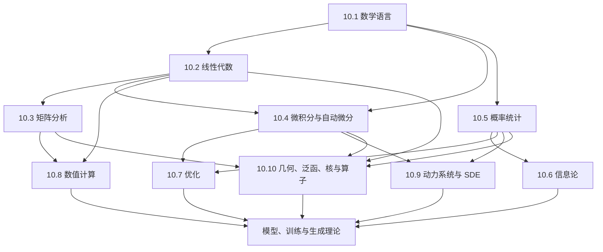

# 数学基础完整课程地图与掌握标准

> [!abstract] 总纲定位
> 本文件是整个数学基础区的**课程合同**：规定学习范围、章节顺序、节点总量、先修依赖、AI 接口、视觉与实验要求，以及何时才能称为“学会”。各分卷 MOC 负责局部导航，本文件负责防止遗漏、重复和无边界扩张。

## 一、培养目标与范围边界

### 1.1 最终能力

完成十卷主干并通过阶段测验后，学习者应能：

1. **读懂对象**：辨认论文中的空间、映射、概率分布、优化变量与动力系统，检查维度、定义域和假设；
2. **重建推导**：不依赖背诵，从定义出发重建关键公式，指出定理条件在哪一步被使用；
3. **正确计算**：既能完成有教学价值的手算，也能为有限精度计算选择稳定算法；
4. **判断边界**：主动检查病态性、不可辨识性、非凸性、分布偏移、渐近条件和离散化误差；
5. **迁移到 AI**：把数学结构对应到表示学习、注意力、生成模型、训练优化、泛化与推断；
6. **进入研究**：能阅读理论论文、复现实验、提出反例，并区分“已有定理”“经验观察”和“待验证猜想”。

### 1.2 收录原则

数学内容进入主干，至少应满足以下一项：

- 是多个 AI 模型共同依赖的语言或工具；
- 能解释模型结构、损失函数、训练算法或生成过程为何成立；
- 能揭示稳定性、泛化性、可辨识性或计算复杂度的边界；
- 是阅读现代 AI 理论论文所必需的先修知识；
- 能形成“定义—推导—反例—实验—AI 迁移”的教学闭环。

不纳入主干：与 AI 没有清晰接口的纯数学专题、只罗列公式的速查表、只讲软件 API 的教程，以及不能追溯到可靠教材或论文的结论。必要但偏专门的内容进入“扩展节点”，不计入 150 个核心节点。

### 1.3 固定规模

| 卷 | 模块 | 核心节点 | 主要角色 |
|---|---|---:|---|
| 10.1 | 数学语言、逻辑与证明 | 8 | 建立定义、量词、证明和渐近语言 |
| 10.2 | 线性代数 | 24 | 建立表示、子空间、投影与谱分解 |
| 10.3 | 矩阵分析 | 16 | 研究矩阵结构、范数、扰动和函数 |
| 10.4 | 多元微积分、矩阵微分与自动微分 | 16 | 建立连续变化与梯度计算语言 |
| 10.5 | 概率论与数理统计 | 20 | 建立不确定性、估计与推断框架 |
| 10.6 | 信息论与统计学习接口 | 10 | 建立信息度量、编码和变分语言 |
| 10.7 | 优化与凸分析 | 16 | 研究目标、约束、算法与收敛 |
| 10.8 | 数值计算与数值线性代数 | 20 | 研究有限精度下的可靠计算 |
| 10.9 | ODE、动力系统与 SDE | 12 | 建立连续深度、流与扩散语言 |
| 10.10 | 几何、泛函分析、核与算子基础 | 8 | 支撑流形、核方法与无限维模型 |
| **合计** |  | **150** | 固定主干；扩展专题另计 |

> [!important] 固定总量、允许微调
> 150 是课程工程的规模约束，不是宣称数学知识只有 150 项。同一概念尽量只有一个主节点，通过双链被多个课程调用；以后若加入新核心节点，必须同时合并或降级一个旧节点，并在本文件记录原因。

## 二、十卷先修依赖

### 推荐学习顺序

1. **第一阶段：语言与有限维结构**——10.1 → 10.2；
2. **第二阶段：变化与矩阵结构**——10.4 与 10.3 可并行，随后进入 10.8；
3. **第三阶段：不确定性与学习**——10.5 → 10.6，同时学习 10.7；
4. **第四阶段：连续模型与高级结构**——10.9 → 10.10；
5. **贯穿全程**——每卷同时完成习题、实验、可视化和 AI 案例，不把它们拖到“理论学完以后”。

## 三、逐卷核心节点

表中 `draft` 表示主笔记已存在但尚未通过完整课程闭环；`planned` 表示范围已经锁定、正文尚待建立。节点所处文件夹是规范化存储位置，概念可被其他 MOC 重复调用，但不重复建正文。

### 10.1 数学语言、逻辑与证明（8）

**卷终能力**：能准确阅读定义和定理，处理量词与集合关系，写出可检查的证明，并理解算法与统计结论中的渐近表述。

| ID | 核心节点 | 层级 | 核心问题 | 状态 |
|---|---|---|---|---|
| MATH-01 | [[集合、元素与集合运算]] | 核心 | 数学对象如何归类、组合和限制？ | draft |
| MATH-02 | [[命题、量词与逻辑等价]] | 核心 | “对所有”与“存在”如何改变命题强度？ | draft |
| MATH-03 | [[必要条件、充分条件与证明方法]] | 核心 | 直接证明、逆否、反证和构造分别何时使用？ | draft |
| MATH-04 | [[函数、映射、关系与等价类]] | 核心 | 定义域、陪域、像、逆像和商结构如何区分？ | draft |
| MATH-05 | [[数学归纳、递归与组合计数]] | 核心 | 离散结构如何递推、计数和证明？ | draft |
| MATH-06 | [[基本不等式与界的构造]] | 核心 | 如何用 Cauchy、Jensen 等工具控制误差和期望？ | draft |
| MATH-07 | [[数列、极限与完备性的直觉]] | 核心 | 收敛意味着什么，极限交换为何需要条件？ | draft |
| MATH-08 | [[渐近记号、增长率与复杂度]] | 核心 | 如何比较算法、误差和样本量的量级？ | draft |

**AI 接口**：复杂度分析、概率界、泛化定理、递归网络、算法证明与论文中的假设阅读。

**最低视觉配置**：一张量词否定图、一张集合/映射关系图、一张增长率对比图；至少一个“错误证明诊断”交互表。

**卷末验收**：[[阶段测验 - 数学语言、逻辑与证明（10.1）]]与[[阶段测验解答 - 数学语言、逻辑与证明（10.1）]]已经以180分钟、100分和A—E分区门槛覆盖MATH-01—08；[[实验 - 数学语言、逻辑与证明累计复现门]]随机验收量词有限反模型、递推误差证书或Attention复杂度制度。当前只记`composed / not-attempted`，不改变上述`draft`状态。

### 10.2 线性代数（24）

**卷终能力**：能在坐标无关和矩阵计算两种视角之间切换，解释线性系统、投影、谱分解和低秩表示，并为 AI 中的表示变换建立共同语言。分阶段施工细节见[[线性代数完整学习路线与掌握标准]]。

| ID | 核心节点 | 层级 | 核心问题 | 状态 |
|---|---|---|---|---|
| LA-01 | [[向量空间]] | 核心 | 什么对象可以进行线性组合？ | draft |
| LA-02 | [[子空间、张成与线性无关]] | 核心 | 一组向量真正提供了多少独立方向？ | draft |
| LA-03 | [[基与坐标]] | 核心 | 同一向量为何能有不同坐标？ | draft |
| LA-04 | [[线性映射]] | 核心 | 线性结构如何在空间之间传递？ | draft |
| LA-05 | [[核、像与秩零化度定理]] | 核心 | 映射丢失和保留了多少信息？ | draft |
| LA-06 | [[四个基本子空间]] | 核心 | 矩阵的行、列、核与左核如何咬合？ | draft |
| LA-07 | [[直和、商空间与不变子空间]] | 进阶 | 如何拆分空间并消去等价方向？ | draft |
| LA-08 | [[线性方程组、消元与 LU 分解]] | 核心 | 方程何时有解、唯一，如何高效求解？ | draft |
| LA-09 | [[迹、行列式与体积]] | 核心 | 线性变换如何改变体积，哪些量保持不变？ | draft |
| LA-10 | [[内积空间]] | 核心 | 长度、角度和相似度从何而来？ | draft |
| LA-11 | [[正交投影]] | 核心 | 如何找到子空间中离目标最近的点？ | draft |
| LA-12 | [[标准正交基与 Gram-Schmidt]] | 核心 | 如何把相关方向变成正交坐标？ | draft |
| LA-13 | [[QR 分解]] | 核心 | 正交结构如何用于稳定求解？ | draft |
| LA-14 | [[最小二乘]] | 核心 | 不相容方程如何得到最佳近似？ | draft |
| LA-15 | [[线性泛函与对偶空间]] | 进阶 | “测量向量的线性规则”本身构成什么空间？ | draft |
| LA-16 | [[伴随算子]] | 进阶 | 映射如何相对内积转移到另一侧？ | draft |
| LA-17 | [[特征分解]] | 核心 | 哪些方向在变换下保持不变？ | draft |
| LA-18 | [[特征多项式与重数]] | 核心 | 代数重数和几何重数为何不同？ | draft |
| LA-19 | [[定理 - 有限维谱定理]] | 核心 | 何时存在正交特征基？ | draft |
| LA-20 | [[广义特征向量与 Jordan 结构]] | 进阶 | 不可对角化时还剩下什么结构？ | draft |
| LA-21 | [[奇异值分解]] | 核心 | 任意线性映射如何分解为旋转与伸缩？ | draft |
| LA-22 | [[Moore-Penrose 伪逆]] | 核心 | 无逆或非方阵时怎样定义规范解？ | draft |
| LA-23 | [[Kronecker 积、向量化与矩阵方程]] | 进阶 | 块结构和矩阵未知量如何转成线性系统？ | draft |
| LA-24 | [[多线性映射、张量与缩并]] | 进阶 | 高阶交互如何用坐标和指标表达？ | draft |

**AI 接口**：词嵌入与表示空间、线性层、注意力、PCA、线性回归、白化、LoRA、谱归一化与参数张量。

**最低视觉配置**：二维/三维子空间、基变换、投影、SVD 椭圆、四个基本子空间和低秩近似各至少一图；QR、最小二乘和 SVD 各至少一个可复现实验。

**卷末验收**：[[阶段测验 - 线性代数（10.2）]]与[[阶段测验解答 - 线性代数（10.2）]]已经以240分钟、100分和A—E分区门槛覆盖LA-01—24；[[实验 - 线性代数累计复现门]]随机验收病态坐标/商与投影、Jordan/SVD或attention-rank/vec轨道。当前只记`composed / not-attempted`，不计为通过，也不改变上述`draft`状态。

### 10.3 矩阵分析（16）

**卷终能力**：能把矩阵视为算子，分析范数、正定性、谱、低秩和扰动；能区分代数上存在、问题本身敏感与算法数值不稳定。

| ID | 核心节点 | 层级 | 核心问题 | 状态 |
|---|---|---|---|---|
| MA-01 | [[矩阵范数]] | 核心 | 如何度量矩阵与线性算子的大小？ | draft |
| MA-02 | [[二次型与正定矩阵]] | 核心 | 矩阵如何编码能量、曲率和局部几何？ | draft |
| MA-03 | [[Rayleigh 商与极值表征]] | 核心 | 特征值如何由优化问题刻画？ | draft |
| MA-04 | [[Cholesky 分解]] | 核心 | 正定结构如何转化为高效稳定分解？ | draft |
| MA-05 | [[条件数]] | 核心 | 输入的微小变化会被问题放大多少？ | draft |
| MA-06 | [[矩阵扰动]] | 核心 | 矩阵改变时解与谱怎样变化？ | draft |
| MA-07 | [[特征向量与子空间扰动定理]] | 进阶 | 谱间隙怎样控制方向的稳定性？ | draft |
| MA-08 | [[定理 - Eckart–Young–Mirsky]] | 核心 | 为什么截断 SVD 是最佳低秩近似？ | draft |
| MA-09 | [[有效秩]] | 核心 | 连续谱中“有用维数”怎样定义？ | draft |
| MA-10 | [[Schur 分解]] | 进阶 | 不可对角化矩阵能否获得稳定的正交表示？ | draft |
| MA-11 | [[极分解]] | 进阶 | 一般矩阵如何分为等距部分与正半定部分？ | draft |
| MA-12 | [[矩阵符号函数]] | 进阶 | 矩阵函数怎样编码稳定子空间与极分解？ | draft |
| MA-13 | [[矩阵函数与矩阵指数]] | 进阶 | 如何把标量函数一致地作用到矩阵？ | draft |
| MA-14 | [[矩阵函数的 Fréchet 导数]] | 进阶 | 矩阵函数对扰动的一阶响应是什么？ | draft |
| MA-15 | [[非正规矩阵、预解式与伪谱]] | 进阶 | 特征值为何可能严重低估瞬态放大？ | draft |
| MA-16 | [[结构化矩阵与结构化扰动]] | 进阶 | 对称、Toeplitz、稀疏等结构如何改变理论与算法？ | draft |

**AI 接口**：协方差与 Hessian、谱归一化、低秩压缩、矩阵函数优化器、状态空间模型、稳定性分析和参数高效微调。

**最低视觉配置**：二次型等高线、奇异值谱、谱间隙扰动、极分解、伪谱各至少一图；条件数、低秩逼近和非正规瞬态放大各至少一个实验。

**卷末验收**：[[阶段测验 - 矩阵分析（10.3）]]与[[阶段测验解答 - 矩阵分析（10.3）]]已经以270分钟、100分和A—E分区门槛覆盖MA-01—16；[[实验 - 矩阵分析累计复现门]]随机验收正定变分、扰动/非正规或matrix-function/structure轨道。当前只记`composed / not-attempted`，不计为通过，也不改变上述`draft`状态。

### 10.4 多元微积分、矩阵微分与自动微分（16）

**卷终能力**：能从局部线性化理解导数，正确处理向量和矩阵变量，推导梯度、Jacobian 与 Hessian，并解释现代自动微分系统真正计算的对象。

| ID | 核心节点 | 层级 | 核心问题 | 状态 |
|---|---|---|---|---|
| CALC-01 | [[函数极限、连续性与收敛模式]] | 核心 | 局部逼近何时可靠，不同收敛概念有何差别？ | draft |
| CALC-02 | [[一元导数与中值定理]] | 核心 | 瞬时变化率如何控制有限区间变化？ | draft |
| CALC-03 | [[Taylor 展开与余项]] | 核心 | 局部多项式近似的误差怎样量化？ | draft |
| CALC-04 | [[多元函数、偏导数与方向导数]] | 核心 | 多个输入方向上的变化如何组织？ | draft |
| CALC-05 | [[全微分与 Fréchet 导数]] | 核心 | “最佳线性近似”如何统一各种导数？ | draft |
| CALC-06 | [[梯度、方向导数与最陡方向]] | 核心 | 梯度为何依赖内积，何时才是最陡上升？ | draft |
| CALC-07 | [[Jacobian、JVP 与 VJP]] | 核心 | 向量函数的一阶传播如何高效计算？ | draft |
| CALC-08 | [[Hessian、二阶微分与曲率]] | 核心 | 局部曲率如何决定优化与不确定性？ | draft |
| CALC-09 | [[多元链式法则与计算图]] | 核心 | 复合函数的局部线性化如何组合？ | draft |
| CALC-10 | [[矩阵微分、迹技巧与布局约定]] | 核心 | 矩阵变量的导数如何避免形状和转置错误？ | draft |
| CALC-11 | [[逆矩阵、线性求解与隐式微分]] | 进阶 | 求解器输出对参数如何求导？ | draft |
| CALC-12 | [[行列式、log-det 与迹的导数]] | 进阶 | 高斯模型和体积变换中的核心导数从何而来？ | draft |
| CALC-13 | [[特征值、特征向量与 SVD 的导数]] | 进阶 | 谱分解何时可微，重根处为何危险？ | draft |
| CALC-14 | [[逆函数定理与隐函数定理]] | 进阶 | 局部可逆性和约束解的导数如何保证？ | draft |
| CALC-15 | [[多重积分、换元公式与积分变换]] | 核心 | 密度和期望在变量变换下如何变化？ | draft |
| CALC-16 | [[自动微分：前向、反向与高阶模式]] | 核心 | AD 与符号微分、数值差分究竟有何不同？ | draft |

**AI 接口**：反向传播、注意力与归一化层求导、隐式层、元学习、正规化流、二阶优化和可微分编程。

**最低视觉配置**：切线/切平面、梯度场、Hessian 等高线、计算图与 Jacobian 传播各至少一图；手工反向传播、梯度检查和隐式微分各至少一个实验。

**卷末验收**：[[阶段测验 - 多元微积分、矩阵微分与自动微分（10.4）]]与[[阶段测验解答 - 多元微积分、矩阵微分与自动微分（10.4）]]已经以270分钟、100分和A—E分区门槛覆盖CALC-01—16；[[实验 - 微积分、矩阵微分与自动微分累计复现门]]随机验收Taylor/finite-difference、JVP/VJP/HVP或implicit/spectral轨道。当前只记`composed / not-attempted`，不改变上述`draft`状态。

### 10.5 概率论与数理统计（20）

**卷终能力**：能用测度化但初学者可进入的语言处理随机性，理解常用分布、极限定理、估计和贝叶斯推断，并判断统计结论依赖哪些假设。

| ID | 核心节点 | 层级 | 核心问题 | 状态 |
|---|---|---|---|---|
| PROB-01 | [[样本空间、事件与概率公理]] | 核心 | 随机试验怎样成为可计算的数学对象？ | draft |
| PROB-02 | [[条件概率、全概率与 Bayes 公式]] | 核心 | 新证据如何更新事件概率？ | draft |
| PROB-03 | [[随机变量、分布与分位数]] | 核心 | 随机结果如何映射为可分析的数值？ | draft |
| PROB-04 | [[联合分布、边缘分布与独立性]] | 核心 | 多个随机量之间的依赖怎样表达？ | draft |
| PROB-05 | [[期望、方差与矩]] | 核心 | 分布的中心、波动和形状怎样概括？ | draft |
| PROB-06 | [[协方差、相关性与条件期望]] | 核心 | 线性依赖和最优平方预测如何联系？ | draft |
| PROB-07 | [[常用离散分布]] | 核心 | Bernoulli、Binomial、Poisson 分别描述什么机制？ | draft |
| PROB-08 | [[常用连续分布与指数族]] | 核心 | Gaussian、Gamma 等分布为何反复出现？ | draft |
| PROB-09 | [[多元高斯分布]] | 核心 | 均值与协方差如何完整决定高斯几何？ | draft |
| PROB-10 | [[随机变量变换与密度换元]] | 核心 | 非线性变换怎样改变概率密度？ | draft |
| PROB-11 | [[随机变量的收敛与大数定律]] | 核心 | 样本平均为何以及以何种意义稳定？ | draft |
| PROB-12 | [[中心极限定理与 Delta 方法]] | 核心 | 标准化误差为何趋近高斯？ | draft |
| PROB-13 | [[浓缩不等式]] | 进阶 | 有限样本偏离期望的概率如何控制？ | draft |
| PROB-14 | [[Monte Carlo、重要性采样与方差缩减]] | 核心 | 难以解析的期望如何数值估计？ | draft |
| PROB-15 | [[统计模型、估计量与偏差方差]] | 核心 | 一个估计程序应该用什么标准评价？ | draft |
| PROB-16 | [[最大似然估计与 MAP]] | 核心 | 数据拟合和先验正则如何统一？ | draft |
| PROB-17 | [[Fisher 信息、Cramér–Rao 界与渐近正态性]] | 进阶 | 参数估计精度的理论极限是什么？ | draft |
| PROB-18 | [[Bayesian 推断与后验预测]] | 核心 | 参数不确定性如何保留并传播到预测？ | draft |
| PROB-19 | [[假设检验、置信区间与多重比较]] | 核心 | 证据强度、错误率和区间覆盖如何区分？ | draft |
| PROB-20 | [[MCMC 与随机模拟诊断]] | 进阶 | 无法直接采样的后验如何逼近并验证？ | draft |

**AI 接口**：概率建模、分类与校准、语言模型似然、VAE、贝叶斯深度学习、不确定性估计、采样和离线评估。

**最低视觉配置**：条件概率树、分布族、协方差椭圆、LLN/CLT、后验更新和 MCMC 轨迹各至少一图；Monte Carlo、MLE/MAP 和覆盖率各至少一个实验。

**卷末验收**：[[阶段测验 - 概率论与数理统计（10.5）]]与[[阶段测验解答 - 概率论与数理统计（10.5）]]已经以 100 分、A—E 分区门槛覆盖 PROB-01—20；[[实验 - 概率统计累计复现门]]随机验收 coverage、importance sampling 或多链 MCMC。当前只记 `composed / not-attempted`，不计为通过，也不改变上述 `draft` 状态。

### 10.6 信息论与统计学习接口（10）

**卷终能力**：能从不确定性减少、编码长度和分布差异三个视角理解熵、KL 与互信息，掌握变分目标和信息瓶颈等 AI 高频接口。

| ID | 核心节点 | 层级 | 核心问题 | 状态 |
|---|---|---|---|---|
| INFO-01 | [[自信息、熵与编码长度]] | 核心 | 不确定性为什么能用平均码长度量？ | draft |
| INFO-02 | [[联合熵、条件熵与链式法则]] | 核心 | 多变量信息如何拆分和组合？ | draft |
| INFO-03 | [[交叉熵与 KL 散度]] | 核心 | 用错误分布编码会多付出多少代价？ | draft |
| INFO-04 | [[互信息与依赖性]] | 核心 | 一个变量知道多少关于另一个变量的信息？ | draft |
| INFO-05 | [[数据处理不等式与充分统计量]] | 核心 | 后处理为何不能凭空增加信息？ | draft |
| INFO-06 | [[无损编码、典型集与渐近等分性]] | 核心 | 长序列的可压缩性从何而来？ | draft |
| INFO-07 | [[最大熵原理与指数族]] | 进阶 | 只保留已知约束时最少偏见的分布是什么？ | draft |
| INFO-08 | [[变分推断、ELBO 与证据分解]] | 核心 | 难算后验如何转化为可优化下界？ | draft |
| INFO-09 | [[f-散度、Bregman 散度与概率度量]] | 进阶 | 不同分布差异度量分别强调什么？ | draft |
| INFO-10 | [[率失真、信息瓶颈与最小描述长度]] | 进阶 | 压缩、预测和泛化如何由信息约束连接？ | draft |

**AI 接口**：交叉熵训练、蒸馏、VAE、对比学习、表示压缩、互信息估计、MDL 和泛化分析。

**最低视觉配置**：编码树、熵与概率曲线、KL 非对称性、信息流图和率失真曲线各至少一图；经验交叉熵、互信息估计偏差和 ELBO gap 各至少一个实验。

**卷末验收**：[[阶段测验 - 信息论与统计学习接口（10.6）]]与[[阶段测验解答 - 信息论与统计学习接口（10.6）]]以 100 分、A—E 分区门槛覆盖 INFO-01—10；[[实验 - 信息论累计复现门]]随机验收 Bernoulli–Hamming 前沿、task/nuisance bottleneck 或 prequential code。当前只记 `composed / not-attempted`，不改变上述 `draft` 状态。

### 10.7 优化与凸分析（16）

**卷终能力**：能把训练写成明确的优化问题，判断凸性、光滑性和约束结构；能推导一阶、二阶与近端方法，解释收敛保证与深度学习实践之间的距离。局部路线、依赖图和施工批次见[[优化与凸分析 MOC]]。

| ID | 核心节点 | 层级 | 核心问题 | 状态 |
|---|---|---|---|---|
| OPT-01 | [[优化问题、可行域与局部最优]] | 核心 | 变量、目标、约束和解概念如何完整定义？ | draft |
| OPT-02 | [[凸集、凸组合与分离超平面]] | 核心 | 可行域几何如何决定全局结构？ | draft |
| OPT-03 | [[凸函数、Jensen 不等式与上图集]] | 核心 | 局部信息何时足以保证全局最优？ | draft |
| OPT-04 | [[次梯度、共轭函数与 Fenchel 对偶]] | 进阶 | 不光滑目标如何微分和对偶化？ | draft |
| OPT-05 | [[光滑性、强凸性与条件数]] | 核心 | 曲率上下界如何控制优化难度？ | draft |
| OPT-06 | [[一阶最优性条件与梯度下降]] | 核心 | 为什么沿负梯度更新，步长如何选择？ | draft |
| OPT-07 | [[加速梯度、动量与下界]] | 进阶 | 惯性为何可能改善最坏情形收敛率？ | draft |
| OPT-08 | [[随机梯度与小批量估计]] | 核心 | 梯度噪声如何影响速度、稳定性和泛化？ | draft |
| OPT-09 | [[自适应优化方法]] | 核心 | 坐标缩放与动量如何形成 AdaGrad、RMSProp、Adam？ | draft |
| OPT-10 | [[Newton 法、Gauss-Newton 与拟 Newton 法]] | 进阶 | 二阶曲率怎样改善局部收敛？ | draft |
| OPT-11 | [[投影、约束与可行方向]] | 核心 | 更新离开可行域后如何恢复？ | draft |
| OPT-12 | [[Lagrange 乘子与 KKT 条件]] | 核心 | 约束最优点如何由梯度平衡刻画？ | draft |
| OPT-13 | [[弱对偶、强对偶与 Slater 条件]] | 进阶 | 原问题和对偶问题何时给出同一个值？ | draft |
| OPT-14 | [[近端算子、复合优化与稀疏正则]] | 进阶 | 光滑损失与不光滑正则如何分开处理？ | draft |
| OPT-15 | [[镜像下降、Bregman 几何与自然梯度]] | 进阶 | 非欧几里得几何如何改变“最陡”方向？ | draft |
| OPT-16 | [[非凸优化、鞍点与深度网络损失地形]] | 进阶 | 无全局凸性时还能证明和观察什么？ | draft |

**AI 接口**：神经网络训练、AdamW、梯度裁剪、稀疏化、约束生成、自然梯度、二阶优化和规模律实验。

**最低视觉配置**：凸集、损失等高线、梯度轨迹、对偶几何、近端阈值和鞍点各至少一图；学习率稳定区、SGD 噪声、Adam 与二阶方法各至少一个实验。

**卷末验收**：[[阶段测验 - 优化与凸分析（10.7）]]与[[阶段测验解答 - 优化与凸分析（10.7）]]以 100 分、A—E 分区门槛覆盖 OPT-01—16；[[实验 - 优化与凸分析累计复现门]]随机验收 strict-saddle escape、nonconvex PL 或 scale-symmetry sharpness。当前只记 `composed / not-attempted`，不改变上述 `draft` 状态。

### 10.8 数值计算与数值线性代数（20）

**卷终能力**：能区分建模误差、数据扰动、舍入误差和算法误差；能以稳定性、复杂度和结构利用为标准选择矩阵算法，而不是把数学公式直接翻译成代码。局部路线见[[数值线性代数 MOC]]。

| ID | 核心节点 | 层级 | 核心问题 | 状态 |
|---|---|---|---|---|
| NUM-01 | [[浮点数与舍入误差]] | 核心 | 计算机为何不能精确表示多数实数？ | draft |
| NUM-02 | [[前向误差与后向误差]] | 核心 | 计算结果应与真解比，还是与邻近问题的精确解比？ | draft |
| NUM-03 | [[数值稳定性]] | 核心 | 一个算法何时可视为在有限精度下可靠？ | draft |
| NUM-04 | [[误差传播、条件估计与停止准则]] | 核心 | 局部误差怎样放大，何时应该停止迭代？ | draft |
| NUM-05 | [[稳定求和、点积与矩阵乘法]] | 核心 | 基础算子中的误差如何累积和控制？ | draft |
| NUM-06 | [[稳定求解线性方程组]] | 核心 | 选主元、增长因子、后向误差与条件估计怎样组成可靠求解链？ | draft |
| NUM-07 | [[迭代改进、混合精度与残差校正]] | 进阶 | 低精度计算怎样借高精度残差恢复准确性？ | draft |
| NUM-08 | [[Householder 与 Givens 变换]] | 核心 | 反射与平面旋转怎样构造后向稳定 QR，并适配稠密、稀疏与 AI 正交化？ | draft |
| NUM-09 | [[稳定最小二乘与正规方程的风险]] | 核心 | 为什么形成 $A^\top A$ 会平方条件数？ | draft |
| NUM-10 | [[幂法、反幂法与 Rayleigh 商迭代]] | 核心 | 如何只求最需要的特征对？ | draft |
| NUM-11 | [[Hessenberg 化与 QR 特征值算法]] | 进阶 | 稠密矩阵的全部特征值怎样稳定计算？ | draft |
| NUM-12 | [[Lanczos 方法]] | 进阶 | 对称大矩阵怎样压缩为三对角问题？ | draft |
| NUM-13 | [[Arnoldi 方法]] | 进阶 | 非对称大矩阵怎样构造 Krylov 正交基？ | draft |
| NUM-14 | [[SVD 算法与谱范数估计]] | 进阶 | 奇异值如何在不显式形成病态乘积时计算？ | draft |
| NUM-15 | [[定常迭代法与谱半径]] | 核心 | Jacobi、Gauss-Seidel 等方法为何收敛或发散？ | draft |
| NUM-16 | [[Krylov 子空间与预条件]] | 核心 | 如何用低维子空间和坐标变换加速求解？ | draft |
| NUM-17 | [[共轭梯度法]] | 核心 | 对称正定系统为何可在共轭方向中快速求解？ | draft |
| NUM-18 | [[GMRES、MINRES 与残差最小化]] | 进阶 | 非对称或不定系统如何选择迭代求解器？ | draft |
| NUM-19 | [[稀疏矩阵计算与存储复杂度]] | 核心 | 如何利用稀疏结构避免时间和内存爆炸？ | draft |
| NUM-20 | [[随机化低秩近似与随机 SVD]] | 进阶 | 大规模矩阵如何用随机投影寻找主子空间？ | draft |

**AI 接口**：混合精度训练、稳定 softmax/归一化、分布式矩阵乘、二阶优化、谱估计、大模型低秩压缩和线性注意力。

**最低视觉配置**：浮点间距、消去误差、前后向误差、残差收敛、Krylov 子空间和随机低秩误差各至少一图；每种算法节点都必须给出复杂度表和失败案例。

**卷末验收**：[[阶段测验 - 数值计算与数值线性代数（10.8）]]与[[阶段测验解答 - 数值计算与数值线性代数（10.8）]]已经覆盖 NUM-01—20；[[实验 - 数值线性代数累计复现门]]先做五波解析校准，再从 rounding/conditioning、mixed-precision refinement 或 nonnormal Krylov 三轨中随机验收，并附带 15 分钟无提示口试。材料合同已通过确定性回归，记为 `regression-passed / not-attempted`；它不等于阶段测验通过，也不改变上述 `draft` 状态。

### 10.9 ODE、动力系统与 SDE（12）

**卷终能力**：能用连续时间系统理解深层网络、残差流、生成流和扩散过程；能区分连续模型的理论性质与离散数值求解器带来的性质。

| ID | 核心节点 | 层级 | 核心问题 | 状态 |
|---|---|---|---|---|
| DYN-01 | [[常微分方程、初值问题与解的存在唯一性]] | 核心 | 一个连续时间演化何时定义良好？ | draft |
| DYN-02 | [[线性 ODE 与矩阵指数]] | 核心 | 线性系统的时间演化怎样由谱控制？ | draft |
| DYN-03 | [[相图、平衡点与局部稳定性]] | 核心 | 轨迹长期趋向何处，线性化能说明什么？ | draft |
| DYN-04 | [[Lyapunov 稳定性与能量函数]] | 进阶 | 不显式求解轨迹时如何证明稳定？ | draft |
| DYN-05 | [[Euler、Runge-Kutta 与离散化误差]] | 核心 | 连续方程怎样成为可计算迭代？ | draft |
| DYN-06 | [[刚性系统、绝对稳定域与隐式方法]] | 进阶 | 为什么某些稳定系统仍迫使显式步长极小？ | draft |
| DYN-07 | [[流映射、Liouville 公式与连续正规化流]] | 进阶 | 可逆动力系统如何搬运密度？ | draft |
| DYN-08 | [[连续性方程与守恒律]] | 核心 | 概率质量在向量场下如何守恒？ | draft |
| DYN-09 | [[随机过程、Brownian 运动与二次变差]] | 核心 | 连续时间随机噪声应如何数学化？ | draft |
| DYN-10 | [[Itô 引理与随机微分方程]] | 核心 | 随机轨迹上的链式法则为何多出二阶项？ | draft |
| DYN-11 | [[Fokker-Planck 方程与概率流 ODE]] | 进阶 | 随机轨迹的分布如何随时间演化？ | draft |
| DYN-12 | [[时间反演、score 与扩散生成动力学]] | 进阶 | 加噪过程怎样反演为数据生成过程？ | draft |

**当前教学迁移**：DYN-01—08 已完成前三波初学者路线。第一波用欠阻尼振子贯通适定性、矩阵指数、稳定与 Lyapunov 证书；第二波用标量衰减和快慢系统贯通 order、stability function、刚性与隐式代价；第三波用 $\operatorname{diag}(1,-2)x+(1,0)^T$ 及其推前 Gaussian 贯通 flow、Jacobian、Liouville、CNF、continuity PDE、弱形式、矩与 entropy。扩展审计对 8/8 教学合同、221 条作用域内 Wiki 链接、8 个图文单元、8 幅正式 SVG 和三波精确模型断言均已回归通过；DYN-09—12 仍排队等待同标准迁移。这里的 `regression-passed` 只描述材料，十二篇正文仍为 `draft`，个人学习仍为 `not-attempted`。

**AI 接口**：ResNet/Neural ODE、状态空间模型、连续正规化流、扩散模型、score matching 和采样器设计。

**最低视觉配置**：相图、稳定域、离散化误差、SDE 样本路径、Fokker–Planck 密度演化和扩散反演各至少一图；不同 ODE/SDE 求解器必须有步长—误差—成本对比实验。

**卷末验收**：[[阶段测验 - ODE、动力系统与 SDE（10.9）]]与[[阶段测验解答 - ODE、动力系统与 SDE（10.9）]]以 240 分钟、100 分和 A—E 分区门槛覆盖 DYN-01—12；[[实验 - ODE、动力系统与 SDE 累计复现门]]随机验收 continuous/discrete stability、FPE–PF–CNF density ledger 或 Brownian–Itô–reverse-score coefficient。当前只记 `composed / not-attempted`，不改变上述 `draft` 状态。

### 10.10 几何、泛函分析、核与算子基础（8）

**卷终能力**：在有限维主干之上获得进入流形学习、几何深度学习、核方法和神经算子所需的最小高级数学闭包；强调可用概念，不追求纯数学百科化。

| ID | 核心节点 | 层级 | 核心问题 | 状态 |
|---|---|---|---|---|
| GEO-01 | [[度量空间、拓扑与连续映射]] | 进阶 | 距离、邻域、开集和连续性怎样脱离坐标定义？ | draft |
| GEO-02 | [[光滑流形、切空间与余切空间]] | 进阶 | 弯曲空间如何在局部近似为线性空间？ | draft |
| GEO-03 | [[Riemann 几何、测地线与流形优化]] | 进阶 | 内积随位置变化时距离、梯度和最短路如何定义？ | draft |
| GEO-04 | [[Lie 群、Lie 代数与对称性]] | 进阶 | 连续对称变换如何连接群结构与局部生成元？ | draft |
| GEO-05 | [[Banach 空间、Hilbert 空间与正交投影]] | 进阶 | 有限维线性代数怎样推广到函数空间？ | draft |
| GEO-06 | [[有界算子、紧算子与谱理论基础]] | 进阶 | 无限维算子的谱与有限维矩阵有何相同和不同？ | draft |
| GEO-07 | [[正定核、RKHS 与表示定理]] | 进阶 | 相似度函数怎样隐式定义特征空间与最优预测器？ | draft |
| GEO-08 | [[弱导数、Sobolev 空间与神经算子接口]] | 进阶 | 不光滑函数和算子学习需要什么最小分析语言？ | draft |

**AI 接口**：核方法、Gaussian process、图与等变网络、流形表示、自然梯度、物理信息神经网络和神经算子。

**最低视觉配置**：流形图册、切空间、测地线、群作用、核特征映射和算子谱各至少一图；核技巧、球面/正定矩阵流形优化与函数算子逼近各至少一个实验。

**卷末验收**：[[阶段测验 - 几何、泛函分析、核与算子基础（10.10）]]与[[阶段测验解答 - 几何、泛函分析、核与算子基础（10.10）]]以210分钟、100分和A—E分区门槛覆盖GEO-01—08；[[实验 - 几何、泛函与算子累计复现门]]随机验收sphere geometry/symmetry、Hilbert–compact–RKHS或weak-PDE/operator轨道。当前只记`composed / not-attempted`，不改变上述`draft`状态。

## 四、每个节点的四层教学结构

每个核心节点必须按照[[00-课程教学与研究总纲]]形成四层递进；不能只完成公式抄录。

| 层 | 初学者要回答的问题 | 正文最低内容 | 验证方式 |
|---|---|---|---|
| 第一层：直觉与问题 | 为什么需要它？它解决什么失败？ | 动机、生活化/几何直觉、最小例子、术语地图 | 能用自己的话解释并识别对象 |
| 第二层：严谨理论 | 精确定义是什么？结论依赖哪些条件？ | 定义、定理、逐步推导、条件使用点、反例 | 闭卷重建关键推导或证明骨架 |
| 第三层：数值与计算 | 在有限精度和有限样本下怎样计算？ | 算法、复杂度、误差来源、稳定性、最小手算或代码实验 | 复现实验并解释异常结果 |
| 第四层：AI 与研究 | 在模型里哪里调用？前沿工作怎样扩展它？ | 至少两个 AI 接口、一个失败边界、论文回链、开放问题 | 完成迁移题或小型研究任务 |

## 五、掌握层级与完成定义

### 5.1 学习者掌握层级

| 等级 | 能力表现 | 不足以通过的表现 |
|---|---|---|
| L0 识别 | 能说出对象类型、符号和基本用途 | 只见过名词 |
| L1 解释 | 能从直觉和最小例子解释概念 | 只能复述定义原句 |
| L2 计算 | 能完成典型手算、检查维度和实现基础算法 | 只会套一个固定公式 |
| L3 推导 | 能从定义重建核心结论，说明每个假设的作用 | 背诵证明但不能修改条件 |
| L4 判断 | 能处理反例、病态情况、误差和方法选择 | 默认所有条件都成立 |
| L5 迁移 | 能把概念用于陌生 AI 模型或论文，并设计验证 | 只能识别笔记中出现过的案例 |
| L6 研究 | 能比较多种理论、复现实验、提出可证伪问题 | 把经验现象误写成定理 |

核心节点的最低毕业线是 **L4**；每卷至少 30% 的节点达到 **L5**；全课程综合项目达到 **L6**。

### 5.2 笔记状态与课程完成度

| 状态 | 课程含义 | 必须满足 |
|---|---|---|
| `seed` / `planned` | 已进入范围或只有材料线索 | 有唯一标题、归属卷、先修和 AI 接口 |
| `draft` | 主体可学习，但尚未形成证据闭环 | 四层正文基本齐全，至少一个例子、一个反例、可靠来源和 MOC 双链 |
| `verified` | 可作为正式课程节点使用 | A–E 习题与解答、手算/实验、视觉资产、链接与公式检查、阶段复查全部通过 |
| `mature` | 经多轮学习和研究使用仍稳定 | 多来源交叉核验、与后续节点和论文形成稳定调用、已吸收反馈并记录版本变化 |

> [!warning] 两种“完成”不能混用
> “正文已写”只足以成为 `draft`；只有习题、解答、实验/手算、视觉、来源、链接和复查全部闭环，才可以升级为 `verified`。课程进度必须同时报告“正文覆盖率”和“闭环通过率”。

### 5.3 单节点 Definition of Done

每个核心节点至少交付：

- 一篇主笔记，包含动机、先修、定义、推导、例子、反例、数值边界、AI 接口、总结和参考资料；
- 一份 A–E 五层习题：识别、计算、推导/证明、反例/边界、AI 迁移；
- 一份完整解答，明确评分点与常见错误；
- 至少一项可验证证据：有意义的手算、可复现实验或数值对照；
- 至少一幅真正承担解释任务的图，不使用纯装饰图片；
- 与前置、后续、同义概念、模型节点和来源节点形成双链；
- 通过公式、链接、资源路径和实验复现检查。

## 六、习题、实验、图像与测验体系

### 6.1 习题配额

- 每个节点至少 5 题，对应 A–E 五个层级；核心定理节点可扩展到 8–12 题；
- 每卷至少一组累计复习题，强制调用此前两卷的知识；
- 每个常见误区必须至少有一道“判断或构造反例”题；
- AI 迁移题不能只问名词对应，必须要求推导、诊断或实验设计。

### 6.2 实验与手算

- 每个节点至少有一项手算或实验；能用 2×2、3×3 例子揭示结构时，优先手算；
- 数值算法、统计估计、优化和动力系统节点必须有可执行实验；
- 实验固定包含：问题、假设、环境、代码入口、随机种子、指标、图表、观察、解释、失败边界；
- 代码放入 `00-知识库管理/_labs/code/`，实验记录放入 `00-知识库管理/_labs/experiments/`，不把长代码直接塞进正文。

### 6.3 图文规范

图像必须回答一个具体问题，并在正文中出现“读图说明”。统一使用：

- **Mermaid**：先修依赖、算法流程、证明结构与模型信息流；
- **SVG/示意图**：向量几何、矩阵变换、概率区域、流形和计算图；
- **可复现曲线图**：误差、谱、收敛、概率密度、相图与消融对比；
- **表格**：定义对照、假设—结论映射、算法复杂度和方法选择；
- 静态解释图放入 `00-知识库管理/_assets/figures/<topic>/`；实验曲线放入 `00-知识库管理/_assets/plots/<topic>/`；
- 所有图片必须有可读文件名、alt 文本、图题、来源/生成方式，不以截图代替公式和结构化文本。

### 6.4 十份分卷验收与一份总验收

早期 A—E 五阶段规划现已细化为可定位、可错题回链的 **10 份分卷累计测验 + 1 份跨卷总验收**：

| 层 | 数量 | 作用 | 通过原则 |
|---|---:|---|---|
| 分卷累计测验 | 10 | 保证每卷 ID 的纵向定义、手算、证明、反例和 AI 迁移覆盖 | 总分与 A—E 分区线同时达标；主证明不得为 0；计算门通过 |
| 跨卷总验收 | 1 | 检查陌生问题中多卷协同、证据分层与研究合同 | [[数学基础十卷总验收 - 跨卷理论与 AI 迁移]]达 80 分和五区线；三条主证明、三项系统案例、随机实验与口试同时达线 |

完整登记、十份分卷累计门和当前真实状态见[[数学基础十卷完备性审计与学习状态总表]]。总验收不能替代分卷验收；未通过某一能力维度时，只补修对应节点与题型，但在补测通过前，下游节点只记“已接触”，不记“已掌握”。

## 七、施工顺序与版本治理

### 7.1 当前施工主线

1. 十卷 150 节点正文、A—E 习题、独立解答和十份分卷累计验收工具均已组成；
2. [[数学基础十卷完备性审计与学习状态总表]]已建立权威 ID、标题规范化、十份分卷累计门和学习状态审计；
3. [[数学基础十卷总验收 - 跨卷理论与 AI 迁移]]、独立详解与[[实验 - 数学基础十卷跨章累计复现门]]已经组成；
4. 当前不再以“继续生成正文”伪装进度；下一主线是按先修顺序留下真实闭卷、实验干预、48 小时重做、14 天迁移与口头解释证据；
5. 前沿新增内容进入统计学习、高维概率、逼近/训练动力学、最优传输、因果决策或图离散等上层专题，不回填并膨胀固定 150 节点。

### 7.2 每轮施工流程

### 7.3 变更规则

- 新增核心节点前，先检查是否能并入现有节点或作为扩展专题；
- 调整编号、标题或文件位置时，必须同步所有 MOC、习题、解答、实验和来源反链；
- 概念的“课程归属”与“物理文件夹”暂时不一致时，以唯一正文为准，不复制笔记；
- 每完成一卷，进行一次跨卷依赖审计；每完成一个阶段，进行一次课程规模与难度审计；
- 研究前沿以“扩展节点”接入，经过至少两次下游调用后，才讨论是否升级为核心节点。

## 八、当前基线（2026-08-27）

| 指标 | 当前值 | 解释 |
|---|---:|---|
| 锁定的核心节点 | 150 | 十卷范围已经明确 |
| 已有数学正文 | 150 | 10.1 有 8 篇；10.2 有 24 篇、10.3 有 16 篇、10.4 有 16 篇、10.5 有 20 篇、10.6 有 10 篇、10.7 有 16 篇、10.8 有 20 篇、10.9 有 12 篇、10.10 有 8 篇 |
| 正文覆盖率 | 100.0% | `150 / 150`，均仍为 `draft` |
| 配套习题 / 解答 | 150 / 150 | 规范化两个 `定理 - ` 前缀后均可唯一定位 |
| 分卷验收链 | 10 / 10 | 十份题卷、十份独立详解与十个专门累计复现实验 |
| 跨卷总验收链 | 1 / 1 | 题卷、独立详解、三轨实验与统一图均已建立 |
| 待建正文 | 0 | 十卷核心正文范围已全部覆盖；真实学习证据仍待推进 |
| 已完成分卷 | 0 | “有正文”不等于整卷通过 |
| 下一施工点 | 真实学习证据与上层专题设计 | 先按先修顺序完成分卷闭卷与复现；十卷均通过后再做 `MATH-FND-CAP-01` |

现有文件夹中，[[Schur 分解]]与[[矩阵函数与矩阵指数]]物理上仍位于 `10.2-线性代数`，而课程归属记在 10.3；[[奇异值分解]]与[[Moore-Penrose 伪逆]]物理上位于 `10.3-矩阵分析`，而课程归属记在 10.2。为避免破坏既有双链，本阶段不移动文件；待完成统一链接迁移工具后再处理目录规范化。

十卷均已具有完整卷级验收链；跨卷总验收又把 linear-Gaussian-information、optimization-dynamics-numerics 与 geometry-RKHS-operator 接缝纳入同一证据合同。机械审计确认 150 个 ID、正文、习题和解答均唯一可定位。全库状态仍为 `composed / not-attempted`，因为没有首次闭卷原稿、真实评分、参数干预和间隔重做，“已完成分卷”仍记为 0；详细边界与后续上层专题见[[数学基础十卷完备性审计与学习状态总表]]。

## 九、权威参照与使用方式

本总纲的数学范围参考了面向机器学习的大学课程组合，而不是照抄单一本教材：

- [MIT 18.065 Matrix Methods in Data Analysis, Signal Processing, and Machine Learning](https://ocw.mit.edu/courses/18-065-matrix-methods-in-data-analysis-signal-processing-and-machine-learning-spring-2018/)：矩阵方法、概率统计、优化与机器学习之间的连接；
- [MIT 18.S096 Matrix Calculus for Machine Learning and Beyond](https://ocw.mit.edu/courses/18-s096-matrix-calculus-for-machine-learning-and-beyond-january-iap-2023/)：矩阵微积分、分解求导与大规模可微计算；
- [CMU 04-650 Mathematical Foundations for Machine Learning](https://www.africa.engineering.cmu.edu/academics/courses/04-650.html)：线性代数、微积分、概率、优化、信息论、统计推断、正则化与核方法；
- [CMU Machine Learning prerequisites](https://www.ml.cmu.edu/academics/ml-intro-classes.html)：概率统计、线性代数、多元微积分、离散数学与证明能力。

教材和论文的具体版本、章节与页码记录在各节点 `sources` 字段及来源笔记中。科学空间文章作为问题意识、推导线索和研究接口使用；关键定义和定理仍需回到教材或原论文交叉验证。

## 十、导航

- 总入口：[[数学基础 MOC]]
- 完备性与真实状态：[[数学基础十卷完备性审计与学习状态总表]]
- 十卷总出口：[[数学基础十卷总验收 - 跨卷理论与 AI 迁移]] · [[数学基础十卷总验收解答 - 跨卷理论与 AI 迁移]] · [[实验 - 数学基础十卷跨章累计复现门]]
- 当前已展开路线：[[线性代数完整学习路线与掌握标准]]
- 分卷入口：[[线性代数 MOC]] · [[矩阵分析 MOC]] · [[数值线性代数 MOC]]
- 课程准则：[[00-课程教学与研究总纲]] · [[05-质量门槛与检查清单]]
- 实践闭环：[[练习与测验 MOC]] · [[推导与实验 MOC]]
- 全库范围：[[01-范围与章节]]
